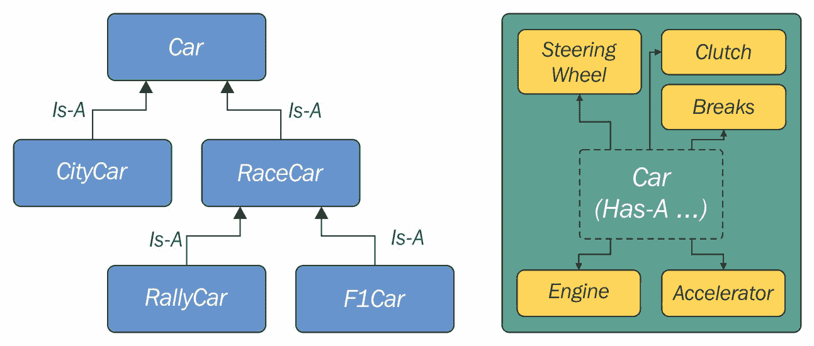
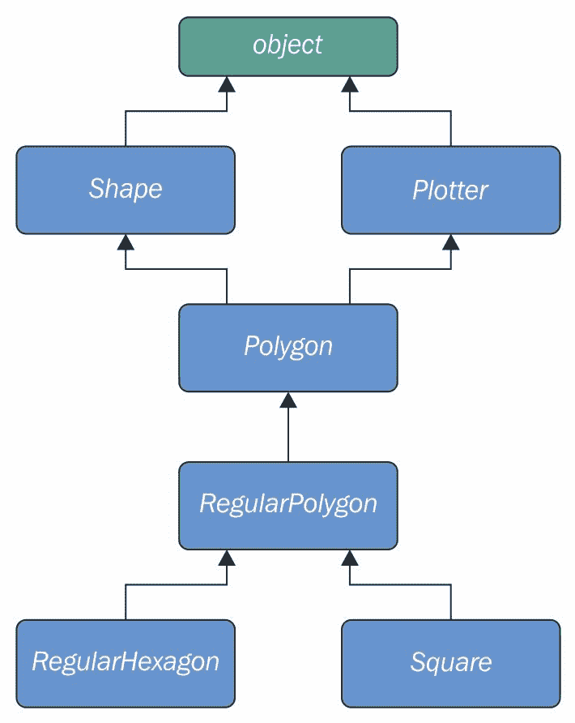

# 第六章：OOP，装饰器和迭代器

La classe non è acqua.（类似水）- 意大利谚语

我可能会写一本关于**面向对象编程**（**OOP**）和类的整本书。在本章中，我面临着在广度和深度之间找到平衡的艰难挑战。有太多的事情要讲述，其中很多如果我深入描述的话，将会占用整个章节以上的篇幅。因此，我将尽量给你一个我认为是对基础知识的良好全景视图，再加上一些在接下来的章节中可能会派上用场的东西。Python 的官方文档将有助于填补这些空白。

在本章中，我们将涵盖以下主题：

+   装饰器

+   Python 中的 OOP

+   迭代器

# 装饰器

在第五章《节省时间和内存》中，我测量了各种表达式的执行时间。如果你还记得的话，我不得不初始化一个变量到开始时间，并在执行后从当前时间中减去它，以计算经过的时间。我还在每次测量后在控制台上打印出来。那太麻烦了。

每当你发现自己重复做某些事情时，警报应该响起。你能把那段代码放到一个函数中，避免重复吗？大多数情况下答案是*是*，所以让我们看一个例子：

```py
# decorators/time.measure.start.py
from time import sleep, time

def f():
    sleep(.3)

def g():
    sleep(.5)

t = time()
f()
print('f took:', time() - t)  # f took: 0.3001396656036377

t = time()
g()
print('g took:', time() - t)  # g took: 0.5039339065551758
```

在前面的代码中，我定义了两个函数`f`和`g`，它们除了休眠（分别为 0.3 和 0.5 秒）之外什么也不做。我使用`sleep`函数来暂停执行所需的时间。请注意时间测量非常准确。现在，我们如何避免重复那段代码和那些计算呢？一个潜在的方法可能是：

```py
# decorators/time.measure.dry.py
from time import sleep, time

def f():
    sleep(.3)

def g():
    sleep(.5)

def measure(func):
    t = time()
    func()
    print(func.__name__, 'took:', time() - t)

measure(f)  # f took: 0.30434322357177734
measure(g)  # g took: 0.5048270225524902
```

啊，现在好多了。整个计时机制已经封装到一个函数中，所以我们不需要重复代码。我们可以动态打印函数名称，编码起来也很容易。如果我们需要将参数传递给我们测量的函数呢？这段代码可能会变得有点复杂，所以让我们看一个例子：

```py
# decorators/time.measure.arguments.py
from time import sleep, time

def f(sleep_time=0.1):
    sleep(sleep_time)

def measure(func, *args, **kwargs):
    t = time()
    func(*args, **kwargs)
    print(func.__name__, 'took:', time() - t)

measure(f, sleep_time=0.3)  # f took: 0.30056095123291016
measure(f, 0.2)  # f took: 0.2033553123474121
```

现在，`f`期望被提供`sleep_time`（默认值为`0.1`），所以我们不再需要`g`。我还必须更改`measure`函数，使其现在接受一个函数、任意变量位置参数和任意变量关键字参数。这样，无论我们用什么调用`measure`，我们都会将这些参数重定向到我们在内部调用`func`的调用中。

这很好，但我们可以再推进一点。假设我们想要在`f`函数中内置这种计时行为，这样我们就可以直接调用它并进行测量。我们可以这样做：

```py
# decorators/time.measure.deco1.py
from time import sleep, time

def f(sleep_time=0.1):
    sleep(sleep_time)

def measure(func):
    def wrapper(*args, **kwargs):
        t = time()
        func(*args, **kwargs)
        print(func.__name__, 'took:', time() - t)
    return wrapper

f = measure(f)  # decoration point

```

```py
f(0.2)  # f took: 0.20372915267944336
f(sleep_time=0.3)  # f took: 0.30455899238586426
print(f.__name__)  # wrapper <- ouch!
```

前面的代码可能并不那么直接。让我们看看这里发生了什么。魔法在于**装饰点**。当我们用`f`作为参数调用`measure`时，我们基本上用`measure`返回的任何东西重新分配了`f`。在`measure`中，我们定义了另一个函数`wrapper`，然后返回它。因此，在装饰点之后的效果是，当我们调用`f`时，实际上是在调用`wrapper`。由于内部的`wrapper`调用了`func`，也就是`f`，我们实际上是这样关闭了循环。如果你不相信我，看看最后一行。

`wrapper`实际上是...一个包装器。它接受变量和位置参数，并用它们调用`f`。它还在调用周围进行时间测量计算。

这种技术称为**装饰**，而`measure`实际上是一个**装饰器**。这种范式变得如此受欢迎和广泛使用，以至于 Python 在某个时候添加了一个专门的语法（查看[`www.python.org/dev/peps/pep-0318/`](https://www.python.org/dev/peps/pep-0318/)）。让我们探讨三种情况：一个装饰器，两个装饰器和一个带参数的装饰器：

```py
# decorators/syntax.py
def func(arg1, arg2, ...):
    pass
func = decorator(func)

# is equivalent to the following:

@decorator
def func(arg1, arg2, ...):
    pass
```

基本上，我们不需要手动将函数重新分配给装饰器返回的内容，而是在函数的定义前面加上特殊的语法`@decorator_name`。

我们可以以以下方式将多个装饰器应用于同一个函数：

```py
# decorators/syntax.py
def func(arg1, arg2, ...):
    pass
func = deco1(deco2(func))

# is equivalent to the following:

@deco1
@deco2
def func(arg1, arg2, ...):
    pass
```

在应用多个装饰器时，要注意顺序。在上面的例子中，首先用`deco2`装饰`func`，然后用`deco1`装饰结果。一个很好的经验法则是：*装饰器离函数越近，越早应用*。

有些装饰器可以接受参数。这种技术通常用于生成其他装饰器。让我们先看一下语法，然后再看一个例子：

```py
# decorators/syntax.py
def func(arg1, arg2, ...):
    pass
func = decoarg(arg_a, arg_b)(func)

# is equivalent to the following:

@decoarg(arg_a, arg_b)
def func(arg1, arg2, ...):
    pass
```

正如你所看到的，这种情况有点不同。首先，使用给定的参数调用`decoarg`，然后调用它的返回值（实际的装饰器）与`func`。在我给你另一个例子之前，让我们解决一个让我困扰的问题。我不想在装饰函数时丢失原始函数名称和文档字符串（以及其他属性，具体细节请查看文档）。但是因为在我们的装饰器内部返回了`wrapper`，来自`func`的原始属性就丢失了，`f`最终被分配了`wrapper`的属性。`functools`模块有一个简单的解决方法。我将修复最后一个例子，并且还将重写其语法以使用`@`运算符：

```py
# decorators/time.measure.deco2.py
from time import sleep, time
from functools import wraps

def measure(func):
    @wraps(func)
    def wrapper(*args, **kwargs):
        t = time()
        func(*args, **kwargs)
        print(func.__name__, 'took:', time() - t)
    return wrapper

@measure
def f(sleep_time=0.1):
    """I'm a cat. I love to sleep! """
    sleep(sleep_time)

f(sleep_time=0.3)  # f took: 0.3010902404785156
print(f.__name__, ':', f.__doc__)  # f : I'm a cat. I love to sleep!
```

现在我们说得通了！正如你所看到的，我们所需要做的就是告诉 Python`wrapper`实际上包装了`func`（通过`wraps`函数），你可以看到原始名称和文档字符串现在得到了保留。

让我们看另一个例子。我想要一个装饰器，在函数的结果大于一定阈值时打印错误消息。我还将利用这个机会向你展示如何同时应用两个装饰器：

```py
# decorators/two.decorators.py
from time import sleep, time
from functools import wraps

def measure(func):
    @wraps(func)
    def wrapper(*args, **kwargs):
        t = time()
        result = func(*args, **kwargs)
        print(func.__name__, 'took:', time() - t)
        return result
    return wrapper

def max_result(func):
    @wraps(func)
    def wrapper(*args, **kwargs):
        result = func(*args, **kwargs)
        if result > 100:
            print('Result is too big ({0}). Max allowed is 100.'
                  .format(result))
        return result
    return wrapper

@measure
@max_result
def cube(n):
    return n ** 3

print(cube(2))
print(cube(5))
```

花点时间来研究上面的例子，直到你确信你理解得很好。如果你理解了，我认为现在没有任何装饰器是你写不出来的。

我不得不增强`measure`装饰器，使得它的`wrapper`现在返回对`func`的调用结果。`max_result`装饰器也是这样做的，但在返回之前，它检查`result`是否大于`100`，这是允许的最大值。我用这两个装饰器装饰了`cube`。首先应用`max_result`，然后是`measure`。运行这段代码会产生这个结果：

```py
$ python two.decorators.py
cube took: 3.0994415283203125e-06
8 
Result is too big (125). Max allowed is 100.
cube took: 1.0013580322265625e-05
125
```

为了方便起见，我用一个空行分隔了两次调用的结果。在第一次调用中，结果是`8`，通过了阈值检查。运行时间被测量并打印。最后，我们打印结果（`8`）。

在第二次调用中，结果是`125`，所以错误消息被打印，结果被返回，然后轮到`measure`，再次打印运行时间，最后，我们打印结果（`125`）。

如果我用不同顺序的相同两个装饰器装饰`cube`函数，错误消息将会在打印运行时间的行之后而不是之前。

# 装饰器工厂

现在让我们简化这个例子，回到一个单一的装饰器：`max_result`。我想让它这样做，以便我可以用不同的阈值装饰不同的函数，我不想为每个阈值编写一个装饰器。让我们修改`max_result`，以便它允许我们动态地指定阈值来装饰函数：

```py
# decorators/decorators.factory.py
from functools import wraps

def max_result(threshold):
    def decorator(func):
        @wraps(func)
        def wrapper(*args, **kwargs):
            result = func(*args, **kwargs)
            if result > threshold:
                print(
                    'Result is too big ({0}). Max allowed is {1}.'
                    .format(result, threshold))
            return result
        return wrapper
    return decorator

@max_result(75)
def cube(n):
    return n ** 3

print(cube(5))
```

上面的代码向你展示了如何编写**装饰器工厂**。如果你还记得，用带参数的装饰器装饰函数与编写`func = decorator(argA, argB)(func)`是一样的，所以当我们用`max_result(75)`装饰`cube`时，我们实际上是在做`cube = max_result(75)(cube)`。

让我们一步步地看发生了什么。当我们调用`max_result(75)`时，我们进入它的主体。在里面定义了一个`decorator`函数，它以函数作为唯一的参数。在该函数内部执行了通常的装饰器技巧。我们定义了`wrapper`，在其中我们检查原始函数调用的结果。这种方法的美妙之处在于，从最内层，我们仍然可以动态地引用`func`和`threshold`，这使我们能够动态地设置阈值。

`wrapper`返回`result`，`decorator`返回`wrapper`，`max_result`返回`decorator`。这意味着我们的`cube = max_result(75)(cube)`调用实际上变成了`cube = decorator(cube)`。不仅仅是任何`decorator`，而是`threshold`的值为`75`的`decorator`。这是通过一种称为**闭包**的机制实现的，这超出了本章的范围，但仍然非常有趣，所以我提到它让您进行一些研究。

运行上一个示例会产生以下结果：

```py
$ python decorators.factory.py
Result is too big (125). Max allowed is 75.
125
```

前面的代码允许我随心所欲地使用`max_result`装饰器，就像这样：

```py
# decorators/decorators.factory.py
@max_result(75)
def cube(n):
    return n ** 3

@max_result(100)
def square(n):
    return n ** 2

@max_result(1000)
def multiply(a, b):
    return a * b
```

请注意，每个装饰都使用不同的`threshold`值。

装饰器在 Python 中非常受欢迎。它们经常被使用，并且大大简化（我敢说还美化）了代码。

# 面向对象编程（OOP）

这是一个相当漫长而希望愉快的旅程，到现在为止，我们应该准备好去探索面向对象编程了。我将使用 Kindler, E.; Krivy, I. (2011)的定义。*Object-oriented simulation of systems with sophisticated control* by *International Journal of General Systems*，并将其适应到 Python 中：

面向对象编程（OOP）是一种基于“对象”概念的编程范式，对象是包含数据（属性形式）和代码（方法形式）的数据结构。对象的一个显著特征是对象的方法可以访问并经常修改与其关联的数据属性（对象具有“self”的概念）。在面向对象编程中，计算机程序是通过使它们由相互交互的对象构成来设计的。

Python 完全支持这种范式。实际上，正如我们已经说过的，*Python 中的一切都是对象*，因此这表明 OOP 不仅受到 Python 的支持，而且它是其核心的一部分。

面向对象编程的两个主要角色是**对象**和**类**。类用于创建对象（对象是从它们创建的类的实例），因此我们可以将它们视为实例工厂。当对象由类创建时，它们继承类的属性和方法。它们代表程序领域中的具体项目。

# 最简单的 Python 类

我将从您可以在 Python 中编写的最简单的类开始：

```py
# oop/simplest.class.py
class Simplest():  # when empty, the braces are optional
    pass

print(type(Simplest))  # what type is this object?
simp = Simplest()  # we create an instance of Simplest: simp
print(type(simp))  # what type is simp?
# is simp an instance of Simplest?
print(type(simp) == Simplest)  # There's a better way for this
```

让我们运行前面的代码，并逐行解释它：

```py
$ python simplest.class.py
<class 'type'>
<class '__main__.Simplest'>
True
```

我定义的`Simplest`类在其主体中只有`pass`指令，这意味着它没有任何自定义属性或方法。如果为空，则名称后面的括号是可选的。我将打印它的类型（`__main__`是顶层代码执行的范围的名称），我知道，在注释中，我写的是*object*而不是*class*。事实证明，正如您可以从`print`的结果中看到的那样，*类实际上是对象*。准确地说，它们是`type`的实例。解释这个概念将导致我们讨论**元类**和**元编程**，这些是需要牢固掌握基本原理才能理解的高级概念，超出了本章的范围。像往常一样，我提到它是为了给您留下一个指针，以便在您准备深入了解时使用。

让我们回到这个例子：我使用`Simplest`创建了一个实例`simp`。您可以看到创建实例的语法与我们调用函数的方式相同。然后我们打印`simp`属于的类型，并验证`simp`实际上是`Simplest`的一个实例。我将在本章后面向您展示更好的方法。

到目前为止，一切都很简单。但是，当我们写`class ClassName(): pass`时会发生什么呢？嗯，Python 所做的是创建一个类对象并为其分配一个名称。这与我们使用`def`声明函数时发生的情况非常相似。

# 类和对象的命名空间

在类对象创建后（通常在模块首次导入时发生），它基本上代表一个命名空间。我们可以调用该类来创建其实例。每个实例都继承了类属性和方法，并被赋予了自己的命名空间。我们已经知道，要遍历命名空间，我们只需要使用点（`.`）运算符。

让我们看另一个例子：

```py
# oop/class.namespaces.py
class Person:
    species = 'Human'

print(Person.species)  # Human
Person.alive = True  # Added dynamically!
print(Person.alive)  # True

man = Person()
print(man.species)  # Human (inherited)
print(man.alive)  # True (inherited)

Person.alive = False
print(man.alive)  # False (inherited)

man.name = 'Darth'
man.surname = 'Vader'
print(man.name, man.surname)  # Darth Vader
```

在上面的例子中，我定义了一个名为`species`的类属性。在类的主体中定义的任何变量都是属于该类的属性。在代码中，我还定义了`Person.alive`，这是另一个类属性。你可以看到从类中访问该属性没有限制。你可以看到`man`是`Person`的一个实例，它继承了它们两个，并在它们改变时立即反映出来。

`man`也有两个属于它自己命名空间的属性，因此被称为**实例属性**：`name`和`surname`。

类属性在所有实例之间共享，而实例属性不共享；因此，你应该使用类属性来提供所有实例共享的状态和行为，并使用实例属性来存储只属于一个特定对象的数据。

# 属性遮蔽

当你在对象中搜索属性时，如果没有找到，Python 会继续在用于创建该对象的类中搜索（并一直搜索，直到找到或达到继承链的末尾）。这导致了一个有趣的遮蔽行为。让我们看另一个例子：

```py
# oop/class.attribute.shadowing.py
class Point:
    x = 10
    y = 7

p = Point()
print(p.x)  # 10 (from class attribute)
print(p.y)  # 7 (from class attribute)

p.x = 12  # p gets its own `x` attribute
print(p.x)  # 12 (now found on the instance)
print(Point.x)  # 10 (class attribute still the same)

del p.x  # we delete instance attribute
print(p.x)  # 10 (now search has to go again to find class attr)

p.z = 3  # let's make it a 3D point
print(p.z)  # 3

print(Point.z)
# AttributeError: type object 'Point' has no attribute 'z'
```

前面的代码非常有趣。我们定义了一个名为`Point`的类，其中有两个类属性`x`和`y`。当我们创建一个实例`p`时，你可以看到我们可以从`p`的命名空间（`p.x`和`p.y`）打印出`x`和`y`。当我们这样做时，Python 在实例上找不到任何`x`或`y`属性，因此搜索类，并在那里找到它们。

然后我们通过分配`p.x = 12`给`p`赋予了它自己的`x`属性。这种行为一开始可能看起来有点奇怪，但是如果你仔细想想，它与在函数中发生的事情完全相同，当外部有一个全局`x = 10`时，函数声明`x = 12`。我们知道`x = 12`不会影响全局变量，对于类和实例来说，情况也是一样的。

在分配`p.x = 12`之后，当我们打印它时，搜索不需要读取类属性，因为`x`在实例中找到了，因此我们得到了`12`的输出。我们还打印了`Point.x`，它指的是类命名空间中的`x`。

然后，我们从`p`的命名空间中删除`x`，这意味着在下一行，当我们再次打印它时，Python 将再次在类中搜索它，因为它在实例中不再被找到。

最后三行向你展示了将属性分配给实例并不意味着它们将在类中被找到。实例得到了类中的所有内容，但反之则不成立。

你认为将`x`和`y`坐标作为类属性是一个好主意吗？如果你添加另一个`Point`的实例会怎么样？这是否有助于说明类属性为什么非常有用？

# 我自己和我 - 使用 self 变量

在类方法内部，我们可以通过一个特殊的参数`self`来引用一个实例，按照惯例称之为`self`。`self`始终是实例方法的第一个属性。让我们一起研究这种行为，以及我们如何可以与所有实例共享，不仅是属性，还有方法：

```py
# oop/class.self.py
class Square:
    side = 8
    def area(self):  # self is a reference to an instance
        return self.side ** 2

sq = Square()
print(sq.area())  # 64 (side is found on the class)
print(Square.area(sq))  # 64 (equivalent to sq.area())

sq.side = 10
print(sq.area())  # 100 (side is found on the instance)
```

注意`area`方法如何被`sq`使用。两个调用`Square.area(sq)`和`sq.area()`是等价的，并教会我们机制是如何工作的。你可以将实例传递给方法调用（`Square.area(sq)`），在方法内部将使用名称`self`，或者你可以使用更舒适的语法`sq.area()`，Python 会在幕后为你翻译它。

让我们看一个更好的例子：

```py
# oop/class.price.py
class Price:
    def final_price(self, vat, discount=0):
        """Returns price after applying vat and fixed discount."""
        return (self.net_price * (100 + vat) / 100) - discount

p1 = Price()
p1.net_price = 100
print(Price.final_price(p1, 20, 10))  # 110 (100 * 1.2 - 10)
print(p1.final_price(20, 10))  # equivalent
```

前面的代码向您展示了，在声明方法时没有任何阻止我们使用参数。我们可以使用与函数相同的语法，但需要记住第一个参数始终是实例。我们不一定需要将其称为`self`，但这是约定，这是为数不多的非常重要遵守的情况之一。

# 初始化实例

您是否注意到，在调用`p1.final_price(...)`之前，我们必须将`net_price`赋给`p1`？有更好的方法可以做到这一点。在其他语言中，这将被称为**构造函数**，但在 Python 中不是。它实际上是一个**初始化程序**，因为它在已创建的实例上工作，因此被称为`__init__`。它是一个*魔术方法*，在对象创建后立即运行。Python 对象还有一个`__new__`方法，这才是真正的构造函数。实际上，我们通常不需要覆盖它，这种做法在编写元类时才会用到，正如我们提到的，这是一个相当高级的主题，我们不会在本书中探讨：

```py
# oop/class.init.py
class Rectangle:
    def __init__(self, side_a, side_b):
        self.side_a = side_a
        self.side_b = side_b

    def area(self):
        return self.side_a * self.side_b

r1 = Rectangle(10, 4)
print(r1.side_a, r1.side_b)  # 10 4
print(r1.area())  # 40

r2 = Rectangle(7, 3)
print(r2.area())  # 21
```

事情终于开始有了眉目。当一个对象被创建时，`__init__`方法会自动运行。在这种情况下，我编写了这样一个代码，当我们创建一个对象（通过调用类名像调用函数一样），我们传递参数给创建调用，就像我们在任何常规函数调用中一样。我们传递参数的方式遵循`__init__`方法的签名，因此，在两个创建语句中，`10`和`7`将分别成为`r1`和`r2`的`side_a`，而`4`和`3`将成为`side_b`。您可以看到从`r1`和`r2`调用`area()`反映了它们具有不同的实例参数。以这种方式设置对象更加美观和方便。

# OOP 是关于代码重用的

到目前为止，应该很清楚：*OOP 是关于代码重用的*。我们定义一个类，创建实例，这些实例使用仅在类中定义的方法。它们将根据初始化程序设置实例的方式而表现出不同的行为。

# 继承和组合

但这只是故事的一半，*OOP 更加强大*。我们有两个主要的设计构造可以利用：继承和组合。

**继承**意味着两个对象通过*是一个*类型的关系相关联。另一方面，**组合**意味着两个对象通过*有一个*类型的关系相关联。这一切都很容易通过一个例子来解释：

```py
# oop/class_inheritance.py
class Engine:
    def start(self):
        pass

    def stop(self):
        pass

class ElectricEngine(Engine):  # Is-A Engine
    pass

class V8Engine(Engine):  # Is-A Engine
    pass

class Car:
    engine_cls = Engine

    def __init__(self):
        self.engine = self.engine_cls()  # Has-A Engine

    def start(self):
        print(
            'Starting engine {0} for car {1}... Wroom, wroom!'
            .format(
                self.engine.__class__.__name__,
                self.__class__.__name__)
        )
        self.engine.start()

    def stop(self):
        self.engine.stop()

class RaceCar(Car):  # Is-A Car
    engine_cls = V8Engine

class CityCar(Car):  # Is-A Car
    engine_cls = ElectricEngine

class F1Car(RaceCar):  # Is-A RaceCar and also Is-A Car
    pass  # engine_cls same as parent

car = Car()
racecar = RaceCar()
citycar = CityCar()
f1car = F1Car()
cars = [car, racecar, citycar, f1car]

for car in cars:
    car.start()

""" Prints:
Starting engine Engine for car Car... Wroom, wroom!
Starting engine V8Engine for car RaceCar... Wroom, wroom!
Starting engine ElectricEngine for car CityCar... Wroom, wroom!
Starting engine V8Engine for car F1Car... Wroom, wroom!
"""
```

前面的例子向您展示了对象之间*是一个*和*有一个*类型的关系。首先，让我们考虑`Engine`。这是一个简单的类，有两个方法，`start`和`stop`。然后我们定义了`ElectricEngine`和`V8Engine`，它们都继承自`Engine`。您可以看到，当我们定义它们时，在类名后面的括号中放入了`Engine`，这表明它们继承自`Engine`。

这意味着`ElectricEngine`和`V8Engine`都继承自`Engine`类的属性和方法，这被称为它们的**基类**。

汽车也是如此。`Car`是`RaceCar`和`CityCar`的基类。`RaceCar`也是`F1Car`的基类。另一种说法是，`F1Car`继承自`RaceCar`，`RaceCar`继承自`Car`。因此，`F1Car`*是一个*`RaceCar`，`RaceCar`*是一个*`Car`。由于传递性，我们也可以说`F1Car`*是一个*`Car`。`CityCar`也是*是一个*`Car`。

当我们定义`class A(B): pass`时，我们说`A`是`B`的*子类*，而`B`是`A`的*父类*。*父类*和*基类*是同义词，*子类*和*派生类*也是。此外，我们说一个类从另一个类继承，或者扩展它。

这就是继承机制。

另一方面，让我们回到代码。每个类都有一个类属性`engine_cls`，它是我们想要分配给每种类型汽车的发动机类的引用。`Car`有一个通用的`Engine`，而两辆赛车有一个强大的 V8 发动机，城市车有一个电动发动机。

当在初始化方法`__init__`中创建汽车时，我们创建分配给汽车的任何发动机类的实例，并将其设置为`engine`实例属性。

让`engine_cls`在所有类实例之间共享是有道理的，因为很可能同一辆车的实例会有相同类型的发动机。另一方面，将一个单一的发动机（任何`Engine`类的实例）作为类属性是不好的，因为我们会在所有实例之间共享一个发动机，这是不正确的。

汽车和发动机之间的关系类型是*Has-A*类型。汽车*Has-A*发动机。这被称为**组合**，反映了对象可以由许多其他对象组成的事实。汽车*Has-A*发动机、齿轮、车轮、车架、车门、座椅等等。

在设计面向对象的代码时，以这种方式描述对象非常重要，这样我们才能正确地使用继承和组合来最佳地构造我们的代码。

请注意，我必须避免在`class_inheritance.py`脚本名称中使用点，因为模块名称中的点使导入变得困难。书中源代码中的大多数模块都是作为独立脚本运行的，因此我选择在可能的情况下添加点以增强可读性，但一般来说，你应该避免在模块名称中使用点。

在我们离开这一段之前，让我们通过另一个示例来检查我是否告诉了你真相：

```py
# oop/class.issubclass.isinstance.py
from class_inheritance import Car, RaceCar, F1Car

car = Car()
racecar = RaceCar()
f1car = F1Car()
cars = [(car, 'car'), (racecar, 'racecar'), (f1car, 'f1car')]
car_classes = [Car, RaceCar, F1Car]

for car, car_name in cars:
    for class_ in car_classes:
        belongs = isinstance(car, class_)
        msg = 'is a' if belongs else 'is not a'
        print(car_name, msg, class_.__name__)

""" Prints:
car is a Car
car is not a RaceCar
car is not a F1Car
racecar is a Car
racecar is a RaceCar
racecar is not a F1Car
f1car is a Car
f1car is a RaceCar
f1car is a F1Car
"""
```

正如你所看到的，`car`只是`Car`的一个实例，而`racecar`是`RaceCar`的一个实例（通过扩展也是`Car`的一个实例），`f1car`是`F1Car`的一个实例（通过扩展也是`RaceCar`和`Car`的一个实例）。*banana*是*banana*的一个实例。但是，它也是*Fruit*。同时，它也是*Food*，对吧？这是相同的概念。要检查对象是否是类的实例，请使用`isinstance`方法。它比纯粹的类型比较更可取：`(type(object) == Class)`。

请注意，我没有在实例化汽车时留下打印信息。我们在上一个示例中看到了它们。

让我们也来检查继承-相同的设置，不同的逻辑在`for`循环中：

```py
# oop/class.issubclass.isinstance.py
for class1 in car_classes:
    for class2 in car_classes:
        is_subclass = issubclass(class1, class2)
        msg = '{0} a subclass of'.format(
            'is' if is_subclass else 'is not')
        print(class1.__name__, msg, class2.__name__)

""" Prints:
Car is a subclass of Car
Car is not a subclass of RaceCar
Car is not a subclass of F1Car
RaceCar is a subclass of Car
RaceCar is a subclass of RaceCar
RaceCar is not a subclass of F1Car
F1Car is a subclass of Car
F1Car is a subclass of RaceCar
F1Car is a subclass of F1Car
"""
```

有趣的是，我们了解到*一个类是其自身的子类*。检查前面示例的输出，看看它是否与我提供的解释相匹配。

关于惯例的一件事要注意的是，类名始终使用`CapWords`编写，这意味着`ThisWayIsCorrect`，而不是函数和方法，它们是`this_way_is_correct`。此外，在代码中，如果要使用 Python 保留的关键字或内置函数或类的名称，惯例是在名称后添加下划线。在第一个`for`循环示例中，我正在使用`for class_ in ...`循环遍历类名，因为`class`是一个保留字。但你已经知道这一切，因为你已经彻底研究了 PEP8，对吧？

为了帮助你理解*Is-A*和*Has-A*之间的区别，请看下面的图表：



# 访问基类

我们已经看到了类声明，比如`class ClassA: pass`和`class ClassB(BaseClassName): pass`。当我们不明确指定基类时，Python 会将特殊的**object**类设置为我们正在定义的类的基类。最终，所有类都源自一个对象。请注意，如果不指定基类，括号是可选的。

因此，编写`class A: pass`或`class A(): pass`或`class A(object): pass`都是完全相同的。*object*类是一个特殊的类，它具有所有 Python 类共有的方法，并且不允许你在其上设置任何属性。

让我们看看如何从类内部访问基类：

```py
# oop/super.duplication.py
class Book:
    def __init__(self, title, publisher, pages):
        self.title = title
        self.publisher = publisher
        self.pages = pages

class Ebook(Book):
    def __init__(self, title, publisher, pages, format_):
        self.title = title
        self.publisher = publisher
        self.pages = pages
        self.format_ = format_
```

看一下前面的代码。`Ebook`中有三个输入参数是重复的。这是非常糟糕的做法，因为我们现在有两组执行相同操作的指令。此外，`Book.__init__`签名的任何更改都不会反映在`Ebook`中。我们知道`Ebook`*是一个*`Book`，因此我们可能希望更改能够反映在子类中。

让我们看一种解决这个问题的方法：

```py
# oop/super.explicit.py
class Book:
    def __init__(self, title, publisher, pages):
        self.title = title
        self.publisher = publisher
        self.pages = pages

class Ebook(Book):
    def __init__(self, title, publisher, pages, format_):
        Book.__init__(self, title, publisher, pages)
        self.format_ = format_

ebook = Ebook(
    'Learn Python Programming', 'Packt Publishing', 500, 'PDF')
print(ebook.title)  # Learn Python Programming
print(ebook.publisher)  # Packt Publishing
print(ebook.pages)  # 500
print(ebook.format_)  # PDF
```

现在好多了。我们去掉了那个讨厌的重复。基本上，我们告诉 Python 调用`Book`类的`__init__`方法，并将`self`传递给调用，确保将该调用绑定到当前实例。

如果我们修改`Book`的`__init__`方法中的逻辑，我们不需要触及`Ebook`，它将自动适应更改。

这种方法很好，但我们仍然可以做得更好一点。假设我们将`Book`的名称更改为`Liber`，因为我们爱上了拉丁语。我们必须修改`Ebook`的`__init__`方法以反映这一变化。这可以通过使用`super`来避免：

```py
# oop/super.implicit.py
class Book:
    def __init__(self, title, publisher, pages):
        self.title = title
        self.publisher = publisher
        self.pages = pages

class Ebook(Book):
    def __init__(self, title, publisher, pages, format_):
        super().__init__(title, publisher, pages)
        # Another way to do the same thing is:
        # super(Ebook, self).__init__(title, publisher, pages)
        self.format_ = format_

ebook = Ebook(
    'Learn Python Programming', 'Packt Publishing', 500, 'PDF')
print(ebook.title) # Learn Python Programming
print(ebook.publisher) # Packt Publishing
print(ebook.pages) # 500
print(ebook.format_) # PDF
```

`super`是一个返回代理对象的函数，该代理对象将方法调用委托给父类或同级类。在这种情况下，它将该调用委托给`Book`类的`__init__`，这种方法的美妙之处在于现在我们甚至可以自由地将`Book`更改为`Liber`，而不必触及`Ebook`的`__init__`方法中的逻辑。

现在我们知道如何从子类访问基类，让我们来探索 Python 的多重继承。

# 多重继承

除了使用多个基类来组成一个类之外，这里感兴趣的是属性搜索是如何执行的。看一下下面的图表：



正如你所看到的，`Shape`和`Plotter`充当了所有其他类的基类。`Polygon`直接从它们继承，`RegularPolygon`从`Polygon`继承，而`RegularHexagon`和`Square`都从`RegulaPolygon`继承。还要注意，`Shape`和`Plotter`隐式地从`object`继承，因此我们有了所谓的**菱形**，或者更简单地说，有多条路径到达基类。我们将在几分钟后看到为什么这很重要。让我们将其翻译成一些简单的代码：

```py
# oop/multiple.inheritance.py
class Shape:
    geometric_type = 'Generic Shape'
    def area(self):  # This acts as placeholder for the interface
        raise NotImplementedError
    def get_geometric_type(self):
        return self.geometric_type

class Plotter:
    def plot(self, ratio, topleft):
        # Imagine some nice plotting logic here...
        print('Plotting at {}, ratio {}.'.format(
            topleft, ratio))

class Polygon(Shape, Plotter):  # base class for polygons
    geometric_type = 'Polygon'

class RegularPolygon(Polygon):  # Is-A Polygon
    geometric_type = 'Regular Polygon'
    def __init__(self, side):
        self.side = side

class RegularHexagon(RegularPolygon):  # Is-A RegularPolygon
    geometric_type = 'RegularHexagon'
    def area(self):
        return 1.5 * (3 ** .5 * self.side ** 2)

class Square(RegularPolygon):  # Is-A RegularPolygon
    geometric_type = 'Square'
    def area(self):
        return self.side * self.side

hexagon = RegularHexagon(10)
print(hexagon.area())  # 259.8076211353316
print(hexagon.get_geometric_type())  # RegularHexagon
hexagon.plot(0.8, (75, 77))  # Plotting at (75, 77), ratio 0.8.

square = Square(12)
print(square.area())  # 144
print(square.get_geometric_type())  # Square
square.plot(0.93, (74, 75))  # Plotting at (74, 75), ratio 0.93.
```

看一下前面的代码：`Shape`类有一个属性`geometric_type`和两个方法：`area`和`get_geometric_type`。通常使用基类（例如我们的例子中的`Shape`）来定义一个*接口*是很常见的，子类必须提供这些方法的实现。有不同和更好的方法来做到这一点，但我想尽可能地保持这个例子简单。

我们还有`Plotter`类，它添加了`plot`方法，从而为任何继承它的类提供绘图功能。当然，在这个例子中，`plot`的实现只是一个虚拟的`print`。第一个有趣的类是`Polygon`，它同时继承自`Shape`和`Plotter`。

有许多类型的多边形，其中之一是正多边形，它既是等角的（所有角度相等），又是等边的（所有边相等），因此我们创建了从`Polygon`继承的`RegularPolygon`类。对于正多边形，我们可以在`RegularPolygon`上实现一个简单的`__init__`方法，它接受边长。最后，我们创建了`RegularHexagon`和`Square`类，它们都继承自`RegularPolygon`。

这个结构相当长，但希望能让你了解在设计代码时如何专门化对象的分类。

现在，请看最后八行。请注意，当我在`hexagon`和`square`上调用`area`方法时，我得到了两者的正确面积。这是因为它们都提供了正确的实现逻辑。此外，我可以在它们两个上调用`get_geometric_type`，即使它没有在它们的类上定义，Python 也必须一直到`Shape`才能找到它的实现。请注意，即使实现是在`Shape`类中提供的，用于返回值的`self.geometric_type`也是从调用实例中正确获取的。

`plot`方法的调用也很有趣，并且向您展示了如何为对象增加它们本来没有的功能。这种技术在诸如 Django（我们将在第十四章中探索*Web Development*）这样的 Web 框架中非常受欢迎，它提供了称为**mixins**的特殊类，您可以直接使用其功能。您只需要将所需的 mixin 定义为自己的基类之一，就可以了。

多重继承很强大，但也可能变得非常混乱，因此我们需要确保了解在使用它时会发生什么。

# 方法解析顺序

到目前为止，我们知道当您要求`someobject.attribute`，并且在该对象上找不到`attribute`时，Python 会开始在创建`someobject`的类中搜索。如果那里也找不到，Python 会沿着继承链向上搜索，直到找到`attribute`或者到达`object`类。如果继承链只由单继承步骤组成，这是很容易理解的，这意味着类只有一个父类。然而，当涉及到多重继承时，有时很难预测如果找不到属性，下一个将被搜索的类是什么。

Python 提供了一种始终了解类在属性查找中被搜索顺序的方法：**Method Resolution Order**（**MRO**）。

MRO 是在查找期间搜索成员的基类的顺序。从 2.3 版本开始，Python 使用一种称为**C3**的算法，它保证了单调性。

在 Python 2.2 中引入了*新式类*。在 Python 2.*中编写新式类的方式是使用显式的`object`基类进行定义。经典类没有明确继承自`object`，并且在 Python 3 中已被移除。Python 2.*中经典类和新式类之间的一个区别是新式类使用新的 MRO 进行搜索。

关于前面的例子，让我们看看`Square`类的 MRO：

```py
# oop/multiple.inheritance.py
print(square.__class__.__mro__)
# prints:
# (<class '__main__.Square'>, <class '__main__.RegularPolygon'>,
# <class '__main__.Polygon'>, <class '__main__.Shape'>,
# <class '__main__.Plotter'>, <class 'object'>)
```

要获得类的 MRO，我们可以从实例到其`__class__`属性，然后从那里到其`__mro__`属性。或者，我们可以直接调用`Square.__mro__`或`Square.mro()`，但如果你必须动态地执行它，更有可能你会有一个对象而不是一个类。

请注意，唯一的疑点是在`Polygon`之后的二分，继承链分为两种方式：一种通向`Shape`，另一种通向`Plotter`。通过扫描`Square`类的 MRO，我们知道`Shape`在`Plotter`之前被搜索。

为什么这很重要？好吧，考虑以下代码：

```py
# oop/mro.simple.py
class A:
    label = 'a'

class B(A):
    label = 'b'

class C(A):
    label = 'c'

class D(B, C):
    pass

d = D()
print(d.label)  # Hypothetically this could be either 'b' or 'c'
```

`B`和`C`都继承自`A`，`D`同时继承自`B`和`C`。这意味着查找`label`属性可以通过`B`或`C`到达顶部（`A`）。根据首先到达的位置，我们会得到不同的结果。

因此，在前面的例子中，我们得到了`'b'`，这是我们所期望的，因为`B`是`D`的基类中最左边的一个。但是如果我从`B`中删除`label`属性会发生什么呢？这将是一个令人困惑的情况：算法会一直到达`A`还是首先到达`C`？让我们找出来：

```py
# oop/mro.py
class A:
    label = 'a'

class B(A):
    pass  # was: label = 'b'

class C(A):
    label = 'c'

class D(B, C):
    pass

d = D()
print(d.label)  # 'c'
print(d.__class__.mro())  # notice another way to get the MRO
# prints:
# [<class '__main__.D'>, <class '__main__.B'>,
# <class '__main__.C'>, <class '__main__.A'>, <class 'object'>]
```

因此，我们了解到 MRO 是`D`-`B`-`C`-`A`-`object`，这意味着当我们要求`d.label`时，我们得到的是`'c'`，这是正确的。

在日常编程中，通常不常见需要处理 MRO，但第一次与框架中的一些混合物作斗争时，我向您保证，您会很高兴我花了一段时间来解释它。

# 类和静态方法

到目前为止，我们已经编写了具有数据和实例方法形式属性的类，但是还有两种类型的方法可以放在类中：**静态方法**和**类方法**。

# 静态方法

您可能还记得，当您创建一个类对象时，Python 会为其分配一个名称。该名称充当命名空间，有时将功能分组在其下是有意义的。静态方法非常适合这种用例，因为与实例方法不同，它们不会传递任何特殊参数。让我们看一个虚构的`StringUtil`类的示例：

```py
# oop/static.methods.py
class StringUtil:

    @staticmethod
    def is_palindrome(s, case_insensitive=True):
        # we allow only letters and numbers
        s = ''.join(c for c in s if c.isalnum())  # Study this!
        # For case insensitive comparison, we lower-case s
        if case_insensitive:
            s = s.lower()
        for c in range(len(s) // 2):
            if s[c] != s[-c -1]:
                return False
        return True

    @staticmethod
    def get_unique_words(sentence):
        return set(sentence.split())

print(StringUtil.is_palindrome(
    'Radar', case_insensitive=False))  # False: Case Sensitive
print(StringUtil.is_palindrome('A nut for a jar of tuna'))  # True
print(StringUtil.is_palindrome('Never Odd, Or Even!'))  # True
print(StringUtil.is_palindrome(
    'In Girum Imus Nocte Et Consumimur Igni')  # Latin! Show-off!
)  # True

print(StringUtil.get_unique_words(
    'I love palindromes. I really really love them!'))
# {'them!', 'really', 'palindromes.', 'I', 'love'}
```

前面的代码非常有趣。首先，我们了解到静态方法是通过简单地将`staticmethod`装饰器应用于它们来创建的。您可以看到它们没有传递任何特殊参数，因此除了装饰之外，它们看起来确实就像函数。

我们有一个名为`StringUtil`的类，它充当函数的容器。另一种方法是使用内部函数的单独模块。大多数情况下，这实际上是一种偏好。

`is_palindrome` 中的逻辑现在应该对您来说很简单，但以防万一，让我们来看一下。首先，我们从`s`中删除所有既不是字母也不是数字的字符。为了做到这一点，我们使用字符串对象（在本例中是空字符串对象）的`join`方法。通过在空字符串上调用`join`，结果是将传递给`join`的可迭代对象中的所有元素连接在一起。我们向`join`提供了一个生成器表达式，该表达式表示如果字符是字母数字或数字，则从`s`中取任何字符。这是因为在回文句子中，我们希望丢弃任何不是字符或数字的内容。

如果`case_insensitive`为`True`，我们将转换`s`为小写，然后继续检查它是否是回文。为了做到这一点，我们比较第一个和最后一个字符，然后比较第二个和倒数第二个字符，依此类推。如果我们在任何时候发现差异，这意味着字符串不是回文，因此我们可以返回`False`。另一方面，如果我们正常退出`for`循环，这意味着没有发现任何差异，因此我们可以说字符串是回文。

请注意，无论字符串的长度是奇数还是偶数，此代码都能正确工作。`len(s) // 2` 可以达到`s`的一半，如果`s`的字符数量是奇数，中间的字符不会被检查（比如在 *RaDaR* 中，*D* 不会被检查），但我们不在乎；它将与自身进行比较，因此始终通过该检查。

`get_unique_words`要简单得多：它只返回一个集合，我们向其中提供了一个句子中的单词列表。`set`类为我们删除了任何重复项，因此我们不需要做其他任何事情。

`StringUtil`类为我们提供了一个很好的容器命名空间，用于处理字符串的方法。我本可以编写一个类似的示例，使用`MathUtil`类和一些静态方法来处理数字，但我想向您展示一些不同的东西。

# 类方法

类方法与静态方法略有不同，因为与实例方法一样，它们也需要一个特殊的第一个参数，但在这种情况下，它是类对象本身。编写类方法的一个非常常见的用例是为类提供工厂功能。让我们看一个示例：

```py
# oop/class.methods.factory.py
class Point:
    def __init__(self, x, y):
        self.x = x
        self.y = y

    @classmethod
    def from_tuple(cls, coords):  # cls is Point
        return cls(*coords)

    @classmethod
    def from_point(cls, point):  # cls is Point
        return cls(point.x, point.y)

p = Point.from_tuple((3, 7))
print(p.x, p.y)  # 3 7
q = Point.from_point(p)
print(q.x, q.y)  # 3 7
```

在前面的代码中，我向你展示了如何使用类方法来创建类的工厂。在这种情况下，我们希望通过传递两个坐标（常规创建`p = Point(3, 7)`）来创建一个`Point`实例，但我们也希望能够通过传递一个元组（`Point.from_tuple`）或另一个实例（`Point.from_point`）来创建一个实例。

在这两个类方法中，`cls`参数指的是`Point`类。与实例方法一样，实例方法以`self`作为第一个参数，类方法以`cls`作为参数。`self`和`cls`都是根据约定命名的，你不是被强制遵循，但强烈鼓励尊重。这是没有 Python 程序员会更改的东西，因为它是一个如此强大的约定，解析器、linter 和任何自动处理代码的工具都会期望，所以最好坚持遵循它。

类方法和静态方法很好地配合。静态方法实际上在分解类方法的逻辑以改进其布局方面非常有帮助。让我们通过重构`StringUtil`类来看一个例子：

```py
# oop/class.methods.split.py
class StringUtil:

    @classmethod
    def is_palindrome(cls, s, case_insensitive=True):
        s = cls._strip_string(s)
        # For case insensitive comparison, we lower-case s
        if case_insensitive:
            s = s.lower()
        return cls._is_palindrome(s)

    @staticmethod
    def _strip_string(s):
        return ''.join(c for c in s if c.isalnum())

    @staticmethod
    def _is_palindrome(s):
        for c in range(len(s) // 2):
            if s[c] != s[-c -1]:
                return False
        return True

    @staticmethod
    def get_unique_words(sentence):
        return set(sentence.split())

print(StringUtil.is_palindrome('A nut for a jar of tuna'))  # True
print(StringUtil.is_palindrome('A nut for a jar of beans'))  # False
```

将这段代码与以前的版本进行比较。首先，请注意，即使`is_palindrome`现在是一个类方法，我们调用它的方式与它是静态方法时的调用方式相同。我们将它更改为类方法的原因是，在提取出一些逻辑片段（`_strip_string`和`_is_palindrome`）之后，我们需要引用它们，如果我们的方法中没有`cls`，唯一的选择就是这样调用它们：`StringUtil._strip_string(...)`和`StringUtil._is_palindrome(...)`，这不是一个好的做法，因为我们会在`is_palindrome`方法中硬编码类名，这样我们就会置自己于在想要更改类名时必须修改它的位置。使用`cls`将作为类名，这意味着我们的代码不需要任何修改。

注意新的逻辑读起来比以前的版本好得多。此外，注意，通过在*提取出来*的方法前加下划线，我暗示这些方法不应该从类外部调用，但这将是下一段的主题。

# 私有方法和名称混淆

如果你有 Java、C#或 C++等语言的背景，那么你知道它们允许程序员为属性（数据和方法）分配隐私状态。每种语言对此有自己略有不同的特点，但主要是公共属性可以从代码中的任何地方访问，而私有属性只能在其定义的范围内访问。

在 Python 中，没有这样的东西。一切都是公开的；因此，我们依赖于约定和一种称为**名称混淆**的机制。

约定如下：如果属性的名称没有下划线，它被认为是公共的。这意味着你可以自由访问和修改它。当名称有一个下划线时，属性被认为是私有的，这意味着它可能是用于内部使用的，你不应该从外部使用或修改它。私有属性的一个非常常见的用例是辅助方法，它们应该被公共方法使用（可能与其他方法一起调用链），以及内部数据，例如缩放因子，或者理想情况下我们会将其放在一个常量中（一个不能改变的变量，但是，惊讶的是，Python 也没有这些）。

这个特性通常会吓跑其他背景的人；他们会因为缺乏隐私而感到受到威胁。老实说，在我整个与 Python 的专业经验中，我从来没有听说过有人因为 Python 缺乏私有属性而尖叫“*哦，天哪，我们因为 Python 缺乏私有属性而有了一个可怕的错误！*”我发誓没有一次。

也就是说，对隐私的呼吁实际上是有道理的，因为没有它，你会真正地在你的代码中引入错误。让我告诉你我的意思：

```py
# oop/private.attrs.py
class A:
    def __init__(self, factor):
        self._factor = factor

    def op1(self):
        print('Op1 with factor {}...'.format(self._factor))

class B(A):
    def op2(self, factor):
        self._factor = factor
        print('Op2 with factor {}...'.format(self._factor))

obj = B(100)
obj.op1()    # Op1 with factor 100...
obj.op2(42)  # Op2 with factor 42...
obj.op1()    # Op1 with factor 42... <- This is BAD
```

在前面的代码中，我们有一个名为`_factor`的属性，假设它非常重要，不希望在创建实例后在运行时被修改，因为`op1`依赖于它才能正确运行。我们用一个前导下划线命名它，但问题在于当我们调用`obj.op2(42)`时，我们修改了它，并且这在后续调用`op1`时也会反映出来。

让我们通过添加另一个前导下划线来修复这种不良行为：

```py
# oop/private.attrs.fixed.py
class A:
    def __init__(self, factor):
        self.__factor = factor

    def op1(self):
        print('Op1 with factor {}...'.format(self.__factor))

class B(A):
    def op2(self, factor):
        self.__factor = factor
        print('Op2 with factor {}...'.format(self.__factor))

obj = B(100)
obj.op1()    # Op1 with factor 100...
obj.op2(42)  # Op2 with factor 42...
obj.op1()    # Op1 with factor 100... <- Wohoo! Now it's GOOD!
```

哇，看那个！现在它按预期工作了。Python 有点神奇，在这种情况下，发生的是名称修饰机制已经启动。

名称修饰意味着任何属性名称至少有两个前导下划线和最多一个尾随下划线，例如`__my_attr`，将被替换为一个包含下划线和类名的名称，然后是实际名称，例如`_ClassName__my_attr`。

这意味着当你从一个类继承时，修饰机制会在基类和子类中给你的私有属性取两个不同的名称，以避免名称冲突。每个类和实例对象都在一个特殊的属性`__dict__`中存储对它们的属性的引用，所以让我们检查`obj.__dict__`来看看名称修饰是如何起作用的：

```py
# oop/private.attrs.py
print(obj.__dict__.keys())
# dict_keys(['_factor'])
```

这是我们在这个例子的有问题版本中找到的`_factor`属性。但是看看使用`__factor`的那个：

```py
# oop/private.attrs.fixed.py
print(obj.__dict__.keys())
# dict_keys(['_A__factor', '_B__factor'])
```

看到了吗？`obj`现在有两个属性，`_A__factor`（在`A`类中修饰）和`_B__factor`（在`B`类中修饰）。这就是确保当你执行`obj.__factor = 42`时，`A`中的`__factor`不会改变的机制，因为你实际上是在触及`_B__factor`，这样就保留了`_A__factor`的安全和完整。

如果你正在设计一个希望被其他开发人员使用和扩展的类库，你需要牢记这一点，以避免意外覆盖你的属性。这样的错误可能相当微妙，很难发现。

# 属性装饰器

还有一件不得不提的事情是`property`装饰器。想象一下，你在一个`Person`类中有一个`age`属性，而且在某个时候你想要确保当你改变它的值时，你也要检查`age`是否在一个合适的范围内，比如[18, 99]。你可以编写访问器方法，比如`get_age()`和`set_age(...)`（也称为**getter**和**setter**），并在那里放置逻辑。`get_age()`很可能只是返回`age`，而`set_age(...)`也会进行范围检查。问题是，你可能已经有很多直接访问`age`属性的代码，这意味着你现在需要进行一些繁琐的重构。像 Java 这样的语言通过默认使用访问器模式来解决这个问题。许多 Java **集成开发环境**（**IDE**）会在你写属性声明时自动为你编写 getter 和 setter 访问器方法的存根。

Python 更聪明，它可以使用`property`装饰器来实现这一点。当你用`property`装饰一个方法时，你可以像使用数据属性一样使用方法的名称。因此，最好不要在这样的方法中放入需要花费一些时间才能完成的逻辑，因为通过访问它们作为属性，我们不希望等待。

让我们看一个例子：

```py
# oop/property.py
class Person:
    def __init__(self, age):
        self.age = age  # anyone can modify this freely

class PersonWithAccessors:
    def __init__(self, age):
        self._age = age

    def get_age(self):
        return self._age

    def set_age(self, age):
        if 18 <= age <= 99:
            self._age = age
        else:
            raise ValueError('Age must be within [18, 99]')

class PersonPythonic:
    def __init__(self, age):
        self._age = age

    @property
    def age(self):
        return self._age

    @age.setter
    def age(self, age):
        if 18 <= age <= 99:
            self._age = age
        else:
            raise ValueError('Age must be within [18, 99]')

person = PersonPythonic(39)
print(person.age)  # 39 - Notice we access as data attribute
person.age = 42    # Notice we access as data attribute
print(person.age)  # 42
person.age = 100   # ValueError: Age must be within [18, 99]
```

`Person`类可能是我们编写的第一个版本。然后我们意识到我们需要放置范围逻辑，所以，用另一种语言，我们需要将`Person`重写为`PersonWithAccessors`类，并重构所有使用`Person.age`的代码。在 Python 中，我们将`Person`重写为`PersonPythonic`（当然通常不会更改名称），这样年龄就存储在私有的`_age`变量中，并且我们使用装饰器定义属性的 getter 和 setter，这使我们可以像以前一样继续使用`person`实例。getter 是在我们读取属性时调用的方法。另一方面，setter 是在我们写入属性时调用的方法。在其他语言中，比如 Java，习惯上将它们定义为`get_age()`和`set_age(int value)`，但我觉得 Python 的语法更整洁。它允许你开始编写简单的代码，以后再进行重构，只有在需要时才需要，没有必要因为它们可能在将来有用而污染你的代码。

`property`装饰器还允许只读数据（没有 setter）以及在属性被删除时进行特殊操作。请参考官方文档以深入了解。

# 运算符重载

我发现 Python 对**运算符重载**的处理方式非常出色。重载运算符意味着根据使用的上下文给它赋予不同的含义。例如，当处理数字时，`+`运算符表示加法，但当处理序列时，它表示连接。

在 Python 中，当你使用操作符时，你很可能在幕后调用一些对象的特殊方法。例如，`a[k]`的调用大致相当于`type(a).__getitem__(a, k)`。

举个例子，让我们创建一个类，它存储一个字符串，并且如果该字符串中包含'42'，则求值为`True`，否则为`False`。此外，让我们给这个类一个长度属性，它对应于存储的字符串的长度：

```py
# oop/operator.overloading.py
class Weird:
    def __init__(self, s):
        self._s = s

    def __len__(self):
        return len(self._s)

    def __bool__(self):
        return '42' in self._s

weird = Weird('Hello! I am 9 years old!')
print(len(weird))  # 24
print(bool(weird))  # False

weird2 = Weird('Hello! I am 42 years old!')
print(len(weird2))  # 25
print(bool(weird2))  # True
```

那很有趣，不是吗？要了解可以重写的魔术方法的完整列表，以便为您的类提供自定义的操作符实现，请参考官方文档中的 Python 数据模型。

# 多态-简要概述

**多态**一词来自希腊语*polys*（许多，多）和*morphē*（形式，形状），它的意思是为不同类型的实体提供单一接口。

在我们的汽车示例中，我们调用`engine.start()`，无论引擎是什么类型。只要它公开了 start 方法，我们就可以调用它。这就是多态的实际应用。

在其他语言中，比如 Java，为了让函数能够接受不同类型并调用它们的方法，这些类型需要以一种方式编码，使它们共享一个接口。这样，编译器就知道无论函数输入的对象类型是什么（只要它扩展了正确的接口），方法都将可用。

在 Python 中，情况就不同了。多态是隐式的，没有任何东西阻止你在对象上调用方法；因此，从技术上讲，没有必要实现接口或其他模式。

还有一种特殊的多态称为**特定多态**，这就是我们在上一段看到的：运算符重载。这是运算符根据其输入的数据类型而改变形状的能力。

多态还允许 Python 程序员简单地使用对象暴露的接口（方法和属性），而无需检查它是从哪个类实例化的。这使得代码更加紧凑，感觉更加自然。

我不能在多态上花太多时间，但我鼓励你自己去了解，这将扩展你对面向对象编程的理解。祝你好运！

# 数据类

在我们离开面向对象编程领域之前，我想提一件事：数据类。在 Python 3.7 中由 PEP557 引入（[`www.python.org/dev/peps/pep-0557/`](https://www.python.org/dev/peps/pep-0557/)），它们可以被描述为<q class="calibre30">*带有默认值的可变命名元组*</q>。让我们深入一个例子：

```py
# oop/dataclass.py
from dataclasses import dataclass

@dataclass
class Body:
    '''Class to represent a physical body.'''
    name: str
    mass: float = 0\.  # Kg
    speed: float = 1\.  # m/s

    def kinetic_energy(self) -> float:
        return (self.mass * self.speed ** 2) / 2

body = Body('Ball', 19, 3.1415)
print(body.kinetic_energy())  # 93.755711375 Joule
print(body)  # Body(name='Ball', mass=19, speed=3.1415)
```

在上面的代码中，我创建了一个表示物体的类，其中有一个方法允许我计算它的动能（使用著名的公式*E[k]=½mv²*）。请注意，`name`应该是一个字符串，而`mass`和`speed`都是浮点数，并且都有默认值。有趣的是，我不需要编写任何`__init__`方法，它由`dataclass`装饰器为我完成，还有用于比较和生成对象的字符串表示的方法（在最后一行由`print`隐式调用）。

如果你感兴趣，你可以在 PEP557 中阅读所有的规范，但现在只需记住数据类可能提供一个更好的，稍微更强大的替代命名元组，以防你需要它。

# 编写自定义迭代器

现在我们有了所有的工具来欣赏我们如何编写自己的自定义迭代器。让我们首先定义一个可迭代对象和一个迭代器：

+   **可迭代对象**：如果一个对象能够一次返回其成员，那么它被称为可迭代对象。列表、元组、字符串和字典都是可迭代对象。定义了`__iter__`或`__getitem__`方法的自定义对象也是可迭代对象。

+   **迭代器**：如果一个对象代表数据流，那么它被称为迭代器。自定义迭代器需要为`__iter__`提供一个返回对象本身的实现，并为`__next__`提供一个实现，该实现返回数据流的下一个项目，直到数据流耗尽，此时所有后续对`__next__`的调用都会简单地引发`StopIteration`异常。内置函数，如`iter`和`next`，在幕后调用`__iter__`和`__next__`。

让我们编写一个迭代器，首先返回字符串中所有的奇数字符，然后返回偶数字符：

```py
# iterators/iterator.py
class OddEven:

    def __init__(self, data):
        self._data = data
        self.indexes = (list(range(0, len(data), 2)) +
            list(range(1, len(data), 2)))

    def __iter__(self):
        return self

    def __next__(self):
        if self.indexes:
            return self._data[self.indexes.pop(0)]
        raise StopIteration

oddeven = OddEven('ThIsIsCoOl!')
print(''.join(c for c in oddeven))  # TIICO!hssol

oddeven = OddEven('HoLa')  # or manually...
it = iter(oddeven)  # this calls oddeven.__iter__ internally
print(next(it))  # H
```

```py
print(next(it))  # L
print(next(it))  # o
print(next(it))  # a
```

因此，我们需要为`__iter__`提供一个返回对象本身的实现，然后为`__next__`提供一个实现。让我们来看看。需要发生的是返回`_data[0]`，`_data[2]`，`_data[4]`，...，`_data[1]`，`_data[3]`，`_data[5`，...直到我们返回了数据中的每一项。为了做到这一点，我们准备了一个列表和索引，比如[`0`，`2`，`4`，`6`，...，`1`，`3`，`5`，...]，并且只要其中至少有一个元素，我们就弹出第一个元素并返回数据中该位置的元素，从而实现我们的目标。当`indexes`为空时，我们引发`StopIteration`，这是迭代器协议所要求的。

还有其他方法可以实现相同的结果，所以继续尝试编写不同的方法。确保最终结果适用于所有边缘情况、空序列、长度为`1`、`2`等的序列。

# 总结

在本章中，我们研究了装饰器，发现了拥有装饰器的原因，并涵盖了一些同时使用一个或多个装饰器的示例。我们还看到了接受参数的装饰器，通常用作装饰器工厂。

我们在 Python 中只是触及了面向对象编程的表面。我们涵盖了所有的基础知识，所以现在你应该能够理解未来章节中的代码。我们讨论了类中可以编写的各种方法和属性，我们探讨了继承与组合，方法重写，属性，运算符重载和多态性。

最后，我们简要地涉及了迭代器，所以现在你更深入地理解了生成器。

在下一章中，我们将看到如何处理文件以及如何以多种不同的方式和格式持久化数据。
