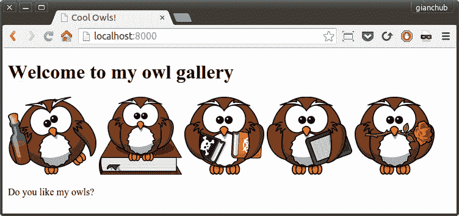
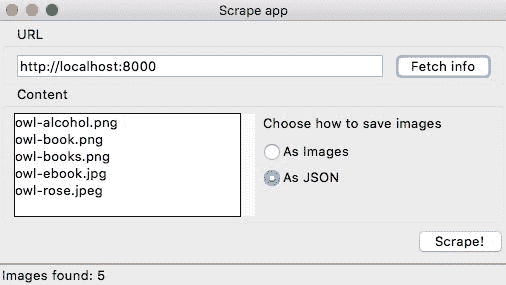
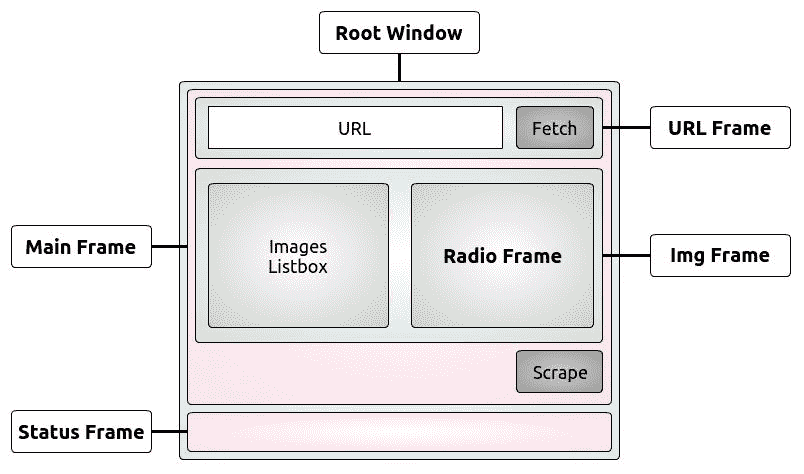
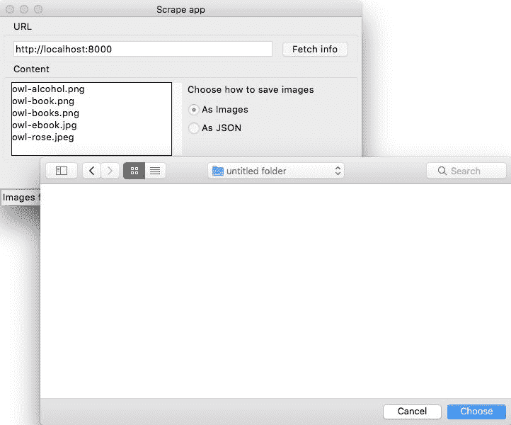
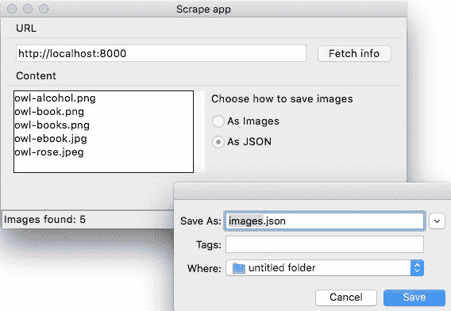
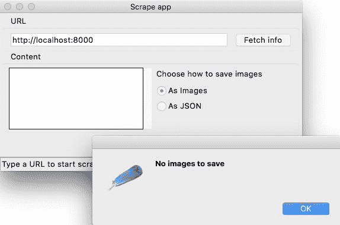

# 第十二章：GUI 和脚本

“用户界面就像一个笑话。如果你不得不解释它，那就不是那么好。”– Martin LeBlanc

在本章中，我们将一起开展一个项目。我们将编写一个简单的抓取器，用于查找和保存网页中的图像。我们将专注于三个部分：

+   Python 中的简单 HTTP 网络服务器

+   一个用于抓取给定 URL 的脚本

+   一个 GUI 应用程序，用于抓取给定 URL

**图形用户界面**（**GUI**）是一种允许用户通过图形图标、按钮和小部件与电子设备进行交互的界面类型，与需要在键盘上键入命令或文本的基于文本或命令行的界面相对。简而言之，任何浏览器，任何办公套件（如 LibreOffice）以及一般情况下，任何在单击图标时弹出的东西都是 GUI 应用程序。

因此，如果您还没有这样做，现在是在名为`ch12`的文件夹中的项目根目录中启动控制台并定位的绝佳时机。在该文件夹中，我们将创建两个 Python 模块（`scrape.py`和`guiscrape.py`）和一个文件夹（`simple_server`）。在`simple_server`中，我们将编写我们的 HTML 页面：`index.html`。图像将存储在`simple_server/img`中。

`ch12`中的结构应该是这样的：

```py
$ tree -A
.
├── guiscrape.py
├── scrape.py
└── simple_server
 ├── img
 │ ├── owl-alcohol.png
 │ ├── owl-book.png
 │ ├── owl-books.png
 │ ├── owl-ebook.jpg
 │ └── owl-rose.jpeg
 ├── index.html
 └── serve.sh
```

如果您使用的是 Linux 或 macOS，您可以像我一样将启动 HTTP 服务器的代码放在一个名为`serve.sh`的文件中。在 Windows 上，您可能想使用批处理文件。

我们要抓取的 HTML 页面具有以下结构：

```py
# simple_server/index.html
<!DOCTYPE html>
<html lang="en">
  <head><title>Cool Owls!</title></head>
  <body>
    <h1>Welcome to my owl gallery</h1>
    <div>
      
      
      
      
      
    </div>
    <p>Do you like my owls?</p>
  </body>
</html>
```

这是一个非常简单的页面，所以我们只需要注意一下，我们有五张图片，其中三张是 PNG 格式，两张是 JPG 格式（请注意，尽管它们都是 JPG 格式，但一张以`.jpg`结尾，另一张以`.jpeg`结尾，这两种都是此格式的有效扩展名）。

因此，Python 为您提供了一个非常简单的免费 HTTP 服务器，您可以使用以下命令启动它（在`simple_server`文件夹中）：

```py
$ python -m http.server 8000
Serving HTTP on 0.0.0.0 port 8000 (http://0.0.0.0:8000/) ...
127.0.0.1 - - [06/May/2018 16:54:30] "GET / HTTP/1.1" 200 -
...
```

最后一行是当您访问`http://localhost:8000`时得到的日志，我们美丽的页面将在那里提供。或者，您可以将该命令放在一个名为`serve.sh`的文件中，并使用以下命令运行它（确保它是可执行的）：

```py
$ ./serve.sh
```

它将产生相同的效果。如果您有本书的代码，您的页面应该看起来像这样：



随意使用任何其他图像集，只要您至少使用一个 PNG 和一个 JPG，并且在`src`标签中使用相对路径而不是绝对路径。我从[`openclipart.org/`](https://openclipart.org/)获取了这些可爱的猫头鹰。

# 第一种方法 - 脚本

现在，让我们开始编写脚本。我将分三步讲解源代码：导入、解析参数和业务逻辑。

# 导入

脚本的开始部分如下：

```py
# scrape.py
import argparse
import base64
import json
import os
from bs4 import BeautifulSoup
import requests
```

从顶部开始浏览它们，您会发现我们需要解析参数，然后将其提供给脚本本身（`argparse`）。我们将需要`base64`库来将图像保存在 JSON 文件中（`json`），并且我们需要打开文件进行写入（`os`）。最后，我们需要`BeautifulSoup`来轻松抓取网页，以及`requests`来获取其内容。我假设您熟悉`requests`，因为我们在之前的章节中使用过它。

我们将在《第十四章》*Web Development*中探讨 HTTP 协议和`requests`机制，所以现在，让我们简单地说，我们执行一个 HTTP 请求来获取网页的内容。我们可以使用库（如`requests`）以编程方式执行此操作，这更或多是相当于在浏览器中输入 URL 并按下*Enter*（然后浏览器获取网页内容并将其显示给您）。

所有这些导入中，只有最后两个不属于 Python 标准库，所以请确保您已经安装了它们：

```py
$ pip freeze | egrep -i "soup|requests"
beautifulsoup4==4.6.0
requests==2.18.4
```

当然，版本号可能对您来说是不同的。如果它们没有安装，请使用此命令进行安装：

```py
$ pip install beautifulsoup4==4.6.0 requests==2.18.4
```

在这一点上，我认为可能会让您困惑的唯一事情是`base64/json`对，所以请允许我花几句话来解释。

正如我们在上一章中看到的，JSON 是应用程序之间数据交换的最流行格式之一。它也被广泛用于其他目的，例如在文件中保存数据。在我们的脚本中，我们将为用户提供将图像保存为图像文件或 JSON 单个文件的功能。在 JSON 中，我们将放置一个字典，其中键是图像名称，值是它们的内容。唯一的问题是以二进制格式保存图像很棘手，这就是`base64`库发挥作用的地方。

`base64`库实际上非常有用。例如，每次您发送带有附加图像的电子邮件时，图像在发送电子邮件之前都会使用`base64`进行编码。在接收方端，图像会自动解码为其原始二进制格式，以便电子邮件客户端可以显示它们。

# 解析参数

既然技术问题已经解决，让我们看看我们脚本的第二部分（应该在`scrape.py`模块的末尾）：

```py
if __name__ == "__main__":
    parser = argparse.ArgumentParser(
        description='Scrape a webpage.')
    parser.add_argument(
        '-t',
        '--type',
        choices=['all', 'png', 'jpg'],
        default='all',
        help='The image type we want to scrape.')
    parser.add_argument(
        '-f',
        '--format',
        choices=['img', 'json'],
        default='img',
        help='The format images are _saved to.')
    parser.add_argument(
        'url',
        help='The URL we want to scrape for images.')
    args = parser.parse_args()
    scrape(args.url, args.format, args.type)
```

看看第一行；这是脚本编写时非常常见的习语。根据官方 Python 文档，`'__main__'`字符串是顶层代码执行的范围名称。当从标准输入、脚本或交互式提示中读取时，模块的`__name__`被设置为`'__main__'`。

因此，如果您将执行逻辑放在`if`下面，它将仅在直接运行脚本时运行，因为其`__name__`将为`'__main__'`。另一方面，如果您从此模块导入，则其名称将设置为其他内容，因此`if`下的逻辑将不会运行。

我们要做的第一件事是定义我们的解析器。我建议使用标准库模块`argparse`，它足够简单且功能强大。还有其他选择，但在这种情况下，`argparse`将为我们提供所需的一切。

我们希望向我们的脚本提供三种不同的数据：我们要保存的图像类型，我们要保存它们的格式以及要抓取的页面的 URL。

类型可以是 PNG、JPG 或两者（默认），而格式可以是图像或 JSON，图像是默认值。URL 是唯一的强制参数。

因此，我们添加了`-t`选项，还允许长版本`--type`。选择是`'all'`，`'png'`和`'jpg'`。我们将默认设置为`'all'`并添加一个`help`消息。

我们对`format`参数执行类似的过程，允许使用短语法和长语法（`-f`和`--format`），最后我们添加`url`参数，这是唯一一个以不同方式指定的参数，因此它不会被视为选项，而是作为位置参数。

为了解析所有参数，我们只需要`parser.parse_args()`。非常简单，不是吗？

最后一行是我们触发实际逻辑的地方，通过调用`scrape`函数，传递我们刚刚解析的所有参数。我们很快将看到它的定义。`argparse`的好处是，如果通过传递`-h`调用脚本，它将自动为您打印一个漂亮的使用文本。让我们试一试：

```py
$ python scrape.py -h
usage: scrape.py [-h] [-t {all,png,jpg}] [-f {img,json}] url

Scrape a webpage.

positional arguments:
 url The URL we want to scrape for images.

```

```py
optional arguments:
 -h, --help show this help message and exit
 -t {all,png,jpg}, --type {all,png,jpg}
 The image type we want to scrape.
 -f {img,json}, --format {img,json}
 The format images are _saved to.
```

如果您仔细考虑一下，这样做的真正优势在于我们只需要指定参数，而不必担心使用文本，这意味着我们不必在每次更改内容时保持与参数定义同步。这是非常宝贵的。

以下是调用我们的`scrape.py`脚本的几种不同方式，演示了`type`和`format`是可选的，以及如何使用短语法和长语法来使用它们：

```py
$ python scrape.py http://localhost:8000
$ python scrape.py -t png http://localhost:8000
$ python scrape.py --type=jpg -f json http://localhost:8000
```

第一个是使用`type`和`format`的默认值。第二个将仅保存 PNG 图像，第三个将仅保存 JPG 图像，但以 JSON 格式保存。

# 业务逻辑

现在我们已经看到了脚手架，让我们深入到实际的逻辑中（如果看起来令人生畏，不要担心；我们会一起学习）。在脚本中，这个逻辑位于导入之后和解析之前（在`if __name__`子句之前）。

```py
def scrape(url, format_, type_):
    try:
        page = requests.get(url)
    except requests.RequestException as err:
        print(str(err))
    else:
        soup = BeautifulSoup(page.content, 'html.parser')
        images = _fetch_images(soup, url)
        images = _filter_images(images, type_)
        _save(images, format_)
```

让我们从`scrape`函数开始。它所做的第一件事就是获取给定`url`参数的页面。无论在此过程中可能发生的任何错误，我们都会将其捕获在`RequestException`（`err`）中并打印出来。`RequestException`是`requests`库中所有异常的基本异常类。

然而，如果一切顺利，我们从`GET`请求中得到了一个页面，那么我们可以继续（`else`分支），并将其内容提供给`BeautifulSoup`解析器。`BeautifulSoup`库允许我们在很短的时间内解析网页，而不必编写查找页面上所有图像所需的所有逻辑，这是我们真的不想做的。这并不像看起来那么容易，重新发明轮子从来都不是好事。为了获取图像，我们使用`_fetch_images`函数，并用`_filter_images`对它们进行过滤。最后，我们调用`_save`来保存结果。

将代码分割成不同的函数并赋予有意义的名称，使我们更容易阅读它。即使你没有看到`_fetch_images`、`_filter_images`和`_save`函数的逻辑，也不难预测它们的功能，对吧？看看下面的内容：

```py
def _fetch_images(soup, base_url):
    images = []
    for img in soup.findAll('img'):
        src = img.get('src')
        img_url = f'{base_url}/{src}'
        name = img_url.split('/')[-1]
        images.append(dict(name=name, url=img_url))
    return images
```

`_fetch_images`接受一个`BeautifulSoup`对象和一个基本 URL。它所做的就是循环遍历页面上找到的所有图像，并在一个字典中填写关于它们的`name`和`url`信息（每个图像一个字典）。所有字典都添加到`images`列表中，并在最后返回。

当我们获取图像的名称时，有一些技巧。我们使用`'/'`作为分隔符来分割`img_url`（`http://localhost:8000/img/my_image_name.png`）字符串，并将最后一项作为图像名称。有一种更健壮的方法来做到这一点，但对于这个例子来说，这将是杀鸡用牛刀。如果你想看到每个步骤的细节，请尝试将这个逻辑分解为更小的步骤，并打印每个步骤的结果来帮助你理解。在本书的末尾，我会向你展示另一种更有效的调试技术。

无论如何，只需在`_fetch_images`函数的末尾添加`print(images)`，我们就得到了这个：

```py
[{'url': 'http://localhost:8000/img/owl-alcohol.png', 'name': 'owl-alcohol.png'}, {'url': 'http://localhost:8000/img/owl-book.png', 'name': 'owl-book.png'}, ...]  
```

我为了简洁起见截断了结果。你可以看到每个字典都有一个`url`和`name`键/值对，我们可以用它们来获取、识别和保存我们喜欢的图像。此时，我听到你在问，如果页面上的图像是用绝对路径而不是相对路径指定的，会发生什么，对吧？好问题！

答案是脚本将无法下载它们，因为这个逻辑期望相对路径。当我想要添加一点逻辑来解决这个问题时，我想在这个阶段，这将是一个很好的练习，所以我会留给你来解决它。

提示：检查`src`变量的开头。如果以`'http'`开头，那么它可能是一个绝对路径。你可能还想查看`urllib.parse`来做到这一点。

我希望`_filter_images`函数的主体对你有趣。我想向你展示如何使用映射技术来检查多个扩展名：

```py
def _filter_images(images, type_):
    if type_ == 'all':
        return images
    ext_map = {
        'png': ['.png'],
        'jpg': ['.jpg', '.jpeg'],
    }
    return [
        img for img in images
        if _matches_extension(img['name'], ext_map[type_])
    ]

def _matches_extension(filename, extension_list):
    name, extension = os.path.splitext(filename.lower())
    return extension in extension_list
```

在这个函数中，如果`type_`是`all`，那么不需要进行过滤，所以我们只返回所有的图像。另一方面，当`type_`不是`all`时，我们从`ext_map`字典中获取允许的扩展名，并用它来过滤函数体结束的列表推导式中的图像。你可以看到，通过使用另一个辅助函数`_matches_extension`，我使列表推导式更简单、更易读。

`_matches_extension`函数所做的就是分割获取图像扩展名的名称，并检查它是否在允许的列表中。你能找到一个微小的改进（速度方面）可以应用到这个函数吗？

我相信你一定想知道为什么我要将所有图像收集到列表中，然后再删除它们，而不是在将它们添加到列表之前检查是否要保存它们。第一个原因是我现在需要在 GUI 应用程序中使用`_fetch_images`。第二个原因是合并、获取和过滤会产生一个更长更复杂的函数，而我正在尽量降低复杂性。第三个原因是这可能是一个很好的练习给你做：

```py
def _save(images, format_):
    if images:
        if format_ == 'img':
            _save_images(images)
        else:
            _save_json(images)
        print('Done')
    else:
        print('No images to save.')

def _save_images(images):
    for img in images:
        img_data = requests.get(img['url']).content
        with open(img['name'], 'wb') as f:
            f.write(img_data)

def _save_json(images):
    data = {}
    for img in images:
        img_data = requests.get(img['url']).content
        b64_img_data = base64.b64encode(img_data)
        str_img_data = b64_img_data.decode('utf-8')
        data[img['name']] = str_img_data
    with open('images.json', 'w') as ijson:
        ijson.write(json.dumps(data))
```

让我们继续阅读代码并检查`_save`函数。你可以看到，当`images`不为空时，这基本上充当一个调度程序。我们要么调用`_save_images`，要么调用`_save_json`，这取决于`format_`变量中存储的信息。

我们快要完成了。让我们跳到`_save_images`。我们循环遍历`images`列表，对于我们在那里找到的每个字典，我们对图像 URL 执行一个`GET`请求，并将其内容保存在一个文件中，我们将其命名为图像本身。

最后，现在让我们进入`_save_json`函数。它与之前的函数非常相似。我们基本上填充了`data`字典。图像名称是*键*，其二进制内容的 Base64 表示是*值*。当我们完成填充字典时，我们使用`json`库将其转储到`images.json`文件中。我会给你一个小预览：

```py
# images.json (truncated)
{
  "owl-alcohol.png": "iVBORw0KGgoAAAANSUhEUgAAASwAAAEICA...
  "owl-book.png": "iVBORw0KGgoAAAANSUhEUgAAASwAAAEbCAYAA...
  "owl-books.png": "iVBORw0KGgoAAAANSUhEUgAAASwAAAElCAYA...
  "owl-ebook.jpg": "/9j/4AAQSkZJRgABAQEAMQAxAAD/2wBDAAEB...
  "owl-rose.jpeg": "/9j/4AAQSkZJRgABAQEANAA0AAD/2wBDAAEB...
}
```

就是这样！现在，在继续下一部分之前，请确保你玩过这个脚本并了解它是如何工作的。尝试修改一些东西，打印出中间结果，添加一个新的参数或功能，或者打乱逻辑。我们现在将把它迁移到一个 GUI 应用程序中，这将增加一层复杂性，因为我们将不得不构建 GUI 界面，所以熟悉业务逻辑非常重要——这将使你能够集中精力处理代码的其余部分。

# 第二种方法-一个 GUI 应用程序

有几个库可以用 Python 编写 GUI 应用程序。最著名的是**Tkinter**、**wxPython**、**PyGTK**和**PyQt**。它们都提供了各种工具和小部件，可以用来组成 GUI 应用程序。

我将在本章的其余部分中使用 Tkinter。**Tkinter**代表**Tk 界面**，它是 Python 与 Tk GUI 工具包的标准接口。Tk 和 Tkinter 都可以在大多数 Unix 平台、macOS X 以及 Windows 系统上使用。

让我们通过运行这个命令来确保`tkinter`在你的系统上安装正确：

```py
$ python -m tkinter
```

它应该打开一个对话框窗口，展示一个简单的`Tk`界面。如果你能看到它，那就没问题。但是，如果它不起作用，请在 Python 官方文档中搜索`tkinter`（[`docs.python.org/3.7/library/tkinter.html`](https://docs.python.org/3.7/library/tkinter.html)）。你会找到一些资源的链接，这些资源将帮助你快速上手。

我们将制作一个非常简单的 GUI 应用程序，基本上模仿本章第一部分中所见的脚本的行为。我们不会添加单独保存 JPG 或 PNG 的功能，但在你完成本章后，你应该能够玩转代码，并自己加入该功能。

所以，这就是我们的目标：



华丽，不是吗？正如你所看到的，这是一个非常简单的界面（这是在 Mac 上的样子）。有一个框架（即容器）用于 URL 字段和获取信息按钮，另一个框架用于**Listbox**（内容）来保存图像名称和控制保存方式的单选按钮，最后底部有一个抓取按钮。我们还有一个状态栏，它会向我们显示一些信息。

为了获得这种布局，我们可以将所有小部件放在根窗口上，但那样会使布局逻辑变得非常混乱和不必要地复杂。因此，我们将使用框架来划分空间，并将小部件放在这些框架中。这样我们将获得一个更好的结果。所以，这是布局的草案：



我们有一个**根窗口**，它是应用程序的主窗口。我们将它分成两行，第一行放置**主框架**，第二行放置**状态框架**（用于保存状态栏文本）。**主框架**随后被分成三行。在第一行，我们放置**URL 框架**，其中包含**URL**小部件。在第二行，我们放置**Img 框架**，它将包含**Listbox**和**Radio 框架**，后者将承载一个标签和单选按钮小部件。最后我们有第三行，它将只包含**Scrape**按钮。

为了布局框架和小部件，我们将使用一个布局管理器，称为**grid**，它简单地将空间分成行和列，就像矩阵一样。

现在，我要写的所有代码都来自`guiscrape.py`模块，所以我不会为每个片段重复它的名称，以节省空间。该模块在逻辑上分为三个部分，与脚本版本类似：导入、布局逻辑和业务逻辑。我们将逐行分析它们，分为三个部分。

# 导入

导入与脚本版本类似，只是我们失去了`argparse`，它不再需要，并且添加了两行：

```py
# guiscrape.py
from tkinter import * 
from tkinter import ttk, filedialog, messagebox 
...
```

第一行在处理`tkinter`时是相当常见的做法，尽管通常使用`*`语法进行导入是不好的做法*.*你可能会遇到名称冲突，而且如果模块太大，导入所有内容将会很昂贵。

之后，我们明确导入了`ttk`，`filedialog`和`messagebox`，遵循了这个库的常规方法。`ttk`是一组新的样式化小部件。它们基本上的行为与旧的小部件相同，但能够根据操作系统的样式正确地绘制自己，这很好。

其余的导入（已省略）是我们现在所熟知的任务所需的。请注意，在这第二部分中，我们不需要使用`pip`安装任何东西；我们已经拥有了我们需要的一切。

# 布局逻辑

我将逐块粘贴它，这样我可以更容易地向你解释。你会看到我们在布局草案中讨论的所有那些部分是如何排列和粘合在一起的。我将要粘贴的内容，就像我们之前在脚本中所做的那样，是`guiscrape.py`模块的最后部分。我们将最后留下中间部分，也就是业务逻辑：

```py
if __name__ == "__main__":
    _root = Tk()
    _root.title('Scrape app')
```

正如你现在所知，我们只想在模块直接运行时执行逻辑，所以第一行不应该让你感到惊讶。

在最后两行，我们设置了主窗口，它是`Tk`类的一个实例。我们实例化它并给它一个标题。请注意，我使用了`tkinter`对象的所有名称的前置下划线技术，以避免与业务逻辑中的名称潜在冲突。我觉得这样更清晰，但你可以不同意：

```py
    _mainframe = ttk.Frame(_root, padding='5 5 5 5')
    _mainframe.grid(row=0, column=0, sticky=(E, W, N, S))
```

在这里，我们设置了**主框架**。它是一个`ttk.Frame`实例。我们将`_root`设置为它的父级，并给它一些`padding`。`padding`是以像素为单位的度量，用于在内部内容和边框之间插入多少空间，以便让我们的布局有一点空间，否则我们会有一个*沙丁鱼效应*，小部件被过紧地打包在一起。

第二行更有趣。我们将这个`_mainframe`放在父对象`_root`的第一行（`0`）和第一列（`0`）。我们还说这个框架需要在每个方向上扩展自己，使用`sticky`参数和所有四个基本方向。如果你想知道它们是从哪里来的，那就是`from tkinter import *`魔法给我们带来的：

```py
    _url_frame = ttk.LabelFrame(
        _mainframe, text='URL', padding='5 5 5 5')
    _url_frame.grid(row=0, column=0, sticky=(E, W))
    _url_frame.columnconfigure(0, weight=1)
    _url_frame.rowconfigure(0, weight=1)
```

接下来，我们首先放置**URL Frame**。这次，父对象是`_mainframe`，正如您从我们的草图中记得的那样。这不仅仅是一个简单的`Frame`，它实际上是一个`LabelFrame`，这意味着我们可以设置文本参数，并期望在其周围绘制一个矩形，并在其左上部分写入文本参数的内容（如果有必要，请查看上一张图片）。我们将此框架定位在（`0`，`0`），并说它应该向左和向右扩展。我们不需要其他两个方向。

最后，我们使用`rowconfigure`和`columnconfigure`来确保它在需要调整大小时能够正确运行。这只是我们当前布局中的一种形式：

```py
    _url = StringVar()
    _url.set('http://localhost:8000')
    _url_entry = ttk.Entry(
        _url_frame, width=40, textvariable=_url)
    _url_entry.grid(row=0, column=0, sticky=(E, W, S, N), padx=5)
    _fetch_btn = ttk.Button(
        _url_frame, text='Fetch info', command=fetch_url)
    _fetch_btn.grid(row=0, column=1, sticky=W, padx=5)
```

在这里，我们有布局 URL 文本框和`_fetch`按钮的代码。在这种环境中，文本框称为`Entry`。我们像往常一样实例化它，将`_url_frame`设置为其父级并为其设置宽度。而且，这是最有趣的部分，我们将`textvariable`参数设置为`_url`。`_url`是`StringVar`，它是一个现在连接到`Entry`并将用于操作其内容的对象。因此，我们不直接修改`_url_entry`实例中的文本，而是通过访问`_url`。在这种情况下，我们调用其`set`方法将初始值设置为我们本地网页的 URL。

我们将`_url_entry`定位在（`0`，`0`），为其设置了四个基本方向，使其粘附，并且还使用`padx`在左右边缘设置了一些额外的填充，该参数在*x*轴（水平）上添加填充。另一方面，`pady`负责垂直方向。

到目前为止，您应该知道每次在对象上调用`.grid`方法时，我们基本上都在告诉网格布局管理器根据我们在`grid()`调用中指定的规则将该对象放置在某个地方。

类似地，我们设置并放置了`_fetch`按钮。唯一有趣的参数是`command=fetch_url`。这意味着当我们单击此按钮时，我们调用`fetch_url`函数。这种技术称为**回调**：

```py
    _img_frame = ttk.LabelFrame(
        _mainframe, text='Content', padding='9 0 0 0')
    _img_frame.grid(row=1, column=0, sticky=(N, S, E, W))
```

这就是我们在布局草图中称为**Img Frame**的东西。它放置在其父级`_mainframe`的第二行。它将容纳**Listbox**和**Radio Frame**：

```py
    _images = StringVar()
    _img_listbox = Listbox(
        _img_frame, listvariable=_images, height=6, width=25)
    _img_listbox.grid(row=0, column=0, sticky=(E, W), pady=5)
    _scrollbar = ttk.Scrollbar(
        _img_frame, orient=VERTICAL, command=_img_listbox.yview)
    _scrollbar.grid(row=0, column=1, sticky=(S, N), pady=6)
    _img_listbox.configure(yscrollcommand=_scrollbar.set)
```

这可能是整个布局逻辑中最有趣的部分。与`_url_entry`一样，我们需要通过将其绑定到`_images`变量来驱动`Listbox`的内容。我们设置`Listbox`，使`_img_frame`成为其父级，并且`_images`是其绑定的变量。我们还传递了一些尺寸。

有趣的部分来自`_scrollbar`实例。请注意，当我们实例化它时，我们将其命令设置为`_img_listbox.yview`。这是`Listbox`和`Scrollbar`之间的合同的第一部分。另一半由`_img_listbox.configure`方法提供，该方法设置`yscrollcommand=_scrollbar.set`。

通过提供这种相互关系，当我们在`Listbox`上滚动时，`Scrollbar`将相应移动，反之亦然，当我们操作`Scrollbar`时，`Listbox`将相应滚动：

```py
    _radio_frame = ttk.Frame(_img_frame)
    _radio_frame.grid(row=0, column=2, sticky=(N, S, W, E))
```

我们放置**Radio Frame**，准备填充。请注意，`Listbox`占据了`_img_frame`的（`0`，`0`），`Scrollbar`占据了（`0`，`1`），因此`_radio_frame`将放在（`0`，`2`）：

```py
    _choice_lbl = ttk.Label(
        _radio_frame, text="Choose how to save images")
    _choice_lbl.grid(row=0, column=0, padx=5, pady=5)
    _save_method = StringVar()
    _save_method.set('img')
    _img_only_radio = ttk.Radiobutton(
        _radio_frame, text='As Images', variable=_save_method,
        value='img')
    _img_only_radio.grid(
        row=1, column=0, padx=5, pady=2, sticky=W)
    _img_only_radio.configure(state='normal')
    _json_radio = ttk.Radiobutton(
        _radio_frame, text='As JSON', variable=_save_method,
        value='json')
    _json_radio.grid(row=2, column=0, padx=5, pady=2, sticky=W)
```

首先，我们放置标签，并为其添加一些填充。请注意，标签和单选按钮都是`_radio_frame`的子级。

至于`Entry`和`Listbox`对象，`Radiobutton`也受到与外部变量的绑定的影响，我称之为`_save_method`。每个`Radiobutton`实例都设置了一个值参数，通过检查`_save_method`上的值，我们知道

选择哪个按钮：

```py
    _scrape_btn = ttk.Button(
        _mainframe, text='Scrape!', command=save)
    _scrape_btn.grid(row=2, column=0, sticky=E, pady=5)
```

在`_mainframe`的第三行放置**Scrape**按钮。其`command`是`save`，在成功解析网页后，将图像保存到`Listbox`中：

```py
    _status_frame = ttk.Frame(
        _root, relief='sunken', padding='2 2 2 2')
    _status_frame.grid(row=1, column=0, sticky=(E, W, S))
    _status_msg = StringVar()
    _status_msg.set('Type a URL to start scraping...')
    _status = ttk.Label(
        _status_frame, textvariable=_status_msg, anchor=W)
    _status.grid(row=0, column=0, sticky=(E, W))
```

我们通过放置状态框架来结束布局部分，这是一个简单的`ttk.Frame`。为了给它一个小小的状态栏效果，我们将其`relief`属性设置为`'sunken'`，并给它统一的两像素填充。它需要粘附在`_root`窗口的左侧、右侧和底部，因此我们将其`sticky`属性设置为`(E, W, S)`。

然后我们在其中放置一个标签，并且这次我们将其绑定到`StringVar`对象，因为我们每次想要更新状态栏文本时都必须修改它。您现在应该熟悉这种技术了。

最后，在最后一行，我们通过在`Tk`实例上调用`mainloop`方法来运行应用程序：

```py
    _root.mainloop()
```

请记住，所有这些指令都放在原始脚本中的`if __name__ == "__main__":`子句下。

如您所见，设计我们的 GUI 应用程序的代码并不难。当然，在开始时，您必须稍微尝试一下。并不是每件事情都会在第一次尝试时完美无缺，但我向您保证，这非常容易，您可以在网上找到大量的教程。现在让我们来到有趣的部分，业务逻辑。

# 业务逻辑

我们将分析 GUI 应用程序的业务逻辑分为三个部分。有获取逻辑、保存逻辑和警报逻辑。

# 获取网页

让我们从获取页面和图片的代码开始：

```py
config = {}

def fetch_url():
    url = _url.get()
    config['images'] = []
    _images.set(())  # initialised as an empty tuple
    try:
        page = requests.get(url)
    except requests.RequestException as err:
        _sb(str(err))
    else:
        soup = BeautifulSoup(page.content, 'html.parser')
        images = fetch_images(soup, url)
        if images:
            _images.set(tuple(img['name'] for img in images))
            _sb('Images found: {}'.format(len(images)))
        else:
            _sb('No images found')
        config['images'] = images

def fetch_images(soup, base_url):
    images = []
    for img in soup.findAll('img'):
        src = img.get('src')
        img_url = f'{base_url}/{src}'
        name = img_url.split('/')[-1]
        images.append(dict(name=name, url=img_url))
    return images
```

首先，让我解释一下`config`字典。我们需要一种在 GUI 应用程序和业务逻辑之间传递数据的方式。现在，我个人偏好的做法是，不是用许多不同的变量污染全局命名空间，而是使用一个单一的字典，其中包含我们需要来回传递的所有对象，这样全局命名空间就不会被所有这些名称弄得混乱，我们有一个单一、清晰、简单的方式来知道我们应用程序所需的所有对象在哪里。

在这个简单的例子中，我们将`config`字典填充了我们从页面获取的图片，但我想向您展示这种技术，这样您至少有一个例子。这种技术来自于我的 JavaScript 经验。当您编写网页时，通常会导入几种不同的库。如果每个库都用各种变量弄乱了全局命名空间，可能会出现问题，因为名称冲突和变量覆盖的问题。

因此，最好尽量保持全局命名空间的清洁。在这种情况下，我发现使用一个`config`变量是完全可以接受的。

`fetch_url`函数与我们在脚本中所做的非常相似。首先，我们通过调用`_url.get()`来获取`url`的值。请记住，`_url`对象是一个绑定到`_url_entry`对象的`StringVar`实例，后者是一个`Entry`。您在 GUI 上看到的文本字段是`Entry`，但在幕后的文本是`StringVar`对象的值。

通过在`_url`上调用`get()`，我们可以获得文本的值，该值显示在`_url_entry`中。

下一步是准备`config['images']`为空列表，并清空与`_img_listbox`绑定的`_images`变量。当然，这会清理`_img_listbox`中的所有项目。

准备工作完成后，我们可以尝试获取页面，使用与本章开头的脚本中采用的相同的`try`/`except`逻辑。唯一的区别是如果出现问题，我们会调用`_sb(str(err))`。`_sb`是一个帮助函数，我们很快就会看到它的代码。基本上，它为我们设置状态栏中的文本。不是一个好名字，对吧？我不得不向您解释它的行为-值得思考。

如果我们可以获取页面，那么我们就创建`soup`实例，并从中获取图片。`fetch_images`的逻辑与之前解释的逻辑完全相同，因此我就不在这里重复了。

如果我们有图像，我们使用一个快速的元组推导式（实际上是一个生成器表达式馈送到一个元组构造函数），将`_images`作为`StringVar`，这会使我们的`_img_listbox`填充所有图像名称。最后，我们更新状态栏。

如果没有图像，我们仍然更新状态栏，并且在函数结束时，无论找到了多少图像，我们都会更新`config['images']`以保存`images`列表。这样，我们就能够通过检查`config['images']`而无需传递该列表来从其他函数中访问图像。

# 保存图像

保存图像的逻辑非常简单。如下所示：

```py
def save():
    if not config.get('images'):
        _alert('No images to save')
        return

    if _save_method.get() == 'img':
        dirname = filedialog.askdirectory(mustexist=True)
        _save_images(dirname)
    else:
        filename = filedialog.asksaveasfilename(
            initialfile='images.json',
            filetypes=[('JSON', '.json')])
        _save_json(filename)

def _save_images(dirname):
    if dirname and config.get('images'):
        for img in config['images']:
            img_data = requests.get(img['url']).content
            filename = os.path.join(dirname, img['name'])
            with open(filename, 'wb') as f:
                f.write(img_data)
        _alert('Done')

def _save_json(filename):
    if filename and config.get('images'):
        data = {}
        for img in config['images']:
            img_data = requests.get(img['url']).content
            b64_img_data = base64.b64encode(img_data)
            str_img_data = b64_img_data.decode('utf-8')
            data[img['name']] = str_img_data

        with open(filename, 'w') as ijson:
            ijson.write(json.dumps(data))
        _alert('Done')
```

当用户点击抓取按钮时，使用回调机制调用`save`函数。

这个函数的第一件事就是检查是否有要保存的图像。如果没有，它会使用另一个辅助函数`_alert`来提醒用户，我们很快就会看到它的代码。如果没有图像，就不会执行进一步的操作。

另一方面，如果`config['images']`列表不为空，`save`充当一个调度程序，并根据`_same_method`持有的值调用`_save_images`或`_save_json`。请记住，这个变量与单选按钮相关联，因此我们期望它的值要么是`'img'`，要么是`'json'`。

这个调度程序与脚本中的不同。根据我们选择的方法，必须采取不同的操作。

如果我们想要将图像保存为图像，我们需要要求用户选择一个目录。我们通过调用`filedialog.askdirectory`并将调用的结果分配给`dirname`变量来实现这一点。这将打开一个漂亮的对话框窗口，询问我们选择一个目录。我们选择的目录必须存在，如我们调用该方法的方式所指定的。这样做是为了在保存文件时不必编写处理可能缺少的目录的代码。

这个对话框在 mac 上应该是这样的：



如果我们取消操作，`dirname`将被设置为`None`。

在完成对`save`中的逻辑分析之前，让我们快速浏览一下`_save_images`。

它与脚本中的版本非常相似，因此请注意，在开始时，为了确保我们确实有事情要做，我们检查`dirname`和`config['images']`中至少有一张图像的存在。

如果是这样，这意味着我们至少有一个要保存的图像和它的路径，所以我们可以继续。保存图像的逻辑已经解释过了。这一次我们做的不同的一件事是，通过`os.path.join`将目录（即完整路径）与图像名称连接起来。

在`_save_images`结束时，如果我们至少保存了一张图像，我们会提醒用户我们已经完成了。

现在让我们回到`save`中的另一个分支。当用户在按下抓取按钮之前选择了作为 JSON 的单选按钮时，将执行此分支。在这种情况下，我们想要保存一个文件；因此，我们不能只要求一个目录。我们还希望让用户有能力选择一个文件名。因此，我们启动了一个不同的对话框：`filedialog.asksaveasfilename`。

我们传递一个初始文件名，该文件名建议给用户-如果他们不喜欢它，他们有能力更改它。此外，因为我们正在保存一个 JSON 文件，我们通过传递`filetypes`参数来强制用户使用正确的扩展名。这是一个列表，其中包含任意数量的两元组*(描述，扩展名)*，用于运行对话框的逻辑。

这个对话框在 macOS 上应该是这样的：



一旦我们选择了一个位置和一个文件名，我们就可以继续进行保存逻辑，这与之前的脚本中的逻辑相同。我们从一个 Python 字典（`data`）创建一个 JSON 对象，该字典由`images`名称和 Base64 编码内容组成的键值对。

在`_save_json`中，我们还有一个小检查，确保我们没有文件名和至少一个要保存的图像时不会继续。这确保了如果用户按下取消按钮，不会发生任何不好的事情。

# 警告用户

最后，让我们看看警报逻辑。这非常简单：

```py
def _sb(msg):
    _status_msg.set(msg)

def _alert(msg):
    messagebox.showinfo(message=msg)
```

就改变状态栏消息而言，我们所需要做的就是访问`_status_msg` `StringVar`，因为它与`_status`标签相关联。

另一方面，如果我们想向用户显示更明显的消息，我们可以弹出一个消息框。在 Mac 上应该是这样的：



`messagebox`对象还可以用于警告用户（`messagebox.showwarning`）或者表示错误（`messagebox.showerror`）。但它也可以用于提供询问我们是否确定要继续或者是否真的要删除那个文件等对话框。

如果你通过简单地打印`dir(messagebox)`的返回值来检查`messagebox`，你会发现诸如`askokcancel`、`askquestion`、`askretrycancel`、`askyesno`和`askyesnocancel`等方法，以及一组常量来验证用户的响应，如`CANCEL`、`NO`、`OK`、`OKCANCEL`、`YES`和`YESNOCANCEL`。你可以将这些与用户的选择进行比较，以便知道对话框关闭时执行的下一个操作。

# 我们如何改进应用程序？

现在你已经习惯了设计 GUI 应用程序的基础知识，我想给你一些建议，如何使我们的应用程序更好。

我们可以从代码质量开始。你认为这段代码足够好，还是你会改进它？如果是的话，你会怎么做？我会测试它，并确保它是健壮的，并且考虑到用户可能通过点击应用程序而创建的各种情况。我还会确保当我们正在抓取的网站因任何原因而关闭时，行为是我所期望的。

我们可以改进的另一件事是命名。我谨慎地用下划线作为前缀命名了所有组件，既突出了它们的*私有*性质，又避免了与它们链接的底层对象发生名称冲突。但回想起来，许多这些组件可能需要更好的名称，因此真的取决于你重构，直到找到最适合你的形式。你可以从给`_sb`函数一个更好的名称开始！

就用户界面而言，你可以尝试调整主应用程序的大小。看看会发生什么？整个内容保持不变。如果你扩展，会添加空白空间，如果你缩小，整个小部件集会逐渐消失。这种行为并不是很好，因此一个快速的解决方案可能是使根窗口固定（即无法调整大小）。

你可以做的另一件事是改进应用程序，使其具有与脚本中相同的功能，只保存 PNG 或 JPG。为了做到这一点，你可以在某个地方放置一个组合框，有三个值：全部、PNG、JPG，或类似的东西。用户在保存文件之前应该能够选择其中一个选项。

更好的是，你可以更改`Listbox`的声明，以便可以同时选择多个图像，并且只保存所选的图像。如果你成功做到这一点（相信我，这并不像看起来那么难），那么你应该考虑更好地呈现`Listbox`，也许为行提供交替的背景颜色。

你可以添加的另一件好事是添加一个按钮，打开一个对话框来选择一个文件。文件必须是应用程序可以生成的 JSON 文件之一。一旦选择，你可以运行一些逻辑来从它们的 Base64 编码版本重建图像。这样做的逻辑非常简单，所以这里有一个例子：

```py
with open('images.json', 'r') as f:
    data = json.loads(f.read())

for (name, b64val) in data.items():
    with open(name, 'wb') as f:
        f.write(base64.b64decode(b64val))
```

如你所见，我们需要以读模式打开`images.json`，并获取`data`字典。一旦我们有了它，我们就可以循环遍历它的项目，并保存每个图像的 Base64 解码内容。我会把这个逻辑留给你，让你把它与应用程序中的一个按钮联系起来。

你可以添加的另一个很酷的功能是能够打开一个预览窗格，显示从`Listbox`中选择的任何图像，这样用户就可以在决定保存它们之前先看一眼这些图像。

最后，对于这个应用的最后一个建议是添加一个菜单。甚至可以添加一个简单的菜单，包括文件和？来提供通常的帮助或关于。只是为了好玩。添加菜单并不复杂；你可以添加文本、键盘快捷键、图像等等。

# 我们从这里去哪里？

如果你对深入了解 GUI 的世界感兴趣，那么我想给你提几个建议。

# 乌龟模块

`turtle`模块是 Python 标准发行版中自 Python 2.5 版本以来的同名模块的扩展重新实现。这是向孩子介绍编程的一种非常受欢迎的方式。

它基于一个想象中的乌龟从笛卡尔平面的(0, 0)开始的想法。你可以通过编程命令乌龟向前和向后移动，旋转等等；通过组合所有可能的移动，可以绘制各种复杂的形状和图像。

它绝对值得一看，即使只是为了看到一些不同的东西。

# wxPython，PyQt 和 PyGTK

在你探索了 tkinter 的广阔领域之后，我建议你探索其他 GUI 库：wxPython（https://www.wxpython.org/），PyQt（https://riverbankcomputing.com/software/pyqt/intro），和 PyGTK（https://pygobject.readthedocs.io/en/latest/）。你可能会发现其中一个更适合你，或者它会让你更容易编写你需要的应用程序。

我相信只有当编码人员意识到他们可以使用的工具时，他们才能实现他们的想法。如果你的工具集太狭窄，你的想法可能看起来是不可能的，或者非常难以实现，它们可能会保持原样，只是想法。

当然，今天的技术范围是巨大的，所以不可能了解一切；因此，当你要学习新技术或新主题时，我的建议是通过广度优先探索来增加你的知识。

调查几件事情，然后深入研究看起来最有希望的一个或几个。这样你就能至少用一种工具高效地工作，当这个工具不再满足你的需求时，你会知道在哪里深入挖掘，感谢你之前的探索。

# 最少惊讶法则

在设计界面时，有许多不同的事情需要牢记。其中一个对我来说最重要的是最少惊讶法则。它基本上是说，如果在你的设计中一个必要的功能具有很高的惊讶因素，可能需要重新设计你的应用程序。举个例子，当你习惯于在 Windows 上工作时，最小化、最大化和关闭窗口的按钮在右上角，但在 Linux 上工作时，它们在左上角，这是相当困难的。你会发现自己不断地去右上角，只发现按钮在另一边。

如果某个按钮在应用程序中变得如此重要，以至于设计师现在将其放在一个精确的位置，请不要创新。只需遵循惯例。用户只会在不得不花时间寻找不在预期位置的按钮时感到沮丧。

对这个规则的忽视是我无法使用 Jira 等产品的原因。做简单的事情花费了我几分钟的时间，本应该只需要几秒钟。

# 线程考虑

这个主题超出了本书的范围，但我还是想提一下。

如果你正在编写一个 GUI 应用程序，需要在点击按钮时执行一个长时间运行的操作，你会发现你的应用程序可能会在操作完成之前冻结。为了避免这种情况，并保持应用程序的响应性，你可能需要在不同的线程（甚至是不同的进程）中运行那个耗时的操作，这样操作系统就能够不时地为 GUI 分配一点时间，以保持其响应性。

首先要对基本原理有很好的掌握，然后再去享受探索的乐趣！

# 总结

在本章中，我们一起完成了一个项目。我们编写了一个脚本，可以抓取一个非常简单的网页，并接受可选命令来改变其行为。我们还编写了一个 GUI 应用程序，通过点击按钮而不是在控制台上输入来完成相同的操作。我希望你阅读和跟随的过程和我写作的过程一样愉快。

我们看到了许多不同的概念，比如处理文件和执行 HTTP 请求，并讨论了可用性和设计的指导方针。

我只能触及皮毛，但希望你有一个很好的起点，可以从中扩展你的探索。

在整个章节中，我指出了几种不同的改进应用程序的方法，并向你提出了一些练习和问题。我希望你花时间去尝试这些想法。你可以通过玩弄像我们一起编写的这个应用程序一样有趣的应用程序来学到很多东西。

在下一章中，我们将讨论数据科学，或者至少讨论一下当涉及这个主题时，Python 程序员所拥有的工具。
