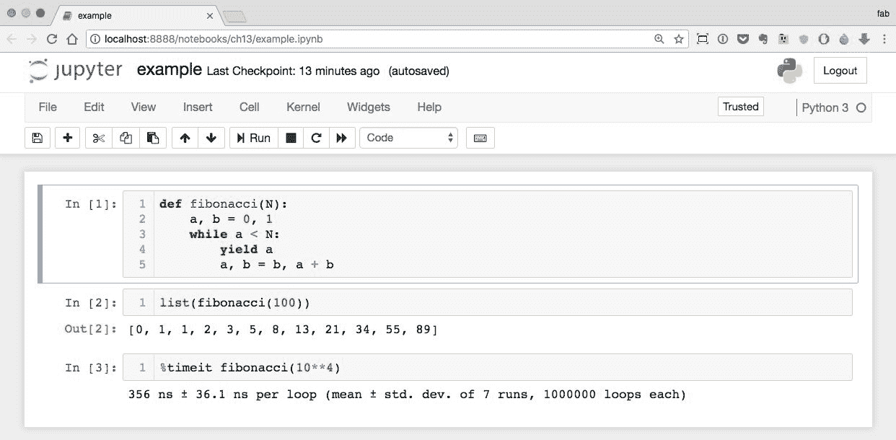
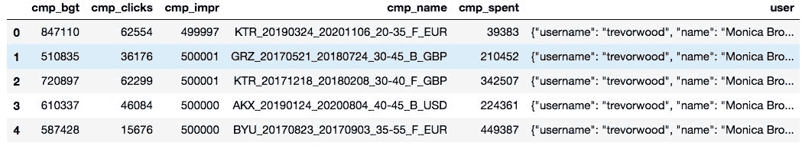
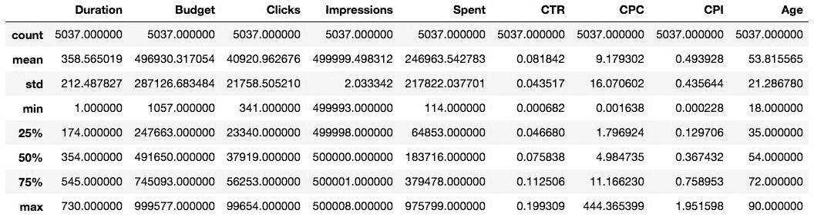
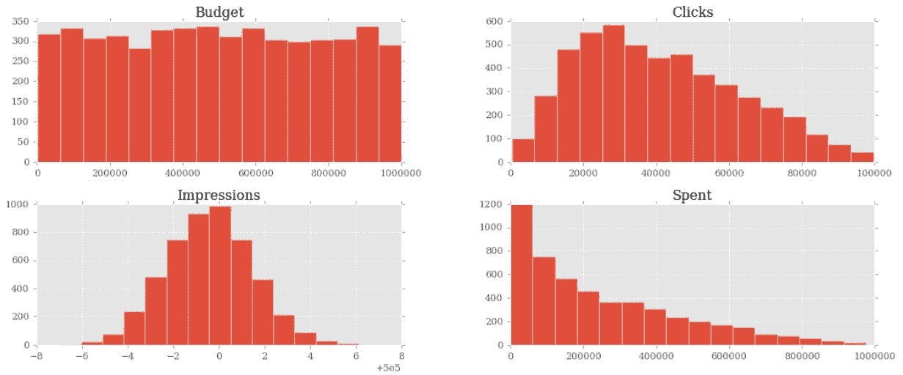
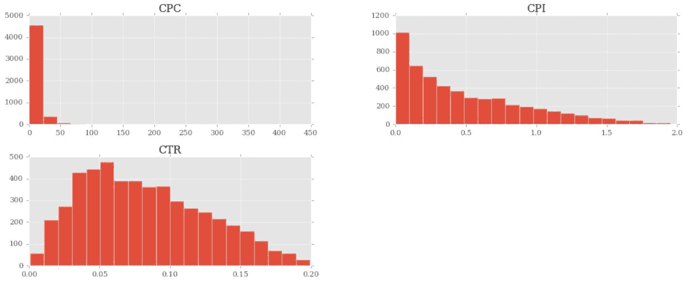
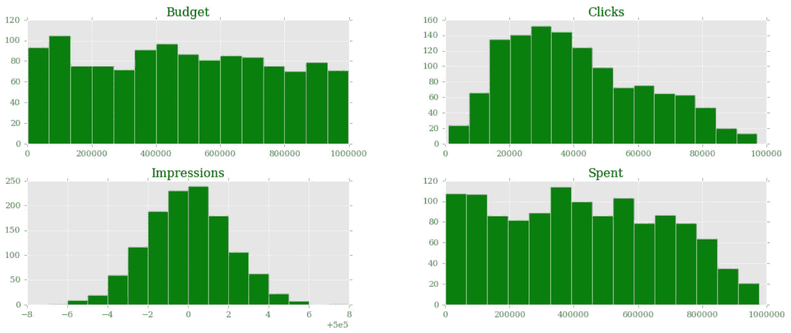
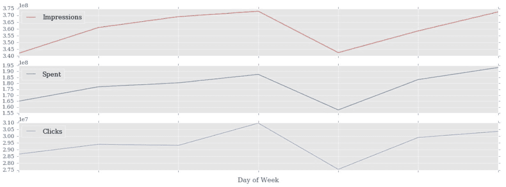
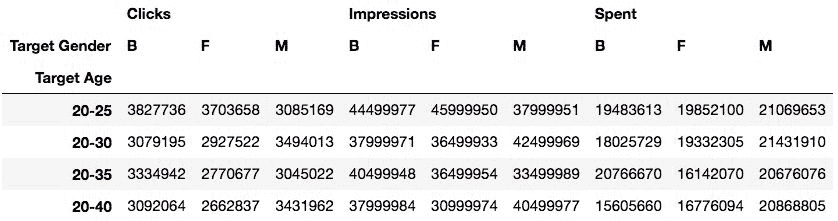

# 第十三章：数据科学

“如果我们有数据，让我们看看数据。如果我们只有意见，那就听我的。”- Jim Barksdale，前网景公司 CEO

**数据科学**是一个非常广泛的术语，根据上下文、理解、工具等可以有几种不同的含义。关于这个主题有无数的书籍，这对心脏脆弱的人来说并不适合。

为了做好数据科学，你至少需要了解数学和统计学。然后，你可能想深入研究其他学科，比如模式识别和机器学习，当然，你可以选择各种语言和工具。

我无法在这里讨论所有内容。因此，为了使本章有意义，我们将一起做一个很酷的项目。

大约在 2012/2013 年，我在伦敦一家顶级社交媒体公司工作。我在那里呆了两年，很荣幸能和一些非常聪明的人一起工作，他们的才华令我只能开始描述。我们是世界上第一个可以访问 Twitter 广告 API 的公司，我们也是 Facebook 的合作伙伴。这意味着有大量的数据。

我们的分析师们处理了大量的活动，并且他们为了完成工作而苦苦挣扎，所以我所在的开发团队尝试通过介绍 Python 和 Python 提供的处理数据的工具来帮助他们。这是一段非常有趣的旅程，让我在公司里指导了几个人，最终带我去了马尼拉，在那里我为分析师们进行了为期两周的 Python 和数据科学密集培训。

我们在本章中要做的项目是我在马尼拉向学生展示的最终示例的轻量级版本。我已经重新编写了它，使其适合本章的篇幅，并对一些地方进行了一些调整，但所有主要概念都在其中，所以对你来说应该是有趣和有教育意义的。

具体来说，我们将探讨以下内容：

+   Jupyter Notebook

+   Pandas 和 NumPy：Python 中的数据科学主要库

+   Pandas 的`DataFrame`类的一些概念

+   创建和操作数据集

让我们先谈谈罗马神话中的神祗。

# IPython 和 Jupyter Notebook

在 2001 年，Fernando Perez 是科罗拉多大学博尔德分校的物理学研究生，他试图改进 Python shell，以便在使用类似 Mathematica 和 Maple 等工具时能够获得他习惯的便利。这一努力的结果被命名为**IPython**。

简而言之，那个小脚本最初是 Python shell 的增强版本，通过其他编码人员的努力，最终得到了来自不同公司的适当资金支持，成为了今天的出色和成功的项目。它诞生 10 年后，一个 Notebook 环境被创建，由 WebSockets、Tornado web 服务器、jQuery、CodeMirror 和 MathJax 等技术提供支持。ZeroMQ 库也被用来处理 Notebook 界面和其背后的 Python 核心之间的消息。

IPython Notebook 变得如此受欢迎和广泛使用，随着时间的推移，各种好东西都被添加进去。它可以处理小部件、并行计算、各种媒体格式等等。而且，在某个时候，甚至可以在 Notebook 内部使用 Python 以外的语言进行编码。

这导致了一个庞大的项目，曾经被分成两部分：IPython 被精简以更专注于内核部分和 shell，而 Notebook 已经成为一个名为**Jupyter**的全新项目。Jupyter 允许以 40 多种语言进行交互式科学计算。

本章的项目将全部在 Jupyter Notebook 中编写和运行，所以让我简单解释一下 Notebook 是什么。

笔记本环境是一个网页，它公开了一个简单的菜单和可以运行 Python 代码的单元格。尽管单元格是可以单独运行的独立实体，但它们都共享相同的 Python 内核。这意味着您在一个单元格中定义的所有名称（变量、函数等）将在任何其他单元格中都可用。

简而言之，Python 内核是 Python 正在运行的进程。因此，笔记本网页是向用户公开的用于驱动此内核的接口。网页使用非常快速的消息传递系统与内核进行通信。

除了所有图形优势之外，拥有这样的环境之美在于能够以块的方式运行 Python 脚本，这可能是一个巨大的优势。拿一个连接到数据库以获取数据然后操作该数据的脚本来说。如果您以常规方式进行，使用 Python 脚本，您必须每次想要对其进行实验时都获取数据。在笔记本环境中，您可以在一个单元格中获取数据，然后在其他单元格中操作和实验，因此不必每次都获取数据。

笔记本环境对于数据科学也非常有帮助，因为它允许逐步的内省。您完成一部分工作，然后进行验证。然后再做另一部分并再次验证，依此类推。

这对于原型设计也是非常宝贵的，因为结果就在你眼前，立即可用。

如果您想了解更多关于这些工具的信息，请访问[ipython.org](https://ipython.org/)和[jupyter.org](http://jupyter.org/)。

我创建了一个非常简单的示例笔记本，其中包含一个`fibonacci`函数，该函数为您提供了小于给定`N`的所有斐波那契数的列表。在我的浏览器中，它看起来像这样：



每个单元格都有一个 In []标签。如果方括号之间没有任何内容，这意味着单元格从未被执行过。如果有一个数字，这意味着单元格已被执行，并且该数字表示单元格被执行的顺序。最后，*表示该单元格当前正在执行。

您可以看到图片中，在第一个单元格中我定义了`fibonacci`函数，并执行了它。这样做的效果是将`fibonacci`名称放在与笔记本关联的全局框架中，因此`fibonacci`函数现在也可以在其他单元格中使用。实际上，在第二个单元格中，我可以运行`fibonacci(100)`并在 Out [2]中看到结果。在第三个单元格中，我向您展示了笔记本中的几个魔术函数之一。%timeit 多次运行代码并为您提供一个很好的基准。我在第五章中进行的所有列表理解和生成器的测量都是使用这个很好的功能进行的，*节省时间和内存*。

您可以执行单元格任意次数，并更改运行它们的顺序。单元格非常灵活，您还可以放入 Markdown 文本或将其呈现为标题。

**Markdown**是一种轻量级标记语言，具有纯文本格式化语法，设计成可以转换为 HTML 和许多其他格式。

此外，无论您将什么放在单元格的最后一行，都将自动为您打印出来。这非常方便，因为您不必明确地编写`print(...)`。

随时探索笔记本环境；一旦您熟悉它，我保证这将是一段持久的关系。

# 安装所需的库

为了运行笔记本，您必须安装一些库，每个库都与其他库合作以使整个系统工作。或者，您可以只安装 Jupyter，它会为您处理一切。对于本章，我们需要安装一些其他依赖项。您可以在项目的根文件夹中的`requirements/requirements.data.science.in`中找到它们的列表。要安装它们，请查看`README.rst`，您将在其中找到专门针对本章的说明。

# 使用 Anaconda

有时安装数据科学库可能非常痛苦。如果您在虚拟环境中为本章安装库而苦苦挣扎，您的另一个选择是安装 Anaconda。Anaconda 是 Python 和 R 编程语言的免费开源发行版，用于数据科学和机器学习相关应用，旨在简化软件包管理和部署。您可以从[anaconda.org](https://anaconda.org/)网站下载它。安装在系统中后，查看本章的各种要求，并通过 Anaconda 安装它们。 

# 开始笔记本

一旦您安装了所有必需的库，您可以使用以下命令启动笔记本，或者使用 Anaconda 界面：

```py
 $ jupyter notebook 
```

您将在浏览器中打开此地址（端口可能不同）：`http://localhost:8888/`。转到该页面并使用菜单创建一个新的笔记本。当您感到舒适时，您已经准备好了。我强烈建议您在继续阅读之前尝试并运行 Jupyter 环境。有时不得不处理困难的依赖关系是一个很好的练习。

我们的项目将在笔记本中进行，因此我将使用单元格编号标记每个代码片段，以便您可以轻松地复制代码并跟随操作。

如果您熟悉键盘快捷键（查看笔记本的帮助部分），您将能够在单元格之间移动并处理它们的内容，而无需使用鼠标。这将使您在笔记本中工作时更加熟练和更快。

现在让我们继续讨论本章最有趣的部分：数据。

# 处理数据

通常，当您处理数据时，您会经历以下路径：获取数据，清理和操作数据，然后检查数据，并将结果呈现为值，电子表格，图形等。我希望您能够独立完成这个过程的所有三个步骤，而不依赖于外部数据提供者，因此我们将进行以下操作：

1.  我们将创建数据，模拟数据以一种不完美或不准备好被处理的格式

1.  我们将对其进行清理并将其提供给项目中将使用的主要工具，如`pandas`库中的`DataFrame`

1.  我们将在`DataFrame`中操作数据

1.  我们将以不同格式将`DataFrame`保存到文件中

1.  我们将检查数据并从中获取一些结果

# 设置笔记本

首先，让我们生成数据。我们从`ch13-dataprep`笔记本开始：

```py
#1
import json
import random
from datetime import date, timedelta
import faker
```

单元格`＃1`负责导入。我们已经遇到过它们，除了`faker`。您可以使用此模块准备虚假数据。在测试中非常有用，当您准备您的固定装置时，可以获得各种各样的东西，如姓名，电子邮件地址，电话号码和信用卡详细信息。当然，这都是假的。

# 准备数据

我们希望实现以下数据结构：我们将拥有一个用户对象列表。每个用户对象将与多个活动对象相关联。在 Python 中，一切都是对象，所以我以一种通用的方式使用这个术语。用户对象可以是字符串，字典或其他东西。

在社交媒体世界中，**广告系列**是媒体机构代表客户在社交媒体网络上运行的促销活动。请记住，我们将准备这些数据，使其不是完美的（但也不会太糟糕...）：

```py
#2
fake = faker.Faker() 
```

首先，我们实例化`Faker`，我们将用它来创建数据：

```py
#3
usernames = set()
usernames_no = 1000

# populate the set with 1000 unique usernames
while len(usernames) < usernames_no:
    usernames.add(fake.user_name())
```

然后我们需要用户名。我想要 1,000 个唯一的用户名，所以我循环遍历`用户名`集合的长度，直到它有 1,000 个元素。`set`方法不允许重复元素，因此确保了唯一性：

```py
#4
def get_random_name_and_gender():
    skew = .6  # 60% of users will be female
    male = random.random() > skew
    if male:
        return fake.name_male(), 'M'
    else:
        return fake.name_female(), 'F'

def get_users(usernames):
    users = []
    for username in usernames:
        name, gender = get_random_name_and_gender()
        user = {
            'username': username,
            'name': name,
            'gender': gender,
            'email': fake.email(),
            'age': fake.random_int(min=18, max=90),
            'address': fake.address(),
        }
        users.append(json.dumps(user))
    return users

users = get_users(usernames)
users[:3]
```

在这里，我们创建了一个`用户`列表。每个`用户名`现在已经增加到一个完整的`用户`字典中，其中包括`姓名`，`性别`和`电子邮件`等其他细节。然后将每个`用户`字典转储为 JSON 并添加到列表中。当然，这种数据结构并不是最佳的，但我们正在模拟用户以这种方式来到我们这里的情况。

注意到了`random.random()`的偏斜使用，使 60%的用户为女性。其余的逻辑应该对你来说非常容易理解。

还要注意最后一行。每个单元格都会自动打印最后一行的内容；因此，`＃4`的输出是一个包含前三个`用户`的列表：

```py
['{"username": "samuel62", "name": "Tonya Lucas", "gender": "F", "email": "anthonyrobinson@robbins.biz", "age": 27, "address": "PSC 8934, Box 4049\\nAPO AA 43073"}',
 '{"username": "eallen", "name": "Charles Harmon", "gender": "M", "email": "courtneycollins@hotmail.com", "age": 28, "address": "38661 Clark Mews Apt. 528\\nAnthonychester, ID 25919"}',
 '{"username": "amartinez", "name": "Laura Dunn", "gender": "F", "email": "jeffrey35@yahoo.com", "age": 88, "address": "0536 Daniel Court Apt. 541\\nPort Christopher, HI 49399-3415"}']
```

我希望你正在用自己的笔记本跟着做。如果是的话，请注意所有数据都是使用随机函数和值生成的；因此，你会看到不同的结果。每次执行笔记本时都会发生变化。

在下面的代码中，`＃5`是生成广告系列名称的逻辑：

```py
#5
# campaign name format:
# InternalType_StartDate_EndDate_TargetAge_TargetGender_Currency
def get_type():
    # just some gibberish internal codes
    types = ['AKX', 'BYU', 'GRZ', 'KTR']
    return random.choice(types)

def get_start_end_dates():
    duration = random.randint(1, 2 * 365)
    offset = random.randint(-365, 365)
    start = date.today() - timedelta(days=offset)
    end = start + timedelta(days=duration)

    def _format_date(date_):
        return date_.strftime("%Y%m%d")
    return _format_date(start), _format_date(end)

def get_age():
    age = random.randint(20, 45)
    age -= age % 5
    diff = random.randint(5, 25)
    diff -= diff % 5
    return '{}-{}'.format(age, age + diff)

def get_gender():
    return random.choice(('M', 'F', 'B'))

def get_currency():
    return random.choice(('GBP', 'EUR', 'USD'))

def get_campaign_name():
    separator = '_'
    type_ = get_type()
    start, end = get_start_end_dates()
    age = get_age()
    gender = get_gender()
    currency = get_currency()
    return separator.join(
        (type_, start, end, age, gender, currency))
```

分析师们经常使用电子表格，并想出各种编码技术，以尽可能多地压缩信息到广告系列名称中。我选择的格式是这种技术的一个简单示例——有一个代码告诉我们广告系列类型，然后是开始和结束日期，然后是目标`年龄`和`性别`，最后是货币。所有值都用下划线分隔。

在`get_type`函数中，我使用`random.choice()`从集合中随机获取一个值。也许更有趣的是`get_start_end_dates`。首先，我得到了广告系列的持续时间，从一天到两年（随机），然后我得到了一个随机的时间偏移，我从今天的日期中减去它以获得开始日期。鉴于偏移是-365 到 365 之间的随机数，如果我将它添加到今天的日期而不是减去它，会有什么不同吗？

当我有开始和结束日期时，我会返回它们的字符串版本，用下划线连接起来。

然后，我们对年龄计算进行了一些模块化的技巧。我希望你还记得第二章中的取模运算符（`％`）。

这里发生的是，我想要一个具有五的倍数作为极端的日期范围。因此，有很多方法可以做到这一点，但我做的是从`20`到`45`之间获取一个随机数，然后去除除以`5`的余数。因此，例如，如果我得到*28*，我将从中去除*28％5 = 3*，得到*25*。我本来可以使用`random.randrange()`，但很难抵制模块化除法。

其余的函数只是`random.choice()`的一些其他应用，最后一个`get_campaign_name`只是一个收集所有这些拼图块的收集器，返回最终的广告系列名称：

```py
#6
# campaign data:
# name, budget, spent, clicks, impressions
def get_campaign_data():
    name = get_campaign_name()
    budget = random.randint(10**3, 10**6)
    spent = random.randint(10**2, budget) 
    clicks = int(random.triangular(10**2, 10**5, 0.2 * 10**5)) 
    impressions = int(random.gauss(0.5 * 10**6, 2))
    return {
        'cmp_name': name,
        'cmp_bgt': budget,
        'cmp_spent': spent,
```

```py
        'cmp_clicks': clicks,
        'cmp_impr': impressions
    }
```

在`＃6`中，我们编写了一个创建完整广告系列对象的函数。我使用了`random`模块中的一些不同函数。`random.randint()`给出了两个极端之间的整数。它的问题在于它遵循均匀概率分布，这意味着区间内的任何数字出现的概率都是相同的。

因此，当处理大量数据时，如果你使用均匀分布来分发你的固定值，你得到的结果将会看起来很相似。因此，我选择使用`triangular`和`gauss`，对于`clicks`和`impressions`。它们使用不同的概率分布，这样我们最终会有一些更有趣的东西。

为了确保我们对术语的理解是一致的：`clicks`代表对活动广告的点击次数，`budget`是分配给活动的总金额，`spent`是已经花费的金额，`impressions`是活动从其来源获取的次数，无论点击了多少次活动。通常，`impressions`的数量大于`clicks`的数量。

现在我们有了数据，是时候把它们整合在一起了：

```py
#7
def get_data(users):
    data = []
    for user in users:
        campaigns = [get_campaign_data()
                     for _ in range(random.randint(2, 8))]
        data.append({'user': user, 'campaigns': campaigns})
    return data
```

正如你所看到的，`data`中的每个项目都是一个带有`user`和与该`user`相关的一系列活动的字典。

# 清理数据

让我们开始清理数据：

```py
#8
rough_data = get_data(users)
rough_data[:2]  # let's take a peek
```

我们模拟从源获取数据然后检查它。笔记本是检查你的步骤的完美工具。你可以根据需要调整粒度。`rough_data`中的第一项看起来像这样：

```py
{'user': '{"username": "samuel62", "name": "Tonya Lucas", "gender": "F", "email": "anthonyrobinson@robbins.biz", "age": 27, "address": "PSC 8934, Box 4049\\nAPO AA 43073"}',
 'campaigns': [{'cmp_name': 'GRZ_20171018_20171116_35-55_B_EUR',
 'cmp_bgt': 999613,
 'cmp_spent': 43168,
 'cmp_clicks': 35603,
 'cmp_impr': 500001},
 ...
 {'cmp_name': 'BYU_20171122_20181016_30-45_B_USD',
 'cmp_bgt': 561058,
 'cmp_spent': 472283,
 'cmp_clicks': 44823,
 'cmp_impr': 499999}]} 
```

所以，我们现在开始处理它：

```py
#9
data = []
for datum in rough_data:
    for campaign in datum['campaigns']:
        campaign.update({'user': datum['user']})
        data.append(campaign)
data[:2]  # let's take another peek
```

为了能够用这个`data`来填充`DataFrame`，我们需要做的第一件事是对其进行去规范化。这意味着将`data`转换为一个列表，其项是活动字典，附加上它们的相关`user`字典。用户将在他们所属的每个活动中被复制。`data`中的第一项看起来像这样：

```py
{'cmp_name': 'GRZ_20171018_20171116_35-55_B_EUR',
 'cmp_bgt': 999613,
 'cmp_spent': 43168,
 'cmp_clicks': 35603,
 'cmp_impr': 500001,
 'user': '{"username": "samuel62", "name": "Tonya Lucas", "gender": "F", "email": "anthonyrobinson@robbins.biz", "age": 27, "address": "PSC 8934, Box 4049\\nAPO AA 43073"}'}
```

你可以看到`user`对象已经被带入了活动字典中，这对于每个活动都是重复的。

现在，我想帮助你并提供本章的确定性第二部分，所以我将保存我在这里生成的数据，这样我（以及你）就可以从下一个笔记本中加载它，然后我们应该有相同的结果：

```py
#10
with open('data.json', 'w') as stream:
    stream.write(json.dumps(data))
```

你应该在书的源代码中找到`data.json`文件。现在我们已经完成了`ch13-dataprep`，所以我们可以关闭它，然后打开`ch13`。

# 创建 DataFrame

首先，我们有另一轮导入：

```py
#1
import json
import calendar
import numpy as np
from pandas import DataFrame
import arrow
import pandas as pd
```

`json`和`calendar`库来自标准库。`numpy`是 NumPy 库，用于科学计算的基本包。NumPy 代表 Numeric Python，它是数据科学环境中最广泛使用的库之一。我稍后会在本章中谈到它。`pandas`是整个项目的核心。**Pandas**代表**Python 数据分析库**。除了许多其他功能外，它提供了`DataFrame`，这是一种类似矩阵的数据结构，具有高级处理能力。习惯上，单独导入`DataFrame`，然后`import pandas as pd`。

`arrow`是一个很好的第三方库，可以极大地加快处理日期的速度。从技术上讲，我们可以使用标准库来做到这一点，但我认为没有理由不扩展示例的范围并向你展示一些不同的东西。

在导入之后，我们将`data`加载如下：

```py
#2
with open('data.json') as stream:
    data = json.loads(stream.read())
```

最后，是时候创建`DataFrame`了：

```py
#3
df = DataFrame(data)
df.head()
```

我们可以使用`DataFrame`的`head`方法来检查前五行。你应该会看到类似这样的东西：



Jupyter 会自动将`df.head()`调用的输出呈现为 HTML。为了获得基于文本的输出，只需将`df.head()`包装在`print`调用中。

`DataFrame`结构非常强大。它允许我们操纵许多内容。您可以按行、列进行过滤，对数据进行聚合以及许多其他操作。您可以在不受纯 Python 数据的时间惩罚的情况下操作行或列。这是因为在幕后，`pandas`利用了 NumPy 库的强大功能，而 NumPy 库本身又从其核心的低级实现中获得了令人难以置信的速度。

使用`DataFrame`允许我们将 NumPy 的强大功能与类似电子表格的功能相结合，这样我们就能够以类似分析师的方式处理我们的数据。只是，我们用代码来做。

但让我们回到我们的项目。让我们看看两种快速了解数据的方法：

```py
#4
df.count()
```

`count`返回每列中所有非空单元格的计数。这有助于您了解数据有多稀疏。在我们的情况下，我们没有缺失值，因此输出是：

```py
cmp_bgt       5037
cmp_clicks    5037
cmp_impr      5037
cmp_name      5037
cmp_spent     5037
user          5037
dtype: int64
```

太好了！我们有 5,037 行数据，数据类型是整数（`dtype: int64`表示长整数，因为每个整数占用 64 位）。考虑到我们有 1,000 个用户，每个用户的活动数量是 2 到 8 之间的随机数，我们正好符合我的预期：

```py
#5
df.describe() 
```

`describe`方法是一个不错的、快速的深入了解的方法：

```py
 cmp_bgt   cmp_clicks      cmp_impr     cmp_spent
count  5037.000000  5037.000000   5037.000000   5037.000000
mean 496930.317054 40920.962676 499999.498312 246963.542783
std  287126.683484 21758.505210      2.033342 217822.037701
min    1057.000000   341.000000 499993.000000    114.000000
25%  247663.000000 23340.000000 499998.000000  64853.000000
50%  491650.000000 37919.000000 500000.000000 183716.000000
75%  745093.000000 56253.000000 500001.000000 379478.000000
max  999577.000000 99654.000000 500008.000000 975799.000000
```

正如您所看到的，它为我们提供了几个度量，如`count`、`mean`、`std`（标准偏差）、`min`和`max`，并显示数据在各个象限中的分布情况。由于这种方法，我们已经对我们的数据结构有了一个大致的了解。

让我们看看哪三个活动的预算最高和最低：

```py
#6
df.sort_index(by=['cmp_bgt'], ascending=False).head(3) 
```

这给出了以下输出：

```py
 cmp_bgt  cmp_clicks  cmp_impr                           cmp_name
3321   999577        8232    499997  GRZ_20180810_20190107_40-55_M_EUR   
2361   999534       53223    499999  GRZ_20180516_20191030_25-30_B_EUR   
2220   999096       13347    499999  KTR_20180620_20190809_40-50_F_USD
```

调用`tail`会显示出预算最低的活动：

```py
#7
df.sort_values(by=['cmp_bgt'], ascending=False).tail(3)
```

# 解开活动名称

现在是时候增加复杂性了。首先，我们想摆脱那个可怕的活动名称（`cmp_name`）。我们需要将其分解为部分，并将每个部分放入一个专用列中。为了做到这一点，我们将使用`Series`对象的`apply`方法。

`pandas.core.series.Series`类基本上是一个数组的强大包装器（将其视为具有增强功能的列表）。我们可以通过与字典中的键相同的方式从`DataFrame`中提取`Series`对象，并且我们可以在该`Series`对象上调用`apply`，这将运行一个函数将`Series`中的每个项目传递给它。我们将结果组合成一个新的`DataFrame`，然后将该`DataFrame`与`df`连接：

```py
#8
def unpack_campaign_name(name):
    # very optimistic method, assumes data in campaign name
    # is always in good state
    type_, start, end, age, gender, currency = name.split('_')
    start = arrow.get(start, 'YYYYMMDD').date()
    end = arrow.get(end, 'YYYYMMDD').date()
    return type_, start, end, age, gender, currency

campaign_data = df['cmp_name'].apply(unpack_campaign_name)
campaign_cols = [
    'Type', 'Start', 'End', 'Age', 'Gender', 'Currency']
campaign_df = DataFrame(
    campaign_data.tolist(), columns=campaign_cols, index=df.index)
campaign_df.head(3)
```

在`unpack_campaign_name`中，我们将活动`name`分成几部分。我们使用`arrow.get()`从这些字符串中获取一个合适的`date`对象（`arrow`使这变得非常容易，不是吗？），然后我们返回这些对象。快速查看最后一行显示：

```py
 Type       Start         End    Age Gender Currency
0  KTR  2019-03-24  2020-11-06  20-35      F      EUR
1  GRZ  2017-05-21  2018-07-24  30-45      B      GBP
2  KTR  2017-12-18  2018-02-08  30-40      F      GBP
```

太好了！一个重要的事情：即使日期显示为字符串，它们只是托管在`DataFrame`中的真实`date`对象的表示。

另一件非常重要的事情：当连接两个`DataFrame`实例时，它们必须具有相同的`index`，否则`pandas`将无法知道哪些行与哪些行配对。因此，当我们创建`campaign_df`时，我们将其`index`设置为`df`的`index`。这使我们能够将它们连接起来。在创建此`DataFrame`时，我们还传递了列的名称：

```py
#9
df = df.join(campaign_df)
```

在`join`之后，我们做了一个快速查看，希望看到匹配的数据：

```py
#10
df[['cmp_name'] + campaign_cols].head(3)
```

上述代码片段的截断输出如下：

```py
 cmp_name Type      Start        End
0 KTR_20190324_20201106_20-35_F_EUR  KTR 2019-03-24 2020-11-06
1 GRZ_20170521_20180724_30-45_B_GBP  GRZ 2017-05-21 2018-07-24
2 KTR_20171218_20180208_30-40_F_GBP  KTR 2017-12-18 2018-02-08
```

正如您所看到的，`join`是成功的；活动名称和单独的列显示了相同的数据。您看到我们在那里做了什么吗？我们使用方括号语法访问`DataFrame`，并传递一个列名的列表。这将产生一个全新的`DataFrame`，其中包含这些列（顺序相同），然后我们调用`head()`方法。

# 解开用户数据

现在我们对每个`user` JSON 数据的每一部分做完全相同的事情。我们在`user`系列上调用`apply`，运行`unpack_user_json`函数，该函数接受一个 JSON `user`对象并将其转换为其字段的列表，然后我们可以将其注入到全新的`DataFrame` `user_df`中。之后，我们将`user_df`与`df`重新连接，就像我们对`campaign_df`所做的那样：

```py
#11
def unpack_user_json(user):
    # very optimistic as well, expects user objects
    # to have all attributes
    user = json.loads(user.strip())
    return [
        user['username'],
        user['email'],
        user['name'],
        user['gender'],
        user['age'],
        user['address'],
    ]

user_data = df['user'].apply(unpack_user_json)
user_cols = [
    'username', 'email', 'name', 'gender', 'age', 'address']
user_df = DataFrame(
    user_data.tolist(), columns=user_cols, index=df.index)
```

这与之前的操作非常相似，不是吗？我们还需要注意，在创建`user_df`时，我们需要指示`DataFrame`关于列名和`index`。让我们加入并快速查看一下：

```py
#12
df = df.join(user_df)

#13
df[['user'] + user_cols].head(2)
```

输出向我们展示了一切都进行得很顺利。我们很好，但我们还没有完成。如果你在一个单元格中调用`df.columns`，你会看到我们的列名仍然很丑陋。让我们来改变一下：

```py
#14
better_columns = [
    'Budget', 'Clicks', 'Impressions',
    'cmp_name', 'Spent', 'user',
    'Type', 'Start', 'End',
    'Target Age', 'Target Gender', 'Currency',
    'Username', 'Email', 'Name',
    'Gender', 'Age', 'Address',
]
df.columns = better_columns
```

好了！现在，除了`'cmp_name'`和`'user'`之外，我们只有漂亮的名称。

完成`datasetNext`步骤将是添加一些额外的列。对于每个活动，我们有点击次数和展示次数，还有花费金额。这使我们能够引入三个测量比率：**CTR**，**CPC**和**CPI**。它们分别代表**点击通过率**，**每次点击成本**和**每次展示成本**。

最后两个很简单，但 CTR 不是。简而言之，它是点击次数和展示次数之间的比率。它为您提供了一个指标，即有多少次点击是在广告活动上每次展示中进行的-这个数字越高，广告吸引用户点击的成功性就越高：

```py
#15
def calculate_extra_columns(df):
    # Click Through Rate
    df['CTR'] = df['Clicks'] / df['Impressions']
    # Cost Per Click
    df['CPC'] = df['Spent'] / df['Clicks']
    # Cost Per Impression
    df['CPI'] = df['Spent'] / df['Impressions']
calculate_extra_columns(df)
```

我将其写成一个函数，但我也可以直接在单元格中编写代码。这不重要。我想让你注意到的是，我们只需每行代码添加这三列，但`DataFrame`会自动应用操作（在这种情况下是除法）到适当列的每对单元格。因此，即使它们被掩盖为三个除法，这实际上是*5037 * 3*个除法，因为它们是针对每一行执行的。Pandas 为我们做了很多工作，并且很好地隐藏了其复杂性。

函数`calculate_extra_columns`接受`DataFrame`，并直接在其上运行。这种操作模式称为**原地**。你还记得`list.sort()`是如何对列表进行排序的吗？它是一样的。你也可以说这个函数不是纯的，这意味着它具有副作用，因为它修改了作为参数传递的可变对象。

我们可以通过过滤相关列并调用`head`来查看结果：

```py
#16
df[['Spent', 'Clicks', 'Impressions',
    'CTR', 'CPC', 'CPI']].head(3)
```

这向我们展示了每一行上的计算都是正确执行的：

```py
 Spent  Clicks  Impressions       CTR       CPC       CPI
0   39383   62554       499997  0.125109  0.629584  0.078766
1  210452   36176       500001  0.072352  5.817448  0.420903
2  342507   62299       500001  0.124598  5.497793  0.685013
```

现在，我想手动验证第一行的结果的准确性：

```py
#17
clicks = df['Clicks'][0]
impressions = df['Impressions'][0]
spent = df['Spent'][0]
CTR = df['CTR'][0]
CPC = df['CPC'][0]
CPI = df['CPI'][0]
print('CTR:', CTR, clicks / impressions)
print('CPC:', CPC, spent / clicks)
print('CPI:', CPI, spent / impressions)
```

这产生了以下输出：

```py
CTR: 0.1251087506525039 0.1251087506525039
CPC: 0.6295840393899671 0.6295840393899671
CPI: 0.0787664725988356 0.0787664725988356
```

这正是我们在先前的输出中看到的。当然，我通常不需要这样做，但我想向你展示如何以这种方式执行计算。你可以通过将其名称传递给`DataFrame`的方括号来访问`Series`（一列），然后通过其位置访问每一行，就像你使用常规列表或元组一样。

我们的`DataFrame`几乎完成了。我们现在缺少的只是一个列，告诉我们活动的持续时间，以及一个列，告诉我们每个活动的开始日期对应的是一周中的哪一天。这使我能够扩展如何使用`date`对象进行操作：

```py
#18
def get_day_of_the_week(day):
    number_to_day = dict(enumerate(calendar.day_name, 1))
    return number_to_day[day.isoweekday()]

def get_duration(row):
    return (row['End'] - row['Start']).days

df['Day of Week'] = df['Start'].apply(get_day_of_the_week)
df['Duration'] = df.apply(get_duration, axis=1)
```

我们在这里使用了两种不同的技术，但首先是代码。

`get_day_of_the_week`接受一个`date`对象。如果你不明白它的作用，请花点时间自己尝试理解一下，然后再阅读解释。使用我们之前做过几次的从内到外的技术。

所以，我相信你现在已经知道了，如果你将`calendar.day_name`放在`list`调用中，你会得到`['Monday', 'Tuesday', 'Wednesday', 'Thursday', 'Friday', 'Saturday', 'Sunday']`。这意味着，如果我们从`1`开始枚举`calendar.day_name`，我们会得到诸如`(1, 'Monday')`，`(2, 'Tuesday')`等等的对。如果我们将这些对传递给一个字典，我们就得到了一种将星期几与它们的名称相对应的映射关系。当映射创建完成后，为了得到一天的名称，我们只需要知道它的数字。为了得到它，我们调用`date.isoweekday()`，这告诉我们那一天是一周的第几天（作为一个数字）。你将这个数字传递给映射，嘭！你就得到了这一天的名称。

`get_duration` 也很有趣。首先，注意它接受整行数据，而不仅仅是单个值。在函数体内部发生的是我们计算活动结束日期和开始日期之间的差值。当你对`date`对象进行减法运算时，结果是一个`timedelta`对象，它代表了一定的时间量。我们取它的`.days`属性的值。就是这么简单。

现在，我们可以介绍有趣的部分，应用这两个函数。

第一个应用是在`Series`对象上执行的，就像我们之前对`'user'`和`'cmp_name'`做的那样；这里没有什么新的。

第二个应用于整个`DataFrame`，为了指示`pandas`在行上执行该操作，我们传递`axis=1`。

我们可以很容易地验证结果，如下所示：

```py
#19
df[['Start', 'End', 'Duration', 'Day of Week']].head(3)
```

前面的代码产生了以下输出：

```py
 Start         End  Duration Day of Week
0  2019-03-24  2020-11-06       593      Sunday
1  2017-05-21  2018-07-24       429      Sunday
2  2017-12-18  2018-02-08        52      Monday
```

所以，我们现在知道在 2019 年 3 月 24 日和 2020 年 11 月 6 日之间有 593 天，2019 年 3 月 24 日是星期日。

如果你想知道这样做的目的是什么，我会举个例子。想象一下，你有一个与通常在星期日举行的体育赛事相关联的活动。你可能想根据日期检查你的数据，以便将它们与你拥有的各种测量结果相关联。我们在这个项目中不打算这样做，但是看到这种方式在`DataFrame`上调用`apply()`是很有用的。

# 清理一切

现在我们已经得到了我们想要的一切，是时候进行最后的清理了；记住我们仍然有`'cmp_name'`和`'user'`列。现在它们没有用了，所以它们必须离开。另外，我想重新排列`DataFrame`中的列，使其更相关于它现在包含的数据。为了做到这一点，我们只需要根据我们想要的列列表对`df`进行过滤。我们将得到一个全新的`DataFrame`，我们可以重新分配给`df`本身：

```py
#20
final_columns = [
    'Type', 'Start', 'End', 'Duration', 'Day of Week', 'Budget',
    'Currency', 'Clicks', 'Impressions', 'Spent', 'CTR', 'CPC',
    'CPI', 'Target Age', 'Target Gender', 'Username', 'Email',
    'Name', 'Gender', 'Age'
]
df = df[final_columns]
```

我将活动信息分组放在前面，然后是测量数据，最后是用户数据。现在我们的`DataFrame`已经干净，可以供我们检查。

在我们开始用图表疯狂之前，怎么样先对`DataFrame`进行快照，这样我们就可以很容易地从文件中重新构建它，而不必重新做到这里的所有步骤。一些分析师可能希望以电子表格形式保存它，以进行与我们想要进行的不同类型的分析，所以让我们看看如何将`DataFrame`保存到文件。这比说起来更容易。

# 将 DataFrame 保存到文件

我们可以以许多不同的方式保存`DataFrame`。你可以输入`df.to_`，然后按下*Tab*键，使自动补全弹出，以查看所有可能的选项。

我们将以三种不同的格式保存`DataFrame`，只是为了好玩。首先是 CSV：

```py
#21
df.to_csv('df.csv')
```

然后是 JSON：

```py
#22
df.to_json('df.json')
```

最后，在 Excel 电子表格中：

```py
#23
df.to_excel('df.xls')
```

CSV 文件如下（输出截断）：

```py
,Type,Start,End,Duration,Day of Week,Budget,Currency,Clicks,Im
0,KTR,2019-03-24,2020-11-06,593,Sunday,847110,EUR,62554,499997
1,GRZ,2017-05-21,2018-07-24,429,Sunday,510835,GBP,36176,500001
2,KTR,2017-12-18,2018-02-08,52,Monday,720897,GBP,62299,500001,
```

JSON 的输出如下（同样，输出截断）：

```py
{
 "Age": {
 "0": 29,
 "1": 29,
 "10": 80,
```

所以，将`DataFrame`以许多不同的格式保存是非常容易的，好消息是反之亦然：将电子表格加载到`DataFrame`中也非常容易。`pandas`背后的程序员们为了简化我们的任务走了很长的路，这是值得感激的。

# 可视化结果

最后，精彩的部分。在本节中，我们将可视化一些结果。从数据科学的角度来看，我对深入分析并不感兴趣，特别是因为数据是完全随机的，但是，这段代码将帮助您开始使用图形和其他功能。

我在生活中学到的一件事，也许这会让您感到惊讶，那就是—*外表也很重要*，因此当您呈现您的结果时，您应该尽力*使它们漂亮*。

首先，我们告诉`pandas`在单元格输出框中呈现图形，这很方便。我们用以下方法做到这一点：

```py
#24
%matplotlib inline
```

然后，我们进行一些样式处理：

```py
#25
import matplotlib.pyplot as plt
plt.style.use(['classic', 'ggplot'])
import pylab
pylab.rcParams.update({'font.family' : 'serif'})
```

它的目的是让我们在本节中查看的图形看起来更漂亮一些。您也可以在从控制台启动笔记本时传递参数来指示笔记本执行此操作，但我也想向您展示这种方式，因为如果您想绘制某些东西就必须重新启动笔记本可能会很烦人。通过这种方式，您可以即时执行，然后继续工作。

我们还使用`pylab`来将`font.family`设置为`serif`。这在您的系统上可能并不是必要的。尝试将其注释掉并执行笔记本，看看是否有任何变化。

现在`DataFrame`完成了，让我们再次运行`df.describe()`（`#26`）。结果应该看起来像这样：



这种快速结果非常适合满足那些只有 20 秒时间来关注你并且只想要粗略数字的经理们。

再次，请记住我们的广告系列有不同的货币，因此这些数字实际上是没有意义的。这里的重点是演示`DataFrame`的功能，而不是进行正确或详细的真实数据分析。

另外，图表通常比带有数字的表格要好得多，因为它更容易阅读，并且可以立即给出反馈。因此，让我们绘制出每个广告系列的四个信息—`'Budget'`、`'Spent'`、`'Clicks'`和`'Impressions'`：

```py
#27
df[['Budget', 'Spent', 'Clicks', 'Impressions']].hist(
    bins=16, figsize=(16, 6));
```

我们推断这四列（这将给我们另一个只由这些列组成的`DataFrame`）并在其上调用直方图`hist()`方法。我们对箱子和图形大小进行了一些测量，但基本上一切都是自动完成的。

一个重要的事情：由于这个指令是这个单元格中唯一的指令（这也意味着，它是最后一个），笔记本会在绘制图形之前打印其结果。要抑制这种行为，只绘制图形而不打印任何内容，只需在末尾加上一个分号（你以为我在怀念 Java，不是吗？）。这里是图形：



它们很漂亮，不是吗？您有没有注意到衬线字体？这些数字的含义如何？如果您回过头看一下我们生成数据的方式，您会发现所有这些图形都是完全合理的：

+   预算只是一个在间隔内的随机整数，因此我们预期是均匀分布，而我们确实有；它几乎是一条恒定的线。

+   花费也是均匀分布，但其间隔的高端是预算，而预算是在变化的。这意味着我们应该期望类似于向右减少的二次双曲线。而它也在那里。

+   点击是用三角形分布生成的，平均值大约是间隔大小的 20%，您可以看到峰值就在那里，大约向左 20%。

+   印象是一个高斯分布，这是假设著名的钟形曲线的分布。平均值恰好在中间，标准偏差为 2。您可以看到图形符合这些参数。

好了！让我们绘制出我们计算的测量值：

```py
#28
df[['CTR', 'CPC', 'CPI']].hist(
    bins=20, figsize=(16, 6))
```

这是图形表示：



我们可以看到 CPC 向左高度倾斜，这意味着大多数 CPC 值非常低。CPI 形状类似，但不那么极端。

现在，这一切都很好，但如果你只想分析数据的特定部分，你该怎么做呢？我们可以对`DataFrame`应用一个掩码，这样我们就可以得到另一个只包含满足掩码条件的行的`DataFrame`。这就像应用全局的、逐行的`if`子句一样：

```py
#29
mask = (df.Spent > 0.75 * df.Budget)
df[mask][['Budget', 'Spent', 'Clicks', 'Impressions']].hist(
    bins=15, figsize=(16, 6), color='g');
```

在这种情况下，我准备了`mask`，以过滤掉花费金额少于或等于预算的所有行。换句话说，我们只包括那些花费至少达到预算四分之三的广告系列。请注意，在`mask`中，我向你展示了一种请求`DataFrame`列的替代方式，即使用直接属性访问（`object.property_name`），而不是类似字典的访问（`object['property_name']`）。如果`property_name`是一个有效的 Python 名称，你可以交替使用这两种方式（JavaScript 也是这样工作的）。

`mask`的应用方式类似于我们访问带有键的字典。当你将`mask`应用到`DataFrame`上时，你会得到另一个`DataFrame`，然后我们只选择相关的列，并再次调用`hist()`。这一次，只是为了好玩，我们希望结果是绿色的：



请注意，图形的形状除了'花费'图形之外，基本没有改变，'花费'图形非常不同。原因是我们只要求包括花费金额至少达到预算的行。这意味着我们只包括了花费接近预算的行。预算数字来自均匀分布。因此，很明显，'花费'图形现在呈现出这种形状。如果你把边界设得更紧，要求达到 85%或更多，你会看到'花费'图形越来越像预算图形。

现在让我们来看看不同的东西。如何按星期几分组测量'花费'、'点击'和'展示'的指标：

```py
#30
df_weekday = df.groupby(['Day of Week']).sum()
df_weekday[['Impressions', 'Spent', 'Clicks']].plot(
    figsize=(16, 6), subplots=True);
```

第一行通过在`df`上按照'星期几'分组来创建一个新的`DataFrame`，`df_weekday`。用于聚合数据的函数是加法。

第二行使用列名列表获取`df_weekday`的一个切片，这是我们现在习惯的做法。然后我们调用`plot()`，这和`hist()`有点不同。`subplots=True`选项使`plot`绘制三个独立的图形：



有趣的是，我们可以看到大部分活动发生在星期日和星期三。如果这是有意义的数据，这可能是向客户提供重要信息的原因，这就是为什么我向你展示这个例子。

请注意，日期按字母顺序排序，这有点混乱。你能想到一个快速的解决方案来解决这个问题吗？我把这个问题留给你作为一个练习来解决。

让我们用几个简单的聚合来结束这个演示部分。我们想在'Target Gender'和'Target Age'上进行聚合，并显示'Impressions'和'Spent'。对于这两个指标，我们想看到'平均值'和标准差（'std'）：

```py
#31
agg_config = {
    'Impressions': ['mean', 'std'],
    'Spent': ['mean', 'std'],
}
df.groupby(['Target Gender', 'Target Age']).agg(agg_config)
```

这很容易做。我们将准备一个字典作为配置。然后，我们对'Target Gender'和'Target Age'列进行分组，并将我们的配置字典传递给`agg()`方法。结果被截断和重新排列了一点，以使其适应，并在这里显示：

```py
 Impressions                    Spent
                                   mean       std           mean
Target Gender Target Age                                        
B             20-25       499999.741573  1.904111  218917.000000
              20-30       499999.618421  2.039393  237180.644737
              20-35       499999.358025  2.039048  256378.641975
...                                 ...       ...            ...
M             20-25       499999.355263  2.108421  277232.276316
              20-30       499999.635294  2.075062  252140.117647
              20-35       499999.835821  1.871614  308598.149254 
```

当然，这是文本表示，但你也可以有 HTML 表示。

在我们结束本章之前，让我们做一件事。我想向你展示一个叫做**数据透视表**的东西。在数据环境中，这是一个流行词，所以这样一个简单的例子是必不可少的：

```py
#32
pivot = df.pivot_table(
    values=['Impressions', 'Clicks', 'Spent'],
    index=['Target Age'],
    columns=['Target Gender'],
    aggfunc=np.sum
)
pivot
```

我们创建了一个数据透视表，显示了“目标年龄”和“展示次数”、“点击次数”和“花费”之间的相关性。最后三个将根据“目标性别”进行细分。用于计算结果的聚合函数（aggfunc）是 numpy.sum 函数（如果我没有指定任何内容，numpy.mean 将是默认值）。

创建了数据透视表之后，我们只需用单元格中的最后一行打印它，这里是结果的一部分：



当数据有意义时，它非常清晰并提供非常有用的信息。

就是这样！我会让你自己去探索 IPython、Jupyter 和数据科学的美妙世界。我强烈建议你熟悉 Notebook 环境。它比控制台好得多，非常实用和有趣，你甚至可以用它创建幻灯片和文档。

# 接下来我们去哪里？

数据科学确实是一个迷人的课题。正如我在介绍中所说的，那些想要深入研究它的人需要在数学和统计学方面接受良好的训练。与插值不正确的数据一起工作会使得任何关于它的结果变得毫无意义。同样，对于不正确外推或以错误频率采样的数据也是如此。举个例子，想象一群排队的人，如果由于某种原因，这群人的性别在男女之间交替，那么排队就会是这样：F-M-F-M-F-M-F-M-F...

如果你只取偶数元素进行采样，你会得出结论说这个群体只由男性组成，而采样奇数元素会告诉你完全相反的结论。

当然，这只是一个愚蠢的例子，我知道，但在这个领域很容易犯错，特别是在处理大数据时，采样是强制性的，因此，你所做的内省的质量首先取决于采样本身的质量。

在数据科学和 Python 方面，这些是你想要了解的主要工具：

+   NumPy（http://www.numpy.org/）：这是用 Python 进行科学计算的主要包。它包含一个强大的 N 维数组对象，复杂的（广播）函数，用于集成 C/C++和 Fortran 代码的工具，有用的线性代数，傅里叶变换，随机数功能等等。

+   Scikit-Learn（http://scikit-learn.org/）：这可能是 Python 中最流行的机器学习库。它具有简单高效的数据挖掘和数据分析工具，适用于所有人，并且可以在各种环境中重复使用。它构建在 NumPy、SciPy 和 Matplotlib 之上。

+   Pandas（http://pandas.pydata.org/）：这是一个开源的、BSD 许可的库，提供高性能、易于使用的数据结构和数据分析工具。我们在本章中一直在使用它。

+   IPython（http://ipython.org/）/Jupyter（http://jupyter.org/）：这提供了丰富的交互式计算架构。

+   Matplotlib（http://matplotlib.org/）：这是一个 Python 2-D 绘图库，可以在各种硬拷贝格式和交互式环境中生成出版质量的图形。Matplotlib 可以在 Python 脚本、Python 和 IPython shell、Jupyter Notebook、Web 应用程序服务器和四个图形用户界面工具包中使用。

+   Numba（http://numba.pydata.org/）：这使您能够通过直接在 Python 中编写高性能函数来加速应用程序。通过一些注释，面向数组和数学密集型的 Python 代码可以即时编译为本机机器指令，性能类似于 C、C++和 Fortran，而无需切换语言或 Python 解释器。

+   **Bokeh** ([`bokeh.pydata.org/`](https://bokeh.pydata.org/))：这是一个 Python 交互式可视化库，旨在面向现代网络浏览器进行演示。它的目标是以 D3.js 的风格提供优雅、简洁的新图形构建，同时在非常大或流式数据集上提供高性能的交互能力。

除了这些单一的库之外，你还可以找到生态系统，比如**SciPy** ([`scipy.org/`](http://scipy.org/)) 和前面提到的**Anaconda** ([`anaconda.org/`](https://anaconda.org/))，它们捆绑了几个不同的软件包，以便为您提供一个“开箱即用”的解决方案。

在一些系统上安装所有这些工具及其多个依赖项是很困难的，所以我建议你也尝试一下生态系统，看看你是否对它们感到舒适。这可能是值得的。

# 总结

在这一章中，我们谈到了数据科学。我们并没有试图解释这个极其广泛的主题，而是深入了一个项目。我们熟悉了 Jupyter Notebook，以及不同的库，比如 Pandas、Matplotlib 和 NumPy。

当然，不得不把所有这些信息压缩到一个章节中意味着我只能简要地涉及我提出的主题。我希望我们一起经历的项目足够全面，让你对在这个领域工作时可能遵循的工作流程有所了解。

下一章专门讨论网页开发。所以，请确保你已经准备好浏览器，让我们开始吧！
