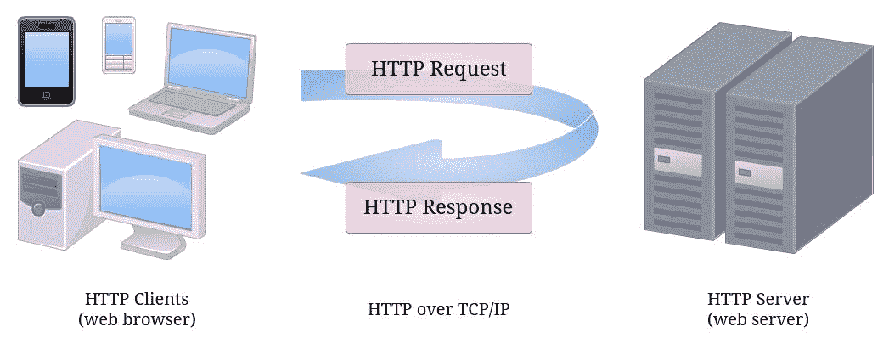
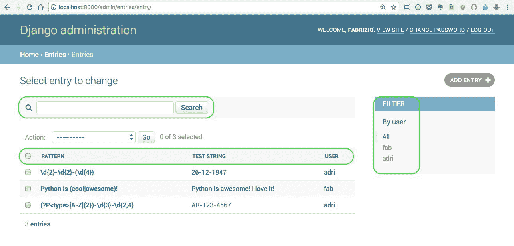
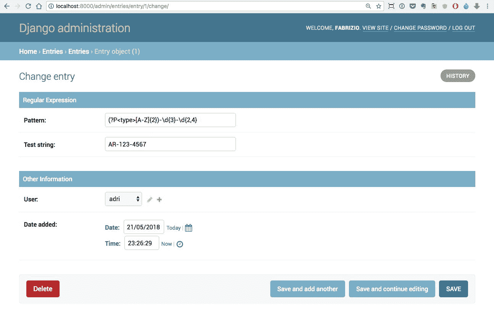
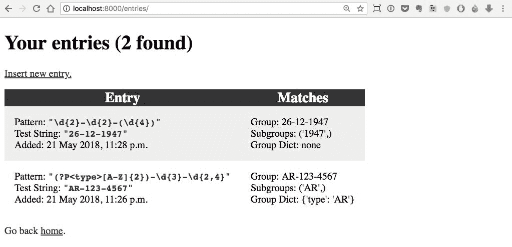
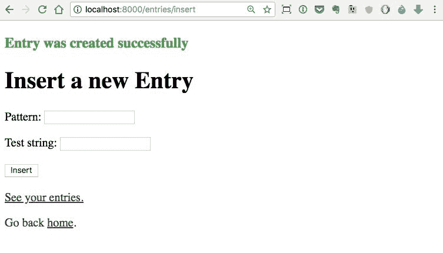

# 第十四章：Web 开发

“不要相信你在网上看到的一切。”– 孔子

在本章中，我们将一起开发一个网站。通过参与一个小项目，我的目标是为你打开一扇窗，让你窥探一下 Web 开发是什么，以及你应该了解的主要概念和工具，如果你想在这方面取得成功的话。

特别是，我们将探索以下内容：

+   Web 编程的基本概念

+   Django Web 框架

+   正则表达式

+   Flask 和 Falcon Web 框架的简要概述

让我们从基础知识开始。

# 什么是网络？

**万维网**（**WWW**），或者简称为**web**，是通过使用称为**互联网**的媒介来访问信息的一种方式。互联网是一个庞大的网络，一个网络基础设施。它的目的是连接全球各地的数十亿设备，以便它们可以相互通信。信息通过互联网以丰富多样的语言（称为**协议**）传输，这些语言允许不同的设备说同一种语言以共享内容。

网络是一种建立在互联网之上的信息共享模型，它以**超文本传输协议**（**HTTP**）作为数据通信的基础。因此，网络只是互联网上可以交换信息的几种不同方式之一；电子邮件、即时通讯、新闻组等都依赖于不同的协议。

# 网络是如何工作的？

简而言之，HTTP 是一种不对称的**请求-响应** **客户端-服务器**协议。HTTP 客户端向 HTTP 服务器发送请求消息。服务器反过来返回一个响应消息。换句话说，HTTP 是一个**拉取协议**，客户端从服务器拉取信息（与**推送协议**相对，服务器向客户端推送信息）。看一下下面的图表：



HTTP 基于**TCP**/**IP**（或者**传输控制协议**/**互联网协议**），它提供了可靠的通信交换工具。

HTTP 协议的一个重要特点是它是*无状态*的。这意味着当前请求对之前的请求发生的事情一无所知。这是一个限制，但你可以以被登录的幻觉浏览网站。然而，在幕后，发生的是，在登录时，用户信息的令牌被保存（通常在客户端，称为**cookies**的特殊文件中），以便用户发出的每个请求都携带服务器识别用户并提供自定义界面的手段，比如显示他们的名字，保持他们的购物篮中的物品等等。

尽管它非常有趣，我们不打算深入研究 HTTP 的丰富细节以及它的工作原理。然而，我们将要编写一个小型网站，这意味着我们将不得不编写处理 HTTP 请求并返回 HTTP 响应的代码。从现在开始，我不会再在术语请求和响应前面加上 HTTP，因为我相信不会有任何混淆。

# Django Web 框架

对于我们的项目，我们将使用 Python 生态系统中最流行的 Web 框架之一：Django。

**Web 框架**是一组工具（库、函数、类等），我们可以用它们来编写网站。我们需要决定允许针对我们的 Web 服务器发出什么样的请求以及我们如何对它们做出响应。Web 框架是做到这一点的完美工具，因为它为我们处理了许多事情，这样我们就可以专注于重要的部分，而不必重新发明轮子。

有不同类型的框架。并非所有框架都是为编写网络代码而设计的。一般来说，**框架**是一种提供功能以便于开发软件应用程序、产品和解决方案的工具。

# Django 设计哲学

Django 根据以下原则设计：

+   **不要重复自己**（**DRY**）：不要重复编写代码，并以尽可能从尽可能少的代码中推断出尽可能多的框架。

+   **松耦合**：框架的各个层次不应该彼此了解（除非出于绝对必要的原因）。松耦合最适合与高内聚并行。将因同一原因而改变的事物放在一起，将因不同原因而改变的事物分开。

+   **少量代码**：应用程序应尽可能使用最少的代码，并以尽可能有利于重用的方式编写。

+   **一致性**：使用 Django 框架时，无论您正在编写哪个层，您的体验都将与选择布置项目的设计模式和范例非常一致。

框架本身是围绕**模型-模板-视图**（**MTV**）模式设计的，这是**模型-视图-控制器**（**MVC**）的一个变体，其他框架广泛采用。这些模式的目的是分离关注点，促进代码重用和质量。

# 模型层

在这三个层次中，这一层定义了应用程序处理的数据结构，并处理数据源。**模型**是表示数据结构的类。通过一些 Django 魔术，模型被映射到数据库表，以便您可以将数据存储在关系数据库中。

关系数据库以表格形式存储数据，其中每一列都是数据的属性，每一行代表该表格所代表的集合中的单个项目或条目。通过每个表格的主键，即允许其唯一标识每个项目的数据部分，可以建立不同表格中项目之间的关系，即将它们放入*关系*中。

这个系统的美妙之处在于，您不必编写特定于数据库的代码来处理数据。您只需正确配置模型并使用它们。Django 的**对象关系映射**（**ORM**）为您处理数据库的工作，它负责将在 Python 对象上执行的操作转换为关系数据库可以理解的语言：**SQL**（或**结构化查询语言**）。我们在第七章中看到了 ORM 的一个例子，即*文件和数据持久性*，在那里我们探讨了 SQLAlchemy。

这种方法的一个好处是，您可以在不重写代码的情况下更改数据库，因为 Django 会根据连接的数据库动态生成所有特定于数据库的代码。关系数据库使用 SQL，但每个数据库都有其自己独特的风格；因此，在我们的应用程序中不需要硬编码任何 SQL 是一个巨大的优势。

Django 允许您随时修改模型。当您这样做时，您可以运行一个命令来创建一个迁移，这是将数据库移植到表示模型当前定义的状态的一组指令。

总之，这一层处理定义您的网站中需要处理的数据结构，并为您提供通过简单访问模型来保存和加载数据到数据库的手段，这些模型是 Python 对象。

# 视图层

视图的功能是处理请求，执行需要执行的任何操作，并最终返回响应。例如，如果您打开浏览器并请求电子商务商店中产品类别对应的页面，视图可能会与数据库交互，请求所有作为所选类别子类的类别（例如，在导航侧栏中显示它们）以及属于所选类别的所有产品，以便在页面上显示它们。

因此，视图是我们可以满足请求的机制。其结果，响应对象，可以呈现为多种不同形式：JSON 有效载荷、文本、HTML 页面等。当您编写网站时，您的响应通常由 HTML 或 JSON 组成。

**超文本标记语言**，或**HTML**，是用于创建网页的标准标记语言。Web 浏览器运行引擎，能够解释 HTML 代码并将其呈现为我们在打开网站页面时看到的内容。

# 模板层

这是提供后端和前端开发之间桥梁的层。当视图必须返回 HTML 时，通常会通过准备一个**上下文对象**（字典）与一些数据，然后将此上下文提供给模板，模板会被呈现（即转换为 HTML），并以响应的形式返回给调用者（更准确地说，是响应的主体）。这种机制允许最大程度地重用代码。如果回到类别的例子，很容易看出，如果您浏览销售产品的网站，您点击哪个类别或执行何种类型的搜索并不重要，产品页面的布局不会改变。改变的是用于填充该页面的数据。

因此，页面的布局是由模板定义的，该模板是用 HTML 和 Django 模板语言编写的混合体。提供页面的视图会在上下文字典中收集所有要显示的产品，并将其提供给模板，然后由 Django 模板引擎将其呈现为 HTML 页面。

# Django URL 分发器

Django 将**统一资源定位符**（**URL**）与视图关联的方式是通过将请求的 URL 与注册在特殊文件中的模式进行匹配。URL 代表网站中的一个页面，因此`http://mysite.com/categories?id=123`可能指向我的网站上 ID 为`123`的类别页面，而`https://mysite.com/login`可能是用户登录页面。

HTTP 和 HTTPS 之间的区别在于后者为协议添加了加密，以确保您与网站交换的数据是安全的。当您在网站上输入信用卡详细信息，或者在任何地方登录，或者处理敏感数据时，您希望确保您正在使用 HTTPS。

# 正则表达式

Django 将 URL 与模式匹配的方式是通过正则表达式。**正则表达式**是一系列字符，用于定义搜索模式，我们可以执行操作，如模式和字符串匹配，查找/替换等。

正则表达式具有特殊的语法，用于指示诸如数字、字母和空格等内容，以及我们期望字符出现的次数等内容。本书不涵盖此主题的完整解释。然而，这是一个非常重要的主题，因此我们将一起开展的项目将围绕它展开，希望您能有时间自行探索一下。

举个快速的例子，假设您想指定一个匹配日期的模式，比如 `"26-12-1947"`。这个字符串由两个数字、一个破折号、两个数字、一个破折号，最后是四个数字。因此，我们可以这样写：`r'[0-9]{2}-[0-9]{2}-[0-9]{4}'`。我们使用方括号创建了一个类，并在其中定义了一个数字范围，从 `0` 到 `9`，因此包括了所有可能的数字。然后，在花括号中，我们说我们期望其中有两个。然后是一个破折号，然后我们重复这个模式一次，然后再一次，通过改变我们期望的数字数量，而最后没有破折号。拥有一个类，比如 `[0-9]` 是一个如此常见的模式，以至于已经创建了一个特殊的符号作为快捷方式：`'\d'`。因此，我们可以这样重写这个模式：`r'\d{2}-\d{2}-\d{4}'`，它将完全相同地工作。字符串前面的那个 **r** 代表 **原始**，它的目的是防止 Python 尝试解释反斜杠转义序列，以便它们可以原样传递给正则表达式引擎。

# 一个正则表达式网站

所以，我们要编写一个网站，用于存储正则表达式，以便我们可以稍微玩一下。

在我们继续创建项目之前，我想谈谈 **层叠样式表**（**CSS**）。CSS 是我们在其中指定 HTML 页面上各种元素的外观的文件。您可以设置各种属性，比如形状、大小、颜色、边距、边框和字体。在这个项目中，我已经尽力在页面上取得了一个体面的结果，但我既不是前端开发人员也不是设计师，所以请不要太在意事物的外观。请尽量关注它们的工作原理。

# 设置 Django

在 Django 网站 ([`www.djangoproject.com/`](https://www.djangoproject.com/)) 上，您可以按照教程，这会让您对 Django 的功能有一个很好的了解。如果您愿意，您可以先按照该教程操作，然后再回到这个例子。所以，首先要做的事情是；让我们在您的虚拟环境中安装 Django（您会发现它已经安装好了，因为它是要求文件的一部分）：

```py
$ pip install django  
```

当这个命令完成后，您可以在控制台中测试它（尝试使用 `bpython`，它会给您一个类似于 IPython 但具有良好内省能力的 shell）：

```py
>>> import django
>>> django.VERSION
(2, 0, 5, 'final', 0) 
```

现在 Django 已经安装好了，我们可以开始了。我们需要做一些搭建工作，所以我会快速指导您完成。

# 启动项目

选择书中环境中的一个文件夹并切换到其中。我会使用 `ch14`。从那里，我们可以使用以下命令启动一个 Django 项目：

```py
$ django-admin startproject regex  
```

这将为一个名为 `regex` 的 Django 项目准备好骨架。切换到 `regex` 文件夹并运行以下命令：

```py
$ python manage.py runserver  
```

您应该能够在浏览器中输入 `http://127.0.0.1:8000/` 并看到 It worked! 默认的 Django 页面。这意味着项目已经正确设置。当您看到页面后，使用 *Ctrl* + *C* 杀死服务器（或者控制台上显示的其他指令）。我现在将粘贴项目的最终结构，以便您可以用作参考：

```py
$ tree -A regex  # from the ch14 folder
regex
├── entries
│ ├── __init__.py
│ ├── admin.py
│ ├── forms.py
│ ├── migrations
│ │ ├── 0001_initial.py
│ │ └── __init__.py
│ ├── models.py
│ ├── static
│ │ └── entries
│ │ └── css
│ │ └── main.css
│ ├── templates
│ │ └── entries
│ │ ├── base.html
│ │ ├── footer.html
│ │ ├── home.html
│ │ ├── insert.html
│ │ └── list.html
│ └── views.py
├── manage.py
└── regex
 ├── __init__.py
 ├── settings.py
 ├── urls.py
 └── wsgi.py
```

如果您缺少文件，不要担心，我们会解决的。一个 Django 项目通常是由几个不同的应用程序集合组成的。每个应用程序都旨在以一种独立的、可重用的方式提供功能。我们将创建一个名为 `entries` 的应用程序：

```py
$ python manage.py startapp entries  
```

在创建的 `entries` 文件夹中，您可以删除 `tests.py` 模块。

现在，让我们修复 `regex/settings.py` 文件在 `regex` 文件夹中。我们需要将我们的应用程序添加到 `INSTALLED_APPS` 列表中，以便我们可以使用它（将其添加到列表的底部）：

```py
INSTALLED_APPS = [
    'django.contrib.admin',
    ...
    'entries',
]
```

然后，您可能想根据个人喜好设置语言和时区。我住在伦敦，所以我设置它们如下：

```py
LANGUAGE_CODE = 'en-gb'
TIME_ZONE = 'Europe/London'
```

在这个文件中没有其他事情要做，所以您可以保存并关闭它。

现在是时候将**迁移**应用到数据库了。Django 需要数据库支持来处理用户、会话等内容，所以我们需要创建一个数据库并用必要的数据填充它。幸运的是，这可以很容易地通过以下命令完成：

```py
$ python manage.py migrate  
```

对于这个项目，我们使用 SQLite 数据库，它基本上只是一个文件。在一个真正的项目中，你会使用不同的数据库引擎，比如 MySQL 或 PostgreSQL。

# 创建用户

现在我们有了一个数据库，我们可以使用控制台创建一个超级用户：

```py
$ python manage.py createsuperuser  
```

输入用户名和其他细节后，我们有了一个具有管理员特权的用户。这足以访问 Django 管理部分，所以尝试启动服务器：

```py
$ python manage.py runserver  
```

这将启动 Django 开发服务器，这是一个非常有用的内置 Web 服务器，你可以在使用 Django 时使用它。现在服务器正在运行，我们可以在`http://localhost:8000/admin/`访问管理页面。稍后我会向你展示这部分的截图。如果你用刚刚创建的用户的凭据登录并转到身份验证和授权部分，你会找到用户。打开它，你就能看到用户列表。你可以作为管理员编辑任何用户的细节。在我们的情况下，请确保你创建一个不同的用户，这样系统中至少有两个用户（我们以后会需要）。我会称第一个用户为 Fabrizio（用户名：`fab`），第二个用户为 Adriano（用户名：`adri`），以纪念我的父亲。

顺便说一句，你应该看到 Django 管理面板是自动免费提供的。你定义你的模型，连接它们，就这样。这是一个令人难以置信的工具，显示了 Django 的内省能力有多么先进。而且，它是完全可定制和可扩展的。这真是一项出色的工作。

# 添加 Entry 模型

既然样板代码已经完成，我们有了一些用户，我们准备好编码了。我们首先要将`Entry`模型添加到我们的应用程序中，以便我们可以将对象存储在数据库中。以下是你需要添加的代码（记得使用项目树作为参考）：

```py
# entries/models.py
from django.db import models
from django.contrib.auth.models import User
from django.utils import timezone

class Entry(models.Model):
    user = models.ForeignKey(User, on_delete=models.CASCADE)
    pattern = models.CharField(max_length=255)
    test_string = models.CharField(max_length=255)
    date_added = models.DateTimeField(default=timezone.now)

    class Meta:
        verbose_name_plural = 'entries'
```

这是我们将用来在系统中存储正则表达式的模型。我们将存储一个模式、一个测试字符串、对创建条目的用户的引用以及创建的时刻。你可以看到创建一个模型实际上是相当容易的，但尽管如此，让我们逐行过一遍。

首先，我们需要从`django.db`中导入`models`模块。这将为我们提供`Entry`模型的基类。Django 模型是特殊的类，当我们从`models.Model`继承时，很多工作都是在幕后为我们完成的。

我们需要一个对创建条目的用户的引用，所以我们需要从 Django 的授权应用程序中导入`User`模型，我们还需要导入`timezone`模型以访问`timezone.now()`函数，该函数为我们提供了`datetime.now()`的`timezone`-aware 版本。这样做的美妙之处在于它与我之前向你展示的`TIME_ZONE`设置相连。

至于这个类的主键，如果我们不明确设置一个，Django 会为我们添加一个。**主键**是一个允许我们在数据库中唯一标识`Entry`对象的键（在这种情况下，Django 将添加一个自增的整数 ID）。

因此，我们定义了我们的类，并设置了四个类属性。我们有一个`ForeignKey`属性，它是我们对`User`模型的引用。我们还有两个`CharField`属性，用于保存我们的正则表达式的模式和测试字符串。我们还有一个`DateTimeField`，其默认值设置为`timezone.now`。请注意，我们不在那里调用`timezone.now`，它是`now`，而不是`now()`。因此，我们不是传递一个`DateTime`实例（在解析该行时设置的时间点），而是传递一个可调用的函数，在保存数据库中的条目时调用该函数。这类似于我们在第十二章中使用的回调机制，*GUIs and Scripts*，当我们将命令分配给按钮点击时。

最后两行非常有趣。我们在`Entry`类本身内部定义了一个`Meta`类。`Meta`类被 Django 用来为模型提供各种额外信息。Django 在幕后有很多逻辑，根据我们放入`Meta`类的信息来调整其行为。在这种情况下，在管理面板中，`Entry`的复数形式将是*Entrys*，这是错误的，因此我们需要手动设置它。我们将复数形式指定为全部小写，因为 Django 在需要时会为我们大写它。

现在我们有了一个新模型，我们需要更新数据库以反映代码的新状态。为了做到这一点，我们需要告诉 Django 它需要创建更新数据库的代码。这段代码被称为**迁移**。让我们创建并执行它：

```py
$ python manage.py makemigrations entries
$ python manage.py migrate  
```

在这两个指令之后，数据库将准备好存储`Entry`对象。

有两种不同类型的迁移：数据迁移和模式迁移。**数据迁移**将数据从一种状态转移到另一种状态，而不改变其结构。例如，数据迁移可以通过将标志切换为`False`或`0`来将某个类别的所有产品设置为缺货。**模式迁移**是一组指令，用于改变数据库模式的结构。例如，可以向`Person`表添加一个`age`列，或者增加字段的最大长度以适应非常长的地址。在使用 Django 进行开发时，通常需要在开发过程中执行这两种类型的迁移。数据不断发展，特别是在敏捷环境中编码时。

# 自定义管理面板

下一步是将`Entry`模型与管理面板连接起来。您可以用一行代码做到这一点，但在这种情况下，我想添加一些选项来自定义管理面板显示条目的方式，无论是在数据库中的所有条目的列表视图中，还是在允许我们创建和修改它们的表单视图中。

我们只需要添加以下代码：

```py
# entries/admin.py
from django.contrib import admin
from .models import Entry

@admin.register(Entry)
class EntryAdmin(admin.ModelAdmin):
    fieldsets = [
        ('Regular Expression',
         {'fields': ['pattern', 'test_string']}),
        ('Other Information',
         {'fields': ['user', 'date_added']}),
    ]
    list_display = ('pattern', 'test_string', 'user')
    list_filter = ['user']
    search_fields = ['test_string']
```

这真是太美了。我猜你可能已经理解了大部分内容，即使你是 Django 的新手。

因此，我们首先导入`admin`模块和`Entry`模型。因为我们想要促进代码重用，我们使用相对导入导入`Entry`模型（在`models`之前有一个点）。这将使我们能够在不太麻烦的情况下移动或重命名应用程序。然后，我们定义`EntryAdmin`类，它继承自`admin.ModelAdmin`。类上的装饰告诉 Django 在管理面板中显示`Entry`模型，我们在`EntryAdmin`类中放入的内容告诉 Django 如何自定义处理这个模型。

首先，我们为创建/编辑页面指定`fieldsets`。这将把页面分成两个部分，以便我们更好地可视化内容（模式和测试字符串）和其他细节（用户和时间戳）分开。

然后，我们自定义列表页面显示结果的方式。我们想要看到所有字段，但不包括日期。我们还希望能够按用户进行筛选，以便我们可以列出一个用户的所有条目，并且我们希望能够在`test_string`上进行搜索。

我将继续添加三个条目，一个是我自己的，另外两个是我父亲的。结果显示在接下来的两个屏幕截图中。插入它们后，列表页面如下所示：



我已经突出显示了我们在`EntryAdmin`类中自定义的此视图的三个部分。我们可以按用户筛选，可以搜索，并且所有字段都显示出来。如果单击模式，则会打开编辑视图。

在我们的自定义之后，它看起来像这样：



请注意我们有两个部分：正则表达式和其他信息，这要归功于我们自定义的`EntryAdmin`类。试一试，为几个不同的用户添加一些条目，熟悉界面。免费获得所有这些东西是不是很好？

# 创建表单

每当您在网页上填写详细信息时，您都在表单字段中插入数据。**表单**是 HTML **文档对象模型**（**DOM**）树的一部分。在 HTML 中，您可以使用`form`标签创建一个表单。当您单击提交按钮时，您的浏览器通常会将`form`数据打包在一起，并将其放入`POST`请求的正文中。与用于向 Web 服务器请求资源的`GET`请求相反，`POST`请求通常会将数据发送到 Web 服务器，目的是创建或更新资源。因此，处理`POST`请求通常需要比处理`GET`请求更多的注意。

当服务器接收到来自`POST`请求的数据时，需要对这些数据进行验证。此外，服务器需要采用安全机制来防范各种类型的攻击。一种非常危险的攻击是**跨站点请求伪造**（**CSRF**）攻击，当数据从未经用户认证的域发送时就会发生。Django 允许您以非常优雅的方式处理这个问题。

因此，与其懒惰地使用 Django 管理员来创建条目，我将向您展示如何使用 Django 表单来完成。通过使用框架提供的工具，您已经完成了非常好的验证工作（实际上，我们不需要添加任何自定义验证）。

在 Django 中有两种形式类：`Form`和`ModelForm`。您可以使用前者创建一个表单，其形状和行为取决于您如何编写类，添加哪些字段等。另一方面，后者是一种类型的表单，尽管仍然可定制，但是从模型中推断字段和行为。由于我们需要一个`Entry`模型的表单，我们将使用这个：

```py
# entries/forms.py
from django.forms import ModelForm
from .models import Entry

class EntryForm(ModelForm):
    class Meta:
        model = Entry
        fields = ['pattern', 'test_string']
```

令人惊讶的是，这就是我们需要做的一切，就可以在页面上放置一个表单。这里唯一值得注意的是，我们将字段限制为`pattern`和`test_string`。只有已登录的用户才能访问插入页面，因此我们不需要询问用户是谁，我们已经知道了。至于日期，当我们保存一个`Entry`时，`date_added`字段将根据其默认设置，因此我们也不需要指定。我们将在视图中看到如何在保存之前向表单提供用户信息。因此，现在背景工作已经完成，我们所需要的只是视图和模板。让我们从视图开始。

# 编写视图

我们需要编写三个视图。我们需要一个用于主页的视图，一个用于显示用户的所有条目的列表，以及一个用于创建新条目的视图。我们还需要登录和注销视图。但幸运的是，由于 Django，我们不需要编写它们。我将逐步粘贴代码：

```py
# entries/views.py
import re
from django.contrib.auth.decorators import login_required
from django.contrib.messages.views import SuccessMessageMixin
from django.urls import reverse_lazy
from django.utils.decorators import method_decorator
from django.views.generic import FormView, TemplateView
from .forms import EntryForm
from .models import Entry
```

让我们从导入开始。我们需要`re`模块来处理正则表达式，然后我们需要从 Django 中导入一些类和函数，最后，我们需要`Entry`模型和`EntryForm`表单。

# 主页视图

第一个视图是`HomeView`：

```py
# entries/views.py
class HomeView(TemplateView):
    template_name = 'entries/home.html'

    @method_decorator(
        login_required(login_url=reverse_lazy('login')))
    def get(self, request, *args, **kwargs):
        return super(HomeView, self).get(request, *args, **kwargs)
```

它继承自`TemplateView`，这意味着响应将通过渲染视图中创建的上下文来创建。我们所要做的就是指定`template_name`类属性，指向正确的模板。Django 在代码重用方面的推广程度达到了一个程度，以至于如果我们不需要使此视图仅对已登录用户可访问，前两行就足够了。

然而，我们希望此视图仅对已登录用户可访问；因此，我们需要用`login_required`进行装饰。现在，历史上 Django 中的视图是函数；因此，这个装饰器是设计为接受一个函数的，而不是我们在这个类中拥有的方法。在这个项目中，我们使用 Django 基于类的视图，因此为了使事情正常工作，我们需要转换`login_required`，以便它接受一个方法（不同之处在于第一个参数：`self`）。我们通过将`login_required`传递给`method_decorator`来实现这一点。

我们还需要向`login_required`装饰器提供`login_url`信息，这里又出现了 Django 的另一个精彩特性。正如在我们完成视图后所看到的那样，在 Django 中，您通过模式将视图绑定到 URL，该模式由一个字符串组成，该字符串可能是正则表达式，也可能是其他信息。您可以在`urls.py`文件中为每个条目指定一个名称，以便在引用 URL 时，您不必将其值硬编码到代码中。您只需让 Django 从我们在`urls.py`中为条目指定的名称中反向工程出该 URL，定义 URL 和绑定到它的视图。这种机制稍后将变得更加清晰。现在，只需将`reverse('...')`视为从标识符获取 URL 的一种方式。通过这种方式，您只需在`urls.py`文件中写入实际的 URL 一次，这是非常出色的。在`views.py`代码中，我们需要使用`reverse_lazy`，它的工作原理与`reverse`完全相同，只有一个主要区别：它只在我们实际需要时才找到 URL（以懒惰的方式）。`reverse_lazy`之所以如此有用的原因是，有时可能需要从标识符反转 URL，但在调用`reverse`时，`urls.py`模块尚未加载，这会导致失败。`reverse_lazy`的懒惰行为解决了这个问题，因为即使在`urls.py`模块加载之前进行调用，从标识符反转到相关 URL 的实际过程也是以懒惰的方式进行的，稍后，当`urls.py`肯定已经加载时。

我们刚刚装饰的`get`方法只是简单地调用了父类的`get`方法。当然，`get`方法是 Django 在针对与此视图绑定的 URL 执行`GET`请求时调用的方法。

# 条目列表视图

这个视图比之前的要有趣得多：

```py
# entries/views.py
class EntryListView(TemplateView):
    template_name = 'entries/list.html'

    @method_decorator(
        login_required(login_url=reverse_lazy('login')))
    def get(self, request, *args, **kwargs):
        context = self.get_context_data(**kwargs)
        entries = Entry.objects.filter(
            user=request.user).order_by('-date_added')
        matches = (self._parse_entry(entry) for entry in entries)
        context['entries'] = list(zip(entries, matches))
        return self.render_to_response(context)

    def _parse_entry(self, entry):
        match = re.search(entry.pattern, entry.test_string)
        if match is not None:
            return (
                match.group(),
                match.groups() or None,
                match.groupdict() or None
            )
        return None
```

首先，我们像之前一样装饰`get`方法。在其中，我们需要准备一个`Entry`对象列表并将其提供给模板，然后将其显示给用户。为了做到这一点，我们首先获取`context`字典，调用`TemplateView`类的`get_context_data`方法。然后，我们使用 ORM 获取条目列表。我们通过访问对象管理器并对其进行过滤来执行此操作。我们根据登录的用户对条目进行过滤，并要求它们按降序排序（名称前面的'-'指定了降序排序）。`objects`管理器是每个 Django 模型在创建时都会增强的默认**管理器**：它允许我们通过其方法与数据库进行交互。

我们解析每个条目以获得匹配项列表（实际上，我编码使`matches`成为一个生成器表达式）。最后，我们向上下文添加了一个`'entries'`键，其值是`entries`和`matches`的耦合，以便每个`Entry`实例与其模式和测试字符串的结果匹配配对。

在最后一行，我们简单地要求 Django 使用我们创建的上下文来呈现模板。

看一下`_parse_entry`方法。它所做的就是对`entry.test_string`和`entry.pattern`进行搜索。如果结果的`match`对象不是`None`，那么意味着我们找到了一些东西。如果是这样，我们返回一个包含三个元素的元组：总体组、子组和组字典。

注意，`match.groups()`和`match.groupdict()`可能分别返回一个空元组和一个空字典。为了将空结果规范化为更简单的`None`，我使用了 Python 中的一个常见模式，即利用`or`运算符。实际上，`A or B`将返回`A`，如果`A`评估为真值，否则返回`B`。你能想到这与`and`运算符的行为有何不同吗？

如果你对这些术语不熟悉，不用担心，你很快就会看到一个例子的截图。如果没有匹配，我们返回`None`（从技术上讲，这并不需要，因为 Python 会自动执行，但我在这里包含它是为了明确起见）。

# 表单视图

最后，让我们来看一下`EntryFormView`：

```py
# entries/views.py
class EntryFormView(SuccessMessageMixin, FormView):
    template_name = 'entries/insert.html'
    form_class = EntryForm
    success_url = reverse_lazy('insert')
    success_message = "Entry was created successfully"

    @method_decorator(
        login_required(login_url=reverse_lazy('login')))
    def get(self, request, *args, **kwargs):
        return super(EntryFormView, self).get(
            request, *args, **kwargs)

    @method_decorator(
        login_required(login_url=reverse_lazy('login')))
    def post(self, request, *args, **kwargs):
        return super(EntryFormView, self).post(
            request, *args, **kwargs)

    def form_valid(self, form):
        self._save_with_user(form)
        return super(EntryFormView, self).form_valid(form)

    def _save_with_user(self, form):
        self.object = form.save(commit=False)
        self.object.user = self.request.user
        self.object.save()
```

这对几个原因来说特别有趣。首先，它向我们展示了 Python 的多重继承的一个很好的例子。我们想在插入`Entry`后在页面上显示一条消息，所以我们继承自`SuccessMessageMixin`。但是我们也想处理一个表单，所以我们还继承自`FormView`。

请注意，当处理混合和继承时，您可能需要考虑在类声明中指定基类的顺序，因为这将影响在继承链上传递调用时方法的查找方式。

为了正确设置这个视图，我们需要在开始时指定一些属性：要呈现的模板、用于处理来自`POST`请求的数据的表单类、在成功时需要将用户重定向到的 URL 以及成功消息。

另一个有趣的特点是，这个视图需要处理`GET`和`POST`请求。当我们第一次进入表单页面时，表单是空的，这是`GET`请求。另一方面，当我们填写表单并想要提交`Entry`时，我们会发出`POST`请求。你可以看到`get`的主体在概念上与`HomeView`是相同的。Django 为我们做了一切。

`post`方法就像`get`一样。我们需要编写这两种方法的唯一原因是为了能够装饰它们以要求登录。

在 Django 的表单处理过程中（在`FormView`类中），有一些方法可以重写以自定义整体行为。我们需要使用`form_valid`方法。当表单验证成功时，将调用此方法。它的目的是保存表单，以便从中创建一个`Entry`对象，然后将其存储在数据库中。

唯一的问题是我们的表单缺少用户。我们需要在调用链的某个时刻拦截并自己放入用户信息。这是通过调用`_save_with_user`方法来完成的，非常简单。

首先，我们要求 Django 使用`commit`参数设置为`False`保存表单。这将创建一个`Entry`实例，而不会尝试将其保存到数据库中。立即保存它会失败，因为`user`信息不在那里。

下一行更新了`Entry`实例（`self.object`），添加了`user`信息，并且在最后一行，我们可以安全地保存它。我之所以这样调用`object`并将其设置在实例上，是为了遵循原始的`FormView`类的做法。

我们在这里玩弄 Django 的机制，因此如果我们希望整个事情能够正常工作，我们需要注意何时以及如何修改它的行为，并确保我们不会错误地改变它。因此，非常重要的是要记住在我们自定义的版本的最后调用基类的`form_valid`方法（我们使用`super`来实现），以确保该方法通常执行的所有其他操作都能正确执行。

请注意，请求与每个视图实例（`self.request`）相关联，因此当我们将我们的逻辑重构为方法时，我们不需要通过它传递。还要注意，用户信息已经被 Django 自动添加到请求中。最后，将整个过程分成非常小的方法的原因是，这样我们只需要覆盖我们需要自定义的方法。所有这些都消除了编写大量代码的需要。

现在我们已经涵盖了视图，让我们看看如何将它们与 URL 配对。

# 绑定 URL 和视图

在`urls.py`模块中，我们将每个视图与一个 URL 绑定。有许多方法可以做到这一点。我选择了最简单的方法，这对于这个练习的范围来说完全有效，但如果你打算使用 Django，你可能需要更深入地探索这个主题。这是整个网站逻辑的核心，因此你应该努力正确地理解它。请注意，`urls.py`模块属于项目文件夹：

```py
# regex/urls.py
from django.contrib import admin
from django.urls import path
from django.contrib.auth import views as auth_views
from django.urls import reverse_lazy
from entries.views import HomeView, EntryListView, EntryFormView

urlpatterns = [
    path('admin/', admin.site.urls),
    path('entries/', EntryListView.as_view(), name='entries'),
    path('entries/insert',
        EntryFormView.as_view(),
        name='insert'),

    path('login/',
        auth_views.login,
        kwargs={'template_name': 'admin/login.html'},
        name='login'),
    path('logout/',
        auth_views.logout,
        kwargs={'next_page': reverse_lazy('home')},
        name='logout'),

    path('', HomeView.as_view(), name='home'),
] 
```

如果你熟悉 Django 的 1.x 版本，你会注意到一些区别，因为这个项目是在 2.x 版本中编写的。正如你所看到的，这种魔法来自`path`函数，它最近取代了`url`函数。首先，我们传递一个路径字符串（也称为*路由*），然后是视图，最后是一个名称，这是我们将在`reverse`和`reverse_lazy`函数中使用的，以恢复 URL。

请注意，当使用基于类的视图时，我们必须将它们转换为函数，这是`path`所期望的。为此，我们在它们上调用`as_view()`方法。

还要注意，对于管理员的第一个`path`条目是特殊的。它不是指定一个 URL 和一个视图，而是指定一个 URL 前缀和另一个`urls.py`模块（来自`admin.site`包）。这样，Django 将通过在所有在`admin.site.urls`中指定的 URL 前面添加`'admin/'`来完成管理员部分的所有 URL。我们本可以对我们的 entries 应用程序做同样的事情（而且我们应该这样做），但我觉得对于这个简单的项目来说有点过度了。

在这个模块中定义的 URL 路径是如此简单，以至于不需要定义任何正则表达式。如果你需要使用正则表达式，你可以查看`re_path`函数，它就是为此目的而设计的。

我们还通过使用直接来自`django.contrib.auth`包的视图，包括登录和注销功能。我们用必要的信息（例如注销视图的下一页）丰富了声明，而且我们不需要编写任何处理身份验证的代码。这很棒，节省了我们很多时间。

每个`path`声明必须在`urlpatterns`列表中完成，在这个问题上，重要的是要考虑到，当 Django 试图为已请求的 URL 找到一个视图时，模式是按顺序从上到下进行的。第一个匹配的模式将为其提供视图，因此一般来说，你必须在通用模式之前放置特定模式，否则它们永远不会有机会被捕获。举个例子，使用正则表达式在路由声明中，`'^shop/categories/$'`需要放在`'^shop'`之前（注意`'$'`表示模式的结尾，在后者中没有指定），否则它永远不会被调用。

因此，模型、表单、管理员、视图和 URL 都已完成。剩下的就是处理模板。我必须在这部分非常简要，因为 HTML 可能非常冗长。

# 编写模板

所有模板都继承自一个基本模板，它为所有其他模板提供 HTML 结构，以一种非常面向对象的编程（OOP）方式。它还指定了一些块，这些块是可以被子模板覆盖的区域，以便它们可以为这些区域提供自定义内容。让我们从基本模板开始：

```py
# entries/templates/entries/base.html

<!DOCTYPE html>
<html lang="en">
  <head>
    
      <meta charset="utf-8">
      <meta name="viewport"
       content="width=device-width, initial-scale=1.0">
    

    
      <link href=""
       rel="stylesheet">
    

    <title> Title </title>
  </head>

  <body>
    <div id="page-content">
      
      
    </div>
    <div id="footer">
      
      
    </div>
  </body>
</html>
```

从`templates`中的`entries`文件夹重复`entries`文件夹有一个很好的理由。

当您部署 Django 网站时，您需要将所有模板文件收集到一个文件夹下。如果您不像我一样指定路径，您可能会在 entries 应用程序中得到一个`base.html`模板，在另一个应用程序中得到一个`base.html`模板。最后收集的文件将覆盖同名的任何其他文件。因此，通过将它们放在`templates/entries`文件夹中，并对每个您编写的 Django 应用程序使用这种技术，您可以避免名称冲突的风险（对于任何其他静态文件也是如此）。

关于这个模板，实际上没有什么可说的，除了它加载了`static`标签，以便我们可以轻松访问`static`路径，而不需要在模板中硬编码使用``。特殊的``部分中的代码定义了逻辑。特殊的`{{ ... }}`中的代码表示将在页面上呈现的变量。

我们定义了五个块：`styles`，`meta`，`title`，`page-content`和`footer`，它们的目的是保存元数据，样式信息，标题，页面内容和页脚。块可以选择性地被子模板覆盖，以便在其中提供不同的内容。

这是页脚：

```py
# entries/templates/entries/footer.html
<div class="footer">
  Go back <a href="">home</a>.
</div>
```

它为我们提供了一个指向主页的链接，这个链接来自以下模板：

```py
# entries/templates/entries/home.html

Welcome to the Entry website.


  <h1>Welcome {{ user.first_name }}!</h1>

  <div class="home-option">To see the list of your entries
    please click <a href="">here.</a>
  </div>
  <div class="home-option">To insert a new entry please click
    <a href="">here.</a>
  </div>
  <div class="home-option">To login as another user please click
    <a href="">here.</a>
  </div>
    <div class="home-option">To go to the admin panel
    please click <a href="">here.</a>
  </div>

```

它扩展了`base.html`模板，并覆盖了`title`和`page-content`。您可以看到它基本上只是为用户提供了四个链接。这些是条目列表，插入页面，注销页面和管理页面。所有这些都是在不硬编码任何 URL 的情况下完成的，通过使用``标签，这是`reverse`函数的模板等效。

插入`Entry`的模板如下：

```py
# entries/templates/entries/insert.html

Insert a new Entry


  
    
      <p class="{{ message.tags }}">{{ message }}</p>
    
  

  <h1>Insert a new Entry</h1>
  <form action="" method="post">
    {{ form.as_p }}
    <input type="submit" value="Insert">
  </form><br>



  <div><a href="">See your entries.</a></div>
  

```

在开始时有一些条件逻辑来显示消息（如果有的话），然后我们定义表单。Django 让我们能够通过简单调用`{{ form.as_p }}`（或者`form.as_ul`或`form.as_table`）来呈现一个表单。这为我们创建了所有必要的字段和标签。这三个命令之间的区别在于表单的布局方式：作为段落，作为无序列表或作为表格。我们只需要将其包装在表单标签中并添加一个提交按钮。这种行为是为了我们的方便而设计的：我们需要自由地塑造`<form>`标签，所以 Django 在这方面并不具有侵入性。另外，请注意``。

它将被 Django 渲染为一个令牌，并成为提交时发送到服务器的数据的一部分。这样，Django 将能够验证请求是否来自允许的来源，从而避免前面提到的 CSRF 问题。当我们为`Entry`插入编写视图时，您是否看到了我们如何处理令牌？没错。我们没有为此编写一行代码。Django 会自动处理它，这要归功于一个**中间件**类（`CsrfViewMiddleware`）。请参阅官方 Django 文档（[`docs.djangoproject.com/en/2.0/`](https://docs.djangoproject.com/en/2.0/)）以进一步探讨这个主题。

对于这个页面，我们还使用页脚块来显示指向主页的链接。最后，我们有列表模板，这是最有趣的一个：

```py
# entries/templates/entries/list.html

 Entries list 


 
  <h1>Your entries ({{ entries|length }} found)</h1>
  <div><a href="">Insert new entry.</a></div>

  <table class="entries-table">
   <thead>
     <tr><th>Entry</th><th>Matches</th></tr>
   </thead>
   <tbody>
    
     <tr class="entries-list ">
      <td>
        Pattern: <code class="code">
         "{{ entry.pattern }}"</code><br>
        Test String: <code class="code">
         "{{ entry.test_string }}"</code><br>
        Added: {{ entry.date_added }}
      </td>
      <td>
        
         Group: {{ match.0 }}<br>
         Subgroups:
          {{ match.1|default_if_none:"none" }}<br>
         Group Dict: {{ match.2|default_if_none:"none" }}
        
         No matches found.
        
      </td>
     </tr>
    
   </tbody>
  </table>
 
  <h1>You have no entries</h1>
  <div><a href="">Insert new entry.</a></div>
 



 

```

您可能需要一段时间来适应模板语言，但实际上，它只是使用`for`循环创建表格。我们首先检查是否有任何条目，如果有，我们创建一个表格。有两列，一列是`Entry`，另一列是匹配。

在`Entry`列中，我们显示`Entry`对象（除了用户），在`Matches`列中，我们显示在`EntryListView`中创建的三元组。请注意，要访问对象的属性，我们使用与 Python 中相同的点语法，例如`{{ entry.pattern }}`或`{{ entry.test_string }}`等。

在处理列表和元组时，我们不能使用方括号语法访问项目，因此我们也使用点语法（`{{ match.0 }}`相当于`match[0]`，依此类推）。我们还使用过滤器，通过管道（`|`）运算符来显示一个自定义值，如果匹配为`None`。

Django 模板语言（它并不是真正的 Python）之所以保持简单，是有一个明确的原因的。如果你发现自己受到语言的限制，那意味着你可能正在尝试在模板中做一些实际上应该在视图中完成的事情，那里的逻辑更相关。

让我向你展示一些*列表*和*插入*模板的屏幕截图。这是我父亲的条目列表的样子：



请注意，使用循环标签交替将行的背景颜色从白色变为浅灰色。这些类在`main.css`文件中定义。

`Entry`插入页面足够智能，可以提供几种不同的场景。当你第一次登陆时，它会向你展示一个空表单。如果你正确填写了它，它会为你显示一个漂亮的消息（见下图）。然而，如果你未能填写两个字段，它将在它们之前显示一个错误消息，提醒你这些字段是必填的。

还要注意自定义页脚，其中包括指向条目列表和主页的链接：



就是这样！如果你愿意，你可以玩弄 CSS 样式。下载这本书的代码，尽情探索和扩展这个项目。向模型添加其他内容，创建并应用迁移，玩弄模板，有很多事情要做！

Django 是一个非常强大的框架，提供的功能远远超出了我在本章中能够向你展示的内容，所以你绝对应该去了解一下。它的美妙之处在于 Django 是 Python，因此阅读其源代码是非常有用的练习。

# Web 开发的未来

与人类共存数个世纪的其他科学分支相比，计算机科学是一个非常年轻的学科。它的主要特点之一是发展极快。它以如此之快的速度前进，以至于在短短几年内，你可以看到与需要一个世纪才会发生的现实世界变化相媲美的变化。因此，作为一个编码者，你必须时刻关注这个世界发生的事情。

目前，由于强大的计算机相当便宜，几乎每个人都可以接触到，趋势是尽量避免在后端投入过多的工作量，让前端处理部分工作。因此，在过去几年中，JavaScript 框架和库，如 jQuery，Backbone，以及最近变得非常流行的 React，已经变得非常流行。Web 开发已经从后端负责处理数据、准备数据并提供给前端显示的范式转变为后端有时仅用作 API，纯粹的数据提供者。前端通过 API 调用从后端获取数据，然后处理其余部分。这种转变促进了**单页应用程序**（**SPA**）等范式的存在，理想情况下，整个页面只加载一次，然后根据通常来自后端的内容进行演变。使用类似技术的电子商务网站在不刷新周围结构的页面中加载搜索结果。浏览器可以执行异步调用，如**异步 JavaScript 和 XML**（**AJAX**），可以返回数据，该数据可以通过 JavaScript 代码读取、操作并注入回页面。

因此，如果您计划从事 Web 开发，我强烈建议您熟悉 JavaScript（如果您还没有），以及 API。在本章的最后几页，我将为您演示如何使用两种不同的 Python 微框架（Flask 和 Falcon）制作一个简单的 API 的示例。

# 编写一个 Flask 视图

Flask（[`flask.pocoo.org/`](http://flask.pocoo.org/)）是一个 Python 微框架。它提供的功能远不及 Django，但如果您的项目非常小，那么它可能是一个更好的选择。不过，根据我的经验，当开发人员在项目开始时选择 Flask 时，他们最终会不断添加插件，直到拥有我所说的 Django Frankenstein 项目。灵活意味着不时地花时间减少随时间积累的技术债务。但是，从 Flask 切换到 Django 可能是一个令人生畏的操作，因此在启动新项目时，请确保考虑其发展。我对这个问题的俏皮看法非常简单：我总是选择 Django，因为我个人更喜欢它而不是 Flask，但您可能不同意我的看法，因此我想为您提供一个例子。

在您的`ch14`文件夹中，创建一个`flask`文件夹，其结构如下：

```py
$ tree -A flask  # from the ch14 folder
flask
├── main.py
└── templates
 └── main.html
```

基本上，我们将编写两个简单的文件：一个 Flask 应用程序和一个 HTML 模板。Flask 使用 Jinja2 作为模板引擎。它非常受欢迎且非常快速，以至于即使 Django 也开始为其提供原生支持：

```py
# flask/templates/main.html
<!doctype html>
<title>Hello from Flask</title>
<h1>
  
    Hello {{ name }}!
  
    Hello shy person!
  
</h1>
```

模板几乎是令人反感地简单。它只是根据`name`变量的存在改变问候语。更有趣的是渲染它的 Flask 应用程序：

```py
# flask/main.py
from flask import Flask, render_template

app = Flask(__name__)

@app.route('/')
@app.route('/<name>')
def hello(name=None):
    return render_template('main.html', name=name)
```

我们创建一个`app`对象，它是一个 Flask 应用程序。我们只需提供模块的完全限定名称，该名称存储在`__name__`中。

然后，我们编写一个简单的`hello`视图，它接受一个可选的`name`参数。在视图的主体中，我们只是渲染`main.html`模板，并将`name`参数传递给它，而不管其值如何。

有趣的是路由。与 Django 将视图和 URL 绑定在一起的方式不同（`urls.py`模块），在`Flask`中，您可以使用一个或多个`@app.route`装饰器来装饰您的视图。在这种情况下，我们装饰两次：第一行将视图绑定到根 URL（`/`），而第二行将视图绑定到具有名称信息的根 URL（`/<name>`）。

切换到`flask`文件夹并输入（确保您已经使用`$ pip install flask`安装了 Flask，或者通过安装书籍源代码中的要求）：

```py
$ FLASK_APP=main.py flask run
```

您可以打开浏览器并转到`http://127.0.0.1:5000/`。此 URL 没有名称信息；因此，您将看到“Hello shy person！”它写得很好很大。尝试在该 URL 中添加一些内容，例如`http://127.0.0.1:5000/Milena`。按*Enter*，页面将更改为 Hello Milena！（这样您就向我的妹妹打招呼了）。

当然，Flask 为您提供的远不止这些，但我们没有足够的空间来介绍更复杂的示例。不过，它绝对值得探索。许多项目都成功使用它，使用它创建网站或 API 非常有趣和愉快。Flask 的作者 Armin Ronacher 是一位成功且非常多产的程序员。他还创建或参与了其他几个有趣的项目，如 Werkzeug、Jinja2、Click 和 Sphinx。他还为 Python AST 模块贡献了功能。

# 在 Falcon 中构建 JSON 引用服务器

Falcon（[`falconframework.org/`](http://falconframework.org/)）是另一个用 Python 编写的微框架，旨在轻巧、快速和灵活。我看到这个相对年轻的项目发展成为真正受欢迎的东西，因为它的速度令人印象深刻，所以我很高兴向您展示一个使用它的小例子。我们将构建一个 API，从佛陀那里返回一个随机引用。

在您的`ch14`文件夹中，创建一个名为`falcon`的新文件夹。我们将有两个文件：`quotes.py`和`main.py`。要运行此示例，请安装 Falcon 和 Gunicorn（`$ pip install falcon gunicorn`或书中的完整要求）。Falcon 是框架，**Gunicorn**（**Green Unicorn**）是用于 Unix 的 Python WSGI HTTP 服务器（通俗地说，这是用于运行服务器的技术）。

Web 服务器网关接口（WSGI）是一个简单的调用约定，用于将请求转发给用 Python 编写的 Web 应用程序或框架。如果您想了解更多，请查看[PEP333](https://www.python.org/dev/peps/pep-0333/)，该页面定义了接口。

当您准备好后，首先创建`quotes.py`文件：

```py
# falcon/quotes.py
quotes = [
    "Thousands of candles can be lighted from a single candle, "
    "and the life of the candle will not be shortened. "
    "Happiness never decreases by being shared.",
    ...
    "Peace comes from within. Do not seek it without.",
    ...
]
```

您将在本书的源代码中找到完整的引用列表。如果您没有，您可以填写您喜欢的引用。请注意，并非每一行都在末尾有逗号。在 Python 中，可以这样连接字符串，只要它们在括号（或大括号）中。这被称为**隐式连接**。

主应用程序的代码并不长，但很有趣：

```py
# falcon/main.py
import json
import random
import falcon
from quotes import quotes

class QuoteResource:
    def on_get(self, req, resp):
        quote = {
            'quote': random.choice(quotes),
            'author': 'The Buddha'
        }
        resp.body = json.dumps(quote)

api = falcon.API()
api.add_route('/quote', QuoteResource())
```

让我们从类开始。在 Django 中，我们有一个`get`方法，在 Flask 中我们定义了一个函数，在这里我们编写了一个`on_get`方法，这种命名风格让我想起了 Java/C#事件处理程序。它接受一个请求和一个响应参数，两者都由框架自动提供。在其主体中，我们定义了一个包含随机选择的引用和作者信息的字典。然后我们将该字典转储为 JSON 字符串，并将响应主体设置为其值。我们不需要返回任何东西，Falcon 会为我们处理。

在文件末尾，我们创建了 Falcon 应用程序，并在其上调用`add_route`，将我们刚刚编写的处理程序绑定到我们想要的 URL。

当您准备好后，切换到`falcon`文件夹并输入：

```py
$ gunicorn main:api  
```

然后，发出请求（或者简单地用浏览器打开页面）到`http://127.0.0.1:8000/quote`。当我这样做时，我得到了这个 JSON 作为响应：

```py
{
  quote: "Peace comes from within. Do not seek it without.",
  author: "The Buddha"
}
```

在`falcon`文件夹中，我留下了一个名为`stress.py`的模块，用于测试我们的 Falcon 代码的速度。看看您是否可以自己使其工作，对您来说应该很容易。

无论您最终选择哪个框架进行 Web 开发，都要尽量了解其他选择。有时候您可能会处于需要选择不同框架的情况，了解不同工具的工作原理将给您带来优势。

# 总结

在本章中，我们看了一下 Web 开发。我们谈到了重要的概念，比如 DRY 哲学和框架的概念，框架作为一个工具，为我们提供了许多编写代码以响应请求所需的东西。我们还谈到了 MTV 模式，以及这三个层如何很好地协同工作来实现请求-响应路径。

然后，我们简要介绍了正则表达式，这是一个非常重要的主题，它是提供 URL 路由工具的层。

有许多不同的框架，Django 绝对是最好和最广泛使用的之一，因此值得探索，特别是其源代码，写得很好。

还有其他非常有趣和重要的框架，比如 Flask。它们提供的功能较少，但可能更快，无论是执行时间还是设置时间。一个非常快速的框架是 Falcon 项目，其基准测试非常出色。

重要的是要对请求-响应机制以及 Web 的工作原理有扎实的理解，这样最终您将不会太在意必须使用哪个框架。您将能够快速掌握它，因为这只是熟悉已经了解很多的某种做事方式的问题。

至少探索三种框架，并尝试提出不同的用例来决定它们中哪一个可能是理想的选择。当你能够做出选择时，你就会知道你对它们有足够的了解。

# 告别

希望你仍然渴望，并且这本书只是你迈向 Python 的第一步。这是一门非常美妙的语言，值得深入学习。

希望你喜欢和我一起的这段旅程，我尽力让它对你有趣。对我来说肯定是有趣的，我在写这些页面时度过了美好的时光。

Python 是开源的，所以请继续分享它，并考虑支持周围的美妙社区。

下次再见，朋友，再见！
