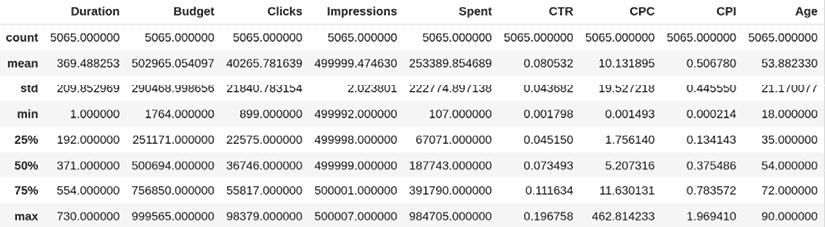
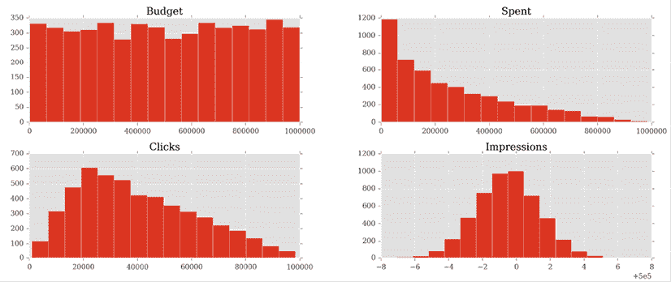
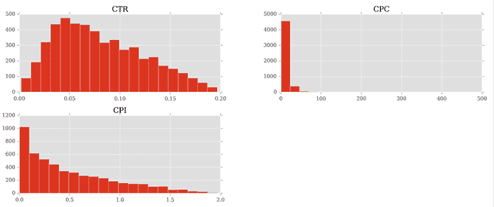
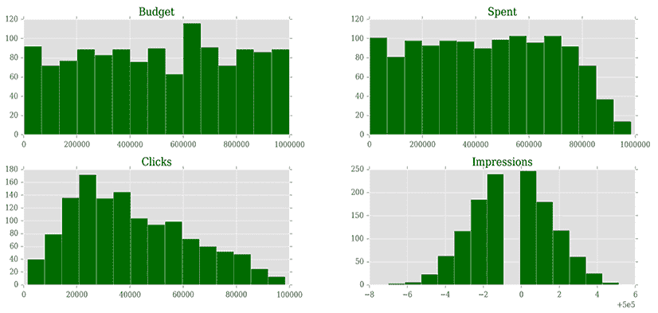
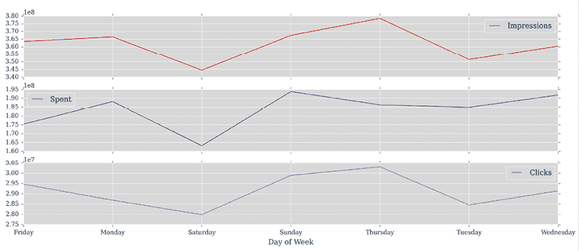
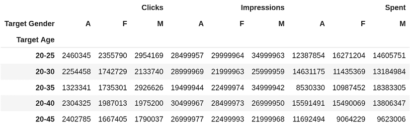

# 第十三章：简明数据分析

> “如果我们有数据，就让我们看看数据。如果我们只有意见，那就听我的。”
> 
> ——吉姆·巴克斯代尔，前网景 CEO

**数据分析**是一个广泛的概念，其含义可能因上下文、理解、工具等因素而异。要做好数据分析，至少需要了解数学和统计学。然后，你可能还想深入研究其他主题，如模式识别和机器学习，当然，还有大量的语言和工具可供使用。

我们在这里无法讨论所有内容。因此，为了使这一章节有意义，我们将一起完成一个项目。

大约在 2012/2013 年，Fabrizio 在伦敦的一家顶级社交媒体公司工作。他在那里工作了两年，有幸与几位非常聪明的人共事。这家公司是世界上第一个能够访问 Twitter Ads API 的公司，他们也是 Facebook 的合作伙伴。这意味着有大量的数据。

他们的分析师正在处理大量的活动，他们正在努力应对他们必须完成的工作量，因此 Fabrizio 所在的开发团队试图通过向他们介绍 Python 和 Python 提供的数据处理工具来帮助他们。这是一段有趣的旅程，使他成为公司中几位人的导师，最终带他去马尼拉，在那里他为那里的分析师提供了一周两期的 Python 和数据分析强化培训课程。

本章我们将要做的项目是 Fabrizio 在马尼拉向他的学生展示的最终示例的一个轻量级版本。我们将其改写为适合本章的大小，并对教学目的进行了一些调整，但所有主要概念都在其中，所以这应该会很有趣，也很有教育意义。

具体来说，我们将探索以下内容：

+   Jupyter Notebook 和 JupyterLab

+   pandas 和 NumPy：Python 数据分析的主要库

+   关于 pandas 的`DataFrame`类的一些概念

+   创建和处理数据集

让我们先从罗马神祇说起。

# IPython 和 Jupyter Notebook

2001 年，Fernando Perez 是科罗拉多大学博尔德分校的物理研究生，他试图改进 Python 壳，以便他能够在使用 Mathematica 和 Maple 等工具时享受到他习惯的便利。这些努力的成果被命名为**IPython**。

那个小脚本最初是 Python 壳的一个增强版本，通过其他程序员的努力，以及几家不同公司的资助，它最终成为了今天这个成功的项目。在其诞生后的大约 10 年后，一个笔记本环境被创建，它由 WebSocket、Tornado 网络服务器、jQuery、CodeMirror 和 MathJax 等技术驱动。ZeroMQ 库也被用来处理笔记本界面和其背后的 Python 核心之间的消息。

IPython Notebook 因其流行和广泛使用，随着时间的推移，它被添加了众多功能。它可以处理小部件、并行计算、各种媒体格式等等。此外，在某个时刻，从 Notebook 内部使用除 Python 之外的语言进行编码也成为可能。

最终，项目被拆分为两个部分：IPython 被简化以更多地关注内核和外壳，而 Notebook 成为了一个新的项目，称为 **Jupyter**。Jupyter 允许在超过 40 种语言中进行交互式科学计算。最近，Jupyter 项目创建了 **JupyterLab**，这是一个基于网页的 **IDE**，它集成了 Jupyter 笔记本、交互式控制台、代码编辑器等等。

本章的项目都将使用 Jupyter Notebook 编写和运行，因此让我们简要解释一下什么是 Notebook。Notebook 环境是一个网页，它暴露了一个简单的菜单和单元格，你可以在这里运行 Python 代码。尽管单元格是独立的实体，你可以单独运行它们，但它们都共享同一个 Python 内核。这意味着你在其中一个单元格（变量、函数等）中定义的所有名称都将可在任何其他单元格中使用。

简而言之，Python 内核是 Python 运行的一个进程。Notebook 网页是提供给用户驱动这个内核的界面。网页通过快速消息系统与之通信。

除了所有图形优势之外，拥有这样一个环境的美妙之处在于能够分块运行 Python 脚本，这可以是一个巨大的优势。假设有一个脚本连接到数据库以获取数据，然后操作这些数据。如果你用传统的 Python 脚本方式来做，每次你想实验它时都必须重新获取数据。在 Notebook 环境中，你可以在一个单元格中获取数据，然后在其他单元格中操作和实验它，因此不需要每次都获取数据。

Notebook 环境对于数据科学也很有帮助，因为它允许逐步检查结果。你完成一块工作后，然后验证它。然后你做另一块工作并再次验证，依此类推。

它对于原型设计也非常有价值，因为结果就在你眼前，立即可用。

如果你想了解更多关于这些工具的信息，请访问 [ipython.org](http://ipython.org) 和 [jupyter.org](http://jupyter.org) 。

我们创建了一个简单的 Notebook 示例，其中包含一个 `fibonacci()` 函数，它可以给出小于给定 `N` 的所有斐波那契数的列表。它看起来是这样的：


图 13.1：一个 Jupyter Notebook

每个单元都有一个方括号中的标签，如 **[1]**。如果方括号中没有内容，则表示该单元从未被执行。如果有数字，则表示该单元已被执行，数字代表单元执行的顺序。一个星号，如 *****，表示该单元目前正在执行。

您可以在截图看到，在第一个单元中我们定义了 `fibonacci()` 函数并执行了它。这会将 `fibonacci` 名称放置在笔记本关联的全局作用域中，因此 `fibonacci()` 函数现在也对其他单元可用。实际上，在第二个单元中，我们可以运行 `list(fibonacci(100))` 并在下面的单元 **[2]**（每个单元的输出都标记与单元相同的数字）中看到结果输出。在第三个单元中，我们向您展示了笔记本中可以找到的几个“魔法”函数之一：`%timeit` 函数多次运行代码并提供基准（这是使用我们在 *第十一章，调试和性能分析* 中简要介绍的 `timeit` 模块实现的）。 

您可以按需多次执行一个单元，并改变它们的执行顺序。单元非常灵活：您还可以有原始单元，其中包含纯文本，或者 Markdown 单元，这对于添加格式化的文本说明或标题非常有用。

**Markdown** 是一种轻量级标记语言，具有纯文本格式化语法，旨在能够将其转换为 HTML 和其他多种格式。

另一个有用的功能是，无论您在单元的最后一行放置什么内容，它都会自动为您打印出来。这意味着您不必每次想要检查一个值时都明确写出 `print(…)`。

## 使用 Anaconda

如同往常，您可以使用该章节源代码中的 `requirements.txt` 文件安装本章节所需的库。有时，安装数据科学库可能会相当痛苦。如果您在虚拟环境中安装本章节的库有困难，您可以安装 Anaconda。Anaconda 是 Python 和 R 编程语言的一个免费开源数据科学和机器学习相关应用的发行版，旨在简化包管理和部署。您可以从 [anaconda.org](http://anaconda.org) 网站下载它。安装后，您可以使用 Anaconda 界面创建虚拟环境并安装 `requirements.in` 文件中列出的包，该文件也可以在章节源代码中找到。

## 开始使用笔记本

一旦安装了所有必需的库，您可以使用以下命令开始一个笔记本：

```py
$ jupyter notebook 
```

如果你通过 Anaconda 安装需求，你也可以从 Anaconda 界面启动笔记本。在任何情况下，你都会在网页浏览器的此地址（端口号可能不同）打开一个页面：[`localhost:8888/`](http://localhost:8888/) 。

你也可以从 Anaconda 启动 JupyterLab，或者使用以下命令：

```py
$ jupyter lab 
```

它也会在你的网页浏览器中作为一个新页面打开。

探索这两个界面。创建一个新的笔记本或打开我们上面展示的`example.ipynb`笔记本。看看你更喜欢哪个界面，并在继续本章的其余部分之前熟悉它。我们在本章的源代码中包含了包含本章其余部分使用的笔记本的保存 JupyterLab 工作空间（文件名为`ch13.jupyterlab-workspace`）。你可以使用它来在 JupyterLab 中跟随，或者如果你更喜欢，可以坚持使用经典笔记本界面。

或者，如果你使用现代 IDE 来跟随本章的示例，你很可能会安装一个插件，直接在 IDE 中工作与笔记本。

为了帮助你跟上进度，我们将在这个章节中为每个代码示例标记它所属的笔记本单元格编号。

如果你熟悉键盘快捷键（在经典笔记本的**帮助**菜单或 JupyterLab 的**设置编辑器**中查找），你将能够在单元格之间移动并处理它们的内容，而无需伸手去拿鼠标。这将使你在笔记本中工作更快。

现在，让我们继续前进，谈谈本章最有趣的部分：数据。

# 处理数据

通常，当你处理数据时，你会经过以下路径：你获取它；你清理和操作它；然后你分析它，并以值、电子表格、图表等形式展示结果。我们希望你能独立完成这个过程的所有三个步骤，而不需要依赖任何外部数据提供者，因此我们将执行以下操作：

1.  创建数据，模拟它以不完美或未准备好工作的格式到来。

1.  清理它，并将其提供给我们在项目中将使用的主要工具，即来自`pandas`库的`DataFrame`。

1.  在`DataFrame`中操作数据。

1.  将`DataFrame`保存到不同格式的文件中。

1.  分析数据并从中获取一些结果。

## 设置笔记本

首先，让我们生成数据。我们从`ch13-dataprep`笔记本开始。单元格`#1`负责导入：

```py
#1
import json
import random
from datetime import date, timedelta
import faker 
```

我们还没有遇到的最主要的模块是`random`和`faker`。`random`是一个用于生成伪随机数的标准库模块。`faker`是一个用于生成假数据的第三方模块。它在测试中特别有用，当你准备你的固定数据时，可以获取各种东西，如姓名、电子邮件地址、电话号码和信用卡详情。

## 准备数据

我们希望达到以下数据结构：我们将有一个用户对象的列表。每个用户对象将链接到几个活动对象。在 Python 中，一切都是对象，所以我们以通用方式使用这个术语。用户对象可能是一个字符串、一个字典或其他东西。

在社交媒体世界中，**活动**是指媒体代理代表客户在社交媒体网络上运行的促销活动。请记住，我们将准备这些数据，以便它们不是完美的形状。首先，我们实例化我们将用于创建数据的`Faker`：

```py
#2
fake = faker.Faker() 
```

这将在内部跟踪已生成的值，并且只产生唯一的值。我们使用列表推导式生成 1,000 个唯一的用户名。

接下来，我们创建一个`users`列表。我们将生成 1,000 个包含诸如`username`、`name`、`gender`和`email`等详细信息的`user`字典。然后，每个`user`字典被转换为 JSON 格式并添加到列表中。这种数据结构当然不是最优的，但我们正在模拟用户以这种方式来到我们这里的场景。

```py
#3
def get_users(no_of_users):
    usernames = (
        fake.unique.user_name() for i in range(usernames_no)
    )
    genders = random.choices(
        ["M", "F", "O"], weights=[0.43, 0.47, 0.1], k=no_of_users
    )
    for username, gender in zip(usernames, genders):
        name = get_random_name(gender)
        user = {
            "username": username,
            "name": name,
            "gender": gender,
            "email": fake.email(),
            "age": fake.random_int(min=18, max=90),
            "address": fake.address(),
        }
        yield json.dumps(user)
def get_random_name(gender):
    match gender:
        case "F":
            name = fake.name_female()
        case "M":
            name = fake.name_male()
        case _:
            name = fake.name_nonbinary()
    return name
users = get_users(1000)
users[:3] 
```

`get_users()`生成函数接受要创建的用户数量作为参数。我们使用生成表达式中的`fake.unique.user_name()`来生成唯一的用户名。`fake.unique`属性跟踪已生成的值，并且只产生唯一的值。接下来，我们调用`random.choices()`来从列表`["M", "F", "O"]`（代表男性、女性或其他性别）中生成一个包含`no_of_users`个随机元素的列表。权重 0.43、0.47 和 0.1 将确保我们大约 43%的用户是男性，47%是女性，10%不认同为男性或女性。我们使用`zip()`遍历用户名和性别。对于每个用户，我们调用`get_random_name()`，它使用`match`语句生成适合性别的名字，然后生成一个假的电子邮件地址、年龄和地址。我们将用户数据转换为 JSON 字符串并`yield`它。

还请注意单元格中的最后一行。每个单元格都会自动打印最后一行上的内容；因此，#3 的输出是一个包含前三个用户的列表：

```py
 ['{"username": "epennington", "name": "Stephanie Gonzalez", ...}',
 '{"username": "joshua61", "name": "Diana Richards", ...}',
 '{"username": "dmoore", "name": "Erin Rose", "gender": "F",...}'] 
```

我们希望您正在跟随自己的笔记本进行学习。如果您正在这样做，请注意，所有数据都是使用随机函数和值生成的；因此，您将看到不同的结果。每次您执行笔记本时，它们都会发生变化。另外请注意，我们不得不裁剪本章的大部分输出以适应页面，所以您在笔记本中看到的输出将比我们在这里复制的要多得多。

分析师们经常使用电子表格，他们创建各种编码技术，尽可能将尽可能多的信息压缩到活动名称中。我们选择这种格式是那种技术的简单示例——有一个代码告诉我们活动类型，然后是开始和结束日期，然后是目标`年龄`和`性别`（`"M"`代表男性，`"F"`代表女性，或`"A"`代表任何），最后是货币。

所有值都用下划线分隔。生成这些营销活动名称的代码可以在单元格 `#4` 中找到：

```py
#4
# campaign name format:
# InternalType_StartDate_EndDate_TargetAge_TargetGender_Currency
def get_type():
    # just some meaningless example codes
    types = ["AKX", "BYU", "GRZ", "KTR"]
    return random.choice(types)
def get_start_end_dates():
    duration = random.randint(1, 2 * 365)
    offset = random.randint(-365, 365)
    start = date.today() - timedelta(days=offset)
    end = start + timedelta(days=duration)

    def _format_date(date_):
        return date_.strftime("%Y%m%d")
    return _format_date(start), _format_date(end)
def get_age_range():
    age = random.randrange(20, 46, 5)
    diff = random.randrange(5, 26, 5)
    return "{}-{}".format(age, age + diff)
def get_gender():
    return random.choice(("M", "F", "A"))
def get_currency():
    return random.choice(("GBP", "EUR", "USD"))
def get_campaign_name():
    separator = "_"
    type_ = get_type()
    start, end = get_start_end_dates()
    age_range = get_age_range()
    gender = get_gender()
    currency = get_currency()
    return separator.join(
        (type_, start, end, age_range, gender, currency)
    ) 
```

在 `get_type()` 函数中，我们使用 `random.choice()` 从一个集合中随机获取一个值。`get_start_end_dates()` 函数稍微有趣一些。我们计算两个随机整数：活动的 `duration`（天数，介于一天和两年之间）和一个 `offset`（介于-365 和 365 天之间的天数）。我们从今天的日期减去 `offset`（作为一个 `timedelta` ）以得到开始日期，并加上 `duration` 以得到结束日期。最后，我们返回两个日期的字符串表示。

`get_age_range()` 函数生成一个随机的目标年龄范围，其中两个端点都是五的倍数。我们使用 `random.randrange()` 函数，该函数返回一个由 `start`、`stop` 和 `step` 参数定义的范围内的随机数（这些参数的含义与我们在 *第三章，条件语句和迭代* 中首次遇到的 `range` 对象相同）。我们生成随机数 `age`（20 到 46 岁之间的 5 的倍数）和 `diff`（5 到 26 岁之间的 5 的倍数）。我们将 `diff` 加到 `age` 上以得到年龄范围的上限，并返回年龄范围的字符串表示。

其余的函数只是对 `random.choice()` 的一些应用，最后一个函数 `get_campaign_name()` 将所有片段组合起来并返回最终的营销活动名称。

在 `#5` 中，我们编写了一个函数来创建一个完整的营销活动对象：

```py
#5
# campaign data:
# name, budget, spent, clicks, impressions
def get_campaign_data():
    name = get_campaign_name()
    budget = random.randint(10**3, 10**6)
    spent = random.randint(10**2, budget)
    clicks = int(random.triangular(10**2, 10**5, 0.2 * 10**5))
    impressions = int(random.gauss(0.5 * 10**6, 2))
    return {
        "cmp_name": name,
        "cmp_bgt": budget,
        "cmp_spent": spent,
        "cmp_clicks": clicks,
        "cmp_impr": impressions,
    } 
```

我们使用了一些来自 `random` 模块的功能。`random.randint()` 给你两个极端之间的整数。它遵循均匀概率分布，这意味着区间内的任何数字出现的概率相同。为了避免我们的所有数据看起来都相似，我们选择使用 `triangular()` 和 `gauss()`，用于 `clicks` 和 `impressions`。它们使用不同的概率分布，这样我们最终会看到更有趣的东西。

只为了确保我们对术语的理解一致：`clicks` 代表对营销活动广告的点击次数，`budget` 是分配给活动的总金额，`spent` 是已经花费的金额，而 `impressions` 是活动被展示的次数，无论在活动中执行了多少点击。通常，`impressions` 的数量大于 `clicks` 的数量，因为广告通常被查看而没有被点击。

现在我们有了数据，我们可以将其全部组合起来：

```py
#6
def get_data(users):
    data = []
    for user in users:
        campaigns = [
            get_campaign_data()
            for _ in range(random.randint(2, 8))
        ]
        data.append({"user": user, "campaigns": campaigns})
    return data 
```

如您所见，`data` 中的每个条目都是一个包含 `user` 和与该 `user` 关联的营销活动列表的字典。

## 数据清理

接下来，我们可以开始清理数据：

```py
#7
rough_data = get_data(users)
rough_data[:2]  # let us take a peek 
```

我们模拟从源中获取数据，然后检查它。笔记本是检查您步骤的完美工具。

您可以根据需要调整粒度。`rough_data` 中的第一个条目看起来像这样：

```py
 {'user': '{"username": "epennington", "name": ...}',
  'campaigns': [{'cmp_name': 'KTR_20250404_20250916_35-50_A_EUR',
    'cmp_bgt': 964496,
    'cmp_spent': 29586,
    'cmp_clicks': 36632,
    'cmp_impr': 500001},
   {'cmp_name': 'AKX_20240130_20241017_20-25_M_GBP',
    'cmp_bgt': 344739,
    'cmp_spent': 166010,
    'cmp_clicks': 67325,
    'cmp_impr': 499999}]} 
```

现在，我们可以开始处理数据。为了能够使用这些 `data`，我们首先需要做的事情是将它去规范化。**去规范化**是一个将数据重新结构化到单个表中的过程。这涉及到合并来自多个表的数据或展开嵌套的数据结构。它通常会引入一些数据重复；然而，通过消除处理嵌套结构或跨多个表查找相关数据的需求，它简化了数据分析。在我们的案例中，这意味着将 `data` 转换为一个列表，其项是带有它们相对 `user` 字典的战役字典。用户将在他们关联的每个战役中重复：

```py
#8
data = []
for datum in rough_data:
    for campaign in datum["campaigns"]:
        campaign.update({"user": datum["user"]})
        data.append(campaign)
data[:2]  # let us take another peek 
```

`data` 中的第一个项目现在看起来像这样：

```py
 {'cmp_name': 'KTR_20250404_20250916_35-50_A_EUR',
 'cmp_bgt': 964496,
 'cmp_spent': 29586,
 'cmp_clicks': 36632,
 'cmp_impr': 500001,
 'user': '{"username": "epennington", ...}'}, 
```

现在，我们想要帮助你并提供本章的确定性第二部分，因此我们将保存这里生成的数据，以便我们（以及你）能够从下一个笔记本中加载它，然后我们应该得到相同的结果：

```py
#9
with open("data.json", "w") as stream:
    stream.write(json.dumps(data)) 
```

你应该在书的源代码中找到 `data.json` 文件。现在，我们已经完成了 `ch13-dataprep`，所以我们可以关闭它并打开 `ch13` 笔记本。

## 创建 DataFrame

现在我们已经准备好了数据，我们可以开始分析它。首先，我们进行另一轮导入：

```py
#1
import json
import arrow
import pandas as pd
from pandas import DataFrame 
```

我们已经在 *第八章，文件和数据持久化* 中看到了 `json` 模块。我们也在 *第二章，内置数据类型* 中简要介绍了 `arrow`。这是一个非常实用的第三方库，它使得处理日期和时间变得容易得多。`pandas` 是整个项目的基础。**pandas** 代表 **Python 数据分析库**。在许多其他功能中，它提供了 `DataFrame`，这是一个具有高级处理能力的类似矩阵的数据结构。通常我们会 `import pandas as pd` 并单独导入 `DataFrame` **。**

导入之后，我们使用 `pandas.read_json()` 函数将我们的数据加载到一个 `DataFrame` 中：

```py
#2
df = pd.read_json("data.json")
df.head() 
```

我们使用 `DataFrame` 的 `head()` 方法检查前五行。你应该看到类似这样的内容：


图 13.2：DataFrame 的前几行

Jupyter 会自动将 `df.head()` 调用的输出渲染为 HTML。要获取纯文本表示，你可以在 `df.head()` 中包裹一个 `print` 调用。

`DataFrame` 结构允许你对它的内容执行各种操作。你可以按行或列进行筛选，聚合数据，等等。你可以对整个行或列进行操作，而无需支付如果你使用纯 Python 处理数据时必须支付的时间惩罚。这是可能的，因为底层 `pandas` 利用 **NumPy** 库的力量，而 **NumPy** 本身从其核心的低级实现中获得了惊人的速度。

NumPy 代表 Numeric Python。它是数据科学环境中最广泛使用的库之一。

使用 `DataFrame` 允许我们将 NumPy 的强大功能与类似电子表格的能力结合起来，这样我们就可以以类似于分析师通常所做的方式处理我们的数据，只是我们用代码来做。

让我们看看两种快速获取数据概览的方法：

```py
#3
df.count() 
```

`count()` 方法返回每列中所有非空单元格的计数。这有助于您了解您的数据有多稀疏。在我们的例子中，我们没有缺失值，所以输出是：

| `cmp_name` | 5065 |
| --- | --- |
| `cmp_bgt` | 5065 |
| `cmp_spent` | 5065 |
| `cmp_clicks` | 5065 |
| `cmp_impr` | 5065 |
| `user` | 5065 |
| `dtype: int64` |  |

我们有 5,065 行。考虑到我们有 1,000 个用户，每个用户的活动数量是一个介于 2 和 8 之间的随机数，这与我们的预期相符。

输出末尾的 `dtype: int64` 行表示 `df.count()` 返回的值是 NumPy 的 `int64` 对象。在这里，`dtype` 代表“数据类型”，而 `int64` 表示 64 位整数。NumPy 主要用 C 语言实现，它不使用 Python 的内置数字类型，而是使用自己的类型，这些类型与 C 语言的数据类型密切相关。这使得它能够比纯 Python 更快地执行数值运算。

`describe` 方法有助于快速获取数据的统计摘要：

```py
#4
df.describe() 
```

如下面的输出所示，它提供了几个度量，如 `count`、`mean`、`std`（标准差）、`min` 和 `max`，并显示了数据在各个四分位数中的分布情况。多亏了这种方法，我们已经有了一个关于数据结构的大致了解：

|  | **cmp_bgt** | **cmp_spent** | **cmp_clicks** | **cmp_impr** |
| --- | --- | --- | --- | --- |
| **count** | 5065.000000 | 5065.000000 | 5065.000000 | 5065.000000 |
| **mean** | 502965.054097 | 253389.854689 | 40265.781639 | 499999.474630 |
| **std** | 290468.998656 | 222774.897138 | 21840.783154 | 2.023801 |
| **min** | 1764.000000 | 107.000000 | 899.000000 | 499992.000000 |
| **25%** | 251171.000000 | 67071.000000 | 22575.000000 | 499998.000000 |
| **50%** | 500694.000000 | 187743.000000 | 36746.000000 | 499999.000000 |
| **75%** | 756850.000000 | 391790.000000 | 55817.000000 | 500001.000000 |
| **max** | 999565.000000 | 984705.000000 | 98379.000000 | 500007.000000 |

我们可以使用 `sort_values()` 和 `head()` 方法查看预算最高的活动：

```py
#5
df.sort_values(by=["cmp_bgt"], ascending=False).head(3) 
```

这将给出以下输出（我们省略了一些列以适应页面输出）：

|  | **cmp_name** | **cmp_bgt** | **cmp_clicks** | **cmp_impr** |
| --- | --- | --- | --- | --- |
| **3186** | `GRZ_20230914_20230929_40-60_A_EUR` | 999565 | 63869 | 499998 |
| **3168** | `KTR_20250315_20260507_25-40_M_USD` | 999487 | 21097 | 500000 |
| **3624** | `GRZ_20250227_20250617_30-45_F_USD` | 999482 | 3435 | 499998 |

使用 `tail()` 而不是 `head()` 可以显示预算最低的活动：

```py
#6
df.sort_values(by=["cmp_bgt"], ascending=False).tail(3) 
```

接下来，我们将承担一些更复杂的任务。

### 解包活动名称

首先，我们想要去除活动名称列（`cmp_name`）。我们需要将其分解成部分，并将每个部分放入其专用的列中。我们将使用`Series`对象的`apply()`方法来完成此操作。

`pandas.core.series.Series`类是一个围绕数组的强大包装器（将其视为具有增强功能的列表）。我们可以通过以字典中键的方式访问它来从`DataFrame`中提取`Series`对象。然后我们将使用`Series`对象的`apply()`方法对`Series`中的每个项目调用一个函数，并获取一个包含结果的新的`Series`。最后，我们将结果组合成一个新的`DataFrame`，然后将其与`df`连接。

我们首先定义一个函数，将活动名称拆分为包含类型、开始和结束日期、目标年龄、目标性别和货币的元组。请注意，我们使用`arrow.get()`将开始和结束日期字符串转换为`date`对象。

```py
#7
def unpack_campaign_name(name):
    # very optimistic method, assumes data in campaign name
    # is always in good state
    type_, start, end, age, gender, currency = name.split("_")
    start = arrow.get(start, "YYYYMMDD").date()
    end = arrow.get(end, "YYYYMMDD").date()
    return type_, start, end, age, gender, currency 
```

接下来，我们从`df`中提取带有活动名称的`Series`，并将`unpack_campaign_name()`函数应用于每个名称。

```py
#8
campaign_data = df["cmp_name"].apply(unpack_campaign_name) 
```

现在，我们可以从`campaign_data`构建一个新的`DataFrame`：

```py
#9
campaign_cols = [
    "Type",
    "Start",
    "End",
    "Target Age",
    "Target Gender",
    "Currency",
]
campaign_df = DataFrame.from_records(
    campaign_data, columns=campaign_cols, index=df.index
)
campaign_df.head(3) 
```

快速查看前几行显示：

|  | **类型** | **开始** | **结束** | **目标年龄** | **目标性别** | **货币** |
| --- | --- | --- | --- | --- | --- | --- |
| 0 | `KTR` | `2025-04-04` | `2025-09-16` | `35-50` | `A` | `EUR` |
| 1 | `AKX` | `2024-01-30` | `2024-10-17` | `20-25` | `M` | `GBP` |
| 2 | `BYU` | `2023-08-28` | `2025-01-15` | `25-45` | `M` | `GBP` |

看起来更好。现在，我们可以更容易地处理由列名称表示的数据。要记住的一个重要事项：即使日期以字符串的形式打印出来，它们也只是存储在`DataFrame`中的真实`date`对象的表示。

最后，我们可以将原始`DataFrame`（`df`）和`campaign_df`连接成一个单一的`DataFrame`。在连接两个`DataFrame`实例时，它们必须具有相同的`index`，否则`pandas`无法匹配行。我们通过在创建`campaign_df`时显式使用`df`的索引来处理这个问题。

```py
#10
df = df.join(campaign_df) 
```

让我们检查数据以验证一切是否正确匹配：

```py
#11
df[["cmp_name"] + campaign_cols].head(3) 
```

输出的前几列如下：

|  | **cmp_name** | **类型** | **开始** | **结束** |
| --- | --- | --- | --- | --- |
| 0 | `KTR_20250404_20250916_35-50_A_EUR` | `KTR` | `2025-04-04` | `2025-09-16` |
| 1 | `AKX_20240130_20241017_20-25_M_GBP` | `AKX` | `2024-01-30` | `2024-10-17` |
| 2 | `BYU_20230828_20250115_25-45_M_GBP` | `BYU` | `2023-08-28` | `2025-01-15` |

如您所见，`join()`操作成功；活动名称和分离的列代表相同的数据。

注意我们如何使用方括号语法访问`DataFrame`，传递一个列名列表。这将产生一个新的`DataFrame`，其中包含这些列（按相同顺序），然后我们调用`head()`方法。

### 解包用户数据

现在，我们对每一份 `user` JSON 数据做同样的事情。我们在 `user` 系列上调用 `apply()`，运行 `unpack_user_json()` 函数，该函数接收一个 JSON `user` 对象并将其转换为字段列表。我们使用这些数据创建一个新的 `DataFrame`，名为 `user_df`：

```py
#12
def unpack_user_json(user):
    # very optimistic as well, expects user objects
    # to have all attributes
    user = json.loads(user.strip())
    return [
        user["username"],
        user["email"],
        user["name"],
        user["gender"],
        user["age"],
        user["address"],
    ]
user_data = df["user"].apply(unpack_user_json)
user_cols = [
    "username",
    "email",
    "name",
    "gender",
    "age",
    "address",
]
user_df = DataFrame.from_records(
    user_data, columns=user_cols, index=df.index
) 
```

接下来，我们将 `user_df` 与 `df`（就像我们之前对 `campaign_df` 做的那样）连接起来，并检查结果：

```py
#13
df = df.join(user_df)
df[["user"] + user_cols].head(2) 
```

输出显示一切正常。

### 重命名列

如果你在一个单元格中评估 `df.columns`，你会看到我们列的名称仍然很丑陋。让我们来改变一下：

```py
#14
new_column_names = {
    "cmp_bgt": "Budget",
    "cmp_spent": "Spent",
    "cmp_clicks": "Clicks",
    "cmp_impr": "Impressions",
}
df.rename(columns=new_column_names, inplace=True) 
```

`rename()` 方法可以用来更改列（或行）标签。我们给它提供了一个映射旧列名到我们首选名称的字典。任何未在字典中提到的列将保持不变。

## 计算一些指标

我们下一步将添加一些额外的列。对于每个活动，我们都有点击数和展示数，以及花费的金额。这使我们能够引入三个测量比率：`CTR`、`CPC` 和 `CPI`。它们分别代表 *点击通过率*、*每点击成本* 和 *每展示成本*。

最后两个很简单，但 `CTR` 不一样。简单来说，它是点击和展示的比率。它衡量了每展示一次活动广告时点击的次数——这个数字越高，广告在吸引用户点击方面就越成功。让我们编写一个函数来计算所有三个比率并将它们添加到 `DataFrame` 中：

```py
#15
def calculate_metrics(df):
    # Click Through Rate
    df["CTR"] = df["Clicks"] / df["Impressions"]
    # Cost Per Click
    df["CPC"] = df["Spent"] / df["Clicks"]
    # Cost Per Impression
    df["CPI"] = df["Spent"] / df["Impressions"]
calculate_metrics(df) 
```

注意，我们通过一行代码添加了这三个列，但 `DataFrame` 会自动（在这种情况下是除法）对适当列中的每一对单元格执行操作。所以，尽管看起来我们只做了三次除法，但实际上有 *5,140 * 3* 次除法，因为它们是针对每一行执行的。`pandas` 在为我们做大量工作的同时，隐藏了其中的许多复杂性。

`calculate_metrics()` 函数接收一个 `DataFrame`（`df`）并在其上直接操作。这种操作模式被称为**原地**。这类似于 `list.sort()` 方法对列表进行排序的方式。你也可以说这个函数不是纯函数，这意味着它有副作用，因为它修改了作为参数传递的可变对象。

我们可以通过筛选相关列并调用 `head()` 来查看结果：

```py
#16
df[["Spent", "Clicks", "Impressions", "CTR", "CPC", "CPI"]].head(
    3
) 
```

这表明计算已经在每一行上正确执行：

|  | **花费** | **点击** | **展示** | **CTR** | **CPC** | **CPI** |
| --- | --- | --- | --- | --- | --- | --- |
| 0 | 29586 | 36632 | 500001 | 0.073264 | 0.807655 | 0.059172 |
| 1 | 166010 | 67325 | 499999 | 0.134650 | 2.465800 | 0.332021 |
| 2 | 125738 | 29989 | 499997 | 0.059978 | 4.192804 | 0.251478 |

我们还可以手动验证第一行的结果准确性：

```py
#17
clicks = df["Clicks"][0]
impressions = df["Impressions"][0]
spent = df["Spent"][0]
CTR = df["CTR"][0]
CPC = df["CPC"][0]
CPI = df["CPI"][0]
print("CTR:", CTR, clicks / impressions)
print("CPC:", CPC, spent / clicks)
print("CPI:", CPI, spent / impressions) 
```

这产生了以下输出：

```py
CTR: 0.07326385347229306 0.07326385347229306
CPC: 0.8076545097182791 0.8076545097182791
CPI: 0.059171881656236686 0.059171881656236686 
```

值匹配，确认我们的计算是正确的。当然，我们通常不需要这样做，但我们想向你展示如何执行此类计算。你可以通过将名称传递给方括号中的`DataFrame`来访问一个`Series`（一个列）。然后你可以通过其位置访问列中的每一行，就像你使用常规列表或元组一样。

我们几乎完成了我们的`DataFrame`。我们现在缺少的只是一个告诉我们活动持续时间的列，以及一个告诉我们每个活动开始是星期几的列。持续时间很重要，因为它允许我们将诸如花费金额或展示次数等数据与活动的持续时间联系起来（我们可能预计持续时间较长的活动花费更多，并且有更多的展示次数）。星期几也可能很有用；例如，一些活动可能与特定星期的某些事件相关联（例如在周末举行的体育赛事）。

```py
#18
def get_day_of_the_week(day):
    return day.strftime("%A")
def get_duration(row):
    return (row["End"] - row["Start"]).days
df["Day of Week"] = df["Start"].apply(get_day_of_the_week)
df["Duration"] = df.apply(get_duration, axis="columns") 
```

`get_day_of_the_week()`接受一个`date`对象并将其格式化为只包含相应星期名称的字符串。`get_duration()`更有趣。首先，注意它接受整个行，而不仅仅是单个值。这个函数从活动的开始日期减去结束日期。当你减去`date`对象时，结果是`timedelta`对象，它表示给定的时间量。我们取其`.days`属性的值来获取以天为单位的时间长度。

我们通过将`get_day_of_the_week()`应用于`Start`列（作为一个`Series`对象）来计算每个活动的开始周，这与我们对`"user"`和`"cmp_name"`所做的是类似的。接下来，我们将`get_duration()`应用于整个`DataFrame`。请注意，我们通过传递`axis="columns"`来指示`pandas`在行上操作。这看起来可能有些反直觉，但把它想象成将所有列传递给`get_duration()`的每一次调用。

我们可以像下面这样验证结果：

```py
#19
df[["Start", "End", "Duration", "Day of Week"]].head(3) 
```

这给出了以下输出：

|  | **开始** | **结束** | **持续时间** | **星期** |
| --- | --- | --- | --- | --- |
| **0** | `2025-04-04` | `2025-09-16` | 165 | `星期五` |
| **1** | `2024-01-30` | `2024-10-17` | 261 | `星期二` |
| **2** | `2023-08-28` | `2025-01-15` | 506 | `星期一` |

因此，我们现在知道从 2025 年 4 月 4 日到 2025 年 9 月 16 日之间有 165 天，而 2025 年 1 月 15 日是星期一。

### 清理一切

既然我们已经拥有了我们想要的一切，现在是时候进行最后的清洁工作了；记住我们仍然有`"cmp_name"`和`"user"`列。这些不再需要，所以我们将移除它们。我们还想重新排列`DataFrame`中的列，以便它们与现在包含的数据更加相关。我们可以通过在想要的列上过滤`df`来实现这一点。结果是新的`DataFrame`，我们可以将其重新分配给名称`df`：

```py
#19
final_columns = [
    "Type",
    "Start",
    "End",
    "Duration",
    "Day of Week",
    "Budget",
    "Currency",
    "Clicks",
    "Impressions",
    "Spent",
    "CTR",
    "CPC",
    "CPI",
    "Target Age",
    "Target Gender",
    "Username",
    "Email",
    "Name",
    "Gender",
    "Age",
]
df = df[final_columns] 
```

我们在开始处将活动信息分组，然后是测量，最后是用户数据。现在我们的`DataFrame`已经干净，准备好供我们检查。

在我们开始创建一些图表之前，我们想要对`DataFrame`进行快照，这样我们就可以轻松地从文件中重建它，而无需重新执行我们为了到达这里所做的一切步骤。一些分析师可能希望将其以电子表格的形式保存，以便进行不同类型的分析，所以让我们看看如何将`DataFrame`保存到文件。

## 将 DataFrame 保存到文件

我们可以将`DataFrame`保存为几种格式。你可以输入`df.to_`然后按*Tab*键，以使自动完成弹出，这样你就可以看到所有选项。

我们将把我们的`DataFrame`保存为三种不同的格式。首先，CSV：

```py
#20
df.to_csv("df.csv") 
```

然后，JSON：

```py
#21
df.to_json("df.json") 
```

最后，在一个 Excel 电子表格中：

```py
#22
df.to_excel("df.xlsx") 
```

`to_excel()`方法需要安装`openpyxl`包。它包含在本章的`requirements.txt`文件中，所以如果你使用它来安装需求，你应该在你的虚拟环境中拥有它。

如你所见，保存`DataFrame`为多种格式很容易。好消息是，反过来也是如此：将电子表格加载到`DataFrame`中（只需使用`pandas read_csv()`或`read_excel()`函数）同样容易。

## 可视化结果

在本节中，我们将可视化一些结果。从数据科学的角度来看，我们不会尝试对数据进行深入分析，或试图从中得出任何结论。这样做没有太多意义，因为数据是完全随机的。然而，这个例子应该足以让你开始使用图表和其他功能。

我们通过艰难的方式学到的教训之一是，外观会影响人们对你的工作的看法。如果你想得到重视，仔细考虑你如何展示你的数据，并尝试让你的图表和表格看起来吸引人。

`pandas`使用 Matplotlib 绘图库来绘制图形。我们不会直接使用它，除非配置绘图样式并将图形保存到磁盘。你可以在[`matplotlib.org/`](https://matplotlib.org/)了解更多关于这个多功能绘图库的信息。

首先，我们将配置 Notebook，以便将 Matplotlib 图表作为交互式小部件在单元格输出框架中渲染。我们通过以下方式完成：

```py
#23
%matplotlib widget 
```

这将允许你平移和缩放图形，并将一个（低分辨率）快照保存到磁盘。

默认情况下（没有`%matplotlib widget`），图形将以静态图像的形式在单元格输出框架中渲染。使用交互式小部件模式需要安装`ipympl`包。它包含在本章的`requirements.txt`文件中，所以如果你使用它来安装需求，你应该在你的虚拟环境中拥有它。

然后，我们为我们的绘图设置一些样式：

```py
#24
import matplotlib.pyplot as plt
plt.style.use(["classic", "ggplot"])
plt.rc("font", family="serif"})
plt.rc("savefig", dpi=300) 
```

我们使用 `matplotlib.pyplot` 接口设置绘图样式。我们选择使用 `classic` 和 `ggplot` 样式表的组合。样式表是从左到右应用的，因此在这里 `ggplot` 将覆盖在两者中定义的任何样式项。我们还设置了绘图中所使用的字体家族为 `serif`。调用 `plt.rc("savefig", dpi=300)` 配置了 `savefig()` 方法以生成适合打印的高分辨率图像文件。

在我们生成任何图表之前，让我们再次运行 `df.describe()`（`#26`）。结果应该如下所示：



图 13.3：我们清理后的数据的某些统计信息

这种快速的结果非常适合满足那些只有 20 秒时间可以用来关注你并且只想得到粗略数字的经理们。

再次提醒，请注意我们的活动有不同的货币，所以这些数字没有意义。这里的目的是展示 `DataFrame` 的功能，而不是对真实数据进行正确或详细的分析。

或者，通常来说，图表比数字表格要好得多，因为它更容易阅读，并且能立即给出反馈。所以，让我们绘制我们关于每个活动的四条信息：“预算”、"花费"、“点击量”和“展示次数”：

```py
#27
df[["Budget", "Spent", "Clicks", "Impressions"]].hist(
    bins=16, figsize=(16, 6)
)
plt.savefig("Figure13.4.png") 
```

我们提取这四个列（这将给我们另一个只包含这些列的 `DataFrame`）并调用 `hist()` 方法来获取直方图。我们给出一些参数来指定箱数和图形大小，其余的自动完成。结果如下所示：



图 13.4：活动数据的直方图

我们还调用 `plt.savefig("Figure13.4.png")` 将图像保存到名为 `Figure13.4.png` 的文件中。这将使用我们之前配置的 `300dpi` 设置来生成高分辨率图像。请注意，`plt.savefig()` 将保存 Matplotlib 生成的最新图像。从生成图表的同一单元格中调用它确保我们保存了正确的图像到正确的文件名。

尽管尝试解释随机数据的图表没有意义，但我们至少可以验证我们看到的结果与我们根据数据生成方式可能预期的结果相匹配。

+   *预算* 是从区间中随机选择的，所以我们期望一个均匀分布。从图表上看，这确实是我们所看到的。

+   *花费* 也是均匀分布的，但其上限是预算，这不是恒定的。这意味着我们应该期望一个从左到右递减的对数曲线。再次，这与图表显示的一致。

+   *点击量* 是通过具有区间大小平均 20%的三角分布生成的，你可以看到峰值就在那里，大约在左侧 20%的位置。

+   *Impressions*呈高斯分布，这假设了著名的钟形形状。平均值正好在中间，我们有一个标准差为 2。您可以看到图表与这些参数相匹配。

让我们也绘制我们计算出的指标：

```py
#28
df[["CTR", "CPC", "CPI"]].hist(bins=20, figsize=(16, 6))
plt.savefig("Figure13.5.png") 
```

这是图表表示：



图 13.5：计算出的度量值的直方图

我们可以看到，*CPC*严重向左倾斜，这意味着大多数*CPC*值都很低。*CPI*具有相似的形状，但不太极端。

现在，假设您只想分析数据的一个特定部分。我们可以对`DataFrame`应用一个掩码，以便我们得到一个新的`DataFrame`，其中只包含满足掩码条件的行。这就像应用一个全局的、按行操作的`if`子句：

```py
#29
selector = df.Spent > df.Budget * 0.75
df[selector][["Budget", "Spent", "Clicks", "Impressions"]].hist(
    bins=15, figsize=(16, 6), color="green"
)
plt.savefig("Figure13.6.png") 
```

在这个例子中，我们准备了`selector`来筛选出所有花费金额小于或等于预算 75%的行。换句话说，我们只包括那些至少花费了预算四分之三的活动。请注意，在`selector`中，我们向您展示了一种获取`DataFrame`列的替代方法，即通过直接属性访问（`object.property_name`），而不是字典式访问（`object['property_name']`）。如果`property_name`是一个有效的 Python 名称，您可以使用这两种方式互换。

`selector`的应用方式与访问字典时使用键的方式相同。当我们对`df`应用`selector`时，我们得到一个新的`DataFrame`。我们只从其中选择相关的列，并再次调用`hist()`。这次，我们将`color`设置为`green`，只是为了展示如何做到这一点。



图 13.6：至少花费了 75%预算的活动的直方图

注意，除了*Spent*图表之外，图表的形状变化不大，*Spent*图表相当不同。这是因为我们只选择了花费金额至少为预算 75%的行。这意味着我们只包括花费金额接近预算的行。预算数字来自均匀分布。因此，*Spent*图表现在呈现出这种形状。如果您将边界设置得更紧，要求 85%或更多，您将看到*Spent*图表越来越接近*Budget*。

让我们也看看不同类型的图表。我们将绘制每天的花费`"Spent"`、`"Clicks"`和`"Impressions"`的总和。

```py
#30
df_weekday = df.groupby(["Day of Week"]).sum(numeric_only=True)
df_weekday[["Impressions", "Spent", "Clicks"]].plot(
    figsize=(16, 6), subplots=True
)
plt.savefig("Figure13.7.png") 
```

第一行创建了一个新的`DataFrame`，名为`df_weekday`，通过在`df`上请求按`"Day of Week"`进行分组。然后我们通过在每个组内计算总和来进行聚合。请注意，我们必须传递`numeric_only=True`以避免在尝试对包含非数值数据的列求和时出错。我们也可以通过在分组和求和之前只选择我们需要的列（`"Day of Week"`、`"Impressions"`、`"Spent"`和`"Clicks"`）来采取不同的方法。

注意，这次我们调用 `plot()` 而不是 `hist()`。这将绘制一个折线图而不是直方图。`subplots=True` 选项使 `plot` 绘制三个单独的图表：



图 13.7：按星期几汇总的活动数据图

这些图表显示，周四开始的活动获得了最多的点击和印象，而周六开始的活动花费的钱最少。如果这是真实数据，这可能会是我们的客户需要的重要信息。

注意，这些天是按字母顺序排序的，这使得图表难以阅读。我们将把这个作为练习留给你，找到一种方法来解决这个问题。

让我们在结束这个演示部分之前再补充几点。首先，一个简单的聚合。我们希望按 `"Target Gender"` 和 `"Target Age"` 进行分组，并计算每个分组中 `"Impressions"` 和 `"Spent"` 的平均值和标准差 `("std")`。

```py
#31
agg_config = {
    "Impressions": ["mean", "std"],
    "Spent": ["mean", "std"],
}
df.groupby(["Target Gender", "Target Age"]).agg(agg_config) 
```

我们准备了一个字典作为配置使用。然后，我们在 `"Target Gender"` 和 `"Target Age"` 列上执行分组，并将我们的配置字典传递给 `agg()` 方法。输出看起来像这样：

|  |  | **Impressions** | **Spent** |
| --- | --- | --- | --- |
|  |  | **mean** | **std** | **mean** | **std** |
| **Target Gender** | **Target Age** |  |  |  |  |
| **A** | 20-25 | 499999.245614 | 2.189918 | 217330.771930 | 204518.652595 |
| 20-30 | 499999.465517 | 2.210148 | 252261.637931 | 228932.088945 |
| 20-35 | 499998.564103 | 1.774006 | 218726.410256 | 215060.976707 |
| 20-40 | 499999.459016 | 1.971241 | 255598.213115 | 222697.755231 |
| 20-45 | 499999.574074 | 2.245346 | 216527.666667 | 190345.252888 |
| **...** | ... | ... | ... | ... | ... |
| **M** | 45-50 | 499999.480769 | 2.128153 | 276112.557692 | 226975.008137 |
| 45-55 | 499999.306122 | 2.053494 | 267137.938776 | 239249.474145 |
| 45-60 | 499999.500000 | 1.984063 | 236623.312500 | 223464.578371 |
| 45-65 | 499999.679245 | 1.503503 | 215634.528302 | 223308.046968 |
| 45-70 | 499998.870370 | 1.822773 | 310267.944444 | 242353.980346 |

在我们结束这一章之前，让我们再做一些事情。我们想向你展示一个叫做 **交叉表** 的东西。交叉表是一种分组数据、为每个组计算聚合值并在表格形式中显示结果的方法。交叉表是数据分析的一个基本工具，所以让我们看看一个简单的例子：

```py
#31
df.pivot_table(
    values=["Impressions", "Clicks", "Spent"],
    index=["Target Age"],
    columns=["Target Gender"],
    aggfunc="sum"
) 
```

我们创建了一个交叉表，显示了 `"Target Age"` 与 `"Impressions"`、"Clicks" 和 `"Spent"` 之间的相关性。最后这三个将根据 `"` `Target Gender"` 进行细分。`aggfunc` 参数指定要使用的聚合函数，它可以是函数对象、函数名、函数列表或映射列名到函数的字典。在这种情况下，我们使用 `"sum"`（默认值，如果没有指定函数，则计算平均值）。结果是包含交叉表的新 `DataFrame`：



图 13.8：交叉表

这就结束了我们的数据分析项目。我们将让你去探索关于 IPython、Jupyter 和数据科学的奇妙世界。我们强烈建议你熟悉 Notebook 环境。它比控制台更好，实用且使用起来有趣，你甚至可以用它来创建幻灯片和文档。

# 我们接下来该去哪里？

数据科学确实是一个迷人的主题。正如我们在引言中所说，那些想要深入其迷宫的人需要具备扎实的数学和统计学基础。处理被错误插值的数据会使任何关于它的结果都变得无用。同样，对于被错误外推或以错误频率采样的数据也是如此。为了给你一个例子，想象一个排列成队列的个人群体。如果出于某种原因，这个群体的性别在男性和女性之间交替，队列看起来可能就像这样：F-M-F-M-F-M-F-M-F...

如果你只采样偶数元素，你会得出结论说这个群体只由男性组成，而采样奇数元素则会告诉你正好相反。

当然，这只是一个愚蠢的例子，但在这个领域很容易出错，尤其是在处理需要采样的大数据集时，因此，你分析的质量首先取决于采样的质量。

当谈到数据科学和 Python 时，这些是你想要查看的主要工具：

+   **NumPy** ([`www.numpy.org/`](https://www.numpy.org/)): 这是使用 Python 进行科学计算的主要包。它包含一个强大的 N 维数组对象，复杂的（广播）函数，用于集成 C/C++和 Fortran 代码的工具，有用的线性代数，傅里叶变换，随机数功能，以及更多。

+   **scikit-learn** ([`scikit-learn.org/`](https://scikit-learn.org/)): 这是 Python 中最受欢迎的机器学习库之一。它提供了简单高效的数据挖掘和分析工具，对每个人都是可访问的，并且可以在各种环境中重复使用。它是基于 NumPy、SciPy 和 Matplotlib 构建的。

+   **pandas** ([`pandas.pydata.org/`](https://pandas.pydata.org/)): 这是一个开源的 BSD 许可库，提供高性能、易于使用的数据结构和数据分析工具。我们在这章中一直使用它。

+   **IPython** ([`ipython.org/`](https://ipython.org/)) / **Jupyter** ([`jupyter.org/`](https://jupyter.org/)): 这些提供了丰富的交互式计算架构。

+   **Matplotlib** ([`matplotlib.org/`](https://matplotlib.org/)): 这是一个 Python 2D 绘图库，可以在多种硬拷贝格式和跨平台的交互式环境中生成出版物质量的图形。Matplotlib 可用于 Python 脚本、Python 和 IPython shell、Jupyter Notebook、Web 应用服务器以及多个图形用户界面工具包。

+   **Seaborn** ([`seaborn.pydata.org/`](https://seaborn.pydata.org/)): 这是一个基于 Matplotlib 的 Python 数据可视化库。它提供了一个高级接口，用于绘制吸引人且信息丰富的统计图形。

+   **Numba** ([`numba.pydata.org/`](https://numba.pydata.org/)): 这让你能够使用直接在 Python 中编写的性能函数来加速你的应用程序。通过一些注释，数组导向和数学密集型的 Python 代码可以被即时编译成本地机器指令，其性能与 C、C++和 Fortran 相似，而无需切换语言或 Python 解释器。

+   **Bokeh** ([`bokeh.pydata.org/`](https://bokeh.pydata.org/)): 这是一个针对现代 Web 浏览器的 Python 交互式可视化库，用于展示。它的目标是提供类似于 D3.js 风格的优雅、简洁的图形构建，同时也能在大型或流式数据集上提供高性能的交互性。

除了这些单个库之外，你还可以找到生态系统，例如**SciPy** ([`scipy.org/`](https://scipy.org/))和前面提到的**Anaconda** ([`anaconda.org/`](https://anaconda.org/))，它们捆绑了多个不同的包，以便你能够以“开箱即用”的方式获得所需的功能。

在某些系统上安装所有这些工具及其依赖项可能很困难，因此我们建议你也尝试生态系统，看看你是否对他们感到舒适。这可能值得尝试。

# 摘要

在本章中，我们讨论了数据科学。我们并没有试图解释这个广泛主题的任何内容，而是深入一个项目。我们熟悉了 Jupyter Notebook，以及不同的库，如`pandas`、`Matplotlib`和`NumPy`。

当然，必须将所有这些信息压缩到一章中意味着我们只能简要地涉及我们提出的主题。我们希望我们共同完成的项目足够全面，能够给你一个在这个领域工作时遵循的工作流程的思路。

下一章将专门介绍 API 开发。

# 加入我们的 Discord 社区

加入我们社区的 Discord 空间，与作者和其他读者进行讨论：

`discord.com/invite/uaKmaz7FEC`


