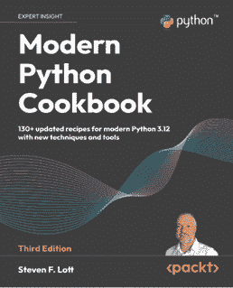
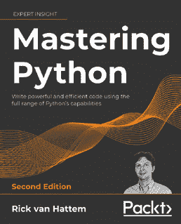

# 第十七章：编程挑战

> “注意上述代码中的错误；我只证明了它是正确的，而没有尝试运行它。”
> 
> ——唐纳德·克努特（Donald Knuth）

在本章中，我们将偏离专业编程，讨论竞赛编程和**编程挑战**的世界。

编程挑战是可以用相对简短的程序解决的问题。有几个网站提供了大量的挑战集合。大多数网站根据难度和其他因素，如：

+   解决挑战所需的算法类型。

+   挑战涉及的数据结构类型，如树、链表、n 维向量等。

+   挑战涉及的具体数据结构类型。例如，对于 Python，它们可以是列表、元组、字典等。

+   解决挑战所需的方法类型，如动态规划、递归等。

这个列表并不全面，但它给出了我们可以期待的内容。

提供编程挑战的网站出于各种原因。有些帮助程序员准备面试，有些只是出于娱乐，还有些作为教授编程的方式。

一些网站还举办比赛，其中参赛者提供的解决方案在执行速度、正确性和内存占用等方面进行衡量，仅举几例。

竞赛编程的世界非常有趣，编程挑战是学习新语言和提高编程技能的绝佳方式。

在本章中，我们将解决来自**Advent of Code**（https://adventofcode.com/）的两个问题，这是我们最喜欢的挑战网站。解决挑战很有趣，而且这是我们在相对较短的时间内展示 Python 几个特性的有效方式。

# Advent of Code

《Advent of Code》是由埃里克·瓦斯特尔（Eric Wastl）在 2015 年创建的。引用网站上的话：

> “《Advent of Code》是一个包含各种技能水平和技能集的小型编程谜题日历，可以用你喜欢的任何编程语言解决。人们使用它们作为面试准备、公司培训、大学课程、练习问题、速度竞赛或相互挑战。”
> 
> 你不需要计算机科学背景来参与——只需要一点编程知识和一些解决问题的技能，你就能走得很远。你也不需要一台高级的电脑；每个问题都有一个解决方案，在十年前的硬件上最多只需要 15 秒就能完成。”

每个问题有两个部分。根据埃里的说法，第一个部分是确保你理解任务的方式，第二个部分是实际问题。通常，第二部分比第一部分更具挑战性。每个问题都附有可以从网站上下载的输入数据。

这个网站有一些独特的特点。首先，每个问题都是故事的一部分，程序员通过解决挑战来帮助圣诞老人或他的助手，小精灵，拯救圣诞节。因此，每个问题都是一次持续 25 天的冒险的一部分，从 12 月 1 日到 12 月 25 日。展示中充满了幽默，每个问题都是独特的，需要一定程度的逻辑和创造性思维。这在许多其他类似网站上并不常见，那里的挑战通常非常枯燥，它们的解决方案通常围绕应用某些算法或使用适当的数据结构或模式。

在决定添加这一章节之前，我们与埃里克进行了交谈，他唯一的要求是我们不要逐字逐句地复制全部挑战。根据这一点，我们已缩减了问题陈述，只呈现问题指令。

我们即将呈现的解决方案只是解决这些挑战的几种方法之一。它们旨在让我们与您讨论一些最终概念。我们的建议是：在阅读完这一章后，尝试提出自己对所提问题的解决方案。

让我们开始吧。

## 骆驼牌

第一个问题，*骆驼牌*，来自 2023 年 7 月 7 日。在这个挑战中，你可以在[`adventofcode.com/2023/day/7`](https://adventofcode.com/2023/day/7)找到，我们必须编写一个程序来解决扑克游戏的变体。

### 第一部分 – 问题陈述

这是对原文的缩减版本：

“在骆驼牌中，你将得到一串手牌，你的目标是根据每手牌的强度来排序。一双手牌由五张标记为`A`、`K`、`Q`、`J`、`T`、`9`、`8`、`7`、`6`、`5`、`4`、`3`或`2`的牌组成。每张牌的相对强度遵循以下顺序，其中`A`为最高，`2`为最低。

每一手牌都是一种类型。从最强到最弱，它们是：

+   **五张同花**，其中所有五张牌都有相同的标记：`AAAAA`。

+   **四张同花**，其中四张牌有相同的标记，另一张牌有不同的标记：`AA8AA`。

+   **满贯**，其中三张牌有相同的标记，剩下的两张牌共享不同的标记：`23332`。

+   **三张同花**，其中三张牌有相同的标记，剩下的两张牌与手中的任何其他牌都不同：`TTT98`。

+   **两对**，其中两张牌共享一个标记，另外两张牌共享第二个标记，剩下的牌有第三个标记：`23432`。

+   **一对**，其中两张牌共享一个标记，其他三张牌与这对牌和彼此都有不同的标记：`A23A4`。

+   **高牌**，其中所有牌的标记都是不同的：`23456`。

手牌主要按类型排序；例如，每个满贯都比任何三张同花更强。

如果有两手牌类型相同，则生效第二个排序规则。首先比较每手牌中的第一张牌。如果这些牌不同，则拥有更强第一张牌的手牌被认为是更强的。如果每手牌中的第一张牌标签相同，则继续考虑每手牌中的第二张牌。如果它们不同，则拥有更高第二张牌的手牌获胜；否则，继续考虑每手牌中的第三张牌，然后是第四张，然后是第五张。

因此，`33332`和`2AAAA`都是四条牌的手牌，但`33332`更强，因为它的第一张牌更强。同样，`77888`和`77788`都是满贯牌，但`77888`更强，因为它的第三张牌更强（而且这两手牌都有相同的第一张和第二张牌）。

要玩骆驼牌，你会得到一串手牌及其相应的叫牌（你的谜题输入）。例如：

```py
32T3K 765
T55J5 684
KK677 28
KTJJT 220
QQQJA 483 
```

这个例子展示了五手牌；每手牌后面跟着它的叫牌金额。每手牌赢得的金额等于其叫牌金额乘以其排名，其中最弱的手牌排名为 1，第二弱的手牌排名为 2，依此类推，直到最强的手牌。因为在这个例子中有五手牌，所以最强的手牌将拥有排名 5，其叫牌金额将乘以 5。

因此，第一步是将手牌按照力量顺序排列：

+   `32T3K`是唯一的一对牌，而其他手牌都是更强类型，所以它获得排名 1。

+   `KK677`和`KTJJT`都是两对牌。它们的第一张牌标签都相同，但`KK677`的第二张牌更强（`K`对`T`），所以`KTJJT`获得排名 2，`KK677`获得排名 3。

+   `T55J5`和`QQQJA`都是三张牌。`QQQJA`的第一张牌更强，所以它获得排名 5，而`T55J5`获得排名 4。

+   现在，你可以通过将每手牌的叫牌金额乘以其排名的结果相加来确定这组手牌的总共赢利（`765 * 1 + 220 * 2 + 28 * 3 + 684 * 4 + 483 * 5`）。因此，在这个例子中的总共赢利是`6440`。

找出你手中每手牌的排名。总共赢利是多少？”

我们的任务是按照给定的说明找到总共赢利。

### 第一部分 – 解决方案

解决方案的实施很简单。因为问题的第二部分与第一部分相当相似，所以我们已经将公共逻辑封装到一个基类`Solver`中。这个类提供了我们解决问题所需的所有方法，除了一个，即`type()`方法，它在每个子类`PartOne`和`PartTwo`中实现。这是防止代码重复的许多可能方法之一。让我们看看代码的第一部分：

```py
# day7.py
from collections import Counter
from functools import cmp_to_key
from util import get_input
class Solver:
    strengths: str = ""
    def __init__(self) -> None:
        self.ins: list[str] = get_input("input7.txt")
    def solve(self) -> int:
        hands = dict(self.parse_line(line) for line in self.ins)
        sorted_hands = sorted(
            hands.keys(), key=cmp_to_key(self.cmp)
        )
        return sum(
            rank * hands[hand]
            for rank, hand in enumerate(sorted_hands, start=1)
        )
    def parse_line(self, line: str) -> tuple[str, int]:
        hand, bid = line.split()
        return hand, int(bid) 
```

我们从标准库中导入`Counter`和`cmp_to_key()`，从`util.py`模块中导入`get_input()`。后者是一个辅助函数，它读取输入文件并返回一个字符串列表，例如`["9A35J 469", "75T32 237", ...]`。

我们定义了一个`Solver`类，这里只部分展示了该类，它会在初始化时读取输入，并包含一个`solve()`方法，该方法运行算法。步骤很简单：我们使用`parse_line()`方法将字符串列表转换为字典（`hands`），其中键是手牌，值是它们各自的出价，这些出价已经被转换为整数。

在转换输入数据后，我们创建了一个手牌列表，按照其等级排序，等级是根据问题陈述中给出的规则计算的。我们将在稍后分析自定义的`cmp()`方法。现在，只需注意它是如何被使用的，用于执行排序。由于比较器需要两个对象进行比较，所以它不适合作为`sorted()`函数的`key`参数的参数。因此，Python 提供了一个`cmp_to_key()`函数，它接受一个比较器函数作为输入，并产生一个可以作为排序键的对象。

在创建好排序好的手牌列表后，我们返回每对手牌的等级和其出价之间的所有乘积的总和。

让我们现在来检查这个类的更有趣的部分：

```py
# day7.py
…
class Solver:
    …
    def type(self, hand: str) -> list[int]:
        raise NotImplementedError
    def cmp(self, hand1: str, hand2: str) -> int:
        """-1 if hand1 < hand2 else 1, or 0 if hand1 == hand2"""
        type1 = self.type(hand1)
        type2 = self.type(hand2)
        if type1 == type2:
            for card1, card2 in zip(hand1, hand2):
                strength1 = self.strengths.index(card1)
                strength2 = self.strengths.index(card2)
                if strength1 == strength2:
                    continue
                return -1 if strength1 < strength2 else 1
            return 0
        return -1 if type1 < type2 else 1 
```

在类的其余代码中，我们定义了一个自定义比较器`cmp()`。它接受两个手牌并按照问题的规则进行比较。首先，我们计算每个手牌的类型。如果类型不同，如果`hand2`比`hand1`强，则返回`-1`，反之则返回`1`。如果两个手牌的类型相同，我们需要检查每张牌的强度。根据检查结果，我们使用之前相同的标准返回`-1`或`1`。为了完整性，如果两个手牌的类型和强度都相同，则返回`0`。我们知道，根据问题陈述，这种情况永远不会发生，否则最终的排名可能会依赖于输入顺序。

比较器正在使用`type()`方法，其逻辑没有在这个类中实现。由于牌的强度和手牌类型的计算在第一部分和第二部分之间是不同的，所以我们把它们实现在了两个专门的类中。

让我们看看`PartOne`的实现：

```py
# day7.py
…
class PartOne(Solver):
    strengths: str = "23456789TJQKA"
    def type(self, hand: str) -> list[int]:
        return [count for _, count in Counter(hand).most_common()] 
```

在`PartOne`中，我们设置了`strengths`类属性并实现了`type()`方法。当我们用几个示例手牌调用它时，这些是结果：

```py
type("KK444") = [3, 2]
type("QQQ6Q") = [4, 1]
type("5JA22") = [2, 1, 1, 1]
type("7A264") = [1, 1, 1, 1, 1]
type("TTKTT") = [4, 1] 
```

这是`type()`的工作方式：首先将手牌输入到`Counter`中。这个对象将计算手牌中每个字符出现的次数。在第一个例子中，`Counter("KK444")`的结果是`{'K': 2, '4': 3}`，这是一个类似字典的对象。正如预期的那样，我们有两个`K`和三个`4`。使用`most_common()`方法，我们可以获取该对象的值的列表，按从高到低的顺序排序。这将产生上面的结果：`[3, 2]`。这些列表，如`[1, 1, 1, 1, 1]`、`[3, 2]`、`[4, 1]`等，可以相互比较以计算等级。我们在`solve()`方法中计算`sorted_hands`时这样做。

现在，是时候创建一个`PartOne`的实例并运行它的`solve()`方法了：

```py
# day7.py
part_one = PartOne()
print(part_one.solve()) 
```

注意，我们将`PartOne.strengths`设置为字符串`"` `23456789TJQKA"`。这是根据问题陈述评估强度的顺序，其中`2`是最弱的，`A`是最强的。使用它们的位置来表示它们的相对权重，使我们能够在`cmp()`中使用它们的索引进行比较。索引越高，牌越强。

第一部分现在已经结束，让我们继续到第二部分。

### 第二部分 – 问题陈述

当我们在网站上输入第一部分的正确解决方案时，我们可以访问第二部分。现在规则有所改变，因为游戏中引入了王牌牌。

“现在，`J`牌是王牌——可以像任何牌一样行动的百搭牌。为了平衡这一点，`J`牌现在是单个牌中最弱的，甚至比`2`还弱。其他牌保持相同的顺序：`A`、`K`、`Q`、`T`、`9`、`8`、`7`、`6`、`5`、`4`、`3`、`2`、`J`。

`J`牌可以假装成任何最适合确定手牌类型的牌；例如，`QJJQ2`现在被认为是四条。然而，为了在相同类型的两张手牌之间打破平局，`J`始终被当作`J`来处理，而不是它假装成的牌：`JKKK2`比`QQQQ2`弱，因为`J`比`Q`弱。

现在，上面的例子会有很大的不同：

```py
32T3K 765
T55J5 684
KK677 28
KTJJT 220
QQQJA 483 
```

+   `32T3K`仍然是唯一的单对牌；它不包含任何王牌，所以它的强度没有增加。

+   `KK677`现在是唯一的两对牌，使其成为第二最弱的牌。

+   `T55J5`、`KTJJT`和`QQQJA`现在都是四条！`T55J5`得到第 3 名，`QQQJA`得到第 4 名，`KTJJT`得到第 5 名。

使用新的王牌规则，本例中的总奖金为`5905`。使用新的王牌规则，找出你手中每张牌的等级。新的总奖金是多少？”

让我们深入到解决方案中。

### 第二部分 – 解决方案

对于这部分，我们只需要提供正确的新的一组强度和一个不同的`type()`方法实现。

让我们看看代码，这是从同一个模块继续的：

```py
# day7.py
…
class PartTwo(Solver):
    strengths: str = "J23456789TQKA"
    def type(self, hand: str) -> list[int]:
        card_counts = Counter(hand.replace("J", "")).most_common()
        h = [count for _, count in card_counts]
        return [h[0] + hand.count("J"), *h[1:]] if h else [5]
part_two = PartTwo()
print(part_two.solve()) 
```

上述内容是我们解决问题第二部分所需的所有内容。`type()` 方法的新的版本是这样工作的：我们仍然将 `hand` 字符串喂给一个 `Counter`，但这次我们从手牌中移除了任何王牌。我们再次使用 `most_common()` 方法按逆序排序值。在这个时候，我们最终会遇到以下这些情况之一：

+   对于完全由王牌组成的手牌 `"JJJJJ"`，`h` 将为空，因此 `type()` 返回 `[5]`。这是正确的，因为这个手牌的最高等级是 *五带一*。

+   对于没有王牌的手牌，逻辑行为类似于 `PartOne.type()` 。

+   对于至少有一张王牌但不到五张的手牌，我们首先忽略王牌计算其类型。之后，我们返回一个修改过的结果版本，其中第一个元素增加手牌中王牌的数量。例如，手牌 `"KKJJ4"` 将产生（忽略王牌）列表 `[2, 1]`（两个 `K` 和一个 `4`）。为了最大化其等级，最聪明的事情是将两张王牌当作 `K` 使用。这意味着拥有等效的手牌 `"KKKK4"`。为此，我们将 2（王牌的数量）加到列表 `[2, 1]` 的第一个元素上，因此我们返回 `[4, 1]`，这是 `"KKKK4"` 手牌的正确类型。

`PartTwo` 中唯一另一个重要的细节是新的大牌顺序，现在是 `"J23456789TQKA"`。对于这部分，大牌顺序也考虑了王牌牌，它是最弱的，因此放在字符串中的最低索引位置。

这就结束了问题的第二部分。我们选择这个问题是因为它允许我们向你展示如何使用面向对象编程（OOP）来防止代码重复，以及使用 `Counter` 和 `cmp_to_key()`。

你可以在书籍源代码的 `ch17` 文件夹中找到这个问题的输入，以及 `util.py` 模块中 `get_input()` 函数的实现。

现在，让我们继续进行第二个挑战。

## 宇宙膨胀

第二个问题，*宇宙膨胀*，来自 2023 年 11 月 11 日。在这个挑战中，你可以在 [`adventofcode.com/2023/day/11`](https://adventofcode.com/2023/day/11) 找到，我们需要扩展一个宇宙并计算所有星系对之间最短路径的长度。

### 第一部分 – 问题陈述

这里是原始文本的简略版：

“研究员收集了一堆数据，并将数据编译成一张巨大的图像（你的谜题输入）。图像包括空白空间（`.`）和星系（`#`）。例如：

```py
...#......
.......#..
#.........
..........
......#...
.#........
.........#
..........
.......#..
#...#..... 
```

研究员正在试图找出每对星系之间最短路径长度的总和。然而，有一个陷阱：在那些星系的光到达观测站之前，宇宙已经膨胀了。

只有部分空间会膨胀。实际上，任何包含没有星系的行或列都应该扩大一倍。在上面的例子中，有三列和两行没有星系。这些行和列需要扩大一倍；因此，宇宙膨胀的结果看起来像这样：

```py
....#........
.........#...
#............
.............
.............
........#....
.#...........
............#
.............
.............
.........#...
#....#....... 
```

配备了这个扩展宇宙，可以找到每对星系之间的最短路径。这有助于为每个星系分配一个唯一的数字。在这 9 个星系中，有 36 对。只计算每对一次；对内的顺序不重要。对于每一对，使用只向上、向下、向左或向右移动一步的步骤（每次移动正好一步或 #）来找到两个星系之间的任何最短路径。（两个星系之间的最短路径允许穿过另一个星系。）

分配唯一的数字，并用 *x* 突出显示从星系 5 到星系 9 的其中一条最短路径，我们得到这个：

```py
....1........
.........2...
3............
.............
.............
........4....
.5...........
.xx.........6
..xx.........
...xx........
....xx...7...
8....9....... 
```

从星系 5 到星系 9（8 个 *x* 加上进入星系 9 的步骤）至少需要 9 步。这里有一些其他最短路径长度的例子：

*在星系 1 和星系 7 之间：15*

*在星系 8 和星系 9 之间：5*

在这个例子中，在扩展宇宙之后，所有 36 对星系之间最短路径的总和是 374。扩展宇宙，然后找到每对星系之间最短路径的长度。这些长度的总和是多少？”

让我们现在看看这一部分的解答。

### 第一部分 – 解答

让我们先定义基本块：

```py
# day11.py
from itertools import combinations
from typing import NamedTuple, Self
from util import get_input
universe = get_input("input11.txt")
class Galaxy(NamedTuple):
    x: int
    y: int
    @classmethod
    def expand(
        cls, galaxy: Self, xfactor: int, yfactor: int
    ) -> Self:
        return cls(galaxy.x + xfactor, galaxy.y + yfactor)
    @classmethod
    def manhattan(cls, a: Self, b: Self) -> int:
        return abs(a.x - b.x) + abs(a.y - b.y)
class ExpansionCoeff(NamedTuple):
    x: int = 0
    y: int = 0 
```

代码从一些导入开始。我们需要计算所有星系对，这可以通过使用 `itertools.combinations()` 来实现。我们还需要从 `typing` 模块中的 `NamedTuple` 和 `Self` ，以及当然，我们的自定义 `get_input()` 函数来读取输入文件，我们将它命名为 `universe` 。

在这个问题中，我们选择创建一个 `Galaxy` 类，它代表空间中的一个点。它从 `NamedTuple` 继承，这提供了一些开箱即用的有用功能。其他适合这种数据的选择是 `dataclasses.dataclass` ， `complex` ，或者甚至只是一个裸露的自定义类。

`Galaxy` 有两个坐标， `x` 和 `y` ；它定义了一个 `expand()` 方法，该方法返回具有偏移坐标的新 `Galaxy` ，以及一个 `manhattan()` 方法，该方法使用 **出租车几何** 来计算两个星系之间的距离。要了解更多信息，请访问 [`en.wikipedia.org/wiki/Taxicab_geometry`](https://en.wikipedia.org/wiki/Taxicab_geometry) 。简单来说，这是在整数平面上垂直和水平方向上受到运动限制时计算距离的方式。

我们还定义了一个 `ExpansionCoeff` 类来表示膨胀系数。

这里是求解器逻辑的主要部分：

```py
# day11.py
…
def coords_to_expand(universe: list[str]) -> list[int]:
    return [
        coord
        for coord, row in enumerate(universe)
        if set(row) == {"."}
    ]
def expand_universe(universe: list[str], coeff: int) -> set:
    galaxies = parse(universe)
    rows_to_expand = coords_to_expand(universe)
    galaxies = expand_dimension(
        galaxies, rows_to_expand, ExpansionCoeff(y=coeff - 1)
    )
    **transposed_universe = [****""****.join(col)** **for** **col** **in****zip****(*universe)]**
    cols_to_expand = coords_to_expand(transposed_universe)
    return expand_dimension(
        galaxies, cols_to_expand, ExpansionCoeff(x=coeff - 1)
    )
def parse(ins: list[str]) -> set:
    return {
        Galaxy(x, y)
        for y, row in enumerate(ins)
        for x, val in enumerate(row)
        if val == "#"
    }
def solve(universe: list[str], coeff) -> int:
    expanded_universe = expand_universe(universe, coeff)
    return sum(
        Galaxy.manhattan(g1, g2)
        for g1, g2 in combinations(expanded_universe, 2)
    ) 
```

`solve()` 函数计算扩展宇宙并返回每对之间最短路径的总和。主要任务在 `expand_universe()` 方法中执行。

在这里，我们首先解析宇宙，提取一组`Galaxy`实例。扩展分为两个步骤：首先，我们沿着垂直方向扩展，然后是水平方向。因为宇宙是一个字符串列表，它可以被视为一个二维矩阵。为了沿两个正交方向扩展，我们有两种选择：一种是为每个方向编写一个单独的函数并传递宇宙作为参数。第二种选择，即我们实现的，是只为垂直方向编写扩展代码，一次使用原始宇宙调用它，然后再次传递宇宙的转置版本。这相当于沿水平方向扩展。

如果你不太熟悉转置矩阵的概念，你可以在[`en.wikipedia.org/wiki/Transpose`](https://en.wikipedia.org/wiki/Transpose)上了解它。简单来说，矩阵的转置版本就是将矩阵沿对角线翻转的结果。结果是原始的行变成了列，反之亦然。

在高亮行中，你可以看到如何计算宇宙的转置版本。我们本可以使用`zip(*universe)`，但这将需要对类型注解进行一些调整，因为这样不会返回一个字符串列表。我们选择遵守更简单的类型注解，并将宇宙的转置版本作为一个字符串列表来保持与原始宇宙版本的一致性。

值得注意的是，在专业代码中，更好的选择是将注解适应到代码，而不是相反，但在这个案例中，我们希望尽可能保持代码的简洁性，以便于阅读。

关于`coords_to_expand()`方法，我们实现宇宙扩展方向的算法依赖于坐标是排序的事实。你可以看到，通过从上到下遍历宇宙并返回不包含星系的行的坐标列表，我们仍然在不需要显式调用`sorted()`的情况下产生了一个排序列表。

我们需要的最后一段代码是执行一维扩展的部分：

```py
# day11.py
…
def expand_dimension(
    galaxies: set,
    coords_to_expand: list[int],
    expansion_coeff: ExpansionCoeff,
) -> set:
    dimension = "x" if expansion_coeff.y == 0 else "y"
    for coord in reversed(coords_to_expand):
        new_galaxies = set()
        for galaxy in galaxies:
            if getattr(galaxy, dimension) >= coord:
                galaxy = Galaxy.expand(galaxy, *expansion_coeff)
            new_galaxies.add(galaxy)
        galaxies = new_galaxies
    return new_galaxies 
```

`expand_dimension()`函数可能不是那么直接，让我们逐行分析它。我们首先通过检查`expansion_coeff`对象来获取我们应该扩展的维度。如果它的`y`属性是`0`，我们就在`x`维度上扩展，反之，如果`x`属性是`0`，我们就在`y`维度上扩展。

然后我们进入一个嵌套循环。它的外层遍历所有需要扩展的坐标。我们以相反的顺序遍历它们，这样我们就不会将星系移动到我们尚未考虑的坐标上，这可能会导致星系移动超过应有的距离。

在进入内部循环之前，我们创建一个集合，`new_galaxies`，它将包含当前坐标被使用后的所有星系。其中一些新星系可能会移动，而另一些则可能不会。

内部循环结束后，我们将`galaxies`赋值为`new_galaxies`，然后移动到下一个坐标进行扩展。在这个过程中，所有星系都将被适当地移动。

就这样。我们现在只需要调用带有正确系数的求解器：

```py
# day11.py
print(solve(universe, coeff=2)) 
```

这将给出第一部分的解决方案。

### 第二部分 – 问题陈述

与第一个问题一样，第二部分只是第一部分的微小变化。让我们看看问题陈述：

“现在，不再使用你之前所做的扩展，将每个空行或列扩大一百万倍。也就是说，每个空行应替换为 100 万个空行，每个空列应替换为 100 万个空列。

（在上面的例子中，如果每个空行或列只是 100 倍更大，每对星系之间最短路径的总和将是 8,410。然而，你的宇宙需要扩展到远超过这些值。）

从相同的初始图像开始，根据这些新规则扩展宇宙，然后找到每对星系之间最短路径的长度。这些长度的总和是多少？”

在 Advent of Code 中，通常在第二部分我们会意识到第一部分的实现是否足够好。在这种情况下，因为我们选择使用一组`Galaxy`对象来表示星系，而不是坚持使用字符串列表（或列表的列表），我们不需要在我们的代码中做任何改变，除了传递给`solve()`函数的扩展系数。

### 第二部分 – 解答

让我们看看我们是如何调用`solve()`来解决第二部分的：

```py
# day11.py
print(solve(universe, coeff=int(1e6))) 
```

就这样。现在，我们传递 1,000,000，而不是 2，我们就能得到第二部分的正确结果。

关键的收获是，通过在第一部分选择合适的数据结构，我们可以通过任何系数扩展宇宙，而不会产生任何惩罚。

我们使用的技术是称为**稀疏矩阵**或**稀疏数组**的概念的一个版本。你可以在[`en.wikipedia.org/wiki/Sparse_matrix`](https://en.wikipedia.org/wiki/Sparse_matrix)上了解更多信息。

当处理矩阵形式的数据时，我们通常使用的数据结构是列表的列表（或者，在这个问题的情况下，是字符串的列表）。然而，有时矩阵大部分是空的，而重要的数据只是整个数据的一小部分。

在问题的宇宙中，例如，星系只是整个宇宙的一小部分，其余部分是空的。因此，用列表的列表（或字符串的列表）来表示它们是不合适的，我们选择不同的数据结构。在这里，我们选择了一组坐标，因为它足以保留我们所需的所有信息。

在其他情况下，可能需要一个字典。比如说，每个星系都有一个与之相关的亮度因子。使用字典，我们可以通过设置坐标作为键，亮度因子作为值来表示每个星系。主要观点仍然是相同的：我们只会存储星系数据，而不会存储如果我们使用列表的列表必须存储的空空间。

正如我们在前面的章节中提到的，选择合适的数据结构至关重要。在这个问题中，如果我们选择通过将宇宙存储在另一个字符串列表（或列表的列表）中创建一个扩展版本的宇宙，那么对于第一部分来说是可以的，但对于第二部分来说就不行了。

# 最终考虑

在结束本章之前，这里有一些最后的考虑。

首先，正如本章开头所提到的，我们提出的两个问题的解决方案并不声称是最优雅的，也不是最有效的。我们本可以编写更快的算法，在处理更大规模的数据输入时表现会更好。

此外，我们结构代码的方式，使用面向对象编程来处理*骆驼卡*和使用函数式方法来处理*宇宙扩张*，只是为了确保我们可以向您展示解决给定问题的不同代码结构方式。

此外，我们还可以选择其他方法将解决方案拆分为类和函数，我们还可以使用不同的数据结构来表示数据。

我们尽量优先考虑可读性和简洁性，同时仍然向您展示我们在本书其他部分未能探索的概念，例如使用自定义比较函数或稀疏矩阵。

我们希望您喜欢这次从*专业 Python*的短暂偏离，我们也希望激发您的一些好奇心。

我们的建议是注册 Advent of Code，并至少尝试为本章中的问题提出自己的解决方案。尝试在我们没有使用面向对象编程的地方使用它，反之亦然。尝试使用不同的算法和其他方式来组织数据。最重要的是，享受乐趣。解决编程挑战可以非常有趣，如果你像我们一样，可能会上瘾！

我们以一个编程挑战网站的列表结束本章，我们希望您会发现这些网站很有趣。

# 其他编程挑战网站

这里有一些我们最喜欢的挑战网站列表。其中一些是免费的，一些不是。有些是数学导向的，而有些则更专注于纯编程。有些有助于面试准备，而有些只是为了娱乐。

面试准备：

+   LeetCode: [`leetcode.com/`](https://leetcode.com/)

+   HackerRank: [`www.hackerrank.com/`](https://www.hackerrank.com/)

+   CodeSignal: [`codesignal.com/`](https://codesignal.com/)

+   Coderbyte: [`coderbyte.com/`](https://coderbyte.com/)

+   HackerEarth: [`www.hackerearth.com/`](https://www.hackerearth.com/)

竞赛编程：

+   Codeforces: [`codeforces.com/`](https://codeforces.com/)

+   Topcoder: [`www.topcoder.com/`](https://www.topcoder.com/)

+   AtCoder: [`atcoder.jp/`](https://atcoder.jp/)

+   Sphere Online Judge (SPOJ): [`www.spoj.com/`](https://www.spoj.com/)

技能建设和学习：

+   Project Euler: [`projecteuler.net/`](https://projecteuler.net/)（*Fabrizio 曾是 Project Euler 开发团队的成员。他创建了一些问题，并与其他人合作*）

+   Exercism: [`exercism.org/`](https://exercism.org/)

+   Codewars: [`www.codewars.com/`](https://www.codewars.com/)

乐趣与社区：

+   编程挑战赛：[`adventofcode.com/`](https://adventofcode.com/)

+   CodinGame: [`www.codingame.com/`](https://www.codingame.com/)

机器学习：

+   Kaggle: [`www.kaggle.com/`](https://www.kaggle.com/)

我们希望您能花些时间探索其中的一些内容；它们将帮助您保持头脑清醒，复习或学习算法、数据结构和新的编程语言。

# 摘要

在本章中，我们探索了编程挑战的世界。我们解决了 Advent of Code 网站上的两个问题，并了解了一个不同的宇宙，在那里编程被用于学习、娱乐、准备面试和比赛。

我们还学习了自定义比较函数和稀疏矩阵，并看到了我们之前章节中学到的某些概念如何应用于解决问题。

现在，我们的旅程即将结束。保持势头，充分利用这些页面上学到的知识，这取决于您。我们试图为您提供坚实的基础，这将足以支持您在知识和方法方面的下一步行动。

我们希望我们已经成功地传达了我们的热情和经验，并相信它将伴随您走向任何地方。

希望您喜欢阅读这本书，祝您好运！

# 加入我们的 Discord 社区

加入我们社区的 Discord 空间，与作者和其他读者进行讨论：

`discord.com/invite/uaKmaz7FEC`


[packt.com](http://packt.com)

订阅我们的在线数字图书馆，全面访问超过 7,000 本书和视频，以及行业领先的工具，帮助您规划个人发展并推进职业生涯。更多信息，请访问我们的网站。

# 为什么订阅？

+   使用来自 4,000 多位行业专业人士的实用电子书和视频，减少学习时间，增加编码时间

+   通过为您量身定制的技能计划提高您的学习效果

+   每月免费获得一本电子书或视频

+   完全可搜索，便于快速获取关键信息

+   复制粘贴、打印和收藏内容

在[www.packt.com](http://www.packt.com) ，你还可以阅读一系列免费的技术文章，订阅各种免费通讯，并享受 Packt 书籍和电子书的独家折扣和优惠。

# 你可能还会喜欢的其他书籍

如果你喜欢这本书，你可能对 Packt 的其他书籍也感兴趣：

[(https://www.packtpub.com/en-in/product/modern-python-cookbook-9781835460757)]

**现代 Python 食谱**

Steven F. Lott

ISBN: 9781835466384

+   掌握核心 Python 数据结构、算法和设计模式

+   实现面向对象的设计和函数式编程特性

+   使用类型匹配和注解来编写更具表达性的程序

+   使用 Matplotlib 和 Pyplot 创建有用的数据可视化

+   有效管理项目依赖和虚拟环境

+   遵循代码风格和测试的最佳实践

+   为你的项目创建清晰和可信的文档

[(https://www.packtpub.com/en-in/product/mastering-python-2e-9781800202108)]

**精通 Python 2E**

Rick Hattem

ISBN: 9781800207721

+   编写优美的 Python 代码并避免常见的 Python 编码错误

+   应用装饰器、生成器、协程和元类的力量

+   使用不同的测试系统，如 pytest、unittest 和 doctest

+   跟踪和优化应用程序的性能，包括内存和 CPU 使用

+   使用 PDB、Werkzeug 和 faulthandler 调试你的应用程序

+   通过 asyncio、多进程和分布式计算提高你的性能

+   探索流行的库，如 Dask、NumPy、SciPy、pandas、TensorFlow 和 scikit-learn

+   使用 C/C++库和系统调用扩展 Python 的功能

# Packt 正在寻找像你这样的作者

如果你有兴趣成为 Packt 的作者，请访问[authors.packtpub.com](http://authors.packtpub.com)并申请。我们已经与成千上万的开发者和科技专业人士合作，就像你一样，帮助他们将见解分享给全球科技社区。你可以提交一般申请，申请我们正在招募作者的特定热门话题，或者提交你自己的想法。

# 分享你的想法

现在你已经完成了 *Python 编程学习* 第四版，我们非常想听听你的想法！如果你在亚马逊购买了这本书，请[点击此处直接进入该书的亚马逊评论页面](https://packt.link/r/1835882951)并分享你的反馈或在该购买网站上留下评论。

你的评论对我们和科技社区非常重要，并将帮助我们确保我们提供高质量的内容。
