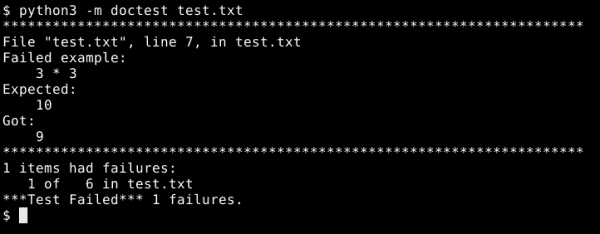
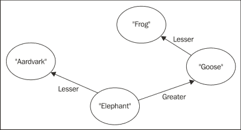

# 第二章。使用 doctest

我们将要查看的第一个测试工具叫做 `doctest`。这个名字是 "document testing" 或 "testable document" 的缩写。无论如何，它是一个文学工具，旨在使编写测试变得容易，以便计算机和人类都能从中受益。理想情况下，`doctest` 测试两者，向人类读者提供信息，并告诉计算机期望什么。

将测试和文档混合使用有助于我们：

+   保持文档与现实的同步

+   确保测试表达了预期的行为

+   重复在文档和测试创建中的一些努力

# Doctest 的工作最佳之处

`doctest` 的设计决策使其特别适合在集成和系统测试级别编写验收测试。这是因为 `doctest` 将仅人类可读的文本与人类和计算机都能阅读的示例混合在一起。这种结构不支持或强制任何测试的形式化，但它能美妙地传达信息，并且仍然为计算机提供了说 *这行得通* 或 *这行不通* 的能力。作为额外的奖励，这是你见过的写测试最简单的方法之一。

换句话说，一个 `doctest` 文件是一个真正优秀的程序规范，你可以随时让计算机检查你的实际代码。API 文档如果以 doctests 的形式编写并与其他测试一起检查，也会受益。你甚至可以在你的 docstrings 中包含 doctests。

从所有这些中你应该得到的基本想法是，`doctest` 对于人类和计算机都将从中受益的用途来说是非常理想的。

# Doctest 语言

与程序源代码一样，`doctest` 测试是用纯文本编写的。`doctest` 模块提取测试并忽略其余的文本，这意味着测试可以嵌入到人类可读的解释或讨论中。这正是使 `doctest` 适用于程序规范等用途的功能。

## 示例 - 创建和运行一个简单的 doctest

我们将创建一个简单的 `doctest` 文件，以展示使用该工具的基本原理。执行以下步骤：

1.  在你的编辑器中打开一个新的文本文件，并将其命名为 `test.txt`。

1.  将以下文本插入到文件中：

    ```py
    This is a simple doctest that checks some of Python's arithmetic
    operations.

    >>> 2 + 2
    4

    >>> 3 * 3
    10
    ```

1.  我们现在可以运行 `doctest`。在命令提示符下，切换到保存 `test.txt` 的目录。输入以下命令：

    ```py
    $ python3 ‑m doctest test.txt
    ```

1.  当运行测试时，你应该看到如下输出：

## 结果 - 三乘三不等于十

你刚刚编写了一个 `doctest` 文件，描述了一些算术运算，并运行它来检查 Python 是否像测试所说的那样表现。你是通过告诉 Python 在包含测试的文件上执行 `doctest` 来运行测试的。

在这种情况下，Python 的行为与测试不同，因为根据测试，三乘三等于十。然而，Python 对此表示不同意。由于`doctest`期望一件事，而 Python 做了不同的事情，`doctest`向您提供了一个很好的错误报告，显示了如何找到失败的测试，以及实际结果与预期结果之间的差异。报告的底部是一个总结，显示了每个测试文件中失败的测试数量，当你有多个包含测试的文件时，这很有帮助。

## doctests 的语法

你可能已经从查看之前的示例中猜出来了：`doctest`通过寻找看起来像是从 Python 交互会话中复制粘贴的文本部分来识别测试。任何可以用 Python 表达的内容都可以在`doctest`中使用。

以`>>>`提示符开始的行被发送到 Python 解释器。以`...`提示符开始的行是前一行代码的延续，允许你在 doctests 中嵌入复杂的块语句。最后，任何不以`>>>`或`...`开始的行，直到下一个空白行或`>>>`提示符，代表从该语句期望的输出。输出将像在交互式 Python 会话中一样出现，包括返回值和打印到控制台的内容。如果你没有输出行，`doctest`会假设它意味着该语句在控制台上期望没有可见的结果，这通常意味着它返回 None。

`doctest`模块忽略文件中不属于测试的部分，这意味着你可以在测试之间放置解释性文本、HTML、行图或其他任何你喜欢的元素。我们利用了这一点在之前的`doctest`中在测试本身之前添加了一个解释性句子。

## 示例 - 一个更复杂的测试

将以下代码添加到你的`test.txt`文件中，与现有代码至少隔一个空白行：

```py
Now we're going to take some more of doctest's syntax for a spin.

>>> import sys
>>> def test_write():
...     sys.stdout.write("Hello\n")
...     return True
>>> test_write()
Hello
True
```

在运行测试之前，花一点时间考虑一下。它会通过还是失败？它应该通过还是失败？

## 结果 - 运行了五个测试

正如我们之前讨论的那样，使用以下命令运行测试：

```py
python3 -m doctest test.txt
```

你应该看到类似这样的结果：


因为我们将新的测试添加到了包含之前测试的同一文件中，所以我们仍然看到通知，说三乘三不等于 10。现在，尽管如此，我们还看到运行了五个测试，这意味着我们的新测试已经运行并且成功了。

为什么是五个测试？就`doctest`而言，我们向文件中添加了以下三个测试：

+   第一个测试说，当我们`import sys`时，不应该有任何可见的操作

+   第二个测试说，当我们定义`test_write`函数时，不应该有任何可见的操作

+   第三个测试说，当我们调用`test_write`函数时，`Hello`和`True`应该按顺序出现在控制台上，每行一个

由于这三个测试都通过了，`doctest`没有对它们说太多。它所做的只是将底部报告的测试数量从两个增加到五个。

# 预期异常

对于测试预期工作正常的情况来说，这些都很好，但同样重要的是要确保当预期失败时，确实会失败。换句话说：有时你的代码应该引发异常，你需要能够编写测试来检查这种行为。

幸运的是，`doctest`在处理异常时遵循的原则几乎与处理其他事情时相同；它寻找看起来像 Python 交互会话的文本。这意味着它寻找看起来像 Python 异常报告和回溯的文本，并将其与引发的任何异常进行匹配。

`doctest`模块在处理异常时与其他事情的处理方式略有不同。它不仅仅精确匹配文本，如果不匹配则报告失败。异常回溯通常包含许多与测试无关的细节，但这些可能会意外地改变。`doctest`模块通过完全忽略回溯来处理这个问题：它只关心第一行，即`Traceback (most recent call last):`，这告诉它你预期会有异常，以及回溯之后的部分，这告诉它你预期哪种异常。`doctest`模块只有在这些部分之一不匹配时才会报告失败。

这还有另一个好处：当你编写测试时，手动确定回溯将看起来如何需要大量的努力，而且对你来说毫无益处。最好是简单地省略它们。

## 示例 – 检查异常

这又是你可以添加到`test.txt`中的另一个测试，这次测试的是应该引发异常的代码。

将以下文本插入到你的`doctest`文件中，就像往常一样，至少空一行：

```py
Here we use doctest's exception syntax to check that Python is correctly enforcing its grammar. The error is a missing ) on the def line.

>>> def faulty(:
...     yield from [1, 2, 3, 4, 5]
Traceback (most recent call last):
SyntaxError: invalid syntax
```

测试预期会引发异常，所以如果它没有引发异常或引发了错误的异常，它将会失败。确保你理解这一点：如果测试代码执行成功，测试就会失败，因为它预期会有异常。

使用以下 doctest 运行测试：

```py
python3 -m doctest test.txt
```

## 结果 – 失败成功

代码中包含语法错误，这意味着这会引发一个`SyntaxError`异常，这反过来又意味着示例表现如预期；这表示测试通过。



在处理异常时，通常希望能够使用通配符匹配机制。`doctest`通过其省略号指令提供了这种功能，我们将在稍后讨论。

# 预期空白行

`doctest`使用`>>>`之后的第一个空白行来识别预期输出的结束，那么当预期输出实际上包含一个空白行时，你该怎么办？

`doctest`通过匹配预期输出中只包含文本`<BLANKLINE>`的行与实际输出中的真实空白行来处理这种情况。

# 使用指令控制`doctest`行为

有时，`doctest`的默认行为使得编写特定的测试变得不方便。例如，`doctest`可能会查看预期输出和实际输出之间的细微差异，并错误地得出测试失败的结论。这就是`doctest`指令发挥作用的地方。指令是特殊格式的注释，你可以将其放置在测试源代码之后，并告诉`doctest`以某种方式改变其默认行为。

指令注释以`# doctest:`开头，之后是一个逗号分隔的选项列表，这些选项可以启用或禁用各种行为。要启用一种行为，请写一个`+`（加号符号）后跟行为名称。要禁用一种行为，请写一个`–`（减号符号）后跟行为名称。我们将在以下几节中查看几个指令。

# 忽略部分结果

测试的输出中只有一部分实际上是确定测试是否通过的关键。通过使用`+ELLIPSIS`指令，你可以让`doctest`将预期输出中的文本`...`（称为省略号）视为通配符，它将匹配输出中的任何文本。

当你使用省略号时，`doctest`会扫描直到找到与预期输出中省略号之后文本相匹配的文本，并从那里继续匹配。这可能导致令人惊讶的结果，例如省略号与实际输出的 0 长度部分匹配，或与多行匹配。因此，需要谨慎使用。

## 示例 – 省略号测试驱动

我们将在几个不同的测试中使用省略号，以更好地了解其工作原理。作为额外的奖励，这些测试还展示了`doctest`指令的使用。

将以下代码添加到你的`test.txt`文件中：

```py
Next up, we're exploring the ellipsis.

>>> sys.modules # doctest: +ELLIPSIS
{...'sys': <module 'sys' (built-in)>...}

>>> 'This is an expression that evaluates to a string'
... # doctest: +ELLIPSIS
'This is ... a string'

>>> 'This is also a string' # doctest: +ELLIPSIS
'This is ... a string'

>>> import datetime
>>> datetime.datetime.now().isoformat() # doctest: +ELLIPSIS
'...-...-...T...:...:...'
```

## 结果 – 省略号省略

所有测试都通过了，如果没有省略号，它们都会失败。第一个和最后一个测试，其中我们检查了`sys.modules`中是否存在特定的模块，并确认了特定的格式，同时忽略了字符串的内容，展示了省略号真正有用的场景，因为它让你可以关注输出中有意义的部分，而忽略测试的其余部分。中间的测试展示了当省略号起作用时，不同的输出如何匹配相同的预期结果。

看看最后一个测试。你能想象任何不是 ISO 格式的时间戳的输出，但仍然会匹配示例吗？记住，省略号可以匹配任何数量的文本。

# 忽略空白

有时，空白（空格、制表符、换行符及其类似物）比它带来的麻烦还要多。也许您希望能够在测试文件中将单个预期输出行的内容拆分成多行，或者也许您正在测试一个使用大量空白但不会传达任何有用信息的系统。

`doctest` 允许您“规范化”空白字符，将预期输出和实际输出中的任何空白字符序列转换为单个空格。然后它会检查这些规范化版本是否匹配。

## 示例 – 调用正常化

我们将编写一些测试来演示空白规范化是如何工作的。

将以下代码插入到您的 `doctest` 文件中：

```py
Next, a demonstration of whitespace normalization.

>>> [1, 2, 3, 4, 5, 6, 7, 8, 9]
... # doctest: +NORMALIZE_WHITESPACE
[1, 2, 3,
 4, 5, 6,
 7, 8, 9]

>>> sys.stdout.write("This text\n contains weird     spacing.\n")
... # doctest: +NORMALIZE_WHITESPACE
This text contains weird spacing.
39
```

## 结果 – 空白匹配任何其他空白

尽管第一个测试的结果被拆分成多行以便于人类阅读，第二个测试的结果去除了奇怪的新行和缩进，但这两个测试都通过了，这也是为了人类的便利。

注意到其中一个测试在预期输出中插入了额外的空白，而另一个测试则忽略了实际输出中的额外空白？当您使用 `+NORMALIZE_WHITESPACE` 时，您在文本文件中格式化内容方面会获得很大的灵活性。

### 注意

您可能注意到了最后一个例子中的值 `39`。为什么它在那里？这是因为 `write()` 方法返回写入的字节数，在这个例子中恰好是 `39`。如果您在一个将 ASCII 字符映射到多个字节的环境中尝试此示例，您将在这里看到不同的数字；这将导致测试失败，直到您更改预期的字节数。

# 跳过一个示例

在某些情况下，`doctest` 会识别某些文本作为要检查的示例，而实际上您希望它只是普通文本。这种情况比最初看起来要少，因为通常让 `doctest` 检查所有内容并没有什么坏处。事实上，通常让 `doctest` 检查所有内容是非常有帮助的。不过，当您想限制 `doctest` 检查的内容时，可以使用 `+SKIP` 指令。

## 示例 – 仅人类使用

将以下代码添加到您的 doctest 文件中：

```py
Now we're telling doctest to skip a test

>>> 'This test would fail.' # doctest: +SKIP
If it were allowed to run.
```

## 结果 – 它看起来像是一个测试，但实际上不是

在我们将这个最后的例子添加到文件之前，运行文件时 `doctest` 报告了十三项测试。添加此代码后，`doctest` 仍然报告十三项测试。将跳过指令添加到代码中完全将其从 doctest 的考虑范围中移除。它既不是一个通过测试，也不是一个失败测试。它根本不是一项测试。

# 其他指令

如果您发现需要，可以向 doctest 发出许多其他指令。它们不像之前提到的那些指令那样广泛有用，但将来您可能需要其中之一或多个。

### 注意

所有 doctest 指令的完整文档可以在 [`docs.python.org/3/library/doctest.html#doctest-options`](http://docs.python.org/3/library/doctest.html#doctest-options) 找到。

Python 3.4 版本中 `doctest` 的剩余指令如下：

+   `DONT_ACCEPT_TRUE_FOR_1`: 这使得 `doctest` 能够区分布尔值和数字

+   `DONT_ACCEPT_BLANKLINE`: 这移除了对 <BLANKLINE> 功能的支持

+   `IGNORE_EXCEPTION_DETAIL`: 这使得 `doctest` 只关心异常是否为预期的类型

严格来说，`doctest` 支持使用指令语法设置的几个其他选项，但它们作为指令没有意义，所以我们在这里忽略它们。

# doctest 测试的执行作用域

当 `doctest` 从文本文件运行测试时，来自同一文件的所有测试都在相同的执行作用域中运行。这意味着，如果你在一个测试中导入了一个模块或绑定了一个变量，那么这个模块或变量在后续测试中仍然可用。我们已经在本章前面编写的测试中多次利用了这个事实：例如，`sys` 模块只导入了一次，尽管它在几个测试中使用。

这种行为并不一定是有益的，因为测试需要彼此隔离。我们不希望它们相互污染，因为如果某个测试依赖于另一个测试的内容，或者它失败是因为另一个测试的内容，那么这两个测试在某种程度上就合并成了一个覆盖更大代码部分的测试。你不想这种情况发生，因为这样知道哪个测试失败并不能给你提供太多关于出错原因和出错位置的信息。

那么，我们如何为每个测试提供它自己的执行作用域呢？有几种方法可以实现。一种方法是将每个测试简单地放置在自己的文件中，以及所需的任何解释性文本。从功能上讲，这很好，但如果没有工具帮你找到并运行所有测试，运行测试可能会很痛苦。我们将在后面的章节中讨论这样一个工具（称为 Nose）。这种方法的一个问题是，它会破坏测试对可读文档的贡献这一理念。

为每个测试提供它自己的执行作用域的另一种方法是定义一个函数内的每个测试，如下所示：

```py
>>> def test1():
...     import frob
...     return frob.hash('qux')
>>> test1()
77
```

通过这样做，最终在共享作用域中结束的只有测试函数（这里命名为 `test1`）。`frob` 模块和函数内部绑定的任何其他名称都是隔离的，但有一个例外，那就是导入模块内部发生的事情不是隔离的。如果 `frob.hash()` 方法在 `frob` 模块内部改变了一个状态，那么当不同的测试再次导入 `frob` 模块时，这个状态仍然会被改变。

第三种方法是创建名称时要小心谨慎，并确保在每个测试部分的开始将它们设置为已知值。在许多方面，这是一种最简单的方法，但这也是对你要求最高的方法，因为你必须跟踪作用域中的内容。

为什么 `doctest` 会以这种方式行为，而不是将测试彼此隔离？`doctest` 文件不仅是为了计算机阅读，也是为了人类。它们通常形成一种叙事，从一件事流向另一件事。不断地重复之前的内容会打断叙事。换句话说，这种方法是在文档和测试框架之间的一种折衷，一个既适合人类也适合计算机的中间地带。

在这本书中我们将深入研究（简单地称为 `unittest`）的另一个框架在更正式的层面上工作，并强制执行测试之间的分离。

# 检查你的理解

一旦你决定了这些问题的答案，通过编写一个测试文档并运行它通过 `doctest` 来检查它们：

+   `doctest` 是如何识别文档中测试的开始部分的？

+   `doctest` 是如何知道一个测试会继续到更多行的？

+   `doctest` 是如何识别测试预期输出的开始和结束的？

+   你会如何告诉 `doctest` 你想要将预期的输出跨越多行，即使测试实际上并不是这样输出的？

+   异常报告中哪些部分被 `doctest` 忽略了？

+   当你在测试文件中分配一个变量时，文件中的哪些部分实际上可以“看到”这个变量？

+   我们为什么关心代码可以“看到”由测试创建的变量？

+   我们如何让 `doctest` 不关心输出的一部分内容？

# 练习 – 英语到 doctest

是时候展开你的翅膀了。我将用英语给你描述一个单独的函数。你的任务是把这个描述复制到一个新的文本文件中，然后添加测试来描述所有要求，以便计算机可以理解和检查。

尽量使 doctests 不仅对计算机有用。好的 doctests 往往也会为人类读者澄清事情。总的来说，这意味着你将它们作为例子呈现给人类读者，穿插在文本中。

不再拖延，以下是英语描述：

```py
The fib(N) function takes a single integer as its only parameter N. If N is 0 or 1, the function returns 1\. If N is less than 0, the function raises a ValueError. Otherwise, the function returns the sum of fib(N – 1) and fib(N – 2). The returned value will never be less than 1\. A naïve implementation of this function would get very slow as N increased.
```

我会给你一个提示，并指出关于函数运行缓慢的最后一句话实际上是不可测试的。随着计算机变得越来越快，任何依赖于“慢”的任意定义的测试最终都会失败。此外，没有很好的方法来测试一个慢函数和一个陷入无限循环的函数之间的区别，所以尝试这样做并没有太大的意义。如果你发现自己需要这样做，最好是退一步，尝试不同的解决方案。

### 注意

计算机科学家称无法判断一个函数是卡住还是仅仅运行缓慢为“停机问题”。我们知道，除非我们有一天发现一种根本更好的计算机类型，否则这个问题是无法解决的。更快的计算机不会起作用，量子计算机也不会，所以不要抱太大希望。

下一句也提供了一些困难，因为要完全测试它，需要将每个正整数都通过 `fib()` 函数运行，这将花费很长时间（除非计算机最终耗尽内存并迫使 Python 抛出异常）。那么我们如何处理这类事情呢？

最好的解决方案是检查对于一组有效的输入，条件是否成立。Python 标准库中的 `random.randrange()` 和 `random.choice()` 函数使得这变得相对容易。

# 将 doctests 嵌入 docstrings

将 doctests 写入 docstrings 与写入文档文件一样简单。

### 注意

对于那些不知道的人来说，docstrings 是 Python 的一项特性，允许程序员将文档直接嵌入到他们的源代码中。Python 的 `help()` 函数就是由 docstrings 驱动的。要了解更多关于 docstrings 的信息，你可以从 Python 教程部分的 [`docs.python.org/3/tutorial/controlflow.html#documentation-strings`](https://docs.python.org/3/tutorial/controlflow.html#documentation-strings) 开始。

当在 docstrings 中编写时，doctests 扮演着略微不同的角色。它们仍然允许计算机检查事物是否按预期工作，但看到它们的人通常是使用 Python 交互式外壳在提交代码之前在代码上工作，或者当他们在工作时文本编辑器弹出 docstrings 的程序员。在这种情况下，`doctest` 最能发挥作用的是提供信息，因此 docstrings 通常不是检查细节的好地方。尽管如此，doctest 在演示常见情况的正确行为时是一个很好的地方。

嵌入在 docstrings 中的 doctests 与文本文件中的 doctests 执行范围略有不同。`doctest` 不是为文件中的所有测试创建一个单一的执行范围，而是为每个 docstring 创建一个单一的执行范围。共享相同 docstring 的所有测试也共享一个执行范围，但它们与其他 docstrings 中的测试是隔离的。

将每个 docstring 分离到自己的执行范围通常意味着我们不需要在 docstrings 中嵌入 doctests 时过多考虑隔离测试。这是幸运的，因为 docstrings 主要用于文档，而隔离测试所需的技巧可能会掩盖其含义。

## 示例 - 一个嵌入在 docstring 中的 doctest

我们将直接在测试的 Python 源文件中嵌入一个测试，通过将其放置在 docstring 中来实现。

创建一个名为 `test.py` 的文件，包含以下代码：

```py
def testable(x):
    r"""
    The `testable` function returns the square root of its
    parameter, or 3, whichever is larger.

    >>> testable(7)
    3.0

    >>> testable(16)
    4.0

    >>> testable(9)
    3.0

    >>> testable(10) == 10 ** 0.5
    True
    """
    if x < 9:
        return 3.0
    return x ** 0.5
```

### 注意

注意文档字符串（由第一个三引号前的`r`字符表示）使用了原始字符串。养成使用原始字符串作为文档字符串的习惯是个好习惯，因为你通常不希望转义序列——例如，`\n`表示换行——被 Python 解释器解释。你希望它们被当作文本处理，这样它们才能被正确地传递给 doctest。

运行这些测试与在 doctest 文档中运行测试一样简单：

```py
python3 -m doctest test.py
```

由于所有测试都通过了，这个命令的输出什么都没有。我们可以通过在命令行中添加详细标志来让它更有趣：

```py
python3 -m doctest -v test.py
```

## 结果——代码现在可以自我文档化和自我测试

当我们通过带有详细标志的`doctest`运行 Python 文件时，我们会看到以下截图所示的输出：


我们将`doctest`代码直接放在被测试函数的文档字符串中。这是一个展示程序员如何做某事的测试的好地方。它不是一个详细、低级测试的好地方（文档字符串示例代码中的`doctest`非常详细，用于说明目的，可能过于详细），因为文档字符串需要作为 API 文档——只需看看示例，你就能看到原因，doctests 占据了文档字符串的大部分空间，而没有告诉读者比单个测试更多的信息。

任何可以作为良好 API 文档的测试都是包含在 Python 文件文档字符串中的良好候选者。

你可能想知道那条写着`1 items had no tests`的行，以及随后的只写着`test`的行。这些行指的是模块级文档字符串中没有编写测试的事实。这有点令人惊讶，因为我们根本没在我们的源代码中包含这样的文档字符串，直到你意识到，就 Python（以及因此`doctest`）而言，没有文档字符串与空文档字符串是相同的。

# 将其付诸实践——AVL 树

我们将逐步介绍使用`doctest`为名为 AVL 树的数据结构创建可测试规范的过程。AVL 树是一种组织键值对的方式，以便可以通过键快速定位。换句话说，它非常类似于 Python 的内置字典类型。AVL 这个名字指的是发明这种数据结构的人的姓名首字母。

### 注意

虽然 AVL 树与 Python 字典类似，但它们有一些显著不同的特性。首先，存储在 AVL 树中的键可以按排序顺序迭代，且没有额外开销。另一个区别是，在 AVL 树中插入和删除对象通常比 Python `dict`慢，但在最坏情况下却更快。

如其名称所示，AVL 树将存储在其中的键组织成树结构，每个键最多有两个子键——一个子键通过比较小于父键，另一个子键大于父键。在下面的图中，`Elephant`键有两个子键，`Goose`有一个，而`Aardvark`和`Frog`都没有。

AVL 树是特殊的，因为它保持树的某一侧不会比另一侧高得多，这意味着用户可以期望它无论在什么情况下都能可靠和高效地执行。在下面的图中，如果`Frog`获得一个子键，AVL 树将重新组织以保持平衡：



我们将在这里编写 AVL 树实现的测试，而不是编写实现本身，所以我们不会详细说明 AVL 树是如何工作的，而是关注它正确工作时应该做什么。

### 注意

如果你想了解更多关于 AVL 树的信息，你将在互联网上找到许多好的参考资料。关于这个主题的维基百科条目是一个很好的起点：[`en.wikipedia.org/wiki/AVL_tree`](http://en.wikipedia.org/wiki/AVL_tree)。

我们将从一份通俗易懂的规范开始，然后在段落之间插入测试。你不需要真的将这些内容全部输入到一个文本文件中；这里提供给你是为了阅读和思考。

## 英语规范

第一步是描述期望的结果应该是什么，用普通语言。这可能是一些你自己做的事情，或者可能是别人为你做的事情。如果你为别人工作，希望你和你的雇主可以坐下来一起完成这部分工作。

在这种情况下，没有太多需要解决的问题，因为 AVL 树已经完全描述了几十年。即便如此，这里的描述并不完全像你在其他地方找到的那样。这种歧义性正是为什么纯语言规范不够好的原因。我们需要一个明确的规范，这正是 doctest 文件中的测试可以给我们提供的。

以下文本将放入一个名为`AVL.txt`的文件中，（你可以在附带的代码存档中找到其最终形式；在处理过程的这个阶段，该文件只包含普通语言规范）：

```py
An AVL Tree consists of a collection of nodes organized in a binary tree structure. Each node has left and right children, each of which may be either None or another tree node. Each node has a key, which must be comparable via the less-than operator. Each node has a value. Each node also has a height number, measuring how far the node is from being a leaf of the tree -- a node with height 0 is a leaf.

The binary tree structure is maintained in ordered form, meaning that of a node's two children, the left child has a key that compares less than the node's key and the right child has a key that compares greater than the node's key.

The binary tree structure is maintained in a balanced form, meaning that for any given node, the heights of its children are either the same or only differ by 1.

The node constructor takes either a pair of parameters representing a key and a value, or a dict object representing the key-value pairs with which to initialize a new tree.

The following methods target the node on which they are called, and can be considered part of the internal mechanism of the tree:

Each node has a recalculate_height method, which correctly sets the height number.

Each node has a make_deletable method, which exchanges the positions of the node and one of its leaf descendants, such that the tree ordering of the nodes remains correct.

Each node has rotate_clockwise and rotate_counterclockwise methods. Rotate_clockwise takes the node's right child and places it where the node was, making the node into the left child of its own former child. Other nodes in the vicinity are moved so as to maintain the tree ordering. The opposite operation is performed by rotate_counterclockwise.

Each node has a locate method, taking a key as a parameter, which searches the node and its descendants for a node with the specified key, and either returns that node or raises a KeyError.

The following methods target the whole tree rooted at the current node. The intent is that they will be called on the root node:

Each node has a get method taking a key as a parameter, which locates the value associated with the specified key and returns it, or raises KeyError if the key is not associated with any value in the tree.

Each node has a set method taking a key and a value as parameters, and associating the key and value within the tree.

Each node has a remove method taking a key as a parameter, and removing the key and its associated value from the tree. It raises KeyError if no value was associated with that key.
```

## 节点数据

规范的前三段描述了 AVL 树节点的成员变量，并告诉我们变量的有效值是什么。它们还告诉我们如何测量树的高度，并定义平衡树是什么意思。现在我们的任务是把这些想法编码成计算机最终可以用来检查我们代码的测试。

我们可以通过创建一个节点然后测试其值来检查这些规范，但这实际上只是对构造函数的测试。测试构造函数很重要，但我们真正想要做的是将检查节点变量是否处于有效状态的检查纳入到我们对每个成员函数的测试中。

为了这个目的，我们将定义我们的测试可以调用的函数来检查节点状态是否有效。我们将在第三段之后定义这些函数，因为它们提供了与第一、二、三段内容相关的额外细节：

### 注意

注意，节点数据测试是按照 AVL 树实现已经存在的方式来编写的。它试图导入一个包含 AVL 类的`avl_tree`模块，并试图以特定的方式使用 AVL 类。当然，目前还没有`avl_tree`模块，所以测试将失败。这是应该的。失败只意味着，当真正到来实现树的时候，我们应该在名为`avl_tree`的模块中实现，其内容应该像我们的测试所假设的那样工作。这样测试的好处之一是能够在编写代码之前进行测试驱动。

```py
>>> from avl_tree import AVL

>>> def valid_state(node):
...     if node is None:
...         return
...     if node.left is not None:
...         assert isinstance(node.left, AVL)
...         assert node.left.key < node.key
...         left_height = node.left.height + 1
...     else:
...         left_height = 0
...
...     if node.right is not None:
...         assert isinstance(node.right, AVL)
...         assert node.right.key > node.key
...         right_height = node.right.height + 1
...     else:
...         right_height = 0
...
...     assert abs(left_height - right_height) < 2
...     node.key < node.key
...     node.value

>>> def valid_tree(node):
...     if node is None:
...         return
...     valid_state(node)
...     valid_tree(node.left)
...     valid_tree(node.right)
```

注意，我们实际上还没有调用这些函数。它们不是测试，而是我们将用来简化编写测试的工具。我们在这里定义它们，而不是在我们要测试的 Python 模块中定义，因为它们在概念上不是测试代码的一部分，并且因为任何阅读测试的人都需要能够看到辅助函数的作用。

## 测试构造函数

第四段描述了 AVL 类的构造函数。根据这段描述，构造函数有两种操作模式：它可以创建一个初始化的单个节点，或者它可以基于字典的内容创建和初始化整个节点树。

单节点模式的测试很简单。我们将在第四段之后添加它：

```py
>>> valid_state(AVL(2, 'Testing is fun'))
```

我们甚至不需要编写预期结果，因为我们编写了函数，如果存在问题则抛出`AssertionError`，如果没有问题则返回`None`。`AssertionError`由测试代码中的`assert`语句触发，如果`assert`语句中的表达式产生一个假值。

第二种模式的测试看起来同样简单，我们将在其他测试之后添加它：

```py
>>> valid_tree(AVL({1: 'Hello', 2: 'World', -3: '!'}))
```

然而，这里有一些隐藏的复杂性。几乎可以肯定，这个构造函数将通过初始化单个节点，然后使用该节点的`set`方法将剩余的键和值添加到树中来工作。这意味着我们的第二个构造函数测试不是一个单元测试，而是一个集成测试，它检查多个单元之间的交互。

规范文档通常包含集成级和系统级测试，所以这并不是真正的问题。然而，需要注意的是，如果这个测试失败，它并不一定会显示问题真正所在的地方。你的单元测试会做到这一点。

另一点需要注意是，我们没有检查构造函数在接收到不良输入时是否失败。这些测试非常重要，但英文规范完全没有提到这些点，这意味着它们实际上并不在验收标准中。我们将把这些测试添加到单元测试套件中。

## 重新计算高度

`recalculate_height()` 方法在规范的第五段中描述。为了测试它，我们需要一个树来操作，我们不想使用构造函数的第二种模式来创建它——毕竟，我们希望这个测试独立于可能存在的任何错误。我们真的希望使测试完全独立于构造函数，但在这个情况下，我们需要对规则做出一个小小的例外，因为不通过某种方式调用构造函数就创建一个对象是非常困难的。

我们将要定义一个函数，该函数构建一个特定的树并返回它。这个函数将在我们之后的几个测试中也很有用：

```py
>>> def make_test_tree():
...     root = AVL(7, 'seven')
...     root.height = 2
...     root.left = AVL(3, 'three')
...     root.left.height = 1
...     root.left.right = AVL(4, 'four')
...     root.right = AVL(10, 'ten')
...     return root
```

现在我们有了 `make_test_tree()` 函数，测试 `recalculate_height()` 就变得简单了：

```py
>>> tree = make_test_tree()
>>> tree.height = 0
>>> tree.recalculate_height()
>>> tree.height
2
```

## 使节点可删除

规范的第六段描述了 `make_deletable()` 方法。你不能删除有子节点的节点，因为这会使节点的小孩与树的其他部分断开连接。考虑一下我们之前看过的包含动物名称的树。如果我们从树的底部删除 `Elephant` 节点，我们该如何处理 `Aardvark`、`Goose` 和 `Frog`？如果我们删除 `Goose`，我们之后如何找到 `Frog`？


解决这个问题的方法是将节点与其左侧最大的叶节点后裔（或右侧最小的叶节点后裔，但我们不是那样做的）交换位置。

我们将通过使用之前定义的相同 `make_test_tree()` 函数来创建一个新的树进行工作，并检查 `make_deletable()` 是否正确交换：

```py
>>> tree = make_test_tree()
>>> target = tree.make_deletable()
>>> (tree.value, tree.height)
('four', 2)
>>> (target.value, target.height)
('seven', 0)
```

## 旋转

规范第七段中描述的两个旋转函数对树中的链接进行了一些复杂的操作。你可能发现他们对所做操作的简单语言描述有点令人困惑。在这些时候，一点点的代码比任何数量的句子都要有意义得多。

当前的树旋转通常是通过重新排列树中节点之间的链接来定义的，但我们将通过查看值而不是直接查看左右链接来检查它是否工作。这允许实现根据需要交换节点的内容，而不是节点本身。毕竟，对于规范来说，哪个操作发生并不重要，所以我们不应该排除一个完全合理的实现选择：

```py
>>> tree = make_test_tree()
>>> tree.value
'seven'
>>> tree.left.value
'three'
>>> tree.rotate_counterclockwise()
>>> tree.value
'three'
>>> tree.left is None
True
>>> tree.right.value
'seven'
>>> tree.right.left.value
'four'
>>> tree.right.right.value
'ten'
>>> tree.right.left.value
'four'
>>> tree.left is None
True

>>> tree.rotate_clockwise()
>>> tree.value
'seven'
>>> tree.left.value
'three'
>>> tree.left.right.value
'four'
>>> tree.right.value
'ten'
>>> tree.right.left is None
True
>>> tree.left.left is None
True
```

## 定位一个节点

根据规范的第 8 段，`locate()`方法预期返回一个节点，或者在键存在于树中时抛出`KeyError`异常。我们将再次使用我们专门构建的测试树，以便我们确切地知道树的结构如下：

```py
>>> tree = make_test_tree()
>>> tree.locate(4).value
'four'
>>> tree.locate(17) # doctest: +ELLIPSIS
Traceback (most recent call last):
KeyError: ...
```

### 小贴士

**下载示例代码**

您可以从您在[`www.packtpub.com`](http://www.packtpub.com)的账户中下载您购买的所有 Packt 书籍的示例代码文件。如果您在其他地方购买了这本书，您可以访问[`www.packtpub.com/support`](http://www.packtpub.com/support)并注册，以便将文件直接通过电子邮件发送给您。

## 规范的其余部分

规范的剩余段落描述了通过调用已描述的函数来操作的高级函数。这意味着，在我们学习到第四章中模拟对象的技巧之前，我们在这里将不得不编写集成级别的测试。正如我之前提到的，在规范文档中这样做并不是什么坏事，所以我们将继续这样做：

```py
Each node has a get method taking a key as a parameter, which locates
the value associated with the specified key and returns it, or raises
KeyError if the key is not associated with any value in the tree.

>>> tree = make_test_tree()
>>> tree.get(10)
'ten'
>>> tree.get(97) # doctest: +ELLIPSIS
Traceback (most recent call last):
KeyError: ...

Each node has a set method taking a key and a value as parameters, and
associating the key and value within the tree.

>>> tree = make_test_tree()
>>> tree.set(10, 'foo')
>>> tree.locate(10).value
'foo'

Each node has a remove method taking a key as a parameter, and
removing the key and its associated value from the tree. It raises
KeyError if no values was associated with that key.

>>> tree = make_test_tree()
>>> tree.remove(3)
>>> tree.remove(3) # doctest: +ELLIPSIS
Traceback (most recent call last):
KeyError: ...
```

# 摘要

我们学习了`doctest`的语法，并探讨了几个示例，描述了如何使用它。之后，我们取了一个 AVL 树的现实世界规范，并检查了如何将其形式化为一系列 doctests，以便我们可以用它来自动检查实现的正确性。

具体来说，我们涵盖了 doctest 的默认语法以及改变它的指令，如何在文本文件中编写 doctests，如何在 Python 文档字符串中编写 doctests，以及使用`doctest`将规范转换为测试的感觉。

现在我们已经了解了`doctest`，我们就可以讨论如何使用`doctest`来进行单元测试——这是下一章的主题。
