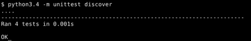
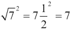
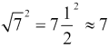

# 第五章. 使用 unittest 进行结构化测试

`doctest`工具非常灵活且极易使用，但我们已经注意到，在编写有纪律的测试时，它似乎有些不足。但这并不意味着不可能；我们已经看到我们可以在`doctest`中编写行为良好的、隔离的测试。问题是`doctest`并没有为我们做这些工作。幸运的是，我们手头还有另一个测试工具，这个工具要求我们的测试有更多的结构，并提供更多的支持：`unittest`。

`unittest`模块是基于单元测试的要求设计的，但它实际上并不局限于这一点。您可以使用单元测试进行集成和系统测试。

与`doctest`一样，`unittest`是 Python 标准库的一部分；因此，如果您有 Python，您就有单元测试。

在本章中，我们将涵盖以下主题：

+   在`unittest`框架内编写测试

+   运行我们的新测试

+   看看使`unittest`成为大型测试套件良好选择的功能

# 基础知识

在我们开始讨论新的概念和功能之前，让我们看看如何使用`unittest`来表达我们已经学到的想法。这样，我们就会有一个坚实的基础来建立我们的新理解。

我们将重新审视第三章中的`PID`类，或者至少是`PID`类的测试，第三章，*使用 doctest 进行单元测试*。我们将重写测试，以便它们在`unittest`框架内运行。

在继续之前，请花一点时间回顾一下第三章中第三章的`pid.txt`文件的最终版本。我们将使用`unittest`框架实现相同的测试。

在与`pid.py`相同的目录下创建一个名为`test_pid.py`的新文件。请注意，这是一个`.py`文件：`unittest`测试是纯 Python 源代码，而不是包含源代码的纯文本。这意味着从文档的角度来看，测试将不那么有用，但这也带来了其他好处。

将以下代码插入您新创建的`test_pid.py`文件中：

```py
from unittest import TestCase, main
from unittest.mock import Mock, patch

import pid

class test_pid_constructor(TestCase):
    def test_constructor_with_when_parameter(self):
        controller = pid.PID(P = 0.5, I = 0.5, D = 0.5,
                             setpoint = 1, initial = 12,
                             when = 43)

        self.assertEqual(controller.gains, (0.5, 0.5, 0.5))
        self.assertAlmostEqual(controller.setpoint[0], 1.0)
        self.assertEqual(len(controller.setpoint), 1)
        self.assertAlmostEqual(controller.previous_time, 43.0)
        self.assertAlmostEqual(controller.previous_error, -11.0)
        self.assertAlmostEqual(controller.integrated_error, 0)
```

有时候，人们会争论，单元测试不应该包含超过一个断言。这种想法是，每个单元测试应该只测试一件事情，以进一步缩小测试失败时的问题范围。这是一个很好的观点，但在我看来，不应该过分狂热。在像前面代码那样的情况下，将每个断言拆分到自己的测试函数中，并不会比我们这样得到更多的信息性错误消息；这只会增加我们的开销。

我的经验法则是，一个测试函数可以有任意数量的简单断言，但最多只能有一个非简单断言：

```py
    @patch('pid.time', Mock(side_effect = [1.0]))
    def test_constructor_without_when_parameter(self):
        controller = pid.PID(P = 0.5, I = 0.5, D = 0.5,
                             setpoint = 0, initial = 12)

        self.assertEqual(controller.gains, (0.5, 0.5, 0.5))
        self.assertAlmostEqual(controller.setpoint[0], 0.0)
        self.assertEqual(len(controller.setpoint), 1)
        self.assertAlmostEqual(controller.previous_time, 1.0)
        self.assertAlmostEqual(controller.previous_error, -12.0)
        self.assertAlmostEqual(controller.integrated_error, 0)

class test_pid_calculate_response(TestCase):
    def test_with_when_parameter(self):
        mock = Mock()
        mock.gains = (0.5, 0.5, 0.5)
        mock.setpoint = [0.0]
        mock.previous_time = 1.0
        mock.previous_error = -12.0
        mock.integrated_error = 0.0

        self.assertEqual(pid.PID.calculate_response(mock, 6, 2), -3)
        self.assertEqual(pid.PID.calculate_response(mock, 3, 3), -4.5)
        self.assertEqual(pid.PID.calculate_response(mock, -1.5, 4), -0.75)
        self.assertEqual(pid.PID.calculate_response(mock, -2.25, 5), -1.125)

    @patch('pid.time', Mock(side_effect = [2.0, 3.0, 4.0, 5.0]))
    def test_without_when_parameter(self):
        mock = Mock()
        mock.gains = (0.5, 0.5, 0.5)
        mock.setpoint = [0.0]
        mock.previous_time = 1.0
        mock.previous_error = -12.0
        mock.integrated_error = 0.0

        self.assertEqual(pid.PID.calculate_response(mock, 6), -3)
        self.assertEqual(pid.PID.calculate_response(mock, 3), -4.5)
        self.assertEqual(pid.PID.calculate_response(mock, -1.5), -0.75)
        self.assertEqual(pid.PID.calculate_response(mock, -2.25), -1.125)
```

现在，通过在命令行中输入以下内容来运行测试：

```py
python3 -m unittest discover
```

您应该看到类似以下内容的输出：



那么，我们做了什么呢？有几个需要注意的地方：

+   首先，所有测试都是继承自`unittest.TestCase`的类的自己的方法。

+   测试的命名格式为`test_<something>`，其中`<something>`是一个描述，帮助你（以及共享代码的其他人）记住测试实际上在检查什么。这很重要，因为`unittest`（以及几个其他测试工具）使用名称来区分测试和非测试方法。一般来说，你的测试方法名称和测试模块文件名应该以 test 开头。

+   因为每个测试都是一个方法，所以每个测试自然在自己的变量作用域中运行。在这里，我们通过保持测试的隔离性获得了很大的优势。

+   我们从`TestCase`继承了`assert<Something>`方法。这些方法为我们提供了更灵活的检查值是否匹配的方式，并提供了比 Python 基本`assert`语句更有用的错误报告。

+   我们使用`unittest.mock.patch`作为方法装饰器。在第四章中，我们将其用作上下文管理器。无论是哪种方式，它都做了同样的事情：用一个模拟对象替换一个对象，然后将其放回原处。当用作装饰器时，替换发生在方法运行之前，而原始对象在方法完成后被放回。这正是我们测试是一个方法时所需要的，所以我们将以这种方式做很多。

+   我们没有覆盖`time.time`，而是覆盖了`over pid.time`。这是因为我们在这里不是为每个测试重新导入`pid`模块。`pid`模块包含`from time import time`，这意味着当它首次加载时，`time`函数会直接引用到`pid`模块的作用域中。从那时起，改变`time.time`对`pid.time`没有任何影响，除非我们改变它并重新导入`pid`模块。为了避免所有这些麻烦，我们直接覆盖了`pid.time`。

+   我们没有告诉`unittest`要运行哪些测试。相反，我们让它自己发现测试，并且它自己找到了测试并自动运行它们。这通常效果很好，可以节省精力。我们将在第六章中查看一个更复杂的测试发现和执行工具。

+   `unittest`模块为每个成功的测试打印出一个点。对于失败的测试或引发意外异常的测试，它会提供更多信息。

我们实际执行的测试与在`doctest`中编写的测试相同。到目前为止，我们看到的是表达它们的不同方式。

每个测试方法体现了一个单一单元的单一测试。这为我们提供了一个方便的方式来组织测试，将相关的测试组合到同一个类中，以便更容易找到。你可能已经注意到我们在示例中使用了两个测试类。这在当前情况下是为了组织目的，尽管也有很好的实际理由将测试分离到多个类中。我们很快就会谈到这一点。

将每个测试放入它自己的方法意味着每个测试都在一个独立的命名空间中执行，这使得相对于 `doctest` 风格的测试，更容易保持 `unittest` 风格的测试之间不相互干扰。这也意味着 `unittest` 知道你的测试文件中有多少个单元测试，而不是简单地知道有多少个表达式（你可能已经注意到 `doctest` 将每行 `>>>` 视为一个单独的测试）。最后，将每个测试放入它自己的方法意味着每个测试都有一个名称，这可以是一个非常有价值的特性。当你运行 `unittest` 时，它会在错误报告中包括任何失败的测试的名称。

`unittest` 中的测试并不直接关心任何不是 `TestCase` 断言方法调用一部分的内容。这意味着我们不必担心我们调用的任何函数的返回值或我们使用的任何表达式的结果，除非它们对测试很重要。这也意味着我们需要记住为测试的每个方面编写一个断言。我们很快就会介绍 `TestCase` 的各种断言方法。

# 断言

断言是我们用来告诉 `unittest` 测试的重要结果的机制。通过使用适当的断言，我们可以告诉 `unittest` 每个测试期望得到什么。

## `assertTrue` 方法

当我们调用 `self.assertTrue(expression)` 时，我们是在告诉 `unittest` 表达式必须为真，测试才能成功。

这是一个非常灵活的断言，因为你可以通过编写适当的布尔表达式来检查几乎所有内容。它也是你最后应该考虑使用的断言之一，因为它并没有告诉 `unittest` 你正在进行的比较类型，这意味着如果测试失败，`unittest` 无法清楚地告诉你出了什么问题。

例如，考虑以下包含两个保证会失败的测试的测试代码：

```py
from unittest import TestCase

class two_failing_tests(TestCase):
    def test_one_plus_one_equals_one_is_true(self):
        self.assertTrue(1 == 1 + 1)

    def test_one_plus_one_equals_one(self):
        self.assertEqual(1, 1 + 1)
```

可能看起来这两个测试是可以互换的，因为它们都测试了相同的内容。当然，它们都会失败（或者，在极不可能的情况下，一个等于两个，它们都会通过），那么为什么选择其中一个而不是另一个呢？

运行测试并查看发生了什么（同时注意测试的执行顺序并不一定与我们编写的顺序相同；测试之间完全独立，所以这是可以接受的，对吧？）。

两个测试都如预期那样失败了，但使用 `assertEqual` 的测试告诉我们：

```py
AssertionError: 1 != 2
```

另一个说法是：

```py
AssertionError: False is not true
```

在这种情况下，哪个输出更有用是很明显的。`assertTrue`测试能够正确地确定测试应该失败，但它不知道足够的信息来报告任何关于失败原因的有用信息。另一方面，`assertEqual`测试首先知道它正在检查两个表达式是否相等，其次它知道如何以最有用的方式呈现结果：通过评估它比较的每个表达式，并在结果之间放置一个`!=`符号。它告诉我们哪些期望失败了，以及相关的表达式评估结果是什么。

## `assertFalse`方法

当`assertTrue`方法失败时，`assertFalse`方法将成功，反之亦然。它在产生有用输出方面的限制与`assertTrue`相同，并且在能够测试几乎所有条件方面的灵活性也相同。

## `assertEqual`方法

如在`assertTrue`讨论中提到的，`assertEqual`断言检查其两个参数是否确实相等，如果不相等，则报告失败，并附带参数的实际值。

## `assertNotEqual`方法

当`assertEqual`断言成功时，`assertNotEqual`断言将失败，反之亦然。当它报告失败时，其输出表明两个表达式的值是相等的，并提供了这些值。

## `assertAlmostEqual`方法

正如我们之前看到的，比较浮点数可能会有麻烦。特别是，检查两个浮点数是否相等是有问题的，因为你可能期望相等的东西——在数学上相等的东西——最终在最低有效位上仍然会有所不同。只有当每个位都相同时，浮点数才相等。

为了解决这个问题，`unittest`提供了`assertAlmostEqual`，它检查两个浮点值是否几乎相同；它们之间的一小部分差异是可以容忍的。

让我们看看这个问题在实际中的表现。如果你取 7 的平方根，然后平方它，结果应该是 7。这里有一对测试来检查这个事实：

```py
from unittest import TestCase

class floating_point_problems(TestCase):
    def test_square_root_of_seven_squared_incorrectly(self):
        self.assertEqual((7.0 ** 0.5) ** 2.0, 7.0)

    def test_square_root_of_seven_squared(self):
        self.assertAlmostEqual((7.0 ** 0.5) ** 2.0, 7.0)
```

`test_square_root_of_seven_squared_incorrectly`方法检查，这在现实中是正确的。然而，在计算机可用的更专业的数系中，取 7 的平方根然后平方并不完全回到 7，因此这个测试将失败。我们稍后会更详细地探讨这个问题。

`test_square_root_of_seven_squared`方法检查，即使是计算机也会发现这是正确的，所以这个测试应该通过。

不幸的是，浮点数（计算机用于表示实数的数字表示）并不精确，因为实数线上的大多数数字不能用有限且不重复的数字序列来表示，更不用说只有 64 位了。因此，从上一个例子中评估数学表达式得到的结果并不完全是七。不过，这对于政府工作来说已经足够好了——或者实际上任何其他类型的工作也是如此——所以我们不想让我们的测试对那个微小的差异斤斤计较。正因为如此，当我们比较浮点数时，我们应该习惯性地使用 `assertAlmostEqual` 和 `assertNotAlmostEqual`。

### 注意

这个问题通常不会影响到其他比较运算符。例如，检查一个浮点数是否小于另一个，由于微小的误差，产生错误结果的可能性非常低。只有在相等的情况下，这个问题才会困扰我们。

## assertNotAlmostEqual 方法

当 `assertAlmostEqual` 断言会成功时，`assertNotAlmostEqual` 断言会失败，反之亦然。当它报告失败时，其输出表明两个表达式的值几乎相等，并提供了这些值。

## assertIs 和 assertIsNot 方法

`assertIs` 和 `assertIsNot` 方法与 Python 的 `is` 运算符的关系与 `assertEqual` 和 `assertNotEqual` 与 Python 的 `==` 运算符的关系相同。这意味着它们检查两个操作数是否（或不是）完全相同的对象。

## assertIsNone 和 assertIsNotNone 方法

assertIsNone 和 assertIsNotNone 方法类似于 `assertIs` 和 `assertIsNot`，除了它们只接受一个参数，它们总是将其与 `None` 进行比较，而不是接受两个参数并将它们相互比较。

## assertIn 和 assertNotIn 方法

`assertIn` 方法用于检查容器对象，如字典、元组、列表和集合。如果第一个参数包含在第二个参数中，则断言通过。如果不包含，则断言失败。`assertNotIn` 方法执行相反的检查。

## assertIsInstance 和 assertNotIsInstance 方法

`assertIsInstance` 方法检查作为第一个参数传递的对象是否是作为第二个参数传递的类的实例。`assertNotIsInstance` 方法执行相反的检查，确保对象不是该类的实例。

## assertRaises 方法

总的来说，我们需要确保我们的单元正确地报告错误。当它们接收到良好的输入时做正确的事情只是工作的一半；它们在接收到不良输入时也需要做一些合理的事情。

`assertRaises` 方法检查当传递指定的参数集时，可调用对象是否引发指定的异常。

### 注意

可调用对象是一个函数、一个方法、一个类或任何具有 `__call__` 方法的任意类型的对象。

这个断言只适用于可调用对象，这意味着你没有一种方法来检查其他类型的表达式是否会引发预期的异常。如果这不符合你的测试需求，你可以使用下面描述的`fail`方法来构建自己的测试。

要使用`assertRaises`，首先将预期的异常传递给它，然后是可调用对象，最后是调用可调用对象时应传递的参数。

下面是一个使用`assertRaises`的示例测试。这个测试应该会失败，因为可调用对象不会引发预期的异常。当你也向`int`传递`base = 16`时，`'8ca2'`是`int`的一个完全可接受的输入。注意，`assertRaises`可以接受任意数量的位置参数或关键字参数，并在调用时将它们传递给可调用对象：

```py
from unittest import TestCase

class silly_int_test(TestCase):
    def test_int_from_string(self):
        self.assertRaises(ValueError, int, '8ca2', base = 16)
```

当我们运行这个测试时，它会失败（正如我们所知道的），因为`int`没有抛出我们告诉`assertRaises`期望的异常。测试失败并报告如下：

```py
AssertionError: ValueError not raised by int
```

如果抛出了异常，但不是你告诉`unittest`期望的异常，那么`unittest`会将其视为错误。错误与失败不同。失败意味着你的某个测试检测到了正在测试的单元中的问题。错误意味着测试本身存在问题。

## `fail`方法

当所有其他方法都失败时，你可以退回到`fail`。当你的测试代码调用`fail`时，测试就会失败。

这有什么好处呢？当没有任何`assert`方法满足你的需求时，你可以将检查编写成这样，如果测试未通过，则调用`fail`。这允许你使用 Python 的全部表达能力来描述你的期望检查。

让我们看看一个例子。这次，我们将对一个小于操作进行测试，这不是`assert`方法直接支持的操作之一。使用`fail`，我们仍然可以轻松实现这个测试：

```py
from unittest import TestCase

class test_with_fail(TestCase):
    def test_less_than(self):
        if not (2.3 < 5.6):
            self.fail('2.3 is not less than 5.6, but it should be')
```

### 小贴士

如果在测试中某个特定的比较被反复使用，你可以为那个比较编写自己的`assert`函数，使用`fail`来报告错误，就像我们在前面的例子中所做的那样。

这里有几个需要注意的地方。首先，注意`if`语句中的`not`。由于我们希望在测试应该不通过时运行`fail`，但我们习惯于描述测试应该成功的情况，所以编写测试的一个好方法是先写出成功条件，然后用`not`来反转它。这样我们就可以继续以我们习惯的方式使用`fail`。第二，注意当你调用`fail`时可以传递一个消息；它将在`unittest`的失败测试报告中打印出来。如果你选择一个合适的消息，它可以大有帮助。

# 确保你理解了

看看下面的`doctest`。你能想出等效的`unittest`会是什么样子吗？

```py
>>> try:
...     int('123')
... except ValueError:
...     pass
... else:
...     print('Expected exception was not raised')
```

`doctest` 代码尝试将字符串转换为整数；如果这种转换不会引发 `ValueError`，它将报告一个错误。在 `unittest` 中，这看起来是这样的：

```py
class test_exceptions(TestCase):
    def test_ValueError(self):
        self.assertRaises(ValueError, int, '123')
```

你如何在 `unittest` 中检查两个浮点数是否相等？你应该使用 `assertAlmostEqual` 方法，这样就不会被浮点数的不精确性所困扰。

你会在什么情况下选择使用 `assertTrue`？又或者 `fail`？如果你没有更专业的断言满足你的需求，你会使用 `assertTrue`。如果你需要在测试成功或失败时拥有最大控制权，你会使用 `fail`。

回顾一下我们在前几章中编写的某些测试，并将它们从 `doctest` 转换为 `unittest`。鉴于你已经对 `unittest` 有所了解，你应该能够翻译任何测试。

在进行这个过程中，思考一下 `unittest` 和 `doctest` 对你翻译的每个测试的相对优点。这两个系统有不同的优势，因此对于不同的情况，每个系统都将是更合适的选择。在什么情况下 `doctest` 是更好的选择，而在什么情况下是 `unittest`？

# 测试固定装置

`unittest` 有一个重要且非常有用的功能，这是 `doctest` 所缺乏的。你可以告诉 `unittest` 如何为你的单元测试创建一个标准化的环境，以及如何在完成后清理这个环境。能够创建并在之后销毁一个标准化的测试环境的能力就是测试固定装置。虽然测试固定装置实际上并没有使之前不可能进行的任何测试成为可能，但它们确实可以使测试更短、更少重复。

## 示例 – 测试数据库支持的单元

许多程序需要访问数据库以进行操作，这意味着这些程序由许多也访问数据库的单元组成。关键是数据库的目的是存储信息并使其在其他任意位置可访问；换句话说，数据库的存在是为了打破单元的隔离。同样的问题也适用于其他信息存储：例如，永久存储中的文件。

我们如何处理这个问题？毕竟，仅仅不测试与数据库交互的单元并不是解决方案。我们需要创建一个环境，其中数据库连接像往常一样工作，但所做的任何更改都不会持续。我们可以用几种不同的方式来做这件事，但无论细节如何，我们都需要在每个使用它的测试之前设置特殊的数据库连接，并在每个这样的测试之后销毁任何更改。

`unittest` 通过提供 `TestCase` 类的 `setUp` 和 `tearDown` 方法来帮助我们完成这项工作。这些方法存在是为了让我们可以重写，默认版本不执行任何操作。

这里有一些使用数据库的代码（假设它存在于一个名为 `employees.py` 的文件中），我们将为它编写测试：

```py
class Employees:
    def __init__(self, connection):
        self.connection = connection

    def add_employee(self, first, last, date_of_employment):
        cursor = self.connection.cursor()
        cursor.execute('''insert into employees
                            (first, last, date_of_employment)
                          values
                            (:first, :last, :date_of_employment)''',
                       locals())
        self.connection.commit()

        return cursor.lastrowid

    def find_employees_by_name(self, first, last):
        cursor = self.connection.cursor()
        cursor.execute('''select * from employees
                          where
                            first like :first
                          and
                            last like :last''',
                       locals())

        for row in cursor:
            yield row

    def find_employees_by_date(self, date):
        cursor = self.connection.cursor()
        cursor.execute('''select * from employees
                          where date_of_employment = :date''',
                       locals())

        for row in cursor:
            yield row
```

### 注意

上述代码使用了 Python 附带的 sqlite3 数据库。由于`sqlite3`接口与 Python 的 DB-API 2.0 兼容，因此你使用的任何数据库后端都将具有与这里看到类似的接口。

我们首先导入所需的模块并介绍我们的`TestCase`子类：

```py
from unittest import TestCase
from sqlite3 import connect, PARSE_DECLTYPES
from datetime import date
from employees import Employees

class test_employees(TestCase):
```

我们需要一个`setUp`方法来创建测试所依赖的环境。在这种情况下，这意味着创建一个新的数据库连接到仅内存的数据库，并使用所需的表和行填充该数据库：

```py
    def setUp(self):
        connection = connect(':memory:',
                             detect_types = PARSE_DECLTYPES)
        cursor = connection.cursor()

        cursor.execute('''create table employees
                            (first text,
                             last text,
                             date_of_employment date)''')

        cursor.execute('''insert into employees
                            (first, last, date_of_employment)
                          values
                            ("Test1", "Employee", :date)''',
                       {'date': date(year = 2003,
                                     month = 7,
                                     day = 12)})

        cursor.execute('''insert into employees
                            (first, last, date_of_employment)
                          values
                            ("Test2", "Employee", :date)''',
                       {'date': date(year = 2001,
                                     month = 3,
                                     day = 18)})

        self.connection = connection
```

我们需要一个`tearDown`方法来撤销`setUp`方法所做的任何操作，以便每个测试都可以在一个未受干扰的环境中运行。由于数据库仅存在于内存中，我们只需关闭连接，它就会消失。在其他场景中，`tearDown`方法可能要复杂得多：

```py
    def tearDown(self):
        self.connection.close()
```

最后，我们需要测试本身：

```py
    def test_add_employee(self):
        to_test = Employees(self.connection)
        to_test.add_employee('Test1', 'Employee', date.today())

        cursor = self.connection.cursor()
        cursor.execute('''select * from employees
                          order by date_of_employment''')

        self.assertEqual(tuple(cursor),
                         (('Test2', 'Employee', date(year = 2001,
                                                     month = 3,
                                                     day = 18)),
                          ('Test1', 'Employee', date(year = 2003,
                                                     month = 7,
                                                     day = 12)),
                          ('Test1', 'Employee', date.today())))

    def test_find_employees_by_name(self):
        to_test = Employees(self.connection)

        found = tuple(to_test.find_employees_by_name('Test1', 'Employee'))
        expected = (('Test1', 'Employee', date(year = 2003,
                                               month = 7,
                                               day = 12)),)

        self.assertEqual(found, expected)

    def test_find_employee_by_date(self):
        to_test = Employees(self.connection)

        target = date(year = 2001, month = 3, day = 18)
        found = tuple(to_test.find_employees_by_date(target))

        expected = (('Test2', 'Employee', target),)

        self.assertEqual(found, expected)
```

我们在`TestCase`中只使用了`setUp`方法以及相应的`tearDown`方法。它们之间确保了测试执行的 环境（这是`setUp`的工作）以及每个测试执行后的环境清理，这样测试就不会相互干扰（这是`tearDown`的工作）。`unittest`确保在每次测试方法之前运行一次`setUp`，在每次测试方法之后运行一次`tearDown`。

由于测试固定装置——由`setUp`和`tearDown`定义——被包裹在`TestCase`类中的每个测试周围，因此包含太多测试的`TestCase`类的`setUp`和`tearDown`方法可能会变得非常复杂，并且会浪费大量时间处理一些测试中不必要的细节。你可以通过将需要特定环境方面的测试分组到它们自己的`TestCase`类中来避免这个问题。为每个`TestCase`提供一个适当的`setUp`和`tearDown`，只处理测试包含的必要环境方面。你可以有任意多的`TestCase`类，因此当你决定将哪些测试分组在一起时，没有必要在这些类上节省。

注意我们使用的`tearDown`方法是多么简单。这通常是一个好兆头：当需要撤销的`tearDown`方法中的更改简单易描述时，这通常意味着你可以确信能够完美地完成这项工作。由于`tearDown`方法的任何不完善都可能使测试留下可能改变其他测试行为的散乱数据，因此正确执行这一点非常重要。在这种情况下，我们所有的更改都局限于数据库内部，因此删除数据库就完成了这项工作。

我们本可以使用模拟对象来处理数据库连接，这种方法并没有什么问题，只是在这种情况下，对我们来说可能需要更多的努力。有时模拟对象是完成工作的完美工具，有时测试固定装置可以节省精力；有时你需要两者结合才能轻松完成任务。

# 摘要

本章包含了大量关于如何使用`unittest`框架编写测试的信息。

具体来说，我们介绍了如何使用`unittest`来表达你从`doctest`中已经熟悉的概念；`unittest`和 doctest 之间的差异和相似之处；如何使用测试固定装置将你的测试嵌入到一个受控和临时的环境中；以及如何使用`unittest.mock`补丁来装饰测试方法，以进一步控制测试执行时的环境。

在下一章中，我们将探讨一个名为 Nose 的工具，它能够在同一测试运行中找到并运行`doctest`测试、`unittest`测试和临时测试，并为你提供统一的测试报告。
