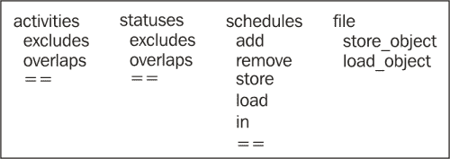
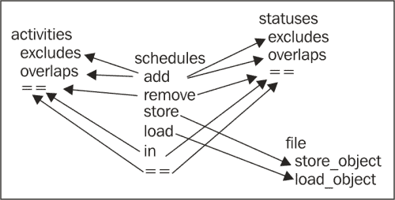
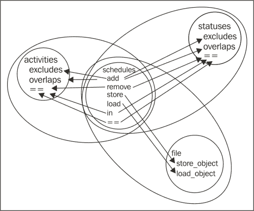
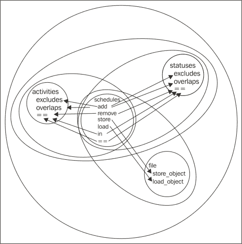

# 第八章：集成和系统测试

虽然我们已经讨论了所有的工具、技术和实践，但我们仍然只是在思考测试单元：代码中最小、有意义的可测试部分。现在是时候扩大关注范围，开始测试包含多个单元的代码。

这意味着我们需要：

+   思考集成测试和系统测试实际上是什么

+   学习如何识别程序的可测试多单元段

+   使用我们学到的工具来为这些段创建测试

# 集成测试和系统测试简介

集成测试是检查我们程序中的单元是否正常工作的过程。在这个阶段，多亏了我们的单元测试，我们可以假设每个单元在独立的情况下都按预期工作，我们将测试提升到新的复杂度级别。由于如果单元不工作，集成也不会工作，而且追踪问题会更难，所以从集成测试开始这个过程是不切实际的。然而，一旦单元稳固，测试我们构建的东西是否也工作就是必要的。这些交互可能会令人惊讶。

当你进行集成测试时，你将把单元组合成更大的集合，并测试这些集合。当你的集成测试扩展到覆盖整个程序时，它们就变成了系统测试。

集成测试中最棘手的部分是选择哪些单元要集成到每个测试中，这样你总是有一个可以信赖的稳固的代码基础：一个可以立足的地方，在你引入更多代码的同时。

## 确定集成顺序

我们将通过一个练习来帮助你决定集成测试边界的放置过程：

1.  使用一张纸或图形程序，为第七章 *测试驱动开发演练*中的时间规划项目中的每个单元写下名称或表示。将每个类的方法定在一起。同一个类是单元之间的一种明显关系，我们将利用这一点。这里的`==`符号代表 Python 的`==`运算符，它在对象上调用`__eq__`方法：

1.  现在在应该直接相互交互的单元之间画箭头，从调用者到被调用者。像步骤 1 中那样有序地排列一切，实际上可能会使这个过程变得更难，所以请随意移动类以帮助线条有意义：

1.  在每个类和至少通过一条线连接的每一对类周围画圆圈：

1.  通过在重叠的圆圈对周围画圆，继续这个过程，直到只剩下三个圆圈。圈出其中一对，然后在整个混乱中再画一个大圆圈：

1.  现在，为了决定先编写哪些集成测试，我们只需看看围绕其所有部分的圆圈数量。包含每个参与集成测试的单元的圆圈嵌套得越深，我们就越早编写那个测试。

我们刚才做的是一种可视化和巩固构建集成测试过程的方法。虽然实际上画线和圆圈并不是关键，但在脑海中跟随这个过程是有用的。对于较大的项目，实际绘制图表可以获得很多好处。当你看到图表时，下一步正确的步骤往往会立即跳出来——特别是如果你使用多种颜色来渲染图表——否则它可能隐藏在程序的复杂性背后。

# 自动化集成测试和系统测试

集成测试和单元测试之间唯一的真正区别是，在集成测试中，你可以将正在测试的代码分解成更小的有意义的块；然而，在单元测试中，如果你再细分代码，它就不再有意义了。因此，帮助你自动化单元测试的工具也可以应用于集成测试。由于系统测试实际上是最高级别的集成测试，因此这些工具也可以用于此。

`doctest`在集成测试中的作用通常相当有限：doctest 的真实优势在于开发过程的早期。一个可测试的规范很容易进入集成测试——正如之前所说，只要有单元测试，那就没问题，但之后你可能会更喜欢`unittest`和 Nose 来编写你的集成测试。

集成测试需要彼此隔离。尽管它们自身包含多个相互作用的单元，但你仍然会从知道测试之外没有东西影响它中受益。因此，`unittest`是编写自动化集成测试的好选择。

## 为时间规划器编写集成测试

集成图只提供了集成测试的部分顺序，并且有几个测试可能是我们首先编写的。从图中可以看出，`Status`和`Activity`类位于许多箭头的末端，但不是任何箭头的起点。这使得它们成为编写集成测试的特别好的起点，因为这意味着它们不需要调用自身之外的东西来操作。由于没有东西可以区分它们中哪一个更适合作为起点，我们可以任意选择。让我们从`Status`开始，然后进行`Activity`。我们将编写测试来测试整个类。在这个低级别上，集成测试将非常类似于同一类的单元测试，但我们不会使用模拟对象来表示同一类的其他实例。我们将使用真实实例。我们正在测试类是否正确地与自身交互。

这里是`Status`的测试代码：

```py
from unittest import TestCase
from planner.data import Status
from datetime import datetime

class statuses_integration_tests(TestCase):
    def setUp(self):
        self.A = Status('A',
                        datetime(year = 2012, month = 7, day = 15),
                        datetime(year = 2013, month = 5, day = 2))

    def test_repr(self):
        self.assertEqual(repr(self.A), '<A 2012-07-15T00:00:00 2013-05-02T00:00:00>')

    def test_equality(self):
        self.assertEqual(self.A, self.A)
        self.assertNotEqual(self.A, Status('B',
                          datetime(year = 2012, month = 7, day = 15),
                          datetime(year = 2013, month = 5, day = 2)))
        self.assertNotEqual(self.A, Status('A',
                          datetime(year = 2011, month = 7, day = 15),
                          datetime(year = 2013, month = 5, day = 2)))
        self.assertNotEqual(self.A, Status('A',
                          datetime(year = 2012, month = 7, day = 15),
                          datetime(year = 2014, month = 5, day = 2)))

    def test_overlap_begin(self):
        status = Status('status name',
                          datetime(year = 2011, month = 8, day = 11),
                          datetime(year = 2012, month = 11, day = 27))

        self.assertTrue(status.overlaps(self.A))

    def test_overlap_end(self):
        status = Status('status name',
                          datetime(year = 2012, month = 1, day = 11),
                          datetime(year = 2014, month = 4, day = 16))

        self.assertTrue(status.overlaps(self.A))

    def test_overlap_inner(self):
        status = Status('status name',
                          datetime(year = 2011, month = 10, day = 11),
                          datetime(year = 2014, month = 1, day = 27))

        self.assertTrue(status.overlaps(self.A))

    def test_overlap_outer(self):
        status = Status('status name',
                          datetime(year = 2012, month = 8, day = 12),
                          datetime(year = 2012, month = 9, day = 15))

        self.assertTrue(status.overlaps(self.A))

    def test_overlap_after(self):
        status = Status('status name',
                          datetime(year = 2015, month = 2, day = 6),
                          datetime(year = 2019, month = 4, day = 27))

        self.assertFalse(status.overlaps(self.A))
```

这里是`Activity`的测试代码：

```py
from unittest import TestCase
from planner.data import Activity, TaskError
from datetime import datetime

class activities_integration_tests(TestCase):
    def setUp(self):
        self.A = Activity('A',
                          datetime(year = 2012, month = 7, day = 15),
                          datetime(year = 2013, month = 5, day = 2))

    def test_repr(self):
        self.assertEqual(repr(self.A), '<A 2012-07-15T00:00:00 2013-05-02T00:00:00>')

    def test_equality(self):
        self.assertEqual(self.A, self.A)
        self.assertNotEqual(self.A, Activity('B',
                          datetime(year = 2012, month = 7, day = 15),
                          datetime(year = 2013, month = 5, day = 2)))
        self.assertNotEqual(self.A, Activity('A',
                          datetime(year = 2011, month = 7, day = 15),
                          datetime(year = 2013, month = 5, day = 2)))
        self.assertNotEqual(self.A, Activity('A',
                          datetime(year = 2012, month = 7, day = 15),
                          datetime(year = 2014, month = 5, day = 2)))

    def test_overlap_begin(self):
        activity = Activity('activity name',
                          datetime(year = 2011, month = 8, day = 11),
                          datetime(year = 2012, month = 11, day = 27))

        self.assertTrue(activity.overlaps(self.A))
        self.assertTrue(activity.excludes(self.A))

    def test_overlap_end(self):
        activity = Activity('activity name',
                          datetime(year = 2012, month = 1, day = 11),
                          datetime(year = 2014, month = 4, day = 16))

        self.assertTrue(activity.overlaps(self.A))
        self.assertTrue(activity.excludes(self.A))

    def test_overlap_inner(self):
        activity = Activity('activity name',
                          datetime(year = 2011, month = 10, day = 11),
                          datetime(year = 2014, month = 1, day = 27))

        self.assertTrue(activity.overlaps(self.A))
        self.assertTrue(activity.excludes(self.A))

    def test_overlap_outer(self):
        activity = Activity('activity name',
                          datetime(year = 2012, month = 8, day = 12),
                          datetime(year = 2012, month = 9, day = 15))

        self.assertTrue(activity.overlaps(self.A))
        self.assertTrue(activity.excludes(self.A))

    def test_overlap_after(self):
        activity = Activity('activity name',
                          datetime(year = 2015, month = 2, day = 6),
                          datetime(year = 2019, month = 4, day = 27))

        self.assertFalse(activity.overlaps(self.A))
```

看看我们的图，我们可以看到从`Status`或`Activity`向外延伸的下一级代表了这些类与`Schedule`类的集成。在我们编写这个集成之前，我们应该编写任何涉及`Schedule`类与自身交互的测试，而不使用模拟对象：

```py
from unittest import TestCase
from unittest.mock import Mock
from planner.data import Schedule
from datetime import datetime

class schedule_tests(TestCase):
    def test_equality(self):
        A = Mock(overlaps = Mock(return_value = False))
        B = Mock(overlaps = Mock(return_value = False))
        C = Mock(overlaps = Mock(return_value = False))

        sched1 = Schedule()
        sched2 = Schedule()

        self.assertEqual(sched1, sched2)

        sched1.add(A)
        sched1.add(B)

        sched2.add(A)
        sched2.add(B)
        sched2.add(C)

        self.assertNotEqual(sched1, sched2)

        sched1.add(C)

        self.assertEqual(sched1, sched2)
```

现在，`Schedule`类内部的交互已经测试过了，我们可以编写集成`Schedule`与`Status`或`Activity`的测试。让我们从`Status`开始，然后进行`Activity`。

这里是`Schedule`和`Status`的测试：

```py
from planner.data import Schedule, Status
from unittest import TestCase
from datetime import datetime, timedelta

class test_schedules_and_statuses(TestCase):
    def setUp(self):
        self.A = Status('A',
                        datetime.now(),
                        datetime.now() + timedelta(minutes = 7))
        self.B = Status('B',
                        datetime.now() - timedelta(hours = 1),
                        datetime.now() + timedelta(hours = 1))
        self.C = Status('C',
                        datetime.now() + timedelta(minutes = 10),
                        datetime.now() + timedelta(hours = 1))

    def test_usage_pattern(self):
        sched = Schedule()

        sched.add(self.A)
        sched.add(self.C)

        self.assertTrue(self.A in sched)
        self.assertTrue(self.C in sched)
        self.assertFalse(self.B in sched)

        sched.add(self.B)

        self.assertTrue(self.B in sched)

        self.assertEqual(sched, sched)

        sched.remove(self.A)

        self.assertFalse(self.A in sched)
        self.assertTrue(self.B in sched)
        self.assertTrue(self.C in sched)

        sched.remove(self.B)
        sched.remove(self.C)

        self.assertFalse(self.B in sched)
        self.assertFalse(self.C in sched)
```

这里是对真实`Schedule`实例和`Activity`实例之间交互的测试。由于`Activity`和`Status`之间的相似性，测试结构不出所料地类似：

```py
from planner.data import Schedule, Activity, ScheduleError
from unittest import TestCase
from datetime import datetime, timedelta

class test_schedules_and_activities(TestCase):
    def setUp(self):
        self.A = Activity('A',
                          datetime.now(),
                          datetime.now() + timedelta(minutes = 7))
        self.B = Activity('B',
                          datetime.now() - timedelta(hours = 1),
                          datetime.now() + timedelta(hours = 1))
        self.C = Activity('C',
                          datetime.now() + timedelta(minutes = 10),
                          datetime.now() + timedelta(hours = 1))

    def test_usage_pattern(self):
        sched = Schedule()

        sched.add(self.A)
        sched.add(self.C)

        self.assertTrue(self.A in sched)
        self.assertTrue(self.C in sched)
        self.assertFalse(self.B in sched)

        self.assertRaises(ScheduleError, sched.add, self.B)

        self.assertFalse(self.B in sched)

        self.assertEqual(sched, sched)

        sched.remove(self.A)

        self.assertFalse(self.A in sched)
        self.assertFalse(self.B in sched)
        self.assertTrue(self.C in sched)

        sched.remove(self.C)

        self.assertFalse(self.B in sched)
        self.assertFalse(self.C in sched)
```

好吧，现在是时候将`Schedule`、`Status`和`Activity`一起放在同一个测试中了：

```py
from planner.data import Schedule, Status, Activity, ScheduleError
from unittest import TestCase
from datetime import datetime, timedelta

class test_schedules_activities_and_statuses(TestCase):
    def setUp(self):
        self.A = Status('A',
                        datetime.now(),
                        datetime.now() + timedelta(minutes = 7))
        self.B = Status('B',
                        datetime.now() - timedelta(hours = 1),
                        datetime.now() + timedelta(hours = 1))
        self.C = Status('C',
                        datetime.now() + timedelta(minutes = 10),
                        datetime.now() + timedelta(hours = 1))

        self.D = Activity('D',
                          datetime.now(),
                          datetime.now() + timedelta(minutes = 7))

        self.E = Activity('E',
                          datetime.now() + timedelta(minutes = 30),
                          datetime.now() + timedelta(hours = 1))

        self.F = Activity('F',
                          datetime.now() - timedelta(minutes = 20),
                          datetime.now() + timedelta(minutes = 40))

    def test_usage_pattern(self):
        sched = Schedule()

        sched.add(self.A)
        sched.add(self.B)
        sched.add(self.C)

        sched.add(self.D)

        self.assertTrue(self.A in sched)
        self.assertTrue(self.B in sched)
        self.assertTrue(self.C in sched)
        self.assertTrue(self.D in sched)

        self.assertRaises(ScheduleError, sched.add, self.F)
        self.assertFalse(self.F in sched)
        sched.add(self.E)
        sched.remove(self.D)

        self.assertTrue(self.E in sched)
        self.assertFalse(self.D in sched)

        self.assertRaises(ScheduleError, sched.add, self.F)

        self.assertFalse(self.F in sched)

        sched.remove(self.E)

        self.assertFalse(self.E in sched)

        sched.add(self.F)

        self.assertTrue(self.F in sched)
```

下一步我们需要引入的是`File`类，但在将其与其他系统集成之前，我们需要将其与自身集成并检查其内部交互，而不使用模拟对象：

```py
from unittest import TestCase
from planner.persistence import File
from os import unlink

class test_file(TestCase):
    def setUp(self):
        storage = File('file_test.sqlite')

        storage.store_object('tag1', 'A')
        storage.store_object('tag2', 'B')
        storage.store_object('tag1', 'C')
        storage.store_object('tag1', 'D')
        storage.store_object('tag3', 'E')
        storage.store_object('tag3', 'F')

    def tearDown(self):
        try:
            unlink('file_test.sqlite')
        except OSError:
            pass

    def test_other_instance(self):
        storage = File('file_test.sqlite')

        self.assertEqual(set(storage.load_objects('tag1')),
                         set(['A', 'C', 'D']))

        self.assertEqual(set(storage.load_objects('tag2')),
                         set(['B']))

        self.assertEqual(set(storage.load_objects('tag3')),
                         set(['E', 'F']))
```

现在我们可以编写集成`Schedules`和`File`的测试。请注意，在这一步，我们仍然没有涉及`Status`或`Activity`，因为它们在椭圆之外。目前我们将使用模拟对象来代替它们：

```py
from unittest import TestCase
from unittest.mock import Mock
from planner.data import Schedule
from planner.persistence import File
from os import unlink

def unpickle_mocked_task(begins):
    return Mock(overlaps = Mock(return_value = False), begins = begins)

class test_schedules_and_file(TestCase):
    def setUp(self):
        A = Mock(overlaps = Mock(return_value = False),
                 __reduce__ = Mock(return_value = (unpickle_mocked_task, (5,))),
                 begins = 5)

        B = Mock(overlaps = Mock(return_value = False),
                 __reduce__ = Mock(return_value = (unpickle_mocked_task, (3,))),
                 begins = 3)

        C = Mock(overlaps = Mock(return_value = False),
                 __reduce__ = Mock(return_value = (unpickle_mocked_task, (7,))),
                 begins = 7)

        self.A = A
        self.B = B
        self.C = C

    def tearDown(self):
        try:
            unlink('test_schedules_and_file.sqlite')
        except OSError:
            pass

    def test_save_and_restore(self):
        sched1 = Schedule()

        sched1.add(self.A)
        sched1.add(self.B)
        sched1.add(self.C)

        store1 = File('test_schedules_and_file.sqlite')
        sched1.store(store1)

        del sched1
        del store1

        store2 = File('test_schedules_and_file.sqlite')
        sched2 = Schedule.load(store2)

        self.assertEqual(set([x.begins for x in sched2.tasks]),
                         set([3, 5, 7]))
```

我们已经构建到了最外层圆圈，这意味着是时候编写涉及整个系统且没有任何模拟对象的测试了：

```py
from planner.data import Schedule, Status, Activity, ScheduleError
from planner.persistence import File
from unittest import TestCase
from datetime import datetime, timedelta
from os import unlink

class test_system(TestCase):
    def setUp(self):
        self.A = Status('A',
                        datetime.now(),
                        datetime.now() + timedelta(minutes = 7))
        self.B = Status('B',
                        datetime.now() - timedelta(hours = 1),
                        datetime.now() + timedelta(hours = 1))
        self.C = Status('C',
                        datetime.now() + timedelta(minutes = 10),
                        datetime.now() + timedelta(hours = 1))

        self.D = Activity('D',
                          datetime.now(),
                          datetime.now() + timedelta(minutes = 7))

        self.E = Activity('E',
                          datetime.now() + timedelta(minutes = 30),
                          datetime.now() + timedelta(hours = 1))

        self.F = Activity('F',
                          datetime.now() - timedelta(minutes = 20),
                          datetime.now() + timedelta(minutes = 40))

    def tearDown(self):
        try:
            unlink('test_system.sqlite')
        except OSError:
            pass

    def test_usage_pattern(self):
        sched1 = Schedule()

        sched1.add(self.A)
        sched1.add(self.B)
        sched1.add(self.C)
        sched1.add(self.D)
        sched1.add(self.E)

        store1 = File('test_system.sqlite')
        sched1.store(store1)

        del store1

        store2 = File('test_system.sqlite')
        sched2 = Schedule.load(store2)

        self.assertEqual(sched1, sched2)

        sched2.remove(self.D)
        sched2.remove(self.E)

        self.assertNotEqual(sched1, sched2)

        sched2.add(self.F)

        self.assertTrue(self.F in sched2)
        self.assertFalse(self.F in sched1)

        self.assertRaises(ScheduleError, sched2.add, self.D)
        self.assertRaises(ScheduleError, sched2.add, self.E)

        self.assertTrue(self.A in sched1)
        self.assertTrue(self.B in sched1)
        self.assertTrue(self.C in sched1)
        self.assertTrue(self.D in sched1)
        self.assertTrue(self.E in sched1)
        self.assertFalse(self.F in sched1)

        self.assertTrue(self.A in sched2)
        self.assertTrue(self.B in sched2)
        self.assertTrue(self.C in sched2)
        self.assertFalse(self.D in sched2)
        self.assertFalse(self.E in sched2)
        self.assertTrue(self.F in sched2)
```

我们刚刚集成了整个代码库，逐步构建更大的测试，直到我们有了涵盖整个系统的测试。在整个过程中，我们一直小心翼翼地一次测试一件事。因为我们采取了逐步进行的做法，所以我们总是知道新发现的错误是从哪里开始的，并且我们能够轻松地修复它们。

说到这里，如果你在构建这个代码结构的同时运行测试，你会注意到其中一些测试失败了。所有三个失败都指向同一个问题：持久化数据库有问题。这个错误没有在`File`类的单元测试中出现，因为它只有在更大范围内，当数据库用于在单元之间传递信息时才会出现。

下面是`test_file.py`测试报告的错误：

```py
Traceback (most recent call last):
 File "integration/integration_tests/test_file.py", line 26, in test_other_instance
 set(['A', 'C', 'D']))
AssertionError: Items in the second set but not the first:
'A'
'D'
'C'
```

数据库的更改没有被提交到文件中，因此它们在存储它们的交易之外是不可见的。没有在单独的交易中测试持久化代码并不是疏忽，但这正是我们期望集成测试能够捕捉到的错误类型。

我们可以通过修改`persistence.py`中`File`类的`store_object`方法来解决这个问题：

```py
    def store_object(self, tag, object):
        self.connection.execute('insert into objects values (?, ?)',
                                (tag, dumps(object)))
        self.connection.commit()
```

另一个值得关注的点是`pickle`和模拟对象之间的交互。模拟对象有很多做得好的事情，但接受序列化并不是其中之一。幸运的是，这相对容易解决，这在集成测试`Schedule`和`File`中得到了演示：

```py
def unpickle_mocked_task(begins):
    return Mock(overlaps = Mock(return_value = False), begins = begins)

class test_schedules_and_file(TestCase):
    def setUp(self):
        A = Mock(overlaps = Mock(return_value = False),
                 __reduce__ = Mock(return_value = (unpickle_mocked_task, (5,))),
                 begins = 5)

        B = Mock(overlaps = Mock(return_value = False),
                 __reduce__ = Mock(return_value = (unpickle_mocked_task, (3,))),
                 begins = 3)

        C = Mock(overlaps = Mock(return_value = False),
                 __reduce__ = Mock(return_value = (unpickle_mocked_task, (7,))),
                 begins = 7)
```

这里的技巧并不真正复杂。我们只是告诉模拟对象在调用`__reduce__`方法时使用什么返回值。碰巧，序列化函数调用`__reduce__`来找出在序列化和反序列化对象时是否需要特殊处理。我们告诉它需要，并且它应该在反序列化时调用`unpickle_mocked_task`函数来重新构成模拟对象。现在，我们的模拟对象可以像真实对象一样被序列化和反序列化。

在`Schedule`和`File`的测试中，另一个值得关注的点是`tearDown`测试固定方法。如果存在数据库文件，`tearDown`方法将删除它，但如果不存在，它不会抱怨。预期数据库将在测试本身中创建，我们不希望它留在那里；然而，如果它不存在，这并不是测试固定错误：

```py
    def tearDown(self):
        try:
            unlink('test_schedules_and_file.sqlite')
        except OSError:
            pass
```

本章中的许多测试代码可能在你看来显得冗余。这在某种程度上是正确的。有些事情在不同的测试中反复被检查。为什么还要费这个劲？

重复性的主要原因在于每个测试都应该独立存在。我们不应该关心它们的运行顺序，或者是否有其他测试存在。每个测试都是自包含的；因此，如果它失败了，我们就知道需要修复什么。因为每个测试都是自包含的，一些基础的东西最终会被多次测试。在这个简单的项目中，重复性比通常情况下更为明显。

然而，无论是明显的还是微妙的，冗余并不是问题。所谓的“不要重复自己”（DRY）原则并不特别适用于测试。多次测试某事物并没有多少缺点。这并不是说复制粘贴测试是个好主意，因为那绝对不是。看到你的测试之间存在相似之处不要感到惊讶或恐慌，但不要以此为借口。每个检查特定事物的测试，如果改变那个事物，都需要进行更改，所以仍然最好在可能的情况下最小化冗余。

# 自我检查——编写集成测试

尝试回答以下问题来自我检查集成测试：

1.  你首先编写哪些集成测试？

    答案：那些在最小圆圈中的，尤其是如果它们没有任何指向其他圆圈的线条。换句话说，先编写最独立的测试。

1.  当你有一大块已经集成的代码，但接下来需要集成的下一部分完全没有集成测试时，会发生什么？

    答案：从涉及该代码的最小圆圈开始，逐步构建，直到你准备好将其与之前的代码集成。

1.  写出测试来检查一大块代码与其自身的集成有什么意义呢？

    答案：当我们进行单元测试时，即使是同一类的其他实例也会被模拟，当合理时，同一实例的其他方法也会被模拟；我们关心的是，这段代码做了它应该做的事情，而没有涉及任何其他东西。现在我们进行集成测试，我们需要测试那些能够正确相互交互的同一类的实例，或者当它们被允许从一个操作保留状态到下一个操作时，与它们自己交互。这两种测试覆盖了不同的事情，所以我们需要两者都有是有意义的。

1.  系统测试是什么，系统测试如何与集成测试相关？

    答案：系统测试是集成测试的最后阶段。这是一个涉及整个代码库的测试。

# 摘要

在本章中，我们学习了从单元测试的基础构建到覆盖整个系统的测试集的过程。

具体来说，我们学习了如何绘制集成图。我们学习了如何解释集成图以决定测试的构建顺序，也学习了使用哪些工具以及如何使用它们来编写集成测试。

现在我们已经了解了集成测试，我们准备介绍许多其他有用的测试工具和策略，这是下一章的主题。
