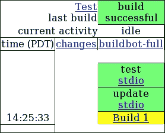
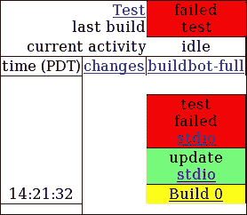

# 第九章。其他工具和技术

我们已经介绍了 Python 测试的核心元素，但还有一些外围方法和工具可以使你的生活更轻松。在本章中，我们将简要介绍其中的一些。

在本章中，我们将：

+   讨论代码覆盖率以及如何从 Nose 获取代码覆盖率报告

+   讨论持续集成和 Buildbot

+   学习如何将自动化测试与 Git、Mercurial、Bazaar 和 Subversion 集成

# 代码覆盖率

测试告诉你当你测试的代码没有按你想象的方式工作时，但它们不会告诉你关于你未测试的代码的任何信息。它们甚至不会告诉你你未测试的代码没有被测试。

代码覆盖率是一种解决这一不足的技术。代码覆盖率工具在测试运行时进行监控，并跟踪哪些代码行被（和没有被）执行。测试运行完毕后，该工具将给出一份报告，描述你的测试覆盖整个代码库的情况。

如你可能已经想到的，希望覆盖率接近 100%。但请注意，不要过于专注于覆盖率数字，因为它可能有些误导。即使你的测试执行了程序中的每一行代码，它们也可能很容易地没有测试到需要测试的所有内容。这意味着你不能将 100% 的覆盖率作为测试完整的确定性证据。另一方面，有时某些代码确实不需要被测试——例如，一些调试支持代码或由用户界面构建器生成的代码——因此低于 100% 的覆盖率通常是完全可以接受的。

代码覆盖率是一个工具，可以帮助你了解你的测试在做什么，以及它们可能忽略什么。它不是良好测试套件的定义。

## 安装 coverage.py

我们将使用一个名为 `coverage.py` 的模块，这并不令人惊讶，它是一个用于 Python 的代码覆盖率工具。

由于 `coverage.py` 不是 Python 的内置工具，我们需要下载并安装它。你可以从 Python 包索引 [`pypi.python.org/pypi/coverage`](http://pypi.python.org/pypi/coverage) 下载最新版本，但可能更简单的方法是从命令行输入以下内容：

```py
python3 -m pip install --user coverage
```

我们将在这里介绍使用 `coverage.py` 的步骤，但如果你需要更多信息，可以在 `coverage.py` 的主页 [`nedbatchelder.com/code/coverage/`](http://nedbatchelder.com/code/coverage/) 上找到。

## 使用 coverage.py 与 Nose

我们将创建一个带有测试的小玩具代码模块，然后应用 `coverage.py` 来找出测试实际上使用了多少代码。

将以下测试代码放入 `test_toy.py`。这些测试存在一些问题，我们将在后面讨论，但它们应该能运行：

```py
from unittest import TestCase
import toy

class test_global_function(TestCase):
    def test_positive(self):
        self.assertEqual(toy.global_function(3), 4)

    def test_negative(self):
        self.assertEqual(toy.global_function(-3), -2)

    def test_large(self):
        self.assertEqual(toy.global_function(2**13), 2**13 + 1)

class test_example_class(TestCase):
    def test_timestwo(self):
        example = toy.Example(5)
        self.assertEqual(example.timestwo(), 10)
```

这里有一对包含一些非常基本测试的`TestCase`类。这些测试在现实世界中的用途不大，但我们只需要它们来展示代码覆盖率工具的工作原理。

将以下代码放入`toy.py`文件中。注意底部的`if __name__ == '__main__'`语句；我们有一段时间没有处理这类语句了，所以我会提醒你，如果我们用 Python 运行`toy.py`模块，该块内的代码将执行`doctest`：

```py
def global_function(x):
    r"""
    >>> global_function(5)
    6
    """
    return x + 1

class Example:
    def __init__(self, param):
        self.param = param

    def timestwo(self):
        return self.param * 2

    def __repr__(self):
        return 'Example({!r})'.format(self.param)

if __name__ == '__main__':
    import doctest
    doctest.testmod()
```

这里是我们满足刚刚编写的测试的代码。像测试本身一样，这段代码也没有多大用处，但它起到了说明的作用。

现在运行 Nose。它应该会找到测试用例，运行它们，并报告一切正常。问题是有些代码从未被测试过。让我们再次运行测试，但这次我们将告诉 Nose 在运行测试时使用`coverage.py`来测量覆盖率：

```py
python -m nose --with-coverage --cover-erase
```

这应该会给我们一个看起来像这样的错误报告：

```py
.....
Name    Stmts   Miss  Cover   Missing
-------------------------------------
toy        12      3    75%   16, 19-20
----------------------------------------------------------------------
Ran 5 tests in 0.053s

OK
```

顶部的点表示通过测试，底部的`OK`表示测试过程按预期工作，但中间的部分是新的。那是我们的覆盖率报告。显然，我们的测试只覆盖了我们代码的三分之三：在`toy.py`中的 12 条语句行中，有三条没有被执行。这些行是`16`到`20`行。

### 小贴士

范围`19-20`并不比直接写`19`、`20`更有用，但较大连续的行组将以相同的方式报告。这比单独行号的列表更容易解析，尤其是当它是像`361-947`这样的范围时。

当我们将`--with-coverage`和`--cover-erase`作为命令行参数传递给 Nose 时，它们做了什么？嗯，`--with-coverage`相当直接：它告诉 Nose 寻找`coverage.py`并在测试执行时使用它。这正是我们想要的。第二个参数`--cover-erase`告诉 Nose 忘记在之前的运行中获取的任何覆盖率信息。默认情况下，覆盖率信息是跨所有`coverage.py`的使用聚合的。这允许你使用不同的测试框架或机制运行一系列测试，然后检查累积覆盖率。尽管如此，你仍然需要在开始此过程时清除之前测试运行的数据，而`--cover-erase`命令行就是告诉 Nose 告诉`coverage.py`你正在开始一个新的过程。

### 小贴士

作为集成测试系统，Nose 通常不需要聚合可忽略的覆盖率信息。当你使用带有覆盖率功能的 Nose 时，几乎总是需要`--cover-erase`，所以你应该考虑将`cover-erase=1`添加到你的 Nose 配置文件中，正如前几章所讨论的那样。

另一个有用的 Nose 命令行选项是`--cover-package=PACKAGE`，它将覆盖率报告限制到你感兴趣的具体包。在我们的玩具示例中没有显示出来，因为我们没有导入任何东西，但通常覆盖率报告包括在测试运行期间执行过代码的每个模块或包。你的测试覆盖标准库的百分比通常不是有用的信息。限制报告只包括你真正想要知道的内容可能很方便。

因此，回到我们的覆盖率报告。缺失的行是第`16`行以及第`19`行到第`20`行。回顾我们的代码，我们看到第`16`行是`__repr__`方法。我们真的应该测试那个，所以覆盖率检查揭示了我们应该修复的测试中的漏洞。第`19`行和第`20`行只是运行`doctest`的代码。它们不是我们在生产条件下应该使用的东西，所以我们可以忽略那个覆盖率漏洞。

在大多数情况下，代码覆盖率无法检测测试本身的问题。在前面的测试代码中，对`timestwo`方法的测试违反了单元隔离，调用了`example_class`的两个不同方法。由于其中一个方法是构造函数，这可能是可以接受的，但覆盖率检查器甚至无法看到可能存在问题的迹象。它只看到了更多被覆盖的代码行。这不是问题——这正是覆盖率检查器应该工作的方式——但这是需要记住的。覆盖率是有用的，但高覆盖率并不等于好的测试。

# 版本控制集成

大多数版本控制系统都有在响应各种事件时运行你编写的程序的能力，作为定制版本控制系统行为的一种方式。这些程序通常被称为**钩子**。

通过安装正确的钩子程序，你可以做各种事情，但我们只关注一个用途。我们可以让版本控制系统在将代码的新版本提交到版本控制仓库时自动运行我们的测试。

这是一个相当巧妙的技巧，因为它使得测试破坏性错误难以在仓库中不被注意地进入。然而，与代码覆盖率类似，如果它变成政策问题而不是仅仅作为一个使你的生活更轻松的工具，那么就可能存在潜在的问题。

在大多数系统中，你可以编写钩子，使得无法提交破坏测试的代码。一开始这可能听起来是个好主意，但实际上并不是。其中一个原因是版本控制系统的主要目的之一是开发者之间的沟通，而干扰这一点在长期来看往往是不生产的。另一个原因是它阻止任何人提交问题的部分解决方案，这意味着事情往往会以大块的形式被丢弃到仓库中。大提交是一个问题，因为它们使得跟踪发生了什么变得困难，这增加了混乱。有更好的方法来确保你始终有一个工作代码库保存在某个地方，比如版本控制分支。

## Git

Git 已经成为最广泛使用的分布式版本控制系统，因此我们将从这里开始。由于它是分布式的，因此是去中心化的，每个 Git 用户都可以控制自己的钩子。克隆一个仓库不会克隆该仓库的钩子。

如果你没有安装 Git 并且不打算使用它，你可以跳过这一节。

Git 钩子存储在仓库的 `.git/hooks/` 子目录中，每个钩子都在自己的文件中。我们感兴趣的钩子是 `pre-commit` 钩子和 `prepare-commit-msg` 钩子，任何一个都可能适合我们的目的。

所有 Git 钩子都是 Git 在特定时间自动执行的程序。如果 `hooks` 目录中存在名为 `pre-commit` 的程序，它将在提交发生之前运行，以检查提交是否有效。如果 `hooks` 目录中存在名为 `prepare-commit-msg` 的程序，它将运行以修改显示给用户的默认提交信息。

因此，如果我们想要在测试失败时终止提交（虽然使用 Git 是可以接受的，尽管我仍然不推荐这样做，因为有一个命令行选项 `--no-verify` 允许用户即使测试失败也能提交），我们想要的钩子就是 `pre-commit`。我们还可以从 `pre-commit` 运行测试并将错误报告打印到屏幕上，无论结果如何，通过在调用 Nose 后简单地产生一个零结果代码，而不是传递 Nose 的结果代码，来允许提交。

如果我们想要更复杂一些，并将测试报告添加到提交信息中，或者将其包含在将显示给用户的提交信息文件中，而不实际将其添加到提交信息中，我们需要 `prepare‑commit‑msg` 钩子。这正是我们将在示例中做的。

### 示例测试运行器钩子

正如我提到的，Git 钩子是程序，这意味着我们可以用 Python 编写它们。如果你将以下代码放入一个名为`.git/hooks/prepare-commit-msg`的文件中（并使其可执行），在你的 Git 仓库中，你的 Nose 测试套件将在每次提交之前运行，当被提示输入提交信息时，测试报告将显示给你，但以注释形式，以便不会实际出现在 Git 日志中。如果你通过测试认为还不打算提交，你只需留下空白消息即可取消提交。

### 小贴士

在 Windows 中，名为`prepare-commit-msg`的文件不会是可执行的。你需要将实际的钩子程序命名为`prepare-commit-msg.py`，并创建一个包含以下内容的批处理文件`prepare-commit-msg.bat`（假设 Python 程序目录在`PATH`环境变量中）：

```py
@echo offpythonw prepare-commit-msg.py
```

这是我第一次提到`pythonw`命令。它是 Python 解释器的一个特定于 Windows 的版本，与正常 Python 程序只有一个区别：它不会为文本模式交互打开一个终端窗口。当程序通过 Windows 上的`pythonw`运行时，除非程序有意创建用户界面，否则用户看不到任何东西。

所以，无需多言，下面是用于 Git `prepare-commit-msg`钩子的 Python 程序，该程序集成了 Nose：

```py
#!/usr/bin/env python3
from sys import argv
from subprocess import check_output, CalledProcessError, STDOUT

PYTHON = ['pythonw', 'python']
NOSE = ['-m', 'nose', '--with-coverage', '--cover-erase']

lines = ['', '# Nose test report:']

report = None

try:
    for command in PYTHON:
        try:
            report = check_output([command] + NOSE,
                                  stderr=STDOUT,
                                  universal_newlines=True)
        except FileNotFoundError:
            pass
        else:
            break
except CalledProcessError as x:
    report = x.output

if report is None:
    lines.append('#    Unable to run Python.')
else:
    for line in report.splitlines():
        if not line:
            lines.append('')
        else:
            lines.append('# ' + line)

with open(argv[1], 'r') as f:
    lines.append(f.read())

with open(argv[1], 'w') as f:
    f.write('\n'.join(lines))
```

现在，每次你运行 Git `commi`t 命令时，你都会得到一个 Nose 报告：

```py
git commit -a
```

## Subversion

Subversion 是最受欢迎的免费集中式版本控制系统。有一个服务器负责跟踪每个人的更改，并且这个服务器还处理运行钩子。这意味着有一个适用于所有人的单一钩子集，可能由系统管理员控制。

如果你没有安装 Subversion 并且不打算使用它，你可以跳过这一部分。

Subversion 钩子存储在服务器仓库的`hooks`子目录中的文件中。由于 Subversion 在集中式、客户端-服务器架构上运行，我们需要为这个示例设置客户端和服务器。它们可以位于同一台计算机上，但它们将在不同的目录中。

在我们可以使用具体示例之前，我们需要一个 Subversion 服务器。你可以通过创建一个名为`svnrepo`的新目录并执行以下命令来创建一个：

```py
$ svnadmin create svnrepo/
```

现在，我们需要配置服务器以接受我们的提交。为此，我们打开名为`conf/passwd`的文件，并在底部添加以下行：

```py
testuser = testpass
```

然后，我们需要编辑`conf/svnserve.conf`文件，并更改读取的行：

```py
# password-db = passwd
```

转换为以下内容：

```py
password-db = passwd
```

在我们能够与之交互之前，Subversion 服务器需要运行。这是通过确保我们位于`svnrepo`目录中，然后运行以下命令来完成的：

```py
svnserve -d -r ..
```

接下来，我们需要将一些测试代码导入到 Subversion 仓库中。创建一个目录，并将以下（简单而愚蠢的）代码放入一个名为`test_simple.py`的文件中：

```py
from unittest import TestCase

class test_simple(TestCase):
    def test_one(self):
        self.assertNotEqual("Testing", "Hooks")

    def test_two(self):
        self.assertEqual("Same", "Same")
```

您可以通过执行以下命令来执行导入：

```py
$ svn import --username=testuser --password=testpass svn://localhost/svnrepo/
```

### 注意

Subversion 需要知道您想使用哪个文本编辑器。如果前面的命令失败，您可能需要明确地告诉它。您可以通过将 `SVN_EDITOR` 环境变量设置为所偏好的编辑器的程序路径来实现这一点。

该命令可能会打印出一个巨大、令人恐惧的消息，关于记住密码。尽管有警告，但只需说“是”。

现在我们已经导入了代码，我们需要检出它的一个副本来工作。我们可以使用以下命令来完成：

```py
$ svn checkout --username=testuser --password=testpass svn://localhost/svnrepo/ svn
```

### 提示

从现在开始，在这个例子中，我们将假设 Subversion 服务器正在类 Unix 环境中运行（客户端可能运行在 Windows 上，但这对我们来说并不重要）。这样做的原因是，在非 Unix 风格的 shell 脚本语言系统上，`post-commit` 钩子的细节有显著不同，尽管概念保持不变。

以下代码将放入 Subversion 服务器仓库内名为 `hooks/post-commit` 的文件中。`svn update` 和 `svn checkout` 行已被调整以适应页面。在实际使用中，这种调整不应存在：

```py
#!/bin/sh
REPO="$1"

if /usr/bin/test -e "$REPO/working"; then
    /usr/bin/svn update --username=testuser --password=testpass "$REPO/working/";
else
    /usr/bin/svn checkout --username=testuser --password=testpass svn://localhost/svnrepo/ "$REPO/working/";
fi

cd "$REPO/working/"

exec /usr/bin/nosetests
```

使用 `chmod +x post-commit` 命令使钩子可执行。

切换到 `svn` 检出目录并编辑 `test_simple.py` 以使其中一个测试失败。我们这样做是因为，如果所有测试都通过，Subversion 不会显示任何信息来表明它们已被运行。只有在它们失败时我们才会得到反馈：

```py
from unittest import TestCase

class test_simple(TestCase):
    def test_one(self):
        self.assertNotEqual("Testing", "Hooks")

    def test_two(self):
        self.assertEqual("Same", "Same!")
```

现在可以使用以下命令提交更改：

```py
$ svn commit --username=testuser --password=testpass
```

注意到提交触发了 Nose 的执行，并且如果任何测试失败，Subversion 会显示错误。

由于 Subversion 有一个中央集成的钩子集，它们可以自动应用于使用该仓库的任何人。

## Mercurial

与 Git 一样，Mercurial 是一个分布式版本控制系统，其钩子由每个用户单独管理。然而，Mercurial 的钩子本身采取了相当不同的形式。

如果您没有安装 Mercurial 并且不打算使用它，您可以跳过这一部分。

Mercurial 钩子可以放在几个不同的位置。最有用的是在您的个人配置文件和您的仓库配置文件中。

在类 Unix 系统上，您的个人配置文件是 `~/.hgrc`，而在基于 Windows 的系统上通常是 `%USERPROFILE%\Mercurial.ini`（通常意味着 `C:\Documents and Settings\<username>\Mercurial.ini`)。

您的仓库配置文件存储在仓库的子目录中，具体来说，在所有系统上的 `.hg/hgrc`。

我们将使用仓库配置文件来存储钩子，这意味着我们首先要做的是拥有一个可以工作的仓库。在某个方便的地方创建一个新的目录，并在其中执行以下命令：

```py
$ hg init
```

这个命令的一个副作用是创建了一个 `.hg` 子目录。切换到这个目录，然后创建一个名为 `hgrc` 的文本文件，包含以下文本：

```py
[hooks]
commit = python3 -m nose
```

在仓库目录中（即 `.hg` 目录的父目录），我们需要一些 Nose 可以运行的测试。创建一个名为 `test_simple.py` 的文件，包含以下显然有些愚蠢的测试：

```py
from unittest import TestCase

class test_simple(TestCase):
    def test_one(self):
        self.assertNotEqual("Testing", "Hooks")

    def test_two(self):
        self.assertEqual("Same", "Same")
```

运行以下命令以添加测试文件并将其提交到仓库：

```py
$ hg add
$ hg commit
```

注意到提交触发了测试的运行。因为我们把钩子放在了仓库配置文件中，所以它只对这个仓库的提交生效。如果我们把它放在你的个人配置文件中，它会在你提交到任何仓库时被调用。

## Bazaar

类似于 Git 和 Mercurial，Bazaar 是一个分布式版本控制系统，个人用户可以控制应用于他们自己仓库的钩子。如果你没有安装 Bazaar 并且不打算使用它，你可以跳过这一节。

Bazaar 钩子放在你的插件目录中。在类 Unix 系统上，这是 `~/.bazaar/plugins/`，而在 Windows 上，它是 `C:\Documents and Settings\<username>\Application Data\Bazaar\<version>\plugins\`。在任何情况下，如果你还没有创建插件子目录，你可能需要创建它。

Bazaar 钩子总是用 Python 编写的，这很好，但在我写这篇文章的时候，它们总是用 Python 2 编写的，而不是 Python 3。这意味着本节中展示的钩子代码是 Python 2 代码。将以下代码放入插件目录中的 `run_nose.py` 文件中：

```py
from bzrlib import branch
from os.path import join, sep
from os import chdir
from subprocess import call

def run_nose(local, master, old_num, old_id, new_num, new_id):
    try:
        base = local.base
    except AttributeError:
        base = master.base

    if not base.startswith('file://'):
        return

    try:
        chdir(join(sep, *base[7:].split('/')))
    except OSError:
        return

    call(['nosetests'])

branch.Branch.hooks.install_named_hook('post_commit',
                                       run_nose,
                                       'Runs Nose after each commit')
```

Bazaar 钩子是用 Python 编写的，所以我们把钩子写成了一个名为 `run_nose` 的函数。我们的 `run_nose` 函数会检查以确保我们正在工作的仓库是本地的，然后它会切换到仓库目录并运行 Nose。我们通过调用 `branch.Branch.hooks.install_named_hook` 注册了 `run_nose` 作为钩子。

从现在开始，每次你向 Bazaar 仓库提交时，Nose 都会搜索并运行该仓库内能找到的任何测试。请注意，这适用于任何本地仓库，只要你在电脑上登录的是同一个账户。

# 自动化持续集成

自动化的持续集成工具在将代码提交到仓库时运行测试的版本控制钩子之上。自动化的持续集成系统不是只运行一次测试套件，而是编译你的代码（如果需要的话）并在许多不同的环境中多次运行你的测试。

例如，一个自动化的持续集成系统可能会在 Windows、Linux 和 Mac OS X 的每个系统上运行 Python 3.2、3.3 和 3.4 版本的测试。这不仅让你知道代码中的错误，还能让你了解由外部环境引起的意外问题。知道最后一个补丁在 Windows 上破坏了程序，尽管在你的 Linux 系统上运行得很好，这会让人感到很高兴。

## Buildbot

Buildbot 是一个流行的自动化持续集成工具。使用 Buildbot，您可以创建一个“构建奴隶”网络，每次您将代码提交到您的仓库时，它都会检查您的代码。这个网络可以相当大，并且可以分布在全球互联网上，因此 Buildbot 甚至适用于有大量开发者分布在世界各地的项目。

Buildbot 的主页是[`buildbot.net/`](http://buildbot.net/)。通过从该网站上的链接，您可以找到手册并下载工具的最新版本。在撰写本文时，使用 Python 3.x 安装 Buildbot 比简单地`pip install buildbot buildbot-slave`要复杂一些；多亏了一些安装文件针对 Python 2.x。实际上，使用 Python 2.x 安装它可能更容易处理。即使安装在 Python 2.x 中，Buildbot 也可以在 Python 3.x 解释器中运行您的 Python 3.x 代码。

Buildbot 在两种模式之一中运行，即`buildmaster`和`buildslave`。`buildmaster`模式管理构建奴隶网络，而`buildslave`模式在其各自的环境中运行测试。

### 设置

要设置`buildmaster`模式，创建一个用于其操作的目录，然后运行以下命令：

```py
$ buildbot create-master <directory>
```

在前面的命令中，`<directory>`是您为`buildbot`设置的目录。

同样，要设置`buildslave`模式，创建一个用于其操作的目录，然后运行以下命令：

```py
$ buildslave create-slave <directory> <host:port> <name> <password>
```

在前面的命令中，`<directory>`是您为`buildbot`设置的目录，`<host:port>`是`buildmaster`可以找到的互联网主机和端口，而`<name>`和`<password>`是用于识别此`buildslave`给`buildmaster`的登录信息。所有这些信息（除了目录外）都由`buildmaster`的操作者确定。

您应该编辑`<directory>/info/admin`和`<directory>/info/host`，以便包含您希望与该`buildslave`关联的电子邮件地址以及`buildslave`操作环境的描述。

在`buildmaster`和`buildslave`上，您都需要启动`buildbot`后台进程。为此，请使用以下命令：

```py
$ buildbot start <directory>
```

在前面的命令中，目录是您为`buildmaster`设置的目录。

配置`buildmaster`是一个重要的话题，但我们不会详细讨论。它已经在 Buildbot 的官方文档中完全描述。不过，我们将提供一个简单的配置文件，供参考和快速设置。这个特定的配置文件假设您正在使用 Git，但对于其他版本控制系统来说并没有显著差异。以下代码应放在主机的`<directory>/master.cfg`文件中：

```py
# -*- python -*-
# ex: set syntax=python:

c = BuildmasterConfig = {}

c['projectName'] = "<replace with project name>"
c['projectURL'] = "<replace with project url>"
c['buildbotURL'] = "http://<replace with master url>:8010/"

c['status'] = []
from buildbot.status import html
c['status'].append(html.WebStatus(http_port=8010,
                                  allowForce=True))

c['slavePortnum'] = 9989

from buildbot.buildslave import BuildSlave
c['slaves'] = [
    BuildSlave("bot1name", "bot1passwd"),
    ]

from buildbot.changes.pb import PBChangeSource
c['change_source'] = PBChangeSource()

from buildbot.scheduler import Scheduler
c['schedulers'] = []
c['schedulers'].append(Scheduler(name="all", branch=None,
                                 treeStableTimer=2 * 60,
                                 builderNames=["buildbot-full"]))

from buildbot.process import factory
from buildbot.steps.source.git import Git
from buildbot.steps.shell import Test
f1 = factory.BuildFactory()
f1.addStep(Git(repourl="<replace with repository url>"))
f1.addStep(Test(command = ['python3', '-m' 'nose']))

b1 = {'name': "buildbot-full",
      'slavename': "bot1name",
      'builddir': "full",
      'factory': f1,
      }
c['builders'] = [b1]
```

我们只是设置了 Buildbot，以便在它注意到我们的源代码两小时未更改时运行我们的测试。

我们通过添加一个运行`nose`的构建步骤来告诉它运行测试：

```py
f1.addStep(Test(command = ['python3', '-m' 'nose']))
```

我们通过添加构建调度器来告诉它等待源代码两小时不变：

```py
c['schedulers'].append(Scheduler(name="all", branch=None,
                                 treeStableTimer=2 * 60,
                                 builderNames=["buildbot-full"]))
```

为了有效地使用这个 Buildbot 配置，你还需要安装一个版本控制钩子，该钩子会通知 Buildbot 有更改。通常，这可以通过从钩子中调用 `buildbot sendchange` 命令来完成。

一旦你配置了 `buildmaster` 和 `buildslave`，将 `buildbot` 集成到你的版本控制系统，并启动了 `buildmaster` 和 `buildslave`，你就可以开始工作了。

### 使用 Buildbot

你可以通过在网页浏览器中导航到你在 `master.cfg` 文件中配置的 `buildbotURL` 来查看 Buildbot 状态的报告。其中最有用的报告之一是所谓的瀑布视图。如果最近的提交通过了测试，你应该会看到以下截图类似的内容：



另一方面，当提交未能通过测试时，你会看到以下截图：



不论哪种情况，你也会看到早期版本的历史记录，无论它们是否通过了测试，以及谁在何时进行了更改，以及测试命令的输出看起来像什么。

对于每个构建奴隶，你都会看到类似的信息，这意味着，当某些系统上的测试通过而其他系统上的测试失败时，你会知道哪些系统配置存在问题。

# 摘要

在本章中，我们关于代码覆盖率和将我们的测试集成到我们编写软件时使用的其他自动化系统中学到了很多。

具体来说，我们涵盖了代码覆盖率是什么以及它能告诉我们关于测试的什么信息。我们学习了当我们的版本控制软件检测到源代码中的更改时如何自动运行 Nose，以及如何设置 Buildbot 自动化持续集成系统。

现在我们已经了解了代码覆盖率、版本控制钩子和自动化持续集成，你就可以应对更多或更少的事情了。恭喜你！
