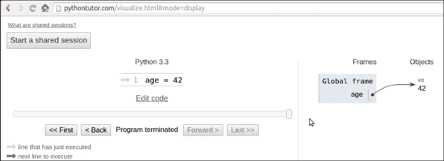
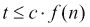
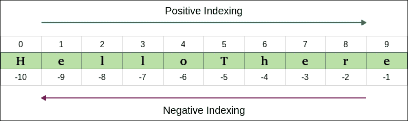

# 第二章. 内置数据类型

|   | *"数据！数据！数据！"他焦急地喊道。“没有粘土，我无法制作砖块。"* |   |
| --- | --- | --- |
|   | --*夏洛克·福尔摩斯 - 铜 Beeches 冒险* |

你用计算机做的每一件事都是管理数据。数据有多种不同的形状和风味。它是你听的音乐，你流媒体播放的电影，你打开的 PDF 文件。甚至你此刻正在阅读的章节也只是一个文件，也就是数据。

数据可以是简单的，比如一个整数来表示年龄，或者复杂的，比如在网站上下的订单。它可以关于单个对象，也可以关于它们的集合。

数据甚至可以关于数据，即元数据。描述其他数据结构设计的数据或描述应用程序数据及其上下文的数据。

在 Python 中，*对象是数据的抽象表示*，Python 有各种各样的数据结构，你可以使用它们来表示数据，或者将它们组合起来创建你自己的自定义数据。在我们深入具体细节之前，我希望你对 Python 中的对象有非常清晰的认识，所以让我们再谈谈它们。

# 万物皆对象

正如我们之前所说的，Python 中的万物都是对象。但当你输入像`age = 42`这样的指令时，实际上会发生什么呢？

### 小贴士

如果你访问[`pythontutor.com/`](http://pythontutor.com/)，你可以在文本框中输入该指令并获取其视觉表示。记住这个网站，它对于巩固你对幕后发生的事情的理解非常有用。

那么，发生的事情是一个对象被创建。它获得一个`id`，`type`被设置为`int`（整数），`value`被设置为`42`。名称`age`被放置在全局命名空间中，指向那个对象。因此，每次我们在全局命名空间中，在执行该行之后，我们都可以通过简单地通过其名称访问它来检索该对象：`age`。

如果你搬家，你会把所有的刀叉和勺子放在一个盒子里，并给它贴上“餐具”的标签。你能看到这和概念完全一样吗？下面是一个截图，展示它可能的样子（你可能需要调整设置才能达到相同的视图）：



因此，在本章的剩余部分，每当你读到像`name = some_value`这样的内容时，请想象一个名称被放置在命名空间中，它与指令编写的范围相关联，并且有一个指向具有`id`、`type`和`value`的对象的箭头。关于这个机制还有更多要说的，但通过例子来说明它要容易得多，所以我们稍后再回到这个话题。

# 可变或不可变？这是一个问题

Python 在数据上做出的第一个基本区分是关于一个对象的值是否可以改变。如果值可以改变，则该对象被称为**可变**，而如果值不能改变，则该对象被称为**不可变**。

理解可变和不可变之间的区别非常重要，因为它会影响你编写的代码，所以这里有一个问题：

```py
>>> age = 42
>>> age
42
>>> age = 43  #A
>>> age
43

```

在前面的代码中，在行 `#A` 上，我改变了 `age` 的值吗？嗯，没有。但现在它是 43（我听到你说...）。是的，它是 43，但 42 是一个整数，类型为 `int`，它是不可变的。所以，实际上发生的事情是在第一行，`age` 是一个指向值为 42 的 `int` 对象的名称。当我们输入 `age = 43` 时，实际上发生的是创建了一个新的对象，类型为 `int`，值为 43（同时，`id` 也会不同），并且名称 `age` 被设置为指向它。所以，我们并没有将 42 改为 43。我们实际上只是将 `age` 指向了另一个位置：值为 43 的新 `int` 对象。让我们看看同样的代码也打印了 ID：

```py
>>> age = 42
>>> id(age)
10456352
>>> age = 43
>>> id(age)
10456384

```

注意，我们通过调用内置的 `id` 函数来打印 ID。正如你所见，它们是不同的，正如预期的那样。请记住，`age` 每次只指向一个对象：首先是 42，然后是 43。它们永远不会同时指向。

现在，让我们用可变对象来查看相同的例子。为此，我们可以使用一个具有 `age` 属性的 `Person` 对象：

```py
>>> fab = Person(age=39)
>>> fab.age
39
>>> id(fab)
139632387887456
>>> fab.age = 29  # I wish!
>>> id(fab)
139632387887456  # still the same id

```

在这个例子中，我创建了一个名为 `fab` 的对象，其 `type` 为 `Person`（一个自定义类）。在创建时，该对象被赋予了 39 岁的 `age`。紧接着，我将打印它以及对象的 `id`。请注意，即使我将 `age` 改为 29，`fab` 的 ID 仍然保持不变（当然，`age` 的 ID 已经改变）。Python 中的自定义对象是可变的（除非你编写代码使其不可变）。请记住这个概念，它非常重要。我将在本章的其余部分提醒你。

# 数字

让我们从探索 Python 的内置数字数据类型开始。Python 是由一个拥有数学和计算机科学硕士学位的人设计的，所以它对数字有惊人的支持是合乎逻辑的。

数字是不可变对象。

## 整数

Python 整数具有无限的范围，仅受可用虚拟内存的限制。这意味着你想要存储的数字有多大并不重要：只要它能适应你的计算机内存，Python 就会处理它。整数可以是正数、负数和 0（零）。它们支持所有基本数学运算，如下面的示例所示：

```py
>>> a = 12
>>> b = 3
>>> a + b  # addition
15
>>> b - a  # subtraction
-9
>>> a // b  # integer division
4
>>> a / b  # true division
4.0
>>> a * b  # multiplication
36
>>> b ** a  # power operator
531441
>>> 2 ** 1024  # a very big number, Python handles it gracefully
17976931348623159077293051907890247336179769789423065727343008115
77326758055009631327084773224075360211201138798713933576587897688
14416622492847430639474124377767893424865485276302219601246094119
45308295208500576883815068234246288147391311054082723716335051068
4586298239947245938479716304835356329624224137216

```

上述代码应该很容易理解。只需注意一点重要的事情：Python 有两个除法运算符，一个执行所谓的**真除法**（`/`），它返回操作数的商，另一个执行所谓的**整数除法**（`//`），它返回操作数的**向下取整**商。看看这是如何对正数和负数不同的：

```py
>>> 7 / 4  # true division
1.75
>>> 7 // 4  # integer division, flooring returns 1
1
>>> -7 / 4  # true division again, result is opposite of previous
-1.75
>>> -7 // 4  # integer div., result not the opposite of previous
-2

```

这是一个有趣的例子。如果你在最后一行期待一个`-1`，请不要感到难过，这只是 Python 的工作方式。Python 中整数除法的结果总是四舍五入到负无穷。如果你想要截断一个数字到整数，而不是向下取整，你可以使用内置的`int`函数，如下面的例子所示：

```py
>>> int(1.75)
1
>>> int(-1.75)
-1

```

截断操作是向 0 进行的。

此外，还有一个用于计算除法余数的运算符。它被称为取模运算符，用百分号(`%`)表示：

```py
>>> 10 % 3  # remainder of the division 10 // 3
1
>>> 10 % 4  # remainder of the division 10 // 4
2

```

## 布尔值

布尔代数是代数的一个子集，其中变量的值是真理值：真和假。在 Python 中，`True`和`False`是两个用于表示真理值的保留字。布尔值是整数的一个子类，分别对应于 1 和 0。布尔值的`int`类等价于`bool`类，它返回`True`或`False`。每个内置的 Python 对象在布尔上下文都有一个值，这意味着当它们被`bool`函数处理时，基本上会评估为`True`或`False`。我们将在第三章中详细了解这一点，*迭代和决策*。

布尔值可以通过逻辑运算符`and`、`or`和`not`在布尔表达式中组合。同样，我们将在下一章中完整地看到它们，所以现在让我们先看看一个简单的例子：

```py
>>> int(True)  # True behaves like 1
1
>>> int(False)  # False behaves like 0
0
>>> bool(1)  # 1 evaluates to True in a boolean context
True
>>> bool(-42)  # and so does every non-zero number
True
>>> bool(0)  # 0 evaluates to False
False
>>> # quick peak at the operators (and, or, not)
>>> not True
False
>>> not False
True
>>> True and True
True
>>> False or True
True

```

当你尝试将它们相加时，你可以看到`True`和`False`是整数的一个子类。Python 将它们向上转型为整数并执行加法：

```py
>>> 1 + True
2
>>> False + 42
42
>>> 7 - True
6

```

### 注意

**向上转型**是一种类型转换操作，它从子类转换为其父类。在下面给出的例子中，`True`和`False`，它们属于从整数类派生出的一个类，当需要时会被转换回整数。这个话题涉及到继承，将在第六章中详细解释，*高级概念 – 面向对象编程、装饰器和迭代器*。

## 实数

实数或浮点数在 Python 中按照 IEEE 754 双精度二进制浮点格式表示，该格式存储在 64 位信息中，分为三个部分：符号、指数和尾数。

### 注意

在维基百科上了解有关此格式的知识：[`en.wikipedia.org/wiki/Double-precision_floating-point_format`](http://en.wikipedia.org/wiki/Double-precision_floating-point_format)

通常，编程语言为程序员提供两种不同的格式：单精度和双精度。前者占用 32 位内存，后者占用 64 位。Python 只支持双精度格式。让我们看看一个简单的例子：

```py
>>> pi = 3.1415926536  # how many digits of PI can you remember?
>>> radius = 4.5
>>> area = pi * (radius ** 2)
>>> area
63.61725123519331

```

### 注意

在计算面积的计算中，我将`radius ** 2`用括号括起来。尽管这并不是必要的，因为幂运算符的优先级高于乘法运算符，但我认为这样公式读起来更清晰。

`sys.float_info` 结构序列包含了关于浮点数在你的系统上如何表现的信息。这是我在我机器上看到的内容：

```py
>>> import sys
>>> sys.float_info
sys.float_info(max=1.7976931348623157e+308, max_exp=1024, max_10_exp=308, min=2.2250738585072014e-308, min_exp=-1021, min_10_exp=-307, dig=15, mant_dig=53, epsilon=2.220446049250313e-16, radix=2, rounds=1)

```

在这里让我们做一些考虑：我们有 64 位来表示浮点数。这意味着我们最多可以用这么多位表示 `2 ** 64 == 18,446,744,073,709,551,616` 个数字。看看浮点数的 `max` 和 `epsilon` 值，你就会意识到无法表示它们全部。空间不足，所以它们被近似到最接近的可表示的数字。你可能认为只有极大或极小的数字会受到影响。但再想想：

```py
>>> 3 * 0.1 – 0.3  # this should be 0!!!
5.551115123125783e-17

```

这告诉你什么？它告诉你，即使是像 0.1 或 0.3 这样简单的数字，双精度数也会出现近似问题。为什么这很重要？如果你处理的是价格、金融计算或任何需要精确表示的数据，这可能会成为一个大问题。别担心，Python 给你提供了 **Decimal** 类型，它不会出现这些问题，我们稍后会看到。

## 复数

Python 默认支持复数。如果你不知道什么是复数，你可以在网上查找。它们是可以表示为 *a + ib* 形式的数字，其中 *a* 和 *b* 是实数，而 *i*（或者如果你是工程师，是 *j*）是虚数单位，即 -1 的平方根。*a* 和 *b* 分别称为数字的 *实部* 和 *虚部*。

实际上，除非你在编写科学相关的代码，否则你不太可能使用它们。让我们看一个小例子：

```py
>>> c = 3.14 + 2.73j
>>> c.real  # real part
3.14
>>> c.imag  # imaginary part
2.73
>>> c.conjugate()  # conjugate of A + Bj is A - Bj
(3.14-2.73j)
>>> c * 2  # multiplication is allowed
(6.28+5.46j)
>>> c ** 2  # power operation as well
(2.4067000000000007+17.1444j)
>>> d = 1 + 1j  # addition and subtraction as well
>>> c - d
(2.14+1.73j)

```

## 分数和小数

让我们通过查看分数和小数来结束对数字部门的巡礼。分数以它们的最简形式持有有理的分子和分母。让我们看一个快速示例：

```py
>>> from fractions import Fraction
>>> Fraction(10, 6)  # mad hatter?
Fraction(5, 3)  # notice it's been reduced to lowest terms
>>> Fraction(1, 3) + Fraction(2, 3)  # 1/3 + 2/3 = 3/3 = 1/1
Fraction(1, 1)
>>> f = Fraction(10, 6)
>>> f.numerator
5
>>> f.denominator
3

```

虽然它们有时非常有用，但在商业软件中并不常见。相反，更容易看到在所有那些精度至关重要的环境中使用小数，例如科学和金融计算。

### 注意

重要的是要记住，任意精度小数在性能上是有代价的，当然。每个数字要存储的数据量远远大于分数或浮点数，以及它们被处理的方式，这需要 Python 解释器在幕后做更多的工作。另一个有趣的事实是，你可以通过访问 `decimal.getcontext().prec` 来获取和设置精度。

让我们用一个 `Decimal` 数字来快速看一下示例：

```py
>>> from decimal import Decimal as D  # rename for brevity
>>> D(3.14)  # pi, from float, so approximation issues
Decimal('3.140000000000000124344978758017532527446746826171875')
>>> D('3.14')  # pi, from a string, so no approximation issues
Decimal('3.14')
>>> D(0.1) * D(3) - D(0.3)  # from float, we still have the issue
Decimal('2.775557561565156540423631668E-17')
>>> D('0.1') * D(3) - D('0.3')  # from string, all perfect
Decimal('0.0')

```

注意到当我们从一个 `float` 构造一个 `Decimal` 数字时，它会继承 `float` 可能带来的所有近似问题。另一方面，当 `Decimal` 没有近似问题时，例如，当我们向构造函数提供 `int` 或 `string` 表示时，计算就没有奇怪的行为。当涉及到金钱时，使用小数。

这就结束了我们对内置数字类型的介绍，现在让我们看看序列。

# 不可变序列

让我们从不可变序列开始：字符串、元组和字节。

## 字符串和字节

Python 中的文本数据通过 **str** 对象处理，更常见的是字符串。它们是不可变的 **unicode 代码点** 序列。Unicode 代码点可以表示一个字符，但也可以有其他含义，例如格式化数据等。Python 与其他语言不同，没有 `char` 类型，所以一个字符简单地通过长度为 1 的字符串来表示。Unicode 是处理数据的一种优秀方式，应该用于任何应用程序的内部。当涉及到存储文本数据或通过网络发送数据时，你可能想要使用适当的编码对其进行编码。Python 中的字符串字面量使用单引号、双引号或三引号（单或双）编写。如果使用三引号构建，字符串可以跨越多行。以下是一个示例，以阐明情况：

```py
>>> # 4 ways to make a string
>>> str1 = 'This is a string. We built it with single quotes.'
>>> str2 = "This is also a string, but built with double quotes."
>>> str3 = '''This is built using triple quotes,
... so it can span multiple lines.'''
>>> str4 = """This too
... is a multiline one
... built with triple double-quotes."""
>>> str4  #A
'This too\nis a multiline one\nbuilt with triple double-quotes.'
>>> print(str4)  #B
This too
is a multiline one
built with triple double-quotes.

```

在 `#A` 和 `#B` 中，我们打印 `str4`，首先隐式地，然后显式地使用 `print` 函数。一个不错的练习是找出为什么它们不同。你能接受这个挑战吗？（提示：查看 `str` 函数）

字符串，像任何序列一样，都有长度。你可以通过调用 `len` 函数来获取它：

```py
>>> len(str1)
49

```

### 字符串的编码和解码

使用 `encode`/`decode` 方法，我们可以对 unicode 字符串进行编码，对字节对象进行解码。**Utf-8** 是一种可变长度的字符编码，能够编码所有可能的 unicode 代码点。它是网络（以及不仅仅是网络）中的主流编码。注意，通过在字符串声明前添加一个字面量 `b`，我们正在创建一个 *bytes* 对象。

```py
>>> s = "This is üŋíc0de"  # unicode string: code points
>>> type(s)
<class 'str'>
>>> encoded_s = s.encode('utf-8')  # utf-8 encoded version of s
>>> encoded_s
b'This is \xc3\xbc\xc5\x8b\xc3\xadc0de'  # result: bytes object
>>> type(encoded_s)  # another way to verify it
<class 'bytes'>
>>> encoded_s.decode('utf-8')  # let's revert to the original
'This is üŋíc0de'
>>> bytes_obj = b"A bytes object"  # a bytes object
>>> type(bytes_obj)
<class 'bytes'>

```

### 字符串的索引和切片

在操作序列时，经常需要在一个精确的位置（索引）访问它们，或者从它们中获取子序列（切片）。当处理不可变序列时，这两种操作都是只读的。

虽然索引只有一种形式，即对序列中任何位置的零基访问，但切片有多种形式。当你从序列中获取一个切片时，你可以指定 `start` 和 `stop` 位置以及 `step`。它们用冒号（`:`）分隔，如下所示：`my_sequence[start:stop:step]`。所有参数都是可选的，`start` 是包含的，`stop` 是排除的。通过一个例子来展示，比用文字进一步解释它们要容易得多：

```py
>>> s = "The trouble is you think you have time."
>>> s[0]  # indexing at position 0, which is the first char
'T'
>>> s[5]  # indexing at position 5, which is the sixth char
'r'
>>> s[:4]  # slicing, we specify only the stop position
'The '
>>> s[4:]  # slicing, we specify only the start position
'trouble is you think you have time.'
>>> s[2:14]  # slicing, both start and stop positions
'e trouble is'
>>> s[2:14:3]  # slicing, start, stop and step (every 3 chars)
'erb '
>>> s[:]  # quick way of making a copy
'The trouble is you think you have time.'

```

在所有行中，最后一行可能是最有趣的。如果你没有指定参数，Python 会为你填充默认值。在这种情况下，`start` 将是字符串的开始，`stop` 将是字符串的结束，而 `step` 将是默认的 1。这是一种简单快捷的方法来获取字符串 `s` 的副本（相同的值，但不同的对象）。你能找到一种使用切片获取字符串反转副本的方法吗？（不要查找，自己找到它）

## 元组

我们将要看到的最后一个不可变序列类型是元组。**元组**是任意 Python 对象的序列。在元组中，元素由逗号分隔。它们在 Python 中到处使用，因为它们允许其他语言难以复制的模式。有时元组是隐式使用的，例如在一行中设置多个变量，或者允许函数返回多个不同的对象（在许多其他语言中，函数通常只返回一个对象），甚至在 Python 控制台中，你可以隐式地使用元组来使用一条指令打印多个元素。我们将看到所有这些情况的示例：

```py
>>> t = ()  # empty tuple
>>> type(t)
<class 'tuple'>
>>> one_element_tuple = (42, )  # you need the comma!
>>> three_elements_tuple = (1, 3, 5)
>>> a, b, c = 1, 2, 3  # tuple for multiple assignment
>>> a, b, c  # implicit tuple to print with one instruction
(1, 2, 3)
>>> 3 in three_elements_tuple  # membership test
True

```

注意，成员运算符`in`也可以与列表、字符串、字典以及一般与集合和序列对象一起使用。

### 注意

注意，要创建一个只有一个元素的元组，我们需要在该元素后放置逗号。原因是如果没有逗号，该元素只是被大括号包裹，有点像冗余的数学表达式。注意，在赋值时，大括号是可选的，所以`my_tuple = 1, 2, 3`与`my_tuple = (1, 2, 3)`是相同的。

元组赋值允许我们做的一件事是*一行交换*，无需第三个临时变量。我们先看看一种更传统的方法：

```py
>>> a, b = 1, 2
>>> c = a  # we need three lines and a temporary var c
>>> a = b
>>> b = c
>>> a, b  # a and b have been swapped
(2, 1)

```

现在我们来看看如何在 Python 中实现：

```py
>>> a, b = b, a  # this is the Pythonic way to do it
>>> a, b
(1, 2)

```

看看显示 Python 交换两个值方式的行：你还记得我在第一章，“简介和第一步 – 深呼吸”中写了什么吗？Python 程序通常比等价的 Java 或 C++代码小五分之一到三分之一，而像一行交换这样的特性也对此有所贡献。Python 是优雅的，这里的优雅也意味着经济。

由于它们是不可变的，元组可以用作字典的键（我们很快就会看到这一点）。`dict`对象需要键是不可变的，因为如果它们可以改变，那么它们引用的值就找不到（因为到达它的路径依赖于键）。如果你对数据结构感兴趣，你知道这个特性是多么好。对我来说，元组是 Python 内置的数据，最接近数学向量。但这并不意味着这就是它们被创建的原因。元组通常包含异构元素序列，而另一方面，列表大多数时候是同质的。此外，元组通常通过解包或索引访问，而列表通常通过迭代访问。

# 可变序列

可变序列与它们的不可变姐妹不同，因为它们在创建后可以更改。Python 中有两种可变序列类型：列表和字节数组。我之前说过，字典是 Python 中数据结构的王者。我想这使列表成为它的合法王后。

## 列表

Python 列表是可变的序列。它们与元组非常相似，但它们没有由于不可变性而导致的限制。列表通常用于存储同质对象的集合，但没有任何东西阻止您存储异质集合。列表可以通过许多不同的方式创建，让我们看一个例子：

```py
>>> []  # empty list
[]
>>> list()  # same as []
[]
>>> [1, 2, 3]  # as with tuples, items are comma separated
[1, 2, 3]
>>> [x + 5 for x in [2, 3, 4]]  # Python is magic
[7, 8, 9]
>>> list((1, 3, 5, 7, 9))  # list from a tuple
[1, 3, 5, 7, 9]
>>> list('hello')  # list from a string
['h', 'e', 'l', 'l', 'o']

```

在上一个例子中，我向您展示了如何使用不同的技术创建列表。我希望您仔细看看写着`Python is magic`的那一行，我现在并不期望您完全理解这一点（除非您作弊了，而且您不是新手！）。这被称为**列表** **推导式**，这是 Python 一个非常强大的功能特性，我们将在第五章“节省时间和内存”中详细探讨。我只想让您在这个阶段对它产生兴趣。

创建列表固然不错，但真正的乐趣在于使用它们，所以让我们看看它们赋予我们的主要方法：

```py
>>> a = [1, 2, 1, 3]
>>> a.append(13)  # we can append anything at the end
>>> a
[1, 2, 1, 3, 13]
>>> a.count(1)  # how many `1` are there in the list?
2
>>> a.extend([5, 7])  # extend the list by another (or sequence)
>>> a
[1, 2, 1, 3, 13, 5, 7]
>>> a.index(13)  # position of `13` in the list (0-based indexing)
4
>>> a.insert(0, 17)  # insert `17` at position 0
>>> a
[17, 1, 2, 1, 3, 13, 5, 7]
>>> a.pop()  # pop (remove and return) last element
7
>>> a.pop(3)  # pop element at position 3
1
>>> a
[17, 1, 2, 3, 13, 5]
>>> a.remove(17)  # remove `17` from the list
>>> a
[1, 2, 3, 13, 5]
>>> a.reverse()  # reverse the order of the elements in the list
>>> a
[5, 13, 3, 2, 1]
>>> a.sort()  # sort the list
>>> a
[1, 2, 3, 5, 13]
>>> a.clear()  # remove all elements from the list
>>> a
[]

```

上述代码为您概述了列表的主要方法。我想向您展示它们有多么强大，以`extend`方法为例。您可以使用任何序列类型来扩展列表：

```py
>>> a = list('hello')  # makes a list from a string
>>> a
['h', 'e', 'l', 'l', 'o']
>>> a.append(100)  # append 100, heterogeneous type
>>> a
['h', 'e', 'l', 'l', 'o', 100]
>>> a.extend((1, 2, 3))  # extend using tuple
>>> a
['h', 'e', 'l', 'l', 'o', 100, 1, 2, 3]
>>> a.extend('...')  # extend using string
>>> a
['h', 'e', 'l', 'l', 'o', 100, 1, 2, 3, '.', '.', '.']

```

现在，让我们看看您可以使用列表执行的最常见操作：

```py
>>> a = [1, 3, 5, 7]
>>> min(a)  # minimum value in the list
1
>>> max(a)  # maximum value in the list
7
>>> sum(a)  # sum of all values in the list
16
>>> len(a)  # number of elements in the list
4
>>> b = [6, 7, 8]
>>> a + b  # `+` with list means concatenation
[1, 3, 5, 7, 6, 7, 8]
>>> a * 2  # `*` has also a special meaning
[1, 3, 5, 7, 1, 3, 5, 7]

```

上述代码的最后两行非常有趣，因为它们向我们介绍了一个称为**操作符** **重载**的概念。简而言之，这意味着像`+`、`-`、`*`、`%`等操作符可以根据它们使用的上下文表示不同的操作。将两个列表相加没有意义，对吧？因此，`+`符号用于连接它们。因此，`*`符号用于根据右操作数将列表连接到自身。现在，让我们进一步深入这个兔子洞，看看一些更有趣的东西。我想向您展示排序方法有多么强大，以及 Python 如何轻松实现其他语言中需要大量努力才能实现的结果：

```py
>>> from operator import itemgetter
>>> a = [(5, 3), (1, 3), (1, 2), (2, -1), (4, 9)]
>>> sorted(a)
[(1, 2), (1, 3), (2, -1), (4, 9), (5, 3)]
>>> sorted(a, key=itemgetter(0))
[(1, 3), (1, 2), (2, -1), (4, 9), (5, 3)]
>>> sorted(a, key=itemgetter(0, 1))
[(1, 2), (1, 3), (2, -1), (4, 9), (5, 3)]
>>> sorted(a, key=itemgetter(1))
[(2, -1), (1, 2), (5, 3), (1, 3), (4, 9)]
>>> sorted(a, key=itemgetter(1), reverse=True)
[(4, 9), (5, 3), (1, 3), (1, 2), (2, -1)]

```

上述代码需要一点解释。首先，`a` 是一个元组列表。这意味着 `a` 中的每个元素都是一个元组（严格来说，是一个 *2-元组*）。当我们调用 `sorted(some_list)` 时，我们得到 `some_list` 的排序版本。在这种情况下，对 2-元组的排序是通过在元组的第一个元素上进行排序，当第一个元素相同时，则在第二个元素上进行排序。您可以在 `sorted(a)` 的结果中看到这种行为，它产生 `[(1, 2), (1, 3), ...]`。Python 还赋予我们控制元组中哪个元素（哪些元素）必须进行排序的能力。请注意，当我们指示 `sorted` 函数对每个元组的第一个元素进行操作（通过 `key=itemgetter(0)`）时，结果就不同了：`[(1, 3), (1, 2), ...]`。排序仅在每个元组的第一个元素上进行（即位置 0 的元素）。如果我们想复制简单的 `sorted(a)` 调用的默认行为，我们需要使用 `key=itemgetter(0, 1)`，这告诉 Python 首先在元组内的位置 0 的元素上进行排序，然后是在位置 1 的元素上。比较结果，您会发现它们是一致的。

为了完整性，我包括了一个仅对位置 1 的元素进行排序的例子，以及相同但顺序相反的例子。如果您曾经见过 Java 中的排序，我预计您此刻会跪在地上欣喜若狂。

Python 的排序算法非常强大，它是由 Tim Peters 编写的（我们之前已经见过这个名字，你能回忆起是在什么时候吗？）。它恰当地命名为 **Timsort**，它是 **归并** 和 **插入** 排序的结合，并且比大多数用于主流编程语言的算法具有更好的时间性能。Timsort 是一个稳定的排序算法，这意味着当多个记录具有相同的键时，它们的原始顺序被保留。我们在 `sorted(a, key=itemgetter(0))` 的结果中已经看到了这一点，它产生了 `[(1, 3), (1, 2), ...]`，其中这两个元组的顺序被保留，因为它们在位置 0 的值是相同的。

## 字节数组

为了总结我们对可变序列类型的概述，让我们花几分钟时间来谈谈 `bytearray` 类型。基本上，它们是 `bytes` 对象的可变版本。它们公开了大多数可变序列的常用方法以及 `bytes` 类型的大多数方法。元素是范围在 [0, 256) 内的整数。

### 注意

当涉及到区间时，我将使用标准的开/闭范围表示法。一端上的方括号表示值被包含，而圆括号表示被排除。粒度通常由边缘元素的类型推断，例如，区间 [3, 7] 表示介于 3 和 7 之间的所有整数，包括 3 和 7。另一方面，(3, 7) 表示介于 3 和 7 之间的所有整数，不包括 4、5 和 6。`bytearray` 类型的项是介于 0 和 256 之间的整数，包括 0，不包括 256。区间通常以这种方式表达的一个原因是便于编码。如果我们把范围 a, b) 分成 *N* 个连续的范围，我们可以很容易地将其表示为这样的连接：

![字节数组

在代码中处理区间时，排除了中间点 (*k* *[i]*) 的一端，并包含另一端，这使得在处理区间时易于连接和分割。

让我们用一个快速例子来看看 `bytearray` 类型：

```py
>>> bytearray()  # empty bytearray object
bytearray(b'')
>>> bytearray(10)  # zero-filled instance with given length
bytearray(b'\x00\x00\x00\x00\x00\x00\x00\x00\x00\x00')
>>> bytearray(range(5))  # bytearray from iterable of integers
bytearray(b'\x00\x01\x02\x03\x04')
>>> name = bytearray(b'Lina')  # A - bytearray from bytes
>>> name.replace(b'L', b'l')
bytearray(b'lina')
>>> name.endswith(b'na')
True
>>> name.upper()
bytearray(b'LINA')
>>> name.count(b'L')
1

```

如前所述的代码所示，创建 `bytearray` 对象有几种方法。它们在许多情况下可能很有用，例如，在通过 **套接字** 接收数据时，它们消除了在轮询时需要连接数据的需求，因此它们非常方便。在行 `#A` 中，我从字符串 `b'Lina'` 创建了 `name` `bytearray` 来向您展示 `bytearray` 对象如何公开序列和字符串的方法，这非常方便。如果你这么想，它们可以被认为是可变字符串。

# 集合类型

Python 还提供了两种集合类型，`set` 和 `frozenset`。`set` 类型是可变的，而 `frozenset` 是不可变的。它们是无序的不变对象集合。

**可哈希性** 是一个特性，它允许一个对象既可以作为集合的成员，也可以作为字典的键，正如我们很快就会看到的。

### 备注

一个对象如果是可哈希的，那么它在其生命周期内具有一个永远不会改变的哈希值。

比较相等的对象必须具有相同的哈希值。集合通常用于测试成员资格，所以让我们在以下示例中介绍 `in` 操作符：

```py
>>> small_primes = set()  # empty set
>>> small_primes.add(2)  # adding one element at a time
>>> small_primes.add(3)
>>> small_primes.add(5)
>>> small_primes
{2, 3, 5}
>>> small_primes.add(1)  # Look what I've done, 1 is not a prime!
>>> small_primes
{1, 2, 3, 5}
>>> small_primes.remove(1)  # so let's remove it
>>> 3 in small_primes  # membership test
True
>>> 4 in small_primes
False
>>> 4 not in small_primes  # negated membership test
True
>>> small_primes.add(3)  # trying to add 3 again
>>> small_primes
{2, 3, 5}  # no change, duplication is not allowed
>>> bigger_primes = set([5, 7, 11, 13])  # faster creation
>>> small_primes | bigger_primes  # union operator `|`
{2, 3, 5, 7, 11, 13}
>>> small_primes & bigger_primes  # intersection operator `&`
{5}
>>> small_primes - bigger_primes  # difference operator `-`
{2, 3}

```

在前面的代码中，你可以看到创建集合的两种不同方式。一种是一次创建一个空集合，然后逐个添加元素。另一种是使用构造函数的参数作为数字列表来创建集合，这为我们做了所有的工作。当然，你可以从列表、元组（或任何可迭代对象）中创建一个集合，然后你可以按需添加和删除集合成员。

创建集合的另一种方法是简单地使用花括号表示法，如下所示：

```py
>>> small_primes = {2, 3, 5, 5, 3}
>>> small_primes
{2, 3, 5}

```

注意，我添加了一些重复内容来强调结果集合将不会有任何重复。

### 备注

我们将在下一章看到可迭代对象和迭代。现在，只需知道可迭代对象是可以按一定方向迭代的对象。

让我们看看关于集合类型不可变对应物的例子：`frozenset`。

```py
>>> small_primes = frozenset([2, 3, 5, 7])
>>> bigger_primes = frozenset([5, 7, 11])
>>> small_primes.add(11)  # we cannot add to a frozenset
Traceback (most recent call last):
 File "<stdin>", line 1, in <module>
AttributeError: 'frozenset' object has no attribute 'add'
>>> small_primes.remove(2)  # neither we can remove
Traceback (most recent call last):
 File "<stdin>", line 1, in <module>
AttributeError: 'frozenset' object has no attribute 'remove'
>>> small_primes & bigger_primes  # intersect, union, etc. allowed
frozenset({5, 7})

```

如你所见，`frozenset`对象在其可变对应物方面相当有限。它们在成员测试、并集、交集和差集操作中仍然非常有效，并且出于性能考虑。

# 映射类型 – 字典

在所有内置的 Python 数据类型中，字典可能是最有趣的一个。它是唯一的标准映射类型，并且是每个 Python 对象的骨架。

字典将键映射到值。键需要是可哈希的对象，而值可以是任何任意类型。字典是可变对象。

创建字典有相当多的不同方法，所以让我给你一个简单的例子，展示如何以五种不同的方式创建一个等于`{'A': 1, 'Z': -1}`的字典：

```py
>>> a = dict(A=1, Z=-1)
>>> b = {'A': 1, 'Z': -1}
>>> c = dict(zip(['A', 'Z'], [1, -1]))
>>> d = dict([('A', 1), ('Z', -1)])
>>> e = dict({'Z': -1, 'A': 1})
>>> a == b == c == d == e  # are they all the same?
True  # indeed!

```

你注意到那些双等号吗？赋值使用一个等号，而要检查一个对象是否与另一个对象相同（或者在这种情况下一次性检查 5 个），我们使用双等号。还有另一种比较对象的方法，它涉及到**is**运算符，并检查两个对象是否相同（如果它们有相同的 ID，而不仅仅是值），但除非你有很好的理由使用它，否则你应该使用双等号。在前面的代码中，我还使用了一个很棒的功能：`zip`。这个名字来源于现实生活中的 zip，它一次取两个东西中的一个元素来粘合。让我给你举一个例子：

```py
>>> list(zip(['h', 'e', 'l', 'l', 'o'], [1, 2, 3, 4, 5]))
[('h', 1), ('e', 2), ('l', 3), ('l', 4), ('o', 5)]
>>> list(zip('hello', range(1, 6)))  # equivalent, more Pythonic
[('h', 1), ('e', 2), ('l', 3), ('l', 4), ('o', 5)]

```

在前面的例子中，我以两种不同的方式创建了相同的列表，一种更为明确，另一种则更符合 Python 风格。暂时忘记我必须将`list`构造函数包裹在`zip`调用中（原因是因为`zip`返回的是一个迭代器，而不是一个`list`），让我们专注于结果。看看`zip`是如何将其两个参数的第一个元素配对在一起，然后是第二个元素，然后是第三个元素，以此类推？看看你的裤子（如果你是女士，看看你的钱包）你就会在你的实际 zip 中看到同样的行为。但让我们回到字典，看看它们为我们提供了多少奇妙的方法来按我们的意愿操作它们。让我们从基本操作开始：

```py
>>> d = {}
>>> d['a'] = 1  # let's set a couple of (key, value) pairs
>>> d['b'] = 2
>>> len(d)  # how many pairs?
2
>>> d['a']  # what is the value of 'a'?
1
>>> d  # how does `d` look now?
{'a': 1, 'b': 2}
>>> del d['a']  # let's remove `a`
>>> d
{'b': 2}
>>> d['c'] = 3  # let's add 'c': 3
>>> 'c' in d  # membership is checked against the keys
True
>>> 3 in d  # not the values
False
>>> 'e' in d
False
>>> d.clear()  # let's clean everything from this dictionary
>>> d
{}

```

注意观察访问字典键的方式，无论我们执行的操作类型如何，都是通过方括号来完成的。你还记得字符串、列表和元组吗？我们也是通过方括号来访问某些位置的元素。这又是 Python 一致性的另一个例子。

现在我们来看三个称为字典视图的特殊对象：`keys`、`values`和`items`。这些对象提供了对字典条目的动态视图，并且当字典发生变化时它们也会变化。`keys()`返回字典中的所有键，`values()`返回字典中的所有值，而`items()`返回字典中的所有*(键，值)*对。

### 注意

非常重要的是要知道，即使字典本身不是有序的，根据 Python 文档：“*键和值以任意顺序迭代，这种顺序是非随机的，因 Python 实现而异，并取决于字典的插入和删除历史。如果没有对字典进行任何中间修改，则迭代键、值和项目视图时，项目顺序将直接对应。*”

足够的闲聊了，让我们把这些都写进代码中：

```py
>>> d = dict(zip('hello', range(5)))
>>> d
{'e': 1, 'h': 0, 'o': 4, 'l': 3}
>>> d.keys()
dict_keys(['e', 'h', 'o', 'l'])
>>> d.values()
dict_values([1, 0, 4, 3])
>>> d.items()
dict_items([('e', 1), ('h', 0), ('o', 4), ('l', 3)])
>>> 3 in d.values()
True
>>> ('o', 4) in d.items()
True

```

在前面的代码中，有几个需要注意的地方。首先，注意我们是如何通过迭代字符串`'hello'`和列表`[0, 1, 2, 3, 4]`的压缩版本来创建字典的。字符串`'hello'`中有两个`'l'`字符，它们通过`zip`函数与值 2 和 3 配对。注意在字典中，`'l'`键的第二次出现（值为 3）会覆盖第一次出现（值为 2）。另一件要注意的事情是，当请求任何视图时，原始顺序会丢失，但在视图内部是一致的，正如预期的那样。还要注意，当你在自己的机器上尝试这段代码时，可能会得到不同的结果。Python 不保证这一点，它只保证视图呈现顺序的一致性。

当我们谈到遍历集合时，我们会看到这些视图是如何成为基本工具的。现在让我们看看 Python 字典暴露的其它一些方法，它们很多并且非常有用：

```py
>>> d
{'e': 1, 'h': 0, 'o': 4, 'l': 3}
>>> d.popitem()  # removes a random item
('e', 1)
>>> d
{'h': 0, 'o': 4, 'l': 3}
>>> d.pop('l')  # remove item with key `l`
3
>>> d.pop('not-a-key')  # remove a key not in dictionary: KeyError
Traceback (most recent call last):
 File "<stdin>", line 1, in <module>
KeyError: 'not-a-key'
>>> d.pop('not-a-key', 'default-value')  # with a default value?
'default-value'  # we get the default value
>>> d.update({'another': 'value'})  # we can update dict this way
>>> d.update(a=13)  # or this way (like a function call)
>>> d
{'a': 13, 'another': 'value', 'h': 0, 'o': 4}
>>> d.get('a')  # same as d['a'] but if key is missing no KeyError
13
>>> d.get('a', 177)  # default value used if key is missing
13
>>> d.get('b', 177)  # like in this case
177
>>> d.get('b')  # key is not there, so None is returned

```

所有这些方法都相当简单易懂，但值得讨论一下`None`，稍作停留。Python 中的每个函数都会返回`None`，除非显式地使用了`return`语句，但我们会探索函数时再讨论这个问题。`None`经常用来表示没有值，例如当没有将默认参数传递给函数时。一些经验不足的程序员有时会编写返回`False`或`None`的代码。`False`和`None`都评估为`False`，所以它们之间可能看起来没有太大区别。但实际上，我会说它们之间有一个相当重要的区别：`False`意味着我们有信息，而我们拥有的信息是`False`。`None`意味着没有信息。没有信息与信息`False`是非常不同的。用通俗易懂的话说，如果你问你的机械师“我的车准备好了吗？”那么回答“没有，还没有”(*False*)和“我不知道”(*None*)之间有很大的区别。

我非常喜欢字典的一个方法是`setdefault`。它的行为类似于`get`，但如果键不存在，它也会设置具有给定值的键。让我们看一个例子：

```py
>>> d = {}
>>> d.setdefault('a', 1)  # 'a' is missing, we get default value
1
>>> d
{'a': 1}  # also, the key/value pair ('a', 1) has now been added
>>> d.setdefault('a', 5)  # let's try to override the value
1
>>> d
{'a': 1}  # didn't work, as expected

```

因此，我们现在已经结束了这次游览。测试你对字典的了解，尝试预测在这行代码之后`d`看起来会是什么样子。

```py
>>> d = {}
>>> d.setdefault('a', {}).setdefault('b', []).append(1)

```

这并不复杂，但如果你一开始不理解也不要担心。我只是想激励你尝试使用字典。

这就结束了我们对内置数据类型的游览。在我对这一章中我们所看到的内容进行一些思考之前，我想简要地看一下`collections`模块。

# `collections`模块

当 Python 的通用内置容器（`tuple`、`list`、`set`和`dict`）不足以满足需求时，我们可以在`collections`模块中找到专门的容器数据类型。它们是：

| 数据类型 | 描述 |
| --- | --- |
| `namedtuple()` | 创建具有命名字段的元组子类的工厂函数 |
| `deque` | 一个类似于`list`的容器，两端快速追加和弹出 |
| `ChainMap` | 创建多个映射的单个视图的`dict`类似类 |
| `Counter` | 一个用于计数可哈希对象的`dict`子类 |
| `OrderedDict` | 一个记住添加条目顺序的`dict`子类 |
| `defaultdict` | 一个调用工厂函数以提供缺失值的`dict`子类 |
| `UserDict` | 一个围绕字典对象的包装器，以便更容易地子类化字典 |
| `UserList` | 一个围绕列表对象的包装器，以便更容易地子类化列表 |
| `UserString` | 一个围绕字符串对象的包装器，以便更容易地子类化字符串 |

我们没有足够的空间涵盖所有这些，但你可以在官方文档中找到大量的示例，所以在这里，我将只给出一个小例子来展示`namedtuple`、`defaultdict`和`ChainMap`。

## 命名元组

`namedtuple`是一个类似`tuple`的对象，它可以通过属性查找访问字段，同时又是可索引和可迭代的（实际上它是`tuple`的子类）。这有点像是完整对象和元组之间的折中，在那些你不需要自定义对象的全功能，但希望你的代码通过避免奇怪的索引而更易读的情况下很有用。另一个用例是，在元组中的项在重构后需要改变它们的位置的情况下，这迫使编码者也要重构所有相关的逻辑，这可能非常棘手。像往常一样，一个例子胜过千言万语（或者是一个图片？）。比如说我们正在处理有关患者左右眼的数据。我们在一个常规元组中为左眼（位置 0）保存一个值，为右眼（位置 1）保存一个值。以下是可能的情况：

```py
>>> vision = (9.5, 8.8)
>>> vision
(9.5, 8.8)
>>> vision[0]  # left eye (implicit positional reference)
9.5
>>> vision[1]  # right eye (implicit positional reference)
8.8

```

现在我们假设我们一直在处理`vision`对象，在某个时候，设计者决定通过添加关于综合视觉的信息来增强它们，因此`vision`对象以以下格式存储数据：（左眼，综合，右眼）。

你现在看到我们遇到的麻烦了吗？我们可能有很多代码依赖于`vision[0]`是左眼信息（目前仍然是）和`vision[1]`是右眼信息（这已经不再是事实）。我们必须在处理这些对象的任何地方重构我们的代码，将`vision[1]`改为`vision[2]`，这可能会很痛苦。我们可能从一开始就能更好地处理这个问题，通过使用`namedtuple`。让我给你展示一下我的意思：

```py
>>> from collections import namedtuple
>>> Vision = namedtuple('Vision', ['left', 'right'])
>>> vision = Vision(9.5, 8.8)
>>> vision[0]
9.5
>>> vision.left  # same as vision[0], but explicit
9.5
>>> vision.right  # same as vision[1], but explicit
8.8

```

如果在我们的代码中我们使用 `vision.left` 和 `vision.right` 来引用左右眼，要修复新的设计问题，我们只需更改我们的工厂和创建实例的方式。其余的代码不需要更改。

```py
>>> Vision = namedtuple('Vision', ['left', 'combined', 'right'])
>>> vision = Vision(9.5, 9.2, 8.8)
>>> vision.left  # still perfect
9.5
>>> vision.right  # still perfect (though now is vision[2])
8.8
>>> vision.combined  # the new vision[1]
9.2

```

您可以看到通过名称而不是位置来引用这些值是多么方便。毕竟，一位智者曾经说过 "*明确优于隐晦*"（你能想起在哪里吗？如果你不记得，想想 *禅*）。当然，这个例子可能有点极端，当然我们的代码设计者不太可能选择这样的改变，但您会惊讶地看到在专业环境中类似这种情况发生的频率，以及重构它们的痛苦。

## Defaultdict

`defaultdict` 数据类型是我最喜欢的之一。它允许您通过在第一次访问尝试时简单地为您插入键来避免检查键是否在字典中，并传递在创建时指定的默认值类型。在某些情况下，这个工具可以非常方便，并稍微缩短您的代码。让我们看看一个快速示例：假设我们正在更新 `age` 的值，通过增加一年。如果 `age` 不存在，我们假设它是 `0`，并将其更新为 `1`。

```py
>>> d = {}
>>> d['age'] = d.get('age', 0) + 1  # age not there, we get 0 + 1
>>> d
{'age': 1}
>>> d = {'age': 39}
>>> d['age'] = d.get('age', 0) + 1  # d is there, we get 40
>>> d
{'age': 40}

```

现在让我们看看它如何与 `defaultdict` 数据类型一起工作。第二行实际上是 4 行长的 `if` 子句的简写版本，如果我们没有 `get` 方法，我们就必须编写这个 `if` 子句。我们将在 第三章 中看到所有关于 `if` 子句的内容，*迭代和决策*。

```py
>>> from collections import defaultdict
>>> dd = defaultdict(int)  # int is the default type (0 the value)
>>> dd['age'] += 1  # short for dd['age'] = dd['age'] + 1
>>> dd
defaultdict(<class 'int'>, {'age': 1})  # 1, as expected
>>> dd['age'] = 39
>>> dd['age'] += 1
>>> dd
defaultdict(<class 'int'>, {'age': 40})  # 40, as expected

```

注意我们只需指示 `defaultdict` 工厂，当键缺失时我们希望使用一个 `int` 类型的数字（我们将得到 `0`，这是 `int` 类型的默认值）。此外，请注意，尽管在这个例子中行数没有增加，但可读性的提升是非常明显的，这非常重要。您还可以使用不同的技术来实例化 `defaultdict` 数据类型，这涉及到创建一个工厂对象。要深入了解，请参阅官方文档。

## ChainMap

`ChainMap` 是一个在 Python 3.3 中引入的非常棒的数据类型。它表现得像一个普通的字典，但根据 Python 文档的说明：*提供了一种快速链接多个映射的方法，以便它们可以作为一个单一单元来处理。* 这通常比创建一个字典并在其上运行多个更新调用要快得多。`ChainMap` 可以用来模拟嵌套作用域，在模板中非常有用。底层映射存储在一个列表中。该列表是公开的，可以通过 maps 属性来访问或更新。查找会依次搜索底层映射，直到找到一个键。相比之下，写入、更新和删除操作只作用于第一个映射。

一个非常常见的用例是提供默认值，所以让我们看看一个例子：

```py
>>> from collections import ChainMap
>>> default_connection = {'host': 'localhost', 'port': 4567}
>>> connection = {'port': 5678}
>>> conn = ChainMap(connection, default_connection) # map creation
>>> conn['port']  # port is found in the first dictionary
5678
>>> conn['host']  # host is fetched from the second dictionary
'localhost'
>>> conn.maps  # we can see the mapping objects
[{'port': 5678}, {'host': 'localhost', 'port': 4567}]
>>> conn['host'] = 'packtpub.com'  # let's add host
>>> conn.maps
[{'host': 'packtpub.com', 'port': 5678},
 {'host': 'localhost', 'port': 4567}]
>>> del conn['port']  # let's remove the port information
>>> conn.maps
[{'host': 'packtpub.com'},
 {'host': 'localhost', 'port': 4567}]
>>> conn['port']  # now port is fetched from the second dictionary
4567
>>> dict(conn)  # easy to merge and convert to regular dictionary
{'host': 'packtpub.com', 'port': 4567}

```

我真的很喜欢 Python 使你的生活变得如此简单。你在一个`ChainMap`对象上工作，按照你的意愿配置第一个映射，当你需要一个包含所有默认值以及自定义项的完整字典时，你只需将`ChainMap`对象传递给`dict`构造函数。如果你从未在其他语言中编码过，比如 Java 或 C++，你可能无法完全欣赏这一点，Python 是如何使你的生活变得如此轻松的。我确实如此，每次我不得不在其他语言中编码时，我都会感到压抑。

# 最后的考虑

就这些了。现在你已经看到了你将在 Python 中使用的大部分数据结构。我鼓励你深入研究 Python 文档，并进一步实验本章中我们看到的每一个数据类型。相信我，这是值得的。你将写下的每一行代码都将关于处理数据，所以确保你对它的了解是牢固的。

在我们跳到下一章之前，我想就一些我认为重要且不应被忽视的不同方面做一些最后的考虑。

## 小值缓存

当我们在本章开头讨论对象时，我们看到了当我们给一个对象命名时，Python 会创建该对象，设置其值，然后将名称指向它。我们可以给相同的值分配不同的名称，并期望创建不同的对象，如下所示：

```py
>>> a = 1000000
>>> b = 1000000
>>> id(a) == id(b)
False

```

在前面的例子中，`a`和`b`被分配给两个`int`对象，它们具有相同的值，但它们不是同一个对象，正如你所看到的，它们的`id`不相同。所以让我们再试一次：

```py
>>> a = 5
>>> b = 5
>>> id(a) == id(b)
True

```

哦哦！Python 出问题了？为什么这两个对象现在相同了？我们并没有做`a = b = 5`，我们是分别设置的。嗯，答案是性能。Python 缓存短字符串和小数字，以避免在系统内存中产生许多副本。所有的事情都在幕后得到妥善处理，所以你不需要担心，但如果你需要在代码中处理 ID，请确保你记得这种行为。

## 如何选择数据结构

正如我们所看到的，Python 为你提供了几个内置的数据类型，有时，如果你不是那么有经验，选择最适合你的类型可能会很棘手，尤其是在集合方面。例如，假设你有很多字典要存储，每个字典代表一个客户。在客户字典中有一个唯一的标识码`'id': 'code'`。你会在哪种集合中放置它们？好吧，除非我了解更多关于这些客户的信息，否则很难回答。我需要什么样的访问？我将对每个客户执行什么样的操作，以及需要执行多少次？集合会随时间变化吗？我需要以某种方式修改客户字典吗？我将要在集合上执行的最频繁的操作是什么？

如果你能够回答前面的问题，那么你就会知道该选择什么。如果集合永远不会缩小或增长（换句话说，在创建后不需要添加/删除任何客户对象或打乱顺序），那么元组是一个可能的选择。否则，列表是一个不错的选择。不过，每个客户字典都有一个唯一的标识符，所以即使字典也可以工作。让我为你草拟这些选项：

```py
# example customer objects
customer1 = {'id': 'abc123', 'full_name': 'Master Yoda'}
customer2 = {'id': 'def456', 'full_name': 'Obi-Wan Kenobi'}
customer3 = {'id': 'ghi789', 'full_name': 'Anakin Skywalker'}
# collect them in a tuple
customers = (customer1, customer2, customer3)
# or collect them in a list
customers = [customer1, customer2, customer3]
# or maybe within a dictionary, they have a unique id after all
customers = {
    'abc123': customer1,
    'def456': customer2,
    'ghi789': customer3,
}
```

我们那里有一些客户，对吧？我可能不会选择元组选项，除非我想强调集合不会改变。我会说通常列表更好，它提供了更多的灵活性。

另一个需要考虑的因素是，元组和列表是有序集合，而如果你使用字典或集合，你会失去排序，因此你需要知道排序在你的应用中是否重要。

关于性能如何？例如，在一个列表中，插入和成员资格等操作可能需要 *O(n)* 时间，而对于字典来说，这些操作只需要 *O(1)*。然而，如果我们不能保证可以通过集合的一个属性唯一地识别每个项目，并且该属性是可哈希的（因此它可以作为 `dict` 的键），那么使用字典并不总是可能的。

### 注意

如果你想知道 *O(n)* 和 *O(1)* 是什么意思，请谷歌搜索“*大 O 符号*”并从任何地方了解其概要。在这个上下文中，我们只需说，如果对一个数据结构执行操作 *Op* 需要 *O(f(n))* 时间，这意味着 *Op* 完成所需的时间最多为 ，其中 *c* 是某个正常数，*n* 是输入的大小，*f* 是某个函数。所以，将 *O(...)* 视为操作运行时间的上界（当然，它也可以用来衡量其他可测量的数量）。

判断你是否选择了正确的数据结构的一种方法是通过查看你为了操作它而必须编写的代码。如果一切都很顺利且自然流畅，那么你可能选择了正确的选项，但如果你发现自己觉得代码变得过于复杂，那么你可能应该尝试决定是否需要重新考虑你的选择。不过，没有实际案例很难给出建议，所以当你为你的数据选择数据结构时，请记住考虑易用性和性能，并优先考虑你所在环境中最重要的因素。

## 关于索引和切片

在本章的开头，我们看到了字符串上的切片操作。一般来说，切片适用于序列，例如元组、列表、字符串等。对于列表，切片也可以用于赋值。我几乎从未在专业代码中看到过这种用法，但仍然，你知道你可以这样做。你能对字典或集合进行切片吗？我听到你在尖叫“*当然不能！它们是无序的!*”。太好了，我看到我们在这里意见一致，那么让我们来谈谈索引。

关于 Python 索引的一个特点，我之前还没有提到。我将通过例子来展示。如何定位集合的最后一个元素？让我们看看：

```py
>>> a = list(range(10))  # `a` has 10 elements. Last one is 9.
>>> a
[0, 1, 2, 3, 4, 5, 6, 7, 8, 9]
>>> len(a)  # its length is 10 elements
10
>>> a[len(a) - 1]  # position of last one is len(a) - 1
9
>>> a[-1]  # but we don't need len(a)! Python rocks!
9
>>> a[-2]  # equivalent to len(a) - 2
8
>>> a[-3]  # equivalent to len(a) - 3
7

```

如果列表 `a` 有 10 个元素，由于 Python 的 *0 索引* 系统定位，第一个元素位于位置 0，最后一个元素位于位置 9。在上一个例子中，元素被方便地放置在其值相等的位置：0 位于位置 0，1 位于位置 1，以此类推。

因此，为了获取最后一个元素，我们需要知道整个列表（或元组、字符串等）的长度，然后减去 1。因此：`len(a) – 1`。这是一个非常常见的操作，Python 提供了一种使用 **负** **索引** 来检索元素的方法。这在进行一些严肃的数据操作时非常有用。以下是一个关于字符串 `"HelloThere"` 上索引如何工作的好图解：



尝试访问大于 9 或小于 -10 的索引将引发一个 `IndexError`，正如预期的那样。

## 关于命名

你可能已经注意到，为了尽可能缩短示例，我使用了简单的字母来调用许多对象，如 `a`、`b`、`c`、`d` 等。当你需要在控制台调试或展示 `a + b == 7` 时，这是完全可以接受的，但在专业编码（或任何类型的编码，无论如何）中，这是一种不好的做法。我希望你能够容忍我有时这样做，原因是为了以更紧凑的方式展示代码。

在实际环境中，当你为你的数据选择名称时，你应该仔细选择，并且它们应该反映数据的内容。所以，如果你有一组 `Customer` 对象，`customers` 是它的一个非常好的名称。`customers_list`、`customers_tuple` 或 `customers_collection` 也能行得通吗？思考一下。将集合的名称与数据类型绑定是否好？我不这么认为，至少在大多数情况下不是。所以我会说，如果你有很好的理由这么做，那就去做吧，否则不要。原因是，一旦 `customers_tuple` 开始在你的代码的不同地方使用，你意识到你实际上想使用列表而不是元组，你将面临一些有趣的重构（也称为 **浪费时间**）。数据名称应该是名词，函数名称应该是动词。名称应该尽可能表达清晰。Python 在名称方面实际上是一个非常好的例子。大多数时候，如果你知道一个函数的作用，你就可以猜出它的名称。疯狂，对吧？

第二章，*《代码整洁之道》*，*罗伯特·C·马丁*，*普伦蒂斯·霍尔*，完全致力于命名。这是一本令人惊叹的书，它帮助我在许多不同的方面改进了我的编码风格，如果你想要将你的编码提升到下一个层次，这是一本必读的书。

# 摘要

在本章中，我们探讨了 Python 的内置数据类型。我们看到了它们的数量，以及仅通过不同组合使用它们所能实现的事情。

我们已经看到了数字类型、序列、集合、映射、集合，我们了解到一切皆对象，我们学习了可变和不可变之间的区别，我们还学习了切片和索引（以及，自豪地说，负索引）。

我们已经展示了简单的例子，但关于这个主题，你还可以学到更多，所以请深入官方文档去探索。

最重要的是，我鼓励你自己尝试所有练习，让你的手指使用这些代码，建立一些肌肉记忆，并实验，实验，再实验。学习当你除以零时会发生什么，当你将不同的数字类型组合成一个单一表达式时会发生什么，当你处理字符串时会发生什么。玩转所有数据类型。练习它们，破坏它们，发现它们的所有方法，享受它们并学好它们，真的学好。

如果你的基础不是坚如磐石，你的代码能有多好？数据是一切的基础。数据塑造了围绕它的东西。

随着你对这本书的进步，你很可能会发现我的代码（或你的）中存在一些差异，或者这里那里可能有一些小错误。你会收到一个错误信息，某些东西会出错。那太好了！当你编码时，事情总是出错，你总是调试和修复，所以请把错误视为学习关于你所使用语言的新知识的有用练习，而不是失败或问题。错误会一直出现，直到你代码的最后一行，这是肯定的，所以你现在就开始与它们和解吧。

下一章是关于迭代和做决策的。我们将看到如何实际使用这些集合，并基于我们呈现的数据做出决策。现在你的知识正在积累，我们将开始稍微快一点，所以确保你在转到下一章之前对这一章的内容感到舒适。再次提醒，要开心，探索，破坏事物。这是一种非常好的学习方法。
