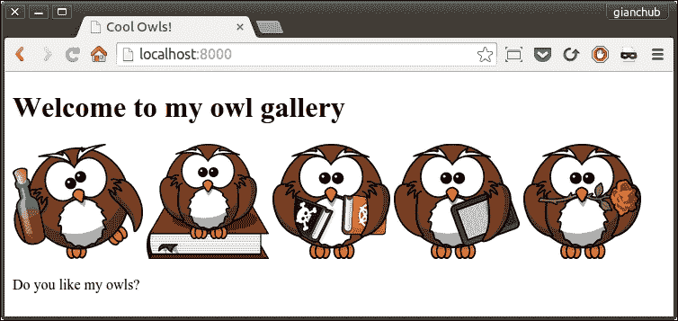
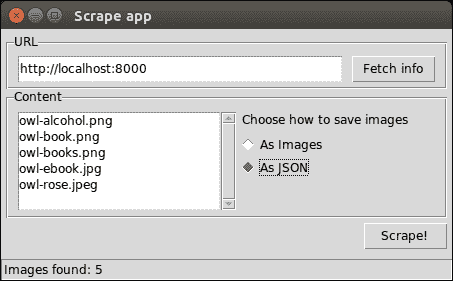
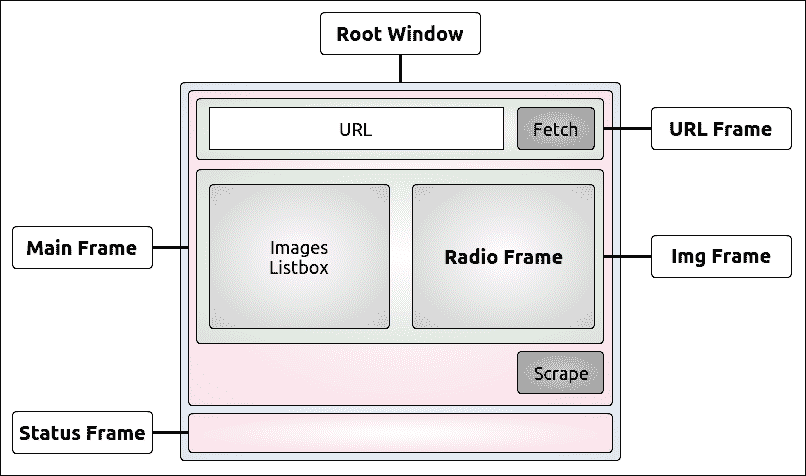
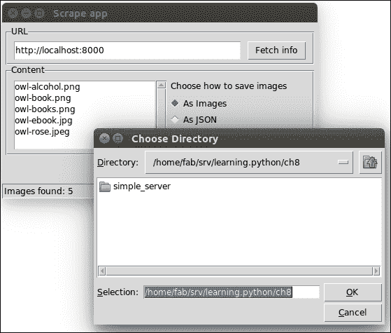
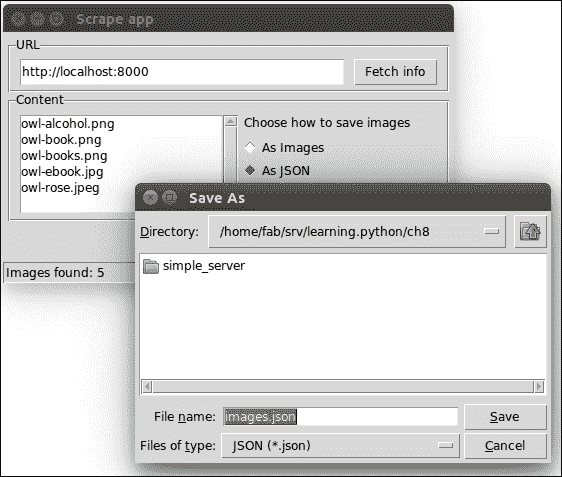
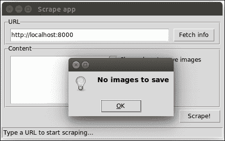

# 第八章。边缘 – GUI 和脚本

|   | *"用户界面就像一个笑话。如果你不得不解释它，那就不是很好。" |   |
| --- | --- | --- |
|   | --*马丁·勒布兰* |

在本章中，我们将一起完成一个项目。我们将准备一个非常简单的 HTML 页面，其中包含一些图片，然后我们将爬取它，以便保存这些图片。

我们将编写一个脚本来完成这项工作，这将使我们能够讨论一些我想向您介绍的概念。我们还将添加一些选项，根据图片的格式保存图片，并选择保存的方式。完成脚本后，我们将编写一个 GUI 应用程序，它基本上做同样的事情，一石二鸟。只有一个项目来解释将使我能够在本章中展示更广泛的主题。

### 注意

**图形用户界面**（**GUI**）是一种允许用户通过图形图标、按钮和小部件与电子设备交互的界面，与基于文本或命令行界面相反，后者需要在键盘上输入命令或文本。简而言之，任何浏览器、任何办公套件如 LibreOffice，以及您点击图标时弹出的任何东西，都是一个 GUI 应用程序。

因此，如果您还没有这样做，现在开始一个控制台并将自己定位在项目根目录下的一个名为`ch8`的文件夹中，这将是一个完美的时机。在那个文件夹中，我们将创建两个 Python 模块（`scrape.py`和`guiscrape.py`）和一个标准文件夹（`simple_server`）。在`simple_server`中，我们将编写我们的 HTML 页面（`index.html`），图片将存储在`ch8/simple_server/img`。`ch8`中的结构应该如下所示：

```py
$ tree -A
.
├── guiscrape.py
├── scrape.py
└── simple_server
 ├── img
 │   ├── owl-alcohol.png
 │   ├── owl-book.png
 │   ├── owl-books.png
 │   ├── owl-ebook.jpg
 │   └── owl-rose.jpeg
 ├── index.html
 └── serve.sh

```

如果您使用 Linux 或 Mac，您可以像我所做的那样，将启动 HTTP 服务器的代码放入一个`serve.sh`文件中。在 Windows 上，您可能想使用批处理文件。

我们将要爬取的 HTML 页面具有以下结构：

`simple_server/index.html`

```py
<!DOCTYPE html>
<html lang="en">
  <head><title>Cool Owls!</title></head>
  <body>
    <h1>Welcome to my owl gallery</h1>
    <div>
      " height="128" />
      " height="128" />
      " height="128" />
      " height="128" />
      " height="128" />
    </div>
    <p>Do you like my owls?</p>
  </body>
</html>
```

它是一个非常简单的页面，所以我们只需注意我们有五张图片，其中三张是 PNG 格式，两张是 JPG 格式（注意，尽管它们都是 JPG 格式，一个以`.jpg`结尾，另一个以`.jpeg`结尾，这两种都是该格式的有效扩展名）。

因此，Python 免费提供了一个非常简单的 HTTP 服务器，您可以使用以下命令启动（在`simple_server`文件夹中）：

```py
$ python -m http.server 8000
Serving HTTP on 0.0.0.0 port 8000 ...
127.0.0.1 - - [31/Aug/2015 16:11:10] "GET / HTTP/1.1" 200 -

```

最后一行是您访问`http://localhost:8000`时得到的日志，我们的美丽页面将在这里提供服务。或者，您可以将该命令放入一个名为`serve.sh`的文件中，然后使用以下命令运行它（确保它是可执行的）：

```py
$ ./serve.sh

```

它将产生相同的效果。如果您有这本书的代码，您的页面应该看起来像这样：



您可以自由地使用任何其他图像集，只要您至少使用一个 PNG 和一个 JPG，并且在`src`标签中使用相对路径，而不是绝对路径。我得到了那些可爱的猫头鹰来自[`openclipart.org/`](https://openclipart.org/)。

# 第一种方法 – 脚本

现在，让我们开始编写脚本。我将分三步进行源代码的审查：首先是导入，然后是参数解析逻辑，最后是业务逻辑。

## 导入

`scrape.py (导入)`

```py
import argparse
import base64
import json
import os
from bs4 import BeautifulSoup
import requests
```

从顶部开始查看，我们可以看到我们需要解析参数，这些参数将被提供给脚本本身（`argparse`）。我们需要`base64`库来在 JSON 文件中保存图像（`base64`和`json`），我们还需要打开文件进行写入（`os`）。最后，我们需要`BeautifulSoup`来轻松抓取网页，以及`requests`来获取其内容。`requests`是一个执行 HTTP 请求的极其流行的库，它基于快速的第三方库`urllib3`。

### 注意

我们将在第十章 Web Development Done Right 中探索 HTTP 协议和`requests`机制，因此，现在我们只需（简单地）说，我们执行一个 HTTP 请求来获取网页内容。我们可以使用像`requests`这样的库来程序化地完成它，这大致相当于在浏览器中输入一个 URL 并按*Enter*键（浏览器随后获取网页内容并显示给您）。

在所有这些导入中，只有最后两个不属于 Python 标准库，但它们在全球范围内被广泛使用，我不敢在这本书中排除它们。请确保您已安装它们：

```py
$ pip freeze | egrep -i "soup|requests"
beautifulsoup4==4.4.0
requests==2.7.0

```

当然，版本号可能对您来说有所不同。如果它们尚未安装，请使用以下命令进行安装：

```py
$ pip install beautifulsoup4 requests

```

到目前为止，我认为可能让您感到困惑的唯一事情是`base64/json`这对，因此请允许我花几句话来解释这一点。

正如我们在上一章中看到的，JSON 是应用程序之间数据交换最流行的格式之一。它也被广泛用于其他目的，例如，在文件中保存数据。在我们的脚本中，我们将为用户提供保存图像为图像文件或 JSON 单个文件的能力。在 JSON 中，我们将放置一个字典，键为图像名称，值为内容。唯一的问题是，以二进制格式保存图像有点棘手，这就是`base64`库发挥作用的地方。**Base64**是一种非常流行的二进制到文本编码方案，通过将其转换为基数 64 表示来以 ASCII 字符串格式表示二进制数据。

### 注意

**radix-64**表示法使用字母*A*-*Z*、*a*-*z*和数字*0*-*9*，以及两个符号*+*和*/*，总共 64 个符号。因此，不出所料，Base64 字母表由这 64 个符号组成。

如果你认为你从未使用过它，那么再想想。每次你发送带有图片的电子邮件时，图片在发送邮件之前都会被 Base64 编码。在接收方，图片会自动解码成原始的二进制格式，以便电子邮件客户端可以显示它们。

## 解析参数

现在技术细节已经解决，让我们看看脚本的第二部分（它应该在`scrape.py`模块的末尾）。

`scrape.py (参数解析和抓取触发器)`

```py
if __name__ == "__main__":
    parser = argparse.ArgumentParser(
        description='Scrape a webpage.')
    parser.add_argument(
        '-t',
        '--type',
        choices=['all', 'png', 'jpg'],
        default='all',
        help='The image type we want to scrape.')
    parser.add_argument(
        '-f',
        '--format',
        choices=['img', 'json'],
        default='img',
        help='The format images are saved to.')
    parser.add_argument(
        'url',
        help='The URL we want to scrape for images.')
    args = parser.parse_args()
    scrape(args.url, args.format, args.type)
```

看看第一行；当涉及到脚本编写时，这是一个非常常见的习语。根据官方 Python 文档，字符串`'__main__'`是顶级代码执行的命名空间的名字。当从标准输入、脚本或交互式提示符读取模块时，模块的`__name__`会被设置为`'__main__'`。

因此，如果你将执行逻辑放在那个`if`下面，结果是你可以将模块作为库使用，如果你需要导入其中定义的任何函数或对象，因为当你从另一个模块导入它时，`__name__`不会是`'__main__'`。另一方面，当你直接运行脚本，就像我们即将要做的那样，`__name__`将是`'__main__'`，所以执行逻辑将会运行。

我们首先做的事情是定义我们的解析器。我建议使用标准库模块`argparse`，它足够简单且功能强大。还有其他选择，但在这个情况下，`argparse`将为我们提供所有需要的东西。

我们希望向我们的脚本提供三种不同的数据：我们想要保存的图像类型、我们想要保存它们的格式以及要抓取的页面的 URL。

类型可以是 PNG、JPG 或两者（默认），而格式可以是图像或 JSON，图像是默认格式。URL 是唯一的必填参数。

因此，我们添加了`-t`选项，也允许长版本`--type`。选项有`'all'`、`'png'`和`'jpg'`。我们将默认值设置为`'all'`并添加了帮助信息。

我们对`format`参数执行类似的操作，允许使用简短和长格式（`-f`和`--format`），最后我们添加了`url`参数，这是唯一一个指定方式不同的参数，因此它不会被当作选项处理，而是作为一个位置参数。

为了解析所有参数，我们只需要`parser.parse_args()`。非常简单，不是吗？

最后一行是我们触发实际逻辑的地方，通过调用`scrape`函数，传递我们刚刚解析的所有参数。我们很快就会看到它的定义。

`argparse`的好处是，如果你通过传递`-h`来调用脚本，它会自动为你打印出漂亮的**使用文本**。让我们试试：

```py
$ python scrape.py -h
usage: scrape.py [-h] [-t {all,png,jpg}] [-f {img,json}] url

```

```py
Scrape a webpage.

positional arguments:
 url                   The URL we want to scrape for images.

optional arguments:
 -h, --help            show this help message and exit
 -t {all,png,jpg}, --type {all,png,jpg}
 The image type we want to scrape.
 -f {img,json}, --format {img,json}
 The format images are saved to.

```

如果你仔细想想，这个真正的优势就是我们只需要指定参数，我们不必担心使用文本，这意味着我们不必每次更改时都将其与参数定义保持同步。这是宝贵的。

这里有一些调用我们的`scrape.py`脚本的不同方法，展示了`type`和`format`是可选的，以及如何使用简短和长语法来使用它们：

```py
$ python scrape.py http://localhost:8000
$ python scrape.py -t png http://localhost:8000
$ python scrape.py --type=jpg -f json http://localhost:8000

```

第一个使用`type`和`format`的默认值。第二个只会保存 PNG 图像，而第三个只会保存 JPG，但以 JSON 格式保存。

## 业务逻辑

现在我们已经看到了脚手架，让我们深入到实际的逻辑中（如果看起来令人生畏，不要担心；我们会一起走过）。在脚本中，这个逻辑位于导入之后和解析之前（在`if __name__`子句之前）：

`scrape.py (业务逻辑)`

```py
def scrape(url, format_, type_):
    try:
        page = requests.get(url)
    except requests.RequestException as rex:
        print(str(rex))
    else:
        soup = BeautifulSoup(page.content, 'html.parser')
        images = _fetch_images(soup, url)
        images = _filter_images(images, type_)
        _save(images, format_)

def _fetch_images(soup, base_url):
    images = []
    for img in soup.findAll('img'):
        src = img.get('src')
        img_url = (
            '{base_url}/{src}'.format(
                base_url=base_url, src=src))
        name = img_url.split('/')[-1]
        images.append(dict(name=name, url=img_url))
    return images

def _filter_images(images, type_):
    if type_ == 'all':
        return images
    ext_map = {
        'png': ['.png'],
        'jpg': ['.jpg', '.jpeg'],
    }
    return [
        img for img in images
        if _matches_extension(img['name'], ext_map[type_])
    ]

def _matches_extension(filename, extension_list):
    name, extension = os.path.splitext(filename.lower())
    return extension in extension_list

def _save(images, format_):
    if images:
        if format_ == 'img':
            _save_images(images)
        else:
            _save_json(images)
        print('Done')
    else:
        print('No images to save.')

def _save_images(images):
    for img in images:
        img_data = requests.get(img['url']).content
        with open(img['name'], 'wb') as f:
            f.write(img_data)

def _save_json(images):
    data = {}
    for img in images:
        img_data = requests.get(img['url']).content
        b64_img_data = base64.b64encode(img_data)
        str_img_data = b64_img_data.decode('utf-8')
        data[img['name']] = str_img_data

    with open('images.json', 'w') as ijson:
        ijson.write(json.dumps(data))
```

让我们从`scrape`函数开始。它首先做的事情是获取给定的`url`参数指定的页面。在这个过程中可能发生的任何错误，我们都会在`RequestException rex`中捕获它并打印出来。`RequestException`是`requests`库中所有异常的基类。

然而，如果一切顺利，并且我们从`GET`请求中得到了一个页面，那么我们可以继续（`else`分支）并将其内容传递给`BeautifulSoup`解析器。`BeautifulSoup`库允许我们快速解析网页，而无需编写所有用于在页面中找到所有图像的逻辑，我们真的不想这样做。这并不像看起来那么简单，重新发明轮子从来都不是一个好的选择。为了获取图像，我们使用`_fetch_images`函数，并通过`_filter_images`过滤它们。最后，我们使用结果调用`_save`。

将代码拆分成具有意义名称的不同函数，使我们更容易阅读。即使你没有看到`_fetch_images`、`_filter_images`和`_save`函数的逻辑，也不难预测它们的作用，对吧？

`_fetch_images`函数接受一个`BeautifulSoup`对象和一个基础 URL。它所做的一切就是遍历页面上找到的所有图像，并在字典中填充它们的`'name'`和`'url'`信息（每个图像一个字典）。所有字典都添加到`images`列表中，并在最后返回。

当我们获取图像名称时，有一些技巧在起作用。我们做的是使用`'/'`作为分隔符拆分`img_url`（`http://localhost:8000/img/my_image_name.png`）字符串，并取最后一个项目作为图像名称。有一种更健壮的方法来做这件事，但在这个例子中可能会有些过度。如果你想看到每个步骤的细节，试着将这个逻辑分解成更小的步骤，并打印出每个步骤的结果来帮助自己理解。

在书的结尾，我会向你展示另一种更高效地调试的技术。

无论如何，只需在`_fetch_images`函数的末尾添加`print(images)`，我们就能得到这个结果：

```py
[{'url': 'http://localhost:8000/img/owl-alcohol.png', 'name': 'owl-alcohol.png'}, {'url': 'http://localhost:8000/img/owl-book.png', 'name': 'owl-book.png'}, ...]

```

我为了简洁起见截断了结果。你可以看到每个字典都有一个 `'url'` 和 `'name'` 键/值对，我们可以使用它来获取、识别并按我们的喜好保存图像。在这个时候，我听到你在问，如果页面上的图像使用绝对路径而不是相对路径指定会发生什么，对吧？好问题！

答案是，脚本将无法下载它们，因为这种逻辑期望相对路径。我正准备添加一些逻辑来解决这个问题时，我想这个阶段，这对你来说将是一个很好的练习，所以我会把它留给你来修复。

### 小贴士

提示：检查那个 `src` 变量的开头。如果它以 `'http'` 开头，那么它可能是一个绝对路径。

我希望 `_filter_images` 函数的主体对你来说很有趣。我想向你展示如何通过使用映射技术来检查多个扩展名。

在这个函数中，如果 `type_` 是 `'all'`，则不需要过滤，所以我们只需返回所有图像。另一方面，当 `type_` 不是 `'all'` 时，我们从 `ext_map` 字典中获取允许的扩展名，并使用它来过滤函数体末尾的列表推导式中的图像。你可以看到，通过使用另一个辅助函数 `_matches_extension`，我已经使列表推导式更简单、更易读。

`_matches_extension` 函数所做的只是将图像名称与其扩展名分开，并检查它是否在允许的列表中。你能找到对这个函数进行（从速度方面）微优化的方法吗？

我确信你一定在想，为什么我把所有图像收集到列表中然后再删除，而不是在将它们添加到列表之前检查我是否想要保存它们。第一个原因是，我需要现在的 GUI 应用程序中的 `_fetch_images`。第二个原因是，组合、获取和过滤会产生一个更长且稍微复杂一些的函数，而我正在尝试保持复杂性水平。第三个原因是，这可能是一个很好的练习给你做。感觉我们像是在结对编程...

让我们继续查看代码，并检查 `_save` 函数。你可以看到，当 `images` 不为空时，它基本上充当一个分发器。我们根据 `format_` 变量中存储的信息，要么调用 `_save_images`，要么调用 `_save_json`。

我们几乎完成了。让我们跳转到 `_save_images`。我们遍历 `images` 列表，并对每个找到的字典执行对图像 URL 的 `GET` 请求，并将内容保存到文件中，我们将其命名为图像本身。这里需要注意的一个重要问题是文件是如何保存的。

我们使用**上下文管理器**，通过关键字`with`来执行这个操作。Python 的`with`语句支持由上下文管理器定义的运行时上下文的概念。这是通过一对方法（`contextmanager.__enter__()`和`contextmanager.__exit__(exc_type, exc_val, exc_tb)`）实现的，允许用户定义的类定义一个在语句体执行之前进入并在语句结束时退出的运行时上下文。

在我们的情况下，使用上下文管理器，结合 open 函数，确保如果在写入文件时发生任何错误，涉及该过程的资源将被清理并正确释放，无论错误如何。你有没有尝试在 Windows 上删除一个文件，结果弹出一个警告告诉你，你不能删除该文件，因为另一个进程正在占用它？我们正在避免这种非常讨厌的事情。

当我们打开一个文件时，我们会得到一个处理它的句柄，无论发生什么情况，我们都想确保在完成文件操作后释放它。上下文管理器是我们确保这一点的工具。

最后，让我们现在进入`_save_json`函数。它与之前的函数非常相似。我们基本上填写`data`字典。图像名称是*键*，其二进制内容的 Base64 表示是*值*。当我们完成字典的填充后，我们使用`json`库将其写入`images.json`文件。我将给你一个小的预览：

`images.json (截断)`

```py
{
 "owl-ebook.jpg": "/9j/4AAQSkZJRgABAQEAMQAxAAD/2wBDAAEBAQ...
 "owl-book.png": "iVBORw0KGgoAAAANSUhEUgAAASwAAAEbCAYAAAB...
 "owl-books.png": "iVBORw0KGgoAAAANSUhEUgAAASwAAAElCAYAAA...
 "owl-alcohol.png": "iVBORw0KGgoAAAANSUhEUgAAASwAAAEICAYA...
 "owl-rose.jpeg": "/9j/4AAQSkZJRgABAQEANAA0AAD/2wBDAAEBAQ...
}

```

就这样！现在，在进入下一节之前，请确保你玩转这个脚本，并很好地理解它是如何工作的。尝试修改一些内容，打印出中间结果，添加新的参数或功能，或者打乱逻辑。我们现在将把它迁移到一个 GUI 应用程序中，这将增加一层复杂性，仅仅因为我们需要构建 GUI 界面，所以你熟悉业务逻辑是很重要的：这将允许你专注于代码的其他部分。

# 第二种方法——GUI 应用程序

在 Python 中编写 GUI 应用程序有几个库。最著名的是**tkinter**、**wxPython**、**PyGTK**和**PyQt**。它们都提供了一系列的工具和控件，你可以使用它们来构建 GUI 应用程序。

我将在本章剩余部分使用的工具是 tkinter。**tkinter**代表**Tk 界面**，它是 Tk GUI 工具包的标准 Python 接口。Tk 和 tkinter 在大多数 Unix 平台、Mac OS X 以及 Windows 系统上都是可用的。

让我们通过运行以下命令来确保`tkinter`在你的系统上安装正确：

```py
$ python -m tkinter

```

它应该打开一个对话框，展示一个简单的`Tk`界面。如果你能看到它，那么我们就没问题了。然而，如果它不起作用，请在 Python 官方文档中搜索`tkinter`。你将找到几个链接到资源，这些资源将帮助你开始使用它。

我们将制作一个非常简单的 GUI 应用程序，它基本上模仿了我们在本章第一部分看到的脚本的行为。我们不会添加保存 JPG 或 PNG 图片的功能，但当你完成本章后，你应该能够自己玩弄代码并添加这个功能。

因此，这是我们追求的目标：



美丽，不是吗？正如你所见，它是一个非常简单的界面（这就是它在 Ubuntu 上应该看起来样子）。有一个用于**URL**字段和**获取信息**按钮的框架（即容器），另一个用于**列表框**以存放图片名称和单选按钮以控制我们保存图片的方式的框架，最后在底部有一个**抓取！**按钮。我们还有一个状态栏，它显示一些信息。

为了得到这个布局，我们本可以将所有小部件都放在根窗口上，但这样会使布局逻辑变得相当混乱且不必要地复杂。因此，我们将使用框架来划分空间，并将小部件放置在这些框架中。这样我们就能得到一个更好的结果。所以，这是布局的草案：



我们有一个**根窗口**，它是应用程序的主窗口。我们将其分为两行，第一行放置**主框架**，第二行放置**状态框架**（它将包含状态栏）。**主框架**随后本身也分为三行。在第一行中，我们放置**URL 框架**，它包含**URL**小部件。在第二行中，我们放置**图片框架**，它将包含**列表框**和**单选框架**，后者将托管标签和单选按钮小部件。最后是第三行，它将仅包含**抓取**按钮。

为了布局框架和小部件，我们将使用一个名为*grid*的布局管理器，它简单地像矩阵一样将空间划分为行和列。

现在，我将要写的所有代码都来自`guiscrape.py`模块，所以为了节省空间，我不会在每个代码片段中重复其名称。该模块逻辑上分为三个部分，与脚本版本类似：导入、布局逻辑和业务逻辑。我们将逐行分析它们，分为三个部分。

## 导入

```py
from tkinter import *
from tkinter import ttk, filedialog, messagebox
import base64
import json
import os
from bs4 import BeautifulSoup
import requests
```

我们已经熟悉了其中大部分。这里有趣的部分是前两行。第一行是一种相当常见的做法，尽管在 Python 中使用*星号语法*导入是坏做法。你可能会遇到名称冲突，如果模块太大，导入所有内容将会很昂贵。

之后，我们明确地导入 `ttk`、`filedialog` 和 `messagebox`，遵循这个库中使用的传统方法。`ttk` 是一组新的样式小部件。它们的行为基本上与旧的一样，但能够根据操作系统设置的样式正确地绘制自己，这是很棒的。

其余的导入是我们执行你现在所熟知的任务所需的。请注意，在这个第二部分中，我们不需要使用 `pip` 安装任何东西，我们已经有了一切所需。

## 布局逻辑

我将分块粘贴，这样我可以更容易地向你解释。你会看到我们在布局草案中讨论的所有这些部分是如何排列和粘合在一起的。我们即将粘贴的是 `guiscrape.py` 模块的最后一部分。我们将中间部分，即业务逻辑，留到最后。

```py
if __name__ == "__main__":
    _root = Tk()
    _root.title('Scrape app')
```

如你所知，我们只想在模块直接运行时执行逻辑，所以第一行不应该让你感到惊讶。

在最后两行中，我们设置了主窗口，它是一个 `Tk` 类的实例。我们实例化它并给它一个标题。请注意，我使用前置下划线技术为所有 `tkinter` 对象的名称，以避免与业务逻辑中的名称发生冲突。我只是觉得这样更整洁，但你可以有不同的看法。

```py
    _mainframe = ttk.Frame(_root, padding='5 5 5 5')
    _mainframe.grid(row=0, column=0, sticky=(E, W, N, S))
```

在这里，我们设置了 **主框架**。它是一个 `ttk.Frame` 实例。我们将 `_root` 设置为其父对象，并给它一些填充。`填充` 是指在内部内容和边框之间插入多少像素的空间，以便让我们的布局呼吸一下，否则我们会得到 *沙丁鱼效应*，其中小部件被紧密地打包在一起。

第二行更有趣。我们将这个 `_mainframe` 放置在父对象 `_root` 的第一行（`0`）和第一列（`0`）。我们还说这个框架需要通过使用 `sticky` 参数向所有四个方向扩展自己。如果你想知道它们从哪里来，那就是 `from tkinter import *` 魔法将它们带到我们这里。

```py
    _url_frame = ttk.LabelFrame(
        _mainframe, text='URL', padding='5 5 5 5')
    _url_frame.grid(row=0, column=0, sticky=(E, W))
    _url_frame.columnconfigure(0, weight=1)
    _url_frame.rowconfigure(0, weight=1)
```

接下来，我们首先放置 **URL 框架**。这次，父对象是 `_mainframe`，正如你从我们的草案中回忆的那样。这不仅仅是一个简单的 `Frame`，而实际上是一个 `LabelFrame`，这意味着我们可以设置文本参数，并期望围绕它绘制一个矩形，文本参数的内容将写在它的左上角（如果需要，可以查看之前的图片）。我们将这个框架放置在 (0, 0) 位置，并说它应该向左和向右扩展。我们不需要其他两个方向。

最后，我们使用 `rowconfigure` 和 `columnconfigure` 来确保它能够正确地调整大小，如果需要的话。在我们当前的布局中，这只是一个形式。

```py
    _url = StringVar()
    _url.set('http://localhost:8000')
    _url_entry = ttk.Entry(
        _url_frame, width=40, textvariable=_url)
    _url_entry.grid(row=0, column=0, sticky=(E, W, S, N), padx=5)
    _fetch_btn = ttk.Button(
        _url_frame, text='Fetch info', command=fetch_url)
    _fetch_btn.grid(row=0, column=1, sticky=W, padx=5)
```

在这里，我们有代码来布局 URL 文本框和`_fetch`按钮。在这个环境中，文本框被称为`Entry`。我们像往常一样实例化它，将其父级设置为`_url_frame`，并给它设置一个宽度。而且，这是最有趣的部分，我们将`textvariable`参数设置为`_url`。`_url`是一个`StringVar`对象，它现在连接到`Entry`，并将用于操作其内容。因此，我们不是直接修改`_url_entry`实例中的文本，而是通过访问`_url`来修改。在这种情况下，我们调用它的`set`方法来设置初始值为我们本地网页的 URL。

我们将`_url_entry`定位在(0, 0)，使其四个正方向都粘附，并且我们还通过使用`padx`在左右边缘设置了一些额外的填充，这会在 x 轴（水平方向）上添加填充。另一方面，`pady`负责垂直方向。

到目前为止，你应该明白，每次你在一个对象上调用`.grid`方法时，我们基本上是在告诉网格布局管理器根据我们在`grid()`调用中指定的参数规则将该对象放置在某个位置。

类似地，我们设置并放置了`_fetch`按钮。唯一有趣的参数是`command=fetch_url`。这意味着当我们点击这个按钮时，我们实际上调用的是`fetch_url`函数。这种技术被称为**回调**。

```py
    _img_frame = ttk.LabelFrame(
        _mainframe, text='Content', padding='9 0 0 0')
    _img_frame.grid(row=1, column=0, sticky=(N, S, E, W))
```

这就是我们所说的**Img Frame**在布局草案中的样子。它放置在其父级`_mainframe`的第二行。它将包含`Listbox`和**Radio Frame**。

```py
    _images = StringVar()
    _img_listbox = Listbox(
        _img_frame, listvariable=_images, height=6, width=25)
    _img_listbox.grid(row=0, column=0, sticky=(E, W), pady=5)
    _scrollbar = ttk.Scrollbar(
        _img_frame, orient=VERTICAL, command=_img_listbox.yview)
    _scrollbar.grid(row=0, column=1, sticky=(S, N), pady=6)
    _img_listbox.configure(yscrollcommand=_scrollbar.set)
```

这可能是整个布局逻辑中最有趣的部分。正如我们处理`_url_entry`一样，我们需要通过将其绑定到变量`_images`来驱动`Listbox`的内容。我们设置了`Listbox`，使其父级为`_img_frame`，并绑定到变量`_images`。我们还传递了一些尺寸。

最有趣的部分来自于`_scrollbar`实例。请注意，当我们实例化它时，我们将其命令设置为`_img_listbox.yview`。这是`Listbox`和`Scrollbar`之间合同的第一部分。另一部分是由`_img_listbox.configure`方法提供的，它设置了`yscrollcommand=_scrollbar.set`。

通过提供这种相互关联的绑定，当我们滚动`Listbox`时，`Scrollbar`会相应地移动，反之亦然，当我们操作`Scrollbar`时，`Listbox`会相应地滚动。

```py
    _radio_frame = ttk.Frame(_img_frame)
    _radio_frame.grid(row=0, column=2, sticky=(N, S, W, E))
```

我们放置**Radio Frame**，准备填充。请注意，`Listbox`占据了`_img_frame`上的(0, 0)，`Scrollbar`在(0, 1)，因此`_radio_frame`将放在(0, 2)。

```py
    _choice_lbl = ttk.Label(
        _radio_frame, text="Choose how to save images")
    _choice_lbl.grid(row=0, column=0, padx=5, pady=5)
    _save_method = StringVar()
    _save_method.set('img')
    _img_only_radio = ttk.Radiobutton(
        _radio_frame, text='As Images', variable=_save_method,
        value='img')
    _img_only_radio.grid(
        row=1, column=0, padx=5, pady=2, sticky=W)
    _img_only_radio.configure(state='normal')
    _json_radio = ttk.Radiobutton(
        _radio_frame, text='As JSON', variable=_save_method,
        value='json')
    _json_radio.grid(row=2, column=0, padx=5, pady=2, sticky=W)
```

首先，我们放置标签，并给它一些填充。请注意，标签和单选按钮是`_radio_frame`的子项。

至于`Entry`和`Listbox`对象，`Radiobutton`也是通过一个与外部变量`_save_method`的绑定来驱动的。每个`Radiobutton`实例设置一个值参数，通过检查`_save_method`上的值，我们知道哪个按钮被选中。

```py
    _scrape_btn = ttk.Button(
        _mainframe, text='Scrape!', command=save)
    _scrape_btn.grid(row=2, column=0, sticky=E, pady=5)
```

在`_mainframe`的第三行，我们放置了**Scrape**按钮。它的`command`是`save`，在我们成功解析网页后，它将保存要列在`Listbox`中的图片。

```py
    _status_frame = ttk.Frame(
        _root, relief='sunken', padding='2 2 2 2')
    _status_frame.grid(row=1, column=0, sticky=(E, W, S))
    _status_msg = StringVar()
    _status_msg.set('Type a URL to start scraping...')
    _status = ttk.Label(
        _status_frame, textvariable=_status_msg, anchor=W)
    _status.grid(row=0, column=0, sticky=(E, W))
```

我们通过放置一个简单的`ttk.Frame`来结束布局部分，这个`ttk.Frame`就是状态框架。为了给它一点状态栏的效果，我们将它的`relief`属性设置为`'sunken'`，并给它 2 像素的均匀填充。它需要粘附在`_root`窗口的左、右和底部部分，因此我们将它的`sticky`属性设置为`(E, W, S)`。

然后，我们在其中放置一个标签，这次我们将其与一个`StringVar`对象关联起来，因为我们每次想要更新状态栏文本时都需要修改它。你现在应该已经熟悉这种技术了。

最后，在最后一行，我们通过在`Tk`实例上调用`mainloop`方法来运行应用程序。

```py
 _root.mainloop()

```

请记住，所有这些说明都放在原始脚本中的`if __name__ == "__main__":`子句下。

如你所见，设计我们的 GUI 应用程序的代码并不难。当然，一开始你可能需要稍微尝试一下。并不是所有的事情都会在第一次尝试时就完美无缺，但我向你保证这非常简单，你可以在网上找到很多教程。现在让我们进入有趣的环节，业务逻辑。

## 业务逻辑

我们将分三部分分析 GUI 应用程序的业务逻辑。这里有获取逻辑、保存逻辑和警报逻辑。

### 获取网页

```py
config = {}

def fetch_url():
    url = _url.get()
    config['images'] = []
    _images.set(())   # initialized as an empty tuple
    try:
        page = requests.get(url)
    except requests.RequestException as rex:
        _sb(str(rex))
    else:
        soup = BeautifulSoup(page.content, 'html.parser')
        images = fetch_images(soup, url)
        if images:
            _images.set(tuple(img['name'] for img in images))
            _sb('Images found: {}'.format(len(images)))
        else:
            _sb('No images found')
        config['images'] = images

def fetch_images(soup, base_url):
    images = []
    for img in soup.findAll('img'):
        src = img.get('src')
        img_url = (
            '{base_url}/{src}'.format(base_url=base_url, src=src))
        name = img_url.split('/')[-1]
        images.append(dict(name=name, url=img_url))
    return images
```

首先，让我解释一下这个`config`字典。我们需要一种方法在 GUI 应用程序和业务逻辑之间传递数据。现在，而不是用许多不同的变量污染全局命名空间，我个人的偏好是有一个单一的字典，它包含我们需要的所有需要传递和接收的对象，这样全局命名空间就不会被所有这些名称堵塞，我们有一个单一、干净、简单的方法知道所有我们应用程序需要用到的对象在哪里。

在这个简单的例子中，我们只是用我们从页面获取的图片填充`config`字典，但我想要展示这个技术，这样你至少有一个例子。这个技术来源于我的 JavaScript 经验。当你编写一个网页时，你经常导入几个不同的库。如果每个库都把各种变量弄乱全局命名空间，那么由于名称冲突和变量覆盖，将会有严重的问题，因为所有的事情都无法正常工作。它们让程序员的生活变得非常痛苦。

因此，最好尝试并尽可能保持全局命名空间尽可能干净。在这种情况下，我发现使用一个`config`变量是完全可以接受的。

`fetch_url`函数与我们在脚本中做的非常相似。首先，我们通过调用`_url.get()`获取`url`值。记住，`_url`对象是一个与`_url_entry`对象（一个`Entry`）相关联的`StringVar`实例。你看到的 GUI 中的文本字段是`Entry`，但幕后是`StringVar`对象的值。

通过在`_url`上调用`get()`，我们获取显示在`_url_entry`中的文本值。

下一步是将`config['images']`准备为一个空列表，并清空`_images`变量，该变量与`_img_listbox`相关联。当然，这会清除`_img_listbox`中的所有项目。

在这个准备步骤之后，我们可以尝试使用我们在本章开头脚本中采用的相同`try/except`逻辑来获取页面。

唯一的不同之处在于，如果出现问题，我们调用`_sb(str(rex))`。`_sb`是一个辅助函数，我们很快就会看到它的代码。基本上，它为我们设置状态栏的文本。名字不太好，对吧？我不得不向你解释它的行为：供你思考。

如果我们可以获取页面，那么我们创建`soup`实例，并从中获取图片。`fetch_images`的逻辑与之前解释的完全相同，所以这里不再重复。

如果我们有图片，使用一个快速的元组推导（实际上是一个传递给元组构造函数的生成器表达式）我们向`_images` `StringVar`提供数据，这会将所有图片名称填充到我们的`_img_listbox`中。最后，我们更新状态栏。

如果没有图片，我们仍然更新状态栏，并且在函数的末尾，无论找到多少图片，我们都更新`config['images']`以持有图片列表。这样，我们可以通过检查`config['images']`来访问其他函数中的图片，而无需传递该列表。

### 保存图片

保存图片的逻辑非常直接。如下所示：

```py
def save():
    if not config.get('images'):
        _alert('No images to save')
        return

    if _save_method.get() == 'img':
        dirname = filedialog.askdirectory(mustexist=True)
        _save_images(dirname)
    else:
        filename = filedialog.asksaveasfilename(
            initialfile='images.json',
            filetypes=[('JSON', '.json')])
        _save_json(filename)

def _save_images(dirname):
    if dirname and config.get('images'):
        for img in config['images']:
            img_data = requests.get(img['url']).content
            filename = os.path.join(dirname, img['name'])
            with open(filename, 'wb') as f:
                f.write(img_data)
        _alert('Done')

def _save_json(filename):
    if filename and config.get('images'):
        data = {}
        for img in config['images']:
            img_data = requests.get(img['url']).content
            b64_img_data = base64.b64encode(img_data)
            str_img_data = b64_img_data.decode('utf-8')
            data[img['name']] = str_img_data

        with open(filename, 'w') as ijson:
            ijson.write(json.dumps(data))
        _alert('Done')
```

当用户点击**抓取**按钮时，使用回调机制调用`save`函数。

这个函数首先检查是否真的有要保存的图片。如果没有，它使用另一个辅助函数`_alert`提醒用户，我们很快就会看到这个函数的代码。如果没有图片，则不执行任何进一步的操作。

另一方面，如果`config['images']`列表不为空，`save`作为调度器，根据`_same_method`持有的值调用`_save_images`或`_save_json`。记住，这个变量与单选按钮相关联，因此我们期望它的值是`'img'`或`'json'`。

这个调度器与脚本中的调度器略有不同。根据我们选择的方法，必须采取不同的操作。

如果我们想要将图片保存为图片，我们需要让用户选择一个目录。我们通过调用`filedialog.askdirectory`并分配调用结果到变量`dirname`来实现这一点。这打开了一个漂亮的对话框，要求我们选择一个目录。我们选择的目录必须存在，因为我们调用方法的方式指定了这一点。这样做是为了我们不必编写处理保存文件时可能缺失目录的代码。

下面是在 Ubuntu 上这个对话框应该看起来是怎样的：



如果我们取消操作，`dirname`将被设置为`None`。

在完成`save`中的逻辑分析之前，让我们快速浏览一下`_save_images`。

它与脚本中的版本非常相似，只需注意，在开始时，为了确保我们确实有事情要做，我们检查了`dirname`和`config['images']`中至少有一个图片的存在。

如果是这样，这意味着我们至少有一个图片需要保存及其路径，因此我们可以继续。保存图片的逻辑已经解释过了。这次我们唯一不同的地方是使用`os.path.join`将目录（即完整路径）与图片名称连接起来。在`os.path`模块中有很多有用的方法可以用来处理路径和文件名。

在`_save_images`的末尾，如果我们至少保存了一个图片，我们将通知用户我们已经完成了。

现在让我们回到`save`函数中的另一个分支。当用户在按下**Scrape**按钮之前选择**As JSON**单选按钮时，这个分支会被执行。在这种情况下，我们想要保存一个文件；因此，我们不仅需要请求一个目录。我们希望用户能够选择一个文件名。因此，我们启动了一个不同的对话框：`filedialog.asksaveasfilename`。

我们传递一个初始文件名，这个文件名被建议给用户，如果他们不喜欢，可以更改它。此外，因为我们正在保存 JSON 文件，所以我们通过传递`filetypes`参数强制用户使用正确的扩展名。它是一个包含任意数量 2 元组的列表*(描述，扩展名)*，该列表运行对话框的逻辑。

下面是在 Ubuntu 上这个对话框应该看起来是怎样的：



一旦我们选择了位置和文件名，我们就可以继续保存逻辑，这与之前的脚本中的逻辑相同。我们从一个 Python 字典(`data`)创建一个 JSON 对象，并用`images`的名称和 Base64 编码的内容创建键/值对。

在`_save_json`中，我们也在开始时进行了一个小检查，确保我们只有在有文件名和至少一个要保存的图片时才继续。

这确保了如果用户按下**取消**按钮，不会发生任何坏事。

### 通知用户

最后，让我们看看通知逻辑。它非常简单。

```py
def _sb(msg):
    _status_msg.set(msg)

def _alert(msg):
    messagebox.showinfo(message=msg)
```

就这样！要更改状态栏消息，我们只需要访问 `_status_msg` `StringVar`，因为它与 `_status` 标签相关联。

另一方面，如果我们想向用户显示一个更明显的消息，我们可以弹出一个消息框。以下是在 Ubuntu 上的样子：



`messagebox` 对象还可以用来警告用户（`messagebox.showwarning`）或表示错误（`messagebox.showerror`）。但它也可以用来提供对话框，询问我们是否确实想要继续，或者是否真的想要删除那个文件，等等。

如果你通过简单地打印出 `dir(messagebox)` 返回的内容来检查 `messagebox`，你会找到像 `askokcancel`、`askquestion`、`askretrycancel`、`askyesno` 和 `askyesnocancel` 这样的方法，以及一组用于验证用户响应的常量，如 `CANCEL`、`NO`、`OK`、`OKCANCEL`、`YES`、`YESNOCANCEL` 等。你可以将这些与用户的选项进行比较，以便你知道在对话框关闭时执行的下一步操作。

## 如何改进应用程序？

现在你已经习惯了设计 GUI 应用程序的基础知识，我想给你一些建议，让你 ours 更好。

我们可以从代码质量开始。你认为这段代码足够好吗，或者你会改进它？如果是的话，你会怎么做？我会测试它，并确保它是健壮的，能够应对用户可能通过在应用程序中点击创建的所有各种场景。我还会确保当我们要抓取的网站因任何原因关闭时，行为是我预期的。

我们还可以改进的一点是命名。我谨慎地用前导下划线命名了所有组件，既是为了突出它们的某种“私有”性质，也是为了避免与它们所链接的底层对象发生名称冲突。但回顾起来，许多这些组件可能需要一个更好的名称，所以这完全取决于你，直到你找到最适合你的形式。你可以从给 `_sb` 函数起一个更好的名字开始！

关于用户界面，你可以尝试调整主应用程序的大小。看看会发生什么？整个内容都保持在原地。如果你扩展，会添加空空间；如果你缩小，整个小部件集会逐渐消失。这种行为并不完美，因此一个快速的解决方案可能是使根窗口固定（即无法调整大小）。

你还可以通过添加我们在脚本中已有的相同功能来改进应用程序，即只保存 PNG 或 JPG 文件。为了做到这一点，你可以在某个地方放置一个组合框，有三个值：所有、PNGs、JPGs 或类似的内容。在保存文件之前，用户应该能够选择这些选项之一。

更好的是，你可以更改 `Listbox` 的声明，使其能够同时选择多个图像，并且只有选中的图像将被保存。如果你能完成这个任务（它并不像看起来那么难，相信我），那么你应该考虑更好地展示 `Listbox`，也许为行提供交替的背景颜色。

你还可以添加一个按钮，打开一个对话框来选择文件。该文件必须是应用程序可以生成的 JSON 文件之一。一旦选择，你可以运行一些逻辑来从其 Base64 编码版本中重建图像。执行此操作的逻辑非常简单，所以这里有一个例子：

```py
with open('images.json', 'r') as f:
    data = json.loads(f.read())

for (name, b64val) in data.items():
    with open(name, 'wb') as f:
        f.write(base64.b64decode(b64val))
```

正如你所见，我们需要以读取模式打开 `images.json` 文件，并获取 `data` 字典。一旦我们有了它，我们就可以遍历其项，并将每个图像保存为 Base64 解码的内容。我将把这个逻辑连接到应用程序中的按钮上留给你来做。

你还可以添加一个酷炫的功能，那就是打开一个预览窗格，显示从 `Listbox` 中选择的任何图像，这样用户在决定保存之前可以查看图像。

最后，对于这个应用程序，我还有一个建议，那就是添加一个菜单。也许甚至是一个简单的菜单，包含 **文件** 和 **?**，以提供通常的 **帮助** 或 **关于**。只是为了好玩。添加菜单并不复杂；你可以添加文本、键盘快捷键、图像等。

# 我们接下来该做什么？

如果你感兴趣，想要更深入地挖掘 GUI 世界，那么我想给你以下建议。

## tkinter.tix 模块

探索 `tkinter` 及其主题小部件集 `tkinter.ttk` 将需要一些时间。有很多东西可以学习和玩耍。当你熟悉这项技术时，另一个有趣的模块是 `tkinter.tix`。

`tkinter.tix` （**Tk 接口扩展**）模块提供了一组非常丰富的额外小部件。它们的需求源于标准 `Tk` 库中的小部件远非完整。

`tkinter.tix` 库允许我们通过提供 HList、ComboBox、Control（或 SpinBox）以及各种可滚动小部件等小部件来解决此问题。总共有超过 40 个小部件。它们允许你将不同的交互技术和范例引入你的应用程序中，从而提高其质量和可用性。

## 海龟模块

`turtle` 模块是对 Python 标准分布中同名模块的扩展实现，直到 Python 2.5 版本。它是一种非常流行的向儿童介绍编程的方式。

它基于一个想象中的海龟在笛卡尔平面上从 (0, 0) 点开始的概念。你可以通过编程命令海龟前进和后退，旋转等。通过组合所有可能的移动，可以绘制出各种复杂的形状和图像。

它绝对值得一看，只是为了看看一些不同的东西。

## wxPython、PyQt 和 PyGTK

在你已经探索了`tkinter`领域的广阔天地之后，我建议你探索其他的 GUI 库：**wxPython**、**PyQt**和**PyGTK**。你可能会发现其中之一更适合你，或者它会使你编写所需的应用程序变得更加容易。

我认为，只有当程序员意识到他们有哪些可用的工具时，他们才能实现他们的想法。如果你的工具集太窄，你的想法可能看起来不可能实现，或者极其难以实现，它们的风险就是保持原样，仅仅是想法。

当然，今天的科技领域非常庞大，因此不可能知道一切；因此，当你即将学习一项新技术或新主题时，我的建议是通过广泛探索来增长你的知识。

对几件事情进行不太深入的调查研究，然后对看起来最有希望的一个或几个进行深入研究。这样你将能够至少使用一个工具来提高生产力，当这个工具不再满足你的需求时，你将知道在哪里进行更深入的挖掘，这要归功于你之前的探索。

## 最小惊讶原则

在设计界面时，有许多不同的事情需要考虑。其中之一，对我来说是最重要的，就是“最小惊讶原则”。它基本上表明，如果你的设计中一个必要的功能具有很高的惊讶因素，那么可能需要重新设计你的应用程序。举一个例子，当你习惯于在 Windows 上工作，其中最小化、最大化窗口和关闭窗口的按钮位于右上角时，在 Linux 上工作会相当困难，因为它们位于左上角。你会发现你不断地走向右上角，只是为了再次发现按钮在另一边。

如果某个按钮在应用程序中变得如此重要，以至于设计师将其放置在精确的位置，请不要创新。只需遵循惯例。当用户不得不浪费时间寻找本应存在的按钮时，他们只会感到沮丧。

忽视这条规则是为什么我无法使用像 Jira 这样的产品的原因。做一些简单的事情需要我花费几分钟，而这些事情本应只需要几秒钟。

## 线程考虑事项

这个主题超出了这样一本入门书的范围，但我确实想提一下。简单来说，**执行线程**是能够被**调度器**独立管理的最小程序指令序列。我们之所以有现代计算机可以同时做很多事情的感知，不仅仅是因为它们有多个处理器。它们还将工作细分到不同的线程中，然后按顺序处理这些线程。如果它们的生命周期足够短，线程可以一次性处理，但通常情况下，操作系统会先在一个线程上工作一段时间，然后切换到另一个线程，然后又切换到另一个线程，然后回到第一个线程，如此循环。它们被处理的顺序取决于不同的因素。最终结果是，因为计算机在切换上的速度非常快，所以我们感知到许多事情同时发生。

如果你正在编写一个当按钮被点击时需要执行长时间运行操作的 GUI 应用程序，你会发现你的应用程序可能会在操作执行完毕之前冻结。为了避免这种情况，并保持应用程序的响应性，你可能需要在不同的线程中运行这个耗时操作，这样操作系统就可以时不时地为 GUI 分配一点时间，以保持其响应性。

线程是一个高级话题，尤其是在 Python 中。首先掌握基础知识，然后尽情探索它们吧！

# 摘要

在本章中，我们一起完成了一个项目。我们编写了一个脚本，它可以抓取一个非常简单的网页，并接受可选的命令来改变其行为。我们还编写了一个 GUI 应用程序，通过点击按钮而不是在控制台输入来执行相同的功能。我希望你阅读它并跟随我的思路，就像我写作时一样享受。

我们看到了许多不同的概念，如上下文管理器、文件操作、执行 HTTP 请求，我们还讨论了可用性和设计的指导原则。

我只能触及表面，但希望你能从中获得一个良好的起点，以便进一步拓展你的探索。

在本章中，我以几种不同的方式指导你如何改进应用程序，并挑战你完成一些练习和问题。我希望你已经花时间尝试了那些想法。仅仅通过玩一些有趣的应用程序，比如我们一起编写的应用程序，就能学到很多东西。

在下一章中，我们将讨论数据科学，或者至少是当 Python 程序员面对这个主题时所拥有的工具。
