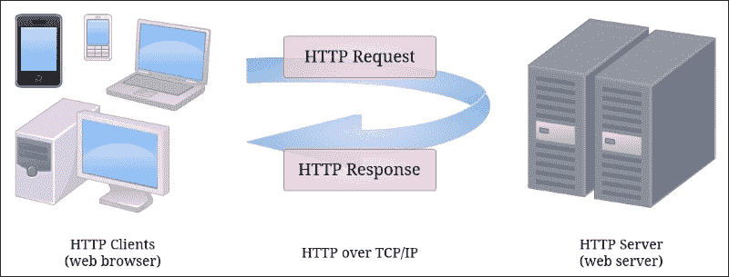
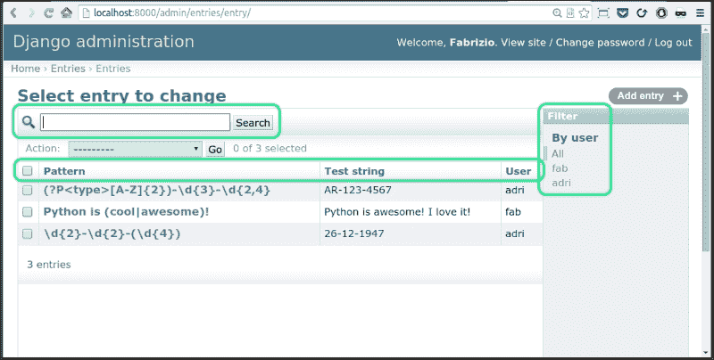
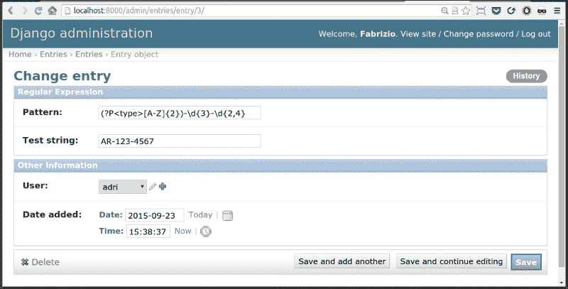
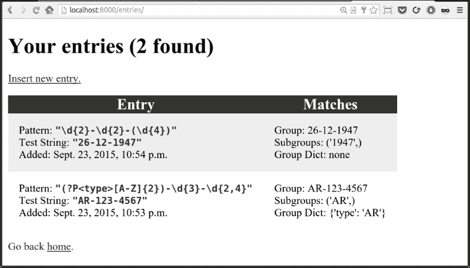
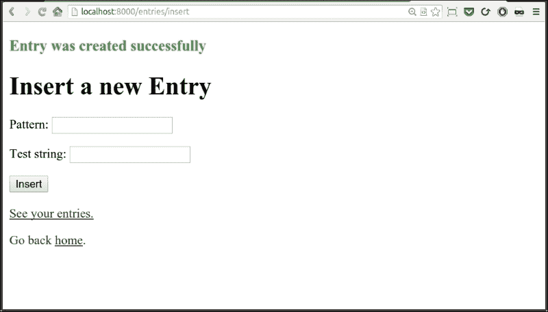

# 第十章. 正确进行网络开发

|   | *"不要相信你在网上看到的一切。" |   |
| --- | --- | --- |
|   | --*孔子* |

在本章中，我们将一起制作一个网站。通过一个小项目，我的目标是为你打开一扇窗户，让你窥视一下网络开发是什么，以及如果你想要成功地进行网络开发，你应该了解的主要概念和工具。

# 什么是网络？

**万维网**，或简称**Web**，是通过使用称为**互联网**的媒介来访问信息的一种方式。互联网是一个巨大的网络网络，是一个网络基础设施。它的目的是连接全球数十亿设备，以便它们可以相互通信。信息通过称为**协议**的丰富语言在互联网中传输，这些协议允许不同的设备使用相同的语言来共享内容。

网络是一种基于互联网的信息共享模型，它使用**超文本传输协议**（**HTTP**）作为数据通信的基础。因此，网络只是互联网上信息交换的几种不同方式之一：电子邮件、即时消息、新闻组等等，它们都依赖于不同的协议。

# 网络是如何工作的？

简而言之，HTTP 是一种**请求-响应**的**客户端-服务器**协议。HTTP 客户端向 HTTP 服务器发送请求消息。服务器反过来返回响应消息。换句话说，HTTP 是一种**拉协议**，客户端从服务器拉取信息（与**推协议**相对，服务器将信息推送到客户端）。看看下面的图片：



HTTP 基于**TCP/IP**（**传输控制协议/互联网协议**），它提供了可靠通信交换的工具。

HTTP 协议的一个重要特性是它是**无状态的**。这意味着当前请求不知道之前请求发生了什么。这是一个限制，但你可以在登录的错觉下浏览网站。然而，在幕后发生的是，在登录时，用户信息的令牌被保存（通常在客户端，在称为**cookies**的特殊文件中），这样用户发出的每个请求都携带了服务器识别用户并提供定制界面的手段，比如显示他们的名字，保持购物车内容，等等。

尽管这非常有趣，我们不会深入探讨 HTTP 的丰富细节以及它是如何工作的。然而，我们将编写一个小的网站，这意味着我们需要编写处理 HTTP 请求和返回 HTTP 响应的代码。从现在起，我不会再在*请求*和*响应*这些术语前加上 HTTP，因为我相信不会产生任何混淆。

# Django 网络框架

对于我们的项目，我们将使用 Python 生态系统中最受欢迎的 Web 框架之一：Django。

**Web 框架**是一组工具（库、函数、类等），我们可以使用它们来编写网站。我们需要决定我们希望允许对 Web 服务器发出哪些类型的请求，以及我们如何响应它们。Web 框架是完成这项任务的完美工具，因为它为我们处理了许多事情，使我们能够专注于重要部分，而无需重新发明轮子。

### 注意

存在着不同类型的框架。并非所有框架都是为编写 Web 代码而设计的。一般来说，**框架**是一种提供功能以简化软件开发、产品和服务解决方案开发的工具。

## Django 设计哲学

Django 的设计遵循以下原则：

+   **DRY**：即“不要重复自己”。不要重复代码，并以一种让框架尽可能从尽可能少的代码中推断出尽可能多的内容的方式进行编码。

+   **松耦合**：框架的各个层不应该相互了解（除非在绝对必要时）。松耦合与高内聚并行时效果最佳。用罗伯特·马丁的话来说：将因同一原因而改变的事物放在一起，将因不同原因而改变的事物分开。

+   **少代码**：应用程序应使用尽可能少的代码，并以尽可能多的方式促进重用。

+   **一致性**：在使用 Django 框架时，无论你针对哪一层进行编码，你的体验都将与用于构建项目的选定的设计模式和范式非常一致。

框架本身是围绕**模型-模板-视图**（**MTV**）模式设计的，这是**模型-视图-控制器**（**MVC**）的变体，其他框架广泛采用这种模式。这种模式的目的在于分离关注点，促进代码重用和质量提升。

### 模型层

在这三个层次中，这是定义应用程序处理的数据结构的层次，并处理数据源。**模型**是一个表示数据结构的类。通过一些 Django 魔法，模型被映射到数据库表，这样你就可以在关系数据库中存储你的数据。

### 注意

**关系数据库**将数据存储在表中，其中每一列是数据的属性，每一行代表该表所表示的集合中的单个项目或条目。通过每个表的**主键**，即允许唯一标识每个项目的数据部分，可以建立属于不同表的项目之间的关系，即将它们放入*关系*中。

这个系统的美在于，你不需要编写特定于数据库的代码来处理你的数据。你只需正确配置你的模型并简单地使用它们。数据库的工作将由 Django 的 **对象关系映射**（**ORM**）为你完成，它负责将针对 Python 对象执行的操作转换为关系数据库可以理解的语言：**SQL**（**结构化查询语言**）。

这种方法的一个好处是，你将能够更改数据库而无需重写代码，因为所有特定于数据库的代码都是由 Django 在运行时根据连接的数据库自动生成的。关系数据库使用 SQL，但每个数据库都有其独特的风味；因此，在我们的应用程序中不需要硬编码任何 SQL 是一个巨大的优势。

Django 允许你在任何时候修改你的模型。当你这样做时，你可以运行一个创建迁移的命令，迁移是一组指令，用于将数据库转换为表示你模型当前定义的状态。

总结来说，这一层负责定义你在网站中需要处理的数据结构，并为你提供通过访问模型（Python 对象）来简单地从数据库中保存和加载它们的手段。

### 视图层

视图的功能是处理请求，执行需要执行的操作，并最终返回响应。例如，如果你打开浏览器并请求一个电子商务商店中某个产品类别的页面，视图可能会与数据库通信，请求所有属于所选类别的子类别（例如，在导航侧边栏中显示它们）以及所有属于所选类别的产品，以便在页面上显示它们。

因此，视图是我们满足请求的机制。其结果，响应对象，可以采取多种不同的形式：JSON 有效负载、文本、HTML 页面等。当你编写网站时，你的响应通常由 HTML 或 JSON 组成。

### 注意

**超文本标记语言**（**HTML**）是创建网页的标准标记语言。网络浏览器运行能够解释 HTML 代码并将其渲染为我们打开网站页面时所看到的内容的引擎。

### 模板层

这是提供后端和前端开发之间桥梁的层。当一个视图需要返回 HTML 时，它通常通过准备一个**上下文对象**（一个字典）和一些数据来实现，然后将这个上下文传递给模板，模板被渲染（也就是说，转换成 HTML）并作为响应（更准确地说，响应体）返回给调用者。这种机制允许最大程度地重用代码。如果你回到分类的例子，很容易看出，如果你浏览一个销售产品的网站，你点击哪个分类或者执行什么类型的搜索，产品页面的布局实际上并没有改变。真正改变的是填充该页面的数据。

因此，页面的布局是由一个模板定义的，这个模板是用 HTML 和 Django 模板语言混合编写的。服务于该页面的视图收集所有要显示在上下文字典中的产品，并将其传递给模板，由 Django 模板引擎将其渲染成 HTML 页面。

## Django URL 分发器

Django 通过将请求的 URL 与注册在特殊文件中的模式进行匹配来关联**统一资源定位符**（**URL**）与视图。一个 URL 代表网站中的一个页面，例如，`http://mysite.com/categories?id=123`可能指向我的网站上 ID 为`123`的分类页面，而`https://mysite.com/login`可能指向用户登录页面。

### 小贴士

HTTP 和 HTTPS 之间的区别在于后者在协议中添加了加密，以确保你与网站交换的数据是安全的。当你在一个网站上输入信用卡信息，或者在任何地方登录，或者处理敏感数据时，你想要确保你正在使用 HTTPS。

### 正则表达式

Django 通过正则表达式匹配 URL 到模式。**正则表达式**是一系列字符，它定义了一个搜索模式，我们可以用它执行模式匹配、字符串替换等操作。

正则表达式具有特殊的语法来表示数字、字母、空格等，以及我们期望字符出现的次数等，还有更多。关于这个主题的完整解释超出了本书的范围。然而，这是一个非常重要的主题，因此我们将一起工作的项目将围绕它展开，希望这能激发你抽出时间自己进一步探索。

为了给你一个快速示例，想象一下你想要指定一个匹配日期模式，比如`"26-12-1947"`。这个字符串由两个数字、一个破折号、两个数字、一个破折号和最后四个数字组成。因此，我们可以写成这样：`r'[0-9]{2}-[0-9]{2}-[0-9]{4}'`。我们通过使用方括号创建了一个类，并在其中定义了从 0 到 9 的数字范围，因此包含了所有可能的数字。然后，在大括号中，我们说我们期望有两个这样的数字。然后是一个破折号，然后我们重复这个模式一次，然后再次，通过改变我们期望的数字数量，并且不包含最后的破折号。像`[0-9]`这样的类是一个非常常见的模式，因此已经创建了一个特殊的表示法作为快捷方式：`'\d'`。因此，我们可以将模式重写为`r'\d{2}-\d{2}-\d{4}'`，它将工作得完全一样。字符串前面的`r`代表*原始的*，它的目的是改变正则表达式引擎解释每个反斜杠`\'`的方式。

# 一个正则表达式网站

所以，我们现在在这里。我们将编写一个网站，用来存储正则表达式，这样我们就可以稍微玩玩它们。

### 注意

在我们开始创建项目之前，我想说几句关于 CSS 的话。**CSS**（**层叠样式表**）是包含我们指定 HTML 页面上各种元素外观的文件。你可以设置各种属性，如形状、大小、颜色、边距、边框、字体等。在这个项目中，我已经尽力让页面看起来不错，但 neither a frontend developer nor a designer，所以请不要过于关注外观。试着关注它们是如何工作的。

## 设置 Django

在 Django 网站([`www.djangoproject.com/`](https://www.djangoproject.com/))上，你可以跟随教程，它给你一个相当不错的 Django 功能介绍。如果你想的话，可以先跟随那个教程，然后再回到这个例子。所以，首先的事情是；让我们在你的虚拟环境中安装 Django：

```py
$ pip install django

```

当这个命令完成后，你可以在控制台中测试它（尝试使用 bpython，它给你一个类似于 IPython 的 shell，但具有很好的内省能力）：

```py
>>> import django
>>> django.VERSION
(1, 8, 4, 'final', 0)

```

现在 Django 已经安装好了，我们可以开始了。我们得做一些脚手架，所以我会快速带你过一遍。

### 开始项目

在书籍的环境中选一个文件夹并切换到那里。我会使用`ch10`。从那里，我们使用以下命令开始一个 Django 项目：

```py
$ django-admin startproject regex

```

这将为名为`regex`的 Django 项目准备骨架。切换到`regex`文件夹并运行以下命令：

```py
$ python manage.py runserver

```

你应该能够用浏览器访问`http://127.0.0.1:8000/`并看到默认的 Django 页面*It worked!*。这意味着项目已经正确设置。当你看到这个页面后，用*Ctrl* + *C*（或者在控制台里显示的任何内容）关闭服务器。我现在会粘贴项目的最终结构，这样你可以作为参考使用：

```py
$ tree -A regex  # from the ch10 folder
regex
├── db.sqlite3
├── entries
│   ├── admin.py
│   ├── forms.py
│   ├── __init__.py
│   ├── migrations
│   │   ├── 0001_initial.py
│   │   └── __init__.py
│   ├── models.py
│   ├── static
│   │   └── entries
│   │       └── css
│   │           └── main.css
│   ├── templates
│   │   └── entries
│   │       ├── base.html
│   │       ├── footer.html
│   │       ├── home.html
│   │       ├── insert.html
│   │       └── list.html
│   └── views.py
├── manage.py
└── regex
 ├── __init__.py
 ├── settings.py
 ├── urls.py
 └── wsgi.py

```

如果缺少文件，不要担心，我们会解决的。一个 Django 项目通常是一组几个不同的应用程序。每个应用程序都旨在以自包含、可重用的方式提供功能。我们将创建一个，称为**entries**：

```py
$ python manage.py startapp entries

```

在创建的`entries`文件夹中，你可以删除`tests.py`模块。

现在，让我们修复`regex`文件夹中的`regex/settings.py`文件。我们需要将我们的应用程序添加到`INSTALLED_APPS`元组中，以便我们可以使用它（将其添加到元组的底部）：

```py
INSTALLED_APPS = (
    ... django apps ...
    'entries',
)
```

然后，你可能想根据个人喜好设置语言和时间区。我住在伦敦，所以我设置了如下：

```py
LANGUAGE_CODE = 'en-gb'
TIME_ZONE = 'Europe/London'
```

在这个文件中没有其他要做的，所以你可以保存并关闭它。

现在是时候将**迁移**应用到数据库上了。Django 需要数据库支持来处理用户、会话等，因此我们需要创建一个数据库并用必要的数据填充它。幸运的是，这可以通过以下命令轻松完成：

```py
$ python manage.py migrate

```

### 注意

对于这个项目，我们使用 SQLite 数据库，它基本上就是一个文件。在实际项目中，你可能使用不同的数据库引擎，如 MySQL 或 PostgreSQL。

### 创建用户

现在我们有了数据库，我们可以使用控制台创建一个超级用户。

```py
$ python manage.py createsuperuser

```

输入用户名和其他详细信息后，我们就有一个具有管理员权限的用户。这足以访问 Django 管理部分，所以尝试启动服务器：

```py
$ python manage.py runserver

```

这将启动 Django 开发服务器，这是一个非常有用的内置 Web 服务器，你可以在使用 Django 时使用它。现在服务器正在运行，我们可以访问`http://localhost:8000/admin/`上的管理页面。我稍后会展示这个部分的截图。如果你使用你刚刚创建的用户凭据登录并转到**认证和授权**部分，你会找到**用户**。打开它，你将能够看到用户列表。作为管理员，你可以编辑任何用户的详细信息。在我们的情况下，确保你创建一个不同的用户，以便系统中至少有两个用户（我们稍后会用到他们）。我将第一个用户称为*Fabrizio*（用户名：`fab`），第二个用户称为*Adriano*（用户名：`adri`），以纪念我的父亲。

顺便说一句，你应该会看到 Django 管理面板是自动免费提供的。你定义模型，将它们连接起来，就完成了。这是一个非常出色的工具，展示了 Django 的反射能力是多么先进。此外，它是完全可定制和可扩展的。这确实是一件优秀的工作。

## 添加 Entry 模型

现在样板文件已经处理完毕，我们也有一两个用户，我们可以开始编码了。我们首先将`Entry`模型添加到我们的应用程序中，以便我们可以在数据库中存储对象。以下是你需要添加的代码（记得使用项目树作为参考）：

`entries/models.py`

```py
from django.db import models
from django.contrib.auth.models import User
from django.utils import timezone

class Entry(models.Model):
    user = models.ForeignKey(User)
    pattern = models.CharField(max_length=255)
    test_string = models.CharField(max_length=255)
    date_added = models.DateTimeField(default=timezone.now)

    class Meta:
        verbose_name_plural = 'entries'
```

这是我们将在系统中存储正则表达式的模型。我们将存储一个模式、一个测试字符串、创建条目的用户引用以及创建时刻。你可以看到创建一个模型实际上相当简单，但无论如何，让我们逐行过一遍。

首先，我们需要从`django.db`导入`models`模块。这将为我们提供`Entry`模型的基类。Django 模型是特殊的类，当我们从`models.Model`继承时，幕后会为我们做很多事情。

我们想要一个指向创建条目的用户的引用，因此我们需要从 Django 的授权应用程序中导入`User`模型，并且我们还需要导入时区模型以获取对`timezone.now()`函数的访问权限，该函数为我们提供了一个对`datetime.now()`的时区感知版本。它的美妙之处在于它与之前向您展示的`TIME_ZONE`设置相连。

对于这个类的主键，如果我们没有明确设置一个，Django 会为我们添加一个。**主键**是一个允许我们在数据库中唯一标识一个`Entry`对象（在这种情况下，Django 将添加一个自动递增的整数 ID）的键。

因此，我们定义我们的类，并设置四个类属性。我们有一个`ForeignKey`属性，它是我们指向`*User*`模型的引用。我们还有两个`CharField`属性，用于存储我们的正则表达式的模式和测试字符串。我们还有一个`DateTimeField`，其默认值设置为`timezone.now`。请注意，我们并没有在那里调用`timezone.now`，而是`now`，不是`now()`。因此，我们不是传递一个`DateTime`实例（在解析该行时设置的时间点），而是传递一个*可调用对象*，一个在我们在数据库中保存条目时被调用的函数。这与我们在第八章中使用的回调机制类似，即当我们为按钮点击分配命令时。

最后两行非常有趣。我们在`Entry`类本身中定义了一个名为`Meta`的类。`Meta`类被 Django 用于为模型提供各种额外信息。Django 在其内部拥有大量的逻辑，根据我们在`Meta`类中放入的信息来调整其行为。在这种情况下，在管理面板中，`Entry`的复数形式应该是*Entrys*，这是错误的，因此我们需要手动设置它。我们指定复数全部小写，因为当需要时，Django 会为我们将其大写。

现在我们有一个新的模型，我们需要更新数据库以反映代码的新状态。为了做到这一点，我们需要指示 Django 它需要创建更新数据库的代码。这段代码被称为**迁移**。让我们创建它并执行它：

```py
$ python manage.py makemigrations entries
$ python manage.py migrate

```

在这两个指令之后，数据库将准备好存储`Entry`对象。

### 注意

迁移有两种不同类型：数据和模式迁移。**数据迁移**将数据从一个状态迁移到另一个状态，而不改变其结构。例如，数据迁移可以通过将标志切换为`False`或`0`来将某个类别的所有产品设置为缺货。**模式迁移**是一组改变数据库模式结构的指令。例如，这可能是向`Person`表添加一个`age`列，或者增加字段的长度以适应非常长的地址。在使用 Django 进行开发时，在整个开发过程中执行这两种类型的迁移是很常见的。数据持续演变，尤其是在敏捷环境中编码时。

## 定制管理面板

下一步是将`Entry`模型与行政面板连接起来。你可以用一行代码完成，但在这个例子中，我想添加一些选项来定制行政面板显示条目的方式，无论是在数据库中所有条目项的列表视图中，还是在允许我们创建和修改它们的表单视图中。

我们需要做的只是添加以下代码：

`entries/admin.py`

```py
from django.contrib import admin
from .models import Entry

@admin.register(Entry)
class EntryAdmin(admin.ModelAdmin):
    fieldsets = [
        ('Regular Expression',
         {'fields': ['pattern', 'test_string']}),
        ('Other Information',
         {'fields': ['user', 'date_added']}),
    ]
    list_display = ('pattern', 'test_string', 'user')
    list_filter = ['user']
    search_fields = ['test_string']
```

这真是太美了。我猜你可能已经理解了大部分内容，即使你是 Django 的新手。

因此，我们首先导入 admin 模块和`Entry`模型。因为我们希望促进代码重用，所以我们使用相对导入（在`models`之前有一个点）。这将允许我们在不太多麻烦的情况下移动或重命名应用程序。然后，我们定义`EntryAdmin`类，它继承自`admin.ModelAdmin`。类上的装饰告诉 Django 在行政面板中显示`Entry`模型，而我们在`EntryAdmin`类中放入的内容告诉 Django 如何定制处理此模型的方式。

首先，我们指定创建/编辑页面的`fieldsets`。这将把页面分成两个部分，以便我们更好地分别可视化内容（*模式*和*测试字符串*）和其他细节（*用户*和*时间戳*）。

然后，我们定制列表页面显示结果的方式。我们想看到所有字段，但不显示日期。我们还希望能够按用户过滤，以便我们能够只通过一个用户查看所有条目，并且我们希望能够在`test_string`上搜索。

我将继续添加三个条目，一个代表我自己，另外两个代表我的父亲。结果将在接下来的两张图片中展示。在插入它们之后，列表页面看起来是这样的：



我已经突出显示了在`EntryAdmin`类中我们定制的这个视图的三个部分。我们可以按用户过滤，可以搜索，并且显示所有字段。如果你点击一个模式，编辑视图就会打开。

在我们定制之后，它看起来是这样的：



注意我们有两个部分：**正则表达式**和**其他信息**，这要归功于我们的自定义 `EntryAdmin` 类。试一试，为几个不同的用户添加一些条目，熟悉界面。所有这些都不需要付费，不是很好吗？

## 创建表单

每次你在网页上填写详细信息时，你都是在表单字段中插入数据。**表单**是**HTML 文档对象模型**（**DOM**）**树**的一部分。在 HTML 中，你可以通过使用 `form` 标签来创建表单。当你点击提交按钮时，你的浏览器通常会打包表单数据并将其放入 `POST` 请求的主体中。与用于请求资源的 `GET` 请求相反，`POST` 请求通常发送数据到 web 服务器，目的是创建或更新资源。因此，处理 `POST` 请求通常比处理 `GET` 请求需要更多的注意。

当服务器从 `POST` 请求接收数据时，需要验证这些数据。此外，服务器需要采用安全机制来防止各种类型的攻击。一种非常危险的攻击是**跨站请求伪造**（**CSRF**）攻击，这种攻击发生在数据从一个用户未认证的域发送时。Django 允许你以非常优雅的方式处理这个问题。

因此，而不是懒惰地使用 Django 管理员来创建条目，我将向您展示如何使用 Django 表单来完成它。通过使用框架提供的工具，你已经完成了很多验证工作（实际上，我们不需要添加任何自定义验证）。

在 Django 中有两种表单类：`Form` 和 `ModelForm`。你使用前者创建一个表单，其形状和行为取决于你如何编写类、添加哪些字段等。另一方面，后者是一种表单类型，尽管仍然可以自定义，但它从模型中推断字段和行为。由于我们需要为 `Entry` 模型创建一个表单，我们将使用那个。

`entries/forms.py`

```py
from django.forms import ModelForm
from .models import Entry

class EntryForm(ModelForm):
    class Meta:
        model = Entry
        fields = ['pattern', 'test_string']
```

令人惊讶的是，我们只需要做这些就能拥有一个可以放在页面上的表单。这里唯一值得注意的是，我们只限制了字段为 `pattern` 和 `test_string`。只有登录用户将被允许访问插入页面，因此我们不需要询问用户是谁：我们知道。至于日期，当我们保存 `Entry` 时，`date_added` 字段将根据其默认值设置，因此我们也不需要指定它。我们将在视图中看到如何在保存之前将用户信息传递给表单。所以，所有背景工作都已经完成，我们需要的只是视图和模板。让我们从视图开始。

## 编写视图

我们需要编写三个视图。我们需要一个用于主页的视图，一个用于显示用户所有条目的列表，一个用于创建新条目。我们还需要登录和注销的视图。但是，多亏了 Django，我们不需要编写它们。我将粘贴所有代码，然后我们一步一步地过一遍。

`entries/views.py`

```py
import re
from django.contrib.auth.decorators import login_required
from django.contrib.messages.views import SuccessMessageMixin
from django.core.urlresolvers import reverse_lazy
from django.utils.decorators import method_decorator
from django.views.generic import FormView, TemplateView
from .forms import EntryForm
from .models import Entry

class HomeView(TemplateView):
    template_name = 'entries/home.html'

    @method_decorator(
        login_required(login_url=reverse_lazy('login')))
    def get(self, request, *args, **kwargs):
        context = self.get_context_data(**kwargs)
        return self.render_to_response(context)

class EntryListView(TemplateView):
    template_name = 'entries/list.html'

    @method_decorator(
        login_required(login_url=reverse_lazy('login')))
    def get(self, request, *args, **kwargs):
        context = self.get_context_data(**kwargs)
        entries = Entry.objects.filter(
 user=request.user).order_by('-date_added')
        matches = (self._parse_entry(entry) for entry in entries)
        context['entries'] = list(zip(entries, matches))
        return self.render_to_response(context)

    def _parse_entry(self, entry):
        match = re.search(entry.pattern, entry.test_string)
        if match is not None:
            return (
                match.group(),
                match.groups() or None,
                match.groupdict() or None
            )
        return None

class EntryFormView(SuccessMessageMixin, FormView):
    template_name = 'entries/insert.html'
    form_class = EntryForm
    success_url = reverse_lazy('insert')
    success_message = "Entry was created successfully"

    @method_decorator(
        login_required(login_url=reverse_lazy('login')))
    def get(self, request, *args, **kwargs):
        return super(EntryFormView, self).get(
            request, *args, **kwargs)

    @method_decorator(
        login_required(login_url=reverse_lazy('login')))
    def post(self, request, *args, **kwargs):
        return super(EntryFormView, self).post(
            request, *args, **kwargs)

    def form_valid(self, form):
        self._save_with_user(form)
        return super(EntryFormView, self).form_valid(form)

    def _save_with_user(self, form):
        self.object = form.save(commit=False)
        self.object.user = self.request.user
        self.object.save()

```

让我们从导入开始。我们需要`re`模块来处理正则表达式，然后我们需要从 Django 中获取几个类和函数，最后，我们需要`Entry`模型和`EntryForm`表单。

### 主页视图

第一个视图是`HomeView`。它继承自`TemplateView`，这意味着响应将通过渲染我们在视图中创建的上下文模板来创建。我们唯一需要做的是指定`template_name`类属性，使其指向正确的模板。Django 推崇代码重用，如果我们不需要使这个视图仅对已登录用户可用，那么前两行代码就足够了。

然而，我们希望这个视图只能对已登录用户可用；因此，我们需要用`login_required`装饰它。从历史上看，Django 中的视图通常是函数；因此，这个装饰器被设计为接受一个*函数*而不是像我们在这个类中有的*方法*。我们在这个项目中使用 Django 基于类的视图，所以为了让一切正常工作，我们需要将`login_required`转换为一个接受方法（区别在于第一个参数：`self`）。我们通过将`login_required`传递给`method_decorator`来实现这一点。

我们还需要向`login_required`装饰器提供`login_url`信息，这是 Django 的另一个奇妙特性。在我们完成视图之后，您将看到，在 Django 中，您通过一个由正则表达式和其他信息组成的模式将视图绑定到 URL。您可以在`urls.py`文件中为每个条目命名，这样当您想要引用一个 URL 时，您就不必将它的值硬编码到代码中。您只需要让 Django 从我们在`urls.py`中定义的 URL 及其关联的视图的名称中反向工程该 URL。这个机制稍后会变得清晰。现在，只需将`reverse('...')`视为从标识符获取 URL 的一种方式。这样，您只需在`urls.py`文件中实际编写一次 URL，这是非常棒的。在`views.py`代码中，我们需要使用`reverse_lazy`，它的工作方式与`reverse`完全相同，只有一个主要区别：它只在真正需要时（以懒加载的方式）找到 URL。当`reverse`函数被使用时，如果`urls.py`文件尚未加载，就需要这个功能。

我们刚刚装饰的`get`方法只是简单地调用父类的`get`方法。当然，`get`方法是在对与这个视图关联的 URL 执行`GET`请求时 Django 调用的方法。

### 条目列表视图

这个视图比之前的视图更有趣。首先，我们像之前一样装饰了`get`方法。在它里面，我们需要准备一个`Entry`对象的列表并将其传递给模板，这样用户就能看到它。为了做到这一点，我们首先像预期的那样获取`context`字典，通过调用`TemplateView`类的`get_context_data`方法。然后，我们使用 ORM 获取条目的列表。我们通过访问对象管理器并对其调用过滤器来完成此操作。我们根据哪个用户登录来过滤条目，并要求它们按降序排序（名称前的`'-'`指定了降序）。`objects`管理器是 Django 模型创建时默认增加的**管理器**，它允许我们通过其方法与数据库交互。

我们解析每个条目以获取匹配项的列表（实际上，我编写了代码，使得`matches`是一个生成器表达式）。最后，我们在上下文中添加一个`'entries'`键，其值是`entries`和`matches`的耦合，这样每个`Entry`实例都与它的模式测试字符串的匹配结果配对。

在最后一行，我们只是要求 Django 使用我们创建的上下文渲染模板。

看一下`_parse_entry`方法。它所做的只是使用`entry.pattern`在`entry.test_string`上执行搜索。如果结果`match`对象不是`None`，这意味着我们找到了一些东西。如果是这样，我们返回一个包含三个元素的元组：整体组、子组和组字典。如果你不熟悉这些术语，不要担心，你很快就会看到一个带有示例的截图。如果没有匹配项，我们返回`None`。

### 表单视图

最后，让我们来检查`EntryFormView`。这有几个特别有趣的原因。首先，它展示了 Python 多重继承的一个很好的例子。我们在插入`Entry`后想在页面上显示一条消息，所以我们从`SuccessMessageMixin`继承。但我们也想处理表单，所以我们还从`FormView`继承。

### 注意

注意，当你处理混入和继承时，你可能需要考虑在类声明中指定基类顺序。

为了正确设置这个视图，我们需要在开始时指定几个属性：要渲染的模板、用于处理`POST`请求数据的表单类、在成功情况下需要重定向用户到的 URL，以及成功消息。

另一个有趣的特点是，这个视图需要处理`GET`和`POST`请求。当我们第一次到达表单页面时，表单是空的，这就是`GET`请求。另一方面，当我们填写表单并想要提交`Entry`时，我们发起一个`POST`请求。你可以看到`get`请求的主体在概念上与`HomeView`相同。Django 为我们做了一切。

`post`方法就像`get`方法一样。我们之所以需要编写这两个方法，仅仅是为了能够装饰它们以要求登录。

在 Django 表单处理过程（在`FormView`类中），有一些方法我们可以覆盖以自定义整体行为。我们需要使用`form_valid`方法来完成这项工作。当表单验证成功时，将调用此方法。它的目的是保存表单，从而从其中创建一个`Entry`对象，并将其存储在数据库中。

唯一的问题是我们的表单缺少用户信息。我们需要在调用链中拦截那个时刻，并自行添加用户信息。这是通过调用`_save_with_user`方法来完成的，这个方法非常简单。

首先，我们请求 Django 以`commit`参数设置为`False`的方式保存表单。这创建了一个`Entry`实例，而不尝试将其保存到数据库中。立即保存会失败，因为`user`信息尚未存在。

下一行更新了`Entry`实例（`self.object`），添加了`user`信息，而在最后一行，我们可以安全地保存它。我之所以将其命名为`object`并像那样将其设置在实例上，是为了遵循原始的`FormView`类所做的事情。

我们在这里玩弄 Django 机制，因此如果我们想让整个系统正常工作，我们需要注意何时以及如何修改其行为，并确保我们不会错误地修改它。因此，记住在自定义版本的末尾调用基类的`form_valid`方法（我们使用`super`来这样做）非常重要，以确保该方法通常执行的其他所有操作都能正确执行。

注意请求是如何绑定到每个视图实例（`self.request`）的，这样我们就不需要在重构逻辑到方法时传递它。还要注意，用户信息已经被 Django 自动添加到请求中。最后，注意之所以将整个过程拆分成如此之小的方法，是为了我们可以仅覆盖那些需要自定义的方法。所有这些都消除了编写大量代码的需要。

现在我们已经覆盖了视图，让我们看看如何将它们与 URL 关联起来。

## 绑定 URL 和视图

在`urls.py`模块中，我们将每个视图绑定到一个 URL。有多种方法可以做到这一点。我选择了最简单的一种，这对于本练习的范围来说效果很好，但如果你打算使用 Django，你可能想更深入地探索这个参数。这是整个网站逻辑围绕的核心；因此，你应该努力正确地掌握它。请注意，`urls.py`模块属于项目文件夹。

`regex/urls.py`

```py
from django.conf.urls import include, url
from django.contrib import admin
from django.contrib.auth import views as auth_views
from django.core.urlresolvers import reverse_lazy
from entries.views import HomeView, EntryListView, EntryFormView

urlpatterns = [
    url(r'^admin/', include(admin.site.urls)),
    url(r'^entries/$', EntryListView.as_view(), name='entries'),
 url(r'^entries/insert$',
 EntryFormView.as_view(),
 name='insert'),

    url(r'^login/$',
        auth_views.login,
        kwargs={'template_name': 'admin/login.html'},
        name='login'),
    url(r'^logout/$',
        auth_views.logout,
        kwargs={'next_page': reverse_lazy('home')},
        name='logout'),

    url(r'^$', HomeView.as_view(), name='home'),
]
```

如您所见，魔法来自于`url`函数。首先，我们传递给它一个正则表达式；然后是视图；最后是一个名称，这是我们将在`reverse`和`reverse_lazy`函数中使用来恢复 URL 的名称。

注意，当使用基于类的视图时，我们必须将它们转换为函数，这正是`url`所期望的。为此，我们调用它们的`as_view()`方法。

注意，第一个`url`条目，针对管理员，是特殊的。它不是指定一个 URL 和一个视图，而是指定一个 URL 前缀和另一个`urls.py`模块（来自`admin.site`包）。这样，Django 将通过在`admin.site.urls`中指定的所有 URL 前添加`'admin/'`来完成管理员部分的全部 URL。我们本来也可以为我们的条目应用做同样的事情（我们应该这么做），但我感觉这对这个简单的项目来说可能有点过于复杂了。

在正则表达式语言中，`'^'`和`'$'`符号代表字符串的*开始*和*结束*。注意，如果你使用包含技术，就像管理员一样，`'$'`是缺失的。当然，这是因为`'admin/'`只是一个前缀，需要由包含的`urls`模块中的所有定义来完成。

另一个值得注意的事情是，我们还可以包含视图路径的字符串化版本，我们就是这样为`login`和`logout`视图做的。我们还通过`kwargs`参数添加了有关要使用哪些模板的信息。顺便说一下，这些视图直接来自`django.contrib.auth`包，因此我们不需要写一行代码来处理认证。这是非常棒的，节省了我们很多时间。

每个`url`声明都必须在`urlpatterns`列表内完成，关于这一点，重要的是要考虑，当 Django 试图为请求的 URL 查找视图时，模式是按顺序从上到下执行的。第一个匹配的模式将提供该 URL 的视图，所以通常情况下，你必须将具体的模式放在通用模式之前，否则它们将永远不会有机会被捕获。例如，`'^shop/categories/$'`需要放在`'^shop'`之前（注意后者中没有`'$'`），否则它将永远不会被调用。我们的条目示例工作得很好，因为我详细地使用了`'$'`来指定 URL。

因此，模型、表单、管理员、视图和 URL 都已经完成。剩下要做的就是处理模板。关于这部分，我必须非常简略，因为 HTML 可能非常冗长。

## 编写模板

所有模板都继承自一个基础模板，它为所有其他模板提供了 HTML 结构，以一种非常面向对象的方式。它还指定了一些块，这些块是可以被子模板覆盖的区域，以便它们可以为这些区域提供自定义内容。让我们从基础模板开始：

`entries/templates/entries/base.html`

```py

<!DOCTYPE html>
<html lang="en">
  <head>
    
      <meta charset="utf-8">
      <meta name="viewport"
       content="width=device-width, initial-scale=1.0">
    

    
      <link href=""
       rel="stylesheet">
    

    <title> Title </title>
  </head>

  <body>
    <div id="page-content">
      
      
    </div>
    <div id="footer">
      
 
    </div>
  </body>
</html>
```

有一个很好的理由需要从`templates`文件夹中重复`entries`文件夹。当你部署 Django 网站时，你会在一个文件夹下收集所有的模板文件。如果你没有指定路径，就像我这样做，你可能会在 entries 应用中找到一个`base.html`模板，在另一个应用中也有一个`base.html`模板。最后收集到的将覆盖任何具有相同名称的其他文件。因此，通过将它们放在`templates/entries`文件夹中，并使用这种技术为每个 Django 应用编写，你可以避免名称冲突的风险（这同样适用于任何其他静态文件）。

关于这个模板，实际上没有太多可说的，除了它加载了`static`标签，这样我们就可以通过使用``来轻松访问`static`路径，而无需在模板中硬编码它。特殊``部分中的代码定义了逻辑。特殊`{{ ... }}`中的代码代表将在页面上渲染的变量。

我们定义了三个块：`title`、`page-content`和`footer`，它们的作用是包含标题、页面内容和页脚。块可以被子模板选择性地覆盖，以便在它们内部提供不同的内容。

下面是这个页脚的内容：

`entries/templates/entries/footer.html`

```py
<div class="footer">
  Go back <a href="">home</a>.
</div>
```

它为我们提供了一个链接到主页的便捷入口。

主页模板如下：

`entries/templates/entries/home.html`

```py

Welcome to the Entry website.


  <h1>Welcome {{ user.first_name }}!</h1>

  <div class="home-option">To see the list of your entries
    please click <a href="">here.</a>
  </div>
  <div class="home-option">To insert a new entry please click
    <a href="">here.</a>
  </div>
  <div class="home-option">To login as another user please click
    <a href="">here.</a>
  </div>
    <div class="home-option">To go to the admin panel
    please click <a href="">here.</a>
  </div>

```

它扩展了`base.html`模板，并覆盖了`title`和`page-content`。你可以看到它基本上只提供了四个链接给用户。这些链接包括条目列表、插入页面、登出页面和管理员页面。所有这些操作都是通过使用``标签来完成的，这是模板中的`reverse`函数的等价物，而且没有硬编码任何 URL。

插入`Entry`的模板如下：

`entries/templates/entries/insert.html`

```py

Insert a new Entry


  
    
      <p class="{{ message.tags }}">{{ message }}</p>
    
  

  <h1>Insert a new Entry</h1>
  <form action="" method="post">
    {{ form.as_p }}
    <input type="submit" value="Insert">
  </form><br>



  <div><a href="">See your entries.</a></div>
  

```

在开始处有一些条件逻辑来显示消息（如果有），然后我们定义表单。Django 通过简单地调用`{{ form.as_p }}`（或者`form.as_ul`或`form.as_table`）来为我们提供渲染表单的能力。这为我们创建了所有必要的字段和标签。这三个命令之间的区别在于表单的布局方式：作为段落、无序列表或表格。我们只需要将其包裹在表单标签中并添加一个提交按钮。这种行为是为了我们的方便而设计的；我们需要有自由来塑造我们想要的`<form>`标签，所以 Django 不会在这方面造成干扰。此外，请注意``。它将被 Django 渲染成一个令牌，并成为提交时发送到服务器的数据的一部分。这样，Django 就能验证请求是否来自允许的来源，从而避免上述*跨站请求伪造*问题。你看到我们如何在编写`Entry`插入视图时处理令牌了吗？正是这样。我们没有为它写一行代码。Django 通过一个**中间件**类（`CsrfViewMiddleware`）自动处理它。请参考官方 Django 文档以进一步探索这个主题。

对于这个页面，我们也使用页脚块来显示指向主页的链接。最后，我们有列表模板，这是最有趣的一个。

`entries/templates/entries/list.html`

```py

 Entries list 


 
  <h1>Your entries ({{ entries|length }} found)</h1>
  <div><a href="">Insert new entry.</a></div>

  <table class="entries-table">
   <thead>
     <tr><th>Entry</th><th>Matches</th></tr>
   </thead>
   <tbody>
    
     <tr class="entries-list ">
      <td>
        Pattern: <code class="code">
         "{{ entry.pattern }}"</code><br>
        Test String: <code class="code">
         "{{ entry.test_string }}"</code><br>
        Added: {{ entry.date_added }}
      </td>
      <td>
        
         Group: {{ match.0 }}<br>
         Subgroups:
          {{ match.1|default_if_none:"none" }}<br>
         Group Dict: {{ match.2|default_if_none:"none" }}
        
         No matches found.
        
      </td>
     </tr>
    
   </tbody>
  </table>
 
  <h1>You have no entries</h1>
  <div><a href="">Insert new entry.</a></div>
 



 

```

你可能需要一段时间才能习惯模板语言，但事实上，它只是使用`for`循环创建一个表格。我们首先检查是否有条目，如果有，我们创建一个表格。有两个列，一列用于`Entry`，另一列用于匹配。

在`Entry`列中，我们显示`Entry`对象（除了用户之外）和在`Matches`列中显示我们在`EntryListView`中创建的那个 3 元组。请注意，为了访问对象的属性，我们使用与 Python 中相同的点语法，例如`{{ entry.pattern }}`或`{{ entry.test_string }}`，等等。

当处理列表和元组时，我们不能使用方括号语法来访问项，所以我们也要使用点语法（`{{ match.0 }}`等同于`match[0]`，等等）。我们还使用一个通过管道（`|`）操作符的过滤器来显示一个自定义值，如果匹配是`None`。

Django 模板语言（它并不是真正的 Python）被保持得非常简单，这是出于一个精确的原因。如果你发现自己受到语言的限制，这意味着你可能在模板中尝试做一些实际上应该在视图中完成的事情，那里的逻辑更为相关。

让我向您展示几个`list`和`insert`模板的截图。这是我父亲的条目列表看起来像这样：



注意使用`cycle`标签如何交替行的背景颜色，从白色变为浅灰色。这些类在`main.css`文件中定义。

`Entry` 插入页面足够智能，可以提供几种不同的场景。当你第一次访问它时，它会给你一个空表单。如果你正确填写，它会显示一个漂亮的提示信息（见下图）。然而，如果你未能填写两个字段，它会在它们之前显示一个错误信息，提醒你这些字段是必需的。

还要注意自定义页脚，它包括对条目列表的链接和对主页的链接：



就这样！如果你愿意，可以随意玩转 CSS 样式。下载这本书的代码，尽情探索和扩展这个项目。给模型添加其他内容，创建并应用迁移，玩转模板，有很多事情可以做！

Django 是一个非常强大的框架，它提供的功能远超我在本章中向您展示的内容，所以您绝对想看看它。它的美在于它是 Python，因此阅读它的源代码是一个非常有益的练习。

# 网络开发的未来

计算机科学与其他伴随人类数百年甚至更长时间的学科相比，是一个非常年轻的学科。它的一大特点是发展速度极快。它以如此快的速度前进，以至于在短短几年内，你就能看到与实际世界变化相当的变化，而这些变化原本需要一百年才能发生。因此，作为一名程序员，你必须时刻关注这个世界正在发生的事情。

现在正在发生的事情是，由于强大的计算机现在非常便宜，几乎每个人都能访问它们，因此趋势是尽量避免在服务器端放置过多的工作负载，让前端处理一部分。因此，在过去的几年里，像 jQuery 和 Backbone 这样的 JavaScript 框架和库变得非常流行，网络开发已经从后端负责处理数据、准备数据并为其提供显示给前端的范式，转变为后端有时仅用作 API、纯粹的数据提供者的范式。前端通过 API 调用从后端获取数据，然后处理其余部分。这种转变促进了**单页应用**（**SPA**）等范式的存在，理想情况下，整个页面只加载一次，然后根据通常来自后端的内容进行演变。使用类似技术的电子商务网站可以在不刷新周围结构的情况下在页面中加载搜索结果。浏览器可以执行异步调用（**AJAX**），这些调用可以返回数据，这些数据可以用 JavaScript 代码读取、操作并注入回页面。

因此，如果你打算从事 Web 开发，我强烈建议你熟悉 JavaScript（如果你还没有的话），以及 API。在本章的最后几页，我将给你一个如何使用两个不同的 Python 微框架（Flask 和 Falcon）创建简单 API 的例子。

## 编写 Flask 视图

Flask ([`flask.pocoo.org/`](http://flask.pocoo.org/)) 是一个 Python 微框架。它提供的功能比 Django 少，但据说速度更快，启动也更快。说实话，现在启动 Django 也非常快，但 Flask 如此受欢迎，看到它的例子也很不错。

在你的`ch10`文件夹中，创建一个名为`flask`的文件夹，其结构如下：

```py
$ tree -A flask  # from the ch10 folder
flask
├── main.py
└── templates
 └── main.html

```

基本上，我们将编写两个简单的文件：一个 Flask 应用和一个 HTML 模板。Flask 使用 Jinja2 作为模板引擎。它非常流行且非常快，而且最近 Django 甚至开始提供对它的原生支持，这是 Python 程序员长期渴望的事情。

`flask/templates/main.html`

```py
<!doctype html>
<title>Hello from Flask</title>
<h1>
  
    Hello {{ name }}!
  
    Hello shy person!
  
</h1>
```

模板几乎可以说是过于简单；它所做的只是根据`name`变量的存在来更改问候语。更有趣的是渲染它的 Flask 应用：

`flask/main.py`

```py
from flask import Flask, render_template

app = Flask(__name__)

@app.route('/')
@app.route('/<name>')
def hello(name=None):
    return render_template('main.html', name=name)

if __name__ == '__main__':
    app.run()
```

我们创建一个`app`对象，这是一个 Flask 应用。我们只提供存储在`__name__`中的模块的完全限定名称。

然后，我们编写一个简单的`hello`视图，它接受一个可选的`name`参数。在视图的主体中，我们简单地渲染`main.html`模板，并将`name`参数传递给它，无论其值如何。

有趣的是路由。与 Django 将视图和 URL（`urls.py`模块）绑定起来的方式不同，在 Flask 中，你使用一个或多个`@app.route`装饰器来装饰你的视图。在这种情况下，我们接受没有其他信息的根 URL，或者带有名称信息。

切换到`flask`文件夹，并输入（确保你已经通过`$ pip install flask`安装了 Flask）：

```py
$ python main.py

```

你可以打开浏览器并访问`http://127.0.0.1:5000/`。这个 URL 没有名称信息；因此，你会看到**Hello shy person!**它写得很大很漂亮。试着在 URL 中添加一些内容，比如`http://127.0.0.1:5000/Adriano`。按*Enter*键，页面将变为**Hello Adriano!**。

当然，Flask 为你提供了更多功能，但我们没有足够的空间来展示更复杂的例子。尽管如此，它绝对值得探索。几个项目已经成功地使用了它，而且用它创建网站或 API 很有趣。Flask 的作者 Armin Ronacher 是一位成功且多产的程序员。他还创建了或参与了几个其他有趣的项目，如 Werkzeug、Jinja2、Click 和 Sphinx。

## 在 Falcon 中构建 JSON 报价服务器

Falcon ([`falconframework.org/`](http://falconframework.org/)) 是另一个用 Python 编写的微框架，它被设计成轻量级、快速和灵活。我认为这个相对较新的项目会因其速度而发展成为一个真正受欢迎的项目，这种速度令人印象深刻，所以我很高兴能给你展示一个使用它的微小示例。

我们将构建一个视图，它返回一个随机选择的 *佛陀* 引语。

在你的 `ch10` 文件夹中，创建一个新的名为 `falcon` 的文件夹。我们将有两个文件：`quotes.py` 和 `main.py`。要运行此示例，请安装 Falcon 和 Gunicorn (`$ pip install falcon gunicorn`)。Falcon 是框架，**Gunicorn**（**绿色独角兽**）是一个用于 Unix 的 Python WSGI HTTP 服务器（用通俗易懂的话来说，就是运行服务器所用的技术）。当你一切准备就绪时，首先创建 `quotes.py` 文件。

`falcon/quotes.py`

```py
quotes = [
    "Thousands of candles can be lighted from a single candle, "
    "and the life of the candle will not be shortened. "
    "Happiness never decreases by being shared.",
    ...
    "Peace comes from within. Do not seek it without.",
]
```

你将在本书的源代码中找到完整的引语列表。如果你没有，你也可以填写你喜欢的引语。请注意，并非每一行都以逗号结尾。在 Python 中，只要它们在括号（或大括号）中，就可以像那样连接字符串。这被称为 **隐式连接**。

主应用程序的代码并不长，但很有趣：

`falcon/main.py`

```py
import json
import random
import falcon
from quotes import quotes

class QuoteResource:
    def on_get(self, req, resp):
        quote = {
            'quote': random.choice(quotes),
            'author': 'The Buddha'
        }
        resp.body = json.dumps(quote)

api = falcon.API()
api.add_route('/quote', QuoteResource())

```

让我们从类开始。在 Django 中我们有一个 `get` 方法，在 Flask 中我们定义了一个函数，而在这里我们编写一个 `on_get` 方法，这种命名风格让我想起了 C#的事件处理器。它接受一个请求和一个响应参数，这两个参数都由框架自动提供。在其主体中，我们定义一个包含随机选择引语和作者信息的字典，然后将该字典转换为 JSON 字符串，并将响应体设置为它的值。我们不需要返回任何内容，Falcon 会为我们处理。

在文件末尾，我们创建 Falcon 应用程序，并在其上调用 `add_route` 来将我们刚刚编写的处理器绑定到我们想要的 URL。

当你一切准备就绪时，切换到 `falcon` 文件夹，并输入：

```py
$ gunicorn main:api

```

然后，向 `http://127.0.0.1:8000/quote` 发送一个请求（或者简单地用你的浏览器打开这个页面）。当我这样做的时候，我得到了这个 JSON 响应：

```py
{
    quote: "The mind is everything. What you think you become.",
    author: "The Buddha"
}
```

无论你最终选择哪个框架进行 Web 开发，都要努力了解其他选择。有时你可能处于需要不同框架的情况，而了解不同工具的工作原理将给你带来优势。

# 摘要

在这一章中，我们简要地了解了 Web 开发。我们讨论了像 DRY 哲学和框架作为一个工具的概念，它为我们提供了编写代码以处理请求所需的所有东西。我们还讨论了 MTV 模式，以及这三个层次如何很好地协同工作以实现请求-响应路径。

之后，我们简要介绍了正则表达式，这是一个极其重要的主题，它是提供 URL 路由工具的那一层。

现在有许多不同的框架，Django 无疑是其中最好的和最广泛使用的之一，因此它绝对值得探索，尤其是它的源代码，写得非常好。

还有其他非常有趣且重要的框架，例如 Flask。它们提供的功能较少，但总体来说，它们在执行时间和设置上都要快得多。其中有一个非常快的框架是相对较新的 Falcon 项目，其基准测试非常出色。

理解请求-响应机制是如何工作的，以及互联网总体上是如何工作的，这一点非常重要，这样最终你就不必太在意你不得不使用哪个框架。你将能够快速掌握它，因为这只涉及到熟悉一种你已经了解很多的方法。

至少探索三个框架，并尝试想出不同的用例来决定哪一个可能是理想的选择。当你能够做出那个选择时，你就知道你对它们的理解已经足够好了。

下一章将介绍调试和故障排除。我们将学习如何处理错误和问题，这样当你编码时遇到麻烦（别担心，通常这种情况不会经常发生），你将能够快速找到解决问题的方法并继续前进。
