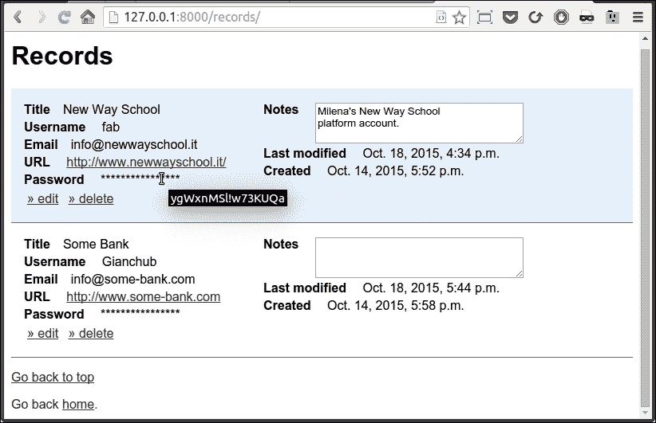
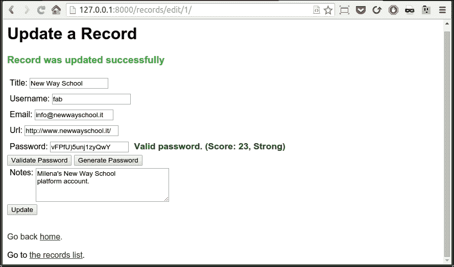

# 第十二章. 总结 – 一个完整的示例

|   | *"不要沉溺于过去，不要梦想未来，专注于当下。" |   |
| --- | --- | --- |
|   | --*释迦牟尼佛* |

在本章中，我将向你展示最后一个项目。如果你在本书的其他部分工作得很好，这个例子应该很容易。我尽力让它既不会对只读过书的人太难，也不会对那些也花时间做例子、也许还阅读了我建议的链接和主题的人太简单。

# 挑战

我们现在都面临的一个问题是记住密码。我们为每件事都有密码：网站、手机、卡片、银行账户等等。我们必须记住的信息量实在太多，所以很多人最终反复使用相同的密码。当然，这非常不好，因此，在某个时候，发明了工具来减轻这个问题。其中之一叫做**KeepassX**，基本上它的工作方式是这样的：你通过设置一个特殊的密码，即**主密码**来启动软件。一旦进入，你将为你需要记住的每个密码存储一个记录，例如，你的电子邮件账户、银行网站、信用卡信息等等。当你关闭软件时，它将加密用于存储所有这些信息的数据库，这样数据就只能由主密码的所有者访问。因此，有点像《指环王》的风格，只需拥有一个密码，就能统治一切。

# 我们的实现

我们在本章的目标是创建一个类似但基于 Web 的东西，我想要实现它的方式是编写两个应用程序。

其中一个将是一个用 Falcon 编写的 API。它的目的是双重的，它既能生成也能验证密码。它将为调用者提供有关有效性和评分的信息，评分应表明密码有多强大。

第二个应用是一个 Django 网站，它将提供处理记录的界面。每个记录将保留诸如用户名、电子邮件、密码、URL 等信息。它将显示所有记录的列表，并允许用户创建、更新和删除它们。密码在存储到数据库之前将被加密。

整个项目的目的因此是模仿 KeepassX 的工作方式，尽管它要简单得多。如果你喜欢这个想法，你可以进一步开发它，以添加其他功能并使其更安全。我保证在最后给你一些如何扩展它的建议。

因此，本章在代码方面将会相当密集。这是我为了在有限的空间内给你提供一个有趣的例子而必须付出的代价。

在我们开始之前，请确保您熟悉第十章中介绍的项目，即《正确的 Web 开发》，以便您熟悉 Web 开发的基础知识。请确保您已安装此项目所需的全部`pip`包：`django`、`falcon`、`cryptography`和`nose-parameterized`。如果您下载了本书的源代码，您将在`requirements`文件夹中找到所有需要安装的内容，而本章的代码将在`ch12`中。

# 实现 Django 接口

我希望您熟悉第十章中介绍的概念，该章节主要关于 Django。如果您还没有阅读，这可能是在这里继续阅读之前的好时机。

## 设置

在您的根目录（对我来说是`ch12`），其中将包含接口的根目录和 API 的根目录，首先运行以下命令：

```py
$ django-admin startproject pwdweb

```

这将创建一个 Django 项目的结构，我们现在非常熟悉。我将在这里向您展示接口项目的最终结构：

```py
$ tree -A pwdweb
pwdweb
├── db.sqlite3
├── manage.py
├── pwdweb
│   ├── __init__.py
│   ├── settings.py
│   ├── urls.py
│   └── wsgi.py
└── records
 ├── admin.py
 ├── forms.py
 ├── __init__.py
 ├── migrations
 │   ├── 0001_initial.py
 │   └── __init__.py
 ├── models.py
 ├── static
 │   └── records
 │       ├── css
 │       │   └── main.css
 │       └── js
 │           ├── api.js
 │           └── jquery-2.1.4.min.js
 ├── templates
 │   └── records
 │       ├── base.html
 │       ├── footer.html
 │       ├── home.html
 │       ├── list.html
 │       ├── messages.html
 │       ├── record_add_edit.html
 │       └── record_confirm_delete.html
 ├── templatetags
 │   └── record_extras.py
 ├── urls.py
 └── views.py

```

如往常一样，如果您没有所有文件，请不要担心，我们会逐步添加。切换到`pwdweb`文件夹，并确保 Django 已正确设置：`$ python manage.py runserver`（忽略关于未应用迁移的警告）。

关闭服务器并创建一个应用：`$ python manage.py startapp records`。太棒了，现在我们可以开始编码了。首先，让我们打开`pwdweb/settings.py`，并在`INSTALLED_APP`元组的末尾添加`'records'`（注意代码中包含逗号）。然后，继续根据您的偏好修复`LANGUAGE_CODE`和`TIME_ZONE`设置，最后在底部添加以下行：

```py
ENCRYPTION_KEY = b'qMhPGx-ROWUDr4veh0ybPRL6viIUNe0vcPDmy67x6CQ='
```

这是一个自定义加密密钥，它与 Django 设置无关，但稍后我们将需要它，这是放置它的最佳位置。现在不用担心，我们很快就会回到它。

## 模型层

我们只需要为记录应用添加一个模型：`Record`。该模型将代表我们想要存储在数据库中的每个记录：

`records/models.py`

```py
from cryptography.fernet import Fernet
from django.conf import settings
from django.db import models

class Record(models.Model):
    DEFAULT_ENCODING = 'utf-8'

    title = models.CharField(max_length=64, unique=True)
    username = models.CharField(max_length=64)
    email = models.EmailField(null=True, blank=True)
    url = models.URLField(max_length=255, null=True, blank=True)
    password = models.CharField(max_length=2048)
    notes = models.TextField(null=True, blank=True)
    created = models.DateTimeField(auto_now_add=True)
    last_modified = models.DateTimeField(auto_now=True)

    def encrypt_password(self):
        self.password = self.encrypt(self.password)

    def decrypt_password(self):
        self.password = self.decrypt(self.password)

    def encrypt(self, plaintext):
        return self.cypher('encrypt', plaintext)

    def decrypt(self, cyphertext):
        return self.cypher('decrypt', cyphertext)

    def cypher(self, cypher_func, text):
        fernet = Fernet(settings.ENCRYPTION_KEY)
        result = getattr(fernet, cypher_func)(
            self._to_bytes(text))
        return self._to_str(result)

    def _to_str(self, bytes_str):
        return bytes_str.decode(self.DEFAULT_ENCODING)

    def _to_bytes(self, s):
        return s.encode(self.DEFAULT_ENCODING)
```

首先，我们将`DEFAULT_ENCODING`类属性设置为`'utf-8'`，这是网络（以及不仅仅是网络）中最流行的编码类型。我们将此属性设置在类上，以避免在多个地方硬编码字符串。

然后，我们继续设置所有模型的字段。正如您所看到的，Django 允许您指定非常具体的字段，例如`EmailField`和`URLField`。之所以建议使用这些特定字段而不是简单的`CharField`，是因为当我们为该模型创建表单时，我们将免费获得电子邮件和 URL 验证，这是非常棒的。

所有选项都非常标准，我们在第十章，*正确进行 Web 开发*中看到了它们，但我还是想指出几点。首先，`title`需要是唯一的，这样每个`Record`对象都有一个唯一的标题，我们不希望有重复。每个数据库根据其设置、运行的引擎等因素，对字符串的处理方式都略有不同，因此我没有将`title`字段作为此模型的**主键**，这本来是自然的事情。我更喜欢避免处理奇怪字符串错误的痛苦，并且我很高兴让 Django 自动为模型添加主键。

另一个你应该理解的选择是`null=True, blank=True`这对。前者允许字段为`NULL`，这使得它不是强制的，而第二个允许它为*空白*（也就是说，一个空字符串）。在 Django 中，它们的使用相当特殊，所以我建议你查看官方文档以了解如何正确使用它们。

最后，关于日期：`created` 需要设置 `auto_add_now=True`，这样在对象创建时就会设置当前时间。另一方面，`last_modified` 需要在每次保存模型时更新，因此我们将其设置为 `auto_now=True`。

在字段定义之后，有一些用于加密和解密密码的方法。将密码以原样保存在数据库中总是一个非常糟糕的主意，因此你总是在保存之前加密它们。

通常，在保存密码时，你会使用**单向加密**算法（也称为**单向哈希函数**）来加密它。这意味着一旦你创建了哈希值，就没有办法将其还原为原始密码。

这种加密通常用于身份验证：用户将他们的用户名和密码输入到一个表单中，在提交时，代码会从数据库中的用户记录中获取哈希值，并将其与用户刚刚在表单中输入的密码的哈希值进行比较。如果两个哈希值匹配，这意味着它们是由相同的密码产生的，因此认证被授权。

然而，在这种情况下，我们需要能够恢复密码，否则整个应用程序将不会非常有用。因此，我们将使用所谓的**对称加密**算法来加密它们。这种方式非常简单：密码（称为**明文**）被传递给一个**加密**函数，以及一个**密钥**。算法将产生一个加密字符串（称为**密文**），这就是你在数据库中存储的内容。当你想要恢复密码时，你需要密文和密钥。你将它们输入到一个**解密**函数中，就能得到原始密码。这正是我们所需要的。

为了执行对称加密，我们需要`cryptography`包，这就是为什么我指示你安装它的原因。

`Record`类中的所有方法都非常简单。`encrypt_password`和`decrypt_password`是`encrypt`和`decrypt`对`password`字段的快捷方式，并将结果重新分配给自己。

`encrypt`和`decrypt`方法是对`cypher`方法的分发器，而`_to_str`和`_to_bytes`只是几个辅助函数。`cryptography`库与*字节*对象一起工作，因此我们需要这些辅助函数在字节和字符串之间来回转换，使用一个常见的编码。

唯一有趣的逻辑在`cypher`方法中。我可以在`encrypt`和`decrypt`中直接编写代码，但那样会导致一些冗余，而且我没有机会向你展示访问对象属性的不同方式，所以让我们分析`cypher`方法的主体。

我们首先创建`Fernet`类的一个实例，它为我们提供了所需的对称加密功能。我们通过在设置（`ENCRYPTION_KEY`）中传递密钥来设置实例。创建`fernet`后，我们需要使用它。我们可以根据`cypher_func`参数的值来加密或解密。我们使用`getattr`根据对象本身和属性名称从对象中获取属性。这种技术允许我们动态地获取对象的任何属性。

`getattr(fernet, cypher_func)`的结果，例如`cyper_func`为`'encrypt'`时，等同于`fernet.encrypt`。`getattr`函数返回一个方法，然后我们使用文本参数的字节表示调用该方法。然后我们以字符串格式返回结果。

当通过加密分发器调用此函数时，这个函数相当于以下内容：

```py
def cypher_encrypt(self, text):
        fernet = Fernet(settings.ENCRYPTION_KEY)
        result = fernet.encrypt(
            self._to_bytes(text))
        return self._to_str(result)
```

当你花时间正确理解它时，你会发现它并没有听起来那么困难。

因此，我们有了我们的模型，所以现在是时候迁移了（我希望你记得这将为您应用程序创建数据库中的表）：

```py
$ python manage.py makemigrations
$ python manage.py migrate

```

现在你应该有一个很好的数据库，其中包含运行界面应用程序所需的所有表。继续创建超级用户（`$ python manage.py createsuperuser`）。

顺便说一句，如果你想生成自己的加密密钥，就像这样一样简单：

```py
>>> from cryptography.fernet import Fernet
>>> Fernet.generate_key()

```

## 一个简单的表单

我们需要一个`Record`模型的表单，所以我们将使用我们在第十章中看到的`ModelForm`技术，即《正确进行 Web 开发》。

`records/forms.py`

```py
from django.forms import ModelForm, Textarea
from .models import Record

class RecordForm(ModelForm):
    class Meta:
        model = Record
        fields = ['title', 'username', 'email', 'url',
                  'password', 'notes']
        widgets = {'notes': Textarea(
            attrs={'cols': 40, 'rows': 4})}
```

我们创建一个继承自`ModelForm`的`RecordForm`类，这样表单就会自动创建，这是由于 Django 的反射能力。我们只指定要使用哪个模型，显示哪些字段（我们排除了日期，这些由系统自动处理），并为笔记字段的尺寸提供最小样式，该字段将使用`Textarea`（在 HTML 中是一个多行文本字段）显示。

## 视图层

界面应用总共有五个页面：主页、记录列表、记录创建、记录更新和记录删除确认。因此，我们必须编写五个视图。正如你马上就会看到的，Django 通过给我们提供可以最小化定制的可重用视图，在很大程度上帮助我们。接下来的所有代码都属于`records/views.py`文件。

### 导入和主页视图

为了打破僵局，这里有一些导入和主页视图的代码：

```py
from django.contrib import messages
from django.contrib.messages.views import SuccessMessageMixin
from django.core.urlresolvers import reverse_lazy
from django.views.generic import TemplateView
from django.views.generic.edit import (
    CreateView, UpdateView, DeleteView)
from .forms import RecordForm
from .models import Record

class HomeView(TemplateView):
    template_name = 'records/home.html'
```

我们从 Django 导入了一些工具。有几个与消息相关的对象，一个 URL 懒加载反转器，以及四种不同类型的视图。我们还导入了我们的`Record`模型和`RecordForm`。正如你所见，`HomeView`类只由两行组成，因为我们只需要指定我们想要使用的模板，其余的只是重用了`TemplateView`的代码，就像这样。这真是太简单了，几乎感觉像是在作弊。

### 列出所有记录

在主页视图之后，我们可以编写一个视图来列出数据库中所有的`Record`实例。

```py
class RecordListView(TemplateView):
    template_name = 'records/list.html'

    def get(self, request, *args, **kwargs):
        context = self.get_context_data(**kwargs)
        records = Record.objects.all().order_by('title')  #1
        for record in records:
            record.plaintext = record.decrypt(record.password) #2
        context['records'] = records
        return self.render_to_response(context)
```

我们只需要再次子类化`TemplateView`，并重写`get`方法。我们需要做几件事情：我们从数据库中检索所有记录，并按`title`排序（`#1`），然后按顺序解析所有记录，以便为每个记录添加属性`plaintext`（`#2`），以在页面上显示原始密码。另一种做法是在`Record`模型中添加一个只读属性，以动态进行解密。我将把它留给你，作为一个有趣的练习，来修改代码以实现这一点。

在恢复和增强记录后，我们将它们放入`context`字典中，并通过调用`render_to_response`按常规完成。

### 创建记录

下面是创建视图的代码：

```py
class EncryptionMixin:
    def form_valid(self, form):
        self.encrypt_password(form)
        return super(EncryptionMixin, self).form_valid(form)

    def encrypt_password(self, form):
        self.object = form.save(commit=False)
        self.object.encrypt_password()
        self.object.save()

class RecordCreateView(
        EncryptionMixin, SuccessMessageMixin, CreateView):
    template_name = 'records/record_add_edit.html'
    form_class = RecordForm
    success_url = reverse_lazy('records:add')
    success_message = 'Record was created successfully'
```

其逻辑的一部分已被提取出来，以便稍后在更新视图中重用。让我们从`EncryptionMixin`开始。它所做的只是重写`form_valid`方法，这样在将新的`Record`实例保存到数据库之前，我们确保在保存表单的结果对象上调用`encrypt_password`。换句话说，当用户提交表单以创建新的`Record`时，如果表单验证成功，则调用`form_valid`方法。在这个方法中，通常会发生的是，从`ModelForm`实例创建一个对象，如下所示：

```py
self.object = form.save()
```

我们需要干预这种行为，因为按照原样运行此代码将保存带有原始密码的记录，而这并没有加密。所以我们将其更改为调用`form`上的`save`并传递`commit=False`，这将从`form`创建`Record`实例，但不会尝试将其保存到数据库中。紧接着，我们在该实例上加密密码，然后我们最终可以调用`save`，实际上将其提交到数据库。

由于我们既需要在创建记录时也需要在更新记录时实现这种行为，所以我将其提取为一个 mixin。

### 注意

也许，对于这个密码加密逻辑的更好解决方案是创建一个自定义的`Field`（从`CharField`继承是最简单的方式）并添加必要的逻辑，这样当我们处理从数据库到`Record`实例的转换时，加密和解密逻辑会自动为我们执行。虽然这种方法更优雅，但需要我更多地偏离主题来解释 Django 的内部机制，这对于本例的范围来说太多了。像往常一样，如果你觉得这是一个挑战，你可以尝试自己来做。

在创建`EncryptionMixin`类之后，我们可以在`RecordCreateView`类中使用它。我们还继承了另外两个类：`SuccessMessageMixin`和`CreateView`。消息混合类为我们提供了在创建成功时快速设置消息的逻辑，而`CreateView`则为我们提供了从表单创建对象的必要逻辑。

你可以看到，我们唯一需要编写的是一些定制化：模板名称、表单类、成功消息和 URL。其他所有事情都由 Django 优雅地为我们处理。

### 更新记录

更新`Record`实例的代码仅稍微复杂一些。我们只需要在将记录数据填充到表单之前，添加一些解密密码的逻辑。

```py
class RecordUpdateView(
        EncryptionMixin, SuccessMessageMixin, UpdateView):
    template_name = 'records/record_add_edit.html'
    form_class = RecordForm
    model = Record
    success_message = 'Record was updated successfully'

    def get_context_data(self, **kwargs):
        kwargs['update'] = True
        return super(
            RecordUpdateView, self).get_context_data(**kwargs)

    def form_valid(self, form):
        self.success_url = reverse_lazy(
            'records:edit',
            kwargs={'pk': self.object.pk}
        )
        return super(RecordUpdateView, self).form_valid(form)

    def get_form_kwargs(self):
        kwargs = super(RecordUpdateView, self).get_form_kwargs()
        kwargs['instance'].decrypt_password()
        return kwargs
```

在这个视图中，我们仍然继承了`EncryptionMixin`和`SuccessMessageMixin`，但我们使用的视图类是`UpdateView`。

前四行与之前一样是定制化，我们设置了模板名称、表单类、`Record`模型和成功消息。我们不能将`success_url`设置为类属性，因为我们想要将成功的编辑重定向到该记录的相同编辑页面，为了做到这一点，我们需要编辑实例的 ID。不用担心，我们会用另一种方式来做。

首先，我们重写`get_context_data`以在`kwargs`参数中将`'update'`设置为`True`，这意味着一个键`'update'`最终会出现在传递给模板以渲染页面的`context`字典中。我们这样做是因为我们想要使用相同的模板来创建和更新记录，因此我们将在上下文中使用这个变量来理解我们处于哪种情况。还有其他方法可以做到这一点，但这个方法既快又简单，我喜欢它是因为它很明确。

在重写`get_context_data`之后，我们需要处理 URL 重定向。我们在`form_valid`方法中这样做，因为我们知道，如果我们到达那里，这意味着`Record`实例已经成功更新。我们反转了`'records:edit'`视图，这正是我们正在工作的视图，传递了所涉及对象的键。我们从这个`self.object.pk`中获取这个信息。

有一个原因使得在视图实例上保存对象很有帮助，那就是我们可以在需要时使用它，而无需修改视图中的许多方法的签名以便传递对象。这种设计非常有帮助，并允许我们用很少的代码实现很多功能。

我们需要做的最后一件事是在填充用户表单之前解密实例上的密码。在`get_form_kwargs`方法中做这件事很简单，在那里你可以访问`kwargs`字典中的`Record`实例，并对其调用`decrypt_password`。

这就是我们更新记录所需做的全部工作。如果你想想，我们不得不写的代码量真的很少，多亏了 Django 基于类的视图。

### 小贴士

了解哪个方法是最好的重写方法的一个好方法是查看 Django 官方文档，或者在这个情况下，查看源代码并查看基于类的视图部分。你将能够欣赏到 Django 开发者在这里做了多少工作，这样你只需要触摸最少的代码来定制你的视图。

### 删除记录

在这三个动作中，删除记录无疑是其中最简单的一个。我们只需要以下代码：

```py
class RecordDeleteView(SuccessMessageMixin, DeleteView):
    model = Record
    success_url = reverse_lazy('records:list')

    def delete(self, request, *args, **kwargs):
        messages.success(
            request, 'Record was deleted successfully')
        return super(RecordDeleteView, self).delete(
            request, *args, **kwargs)
```

我们只需要继承`SuccessMessageMixin`和`DeleteView`，这给了我们所有需要的东西。我们设置模型和成功 URL 作为类属性，然后只重写`delete`方法，以便添加一个将在列表视图中显示的漂亮消息（这是删除后我们重定向到的位置）。

我们不需要指定模板名称，因为我们将使用 Django 默认推断的名称：`record_confirm_delete.html`。

使用这个最终视图，我们就可以拥有一个很好的界面，我们可以用它来处理`Record`实例。

## 设置 URL

在我们转向模板层之前，让我们设置 URL。这次，我想向你展示我在第十章中提到的包含技术，*Web Development Done Right*。

`pwdweb/urls.py`

```py
from django.conf.urls import include, url
from django.contrib import admin
from records import urls as records_url
from records.views import HomeView

urlpatterns = [
    url(r'^admin/', include(admin.site.urls)),
    url(r'^records/', include(records_url, namespace='records')),
    url(r'^$', HomeView.as_view(), name='home'),
]
```

这些是主要项目的 URL。我们通常有管理员、主页，然后在记录部分，我们包括另一个`urls.py`文件，我们在`records`应用中定义这个文件。这种技术使得应用可以重用且自包含。请注意，在包含另一个`urls.py`文件时，你可以传递命名空间信息，然后你可以在`reverse`函数或`url`模板标签中使用这些信息。例如，我们已经看到`RecordUpdateView`的路径是`'records:edit'`。这个字符串的第一部分是命名空间，第二部分是我们为视图给出的名称，正如你在以下代码中看到的那样：

`records/urls.py`

```py
from django.conf.urls import include, url
from django.contrib import admin
from .views import (RecordCreateView, RecordUpdateView,
                    RecordDeleteView, RecordListView)

urlpatterns = [
    url(r'^add/$', RecordCreateView.as_view(), name='add'),
    url(r'^edit/(?P<pk>[0-9]+)/$', RecordUpdateView.as_view(),
        name='edit'),
    url(r'^delete/(?P<pk>[0-9]+)/$', RecordDeleteView.as_view(),
        name='delete'),
    url(r'^$', RecordListView.as_view(), name='list'),
]
```

我们定义了四个不同的 `url` 实例。有一个用于添加记录，由于对象尚未存在，因此不需要主键信息。然后我们有两个 `url` 实例用于更新和删除记录，对于这些，我们还需要指定要传递给视图的主键信息。由于 `Record` 实例具有整数 ID，我们可以安全地将它们传递到 URL 上，遵循良好的 URL 设计实践。最后，我们定义了一个 `url` 实例用于记录列表。

所有 `url` 实例都有 `name` 信息，这些信息在视图和模板中使用。

## 模板层

让我们从我们将用作其余部分的模板开始：

`records/templates/records/base.html`

```py

<!DOCTYPE html>
<html lang="en">
  <head>
    <meta charset="utf-8">
    <meta name="viewport"
          content="width=device-width, initial-scale=1.0">
    <link href=""
          rel="stylesheet">
    <title>Title</title>
  </head>

  <body>
    <div id="page-content">
      
    </div>
    <div id="footer"></div>
    
 <script
 src="img/">
 </script>
 
  </body>
</html>
```

它与我用于 第十章，*正确进行 Web 开发* 的模板非常相似，尽管它稍微更紧凑，并且有一个主要的不同之处。我们将在每个页面上导入 jQuery。

### 注意

jQuery 是最受欢迎的 JavaScript 库。它允许你编写在所有主要浏览器上都能工作的代码，并为你提供了许多额外的工具，例如从浏览器本身执行异步调用（**AJAX**）的能力。我们将使用这个库来执行对 API 的调用，无论是生成还是验证我们的密码。你可以在 [`jquery.com/`](https://jquery.com/) 下载它，并将其放入 `pwdweb/records/static/records/js/` 文件夹（你可能需要修改模板中的导入）。

我为您突出显示了模板中唯一有趣的部分。请注意，我们是在模板的末尾加载 JavaScript 库。这是一个常见的做法，因为 JavaScript 用于操作页面，所以将库放在末尾有助于避免由于页面上的元素尚未渲染而导致 JavaScript 代码失败的情况。

### 主页和页脚模板

主模板非常简单：

`records/templates/records/home.html`

```py

Welcome to the Records website.


  <h1>Welcome {{ user.first_name }}!</h1>
  <div class="home-option">To create a record click
    <a href="">here.</a>
  </div>
  <div class="home-option">To see all records click
    <a href="">here.</a>
  </div>

```

与我们在 第十章，*正确进行 Web 开发* 中看到的 `home.html` 模板相比，这里没有什么新的内容。页脚模板实际上是完全相同的：

`records/templates/records/footer.html`

```py
<div class="footer">
  Go back <a href="">home</a>.
</div>
```

### 列出所有记录

这个用于列出所有记录的模板相当简单：

`records/templates/records/list.html`

```py


Records


  <h1>Records</h1><span name="top"></span>
  

  
  <div class="record "
       id="record-{{ record.pk }}">
    <div class="record-left">
      <div class="record-list">
        <span class="record-span">Title</span>{{ record.title }}
      </div>
      <div class="record-list">
        <span class="record-span">Username</span>
        {{ record.username }}
      </div>
      <div class="record-list">
        <span class="record-span">Email</span>{{ record.email }}
      </div>
      <div class="record-list">
        <span class="record-span">URL</span>
          <a href="{{ record.url }}" target="_blank">
            {{ record.url }}</a>
      </div>
      <div class="record-list">
        <span class="record-span">Password</span>
        
      </div>
    </div>
    <div class="record-right">
      <div class="record-list">
        <span class="record-span">Notes</span>
        <textarea rows="3" cols="40" class="record-notes"
                  readonly>{{ record.notes }}</textarea>
      </div>
      <div class="record-list">
        <span class="record-span">Last modified</span>
        {{ record.last_modified }}
      </div>
      <div class="record-list">
        <span class="record-span">Created</span>
        {{ record.created }}
      </div>

    </div>
    <div class="record-list-actions">
      <a href="">» edit</a>
      <a href="">» delete
      </a>
    </div>
  </div>
  



  <p><a href="#top">Go back to top</a></p>
  

```

对于这个模板，我也已经突出显示了我希望您关注的部分。首先，我加载了一个自定义标签模块，`record_extras`，我们稍后会用到。我还添加了一个锚点在顶部，这样我们就可以在页面底部放置一个链接到它，以避免需要滚动到顶部。

然后，我包含了一个模板，为我提供显示 Django 消息的 HTML 代码。这是一个非常简单的模板，我很快就会向您展示。

然后，我们定义了一个 `div` 元素的列表。每个 `Record` 实例都有一个容器 `div`，其中包含另外两个主要的 `div` 元素：`record-left` 和 `record-right`。为了使它们并排显示，我在 `main.css` 文件中设置了此类：

```py
.record-left { float: left; width: 300px;}
```

最外层的`div`容器（具有`record`类的那个），有一个`id`属性，我已将其用作锚点。这允许我们在记录删除页面上点击**取消**，这样如果我们改变主意，不想删除记录，我们可以回到列表页面，并定位到正确的位置。

然后记录的每个属性都在具有`record-list`类的`div`元素中显示。这些类中的大多数只是为了让我能够为 HTML 元素设置一些填充和尺寸。

下一个有趣的部分是`hide_password`标签，它接受明文，即未加密的密码。此自定义标签的目的是显示与原始密码一样多的`'*'`字符，这样如果有人在你浏览页面时经过，他们就不会看到你的密码。然而，将鼠标悬停在该序列的`'*'`字符上会显示原始密码的提示。以下是`hide_password`标签的代码：

`records/templatetags/record_extras.py`

```py
from django import template
from django.utils.html import escape

register = template.Library()

@register.simple_tag
def hide_password(password):
    return '<span title="{0}">{1}</span>'.format(
        escape(password), '*' * len(password))
```

这里没有什么特别之处。我们只是将此函数注册为简单的标签，然后我们就可以在需要的地方使用它。它接受一个`password`并将其作为`span`元素的`tooltip`，其主要内容是一系列`'*'`字符。只需注意一点：我们需要转义密码，以确保它不会破坏我们的 HTML（想想如果密码包含一个双引号`"`，会发生什么）。 

就`list.html`模板而言，下一个有趣的部分是我们将`readonly`属性设置到`textarea`元素上，这样就不会给用户留下他们可以即时修改笔记的印象。

然后，我们在容器`div`的底部为每个`Record`实例设置几个链接。有一个用于编辑页面，另一个用于删除页面。请注意，我们需要传递`url`标签不仅包含`namespace:name`字符串，还要传递主键信息，这是我们在`urls.py`模块中为这些视图设置的 URL 设置所要求的。

最后，我们导入页脚并设置链接到页面顶部的锚点。

现在，正如承诺的那样，这是消息的代码：

`records/templates/records/messages.html`

```py

  
    <p class="{{ message.tags }}">{{ message }}</p>
  

```

此代码确保只有当至少有一条消息需要显示时才会显示消息。我们给`p`标签赋予`class`信息，以便在绿色中显示成功消息，在红色中显示错误消息。

如果你从书籍的源代码中获取`main.css`文件，你现在将能够可视化列表页面（你的将是空的，你仍然需要将其插入数据），它应该看起来像这样：



如您所见，目前数据库中有两个记录。我正悬停在第一个的密码上，这是我妹妹学校的平台账户密码，密码在工具提示中显示。将两个`div`元素分成左右两部分，有助于使行更小，从而使整体结果更悦目。重要信息在左侧，辅助信息在右侧。行颜色在非常浅的蓝色和白色之间交替。

每一行底部左侧都有一个**编辑**和**删除**链接。在我们看到创建这些链接的模板代码之后，我们将展示这两个链接的页面。

维护这个界面所有信息的 CSS 代码如下：

`records/static/records/css/main.css`

```py
html, body, * {
  font-family: 'Trebuchet MS', Helvetica, sans-serif; }
a { color: #333; }
.record {
  clear: both; padding: 1em; border-bottom: 1px solid #666;}
.record-left { float: left; width: 300px;}
.record-list { padding: 2px 0; }
.fieldWrapper { padding: 5px; }
.footer { margin-top: 1em; color: #333; }
.home-option { padding: .6em 0; }
.record-span { font-weight: bold; padding-right: 1em; }
.record-notes { vertical-align: top; }
.record-list-actions { padding: 4px 0; clear: both; }
.record-list-actions a { padding: 0 4px; }
#pwd-info { padding: 0 6px; font-size: 1.1em; font-weight: bold;}
#id_notes { vertical-align: top; }
/* Messages */
.success, .errorlist {font-size: 1.2em; font-weight: bold; }
.success {color: #25B725; }
.errorlist {color: #B12B2B; }
/* colors */
.row-light-blue { background-color: #E6F0FA; }
.row-white { background-color: #fff; }
.green { color: #060; }
.orange { color: #FF3300; }
.red { color: #900; }
```

请记住，我不是 CSS 大师，所以请把这个文件当作它本来的样子，一种相当天真地为我们的界面提供样式的方法。

### 创建和编辑记录

现在是有趣的部分。创建和更新记录。我们将使用相同的模板，所以我们期望有一些决策逻辑在那里，它会告诉我们我们处于两种情况中的哪一种。实际上，代码不会太多。然而，这个模板最激动人心的部分是其相关的 JavaScript 文件，我们将在之后立即检查它。

`records/templates/records/record_add_edit.html`

```py



  UpdateCreate Record



  <h1>Update aCreate a new
    Record
  </h1>
  

  <form action="." method="post">
    {{ form.non_field_errors }}

    <div class="fieldWrapper">{{ form.title.errors }}
      {{ form.title.label_tag }} {{ form.title }}</div>

    <div class="fieldWrapper">{{ form.username.errors }}
      {{ form.username.label_tag }} {{ form.username }}</div>

    <div class="fieldWrapper">{{ form.email.errors }}
      {{ form.email.label_tag }} {{ form.email }}</div>

    <div class="fieldWrapper">{{ form.url.errors }}
      {{ form.url.label_tag }} {{ form.url }}</div>

    <div class="fieldWrapper">{{ form.password.errors }}
      {{ form.password.label_tag }} {{ form.password }}
      <span id="pwd-info"></span></div>

    <button type="button" id="validate-btn">
 Validate Password</button>
 <button type="button" id="generate-btn">
 Generate Password</button>

    <div class="fieldWrapper">{{ form.notes.errors }}
      {{ form.notes.label_tag }} {{ form.notes }}</div>

    <input type="submit"
      value="UpdateInsert">
  </form>



  <br><br>
  Go to <a href="">the records list</a>.



  {{ block.super }}
  <script src="img/"></script>

```

如同往常，我已经突出显示了重要部分，让我们一起来分析这段代码。

您可以看到在`title`块中的第一个决策逻辑。类似的决策逻辑也显示在页面的页眉（`h1` HTML 标签）和表单末尾的`submit`按钮上。

除了这个逻辑之外，我还想让您关注的是表单及其内容。我们将 action 属性设置为点，这意味着*这个页面*，这样我们就不需要根据哪个视图在服务页面来定制它。此外，我们立即处理了*跨站请求伪造*令牌，如第十章中所述，*正确进行 Web 开发*。

注意，这次我们不能将整个表单的渲染完全交给 Django，因为我们想添加一些额外的东西，所以我们需要降低一个粒度级别，并要求 Django 为我们渲染每个单独的字段，包括任何错误和其标签。这样我们仍然可以节省很多精力，同时我们也可以按我们的喜好自定义表单。在这种情况下，编写一个小模板来渲染字段以避免为每个字段重复那三行代码是很常见的。然而，由于这个表单很小，我决定避免进一步提高复杂性级别。

`span`元素`pwd-info`包含我们从 API 获取的密码信息。之后的两个按钮`validate-btn`和`generate-btn`与 API 的 AJAX 调用相关联。

在模板的末尾，在`scripts`块中，我们需要加载包含与 API 交互代码的`api.js`JavaScript 文件。我们还需要使用`block.super`，这将加载父模板中同一块中的任何代码（例如，jQuery）。`block.super`基本上是模板中调用`super(ClassName, self)`在 Python 中的等效。在加载我们的库之前，加载 jQuery 非常重要，因为后者基于前者。

### 与 API 通信

现在我们来看看那个 JavaScript。我不期望你理解一切。首先，这是一本 Python 书，其次，你被认为是一个初学者（尽管到现在，*忍者训练*），所以不要害怕。然而，由于 JavaScript 现在已经变得在处理网络环境时至关重要，即使对于 Python 开发者来说，掌握它的工作知识也非常重要，所以尽量从我将要展示的内容中获取最大收益。我们首先看看密码生成：

`records/static/records/js/api.js`

```py
var baseURL = 'http://127.0.0.1:5555/password';

var getRandomPassword = function() {
  var apiURL = '{url}/generate'.replace('{url}', baseURL);
  $.ajax({
    type: 'GET',
    url: apiURL,
    success: function(data, status, request) {
      $('#id_password').val(data[1]);
    },
    error: function() { alert('Unexpected error'); }
  });
}

$(function() {
  $('#generate-btn').click(getRandomPassword);
});
```

首先，我们为基本 API URL 设置一个变量：`baseURL`。然后，我们定义`getRandomPassword`函数，它非常简单。一开始，它定义了`apiURL`，通过替换技术扩展`baseURL`。即使语法与 Python 不同，你也不应该有任何问题理解这一行。

在定义了`apiURL`之后，有趣的部分出现了。我们调用`$.ajax`，这是执行 AJAX 调用的 jQuery 函数。那个`$`是 jQuery 的快捷方式。正如你在调用体中看到的，它是对`apiURL`的`GET`请求。如果成功（`success`: ...），将运行一个匿名函数，将`id_password`文本字段的值设置为返回数据的第二个元素。当我们检查 API 代码时，我们将看到数据的结构，所以现在不用担心。如果发生错误，我们只需向用户提醒出现了意外的错误。

### 注意

HTML 中的密码字段为什么有`id_password`作为 ID，是因为 Django 渲染表单的方式。你可以使用自定义前缀来定制这种行为，例如。在这种情况下，我对 Django 的默认设置感到满意。

在函数定义之后，我们运行几行代码将`generate-btn`按钮的`click`事件绑定到`getRandomPassword`函数。这意味着在浏览器引擎运行此代码之后，每次我们点击`generate-btn`按钮，都会调用`getRandomPassword`函数。

这并不那么可怕，对吧？所以让我们看看验证部分需要什么。

现在密码字段中有一个值，我们想要验证它。我们需要调用 API 并检查其响应。由于密码可能包含奇怪的字符，我不想通过 URL 传递它们，因此我将使用`POST`请求，这允许我将密码放在其主体中。为此，我需要以下代码：

```py
var validatePassword = function() {
  var apiURL = '{url}/validate'.replace('{url}', baseURL);
  $.ajax({
    type: 'POST',
    url: apiURL,
    data: JSON.stringify({'password': $('#id_password').val()}),
    contentType: "text/plain",  // Avoid CORS preflight
    success: function(data, status, request) {
      var valid = data['valid'], infoClass, grade;
      var msg = (valid?'Valid':'Invalid') + ' password.';
      if (valid) {
        var score = data['score']['total'];
        grade = (score<10?'Poor':(score<18?'Medium':'Strong'));
        infoClass = (score<10?'red':(score<18?'orange':'green'));
        msg += ' (Score: {score}, {grade})'
          .replace('{score}', score).replace('{grade}', grade);
      }
      $('#pwd-info').html(msg);
      $('#pwd-info').removeClass().addClass(infoClass);
    },
    error: function(data) { alert('Unexpected error'); }
  });
}

$(function() {
  $('#validate-btn').click(validatePassword);
});
```

这个概念与之前相同，只是这次是为`validate-btn`按钮。AJAX 调用的主体类似。我们使用`POST`请求而不是`GET`请求，并将数据定义为 JSON 对象，这在 Python 中相当于使用`json.dumps({'password': 'some_pwd'})`。

`contentType`行是一个快速修复，以避免浏览器 CORS 预检行为的问题。**跨源资源共享**（**CORS**）是一种机制，允许网页上的受限资源从请求源域之外的另一个域请求。简而言之，由于 API 位于`127.0.0.1:5555`，而接口运行在`127.0.0.1:8000`，没有这个修复，浏览器不会允许我们执行调用。在生产环境中，你可能想检查 JSONP 的文档，这是一个更好的（尽管更复杂）解决方案。

如果调用成功，匿名函数的主体显然只是稍微复杂一些。我们只需要理解密码是否有效（从`data['valid']`），然后根据其分数分配一个等级和 CSS 类。有效性和分数信息来自 API 响应。

这段代码中唯一棘手的部分是 JavaScript 三元运算符，所以让我们看看一个比较示例：

```py
# Python
error = 'critical' if error_level > 50 else 'medium'
// JavaScript equivalent
error = (error_level > 50 ? 'critical' : 'medium');
```

通过这个示例，你应该没有问题阅读函数中其余的逻辑。我知道，我本可以使用普通的`if (...)`，但 JavaScript 程序员经常使用三元运算符，所以你应该习惯它。稍微更努力地思考以理解代码是一种很好的训练。

最后，我想让你看看那个函数的末尾。我们将`pwd-info`span 元素的`html`设置为组装的消息（`msg`），然后对其进行样式化。在一行中，我们从这个元素中移除所有 CSS 类（没有参数的`removeClass()`会这样做），并添加`infoClass`。`infoClass`是`'red'`、`'orange'`或`'green'`之一。如果你回到`main.css`文件，你会在底部看到它们。

现在我们已经看到了模板代码和用于调用的 JavaScript，让我们看看页面的截图。我们将编辑第一条记录，关于我妹妹学校的记录。



在图片中，你可以看到我通过点击**生成** **密码**按钮更新了密码。然后，我保存了记录（所以你能够看到顶部的消息），最后，我点击了**验证** **密码**按钮。

结果在**密码**字段的右侧以绿色显示。它很强（实际上我们能够得到的最高分数是 23），所以消息以漂亮的绿色显示。

### 删除记录

要删除记录，转到列表并点击**删除**链接。你将被重定向到一个请求你确认的页面；然后你可以选择继续并删除那个可怜的记录，或者取消请求并返回到列表页面。模板代码如下：

`records/templates/records/record_confirm_delete.html`

```py

Delete record


  <h1>Confirm Record Deletion</h1>
  <form action="." method="post">
    <p>Are you sure you want to delete "{{ object }}"?</p>
    <input type="submit" value="Confirm" />&nbsp;
    <a href="#record-{{ object.pk }}">
       » cancel</a>
  </form>

```

由于这是一个标准的 Django 视图模板，我们需要使用 Django 采用的命名约定。因此，相关的记录在模板中被称为**object**。`{{ object }}`标签显示对象的字符串表示形式，目前并不十分美观，因为整行将读作：**你确定要删除"Record object"吗**？

这是因为我们还没有在我们的`Model`类中添加`__str__`方法，这意味着当请求实例的字符串表示形式时，Python 并不知道要显示什么。让我们通过完成我们的模型，在类体底部添加`__str__`方法来解决这个问题：

`records/models.py`

```py
class Record(models.Model):
    ...

    def __str__(self):
 return '{}'.format(self.title)

```

重新启动服务器，现在页面将显示：**你确定要删除"某些银行"吗**，其中*某些银行*是我点击的**删除**链接的记录的`title`。

我们本可以使用`{{ object.title }}`，但我更喜欢从根本上解决问题，而不仅仅是解决效果。添加`__str__`方法实际上是你应该为所有模型做的事情。

在这个最后的模板中，有趣的部分实际上是取消操作的链接。我们使用`url`标签回到列表视图（`records:list`），但我们向其中添加了锚信息，使其最终看起来像这样（这是针对`pk=2`）：

`http://127.0.0.1:8000/records/#record-2`

这将返回到列表页面，并滚动到具有 ID 记录 2 的容器`div`，这很好。

这就结束了接口。尽管这一节与我们在第十章中看到的内容相似，即《正确进行 Web 开发》，但我们在这章中更多地关注了代码。我们看到了 Django 基于类的视图是多么有用，甚至触及了一些酷的 JavaScript。运行`$ python manage.py runserver`，你的界面应该会在`http://127.0.0.1:8000`上启动并运行。

### 注意

如果你有所疑问，`127.0.0.1`意味着`localhost`——你的电脑——而`8000`是服务器绑定的端口，用于监听传入的请求。

现在是时候用这个项目的第二部分来增加一些趣味性了。

# 实现 Falcon API

我们即将编写的 Falcon 项目的结构远不如接口那么复杂。我们将总共编写五个文件。在你的`ch12`文件夹中，创建一个新的名为`pwdapi`的文件。这是它的最终结构：

```py
$ tree -A pwdapi/
pwdapi/
├── core
│   ├── handlers.py
│   └── passwords.py
├── main.py
└── tests
 └── test_core
 ├── test_handlers.py
 └── test_passwords.py

```

该 API 全部使用 TDD 进行编码，因此我们也将探索测试。然而，我认为如果你先看到代码，你将更容易理解测试，所以我们将从代码开始。

## 主要应用程序

这是 Falcon 应用程序的代码：

`main.py`

```py
import falcon
from core.handlers import (
    PasswordValidatorHandler,
    PasswordGeneratorHandler,
)

validation_handler = PasswordValidatorHandler()
generator_handler = PasswordGeneratorHandler()

app = falcon.API()
app.add_route('/password/validate/', validation_handler)
app.add_route('/password/generate/', generator_handler)
```

就像在第十章的例子中一样，*正确进行 Web 开发*，我们首先为每个需要的处理程序创建一个实例，然后创建一个`falcon.API`对象，通过调用它的`add_route`方法，我们将设置路由到我们的 API 的 URL。我们稍后会看到处理程序的定义。首先，我们需要一些辅助函数。

## 编写辅助函数

在本节中，我们将查看我们将用于处理程序的一两个类。按照**单一职责原则**进行逻辑分离总是好的。

### 注意

在面向对象编程（OOP）中，**单一职责原则**（SRP）指出，每个类都应该对其提供的软件功能的一部分负责，并且这种责任应该完全封装在类中。它的所有服务都应该与这种责任紧密一致。

单一职责原则是**S.O.L.I.D.**中的**S**，这是由罗伯特·马丁（Robert Martin）提出的面向对象和软件设计的前五个原则的首字母缩写。

我强烈建议你打开浏览器并阅读这个主题，它非常重要。

辅助函数部分的所有代码都属于`core/passwords.py`模块。以下是它的开始部分：

```py
from math import ceil
from random import sample
from string import ascii_lowercase, ascii_uppercase, digits

punctuation = '!#$%&()*+-?@_|'
allchars = ''.join(
    (ascii_lowercase, ascii_uppercase, digits, punctuation))
```

我们需要处理一些随机计算，但这里最重要的部分是允许的字符。我们将允许字母、数字和一组标点符号。为了简化代码编写，我们将这些部分合并到`allchars`字符串中。

### 编写密码验证器

`PasswordValidator`类是整个 API 中我最喜欢的逻辑部分。它公开了一个`is_valid`和`score`方法。后者运行所有定义的验证器（同一类中的“私有”方法），并将分数收集到一个单一的字典中，作为结果返回。我将按方法逐一编写这个类，以免它变得过于复杂：

```py
class PasswordValidator:
    def __init__(self, password):
        self.password = password.strip()
```

它首先将`password`（没有前导或尾随空格）设置为实例属性。这样我们就不必在方法之间传递它。所有后续的方法都属于这个类。

```py
    def is_valid(self):
        return (len(self.password) > 0 and
                all(char in allchars for char in self.password))
```

当密码的长度大于 0 且所有字符都属于`allchars`字符串时，密码是有效的。当你阅读`is_valid`方法时，它几乎就是英语（这就是 Python 的神奇之处）。`all`是一个内置函数，它告诉你你提供给它的可迭代元素是否都是`True`。

```py
    def score(self):
        result = {
            'length': self._score_length(),
            'case': self._score_case(),
            'numbers': self._score_numbers(),
            'special': self._score_special(),
            'ratio': self._score_ratio(),
        }
        result['total'] = sum(result.values())
        return result
```

这是另一个主要方法。它非常简单，只是准备一个包含所有验证器结果的字典。唯一独立的逻辑部分发生在最后，当我们从每个验证器中汇总分数并将其分配给字典中的`'total'`键时，只是为了方便。

如您所见，我们通过长度、字母大小写、数字和特殊字符的存在以及最后字母和数字之间的比例来评分密码。字母允许字符在 *26 * 2 = 52* 种可能的选择之间，而数字只允许 10 种。因此，字母与数字比例更高的密码更难破解。

让我们看看长度验证器：

```py
    def _score_length(self):
        scores_list = ([0]*4) + ([1]*4) + ([3]*4) + ([5]*4)
        scores = dict(enumerate(scores_list))
        return scores.get(len(self.password), 7)
```

我们将 0 分分配给长度小于 4 个字符的密码，1 分分配给长度小于 8 个字符的密码，3 分分配给长度小于 12 个字符的密码，5 分分配给长度小于 16 个字符的密码，以及 16 个或更多长度的密码得 7 分。

为了避免一系列的 `if`/`elif` 子句，我在这里采用了函数式风格。我准备了一个 `score_list`，它基本上是 `[0, 0, 0, 0, 1, 1, 1, 1, 3, ...]`。然后，通过枚举它，我为每个长度小于 16 的长度得到了一个 (*length, score*) 对。我把这些对放入一个字典中，这给了我字典形式的等效，所以它应该看起来像这样：`{0:0, 1:0, 2:0, 3:0, 4:1, 5:1, ...}`。然后，我使用密码的长度对这个字典进行 `get` 操作，将默认值设置为 7（这将返回长度为 16 或更多的值，这些值不在字典中）。

当然，我并不反对 `if`/`elif` 子句，但我想要抓住这个机会在这个最后一章中展示不同的编码风格，帮助你习惯阅读偏离你通常预期的代码。这只会带来好处。

```py
    def _score_case(self):
        lower = bool(set(ascii_lowercase) & set(self.password))
        upper = bool(set(ascii_uppercase) & set(self.password))
        return int(lower or upper) + 2 * (lower and upper)
```

我们验证案例的方式再次使用了一个巧妙的技巧。当密码与所有小写字母的交集非空时，`lower` 为 `True`，否则为 `False`。`upper` 的行为方式相同，只是针对大写字母。

为了理解最后一行的评估，让我们再次使用内部-外部技术：当至少有一个为 `True` 时，`lower or upper` 为 `True`。当它是 `True` 时，它将被 `int` 类转换为 `1`。这相当于说，如果至少有一个字符，无论大小写，得分增加 1 分，否则保持在 0 分。

现在来看第二部分：当两个都为 `True` 时，`lower and upper` 为 `True`，这意味着我们至少有一个小写和一个大写字母。这意味着，为了破解密码，暴力算法必须遍历 52 个字母而不是仅仅 26 个。因此，当它是 `True` 时，我们得到额外的 2 分。

因此，这个验证器根据密码产生一个在（0，1，3）范围内的结果。

```py
    def _score_numbers(self):
        return 2 if (set(self.password) & set(digits)) else 0
```

对数字的评分更简单。如果我们至少有一个数字，我们得到 2 分，否则得到 0 分。在这种情况下，我使用三元运算符来返回结果。

```py
    def _score_special(self):
        return 4 if (
            set(self.password) & set(punctuation)) else 0
```

特殊字符验证器与之前的逻辑相同，但由于特殊字符在破解密码时增加了相当多的复杂性，我们得到了 4 分而不是 2 分。

最后一个是验证字母和数字之间的比例。

```py
    def _score_ratio(self):
        alpha_count = sum(
            1 if c.lower() in ascii_lowercase else 0
            for c in self.password)
        digits_count = sum(
            1 if c in digits else 0 for c in self.password)
        if digits_count == 0:
            return 0
        return min(ceil(alpha_count / digits_count), 7)
```

我在 `sum` 调用的表达式中突出了条件逻辑。在第一种情况下，对于每个小写形式在 `ascii_lowercase` 中的字符，我们得到一个 1。这意味着将所有这些 1 相加，我们就能得到所有字母的确切数量。然后，我们对数字做同样的处理，只是我们使用数字字符串作为参考，并且我们不需要将字符转换为小写。当 `digits_count` 为 0 时，`alpha_count / digits_count` 会引发 `ZeroDivisionError`，因此我们检查 `digits_count`，当它为 0 时返回 0。如果我们有数字，我们计算 *letters:digits* 比率的上限，并返回它，上限为 7。

当然，有许多不同的方法可以计算密码的分数。我的目标不是给你提供最优秀的算法来做这件事，而是展示你如何着手实现它。

### 编写密码生成器

密码生成器是一个比验证器更简单的类。然而，我这样编写代码是为了我们不需要创建一个实例来使用它，只是为了再次展示不同的编码风格。

```py
class PasswordGenerator:

    @classmethod
    def generate(cls, length, bestof=10):
        candidates = sorted([
            cls._generate_candidate(length)
            for k in range(max(1, bestof))
        ])
        return candidates[-1]

    @classmethod
    def _generate_candidate(cls, length):
        password = cls._generate_password(length)
        score = PasswordValidator(password).score()
        return (score['total'], password)

    @classmethod
    def _generate_password(cls, length):
        chars = allchars * (ceil(length / len(allchars)))
        return ''.join(sample(chars, length))
```

在这三种方法中，只有第一种是打算使用的。让我们从最后一种方法开始分析：`_generate_password`。

这个方法简单地接受一个长度，这是我们想要的密码的期望长度，然后调用 sample 函数从 `chars` 字符串中获取长度为元素的人口。sample 函数的返回值是一个长度为元素的列表，我们需要使用 `join` 将其转换为字符串。

在我们调用 `sample` 之前，先考虑一下，如果所需的长度超过了 `allchars` 的长度会怎样？这次调用将导致 `ValueError: Sample larger than the population`。

因此，我们以这种方式创建 `chars` 字符串，使其通过将 `allchars` 字符串连接足够多次来覆盖所需的长度。为了给你一个例子，假设我们需要一个 27 个字符的密码，并且假设 `allchars` 是 10 个字符长。`length / len(allchars)` 得到 2.7，当传递给 `ceil` 函数时，变为 3。这意味着我们将 `chars` 分配给 `allchars` 字符串的三重连接，因此 `chars` 将是 *10 * 3 = 30* 个字符长，这足以满足我们的要求。

注意，为了能够在不创建这个类的实例的情况下调用这些方法，我们需要用 `classmethod` 装饰器来装饰它们。然后，约定使用第一个参数 `cls` 而不是 `self`，因为 Python 在幕后会将类对象传递给调用。

`_generate_candidate` 的代码也非常简单。我们只是生成一个密码，给定长度，我们计算其分数，并返回一个元组 (*score, password*)。

我们这样做是为了在 `generate` 方法中，每次调用该方法时都能生成 10 个（默认）密码，并返回得分最高的那个。由于我们的生成逻辑基于随机函数，因此采用这种技术来避免最坏情况总是好的。

这就完成了辅助代码。

## 编写处理程序

如你所注意到的，辅助代码的代码与 Falcon 完全无关。它只是我们可以重用的纯 Python 代码。另一方面，处理程序的代码当然基于 Falcon。下面的代码属于 `core/handlers.py` 模块，所以，就像我们之前做的那样，让我们从前面几行开始：

```py
import json
import falcon
from .passwords import PasswordValidator, PasswordGenerator

class HeaderMixin:
    def set_access_control_allow_origin(self, resp):
        resp.set_header('Access-Control-Allow-Origin', '*')
```

这非常简单。我们导入 `json`、`falcon` 和我们的辅助工具，然后设置一个混合类，我们将在两个处理程序中使用它。这个混合类的需求是允许 API 服务来自其他地方的请求。这是我们在接口的 JavaScript 代码中看到的 CORS 问题的另一面。在这种情况下，我们大胆地走向了没有安全专家敢去的地方，允许来自任何域的请求（`'*'`）。我们这样做是因为这是一个练习，在这个上下文中，这是可以的，但请不要在生产环境中这样做，好吗？

### 编写密码验证处理程序

这个处理程序必须响应一个 `POST` 请求，因此我编写了一个 `on_post` 方法，这是在 Falcon 中响应 `POST` 请求的方式。

```py
class PasswordValidatorHandler(HeaderMixin):

    def on_post(self, req, resp):
        self.process_request(req, resp)
        password = req.context.get('_body', {}).get('password')
        if password is None:
            resp.status = falcon.HTTP_BAD_REQUEST
            return None

        result = self.parse_password(password)
        resp.body = json.dumps(result)

    def parse_password(self, password):
        validator = PasswordValidator(password)
        return {
            'password': password,
            'valid': validator.is_valid(),
            'score': validator.score(),
        }

    def process_request(self, req, resp):
        self.set_access_control_allow_origin(resp)

        body = req.stream.read()
        if not body:
            raise falcon.HTTPBadRequest('Empty request body',
                'A valid JSON document is required.')
        try:
            req.context['_body'] = json.loads(
 body.decode('utf-8'))
        except (ValueError, UnicodeDecodeError):
            raise falcon.HTTPError(
                falcon.HTTP_753, 'Malformed JSON',
                'JSON incorrect or not utf-8 encoded.')
```

让我们从 `on_post` 方法开始。首先，我们调用 `process_request` 方法，它对请求正文进行合理性检查。我不会深入细节，因为它是从 Falcon 文档中取出的，并且是处理请求的标准方式。让我们简单地说，如果一切顺利（高亮部分），我们会在 `req.context['_body']` 中得到请求的正文（已经从 JSON 解码）。如果由于任何原因出了问题，我们会返回适当的错误响应。

让我们回到 `on_post`。我们从请求上下文中获取密码。在这个阶段，`process_request` 已经成功，但我们仍然不知道正文是否格式正确。我们期望的是：`{'password': 'my_password'}`。

因此，我们小心翼翼地进行。我们获取 `'_body'` 键的值，如果该值不存在，我们返回一个空字典。然后我们从那里获取 `'password'` 的值。我们使用 `get` 而不是直接访问，以避免 `KeyError` 问题。

如果密码是 `None`，我们简单地返回一个 400 错误（错误请求）。否则，我们验证它并计算其得分，然后将结果设置为响应的正文。

你可以通过 `parse_password` 方法看到验证和计算密码得分的简单性，通过使用我们的辅助工具。

我们返回一个包含三条信息的字典：`password`、`valid`和`score`。密码信息在技术上可能是多余的，因为发起请求的人会知道密码，但在这个情况下，我认为这是一种提供足够信息的好方法，比如用于日志记录，所以我添加了它。

如果 JSON 解码后的主体不是一个字典会发生什么？我将把它留给你来修复代码，添加一些逻辑来处理这种情况。

### 编写密码生成器处理程序

生成器处理程序必须处理一个带有单个查询参数的`GET`请求：所需的密码长度。

```py
class PasswordGeneratorHandler(HeaderMixin):

    def on_get(self, req, resp):
        self.process_request(req, resp)
        length = req.context.get('_length', 16)
        resp.body = json.dumps(
            PasswordGenerator.generate(length))

    def process_request(self, req, resp):
        self.set_access_control_allow_origin(resp)
        length = req.get_param('length')
        if length is None:
            return
        try:
            length = int(length)
            assert length > 0
            req.context['_length'] = length
        except (ValueError, TypeError, AssertionError):
            raise falcon.HTTPBadRequest('Wrong query parameter',
                '`length` must be a positive integer.')
```

我们有一个类似的`process_request`方法。它对请求进行合理性检查，尽管与前面的处理程序略有不同。这次，我们需要确保如果长度在查询字符串中提供（例如，`http://our-api-url/?length=23`），它应该处于正确的格式。这意味着`length`需要是一个正整数。

因此，为了验证这一点，我们进行`int`转换（`req.get_param('length')`返回一个字符串），然后断言`length`大于零，最后将其放在`context`下的`'_length'`键下。

当一个字符串不是整数的合适表示时，进行`int`转换会引发`ValueError`，而从不是字符串的类型转换会引发`TypeError`，因此我们在`except`子句中捕获这两个错误。

我们还捕获由`assert length > 0`行引发的`AssertionError`，当`length`不是一个正整数时。然后我们可以安全地保证长度符合要求，使用一个单独的`try`/`except`块。

### 小贴士

注意，在编写`try`/`except`块时，你应该尽量具体，区分在出现问题时可能引发不同异常的指令。这将使你能够更好地控制问题，并更容易进行调试。然而，由于这是一个简单的 API，代码只对`length`格式不正确的请求做出反应是可以的。

`on_get`方法的代码相当简单。它首先处理请求，然后获取长度，如果没有传递，则回退到默认值 16，然后生成一个密码并将其写入 JSON，最后将其设置为响应的主体。

## 运行 API

为了运行这个应用程序，你需要记住我们在界面中设置了基本 URL 为`http://127.0.0.1:5555`。因此，我们需要以下命令来启动 API：

```py
$ gunicorn -b 127.0.0.1:5555 main:app

```

运行它将启动主模块中定义的应用程序，将服务器实例绑定到`localhost`上的`5555`端口。有关 Gunicorn 的更多信息，请参阅第十章 Web Development Done Right，*Web Development Done Right*或直接访问项目的首页([`gunicorn.org/`](http://gunicorn.org/))。

API 的代码现在已经完成，所以如果您同时运行了接口和 API，您可以一起尝试它们。看看是否一切如预期工作。

## 测试 API

在本节中，让我们看看我为辅助工具和处理器编写的测试。辅助工具的测试在很大程度上基于`nose_parameterized`库，因为我的最喜欢的测试风格是接口测试，尽可能少地进行修补。使用`nose_parameterized`允许我编写更容易阅读的测试，因为测试用例非常明显。

另一方面，对于处理器的测试必须遵循 Falcon 库的测试约定，所以它们会有所不同。这当然是理想的，因为它允许我向您展示更多内容。

由于我剩余的页面有限，我将只展示部分测试，所以请确保您在源代码中查看完整内容。

### 测试辅助工具

让我们看看`PasswordGenerator`类的测试：

`tests/test_core/test_passwords.py`

```py
class PasswordGeneratorTestCase(TestCase):

    def test__generate_password_length(self):
        for length in range(300):
            assert_equal(
                length,
                len(PasswordGenerator._generate_password(length))
            )

    def test__generate_password_validity(self):
        for length in range(1, 300):
            password = PasswordGenerator._generate_password(
                length)
            assert_true(PasswordValidator(password).is_valid())

    def test__generate_candidate(self):
        score, password = (
            PasswordGenerator._generate_candidate(42))
        expected_score = PasswordValidator(password).score()
        assert_equal(expected_score['total'], score)

    @patch.object(PasswordGenerator, '_generate_candidate')
    def test__generate(self, _generate_candidate_mock):
        # checks `generate` returns the highest score candidate
        _generate_candidate_mock.side_effect = [
            (16, '&a69Ly+0H4jZ'),
            (17, 'UXaF4stRfdlh'),
            (21, 'aB4Ge_KdTgwR'),  # the winner
            (12, 'IRLT*XEfcglm'),
            (16, '$P92-WZ5+DnG'),
            (18, 'Xi#36jcKA_qQ'),
            (19, '?p9avQzRMIK0'),
            (17, '4@sY&bQ9*H!+'),
            (12, 'Cx-QAYXG_Ejq'),
            (18, 'C)RAV(HP7j9n'),
        ]
        assert_equal(
            (21, 'aB4Ge_KdTgwR'), PasswordGenerator.generate(12))
```

在`test__generate_password_length`中，我们确保`_generate_password`方法正确处理长度参数。我们为[0, 300)范围内的每个长度生成一个密码，并验证其长度是否正确。

在`test__generate_password_validity`测试中，我们做类似的事情，但这次我们确保无论我们要求什么长度，生成的密码都是有效的。我们使用`PasswordValidator`类来检查有效性。

最后，我们需要测试`generate`方法。密码生成是随机的，因此，为了测试这个函数，我们需要模拟`_generate_candidate`，从而控制其输出。我们将其模拟的`side_effect`参数设置为包含 10 个候选者的列表，我们期望`generate`方法选择得分最高的一个。将模拟的`side_effect`设置为列表会导致该模拟每次被调用时逐个返回列表中的元素。为了避免歧义，最高分数是 21，只有一个候选者得分这么高。我们调用该方法并确保返回的是那个特定的候选者。

### 注意

如果您想知道为什么我在测试名称中使用了双下划线，那很简单：第一个是一个分隔符，第二个是测试方法名称的一部分。

测试`PasswordValidator`类需要更多的代码行，所以我只会展示其中的一部分测试：

`pwdapi/tests/test_core/test_passwords.py`

```py
from unittest import TestCase
from unittest.mock import patch
from nose_parameterized import parameterized, param
from nose.tools import (
    assert_equal, assert_dict_equal, assert_true)
from core.passwords import PasswordValidator, PasswordGenerator

class PasswordValidatorTestCase(TestCase):

    @parameterized.expand([
        (False, ''),
        (False, '  '),
        (True, 'abcdefghijklmnopqrstuvwxyz'),
        (True, 'ABCDEFGHIJKLMNOPQRSTUVWXYZ'),
        (True, '0123456789'),
        (True, '!#$%&()*+-?@_|'),
    ])
    def test_is_valid(self, valid, password):
        validator = PasswordValidator(password)
        assert_equal(valid, validator.is_valid())
```

我们首先测试`is_valid`方法。我们测试当传入一个空字符串，以及仅由空格组成的字符串时，它是否返回`False`，这确保我们在分配密码时调用`.strip()`。

然后，我们使用所有我们希望被接受的字符来确保函数能够接受它们。

我理解`parameterize.expand`装饰器背后的语法一开始可能有点挑战，但事实上，每个元组都包含一个独立的测试用例，这意味着`test_is_valid`测试会为每个元组单独运行，并且两个元组元素作为参数传递给方法：`valid`和`password`。

然后我们测试无效字符。我们预期它们都会失败，所以我们使用`param.explicit`，它为那个奇怪字符串中的每个字符运行测试。

```py
    @parameterized.expand(
        param.explicit(char) for char in '>]{<`\\;,[^/"\'~:}=.'
    )
    def test_is_valid_invalid_chars(self, password):
        validator = PasswordValidator(password)
        assert_equal(False, validator.is_valid())
```

它们都评估为`False`，所以我们没问题。

```py
    @parameterized.expand([
        (0, ''),  # 0-3: score 0
        (0, 'a'),  # 0-3: score 0
        (0, 'aa'),  # 0-3: score 0
        (0, 'aaa'),  # 0-3: score 0
        (1, 'aaab'),  # 4-7: score 1
        ...
        (5, 'aaabbbbccccddd'),  # 12-15: score 5
        (5, 'aaabbbbccccdddd'),  # 12-15: score 5
    ])
    def test__score_length(self, score, password):
        validator = PasswordValidator(password)
        assert_equal(score, validator._score_length())
```

为了测试`_score_length`方法，我创建了从 0 到 15 长度的 16 个测试用例。测试的主体只是确保分数被适当地分配。

```py
    def test__score_length_sixteen_plus(self):
        # all password whose length is 16+ score 7 points
        password = 'x' * 255
        for length in range(16, len(password)):
            validator = PasswordValidator(password[:length])
            assert_equal(7, validator._score_length())
```

前面的测试是为了长度从 16 到 254 的情况。我们只需要确保任何超过 15 的长度都能得到 7 分。

我将跳过其他内部方法的测试，直接跳到对得分方法的测试。为了测试它，我想精确控制每个`_score_*`方法返回的内容，所以我模拟了它们，并在测试中为每个方法设置一个返回值。请注意，为了模拟类的成员方法，我们使用`patch.object`的变体。当你设置模拟的返回值时，重复是不好的，因为你可能不确定哪个方法返回了什么，如果发生交换，测试可能不会失败。所以，总是返回不同的值。在我的情况下，我使用前几个素数来确保没有混淆的可能性。

```py
    @patch.object(PasswordValidator, '_score_length')
    @patch.object(PasswordValidator, '_score_case')
    @patch.object(PasswordValidator, '_score_numbers')
    @patch.object(PasswordValidator, '_score_special')
    @patch.object(PasswordValidator, '_score_ratio')
    def test_score(
            self,
            _score_ratio_mock,
            _score_special_mock,
            _score_numbers_mock,
            _score_case_mock,
            _score_length_mock):

        _score_ratio_mock.return_value = 2
        _score_special_mock.return_value = 3
        _score_numbers_mock.return_value = 5
        _score_case_mock.return_value = 7
        _score_length_mock.return_value = 11

        expected_result = {
            'length': 11,
            'case': 7,
            'numbers': 5,
            'special': 3,
            'ratio': 2,
            'total': 28,
        }

        validator = PasswordValidator('')
        assert_dict_equal(expected_result, validator.score())
```

我要明确指出，`_score_*`方法都是模拟的，所以我通过将空字符串传递给类构造函数来设置我的`validator`实例。这使得读者更加明显地意识到类的内部已经被模拟。然后，我只是检查结果是否与我预期的相同。

最后这个测试是这个类别中唯一一个我使用了模拟的测试。其他所有针对`_score_*`方法的测试都是接口风格，这种风格读起来更好，通常也能产生更好的结果。

### 测试处理器

让我们简要看看一个处理器测试的例子：

`pwdapi/tests/test_core/test_handlers.py`

```py
import json
from unittest.mock import patch
from nose.tools import assert_dict_equal, assert_equal
import falcon
import falcon.testing as testing
from core.handlers import (
    PasswordValidatorHandler, PasswordGeneratorHandler)

class PGHTest(PasswordGeneratorHandler):
    def process_request(self, req, resp):
        self.req, self.resp = req, resp
        return super(PGHTest, self).process_request(req, resp)

class PVHTest(PasswordValidatorHandler):
    def process_request(self, req, resp):
        self.req, self.resp = req, resp
        return super(PVHTest, self).process_request(req, resp)
```

由于 Falcon 为你提供了测试处理器的工具，我为我想测试的每个类创建了一个子类。我唯一改变的是（通过覆盖一个方法），在`process_request`方法（由两个类调用）在处理请求之前，我确保我设置了实例上的`req`和`resp`参数。因此，`process_request`方法的正常行为在以其他方式没有被改变。通过这样做，无论测试过程中发生什么，我都能检查这些对象。

在测试时使用这样的技巧是很常见的。我们从不更改代码以适应测试，这会是一种不良的做法。我们找到一种方法来调整我们的测试以适应我们的需求。

```py
class TestPasswordValidatorHandler(testing.TestBase):

    def before(self):
        self.resource = PVHTest()
        self.api.add_route('/password/validate/', self.resource)
```

`before`方法是由 Falcon 的`TestBase`逻辑调用的，它允许我们设置我们想要测试的资源（处理器）及其路由（这不一定是我们生产中使用的那个）。

```py
    def test_post(self):
        self.simulate_request(
            '/password/validate/',
            body=json.dumps({'password': 'abcABC0123#&'}),
            method='POST')
        resp = self.resource.resp

        assert_equal('200 OK', resp.status)
        assert_dict_equal(
            {'password': 'abcABC0123#&',
             'score': {'case': 3, 'length': 5, 'numbers': 2,
                'special': 4, 'ratio': 2, 'total': 16},
             'valid': True},
             json.loads(resp.body))
```

这是测试成功的路径。它所做的只是模拟一个带有 JSON 负载体的`POST`请求。然后，我们检查响应对象。特别是，我们检查其状态和其体。我们确保处理器已正确调用验证器并返回了其结果。

我们还测试了生成器处理器：

```py
class TestPasswordGeneratorHandler(testing.TestBase):

    def before(self):
        self.resource = PGHTest()
        self.api.add_route('/password/generate/', self.resource)

    @patch('core.handlers.PasswordGenerator')
    def test_get(self, PasswordGenerator):
        PasswordGenerator.generate.return_value = (7, 'abc123')
        self.simulate_request(
            '/password/generate/',
            query_string='length=7',
            method='GET')
        resp = self.resource.resp

        assert_equal('200 OK', resp.status)
        assert_equal([7, 'abc123'], json.loads(resp.body))
```

对于这个，我也只会展示测试成功的路径。我们模拟了`PasswordGenerator`类，因为我们需要控制它将生成哪种密码，除非我们进行模拟，否则我们无法做到，因为它是一个随机过程。

一旦我们正确设置了其返回值，我们就可以再次模拟请求。在这种情况下，它是一个带有 7 个期望长度的`GET`请求。我们使用与另一个处理器类似的技术，并检查响应状态和体。

这些不是你针对 API 可以编写的唯一测试，其风格也可能不同。有些人经常模拟，我倾向于只有在真正需要时才模拟。试着看看你是否能从中找到一些有意义的见解。我知道它们并不容易，但这对你的训练会有好处。测试非常重要，所以请尽力而为。

# 你接下来要做什么？

如果你喜欢这个项目并且想要扩展它，这里有一些建议：

+   在自定义 Django 字段机制中实现加密。

+   修改记录列表的模板，以便你可以搜索特定的记录。

+   修改 JavaScript 以使用带有回调的 JSONP 来克服 CORS 问题。

+   修改 JavaScript，以便在密码字段更改时触发验证调用。

+   编写一个 Django 命令，允许你加密和解密数据库文件。当你从命令行执行时，将这种行为集成到网站中，可能是在主页上，这样除非你经过身份验证，否则你无法访问记录。这绝对是一个挑战，因为它需要另一个数据库，其中存储有正确的单向散列的认证密码，或者对用于存储记录模型数据的结构进行重大修改。即使你现在没有做这件事的手段，也试着想想你会如何解决这个问题。

+   在你的机器上设置 PostgreSQL，并切换到使用它而不是默认的 SQLite 文件。

+   添加将文件附加到记录的能力。

+   玩转这个应用程序，尝试找出你想要添加或更改的功能，然后去做。

# 摘要

在本章中，我们完成了一个涉及界面和 API 的最终项目。我们使用了两个不同的框架来实现我们的目标：Django 和 Falcon。它们非常不同，使我们能够探索不同的概念和技术来构建我们的软件，使这个有趣的应用程序变得生动。

我们已经看到了一个对称加密的例子，并探索了以更功能性的风格编写的代码，而不是更经典的以控制流为导向的方法。我们重用了 Django 基于类的视图，并将需要编写的代码量减少到最小。

在编写 API 时，我们将处理请求与密码管理解耦。这样，更容易看到代码的哪一部分依赖于 Falcon 框架，哪一部分与之独立。

最后，我们看到了一些针对 API 的辅助程序和处理程序的测试。我们简要地介绍了一种技术，我使用它来扩展测试中的类，以便能够测试那些通常不可用的代码部分。

我在本章中的目标是提供一个有趣且可以以不同方式扩展和改进的例子。我还想给你一些不同编码风格和技术的例子，这就是为什么我选择将它们分开，并使用不同的框架。

# 一句告别的话

希望你仍然渴望学习，这本书只是你迈向 Python 的许多步骤中的第一步。它是一门真正美好的语言，值得深入学习。

希望你喜欢与我一起的这段旅程，我尽力让它对你来说有趣。对我来说，写作这些页面确实是一次愉快的经历。

Python 是开源的，所以请继续分享它，并考虑支持围绕它的美好社区。

到下次见面时，我的朋友，再见！
