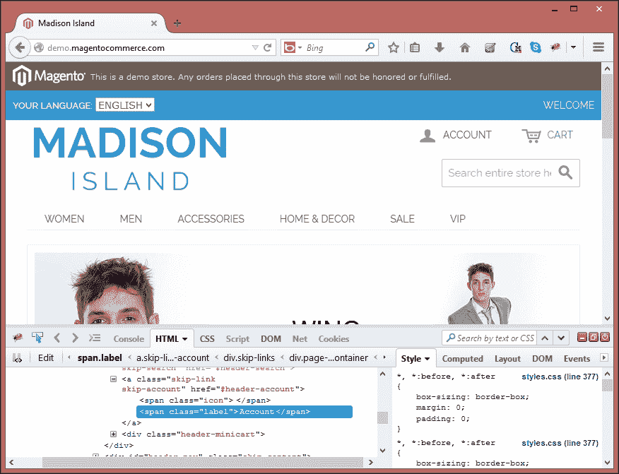
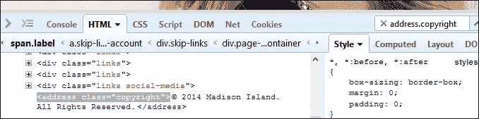
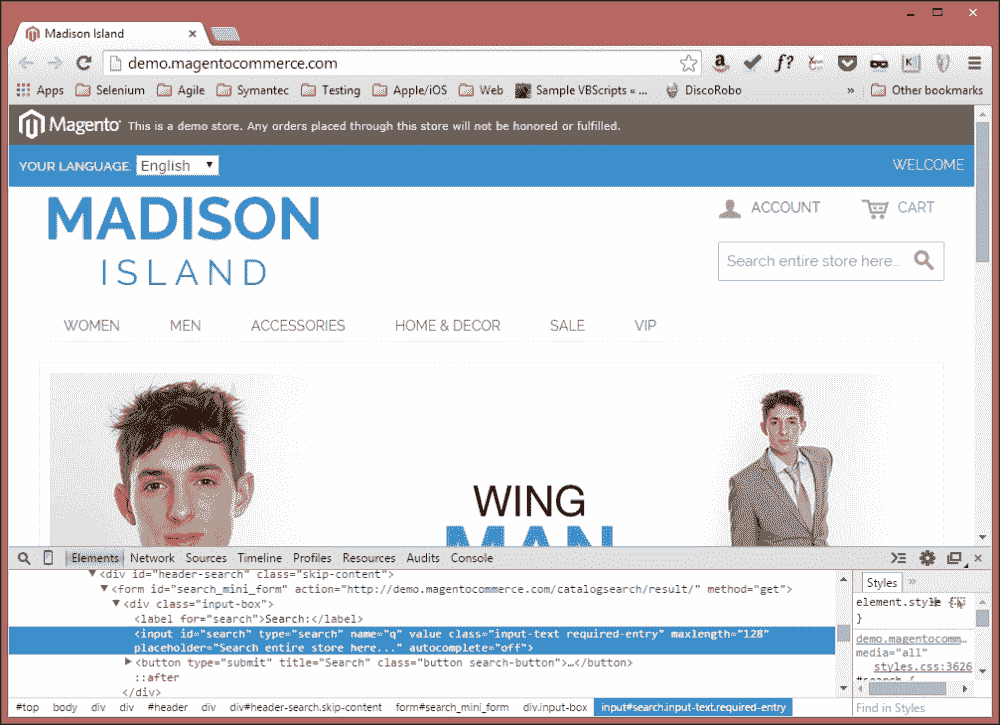
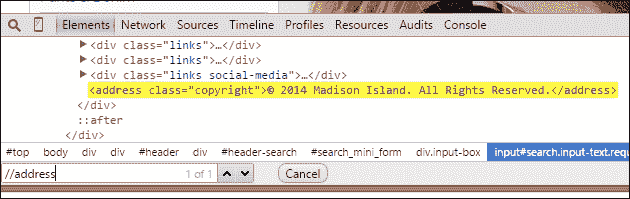
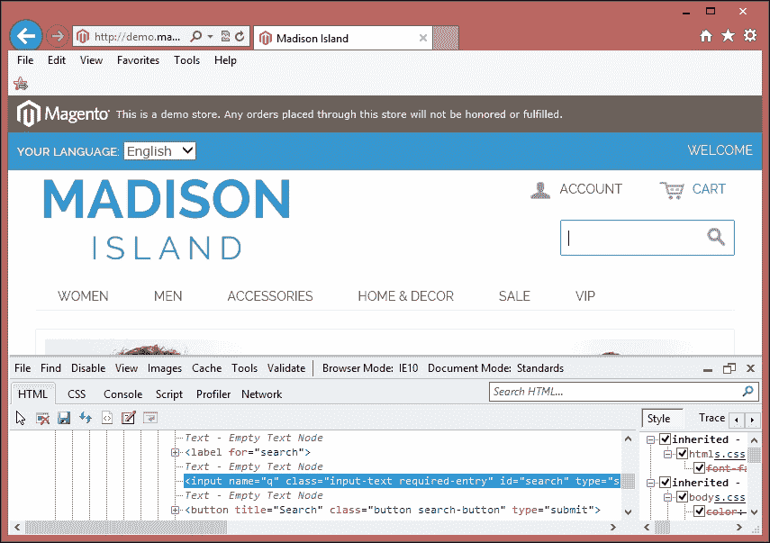
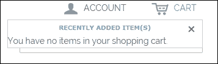
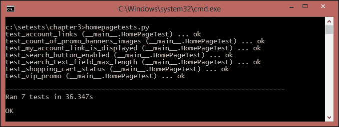

# 第三章：查找元素

网络应用程序以及这些应用程序中的网页是用**超文本标记语言**（**HTML**）、**层叠样式表**（**CSS**）和 JavaScript 代码混合编写的。基于用户操作，如导航到网站**统一资源定位符**（**URL**）或点击提交按钮，浏览器向网络服务器发送请求。网络服务器处理此请求，并将带有 HTML 和相关资源（如 JavaScript、CSS 和图像等）的响应发送回浏览器。从服务器接收到的信息被浏览器用于在页面上渲染带有各种视觉元素（如文本框、按钮、标签、表格、表单、复选框、单选按钮、列表、图像等）的网页。在此过程中，浏览器隐藏了 HTML 代码和相关资源。用户在浏览器窗口中看到一个图形用户界面。页面上使用的各种视觉元素或控件在 Selenium 中被称为**WebElements**。

在本章中，我们将涵盖以下主题：

+   更深入地了解使用 Selenium WebDriver 查找元素

+   理解如何使用各种浏览器中可用的开发者工具选项来调查和定义定位器，以找到元素

+   探索各种查找元素的方法，包括`ID`、`Name`和`Class`属性值，并使用 XPath 和 CSS 选择器定义更动态的定位器

+   实现各种`find_element_by`方法来找到元素，以便我们可以使用 Selenium WebDriver 自动化这些元素的交互

当我们想要使用 Selenium 自动化浏览器交互时，我们需要告诉 Selenium 如何以编程方式在网页上找到特定元素或一组元素，并模拟对这些元素的用户操作。Selenium 提供了各种选择器或定位器方法，根据我们提供的属性/值标准或脚本中的选择器值来查找元素。

我们如何找到选择器或定位信息？网页是用 HTML、CSS 和 JavaScript 混合编写的。我们可以通过查看网页的 HTML 源代码来获取这些信息。我们需要找到有关我们想要与之交互的元素使用的 HTML 标签、定义的属性以及属性值和页面结构的信息。让我们看看我们正在测试的应用程序中的一个示例表单。以下截图显示了示例应用程序中的搜索字段和搜索（放大镜）图标：


让我们看看为搜索表单编写的 HTML 代码：

```py
<form id="search_mini_form" action="http://demo.magentocommerce.com/catalogsearch/result/" method="get">
    <div class="form-search">
        <label for="search">Search:</label>
        <input id="search" type="text" name="q" value="" class="input-text" maxlength="128" />
        <button type="submit" title="Search" class="button"><span><span>Search</span></span></button>
        <div id="search_autocomplete" class="search-autocomplete"></div>
        <script type="text/javascript">
        //<![CDATA[
            var searchForm = new Varien.searchForm('search_mini_form', 'search', 'Search entire store here...');
            searchForm.initAutocomplete('http://demo.magentocommerce.com/catalogsearch/ajax/suggest/', 'search_autocomplete');
        //]]>
        </script>
    </div>
</form>
```

每个元素，如搜索文本框和搜索按钮，都是使用`<form>`标签内的`<input>`标签实现的，标签则是使用`<label>`标签实现的。在`<script>`标签中还有一些 JavaScript 代码。

表示为`<input>`标签的搜索文本框定义了`id`、`type`、`name`、`value`、`class`和`maxlength`属性：

```py
<input id="search" type="text" name="q" value="" class="input-text" maxlength="128" />
```

我们可以通过在浏览器窗口上右键单击并从弹出菜单中选择**查看页面源代码**选项来查看为页面编写的代码。它将在单独的窗口中显示页面的 HTML 和客户端 JavaScript 代码。

### 小贴士

如果您对 HTML、CSS 和 JavaScript 不太熟悉，那么查看一些有用的教程可能值得，这些教程位于[`www.w3schools.com/`](http://www.w3schools.com/)。这些教程将帮助您使用 Selenium WebDriver 支持的不同方式来识别定位器。

# 使用开发者工具查找定位器

在编写 Selenium 测试时，我们通常会需要查看网页代码，可能需要特殊工具以结构化和易于理解的方式显示信息。好消息是，大多数浏览器都有内置功能或插件来帮助我们。这些工具为我们提供了一种整洁且清晰的方式来理解页面上的元素及其属性定义、DOM 结构、JavaScript 块、CSS 样式属性等。让我们更详细地探索这些工具，看看我们如何使用它们。

## 使用 Firefox 和 Firebug 插件检查页面和元素

更新版本的 Firefox 提供了内置的方式来分析和页面元素；然而，我们将遵循以下步骤使用功能更强大的 Firebug 插件：

1.  您需要在 Firefox 中下载并安装 Firebug 插件，可从[`addons.mozilla.org/en-us/firefox/addon/firebug/`](https://addons.mozilla.org/en-us/firefox/addon/firebug/)获取。

1.  要使用 Firebug 检查页面，将鼠标移至所需元素上，然后右键单击以打开弹出菜单。

1.  从弹出菜单中选择**使用 Firebug 检查元素**选项。

    这将显示 Firebug 部分以及关于页面和所选元素的详细信息，包括以树形格式显示的 HTML 代码，如下面的截图所示：

    

1.  使用 Firebug，我们还可以通过 Firebug 部分显示的搜索框验证 XPath 或 CSS 选择器。只需输入 XPath 或 CSS 选择器，Firebug 就会突出显示与表达式匹配的元素（s），如下面的截图所示：

## 使用 Google Chrome 检查页面和元素

Google Chrome 提供了一个内置功能来分析元素或页面。您可以通过遵循以下步骤检查页面和元素：

1.  将鼠标移至页面上的所需元素上，然后右键单击以打开弹出菜单；然后选择**检查元素**选项。

    这将在浏览器中打开开发者工具，显示与 Firebug 类似的信息，如下面的截图所示：

    

1.  与 Firefox 中的 Firebug 类似，我们还可以在 Google Chrome 开发者工具中测试 XPath 和 CSS 选择器。在**元素**选项卡中按*Ctrl* + *F*。这将显示一个搜索框。只需输入 XPath 或 CSS 选择器，Firebug 就会突出显示与表达式匹配的元素（s），如下面的截图所示：

## 使用 Internet Explorer 检查页面和元素

Microsoft Internet Explorer 也提供了内置功能来分析元素或页面。你可以按照以下步骤检查页面和元素：

1.  要打开开发者工具，按*F12*键。开发者工具部分将在浏览器底部显示。

1.  要检查一个元素，点击指针图标，并将鼠标悬停在页面上的目标元素上。开发者工具将以蓝色轮廓突出显示该元素，并在以下截图所示的树中显示 HTML 代码：

在编写测试时，你会发现这些工具非常有用。其中一些工具还提供了运行 JavaScript 代码进行调试和测试的能力。

# 使用 Selenium WebDriver 查找元素

我们需要告诉 Selenium 如何查找一个元素，以便它可以模拟一个期望的用户操作，或者查看一个元素的属性或状态，以便我们可以执行检查。例如，如果我们想搜索一个产品，我们需要通过视觉上找到搜索文本框和搜索按钮。我们通过按键盘上的各种键来输入搜索词，然后点击搜索按钮来提交我们的搜索请求。

我们可以使用 Selenium 自动化相同的操作。然而，Selenium 并不像我们那样理解这些字段或按钮的视觉信息。它需要找到搜索文本框和搜索按钮，以模拟程序化的键盘输入和鼠标点击。

Selenium 提供了各种`find_element_by`方法来在网页上查找元素。这些方法根据提供给它们的准则搜索元素。如果找到匹配的元素，则返回`WebElement`实例；如果 Selenium 无法找到任何匹配搜索准则的元素，则抛出`NoSuchElementException`异常。

Selenium 还提供了各种`find_elements_by`方法来定位多个元素。这些方法根据提供的值搜索并返回匹配的元素列表。

## 使用查找方法

Selenium 提供了八个`find_element_by`方法来定位元素。在本节中，我们将详细查看每一个。以下表格列出了`find_element_by`方法：

| 方法 | 描述 | 参数 | 示例 |
| --- | --- | --- | --- |
| `find_element_by_id(id)` | 通过 ID 属性值查找元素 | `id`：要查找的元素的 ID | `driver.find_element_by_id('search')` |
| `find_element_by_name(name)` | 通过名称属性值查找元素的方法 | `name`: 要查找的元素名称 | `driver.find_element_by_name('q')` |
| `find_element_by_class_name(name)` | 通过类属性值查找元素的方法 | `name`: 要查找的元素类名 | `driver.find_element_by_class_name('input-text')` |
| `find_element_by_tag_name(name)` | 通过标签名查找元素的方法 | `name`: 要查找的元素标签名 | `driver.find_element_by_tag_name('input')` |
| `find_element_by_xpath(xpath)` | 使用 XPath 查找元素的方法 | `xpath`: 要查找的元素 XPath | `driver.find_element_by_xpath('//form[0]/div[0]/input[0]')` |
| `find_element_by_css_selector(css_selector)` | 通过 CSS 选择器查找元素的方法 | `css_selector`: 要查找的元素 CSS 选择器 | `driver.find_element_by_css_selector('#search')` |
| `find_element_by_link_text(link_text)` | 通过链接文本查找元素的方法 | `link_text`: 要查找的元素文本 | `driver.find_element_by_link_text('Log In')` |
| `find_element_by_partial_link_text(link_text)` | 通过部分匹配链接文本查找元素的方法 | `link_text`: 匹配元素部分文本的文本 | `driver.find_element_by_partial_link_text('Log')` |

以下表格列出了返回匹配指定条件的元素列表的`find_elements_by`方法：

| 方法 | 描述 | 参数 | 示例 |
| --- | --- | --- | --- |
| `find_elements_by_id(id_)` | 使用 ID 查找多个元素的方法 | `id_`: 要查找的元素 ID | `driver.find_element_by_id('product')` |
| `find_elements_by_name(name)` | 使用名称查找元素的方法 | `name`: 要查找的元素名称 | `driver.find_elements_by_name('products')` |
| `find_elements_by_class_name(name)` | 使用类名查找元素的方法 | `name`: 要查找的元素类名 | `driver.find_elements_by_class_name('foo')` |
| `find_elements_by_tag_name(name)` | 使用标签名查找元素的方法 | `name`: 要查找的元素标签名 | `driver.find_elements_by_tag_name('a')` |
| `find_elements_by_xpath(xpath)` | 通过 XPath 查找多个元素的方法 | `xpath`: 要查找的元素 XPath | `driver.find_elements_by_xpath("//div[contains(@class, 'lists')]")` |
| `find_elements_by_css_selector(css_selector)` | 使用 CSS 选择器查找元素的方法 | `css_selector`: 要查找的元素 CSS 选择器 | `driver.find_element_by_css_selector('.input-class')` |
| `find_elements_by_link_text(text)` | 使用链接文本查找元素的方法 | `text`: 要查找的元素文本 | `driver.find_elements_by_link_text('Log In')` |
| `find_elements_by_partial_link_text(link_text)` | 此方法通过元素链接文本的部分匹配来查找元素 | `link_text`: 匹配元素文本的一部分的文本 | `driver.find_element_by_partial_link_text('Add to,')` |

### 使用 ID 属性查找元素

使用 ID 查找页面上的元素是最受欢迎的方法。`find_element_by_id()`和`find_elements_by_id()`方法返回具有匹配 ID 属性值的元素或一组元素。

`find_element_by_id()`方法返回第一个具有匹配 ID 属性值的元素。如果没有找到具有匹配 ID 属性值的元素，将引发`NoSuchElementException`。

让我们尝试从以下截图所示的示例应用程序中找到搜索文本框：


下面是具有 ID 属性值定义为`search`的搜索文本框的 HTML 代码：

```py
<input id="search" type="text" name="q" value="" class="input-text" maxlength="128" autocomplete="off">
```

下面是一个使用`find_element_by_id()`方法查找搜索文本框并检查其`maxlength`属性的测试示例。我们将传递 ID 属性值`search`到`find_element_by_id()`方法：

```py
def test_search_text_field_max_length(self):
  # get the search textbox
  search_field = self.driver.find_element_by_id("search")

  # check maxlength attribute is set to 128
  self.assertEqual("128", search_field.get_attribute("maxlength"))
```

`find_elements_by_id()`方法返回所有具有相同 ID 属性值的元素。

### 使用名称属性查找元素

通过其名称属性值查找元素是另一种受欢迎的方法。`find_element_by_name()`和`find_elements_by_name()`方法返回具有匹配名称属性值的元素（s）。如果没有找到具有匹配名称属性值的元素，将引发`NoSuchElementException`。

在前面的示例中，我们可以使用名称属性值而不是 ID 属性值以以下方式找到搜索文本框：

```py
# get the search textbox
self.search_field = self.driver.find_element_by_name("q")

```

`find_elements_by_name()`方法返回所有具有相同名称属性值的元素。

### 使用类名查找元素

除了使用 ID 和名称属性外，我们还可以使用类属性来查找元素。类属性用于将 CSS 应用于元素。`find_element_by_class_name()`和`find_elements_by_class_name()`方法返回具有匹配类属性值的元素（s）。如果没有找到具有匹配名称属性值的元素，将引发`NoSuchElementException`。

### 小贴士

使用 ID、名称或类属性查找元素是查找元素最受欢迎和最快的方法。Selenium WebDriver 还提供了一套方法，当这些方法不足以查找元素时。我们将在本章后面看到这些方法。

让我们使用`find_element_by_class_name()`方法通过其类属性值找到以下截图显示的搜索按钮：


搜索按钮（放大镜图标）是通过具有类型、标题和类属性值的`<button>`元素实现的，如下面的 HTML 代码所示：

```py
<button type="submit" title="Search" class="button"><span><span>Search</span></span></button>
```

让我们创建一个测试，使用其类属性值查找搜索按钮元素，并检查它是否启用，如下面的代码所示：

```py
def test_search_button_enabled(self):
    # get Search button
    search_button = self.driver.find_element_by_class_name("button")

    # check Search button is enabled
    self.assertTrue(search_button.is_enabled())
```

`find_elements_by_class_name()` 方法返回所有具有相同类名属性值的元素。

### 使用标签名查找元素

`find_element_by_tag_name()` 和 `find_elements_by_tag_name()` 方法通过元素的 HTML 标签名来查找元素。这些方法与 JavaScript 中的 `getElementsByTagName()` DOM 方法类似。如果找不到匹配的标签名的元素，将抛出 `NoSuchElementException` 异常。

当我们想要通过标签名查找元素时，这些方法很有用。例如，为了找到表格中的所有 `<tr>` 标签以确定行数。

示例应用的首页显示了促销横幅图像，如下面的截图所示：


这些横幅是通过在 `<ul>` 或无序列表标签内使用 `` 或图像标签实现的，如下面的 HTML 代码所示：

```py
<ul class="promos">
    <li>
        <a href="http://demo.magentocommerce.com/home-decor.html"> 
             
        </a>
    </li>
    <li>
        <a href="http://demo.magentocommerce.com/vip.html"> 
            
        </a>
    </li>
    <li>
        <a href="http://demo.magentocommerce.com/accessories/bags-luggage.html"> 
            
        </a>
    </li>
</ul>
```

我们将使用 `find_elements_by_tag_name()` 方法获取所有图像。在这个例子中，我们将首先使用 `find_element_by_class_name()` 方法找到实现为 `<ul>` 或无序列表的横幅列表，然后通过在横幅列表上调用 `find_elements_by_tag_name()` 方法来获取所有 `` 或图像元素。

```py
def test_count_of_promo_banners_images(self):
    # get promo banner list
    banner_list = self.driver.find_element_by_class_name("promos")

    # get images from the banner_list
    banners = banner_list.find_elements_by_tag_name("img")

    # check there are 20 tags displayed on the page
    self.assertEqual(2, len(banners))
```

### 使用 XPath 查找元素

XPath 是一种查询语言，用于在 XML 文档中搜索和定位节点。所有主要的网络浏览器都支持 XPath。Selenium 可以利用并使用强大的 XPath 查询来查找网页上的元素。

使用 XPath 的一个优点是，当我们无法为元素找到合适的 ID、name 或 class 属性值时。我们可以使用 XPath 来在绝对术语中查找元素，或者相对于具有 ID 或 name 属性的元素查找。我们还可以使用 XPath 查询中定义的除 ID、name 或 class 之外的属性。我们还可以使用 XPath 函数如 `starts-with()`、`contains()` 和 `ends-with()` 来对属性值进行部分检查以查找元素。

### 小贴士

要了解更多关于 XPath 的信息，请访问 [`www.w3schools.com/Xpath/`](http://www.w3schools.com/Xpath/) 和 [`www.zvon.org/comp/r/tut-XPath_1.html`](http://www.zvon.org/comp/r/tut-XPath_1.html)。

你可以在 *Selenium Testing Tools Cookbook*，*Packt Publishing* 一书中了解更多关于 XPath 定位符的信息。

`find_element_by_xpath()` 和 `find_elements_by_xpath()` 方法返回通过指定的 XPath 查询找到的元素。例如，我们可以检查主页上显示的促销横幅是否按预期工作，并且我们可以使用这些图像打开促销页面，如下面的截图所示：


以下是 Shop Private Sales 标签定义为 `` 标签的方式。该图像没有定义 ID、name 或 class 属性。此外，我们无法使用 `find_by_tag_name()` 方法，因为页面上定义了多个 `` 标签。然而，通过查看以下 HTML 代码，我们可以使用 `alt` 属性获取 `` 标签：

```py
<ul class="promos">
    ...
    <li>
        <a href="http://demo.magentocommerce.com/vip.html"> 
            
        </a>
    </li>
    ...
</ul>
```

让我们创建一个使用 `find_element_by_xpath()` 方法的测试。我们使用相对 XPath 查询，通过其 `alt` 属性来查找这个 `` 标签（这就是我们如何在 XPath 查询中使用 ID、name 和 class 属性以及其他属性，如 `title`、`type`、`value`、`alt` 等）：

```py
def test_vip_promo(self):
    # get vip promo image
    vip_promo = self.driver.\
        find_element_by_xpath("//img[@alt='Shop Private Sales - Members Only']")

    # check vip promo logo is displayed on home page
    self.assertTrue(vip_promo.is_displayed())
    # click on vip promo images to open the page
    vip_promo.click()
    # check page title
    self.assertEqual("VIP",  self.driver.title)
```

`find_elements_by_xpath()` 方法返回所有与 XPath 查询匹配的元素。

### 使用 CSS 选择器查找元素

CSS 是一种样式表语言，由网页设计师用来描述 HTML 文档的外观和感觉。CSS 用于定义可以应用于元素的样式类，以便进行格式化。CSS 选择器用于根据元素的属性（如 ID、类、类型、属性或值等）查找 HTML 元素，以便应用定义的 CSS 规则。

与 XPath 类似，Selenium 可以利用并使用 CSS 选择器来查找网页上的元素。要了解更多关于 CSS 选择器的信息，请访问 [`www.w3schools.com/css/css_selectors.asp`](http://www.w3schools.com/css/css_selectors.asp) 和 [`www.w3.org/TR/CSS2/selector.html`](http://www.w3.org/TR/CSS2/selector.html)。

`find_element_by_css_selector()` 和 `find_elements_by_css_selector()` 方法返回由指定的 CSS 选择器找到的元素。

在示例应用的首页上，我们可以看到购物车图标。当我们点击图标时，我们可以看到购物车。当购物车中没有添加任何项目时，应该显示一条消息说 **您的购物车中没有商品**，如图所示：



这在以下 HTML 代码中实现：

```py
<div class="minicart-wrapper">
<p class="block-subtitle">
    Recently added item(s) 
    <a class="close skip-link-close" href="#" title="Close">×</a>
</p>
    <p class="empty">You have no items in your shopping cart.</p>
</div>
```

让我们创建一个测试来验证这个消息。我们将使用 CSS 选择器来查找购物车图标，点击它，然后找到 `<p>` 或段落元素中实现的购物车消息：

```py
def test_shopping_cart_status(self):
    # check content of My Shopping Cart block on Home page
    # get the Shopping cart icon and click to open the # Shopping Cart section
    shopping_cart_icon = self.driver.\
        find_element_by_css_selector("div.header-minicart span.icon")
    shopping_cart_icon.click()

    # get the shopping cart status 
    shopping_cart_status = self.driver.\
        find_element_by_css_selector("p.empty").text
    self.assertEqual("You have no items in your shopping cart.", shopping_cart_status)
    # close the shopping cart section
    close_button = self.driver.\
        find_element_by_css_selector("div.minicart-wrapper a.close")
    close_button.click()  
```

在这个例子中，我们使用了元素标签和类名。例如，要获取购物车图标，我们使用了以下选择器：

```py
shopping_cart_icon = self.driver.\
        find_element_by_css_selector("div.header-minicart span.icon")
```

这将首先找到一个具有 `header_minicart` 类名的 `<div>` 元素，然后找到该 `div` 下的 `<span>` 元素，其类名为 `icon`。

你可以在 *Selenium 测试工具手册*，*Packt 出版* 中找到更多关于 CSS 选择器的信息。

### 查找链接

`find_element_by_link_text()` 和 `find_elements_by_link_text()` 方法通过链接显示的文本来查找链接。例如：

1.  要获取主页上显示的 **Account** 链接，如图所示，我们可以使用 `find_element_by_link_text()` 方法：

1.  下面是**账户**链接的 HTML 代码，它被实现为`<a>`（或锚标签）和`<span>`标签，并带有文本：

    ```py
    <a href="#header-account" class="skip-link skip-account">
      <span class="icon"></span>
      <span class="label">Account</span>
    </a>
    ```

1.  让我们创建一个测试，使用文本定位**账户**链接，并检查它是否显示：

    ```py
        def test_my_account_link_is_displayed(self):
            # get the Account link
            account_link = self.driver.find_element_by_link_text("ACCOUNT")

            # check My Account link is displayed/visible in
    		# the Home page footer
            self.assertTrue(account_link.is_displayed())
    ```

`find_elements_by_link_text()` 方法获取所有具有匹配链接文本的链接元素。

### 使用部分文本查找链接

`find_element_by_partial_link_text()` 和 `find_elements_by_partial_link_text()` 方法通过部分文本查找链接。这些方法在需要使用部分文本值查找链接时非常有用。以下步骤可作为示例：

1.  在应用程序的首页上，显示两个链接以打开账户页面：一个在页眉部分，文本为`Account`，另一个在页脚部分，文本为`My Account`。

1.  让我们使用 `find_elements_by_partial_link_text()` 方法使用`Account`文本查找这些链接，并检查页面上是否有两个这样的链接可用：

    ```py
    def test_account_links(self):
        # get the all the links with Account text in it
        account_links = self.driver.\
            find_elements_by_partial_link_text("ACCOUNT")

        # check Account and My Account link is displayed/visible in the Home page footer
        self.assertTrue(2, len(account_links))
    ```

# 使用查找方法汇总所有测试

在前面的章节中，我们看到了各种 `find_element_by` 方法及其示例。现在让我们将这些示例汇总到一个测试中。

1.  创建一个新的 `homepagetest.py` 文件，并将我们之前创建的所有测试复制进去，如下代码所示：

    ```py
    import unittest
    from selenium import webdriver

    class HomePageTest(unittest.TestCase):
        @classmethod
        def setUpClass(cls):
            # create a new Firefox session
            cls.driver = webdriver.Firefox()
            cls.driver.implicitly_wait(30)
            cls.driver.maximize_window()

            # navigate to the application home page
            cls.driver.get('http://demo.magentocommerce.com/')

        def test_search_text_field_max_length(self):
            # get the search textbox
            search_field = self.driver.find_element_by_id("search")

            # check maxlength attribute is set to 128
            self.assertEqual("128", search_field.get_attribute ("maxlength"))

        def test_search_button_enabled(self):
            # get Search button
            search_button = self.driver.find_element_by_class_name("button")

            # check Search button is enabled
            self.assertTrue(search_button.is_enabled())

        def test_my_account_link_is_displayed(self):
            # get the Account link
            account_link = self.driver.find_element_by_link_text("ACCOUNT")

            # check My Account link is displayed/visible in # the Home page footer
            self.assertTrue(account_link.is_displayed())

        def test_account_links(self):
            # get the all the links with Account text in it
            account_links = self.driver.\
                find_elements_by_partial_link_text("ACCOUNT")

            # check Account and My Account link is
    		# displayed/visible in the Home page footer
            self.assertTrue(2, len(account_links))

        def test_count_of_promo_banners_images(self):
            # get promo banner list
            banner_list = self.driver.find_element_by_class_name("promos")

            # get images from the banner_list
            banners = banner_list.find_elements_by_tag_name("img")

            # check there are 3 banners displayed on the page
            self.assertEqual(2, len(banners))

        def test_vip_promo(self):
            # get vip promo image
            vip_promo = self.driver.\
                find_element_by_xpath("//img[@alt='Shop Private Sales - Members Only']")

            # check vip promo logo is displayed on home page
            self.assertTrue(vip_promo.is_displayed())
            # click on vip promo images to open the page
            vip_promo.click()
            # check page title
            self.assertEqual("VIP", self.driver.title)

        def test_shopping_cart_status(self):
            # check content of My Shopping Cart block
    		# on Home page
            # get the Shopping cart icon and click to # open the Shopping Cart section
            shopping_cart_icon = self.driver.\
                find_element_by_css_selector("div.header-minicart span.icon")
            shopping_cart_icon.click()

            # get the shopping cart status
            shopping_cart_status = self.driver.\
                find_element_by_css_selector("p.empty").text
            self.assertEqual("You have no items in your shopping cart.", shopping_cart_status)
            # close the shopping cart section
            close_button = self.driver.\
              find_element_by_css_selector("div.minicart-wrapper a.close")
            close_button.click()

        @classmethod
        def tearDownClass(cls):
            # close the browser window
            cls.driver.quit()

    if __name__ == '__main__':
        unittest.main(verbosity=2)
    ```

1.  让我们使用以下命令通过命令行执行所有测试：

    ```py
    python homepagetest.py

    ```

1.  运行测试后，`unittest` 显示运行了七个测试，并且所有测试都通过了，状态为 OK，如下截图所示：

# 概述

在本章中，你学习了 Selenium 最重要的功能之一，即如何在网页上查找元素以模拟用户操作。

我们研究了各种 `find_element_by_` 方法，用于通过 ID、name、class name 属性、标签名、XPath、CSS 选择器查找元素，以及使用链接文本和部分链接文本查找链接。

我们使用各种 `find_element_by` 方法实现了测试，以了解我们可以使用的各种查找元素策略。

本章将是后续章节的基础，这些章节将深入探讨使用 Selenium API 进行用户交互。

在下一章中，你将学习如何使用 Selenium WebDriver 函数与各种 HTML 元素交互，并执行诸如在文本框中输入值、点击按钮、选择下拉选项、处理 JavaScript 警告以及与框架和窗口一起工作等操作。
