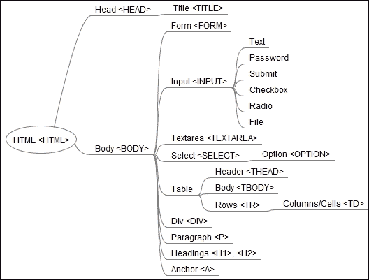
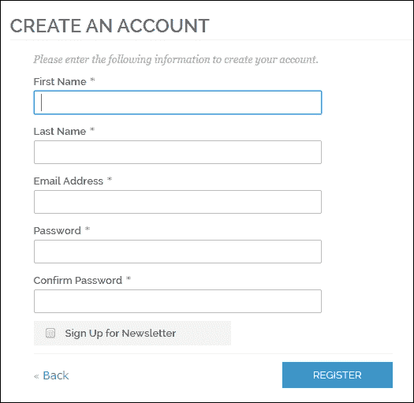
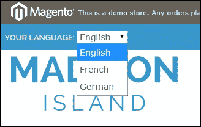

# 第四章：使用 Selenium Python API 进行元素交互

网络应用程序使用 HTML 表单将数据发送到服务器。HTML 表单包含输入元素，如文本字段、复选框、单选按钮、提交按钮等。表单还可以包含选择列表、文本区域、字段集、图例和标签元素。

一个典型的网络应用程序需要你填写许多表单，从注册用户或搜索产品开始。表单被 HTML `<form>` 标签包围。此标签指定提交数据的方法，是使用 `GET` 还是 `POST` 方法，以及表单中输入的数据应在服务器上的哪个地址提交。

在本章中，我们将介绍以下主题：

+   深入了解 `WebDriver` 和 `WebElement` 类

+   实现使用 `WebDriver` 和 `WebElement` 类的各种方法和属性与应用程序交互的测试

+   使用 `Select` 类自动化下拉列表和列表

+   自动化 JavaScript 警报和浏览器导航

# HTML 表单的元素

HTML 表单由不同类型的元素组成，包括 `<form>`、`<input>`、`<button>` 和 `<label>`，如下所示。网络开发人员使用这些元素来设计网页以显示数据或从用户那里接收数据。开发人员编写网页的 HTML 代码以定义这些元素。然而，作为最终用户，我们把这些元素看作是 **图形用户界面** (**GUI**) 控件，如文本框、标签、按钮、复选框和单选按钮。HTML 代码对最终用户是隐藏的。



Selenium WebDriver 提供了广泛的支持，用于自动化与这些元素的交互以及检查应用程序的功能。

# 理解 WebDriver 类

`WebDriver` 类提供了一系列用于浏览器交互的属性或属性。我们可以使用 `WebDriver` 类的属性和方法与浏览器窗口、警报、框架和弹出窗口进行交互。它还提供了自动化浏览器导航、访问 cookies、捕获屏幕截图等功能。在本章中，我们将探讨 `WebDriver` 类的一些最重要的功能。以下表格涵盖了本书其余部分将使用的一些最重要的属性和方法。

### 注意

要查看属性和方法的完整列表，请访问 [`selenium.googlecode.com/git/docs/api/py/webdriver_remote/selenium.webdriver.remote.webdriver.html#module-selenium.webdriver.remote.webdriver`](http://selenium.googlecode.com/git/docs/api/py/webdriver_remote/selenium.webdriver.remote.webdriver.html#module-selenium.webdriver.remote.webdriver).

## WebDriver 类的属性

`WebDriver` 类实现了以下属性以访问浏览器：

| 属性/属性 | 描述 | 示例 |
| --- | --- | --- |
| `current_url` | 获取浏览器中当前显示的页面的 URL | `driver.current_url` |
| `current_window_handle` | 获取当前窗口的句柄 | `driver.current_window_handle` |
| `name` | 获取此实例的底层浏览器的名称 | `driver.name` |
| `orientation` | 获取设备的当前方向 | `driver.orientation` |
| `page_source` | 获取当前页面的源代码 | `driver.page_source` |
| `title` | 获取当前页面的标题 | `driver.title` |
| `window_handles` | 获取当前会话中所有窗口的句柄 | `driver.window_handles` |

## WebDriver 类的方法

WebDriver 类实现了各种方法来与浏览器窗口、网页以及这些页面上的元素进行交互。以下是重要方法的列表：

| 方法 | 描述 | 参数 | 示例 |
| --- | --- | --- | --- |
| `back()` | 在当前会话的浏览器历史记录中后退一步。 |   | `driver.back()` |
| `close()` | 关闭当前浏览器窗口。 |   | `driver.close()` |
| `forward()` | 在当前会话的浏览器历史记录中向前一步。 |   | `driver.forward()` |
| `get(url)` | 在当前浏览器会话中导航并加载一个网页。 | `url` 是要导航的网站或网页的地址 | `driver.get("http://www.google.com")` |
| `maximize_window()` | 最大化当前浏览器窗口。 |   | `driver.maximize_window()` |
| `quit()` | 退出驱动程序并关闭所有相关窗口。 |   | `driver.quit()` |
| `refresh()` | 刷新浏览器中显示的当前页面。 |   | `driver.refresh()` |
| `switch_to.active_element()` | 返回具有焦点的元素或如果没有其他元素具有焦点，则为 *body*。 |   | `driver.switch_to_active_element()` |
| `Switch.to_alert()` | 将焦点切换到页面上的一个警告框。 |   | `driver.switch_to_alert()` |
| `switch_to.default_content()` | 将焦点切换到默认框架。 |   | `driver.switch_to_default_content()` |
| `switch_to.frame(frame_reference)` | 通过索引、名称或网页元素将焦点切换到指定的框架。此方法也适用于 `IFRAMES`。 | `frame_reference`：这是要切换到的窗口的名称，一个表示索引的整数，或一个要切换到的框架的网页元素 | `driver.switch_to_frame('frame_name')` |
| `switch_to.window(window_name)` | 将焦点切换到指定的窗口。 | `window_name` 是要切换到的窗口的名称或窗口句柄。 | `driver.switch_to_window('main')` |
| `implicitly_wait(time_to_wait)` | 这将设置一个粘性超时，隐式等待元素被找到或命令完成。此方法在每个会话中只需要调用一次。要设置对 `execute_async_script` 的调用超时，请参阅 `set_script_timeout`。 | `time_to_wait` 是等待时长（以秒为单位）。 |   |
| `set_page_load_timeout(time_to_wait)` | 这将设置等待页面加载完成的时长。 | `time_to_wait` 是等待时长（以秒为单位）。 | `driver.set_page_load_timeout(30)` |
| `set_script_timeout(time_to_wait)` | 这将在抛出错误之前设置脚本在 `execute_async_script` 调用期间应等待的时长。 | `time_to_wait` 是等待时长（以秒为单位）。 | `driver.set_script_timeout(30)` |

# 理解 WebElement 类

我们可以使用 `WebElement` 类与网页上的元素进行交互。我们可以使用 `WebElement` 类与文本框、文本区域、按钮、单选按钮、复选框、表格、表格行、表格单元格、div 等元素进行交互。

`WebElemet` 类提供了一系列属性、方法来与元素交互。下表涵盖了本书其余部分将使用的一些最重要的属性和方法。要获取属性和方法的完整列表，请访问 [`selenium.googlecode.com/git/docs/api/py/webdriver_remote/selenium.webdriver.remote.webelement.html#module-selenium.webdriver.remote.webelement`](http://selenium.googlecode.com/git/docs/api/py/webdriver_remote/selenium.webdriver.remote.webelement.html#module-selenium.webdriver.remote.webelement)。

## WebElement 类的属性

`WebElement` 类实现了以下属性：

| 属性/属性 | 描述 | 示例 |
| --- | --- | --- | --- |
| `size` | 这将获取元素的大小 | `element.size` |
| `tag_name` | 这将获取此元素的 HTML 标签名 | `element.tag_name` |
| `text` | 这将获取元素的文本 | `element.text` |

## WebElement 类的方法

`WebElement` 类实现了以下方法：

| 方法 | 描述 | 参数 | 示例 |
| --- | --- | --- | --- |
| `clear()` | 这将清除文本框或文本区域元素的内容。 |   | `element.clear()` |
| `click()` | 这将点击元素。 |   | `element.click()` |
| `get_attribute(name)` | 这将从元素中获取属性值。 | `name` 是属性名。 | `element.get_attribute("value")` 或 `element.get_attribute("maxlength")` |
| `is_displayed()` | 这将检查元素是否对用户可见。 |   | `element.is_displayed()` |
| `is_enabled()` | 这将检查元素是否启用。 |   | `element.is_enabled()` |
| `is_selected()` | 这将检查元素是否被选中。此方法用于检查单选按钮或复选框的选择。 |   | `element.is_selected()` |
| `send_keys(*value)` | 这将模拟在元素中输入。 | `Value` 是用于输入或设置表单字段的字符串。 | `element.send_keys("foo")` |
| `submit()` | 这将提交一个表单。如果你在元素上调用此方法，它将提交父表单。 |   | `element.submit()` |
| `value_of_css_property(property_name)` | 这将获取 CSS 属性的值。 | `property_name` 是 CSS 属性的名称。 | `element.value_of_css_property("background-color")` |

# 与表单、文本框、复选框和单选按钮一起工作

我们可以使用 `WebElement` 类来自动化各种 HTML 控件的交互，例如在文本框中输入文本、点击按钮、在复选框或单选按钮中选择选项、从元素获取文本和属性值等。

我们在本章前面看到了 `WebElement` 类提供的属性和方法。在本节中，我们将使用 `WebElement` 类及其属性和方法来自动化示例应用程序的创建账户功能。因此，让我们创建一个测试来验证在示例应用程序中创建新用户账户。我们将填写以下截图所示的表单并提交我们的请求。然后系统应该创建一个新的用户账户：



如前述截图所示，我们需要填写五个文本框并选择一个复选框来订阅通讯。

1.  首先，根据以下代码创建一个新的测试类 `RegisterNewUser`：

    ```py
    from selenium import webdriver
    import unittest

    class RegisterNewUser(unittest.TestCase):
        def setUp(self):
            self.driver = webdriver.Firefox
            self.driver.implicitly_wait(30)
            self.driver.maximize_window()

            # navigate to the application home page
            self.driver.get("http://demo.magentocommerce.com/")
    ```

1.  向 `RegisterNewUser` 类添加一个测试，`test_register_new_user(self)`。

1.  要打开登录页面，我们需要点击主页上的“登录”链接。以下是对“登录”按钮的代码：

    ```py
        def test_register_new_user(self):
            driver = self.driver

            # click on Log In link to open Login page
            driver.find_element_by_link_text("Log In").click()
    ```

## 检查元素是否显示和启用

`is_displayed()` 方法返回 `TRUE` 如果元素在屏幕上可见（可见属性设置为 `TRUE`），否则它将返回 `FALSE`。同样，`is_enabled()` 方法返回 `TRUE` 如果元素被启用，即用户可以执行点击、输入文本等操作。如果元素被禁用，此方法返回 `FALSE`。

客户登录页面有选项让注册用户登录系统或为新用户创建账户。我们可以使用 `WebElement` 类的 `is_displayed()` 和 `is_enabled()` 方法检查用户是否可以看到并启用“创建账户”按钮。将以下代码中给出的步骤添加到测试中：

```py
# get the Create Account button
        create_account_button = driver.find_element_by_xpath("//button[@title='Create an Account']")
        # check Create Account button is displayed and enabled
        self.assertTrue(create_account_button.is_displayed() and
                        create_account_button.is_enabled())
```

我们想测试“创建账户”功能，因此让我们点击“创建账户”按钮。这将显示“创建新客户账户”页面。我们可以使用 `WebDriver` 类的 `title` 属性来检查页面标题是否与我们预期的相符，如下面的代码所示：

```py
    # click on Create Account button. This will display # new account
    create_account_button.click()

    # check title
    self.assertEquals("Create New Customer Account - Magento Commerce Demo Store", driver.title)
```

在“创建新客户账户”页面上，使用以下方式使用 `find_element_by_*` 方法定位所有元素：

```py
    # get all the fields from Create an Account form
    first_name = driver.find_element_by_id("firstname")
    last_name = driver.find_element_by_id("lastname")
    email_address = driver.find_element_by_id("email_address")
    news_letter_subscription = driver.find_element_by_id("is_subscribed")
    password = driver.find_element_by_id("password")
    confirm_password = driver.find_element_by_id("confirmation")
    submit_button = driver.find_element_by_xpath("//button[@title='Submit']")
```

## 查找元素属性值

可以使用`get_attribute()`方法获取为元素定义的属性值。例如，有一个测试说，`firstname`和`lastname`文本框的最大长度应该定义为 255 个字符。以下是`firstname`文本框的 HTML 代码，其中定义了`maxlength`属性，其值为`255`，如下面的代码所示：

```py
<input type="text" id="firstname" name="firstname" value="" title="First Name" maxlength="255" class="input-text required-entry">
```

我们可以使用`WebElement`类的`get_attribute()`方法通过以下步骤断言`maxlength`属性：

1.  我们需要将属性的名称作为参数传递给`get_attribute()`方法：

    ```py
            # check maxlength of first name and last name textbox 
            self.assertEqual("255", first_name.get_attribute("maxlength"))
            self.assertEqual("255", last_name.get_attribute("maxlength"))
    ```

1.  将以下步骤添加到测试中，以确保所有字段都显示并启用供用户使用：

    ```py
    # check all fields are enabled
            self.assertTrue(first_name.is_enabled() and last_name.is_enabled() 
              and email_address.is_enabled() and news_letter_subscription.is_enabled() 
              and password.is_enabled() and confirm_password.is_enabled() 
              and submit_button.is_enabled())
    ```

## 使用`is_selected()`方法

`is_selected()`方法与复选框和单选按钮一起工作。我们可以使用此方法来了解复选框或单选按钮是否被选中。

通过使用`WebElement`类的`click()`方法执行点击操作来选择复选框或单选按钮。在这个例子中，检查默认情况下**注册新闻通讯**复选框是否未选中，如下面的代码所示：

```py
# check Sign Up for Newsletter is unchecked
        self.assertFalse(news_letter_subscription.is_selected())
```

## 使用`clear()`和`send_keys()`方法

`clear()`和`send_keys()`方法是`WebElement`类对文本框或文本区域适用的，它们用于清除元素的文本内容，并像真实用户在键盘上输入一样发送文本值。`send_keys()`方法将要在元素中输入的文本作为参数。让我们考虑以下步骤：

1.  让我们将给定的代码添加到使用`send_keys()`方法填充字段：

    ```py
            # fill out all the fields
            first_name.send_keys("Test")
            last_name.send_keys("User1")
            news_letter_subscription.click()
            email_address.send_keys("TestUser_150214_2200@example.com")
            password.send_keys("tester")
            confirm_password.send_keys("tester")
    ```

1.  最后，通过检查欢迎信息来确认用户是否已创建。我们可以使用`WebElement`类的`text`属性从元素中获取文本：

    ```py
            # check new user is registered
            self.assertEqual("Hello, Test User1!", driver.find_element_by_css_selector("p.hello > strong").text)
            self.assertTrue(driver.find_element_by_link_text("Log Out").is_displayed())
    ```

1.  这里是`创建账户`功能的完整测试。运行此测试，你将看到**创建账户**页面上所有的操作：

    ```py
    from selenium import webdriver
    from time import gmtime, strftime
    import unittest

    class RegisterNewUser(unittest.TestCase):
        def setUp(self):
            self.driver = webdriver.Firefox()
            self.driver.implicitly_wait(30)
            self.driver.maximize_window()

            # navigate to the application home page
            self.driver.get("http://demo.magentocommerce.com/")

        def test_register_new_user(self):
            driver = self.driver

            # click on Log In link to open Login page
            driver.find_element_by_link_text("ACCOUNT").click()
            driver.find_element_by_link_text("My Account").click()

            # get the Create Account button
            create_account_button = \
                driver.find_element_by_link_text("CREATE AN ACCOUNT")

            # check Create Account button is displayed # and enabled
            self.assertTrue(create_account_button.is_displayed() and create_account_button.is_enabled())

            # click on Create Account button. This will # display new account
            create_account_button.click()

            # check title
            self.assertEquals("Create New Customer Account", driver.title)

            # get all the fields from Create an Account form
            first_name = driver.find_element_by_id("firstname")
            last_name = driver.find_element_by_id("lastname")
            email_address = driver.find_element_by_id("email_address")
            password = driver.find_element_by_id("password")
            confirm_password = driver.find_element_by_id("confirmation")
            news_letter_subscription = driver.find_element_by_id("is_subscribed")
            submit_button = driver.\
                find_element_by_xpath("//button[@title='Register']")

            # check maxlength of first name and # last name textbox
            self.assertEqual("255", first_name.get_attribute("maxlength"))
            self.assertEqual("255", last_name.get_attribute("maxlength"))

            # check all fields are enabled
            self.assertTrue(first_name.is_enabled() and last_name.is_enabled() and email_address.is_enabled() and news_letter_subscription.is_enabled() and password.is_enabled() and confirm_password.is_enabled() and submit_button.is_enabled())

            # check Sign Up for Newsletter is unchecked
            self.assertFalse(news_letter_subscription.is_selected())

            user_name = "user_" + strftime("%Y%m%d%H%M%S", gmtime())
            # fill out all the fields
            first_name.send_keys("Test")
            last_name.send_keys(user_name)
            news_letter_subscription.click()
            email_address.send_keys(user_name + "@example.com")
            password.send_keys("tester")
            confirm_password.send_keys("tester")

            # click Submit button to submit the form
            submit_button.click()

            # check new user is registered
            self.assertEqual("Hello, Test " + user_name + "!", driver.find_element_by_css_selector("p.hello > strong").text)
            driver.find_element_by_link_text("ACCOUNT").click()
            self.assertTrue(driver.find_element_by_link_text("Log Out").is_displayed())

        def tearDown(self):
            self.driver.quit()

    if __name__ == "__main__":
        unittest.main(verbosity=2)
    ```

# 与下拉列表和列表一起工作

Selenium WebDriver 提供了一个特殊的`Select`类，用于与网页上的列表和下拉列表进行交互。例如，在演示应用程序中，你可以看到一个下拉列表来选择商店的语言。你可以选择并设置商店的语言，如下面的截图所示：



下拉列表或列表在 HTML 中通过`<select>`元素实现。选项或选择通过`<select>`元素内的`<options>`元素实现，如下面的 HTML 代码所示：

```py
<select id="select-language" title="Your Language" onchange="window.location.href=this.value">
  <option value="http://demo.magentocommerce.com/?___store=default&amp;___from_store=default" selected="selected">English</option>
  <option value="http://demo.magentocommerce.com/?___store=french&amp;___from_store=default">French</option>
  <option value="http://demo.magentocommerce.com/?___store=german&amp;___from_store=default">German</option>
</select>
```

每个`<option>`元素都有其属性值定义和用户将看到的文本。例如，在以下代码中，`<option>`值被设置为商店的 URL，文本被设置为语言，即`法语`：

```py
<option value="http://demo.magentocommerce.com/customer/account/create/?___store=french&amp;___from_store=default">French</option>
```

## 理解`Select`类

`Select`类是 Selenium 中的一个特殊类，用于与下拉列表或列表进行交互。它提供了各种方法和属性以供用户交互。

以下表格列出了 `Select` 类的所有属性和方法。您可以在[`selenium.googlecode.com/git/docs/api/py/webdriver_support/selenium.webdriver.support.select.html#module-selenium.webdriver.support.select`](http://selenium.googlecode.com/git/docs/api/py/webdriver_support/selenium.webdriver.support.select.html#module-selenium.webdriver.support.select) 找到类似的信息。

## `Select` 类的属性

`Select` 类实现了以下属性：

| 属性/属性 | 描述 | 示例 |
| --- | --- | --- |
| `all_selected_options` | 这将获取属于下拉列表或列表的所有已选择选项的列表 | `select_element.all_selected_options` |
| `first_selected_option` | 这将获取下拉列表或列表中第一个已选择/当前选中的选项 | `select_element.first_selected_option` |
| `options` | 这将获取下拉列表或列表中所有选项的列表 | `select_element.options` |

## `Select` 类的方法

`Select` 类实现了以下方法：

| 方法 | 描述 | 参数 | 示例 |
| --- | --- | --- | --- |
| `deselect_all()` | 这将清除多选下拉列表或列表中的所有已选择条目 |  | `select_element.deselect_all()` |
| `deselect_by_index(index)` | 这将取消选择下拉列表或列表中给定索引的选项 | `index` 是要取消选择的选项的索引 | `select_element.deselect_by_index(1)` |
| `deselect_by_value(value)` | 这将取消选择所有值与参数匹配的选项，从下拉列表或列表中 | `value` 是要取消选择的选项的值属性 | `select_element.deselect_by_value("foo")` |
| `deselect_by_visible_text(text)` | 这将取消选择所有显示文本与参数匹配的选项，从下拉列表或列表中 | `text` 是要取消选择的选项的文本值 | `select_element.deselect_by_visible_text("bar")` |
| `select_by_index(index)` | 这将选择下拉列表或列表中给定索引的选项 | `index` 是要选择的选项的索引 | `select_element.select_by_index(1)` |
| `select_by_value(value)` | 这将选择所有值与参数匹配的选项，从下拉列表或列表中 | `value` 是要选择的选项的值属性 | `select_element.select_by_value("foo")` |
| `select_by_visible_text(text)` | 这将选择所有显示与参数匹配的文本的选项，从下拉列表或列表中 | `text` 是要选择的选项的文本值 | `select_element.select_by_visible_text("bar")` |

让我们探索这些属性和方法，以测试演示应用程序的语言功能。我们将向之前章节中构建的主页测试添加一个新的测试。此测试检查用户是否有八种语言可供选择。我们将使用 `options` 属性首先检查选项数量，然后获取列表中每个选项的文本，并检查该列表与预期的选项列表，如下面的代码所示：

```py
def test_language_options(self):
    # list of expected values in Language dropdown
    exp_options = ["ENGLISH", "FRENCH", "GERMAN"]

    # empty list for capturing actual options displayed # in the dropdown
    act_options = []

    # get the Your language dropdown as instance of Select class
    select_language = \
        Select(self.driver.find_element_by_id("select-language"))

    # check number of options in dropdown
    self.assertEqual(2, len(select_language.options))

    # get options in a list
    for option in select_language.options:
        act_options.append(option.text)

    # check expected options list with actual options list
    self.assertListEqual(exp_options, act_options)

    # check default selected option is English
    self.assertEqual("ENGLISH", select_language.first_selected_option.text)

    # select an option using select_by_visible text
    select_language.select_by_visible_text("German")

    # check store is now German
    self.assertTrue("store=german" in self.driver.current_url)

    # changing language will refresh the page,
    # we need to get find language dropdown once again
    select_language = \
       Select(self.driver.find_element_by_id("select-language"))
        select_language.select_by_index(0)
```

`options` 属性返回为下拉列表或列表定义的所有 `<option>` 元素。选项列表中的每个项目都是 `WebElement` 类的实例。

我们还可以使用 `first_selected_option` 属性来检查默认/当前选定的选项。

### 注意

`all_selected_options` 属性用于测试多选下拉列表或列表。

最后，选择一个项目，并使用以下代码检查是否根据语言选择更改了存储 URL：

```py
# select an option using select_by_visible text
select_language.select_by_visible_text("German")

# check store is now German
self.assertTrue("store=german" in self.driver.current_url)
```

可以通过索引（即列表中的位置）、值属性或可见文本来选择选项。`Select` 类提供了各种 `select_` 方法来选择选项。在这个例子中，我们使用了 `select_by_visible_text()` 方法来选择一个选项。我们还可以使用各种 `deselect_` 方法来取消选择选项。

# 与警告和弹出窗口一起工作

开发者使用 JavaScript 警告或模式对话框来通知用户关于验证错误、警告、对操作做出响应、接受输入值等。在本节中，我们将了解如何使用 Selenium 处理警告和弹出窗口。

## 理解 `Alert` 类

Selenium WebDriver 提供了 `Alert` 类来处理 JavaScript 警告。`Alert` 类包含接受、关闭、输入和从警告中获取文本的方法。

## `Alert` 类的属性

`Alert` 类实现了以下属性：

| 属性/属性 | 描述 | 示例 |
| --- | --- | --- |
| `text` | 从警告窗口获取文本 | `alert.text` |

## `Alert` 类的方法

`Alert` 类实现了以下方法：

| 方法 | 描述 | 参数 | 示例 |
| --- | --- | --- | --- |
| `accept()` | 这将接受点击 **OK** 按钮的 JavaScript 警告框 | `alert.accept()` |
| `dismiss()` | 这将关闭点击 **Cancel** 按钮的 JavaScript 警告框 | `alert.dismiss()` |
| `send_keys(*value)` | 模拟在元素中输入 | `value` 是用于输入或设置表单字段的字符串 | `alert.send_keys("foo")` |

在演示应用程序中，您可以找到使用警告来通知或警告用户的情况。例如，当您添加产品进行比较，然后删除其中一个产品或所有产品时，应用程序会显示一个类似于以下截图的警告：


我们将实现一个测试，检查**清除所有**选项在**比较产品**功能中是否向用户显示一个询问是否确定删除产品的警告窗口。

创建一个新的测试类，`CompareProducts`，并添加以下代码片段中所示的搜索和添加产品以进行比较的步骤：

```py
from selenium import webdriver
import unittest

class CompareProducts(unittest.TestCase):
    def setUp(self):
        self.driver = webdriver.Firefox()
        self.driver.implicitly_wait(30)
        self.driver.maximize_window()
        self.driver.get("http://demo.magentocommerce.com/")

    def test_compare_products_removal_alert(self):
        # get the search textbox
        search_field = self.driver.find_element_by_name("q")
        search_field.clear()

        # enter search keyword and submit
        search_field.send_keys("phones")
        search_field.submit()

        # click the Add to compare link
        self.driver.\
            find_element_by_link_text("Add to Compare").click()
```

一旦通过点击**添加到比较**链接添加了产品进行比较，你将看到产品被添加到**比较产品**部分。你也可以添加另一个产品进行比较。如果你想从比较中删除所有产品，你可以通过点击**比较产品**部分的**清除所有**链接来实现。你将收到一个询问你是否要清除所有产品的警告。我们可以使用`Alert`类来处理这个警告。`WebDriver`类的`switch_to_alert()`方法返回`Alert`实例。我们可以使用这个实例来读取警告上显示的消息，并通过点击**确定**按钮或通过点击**取消**按钮来接受该警告，从而关闭警告。将以下代码添加到测试中。这部分读取并检查警告消息，然后通过调用`accept()`方法来接受警告：

```py
    # click on Remove this item link, this will display # an alert to the user
    self.driver.find_element_by_link_text("Clear All").click()

    # switch to the alert
    alert = self.driver.switch_to_alert()

    # get the text from alert
    alert_text = alert.text

    # check alert text
    self.assertEqual("Are you sure you would like to remove all products from your comparison?", alert_text)

    # click on Ok button
    alert.accept()

    def tearDown(self):
        self.driver.quit()

if __name__ == "__main__":
    unittest.main()
```

## 自动化浏览器导航

浏览器提供了各种导航方法，可以通过浏览器历史记录或通过刷新当前页面等方式访问网页，例如使用浏览器窗口工具栏上的后退、前进、刷新/重新加载按钮。Selenium WebDriver API 提供了各种导航方法来访问这些按钮。我们可以测试当使用这些方法时应用程序的行为。`WebDriver`类提供了以下方法来执行浏览器导航，如后退、前进和刷新：

| 方法 | 描述 | 参数 | 示例 |
| --- | --- | --- | --- |
| `back()` | 这将在当前会话的浏览器历史记录中后退一步 | 无 | `driver.back()` |
| `forward()` | 这将在当前会话的浏览器历史记录中前进一步 | 无 | `driver.forward()` |
| `refresh()` | 这将刷新浏览器中显示的当前页面 | 无 | `driver.refresh()` |

以下是一个使用浏览器导航 API 导航历史记录并验证应用程序状态的示例：

```py
import unittest
from selenium import webdriver
from selenium.webdriver.support.ui import WebDriverWait
from selenium.webdriver.support import expected_conditions

class NavigationTest(unittest.TestCase):
    def setUp(self):
      # create a new Firefox session
      self.driver = webdriver.Chrome()
      self.driver.implicitly_wait(30)
      self.driver.maximize_window()

      # navigate to the application home page
      self.driver.get("http://www.google.com")

    def testBrowserNavigation(self):
      driver = self.driver
      # get the search textbox
      search_field = driver.find_element_by_name("q")
      search_field.clear()

      # enter search keyword and submit
      search_field.send_keys("selenium webdriver")
      search_field.submit()

      se_wd_link = driver.find_element_by_link_text("Selenium WebDriver")
      se_wd_link.click()
      self.assertEqual("Selenium WebDriver", driver.title)

      driver.back()
      self.assertTrue(WebDriverWait(self.driver, 10)
          .until(expected_conditions.title_is("selenium webdriver - Google Search")))

      driver.forward()
      self.assertTrue(WebDriverWait(self.driver, 10)
          .until(expected_conditions.title_is("Selenium WebDriver")))

      driver.refresh()
      self.assertTrue(WebDriverWait(self.driver, 10)
        .until(expected_conditions.title_is("Selenium WebDriver")))

    def tearDown(self):
      # close the browser window
      self.driver.quit()

if __name__ == '__main__':
    unittest.main()
```

# 摘要

在本章中，你被介绍了 Selenium WebDriver API，用于与页面上的各种元素进行交互。Selenium WebDriver API 提供了各种类、属性和方法来模拟用户操作并检查应用程序状态。我们探讨了自动化文本框、按钮、复选框和下拉列表等元素的各种方法。

我们创建了一些处理警告的测试。我们还探讨了使用浏览器导航方法并测试了页面间的导航。

在下一章中，我们将探索 Selenium API 来处理同步测试。这将帮助我们使用 Selenium 构建可靠的测试。
