# 第六章。跨浏览器测试

Selenium 支持在多个浏览器和操作系统组合上进行跨浏览器测试。这对于在多种浏览器和操作系统组合上测试网络应用程序，以验证应用程序的跨浏览器兼容性以及确保用户在使用他们选择的浏览器或操作系统时不会遇到问题非常有用。Selenium WebDriver 提供了在远程机器上运行测试或在多个运行在远程机器或云端的操作系统和浏览器上分布测试的能力。到目前为止，你已经学习了如何创建和运行在本地机器上安装了各种浏览器驱动程序的测试，如下面的图所示：

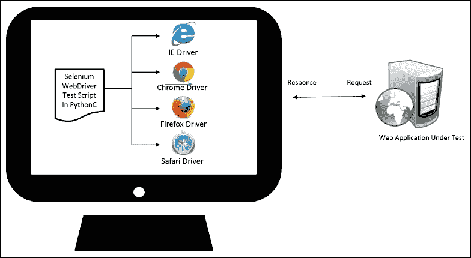

在本章中，你将学习如何在远程机器上运行这些测试，然后如何在不同浏览器和操作系统组合的分布式架构中扩展和运行测试，以进行跨浏览器测试。这可以节省大量在跨浏览器测试中花费的时间和精力。在本章中，我们将涵盖以下方面：

+   下载和使用 Selenium 独立服务器

+   如何使用 `Remote` 类在 Selenium 独立服务器上运行测试

+   在 Selenium 独立服务器上运行测试

+   向 Selenium 独立服务器添加节点以创建用于分布式执行的网格

+   在网格中针对多个浏览器和操作系统组合运行测试

+   在 Sauce Labs 和 BrowserStack 云上运行测试

# Selenium 独立服务器

Selenium 独立服务器是 Selenium 的一个组件，它提供了在远程机器上运行测试的能力。我们需要使用 `RemoteWebDriver` 类来连接到 Selenium 独立服务器，以便在远程机器上运行测试。`RemoteWebDriver` 类通过在指定的端口上使用 `RemoteWebDriver` 类监听来自测试脚本中的 Selenium 命令。根据 `RemoteWebDriver` 类提供的配置，Selenium 服务器将启动指定的浏览器并将命令转发到浏览器。它支持几乎所有的浏览器和带有 Appium 的移动平台。以下图显示了配置了不同类型浏览器的远程机器上运行的 Selenium 服务器架构：

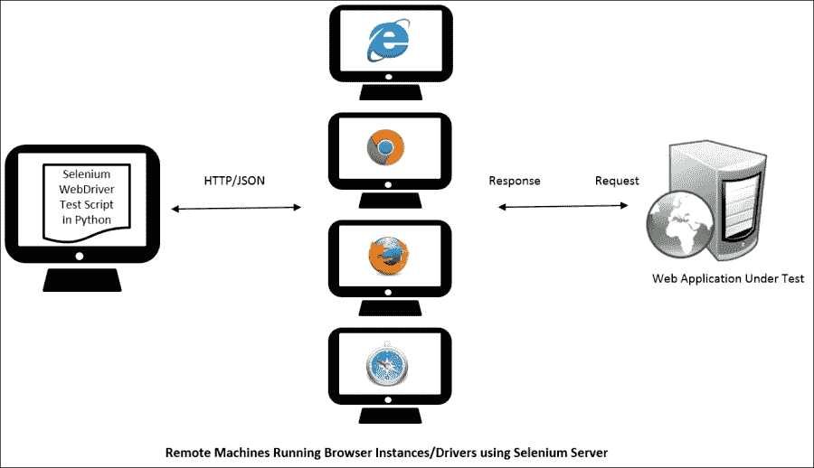

## 下载 Selenium 独立服务器

Selenium 独立服务器以捆绑的 JAR 格式提供下载，可在 [`docs.seleniumhq.org/download/`](http://docs.seleniumhq.org/download/) 的 *Selenium 服务器（以前称为 Selenium RC 服务器）* 部分找到。在编写本书时，Selenium 服务器版本 2.41.0 可供下载。你只需将 Selenium 独立服务器 JAR 文件复制到远程机器上并启动服务器即可。

### 注意

Selenium 独立服务器是一个用 Java 编写的自包含服务器。它需要在运行它的机器上安装 Java 运行时环境（JRE）。请确保您已在打算运行 Selenium 独立服务器的远程机器上安装了 JRE 6 或更高版本。

## 启动 Selenium 独立服务器

Selenium 独立服务器可以以各种模式或角色启动。在本节中，我们将以独立模式启动它。我们可以在保存服务器 JAR 文件的目录中，从远程机器的命令行使用以下命令启动服务器。在本例中，它通过以下命令行在 Windows 8 机器上启动：

```py
java –jar selenium-server-standalone-2.41.0.jar

```

默认情况下，Selenium 服务器将在`4444`端口上监听`http://<remote-machine-ip>:4444`。在启动服务器时，您可以在命令行上看到以下输出：

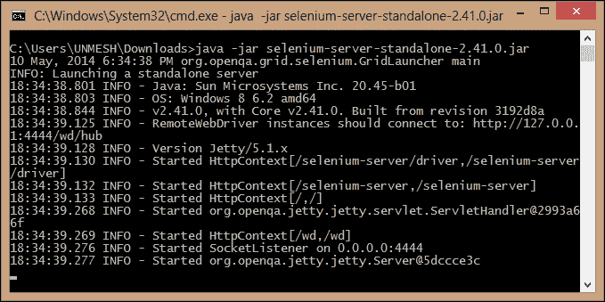

Selenium 服务器将在远程机器上作为 HTTP 服务器启动，我们可以在浏览器窗口中启动并查看服务器。启动浏览器并导航到`http://<remote-machine-ip>:4444/wd/hub/static/resource/hub.html`。这将显示以下页面在浏览器窗口中：

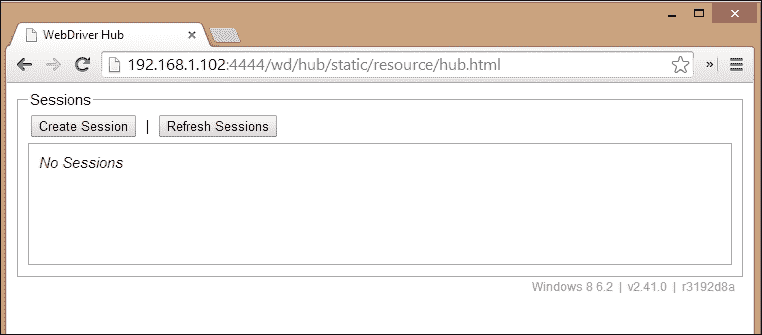

现在我们已经启动并运行了 Selenium 服务器，是时候创建并运行一个可以在服务器上运行的测试了。

# 在 Selenium 独立服务器上运行测试

要在 Selenium 服务器上运行测试，我们需要使用`RemoteWebDriver`。Selenium Python 绑定中的`Remote`类充当客户端，与 Selenium 服务器通信，以在远程机器上运行测试。我们需要使用这个类来指示 Selenium 服务器需要哪些配置来在远程机器上运行测试，以及要在所选浏览器上运行的命令。

除了`Remote`类之外，我们还需要设置`desired_capabilities`，即浏览器、操作系统以及我们想要传达给 Selenium 独立服务器的任何其他配置。在本例中，我们将指定一个平台和浏览器名称作为运行测试所需的期望能力：

```py
desired_caps = {}
desired_caps['platform'] = 'WINDOWS'
desired_caps['browserName'] = 'firefox'
```

接下来，我们将创建一个`Remote`类的实例并传递`desired_capabilities`。当脚本执行时，它将连接到 Selenium 服务器并请求服务器设置一个在 Windows 上运行的 Firefox 浏览器来运行测试：

```py
self.driver = webdriver.Remote('http://192.168.1.103:4444/wd/hub', desired_caps)
```

让我们实现一个我们之前创建的搜索测试，并用以下方式使用`Remote`类代替 Firefox 驱动程序：

```py
import unittest
from selenium import webdriver

class SearchProducts(unittest.TestCase):
    def setUp(self):

        desired_caps = {}
        desired_caps['platform'] = 'WINDOWS'
        desired_caps['browserName'] = 'firefox'

        self.driver = \
            webdriver.Remote('http://192.168.1.102:4444/wd/hub',desired_caps)
        self.driver.get('http://demo.magentocommerce.com/')
        self.driver.implicitly_wait(30)
        self.driver.maximize_window()

    def testSearchByCategory(self):

        # get the search textbox
        self.search_field = self.driver.find_element_by_name('q')
        self.search_field.clear()

        # enter search keyword and submit
        self.search_field.send_keys('phones')
        self.search_field.submit()

        # get all the anchor elements which have product names # displayed currently on result page using # find_elements_by_xpath method
        products = self.driver\
            .find_elements_by_xpath('//h2[@class=\'product-name\']/a')

        # check count of products shown in results
        self.assertEqual(2, len(products))

    def tearDown(self):
        # close the browser window
        self.driver.quit()

if __name__ == '__main__':
    unittest.main()
```

当这个测试执行时，您可以在 Selenium 服务器的控制台中看到。它显示了测试与服务器之间的交互，如下面的截图所示。它显示了已执行的命令及其状态：

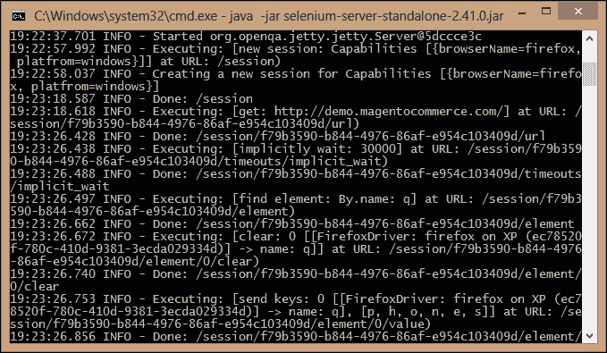

您还可以导航到`http://<remote-machine-ip>:4444/wd/hub/static/resource/hub.html`，该链接显示正在创建的新会话。如果您将鼠标悬停在“能力”链接上，它将显示用于运行测试的能力，如图以下屏幕截图所示：

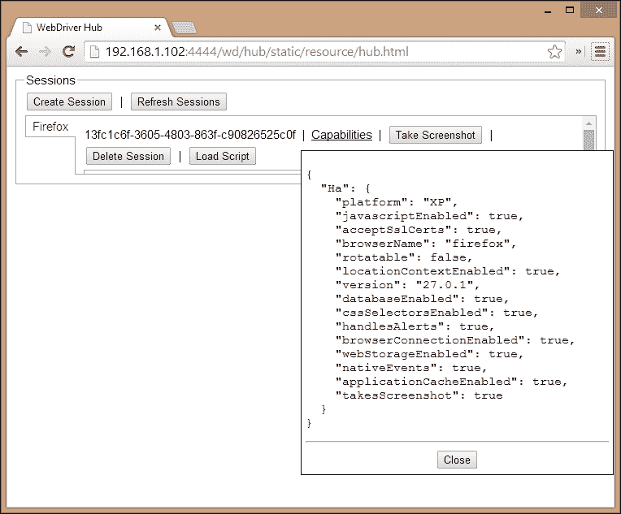

## 添加对 Internet Explorer 的支持

Firefox 支持捆绑在 Selenium 服务器中；然而，为了在**Internet Explorer**（**IE**）上运行测试，我们需要在启动 Selenium 服务器时指定 IE 驱动程序可执行文件的路径。这通过在命令行中指定`wedriver.ie.driver`选项的可执行路径来完成，如图所示：

```py
java -Dwebdriver.ie.driver="C:\SeDrivers\IEDriverServer.exe" -jar selenium-server-standalone-2.41.0.jar

```

通过提供 IE 驱动程序的路径，Selenium 服务器现在将启动并支持在远程机器上测试 IE。

## 添加对 Chrome 的支持

与 IE 驱动程序可执行文件类似，我们需要在远程机器上提及 Chrome 驱动程序以支持 Chrome 的测试。这通过在以下命令行中指定`webdriver.chrome.driver`选项来完成：

```py
java -Dwebdriver.ie.driver="C:\SeDrivers\IEDriverServer.exe" -Dwebdriver.chrome.driver="C:\SeDrivers\chromedriver.exe" -jar selenium-server-standalone-2.41.0.jar

```

Selenium 服务器现在将支持在远程机器上运行 Internet Explorer 和 Chrome 的测试。

# Selenium Grid

Selenium Grid 允许我们将测试分布在多个物理或虚拟机器上，以便以分布式方式运行测试或并行运行它们。这有助于通过减少运行测试所需的时间并加快跨浏览器测试的速度来获得更快、更准确的反馈。我们可以使用我们现有的云虚拟机基础设施来设置网格。

Selenium Grid 使我们能够在异构环境中并行运行多个测试，在多个节点或客户端上，我们可以有浏览器和操作系统支持的混合。它使所有这些节点看起来像一个单一实例，并透明地将测试分配到以下图示的基础设施上：

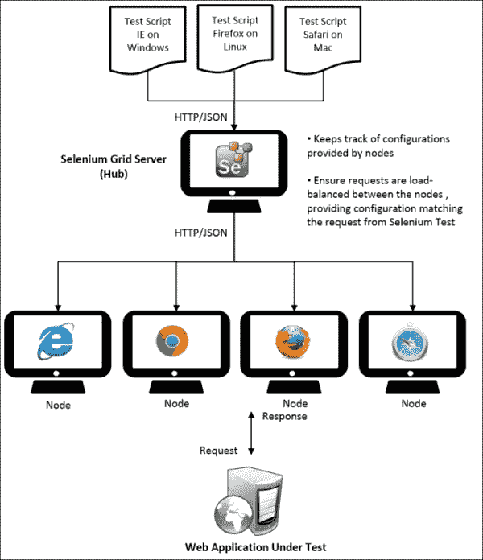

## 以集线器方式启动 Selenium 服务器

我们需要设置 Selenium 服务器作为集线器以分布式方式运行测试。集线器将为测试提供所有可用的配置或功能。

从机，也称为节点，连接到集线器。测试将使用`Remote`类通过 JSON 线协议与集线器通信以执行 Selenium 命令。您可以在[`code.google.com/p/selenium/wiki/JsonWireProtocol`](https://code.google.com/p/selenium/wiki/JsonWireProtocol)上找到更多关于 JSON 线协议的信息。

集线器作为中心点，将接收来自测试的命令并将它们分配到适当的节点或与测试所需的节点匹配的节点。让我们设置一个 Selenium 服务器作为网格，然后添加具有不同浏览器和操作系统组合的节点。

我们可以通过向之前章节中启动服务器的命令添加额外的参数来以 hub（也称为网格服务器）的形式启动 Selenium 独立服务器。

创建一个新的命令/终端窗口，导航到 Selenium 服务器 JAR 文件所在的目录。通过输入以下命令以 hub 的形式启动服务器：

```py
java -jar selenium-server-standalone-2.25.0.jar -port 4444 -role hub

```

我们需要使用 `–role` 参数并传递 `hub` 值来以 hub 或网格服务器的方式启动服务器。

在这个例子中，服务器在 Windows 机器上启动。它将在控制台上打印以下信息：

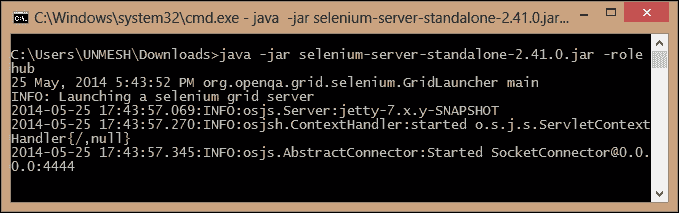

当我们以 hub 的形式启动 Selenium 服务器时，它将以网格服务器启动。我们可以在浏览器中看到以下截图所示的网格控制台：

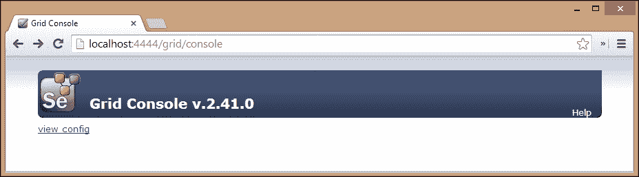

## 添加节点

现在我们已经启动了 Selenium 服务器作为网格服务器，让我们将一些节点配置添加到服务器中。

### 添加 IE 节点

让我们从在 Windows 上运行的提供 Internet Explorer 功能的节点开始。打开一个新的命令提示符或终端窗口，导航到 Selenium 服务器 JAR 文件所在的目录。要启动一个节点并将其添加到网格中，请输入以下命令：

```py
java -Dwebdriver.ie.driver="C:\SeDrivers\IEDriverServer.exe" -jar selenium-server-standalone-2.41.0.jar -role webdriver -browser "browserName=internet explorer,version=10,maxinstance=1,platform=WINDOWS" -hubHost 192.168.1.103 –port 5555

```

要将节点添加到网格中，我们需要使用 `–role` 参数并传递 `webdriver` 作为值。我们还需要传递节点的浏览器配置。这通过 `–browser` 参数传递。在这个例子中，我们传递了 `browserName` 为 `internet explorer`，`version` 为 `10`，`maxinstance` 为 `1`，以及 `platform` 为 `WINDOWS`。`maxinstance` 的值告诉网格节点将支持多少个浏览器的并发实例。

要将节点连接到 hub 或网格服务器，我们需要指定 `–hubHost` 参数，并使用网格服务器的主机名或 IP 地址。最后，我们需要指定节点将运行的端口。

当我们运行前面的命令并启动节点时，以下配置将出现在网格控制台中：

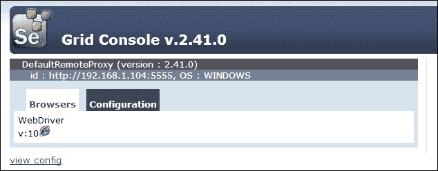

或者，可以通过创建一个 JSON 格式的配置文件来添加一个节点，然后使用以下代码：

```py
{
  "class": "org.openqa.grid.common.RegistrationRequest",
  "capabilities": [
   {
   "seleniumProtocol": "WebDriver",
   "browserName": "internet explorer",
   "version": "10",
   "maxInstances": 1,
   "platform" : "WINDOWS"
   }
  ],
  "configuration": {
   "port": 5555,
   "register": true,
   "host": "192.168.1.103",
   "proxy": "org.openqa.grid.selenium.proxy.
   DefaultRemoteProxy",
   "maxSession": 2,
   "hubHost": "192.168.1.100",
   "role": "webdriver",
   "registerCycle": 5000,
   "hub": "http://192.168.1.100:4444/grid/register",
   "hubPort": 4444,
   "remoteHost": "http://192.168.1.102:5555"
  }
}
```

我们现在可以通过以下方式将 `selenium-node-win-ie10.cfg.json` 配置文件作为命令行参数传递：

```py
java -Dwebdriver.ie.driver="C:\SeDrivers\IEDriverServer.exe"-jar selenium-server-standalone-2.41.0.jar -role webdriver -nodeConfig selenium-node-win-ie10.cfg.json

```

### 添加 Firefox 节点

要添加一个 Firefox 节点，打开一个新的命令提示符或终端窗口，导航到 Selenium 服务器 JAR 文件所在的目录。要启动并添加节点到网格，请输入以下命令：

```py
java -jar selenium-server-standalone-2.41.0.jar -role webdriver -browser "browserName=firefox,version=27,maxinstance=2,platform=WINDOWS" -hubHost localhost –port 6666

```

在这个例子中，我们将 `maxinstance` 设置为 `2`。这告诉网格该节点将支持两个 Firefox 实例。一旦节点启动，以下配置将出现在网格控制台中：

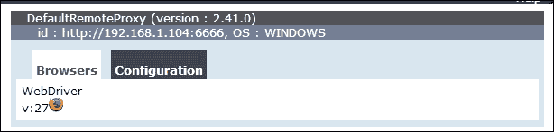

### 添加 Chrome 节点

要添加 Chrome 节点，打开一个新的命令提示符或终端窗口，导航到 Selenium 服务器 JAR 文件所在的位置。要启动并将节点添加到网格中，请输入以下命令：

```py
java -Dwebdriver.chrome.driver="C:\SeDrivers\chromedriver.exe" -jar selenium-server-standalone-2.41.0.jar -role webdriver -browser "browserName=chrome,version=35,maxinstance=2,platform=WINDOWS" -hubHost localhost -port 7777

```

一旦节点启动，以下配置将在网格控制台中显示：

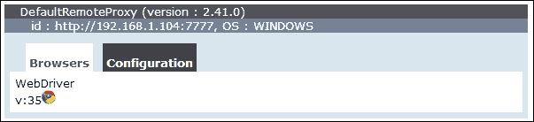

# Mac OS X with Safari

我们从一台 Windows 机器添加了 IE、Firefox 和 Chrome 实例，现在让我们从 Mac OS 添加一个 Safari 节点。打开一个新的终端窗口，导航到 Selenium 服务器 JAR 文件所在的位置。要启动并将节点添加到网格中，请输入以下命令：

```py
java -jar selenium-server-standalone-2.41.0.jar -role webdriver -browser "browserName=safari,version=7,maxinstance=1,platform=MAC" -hubHost 192.168.1.104 -port 8888

```

一旦节点启动，以下配置将在网格控制台中显示：

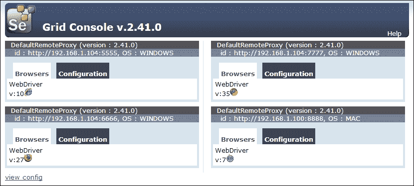

现在，我们已经设置了 Selenium 网格，让我们尝试在这个网格上运行测试。

# 在网格中运行测试

在网格中运行测试以及不同浏览器和操作系统的组合需要对我们之前创建的测试进行一些调整。我们在期望的能力中指定了硬编码的浏览器和平台名称。如果我们硬编码这些值，那么我们将为每种组合编写一个单独的脚本。为了避免这种情况并使用一个可以在所有组合上运行的单一测试，我们需要按照以下步骤参数化传递给期望能力类的浏览器和平台值：

1.  我们将从命令行传递浏览器和平台到测试中。例如，如果我们想在 Windows 和 Chrome 的组合上运行测试，我们将通过以下方式在命令行中运行脚本：

    ```py
    python grid_test.py WINDOWS chrome

    ```

1.  如果我们想在 Mac 上的 Safari 上运行测试，我们可以使用以下命令：

    ```py
    python grid_test.py MAC safari

    ```

1.  要实现这一点，我们需要向测试类中添加两个全局属性，`PLATFORM` 和 `BROWSER`，如下所示。如果没有从命令行提供值，我们将设置一个默认值：

    ```py
    class SearchProducts(unittest.TestCase):

        PLATFORM = 'WINDOWS'
        BROWSER = 'firefox'
    ```

1.  接下来，我们需要在`setUp()`方法中参数化期望能力，如下面的代码所示：

    ```py
    desired_caps = {}
    desired_caps['platform'] = self.PLATFORM
    desired_caps['browserName'] = self.BROWSER
    ```

1.  最后，我们需要读取传递给脚本的参数，并按照以下方式将值分配给`PLATFORM`和`BROWSER`属性：

    ```py
    if __name__ == '__main__':
        if len(sys.argv) > 1:
            SearchProducts.BROWSER = sys.argv.pop()
            SearchProducts.PLATFORM = sys.argv.pop()
        unittest.main()
    ```

1.  就这样。我们的测试现在可以处理任何给定的组合。以下是包含之前更改的完整代码：

    ```py
    import sys
    import unittest
    from selenium import webdriver

    class SearchProducts(unittest.TestCase):

        PLATFORM = 'WINDOWS'
        BROWSER = 'firefox'

        def setUp(self):

            desired_caps = {}
            desired_caps['platform'] = self.PLATFORM
            desired_caps['browserName'] = self.BROWSER

            self.driver = \
                webdriver.Remote('http://192.168.1.104:4444/wd/hub',desired_caps)
            self.driver.get('http://demo.magentocommerce.com/')
            self.driver.implicitly_wait(30)
            self.driver.maximize_window()
        def testSearchByCategory(self):

            # get the search textbox
            self.search_field = self.driver.find_element_by_name('q')
            self.search_field.clear()

            # enter search keyword and submit
            self.search_field.send_keys('phones')
            self.search_field.submit()

            # get all the anchor elements which have product names # displayed currently on result page using # find_elements_by_xpath method
            products = self.driver.\
                find_elements_by_xpath('//h2[@class=\'product-name\']/a')

            # check count of products shown in results
            self.assertEqual(2, len(products))

        def tearDown(self):
            # close the browser window
            self.driver.quit()

    if __name__ == '__main__':
        if len(sys.argv) > 1:
            SearchProducts.BROWSER = sys.argv.pop()
            SearchProducts.PLATFORM = sys.argv.pop()
        unittest.main(verbosity=2)
    ```

1.  要运行测试，打开一个新的命令提示符或终端窗口，导航到脚本的位置。输入以下命令，您将看到网格将连接与给定平台和浏览器匹配的节点，并在该节点上执行测试：

    ```py
    python grid_test.py MAC safari

    ```

# 在云中运行测试

在前面的步骤中，我们设置了一个本地网格以运行跨浏览器测试。这需要设置具有不同浏览器和操作系统的物理或虚拟机。需要投入成本和努力来获取所需的硬件、软件和支持以运行测试实验室。您还需要投入努力以保持该基础设施更新到最新版本和补丁等。并非每个人都能承担这些成本和努力。

您无需投资和设置跨浏览器测试实验室，可以轻松地将虚拟测试实验室外包给第三方云服务提供商。Sauce Labs 和 BrowserStack 是领先的基于云的跨浏览器测试云服务提供商。这两者都支持超过 400 种不同的浏览器和操作系统配置，包括移动和平板设备，并支持在他们的云中运行 Selenium WebDriver 测试。

在本节中，我们将设置并运行 Sauce Labs 云中的测试。如果您想使用 BrowserStack 运行测试，步骤类似。

## 使用 Sauce Labs

让我们按照以下步骤设置并使用 Sauce Labs 运行测试：

1.  您需要先拥有一个免费的 Sauce Labs 账户。在 Sauce Labs 上注册一个免费账户：[`saucelabs.com/`](https://saucelabs.com/)，并获取用户名和访问密钥。Sauce Labs 提供所有必要的硬件和软件基础设施，以便在云中运行您的测试。

1.  您可以在登录 Sauce Labs 仪表板后从 Sauce Labs 获取访问密钥，如下面的截图所示：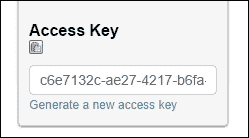

1.  让我们修改之前创建的测试，使其与网格一起运行，并添加步骤以在 Sauce Labs 云上运行此测试。

1.  我们需要将 Sauce 用户名和访问密钥添加到测试中，并将网格地址更改为 Sauce 的网格地址，传递用户名和访问密钥，如下面的代码所示：

    ```py
    import sys
    import unittest
    from selenium import webdriver

    class SearchProducts(unittest.TestCase):

        PLATFORM = 'WINDOWS'
        BROWSER = 'phantomjs'
        SAUCE_USERNAME = 'upgundecha'
        SUACE_KEY = 'c6e7132c-ae27-4217-b6fa-3cf7df0a7281'

        def setUp(self):

            desired_caps = {}
            desired_caps['platform'] = self.PLATFORM
            desired_caps['browserName'] = self.BROWSER

            sauce_string = self.SAUCE_USERNAME + ':' + self.SUACE_KEY

            self.driver = \
                webdriver.Remote('http://' + sauce_string + '@ondemand.saucelabs.com:80/wd/hub', desired_caps)
            self.driver.get('http://demo.magentocommerce.com/')
            self.driver.implicitly_wait(30)
            self.driver.maximize_window()

        def testSearchByCategory(self):

            # get the search textbox
            self.search_field = self.driver.find_element_by_name('q')
            self.search_field.clear()

            # enter search keyword and submit
            self.search_field.send_keys('phones')
            self.search_field.submit()

            # get all the anchor elements which have product names # displayed currently on result page using # find_elements_by_xpath method
            products = self.driver.\
                find_elements_by_xpath('//h2[@class=\'product-name\']/a')

            # check count of products shown in results
            self.assertEqual(2, len(products))

        def tearDown(self):
            # close the browser window
            self.driver.quit()

    if __name__ == '__main__':
        if len(sys.argv) > 1:
            SearchProducts.BROWSER = sys.argv.pop()
            SearchProducts.PLATFORM = sys.argv.pop()
        unittest.main(verbosity=2)
    ```

1.  要运行测试，打开一个新的命令提示符或终端窗口，导航到脚本的位置。输入以下命令：

    ```py
    python sauce_test.py "OS X 10.9" "Safari"

    ```

    ### 小贴士

    您可以在 Sauce Labs 的网站上找到支持的平台列表：[`saucelabs.com/platforms`](https://saucelabs.com/platforms)。

    在运行测试时，它将连接到 Sauce Lab 的网格服务器，并请求所需的操作系统和浏览器配置。Sauce 为我们的测试分配一个虚拟机，以便在给定的配置上运行。

1.  我们可以在 Sauce 仪表板上监控这次运行，如下面的截图所示：

我们可以进一步深入 Sauce 会话，查看运行期间的确切情况。它提供了大量的细节，包括 Selenium 命令、截图、Selenium 日志以及执行的视频，如下面的截图所示：

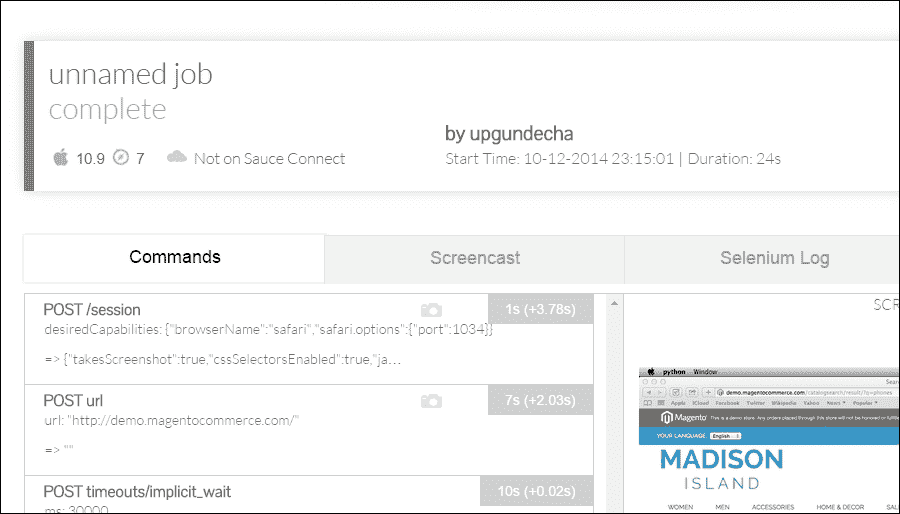

### 小贴士

您还可以通过使用 Sauce Connect 工具安全地测试托管在内部服务器上的应用程序，该工具在您的机器和 Sauce 云之间创建一个安全隧道。

# 摘要

在本章中，你学习了如何使用 Selenium 独立服务器在远程机器上运行测试。Selenium 独立服务器使我们能够在远程机器上运行测试，以测试我们的应用程序针对浏览器和操作系统的组合进行跨浏览器测试。这增加了测试覆盖率，并确保应用程序在所需的组合上运行。

然后，我们探讨了如何设置 Selenium Grid 以在分布式架构中运行测试。Selenium Grid 通过提供针对多台机器的透明执行来简化执行跨浏览器测试的复杂性。它还缩短了运行测试的时间。

我们还考虑了使用基于云的、跨浏览器的测试服务提供商。我们在 Sauce Labs 上执行了测试。这提供了所有必要的测试基础设施，以最低的成本在数百种不同的组合上运行测试。

在下一章中，你将学习如何使用 Appium 和 Selenium WebDriver 测试移动应用程序，这些概念在本章中已经学习过。Appium 支持在 iOS 和 Android 上测试原生、混合和 Web 移动应用程序。我们将设置 Appium 并对示例应用程序的移动版本进行测试。
