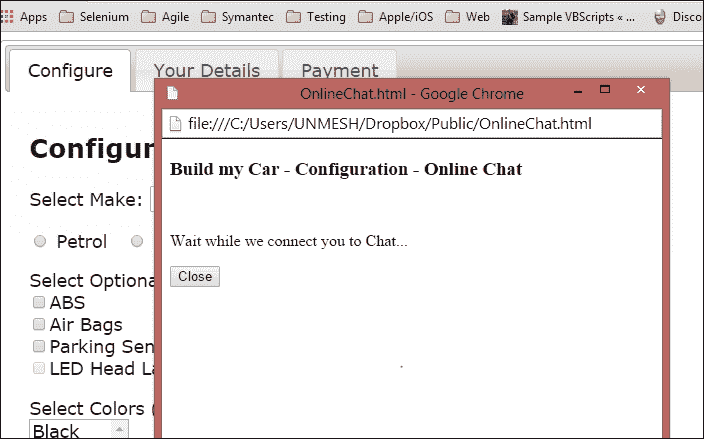

# 第九章：Selenium WebDriver 高级技术

到目前为止，本书中我们已看到如何设置 Selenium WebDriver 以测试 Web 应用程序，以及一些用于在浏览器中定位和与各种元素交互的重要特性和 API。

在本章中，我们将探讨 Selenium WebDriver 的一些高级 API。当测试相对复杂的应用程序时，这些功能非常有用。

在本章中，你将了解更多关于：

+   使用 `Actions` 类创建模拟键盘或鼠标事件的测试

+   模拟鼠标操作，如拖放和双击

+   运行 JavaScript 代码

+   捕获测试运行的截图和视频

+   处理浏览器导航和 Cookie

# 执行键盘和鼠标操作的方法

Selenium WebDriver 的高级用户交互 API 允许我们执行从简单的键盘和鼠标事件到复杂的鼠标事件（如拖放、按下快捷键组合、按住键和执行鼠标操作）的操作。这是通过使用 Selenium WebDriver Python API 中的 `ActionChains` 类来实现的。

这里是 `ActionChains` 类支持执行键盘和鼠标事件的重要方法列表：

| 方法 | 描述 | 参数 | 示例 |
| --- | --- | --- | --- |
| `click(on_element=None)` | 此方法执行点击操作。 | `on_element`: 这是点击的元素。如果为 `None`，则在当前鼠标位置点击。 | `click(main_link)` |
| `click_and_hold(on_element=None)` | 此方法在元素上按下鼠标左键。 | `on_element`: 这是点击并按下鼠标按钮的元素。如果为 `None`，则在当前鼠标位置点击。 | `click_and_hold(gmail_link)` |
| `double_click(on_element=None)` | 此方法在元素上执行双击操作。 | `on_element`: 这是双击的元素。如果为 `None`，则在当前鼠标位置点击。 | `double_click(info_box)` |
| `drag_and_drop(source, target)` | 此方法执行拖放操作。 | `source`: 这是鼠标按下时要拖动的元素。`target`: 鼠标释放的元素。 | `drag_and_drop(img, canvas)` |
| `key_down(value, element=None)` | 此方法仅发送按键，不释放它。这应仅与修饰键（如 *Ctrl*、*Alt* 和 *Shift* 键）一起使用。 | `key`: 这是要发送的修饰键。值在 `Keys` 类中定义。`target`: 发送键的元素。如果为 `None`，则发送到当前聚焦的元素。 | `key_down(Keys.SHIFT)\ send_keys('n')\ key_up(Keys.SHIFT)` |
| `key_up(value, element=None)` | 此方法释放一个修饰键。 | `key`: 这是要发送的修饰键。值在 `Keys` 类中定义。`target`: 这是发送键的元素。如果为 `None`，则发送到当前聚焦的元素。 |
| `move_to_element(to_element)` | 这个方法将鼠标移动到元素的中间。 | `to_element`: 这是需要移动到的元素。 | `move_to_element(gmail_link)` |
| `perform()` | 这个方法执行所有存储的动作。 |   | `perform()` |
| `release(on_element=None)` | 这个方法释放一个按住的鼠标按钮。 | `on_element`: 这是鼠标释放的元素。 | `release(banner_img)` |
| `send_keys(keys_to_send)` | 这个方法向具有当前焦点的元素发送按键。 | `keys_to_send`: 这是需要发送的按键 | `send_keys("hello")` |
| `send_keys_to_element(element, keys_to_send)` | 这个方法向一个元素发送按键。 | `element`: 这是需要发送按键的元素。`keys_to_send`: 需要发送的按键。 | `send_keys_to_element(firstName, "John")` |

详细列表请访问 [`selenium.googlecode.com/git/docs/api/py/webdriver/selenium.webdriver.common.action_chains.html`](http://selenium.googlecode.com/git/docs/api/py/webdriver/selenium.webdriver.common.action_chains.html)。

### 注意

在 Safari 上不支持 `Interactions` API。此外，在各个浏览器上对某些事件也有限制。更多详情请参阅 [`code.google.com/p/selenium/wiki/AdvancedUserInteractions`](https://code.google.com/p/selenium/wiki/AdvancedUserInteractions)。

## 键盘操作

让我们创建一个测试来演示如何使用键盘操作，例如按下快捷键组合。在示例应用中，当我们按下 *Shift* + *N* 键组合时，标签的颜色会改变，如下面的代码所示：

```py
from selenium import webdriver
from selenium.webdriver.common.by import By
from selenium.webdriver.support.ui import WebDriverWait
from selenium.webdriver.support import expected_conditions
from selenium.webdriver.common.action_chains import ActionChains
from selenium.webdriver.common.keys import Keys
import unittest

class HotkeyTest(unittest.TestCase):
    URL = "https://rawgit.com/jeresig/jquery.hotkeys/master/test-static-05.html"

    def setUp(self):
        self.driver = webdriver.Chrome()
        self.driver.get(self.URL)
        self.driver.implicitly_wait(30)
        self.driver.maximize_window()

    def test_hotkey(self):
        driver = self.driver

        shift_n_label = WebDriverWait(self.driver, 10).\
            until(expected_conditions.visibility_of_element_located((By.ID, "_shift_n")))

        ActionChains(driver).\
            key_down(Keys.SHIFT).\
            send_keys('n').\
            key_up(Keys.SHIFT).perform()
        self.assertEqual("rgba(12, 162, 255, 1)",
                         shift_n_label.value_of_css_property("background-color"))

    def tearDown(self):
        self.driver.close()

if __name__ == "__main__":
    unittest.main(verbosity=2)
```

我们可以使用 `ActionChains` 类执行快捷键按下操作。在这个例子中，我们使用 `key_down()`、`send_key()` 和 `key_up()` 方法的组合来执行 *Shift* + *N* 键的按下，就像真实用户按下这些键一样：

```py
ActionChains(driver).\
    key_down(Keys.SHIFT).\
    send_keys('n').\
    key_up(Keys.SHIFT).perform()
```

`ActionChains` 类需要传递 `driver` 实例。然后我们可以通过调用可用方法并执行调用 `perform()` 方法的动作来安排事件序列。

## 鼠标移动

这里是另一个示例，通过调用 `ActionChains` 类的 `move_to_element()` 方法来调用鼠标移动事件。这相当于 `onMouseOver` 事件。`move_to_element()` 方法会将鼠标光标从当前位置移动到指定的元素。

```py
from selenium import webdriver
from selenium.webdriver.common.by import By
from selenium.webdriver.support.ui import WebDriverWait
from selenium.webdriver.support import expected_conditions
from selenium.webdriver.common.action_chains import ActionChains
import unittest

class ToolTipTest (unittest.TestCase):
    def setUp(self):
        self.driver = webdriver.Firefox()
        self.driver.get("http://jqueryui.com/tooltip/")
        self.driver.implicitly_wait(30)
        self.driver.maximize_window()

    def test_tool_tip(self):
        driver = self.driver

        frame_elm = driver.find_element_by_class_name("demo-frame")
        driver.switch_to.frame(frame_elm)

        age_field = driver.find_element_by_id("age")
        ActionChains(self.driver).move_to_element(age_field).perform()

        tool_tip_elm = WebDriverWait(self.driver, 10)\            .until(expected_conditions.visibility_of_element_located((By.CLASS_NAME, "ui-tooltip-content")))

        # verify tooltip message
        self.assertEqual("We ask for your age only for statistical purposes.", tool_tip_elm.text)

    def tearDown(self):
        self.driver.close()

if __name__ == "__main__":
    unittest.main(verbosity=2)
```

### 双击方法

我们可以通过调用 `ActionChains` 类的 `double_click()` 方法来双击一个元素，如下所示：

```py
from selenium import webdriver

from selenium.webdriver.common.action_chains import ActionChains
import unittest

class DoubleClickTest (unittest.TestCase):
    URL = "http://api.jquery.com/dblclick/"

    def setUp(self):
        self.driver = webdriver.Chrome()
        self.driver.get(self.URL)
        self.driver.maximize_window()

    def test_double_click(self):
        driver = self.driver
        frame = driver.find_element_by_tag_name("iframe")
        driver.switch_to.frame(frame)
        box = driver.find_element_by_tag_name("div")

        # verify color is Blue
        self.assertEqual("rgba(0, 0, 255, 1)",
                         box.value_of_css_property("background-color"))

        ActionChains(driver).move_to_element(
            driver.find_element_by_tag_name("span"))\
            .perform()

        ActionChains(driver).double_click(box).perform()

        # verify Color is Yellow
        self.assertEqual("rgba(255, 255, 0, 1)",
                         box.value_of_css_property("background-color"))

    def tearDown(self):
        self.driver.close()

if __name__ == "__main__":
    unittest.main(verbosity=2)
```

### 拖放方法

在 Selenium WebDriver 中，我们可以通过调用 `ActionChains` 类的 `drag_and_drop()` 方法来执行拖放操作。这个方法需要指定将被拖动的源元素和目标元素，这里是一个 `drag_and_drop` 方法的示例：

```py
from selenium import webdriver
from selenium.webdriver.common.action_chains import ActionChains
import unittest

class DragAndDropTest (unittest.TestCase):

    URL = "http://jqueryui.com/resources/demos/droppable/default.html"

    def setUp(self):
        self.driver = webdriver.Firefox()
        self.driver.get(self.URL)
        self.driver.maximize_window(30)
        self.driver.maximize_window()

    def test_drag_and_drop(self):
        driver = self.driver

        source = driver.find_element_by_id("draggable")
        target = driver.find_element_by_id("droppable")

        ActionChains(self.driver).drag_and_drop(source, target).perform()
        self.assertEqual("Dropped!", target.text)

    def tearDown(self):
        self.driver.close()

if __name__ == "__main__":
    unittest.main(verbosity=2)
```

# 执行 JavaScript

我们可以通过使用`WebDriver`类中提供的方法来执行 JavaScript 代码。当我们无法使用 Selenium WebDriver API 执行某些操作或我们想要测试 JavaScript 代码时，这非常有用。

`WebDriver`类提供了以下方法来执行 JavaScript 代码：

| 方法 | 描述 | 参数 | 示例 |
| --- | --- | --- | --- |
| `execute_async_script(script, *args)` | 此方法在当前窗口/框架中异步执行 JavaScript。 | `script`: 这是 JavaScript 代码`args`: 这是 JavaScript 代码的任何参数 | `driver.execute_async_script("return document.title")` |
| `execute_script(script, *args)` | 此方法在当前窗口/框架中同步执行 JavaScript。 | `script`: 这是 JavaScript 代码`args`: 这是 JavaScript 代码的任何参数 | `driver.execute_script("return document.title")` |

让我们创建一个使用实用方法的测试，该方法在执行这些元素的操作之前，通过使用 JavaScript 方法突出显示这些元素：

```py
from selenium import webdriver
import unittest

class ExecuteJavaScriptTest (unittest.TestCase):
 def setUp(self):
        # create a new Firefox session
        self.driver = webdriver.Firefox()
        self.driver.implicitly_wait(30)
        self.driver.maximize_window()

        # navigate to the application home page
        self.driver.get("http://demo.magentocommerce.com/")

    def test_search_by_category(self):

        # get the search textbox
        search_field = self.driver.find_element_by_name("q")
        self.highlightElement(search_field)
        search_field.clear()

        # enter search keyword and submit
        self.highlightElement(search_field)
        search_field.send_keys("phones")
        search_field.submit()

        # get all the anchor elements which have product names # displayed currently on result page using # find_elements_by_xpath method
        products = self.driver.find_elements_by_xpath("//h2[@class='product-name']/a")

        # check count of products shown in results
        self.assertEqual(2, len(products))

    def tearDown(self):
        # close the browser window
        self.driver.quit()

    def highlightElement(self, element):
        self.driver.execute_script("arguments[0].setAttribute('style', arguments[1]);",
        element, "color: green; border: 2px solid green;")
        self.driver.execute_script("arguments[0].setAttribute('style', arguments[1]);",
        element , "")

if __name__ == "__main__":
    unittest.main(verbosity=2)
```

我们可以通过调用`WebDriver`类的`execute_script`方法来执行 JavaScript 代码，如下面的示例所示。我们还可以通过此方法将参数传递给 JavaScript 代码。在这个例子中，我们暂时修改边框样式，然后撤销这个更改。这将突出显示执行期间给定的元素，以绿色边框显示。了解屏幕上正在执行哪个步骤非常有用：

```py
def highlightElement(self, element):
      self.driver.execute_script("arguments[0].setAttribute('style', arguments[1]);",
      element, "color: green; border: 2px solid green;")
      self.driver.execute_script("arguments[0].setAttribute('style', arguments[1]);",
      element , "")
```

# 捕获失败的截图

在测试运行期间捕获截图，当您想要将失败通知开发者时非常有用。它还有助于调试测试或创建测试运行的证据。Selenium WebDriver 自带在测试运行期间捕获截图的方法。`WebDriver`类提供了以下方法来捕获和保存截图：

| 方法 | 描述 | 参数 | 示例 |
| --- | --- | --- | --- |
| `Save_screenshot(filename)` | 此方法获取当前窗口的截图，并将图像保存到指定的文件中。 | `filename`: 这是截图将保存到的文件路径/名称 | `Driver.save_screenshot("homepage.png")` |
| `get_screenshot_as_base64()` | 此方法获取当前窗口的截图，并以 base64 编码的字符串形式返回，这在将图像嵌入 HTML 中非常有用。 |   | `driver.get_screenshot_as_base64()` |
| `get_screenshot_as_file(filename)` | 此方法获取当前窗口的截图。如果发生任何 IO 错误，则返回`False`，否则返回`True`。它使用完整的文件名路径。 | `filename`: 这是截图将保存到的文件路径/名称 | `driver.get_screenshot_as_file('/results/screenshots/HomePage.png')` |
| `get_screenshot_as_png()` | 此方法获取当前窗口的截图作为二进制数据。 |   | `driver.get_screenshot_as_png()` |

让我们创建一个测试，当它导致失败时捕获屏幕截图。在这个例子中，我们将定位到应用程序主页上应该存在的元素。然而，如果测试找不到这个元素，它将抛出 `NoSuchElementException` 并捕获浏览器窗口中显示的页面截图，我们可以将其用于调试或作为证据发送给开发者。

```py
from selenium import webdriver
import datetime, time, unittest
from selenium.common.exceptions import NoSuchElementException

class ScreenShotTest(unittest.TestCase):
    def setUp(self):
        self.driver = webdriver.Firefox()
        self.driver.get("http://demo.magentocommerce.com/")

    def test_screen_shot(self):
        driver = self.driver
        try:
            promo_banner_elem = driver.find_element_by_id("promo_banner")
            self.assertEqual("Promotions", promo_banner_elem.text)
        except NoSuchElementException:
            st = datetime.datetime\
                .fromtimestamp(time.time()).strftime('%Y%m%d_%H%M%S')
            file_name = "main_page_missing_banner" + st + ".png"
            driver.save_screenshot(file_name)
            raise

    def tearDown(self):
        self.driver.close()

if __name__ == "__main__":
    unittest.main(verbosity=2)
```

在这个例子中，当测试找不到促销横幅元素时，它将使用 `save_screenshot()` 方法进行截图。我们需要传递要保存结果的文件路径和名称，如下所示：

```py
try:
    promo_banner_elem = driver.find_element_by_id("promo_banner")
    self.assertEqual("Promotions", promo_banner_elem.text)
except NoSuchElementException:
    st = datetime.datetime.fromtimestamp(time.time()).strftime('%Y%m%d_%H%M%S')
    file__name = "main_page_missing_banner" + st + ".png"
    driver.save_screenshot(file__name)
    raise
```

### 小贴士

在捕获和保存屏幕截图时，建议为图像文件使用独特的名称，例如包括时间戳，并使用 **便携式网络** **图形** (**PNG**) 格式以实现文件的最高压缩，这也会导致文件大小最小化。

## 录制测试运行的视频

与捕获屏幕截图类似，录制测试运行的视频有助于以可视化的方式记录完整的测试会话。我们可以观看录制的视频来了解测试运行期间发生了什么。这也可以作为其他项目利益相关者的证据，或者也可以用作演示。

Selenium WebDriver 没有内置的视频录制功能。可以通过使用名为 `Castro` 的 Python 库来单独录制测试运行的视频。它是由 Selenium 的创造者 Jason Huggin 创建的。

Castro 基于名为 **Pyvnc2swf** 的跨平台屏幕录制工具（参考 [`www.unixuser.org/~euske/vnc2swf/pyvnc2swf.html`](http://www.unixuser.org/~euske/vnc2swf/pyvnc2swf.html)）。它使用 VNC 协议捕获测试运行的屏幕，并生成 **Shockwave Flash** (**SWF**) 电影文件。

Castro 还允许使用 VNC 协议从远程机器录制会话。需要在该机器上安装 VNC 程序来录制视频。在安装 Castro 之前，我们需要安装 PyGame 库。PyGame 包不能通过 pip 命令安装，我们需要从 [`www.pygame.org/download.shtml`](http://www.pygame.org/download.shtml) 获取 PyGame 安装程序。

我们可以使用以下命令行使用 `pip` 安装 Castro：

```py
pip install Castro

```

我们还需要在将要执行测试的桌面上安装或启用 VNC。在 Windows 上，我们需要安装一个 VNC 程序。**TightVNC** ([`www.tightvnc.com/`](http://www.tightvnc.com/)) 将是一个不错的选择。在 Windows 上安装 TightVNC 服务器和查看器。

在 Ubuntu 上，前往 **设置** | **首选项** | **远程桌面** 并勾选 **允许其他用户查看您的** **桌面** 复选框。对于 Mac，我们可以从 [`www.testplant.com/products/vine/`](http://www.testplant.com/products/vine/) 安装 Vine VNC 服务器或从 **系统偏好设置** 中启用 **远程桌面**。

让我们捕捉一下我们在前几章中创建的搜索测试用例的视频录制，如下面的代码所示：

```py
import unittest
from selenium import webdriver
from castro import Castro

class SearchProductTest(unittest.TestCase):
    def setUp(self):
        # create an instance of Castro and provide name for the output # file
        self.screenCapture = Castro(filename="testSearchByCategory.swf")
        # start the recording of movie
        self.screenCapture.start()

        # create a new Firefox session
        self.driver = webdriver.Firefox()
        self.driver.implicitly_wait(30)
        self.driver.maximize_window()

        # navigate to the application home page
        self.driver.get("http://demo.magentocommerce.com/")

    def test_search_by_category(self):

        # get the search textbox
        search_field = self.driver.find_element_by_name("q")
        search_field.clear()

        # enter search keyword and submit
        search_field.send_keys("phones")
        search_field.submit()

        # get all the anchor elements which have product names # displayed
        # currently on result page using find_elements_by_xpath method
        products = self.driver.find_elements_by_xpath("//h2[@class='product-name']/a")

        # check count of products shown in results
        self.assertEqual(2, len(products))

    def tearDown(self):
        # close the browser window
        self.driver.quit()
        # Stop the recording
        self.screenCapture.stop()

if __name__ == '__main__':
    unittest.main(verbosity=2)
```

要创建一个新的视频录制会话，我们需要创建一个 Castro 对象，并用构造函数的参数初始化实例，该参数是捕获文件的路径和名称。屏幕捕获通过`start()`方法开始，它将记录整个屏幕，直到调用`stop`方法。使用`setUp()`方法进行测试是初始化 Castro 实例并开始录制的最佳方式，如下面的示例所示：

```py
def setUp(self):
      #Create an instance of Castro and provide name for the output # file
      self.screenCapture = Castro(filename="testSearchByCategory.swf")
      # Start the recording of movie
      self.screenCapture.start()

      # create a new Firefox session
      self.driver = webdriver.Firefox()
      self.driver.implicitly_wait(30)
      self.driver.maximize_window()

      # navigate to the application home page
      self.driver.get("http://demo.magentocommerce.com/")
```

要停止录制，请调用`stop()`方法。同样，`tearDown()`方法是一个调用此方法的好地方，这样我们就可以捕捉整个测试用例，如下面的代码所示：

```py
def tearDown(self):
    # close the browser window
    self.driver.quit()
    # Stop the recording
    self.screenCapture.stop()

```

如果一个类中有多个测试，我们可以使用`setUp()`和`tearDown()`方法在类级别初始化和停止录制，而不是为每个测试创建一个新的文件。

# 处理弹出窗口

测试弹出窗口涉及通过其名称属性或窗口句柄来识别弹出窗口，切换驱动程序上下文到所需的弹出窗口，然后在该弹出窗口上执行步骤，最后切换回父窗口。

当我们从测试中创建浏览器实例时，它是一个父窗口，并且从父窗口创建的任何后续窗口都被称为子窗口或弹出窗口。只要它属于当前的 WebDriver 上下文，我们就可以与任何子窗口一起工作。

这里是一个弹出窗口的例子：



创建一个新的测试类`PopupWindowTest`，其中包含测试方法`test_popup_window()`，如下面的代码所示：

```py
from selenium import webdriver
import unittest

class PopupWindowTest(unittest.TestCase):

    URL = "https://rawgit.com/upgundecha/learnsewithpython/master/pages/Config.html"

    def setUp(self)    :
        self.driver = webdriver.Firefox()
        self.driver.get(self.URL)
        self.driver.maximize_window()

    def test_window_popup(self):
        driver = self.driver

        # save the WindowHandle of Parent Browser Window
        parent_window_id = driver.current_window_handle

        # clicking Help Button will open Help Page in a new Popup # Browser Window
        help_button = driver.find_element_by_id("helpbutton")
        help_button.click()
        driver.switch_to.window("HelpWindow")
        driver.close()
        driver.switch_to.window(parent_window_id)

    def tearDown(self):
        self.driver.close()

if __name__ == "__main__":
    unittest.main(verbosity=2)
```

在上下文移动到子窗口之前，我们可以使用`current_window_handle`属性保存父窗口的句柄。我们将在稍后使用此值从子窗口切换回父窗口。我们可以通过调用`WebDriver`类的`switch_to.window()`方法使用其名称或窗口句柄来切换到子窗口。在这个例子中，我们使用窗口的名称，如下所示：

```py
driver.switch_to_window("HelpWindow")
```

在执行操作并检查帮助窗口后，我们可以通过调用`close()`方法来关闭它，并切换回父窗口，如下所示：

```py
driver.close()

# switch back to Home page window using the handle
driver.switch_to_window(default_window)
```

# 管理 Cookie

Cookie 对于任何 Web 应用程序来说都很重要，因为它可以在用户的计算机上存储信息，从而提供更好的用户体验。Cookie 用于存储用户偏好、登录信息和客户端的详细信息。Selenium WebDriver API 提供了各种方法在测试期间管理这些 Cookie。我们可以在测试期间读取 Cookie 值、添加 Cookie 和删除 Cookie。这可以用来测试应用程序在 Cookie 被操作时的反应。`WebDriver`类提供了以下方法来管理 Cookie：

| 方法 | 描述 | 参数 | 示例 |
| --- | --- | --- | --- |
| `add_cookie(cookie_dict)` | 此方法将 cookie 添加到当前会话 | `cookie_dict`: 这是一个包含 cookie 名称和值对的字典 | `driver.add_cookie({"foo","bar"})` |
| `delete_all_cookies()` | 此方法删除当前会话中的所有 cookies |   | `driver.delete_all_cookies()` |
| `delete_cookie(name)` | 此方法删除指定名称的单个 cookie | `name`: 这是要删除的 cookie 的名称 | `driver.delete_cookie("foo")` |
| `get_cookie(name)` | 此方法通过名称获取单个 cookie，如果找到则返回 cookie 的字典，如果没有找到则返回 none | `name`: 这是搜索 cookie 的名称 | `driver.get_cookie("foo")` |
| `get_cookies()` | 此方法获取与当前会话中 cookies 对应的一组字典 |   | `driver.get_cookies()` |

这里有一个示例，验证了用于存储用户在演示应用程序主页上选择的语言的 cookie：

```py
import unittest
from selenium import webdriver
from selenium.webdriver.support.ui import Select

class CookiesTest(unittest.TestCase):
    def setUp(self):
        # create a new Firefox session
        self.driver = webdriver.Firefox()
        self.driver.implicitly_wait(30)
        self.driver.maximize_window()

        # navigate to the application home page
        self.driver.get("http://demo.magentocommerce.com/")

    def test_store_cookie(self):
        driver = self.driver
        # get the Your language dropdown as instance of Select class
        select_language = \
            Select(self.driver.find_element_by_id("select-language"))

        # check default selected option is English
        self.assertEqual("ENGLISH", select_language.first_selected_option.text)
        # store cookies should be none
        store_cookie = driver.get_cookie("store")
        self.assertEqual(None, store_cookie)

         # select an option using select_by_visible text
        select_language.select_by_visible_text("French")

        # store cookie should be populated with selected country
        store_cookie = driver.get_cookie("store")['value']
        self.assertEqual("french", store_cookie)

    def tearDown(self):
        # close the browser window
        self.driver.quit()

if __name__ == '__main__':
    unittest.main(verbosity=2)
```

我们可以使用 `WebDriver` 类的 `get_cookie()` 方法检索 cookie 的值。我们需要传递 cookie 的名称。此方法返回一个字典。

# 摘要

在本章中，你学习了 Selenium WebDriver API 的高级功能，用于处理键盘和鼠标事件、捕获截图、录制视频和处理 cookies。

我们使用了 `ActionChains` 类来执行各种键盘和鼠标操作。当处理大量使用键盘和鼠标动作的应用程序时，这些功能非常有用。

你看到了如何在测试中运行 JavaScript 代码。当处理使用 Ajax 的应用程序时，这是一个非常强大的功能，我们可以从脚本中使用底层的 JavaScript API。

你在测试运行期间捕获了错误截图，并记录了测试会话。这有助于调试测试，并为测试运行创建证据。

最后，你学习了关于浏览器导航方法和 cookies 的内容。

在下一章中，你将学习如何将我们的测试与其他工具集成，例如持续集成工具，以便将测试作为构建过程的一部分运行。
