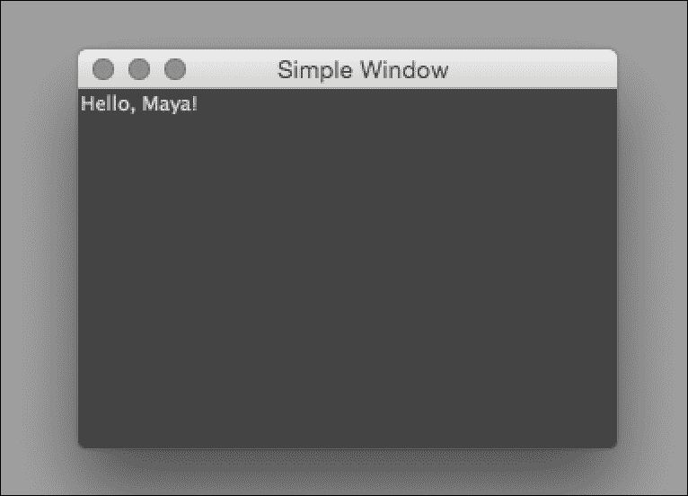
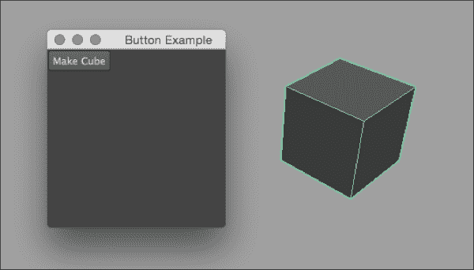
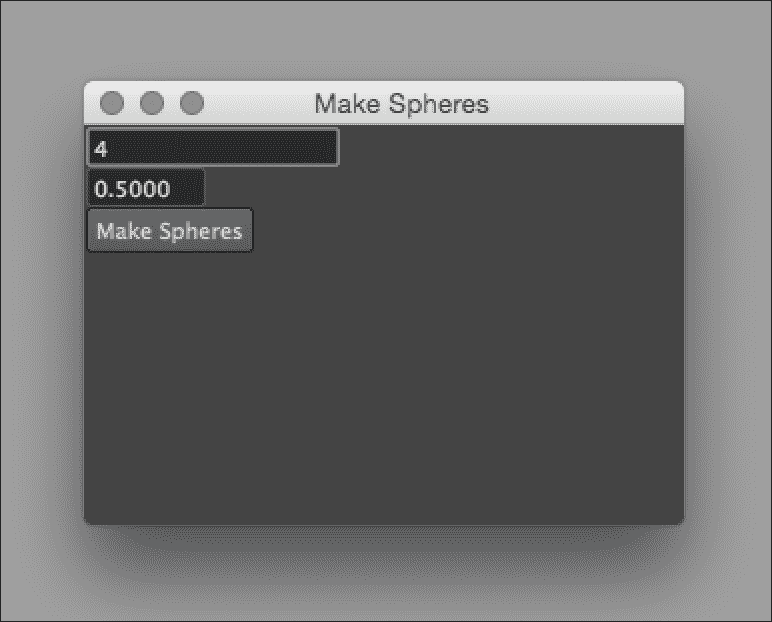
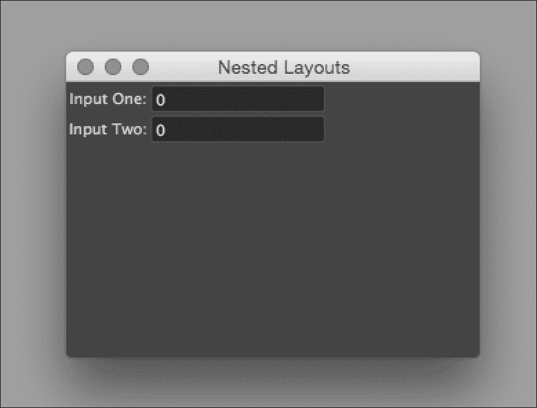
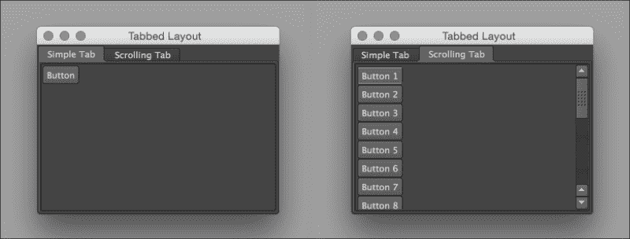
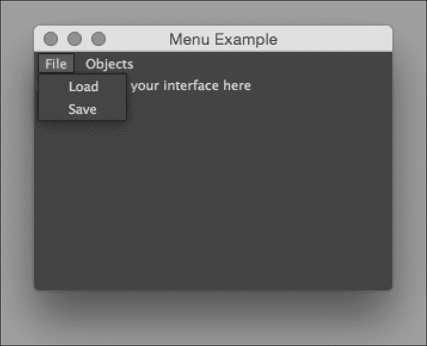

# 第二章：创建用户界面

在本章中，我们将带您参观 Maya 的用户界面元素集合，并学习如何使用它们来创建您和您的团队成员都乐于使用的界面。以下主题将涵盖：

+   创建基本窗口

+   简单控件 – 创建一个按钮

+   从控件中检索输入

+   使用类来组织 UI 逻辑

+   使用嵌套布局

+   使用标签和滚动

+   向您的 UIs 添加菜单

# 简介

虽然为您的脚本创建图形用户界面（GUI）并非必需，但在几乎所有情况下，您都可能想要一个 GUI。非常常见的是，您会发现自己正在创建旨在供您的团队成员使用的脚本，其中一些人可能不太熟悉命令行工具。

在本章中，我们将探讨如何创建窗口，用界面元素填充它们，并将这些元素链接到 Maya 中的其他功能。

# 创建基本窗口

所有优秀的用户界面都是从窗口开始的。在这个例子中，我们将创建一个简单的窗口，并使用文本标签控件添加一个简单的消息。

我们最终会得到以下类似的结果：



## 如何做到这一点...

首先，在您的脚本目录中创建一个新文件，并将其命名为基本的`Window.py`。

添加以下代码：

```py
import maya.cmds as cmds

def showUI():
    myWin = cmds.window(title="Simple Window", widthHeight=(300, 200))
    cmds.columnLayout()
    cmds.text(label="Hello, Maya!")

    cmds.showWindow(myWin)

showUI()
```

如果您运行脚本，您应该会看到一个包含文本**Hello, Maya!**的小窗口。

## 它是如何工作的...

要创建一个窗口，您需要使用窗口命令。

```py
myWin = cmds.window(title="Simple Window", widthHeight=(300, 200))
```

虽然所有参数都是可选的，但您通常会默认包含一些参数。在这里，我们将窗口标题设置为“简单窗口”，并将窗口大小设置为 300 像素宽、200 像素高。请注意，我们还保存了命令的结果到变量`myWin`。这是使用`showWindow`命令所必需的。稍后我们将详细介绍这一点。

还有一个额外的要求，那就是为了向窗口添加一个元素，你必须首先指定一个布局。布局负责在给定区域（无论是窗口还是另一个布局）内排列项目。如果你没有为 Maya 提供布局，它将无法正确地定位你添加的任何控件，并且你的脚本将出错。在这个例子中，我们使用的是`columnLayout`，它将把所有我们添加的控件排列在一个单独的垂直列中。我们使用以下方式将布局添加到窗口中：

```py
cmds.columnLayout()
```

一旦我们创建了一个窗口并指定了布局，我们就可以开始添加控件。在这种情况下，我们使用的是仅向窗口添加一些文本的文本控件。虽然您通常不会单独使用文本控件（将它们与其他控件一起使用以提供标签或描述性文本的情况要常见得多），但它是一个典型（尽管简单）控件的良好示例。

```py
cmds.text(label="Hello, Maya!")
```

到目前为止，我们已经完成了我们的界面，但在 Maya 中创建一个窗口实际上并不会显示任何内容。为了使其在 Maya 的界面中显示，我们还需要使用`showWindow`命令显式地显示它。这样做的原因是，你通常不希望在窗口拥有所有你想要的控件和其他 UI 元素之前就显示它。然而，为了创建一个控件，你必须首先有一个窗口来添加它们。Maya 通过让你这样做来解决这个问题：

1.  创建窗口。

1.  添加你的控件。

1.  在添加所有控件后显示窗口。

这就是为什么，保存`window()`命令的结果到一个变量中非常重要，这样我们就可以告诉 Maya 它应该向用户显示哪个窗口。将这些放在一起，就给出了我们 showUI 函数的最后一行：

```py
cmds.showWindow(myWin)
```

## 还有更多...

注意，一旦创建了一个布局，它就成为了活动上下文，以便添加控件。你当然可以在单个窗口中拥有多个布局（甚至可以嵌套它们），但总是只有一个当前布局，Maya 会将新创建的控件插入其中。

这个示例的一个问题是，多次运行脚本会导致多个窗口副本，这通常不是你想要的。对于大多数用途，你希望确保在任何时候只有一个 UI 实例打开。

要做到这一点，我们需要：

+   为我们的窗口选择一个独特的名称

+   在创建窗口之前，检查是否已经存在具有该名称的窗口

+   如果已经存在一个同名窗口，则删除它

+   使用窗口命令创建窗口，并传递名称

在选择名称时，确保它不太可能与用户可能使用的其他脚本冲突。像“我的窗口”或“主窗口”这样的通用名称很可能会引起冲突；拥有一个独特的名称，如`"CharacterRigControl"`，会更好。为了使其更加完美，可以在名称的开头添加你的首字母，或者你公司的首字母（例如，`"ahCharacterRig"`）。请注意，名称（不会显示给用户）与标题（会显示）是不同的，因此拥有一个长或难以操作的名字是完全可以的。只需确保它是唯一的。

一旦你有了名称，我们希望首先测试一下是否有一个同名窗口存在。我们可以使用窗口命令和`exists`标志来完成这个操作。如果我们确实发现存在一个同名窗口，我们希望使用`deleteUI`命令将其删除：

```py
    if (cmds.window("ahExampleWindow", exists=True)):
        cmds.deleteUI("ahExampleWindow")
```

最后，当我们创建一个新的窗口时，我们将确保将我们想要的名称作为第一个参数传递，这将给窗口赋予所需的名称。

```py
myWin = cmds.window("ahExampleWindow", title="Simple Window", widthHeight=(300, 200))
```

或者，我们也可以在已经存在具有给定名称的窗口时停止脚本，但前面提到的方法更为常见。如果用户调用你的脚本，他们很可能希望从一个全新的开始，因此替换旧窗口通常是最佳选择。

# 简单控件——创建一个按钮

创建窗口只是开始。为了创建一个合适的界面，我们需要添加控件并将它们与功能关联起来。在这个例子中，我们将重新访问我们的好朋友`polyCube`命令，并将其与按钮点击关联起来。

生成的 UI（及其输出）将类似于以下内容：



## 如何做到这一点...

创建一个新的脚本并将其命名为`buttonExample.py`。添加以下代码：

```py
import maya.cmds as cmds
def buttonFunction(args):
    cmds.polyCube()

def showUI():
    myWin = cmds.window(title="Button Example", widthHeight=(200, 200))
    cmds.columnLayout()
    cmds.button(label="Make Cube", command=buttonFunction)
    cmds.showWindow(myWin)
showUI()
```

运行脚本，你应该看到一个 200x200 像素的窗口，里面有一个按钮。按下按钮将使用默认参数创建一个多边形立方体。

## 它是如何工作的...

为了从我们的 UI 触发功能，我们首先需要创建一个函数来包含我们想要触发的功能。我们在`buttonFunction`函数中这样做：

```py
def buttonFunction(*args):
    cmds.polyCube()
```

在这种情况下，我们只是在创建一个多边形立方体。请注意，即使我们没有使用它们，函数也接受参数。这实际上是必要的，因为当 Maya 从控制中触发函数时，它会将信息传递给相应的函数。假设我们编写一个不带参数的函数，如下所示：

```py
def buttonFunction():
    cmds.polyCube()
```

当我们尝试运行脚本时，我们会得到以下错误：

```py
# Error: buttonFunction() takes no arguments (1 given)
```

有时候我们会想要使用传递进来的信息，即使我们完全打算忽略它，我们也必须编写 UI 驱动的函数来接受参数。

### 注意

`*args`语法是一点有用的 Python，允许传递可变数量的参数。技术上，真正重要的是`;`；`*myEpicCollectionOfArguments`同样可以工作，但`*args`是通用约定。

一旦我们有了想要触发的函数，我们就可以按照常规方式设置一个窗口，创建它并添加一个`columnLayout`：

```py
def showUI():
    myWin = cmds.window(title="Button Example", widthHeight=(200, 200))
    cmds.columnLayout()
```

接下来，我们使用以下方式添加按钮本身：

```py
    cmds.button(label="Make Cube", command=buttonFunction)
```

这相当直接——我们使用`label`参数设置按钮内显示的文本，并使用`command`（或“c”）参数设置按下时执行的命令。请注意，函数名称后面没有括号。这是因为我们实际上并没有调用函数；我们只是将函数本身作为命令标志的值传递。我们包括括号，如下所示：

```py
    cmds.button(label="Make Cube", command=buttonFunction())    # (usually) a bad idea
```

这会导致函数被调用，并且它的返回值（而不是函数本身）被用作标志的值。这几乎肯定不是你想要的。唯一的例外是如果你恰好有一个创建函数并返回它的函数，这在某些情况下可能很有用。

剩下的只是以正常方式显示我们的窗口：

```py
    cmds.showWindow(myWin)
```

## 还有更多...

虽然这是使用按钮最常见的方式，但在某些特定情况下还有一些其他选项可能很有用。

例如，`enable`标志可以是一个很好的方法来防止用户执行他们不应该能做的操作，并提供反馈。假设我们已经创建了一个按钮，但它在用户执行其他操作之前不应该处于活动状态。如果我们将 enable 标志设置为 False，按钮将显示为灰色，并且不会响应用户输入：

```py
myButton = cmds.button(label="Not Yet", enable=False)
```

之后，你可以通过使用编辑模式将 enable 标志设置为 True 来激活按钮（或其他控件），如下所示：

```py
cmds.button(myButton, edit=True, enable=True)
```

在适当的时候才激活控件，可以是一个很好的方法使你的脚本更加健壮且易于使用。

# 从控件中检索输入

虽然你经常需要添加单方向控件（如按钮）来在用户输入时触发函数，但你也会经常需要在采取行动之前从用户那里检索信息。在这个例子中，我们将探讨如何从字段控件中获取输入，无论是整数还是浮点数。

完成的脚本将创建指定数量的多边形球体，每个球体具有指定的半径。生成的 UI 将看起来如下：



使用之前提到的设置（4 个球体，每个球体的半径为 0.5 单位）按下**制作球体**按钮将导致沿 x 轴出现一串球体：


## 如何做到...

创建一个新的脚本，并将其命名为`makeSpheres.py`。添加以下代码：

```py
import maya.cmds as cmds

global sphereCountField
global sphereRadiusField

def showUI():
    global sphereCountField
    global sphereRadiusField

    myWin = cmds.window(title="Make Spheres", widthHeight=(300, 200))
    cmds.columnLayout()
    sphereCountField = cmds.intField(minValue=1)
    sphereRadiusField = cmds.floatField(minValue=0.5)
    cmds.button(label="Make Spheres", command=makeSpheres)
    cmds.showWindow(myWin)

def makeSpheres(*args):
    global sphereCountField
    global sphereRadiusField

    numSpheres = cmds.intField(sphereCountField, query=True, value=True)
    myRadius = cmds.floatField(sphereRadiusField, query=True, value=True)

    for i in range(numSpheres):
        cmds.polySphere(radius=myRadius)
        cmds.move((i * myRadius * 2.2), 0, 0)

showUI()
```

运行脚本，在两个字段中输入一些值，然后点击按钮。你应该看到一条整齐的、沿着 x 轴运行的球体线。

## 它是如何工作的...

这里有几个不同的事情在进行中，所有这些都需要从用户那里获取信息。首先，我们创建两个变量来保存对控件的全局引用。

```py
import maya.cmds as cmds

sphereCountField
sphereRadiusField
```

我们需要为字段变量设置变量，因为我们需要调用相应的函数两次——一次是在创建模式（创建控件）中，再次是在查询模式中确定当前值。我们还想让这些变量具有全局作用域，这样我们就可以有单独的函数来创建 UI 并实际执行操作。

变量或函数的“作用域”指的是它被定义的上下文。如果一个变量在任何函数外部定义，它就是*全局*的，这意味着它始终可访问。然而，在函数内部定义的变量是*局部*的，这意味着它们只存在于定义它们的函数中。由于我们需要从两个不同的函数中引用我们的控件，我们需要确保它们具有全局作用域。

### 注意

并非严格必要在脚本顶部声明变量，就像我这里所做的那样。我们*可以*直接在各个函数中引用它们，只要我们小心地包含全局关键字，它仍然可以工作。

然而，我认为如果我们一开始就声明所有全局变量，会使事情更容易理解。

接下来，我们设置窗口的用户界面。请注意，我们重复了用于声明全局变量的行。这是必要的，以便告诉 Python 我们想要使用全局作用域变量：

```py
def showUI():
    global sphereCountField
    global sphereRadiusField
```

如果我们省略了`global sphereCountField`，我们仍然会得到一个名为`sphereCountField`的变量，其值由`intField`命令的输出设置。然而，这个变量将是局部作用域的，并且只能在`showUI()`函数内部访问。

在这种情况下，`global sphereCountField`几乎可以被视为一个导入语句，因为它将全局变量引入了 showUI 函数的作用域。我们在`makeSpheres`函数中也做同样的事情，以确保我们使用相同的变量。

接下来，我们使用`window()`和`columnLayout()`命令设置窗口，就像我们过去做的那样：

```py
    myWin = cmds.window(title="Make Spheres", widthHeight=(300, 200))
    cmds.columnLayout()
```

完成这些操作后，我们可以使用两个字段来收集用户的输入。由于球体的数量应该始终是整数，并且我们至少应该创建一个球体，我们使用`intField`并将最小值设置为 1：

```py
    sphereCountField = cmds.intField(minValue=1)
```

对于球体的半径，我们希望允许非整数值，但可能还想确保一个合理的最小尺寸。为此，我们创建一个最小值为 0.5 的`floatField`。以下是我们的代码：

```py
sphereRadiusField = cmds.floatField(minValue=0.5)
```

最后，我们添加一个按钮来触发球体的创建并使用`showWindow()`命令显示窗口。

转到创建球体的函数中，我们首先（再次）告诉 Python 我们想要使用我们的两个全局变量，如下所示：

```py
def makeSpheres(*args):
    global sphereCountField
    global sphereRadiusField
```

完成这些操作后，我们检索`intField`和`floatField`的当前值。在两种情况下，我们通过重新运行用于创建控件的相同命令来实现，但有一些差异：

1.  我们将控制的名字（在我们创建它时保存的）作为第一个参数传递。

1.  我们设置`query=True`以指示 Maya 我们想要检索有关控件的信息。

1.  我们设置`value=True`以指示我们想要检索的特定属性是控件的价值。

将所有这些放在一起，我们得到以下内容：

```py
numSpheres = cmds.intField(sphereCountField, query=True, value=True)
myRadius = cmds.floatField(sphereRadiusField, query=True, value=True)
```

看起来将这两行合并成以下内容可能更好：

```py
global numSpheres = cmds.intField(sphereCountField, query=True, value=True)
```

然而，这实际上并不起作用，因为 Python 处理全局变量的方式。Python 要求全局变量的声明必须与设置变量值的任何命令保持分离。

一旦我们知道要创建多少个球体以及每个球体的大小，我们就使用 for 循环来创建和定位它们：

```py
    for i in range(numSpheres):
        cmds.polySphere(radius=myRadius)
        cmds.move((i * myRadius * 2.2), 0, 0)
```

### 注意

循环允许你多次重复相同的代码。Python 的实现方式与其他大多数语言略有不同，它们总是遍历某种类型的列表。这意味着如果我们想执行 X 次操作，我们必须有一个包含 X 个项目的列表。为此，我们将需要内置的 `range()` 函数。通过将 `numSpheres` 传递给 `range()`，我们要求 Python 创建一个从 0 开始到（numSpheres-1）的数字列表。然后我们可以使用这个列表与 for 关键字一起设置我们的索引变量（i），使其等于列表中的每个值，在这种情况下意味着从 0 步进到（numSpheres-1）。

注意，我们使用半径标志设置每个球体的半径。我们还使用移动函数将每个球体与其邻居稍微分开，比它们的直径（myRadius * 2.2）略大。默认情况下，移动命令将影响当前选定的对象（或对象）。由于 `polySphere` 命令将创建的球体作为唯一选定的对象留下，因此我们将移动这个对象。

默认情况下，移动命令将接受三个数字来指定移动所选对象（或对象）的量——每个轴一个。移动命令还有许多其他用法；请务必查阅文档以获取详细信息。

# 使用类来组织 UI 逻辑

使用全局变量是允许脚本的不同部分相互通信的一种方式，但还有更好的方法。与其使用全局变量，不如使用自定义类来组织你的脚本。

为你的脚本创建一个类不仅可以让你轻松地从各种函数中访问 UI 元素，而且还可以使你轻松地整齐地包含其他类型的数据，这在更高级的脚本中非常有用。

## 如何做到这一点...

创建一个新的脚本并将其命名为 `SpheresClass.py`。添加以下代码：

```py
import maya.cmds as cmds

class SpheresClass:

    def __init__(self):
        self.win = cmds.window(title="Make Spheres", widthHeight=(300,200))
        cmds.columnLayout()
        self.numSpheres = cmds.intField(minValue=1)
        cmds.button(label="Make Spheres", command=self.makeSpheres)
        cmds.showWindow(self.win)

    def makeSpheres(self, *args):
        number = cmds.intField(self.numSpheres, query=True, value=True)
        for i in range(0,number):
            cmds.polySphere()
            cmds.move(i*2.2, 0, 0)

SpheresClass()
```

运行脚本，你应该会得到一个窗口，允许你沿着 x 轴创建一串多边形球体。

## 它是如何工作的...

脚本的整体布局与我们之前所做的是相似的，即我们有一个用于设置界面的函数，另一个用于实际执行工作的函数。然而，在这种情况下，我们将所有内容都封装在一个类中，具体如下：

```py
class SpheresClass:
```

注意，类的名称已经被大写，考虑到我们之前所有的函数都使用小写，这可能会显得有些奇怪。尽管这并不是必需的，但通常的惯例是将类名大写，因为这有助于区分类和函数。否则，调用函数可能会看起来非常类似于实例化一个类，从而导致混淆。以下是我们有以下代码：

```py
myResult = myFunction()   # run a function and store the result in myResult
myInstance = MyClass()	#   create a new instance of the MyClass class and name it
# myInstance
```

实例化一个类意味着你创建了这个类的一个全新的副本，这个新副本被称为这个类的"实例"。定义一个类和实例化它是两个不同的动作。以"类"关键字开始的整个代码块构成了类的定义，并定义了类的所有属性和能力。它可以被视为该类的蓝图。然而，为了实际使用一个类，我们必须实际创建一个。一旦你定义了一个类，你可以创建尽可能多的实例，每个实例都有自己的属性。类定义就像产品的 CAD 文件，而实例就像实际物理产品，它从装配线上滚下来。

一旦我们有一个类，我们可以通过添加函数来向它添加功能。我们至少需要创建一个名为`__init__`的函数，该函数将负责初始化每个类实例。这个函数将在每次调用类实例时自动调用。

注意，`__init__`函数接受一个参数，我们将其标记为"self"。当 Python 实例化一个类时，它总是将实例本身的引用传递给所有成员函数。我们可以称它为任何我们想要的名称，但"self"是惯例，我们将遵守这个惯例。

在`__init__`函数中，我们将完成所有我们需要做的设置 UI 的工作。在这种情况下，我们将创建一个字段和一个按钮。我们将字段的引用存储在实例变量中，作为 self 对象的属性（记住，self 只是类实例本身）。这样做将允许我们在脚本中稍后检索控件值：

```py
        self.numSpheres = cmds.intField(minValue=1)
```

类似地，当我们想要将我们的控件与实际功能关联起来时，我们需要在函数前加上"self."来引用我们的类方法。我们在下一行的按钮代码中这样做：

```py
cmds.button(label="Make Spheres", command=self.makeSpheres)
```

将变量作为 self 的属性设置，将使它们在类内的其他函数中可访问。注意，我们存储了字段的引用，但没有存储按钮的引用；这是因为我们不太可能想要查询关于按钮的任何内容，或者在其创建后更改它。在这种情况下，使用局部变量或根本不存储结果都是可以的。

一旦我们有了字段和按钮，我们就显示窗口。现在我们准备添加`makeSpheres`函数：

```py
    def makeSpheres(self, *args):
```

注意，函数签名包括作为第一个参数的"self"，以及作为第二个参数的"*args"，它是任何传递值的通配符。这是 Python 如何将类实例传递给每次调用的所有成员函数的另一个例子。

`makeSpheres`函数的其余代码与我们在非类示例中写的非常相似。我们使用查询模式来检索`intField`中的数字，然后制作这么多球体，通过将每个球体移动到半径的相应倍数来使它们分布得很好。

```py
number = cmds.intField(self.numSpheres, query=True, value=True)
for i in range(0,number):
    cmds.polySphere()
    cmds.move(i*2.2, 0, 0)
```

通过这样，我们就完成了类的定义。然而，我们还需要实际创建一个实例，以便看到任何变化。脚本的最后一条命令正是这样做的：

```py
SpheresClass()
```

这创建了我们`SpheresClass`类的一个新实例，并且在这个过程中运行了`__init__`函数，该函数反过来设置我们的 UI 并将其显示给用户。

## 还有更多...

**面向对象编程**（**OOP**）是一个很大的主题，全面处理所有细节超出了本书的范围。如果你长时间使用 Python（或任何其他面向对象的语言），你可能会熟悉它。

如果这是你第一次看到这个，请务必阅读 Python 文档中的类部分。面向对象编程（OOP）的实践可能一开始看起来是很多不必要的开销，但它们最终会使解决复杂问题变得更加容易。

# 使用嵌套布局

非常常见，你想要创建的界面不能仅用一个布局实现。在这种情况下，你需要将布局嵌套在彼此内部。

在这个例子中，我们将在单个`columnLayout`内创建`rowLayouts`。每个`rowLayout`将允许我们在水平方向上并排放置两个控件（在这种情况下，一些文本和`intField`），而父`columnLayout`将垂直堆叠组合的文本/字段对。

最终的结果将类似于这样：



## 如何做到这一点...

创建一个新的脚本，命名为`nestedLayouts.py`。添加以下代码：

```py
import maya.cmds as cmds

class NestedLayouts:

    def __init__(self):
        self.win = cmds.window(title="Nested Layouts", widthHeight=(300,200))
        cmds.columnLayout()

        cmds.rowLayout(numberOfColumns=2)
        cmds.text(label="Input One:")
        self.inputOne = cmds.intField()
        cmds.setParent("..")

        cmds.rowLayout(numberOfColumns=2)
        cmds.text(label="Input Two:")
        self.inputTwo = cmds.intField()
        cmds.setParent("..")

        cmds.showWindow(self.win)

NestedLayouts()
```

运行脚本，你应该看到两行，每行都有一些文本和一个`intField`。

## 它是如何工作的...

在这个例子中，我们首先创建一个`columnLayout`，就像我们在之前的例子中所做的那样。然后，我们立即创建另一个布局，这次是一个行布局：

```py
    cmds.columnLayout()

    cmds.rowLayout(numberOfColumns=2)
```

当你创建一个布局时，它立即成为你创建的任何其他元素（无论是控件还是其他布局）的默认父级。因此，在这个例子中，我们有一个包含两个列布局的`columnLayout`。

完成这些后，我们可以向行布局添加元素，这可以通过以下几行代码实现：

```py
        cmds.text(label="Input One:")
        self.inputOne = cmds.intField()
```

到目前为止，我们的第一行布局已经填满，因为我们创建了一个有两个列的布局，并且已经向其中添加了两个控件。如果我们尝试添加另一个控件，我们会得到一个类似于以下错误的错误：

```py
# Error: RuntimeError: file /nestedLayouts.py line 13: Too many children in layout: rowLayout21
```

为了继续向我们的 UI 添加元素，我们需要回到`columnLayout`的上一级。在任何给定时刻，Maya 都会添加控件到一个默认的父级，且只有一个。每次你创建一个新的布局，它就会自动成为默认的父级。有时，你可能需要直接更改默认的父级，这可以通过`setParent`命令实现，如下所示：

```py
        cmds.setParent("..")
```

使用`setParent`并传递`".."`作为参数将在布局的层次结构中向上移动一个级别。在这种情况下，这意味着我们从行布局回到列布局。一旦我们这样做，我们就可以创建第二个行布局，再次包含两个列。然后我们可以自由地添加一个包含文本字段和整数字段的第二个组：

```py
cmds.setParent("..") # move one level up the UI hierarchy

cmds.rowLayout(numberOfColumns=2)  # add a second rowLayout
cmds.text(label="Input Two:")      # add a text control to the row
self.inputTwo = cmds.intField()    # add an intField to the row
```

## 还有更多...

在层次结构中跳转可能会有些繁琐。如果你要添加多个控件并为其添加标签文本，最好为你的脚本类创建一个辅助函数来添加新的控件。

下面是一个可能的样子示例：

```py
    def addLabeledIntField(self, labelText):
        cmds.rowLayout(numberOfColumns=2)
        cmds.text(label=labelText)
        newField = cmds.intField()
        cmds.setParent("..")
        return newField
```

在这里，我们接收用于标签的文本，并返回对新创建的 intField 的引用。使用上述方法重写我们的示例将得到以下类似的结果：

```py
    def __init__(self):
        self.win = cmds.window(title="Nested Layouts", widthHeight=(300,200))
        cmds.columnLayout()

        self.inputThree = self.addLabeledIntField("Input Three")
        self.inputFour = self.addLabeledIntField("Input Four")

        cmds.showWindow(self.win)
```

这确实整洁得多。

注意，我们的 addLabeledIntField 接受两个参数，但当我们调用它时，我们只传递一个参数。这是由于 Python 处理类的方式；每个类方法*总是*接收对类本身的引用。所以，我们想要使用的任何参数都从第二个开始。

# 使用标签和滚动

在这个例子中，我们将探讨如何创建包含标签的 UI 以及如何提供可滚动的容器。

我们的 UI 将包含两个水平排列的标签页，每个标签页包含一个可滚动的包含 20 个按钮的列。最终结果将类似于以下：



## 如何做到...

创建一个新的脚本，命名为`tabExample.py`，并添加以下代码：

```py
import maya.cmds as cmds

class TabExample:

    def __init__(self):
        self.win = cmds.window(title="Tabbed Layout", widthHeight=(300, 300))

        self.tabs = cmds.tabLayout()

        # add first tab
        firstTab = cmds.columnLayout()
        cmds.tabLayout(self.tabs, edit=True, tabLabel=[firstTab, 'Simple Tab'])
        cmds.button(label="Button")
        cmds.setParent("..")

        # add second tab, and setup scrolling
        newLayout = cmds.scrollLayout()
        cmds.tabLayout(self.tabs, edit=True, tabLabel=[newLayout, 'Scrolling Tab'])
        cmds.columnLayout()

        for i in range(20):
            cmds.button(label="Button " + str(i+1))

        cmds.setParent("..")
        cmds.setParent("..")

        cmds.showWindow(self.win)

TabExample()
```

## 它是如何工作的...

创建标签布局非常简单；所需做的只是调用`tabLayout`函数。

```py
self.tabs = cmds.tabLayout()
```

注意，我们将`tabLayout`命令的输出保存到实例变量中，稍后我们需要用到它。所以现在我们有了标签布局，但我们还没有准备好添加任何控件。这是因为标签布局实际上不能直接包含控件；它只是用来包含其他布局的。

对于第一个标签页，我们将保持简单，只添加一个`columnLayout`：

```py
firstTab = cmds.columnLayout()
```

注意，我们还存储了输出，在这个例子中是列布局的名称（例如“columnLayout17”或类似）。现在我们可以开始添加控件了，但在此之前我们还有一件事要做。

默认情况下，在标签布局的实际标签中显示的文本将是子布局的名称。这几乎永远不会是你想要的；你通常会想要给你的标签页提供一些好理解的标签，而不是让它们保留像“columnLayout23”和“scrollLayout19”这样的名称。

要做到这一点，我们需要编辑我们的标签布局并使用`tabLabel`参数。`tabLabel`参数期望一个包含两个字符串的数组，其中第一个字符串是标签布局的子项名称（在本例中，是我们的列布局），第二个是要显示的文本。将这些内容组合起来，我们得到以下结果：

```py
cmds.tabLayout(self.tabs, edit=True, tabLabel=[firstTab, 'Simple Tab'])
```

我们在编辑模式下调用 tabLayout 命令，直接针对我们的标签页布局（我们将其存储在`self.tabs`变量中），并将输入设置为 tabLabel，这样我们给 columnLayout 分配的标签是“简单标签”。

接下来，我们添加一个单独的按钮，这样我们就有一些内容在标签页内：

```py
cmds.button(label="Button")
```

到目前为止，我们已经完成了第一个标签页，并准备开始第二个标签页。但在我们这样做之前，我们需要在层次结构中向上跳一级，这样我们就可以向标签页布局添加新内容，而不是继续添加到我们在其中创建的列布局。我们使用`setParent`命令来完成这个操作：

```py
cmds.setParent("..")
```

现在我们准备开始第二个标签页。这次，我们将添加一个滚动布局，如下所示：

```py
newLayout = cmds.scrollLayout()
```

再次编辑原始标签页布局，以便第二个标签页有一个合适的名称。

```py
cmds.tabLayout(self.tabs, edit=True, tabLabel=[newLayout, 'Scrolling Tab'])
```

为了完成整个设置，我们将在滚动布局内创建一个列布局，并添加一些按钮。

```py
    cmds.columnLayout()

    for i in range(20):
        cmds.button(label="Button " + str(i+1))
```

最后，我们将使用`setParent`两次（一次用于列布局，再次用于滚动布局）来回到标签页布局的层次结构：

```py
    cmds.setParent("..")
    cmds.setParent("..")
```

如果我们想添加更多标签页，我们现在已经准备好了。

## 还有更多...

如果你需要知道当前哪个标签页被选中，你可以通过`selectTabIndex`或 sti 标志来查找。需要注意的一个问题是返回的数字是基于 1 索引的，而不是你可能期望的 0。如果你确实收到了 0，这意味着相关的标签页布局没有子项：

```py
currTab = cmds.tabLayout(self.tabs, query=True, selectTabIndex=True)
```

你也可以使用`selectTabIndex`来设置当前活动的标签页。例如，如果我们想确保我们的示例从第二个标签页开始选中，我们可以在`__init__`函数中添加以下行：

```py
cmds.tabLayout(self.tabs, edit=True, selectTabIndex=2)
```

在构建复杂的 UI 时，能够根据当前活动界面部分改变行为，或者以不同的部分显示来启动脚本，可以是一种使你的脚本更加响应和易于使用的好方法。

# 向你的 UIs 添加菜单

对于更复杂的脚本，在窗口顶部添加一个下拉菜单可能会有所帮助。例如，你可能希望你的脚本支持自定义配置文件，并允许用户将当前设置保存到磁盘，或者加载以前保存的设置。在这种情况下，实现**文件**菜单并带有**保存**和**加载**子选项可能是一个非常用户友好的选择。

在这个例子中，我们将创建一个带有自己菜单的窗口，以及查看如何通过选项框提供用户额外选项，就像 Maya 的内置菜单一样。



## 如何做到这一点...

创建一个新的脚本，并将其命名为`customMenu.py`。我们再次将创建一个自定义类来处理我们的 UI 创建和功能：

```py
import maya.cmds as cmds

class CustomMenu:

    def __init__(self):
        self.win = cmds.window(title="Menu Example", menuBar=True, widthHeight=(300,200))

        fileMenu = cmds.menu(label="File")
        loadOption = cmds.menuItem(label="Load")
        saveOption = cmds.menuItem(label="Save")
        cmds.setParent("..")

        objectsMenu = cmds.menu(label="Objects")
        sphereOption = cmds.menuItem(label="Make Sphere")
        cubeOption = cmds.menuItem(label="Make Cube")
        cmds.setParent("..")

        cmds.columnLayout()
        cmds.text(label="Put the rest of your interface here")

        cmds.showWindow(self.win)

CustomMenu()
```

如果你运行这段代码，你会得到一个带有两个项目菜单（**文件**和**对象**）的窗口，每个菜单都提供了两个选项。

要在用户选择选项时实际发生某些事情，我们需要为我们的 menuItem 控件中的一个或多个提供命令标志的值，如下所示（一些前面的代码已被删除以缩短示例）：

```py
    def __init__(self):

        # set up the window and add any additional menu items
        # before the Objects menu 

        objectsMenu = cmds.menu(label="Objects")
        sphereOption = cmds.menuItem(label="Make Sphere", command=self.makeSphere)
        cubeOption = cmds.menuItem(label="Make Cube", command=self.makeCube)
        cmds.setParent("..")

        # continue with the rest of the interface, and end with
        # cmds.showWindow()

    def makeSphere(self, *args):
        cmds.polySphere()

    def makeCube(self, *args):
        cmds.polyCube()
```

这将使**制作球体**和**制作立方体**两个菜单项都能创建相应的多边形几何形状。

## 它是如何工作的...

创建菜单相当简单，主要只需要你：

1.  在创建初始窗口时包含`menuBare=True`选项。

1.  使用`menu()`命令添加一个或多个菜单。

1.  对于每个菜单，添加一个或多个 menuItem 控件，为每个提供命令。

## 还有更多...

许多 Maya 的命令提供了两种方式来触发它们——默认方式和通过命令的相应选项框，它为用户提供额外的命令选项。你可以通过添加第二个 menuItem 直接在你想要添加选项框的 menuItem 之后，并将第二个 menuItem 的`optionBox`标志设置为 true 来实现相同的事情。

假设我们想要提供一个创建多边形球体的命令。我们希望默认半径为 1 单位，但我们还希望提供一个选项框，当用户选择时，将允许用户指定自定义半径。为此，我们可能需要在我们的脚本中添加以下内容：

```py
        self.menu = cmds.menu(label="Objects")
        sphereCommandMI = cmds.menuItem(label="Make a Sphere", command=self.myCommand)
        sphereCommandMIOption = cmds.menuItem(optionBox=True, command=self.myCommandOptions)
```

尽管我们创建了两个 menuItem 控件，但它们会被用户作为“对象”菜单中的单个条目呈现，尽管其中一个带有选项框。当你将`optionBox=True`标志添加到 menuItem 控件时，Maya 会向最近创建的 menuItem 添加一个选项。在创建 menuItem 并设置`optionBox=True`之前不先创建一个正常的 menuItem，Maya 将没有东西可以添加选项框，并会导致错误。

这可能看起来有点奇怪，但考虑到默认命令和选项框是两个独立的可点击区域，所以将它们作为独立的控件实现并不是完全不合理。

一旦我们设置了两个控件，我们想要确保它们都做类似的事情，但其中一个（选项框）提供额外的输入。一个简单的方法是使用`promptDialog`命令，它提供了一个简单的方法从用户那里获取单个值。要要求用户输入球体半径的值，我们可以做以下操作：

```py
promptInput = cmds.promptDialog(title="Sphere Radius",   message='Specify Radius:', button=['OK', 'CANCEL'], defaultButton='OK', cancelButton='CANCEL', dismissString='CANCEL')
```

上述代码将导致一个新弹出窗口，包含一个字段和两个标签为**确定**和**取消**的按钮。你会注意到我们将 promptDialog 的结果存储在一个名为 promptInput 的变量中。

你可能会认为这个变量会保存用户输入的值，但这是不正确的。相反，它保存了用户按下的按钮来关闭对话框的值。这可能听起来很奇怪，但这是必要的，这样我们就可以确定用户是否实际上最终化了命令，或者他们决定取消。

要实际使用输入，我们首先需要检查用户是否确实按下了**确定**按钮。promptDialog 将返回两个值之一：

1.  如果用户按下了其中一个按钮，返回值将是与该按钮关联的文本。

1.  如果对话框以其他方式（如点击 X）关闭，则返回 dismissString 提供的内容。

在我们的例子中，如果用户按下了其中一个按钮，返回值将是**确定**或**取消**。请注意，我们也将 dismissString 设置为**取消**。所以，我们只需要检查是否返回了**确定**，如下所示：

```py
if (promptInput == 'OK'):
```

### 注意

注意这里有`两个`等号，而不是一个。这是人们刚开始接触 Python 时常见的错误来源。要记住的关键点是，单个等号总是导致`赋值`，而你需要使用两个等号来执行相等性检查。这在许多语言中（不仅仅是 Python）都是正确的，并且源于将变量设置为给定值与检查两个值之间的差异是非常不同的操作。由于它们是两种不同的操作，Python（以及大多数其他语言）以不同的方式表示每个操作——一个等号用于赋值，两个用于比较。

如果这个检查通过，那么我们知道用户按下了**确定**，我们应该获取输入值。我们不得不以稍微不同的方式来做这件事。在其他例子中，我们保存了对创建的控件的引用，并使用该引用在查询模式下获取值时指定控件。

然而，在这种情况下，`promptDialog` 命令返回的是按下的按钮，而不是其字段的引用。那么我们如何引用正确的控件呢？

事实上，我们可以在第二次使用 `promptDialog` 命令时使用查询模式。即使我们没有指定要查询的特定 `promptDialog`，它仍然会工作，因为 Maya 会默认使用最近创建的那个。由于我们是在创建对话框后立即获取值，所以这会正常工作。将这些放在一起，我们得到以下内容：

```py
        if (promptInput == 'OK'):
            radiusInput = cmds.promptDialog(query=True, text=True)
            self.makeSphere(radiusInput)
```

注意，我们必须查询“文本”而不是“值”。另外，请注意，一旦我们有了输入，它就会被传递到另一个函数中，以实际执行工作。这是很重要的，这样我们就可以确保默认（非选项框）和选项框版本的菜单项触发的是完全相同的代码。

这在这里可能看起来有些多余，因为我们只是创建了一个球体，但仍然是个好主意。不要重复代码！

我们将得到三个功能——首先，实际执行工作（在这种情况下，创建一个球体），其次，使用默认值调用该函数（对于基本的 menuItem），最后，在从用户那里获取一些额外信息后调用该函数。将这些全部组合起来，我们得到类似以下内容（为了简洁，省略了`__init__`方法）：

```py
    def myCommand(self, *args):
        self.makeSphere(1)

    def myCommandOptions(self, *args):
        promptInput = cmds.promptDialog(title="Sphere Radius", message='Specify Radius:', button=['OK', 'CANCEL'], defaultButton='OK', cancelButton='CANCEL', dismissString='CANCEL')

        if (promptInput == 'OK'):
            radiusInput = cmds.promptDialog(query=True, text=True)
            self.makeSphere(radiusInput)

    def makeSphere(self, sphereRadius):
        cmds.polySphere(radius=sphereRadius)
```
