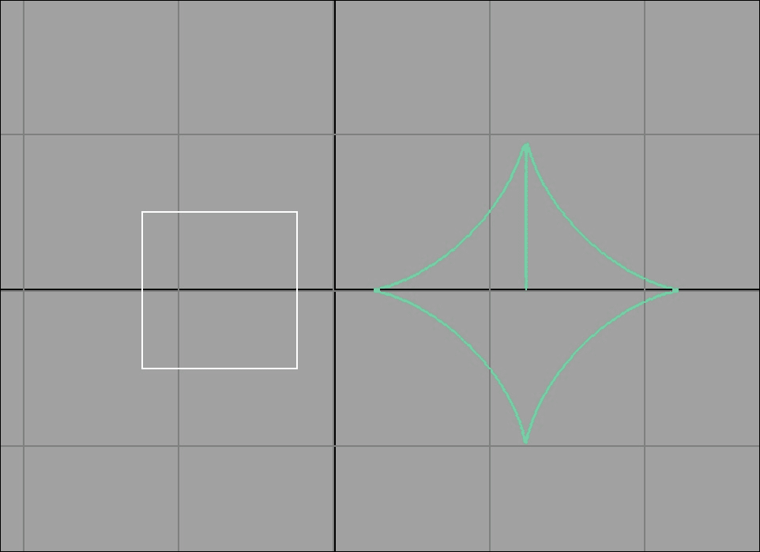
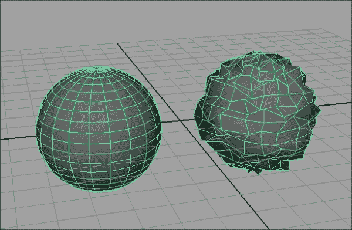
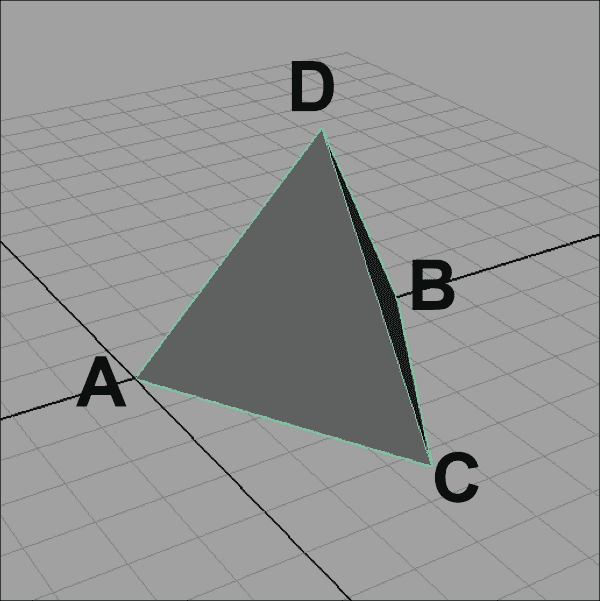
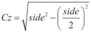
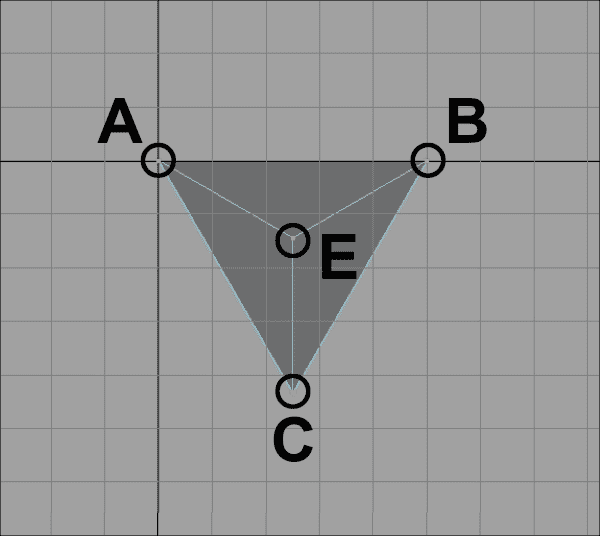
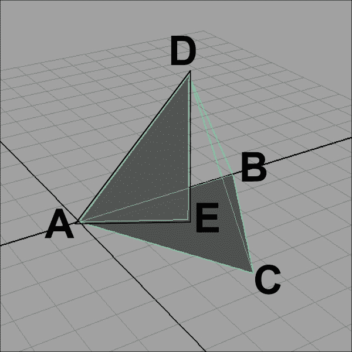
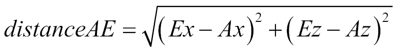
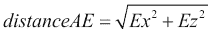
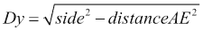
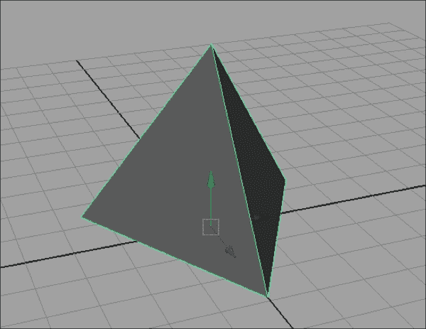

# 第三章. 使用几何体

在本章中，我们将探讨通过脚本创建和操作几何体的方法。以下主题将得到涵盖：

+   与选定的对象一起工作并检查节点类型

+   访问多边形模型中的几何数据

+   访问 NURBS 对象中的几何数据

+   创建曲线

+   创建新的多边形面

+   创建新的修改器（噪声）

+   创建新的原语（四面体）

# 简介

在本章中，我们将探讨如何通过脚本在 Maya 中操作几何体。首先，我们将看看如何确保我们选择了正确的类型的对象。从那里，我们将看看如何检索有关特定类型几何体的信息（包括多边形和 NURBS）。

我们还将探讨如何创建新的几何体（包括单个面和整个对象），以及如何对现有对象进行按顶点修改。

# 与选定的对象一起工作并检查节点类型

非常常见的情况是，你可能只想编写一个只对某些类型的对象以及用户在运行脚本之前已经存在的对象起作用的脚本。在这种情况下，你将希望能够不仅确定当前选中的对象是什么，还要验证选中的对象是否为适当的类型。在本例中，我们将创建一个脚本，用于验证当前选中的对象实际上是否是多边形几何体的实例，如果不是，则修改用户。

## 如何操作...

创建一个新的脚本并添加以下代码：

```py
import maya.cmds as cmds

def currentSelectionPolygonal(obj):

    shapeNode = cmds.listRelatives(obj, shapes=True)
    nodeType = cmds.nodeType(shapeNode)

    if nodeType == "mesh":
        return True

    return False

def checkSelection():
    selectedObjs = cmds.ls(selection=True)

    if (len(selectedObjs) < 1):
        cmds.error('Please select an object')

    lastSelected = selectedObjs[-1]

    isPolygon = currentSelectionPolygonal(lastSelected)

    if (isPolygon):
        print('FOUND POLYGON')
    else:
        cmds.error('Please select a polygonal object')

checkSelection()
```

如果你运行前面的脚本而没有选择任何内容，你应该会得到一个错误提示，表明你应该选择一些内容。如果你选择了一个非多边形对象，你也会得到一个错误，但会提示你应该选择一个多边形对象。

然而，如果你选择了一个多边形对象，脚本将打印**找到多边形**。

## 它是如何工作的...

该脚本由两个函数组成——一个（`currentSelectionPolygonal`）用于测试给定的对象是否是多边形几何体，另一个（`checkSelection`）用于在当前选中的对象上调用它。因为`checkSelection`是脚本的入口点，所以我们将从这里开始。

我们必须做的第一件事是获取当前选中的对象或对象的列表。为此，我们将使用`ls`命令。`ls`命令是*list*的缩写，也是**Maya 嵌入式语言**（**MEL**）的 bash 脚本遗产的另一个例子，这种遗产延续到了 Python 命令列表中。`ls`命令可以执行各种操作，但最常见的方式可能是使用`selection`标志来返回当前选中的节点的列表，如下所示：

```py
selectedObjs = cmds.ls(selection=True)
```

注意，尽管我们本质上是在向 Maya 提问，但使用`query`标志并不是必要的。实际上，使用`ls`命令的查询模式将生成错误。注意，我们将`ls`命令的结果存储在一个名为`selectedObjects`的变量中。这将给我们一个 Python 列表形式的对象集合，对象以它们被选择的顺序出现。首先，我们想要确保至少选择了一个对象，通过检查`selectedObjs`的长度：

```py
    if (len(selectedObjs) < 1):
        cmds.error('Please select an object')
```

如果用户没有选择任何内容，我们使用`error`命令来通知用户并停止脚本的执行。添加有意义的错误信息是提供高质量反馈的绝佳方式。您还可以使用`warning()`命令向用户提供反馈而不停止脚本。在这两种情况下，错误（或警告）将以与内置错误（或警告）相同的方式显示给用户，出现在 Maya 界面的底部，并带有红色（或黄色）背景。

一旦我们知道我们至少选择了一个对象，我们想要确保给定的对象是一个多边形对象。使用`-1`作为列表中的索引允许我们从末尾开始计数。在这种情况下，这将给我们最近选择的对象。

```py
lastSelected = selectedObjs[-1]
```

我们然后将该对象传递给我们的`currentSelectionPolygonal`函数，该函数将确定它实际上是否是一个多边形对象。这个函数将处理检查并返回`True`或`False`，这取决于所讨论的对象是否是多边形几何形状。

```py
isPolygon = currentSelectionPolygonal(lastSelected)
```

通常将脚本分解成不同的部分是一个好主意，每个部分负责一个特定的任务。这使得编写和维护脚本变得更加容易。然而，这也要求不同的部分能够相互通信。`return`语句是完成这一点的最常见方式之一。它会导致当前函数停止并*返回*到上一个作用域。如果您给它一个值，该值将随它返回，从而允许信息从一个函数传递到另一个函数。

我们可以使用`nodeType()`命令来检查给定节点的类型，但这不仅仅是那样。如果我们检查所选对象本身的类型，我们几乎总是会得到*变换*。这是因为你在 Maya 中交互的大多数事物都是由两个节点组成的，而不是一个。通常有一个形状节点，它包含与给定对象相关的所有特定数据（面、顶点等），还有一个变换对象，它包含所有屏幕上出现并可移动的对象的共同位置、旋转和缩放（以及一些其他东西）。形状节点始终是其相应变换节点的子节点。

### 注意

当你在界面中点击某个对象时，例如多边形对象，你实际上是在点击形状节点，但 Maya 会自动跳到层次结构中的一步，到变换节点，这样你就可以移动它。这通常用于通过使曲线的形状节点成为其他变换的子节点来创建绑定控制，从而提供一种通过点击不可渲染的曲线（例如）来抓取模型内部骨骼的简单方法。

那么，我们实际上需要来测试几何类型的是与变换关联的形状节点。有几种方法可以做到这一点，但最好的方法是使用带有`shapes=True`的`listRelatives()`命令。这将给我们提供与输入节点关联的形状节点（如果有的话）：

```py
def currentSelectionPolygonal(obj):
    shapeNode = cmds.listRelatives(obj, shapes=True)
```

一旦我们做了这件事，我们可以使用`nodeType`来测试其类型，看看我们有什么样的几何形状。如果我们有一个多边形对象，它将导致`mesh`。如果节点类型实际上是`mesh`，我们返回一个值为`True`。如果它不是`mesh`，我们则返回`False`：

```py
    if nodeType == "mesh":
        return True

    return False
```

注意，`return False`出现在`else`块之外。这主要是一种风格选择。如果你在条件（如我们在这里所做的那样）内部有一个`return`语句，那么有一个`return`语句是保证会被调用的，这样可以确保函数没有可能不提供返回值。

虽然有些人不喜欢在单个函数中有多个返回值，但如果你是其中之一，你也可以创建一个变量并返回它，如下所示：

```py
    isMesh = False
    if (nodeType == "mesh"):
        isMesh = True

    return isMesh
```

或者，为了更紧凑（但可能稍微不那么易读）的方法，你只需返回比较本身的结果：

```py
    return (nodeType == "mesh")
```

所有这些都会产生相同的结果，即如果测试的对象具有类型为`mesh`的形状节点，则函数将返回`True`。在这个时候，我们完成了`currentSelectionPolygonal`函数，可以将注意力转回`checkSelection`。

剩下的就是检查返回值并通知用户结果：

```py
    if (isPolygon):
        print('FOUND POLYGON')
    else:
        cmds.error('Please select a polygonal object')
```

## 还有更多...

我们可以使用与`listRelatives`获取形状节点并测试其类型相同的技巧来识别其他类型的对象。其中一些更有用的类型包括`nurbsCurve`用于 NURBS 曲线和`nurbsSurface`用于 NURBS 对象。

# 在多边形模型中访问几何数据

在这个例子中，我们将探讨如何获取多边形几何信息，这将成为更复杂脚本的基石。

## 准备工作

创建一个新的场景，并确保它包含一个或多个多边形对象。

## 如何做到这一点...

创建一个新的脚本，命名为`polyStats.py`，并添加以下代码：

```py
import maya.cmds as cmds

# examine data for a currently-selected polygonal object
def getPolyData():
    selectedObjects = cmds.ls(selection=True)
    obj = selectedObjects[-1]

    vertNum = cmds.polyEvaluate(obj, vertex=True)
    print('Vertex Number: ',vertNum)

    edgeNum = cmds.polyEvaluate(obj, edge=True)
    print('Edge Number: ', edgeNum)

    faceNum = cmds.polyEvaluate(obj, face=True)
    print('Face Number: ',faceNum)

getPolyData()
```

运行前面的代码将在控制台打印出当前所选多边形对象的信息。

## 它是如何工作的...

`polyEvaluate`命令相当直观，可以用来确定多边形对象的各种信息。在这种情况下，我们只是获取对象包含的顶点、边和面的数量。

## 更多...

获取一个对象包含的组件数量本身并不是特别有用。为了执行有用的操作，您可能希望直接访问组件。

为了做到这一点，您需要理解每个对象都存储了一个 Python 列表中的组件集合，命名如下：

| 组件 | 列表名称 |
| --- | --- |
| 顶点 | vtx |
| 边 | e |
| Faces | f |

因此，为了选择给定对象（其名称存储在变量`obj`中）的第一个顶点，您可以这样做：

```py
cmds.select(obj+'.vtx[0]', replace=True)
```

您可以用类似的方式获取第一个边：

```py
cmds.select(obj+'.e[0]', replace=True)
```

或者第一个面：

```py
cmds.select(obj+'.f[0]', replace=True)
```

由于组件列表只是普通的 Python 列表，您也可以使用冒号以及起始或结束索引（或两者）来引用组件集合。例如，如果我们想从`5`到`12`选择顶点，我们可以这样做：

```py
cmds.select(obj+'.vtx[5:12]', replace=True)
```

这将有效，但如果您还想将起始和结束索引作为变量，这可能会变得有些尴尬，结果可能如下所示：

```py
cmds.select(obj+'.vtx[' + str(startIndex) + ':' + str(endIndex) + ']', replace=True)
```

这将构建出传递给`cmds.select`的正确值（例如`polySurface5.vtx[5:12]`），但输入起来有些繁琐。一个更简单的方法是使用 Python 内置的字符串格式化功能，它可以用来将变量放入特定的字符串中。

要这样做，从一个您想要得到的字符串示例开始，如下所示：

```py
myObject.vtx[5:12]
```

然后，确定字符串中将要改变的部分。在这种情况下，我们想要传递三个东西——对象名称、起始索引和结束索引。对于每一个，用花括号包裹的数字替换特定的值，如下所示：

```py
{0}.vtx[{1}:{2}]
```

完成这些后，您可以在字符串上调用`format()`，传递值以替换花括号中的数字，如下所示：

```py
"{0}.vtx[{1}:{2}]".format("myObject", 5, 12)
```

方括号内的数字作为索引，告诉 Python 传递给`format`的参数应该放在哪里。在这种情况下，我们说的是第一个参数（对象名称）应该放在开始处，接下来的两个应该放在方括号内。

这里是一个将所有这些放在一起示例：

```py
objectName = "myObject"
startIndex = 5
endIndex = 12
cmds.select("{0}.vtx[{1}:{2}]".format(objectName, startIndex, endIndex), replace=True)
```

# 在 NURBS 对象中访问几何数据

在这个例子中，我们将探讨如何检索有关 NURBS 表面的信息，从它们包含的**控制顶点**（**CVs**）的数量开始。

然而，NURBS 对象中的 CV 数量并不像多边形对象中的顶点数量那样简单直接。尽管多边形对象相对简单，它们的形状直接由顶点的位置决定，但 NURBS 对象在任何给定点的曲率受多个点的影响。影响特定区域的确切点数取决于表面的度数。

为了了解这是如何工作的，我们将创建一个脚本，该脚本将确定 NURBS 表面每个方向（`U`和`V`）中的 CV 总数，并且我们将查看如何选择特定的 CV。

## 准备工作

确保你有包含至少一个 NURBS 表面的场景。

## 如何操作...

创建一个新文件，命名为`getNURBSinfo.py`（或类似），并添加以下代码：

```py
import maya.cmds as cmds

def getNURBSInfo():
    selectedObjects = cmds.ls(selection=True)
    obj = selectedObjects[-1]
    degU = cmds.getAttr(obj + '.degreeU')
    spansU = cmds.getAttr(obj + '.spansU')
    cvsU = degU + spansU
    print('CVs (U): ', cvsU)

    degV = cmds.getAttr(obj + '.degreeV')
    spansV = cmds.getAttr(obj + '.spansV')
    cvsV = degV + spansV
    print('CVs (V): ', cvsV)

getNURBSInfo()
```

选择一个 NURBS 表面并运行脚本。您将看到每个参数化方向（`U`和`V`）中的 CV 数量输出到脚本编辑器。

## 它是如何工作的...

在这个例子中，我们使用`getAttr`命令来检索有关所选对象的信息。`getAttr`命令是“获取属性”的缩写，可以用来检索给定节点上任何属性的价值，这使得它在各种情况下都很有用。

在这个特定情况下，我们正在用它来获取沿着表面的每个方向上的两件事——跨度和度数，如下所示：

```py
degU = cmds.getAttr(obj + '.degreeU')
spansU = cmds.getAttr(obj + '.spansU')
```

NURBS 表面（或曲线）的“度数”是影响几何中每个点的点的数量，范围从 1（线性）到 3。度数为 1 的曲线和表面是线性的，类似于多边形几何。度数大于 1 的曲线和表面通过插值多个点来生成曲率。曲线或表面中的 CV 总数始终等于跨度的数量加上度数。

一种理解这个概念简单的方法是考虑最简单的曲线——一条直线。这条曲线将有一个跨度（一个段），度数为 1（线性），并且仍然需要两个点（起点和终点）来定义。在这种情况下，我们将有：

*(1 跨度) + (度数为 1) = 2 个点*

对于更复杂的曲线，需要更多的点，但原理相同——最小数量总是（曲线度数）加一（因为不可能有一个没有跨度的曲线或表面）。

因此，要获取 CV 的总数，我们使用`getAttr`两次，一次获取跨度，再次获取度数，然后将总数相加，如下所示：

```py
degU = cmds.getAttr(obj + '.degreeU')
spansU = cmds.getAttr(obj + '.spansU')
cvsU = degU + spansU
print('CVs (U): ', cvsU)
```

最后，我们将通过选择第一个和最后一个 CV 来完成脚本。在 NURBS 表面上选择 CV 与选择多边形的顶点非常相似，但有以下两个关键区别：

+   我们使用`.cv`而不是`.vtx`

+   我们需要指定两个索引（一个用于`U`，一个用于`V`）而不是一个

选择第一个 CV 相当简单；我们只需为两个索引都使用零：

```py
cmds.select(obj+'.cv[0][0]')
```

选择最后一个 CV 稍微复杂一些，需要我们将几个不同的部分组合在一起，以确保我们最终得到类似`myObj.cv[8][8]`的东西，如果表面在每个方向上有九个 CV。我们需要从 CV 总数中减去一个，并将其放在`str()`中，这样 Python 就会允许我们将它与文本组合在一起。将这些组合在一起，我们得到：

```py
cmds.select(obj+'.cv[' + str(cvsU-1) + '][' + str(cvsV-1) + ']', add=True)
```

或者，我们可以使用字符串格式化来构建输入，如下所示：

```py
cmds.select("{0}.cv[{1}][{2}]".format(obj, (cvsU-1), (cvsV-1), add=True)
```

## 还有更多...

之前提到的讨论是基于使用 NURBS 曲面。如果我们使用的是曲线而不是曲面，情况将非常相似，但我们将使用单个索引来指定 CV，而不是两个，如下所示：

```py
    degree = cmds.getAttr(obj + '.degree')
    spans = cmds.getAttr(obj + '.spans')
    cvs = degree + spans
    print('CVs: ', cvs)

    cmds.select(obj+'.cv[0]')
    cmds.select(obj+'.cv[' + str(cvs-1) + ']', add=True)
```

还要注意，当我们检索度数和跨度值时，我们不指定`U`或`V`，因为曲线只有一个维度而不是两个。

# 创建曲线

在这个例子中，我们将探讨如何使用代码创建曲线。这可以用于多种不同的目的，例如作为进一步建模操作的基础或为复杂的装置创建自定义控件。

在这个例子中，我们将制作两条曲线——一条直接创建的简单曲线和一条逐点创建的更复杂的曲线。

这就是我们最终的输出，将两个曲线都从原点移开。



## 如何做到这一点...

创建一个新文件，并将其命名为`makeCurves.py`或类似名称。添加以下代码：

```py
import maya.cmds as cmds
import math

def makeCurve():
    theCurve = cmds.curve(degree=1, p=[(-0.5,-0.5,0),(0.5,- 0.5,0),(0.5,0.5,0), (-0.5,0.5,0), (-0.5, -0.5, 0)])

def curveFunction(i):
    x = math.sin(i)
    y = math.cos(i)
    x = math.pow(x, 3)
    y = math.pow(y, 3)
    return (x,y)

def complexCurve():
    theCurve = cmds.curve(degree=3, p=[(0,0,0)])

    for i in range(0, 32):
        val = (math.pi * 2)/32 * i
        newPoint = curveFunction(val)
        cmds.curve(theCurve, append=True, p=[(newPoint[0], newPoint[1], 0)])

makeCurve()
complexCurve()
```

如果你运行前面的代码，你将得到两条曲线——一个是正方形曲线，另一个是心形曲线。

## 它是如何工作的...

要创建一条新曲线，我们首先需要了解我们想要创建什么。在正方形的情况下，这很简单。我们只需要有四个点——每个点距离原点的一半宽度，在每个正负组合中（(-,-), (-,+), (+,+), 和 (+,-))）。

要实际创建曲线，我们将使用`curve`命令并指定一系列点。我们还将设置曲线的度数为`1`，即使其线性，这对于正方形来说是有意义的。将这些放在一起，我们得到以下结果：

```py
theCurve = cmds.curve(degree=1, p=[(-0.5,-0.5,0),(0.5,- 0.5,0),(0.5,0.5,0), (-0.5,0.5,0), (-0.5, -0.5, 0)])
```

注意，我们指定了五个点而不是四个。如果我们只留下四个点，我们最终会得到三个跨度而不是四个，导致正方形的一边缺失。解决这个问题的方法之一是简单地重复点列表末尾的第一个点来闭合曲线。

对于一个更复杂的例子，我们将使用一些有趣的数学方法创建一个**心形曲线**。为了使这个过程更容易，我们将创建一个函数，该函数将接受参数化输入并输出一个包含曲线该输入的 X 和 Y 坐标的两个元素的元组。我们还将逐点向曲线中添加点，因为对于更复杂的曲线，这有时是一种更容易的方法。

曲线的参数方程可以写成如下：

在这里，theta 的范围是从 0 到 2π。用 Python 表示这个值，我们得到以下结果：

```py
def curveFunction(i):
    x = math.sin(i)
    y = math.cos(i)
    x = math.pow(x, 3)
    y = math.pow(y, 3)
    return (x,y)
```

现在我们有一个函数可以给出我们想要的曲线，我们将创建一条新曲线并逐点添加到它。首先，我们创建曲线并将其设置为具有三次（立方）度数，这样它就会很平滑，如下所示：

```py
theCurve = cmds.curve(degree=3, p=[(0,0,0)])
```

现在，我们将遍历从零到（2 * π）的范围，并在现有曲线上添加一个新点：

```py
for i in range(0, 32):
    val = (math.pi * 2)/32 * i
    newPoint = curveFunction(val)
    cmds.curve(theCurve, append=True, p=[(newPoint[0], newPoint[1], 0)])
```

我们首先计算输入为（2 * π）的 1/32 乘以我们的索引，并将其传递给曲线函数。然后我们再次使用`curve`命令，但进行了一些更改，即：

+   我们通过将其作为第一个参数传递来指定我们正在工作的曲线

+   我们使用 `append=True` 标志让 Maya 知道应该将点添加到现有曲线而不是创建一个新的曲线。

+   我们使用 `curveFunction` 的输出指定一个点，用于 *X* 和 *Y* 坐标，以及 *Z* 坐标的 0

## 还有更多...

虽然你可能在自己的项目中不需要心形线，但有很多情况下你可能想要逐步创建曲线。例如，你可能想根据动画序列创建一个曲线，通过在每一帧添加给定对象的位位置点。当我们查看动画脚本时，我们将看到如何逐帧获取位置。

## 参见

关于心形线（astroid curve）的更多信息，请查看 Wolfram MathWorld 网站的条目，[`mathworld.wolfram.com/Astroid.html`](http://mathworld.wolfram.com/Astroid.html)。这只是该网站解释的有趣曲线之一，以及你可能觉得有用的各种其他数学资源。

# 创建新的多边形面

在这个例子中，我们将探讨如何使用代码创建新的多边形面，包括一个简单的四边形和一个更复杂的例子，该例子包含一个内部洞。

## 如何做到这一点...

创建一个新文件，命名为 `polyCreate.py`（或类似），并添加以下代码：

```py
import maya.cmds as cmds
import math

def makeFace():

    newFace = cmds.polyCreateFacet(p=[(-1,-1,0),(1,- 1,0),(1,1,0),(-1,1,0)])

def makeFaceWithHole():
    points = []

    # create the inital square
    points.append((-5, -5, 0))
    points.append(( 5, -5, 0))
    points.append(( 5, 5, 0))
    points.append((-5, 5, 0))

    # add empty point to start a hole
    points.append(())

    for i in range(32):
        theta = (math.pi * 2) / 32 * i
        x = math.cos(theta) * 2
        y = math.sin(theta) * 2
        points.append((x, y, 0))

    newFace = cmds.polyCreateFacet(p=points)

makeFace()
makeFaceWithHole()
```

如果你运行前面的脚本，你会看到创建了两个新对象，都在 *XY* 平面上——一个是简单的正方形，另一个是在中心有洞的正方形。

## 它是如何工作的...

`polyCreateFacet` 命令相当直接，并期望接收一个点位置数组。每个点应存储在一个包含三个值的元组中，每个值分别对应顶点的 *X*、*Y* 和 *Z* 位置。

在第一个例子中，我们只是直接调用 `polyCreateFacet` 命令，并提供组成以原点为中心、在 *XY* 平面上对齐的 2 单位正方形四个顶点的四个点。以下是我们的代码：

```py
newFace = cmds.polyCreateFacet(p=[(-1,-1,0),(1,-1,0),(1,1,0),(- 1,1,0)])
```

你也可以创建带有内部洞的多边形，但为了做到这一点，你需要向 Maya 信号你正在开始一个洞。为此，你需要向 `polyCreateFacet` 命令提供一个空点作为空元组。

当创建更复杂的面时，创建一个数组来存储各种点并逐个将其推入它可能更容易，而不是尝试将单个长参数传递给 `polyCreateFacet` 命令。

我们再次从四个点开始，在 *XY* 平面上定义一个正方形，如下所示：

```py
points = []

# create the inital square
points.append((-5, -5, 0))
points.append(( 5, -5, 0))
points.append(( 5, 5, 0))
points.append((-5, 5, 0))
```

为了让 Maya 开始在我们制作的面上创建一个洞，我们接下来添加一个空元组：

```py
    points.append(())
```

现在我们可以开始添加孔的点了。在这种情况下，我们将添加 32 个点来制作一个圆形孔。这可以通过一点三角学轻松完成。因为我们用 32 个段来制作孔，所以我们把一个完整的旋转（以弧度为单位，所以`math.pi * 2`）除以`32`，然后乘以我们的索引，得到我们提供给三角函数的值。

将所有这些放在一起，我们得到以下结果：

```py
for i in range(32):
        theta = (math.pi * 2) / 32 * i
        x = math.cos(theta) * 2
        y = math.sin(theta) * 2
        points.append((x, y, 0))
```

然后，我们将有一个包含 37 个元组的数组，代表 36 个点加上一个空白条目，以指示切割区域的开始。将此传递给`polyCreateFacet`命令将给出最终结果。我们使用以下代码：

```py
newFace = cmds.polyCreateFacet(p=points)
```

## 还有更多...

在创建多边形面时，指定顶点的顺序非常重要。很明显，如果顶点顺序错误，会导致生成的面以意想不到的方式弯曲，但顺序也会影响面或面的法线指向的方向。务必确保按照创建的面外围的顺时针方向指定你的点，这样法线就会指向屏幕外。

如果你想让法线指向另一个方向，要么以相反的顺序指定它们，要么使用以下`polyNormal`命令显式地反转创建的面的法线：

```py
# with a polygonal object selected
cmds.polyNormal(normalMode=4)
```

`4`变量可能看起来很神秘，但`polyNormal`命令可以执行几个不同的特定功能（包括一些已弃用的选项），而`normalMode`标志是告诉 Maya 你想要哪个的一个方法。有关详细信息，请务必查阅 Python 命令文档。

如果你发现自己正在创建复杂的面，例如我们带有孔的第二例，你可能想确保你留下的面不超过四边。你当然可以通过一次创建一个面并将它们连接起来（我们将在稍后提到的自定义原语示例中这样做）来实现，或者你可以创建一个形状作为一个单一的面，然后将其三角化。

要三角化生成的面，在创建它之后运行`polyTriangulate`命令，如下所示：

```py
cmds.polyCreateFacet(p=myPoints)
cmds.polyTriangulate()
```

你还可以通过运行以下`polyQuad`命令让 Maya 尝试将生成的三角形合并成四边形：

```py
# attempt to form quads from a recently-triangulated poly mesh
cmds.polyQuad()
```

四角化并不总是有效，但它通常也不会造成伤害。另一方面，在网格中留下**非四边形**可能会导致各种问题，最好避免。

# 创建新的修改器（噪声）

许多 3D 建模和动画软件包提供了一种方法，可以在对象顶点上添加一些随机噪声，但 Maya 没有。这看起来可能是一个疏忽，但它也为我们提供了一个很好的项目示例。

在这个例子中，我们将编写一个脚本来遍历多边形对象的全部顶点，并将它们稍微移动一下。以下是一个简单的多边形球体在应用我们将开发的脚本之前和之后的示例：



## 如何做到这一点...

创建一个新的脚本，命名为`addNoise.py`，并添加以下代码：

```py
import maya.cmds as cmds
import random

def addNoise(amt):

    selectedObjs = cmds.ls(selection=True)
    obj = selectedObjs[-1]

    shapeNode = cmds.listRelatives(obj, shapes=True)

    if (cmds.nodeType(shapeNode) != 'mesh'):
        cmds.error('Select a mesh')
        return

    numVerts = cmds.polyEvaluate(obj, vertex=True)

    randAmt = [0, 0, 0]
    for i in range(0, numVerts):

        for j in range(0, 3):
            randAmt[j] = random.random() * (amt*2) - amt

        vertexStr = "{0}.vtx[{1}]".format(obj, i)
        cmds.select(vertexStr, replace=True)
        cmds.move(randAmt[0], randAmt[1], randAmt[2], relative=True)

    cmds.select(obj, replace=True)

addNoise(0.2)
```

如果您选择多边形对象并运行此代码，您会看到每个顶点都通过一个小随机量（`0.2`单位）移动。

## 它是如何工作的...

首先，我们希望确保我们已选择多边形对象：

+   获取当前选定的对象

+   确定最近选择的对象（如果有的话）附加的形状节点

+   测试形状节点以确保它是一个多边形对象

看看以下代码：

```py
    selectedObjs = cmds.ls(selection=True)
    obj = selectedObjs[-1]

    shapeNode = cmds.listRelatives(obj, shapes=True)
```

一旦我们这样做，我们希望遍历对象的每个顶点，但首先我们需要知道它包含多少个顶点。因此，我们使用`polyEvaluate`命令如下：

```py
numVerts = cmds.polyEvaluate(obj, vertex=True)
```

现在我们已经准备好遍历顶点并移动每个顶点。因为我们希望每个轴都是独立的，所以我们首先创建一个变量来保存每个的偏移量：

```py
randAmt = [0, 0, 0]
```

现在我们已经准备好遍历这个对象。对于每次遍历，我们希望将`randAmt`数组设置为随机变量，然后将这些变量应用到顶点的位置：

```py
        for j in range(0, 3):
            randAmt[j] = random.random() * (amt*2) - amt
```

### 注意

关于我们如何设置随机数量的说明——我们希望确保产生的值在输入值（作为最大值）和它的负等效值（作为最小值）之间。

`random.random()`函数将产生一个介于 0 和 1 之间的随机数。将其乘以输入值的两倍将给我们一个介于 0 和（amt * 2）之间的值，减去输入值将给我们正确的范围。

现在，我们将首先通过选择单个顶点并使用`move`命令移动它来移动顶点：

```py
        vertexStr = "{0}.vtx[{1}]".format(obj, i)
        cmds.select(vertexStr, replace=True)
        cmds.move(randAmt[0], randAmt[1], randAmt[2], relative=True)
```

注意，Maya 还提供了一个`polyMoveVertex`命令，这可能看起来是调整每个顶点位置的一个更好的方法。虽然这绝对有效，但由于为每个移动的顶点创建另一个**数据库可用性组**（**DAG**）节点所带来的额外开销，它将运行得慢得多。如果您想亲自看看，尝试注释掉选择和移动顶点的行，并添加以下内容：

```py
cmds.polyMoveVertex(vertexStr, t=randAmt)
```

尝试运行这个，看看它需要多长时间，然后注释掉这一行，重新启用选择和移动行并重新运行脚本。您可能会看到`polyMoveVertex`版本需要更长的时间。

一旦我们遍历了所有的顶点并将每个顶点稍微移动了一下，我们希望确保通过选择原始对象来完成，从而使用户能够对对象执行进一步的操作。看看以下代码：

```py
cmds.select(obj, replace=True)
```

## 更多内容...

这个例子只会对多边形对象有效，但很容易扩展到与 NURBS 曲面甚至曲线一起工作。为此，我们需要做以下两件事：

+   测试几何类型（`nurbsSurface`或`nurbsCurve`）

+   修改点选择代码以引用适当的点类型

另一个更复杂的因素是，NURBS 曲面的 CVs 必须以二维数组的形式访问，而不是多边形表面的`vtx`列表的平面数组。

# 创建新的原语（四面体）

在这个例子中，我们将创建一个全新的（对 Maya 而言）几何原语——四面体。四面体在原理上很简单，但使用 Maya 的界面创建它们需要许多步骤。因此，它们非常适合脚本编写。

我们将创建一个脚本，该脚本将创建一个具有给定边宽的四面体作为多边形网格。

## 准备工作

在我们开始编写代码之前，我们想要确保我们对四面体的数学原理有很好的理解。四面体是最简单的正多面体，由四个面组成，每个面都是一个等边三角形。

每个四面体仅由四个点组成。为了方便，我们将底部的三个点命名为**A**、**B**和**C**，而顶部的点命名为**D**，如下面的插图所示：



为了使数学更容易，我们将点**A**设置为原点([0,0,0])。因为底面的每一边长度都相同，我们可以通过沿着*x*轴移动所需的边长来找到点**B**，给**B**的坐标为[长度, 0, 0]。

点**C**的处理稍微复杂一些。首先，我们注意到每个等边三角形都可以分成两个相似的直角三角形，如下所示：

找到点**C**的*X*坐标很容易；我们只需要将边长除以二。而*Z*坐标则等于前面提到的插图中所提到的每个半三角形的长度，但我们还不知道。然而，我们知道其他两边的长度，即较短的一边是边长的一半，而斜边则是完整的边长本身。

因此，根据勾股定理，我们知道：


或者，稍作改写，我们有以下公式：



最后，我们需要四面体顶点的坐标。我们将以类似于我们找到**C**坐标的方式获得这些坐标，即我们将使用另一个直角三角形，但这个三角形将略有不同；它将是点**A**、点**D**和底面中心点（我们将称之为点**E**）形成的三角形。



首先，让我们找到点**E**。因为它位于底部的中心，我们可以简单地平均**A**、**B**和**C**的*X*和*Z*坐标，从而得到**E**的位置。然后，我们可以构造一个三角形，这将帮助我们确定点**D**的垂直位置。



点**D**将具有与**E**相同的**X**和**Z**坐标，但需要在**y**轴上提升适当的量以创建一个合适的四面体。为了找到这个距离，我们将使用由**A**、**E**和**D**形成的三角形。斜边，再次强调，是四面体的一个完整边，所以这很简单。较短的底边（**A**-**E**）是**A**到底部中心的距离。为了找到这个距离，我们可以使用距离公式，通过选择点**A**作为原点来简化计算。



因为点**A**的**X**和**Z**坐标都是零，所以我们得到以下结果：



一旦我们完成了这个操作，我们就知道三角形的两边长度，我们可以通过再次使用勾股定理来计算第三边，如下所示：



现在我们已经很好地掌握了如何创建四面体，我们准备实际编写脚本。

## 如何做...

创建一个新的脚本，并将其命名为`makeTetrahedron.py`。添加以下代码：

```py
import maya.cmds as cmds
import math

def makeTetra(size):

    pointA = [0, 0, 0]
    pointB = [size, 0, 0]

    pointC = [size/2.0, 0, 0]
    # set the Z position for C
    pointC[2] = math.sqrt((size*size) - (size/2.0 * size/2.0))

    pointE = [0,0,0]
    # average the A, B, and C to get E
    # first add all the values
    for i in range(0,3):
        pointE[i] += pointA[i]
        pointE[i] += pointB[i]
        pointE[i] += pointC[i]
    # now divide by 3
    for i in range(0,3):
        pointE[i] = pointE[i] / 3.0

    # start point D with the X and Z coordinates of point E
    pointD = [0,0,0]
    pointD[0] = pointE[0]
    pointD[2] = pointE[2]

    distanceAE = math.sqrt((pointE[0] * pointE[0]) + (pointE[2] * pointE[2]))

    # set the Y coordinate of point D
    pointD[1] = math.sqrt((size * size) - (distanceAE * distanceAE))

    faces = []
    faces.append(cmds.polyCreateFacet(p=[pointA, pointB, pointC], texture=1))
    faces.append(cmds.polyCreateFacet(p=[pointA, pointD, pointB], texture=1))
    faces.append(cmds.polyCreateFacet(p=[pointB, pointD, pointC], texture=1))
    faces.append(cmds.polyCreateFacet(p=[pointC, pointD, pointA], texture=1))

    cmds.select(faces[0], replace=True)
    for i in range(1, len(faces)):
        cmds.select(faces[i], add=True)

    obj = cmds.polyUnite()

    cmds.select(obj[0] + ".vtx[:]")
    cmds.polyMergeVertex(distance=0.0001)

    cmds.select(obj[0])

    cmds.move(-pointE[0], 0, -pointE[2])
    cmds.xform(pivots=(pointE[0], 0, pointE[2]))
    cmds.makeIdentity(apply=True)
    cmds.delete(ch=True)

makeTetra(5)
```

运行此代码，你应该得到一个边长为 5 个单位的四面体，底部中心位于原点。



## 它是如何工作的...

首先，我们计算所有需要的点，如前述“准备中”部分所述。每个点是一个包含**X**、**Y**和**Z**坐标的三元素数组。

前两个点很容易：

```py
pointA = [0, 0, 0]
pointB = [size, 0, 0]
```

`pointC`稍微复杂一些，需要我们使用勾股定理：

```py
pointC = [size/2.0, 0, 0]
# set the Z position for C
pointC[2] = math.sqrt((size*size) - (size/2.0 * size/2.0))
```

为了计算`pointD`的位置，我们首先确定底部的中心，我们将称之为`pointE`。使用以下代码：

```py
pointE = [0,0,0]
# average the A, B, and C to get E
# first add all the values
for i in range(0,3):
    pointE[i] += pointA[i]
    pointE[i] += pointB[i]
    pointE[i] += pointC[i]
# now divide by 3
for i in range(0,3):
    pointE[i] = pointE[i] / 3.0
```

最后，我们可以通过将**X**和**Z**坐标设置为`pointE`的坐标，并使用勾股定理来确定**Y**坐标来确定`pointD`，如下所示：

```py
# start point D with the X and Z coordinates of point E
pointD = [0,0,0]
pointD[0] = pointE[0]
pointD[2] = pointE[2]
distanceAE = math.sqrt((pointE[0] * pointE[0]) + (pointE[2] * pointE[2]))
```

一旦我们完成了这个操作，我们就可以使用`polyCreateFacet`命令创建单个面。我们将使用`polyCreateFacet`命令四次，每次用于四面体的一个面。我们还将结果存储到一个数组中，这样我们可以在稍后进行最终处理时选择所有面。我们有以下代码：

```py
faces = []
faces.append(cmds.polyCreateFacet(p=[pointA, pointB, pointC], texture=1))
faces.append(cmds.polyCreateFacet(p=[pointA, pointD, pointB], texture=1))
faces.append(cmds.polyCreateFacet(p=[pointB, pointD, pointC], texture=1))
faces.append(cmds.polyCreateFacet(p=[pointC, pointD, pointA], texture=1))
```

在这一点上，我们已经创建了所有的几何形状，但我们还想做一些事情来完成对象，即：

1.  将所有面组合成一个单一的对象。

1.  将对象移动，使底部中心位于原点。

1.  设置对象的轴心点，使其也位于底部中心。

1.  冻结变换。

首先，让我们通过选择面将面组合成一个单一的对象。我们首先通过将当前选择替换为第一个面开始，然后通过在`cmds.select()`调用中使用`add=True`将额外的三个面添加到选择中。我们有以下代码：

```py
cmds.select(faces[0], replace=True)
for i in range(1, len(faces)):
    cmds.select(faces[i], add=True)
```

一旦我们选择了所有的面，我们就可以使用`polyUnite`将它们组合起来：

```py
obj = cmds.polyUnite()
```

它将导致所有面合并成一个单一的多边形对象，但这只是开始。如果我们就这样结束，我们最终会得到不相连的面和在每个四面体的四个点上的多个顶点。为了完成它，我们想要确保重叠的顶点被合并。

要做到这一点，我们首先选择我们模型中的所有顶点：

```py
cmds.select(obj[0] + ".vtx[:]")
```

注意，我们使用 `vtx` 列表来选择顶点，但我们省略了起始和结束索引，只使用一个冒号。这是一个简单的简写方式来引用列表的全部内容，并将导致选择我们模型中的所有顶点。一旦我们完成，我们告诉 Maya 使用 `polyMergeVertex` 命令合并附近的顶点，传递一个小阈值距离。

```py
cmds.polyMergeVertex(distance=0.0001)
```

这告诉 Maya，任何小于 0.0001 单位距离的顶点都应该合并成一个单一的顶点。到目前为止，我们有一个有四个面和四个顶点的正确四面体。因为我们要执行的其余操作都是针对整个对象（而不是其顶点），所以我们通过重新选择对象来切换回对象模式。

```py
cmds.select(obj[0])
```

现在我们有一个单一的对象，但我们想要将其居中。幸运的是，我们仍然有 `pointE`，它包含相对于原点的基座的 *X* 和 *Z* 坐标。因此，我们将首先以相同的量在 *X* 和 *Z* 方向上移动组合对象：

```py
cmds.move(-pointE[0], 0, -pointE[2])
```

现在我们已经将对象放置到我们想要的位置，但它的重心点仍然位于原来的原点（`pointA`）。为了修复它，我们将使用 `xform` 命令来移动重心点，如下所示：

```py
cmds.xform(pivots=(pointE[0], 0, pointE[2]))
```

`pivots` 标志将对象的重心移动到指定的位置。在这种情况下，我们以与移动对象相同的量（但方向相反）移动它，结果重心仍然保持在原点，尽管对象本身已经被移动。

最后，我们将通过冻结变换来结束，这样我们的对象在位置上以 0,0,0 开始，并且我们将删除构造历史。

```py
cmds.makeIdentity(apply=True)
cmds.delete(ch=True)
```

然后，我们就剩下了一个完全形成的四面体，以原点为中心，具有干净的构造历史，并准备好进一步使用。

## 还有更多...

四面体是一个相当简单的对象，但我们用来创建它的所有原理都可以很容易地扩展到具有更多输入的更复杂形状。
