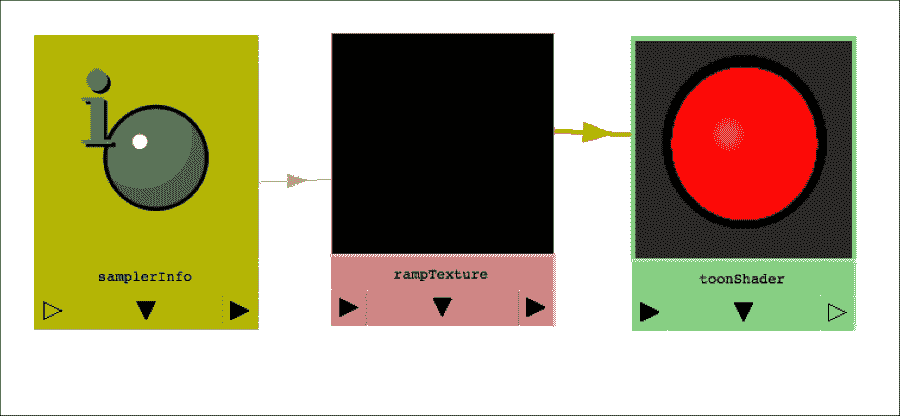

# 第四章. 给事物涂上油漆 – UV 和材质

在本章中，我们将探讨与 UV 布局和着色器创建相关的主题：

+   查询 UV 数据

+   使用 Python 布局 UV

+   使用代码创建着色网络

+   将着色器应用到对象上

+   使用着色节点进行非渲染任务

# 简介

在上一章中，我们探讨了如何使用脚本操作几何体。然而，对于大多数项目来说，创建模型只是第一步。除非你希望一切看起来都像无聊的灰色塑料，否则你需要布局 UV，然后创建并应用着色网络。

在本章中，我们将探讨如何做到这一点。

# 查询 UV 数据

在这个例子中，我们将探讨如何获取多边形对象上的 UV 信息。我们将探讨检查对象包含多少 UV 集，获取对象特定部分的 UV，以及获取给定 UV 点的位置。

我们还将探讨如何将一种选择转换为另一种选择，并使用它来确定给定的边是否可以分割。

## 准备工作

确保你有包含至少一个具有 UV 的多边形对象的场景——无论是你解包的对象还是任何默认具有 UV 的内置基本形状。

## 如何做到这一点...

创建一个新文件，命名为`uvInfo.py`（或类似），并添加以下代码：

```py
import maya.cmds as cmds

def uvInfo():

    sel = cmds.ls(selection=True)
    obj = sel[0]

    uvs = cmds.polyEvaluate(obj, uvComponent=True)
    uvPos = cmds.polyEditUV(obj + '.map[0]', query=True)
        isFirstEdgeSplit = isSplitEdge(obj, 0)

    print('Num UVs: ' + str(uvs))
    print("Position of first UV: ", uvPos)
     print("First edge is split: ", isFirstEdgeSplit))

    cmds.select(obj, replace=True)

def isSplitEdge(obj, index):

    result = cmds.polyListComponentConversion(obj + '.e[' + str(index) + ']', fromEdge=True, toUV=True)
    cmds.select(result, replace=True)
    vertNum = cmds.polyEvaluate(vertexComponent=True)

    result = cmds.polyListComponentConversion(obj + '.e[' + str(index) + ']', fromEdge=True, toVertex=True)
    cmds.select(result, replace=True)
    uvNum = cmds.polyEvaluate(uvComponent=True)

    if (uvNum == vertNum):
        return False

    return True

uvInfo()
```

如果你运行前面的脚本并选择一个多边形对象，你将获得有关对象 UV 的一些信息，特别是：

+   对象有多少 UV。

+   第一个 UV 点的位置（在 UV 空间中）

+   是否第一个边位于两个独立的 UV 壳之间的边界上。

## 它是如何工作的...

我们首先获取当前选定的对象并将其存储到我们的`obj`变量中。一旦我们这样做，我们就使用`polyEvaluate`命令来确定对象拥有的 UV 总数。这与我们在上一章中找到几何组件数量的方法类似，但这次我们使用`uvComponent`/`uvc`标志。

```py
uvs = cmds.polyEvaluate(obj, uvComponent=True)
```

接下来，我们将找到第一个 UV 点的具体位置。UV 可以通过与其它多边形组件相同的方式访问，但使用“map”列表而不是“f”（面）、“e”（边）或“vtx”（顶点）。因此，如果我们想引用名为`myObject`的对象的第一个 UV，我们将使用以下方式：

```py
myObject.map[0]
```

在这里，0 表示列表中的第一个条目，因此是对象的第一 UV。

要找到给定 UV 的特定 U 和 V 坐标，我们可以使用查询模式下的`polyEditUV`命令，如下所示：

```py
uvPos = cmds.polyEditUV(obj + '.map[0]', query=True)
```

接下来是确定给定的边是否在 UV 壳内部，或者它是否位于两个不同壳之间的边界上。为此，我们创建一个函数，该函数接受一个对象名称和要检查的边的索引：

```py
isFirstEdgeSplit = isSplitEdge(obj, 0)
```

我们正在做的关键事情是查看有多少顶点和 UV 与给定的边相对应。如果顶点的数量不等于 UV 的数量，那么这条边必须跨越两个不同的 UV 壳的边界。

为了确定有多少顶点/UV 与给定的边相对应，我们将使用`polyListComponentConversion`命令将边转换为所需的组件类型。为了正确执行，我们需要指定我们正在转换的内容（在这种情况下，是边），以及我们正在转换到什么（顶点或 UV）。我们这样做的方式有点奇怪；而不是指定每种类型的类型，我们必须将两个布尔标志设置为 true，一个用于源类型，一个用于目标类型。

例如，如果我们要将名为`myObject`的对象的第一个边转换为顶点，我们需要做以下操作：

```py
cmds.polyListComponentConversion('myObject.e[0]', fromEdge=True, toVertex=True)
```

添加适当的变量来设置对象的名称和边的索引，我们得到：

```py
result = cmds.polyListComponentConversion(obj + '.e[' + str(index) + ']', fromEdge=True, toVertex=True)
```

注意，我们将命令的输出存储到名为"result"的变量中。这很重要，因为要获得准确的数量，我们需要首先选择我们想要计数的组件。这可以很容易地按照以下方式完成：

```py
cmds.select(result, replace=True)
```

一旦我们这样做，我们就可以使用带有适当标志的`polyEvaluate`命令来给出当前所选组件的数量。对于顶点和 UV，我们希望使用`vertexComponent`和`uvComponent`，分别。在两种情况下，我们将结果存储到另一个变量中，如下所示：

```py
vertNum = cmds.polyEvaluate(vertexComponent=True)
```

在这一点上，我们有了与给定边相对应的顶点数量。然后我们执行相同的操作（但带有略微不同的标志）以确定 UV 的数量：

```py
result = cmds.polyListComponentConversion(obj + '.e[' + str(index) + ']', fromEdge=True, toUV=True)
cmds.select(result, replace=True)
uvNum = cmds.polyEvaluate(uvComponent=True)
```

最后，我们将 UV 的数量与顶点的数量进行比较。如果它们不相同，那么所讨论的边必须存在于多个 UV 壳上，因此它代表了一个边界：

```py
if (uvNum == vertNum):
        return False

    return True
```

在我们的主函数中，我们使用几个打印语句输出我们各种查询的结果：

```py
    print('Num UVs: ' + str(uvs))
    print("Position of first UV: ", uvPos)
    print("First edge is split: ", isFirstEdgeSplit)
```

最后，我们将确保再次选择原始对象，因为我们选择了`isSplitEdge`函数期间的子组件：

```py
cmds.select(obj, replace=True)
```

# 使用 Python 布局 UV

在这个例子中，我们将查看如何使用 Python 实际布局 UV。我们将应用平面、圆柱和球面投影，每个投影到所选对象的不同面集。

## 准备工作

确保你有一个包含多边形对象的场景。我们将对对象的不同部分应用三种不同的映射（通过将总面数除以三来选择），因此最好有一个至少有几十个面的对象。如果你没有现成的模型，制作一个至少有 10 个或更多分度的多边形球体。

## 如何做...

创建一个新的脚本并添加以下代码：

```py
import maya.cmds as cmds

def layoutUVs():

    selected = cmds.ls(selection=True)
    obj = selected[0]

    totalFaces = cmds.polyEvaluate(obj, face=True)

    oneThird = totalFaces/3

    startFace = 0
    endFace = oneThird - 1
    cmds.polyProjection(obj + '.f[' + str(startFace) + ':' + str(endFace) + ']', type="planar")

    startFace = oneThird
    endFace = (oneThird * 2) - 1
    cmds.polyProjection(obj + '.f[' + str(startFace) + ':' + str(endFace) + ']', type="cylindrical")

    startFace = (oneThird * 2)
    endFace = totalFaces - 1
    cmds.polyProjection(obj + '.f[' + str(startFace) + ':' + str(endFace) + ']', type="spherical")

layoutUVs()
```

选择多边形对象后运行此脚本，然后切换到 UV 纹理编辑器面板以查看结果。

## 它是如何工作的...

我们在这里主要做的事情是为对象的面子集应用一个新的 UV 布局。这是一个有些人为的例子，因为我们只是通过将总数分成三份来选择面。

首先，我们获取当前选定的对象，并使用 `polyEvaluate` 确定它有多少个面：

```py
selected = cmds.ls(selection=True)
obj = selected[0]
totalFaces = cmds.polyEvaluate(obj, face=True)
```

然后，我们确定那个数的三分之一是多少。请注意，Python 默认进行整数除法，因为 `totalFaces` 和 3 都是整数。这恰好是我们在这个应用中需要的，但如果你不期望这种情况，很容易出错：

```py
oneThird = totalFaces/3
```

如果你想要确保得到一个正确的十进制值作为结果，只需确保除以一个浮点值即可，如下所示：

```py
oneThirdAsDecimal = totalFaces/3.0
```

我们还创建了几个辅助变量来保存每三组面开始和结束的索引：

```py
startFace = 0
endFace = oneThird - 1
```

我们在这里做的事情并没有什么特别困难的，尽管需要一些注意以确保包括整个面的范围。我们使用的值如下：

|   | 开始索引 | 结束索引 | 示例索引（基于一个 100 面的对象） |
| --- | --- | --- | --- |
| 1st（平面）映射 | 0 | oneThird - 1 | 0-32 |
| 2nd（圆柱）映射 | oneThird | (oneThird * 2) - 1 | 33-65 |
| 3rd（球面）映射 | oneThird * 2 | totalFaces - 1 | 66-99 |

现在我们已经准备好脚本的主体——实际上，应用映射。所有三种映射类型（平面、圆柱和球面）都使用相同的命令 `polyProjection`。

### 小贴士

关于 UV 映射的简要说明——三种映射类型是平面、圆柱和球面，这可能会显得有些奇怪；为什么是这些特定的形状而不是其他形状呢？原因在于，如果你把模型的表面想象成一个二维的皮肤，那么模型的任何一部分都可以被归类为属于以下三个组之一：

+   这个区域没有任何显著的曲率。

+   这个区域在单一方向（水平或垂直）上有显著的曲率。

+   这个区域在两个方向上都有显著的曲率。

这完美地映射到平面（无曲线）、圆柱（单方向曲线）和球面（两个方向的曲率）三种选项。虽然你试图映射的部分可能与完美的平面、圆柱或球面非常不同，但首先问问自己它向多少个方向弯曲，然后相应地选择你的映射。

我们需要向 `polyProjection` 命令提供两样东西才能使其工作——应该接收映射的具体面以及要应用的映射类型。为了指定面的范围，我们将想要索引到对象的 `faces` 或 "f" 数组。我们可以使用两个索引并用冒号分隔来指定多个面。例如，如果我们的对象名为 `mySphere`，并且我们想要引用前六个面，我们可以这样做：

```py
mySphere.f[0:5]
```

在这种情况下，我们希望使用所选对象的名称以及`startFace`和`endFace`变量作为索引。这样做将给出以下结果：

```py
obj + '.f[' + str(startFace) + ':' + str(endFace) + ']'
```

既然我们已经有了指定面范围的方法，我们可以应用映射，使用`type`标志来指定要应用哪种映射：

```py
cmds.polyProjection(obj + '.f[' + str(startFace) + ':' + str(endFace) + ']', type="planar")
```

从这里开始，我们只需要用不同的`startFace`和`endFace`值以及不同的类型标志选项重复这个过程。

## 还有更多...

如果你想要将映射应用于整个对象，你可能认为你只需要对象的名称并省略面索引。这不起作用，但有一个简单的方法可以告诉 Maya 你想要引用所有面。为此，只需省略两个索引，但保留冒号，如下所示：

```py
myObject.f[:]
```

如果缺少起始索引，Maya 将用 0 替换，如果缺少结束索引，Maya 将用最大索引替换。如果两个都省略，则映射将应用于整个对象。

到目前为止，我们只看了选择连续的面序列，但有很多情况下你可能想要选择非连续索引的面。你可以通过将多个选择用逗号分隔作为函数的第一个参数（或多个参数）来实现这一点。

例如，假设我们想要选择`myObject`的前 5 个面以及 32 到 76 的面。我们可以使用以下命令：

```py
cmds.select('myObject.f[0:4]', 'myObject.f[32:76]', replace=True)
```

将此应用于 UV 映射将给出以下类似的结果：

```py
cmds.polyProjection('myObject.f[0:4]', 'myObject.f[32:76]', type="planar")
```

当处理面范围时，在运行时确定特定索引是非常常见的，无论是通过某种计算还是基于用户输入。这很容易做到，但可能导致过于复杂的字符串字面量和变量的序列，如下所示：

```py
obj + '.f[' + str(startFace) + ':' + str(endFace) + ']'
```

很容易忘记使用`str()`命令将数值转换为字符串，这可能导致错误。幸运的是，Python 提供了一个以`format`命令的形式处理从变量构建格式化字符串的替代方法。

要使用格式命令，你创建一个包含你想要用变量替换的部分的字符串。每个可替换的部分都用包含数字的括号表示，例如`{0}`。然后你可以调用该字符串上的格式命令，并传入将替换`{}`子句的变量。数字用于指定哪些变量应该放在哪里（例如，`{0}`表示“用第一个变量替换”）。

因此，作为一个非常简单的例子，我们可以用以下方式祝人生日快乐：

```py
personAge = 21
personName = "Alice"
"Congratulations on turning {0}, {1}!".format(personAge, personName)
# results in "Congratulations on turning 21, Alice!"
```

回到 Maya，假设我们想要有一个选择面范围的一般方法。我们希望传入对象的名称、起始索引和结束索引作为变量。我们可以这样做：

```py
cmds.select(myObject + '.f[' + str(startFace) + ':' + str(endFace) + ']', replace=True)
```

这将正常工作，但有点难以阅读，并且是引入错误的一种简单方法。如果我们使用格式命令重写它，我们会得到如下所示的内容：

```py
cmds.select("{0}.f[{1}:{2}]".format(myObj, startFace, endFace), replace=True)
```

这通常更容易思考，因为它允许你将结构（字符串）与应该填充到其中的变量分开。你当然不必使用格式，但鉴于 Maya 脚本经常需要以这种方式从变量中构建字符串，使用它可能会节省你很多麻烦。它还使你的代码更容易阅读。

## 参见

格式命令的官方 Python 文档有点难以理解，并且以过于晦涩的方式呈现信息。相反，我强烈建议您查看[`pyformat.info/`](https://pyformat.info/)，那里有对格式命令复杂性的详细且易于阅读的解释。

# 使用代码创建着色网络

在这个例子中，我们将探讨如何使用代码创建着色网络。我们将创建一个简单的卡通着色器，内部为纯色，而物体的边缘为不同的颜色。有几种不同的方法可以做到这一点，包括创建渐变着色器，但我们将以相对老式的方式使用`samplerInfo`节点，因为它提供了一个相对简单但相对新颖的着色网络的绝佳示例。

首先，让我们看看我们的着色器将做什么以及它是如何做到的。卡通着色器的关键特性是物体边缘有一个轮廓，随着物体的移动而改变。因此，我们首先需要知道模型的一部分与相机之间的角度。幸运的是，Maya 提供了一个名为`samplerInfo`的实用节点，它正好可以做到这一点。`SamplerInfo`节点为我们提供了一个`facingRatio`属性，其范围从 0（当表面垂直于相机时）到 1（当表面直接面向相机时）。

一旦我们得到了面对比，就需要以某种方式将其与颜色变化联系起来。最简单且最灵活的方法是使用具有线性插值的渐变纹理，以在边框颜色和内部颜色之间提供清晰的截止。

将所有这些组合起来，我们得到了一个相对简单的、由三个节点组成的着色网络，类似于以下内容：



## 如何操作...

创建一个新的脚本并添加以下代码：

```py
import maya.cmds as cmds

def createNodes():

    shaderNode = cmds.shadingNode('blinn', asShader=True)
    rampTexture = cmds.shadingNode('ramp', asTexture=True)
    samplerNode = cmds.shadingNode('samplerInfo', asUtility=True)

    cmds.setAttr(rampTexture + '.interpolation', 0)
    cmds.setAttr(rampTexture + '.colorEntryList[0].position', 0)
    cmds.setAttr(rampTexture + '.colorEntryList[1].position', 0.45)
cmds.setAttr(rampTexture + '.colorEntryList[0].color', 0, 0, 0, type="float3")
    cmds.setAttr(rampTexture + '.colorEntryList[1].color', 1, 0, 0, type="float3")

    cmds.connectAttr(samplerNode + '.facingRatio', rampTexture + '.vCoord')
    cmds.connectAttr(rampTexture + '.outColor', shaderNode + '.color')

createNodes()
```

如果你运行脚本，你应该在 hypershade 中看到一个新着色器出现，内部为红色，外部边缘为黑色。

## 它是如何工作的...

脚本分为三个部分——创建节点、设置它们的属性以及将它们相互连接。

首先，我们使用`shadingNode`命令创建所需的三个节点：

```py
shaderNode = cmds.shadingNode('blinn', asShader=True)
rampTexture = cmds.shadingNode('ramp', asTexture=True)
samplerNode = cmds.shadingNode('samplerInfo', asUtility=True)
```

首先要注意的是，尽管我们创建了三个不同类型的节点（一个着色器、一个纹理和一个工具），但仍然使用`shadingNode`命令。在所有情况下，通过指定你想要创建的特定类型的节点（例如`'blinn'`）以及包括以下标志之一设置为 True：`asShader`、`asTexture`、`asUtility`、`asPosProcess`、`asRendering`、`asLight`，你都可以得到你想要的结果。

如果省略这些标志，将会导致错误。如果你包含了错误的标志（例如在创建 Blinn 着色器时`asTexture=True`），命令仍然会工作，但我不建议这样做。

创建节点相当直接——只需确保你也将输出保存到一个变量中（就像我们在这里所做的那样），这样你就可以稍后设置它们的属性并将它们连接起来。

一旦我们创建了所有节点，我们需要设置它们的属性。在这种情况下，我们需要对渐变纹理执行以下几项不同的操作：

+   确保颜色插值设置为线性，以便在颜色之间提供清晰的过渡，而不是平滑的渐变。

+   确保颜色样本在渐变的长度上正确定位。

+   将两种颜色都设置为边缘颜色和我们想要的内部颜色。

对于上述所有内容，我们将使用`setAttr`命令。`setAttr`命令期望第一个参数是要设置的属性的名称，后面跟着应该设置的值。对于单个数值，这相当直接。例如，以下将渐变的插值设置为无：

```py
cmds.setAttr(rampTexture + '.interpolation', 0)
```

虽然插值的类型实际上不是一个数值，但在 Maya（和其他地方）中，使用整数来表示各种选项是一种常见的做法。当设置在界面中以下拉菜单表示的属性值时，你通常会想要使用一个整数，其具体值对应于列表中选项的位置（其中 0 是第一个）。

接下来，我们需要设置渐变纹理的颜色，使其具有正确的位置和颜色。首先需要理解的是，渐变纹理维护一个节点数组，这些节点包含在其`colorEntryList`属性中。该列表中的每个条目代表渐变纹理中的一个停止点，并具有位置和颜色。

我们需要确保第一个条目位于渐变的非常开始处，第二个条目位于中间略低的位置，因为它为我们提供了着色器的好默认边缘厚度。我们使用`setAttr`来设置`colorEntryList`数组中前两个条目的位置，如下所示：

```py
cmds.setAttr(rampTexture + '.colorEntryList[0].position', 0)
cmds.setAttr(rampTexture + '.colorEntryList[1].position', 0.45)
```

接下来，我们将想要设置颜色。这有点不同，因为我们需要将三个单独的值输入到 `setAttr` 命令中（每个分别用于红色、绿色和蓝色）。为此，我们需要提供所有三个数字，并且我们还需要告诉 Maya 通过使用 `type` 标志来期望 `setAttr` 命令有多个输入。

`setAttr` 命令是 Maya 提供的最强大和最灵活的命令之一。它可以用来改变任何节点的任何值。所有这些功能都需要命令能够接受各种类型的输入，所有这些输入都通过类型标志指定。在这种情况下，我们需要一个支持十进制值的格式（因为颜色是以从 0 到 1 的数字表示的），并且支持三个单独的值。`float3` 或 `double3` 都可以工作。将这些全部组合起来，我们得到以下内容：

```py
cmds.setAttr(rampTexture + '.colorEntryList[0].color', 0, 0, 0, type="float3")
cmds.setAttr(rampTexture + '.colorEntryList[1].color', 1, 0, 0, type="float3")
```

到目前为止，我们已经设置了着色器所需的全部属性值。剩下要做的就是将节点连接起来。我们使用 `connectAttr` 命令来完成这个操作。这相当直接，只需要我们首先指定源属性，然后指定目标。

在这种情况下，我们想要建立两个连接：

+   样本信息中的 `facingRatio` 属性与漫射的 V 坐标

+   漫射纹理的 `outColor` 与着色器的颜色

做这件事的结果看起来像：

```py
cmds.connectAttr(samplerNode + '.facingRatio', rampTexture + '.vCoord')
cmds.connectAttr(rampTexture + '.outColor', shaderNode + '.color')
```

## 还有更多...

创建节点并将它们的属性连接起来是处理 Maya 中各种任务的好方法，但有时可能会很繁琐。例如，如果我们想要创建一个 `place2dTexture` 工具节点并将其连接到纹理节点，我们可能需要做出十多个连接，这至少是繁琐的。幸运的是，Maya 提供了一个简单的快捷方式来创建具有默认行为的节点，即 `defaultNavigation` 命令。

这看起来会是这样：

```py
fileTex = cmds.shadingNode('file', asTexture=True)
placeTex = cmds.shadingNode('place2dTexture', asUtility=True)
cmds.defaultNavigation(connectToExisting=True, source=placeTex, destination=fileTex)
```

注意包含 `connectToExisting=True` 以指示要连接的节点已经在场景中存在。这确实比 18 个单独的 `connectAttr` 调用要优雅得多。

你也可以使用 Python 的 `disconnectAttr` 命令断开节点之间的连接。例如，如果我们想要之前提到的由 place2dTexture 和文件纹理组成的两个节点网络共享除偏移属性之外的所有内容，我们可以这样做：

```py
cmds.disconnectAttr(placeTex + '.offset', fileTex + '.offset')
```

有时，使用默认连接（带有 defaultNavigation）连接两个节点可能会更快，而不是手动创建所有你想要的连接，同时断开一些你不想保留的特定连接。

## 参见

一定要参考 `setAttr` 命令的内置文档，以获取它可以接受的输入类型的完整列表。文档有点密集，但绝对值得一看。

# 将着色器应用到对象上

一旦创建了一个着色网络，你通常会想要将其应用到一个或多个对象上。在这个例子中，我们将探讨如何实现这一点。在这个过程中，我们将创建一个脚本，可以用来将着色器应用到场景中所有没有着色器的对象上。

## 准备工作

确保你有一个包含几个不同对象的场景。选择几个对象，并使用 hypershade 的界面以正常方式将着色器应用到它们上。删除着色器，至少留下一个没有任何类型着色器的对象。

## 如何实现...

创建一个新的脚本并添加以下代码：

```py
import maya.cmds as cmds

def shadersFromObject(obj):
    cmds.select(obj, replace=True)
    cmds.hyperShade(obj, shaderNetworksSelectMaterialNodes=True)
    shaders = cmds.ls(selection=True)
    return shaders

def isGeometry(obj):
    shapes = cmds.listRelatives(obj, shapes=True)

    shapeType = cmds.nodeType(shapes[0])
    geometryTypes = ['mesh', 'nurbsSurface', 'subdiv']

    if shapeType in geometryTypes:
        return True

    return False

def findUnattachedObjects():

    objects = cmds.ls(type="transform")

    unShaded = []

    for i in range(0, len(objects)):
        if (isGeometry(objects[i])):
            shaders = shadersFromObject(objects[i])
            if (len(shaders) < 1):
                unShaded.append(objects[i])

    newShader = cmds.shadingNode('blinn', asShader=True)
    cmds.setAttr(newShader + '.color', 0, 1, 1, type="double3")

    cmds.select(unShaded, replace=True)
    cmds.hyperShade(assign=newShader)

findUnattachedObjects()
```

运行脚本，你应该会看到任何之前没有着色器的对象都添加了一个全新的、青色的 blinn 着色器。

## 它是如何工作的...

脚本通过以下方式工作：

+   获取场景中所有对象的列表。

+   遍历列表并检查给定的节点是否为几何形状。

+   对于任何几何节点，找到应用在其上的着色器。

+   如果给定的对象没有着色器，将其添加到非着色器对象列表中。

+   创建一个新的着色器以应用。

+   将着色器应用到没有着色器的对象上。

此脚本利用`hyperShade`命令的几种不同方式——用于查找附加到对象上的着色器、附加到着色器上的对象，以及应用着色器。

首先，让我们看看如何获取给定对象的着色器。为了简化后续操作，我们将创建一个函数来完成这个任务。我们有以下代码：

```py
def shadersFromObject(obj):
    cmds.select(obj, replace=True)
    cmds.hyperShade(shaderNetworksSelectMaterialNodes=True)
    shaders = cmds.ls(selection=True)
    return shaders
```

我们主要使用的是带有`shaderNetworksSelectMaterialNodes`（或简称`smn`）标志设置为 true 的 hyperShade 命令。这将选择当前选中对象的着色器（或着色器）。因为该命令在选区上工作，我们必须确保在我们运行它之前，我们想要了解的对象（或对象）已被选中。一旦我们运行了它，我们需要检查当前选中的节点以获取着色器的列表。

接下来，我们创建一个函数，以便轻松判断给定的变换节点是否对应实际几何形状。我们需要它，因为我们将要遍历场景中的所有变换，而且有许多事物（灯光、相机等等）具有变换但不是几何形状。我们将节点的名称作为输入，并找到相应的形状节点：

```py
def isGeometry(obj):
    shapes = cmds.listRelatives(obj, shapes=True)
```

然后，我们检查形状节点以确定它是什么类型的对象：

```py
    shapeType = cmds.nodeType(shapes[0])
```

注意，`listRelatives`命令返回一个数组，因此我们需要索引到那里并获取第一个元素。一个对象不太可能有多个形状节点，但`listRelatives`也可以用来查找对象的孩子，这些孩子通常会是多个节点。由于有时会导致多个节点，因此即使只有一个项目，该命令也总是返回一个数组。

Maya 中的三种几何类型（多边形、NURBS 和细分曲面）各自对应一个形状节点。为了方便和代码可读性，我们将创建一个包含这些类型的数组，并检查当前形状节点的类型是否与之匹配：

```py
geometryTypes = ['mesh', 'nurbsSurface', 'subdiv']

if shapeType in geometryTypes:
    return True
```

到目前为止，我们已经准备好跳入脚本的真正核心部分。我们首先使用`ls`命令获取场景中所有变换的列表。到目前为止，我们主要使用它来找到当前选定的内容，但它也可以用来获取特定类型（无论是否选中）的所有节点：

```py
objects = cmds.ls(type="transform")
```

然后，我们创建一个空列表，我们将把任何我们发现缺少着色器的对象添加到这个列表中，并开始遍历这个变换列表。首先，我们检查以确保所讨论的节点是某种几何形状。如果是这样，我们使用我们的`shadersFromObject`函数来找到应用于该对象的着色器。一旦我们完成这个操作，我们就检查返回列表的长度——如果它是零，那么该对象没有着色器，我们就将其添加到我们的列表中：

```py
unShaded = []

for i in range(0, len(objects)):
    if (isGeometry(objects[i])):
        shaders = shadersFromObject(objects[i])
        if (len(shaders) < 1):
            unShaded.append(objects[i])
```

到目前为止，`unShaded`列表包含了场景中所有缺少着色器的对象。我们创建一个新的着色器，一个简单的 Blinn，并将其颜色设置为青色：

```py
newShader = cmds.shadingNode('blinn', asShader=True)
cmds.setAttr(newShader + '.color', 0, 1, 1, type="double3")
```

最后，我们选择`unShaded`列表的内容，并应用我们刚刚创建的着色器。为此，我们将再次使用`hyperShade`命令，但这次使用分配标志将指定的着色器应用到当前选定的对象上。我们有以下代码：

```py
cmds.select(unShaded, replace=True)
cmds.hyperShade(assign=newShader)
```

## 还有更多...

`hyperShade`命令可以用来完成在 hypershade 面板界面中通常可以完成的许多任务。在上一个例子中，我们从对象中获取了着色器，但该命令也可以使用`objects`标志来找到与给定着色器关联的对象。将这个功能封装在一个漂亮的函数中，以返回给定着色器的对象，看起来可能如下所示：

```py
def objectsFromShader(shader):
    cmds.hyperShade(objects=shader)
    objects = cmds.ls(selection=True)
    return objects
```

再次，`hyperShade`改变了当前的选择，我们使用`ls`命令来检索选择作为一个数组。

# 使用着色节点进行非着色任务

Maya 提供的各种节点中真正出色的一点是，在使用它们时几乎没有限制。对 Maya 来说，所有节点只是具有某些输入和输出的功能集合，只要数据类型匹配，它实际上并不关心你如何连接它们。

这意味着，完全有可能（并且通常非常有用）使用 hypershade 节点来完成与创建着色网络无关的任务。在这个例子中，我们将使用加减平均实用节点来设置给定对象的位置为多个其他对象的平均位置。例如，这可以用来确保角色的骨盆始终保持在控制其脚的 IK 手柄之间。

使用工具节点可以用于你可能需要编写表达式的任务，但它们的好处是它们会不断更新，而不仅仅是当播放头移动时。

## 准备工作

确保你的场景中至少有三个对象。

## 如何操作...

创建一个新的脚本并添加以下代码：

```py
import maya.cmds as cmds

def keepCentered():

    objects = cmds.ls(selection=True)

    if (len(objects) < 3):
        cmds.error('Please select at least three objects')

    avgNode = cmds.shadingNode('plusMinusAverage', asUtility=True)
    cmds.setAttr(avgNode + '.operation', 3)

    for i in range(0, len(objects) - 1):
        cmds.connectAttr(objects[i] + '.translateX', avgNode + '.input3D[{0}].input3Dx'.format(i))
        cmds.connectAttr(objects[i] + '.translateZ', avgNode + '.input3D[{0}].input3Dz'.format(i))

    controlledObjIndex = len(objects) - 1

    cmds.connectAttr(avgNode + '.output3D.output3Dx', objects[controlledObjIndex] + '.translateX')
    cmds.connectAttr(avgNode + '.output3D.output3Dz', objects[controlledObjIndex] + '.translateZ')

keepCentered()
```

选择至少三个对象，确保你想要控制的对象是最后一个选中的，然后运行脚本。一旦你这样做，尝试移动对象，你会发现控制对象的 X 和 Z 位置总是所有其他对象的 X 和 Z 位置的平均值。

## 它是如何工作的...

首先，我们检查确保至少有三个对象被选中，如果没有则报错：

```py
objects = cmds.ls(selection=True)

    if (len(objects) < 3):
        cmds.error('Please select at least three objects')
```

如果我们有至少三个对象，我们就继续创建一个新的工具节点，在这种情况下是一个加减平均节点。由于加减平均节点可以执行三个完全不同的操作，我们还需要将其“操作”属性设置为平均（这恰好是相应下拉菜单中的第四个选项，因此其值为 3），如下所示：

```py
    avgNode = cmds.shadingNode('plusMinusAverage', asUtility=True)
    cmds.setAttr(avgNode + '.operation', 3)
```

一旦我们这样做，我们就遍历所选对象的列表，并将除了最后一个之外的所有对象连接到工具节点作为输入。加减平均节点可以有一维、二维或三维输入。在这种情况下，我们将使用三维输入。

### 小贴士

我们只使用两个输入（X 和 Z），所以我们当然可以用二维输入来应付。然而，由于我们处理的是位置数据，我认为使用完整的 3D 输入并留空 Y 输入更好。这样，以后修改脚本以允许用户选择他们想要的任何 X、Y 和 Z 的组合会更容易。

当然，加减平均节点的“X”、“Y”和“Z”没有任何内在含义；它们只是计算的三条独立路径，我们当然可以用它们来做与位置无关的事情。

加减平均节点为每种类型的输入（一维、二维和三维）保留一个数组。因此，要使用它，我们首先需要访问正确的数组。如果我们有一个名为`avgNode`的加减平均节点并想对第二个一维输入进行操作，我们将使用以下方法：

```py
avgNode.input1D[1]
```

对于二维和三维输入，我们需要指定不仅正确的数组，还要指定正确的条目。对于二维输入，数组指定如下：

```py
avgNode.input2D[0].input2Dy
```

对于三维输入，数组指定如下：

```py
avgNode.input3D[0].input3Dx
```

我们不需要明确地将输入添加到工具节点中；我们可以直接使用 connectAttr 将输入连接到节点的输入 3D 数组的连续索引。

在这种情况下，我们想要遍历所有选定的对象（除了最后一个），并将它们的 X 和 Z 位置连接起来，这很容易做到：

```py
for i in range(0, len(objects) - 1):
    cmds.connectAttr(objects[i] + '.translateX', avgNode + '.input3D[{0}].input3Dx'.format(i))
    cmds.connectAttr(objects[i] + '.translateZ', avgNode + '.input3D[{0}].input3Dz'.format(i))
```

到那时，我们基本上就完成了。剩下要做的就是将 plusMinusAverage 节点的输出连接到受控对象上。将受控对象的索引存储为变量不是必要的，但这会使代码更易于阅读：

```py
controlledObjIndex = len(objects) - 1

cmds.connectAttr(avgNode + '.output3D.output3Dx', objects[controlledObjIndex] + '.translateX')
cmds.connectAttr(avgNode + '.output3D.output3Dz', objects[controlledObjIndex] + '.translateZ')
```

## 还有更多...

在讨论的例子中，我们创建了一个非常简单的网络，但当然可以创建更复杂的网络。需要记住的一个重要事情是，尽管所有节点都有它们被创建时的特定用途，但这绝不限制它们可以被用于何种类型的用途。对玛雅来说，数字只是数字，没有任何东西阻止你使用颜色通道来控制位置或使用旋转来控制透明度。
