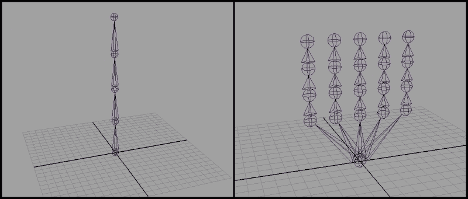
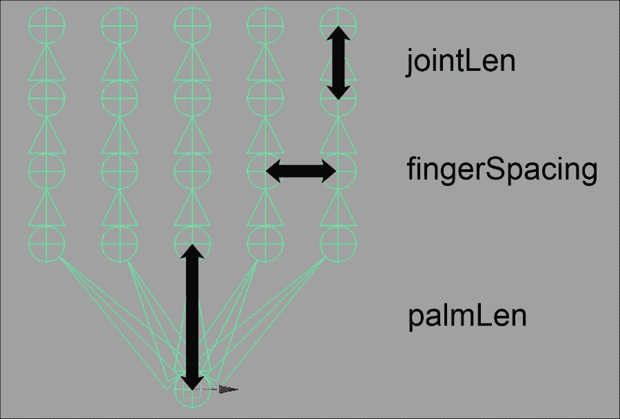
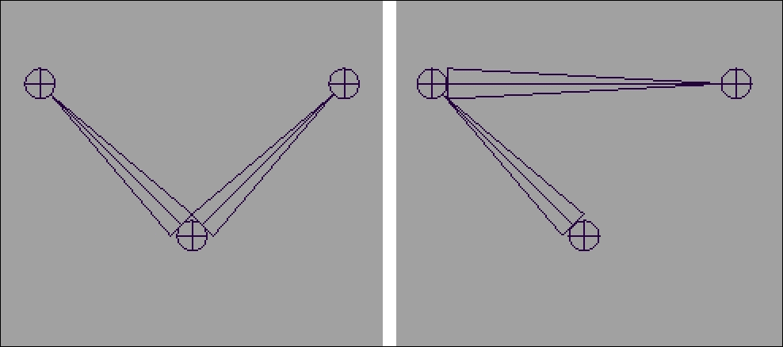
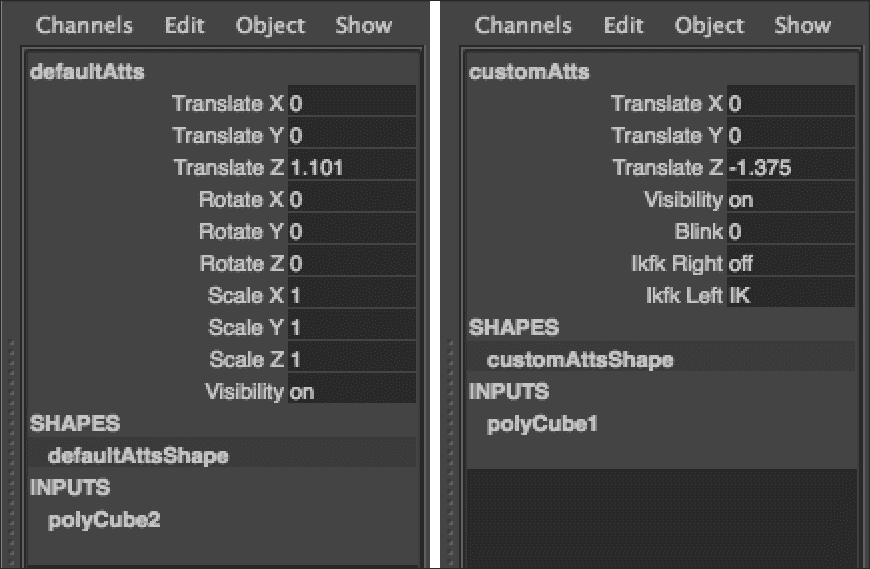
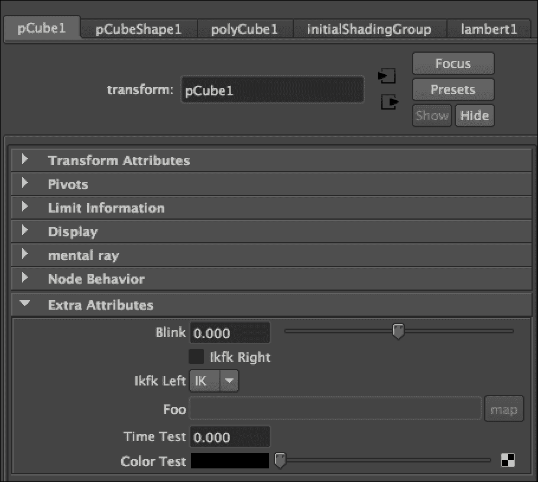
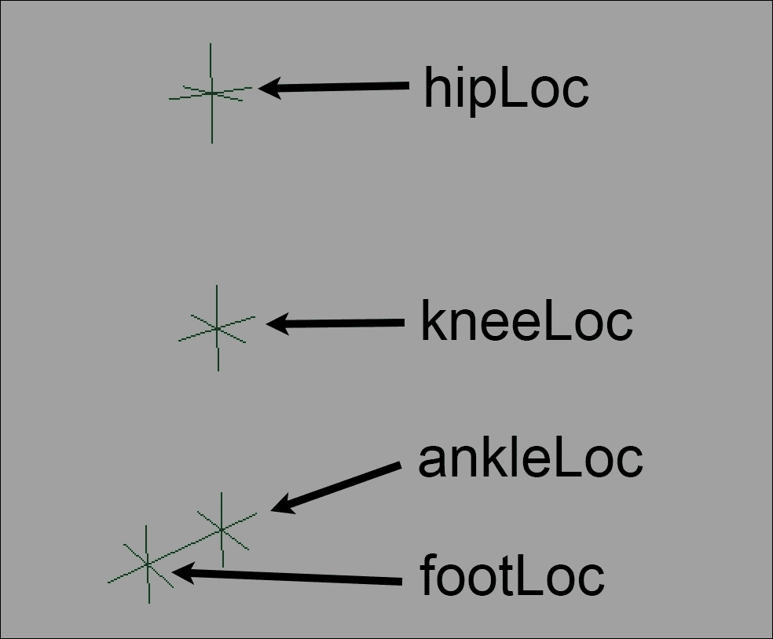

# 第五章。添加控件 – 骨架脚本化

本章将介绍如何使用 Python 通过以下方式构建骨架：

+   使用脚本创建骨骼

+   使用脚本设置驱动关键帧关系

+   添加自定义属性以及锁定和隐藏属性

+   使用脚本设置反向运动学（IK）

# 简介

一旦你创建了你的模型，布局了 UV，并设置了着色网络，如果你想让它移动，你仍然需要将其中的控件构建进去。在本章中，我们将探讨如何使用脚本来实现这一点。

我们将探讨如何使用 Python 来自动化与骨架相关的任务。骨架已经是 3D 动画中较为技术性的方面之一，因此非常适合基于脚本的解决方案。

# 使用脚本创建骨骼

在这个例子中，我们将探讨如何使用脚本创建骨骼。我们将创建两个示例，一个是简单的骨骼链，另一个是分支集合，类似于你可能想要用于生物的手。

## 如何做到这一点...

创建一个新文件并添加以下代码：

```py
def createSimpleSkeleton(joints):
    '''
    Creates a simple skeleton as a single chain of bones
    ARGS:
        joints- the number of bones to create
    '''

    cmds.select(clear=True)

    bones = []
    pos = [0, 0, 0]

    for i in range(0, joints):
        pos[1] = i * 5
        bones.append(cmds.joint(p=pos))

    cmds.select(bones[0], replace=True)

def createHand(fingers, joints):
    '''
    Creates a set of 'fingers', each with a set number of joints
    ARGS:
        fingers- the number of joint chains to create
        joints- the number of bones per finger
    '''

    cmds.select(clear=True)

    baseJoint = cmds.joint(name='wrist', p=(0,0,0))

    fingerSpacing = 2
    palmLen = 4
    jointLen = 2

    for i in range(0, fingers):
        cmds.select(baseJoint, replace=True)
        pos = [0, palmLen, 0]

        pos[0] = (i * fingerSpacing) - ((fingers-1) * fingerSpacing)/2

        cmds.joint(name='finger{0}base'.format(i+1), p=pos)

        for j in range(0, joints):
            cmds.joint(name='finger{0}joint{1}'.format((i+1),(j+1)), relative=True, p=(0,jointLen, 0))

    cmds.select(baseJoint, replace=True)

createSimpleSkeleton(5)
createHand(5, 3)
```

运行此代码，你将看到两个独立的骨骼网络，它们都位于原点中心——一个是五根骨骼的垂直链，另一个近似于手（五个手指，每个手指有三个关节）。

最终结果应该看起来像以下这样（在将两个骨骼分开后显示）。



## 它是如何工作的...

我们将从`createSimpleSkeleton`命令开始。注意，我们在函数开始处使用了一个三引号注释：

```py
def createSimpleSkeleton(joints):
    '''
    Creates a simple skeleton as a single chain of bones
    ARGS:
        joints- the number of bones to create
    '''
```

通过在函数定义中作为第一件事放置注释，Python 会将其识别为*文档字符串*。

文档字符串是向最终用户提供有关代码做什么以及如何使用的文档的绝佳方式。如果你已经为你的函数添加了文档字符串，用户将能够使用 help 命令查看它们。例如，假设我们有一个名为`myFunctions.py`的文件，其中包含一些函数，我们以下述方式启动第一个函数：

```py
def functionOne():
    """Description of function one"""
```

用户可以使用以下命令来查看`functionOne`函数的描述：

```py
help(myFunctions.functionOne)
```

注意使用点语法来指定首先模块（Python 将所有文件视为模块），然后是其中的特定函数。还要注意函数名称后面没有括号；这是因为我们并没有调用函数。相反，我们正在将函数传递给 help 命令，这将导致 Python 输出该函数的文档字符串（如果存在）。

文档字符串也可以用来为类和模块提供文档。在两种情况下，确保文档字符串是类、函数或文件中首先出现的内容，无论是直接在“def [functionName]”之后，就像我们在这里所做的那样，还是在“class [className]：”之后（对于类），或者是在文件顶部（对于模块）。

在添加文档字符串时，通常一个好的做法是描述函数的每个输入以及它们的意义。在这种情况下，我们的函数有一个单一输入，它将指定要创建的骨骼数量。

现在我们已经正确地记录了我们的代码，是时候实际创建一些骨骼了。大部分工作是通过使用关节工具来创建一个新的骨骼来完成的，使用位置/p 标志来指定它应该去哪里，如下所示：

```py
cmds.joint(position=(1, 1, 1))
```

在我们的第一个例子中，我们通过创建一个数组来存储骨骼的位置，并将它传递给每个后续的关节命令调用，使事情变得稍微简单一些。这样，我们可以轻松地只修改我们创建的关节的 Y 位置，同时保持 X 和 Z 坐标不变，以产生一个垂直的骨骼链：

```py
    pos = [0, 0, 0]
```

我们还创建了一个数组来存储在创建每个骨骼之后联合命令的输出，以便我们可以在骨骼创建后对它们执行进一步的操作：

```py
    bones = []
```

一旦我们有了这两者，我们只需通过一个循环，改变我们位置数组中的第二个元素来改变 Y 值，并创建一个新的关节：

```py
    for i in range(0, joints):
        pos[1] = i * 5
        bones.append(cmds.joint(p=pos))
```

这中最值得注意的是我们*没有*做什么。请注意，这段代码仅仅创建了骨骼；它没有明确创建任何它们之间的层次结构。尽管如此，前面的代码将导致一个正确的骨骼链，每个都是前一个骨骼的子对象。

这是因为，在创建骨骼时，Maya 会自动将任何新创建的关节作为当前选中对象的子对象，如果那个对象恰好是一个关节。结合 Maya 的所有命令在创建新对象时都会选中那个新对象的事实，这意味着，当我们构建关节链时，Maya 会自动将它们连接到正确的层次结构中。这也解释了为什么函数的第一行是：

```py
cmds.select(clear=True)
```

这确保了没有任何东西被选中。在创建新的关节网络时，在开始之前确保你的选择是清晰的总是好的；否则，你可能会得到你不想有的连接。

现在我们已经查看了一个简单的骨骼链的创建，我们将继续到`createHand`函数中一个稍微复杂一点的例子。我们再次在函数的开始处添加一个文档字符串，以正确记录函数的输入和每个效果：

```py
def createHand(fingers, joints):
    '''
    Creates a set of 'fingers', each with a set number of joints
    ARGS:
        fingers- the number of joint chains to create
        joints- the number of bones per finger
    '''
```

我们首先创建一个单一的关节作为根骨骼，并将其保存在`baseJoint`变量中，这样我们就可以稍后轻松地引用它。

```py
baseJoint = cmds.joint(name='wrist', p=(0,0,0))
```

我们还会确保给我们的新骨骼一个合理的名称。在这种情况下，我们将使用“wrist”，因为它将作为所有手指的父骨骼。你可能想知道为什么我们既要设置名称又要将结果存储到变量中。这是必要的，以避免如果场景中已经存在名为“wrist”的东西时出现问题。如果确实存在名为“wrist”的东西，Maya 会在新创建的骨骼名称上附加一个数字，结果可能像“wrist1”。如果我们后来试图对“wrist”做些什么，我们最终会影响到不同的对象。所以，我们必须做两件事；我们将关节命令的输出存储到变量中，以便以后可以引用，并且给它一个名称，这样更容易处理。

在你的绑定中所有骨骼都命名为“jointX”是使事情变得不必要混乱的好方法，所以总是确保给你的骨骼合适的名称；只是不要相信那些名称总是唯一的。

现在我们有了基础骨骼，我们创建了一些变量来控制“手”的布局——一个用于手掌的长度，一个用于每个手指关节的长度，一个用于每个手指之间的间隙。



现在我们准备创建每个手指。我们每次通过循环的第一步是首先选择 baseJoint 骨骼。这就是我们确保拥有正确层次结构所需做的全部工作，每个手指都有一个独立的链，每个链都是 base joint 的父链。

我们每个手指都从比基础关节高 palmLen 单位的关节开始。水平间距稍微复杂一些，需要一些解释。我们有以下代码：

```py
pos[0] = (i * fingerSpacing) - ((fingers-1) * fingerSpacing)/2
```

上述代码分为两部分：

```py
(i * fingerSpacing)
```

这将确保手指以正确的数量水平分布，但如果我们就这样留下，所有手指都会在手腕的右侧。为了解决这个问题，我们需要将所有位置向左移动半个总宽度。总宽度等于我们的 fingerSpacing 变量乘以手指之间的间隙数。由于间隙的数量等于手指的数量减一，所以我们有：

```py
((fingers-1) * fingerSpacing)/2
```

从第一部分减去第二部分将保持手指间的间距不变，但会将所有东西移动，使得手指都集中在基础关节上方。

现在我们已经确定了“手指”基础的位置，我们按照以下方式创建第一个关节：

```py
cmds.joint(name='finger{0}base'.format(i+1), p=pos)
```

注意，我们使用字符串格式命令从一些字面量和当前手指的编号（加一，以便第一个手指是更易读的“1”而不是“0”）构建关节的名称。这将给出类似“finger1base”、“finger2base”等名称的关节。我们会对后续的关节做类似处理，用手指的名称和关节的名称来命名它们（例如，“finger1joint1”）。

一旦开始绘制手指，我们就会运行另一个循环来创建每个手指关节：

```py
        for j in range(0, joints):
            cmds.joint(name='finger{0}joint{1}'.format((i+1),(j+1)), relative=True, p=(0,jointLen, 0))
```

注意，这里有一个小的不同，因为我们把看起来相同的位置传递给关节命令。这仍然有效，因为我们还使用了`relative`命令，这会导致 Maya 将新骨骼相对于其直接父级定位。在这种情况下，这意味着每个新骨骼都将创建在之前的骨骼上方`jointLen`个单位。

## 还有更多...

为了创建分支骨骼，在创建子骨骼之前必须更改当前选中的骨骼。在前面的例子中，我们直接这样做，通过在开始每个新分支之前再次显式选择我们的基础关节。

这不是唯一的方法，你还可以使用`pickWalk`命令。`pickWalk`命令作用于当前选择，并允许你在其层次结构中移动。要使用该命令，你必须指定一个方向——向上、向下、向左或向右。最有用的选项是向上，这将更改选择以成为当前选中节点的父节点，以及向下，这将更改选择为当前选中节点的子节点（假设它有子节点）。因此，创建关节分支网络的另一个选项是

导入 maya.cmds 作为 cmds，如下所示：

```py
cmds.joint(p=(0,0,0))
cmds.joint(p=(-5, 5, 0))
cmds.pickWalk(direction="Up")
cmds.joint(p=(5, 5, 0))
```

前两行创建一个基础骨骼，并在上方和左侧各一个单位的位置添加一个子骨骼。然后，使用`pickWalk`命令将选择移动回基础关节，在创建第三个骨骼之前。

创建三个骨骼的连续结果。左图表示在创建第二个骨骼后使用 pickWalk 向上移动层次结构会发生什么，右图表示省略 pickWalk 会发生什么。



# 使用脚本设置驱动键关系

大量的绑定工作不过是设置属性之间的连接。有时，这些连接可能非常直接，例如确保两个关节在世界空间中始终处于完全相同的位置，但在其他时候，可能需要除了直接的一对一映射之外的其他映射。

有几种不同的方式可以将属性以非线性方式连接起来，包括使用 Maya 的驱动键功能将一个属性的任意范围映射到另一个属性的另一个任意范围。在本例中，我们将探讨如何通过脚本设置它。

我们的例子将设置使用驱动键的“Hello World”等效，一个手指的所有关节同时平滑弯曲，允许动画师为每个手指键帧一个属性，而不是三个（或甚至更多）。

## 准备工作

对于这个例子，你希望有一个至少由三个骨骼组成的简单链。脚本的输出将导致当父骨骼（指关节）旋转时，所选骨骼下游的所有骨骼都会旋转。你可以创建一个简单的骨骼链，或者使用本章示例中创建骨骼的输出。

## 如何操作...

创建一个新的脚本并输入以下代码：

```py
import maya.cmds as cmds

def setDrivenKeys():
    objs = cmds.ls(selection=True)
    baseJoint = objs[0]

    driver = baseJoint + ".rotateZ"

    children = cmds. listRelatives(children=True, allDescendents=True)

    for bone in children:
        driven = bone + ".rotateZ"

        cmds.setAttr(driver, 0)
        cmds.setDrivenKeyframe(driven, cd=driver, value=0, driverValue=0)

        cmds.setAttr(driver, 30)
        cmds.setDrivenKeyframe(driven, cd=driver, value=30, driverValue=30)

    cmds.setAttr(driver, 0)

setDrivenKeys()
```

一旦脚本准备就绪，选择“指关节”骨骼并运行它。然后，尝试围绕 *z* 轴旋转指关节骨骼。你应该看到从指关节下游的所有骨骼也会旋转：

[fig setDrivenKey_1]

## 它是如何工作的...

脚本有两个主要方面——实际的驱动键设置和一些遍历骨骼链的代码。

首先，我们开始获取当前选定的对象，就像我们过去做的那样。

```py
objs = cmds.ls(selection=True)
baseJoint = objs[0]
```

我们将选定的对象存储到一个变量（baseJoint）中，这样我们就可以轻松地稍后引用它。我们还将需要一个容易引用的驱动属性，在这种情况下，是基础骨骼的 Z-旋转，因此我们也将它存储到一个变量中。

```py
driver = baseJoint + ".rotateZ"
```

现在我们准备开始逐步遍历我们的骨骼链。为此，我们首先需要获取从所选关节的所有下游骨骼的列表。我们可以使用带有子节点标志的 `listRelatives` 命令来完成此操作。通常，这只会使用给定节点的直接子节点，但如果我们也将 `allDescendents` 标志设置为 True，我们将得到完整的子节点、孙节点以及整个层次结构中的所有节点列表：

```py
    children = cmds.listRelatives(children=True, allDescendents=True)
```

现在我们已经有一个所选节点（在这种情况下，我们的基础关节）的所有子节点的列表，我们准备遍历列表并在每个上设置一个驱动键关系。为此，我们将使用 `setDrivenKeyframe` 命令。

在循环的每次迭代中，我们将：

1.  将我们的 `driven` 变量设置为正确的属性（骨骼 + ".rotateZ")。

1.  使用 `setAttr` 将驱动属性设置为最小值。

1.  使用 `setDrivenKeyframe` 命令来链接两个属性。

1.  重复步骤 2 和 3 来设置最大值。

`setDrivenKeyframe` 命令相当直接，需要我们传递驱动属性、驱动属性和每个属性的值。在两种情况下，所涉及的属性都需要是全名（节点名称、"." 和属性名称）。因此，为了设置当驱动属性在 -10 时，驱动属性在 0 时，我们可以使用以下命令：

```py
cmds.setDrivenKeyframe(driven, cd=driver, value=-10, driverValue=0)
```

这应该足以得到我们想要的结果，但除非驱动值事先明确设置，否则该命令通常会失败。这就是为什么我们在调用 `setDrivenKeyframe` 之前使用 `setAttr`。

`setAttr` 命令是一个真正的多面手，你很可能会在许多不同的场景中使用它。幸运的是，它也非常容易使用；只需调用它，然后传入你想要设置的属性，然后是你想要设置的值，就像这样：

```py
cmds.setAttr(driver, 30)
```

一旦我们在每个骨骼上设置了至少两个键，我们就会有一个合适的关键驱动键关系。将这些放在一起，我们得到以下循环：

```py
    for bone in children:
        driven = bone + ".rotateZ"

        cmds.setAttr(driver, 0)
        cmds.setDrivenKeyframe(driven, cd=driver, value=0, driverValue=0)

        cmds.setAttr(driver, 30)
        cmds.setDrivenKeyframe(driven, cd=driver, value=30, driverValue=30)
```

最后，我们将通过一些清理工作来完成脚本，以确保我们留下的是我们找到的状态。在这种情况下，这意味着将驱动值设置回零。

```py
cmds.setAttr(driver, 0) 
```

## 还有更多...

在前面的示例中，我们只使用了两个关键帧，但如果你想要在属性和驱动变量之间建立更非线性的关系，你当然可以在图表上有超过两个点。例如，如果我们想要在范围的最后三分之一内，驱动变量以更快的速度变化，我们可以做如下操作：

```py
    cmds.setAttr(driver, 0)
    cmds.setDrivenKeyframe(driven, cd=driver, v=0, dr=0)

    cmds.setAttr(driver, 20)
    cmds.setDrivenKeyframe(driven, cd=driver, v=20, dr=10)

    cmds.setAttr(driver, 30)
    cmds.setDrivenKeyframe(driven, cd=driver, v=30, dr=30)
```

在此代码中，驱动器的第一个二十个单位的改变（0-20）将导致驱动变量只有十个单位的改变（0-10），但驱动器的最后十个单位的改变（20-30）将驱动驱动属性二十个单位的改变。

你可能还想考虑你想创建什么类型的曲线。使用`setDrivenKeyframe`添加的每个关键帧都可以为其输入和输出分配自己的切线类型。要做到这一点，在调用函数时设置`inTangentType`或`outTangentType`。在任何情况下，你都会想要提供一个字符串，表示你想要的切线类型。

因此，如果我们想要为新的驱动关键帧的输入和输出都使用线性切线，我们可以这样做：

```py
cmds.setDrivenKeyframe(driven, cd=driver, v=30, dr=30, inTangentType="linear", outTangentType="linear")
```

要获取允许选项的完整列表，请参阅`setDrivenKeyframe`命令的文档。

# 添加自定义属性以及锁定和隐藏属性

当你为模型建立绑定时，创建自定义属性通常很有帮助，这样你就可以将东西链接到`forefingerRight.curl`（例如），而不是`forefingerRight.rotateZ`。这不仅会使你的绑定更容易理解，而且还可以让你将绑定的动作与完全独立于任何内置效果（如旋转或平移）的值相关联。

正如有时你可能想要给某个节点添加属性一样，节点上往往有一些你知道永远不会想要动画化的属性。锁定这些属性并在通道框中隐藏它们是使你的绑定更容易工作的另一种方法。

在这个例子中，我们将探讨如何做这两件事——向节点添加新的自定义属性，并从视图中隐藏不希望或不重要的属性。更具体地说，我们将隐藏旋转和缩放属性，并添加一些你可能想要用于动画面部绑定的属性。

下面是示例脚本运行前后通道框的截图：



## 准备工作

在向节点添加或修改属性之前，确定确切需要什么非常重要。在这种情况下，我们将以类似于我们可能希望用于面部绑定控制的方式设置事物。这意味着对于节点本身，我们可能希望能够改变其位置，但不能改变其旋转或缩放。

我们还希望添加几个不同的属性来控制我们的绑定部分。这些属性自然会因绑定而异，但在所有情况下，考虑每个属性所需的数据类型都是必要的。为了举例，让我们假设我们想要以下控制：

+   一个"blink"属性，将导致上下眼睑同时闭合和睁开。

+   为每条腿添加一个"IK/FK"切换控制，可以在 IK 和 FK 控制之间切换

对于这些，我们需要考虑我们需要什么类型的数据。对于眨眼属性，我们想要一个可以从一个值（表示完全睁开）平滑变化到另一个值（表示完全闭合）的数字。为此，我们需要一个十进制数。

对于 IK/FK 切换，我们可以采取两种不同的方法。我们可以有一个表示 IK 是否开启的值，其中"关闭"表示当前正在使用 FK。为此，我们希望使用一个简单的开/关值。或者，我们可以将我们的 IK/FK 切换实现为一个选项下拉菜单。这可能是更好、更用户友好的方法。在这个例子中，我们将实现这两种方法以确保完整性。

## 如何操作...

创建一个新文件并添加以下代码：

```py
def addCustomAttributes():

    objs = cmds.ls(selection=True)
    cmds.addAttr(objs[0], shortName="blink", longName="blink", defaultValue=0, minValue=-1, maxValue=1, keyable=True)

    cmds.addAttr(objs[0], shortName="ikfkR", longName="ikfkRight", attributeType="bool", keyable=True)
    cmds.addAttr(objs[0], shortName="ikfkL", longName="ikfkLeft", attributeType="enum", enumName="IK:FK", keyable=True)

    cmds.setAttr(objs[0]+".rotateX", edit=True, lock=True, keyable=False, channelBox=False)

    for att in ['rotateY','rotateZ','scaleX','scaleY','scaleZ']:
        lockAndHide(objs[0], att)

def lockAndHide(obj, att):

    fullAttributeName = obj + '.' + att

    cmds.setAttr(fullAttributeName, edit=True, lock=True, keyable=False, channelBox=False)

setup()
addCustomAttributes()
```

选择一个对象并运行前面的脚本，确保在这样做时通道框是可见的。你应该会看到旋转和缩放属性消失，而新的属性出现。

## 它是如何工作的...

首先，我们获取当前选定的对象，就像我们过去做的那样。一旦我们这样做，我们就开始添加眨眼属性，如下所示：

```py
cmds.addAttr(objs[0], shortName="blink", longName="blink", defaultValue=0, minValue=-1, maxValue=1, keyable=True)
```

这是一个相当复杂的命令，但基本思想是，对于我们要添加的每个属性，我们指定以下内容：

+   名称

+   属性的类型

+   特定类型的属性所需的所有附加信息

属性名称有两种形式——短名称和长名称。您必须指定其中之一才能使命令生效，但通常最好同时指定两者。在这种情况下，"blink"足够短，可以用于短名称和长名称版本。

如果我们没有直接指定创建的属性类型，Maya 将默认为数值类型，这恰好是我们想要的眨眼属性类型。由于"眨眼"属性有一个自然的上限和下限（因为眼睑只能打开有限的程度），因此为我们的属性指定最小值和最大值也很有意义，默认值位于两者之间。在这里，我们使用-1 和 1 作为最小值和最大值，这是相当标准的。

最后，为了确保我们的新属性出现在通道框中，我们需要确保将 `keyable` 标志设置为 true。

接下来是简单的开/关版本的 IK/FK 开关。为此，我们将使用布尔类型。对于非数值类型，我们需要使用 `attributeType` 标志并指定适当的值（在这种情况下，"bool"）。我们仍然指定短名称和长名称，并使用 `keyable` 标志使其出现在通道框中：

```py
cmds.addAttr(objs[0], shortName="ikfkR", longName="ikfkRight", attributeType="bool", keyable=True)
```

生成的属性将接受 0 或 1 的值，但在通道框中将以“关闭”或“开启”（分别）的形式显示。

对于我们的最后一个属性，我们将创建一个具有两种可能状态的属性，即“IK”或“FK”，以下拉列表的形式呈现给用户。为此，我们将创建一个类型为“enum”（即“枚举列表”）的属性。我们还需要使用 `enumName` 标志指定我们想要的特定选项。`enumName` 标志期望一个包含一个或多个选项的字符串，所有选项都由冒号分隔。

因此，为了有“IK”和“FK”选项，我们希望 `enumName` 标志的值为“IK:FK”。将这些全部放在一起，我们得到：

```py
cmds.addAttr(objs[0], shortName="ikfkL", longName="ikfkLeft", attributeType="enum", enumName="IK:FK", keyable=True)
```

注意，为了实际上将我们的新属性连接到任何东西，了解每个选项的实际值非常重要。默认情况下，第一个选项的值将为 0，每个后续选项的值将增加 1。因此，在这种情况下，“IK”将对应于 0，“FK”将对应于 1。如果您想为特定选项指定特定的数值，这也是可能的。例如，如果我们想让“IK”对应于 5，“FK”对应于 23，我们可以使用以下方法：

```py
cmds.addAttr(objs[0], longName="ikCustomVals", attributeType="enum", enumName="IK=5:FK=23", keyable=True)
```

到目前为止，我们已经完成了属性的添加，可以继续隐藏我们不需要的属性——旋转和缩放属性。为了正确地隐藏每个属性，我们需要做三件事，具体如下：

1.  锁定属性，使其值不能更改。

1.  将属性设置为不可键入。

1.  将属性设置为不在通道框中显示。

所有这些都可以使用 `setAttr` 命令在编辑模式下完成，如下所示：

```py
cmds.setAttr(objs[0]+".rotateX", edit=True, lock=True, keyable=False, channelBox=False)
```

注意，我们传递给 setAttr 的第一个参数是属性的完整名称（对象名称和属性名称，由一个点“.”连接）。虽然每次这样做可能有点繁琐，但我们可以创建一个函数，该函数接受对象和属性名称，并将其锁定并隐藏。

```py
def lockAndHide(obj, att):

    fullAttributeName = obj + '.' + att
    cmds.setAttr(fullAttributeName, edit=True, lock=True, keyable=False, channelBox=False)
```

然后，我们可以使用 Python 内置的一些功能，通过遍历属性名称列表并将它们传递给我们的 `lockAndHide` 函数，使锁定一系列属性变得更加容易，如下所示：

```py
for att in ['rotateY','rotateZ','scaleX','scaleY','scaleZ']:
    lockAndHide(objs[0], att)
```

在这种情况下，Python 对 for 循环（遍历列表）的方法确实使事情变得非常简单明了。

## 还有更多...

如果你查看`addAttr`命令的文档，你会看到一个广泛的属性类型列表。不要让列表的长度吓到你；你很可能想要添加的大多数属性都可以作为默认（双精度）类型实现，并具有适当的最低和最高值。“双精度”在这里是“双精度”的缩写，意味着一个十进制值使用的字节数是典型浮点数的两倍。

虽然几种不同的整数和浮点数值类型在你的脚本中可能不会造成太大的差异，但一些更神秘的类型可能会派上用场。

你可能会发现的一项有用功能是能够向节点添加颜色属性。添加颜色需要添加一个复合属性，这比我们之前看到的要复杂一些。首先，你需要添加一个属性作为父属性，然后你需要添加连续的子属性，类型与父属性类型相同，数量与父属性类型正确。

对于颜色，我们需要使用具有三个值的父属性类型，例如“float3”。我们还想将`usedAsColor`标志设置为 true，以便 Maya 能够正确识别它为颜色。

```py
cmds.addAttr(objs[0], longName='colorTest', attributeType='float3', usedAsColor=True)
```

一旦我们完成了这个步骤，我们就可以为父属性（在这种情况下，红色、绿色和蓝色组件的值）的每个组件添加属性。注意使用父标志正确地将新属性绑定到我们的“colorTest”组：

```py
    cmds.addAttr(objs[0], longName='colorR', attributeType='float', parent='colorTest' )
    cmds.addAttr(objs[0], longName='colorG', attributeType='float', parent='colorTest' )
    cmds.addAttr(objs[0], longName='colorB', attributeType='float', parent='colorTest' )
```

注意，某些类型的属性不会在通道框中显示。要查看此类属性，请选择已添加属性的节点，打开属性编辑器，并展开“额外属性”选项卡。



# 使用脚本设置反向运动学（IK）

虽然任何给定模型很可能都需要至少一些自定义骨架工作，但自动化设置在许多不同骨架中频繁出现的常见子组件通常很有帮助。在这个例子中，我们将这样做，并使用代码设置一个简单的反向运动学（IK）系统。

尽管我们的示例将很简单，但它仍然将演示一个常见问题——需要准确定位关节以匹配模型的特定比例。因此，脚本将有两个明显的部分：

+   一个初步步骤，其中我们创建表示各种关节创建位置的定位器。

+   一个次要步骤，其中我们构建骨架并根据定位器的位置设置其属性。

通过将脚本分成两部分，我们允许用户在创建定位器之后、实际骨架设置之前更改定位器的位置。这通常是一种更有效的方法来匹配骨架和角色，也可以是征求用户对其他类型任务意见的绝佳方式。

## 准备工作

当你运行示例脚本时不需要有合适的模型，但如果你有一个双足模型来适应我们将要创建的关节，你可能会觉得更有趣。

## 如何做到这一点...

创建一个新的脚本并添加以下代码：

```py
import maya.cmds as cmds

def showUI():
    myWin = cmds.window(title="IK Rig", widthHeight=(200, 200))
    cmds.columnLayout()
    cmds.button(label="Make Locators", command=makeLocators, width=200)
    cmds.button(label="Setup IK", command=setupIK, width=200)

    cmds.showWindow(myWin)

def makeLocators(args):
    global hipLoc
    global kneeLoc
    global ankleLoc
    global footLoc

    hipLoc = cmds.spaceLocator(name="HipLoc")
    kneeLoc = cmds.spaceLocator(name="KneeLoc")
    ankleLoc = cmds.spaceLocator(name="AnkleLoc")
    footLoc = cmds.spaceLocator(name="FootLoc")

    cmds.xform(kneeLoc, absolute=True, translation=(0, 5, 0))
    cmds.xform(hipLoc, absolute=True, translation=(0, 10, 0))
    cmds.xform(footLoc, absolute=True, translation=(2, 0, 0))

def setupIK(args):
    global hipLoc
    global kneeLoc
    global ankleLoc
    global footLoc

    cmds.select(clear=True)

    pos = cmds.xform(hipLoc, query=True, translation=True, worldSpace=True)
    hipJoint = cmds.joint(position=pos)

    pos = cmds.xform(kneeLoc, query=True, translation=True, worldSpace=True)
    kneeJoint = cmds.joint(position=pos)

    pos = cmds.xform(ankleLoc, query=True, translation=True, worldSpace=True)
    ankleJoint = cmds.joint(position=pos)

    pos = cmds.xform(footLoc, query=True, translation=True, worldSpace=True)
    footJoint = cmds.joint(position=pos)

    cmds.ikHandle(startJoint=hipJoint, endEffector=ankleJoint)

showUI()
```

## 它是如何工作的...

由于此脚本需要两个独立的部分，我们需要实现一个简单的用户界面，以便用户可以运行脚本的第一部分，改变定位器的位置，并调用第二部分。用户界面并不复杂，只有两个按钮，如果你已经完成了第二章中的任何示例，应该会感到熟悉。我们简单地创建一个窗口，添加一个布局，并为脚本中的每个步骤添加一个按钮。我们有以下代码：

```py
def showUI():
    myWin = cmds.window(title="IK Rig", widthHeight=(200, 200))
    cmds.columnLayout()
    cmds.button(label="Make Locators", command=makeLocators, width=200)
    cmds.button(label="Setup IK", command=setupIK, width=200)

    cmds.showWindow(myWin)
```

当进入`makeLocators`函数时，事情开始变得有趣，该函数将在默认布局中创建四个定位器对象。在创建定位器之前，我们将创建四个全局变量，以便我们可以存储它们的引用以供后续使用。`global`关键字告诉 Python 这些变量应该被视为具有全局作用域，这意味着它们将在立即的局部作用域之外（在这种情况下，`makeLocators`函数）可用。稍后，我们将从我们的第二个函数（`setupIK`函数）内部再次调用全局变量，以便引用我们即将创建的定位器：

```py
    global hipLoc
    global kneeLoc
    global ankleLoc
    global footLoc
```

现在我们已经准备好创建定位器了。定位器在绑定中特别有用，因为它们提供了一个非渲染的裸骨变换节点，但在 Maya 的界面中很容易选择。

要创建一个定位器，我们可以使用`spaceLocator`命令。我们将使用名称标志来设置创建的定位器的名称，但这主要是为了使最终用户的使用更加方便。

### 小贴士

虽然有时给创建的节点命名是个不错的选择，但你绝不应该依赖这些名称作为后续的参考，因为没有保证你指定的名称就是对象最终拥有的名称。如果你将某个东西命名为`myObject`，但你的场景中已经存在同名节点，Maya 会强制将新创建的对象命名为`myObject1`，而你编写的任何引用`myObject`的代码都会指向错误的对象。永远不要在 Maya 中信任名称；相反，将创建节点的命令输出存储到变量中，并使用这些变量来引用创建的对象。

我们将总共创建四个定位器，每个定位器对应于简单腿部的一个部分：臀部、膝盖、脚踝和脚趾。我们调用`spaceLocator`命令的每个输出都保存到我们的一个全局变量中：

```py
    hipLoc = cmds.spaceLocator(name="HipLoc")
    kneeLoc = cmds.spaceLocator(name="KneeLoc")
    ankleLoc = cmds.spaceLocator(name="AnkleLoc")
    footLoc = cmds.spaceLocator(name="FootLoc")
```

如果你查看`spaceLocator`命令的文档，你会看到有一个`position`标志可以用来设置创建的定位器的位置。然而，请注意，我们在之前的代码中没有使用该标志。这是因为虽然定位器看起来会出现在指定的位置，但定位器的旋转中心点将保持在原点。由于我们创建定位器是为了在全局空间中获取位置，这给我们带来了困难。

尽管如此，有一个简单的解决方案，我们只需不指定位置，这将导致定位器和其旋转中心点都位于原点，然后使用`xform`（简称为“变换”）命令将每个定位器的位置设置到一个合理的起始位置。这最终看起来如下所示：

```py
cmds.xform(kneeLoc, absolute=True, translation=(0, 5, 0))
cmds.xform(hipLoc, absolute=True, translation=(0, 10, 0))
cmds.xform(footLoc, absolute=True, translation=(2, 0, 0))
```

`xform`命令可以以几种不同的方式使用，所有这些都与查询或更改节点的变换（位置、旋转和缩放）值有关。在这种情况下，我们使用它来设置定位器的平移值。我们还设置了绝对标志为 true，以指示这些值代表定位器应在绝对坐标中移动到的位置（而不是从当前位置的相对位移）。

我们将髋关节向上移动一点，膝关节向上移动一半的距离，并在*x*轴上将脚（脚趾）关节向前移动一点。踝关节保持在原点。



一旦设置了必要的定位器，用户就可以调整它们的位置，以更好地匹配将要应用关节的模型的具体细节。完成这一步骤后，我们可以继续创建关节并设置 IK 系统，这我们在`setupIK`函数中处理。

首先，我们需要调用全局变量，以便我们可以获取定位器的位置并在每个位置创建骨骼。我们也清除选择，以确保安全。我们即将创建骨骼，不希望新创建的关节成为用户运行此脚本部分时可能选择的任何关节的子级。再次使用全局关键字来指定我们指的是全局范围内的变量，而不是局部变量：

```py
    global hipLoc
    global kneeLoc
    global ankleLoc
    global footLoc

    cmds.select(clear=True)
```

完成所有这些后，我们就可以开始创建骨骼了。对于每根骨骼，我们首先需要确定每个定位器的世界空间位置，这可以通过`xform`命令来完成。通过以查询模式调用 xform，我们将检索而不是设置定位器的位置。我们还将确保将`worldSpace`标志设置为 true，以获取定位器的真实（世界空间）位置，而不是它们的位置。

我们将从髋关节定位器开始，逐个处理我们的定位器列表，获取每个定位器的位置并将其输入到`joint`命令中以创建骨骼：

```py
    pos = cmds.xform(hipLoc, query=True, translation=True, worldSpace=True)
    hipJoint = cmds.joint(name="hipBone", position=pos)

    pos = cmds.xform(kneeLoc, query=True, translation=True, worldSpace=True)
    kneeJoint = cmds.joint(name="kneeBone",position=pos)

    pos = cmds.xform(ankleLoc, query=True, translation=True, worldSpace=True)
    ankleJoint = cmds.joint(name="akleBone", position=pos)

    pos = cmds.xform(footLoc, query=True, translation=True, worldSpace=True)
    footJoint = cmds.joint(name="footBone", position=pos)
```

再次强调，我们依赖于 Maya 的默认行为，即自动连接关节来构建骨骼。一旦所有关节都创建完成，我们最终可以创建逆运动学系统。

设置逆运动学实际上非常简单；我们只需要调用`ikHandle`命令，并使用`startJoint`和`endEffector`标志指定适当的起始和结束关节。在我们的例子中，我们希望逆运动学系统从臀部运行到脚踝。将其转换为代码看起来如下：

```py
cmds.ikHandle(startJoint=hipJoint, endEffector=ankleJoint)
```

一旦完成这个步骤，我们将拥有一个全新的逆运动学（IK）系统。

## 还有更多...

虽然这个例子涵盖了从定位器创建关节链并添加逆运动学手柄的基本方法，但还需要做许多其他事情才能完成。为了设置一个真正的逆运动学系统，你可能会想要约束链中每个关节的行为（例如，膝盖关节应该只围绕一个轴旋转）。

正确约束逆运动学系统中的关节通常至少涉及两件事——锁定那些根本不应该旋转的属性，以及设置应该旋转的轴的限制，以便一个应该是膝盖的关节不会向错误的方向弯曲。

要防止关节在给定的轴上旋转，我们可以将相关的`jointType`属性设置为 0，以完全禁用该轴的旋转。例如，如果我们想确保我们的膝盖关节不会绕*x*或*y*轴旋转，我们可以做以下操作：

```py
    cmds.setAttr(kneeJoint + ".jointTypeX", 0)
    cmds.setAttr(kneeJoint + ".jointTypeY", 0)
```

这将完全防止任何绕*x*和*y*轴的旋转。对于剩余的轴（在本例中为*z*轴），我们可能希望限制旋转到特定的范围。为此，我们可以使用`transformLimits`命令，它将允许我们设置旋转的最小值和最大值。

要使用`transformLimits`命令，我们不仅需要指定特定的最小值和最大值，还需要启用限制。这类似于在属性编辑器中设置关节限制时所见到的，也就是说，除非你*也*点击了复选框来启用限制，否则最小值和最大值实际上并不适用。

假设我们希望膝盖只能从-90 度旋转到 0 度。我们可以通过以下代码行来设置：

```py
    cmds.transformLimits(kneeJoint, rotationZ=(-90, 0), enableRotationZ=(1,1))
```

在前面的代码中，`rotationZ`标志用于设置给定节点的最小值和最大值。`enableRotationZ`的命名有些令人困惑，因为它实际上控制的是旋转*限制*的设置。因此，将（1，1）传递给`enableRotationZ`意味着我们正在启用最小值和最大值的限制。如果我们只想有一个最小值（但没有最大值），我们可以做以下操作：

```py
    cmds.transformLimits(kneeJoint, rotationZ=(-90, 0), enableRotationZ=(1,0))
```

在前面的代码中，传递给`enableRotationZ`的（1，0）将同时启用最小限制并禁用最大限制。
