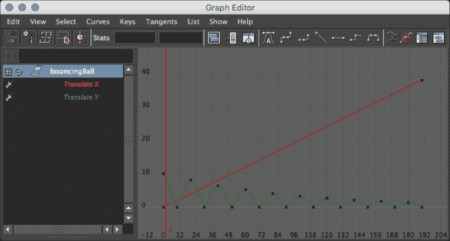
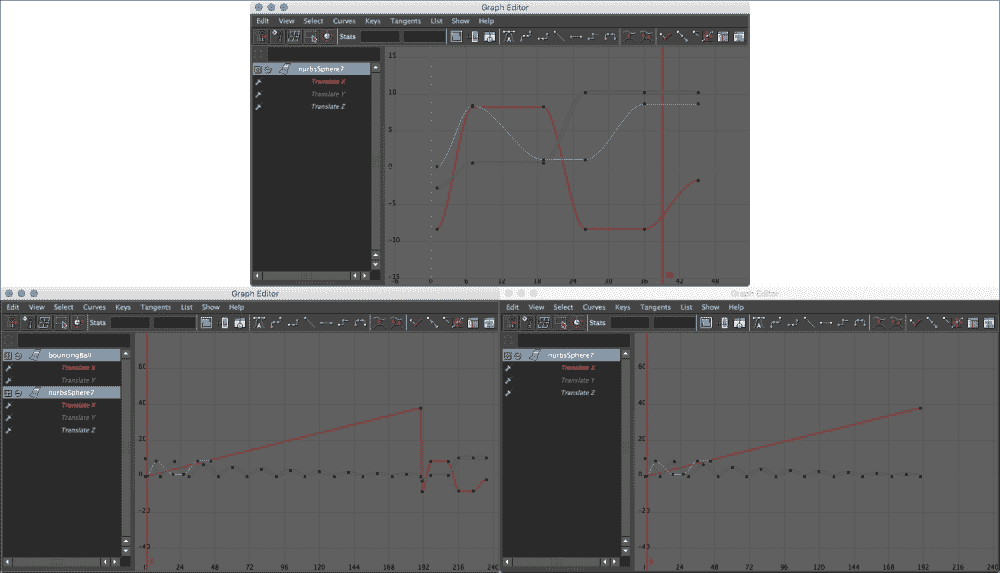
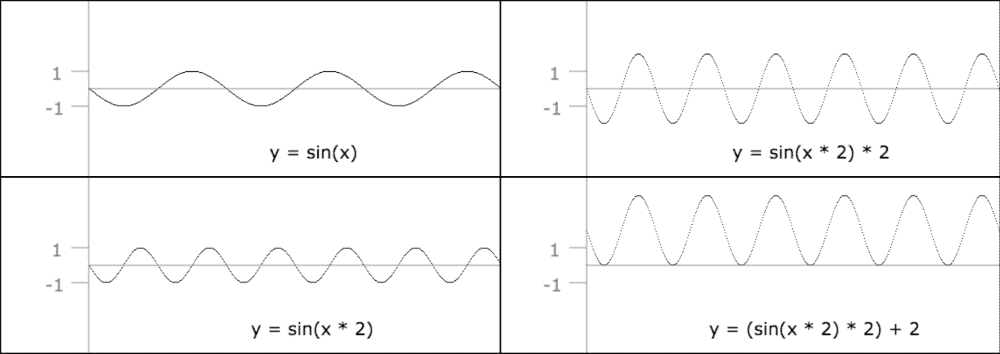

# 第六章.让事物移动 - 动画脚本编写

本章将涵盖与脚本动画化对象相关的各种配方：

+   查询动画数据

+   与动画层一起工作

+   将动画从一个对象复制到另一个对象

+   设置关键帧

+   通过脚本创建表达式

# 简介

在本章中，我们将探讨如何使用脚本创建动画和设置**关键帧**。我们还将了解如何与动画层一起工作并从代码中创建表达式。

# 查询动画数据

在本例中，我们将探讨如何检索有关动画对象的信息，包括哪些属性是动画化的以及关键帧的位置和值。尽管这个脚本本身可能没有太大用处，但了解关键帧的数量、时间和值有时是进行更复杂动画任务的先决条件。

## 准备工作

要充分利用这个脚本，你需要有一个定义了动画曲线的对象。要么加载一个带有动画的场景，要么跳转到设置关键帧的配方。

## 如何做...

创建一个新文件并添加以下代码：

```py
import maya.cmds as cmds

def getAnimationData():
    objs = cmds.ls(selection=True)
    obj = objs[0]

    animAttributes = cmds.listAnimatable(obj);

    for attribute in animAttributes:

        numKeyframes = cmds.keyframe(attribute, query=True, keyframeCount=True)

        if (numKeyframes > 0):
            print("---------------------------")
            print("Found ", numKeyframes, " keyframes on ", attribute)

            times = cmds.keyframe(attribute, query=True, index=(0,numKeyframes), timeChange=True)
            values = cmds.keyframe(attribute, query=True, index=(0,numKeyframes), valueChange=True)

            print('frame#, time, value')
            for i in range(0, numKeyframes):
                print(i, times[i], values[i])

            print("---------------------------")

getAnimationData()
```

如果你选择了一个具有动画曲线的对象并运行脚本，你应该会看到每个动画属性上每个关键帧的时间和值。例如，如果我们有一个简单的弹跳球动画，如下所示：



我们在脚本编辑器中可能会看到以下类似输出：

```py
---------------------------
('Found ', 2, ' keyframes on ', u'|bouncingBall.translateX')
frame#, time, value
(0, 0.0, 0.0)
(1, 190.0, 38.0)
---------------------------
---------------------------
('Found ', 20, ' keyframes on ', u'|bouncingBall.translateY')
frame#, time, value
(0, 0.0, 10.0)
(1, 10.0, 0.0)
(2, 20.0, 8.0)
(3, 30.0, 0.0)
(4, 40.0, 6.4000000000000004)
(5, 50.0, 0.0)
(6, 60.0, 5.120000000000001)
(7, 70.0, 0.0)
(8, 80.0, 4.096000000000001)
(9, 90.0, 0.0)
(10, 100.0, 3.276800000000001)
(11, 110.0, 0.0)
(12, 120.0, 2.6214400000000011)
(13, 130.0, 0.0)
(14, 140.0, 2.0971520000000008)
(15, 150.0, 0.0)
(16, 160.0, 1.6777216000000008)
(17, 170.0, 0.0)
(18, 180.0, 1.3421772800000007)
(19, 190.0, 0.0)
---------------------------
```

## 工作原理...

我们首先像往常一样获取选定的对象。一旦我们完成了这个步骤，我们将遍历所有`keyframeable`属性，确定它们是否有任何关键帧，如果有，我们将遍历时间和值。要获取`keyframeable`属性的列表，我们使用`listAnimateable`命令：

```py
objs = cmds.ls(selection=True)
obj = objs[0]

animAttributes = cmds.listAnimatable(obj)
```

这将给我们一个列表，列出了所选对象上所有可以动画化的属性，包括添加到其中的任何自定义属性。

如果你打印出`animAttributes`数组的内容，你可能会看到以下类似的内容：

```py
|bouncingBall.rotateX
|bouncingBall.rotateY
|bouncingBall.rotateZ
```

虽然`bouncingBall.rotateX`部分可能是有意义的，但你可能想知道`|`符号的含义。这个符号由 Maya 用来指示节点之间的层次关系，以便提供完全限定的节点和属性名称。如果`bouncingBall`对象是名为`ballGroup`的组的子对象，我们会看到以下内容：

```py
|ballGroup|bouncingBall.rotateX
```

每个这样的完全限定名称都将至少包含一个管道（`|`）符号，正如我们在第一个非分组示例中看到的那样，但可以有更多——每个额外的层次结构层都有一个。虽然这可能会导致属性名称变得很长，但它允许 Maya 利用可能具有相同名称但位于更大层次结构不同部分的对象（例如，为每个角色的每只手命名`handControl`控制对象）。

现在我们已经列出了该对象所有可能被动画化的属性，接下来我们想要确定是否有任何关键帧被设置在其上。为此，我们可以在查询模式中使用`keyframe`命令。

```py
    for attribute in animAttributes:
        numKeyframes = cmds.keyframe(attribute, query=True, keyframeCount=True)
```

到目前为止，我们有一个变量（`numKeyframes`），对于至少有一个关键帧的任何属性，它都将大于零。获取一个属性上的关键帧总数只是`keyframe`命令能做的事情之一；我们还将用它来获取每个关键帧的时间和值。

要做到这一点，我们将调用它两次，都是在查询模式下——一次获取时间，一次获取值：

```py
times = cmds.keyframe(attribute, query=True, index=(0,numKeyframes), timeChange=True)
values = cmds.keyframe(attribute, query=True, index=(0,numKeyframes), valueChange=True)
```

这两行在所有方面都相同，只是我们请求的信息类型不同。这里需要注意的是索引标志，它用于告诉 Maya 我们感兴趣的是哪些关键帧。该命令需要一个表示要检查的关键帧的第一个（包含）和最后一个（不包含）索引的两个元素参数。所以，如果我们有总共 20 个关键帧，我们将传递（`0`,`20`），这将检查索引从 0 到 19 的键。

我们用来获取值的标志可能看起来有点奇怪——`valueChange`和`timeChange`可能让你认为我们会得到相对值，而不是绝对值。然而，当以之前提到的方式使用时，该命令将给出我们想要的结果——每个关键帧的实际时间和值，正如它们在图表编辑器中显示的那样。

如果你想要查询单个关键帧的信息，你仍然需要输入一对值——只需将你感兴趣的索引重复两次即可。例如，要获取第四帧，使用（`3`,`3`）。

到目前为止，我们有两个数组——`times`数组，它包含每个关键帧的时间值，以及`values`数组，它包含实际的属性值。剩下要做的就是打印出我们所找到的信息：

```py
print('frame#, time, value')
for i in range(0, numKeyframes):
    print(i, times[i], values[i])
```

## 还有更多...

使用索引来获取关键帧的数据是一种轻松地遍历曲线所有数据的方法，但这不是指定范围的唯一方式。`keyframe`命令也可以接受时间值。例如，如果我们想知道在帧 1 和帧 100 之间给定属性上有多少关键帧，我们可以这样做：

```py
numKeyframes = cmds.keyframe(attributeName, query=True, time=(1,100) keyframeCount=True)
```

此外，如果你发现自己处理的是高度嵌套的对象，并且需要提取仅包含对象和属性名称，你可能发现 Python 内置的 split 函数很有帮助。你可以在一个字符串上调用 split，让 Python 将其拆分成一个部分列表。默认情况下，Python 会通过空格拆分输入字符串，但你也可以指定一个特定的字符串或字符来拆分。假设你有一个如下所示的字符串：

```py
|group4|group3|group2|group1|ball.rotateZ
```

然后，你可以使用`split`根据`|`符号将其拆分。这将给你一个列表，使用`-1`作为索引将只得到`ball.rotateZ`。将其放入一个可以用于从完整字符串中提取对象/属性名称的函数中会很简单，它看起来可能如下所示：

```py
def getObjectAttributeFromFull(fullString):
    parts = fullString.split("|")
    return parts[-1]
```

使用它看起来可能像这样：

```py
inputString = "|group4|group3|group2|group1|ball.rotateZ"
result = getObjectAttributeFromFull(inputString)
print(result) # outputs "ball.rotateZ"
```

# 处理动画层

Maya 提供了在场景中创建多个动画层的功能，这可以是一个构建复杂动画的好方法。然后，这些层可以独立启用或禁用，或者混合在一起，使用户能够对最终结果有更多的控制。

在这个例子中，我们将查看场景中存在的层，并构建一个脚本以确保我们有一个具有特定名称的层。例如，我们可能想要创建一个脚本，该脚本可以为所选对象的旋转添加额外的随机运动，而不会覆盖它们现有的运动。为此，我们需要确保我们有一个名为`randomMotion`的动画层，然后我们可以向其中添加关键帧。

## 如何做到这一点...

创建一个新的脚本并添加以下代码：

```py
import maya.cmds as cmds

def makeAnimLayer(layerName):

    baseAnimationLayer = cmds.animLayer(query=True, root=True)

    foundLayer = False

    if (baseAnimationLayer != None):
        childLayers = cmds.animLayer(baseAnimationLayer, query=True, children=True)

        if (childLayers != None) and (len(childLayers) > 0):
            if layerName in childLayers:
                foundLayer = True

    if not foundLayer:
        cmds.animLayer(layerName)
    else:
        print('Layer ' + layerName + ' already exists')

makeAnimLayer("myLayer")
```

运行脚本，你应该会在通道框的**Anim**选项卡中看到名为`myLayer`的动画层。

## 它是如何工作的...

我们首先想做的事情是找出场景中是否已经存在具有给定名称的动画层。为此，我们首先获取根动画层的名称：

```py
baseAnimationLayer = cmds.animLayer(query=True, root=True)
```

在几乎所有情况下，这应该返回两个可能值之一——要么是`BaseAnimation`，要么（如果还没有动画层）Python 内置的`None`值。

我们希望在以下两种可能的情况下创建一个新层：

+   目前还没有动画层

+   有动画层，但没有目标名称的

为了使上述测试更容易一些，我们首先创建一个变量来保存是否找到了动画层，并将其设置为`False`：

```py
foundLayer = False
```

现在，我们需要检查是否确实存在两个动画层，并且其中一个具有给定的名称。首先，我们检查确实存在基础动画层：

```py
if (baseAnimationLayer != None):
```

如果是这样的话，我们想要获取基础动画层的所有子代，并检查其中是否有任何一个具有我们正在寻找的名称。为了获取子动画层，我们将再次使用`animLayer`命令，再次在查询模式下：

```py
childLayers = cmds.animLayer(baseAnimationLayer, query=True, children=True)
```

一旦我们做到了这一点，我们就会想看看是否有任何子层与我们要找的层匹配。我们还需要考虑到没有子层的情况（这可能发生在动画层被创建然后后来被删除，只留下基础层的情况下）：

```py
if (childLayers != None) and (len(childLayers) > 0):
    if layerName in childLayers:
        foundLayer = True
```

如果存在子层并且我们正在寻找的名称被找到，我们将我们的`foundLayer`变量设置为`True`。

如果找不到层，我们创建它。这可以通过再次使用 `animLayer` 命令并指定我们想要创建的层的名称来完成：

```py
if not foundLayer:
    cmds.animLayer(layerName)
```

最后，如果找到了层，我们通过打印一条消息来结束，让用户知道。

## 还有更多...

拥有动画层是很好的，因为我们可以在创建或修改关键帧时使用它们。然而，实际上我们无法在不首先将相关对象添加到动画层的情况下向层添加动画。

假设我们有一个名为 `bouncingBall` 的对象，并且我们想在 `bounceLayer` 动画层上为其 `translateY` 属性设置一些关键帧。设置关键帧的实际命令可能看起来像这样：

```py
cmds.setKeyframe("bouncingBall.translateY", value=yVal, time=frame, animLayer="bounceLayer")
```

然而，只有在我们首先将 `bouncingBall` 对象添加到 `bounceLayer` 动画层的情况下，这才会按预期工作。为了做到这一点，我们可以在编辑模式下使用 `animLayer` 命令，并带有 `addSelectedObjects` 标志。请注意，因为标志作用于当前选中的对象，我们首先需要选择我们想要添加的对象：

```py
cmds.select("bouncingBall", replace=True)
cmds.animLayer("bounceLayer", edit=True, addSelectedObjects=True)
```

默认情况下，添加对象将添加其所有可动画属性。你也可以添加特定的属性，而不是整个对象。例如，如果我们只想将 `translateY` 属性添加到我们的动画层，我们可以这样做：

```py
cmds.animLayer("bounceLayer", edit=True, attribute="bouncingBall.translateY")
```

# 从一个对象复制动画到另一个对象

在这个例子中，我们将创建一个脚本，该脚本将把一个对象的全部动画数据复制到另一个或多个附加对象上，这可以在多个对象上复制运动时很有用。

## 准备工作

为了脚本能够工作，你需要一个设置了关键帧的对象。你可以创建一些简单的动画，或者跳到本章后面的示例，关于如何使用脚本创建关键帧。

## 如何做到这一点...

创建一个新的脚本并添加以下代码：

```py
import maya.cmds as cmds

def getAttName(fullname):
    parts = fullname.split('.')
    return parts[-1]

def copyKeyframes():
    objs = cmds.ls(selection=True)

    if (len(objs) < 2):
        cmds.error("Please select at least two objects")

    sourceObj = objs[0]

    animAttributes = cmds.listAnimatable(sourceObj);

    for attribute in animAttributes:

        numKeyframes = cmds.keyframe(attribute, query=True, keyframeCount=True)

        if (numKeyframes > 0):

            cmds.copyKey(attribute)

            for obj in objs[1:]:
                cmds.pasteKey(obj, attribute=getAttName(attribute), option="replace")

copyKeyframes()
```

选择动画对象，按住 shift 键选择至少另一个对象，然后运行脚本。你会看到所有对象都有相同的运动。

## 它是如何工作的...

我们脚本的第一个部分是一个辅助函数，我们将使用它来从完整的对象名/属性名字符串中剥离属性名。更多关于它的内容将在稍后提供。

现在让我们来看脚本的主要内容。首先，我们运行一个检查以确保用户至少选择了两个对象。如果没有，我们将显示一个友好的错误消息，让用户知道他们需要做什么：

```py
objs = cmds.ls(selection=True)

if (len(objs) < 2):
    cmds.error("Please select at least two objects")
```

`error` 命令也会停止脚本的运行，所以如果我们还在继续，我们知道我们至少选择了两个对象。我们将第一个选中的对象设置为源对象。我们同样可以使用第二个选中的对象，但那样就意味着将第一个选中的对象作为目标，限制我们只能有一个目标：

```py
    sourceObj = objs[0]
```

现在，我们准备开始复制动画，但首先，我们需要确定哪些属性目前正在动画化，这需要通过找到所有可以动画化的属性，并检查每个属性上是否有关键帧的组合来实现：

```py
animAttributes = cmds.listAnimatable(sourceObj);

for attribute in animAttributes:
    numKeyframes = cmds.keyframe(attribute, query=True, keyframeCount=True)
```

如果给定属性至少有一个关键帧，我们将继续复制：

```py
        if (numKeyframes > 0):
            cmds.copyKey(attribute)
```

`copyKey`命令将导致给定对象的关键帧临时保存在内存中。如果没有使用任何附加标志，它将获取指定属性的 所有关键帧，这正是我们在这个情况下想要的。如果我们只想获取关键帧的子集，我们可以使用时间标志来指定一个范围。

我们传递由`listAnimatable`函数返回的每个值。这些将是完整名称（对象名称和属性）。这对于`copyKey`命令来说是可以的，但对于粘贴操作需要做一点额外的工作。

由于我们将键复制到与原始复制源不同的对象上，我们需要将对象和属性名称分开。例如，我们的`attribute`值可能如下所示：

```py
|group1|bouncingBall.rotateX
```

从这里，我们想要剪掉属性名称（`rotateX`），因为我们是从选择列表中获取对象名称。为此，我们创建了一个简单的辅助函数，它接受完整的对象/属性名称并返回仅属性名称。这很简单，只需在`.`上拆分名称/属性字符串并返回最后一个元素即可，在这种情况下是属性：

```py
def getAttName(fullname):
    parts = fullname.split('.')
    return parts[-1]
```

Python 的`split`函数将字符串拆分为字符串数组，使用负索引将从末尾开始计数，其中`−1`给我们最后一个元素。

现在，我们实际上可以粘贴我们的键了。我们将遍历所有剩余的选定对象，从第二个开始，粘贴我们的复制关键帧：

```py
for obj in objs[1:]:
    cmds.pasteKey(obj, attribute=getAttName(attribute), option="replace")
```

注意，我们利用 Python 的 for 循环的特性使代码更易于阅读。与其他大多数语言不同，我们不需要使用索引，而是可以使用`for x in y`结构。在这种情况下，`obj`将是一个临时变量，作用域限于 for 循环，它将取列表中每个项目的值。此外，我们不是传递整个列表，而是使用`objs[1:]`来表示整个列表，从索引`1`（第二个元素）开始。冒号允许我们指定`objs`列表的子范围，而将右手边留空将导致 Python 包含列表末尾的所有项目。

我们传递对象名称（来自原始选择），属性（通过我们的辅助函数从完整名称/属性字符串中剥离），并使用`option="replace"`来确保我们粘贴的关键帧将替换掉任何已经存在的内容。



原始动画（顶部）。在这里，我们看到使用默认设置粘贴键的结果（左侧）和使用替换选项的结果（右侧）。请注意，默认结果仍然包含原始曲线，只是被推到了后面的帧。

如果我们没有包含`option`标志，Maya 将默认在时间轴上移动任何现有键的同时插入粘贴的关键帧。

## 还有更多...

对于选项标志有很多其他选项，每个选项都以不同的方式处理与您粘贴的键以及可能已经存在的键的潜在冲突。请务必查看`pasteKeys`命令的内置文档以获取更多信息。

另一个，也许更好的选项来控制粘贴的键如何与现有的键交互，是将新键粘贴到单独的动画层中。例如，如果我们想确保粘贴的键最终出现在名为`extraAnimation`的动画层中，我们可以按如下方式修改对`pasteKeys`的调用：

```py
cmds.pasteKey(objs[i], attribute=getAttName(attribute), option="replace", animLayer="extraAnimation")
```

注意，如果没有名为`extraAnimation`的动画层，Maya 将无法复制键。请参阅有关如何查询现有层和创建新层的动画层部分以获取更多信息。

# 设置关键帧

虽然在 Maya 中确实有各种方法可以使物体移动，但绝大多数运动都是由关键帧驱动的。在这个例子中，我们将探讨如何通过编写代码来创建关键帧，即那个老式的动画备用方案——弹跳球。

## 准备工作

我们将要创建的脚本将动画化当前选定的对象，所以请确保你有一个对象——无论是传统的球体还是你想要使其弹跳的其他东西。

## 如何操作...

创建一个新文件并添加以下代码：

```py
import maya.cmds as cmds

def setKeyframes():
    objs = cmds.ls(selection=True)
    obj = objs[0]

    yVal = 0
    xVal = 0
    frame = 0

    maxVal = 10

    for i in range(0, 20):
        frame = i * 10
        xVal = i * 2

        if i % 2 == 1:
            yVal = 0
        else:
            yVal = maxVal
            maxVal *= 0.8

        cmds.setKeyframe(obj + '.translateY', value=yVal, time=frame)
        cmds.setKeyframe(obj + '.translateX', value=xVal, time=frame)

setKeyframes()
```

在选定了对象后运行前面的脚本并触发播放。你应该看到对象上下移动。

## 它是如何工作的...

为了让我们的对象弹跳，我们需要设置关键帧，使对象在零的*Y*值和不断减少的最大值之间交替，这样动画就能模仿一个下落物体在每次弹跳时失去速度的方式。我们还将使其在弹跳时沿 x 轴移动。

我们首先获取当前选定的对象，并设置一些变量以使我们在循环中更容易阅读。我们的`yVal`和`xVal`变量将保存我们想要设置对象位置的当前值。我们还有一个`frame`变量来保存当前帧，以及一个`maxVal`变量，它将用于保存对象当前高度的*Y*值。

### 注意

这个例子足够简单，我们实际上不需要为帧和属性值设置单独的变量，但以这种方式设置可以使交换更复杂的数学或逻辑更容易，以控制关键帧的设置位置及其值。

这给我们以下结果：

```py
    yVal = 0
    xVal = 0
    frame = 0

    maxVal = 10
```

脚本的大部分是一个单独的循环，在这个循环中，我们在`X`和`Y`位置上设置关键帧。

对于`xVal`变量，我们只需将一个常数值（在这种情况下，2 个单位）相乘。对于我们的框架，我们也将做同样的事情。对于`yVal`变量，我们希望交替使用一个不断减少的值（对于连续的峰值）和零（当球击中地面时）。

要在零和非零之间交替，我们需要检查我们的循环变量是否可以被 2 整除。一种简单的方法是取值`modulo`（`%`）2。这将给出当值被 2 除时的余数，对于偶数将是零，对于奇数将是 1。

对于奇数，我们将`yVal`设置为零，对于偶数，我们将它设置为`maxVal`。为了确保球每次弹跳时都会少一点，我们每次使用`maxVal`时都将其设置为当前值的 80%。

将所有这些放在一起，我们得到以下循环：

```py
for i in range(0, 20):
    frame = i * 10
    xVal = i * 2

    if (i % 2) == 1:
        yVal = 0
    else:
        yVal = maxVal
        maxVal *= 0.8
```

现在我们终于准备好实际上在我们的对象上设置关键帧了。这可以通过`setKeyframe`命令轻松完成。我们需要指定以下三件事：

+   关键帧的属性（对象名称和属性）

+   设置关键帧的时间

+   设置属性的实际值

在这种情况下，这最终看起来如下所示：

```py
cmds.setKeyframe(obj + '.translateY', value=yVal, time=frame)
cmds.setKeyframe(obj + '.translateX', value=xVal, time=frame)
```

就这样！一个通过纯代码动画化的正确弹跳球（或其他对象）。

## 还有更多...

默认情况下，`setKeyframe`命令将创建具有内切线和外切线都设置为样条的键帧。这对于很多事情来说都很好，但对于应该击中硬表面的东西来说，会导致过度平滑的动画。

我们可以通过保持关键帧在对象达到最大高度时的平滑切线，但在最小值时设置为线性，来改进我们的弹跳动画。这将每次球击中地面时给我们一个很好的尖锐变化。

要做到这一点，我们只需要将`inTangentType`和`outTangentType`标志都设置为`linear`，如下所示：

```py
cmds.setKeyframe(obj + ".translateY", value=animVal, time=frame, inTangentType="linear", outTangentType="linear")
```

为了确保当球击中地面时我们只有线性切线，我们可以设置一个变量来保存切线类型，并以与设置`yVal`变量相同的方式将其设置为两个值之一。

这将最终看起来像这样：

```py
tangentType = "auto"

for i in range(0, 20):
    frame =  i * 10
    if i % 2 == 1:
        yVal = 0
        tangentType = "linear"
    else:
        yVal = maxVal
        tangentType = "spline"
        maxVal *= 0.8

    cmds.setKeyframe(obj + '.translateY', value=yVal, time=frame, inTangentType=tangentType, outTangentType=tangentType)
```

# 通过脚本创建表达式

虽然大多数 Maya 动画都是手动创建的，但直接通过脚本驱动属性通常很有用，特别是对于机械对象或背景项目。一种方法是使用 Maya 的表达式编辑器。

除了通过表达式编辑器创建表达式外，还可以通过脚本创建表达式，这是一个代码驱动的代码的美丽示例。在这个例子中，我们将创建一个脚本，可以用来创建一个基于正弦波的表达式，以平滑地改变给定属性在两个值之间的变化。请注意，表达式实际上不能直接使用 Python 代码；它们需要代码以 MEL 语法编写。但这并不意味着我们不能使用 Python 来 *创建* 表达式，这正是我们将在这个例子中做的。

## 准备工作

在我们深入研究脚本之前，我们首先需要很好地掌握我们将要创建的表达式的类型。有很多人不同的方法可以处理表达式，但在这个例子中，我们将保持相对简单，并将属性与基于当前时间的正弦波相关联。

为什么是正弦波？正弦波很棒，因为它们在两个值之间平滑变化，并且能够很好地从最小值和最大值中平滑过渡。虽然最小值和最大值的范围从 -1 到 1，但足以改变输出，使其在任意两个我们想要的数字之间移动。我们还将通过设置表达式依赖于一个自定义的 `speed` 属性来使事情更加灵活，该属性可以用来控制属性动画的速度。

最终结果将是一个值，它在用户指定的（并且可关键帧化的）速率下在任意两个数字之间平滑变化。

## 如何做到这一点...

创建一个新的脚本并添加以下代码：

```py
import maya.cmds as cmds

def createExpression(att, minVal, maxVal, speed):
    objs = cmds.ls(selection=True)
    obj = objs[0]

    cmds.addAttr(obj, longName="speed", shortName="speed", min=0, keyable=True)

    amplitude = (maxVal – minVal)/2.0
    offset = minVal + amplitude

    baseString =  "{0}.{1} = ".format(obj, att)
    sineClause = '(sin(time * ' + obj + '.speed)'
    valueClause = ' * ' + str(amplitude) + ' + ' + str(offset) + ')'

    expressionString = baseString + sineClause + valueClause

    cmds.expression(string=expressionString)

createExpression('translateY', 5, 10, 1)
```

## 它是如何工作的...

我们首先为我们的对象添加一个 `speed` 属性，就像在 第五章 的自定义属性配方中一样，*添加控件 - 布尔脚本*。我们将确保它可关键帧化，以便稍后动画：

```py
cmds.addAttr(obj, longName="speed", shortName="speed", min=0, keyable=True)
```

在创建表达式时，通常至少包含一个可关键帧化的属性是一个好主意。虽然数学驱动的动画确实是一种强大的技术，但你可能仍然希望能够改变具体的细节。给自己一个或多个可关键帧化的属性是做到这一点的简单方法。

现在我们已经准备好构建我们的表达式。但首先，我们需要确切地了解我们想要什么；在这种情况下，一个在两个极端之间平滑变化的值，并且能够控制其速度。我们可以很容易地使用正弦函数构建一个表达式来实现这一点，以当前时间为输入。以下是一般形式的样子：

```py
animatedValue = (sin(time * S) * M) + O;
```

位置：

+   `S` 是一个值，它将加快（如果大于 1）或减慢（如果小于 1）正弦函数输入的变化速率。

+   `M` 是一个乘数，用于改变值变化的整体范围

+   `O` 是一个偏移量，以确保最小值和最大值正确。

你也可以从视觉上考虑——`S` 将使我们的波形在水平（时间）轴上拉伸或收缩，`M` 将使其垂直扩展或收缩，而 `O` 将将整个曲线的形状向上或向下移动。

`S` 已经处理好了；它是我们新创建的“速度”属性。`M`和`O`需要根据正弦函数总是产生从`−1`到`1`的值来计算。

值的范围整体应该从我们的`minVal`到`maxVal`，所以你可能认为`M`应该等于*(maxVal – minVal)*。然而，由于它应用于`−1`和`1`，这将使我们得到两倍于期望的变化。因此，我们想要的最终值是*(maxVal – minVal)/2*。我们将其存储到我们的振幅变量中，如下所示：

```py
amplitude = (maxVal – minVal)/2.0
```

接下来是偏移值`O`。我们希望移动我们的图表，使得最小值和最大值位于它们应该的位置。这似乎意味着只需添加`minVal`，但如果我们这样做，我们的输出将有一半的时间低于最小值（任何正弦函数产生负输出的时刻）。为了解决这个问题，我们将`O`设置为*(minVal + M)*，或者在我们的脚本中：

```py
offset = minVal + amplitude
```

这样，我们将波的`0`位置移动到`minVal`和`maxVal`之间，这正是我们想要的。

为了更清晰地展示，让我们看看我们附加到`sin()`的不同部分，以及它们如何影响表达式输出的最小值和最大值。我们假设我们想要的最终结果是`0`到`4`的范围。

| 表达式 | 额外组件 | 最小值 | 最大值 |
| --- | --- | --- | --- |
| *sin(time)* | None- 原始正弦函数 | −1 | 1 |
| *sin(time * speed)* | 将输入乘以“速度” | −1 (更快) | 1 (更快) |
| *sin(time * speed) * 2* | 将输出乘以 2 | −2 | 2 |
| *(sin(time * speed) * 2) + 2* | 向输出添加 2 | 0 | 4 |

注意，*2 = (4-0)/2* 和 *2 = 0 + 2*。

这是当绘制时前面进展的样子：



使用正弦函数从 0 到 4 构建一个表达式的四个步骤。

好的，现在我们已经确定了数学关系，我们准备将其转换为 Maya 的表达式语法。如果我们想让名为`myBall`的对象使用前面的值沿*Y*轴动画，我们希望最终得到：

```py
myBall.translateY = (sin(time * myBall.speed) * 5) + 12;
```

如果将其输入 Maya 的表达式编辑器，这将按预期工作，但我们想确保我们有一个更通用的解决方案，可以用于任何对象和任何值。这很简单，只需要从各种字面量和变量中构建前面的字符串，这正是我们在接下来的几行中做的：

```py
baseString = "{0}.{1} = ".format(obj, att)
sineClause = '(sin(time * ' + obj + '.speed)'
valueClause = ' * ' + str(amplitude) + ' + ' + str(offset) + ')'

expressionString = baseString + sineClause + valueClause
```

我将字符串创建拆分成几行，以便更清晰地展示，但这并不是必需的。这里的关键思想是我们在这几个方面来回切换：字面量（`sin(time *`, `.speed` 等）和变量（`obj`, `att`, `amplitude`, 和 `offset`），以构建整个字符串。注意，我们必须在`str()`函数中包裹数字，以防止 Python 在将它们与字符串组合时发出抱怨。

到目前为止，我们已经准备好了我们的表达式字符串。剩下的只是将其作为表达式实际添加到场景中，这可以通过`expression`命令轻松完成：

```py
cmds.expression(string=expressionString)
```

就这样！我们现在将有一个在任意两个值之间平滑变化的属性。

## 还有更多...

有许多其他方法可以使用表达式来驱动动画，以及各种可以采用的简单数学技巧。

例如，您可以通过每帧运行此操作来轻松地将值平滑地移动到目标值，并获得对目标的良好渐入效果：

```py
animatedAttribute = animatedAttribute + (targetValue – animatedAttribute) * 0.2;
```

这会将目标与当前值之间的当前差异的 20%添加到属性中，这将使其向目标移动。由于添加的量始终是当前差异的百分比，因此当值接近目标时，每帧效果会减少，从而提供一种渐入效果。

如果我们将此与一些随机选择新目标值的代码相结合，我们就会得到一种简单的方法，例如，动画背景角色的头部随机朝向不同的位置（可能是为了提供体育场人群）。

假设我们已经为我们的对象添加了`targetX`、`targetY`和`targetZ`的自定义属性，最终看起来可能如下所示：

```py
if (frame % 20 == 0)
{
    myCone.targetX = rand(time) * 360;
    myCone.targetY = rand(time) * 360;
    myCone.targetZ = rand(time) * 360;
}

myObject.rotateX += (myObject.targetX - myCone.rotateX) * 0.2;
myObject.rotateY += (myObject.targetY - myCone.rotateY) * 0.2;
myObject.rotateZ += (myObject.targetZ - myCone.rotateZ) * 0.2;
```

注意，我们使用模数（`%`）运算符仅在帧是 20 的偶数倍时执行某些操作（设置目标）。我们还使用当前时间作为`rand()`函数的种子值，以确保在动画过程中获得不同的结果。

之前提到的示例是如果我们直接将其输入到 Maya 的表达式编辑器中，代码会看起来像这样；注意 MEL 风格的语法（而不是 Python）。通过 Python 生成此代码会比我们的正弦波示例复杂一些，但会使用所有相同的原则——从字面量和变量构建字符串，然后将该字符串传递给`expression`命令。
