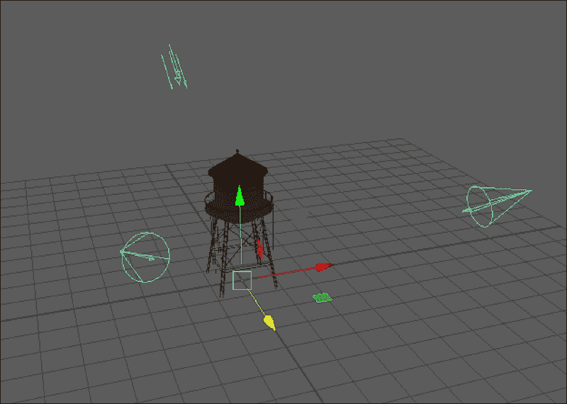
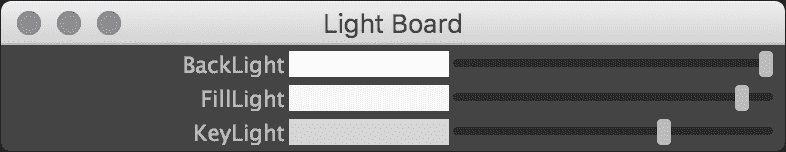
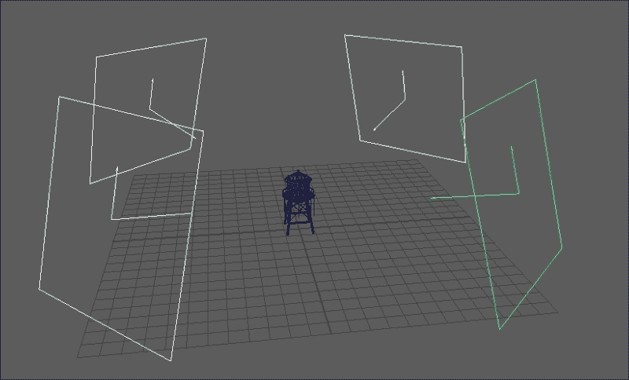
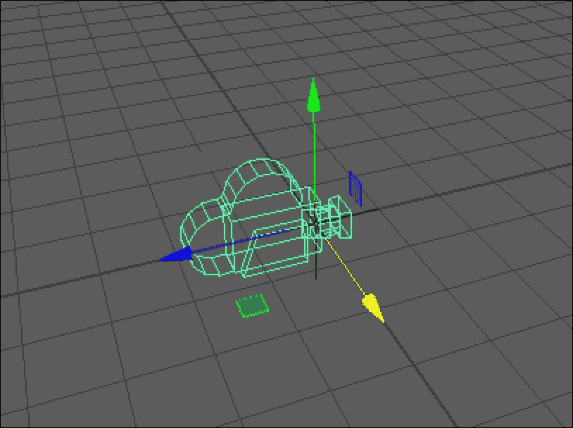
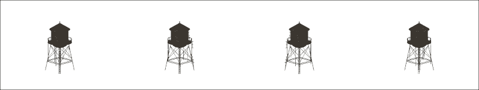

# 第七章：渲染脚本

在本章中，我们将探讨以下主题：

+   创建和编辑灯光

+   创建用于控制所有灯光的 GUI

+   从代码中创建摄像机

+   渲染精灵图集

# 简介

到目前为止，我们已经探讨了脚本如何帮助建模、纹理、绑定和动画。一旦所有这些都完成了，剩下的就是实际渲染场景。在本章中，我们将探讨如何设置灯光和摄像机，以及如何渲染场景。

# 创建和编辑灯光

在这个例子中，我们将构建一个脚本，通过脚本快速轻松地设置一个简单的三点照明设置。

这将最终为我们提供一个使用脚本创建不同类型灯光的精彩概述，同时也为我们留下了一个实用的工具。



脚本运行的结果-主光、填充光和背光都指向原点

## 准备工作

为了获得最佳效果，在运行脚本之前，请确保你的场景中有一个具有相当细节级别的对象。

## 如何做到这一点...

创建一个新文件并添加以下代码：

```py
import maya.cmds as cmds

def createLightRig():

    offsetAmount = 10
    lightRotation = 30

    newLight = cmds.spotLight(rgb=(1, 1, 1), name="KeyLight")
    lightTransform = cmds.listRelatives(newLight, parent=True)
    keyLight = lightTransform[0]

    newLight = cmds.spotLight(rgb=(0.8, 0.8, 0.8), name="FillLight")
    lightTransform = cmds.listRelatives(newLight, parent=True)
    fillLight = lightTransform[0]

    newLight = cmds.directionalLight(rgb=(0.2, 0.2, 0.2), name="BackLight")
    lightTransform = cmds.listRelatives(newLight, parent=True)
    backLight = lightTransform[0]

    cmds.move(0, 0, offsetAmount, keyLight)
    cmds.move(0, 0, 0, keyLight + ".rotatePivot")
    cmds.rotate(-lightRotation, lightRotation, 0, keyLight)

    cmds.move(0, 0, offsetAmount, fillLight)
    cmds.move(0, 0, 0, fillLight + ".rotatePivot")
    cmds.rotate(-lightRotation, -lightRotation, 0, fillLight)

    cmds.move(0, 0, offsetAmount, backLight)
    cmds.move(0, 0, 0, backLight + ".rotatePivot")
    cmds.rotate(180 + lightRotation, 0, 0, backLight)

    rigNode = cmds.group(empty=True, name="LightRig")

    cmds.parent(keyLight, rigNode)
    cmds.parent(fillLight, rigNode)
    cmds.parent(backLight, rigNode)

    cmds.select(rigNode, replace=True)

createLightRig()
```

运行前面的代码，你会看到你留下了三个创建的灯光——两个聚光灯和一个方向性灯光。

## 它是如何工作的...

我们将创建三个灯光——两个聚光灯和一个方向性灯光。为了简化定位，我们将创建一些辅助变量：

```py
offsetAmount = 10
lightRotation = 30
```

`offsetAmount`变量将是每个灯光从原点移动的距离，而`lightRotation`将控制灯光旋转的程度。接下来，我们创建我们的第一个灯光——主光源：

```py
newLight = cmds.spotLight(rgb=(1, 1, 1), name="KeyLight")
```

创建灯光非常简单；我们只需调用`spotLight`命令。在此过程中，我们将使用`rgb`标志来设置灯光的颜色（全强度白色），并将名称设置为便于以后识别。我们将结果存储到`newLight`变量中。

出现了一个小问题，即灯光创建命令返回的是形状节点的名称，而不是变换。因为设置位置和旋转需要更改变换，我们将使用`listRelatives`命令来获取相关的变换节点：

```py
lightTransform = cmds.listRelatives(newLight, parent=True)
```

正如我们在前面的例子中所看到的，我们必须考虑到`listRelatives`命令总是返回一个节点列表，即使可能只有一个节点（如使用父节点标志的情况）。我们将第一个条目存储到一个变量中，我们将使用这个变量在脚本中识别我们的灯光：

```py
keyLight = lightTransform[0]
```

到目前为止，我们已经创建了三个灯光中的第一个。我们将做完全相同的事情来创建一个用于填充光的第二个聚光灯，唯一的区别是我们从略低于全白色的颜色开始：

```py
newLight = cmds.spotLight(rgb=(0.8, 0.8, 0.8), name="FillLight")
lightTransform = cmds.listRelatives(newLight, parent=True)
fillLight = lightTransform[0]
```

最后，我们设置了背光。我们从一个深灰色灯光开始，并创建一个方向性灯光而不是聚光灯：

```py
newLight = cmds.directionalLight(rgb=(0.2, 0.2, 0.2), name="BackLight")
lightTransform = cmds.listRelatives(newLight, parent=True)
backLight = lightTransform[0]
```

现在我们已经创建了所有灯光，我们准备设置它们的位置和旋转，以获得一个漂亮的默认三灯光设置。为此，我们将为每个灯光执行以下步骤：

1.  沿着 z 轴将灯光移动到离原点一定的距离。

1.  将灯光的旋转支点移回到原点。

1.  设置灯光的旋转以获得我们想要的位置。

我们也可以直接使用一些三角函数来计算灯光位置，但让灯光各自绕原点旋转不仅会使脚本更简单，而且创建后也更容易更改。

首先，我们沿着 z 轴移动灯光：

```py
cmds.move(0, 0, offsetAmount, keyLight)
```

一旦完成，我们想将旋转支点移回原点。我们将使用移动命令来完成此操作：

```py
cmds.move(0, 0, 0, keyLight + ".rotatePivot")
```

注意，我们在灯光名称后追加 `.rotatePivot`，这样我们只移动支点而不是灯光本身。另外，注意我们将它移动到 (0,0,0)。这将最终给我们想要的结果，因为移动命令默认使用绝对坐标。所以，通过 (0,0,0) 移动实际上是告诉 Maya 将相关对象移动到原点。

一旦完成，我们可以使用旋转命令将灯光绕原点旋转。对于主光，我们将绕 *x* 轴旋转以将其向上移动，并绕 *y* 轴旋转以将其向右移动。注意，我们对于 *x* 轴的值取反，这样灯光在 *X*-*Z* 平面相对于顺时针旋转而不是逆时针旋转。这将确保灯光向上移动，而不是向下移动：

```py
cmds.rotate(-lightRotation, lightRotation, 0, keyLight)
```

我们重复前面的代码两次，以设置填充光和背光，并使用默认位置：

```py
cmds.move(0, 0, offsetAmount, fillLight)
cmds.move(0, 0, 0, fillLight + ".rotatePivot")
cmds.rotate(-lightRotation, -lightRotation, 0, fillLight)
```

填充光绕 *x* 轴旋转的量与主光相同，但在 *y* 轴的相反方向：

```py
cmds.move(0, 0, offsetAmount, backLight)
cmds.move(0, 0, 0, backLight + ".rotatePivot")
cmds.rotate(180 + lightRotation, 0, 0, backLight)
```

背光则绕 *x* 轴旋转 180 度（以放置在原点后面）加上我们的 `lightRotation` 值，使其移动到原点上方。

到目前为止，我们有了三个具有默认设置和位置的灯光，但我们会希望使整个装置更容易操作。为此，我们将创建一个新的变换节点并将所有三个灯光作为子节点添加。

要创建新的变换节点，我们将使用带有 `empty` 标志的 `group` 命令，以允许我们创建一个空组。我们还将确保使用名称标志设置基本名称：

```py
rigNode = cmds.group(empty=True, name="LightRig")
```

一旦完成，我们使用 `parent` 命令将所有三个灯光作为 `LightRig` 节点的子节点：

```py
cmds.parent(keyLight, rigNode)
cmds.parent(fillLight, rigNode)
cmds.parent(backLight, rigNode)
```

作为最后的润色，我们确保选择了父节点，使用 `select` 调用并带有 `replace` 选项：

```py
cmds.select(rigNode, replace=True)
```

当创建新的节点或节点组时，始终是一个好习惯，在脚本结束时保留新创建的对象（或对象组）选中状态，以便最终用户可以轻松地进行必要的进一步更改（例如移动整个装置）。

## 还有更多...

在这个例子中，我们将灯光的颜色设置为不同的值，以使填充光和背光的影响更小。或者，我们也可以将所有灯光设置为单一颜色，并使用强度来提供变化。这可能会看起来像以下这样：

```py
    keyLightShape = cmds.spotLight(rgb=(1, 1, 1), intensity=1, name="KeyLight")
    fillLightShape = cmds.spotLight(rgb=(1,1,1), intensity=0.8, name="FillLight")
    backLightShape = cmds.directionalLight(rgb=(1,1,1), intensity=0.2, name="BackLight")
```

前面的代码会给我们三个都是白色的灯光，但强度不同。如果你想在创建灯光后设置其强度，可以使用`setAttr`命令。例如，如果我们想在事后更改`keyLight`的强度，我们可以这样做：

```py
cmds.setAttr(keyLightShape + ".intensity", 0.5)
```

脚本的一个很好的可能补充是更好地考虑几何形状的不同比例。在当前版本中，我们可以使用父组的比例来增加或减少灯光的间距。一个稍微好一点的方法是为我们的函数传递一个偏移量值。我们还可以传递一个旋转量值以支持更广泛的使用案例。

这样做将导致我们采取以下代码：

```py
def createLightRig():
    offsetAmount = 10
    lighRotation = 30
    newLight = cmds.spotLight(rgb=(1, 1, 1), name="KeyLight")
    # rest of script
```

它将被更改为：

```py
def createLightRig(offsetAmount, lightRotation):
    newLight = cmds.spotLight(rgb=(1, 1, 1), name="KeyLight")
    # rest of script
```

# 创建用于控制所有灯光的 GUI

大多数场景最终都会包含多个灯光，控制它们可能会变得非常麻烦。在这个例子中，我们将创建一个 GUI，它将向用户提供一种简单的方式来控制场景中所有灯光的颜色。

在场景中有三个灯光的情况下运行脚本会产生以下类似的结果：



## 准备工作

确保你的场景中至少有几点灯光。或者，可以使用上面的三点照明示例快速设置灯光系统。

## 如何操作...

创建一个新文件并添加以下代码：

```py
import maya.cmds as cmds
from functools import partial

class LightBoard():

    def __init__(self):

        self.lights = []
        self.lightControls = []
        self.lightNum = 0

        if (cmds.window("ahLightRig", exists=True)):
            cmds.deleteUI("ahLightRig")

        self.win = cmds.window("ahLightRig", title="Light Board")
        cmds.columnLayout()

        lights = cmds.ls(lights=True)

        for light in lights:
            self.createLightControl(light)

        cmds.showWindow(self.win)

    def updateColor(self, lightID, *args):
        newColor = cmds.colorSliderGrp(self.lightControls[lightID], query=True, rgb=True)
        cmds.setAttr(self.lights[lightID]+ '.color', newColor[0], newColor[1], newColor[2], type="double3")

    def createLightControl(self, lightShape):

        parents = cmds.listRelatives(lightShape, parent=True)
        lightName = parents[0]

        color = cmds.getAttr(lightShape + '.color')
        changeCommandFunc = partial(self.updateColor, self.lightNum)

        newSlider = cmds.colorSliderGrp(label=lightName, rgb=color[0], changeCommand=changeCommandFunc)

        self.lights.append(lightShape)
        self.lightControls.append(newSlider)

        self.lightNum += 1

LightBoard()
```

运行前面的脚本，你将得到一个新窗口，其中包含场景中每个灯光的控制。控制将提供颜色样本和滑块，更改它将导致相关灯光的颜色更新。

## 如何工作...

首先要注意的是，我们添加了一个第二个`import`语句：

```py
import maya.cmds as cmds
from functools import partial
```

`functools`库提供了创建函数和将它们作为变量使用的能力。这在我们将要连接我们的控件时将非常有用。

下一个要注意的是，我们再次为这个例子设置了一个合适的类。因为我们需要维护场景中所有灯光的列表（以及每个灯光的控制列表），所以将我们的脚本包裹在一个合适的类中是最好的方法。

话虽如此，让我们继续我们的`__init__`函数。我们首先初始化一些成员变量——一个用于存储灯光列表，一个用于存储控制列表，一个帮助我们将适当的灯光链接到适当的控制：

```py
def __init__(self):

    self.lights = []
    self.lightControls = []
    self.lightNum = 0
```

然后我们为新窗口执行一些标准的初始化工作——创建窗口，设置其标题，并添加列布局。在我们创建窗口之前，我们首先删除之前的窗口（如果存在）：

```py
        if (cmds.window("ahLightRig", exists=True)):
            cmds.deleteUI("ahLightRig")
```

一旦我们完成了这个操作，我们创建我们的窗口，确保传递与我们检查的相同名称：

```py
self.win = cmds.window(("ahLightRig", title="Light Board")
cmds.columnLayout()
```

现在我们已经准备好设置我们的控制。我们需要为场景中的每一盏灯创建一个控制，这意味着我们首先必须获取所有灯的列表。幸运的是，对于我们来说，`ls` 命令使得这变得很容易。我们只需要将 `lights` 标志设置为 `true`：

```py
lights = cmds.ls(lights=True)
```

注意，`ls` 命令可以与几个不同的标志（`lights`、`cameras` 和 `geometry`）一起使用，以获取特定类型的对象。如果你想要获取没有特定标志的类型节点，你也可以这样做；只需使用 `type` 或 `exactType` 标志并指定你正在寻找的节点类型。

一旦我们有了场景中所有对象的列表，我们就遍历列表并为每个对象创建一个控制，使用我们的 `createLightControl` 方法，我们将在下一部分介绍。

一旦所有控制都创建完成，我们向用户显示窗口：

```py
for light in lights:
    self.createLightControl(light)

cmds.showWindow(self.win)
```

在我们真正创建我们的控制之前，我们需要一个函数，该函数可以用来更新特定的灯到给定滑块中的颜色。为此，我们创建了以下函数：

```py
def updateColor(self, lightID, *args):
    newColor = cmds.colorSliderGrp(self.lightControls[lightID], query=True, rgb=True)
    cmds.setAttr(self.lights[lightID]+ '.color', newColor[0], newColor[1], newColor[2], type="double3")
```

这个函数看起来像它接受三个参数，但实际上只有一个很重要。首先，由于我们正在将此脚本作为类构建，我们必须考虑到 Python 将将类实例传递给每个成员函数的事实，我们通过 `self` 参数来实现这一点。接下来是我们真正关心的东西，在这种情况下，一个表示我们正在与之工作的控制/灯的整数值。最后，我们在 `*args` 中有一个通配符。

使用 `*args` 将提供一种方法，将可变数量的参数抓取到一个单独的数组中。这是必要的，因为许多 UI 控件会向它们调用的函数传递额外的数据。在这种情况下，我们实际上并不想使用它，但如果我们省略了 `*args`，Maya 就会向一个只接受两个参数的函数传递三个参数，从而产生错误。

我们真正关心的参数，`lightID`，告诉我们应该使用哪个灯/控制。灯和控制都存储在类成员变量中——`self.lights` 和 `self.lightControls`。为了将特定的灯设置到特定的滑块上，我们必须首先通过以查询模式运行 `colorSliderGrp` 命令来获取滑块的当前值，如下所示：

```py
newColor = cmds.colorSliderGrp(self.lightControls[lightID], query=True, rgb=True)
```

注意，我们传递 `self.lightControls` 数组中的一个条目来指定控制，我们以查询模式运行命令，并将 `rgb` 标志设置为 `True` 来告诉 Maya 我们正在查询特定的属性。

一旦我们完成了这个操作，我们使用 `setAttr` 来设置相应灯的颜色为给定的红色、绿色和蓝色值。我们将使用 `setAttr` 来做这件事，但我们需要确保我们指定了类型，因为我们将会使用多个值。

```py
cmds.setAttr(self.lights[lightID]+ '.color', newColor[0], newColor[1], newColor[2], type="double3")
```

好的，所以到目前为止，我们有一个可以调用的函数来更新特定的灯光到特定滑块的当前颜色值。所以，如果我们调用这个函数，我们会将第一盏灯设置为第一个滑块的当前颜色：

```py
self.updateColor(0)
```

这是我们需要的一部分，但我们还想确保每次滑块值改变时都会调用这个函数。

接下来是创建单个控件。我们创建一个函数，它接受一个特定的灯光并执行以下操作：

+   存储对灯光的引用，以便我们稍后可以更改其属性

+   为灯光创建一个新的`colorSliderGrp`控件

该函数将传递我们想要创建控件的灯光，我们还需要考虑到 Python 传递的是类实例本身，这给我们以下函数签名：

```py
    def createLightControl(self, lightShape):
```

在函数内部，我们首先会获取与灯光关联的变换节点。这并不是严格必要的，因为我们想要更改的节点（用于设置颜色）实际上是形状节点。然而，将我们的控件命名为类似`Key Light`而不是`keyLightShape`会更好一些。获取变换的方式与我们在上一个示例中做的方式相同：

```py
parents = cmds.listRelatives(lightShape, parent=True)
lightName = parents[0]
```

在我们创建控制之前，有一些事情我们需要先做。我们需要确保`colorSliderGrp`从与灯光相同的颜色值开始。为了做到这一点，我们需要使用`getAttr`（获取属性）命令来获取灯光的当前颜色：

```py
color = cmds.getAttr(light + '.color')
```

`getAttr`命令是一个真正的多面手，并且（就像许多其他命令一样）它总是返回一个数组，因为它的某些用途可能会返回多个值。关于它在特定情况下的行为，有一点令人惊讶的是，我们最终会得到一个只有一个元素的数组，而这个元素本身是一个包含红色、绿色和蓝色值的三个元素的列表。因此，当我们使用颜色变量时，我们需要使用`color[0]`，而不是（正如你可能猜测的那样）只是`color`。

接下来，我们想要做的是创建一个当滑块值改变时被调用的函数。在`colorSliderGrp`控件的情况下，这包括移动滑块或点击颜色样本来选择颜色。在任一情况下，我们都会通过运行一些代码来更新我们的灯光颜色值。

这里会变得有些棘手，因为我们将调用的函数需要知道从哪个特定的 UI 控件获取数据，以及应用到哪个特定的灯光上。

我们将使用`colorSliderGrp`命令创建滑块，该命令提供了一个标志`changeCommand`，可以用来指定每次滑块值改变时应运行的命令。

如果我们想让滑块在改变时运行一个不接受任何参数的函数，我们可以这样做：

```py
newSlider = cmds.colorSliderGrp(label=lightName, rgb=color[0], changeCommand=self.someFunction)
```

然而，在这种情况下，我们想要调用我们的`updateColor`函数，同时传递一个整数来指定要更新的灯光/控件。你可能想做一些如下所示的事情：

```py
newSlider = cmds.colorSliderGrp(label=lightName, rgb=color[0], changeCommand=self.updateColor(0))
```

不幸的是，事情并没有那么简单。前面的代码会导致 Python 在我们创建控件时实际运行`updateColor`函数。因此，`changeCommand`标志的实际值将是`self.updateColor`的返回值（在这种情况下，`None`）。

这就是`functools`库中包含的`partial`命令的作用所在。我们可以使用`partial`函数来创建一个带有特定参数的函数副本。这几乎就像我们为每个灯光和滑块组合编写了一个单独的函数。我们将使用`partial`命令来创建`self.updateColor`命令的副本，其中包含一个表示当前灯光的数字，如下所示：

```py
changeCommandFunc = partial(self.updateColor, self.lightNum)
```

`partial`的第一个参数是一个函数。注意在`self.updateColor`之后没有括号，这表明我们正在使用函数本身，而不是运行它。在函数之后，我们可以传递一个或多个参数来绑定到函数。例如，如果我们有以下函数：

```py
def printANum(number):
    print(number)
```

我们以以下方式使用了`partial`：

```py
newFunction = partial(printANum, 23)
```

`newFunction`的值本身将是一个具有与调用`printANum(23)`完全相同行为的新函数。

因此，在这个脚本的这个点上，我们的`changeCommandFunc`变量包含一个新函数，它将具有与调用我们的`updateColor`函数并带有特定输入时的相同行为。有了这个，我们就准备好创建我们的滑块：

```py
newSlider = cmds.colorSliderGrp(label=lightName, rgb=color[0], changeCommand=changeCommandFunc)
```

我们使用`lightName`变量来标记滑块，并传入我们的颜色变量（注意`[0]`，因为它是一个数组），以确保滑块从当前灯光的颜色开始。

我们几乎完成了，但还需要做一些账目管理。我们想要确保我们维护对滑块及其对应灯光的引用。为此，我们将灯光的形状节点（最初传递给`createLightControl`函数）插入到类成员变量`lights`中。我们还将新创建的滑块插入到`lightControls`列表中：

```py
self.lights.append(light)
self.lightControls.append(newSlider)
```

最后，我们将`lightNum`变量增加一，以便下一次通过函数时，我们将传递正确的值到`partial`命令中：

```py
self.lightNum += 1
```

就这样！我们已经完成了类的创建，并使用创建实例的命令来完成脚本：

```py
LightBoard()
```

## 还有更多...

在这个例子中，我们创建了控件来改变场景中灯光的颜色。你很可能会也想控制灯光的强度。这可以通过在`createLightControl`函数中创建一个额外的控件（可能是`floatField`或`floatSlider`）轻松实现。无论如何，你都会想要：

1.  创建一个单独的类成员变量来保存对强度控件的引用。

1.  确保更改强度滑块的值也会调用`updateColor`函数。

1.  在`updateColor`函数中，确保你获取控制器的当前值，并使用它通过`setAttr`命令设置光线的强度。

# 从代码中创建相机

在这个例子中，我们将探讨如何使用代码来创建相机。我们将创建一组四个正交相机，适合用于渲染对象的多个视图，用作等距游戏的资源。

### 注意

等距游戏有着悠久的历史，其特点是用 2D 资源创建一个三分之四的俯视图来展示游戏环境。在完全 3D 游戏成为常态之前，这种方法非常普遍，它仍然经常出现在网页和移动游戏中。为等距游戏创建资源通常意味着为对象的每一面渲染一个视图，并确保渲染中没有透视畸变，这正是我们在这个例子中将要做的。



脚本的结果是四个正交相机，它们都指向原点

## 准备工作

为了获得最佳效果，请确保你的场景中有些几何体，放置在原点。

## 如何操作...

创建一个新文件并添加以下代码：

```py
import maya.cmds as cmds

def makeCameraRig():
    aimLoc = cmds.spaceLocator()

    offset = 10

    for i in range(0, 4):
        newCam = cmds.camera(orthographic=True)
        cmds.aimConstraint(aimLoc[0], newCam[0], aimVector=(0,0,- 1))

        xpos = 0
        ypos = 6
        zpos = 0

        if (i % 2 == 0):
            xpos = -offset
        else:
            xpos = offset

        if (i >= 2):
            zpos = -offset
        else:
            zpos = offset

        cmds.move(xpos, ypos, zpos, newCam[0])

makeCameraRig()
```

运行脚本，你应该有四个等距相机，它们都朝向原点。

## 如何工作...

制作相机相当简单；我们只需要使用`camera`命令。然而，没有直接的方法可以通过代码创建相机和目标设置。相反，我们必须为每个我们创建的相机手动创建一个目标约束。

我们从创建一个定位器开始，作为目标约束的目标。

```py
aimLoc = cmds.spaceLocator()
```

定位器将默认位于原点，这对我们的目的来说很合适。现在我们有了目标对象，我们就可以创建我们的相机了。我们启动一个 for 循环来创建四个相机，每个对角方向一个。

实际上，创建相机很简单；我们只需调用`camera`命令。在这种情况下，我们希望有正交相机，所以我们将`orthographic`标志设置为`true`：

```py
for i in range(0, 4):
    newCam = cmds.camera(orthographic=True)
```

接下来，我们将设置目标约束。要创建一个目标约束，我们需要传递两个变换节点，第一个是目标节点，第二个是将会控制其旋转的节点。请注意，由于`spaceLocator`和`camera`命令都返回两个节点（一个变换节点，一个形状节点），我们需要指定我们用来保存结果的变量的第一个索引。



默认相机，指向负 z 轴

我们还希望确保我们的相机通过设置正确的目标向量向下看定位器。由于相机的默认位置将使其沿 z 轴的负方向看去，我们将使用(0, 0, -1)作为目标向量。

将所有这些放在一起，我们得到以下创建`aim`约束的行：

```py
cmds.aimConstraint(aimLoc[0], newCam[0], aimVector=(0,0,-1))
```

现在我们只需要将相机移动到正确的位置。因为目标约束将处理旋转，我们只需要担心位置。在这种情况下，我们想要确保每个相机都位于从原点出发的 45 度倍数的直线上。为此，我们需要确保*X*和*Z*的位置具有相同的幅度，只是从相机到相机符号改变。

首先，我们将为每个 x、y 和 z 位置创建变量，其中`ypos`变量被设置为默认值：

```py
xpos = 0
ypos = 6
zpos = 0
```

对于 X 和 Z，我们希望每个象限都有值 - (+,+), (+,-), (-,-), 和 (-,+)。为了做到这一点，当我们的索引是奇数时，我们将其中一个值设为负，当索引大于或等于`2`时，另一个值设为负：

```py
if (i % 2 == 0):
    xpos = -offset
else:
    xpos = offset

if (i >= 2):
    zpos = -offset
else:
    zpos = offset
```

注意我们正在使用`offset`变量，它是在循环外部设置的。

完成这些后，我们使用`move`命令将相机定位到正确的位置。

```py
cmds.move(xpos, ypos, zpos, newCam[0])
```

就这样，我们完成了！

## 还有更多...

在这个例子中，我们创建了一个`aim`约束来复制从 Maya 的用户界面创建`相机和瞄准`时得到的行为。这个功能的好处在于我们可以移动定位器来改变观察位置。

如果我们只想让相机看向一个特定的位置，我们可以使用`viewPlace`命令，该命令可以移动相机并旋转它以看向特定位置。例如，如果我们想将相机定位在（5,6,5）并看向原点稍高的点（比如说 0,2,0），我们可以这样做：

```py
newCam = cmds.camera()
cmds.viewPlace(newCam[0], eye=(5,6,5), lookAt=(0, 2, 0))
```

我们也仅仅触及了创建相机时可以做到的一些事情；你通常会想要设置诸如近/远裁剪平面、景深等。你可以直接在创建时设置这些，或者使用`setAttr`在之后修改它们。更多详情，请务必查阅`camera`命令的文档。

# 渲染精灵图集

在这个例子中，我们将构建一个工具，将一个对象的多个视图渲染到单个图像中。这可以用来创建等距游戏中的精灵图集。

在这个例子过程中，我们将使用 Maya 的 Python 库（用于渲染帧）和**Python 图像库**（**PIL**）将它们合并成单个图像。



四个视图渲染并合并成单个图像

## 准备工作

确保你的场景中有一个对象并且它位于原点。还确保你设置了一些数量的相机。你可以手动完成，或者参考如何从脚本创建相机的上一个例子。

你还想要确保你的系统上安装了 PIL。最好的方法是获取 Pillow（PIL 的一个分支）。关于 Pillow 的更多信息可以在[`pillow.readthedocs.io/en/3.2.x/`](http://pillow.readthedocs.io/en/3.2.x/)找到。

为了以（相对）无痛的方式安装 Pillow，你可能想要获取 PIP，它是 Python 的一个强大的包管理器。有关 PIP 的更多信息，请查看[`pypi.python.org/pypi/pip`](https://pypi.python.org/pypi/pip)。

## 如何做到这一点...

创建一个新文件，并添加以下代码：

```py
import maya.cmds as cmds
import os
from PIL import Image

FRAME_WIDTH = 400
FRAME_HEIGHT = 300

def renderSpriteSheet():
    allCams = cmds.listCameras()

    customCams = []

    for cam in allCams:
        if (cam not in ["front", "persp", "side", "top"]):
            customCams.append(cam)

    # make sure we're rendering TGAs
    cmds.setAttr("defaultRenderGlobals.imageFormat", 19)

    # create a new image
    fullImage = Image.new("RGBA", (FRAME_WIDTH*len(customCams), FRAME_HEIGHT), "black")

    # run through each camera, rendering the view and adding it to the mage
        for i in range(0, len(customCams)):
        result = cmds.render(customCams[i], x=FRAME_WIDTH, y=FRAME_HEIGHT)
        tempImage = Image.open(result)
        fullImage.paste(tempImage, (i*FRAME_WIDTH,0))

    basePath = cmds.workspace(query=True, rootDirectory=True)
    fullPath = os.path.join(basePath, "images", "frames.tga")
    fullImage.save(fullPath)

renderSpriteSheet()
```

运行脚本，你应该能在你的项目文件夹的`images`目录下得到一个新图像，命名为`frames.tga`，它包含了每个（非标准）摄像机的视图。如果你还没有设置项目，图像将保存在默认的项目目录中。如果你想将它们保存在特定的位置，确保在运行脚本之前设置好你的项目。

## 它是如何工作的...

首先，我们导入了一些额外的库来使脚本工作。首先是`os`库，它让我们能够以安全、跨平台的方式组合路径和文件名。然后，我们还从 PIL 中导入了 Image 模块，我们将使用它来创建我们的组合图像：

```py
import maya.cmds as cmds
import os
from PIL import Image
```

接下来，我们定义了一些变量，我们将使用这些变量来设置渲染图像的大小。我们将使用这些变量来设置渲染大小，以及计算组合图像的大小：

```py
FRAME_WIDTH = 400
FRAME_HEIGHT = 300
```

### 注意

注意，变量都是大写的，这并不是必需的。大写变量通常用来表示在脚本执行过程中在多个地方使用且不发生变化的常量。渲染帧的尺寸就是一个很好的例子，所以我给它们都使用了全大写名称，但如果你愿意，也可以使用不同的风格。

现在我们已经准备好开始渲染图像了。为了做到这一点，我们首先需要获取场景中所有摄像机的列表，然后过滤掉默认视图。我们可以使用`ls`命令来做这件事，但使用`listCameras`命令会更简单：

```py
allCams = cmds.listCameras()
```

要忽略默认的摄像机视图，我们首先创建一个新的（空）列表，然后遍历我们的`allCams`列表。不在默认列表中的每个摄像机都会被添加，这样我们就得到了场景中所有非默认摄像机的方便列表。

```py
customCams = []

for cam in allCams:
    if (cam not in ["front", "persp", "side", "top"]):
        customCams.append(cam)
```

到目前为止，我们有一个所有想要渲染的摄像机的列表。在我们开始渲染任何内容之前，我们想要确保我们正在渲染正确的图像格式。在这种情况下，我们将渲染 Targa 文件，因为它们既未压缩又包含 alpha 通道：

```py
    cmds.setAttr("defaultRenderGlobals.imageFormat", 19)
```

要设置图像类型，我们使用`setAttr`命令，但值可能不如我们希望的那样清晰。恰好`targa`格式对应于 19。其他常见的格式包括 JPG（8）、PNG（32）和 PSD（31）。要检查任何给定格式的值，请打开渲染全局窗口，从下拉菜单中选择所需的格式，并在脚本编辑器中观察输出。

在我们开始渲染图像之前，我们想要使用 PIL 创建一个更大的图像来存储所有帧。我们将创建一个高度与渲染大小相同，宽度等于渲染宽度乘以相机数量的单个图像。我们还将设置图像默认为黑色：

```py
fullImage = Image.new("RGBA", (FRAME_WIDTH*len(customCams), FRAME_HEIGHT), "black")
```

注意，我们传入`RGBA`以设置图像模式为全色加上透明度。在我们创建基础图像后，我们就可以运行相机并渲染每一帧。

对于每个相机，我们想要：

+   在我们指定的宽度和高度上渲染当前视图

+   将渲染的图像粘贴到组合图像中

要渲染一个特定的视图，我们使用`render`命令并传入三个参数——渲染的相机，接着是渲染图像的宽度和高度：

```py
result = cmds.render(customCams[i], x=FRAME_WIDTH, y=FRAME_HEIGHT)
```

我们将`render`命令的结果存储到结果变量中，以供以后使用。需要注意的是，输出不是图像本身，而是图像的路径（例如`/Documents/maya/projects/default/images/tmp/MyScene.tga`）。

现在我们已经渲染出了图像，我们想要使用 PIL 从指定的路径创建第二个`Image`对象：

```py
tempImg = Image.open(result)
```

我们使用`Image.open`而不是`Image.create`，因为我们想要从一个给定的文件创建图像，而不是创建一个新的空白图像。最后，我们使用`paste`命令将新图像复制到组合图像中：

```py
fullImage.paste(tempImg, (i*FRAME_WIDTH,0))
```

PIL 的粘贴命令允许将一个图像粘贴到另一个图像的特定位置。在这种情况下，我们在`fullImage`图像上调用它，并传入我们刚刚渲染出的图像（`tempImg`），以及一个表示位置的元组。在所有情况下，*Y*位置都锁定为`0`，而*X*位置设置为`FRAME_WIDTH`乘以循环索引，这样我们的图像就可以整齐地水平排列。

在完成那个循环后，我们就可以保存组合图像了。我们可以将其放在任何地方，但可能最好将其放在我们的项目目录中。为此，我们需要首先使用查询模式中的`workspace`命令获取当前项目目录：

```py
basePath = cmds.workspace(query=True, rootDirectory=True)
```

保存图像的位置由你决定，但在这个例子中，我决定将其保存为项目目录中`images`文件夹的`frames.tga`。我们可以通过添加字符串来构建路径，但使用 Python 的`os`库来连接路径可以确保我们的脚本具有更好的跨平台支持：

```py
fullPath = os.path.join(basePath, "images", "frames.tga")
```

最后，我们在`fullImage`变量上调用`Image.save`并传入我们刚刚创建的路径：

```py
fullImage.save(fullPath)
```

## 还有更多...

虽然 Maya 的渲染功能提供了广泛的选择，但某些事情可能通过事后处理更容易实现。PIL 非常强大，值得深入研究。如果你发现自己需要在渲染上执行 2D 操作，使用 PIL 可能是一个不错的选择。

这个脚本，或者类似的东西，可以很容易地用来构建一个用于等距游戏的健壮的资产管道。你可以轻松地添加将组合图像连同特定结构或对象的元数据发送到中央服务器的功能。我们将在第九章第九章。与 Web 通信中探讨如何在 Web 上发送数据。

## 参见

PIL 的功能远不止我们在本例中使用的那样。更多详情，你可以在*effbot.org*的文档中深入了解(*http://effbot.org/imagingbook/pil-index.htm*)。
