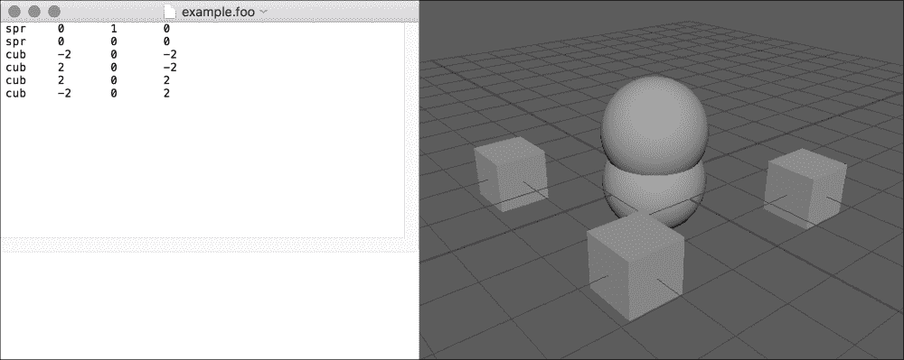

# 第八章。处理文件输入/输出

在本章中，我们将探讨通过脚本将自定义数据导入和导出 Maya 的方法：

+   使用 fileDialog2 命令导航文件系统

+   读取文本文件

+   写入文本文件

+   写入二进制数据

+   读取二进制数据

+   读取多种类型的文件

# 简介

尽管 Maya 是一个非常强大的工具，但它几乎总是更大工具链中的一步。无论你是使用 Maya 为电影和视频创建预渲染动画，还是创建用于实时应用的资产，你通常都需要将 Maya 或其中创建的内容与其他应用程序接口。这通常表现为读取或写入特定格式的数据。

在本章中，我们将探讨如何处理自定义数据格式，包括基于文本和二进制的数据，以及读取和写入数据。

# 使用 fileDialog2 命令导航文件系统

加载和保存文件几乎总是需要提示用户文件位置。在本例中，我们将探讨如何做到这一点。我们还将了解如何处理目录，包括创建新的目录。

我们将创建一个脚本，允许用户浏览当前项目目录中的`customData`文件夹中的文件。如果该文件夹不存在，则在脚本第一次运行时创建它。

## 如何操作...

创建一个新文件并添加以下内容：

```py
import os
import maya.cmds as cmds

def browseCustomData():

    projDir = cmds.internalVar(userWorkspaceDir=True)

    newDir = os.path.join(projDir, 'customData')

    if (not os.path.exists(newDir)):
        os.makedirs(newDir)

    cmds.fileDialog2(startingDirectory=newDir)

browseCustomData()
```

你将看到一个文件浏览器对话框。虽然对话框目前实际上不会做任何事情，但如果你检查你的项目目录，你会发现它现在包含一个名为`customData`的文件夹。

## 它是如何工作的...

关于这个脚本的第一点是我们在脚本开始处添加了一个额外的导入语句：

```py
import os
```

os 库（简称"操作系统"）提供了与宿主机的操作系统相关的各种功能，包括处理目录的能力。我们将使用它来检查目录是否存在，如果不存在则创建它。关于这方面的更多内容将在后面进行解释。

对于这个脚本，我们首先需要找出当前的项目目录。为此，我们可以使用`internalVar`命令。`internalVar`命令可以用来访问与当前用户环境相关的各种目录。它不能用来设置这些目录，只能用来查询它们。然而，请注意，我们实际上并没有在查询模式下使用它（Maya 的命令并不总是最一致的）。相反，我们将我们想要获取值的标志的值设置为 true。

在这种情况下，我们请求`userWorkspaceDir`，这将为我们提供当前项目目录：

```py
projDir = cmds.internalVar(userWorkspaceDir=True)
```

接下来，我们想要测试当前工作空间内是否存在`customData`文件夹。为此，我们将首先创建该目录的完整路径（如果它存在），通过将"customData"添加到`internalVar`返回的值中来实现。我们*可以*通过字符串操作来完成它，但这有点复杂，因为不同的平台可以使用不同的字符来表示目录之间的分隔符。基于 Linux 的平台（包括 Macintosh）使用"/"，而 Windows 机器使用"\"。一个更安全（因此更好的）方法是使用 Python 的`os.path.join`方法，它保证是安全的，如下所示：

```py
newDir = os.path.join(projDir, 'customData')
```

现在我们有了`customData`文件夹的完整路径，但它可能实际上并不存在。我们可以使用`os.path`模块中的另一个函数`os.path.exists`来检查它是否存在，如果不存在则创建它：

```py
if (not os.path.exists(newDir)):
```

如果我们发现路径实际上不存在，我们使用`os.makedirs`来创建它：

```py
    os.makedirs(newDir)
```

到目前为止，我们终于可以调用`fileDialog2`命令来向用户展示一个文件浏览器对话框。为了确保它从`customData`目录开始，我们将`startingDirectory`标志设置为`newDir`变量：

```py
cmds.fileDialog2(startingDirectory=newDir)
```

注意，我们使用的是`fileDialog2`，它可能看起来有点奇怪。还有一个`fileDialog`命令，但它已被弃用（连同`fileBrowserDialog`命令）。因此，我们不得不使用这个有些不雅的名称`fileDialog2`。

## 还有更多...

`fileDialog2`命令还有许多其他选项，我们将在后面的例子中看到。`internalVar`命令也有许多其他可以提供的位置。其中一个经常有用的选项是`userScriptDir`，它将提供用户的脚本目录。

如果你想要获取用户脚本目录中当前所有脚本的列表，例如，你可以使用以下代码片段：

```py
def listScripts():
    scriptDir = cmds.internalVar(userScriptDir=True)
    print(os.listdir(scriptDir))
```

`os.listdir`命令将提供一个给定目录中所有文件的数组。在这种情况下，我们可能想要创建一个 GUI，为每个脚本提供一个按钮，为用户提供一个方便的方式来选择和运行脚本。

# 读取文本文件

在这个例子中，我们将读取一个文本文件，并使用其内容在我们的场景中创建一些几何形状。

## 准备工作

为了进行任何类型的文件输入/输出，你首先需要了解你想要读取（或创建）的文件格式。在这个例子以及涉及写入文本文件的例子中，我们将使用一个示例文件格式——“foo”文件。“Foo”文件是基于文本的文件，每一行代表一个给定类型的几何原语，位于给定位置。几何原语类型由一个三字母字符串表示，其中“spr”表示球体，“cub”表示立方体。类型字符串后面跟着三个数字，分别代表项目的 X、Y 和 Z 位置。因此，一个示例`.foo`文件可能看起来像以下这样：

```py
spr    0    0    0
cub    -2   0    -2
```

虽然这肯定不是一个特别有用的格式，但它与许多常见的基于文本的格式有相似之处。例如，OBJ 格式是一个常见的 3D 模型标准，它使用类似的方法——每一行都包含一个标识符，表示它所包含的信息类型，后面跟着该条目的详细信息。例如，表示有一个位于 2、3 和 4 的顶点的行看起来如下：

```py
v 2 3 4
```

因此，我们的“foo”文件，虽然故意设计得非常简单，但将以与许多 *真实* 文件格式相同的方式进行读取和处理。

在运行此示例的脚本之前，请确保你已经创建了一个 `.foo` 文件。为此，创建一个新的文本文件并添加一些行，这些行：

+   以 "spr"（代表球体）或 "cub"（代表立方体）开始

+   后面跟着三个数字（代表 X、Y 和 Z 位置），每个数字之间用空格分隔

请确保将文件保存为 `.foo` 文件，而不是 `.txt` 文件。

## 如何操作...

创建一个新文件并添加以下代码：

```py
import maya.cmds as cmds

def processFooLine(line):

    parts = line.split()

    if (len(parts) < 4):
        cmds.error("BAD DATA " + line)

    x = float(parts[1])
    y = float(parts[2])
    z = float(parts[3])

    if (parts[0] == "spr"):
        cmds.sphere()
    elif (parts[0] == "cub"):
        cmds.polyCube()

    cmds.move(x, y, z)

def readFooFile():
    filePath = cmds.fileDialog2(fileMode=1, fileFilter="*.foo")

    fileRef = open(filePath[0], "r")

    line = fileRef.readline()
    while (line):
        processFooLine(line)
        line = fileRef.readline()

    fileRef.close()

readFooFile()
```

运行文件，你将看到一个文件对话框，允许你找到 `.foo` 文件。一旦指定了一个包含有效 FOO 文件数据的文件，你应该会看到一些球体和立方体被创建。



## 它是如何工作的...

在脚本中，我们首先调用 `fileDialog2` 命令，以便让用户指定一个文件。我们将 `fileMode` 标志设置为 1，表示我们想要读取（而不是写入）文件。我们还使用了 `fileFilter` 标志，以便将用户指向我们的自定义文件格式。这是完全可选的，但它可以是一种防止用户给你错误类型数据的好方法。为此，我们需要向 Maya 提供两样东西：

+   一个简短的文件类型描述，以显示给用户，以及

+   一个或多个文件扩展名，后面跟着一个通配符字符（"*"）

因此，在这种情况下，我们希望限制用户只能打开“FOO”文件，并将这些文件识别为以 `.foo` 或 `.fo` 结尾的任何内容。要传递的字符串的最终值如下：

```py
"FOO files (*.foo *.fo)"
```

注意，我们也可以允许用户打开其他类型的文件，通过用双分号分隔每个字符串来实现。假设我们想要允许用户打开文本（`.txt`）文件。为此，我们的 `fileDialog2` 调用将如下所示：

```py
cmds.fileDialog2(fileMode=1, fileFilter="FOO files (*.foo *.fo);;Text files (*.txt)")
```

如果你允许用户打开多种类型的文件，每种类型都会在文件对话框底部的下拉菜单中可用。通过从下拉菜单中选择一个选项，用户可以更改对话框将接受的文件类型。现在我们已经涵盖了指定文件类型，让我们回到我们的常规示例。

我们将 `fileDialog` 的输出存储到一个变量中。在继续之前，我们还会检查该变量是否不为空。这样，我们就能确保如果用户点击了“取消”按钮，我们不会继续执行脚本：

```py
    filePath = cmds.fileDialog2(fileMode=1, fileFilter="FOO files (*.foo *.fo);;Text files (*.txt)")

    if (filePath == None):
        return
```

现在我们准备实际打开文件。为了做到这一点，我们使用 Python 的`open`命令，第一个参数是我们想要打开的文件的完整路径，第二个参数指示以何种模式打开文件，其中`"r"`表示“读取”：

```py
    fileRef = open(filePath[0], "r")
```

注意`filePath`是一个数组，因此我们需要将第一个元素传递给 open 命令。open 的返回值，我们将其存储在`fileRef`变量中，是对文件的引用，我们可以用它来读取数据。

对于大多数基于文本的文件类型（FOO 文件也不例外），我们希望逐行读取文件。我们首先从文件引用中读取一行：

```py
    line = fileRef.readline()
```

一旦我们做了这些，我们想要：

1.  处理我们刚刚读取的行中的信息

1.  从文件中读取下一行

1.  继续读取直到我们阅读完整个文件

这可以通过一个 while 循环轻松完成。处理将由一个单独的函数来处理，我们将在下一部分看到：

```py
    while (line):
        processFooLine(line)
        line = fileRef.readline()
```

一旦我们到达文件的末尾，我们的行变量将为空，while 循环将终止。我们最后要做的事情是做一些清理工作，即关闭对文件的引用：

```py
    fileRef.close()
```

现在，让我们更仔细地看看我们如何在`processFooLine`函数中处理数据。我们首先使用 Python 的`split`函数将行拆分成部分。这将把输入字符串拆分成一个字符串数组，默认情况下是根据空白字符分隔的：

```py
parts = line.split()

if (len(parts) < 4):
    cmds.error("BAD DATA " + line)
```

因为我们的 FOO 文件规范指出，每一行应该是一个简短的字符串，后面跟着三个数字，所以如果我们的部分数组少于四个条目，我们会抛出一个错误。如果它至少有四个条目，我们将第二个、第三个和第四个条目转换为浮点数并将它们存储到变量中，用于*x*、*y*和*z*位置：

```py
x = float(parts[1])
y = float(parts[2])
z = float(parts[3])
```

现在我们根据部件数组中的第一个条目创建对象，要么是一个球体，要么是一个立方体：

```py
if (parts[0] == "spr"):
    cmds.sphere()
elif (parts[0] == "cub"):
    cmds.polyCube()
```

最后，我们将我们刚刚创建的对象移动到我们的`x`、`y`和`z`变量所指示的位置：

```py
cmds.move(x, y, z)
```

## 还有更多...

尽管 FOO 格式规范有意简化，但我们很容易扩展它来存储更多信息或可能的可选信息。例如，我们可能还有一个可选的第五项来指示要创建的对象的大小（例如，立方体的面宽和球体的半径）。如果您想看看一个表面上类似于 FOO 文件但更有用的格式，我鼓励您查看 OBJ 文件格式。它不仅在 3D 中广泛使用，而且相对简单易懂，因此是文件解析的绝佳入门。

# 编写文本文件

在前面的例子中，我们探讨了如何读取自定义数据文件格式并使用它来创建场景中的几何形状。在这个例子中，我们将做相反的事情，即检查我们的场景中的多边形立方体和 NURBS 球体，并将我们找到的每个对象的坐标写入一个新的 FOO 文件。在这个过程中，我们将看到如何将数据写入自定义文本格式。

## 准备工作

在运行此示例之前，请确保场景中包含一些（NURBS）球体和多边形立方体。请确保创建的立方体和球体启用了构建历史，否则我们的脚本将无法正确识别几何形状。

## 如何做到这一点...

创建一个新文件并添加以下代码：

```py
import maya.cmds as cmds

def checkHistory(obj):
    history = cmds.listHistory(obj)

    geoType = ""

    for h in history:

        if (h.startswith("makeNurbSphere")):
            geoType = "spr"

        if (h.startswith("polyCube")):
            geoType = "cub"

    return geoType

def writeFOO():

    filePath = cmds.fileDialog2(fileMode=0, fileFilter="FOO files (*.foo)")

    if (filePath == None):
        return

    fileRef = open(filePath[0], "w")

    objects = cmds.ls(type="transform")

    for obj in objects:
        geoType = checkHistory(obj)

        if (geoType != ""):

            position = cmds.xform(obj, query=True, translation=True, worldSpace=True)
            positionString = " ".join(format(x, ".3f") for x in position)

            newLine = geoType + " " + positionString + "\n"
            fileRef.write(newLine)

    fileRef.close()

writeFOO()
```

## 它是如何工作的...

我们首先提示用户指定一个文件。与文件读取示例一样，我们设置 `fileFilter` 标志，以便对话框仅限于 .foo 文件。不过，这次我们将 `fileMode` 标志设置为 0，表示我们想要写入文件（而不是值为 1，表示读取）：

```py
filePath = cmds.fileDialog2(fileMode=0, fileFilter="FOO files (*.foo)")
```

如果 `fileDialog2` 命令的结果为空（表示用户取消了），我们停止。否则，我们继续执行脚本并打开指定的文件进行写入。再次注意，`fileDialog2` 命令返回了一个数组，这意味着我们需要将其第一个条目传递给 open 命令。我们还设置了第二个参数为 `"w"`，表示我们想要写入文件：

```py
if (filePath == None):
    return

fileRef = open(filePath[0], "w")
```

接下来，我们需要找到场景中的所有立方体和球体。为此，我们首先获取场景中的所有变换节点。

```py
objects = cmds.ls(type="transform")
```

对于每个对象，我们想知道它是否是球体或立方体。一种方法是通过检查对象的构建历史，看看是否有 `makeNurbSphere` 或 `polyCube` 节点。为了保持事情整洁有序，我们将它封装在一个单独的函数 `checkHistory` 中。

要获取给定对象的 历史，我们可以使用 `listHistory` 命令，它将以数组的形式返回构建历史：

```py
def checkHistory(obj):
    history = cmds.listHistory(obj)
```

一旦我们完成了这个，我们就准备好遍历历史记录，看看我们是否能找到我们正在寻找的几何形状。但首先，我们设置一个变量来保存几何类型，并将其初始化为空字符串：

```py
geoType = ""
```

如果所讨论的对象确实是我们要寻找的类型之一，它在其历史记录中将有 `makeNurbSphere` 或 `polyCube` 节点。然而，在两种情况下，节点名称的末尾都将有一个数字。因此，我们需要使用 Python 的 `startswith` 命令来进行检查，而不是仅仅测试直接相等。

如果我们找到了我们正在寻找的几何创建节点之一，我们将我们的 `geoType` 字符串设置为适当的缩写（基于 FOO 文件格式规范）：

```py
for h in history:

    if (h.startswith("makeNurbSphere")):
        geoType = "spr"

    if (h.startswith("polyCube")):
        geoType = "cub"
```

最后，我们返回 `geoType` 变量：

```py
return geoType
```

所有这些的结果是，我们将为想要导出的对象有 "spr" 或 "cub"，而对于其他所有内容则为空字符串。有了这个，我们可以将注意力转回到我们的主函数。

带着我们的 `checkHistory` 函数，我们现在准备好遍历场景中的所有对象，测试每个对象以查看它是否是我们感兴趣的几何形状：

```py
for obj in objects:
    geoType = checkHistory(obj)

    if (geoType != ""):
```

如果`checkHistory`返回的值**不是**空字符串，我们知道我们有一些东西想要写入我们的文件。我们已经知道几何类型，但仍然需要获取世界空间位置。为此，我们使用`xform`命令，以查询模式。

```py
position = cmds.xform(obj, query=True, translation=True, worldSpace=True)
```

现在我们终于准备好将数据写入我们的文件了。我们需要构建一个具有以下格式的字符串：

```py
[geometry type ID] [x position] [y position] [z position]
```

我们将从`xform`接收到的位置创建一个字符串。位置最初是一个浮点数数组，我们需要将其转换成一个单一的字符串。这意味着我们需要做两件事：

1.  将数字转换为字符串。

1.  将字符串连接成一个单一的字符串。

如果我们有一个字符串数组，我们可以使用 Python 的`join`命令将它们连接起来。该命令的语法有点奇怪，但使用起来足够简单；我们从一个字符串开始，该字符串包含我们想要用作分隔符的内容。在这种情况下（以及大多数情况下），我们想要使用一个空格。然后我们调用该字符串上的 join，传入我们想要连接的元素列表。所以，如果位置数组包含字符串，我们可以这样做：

```py
positionString = " ".join(position)
```

然而，事情并不那么简单，因为位置数组包含浮点值。因此，在我们运行 join 之前，我们需要首先将数值转换为字符串。如果我们只想做这件事，我们可以这样做：

```py
positionString = " ".join(map(str, position))
```

在前面的代码中，我们使用 Python 的`map`函数将第一个参数（`str`或字符串函数）应用于第二个参数（位置数组）的每个元素。这把位置数组转换成了一个字符串数组，然后我们可以将其传递给 join 函数。

然而，我们可能想要对浮点数的格式化有更多的控制，这让我们来到了我们实际使用的行，即：

```py
positionString = " ".join(format(x, ".3f") for x in position)
```

这与基于 map 的例子有点相似，我们在将内容传递给 join 函数之前，先对位置数组应用一个函数。然而，在这种情况下，我们使用`format`函数，这让我们对浮点数格式化的具体细节有更多的控制。在这种情况下，我们限制值的精度为三位小数。

在这一点上，我们已经有了一个字符串，表示当前对象的全位置。为了完成它，我们需要添加几何类型标识符（如我们的 FOO 文件格式规范中指定）。我们还想在末尾添加一个换行符（`\n`），以确保每条几何数据都有单独的一行。

### 注意

注意，如果你在 Windows 机器上的记事本中打开创建的文件，你会看到所有数据都显示为单行。这是因为类 Unix 系统（包括 Mac）使用`\n`作为换行符，而 Windows 使用`\r\n`。`\r`是回车符，而`\n`是换行符。使用两者是打字机在旧时代移动到下一行时执行两个动作的副产品——将纸张完全移到右边（`\r`）并将其向上移动（`\n`）。如果你在 Windows 上工作，你可能想添加`\r\n`而不是仅仅`\n`。

这给我们以下结果：

```py
newLine = geoType + " " + positionString + "\n"
```

现在我们终于准备好将数据写入文件了。这可以通过调用我们文件的`write()`方法轻松完成：

```py
fileRef.write(newLine)
```

一旦我们完成了对所有对象的循环遍历并保存了所有数据，我们通过关闭文件引用来完成操作：

```py
fileRef.close()
```

## 还有更多...

本节中提供的示例可能看起来有点人为，但导出位置数据是一个相当常见的需求。通常情况下，对于艺术团队来说，使用 Maya 定位后来以编程方式使用的对象（例如，在游戏的情况下，生成点或物品拾取位置）可能更容易。

在这个例子中，我们通过检查它们的构建历史来识别要导出的对象。这可以工作，但如果构建历史被删除，它很容易被破坏。由于删除历史记录是常见的事情，因此拥有识别导出节点的替代方法是个好主意。

一种非常可靠的方法是为应该导出的节点添加自定义属性，并在遍历对象时使用它。例如，我们可能使用多边形立方体来指示游戏关卡中某些类型物品拾取的位置。为了更好地准备导出数据，我们可以在每个立方体上添加一个`pickupType`属性。

我们可以轻松地将它包装在一个漂亮的函数中，以添加属性并设置其值，如下所示：

```py
def markAsPickup(obj, pickupType):
    customAtts = cmds.listAttr(obj, userDefined=True)

    if ("pickupType" not in customAtts):
        cmds.addAttr(obj, longName="pickupType", keyable=True)

    cmds.setAttr(obj + ".pickupType", pickupType)
```

上述代码将为指定的对象添加一个可键控的`pickupType`属性并设置其值。请注意，我们在添加属性之前检查节点上是否存在`pickupType`属性，因为添加已存在的属性将生成错误。为了检查属性，我们首先获取所有用户定义属性的列表，然后测试`pickupType`是否存在于该数组中。

当我们准备好导出数据时，我们可以使用同样的技巧来识别我们想要导出数据的对象。如果我们想为具有`pickupType`属性的每个对象写入数据，我们可以这样做：

```py
def listPickups():
    pickups = []
    objects = cmds.ls(type="transform")

    for obj in objects:
        customAtts = cmds.listAttr(obj, userDefined=True)
        if (customAtts != None):
            if ("pickupType" in customAtts):
                print(obj)
                pickups.append(obj)

return pickups
```

我们首先创建一个新的列表来保存我们的拾取，然后获取场景中所有的变换节点。对于每个变换，我们获取添加到它上的所有自定义属性，并检查是否有任何属性被命名为`pickupType`。如果是这样，我们将对象添加到我们的列表中。一旦我们完成循环，我们就返回列表，以便在其他地方使用（可能用于写入它们的位置）。

## 参见

对于 FOO 文件格式的快速概述，请务必查看有关读取基于文本数据的先前示例。

# 写入二进制数据

到目前为止，在本章中，我们已查看读取和写入基于文本的数据格式。这将允许您处理许多类型的数据（并轻松创建自己的格式），但这只是问题的一半。在本例中，我们将查看另一半——二进制格式。

## 准备工作

在这个示例中，我们将编写我们的 FOO 文件的二进制版本。我们将这样的文件称为 FOB（foo，二进制）。与 FOO 文件一样，FOB 文件是真实格式中常见类型的一个简化示例。FOB 文件将包含我们在 FOO 文件中看到的数据，即对象类型和位置的列表，但以二进制格式常见的方式存储。

大多数二进制文件由两个主要部分组成：

+   一个标题，它是一个固定大小的块，描述了文档其余部分的内容。

+   根据标题中指定的数据布局读取的条目。

在我们的 FOB 文件的情况下，我们的标题将包含以下内容：

+   一个整数（1 字节），指定每个条目用于几何类型指定的字符数（我们的“spr”或“cub”）。

+   一个整数（1 字节），指定每个对象的最大属性数（至少是 X、Y 和 Z 位置，可能还有更多数据）。

+   一个整数（1 字节），指定每个属性的字节数。

因此，一个特定的 FOB 文件可能声明我们使用三个字节来表示几何类型，最大数据值数量为四个（X、Y、Z 位置和大小），每个值使用四个字节。这将给我们一个如下所示的标题：

```py
3 4 4
```

在标题之后，将有一些条目，每个条目由 19 字节组成（3 个用于几何类型，加上 4 * 4，即 16 个字节的用于数据）。

在运行示例之前，请确保您的场景中有一个或多个 NURBS 球体和/或多边形立方体，并且它们是在启用构造历史记录的情况下创建的（默认选项）。

## 如何做到这一点...

创建一个新文件并添加以下代码：

```py
import maya.cmds as cmds
import struct

def checkHistory(obj):
    history = cmds.listHistory(obj)

    geoType = ""

    for h in history:

        if (h.startswith("makeNurbSphere")):
            geoType = "spr"

        if (h.startswith("polyCube")):
            geoType = "cub"

    return geoType

def writeFOBHeader(f):
    headerStr = 'iii'
    f.write(struct.pack(headerStr, 3, 3, 4))

def writeObjData(obj, geoType, f):

    position = cmds.xform(obj, query=True, translation=True, worldSpace=True)

    f.write(geoType)

    f.write(struct.pack('fff', position[0], position[1], position[2]))

def saveFOBFile():
    filePath = cmds.fileDialog2(fileMode=0, fileFilter="FOO Binary files (*.fob)")

    if (filePath == None):
        return

    fileRef = open(filePath[0], "wb")

    writeFOBHeader(fileRef)
    objects = cmds.ls(type="transform")

    for obj in objects:
        geoType = checkHistory(obj)

        if (geoType != ""):

            writeObjData(obj, geoType, fileRef)
            # positionString = " ".join(format(x, ".3f") for x in position)

    fileRef.close()

saveFOBFile()
```

## 它是如何工作的...

首先要注意的是，我们在脚本的开始处有一个额外的导入语句：

```py
import struct
```

`struct`库提供了我们将用于正确格式化数据以写入二进制的函数。更多内容将在稍后介绍。接下来是脚本本身...

首先，我们要求用户指定一个文件，就像我们在前面的示例中所做的那样。唯一的区别是我们稍微改变了`fileFilter`参数，以指定具有`.fob`扩展名的“FOO 二进制”类型的文件：

```py
filePath = cmds.fileDialog2(fileMode=0, fileFilter="FOO Binary files (*.fob)")
```

我们检查以确保`filePath`变量有一个实际值（用户没有取消），如果没有，则停止脚本。然后我们打开文件进行写入：

```py
fileRef = open(filePath[0], "wb")
```

注意，我们使用`"wb"`而不是`"w"`作为 open 命令的参数；这告诉 Python 我们想要以二进制模式（`"b"`）打开文件进行写入（`"w"`）。

现在，我们准备开始写入我们的文件。在我们能够写入任何数据之前，我们需要写入标题。在 FOB 文件的情况下，所有这些都是三个整数——一个用于存储几何标识符的字符数，一个用于存储每个对象的数据点数，一个用于存储每个数据点的字节数。

要实际写入数据，我们将使用`struct`库的 pack 函数。pack 函数将创建一个包含指定格式的数据的字节序列，该格式由格式字符串指定。格式字符串是一系列字符，其中每个字符代表要写入的数据类型。字符可以是以下任何一种以及许多其他类型：

| i | 整数 |
| --- | --- |
| f | 浮点数 |
| c | 字符 |

对于完整列表，请参阅 Python 的文档。

在这种情况下，我们希望存储三个整数，因此我们的格式字符串需要由三个 I 组成，如下所示：

```py
headerStr = 'iii'
```

我们将格式字符串传递给`struct.pack`函数，后面跟着我们想要编码的值（在这种情况下，三个整数）。在这种情况下，我们希望为我们的几何标识符长度保留三个字符（以容纳"spr"和"cub"），三个数据点（X、Y 和 Z 位置），以及每个数据点四个字节。将这些全部放在一起，我们得到以下内容：

```py
struct.pack(headerStr, 3, 3, 4)
```

一旦我们将数据打包，我们就使用`write`将其写入我们的文件。我们将所有这些封装在一个漂亮的功能中，如下所示：

```py
def writeFOBHeader(f):
    headerStr = 'iii'
    f.write(struct.pack(headerStr, 3, 3, 4))
```

现在我们已经将标题写入文件，我们准备写入我们的对象数据。我们遍历场景，以与示例中保存文本数据相同的方式找到所有球体和立方体。对于我们找到的每个对象，我们将数据写入我们的文件。

```py
for obj in objects:
    geoType = checkHistory(obj)

    if (geoType != ""):
        writeObjData(obj, geoType, fileRef)
```

我们的`writeObjData`函数接受对象本身、对象类型字符串（由我们的`checkHistory`函数从文本输出示例中确定）以及我们正在写入的文件的引用。

在`writeObjData`函数中，我们首先使用`xform`命令获取对象在世界空间中的位置：

```py
position = cmds.xform(obj, query=True, translation=True, worldSpace=True)
```

我们然后将几何类型标识符（"spr"或"cub"）写入文件。向二进制文件写入文本很容易——我们只需直接写入值。这将导致写入文件中的每个字符都是一个字节。

```py
f.write(geoType)
```

最后，我们再次使用`struct.pack`函数将位置数据写入文件。然而，这次我们想要写入浮点值，因此我们使用三个 fs 作为格式字符串：

```py
f.write(struct.pack('fff', position[0], position[1], position[2]))
```

最后，回到我们的 main 函数中，我们关闭我们的文件，该文件现在包含标题和所有我们的数据。

```py
fileRef.close()
```

## 还有更多...

我们可以轻松地写出每个对象除了位置数据之外的数据。如果我们想要为每个球体写出半径值，我们需要做一些事情，即：

1.  将我们的标题更改为指定每个对象四个值，而不是仅仅三个。

1.  将传递给 pack 的格式字符串中的三个 fs 改为四个。

注意，尽管在立方体的情况下半径值没有意义，我们仍然需要在那个位置写上*某些东西*，以确保每个条目占用相同数量的字节。由于二进制文件通常通过一次读取一定数量的字节来处理，因此从条目到条目字节宽度发生变化将会干扰这个过程。

如果你认为这是一个限制，你是对的。二进制格式通常比基于文本的格式要严格得多，而且只有在你需要创建非常紧凑的文件时才值得。一般来说，如果你在考虑创建自定义格式，文本几乎总是更好的选择。将二进制输出保留在需要将数据输出到现有格式且该格式恰好是二进制的情况。

# 读取二进制数据

在这个示例中，我们将查看如何读取二进制数据。我们将使用相同的示例格式，即"FOO 二进制"格式，该格式包含一个包含三个整数的头部，后面跟着一个或多个条目，每个条目都有一个标识对象类型的字符串和三个或更多表示其位置的数字（以及可能的其他数据）。

## 准备工作

为了运行这个示例，你需要准备好一个`.fob`文件。手动创建二进制文件有点麻烦，所以我建议使用前面解释的示例为你生成一个。

## 如何做到这一点...

创建一个新文件并添加以下代码：

```py
import maya.cmds as cmds
import struct

def makeObject(objType, pos):

    newObj = None

    if (objType == "spr"):
        newObj = cmds.sphere()
    elif (objType == "cub"):
        newObj = cmds.polyCube()

    if (newObj != None):
        cmds.move(pos[0], pos[1], pos[2])

def readFOBFile():
    filePath = cmds.fileDialog2(fileMode=1, fileFilter="FOO binary files (*.fob)")

    if (filePath == None):
        return

    f = open(filePath[0], "rb")

    data = f.read()

    headerLen = 12

    res = struct.unpack('iii', data[0:headerLen])

    geoTypeLen = res[0]
    numData = res[1]
    bytesPerData = res[2]

    objectLen = geoTypeLen + (numData * bytesPerData)

    numEntries = (len(data) - headerLen) / objectLen

    dataStr = 'f'*numData

    for i in range(0,numEntries):
        start = (i * objectLen) + headerLen 
        end = start + geoTypeLen

        geoType = data[start:end]

        start = end
        end = start + (numData * bytesPerData)

        pos = struct.unpack(dataStr, data[start:end])
        makeObject(geoType, pos)

    f.close()

readFOBFile()
```

运行脚本，指向一个有效的.fob 文件，你应该在你的场景中看到一些球体和/或立方体。

## 它是如何工作的...

在这个示例中，我们还将使用 struct 库（来解包我们的数据），因此我们需要确保我们导入了它：

```py
import struct
```

我们首先使用`fileDialog2`命令提示用户指定一个.fob 文件，如果没有提供任何内容，则退出脚本：

```py
filePath = cmds.fileDialog2(fileMode=1, fileFilter="FOO binary files (*.fob)")

if (filePath == None):
    return
```

如果我们有文件要打开，我们使用`open`命令打开它，传递`"rb"`作为模式（`"r"`表示读取和`"b"`表示二进制）：

```py
f = open(filePath[0], "rb")
```

一旦文件打开，我们一次性读取所有数据，使用`read`函数：

```py
data = f.read()
```

这将导致数据包含文件中所有字节的数组。一旦我们完成这个操作，我们就可以开始解析我们的内容了。对于读取的每份数据，我们将执行以下操作：

1.  从我们的数据变量中读取一些字节。

1.  将字节传递给`struct.unpack`，同时传递一个格式字符串，指示它应该解释为哪种类型的数据。

我们首先需要读取文件的头部。在.fob 文件的情况下，这保证总是正好 12 字节——3 个整数，每个 4 字节。因此，我们首先读取数据数组中的前 12 字节，并将其传递给`struct.unpack`。我们使用的格式字符串将是"iii"，表示字节应该被解释为三个整数：

```py
    headerLen = 12
    res = struct.unpack('iii', data[0:headerLen])
```

`unpack` 函数的输出是一个包含数据的数组。在这种情况下，我们有几何标识符的每个字节数、每个条目的数据点数以及每个数据点的字节数。为了使事情更容易（并且代码更易于阅读），我们将每个元素存储在其自己的、命名的变量中：

```py
geoTypeLen = res[0]
numData = res[1]
bytesPerData = res[2]
```

一旦我们完成了这个步骤，为了使接下来的内容更加清晰，我们还会做一件事——按照以下方式计算每个条目所需的字节数：

```py
objectLen = geoTypeLen + (numData * bytesPerData)
```

一旦我们有了这个，我们可以通过将总字节数（减去头部长度消耗的字节数）除以每个条目的字节数来确定文件中的条目总数：

```py
numEntries = (len(data) - headerLen) / objectLen
```

在读取数据之前，我们还需要处理一个细节；我们希望创建一个用于 `struct.unpack` 的格式字符串。在 `.fob` 文件的情况下，几何标识符字符串之后的所有内容都将是一个浮点数，但我们需要确保考虑到头中指定的条目数量。因此，如果我们每个对象有三个条目，我们将需要 "fff"，但如果我们有四个，我们则需要 "ffff"。Python 通过乘法轻松地从给定数量的重复字符创建字符串，这给我们以下结果：

```py
dataStr = 'f'*numData
```

这样，我们就完成了准备工作，可以继续实际读取我们的数据。我们从一个循环开始，循环次数为我们之前找到的条目数量：

```py
    for i in range(0,numEntries):
```

计算所需读取的索引的数学运算并不复杂，但可能会变得混乱，因此我们使用几个变量将它们拆分到单独的行上。

每个条目的起始字节是到目前为止读取的条目数量乘以每个条目的总长度，然后减去头部长度。结束索引是起始字节加上头部长度：

```py
start = (i * objectLen) + headerLen 
end = start + geoTypeLen
```

读取几何标识符很容易，因为它只是文本，每个字节对应一个字母：

```py
geoType = data[start:end]
```

现在，我们将起始和结束变量设置为新的值来读取位置（以及可能的其他）数据。我们将起始设置为结束的前一个值。这是因为当从 Python 数组中读取一系列索引时，读取的值从第一个数字开始，读取到（但不包括）第二个数字。

数据的结束索引是起始字节加上数据的总字节数（`numData * bytesPerData`）：

```py
start = end
end = start + (numData * bytesPerData)
```

并且有了这个，我们最终可以读取我们对象的 数据。我们在数据数组中进行索引，并将结果传递给 `struct.unpack`，同时附带我们之前创建的格式字符串（`dataStr`）：

```py
pos = struct.unpack(dataStr, data[start:end])
```

一旦我们有了几何类型（`geoType`）和位置（`pos`），我们就将两者传递到一个函数中，以实际创建我们想要的几何形状：

```py
makeObject(geoType, pos)
```

`makeObject` 函数相当直接——我们使用 `geoType` 参数创建两种可能的对象之一，如果成功，我们将创建的对象移动到 `pos` 数组中指定的位置：

```py
def makeObject(objType, pos):

    newObj = None

    if (objType == "spr"):
        newObj = cmds.sphere()
    elif (objType == "cub"):
        newObj = cmds.polyCube()

    if (newObj != None):
        cmds.move(pos[0], pos[1], pos[2])
```

## 还有更多...

到目前为止，我们只读取（或写入）了单一类型的二进制数据，例如整数（用于我们的标题）和浮点数（用于数据）。`struct.pack`和`struct.unpack`函数也可以与混合类型一起使用，只要你使用正确的格式字符串。例如，如果我们知道我们的标题包含三个浮点数和一个整数，我们可以使用以下代码来读取它：

```py
struct.unpack('fffi', data[0:16])
```

注意，前面的代码使用 0 和 16 作为起始和结束索引，这可能会让人觉得我们在抓取 17 个字节。然而，Python 将范围解释为从开始到（但不包括）第二个。所以，我们真正说的是使用从 0 到（16-1），即 15 的索引。

# 读取多种类型的文件

有时候，你可能需要一个能够读取多种文件类型的单一脚本。例如，如果你正在构建一个复杂的系统来构建角色骨架，你可能希望有一个自定义格式来保存默认骨骼布局的信息，另一个类型来存储动画设置的信息，使用户能够混合和匹配任意两个文件。

在这些情况下，你可能希望你的脚本能够处理具有多个扩展名的文件——每个类型一个。在这个例子中，我们将通过创建一个可以用来读取 FOO（我们的示例基于文本的格式）或 FOB（我们的示例二进制格式）的脚本来查看如何做到这一点。

## 准备工作

确保你至少有一个每种类型的文件。对于 FOO 文件，你可以在文本编辑器中直接创建它们。对于 FOB 文件，最好使用写作二进制文件的示例中的脚本。

## 如何做到...

创建一个新文件并添加以下代码：

```py
import maya.cmds as cmds
import struct
import os

def readMultipleTypes():

    fileRes = cmds.fileDialog2(fileMode=1, fileFilter="FOO files(*.foo);;FOO binary files (*.fob)")

    if (fileRes == None):
        return

    filePath = fileRes[0]

    pathParts = os.path.splitext(filePath)
    extension = pathParts[1]

    if (extension == ".foo"):
        readFOOFile(filePath)
    elif (extension == ".fob"):
        readFOBFile(filePath)
    else:
        cmds.error("unrecognized file type")

readMultipleTypes()
```

注意，前面的代码使用了两个我们尚未定义的函数，即`readFOOFile`和`readFOBFile`。为了简洁，我省略了这些函数，但它们都使用了我们在之前示例中讨论的读取文本和二进制文件的相同代码。

如果你运行这个脚本，你将能够选择 FOO 文件，或者通过从文件类型下拉列表中选择“FOO 二进制文件”，选择 FOB 文件。无论哪种方式，你应该能看到相应的球体和立方体集合被添加到场景中。

## 它是如何工作的...

为了读取多个文件，我们首先必须将两种或更多类型添加到`fileFilter`参数中，用双分号分隔，如下所示：

```py
FOO files(*.foo);;FOO binary files (*.fob)
```

除了这个之外，`fileDialog2`命令的使用方式与我们过去使用的方式相同。一旦我们得到命令的结果，我们将第一个条目（用户选择的路径）存储到`filePath`变量中。

一旦我们完成了这个，我们希望检查用户选择的文件扩展名。我们可以使用字符串函数来做这件事，但依靠 Python 的`os.path.splitext`函数会更安全一些，该函数专门设计用来从路径中分离扩展名，返回的是一个包含路径（包括文件名）和扩展名的数组：

```py
    filePath = fileRes[0]

    pathParts = os.path.splitext(filePath)
    extension = pathParts[1]
```

一旦我们有了扩展名，我们就将其与我们要处理的全部类型进行测试，为每种类型调用相应的函数：

```py
if (extension == ".foo"):
    readFOOFile(filePath)
elif (extension == ".fob"):
    readFOBFile(filePath)
else:
    cmds.error("unrecognized file type")
```

对于每种文件类型，我们调用一个函数来处理实际的文件处理，传入文件的路径。如果用户意外地选择了一个我们不处理的文件类型，我们通过抛出错误来结束操作。

## 还有更多...

你当然可以将这种方法扩展到单个脚本中处理多种文件类型，尽管如果你有很多种类型，从下拉菜单中选择合适的类型可能会让用户感到疲惫。

在这种情况下，你可能只想完全省略`fileFilter`，让脚本接受所有文件类型，并依赖扩展过滤逻辑来过滤掉你不想处理的任何类型。

然而，在实践中，如果你确实在处理大量不同的文件类型，你的脚本可能试图做太多事情。考虑将其拆分成更小的组件，每个组件都专注于为你构建的特定过程子集。
