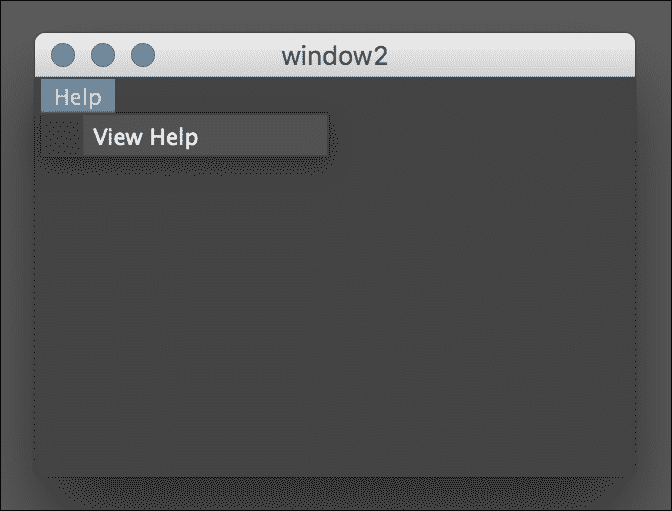

# 第九章。与 Web 通信

在本章中，我们将探讨以下方法，通过发送和接收 Web 请求，让你的脚本与外界进行通信：

+   从脚本中打开网页

+   从服务器获取数据

+   处理 XML 数据

+   处理 JSON 数据

+   从 Maya 向网络服务器发送 POST 数据

# 简介

在上一章中，我们探讨了如何读取和写入数据到磁盘，这对于构建团队的工具链和管道来说是一种很好的方法。然而，你几乎总是作为团队的一部分（或者作为 TD 支持团队）工作，这意味着你通常想要将数据读取和写入某个中央存储库。

为了做到这一点，你可能需要与某种类型的网络服务器进行通信。在本章中，我们将探讨如何做到这一点——如何从 Web 上拉取数据和推送到 Web。

# 从脚本中打开网页

如果你发现自己正在编写一个复杂的脚本，提供以网页形式存在的脚本文档通常很有帮助。一个很好的方法是通过提供一种简单的方式来向用户展示该页面。在本例中，我们将创建一个简单的脚本，该脚本将在用户的默认网络浏览器中打开指定的 URL。

## 如何做到这一点...

创建一个新的脚本并添加以下代码：

```py
import maya.cmds as cmds

def showHelp():
    cmds.showHelp("http://www.adrianherbez.net", absolute=True)

showHelp()
```

运行脚本，你将在默认浏览器中看到指定的 URL 出现。

## 它是如何工作的...

我们在这里真正做的是使用 `showHelp` 命令。这有点误导，因为 `showHelp` 命令也用于显示 Maya 对特定命令的文档。然而，只要将绝对标志设置为 true，你就可以传递一个你想要打开的 URL 的完整路径：

```py
cmds.showHelp("http://www.adrianherbez.net", absolute=True)
```

注意，你可能遇到一些已弃用的命令，它们不再工作。在 Maya 的旧版本中，有一个 `webBrowser` 命令，它允许在基于脚本的 UI 中包含网页内容。不幸的是，该命令已被删除，需要使用 `showHelp` 命令在浏览器中打开内容。

## 还有更多...

如果你的脚本足够复杂，需要一页文档，那么它很可能还包括（可能是复杂的）UI。与其只提供一个显示帮助的按钮，不如轻松实现一个“帮助”菜单，这在其他程序中很常见。



这可以通过菜单和 `menuItem` 命令轻松完成。以下是生成前面结果的完整列表：

```py
import maya.cmds as cmds

class helpWin():

    def __init__(self):
        self.win = cmds.window(menuBar=True, width=300, height=200)
        cmds.menu(label="Help", helpMenu=True)
        cmds.menuItem(label="View Help", command=self.showHelp)
        cmds.columnLayout()
        cmds.showWindow(self.win)

    def showHelp(self, args):
        cmds.showHelp("http://www.adrianherbez.net", absolute=True)

helpWin()
```

我们首先创建一个窗口，就像我们在之前的例子中所做的那样。然后，我们使用 `menu` 命令添加一个新的菜单。标签是将在菜单顶部显示的文本，指定 `helpMenu=True` 确保这个特定的菜单将被视为帮助菜单（显示在所有菜单选项的最右侧）。

一旦我们有了菜单，我们就可以向其中添加菜单项。这很像添加一个按钮，我们指定一个标签和一个当项目被选中时将执行的命令。

注意，新的`menuItem`将被添加到最新的菜单中。要添加不同菜单中的菜单项（例如，同时拥有“文件”和“帮助”类别），确保在添加其他项之前调用`cmds.menu`来启动一个新的菜单。

# 从服务器获取数据

在这个例子中，我们将查看从给定 URL 获取数据的最简单方法，使用 Python 的内置`urllib2`库。

## 准备工作

你需要确保你有一个要获取的 URL。你可以使用任何你喜欢的网站，但为了测试的目的，在你的本地机器上有一个最小的页面可能会有所帮助。如果你想那样做，首先创建一个简单的 html 文件，如下所示：

```py
<html>
    <head>
        <title>
            Maya scripting chapter 9
        </title>
    </head>
    <body>
        HELLO FROM THE WEB
    </body>
</html>
```

一旦你做了这些，你将希望在自己的机器上提供这些内容作为页面。Python 提供了一种非常简单的方式来做到这一点。打开命令行（mac 上的终端）并导航到你保存 html 文件的地方。从那里，输入以下命令：

```py
python -m SimpleHTTPServer
```

这将导致 Python 将当前目录的内容作为网站在本地主机上提供服务。`-m`标志告诉 Python 在运行解释器时包含一个给定的模块（在本例中为`SimpleHTTPServer`）。这相当于在 Python 脚本开头使用以下命令：

```py
import SimpleHTTPServer
```

默认情况下，当前目录的内容将在端口 8000 上提供服务，这意味着你可以通过打开浏览器并访问以下链接来访问内容：

```py
http://localhost:8000/
```

## 如何做到这一点...

创建一个新文件并添加以下代码：

```py
import maya.cmds as cmds
import urllib2

def getWebData():
    url = 'http://localhost:8000'

    print('grabbing web data from ', url)

    try:
        web = urllib2.urlopen(url)

    except Exception as e:
        print("ERROR: ", e)
        return

    print(web.getcode())
    print(web.info())
    print(web.read())

getWebData()
```

确保你已经在某个地方创建了一个`index.htm`（或 html）文件，并且已经从该目录运行了`python -m SimpleHTTPServer`。如果你已经那样做了，运行前面的脚本应该会输出以下内容，然后是整个`index.htm`文件的内容：

```py
200
Server: SimpleHTTP/0.6 Python/2.7.10
Date: Tue, 26 Apr 2016 19:08:08 GMT
Content-type: text/html
Content-Length: 113
Last-Modified: Wed, 13 Apr 2016 06:31:18 GMT
```

## 它是如何工作的...

首先，我们必须确保导入`urllib2`库以及我们的标准`maya.cmds`：

```py
import maya.cmds as cmds
import urllib2
```

这将使我们能够访问加载给定 URL 所需的所有命令。我们首先设置一个变量来保存我们正在加载的 URL，并打印一条消息，表明我们即将尝试加载它：

```py
def getWebData():
    url = 'http://localhost:8000'

    print('grabbing web data from ', url)
```

现在我们准备实际尝试加载数据。当从 URL 加载数据时，你永远不要假设 URL 是可访问的。服务器端（服务器可能已关闭或未响应请求）或客户端（指定的 URL 可能被防火墙阻止，以太网电缆可能被拔掉等）可能发生任何错误，任何一种都会阻止 URL 的加载。

因此，我们将尝试获取 URL 的尝试包裹在 try/catch 块中。如果在加载 URL 的过程中出现任何错误，我们将打印出错误并返回：

```py
    try:
        web = urllib2.urlopen(url)

    except Exception as e:
        print("ERROR: ", e)
        return
```

如果我们成功检索到相关的 URL，我们将得到一个“文件-like 对象”。这意味着我们可以使用在打开文件时使用的所有函数，例如使用`read()`来获取内容。`urllib2.urlopen`返回的特定文件-like 对象还实现了几个额外的函数，我们在这里使用了它们。首先，我们获取 HTTP 代码：

```py
print(web.getcode())
```

如果一切如预期进行，那么它应该会打印出"200"，表示请求成功。接下来，我们检索一些关于 URL 的信息：

```py
print(web.info())
```

这将显示头部信息（服务器类型、最后修改时间等）：

```py
print(web.info())
```

最后，我们使用`read()`函数从 Web 地址获取实际数据。调用`read()`而不指定要读取的字节数将获取文件的全部内容（或在这种情况下，网站的全部内容）。

## 更多...

在这个示例中，我们加载了整个网站。虽然你通常不会想为大多数网站这样做，但在请求来自 Web API 的数据时，这很有意义，因为结果通常是一小部分格式化的数据（XML 或 JSON）。

如果你只是想显示一个完整的网站（而不是通过 API 检索数据），请参考之前的示例，其中我们使用`showHelp`命令来显示指定的网站。

# 处理 XML 数据

当从 Web 服务器获取数据时，你很可能以某种结构化格式接收它，XML 和 JSON 是最常见的选项。在这个示例中，我们将看看如何利用作为 XML 提供的数据。

## 准备工作

要使用此示例，你需要在某台服务器上有一个可用的 XML 文件。最简单的方法是在你的机器上本地创建一个文件，然后运行以下命令：

```py
python -m SimpleHTTPServer
```

从与文件相同的目录中，通过 localhost 提供对它的访问。以下是我将用作示例的文件：

```py
<xml version="1.0">
    <object type="cube">
        <x>0</x>
        <y>2</y>
        <z>3</z>
        <size>3</size>
    </object>

    <object type="sphere">
        <size>2</size>
        <x>0</x>
        <y>0</y>
        <z>0</z>
    </object>
</xml>
```

文件相当简单，但它将允许我们查看遍历 XML 节点并解析属性和元素。

## 如何做到...

创建一个新文件并添加以下代码：

```py
import maya.cmds as cmds
import urllib2
import xml.etree.ElementTree as ET

def makeObjectAt(type, position, size):

    if (type == 1):
        cmds.polyCube(height=size, width=size, depth=size)
    elif (type == 2):
        cmds.sphere(radius=size/2)

    cmds.move(position[0], position[1], position[2])

def loadXML():
    url = 'http://localhost:8000/data.xml'

    try:
        webData = urllib2.urlopen(url)

    except Exception as e:
        print("ERROR: ", e)
        return

    data = ET.parse(webData)
    root = data.getroot()

    for item in root:

        objectType = 1
        objectSize = 1
        pos = [0,0,0]

        if (item.attrib['type'] == "sphere"):
            objectType = 2

        for details in item:
            tagName = details.tag
            tagValue = float(details.text)

            if (tagName == "size"):
                objectSize = tagValue
            elif (tagName == "x"):
                pos[0] = tagValue
            elif (tagName == "y"):
                pos[1] = tagValue
            elif (tagName == "z"):
                pos[2] = tagValue

        makeObjectAt(objectType, pos, objectSize)

loadXML()
```

确保将 URL 指向你的 XML 文件的正确位置，并运行脚本；你应该会看到一个立方体和一个球体出现。

## 它是如何工作的...

首先，我们添加另一个库`xml.etree.ElementTree`到我们的导入中，并给它一个更短的名字，以便更容易使用：

```py
import maya.cmds as cmds
import urllib2
import xml.etree.ElementTree as ET
```

接下来，我们创建一个简单的函数来创建给定大小的球体或立方体，并将其移动到指定位置。这相当直接，并且在这个阶段可能看起来相当熟悉：

```py
def makeObjectAt(type, position, size):
    if (type == 1):
        cmds.polyCube(height=size, width=size, depth=size)
    elif (type == 2):
        cmds.sphere(radius=size/2)
    cmds.move(position[0], position[1], position[2])
```

接下来，我们像本章前面的示例一样从指定的 URL 获取数据：

```py
def loadXML():
    url = 'http://localhost:8000/data.xml'

    try:
        webData = urllib2.urlopen(url)

    except Exception as e:
        print("ERROR: ", e)
        return
```

现在我们准备进入示例的核心——实际的 XML 解析。首先，我们使用`xml.etree.ElementTree`的解析命令将我们从 Web 接收到的数据解析成一个 XML 树。

```py
data = ET.parse(webData)
```

解析命令可以接受字符串或文件对象。因为我们从`urllib2.urlopen`命令接收文件对象，我们可以直接传递结果。

一旦我们完成这些，我们就有了正确的 XML 节点树，我们就可以开始遍历树并解析我们的数据。要开始解析，我们首先需要获取根节点，我们使用`getroot()`命令来完成：

```py
root = data.getroot()
```

实际的解析将根据你的 XML 模式性质有所不同。在这种情况下，我们有一些<object>节点，每个节点都包含一个“type”属性以及用于*x*、*y*和*z*位置以及大小的几个子节点。

我们将首先遍历根的所有子节点，以获取所有的对象节点。`ElementTree`库使这变得非常简单——我们可以简单地使用 for 循环来获取所有子节点。对于每个找到的对象，我们首先将对象类型、位置和大小变量设置为默认值：

```py
    for item in root:

        objectType = 1
        objectSize = 1
        pos = [0,0,0]
```

在这种情况下，我们的本地`item`变量代表一个根的直接子节点。根据我们示例 XML 文档的结构，这意味着我们有一个<object>节点。首先，我们将检查`type`属性以确定我们应该创建立方体还是球体。

给定节点的属性存储在节点的`attrib`属性中作为字典。我们可以索引它以获取值，如果我们发现它等于`sphere`，我们将我们的`objectType`设置为`2`：

```py
        if (item.attrib['type'] == "sphere"):
            objectType = 2
```

现在我们需要查看当前节点的子节点以获取*x*、*y*、*z*位置和大小。我们将使用之前相同的技巧，使用 for 循环遍历给定节点的子节点。对于每个找到的子节点，我们想知道两件事：

+   标签的名称。

+   标签内包含的值，作为一个浮点数。

给定节点的名称可以通过其标签属性访问，并且其中包含的任何文本都可以通过文本属性获取。就我们的目的而言，我们希望确保是浮点值，因此我们将确保将文本转换为浮点数。将这些放在一起，我们得到以下内容：

```py
    for details in item:
        tagName = details.tag
        tagValue = float(details.text)
```

剩下的就是利用我们找到的标签，并将适当的变量设置为`tagValue`：

```py
    if (tagName == "size"):
        objectSize = tagValue
    elif (tagName == "x"):
        pos[0] = tagValue
    elif (tagName == "y"):
        pos[1] = tagValue
    elif (tagName == "z"):
        pos[2] = tagValue
```

完成所有这些后，我们将数据传递给我们的`makeObjectAt`函数以生成对象。

```py
makeObjectAt(objectType, pos, objectSize)
```

# 处理 JSON 数据

在这个例子中，我们将查看你可能想要使用的另一种格式——JSON。JSON 可以像 XML 一样建模数据，但更加紧凑。因此，近年来它越来越受欢迎，几乎取代了 XML 在许多任务中的应用。

## 准备工作

再次提醒，你需要确保你有一个由你能够访问的服务器提供的文件，但这次你需要确保它是 JSON 数据。再次，我们将创建一些立方体和球体，但这次，我们将数据指定为一个 JSON 对象的数组。

示例文档的完整列表如下：

```py
[
    {"type": "cube", "size": 3, "x": 0, "y": 2, "z": 3},
    {"type": "sphere", "size": 1, "x": 0, "y": 0, "z": 0}
]
```

方括号表示一个数组，花括号表示一个对象。在一个对象中可以有任意数量的命名值。数组和对象也可以嵌套，这样我们就可以有一个对象数组，就像我们在这里做的那样。有关如何结构化 JSON 数据的更多信息，请务必查看[`www.json.org/`](http://www.json.org/)。

## 如何做到这一点...

创建一个新的脚本并添加以下代码：

```py
import maya.cmds as cmds
import urllib2
import json

def makeObjectAt(type, position, size):

    if (type == 1):
        cmds.polyCube(height=size, width=size, depth=size)
    elif (type == 2):
        cmds.sphere(radius=size/2)

    cmds.move(position[0], position[1], position[2])

def loadJSON():
    url = 'http://localhost:8000/data.json'

    try:
        webData = urllib2.urlopen(url)

    except Exception as e:
        print("ERROR: ", e)
        return

    data = json.loads(webData.read())

    for item in data:

        objectType = 1
        objectSize = 1
        position = [0,0,0]

        if ('type' in item and item['type'] == "sphere"):
            objectType = 2
        if ('x' in item):
            position[0] = item['x']
        if ('y' in item):
            position[1] = item['y']
        if ('z' in item):
            position[2] = item['z']
        if ('size' in item):
            objectSize = float(item['size'])

        print(objectType, position, objectSize)
        makeObjectAt(objectType, position, objectSize)

loadJSON()
```

确保你有一个格式与示例相同的 JSON 文件，并且可以通过 URL、localhost 或其他方式访问。运行脚本，你应该在你的场景中看到一些立方体和球体。

## 它是如何工作的...

大部分脚本与我们的上一个示例解析 XML 数据相同。第一个不同之处在于我们稍微改变了导入语句，移除了`xml.etree.ElementTree`库，并添加了 JSON 库：

```py
import maya.cmds as cmds
import urllib2
import json
```

接下来，我们有与 XML 示例中相同的函数，用于创建给定大小的一个球体或立方体并将其移动到指定的位置。我将省略细节，因为这与前面的示例中的函数相同。

在负责实际加载数据的函数中，我们开始时像本章前面的示例中那样获取 URL：

```py
def loadJSON():
    url = 'http://localhost:8000/data.json'

    try:
        webData = urllib2.urlopen(url)

    except Exception as e:
        print("ERROR: ", e)
        return
```

新功能是以对`loads()`或“加载字符串”函数的调用形式出现的，该函数将数据从字符串加载到适当的 JSON 对象中。通过将`webData.read()`的结果传递给该函数，我们将得到文件的全部内容到一个对象中：

```py
data = json.loads(webData.read())
```

一旦我们完成这个步骤，我们就会想要遍历数据中的条目。在 Python 中解析 JSON 的结果会将数组转换为列表，将对象转换为字典。由于我们的 JSON 数据是以对象数组的形式存在的，在加载后我们留下的是一个字典列表。

我们开始解析是通过遍历数组并获取每个对象的数据。就像 XML 示例中一样，我们为`objectType`、`objectSize`和`position`设置了具有默认值的占位符变量，如下所示：

```py
    for item in data:

        objectType = 1
        objectSize = 1
        position = [0,0,0]
```

在循环中，我们将通过首先检查它们是否存在于当前字典中，如果是，则设置相应变量的值来获取我们每个属性的值。我们有以下代码：

```py
        if ('type' in item and item['type'] == "sphere"):
            objectType = 2
        if ('x' in item):
            position[0] = item['x']
        if ('y' in item):
            position[1] = item['y']
        if ('z' in item):
            position[2] = item['z']
        if ('size' in item):
            objectSize = float(item['size'])
```

注意，我们将`objectSize`转换为浮点数。这是必要的，因为我们将在`makeObjectAt()`函数中将它除以 2。如果我们输入的是整数，除以 2 的结果将是一个整数，可能会得到一个不良的值（例如，如果我们输入 1，我们会得到 0 而不是 0.5）。

最后，我们将检索到的值传递给我们的`makeObjectAt()`函数：

```py
makeObjectAt(objectType, position, objectSize)
```

## 还有更多...

你可能会注意到，与 XML 相比，JSON 数据更容易处理——使用 JSON，我们最终得到标准的 Python 列表和字典，而 XML 则需要我们遍历一系列节点。

这不仅适用于 Python，也适用于许多其他语言。如果你碰巧在 JavaScript 中工作，通常不需要实际解析，因为 JSON 本身就是 JavaScript 的一个子集（JSON 是 JavaScript Object Notation 的缩写）。

仍然有很好的理由使用 XML，但如果所有需要的是将结构化数据从一个地方移动到另一个地方，JSON 通常更容易解析，并且同样容易阅读。

## 参见

如果你刚开始接触 JSON，查看官方文档是个好主意，官方文档可在[`www.json.org/`](http://www.json.org/)找到。你会发现，尽管它非常灵活，但实际上它是一个非常简单的格式。

# 从 Maya 向 Web 服务器发送 POST 数据

到目前为止，我们所看到的一切都涉及到从网络中提取数据到 Maya 中。在这个例子中，我们将看看如何在 Maya 内部将数据发送到服务器。

发送数据到服务器主要有两种方式——GET 和 POST。使用 GET 涉及直接在 URL 上添加参数。它的好处是可以被书签（因为参数在 URL 中），但数据发送量有限制。POST 请求更灵活，通常是你想在生产环境中构建工具管道时想要使用的方法。

在这个例子中，我们将实现发送 POST 数据的两个不同示例。首先，我们将看看如何发送关于场景的摘要数据（文件的名称和对象的数量）。然后，我们将看看如何使用 POST 请求将选定的模型作为 OBJ 文件发送到服务器。这可以形成一个资产管理管道的核心。

## 准备工作

我们将在这个例子中使用 requests 库，所以请确保安装它。有关如何安装的详细信息，请访问[`docs.python-requests.org/en/master/user/install/#install`](http://docs.python-requests.org/en/master/user/install/#install)。

为了充分利用这个例子，你需要有一个可以响应 GET 和 POST 请求的服务器。设置这个服务器超出了本书的范围，有无数种方法可以做到这一点（以及你可以用来做到这一点的无数种语言）。幸运的是，有一个简单的方法来测试你的请求，那就是[`httpbin.org/`](http://httpbin.org/)。这个 httpbin 网站可以用来测试广泛的 HTTP 请求，并将返回传递给它的任何数据。

此外，由于我们将发送实际的模型数据，你至少需要在场景中有一个多边形网格。

## 如何操作...

创建一个新文件并添加以下代码：

```py
import maya.cmds as cmds
import os
import requests
import json

DATA_URL = "http://httpbin.org/post"

def sendFileData():
    fullname = cmds.file(query=True, sceneName=True)
    filename = os.path.basename(fullname)

    data = {}
    data['fileName'] = filename
    data['numObjects'] = len(cmds.ls(geometry=True))

    result = requests.post(DATA_URL, json=data)

    if (result.status_code == 200):
        responseData = json.loads(result.text)
        print("SENT DATA: ")
        print(responseData['data'])
    else:
        error("HTTP Error")

def polygonSelected():
    objs = cmds.ls(selection=True)
    if (len(objs) < 1):
        return False

    objectToExport = objs[0]

    shapeNode = cmds.listRelatives(objectToExport, shapes=True)
    if (cmds.nodeType(shapeNode[0]) != "mesh"):
        return False

    return True

def saveSelectionAsOBJ(path):
    cmds.loadPlugin("objExport", quiet=True)

    if (not cmds.file(path, query=True, exists=True)):
        f = open(path,"w")
        f.close()

    cmds.file(path, type="OBJ", force=True, exportSelected=True, options="groups=0;ptgroups=0;materials=0;smoothing=1;normals=1")

def sendModelAsPost(fileName):

    if not polygonSelected():
        cmds.error("Please select a polgonal object to export")

    baseDir = cmds.workspace(query=True, directory=True)
    path = os.path.join(baseDir, fileName)

    saveSelectionAsOBJ(path)

    data = {}
    data['filename'] = path
    modelFile = {'file': open(path, "rb")}

    result = requests.post(DATA_URL, json=data, files=modelFile)

    responseData = json.loads(result.text)
    print("FILE SENT: ")
    print(responseData['files'])

sendFileData()
sendModelAsPost("widget4.obj")
```

选择一个多边形网格并运行脚本。这两个示例都将向 httpbin 发送数据，并输出从网站返回的结果。你应该看到以下类似的内容：

```py
# requests.packages.urllib3.connectionpool : Starting new HTTP connection (1): httpbin.org # 
SENT DATA: 
{"numObjects": 2, "fileName": "widgt.ma"}
# requests.packages.urllib3.connectionpool : Starting new HTTP connection (1): httpbin.org # 
FILE SENT:  
{u'file': u'# OBJ file data'}
```

## 它是如何工作的...

我们首先在脚本中导入所有需要的模块——`maya.cmds` 如常，以及以下内容：

+   `- requests`: 这提供了更方便的工具来处理请求和发送数据

+   `- os`: 这是为了处理路径

+   `- json`：这是为了解析我们从 httpbin.org 获取的响应

我们还设置了一个全局变量来保存我们将要发送数据的 URL，在这种情况下，`httpbin.org/post`：

```py
import maya.cmds as cmds
import os
import requests
import json

DATA_URL = "http://httpbin.org/post"
```

现在我们准备实现我们的第一个示例——发送有关场景的一些摘要数据。在这种情况下，我们将发送场景的名称和它包含的物体数量。为了获取当前场景的名称，我们使用查询模式的文件命令，并设置`sceneName`标志。

这将给出当前场景的完整路径，我们将将其传递给`os.path.basename`以获取文件名本身：

```py
def sendFileData():
    fullname = cmds.file(query=True, sceneName=True)
    filename = os.path.basename(fullname)
```

接下来，我们将使用`ls`命令并设置几何标志为 true 来获取场景中物体的总数。该列表的长度将给我们总的（几何）物体数量：

```py
    numObjects = len(cmds.ls(geometry=True))
```

到目前为止，我们已经有了我们想要发送的所有数据。为了准备发送，我们需要创建一个新的字典并为每个我们想要发送的值创建一个条目：

```py
    data = {}
    data['fileName'] = filename
    data['numObjects'] = numObjects
```

实际上，由于 requests 库的存在，发送数据非常简单。我们只需要调用`requests.post`并传递我们想要的 URL，以及作为 JSON 选项值的数据变量。我们将确保将结果保存到变量中，以便我们可以检查服务器的响应：

```py
    result = requests.post(DATA_URL, json=data)
```

一旦我们发送了请求，我们希望检查它是否成功。为此，我们检查结果的`status_code`属性，将其与 200 进行比较。如果请求成功，我们将实际响应解析为 JSON 对象并打印数据属性。否则，我们显示错误，如下面的代码所示：

```py
    if (result.status_code == 200):
        responseData = json.loads(result.text)
        print("SENT DATA: ")
        print(responseData['data'])
    else:
        error("HTTP Error")
```

由于`httpbin.org/post`会回显发送给它的任何数据，我们应该看到以下内容：

```py
SENT DATA: 
{"numObjects": 2, "fileName": "widget.ma"}
```

这表明数据已成功发送到服务器并作为响应返回给我们。

现在，让我们看看一个稍微复杂一点的例子。我们将创建一个函数，该函数将保存选定的多边形对象为 OBJ，然后将该文件作为 POST 数据发送到服务器。我们将从几个较小的函数开始构建，首先是测试当前选择是否为多边形网格的函数。

```py
def polygonSelected():
    objs = cmds.ls(selection=True)
    if (len(objs) < 1):
        return False

    objectToExport = objs[0]

    shapeNode = cmds.listRelatives(objectToExport, shapes=True)
    if (cmds.nodeType(shapeNode[0]) != "mesh"):
        return False

    return True
```

这与我们在前面的例子中所做的是类似的；我们获取当前选择并首先检查是否至少选择了一个对象。如果这成功了，我们使用`listRelatives`命令检索与所选对象关联的形状节点并测试其节点类型。如果它不是“mesh”（表示多边形对象），我们返回 false。如果我们通过了这两个检查，我们返回 true。

接下来，我们实现一个函数来保存当前选定的对象为 OBJ。由于导出 OBJ 需要加载 OBJ 导出插件，我们首先调用`loadPlugin`来确保它已加载。如下所示：

```py
def saveSelectionAsOBJ(path):
    cmds.loadPlugin("objExport", quiet=True)
```

我们将`objExport`作为要加载的插件传入，并将静默标志设置为 true，这将防止 Maya 在插件已加载时显示消息。

为了导出模型，我们需要使用`file`命令，但在做之前，我们想要确保文件存在。这是必要的，以避免`file`命令的怪癖，它可能会在保存到不存在的文件时出错。

我们首先使用查询模式的`file`命令来查看是否存在给定名称的文件。如果不存在，我们通过以写入模式打开它然后立即关闭它来创建一个，如下所示：

```py
    if (not cmds.file(path, query=True, exists=True)):
        f = open(path,"w")
        f.close()
```

现在我们已经准备好实际写入 OBJ 文件，再次使用`file`命令：

```py
    cmds.file(path, exportSelected=True, type="OBJ", force=True, 
    options="groups=0;ptgroups=0;materials=0;smoothing=1;normals=1")
```

第一个参数是我们想要保存文件的完整路径。之后，我们将`exportSelected`设置为 true 以指示应该执行的主要操作，在这种情况下，仅导出当前选定的对象。然后，我们指定我们想要将其保存为 OBJ，并将强制设置为 true 以避免提示用户进行文件覆盖确认。最后，我们将 OBJ 导出选项作为单个字符串设置，用分号分隔每个部分。在这种情况下，我们将关闭除`normals`之外的所有选项。

现在我们已经创建了两个辅助函数，我们准备将它们组合到函数中并发送模型到服务器。我们首先运行对多边形几何形状的检查，如果失败则抛出错误：

```py
def sendModelAsPost(fileName):

    if not polygonSelected():
        cmds.error("Please select a polygonal object to export")
```

一旦我们完成了这些，我们将通过首先使用`workspace`命令来检索当前工作区位置，然后使用`os.path.join`来附加所需的文件名来构建保存文件的路径：

```py
    baseDir = cmds.workspace(query=True, directory=True)
    path = os.path.join(baseDir, fileName)
```

使用完整的路径，我们可以使用我们的`saveSelectionAsOBJ()`函数保存模型：

```py
    saveSelectionAsOBJ(path)
```

现在我们已经准备好发送文件。为了通过 POST 数据发送文件，我们需要发送一个“multipart”请求，以便将文件数据作为其自己的部分发送。幸运的是，对于我们来说，requests 库为我们处理了所有这些。它最终看起来与我们的上一个示例非常相似，即发送简单的 POST 数据，我们首先在字典中设置我们的数据。

```py
    modelFile = {'file': open(path, "rb")}
```

在这种情况下，我们只有一个条目，名为`file`，我们将其设置为`file open`命令的输出：

```py
    modelFile = {'file': open(path, "rb")}
```

一旦我们完成了这些，我们实际上发送文件只需要调用`requests.post`并传递所需的 URL，并将我们的`modelFile`字典作为`files`属性的值：

```py
result = requests.post(DATA_URL, files=modelFile)
```

就像简单的例子一样，我们将检查`result.status_code`，如果发现是 200，我们将解析响应为 JSON 并输出其中的一部分，尽管在这种情况下，我们输出的是`files`属性而不是数据。以下是我们的代码：

```py
    if (result.status_code == 200):
        responseData = json.loads(result.text)
        print("FILE SENT: ")
        print(responseData['files'])
    else:
        error("File send error")
```

## 还有更多...

虽然为了示例的缘故，我们分别发送了数据和文件两个请求，但你当然可以同时发送它们。例如，如果你想要为大型多人在线游戏（MMO）构建一个资产管理管道，你可能希望将模型发送到一个中央服务器，同时附带一些元数据，例如它们使用的纹理或它们在游戏中的属性。
