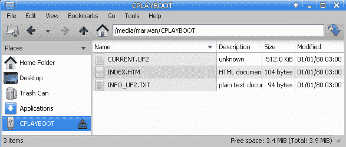
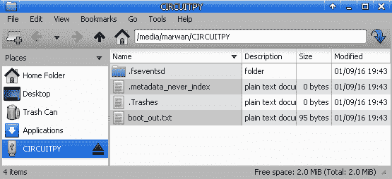
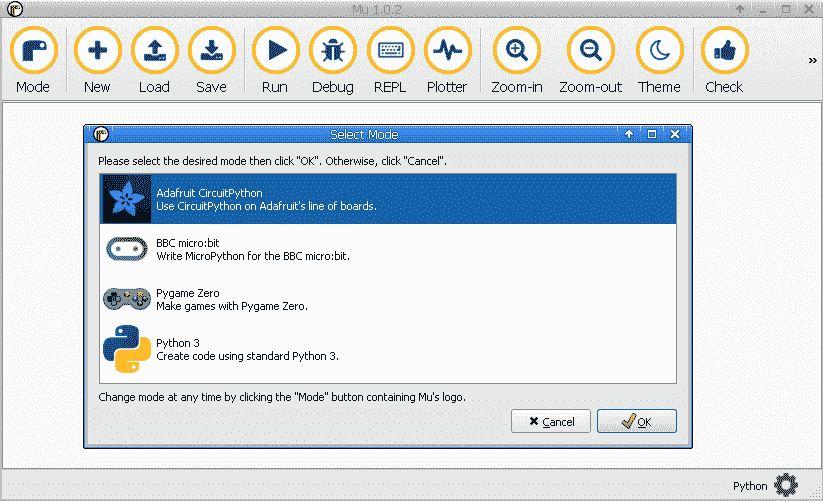
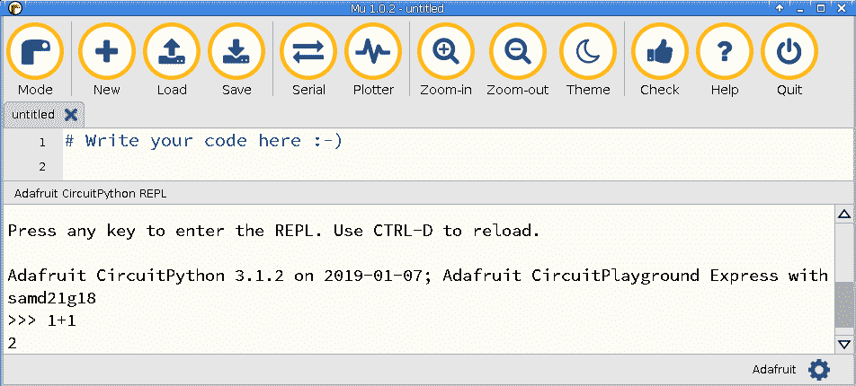

# 第一章：开始使用 MicroPython

现在是使用 MicroPython 等技术的激动人心的时刻。它们使得微小和廉价的硬件设备更容易访问，因为你可以使用高级语言如 Python 来编程。与其他微控制器语言相比，比如从 Web 服务中检索数据可以轻松地用几行代码完成，因为它们与 Python 相比操作的层级更低，需要更多的步骤。这非常有力量，因为你将能够更快地获得结果，并在更短的时间内迭代不同的设计和原型。

在本章中，我们将为您提供运行 MicroPython 所需的软件和硬件的基本技能。您将学习如何更新设备上的固件和库。还将介绍一些加载第一个程序并使用高级功能（如自动重新加载代码）的方法。最后，将介绍一些使用 REPL 的方法，这是一种快速与 MicroPython 设备上的可用组件进行交互和实验的强大方式。

在本章中，我们将涵盖以下内容：

+   刷新微控制器固件

+   执行你的第一个程序

+   使用屏幕访问 REPL

+   使用 Mu 访问 REPL

+   在 REPL 中执行命令

+   使用自动重新加载功能

+   更新 CircuitPython 库

# 什么是 MicroPython？

MicroPython 是澳大利亚程序员和物理学家 Damien George 的创造，他在 2013 年发起了一个 Kickstarter 活动，以支持该语言的开发和最初的微控制器硬件。在项目成功之后，越来越多的设备（具有不同制造商的各种芯片组）得到了 MicroPython 的支持，为使用 MicroPython 制作项目时提供了多种选择。

MicroPython 是 Python 3 编程语言的精简实现，能够在硬件资源非常有限的设备上运行，比如微控制器。MicroPython 已经实现了 Python 编程语言的大部分功能，比如函数、类、列表、字典、字符串、读写文件、列表推导和异常处理。

REPL 也已经实现，并且可以通过串行连接进行交互。提供了一系列核心 Python 库，可以实现各种应用。JSON 和`socket`库允许 Web 客户端和服务器的实现，使得基于 Python 的物联网（IoT）项目在微控制器上成为现实。

通过将最受欢迎和易于使用的编程语言之一引入到嵌入式计算的激动人心的世界中，MicroPython 为创客和企业家打开了新的大门，让他们的创意得以实现。本书将探索不同的方法来利用 MicroPython 语言与各种独特的微控制器设备，每种设备都带来了不同的功能。

在微控制器上运行 MicroPython 的独特和迷人之处之一是它不在操作系统（OS）上运行，而是直接在裸金属上运行。这些独特的特性以多种方式表现出来，比如在硬件上电的瞬间就能运行你的 Python 代码，因为不需要启动操作系统。

另一个方面是 Python 代码直接访问硬件并与之交互，创造了一些在典型 Python 应用程序上不可能实现的硬件可能性。

现在我们知道 MicroPython 可以在微控制器上运行，让我们看看微控制器到底是什么。

# 什么是微控制器？

微控制器是单芯片上的小型计算机。它们通常包括 CPU、内存和输入/输出外设。它们的计算资源比现代 PC 上可能找到的要有限。

然而，与 PC 相比，它们可以制作成更小的尺寸，可以嵌入各种电子和机械设备中。它们的功耗通常要小得多，因此可以提供数天的电池寿命。它们的单位成本要低得多，这就打开了在广泛地理区域收集传感器数据的数百个这样的设备的可能性，而且仍然是经济可行的。

传统上，在微控制器上创建应用程序是一个困难的过程，因为你必须编写非常低级的代码，这需要时间，而且很难调试。MicroPython 将 Python 的易用性带到了微控制器上。它能够提供与硬件的更轻松交互，同时在资源受限的环境中工作，并提供广泛的功能和高度的响应性。

# 什么是 CircuitPython？

CircuitPython 是 Adafruit Industries 创建的 MicroPython 分支，使得与微控制器的工作更简单。它通过 Python 库对许多传感器和 Adafruit 设备的组件提供了出色的支持。它还允许代码轻松加载和运行，而无需安装任何额外的软件应用程序，通过将微控制器的存储公开为磁盘驱动器。

一般来说，MicroPython 和 CircuitPython 之间的差异很小，在许多情况下，代码在两种实现上都会运行相同。

# 什么是 Circuit Playground Express？

Adafruit Circuit Playground Express 是一款价格便宜但功能丰富的微控制器，具有丰富的输入和输出设备，这些设备已经内置在设备中。以下是该设备中的一些主要硬件特性：

+   10 个迷你 NeoPixels，每个都能显示全色彩范围

+   作为运动传感器（带有敲击检测和自由落体检测的三轴加速度计）

+   一个温度传感器

+   一个光传感器

+   一个声音传感器

+   一个迷你扬声器

+   两个带有标签 A 和 B 的按钮

+   一个滑动开关

+   一个红外线接收器和发射器

+   八个鳄鱼夹友好的输入/输出引脚

+   支持 I2C 和 PWM 输出

+   七个电容触摸输入

+   一个红色 LED

+   一个复位按钮

+   一个运行在 3.3V 和 48MHz 的 ATSAMD21 ARM Cortex M0 处理器

+   2MB 的闪存存储

+   一个用于连接 PC 的微型 USB 端口

这些将是八章中唯一需要的设备。后面的章节将介绍一组不同的设备。

请参考[`learn.adafruit.com/welcome-to-circuitpython?view=all`](https://learn.adafruit.com/welcome-to-circuitpython?view=all)获取更多信息。

# 在哪里购买

Adafruit Circuit Playground Express 可以直接从 Adafruit（[`www.adafruit.com/product/3333`](https://www.adafruit.com/product/3333)）购买。它也可以从在线零售商购买，如亚马逊和 Pimoroni。

对于本书的目的，我们建议购买 Circuit Playground Express - 基础套件（[`www.adafruit.com/product/3517`](https://www.adafruit.com/product/3517)），还包括 USB 电缆和电池包，以便项目可以轻松地制作成便携式。

# 参考

以下是一些参考：

+   [`micropython.org`](http://micropython.org)上的 MicroPython 网页

+   [`www.kickstarter.com/projects/214379695/micro-python-python-for-microcontrollers`](https://www.kickstarter.com/projects/214379695/micro-python-python-for-microcontrollers)上的 Kickstarter 上的 MicroPython 项目

+   [`www.pcmag.com/encyclopedia/term/46924/microcontroller`](https://www.pcmag.com/encyclopedia/term/46924/microcontroller)上的 PC Mag 上的微控制器文章

+   CircuitPython 的 Adafruit 学习指南位于[`learn.adafruit.com/welcome-to-circuitpython/what-is-circuitpython`](https://learn.adafruit.com/welcome-to-circuitpython/what-is-circuitpython)

+   CircuitPython 官方文档位于[`circuitpython.readthedocs.io`](https://circuitpython.readthedocs.io)

# 刷新微控制器固件

在这个教程中，我们将展示如何使用最新的 CircuitPython 固件在 Circuit Playground Express 上刷新固件。在开始使用该设备之前，有两个原因需要这样做。首先，该设备还支持 Microsoft MakeCode 编程环境，并且使用 CircuitPython 固件刷新设备可以准备好使用 Python 语言。

其次，CircuitPython 语言正在不断发展，每隔几个月发布一次版本，因此定期更新固件以加载最新版本的语言到板上是个好主意。

# 准备工作

本章的介绍为我们提供了购买 Circuit Playground Express 的指导，这对本章中的所有教程都是必需的。还需要一个 USB micro B 电缆和运行 macOS、Windows 或 Linux 的计算机。

# 如何操作...

让我们看看以下步骤：

1.  下载最新的 CircuitPython Circuit Playground Express UF2 文件([`github.com/adafruit/circuitpython/releases/latest`](https://github.com/adafruit/circuitpython/releases/latest))。CircuitPython 3.1.2 版本的 UF2 文件名为`adafruit-circuitpython-circuitplayground_express-3.1.2.uf2`。对于每个 CircuitPython 版本，都有许多不同的支持的微控制器的`uf2`文件。确保下载适用于 Circuit Playground Express 设备的文件。

在本教程中，我们将使用最新的稳定版本的 CircuitPython，目前是 3.1.2。

1.  将 USB 电缆连接到 Circuit Playground Express 和计算机。

1.  双击位于板中心的复位按钮。如果一切顺利，您将看到所有 LED 变为绿色；否则，很可能是使用的 USB 电缆出现了问题。在某些情况下，如果双击不起作用，请尝试单击复位按钮。

1.  您将看到一个名为 CPLAYBOOT 的新磁盘出现：



1.  将 UF2 文件复制到此驱动器中。

1.  一旦 UF2 文件完全写入设备，固件将被更新，一个新的驱动器将出现，名为 CIRCUITPY：



现在，我们的 Circuit Playground Express 可以使用了。

# 它是如何工作的...

传统上，需要安装和使用特殊软件来处理微控制器的刷新过程。微软开发了 UF2 方法，大大简化了该过程，不需要任何特殊软件或命令行执行来刷新微控制器。

一旦板子进入引导程序模式，它将期望保存一个 UF2 文件。当 UF2 文件复制到驱动器时，微控制器将检测到文件复制已完成，然后自动进行微控制器刷新并重新启动设备，此时设备将重新连接并准备好使用。

UF2 文件格式可以在[`github.com/Microsoft/uf2`](https://github.com/Microsoft/uf2)找到。

# 还有更多...

与以前的方法相比，UF2 方法使刷新微控制器固件的过程更加简单和快速。并非所有 MicroPython 板都支持 UF2 方法，因此需要更复杂的方法来安装特殊软件来进行固件刷新。不同的板和制造商之间所需的确切过程和软件各不相同。

当您使用这个闪存软件时，通常需要知道设备在计算机上显示为的串行设备的确切名称。这些设备的命名在 Windows、Linux 和 macOS 之间有所不同。这种类型的软件通常需要在终端中运行，因此您需要一些命令行知识来与之交互。出于所有这些原因，使用支持的设备（如 Circuit Playground Express）与 UF2 是开始使用 MicroPython 进行实验的首选方式。

# 另请参阅

关于本文描述的过程，Adafruit 和 Microsoft 网站上有许多资源。以下是一些参考资料：

+   有关更新 CircuitPython 的文档可以在[`learn.adafruit.com/adafruit-circuit-playground-express/circuitpython-quickstart`](https://learn.adafruit.com/adafruit-circuit-playground-express/circuitpython-quickstart)找到。

+   有关 UF2 过程的详细说明，请参阅[`makecode.com/blog/one-chip-to-flash-them-all`](https://makecode.com/blog/one-chip-to-flash-them-all)。[](https://makecode.com/blog/one-chip-to-flash-them-all)

# 执行您的第一个程序

在本文中，我们将向您展示如何在 Circuit Playground Express 上加载您的第一个程序，以及如何修改程序并重新加载它。然后，程序将点亮板上可用的十个 NeoPixel 中的一个。

# 准备工作

一旦 Circuit Playground Express 刷入了 CircuitPython 固件，您可以将 Python 脚本加载到板子上并运行它们。

# 如何做到...

让我们看看如何做到这一点：

1.  确保板子通过 USB 电缆连接到计算机，并且`CIRCUITPY`驱动器出现。

1.  在驱动器上保存一个文本文件，内容如下，并将其命名为`main.py`：

```py
from adafruit_circuitplayground.express import cpx
import time

cpx.pixels[0] = (255, 0, 0)  # set first NeoPixel to the color red
time.sleep(60)
```

1.  保存文件后，弹出驱动器，然后从计算机上断开并重新连接 USB 电缆。

1.  驱动器上的第一个 NeoPixel 应该点亮为红色。

1.  在您选择的文本编辑器中打开`main.py`文件，并将`cpx.pixels[0]`行更改为`cpx.pixels[1]`。保存文件。这个更改将使第二个 NeoPixel 点亮，而不是第一个。

1.  弹出驱动器，然后断开，重新连接 USB 电缆以使更改生效。

# 它是如何工作的...

当设备打开时，它会寻找某些文件，例如`code.py`或`main.py`，如果找到，将作为启动过程的一部分执行。通过这种方式，您可以指定在设备上电时要运行的代码。脚本首先导入`adafruit_circuitplayground.express`库，以便它可以控制 NeoPixels。通过给它一组适当的 RGB 值，将第一个 NeoPixel 设置为红色。

最后，脚本将休眠 60 秒，以便 LED 在脚本结束执行前保持点亮一分钟。

# 还有更多...

现在，板子已经加载了一个 Python 脚本，可以从计算机断开连接，并连接电池组。一旦电池组由脚本供电，它应该运行并点亮所选的 NeoPixel。

这是创建便携且廉价的项目的简单方法，可以直接从板上运行代码，无需连接 PC，并且可以通过三节 AAA 电池简单供电。

# 另请参阅

CircuitPython 在启动时寻找的一些文件的描述在[`learn.adafruit.com/welcome-to-circuitpython?view=all#naming-your-program-file-7-30`](https://learn.adafruit.com/welcome-to-circuitpython?view=all#naming-your-program-file-7-30)中有描述。

# 使用屏幕访问 REPL

Linux 和 macOS 有强大的终端仿真器，如`screen`，可以用于通过串行（USB）连接直接连接到设备的**读取-求值-打印循环**（**REPL**）。本文将展示如何连接到 REPL 并开始交互式地运行 Python 代码。

# 准备工作

此配方可以在 macOS 或 Linux 计算机上使用，并可能需要`screen`命令可用。在 macOS 上，Screen 应用程序是内置的，因此无需安装。在 Ubuntu 上，可以使用`apt install screen`命令安装 Linux Screen。

# 如何做...

让我们看看如何连接 REPL 并运行代码：

1.  打开计算机的终端应用程序。

1.  在 Linux 上运行`ls /dev/ttyACM*`或在 macOS 上运行`ls /dev/tty.*`来列出插入设备之前的设备名称。

1.  使用 USB 电缆将板连接到计算机。

1.  使用相同的命令再次列出设备名称，以发现板的设备名称。

1.  如果设备名称为`/dev/ttyACM0`，则`screen`命令将是`screen /dev/ttyACM0 115200`。

1.  在终端中输入命令并启动 Screen 应用程序。

1.  如果 Screen 能够成功连接，Python REPL 应该会出现在终端上，并显示类似以下文本的输出：

```py
Adafruit CircuitPython 3.1.2 on 2019-01-07; Adafruit CircuitPlayground Express with samd21g18 **>>>** 
```

1.  如果提示未出现，可以尝试按下*Ctrl* + *C*，然后按*Enter*，这将停止当前正在运行的 Python 脚本，并使用以下消息运行 REPL：

```py
Press any key to enter the REPL. Use CTRL-D to reload.
```

1.  一旦 REPL 提示出现，我们将必须通过评估`1+1`表达式来测试提示是否正常工作。它应该产生以下输出：

```py
>>> 1+1
2
```

# 它是如何工作的...

Circuit Playground Express 通过 USB 连接公开了串行设备，可以通过多种不同的终端仿真程序访问。除了`screen`之外，还有其他程序，如`picocom`和`minicom`，也可以使用。

在命令中设置的最后一个参数为 115,200，设置了连接的波特率，应该以该速度设置。一旦成功建立连接，就会开始一个交互式会话，允许直接在设备上评估表达式，并且输出直接显示在终端上。

# 还有更多...

书中的许多配方将介绍使用 REPL 的脚本的不同部分。这将使您有机会在运行每个代码片段时获得即时反馈。一旦您在 REPL 中输入了不同的片段，您还可以使用 REPL 功能来辅助您对代码进行实验。您可以使用*上*和*下*箭头键来浏览已在 REPL 中输入的命令历史记录。例如，如果您刚刚在 REPL 中执行了一行代码，打开了板上的特定像素，您可以按*上*键，通过编辑该行并再次按*Enter*来更改点亮的像素。

# 另请参阅

以下是一些参考资料：

+   有关在 CircuitPython 板上使用 REPL 的详细信息，请参阅[`learn.adafruit.com/welcome-to-circuitpython/the-repl`](https://learn.adafruit.com/welcome-to-circuitpython/the-repl)。

+   有关使用 REPL 访问 MicroPython 的详细信息，请访问[`learn.adafruit.com/micropython-basics-how-to-load-micropython-on-a-board/serial-terminal`](https://learn.adafruit.com/micropython-basics-how-to-load-micropython-on-a-board/serial-terminal)。

# 使用 Mu 访问 REPL

Mu 是一个易于使用的图形代码编辑器，用 Python 编写，可在 Windows、macOS、Linux 和树莓派上运行。在这个配方中，我们将学习如何安装 Mu 并使用它来访问 Circuit Playground Express 上的 REPL。

# 准备工作

此配方要求计算机上安装 Python 和`pip`。Mu 编辑器将使用`pip`命令安装，因此可以选择在`virtualenv`中运行此配方。

# 如何做...

让我们看看如何做到这一点：

1.  执行以下`pip3 install mu-editor`命令以安装 Mu 编辑器。

1.  运行`mu-editor`命令启动编辑器。

1.  第一次运行编辑器时，它将询问应以哪种模式运行。在下面的屏幕截图中，选择 Adafruit CircuitPython 模式：



1.  单击工具栏上的串行按钮以与设备打开 REPL 会话。

1.  在 Linux 系统上，如果出现“无法连接到设备”错误，则退出编辑器，并使用`sudo /full/path/to/mu-editor`命令重新启动编辑器，其中给出编辑器的绝对路径。

1.  一旦成功连接到设备，您可以通过评估`1+1`表达式来测试 REPL，这应该会产生如下屏幕截图所示的输出：



# 它是如何工作的...

当您在 Mu 编辑器中点击串行按钮时，它将尝试打开与板的串行连接。如果成功，它会捕获您的输入，将其发送到设备，并显示输出，就像典型的终端仿真器一样。

这个应用程序的美妙之处在于它适用于所有主要的桌面操作系统，并且可以自动找到正确的设备地址，无需手动指定，这是 Typical Terminal emulators 所必需的。它还具有非常简单和易于接近的布局，使得首次用户连接到微控制器变得容易使用。

# 还有更多...

Mu 编辑器是一个很棒的图形应用程序，当你第一次开始使用 MicroPython 时，它是一个很好的开始。它简单直观的设计使得你可以快速提高生产力，并且很有趣地探索其不同的功能。除了 REPL 功能之外，它还有主要部分的屏幕，可以用来编辑和保存 Python 脚本。它具有代码编辑功能，如代码完成，并将显示有关函数接受参数和函数功能的详细弹出窗口。

# 另请参阅

以下是一些参考资料：

+   该项目的 GitHub 存储库位于[`github.com/mu-editor/mu`](https://github.com/mu-editor/mu)。

+   项目主页位于[`codewith.mu/`](https://codewith.mu/)[.](https://github.com/mu-editor/mu)

# 在 REPL 中执行命令

以下配方展示了 REPL 的不同用法。

# 准备工作

可以从前面的两个配方中使用任一种方法来获取 REPL。

# 如何做...

1.  通过您喜欢的应用程序打开 REPL。

1.  与 CPython 中的 REPL 提供的许多相同功能在 MicroPython 实现中也可以使用。最后一个返回的值可以通过`_`访问：

```py
>>> 2 + 2
4
>>> _ + 2
6
```

1.  还支持连续行，这样可以通过 REPL 定义函数或`for`循环，如下面的输出所示：

```py
>>> def add(a, b):
...     return a + b
... 
... 
... 
>>> add(2, 2)
4
>>> 
```

1.  即使在受限的微控制器硬件上，也支持任意精度整数。以下代码显示了超出 64 位整数值限制的整数的算术运算：

```py
>>> 2**100 + 2**101
3802951800684688204490109616128
```

# 它是如何工作的...

REPL 实现具有我们在 CPython 实现中所熟悉和喜爱的大多数功能。MicroPython 实现必须处理严格的硬件约束，以便在微控制器上运行。但是，即使在这些约束下，两种实现中 REPL 的最终用户体验几乎是相同的，这使得对 Python 开发人员来说很容易过渡。

# 还有更多...

当您想要尝试某些 MicroPython 库或设备上的某些功能时，REPL 可以成为一个宝贵的工具。它让您可以轻松地导入不同的 Python 模块，并以更直接的方式调用这些库提供的函数，以发现它们实际上如何与硬件交互。这些微控制器上的许多组件可以根据不同的项目需求进行微调。REPL 经常成为进行这种微调的理想场所。

# 另请参阅

以下是一些参考资料：

+   MicroPython 交互式解释器模式（REPL）的文档位于[`docs.micropython.org/en/latest/reference/repl.html`](http://docs.micropython.org/en/latest/reference/repl.html)。

+   可以在[`docs.micropython.org/en/latest/genrst/builtin_types.html`](http://docs.micropython.org/en/latest/genrst/builtin_types.html)找到 MicroPython 内置类型的文档。

# 使用自动重新加载功能

以下配方显示了如何使用自动重载，以便编辑和运行代码的循环可以变得更快更有趣。

# 准备工作

在此之前使用的任何方法都可以用于获取 REPL。

# 如何做到...

让我们看看如何做到这一点：

1.  打开`main.py`文件，并保存文件中的`print('hi there')`语句。

1.  通过您喜欢的应用程序打开 REPL。打开 REPL 后，按下*Ctrl* + *D*。应出现以下输出：

```py
Adafruit CircuitPython 3.1.2 on 2019-01-07; Adafruit CircuitPlayground Express with samd21g18
>>> 
>>> 
soft reboot

Auto-reload is on. Simply save files over USB to run them or enter REPL to disable.
main.py output:
hi there

Press any key to enter the REPL. Use CTRL-D to reload.
```

1.  编辑`main.py`文件，并将内容更改为`print('hi there again')`。应自动显示以下输出：

```py
soft reboot

Auto-reload is on. Simply save files over USB to run them or enter REPL to disable.
main.py output:
hi there again

Press any key to enter the REPL. Use CTRL-D to reload.
```

# 它是如何工作的...

通过按下*Ctrl* + *D*，板子将进入自动重载模式。在这种模式下，您可以在您选择的文本编辑器中打开`main.py`文件，并且在保存文件的瞬间，板子会检测到发生了变化，并执行软重启。

软重启可以在屏幕输出中看到，然后执行新版本的代码，并立即显示其输出。

# 还有更多...

在脚本中开始使用一些基本的代码行来使脚本的初始部分运行是非常常见的。一旦您的第一个基本版本运行起来，您将经历许多迭代来微调和增强它，使其表现出您想要的方式。除了这些调整之外，不可避免的错误将出现在您的代码中，因为您在调试它时会出现。在这些密集的编码会话中，自动重载功能将成为您的好朋友，因为它将让您更快地获得结果，并以直观的方式。

# 另请参阅

以下是一些参考资料：

+   MicroPython 的软重置功能在[`docs.micropython.org/en/v1.8.6/wipy/wipy/tutorial/reset.html`](http://docs.micropython.org/en/v1.8.6/wipy/wipy/tutorial/reset.html)中有描述。

+   有关离开 REPL 的文档可以在[`learn.adafruit.com/welcome-to-circuitpython?view=all#returning-to-the-serial-console-10-24`](https://learn.adafruit.com/welcome-to-circuitpython?view=all#returning-to-the-serial-console-10-24)中找到。

# 更新 CircuitPython 库

除了更新固件外，还有一组名为 CircuitPython Library 的 Python 库，其中包含了最新支持的功能。

# 准备工作

在此之前使用的任何方法都可以用于获取 REPL。

# 如何做到...

让我们看看如何做到这一点：

1.  通过您喜欢的应用程序打开 REPL。

1.  下载最新的 CircuitPython Library Bundle 发布版([`github.com/adafruit/Adafruit_CircuitPython_Bundle/releases/latest`](https://github.com/adafruit/Adafruit_CircuitPython_Bundle/releases/latest))。捆绑文件的名称是`adafruit-circuitpython-bundle-3.x-mpy-20190212.zip`。由于我们的固件使用的是 3.x 版本，因此必须选择也适用于 3.x 版本的捆绑包。始终使用`mpy`版本，因为这样可以优化使用更少的磁盘空间，并减少内存使用。

在这个配方中，我们使用的是 CircuitPython Library Bundle 的最新自动发布版本，即 3.x 系列的 20190212 版本。

1.  将`.zip`文件提取到计算机上的一个位置。

1.  如果`CIRCUITPY`驱动器中不包含`lib`文件夹，则现在创建一个。

1.  将提取的`lib`文件夹的内容复制到设备上的`lib`文件夹中。

1.  通过按下*Ctrl* + *D*在 REPL 中执行软重启。

1.  在 REPL 中运行`import simpleio`。

1.  如果成功执行，则库已成功加载，因为`simpleio`模块不是固件的一部分，而是从库文件夹导入的。

# 它是如何工作的...

创建的`lib`路径是 CircuitPython 在导入 Python 包时查找的标准路径之一。通过将 Python 包添加到此文件夹，可以使其可以被设备上运行的任何脚本导入。

`mpy`文件是从原始源`py`文件构建的，并且全部打包在一起，以便更容易安装。

# 还有更多...

CircuitPython 库正在不断开发，因此重要的是要知道如何在板上更新库，以便获得最新的功能。当您尝试从互联网上找到的项目代码时，您可能偶尔会发现一些示例在您的板上无法运行，因为您正在运行过时的 CircuitPython 库版本。保持板子更新到最新版本，可以帮助防止这种情况发生。

# 另请参阅

以下是一些参考资料：

+   有关如何创建`mpy`文件的更多详细信息，请查看[`learn.adafruit.com/building-circuitpython/build-circuitpython`](https://learn.adafruit.com/building-circuitpython/build-circuitpython)中的`mpy-cross`命令。

+   有关安装 CircuitPython 库包的信息，请访问[`learn.adafruit.com/adafruit-circuit-playground-express?view=all#installing-the-circuitpython-library-bundle-12-5`](https://learn.adafruit.com/adafruit-circuit-playground-express?view=all#installing-the-circuitpython-library-bundle-12-5)。
