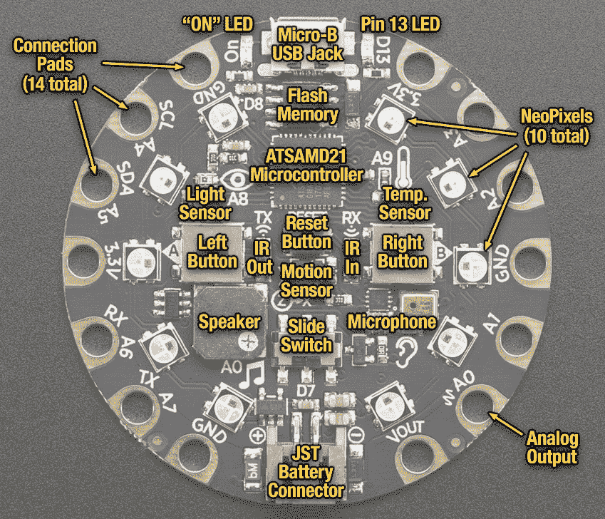
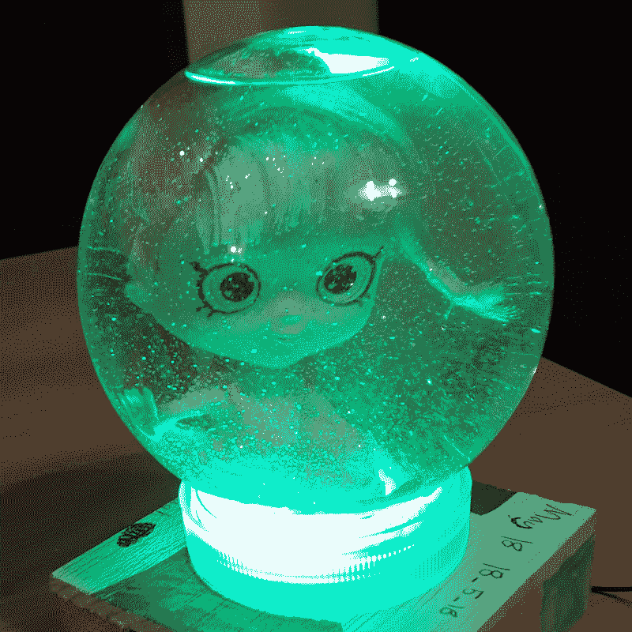
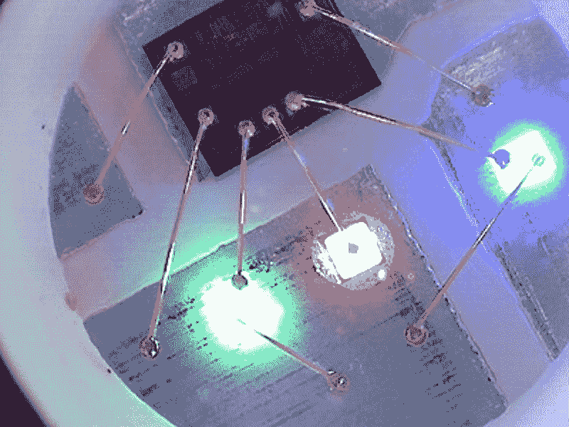
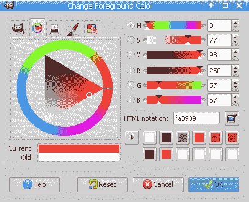
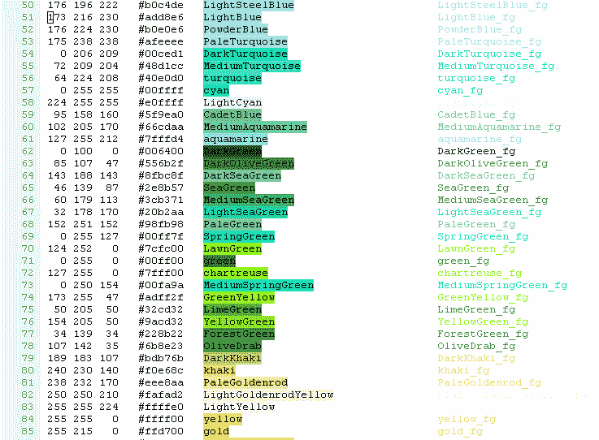
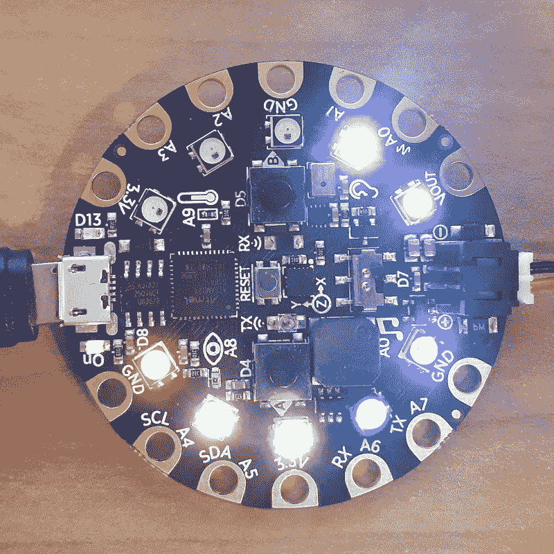

# 第二章：控制 LED

在本章中，我们将介绍控制 Adafruit Circuit Playground Express 附带的一系列 NeoPixel LED 的几种方法。在这些示例中，我们将研究设置像素颜色的各种方法，每种方法都有其自己的权衡。

我们还将演示如何计时操作，以便创建淡入淡出和其他光动画效果。NeoPixels 是允许您的项目与丰富的视觉交互的强大方式。这些示例将为您提供必要的构建模块，以将这些视觉概念纳入您自己的项目中。

在本章中，我们将涵盖以下示例：

+   打开引脚 13 的 LED

+   设置 NeoPixel 的亮度

+   控制单个 NeoPixel 的颜色

+   使用 RGB 和十六进制代码显示 LED 颜色

+   使用颜色名称设置 LED 颜色

+   将所有 NeoPixels 设置为相同的颜色

+   将一系列 NeoPixels 设置为一种颜色

+   生成随机的 NeoPixel LED 颜色

+   使用随机颜色创建 LED 动画

+   使用彩虹颜色创建 LED 动画

# Adafruit Circuit Playground Express 布局

以下图表显示了本章中将使用的 LED 的位置：



由 adafruit.com 提供

引脚 13 的 LED 是第一个示例中将使用的简单的单个红色 LED。板上共有 10 个 NeoPixels。每个 NeoPixel 由红色、绿色和蓝色 LED 组成。通过控制这些 LED 的各自亮度，您将能够将任何 NeoPixel 设置为特定颜色。

# 打开引脚 13 的 LED

在本示例中，我们将学习如何打开和关闭引脚 13 的 LED。这是板上最简单的 LED，因为它只有一种颜色，并且在 Python 中与之交互也非常简单。出于这些原因，引脚 13 的 LED 是一个很好的起点。

# 准备工作

您需要访问 Circuit Playground Express 上的 REPL 才能运行本示例中提供的代码。

# 如何做...

要做到这一点，请执行以下步骤：

1.  在 REPL 中运行以下代码行：

```py
>>> from adafruit_circuitplayground.express import cpx
>>> cpx.red_led = True
```

1.  此阶段应该看到引脚 13 的 LED 变红。

1.  使用以下代码检查 LED 的当前状态：

```py
>>> cpx.red_led
True
```

1.  要关闭 LED，请在 REPL 中运行以下代码：

```py
>>> cpx.red_led = False
```

1.  现在引脚 13 的 LED 灯将被关闭。

# 工作原理...

代码的第一行导入了 Circuit Playground Express 库。该库包含一个名为`express`的对象类，这是我们将用于与此板上的硬件进行交互的主要类。当导入库时，它会创建一个名为`cpx`的此类的实例。

`cpx`对象公开了一个名为`red_led`的属性。此属性可用于检索 LED 的当前值。如果 LED 打开，则返回`True`值；否则，如果 LED 关闭，则返回`False`值。设置此属性的值将打开或关闭 LED，具体取决于设置`True`或`False`值。

# 还有更多...

这是板上最简单的 LED 灯之一，因为它是通过将值设置为`True`或`False`来控制的。您无法控制此 LED 的颜色或亮度。本书中的其他示例将控制板上的 NeoPixel 灯，这些灯具有更丰富的功能范围，因此需要更复杂的 API 来控制它们。

# 另请参阅

您可以使用以下参考资料了解更多信息：

+   有关`red_led`属性的文档可以在[`circuitpython.readthedocs.io/projects/circuitplayground/en/latest/api.html#adafruit_circuitplayground.express.Express.red_led`](https://circuitpython.readthedocs.io/projects/circuitplayground/en/latest/api.html#adafruit_circuitplayground.express.Express.red_led)找到。

+   有关导入 `cpx` 变量的详细信息，请访问 [`circuitpython.readthedocs.io/projects/circuitplayground/en/latest/#usage-example`](https://circuitpython.readthedocs.io/projects/circuitplayground/en/latest/#usage-example)。

# 设置 NeoPixel 的亮度

控制像素的亮度将是本教程的主题。根据项目的需要设置像素的亮度非常重要。请注意，您必须将亮度更改为足够明亮的级别，以便像素清晰可见，但不要太亮以至于引起不适。

# 准备工作

您需要访问 Circuit Playground Express 上的 REPL，以运行本教程中提供的代码。

# 如何操作...

为了做到这一点，请执行以下步骤：

1.  在 REPL 中运行以下代码行：

```py
>>> from adafruit_circuitplayground.express import cpx
>>> cpx.pixels.brightness = 1.0
>>> cpx.pixels[0] = (255, 0, 0)
```

1.  此时，第一个像素应该是红色，并且亮度全开。运行以下代码行以将亮度级别设置为 50%：

```py
>>> cpx.pixels.brightness = 0.5
```

1.  亮度级别可以进一步降至 10%，仍然可以舒适地看到。您可以通过运行以下代码行来实现：

```py
>>> cpx.pixels.brightness = 0.10
```

# 它是如何工作的...

`brightness` 属性接受从 `0` 到 `1.0` 的值，从最暗到最亮。请注意，此板上的 NeoPixels 可能非常明亮，如果您直接看最高亮度级别的话，可能会对您的眼睛造成压力。

我建议您将亮度级别设置为 10%，因为这样可以更舒适地查看像素。然后，根据项目的需要，您可以调整亮度到最合适的级别。

有时像素将位于薄塑料覆盖物下，您将希望增加亮度级别。另一方面，有时您将直接看着它们，您将希望降低亮度级别。

# 还有更多...

重要的是要注意，亮度级别的实现方式意味着您只能一次更改所有的 NeoPixels。也就是说，使用亮度属性，您不能使一些像素变亮，一些像素变暗。因此，您设置的亮度值将应用于板上的所有像素。

当像素保持在最大亮度级别的 100% 时，它们具有非常明亮的能力。这种设置更适合的一个例子是当您将设备嵌入塑料容器中。以下照片是从一个 NeoPixel 项目中拍摄的，其中 Circuit Playground Express 板被放置在雪球的底座内部：



在这个项目中，底座是由白色塑料制成的。因此，即使板不直接可见，像素也足够明亮，可以透过白色塑料照亮整个雪球。

本项目中展示的 DIY 雪球套件可以在 [`www.adafruit.com/product/3722`](https://www.adafruit.com/product/3722) 找到。

# 另请参阅

您可以使用以下参考资料了解更多信息：

+   亮度属性的文档位于 [`circuitpython.readthedocs.io/projects/NeoPixel/en/latest/api.html#NeoPixel.NeoPixel.brightness`](https://circuitpython.readthedocs.io/projects/neopixel/en/latest/api.html#neopixel.NeoPixel.brightness)。

+   有关更改亮度级别的示例，请访问 [`learn.adafruit.com/circuitpython-made-easy-on-circuit-playground-express/NeoPixels`](https://learn.adafruit.com/circuitpython-made-easy-on-circuit-playground-express/neopixels)。

# 控制单个 NeoPixel 的颜色

这个教程将向您展示如何将特定的 NeoPixel 设置为不同的颜色。然后它将向您展示如何更改板上附带的 10 个 NeoPixels 中的任何一个的颜色。这将是一个有用的教程，因此您可以开始释放这些板载像素的强大和灵活性。

# 准备工作

你需要在 Circuit Playground Express 上访问 REPL 来运行本教程中提供的代码。

# 如何做...

要做到这一点，执行以下步骤：

1.  在 REPL 中运行以下代码行：

```py
>>> from adafruit_circuitplayground.express import cpx
>>> cpx.pixels[0] = (255, 0, 0)
```

1.  现在，你应该看到第一个 NeoPixel 变成红色。

1.  当你运行以下代码时，你应该看到第一个 NeoPixel 变成绿色：

```py
>>> cpx.pixels[0] = (0, 255, 0)
```

1.  当你运行以下代码时，你应该看到第一个 NeoPixel 变成蓝色：

```py
>>> cpx.pixels[0] = (0, 0, 255)
```

1.  以下代码应该检索第一个 NeoPixel 的当前颜色值：

```py
>>> cpx.pixels[0]
(0, 0, 255)
```

1.  运行以下代码关闭第一个 NeoPixel：

```py
>>> cpx.pixels[0] = (0, 0, 0)
```

1.  运行以下代码，第二个 NeoPixel 应该变成红色：

```py
>>> cpx.pixels[1] = (255, 0, 0)
```

# 工作原理...

第一行代码导入了将用于控制 NeoPixels 的`cpx`对象。这个对象有一个名为`pixels`的属性，可以像列表一样访问。使用的索引表示要操作的 10 个 NeoPixels 中的哪一个。

在第一个代码片段中，我们将值设置为表示所需颜色的元组，它由红色、绿色和蓝色值组成。每个值应该表示为 0 到 255 之间的整数。通过将值设置为(255, 0, 0)，红色 LED 将达到最高值，绿色和蓝色 LED 将关闭。这将创建红色。

按照相同的方法，然后通过为每种颜色提供正确的值来将 NeoPixel 设置为绿色和蓝色。还可以通过简单地访问任何特定示例的值来轻松地检索特定像素的当前 RGB 值。

通过将所有 RGB 分量设置为 0，可以关闭像素，如本教程中的前面代码所示。最后一个前面的代码片段只是通过引用正确的索引值来将第二个像素设置为红色的示例。

# 还有更多...

在旧版本的库中，你可以将颜色提供为三个整数的列表，而不是三个整数的元组。最好避免这样做，而是坚持使用元组而不是列表。这是因为你的代码将在新版本和旧版本的库中都能工作。

每个 NeoPixel 由红色、绿色和蓝色 LED 组成。当你在这个教程中设置每种颜色的强度时，它直接改变了这些单独 LED 的亮度级别。可以使用消费者显微镜来查看组成每个 NeoPixel 的三个单独的 LED 灯。以下照片是从这些消费者级显微镜中拍摄的，放大倍数为 200 倍。正如你所看到的，单独的红色、绿色和蓝色 LED 清晰可见：



# 另请参阅

你可以使用以下参考资料了解更多信息：

+   可以在[`circuitpython.readthedocs.io/projects/circuitplayground/en/latest/api.html#adafruit_circuitplayground.express.Express.pixels`](https://circuitpython.readthedocs.io/projects/circuitplayground/en/latest/api.html#adafruit_circuitplayground.express.Express.pixels)找到有关像素属性的文档。

+   有关 NeoPixel 的详细信息可以在[`learn.adafruit.com/adafruit-NeoPixel-uberguide/the-magic-of-NeoPixels`](https://learn.adafruit.com/adafruit-neopixel-uberguide/the-magic-of-neopixels)找到。

# 使用 RGB 和十六进制代码显示 LED 颜色

有一个常见的约定，可以使用十六进制代码来表示任何颜色，它通过表示颜色的红色、绿色和蓝色组件来工作。这个教程演示了如何使用这个十六进制代码约定来设置 NeoPixel 的颜色。当你想要从网络或桌面上的其他应用程序应用特定的颜色设置时，使用这样一个流行的约定将是有用的。

# 准备工作

你需要在 Circuit Playground Express 上访问 REPL 来运行本教程中提供的代码。

# 如何做...

要做到这一点，执行以下步骤：

1.  在 REPL 中运行以下代码行：

```py
>>> from adafruit_circuitplayground.express import cpx
>>> cpx.pixels[0] = 0xFF0000
```

1.  你应该看到第一个 NeoPixel 变成红色。运行以下代码来检索第一个 NeoPixel 的颜色值：

```py
>>> cpx.pixels[0]
(0, 0, 255)
```

1.  运行以下代码将接下来的两个像素设置为绿色和蓝色：

```py
>>> cpx.pixels[1] = 0x00FF00
>>> cpx.pixels[2] = 0x0000FF
```

1.  使用以下代码将第四个像素设置为黄色：

```py
>>> cpx.pixels[3] = 0xFFFF00
```

1.  使用以下代码显示颜色蓝的整数值，然后使用这个整数值将下一个像素设置为蓝色：

```py
>>> 0x0000FF
255
>>> cpx.pixels[4] = 255
```

# 工作原理...

第一个代码片段使用颜色的十六进制表示法将板上的第一个像素设置为红色。像素的接口接受颜色值，可以作为三个整数的元组或十六进制值给出，在 Python 中，这对应于一个整数值。

根据给定的值类型，库会提取颜色的红色、绿色和蓝色组件的正确值，并将像素设置为该颜色。第二个代码片段表明，当读取值时，它们将始终作为三个颜色组件的元组检索。

最后一个代码片段表明，正在使用的十六进制表示法是 Python 语言的一个标准特性，用于指定整数值的十六进制值。等效的整数值也可以用于设置颜色。

# 还有更多...

十六进制代码表示系统用于描述颜色的红色、绿色和蓝色组件，非常受欢迎。由于其受欢迎程度，很容易找到各种在线工具和桌面应用程序，提供颜色选择器和颜色轮，这些工具将颜色表示为十六进制代码。您可以在这些程序中简单地选择所需的颜色，然后将十六进制值复制并粘贴到您的脚本中。以下截图来自流行的开源图像编辑器 GIMP：



在上述截图中，您可以看到应用程序中提供的颜色轮。这个丰富的界面可以轻松地通过改变色调或饱和度找到您要找的颜色。一旦选择了您想要的颜色，您可以复制十六进制代码值，这在该应用程序中标记为**HTML 表示法**。然后，您可以使用相同的技术在您的脚本中使用这个值。

GIMP 可在 Linux、macOS 和 Windows 上使用，并可从[`www.gimp.org`](https://www.gimp.org)免费下载。

# 另请参阅

您可以使用以下参考资料了解更多信息：

+   有关 Python 语言中整数文字的文档可以在[`docs.python.org/3/reference/lexical_analysis.html#integer-literals`](https://docs.python.org/3/reference/lexical_analysis.html#integer-literals)找到。

+   可以在[`www.sessions.edu/color-calculator/`](https://www.sessions.edu/color-calculator/)找到交互式颜色轮。

# 使用颜色名称设置 LED 颜色

使用易读的颜色名称可以使您更容易跟踪应用程序中使用的颜色。本文演示了一种允许您使用常规颜色名称设置像素颜色的技术。通过一组标准的颜色名称引用颜色的功能在流行的语言中可用，包括 CSS。本文向您展示了如何将此功能引入到您的 MicroPython 脚本中。

# 准备工作

您需要访问 Circuit Playground Express 上的 REPL 才能运行本文中提供的代码。

# 如何操作...

要执行此操作，请执行以下步骤：

1.  在 REPL 中运行以下代码行：

```py
>>> from adafruit_circuitplayground.express import cpx
>>> RGB = dict(black=0x000000, blue=0x0000FF, green=0x00FF00, 
... cyan=0x00FFFF,
... red=0xFF0000, magenta=0xFF00FF, yellow=0xFFFF00, 
... white=0xFFFFFF)
>>> cpx.pixels[0] = RGB['red']
```

1.  您应该看到第一个 NeoPixel 变成红色。

1.  使用以下代码将前八个像素按字母顺序设置为命名颜色之一：

```py
>>> for i, name in enumerate(sorted(RGB)):
...     cpx.pixels[i] = RGB[name]
```

# 工作原理...

创建了一个名为 RGB 的全局变量；这是一个用于将颜色名称与它们的 RGB 颜色代码匹配的字典。这允许通过它们的名称检索颜色值，而不是每次需要使用时直接指定它们的十六进制代码。第一个片段使用 RGB 代码将第一个像素设置为红色。

第二个代码块按字母顺序循环遍历每个颜色名称，并将一个像素设置为该颜色。由于颜色查找字典中定义了八种颜色，前八个像素将设置它们的颜色，每个像素将从颜色列表中选择自己的颜色。

# 还有更多...

使用人类可读的颜色名称可以提高代码的可读性。然而，本教程中描述的技术需要您手动指定每个颜色名称及其相关的十六进制代码。如果只使用少量颜色，这是可以接受的，但如果要支持大量颜色，那么这将变得非常繁琐。另一个需要考虑的因素是，许多这些板子的内存容量有限，因此创建非常大的字典可能会导致板子内存不足。像本例中展示的小颜色查找表不应该引起这些问题。

当你在寻找颜色名称及其相关的十六进制代码时，有许多标准来源可供使用。一个流行的颜色名称列表是**万维网联盟**（**W3C**），它在 CSS 中使用。另一个标准颜色列表是开源文本编辑器 Vim 提供的。这个颜色名称列表存储在一个名为`rgb.txt`的文件中，它随每个 Vim 安装包提供。

使用这个颜色列表的好处在于它以一种机器可读的格式呈现，每一行代表一个颜色，颜色组件和名称以空格分隔。这使得解析和使用这些颜色名称变得相对简单。下面的截图显示了一个有用的 Vim 脚本的输出，该脚本解析了这个文件，并为每个颜色名称和其应用的颜色提供了便捷的选择：



这个 Vim 颜色脚本可以在[`vim.fandom.com/wiki/View_all_colors_available_to_gvim`](https://vim.fandom.com/wiki/View_all_colors_available_to_gvim)找到。

# 另请参阅

您可以使用以下参考资料了解更多信息：

+   W3C 颜色名称可以在[`www.w3.org/TR/css-color-3/`](https://www.w3.org/TR/css-color-3/)找到。

+   关于加色法的解释可以在[`study.com/academy/lesson/additive-color-theory-definition.html`](https://study.com/academy/lesson/additive-color-theory-definition.html)找到。

# 将所有 NeoPixels 设置为相同颜色

本教程解释了如何通过一次调用将所有像素设置为一个颜色，而不是循环遍历所有 NeoPixels 并单独设置它们的颜色。您可以使用这种技术来创建一个很好的效果，将所有 10 个 NeoPixels 设置为相同的颜色。它们排列成一个完美的圆圈，所以当它们都设置为相同的颜色时，就会形成一个颜色的环。这也是一种一次性关闭所有 NeoPixels 的简单方法。

# 准备工作

你需要访问 Circuit Playground Express 上的 REPL 来运行本教程中提供的代码。

# 如何做...

要做到这一点，请执行以下步骤：

1.  在 REPL 中运行以下代码行：

```py
>>> from adafruit_circuitplayground.express import cpx
>>> cpx.pixels.fill(0x0000FF)
```

1.  你应该看到所有 10 个 NeoPixels 变成蓝色。

1.  使用以下代码关闭所有 10 个 NeoPixels：

```py
>>> cpx.pixels.fill(0x000000)
```

# 工作原理...

在第一个代码片段中，调用了`fill`方法，并提供了颜色值作为第一个参数。`fill`方法将循环遍历所有像素，并将它们设置为所需的颜色，这种情况下是蓝色。该方法接受十六进制颜色表示法和三个整数值的元组。

# 还有更多...

将所有像素设置为相同颜色的操作相对流行，该方法已经为您提供了便利。然而，重要的是要注意，这种方法的实现并不只是简单地循环并为每个像素设置颜色。相反，它使用了一个功能，可以在显示之前设置所有的颜色值。

这个功能的优点是您可以先设置所有颜色，然后一次性调用显示它们。这是设置像素的更好方法，而不是用简单的`for`循环，因此它提供了另一个使用`fill`方法的充分理由。

# 另请参阅

您可以使用以下参考资料找到更多信息：

+   可以在[`circuitpython.readthedocs.io/projects/neopixel/en/latest/api.html#neopixel.NeoPixel.fill`](https://circuitpython.readthedocs.io/projects/neopixel/en/latest/api.html#neopixel.NeoPixel.fill)找到关于`fill`方法的文档。

+   可以在[`www.adafruit.com/category/168`](https://www.adafruit.com/category/168)找到与 NeoPixel 库兼容的产品列表。

# 将一系列 NeoPixel 设置为一个颜色

本教程将探讨如何使用切片功能将特定范围的像素设置为特定颜色。当您想要将像素环转换为显示值从 1 到 10 的值的仪表时，这可能非常有用。基本上，它提供了一种更清晰和简单的方式来将一系列像素设置为特定颜色。

# 准备工作

您将需要访问 Circuit Playground Express 上的 REPL 来运行本教程中提供的代码。

# 如何做...

要做到这一点，请执行以下步骤：

1.  在 REPL 中运行以下代码行：

```py
>>> from adafruit_circuitplayground.express import cpx
>>> cpx.pixels[0:2] = [0xFF0000, 0xFF0000]
```

1.  您应该看到前两个 NeoPixels 点亮为红色。

1.  使用以下代码将接下来的三个像素变为绿色，最后五个像素变为蓝色：

```py
>>> cpx.pixels[2:5] = [0x00FF00] * 3 
>>> cpx.pixels[5:10] = [0x0000FF] * 5
```

# 工作原理...

`pixels`属性在使用`slice`方法设置值时会理解。但是，它期望如果您为两个像素设置颜色，那么您应该提供一个包含两个颜色值的列表，就像在第一个示例中所做的那样。

在 Python 中，我们可以通过取颜色值的列表并将其乘以所需数量的值来减少这种重复。这是用于将三个像素设置为绿色的方法。

# 还有更多...

在 Python 中使用的切片表示法简洁而强大。这是一种非常聪明的方式，可以在一行代码中改变一系列像素的颜色。这非常符合 Python 保持代码简短和简洁而不影响可读性的方法。

# 另请参阅

您可以使用以下参考资料找到更多信息：

+   使用`*`运算符在 Python 的列表中重复值的更多细节可以在[`interactivepython.org/runestone/static/CS152f17/Lists/ConcatenationandRepetition.html`](http://interactivepython.org/runestone/static/CS152f17/Lists/ConcatenationandRepetition.html)找到。

+   可以在[`docs.python.org/3/tutorial/introduction.html#lists`](https://docs.python.org/3/tutorial/introduction.html#lists)找到有关 Python 字符串切片的文档。

# 生成随机 NeoPixel LED 颜色

这个教程演示了一种可以无限生成随机颜色的技术。然后我们将在特定的 NeoPixel 上使用这些随机颜色。在颜色部分添加随机性可以使项目更有趣，因为您无法预测脚本执行时将出现的确切颜色序列。

# 准备工作

您将需要访问 Circuit Playground Express 上的 REPL 来运行本教程中提供的代码。

# 如何做...

要做到这一点，请执行以下步骤：

1.  在 REPL 中运行以下代码行：

```py
>>> from adafruit_circuitplayground.express import cpx
>>> from random import randint
>>> randint(0, 255)
186
>>> randint(0, 255)
84
```

1.  每次运行前面的代码行时，您应该得到一个介于 0 和 255 之间的随机整数。

1.  使用以下代码定义一个函数，然后调用该函数确认它是否正常工作：

```py
>>> def get_random_color():
...     return (randint(0, 255), randint(0, 255), randint(0, 255))
...     
...     
... 
>>> get_random_color()
(208, 161, 71)
>>> get_random_color()
(96, 126, 158)
```

1.  重复调用以下代码；每次调用时，第一个 NeoPixel 应更改为随机颜色：

```py
>>> cpx.pixels[0] = get_random_color()
```

1.  使用以下代码在每次调用时将所有像素设置为相同的随机颜色：

```py
>>> cpx.pixels.fill(get_random_color())
```

# 工作原理...

在这个配方中，我们使用了`random`模块，它是 Python 标准库和 CircuitPython 的一部分。调用`randint`并提供从 0 到 255 的范围将为每个颜色分量给我们一个随机整数。

然后我们定义`get_random_color`函数来随机选择三个颜色分量，因此产生一个随机颜色。现在我们有了这个函数，我们可以调用它来设置单个像素或所有像素的颜色，就像在这个配方的最后两个代码片段中演示的那样。

# 还有更多...

在 MicroPython 项目中使用`random`模块打开了一系列有趣的可能性，可以创建独特和不同的项目。这个配方涵盖了一个例子，结合随机库和代码来指定颜色，以便可以选择随机颜色。使用这种方法可能会随机选择超过 1600 万种不同的颜色。

# 另请参阅

您可以使用以下参考资料了解更多信息：

+   CircuitPython 随机库的文档可以在[`circuitpython.readthedocs.io/en/3.x/shared-bindings/random/__init__.html`](https://circuitpython.readthedocs.io/en/3.x/shared-bindings/random/__init__.html)找到。

+   使用`random`库和 Circuit Playground Express 创建电子骰子的项目可以在[`learn.adafruit.com/circuit-playground-d6-dice/`](https://learn.adafruit.com/circuit-playground-d6-dice/)找到。

# 使用随机颜色创建 LED 动画

这个配方将结合本章中以前配方的一些方面，使用随机选择的颜色创建动画。这个配方基于其他配方的技术来创建你的第一个动画。在板上有 10 个像素，有很多选项可以在板上创建引人入胜的视觉动画——这只是其中之一。

# 做好准备

您需要访问 Circuit Playground Express 上的 REPL 来运行本配方中提供的代码。

# 如何做...

要做到这一点，执行以下步骤：

1.  在 REPL 中运行以下代码行：

```py
>>> from adafruit_circuitplayground.express import cpx
>>> from random import randint
>>> import time
>>> def get_random_color():
...     return (randint(0, 255), randint(0, 255), randint(0, 255))
...          
... 
>>> get_random_color()
(10, 41, 10)
```

1.  运行以下代码块，板上的像素环周围应该出现一个持续 10 秒的颜色动画：

```py
>>> for i in range(10):
...     cpx.pixels[i] = get_random_color()
...     time.sleep(1)
...     
...     
... 
>>> 
```

1.  接下来，运行动画 30 秒，并循环三次所有像素，每次光变化之间延迟 1 秒：

```py
>>> cpx.pixels.fill(0x000000)
>>> for cycle in range(3):
...     for i in range(10):
...         cpx.pixels[i] = get_random_color()
...         time.sleep(1)
...         
...         
... 
>>> 
```

1.  对于最后一个动画，运行动画 5 秒，并在每秒更改所有像素颜色一次：

```py
>>> cpx.pixels.fill(0x000000)
>>> for i in range(5):
...     cpx.pixels.fill(get_random_color())
...     time.sleep(1)
...     
...     
... 
>>> 
```

# 它是如何工作的...

这个配方中介绍了三种不同的动画。在灯光动画方面，天空是极限。有很多不同的方法来控制颜色变化和时间，每种不同的方法都会产生略有不同的视觉效果。然而，所有动画的一个关键方面是时间；我们可以使用`sleep`调用来控制动画的节奏，这是`time`模块的一部分。通过这种方式，我们可以减慢或加快我们创建的动画的速度。

这个配方中的第一个动画是一个简单的`for`循环，它将每个像素的颜色设置为随机颜色，并在这些颜色变化之间暂停一秒。第二个动画在第一个动画的基础上进行了改进，通过一个外部循环循环 3 次，因此改变了像素 30 次。

最后，最后一个动画采用了不同的方法，将所有像素设置为相同的颜色，然后在每个循环期间一起改变它们。

# 还有更多...

这个配方中的动画可以进行调整，以创建各种不同的动画。例如，您可以改变动画的速度或动画循环像素的次数。前面的代码可以用在一个接收这两个参数作为参数的函数中。然后可以在一个更大的程序中使用它，该程序将调用该函数以使用不同的设置制作动画。

# 另请参阅

您可以使用以下参考资料了解更多信息：

+   CircuitPython 时间库的文档可以在[`circuitpython.readthedocs.io/en/3.x/shared-bindings/time/__init__.html`](https://circuitpython.readthedocs.io/en/3.x/shared-bindings/time/__init__.html)找到。

+   使用 Circuit Playground Express 创建动画自行车灯的项目可以在[`learn.adafruit.com/circuit-playground-bike-light`](https://learn.adafruit.com/circuit-playground-bike-light)找到。

# 使用彩虹颜色创建 LED 动画

这个方案将产生一个遵循彩虹中相同颜色顺序的颜色环。这些颜色将在一定的延迟后依次出现，产生彩虹动画效果。使用自然组合在一起的颜色序列，比如彩虹中找到的颜色，既令人愉悦又引人入胜。这个动画的优势在于学会如何控制正在动画中的确切颜色序列，无论是彩虹序列还是您选择的其他序列。

# 准备工作

您需要访问 Circuit Playground Express 上的 REPL 来运行本方案中提供的代码。

# 如何做...

要做到这一点，执行以下步骤：

1.  在 REPL 中运行以下代码行：

```py
>>> from adafruit_circuitplayground.express import cpx
>>> import time
```

1.  以下代码块定义了一个颜色值列表，其值和顺序与彩虹中的相同：

```py
>>> RAINBOW = [
... 0xFF0000,   # red
... 0xFFA500,   # orange
... 0xFFFF00,   # yellow
... 0x00FF00,   # green
... 0x0000FF,   # blue
... 0x4b0082,   # indigo
... 0xEE82EE,   # violet
... ]
>>> 
```

1.  然后，在开始动画之前，设置一个更舒适的亮度级别并关闭所有像素：

```py
>>> cpx.pixels.brightness = 0.10
>>> cpx.pixels.fill(0x000000)
>>> 
```

1.  使用以下代码块，循环遍历彩虹中的七种颜色，并将一个像素设置为每种颜色，每次灯光变化之间有短暂的`0.2`秒延迟：

```py
>>> for i, color in enumerate(RAINBOW):
...     cpx.pixels[i] = color
...     time.sleep(0.2)
...     
...     
... 
>>> 
```

1.  使用以下动画返回到每个像素，并以每次灯光变化的相同速度`0.2`秒关闭它：

```py
>>> for i in range(len(RAINBOW)):
...     cpx.pixels[i] = 0x000000
...     time.sleep(0.2)
...     
...     
... 
>>> 
```

1.  以下代码结合了描述的所有步骤，并将这些步骤包装成一个无限的`while`循环。将此代码部分添加到`main.py`文件中，然后创建一个连续的彩虹动画：

```py
from adafruit_circuitplayground.express import cpx import time RAINBOW = [ 0xFF0000, # red 
 0xFFA500, # orange 
 0xFFFF00, # yellow 
 0x00FF00, # green 
 0x0000FF, # blue 
 0x4b0082, # indigo 
 0xEE82EE, # violet
]

cpx.pixels.brightness = 0.10
cpx.pixels.fill(0x000000)
while True:
    for i, color in enumerate(RAINBOW):
        cpx.pixels[i] = color
        time.sleep(0.2)
    for i in range(len(RAINBOW)):
        cpx.pixels[i] = 0x000000
        time.sleep(0.2)
```

# 工作原理...

自然界中的彩虹由七种颜色组成：红色、橙色、黄色、绿色、蓝色、靛蓝色和紫罗兰色。我们将这些颜色的值以及它们在自然界中出现的正确顺序存储在一个列表中。设置亮度级别，然后调用`fill`方法关闭板上的所有像素。

启动一个包含两个循环的无限循环。第一个内部循环将循环遍历彩虹中的每种颜色，并将一个像素设置为每种颜色。然后，第二个内部循环将返回到被着色的七个像素，并关闭每一个。

# 还有更多...

以下照片显示了此处方案中的彩虹动画在 Circuit Playground Express 上运行：



有许多方法可以从这个彩虹动画中制作更多的衍生动画。例如，您可以添加更多不属于自然彩虹的颜色。我们定义了 7 种颜色，但板上有 10 个像素，所以您可以定义另外 3 种不同的颜色。您还可以使起始像素在每个循环中随机选择，这样动画在每个循环中都从不同的像素开始。

# 另请参阅

您可以使用以下参考资料了解更多信息：

+   彩虹的七种颜色的顺序和名称可以在[`sciencetrends.com/7-colors-rainbow-order/`](https://sciencetrends.com/7-colors-rainbow-order/)找到。

+   可以在[`learn.adafruit.com/adafruit-circuit-playground-express/circuitpython-neopixel`](https://learn.adafruit.com/adafruit-circuit-playground-express/circuitpython-neopixel)找到彩虹动画的另一种实现。
