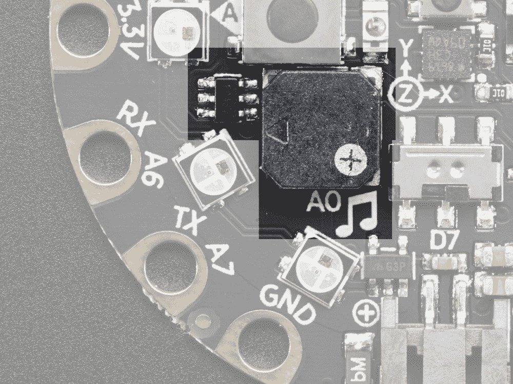
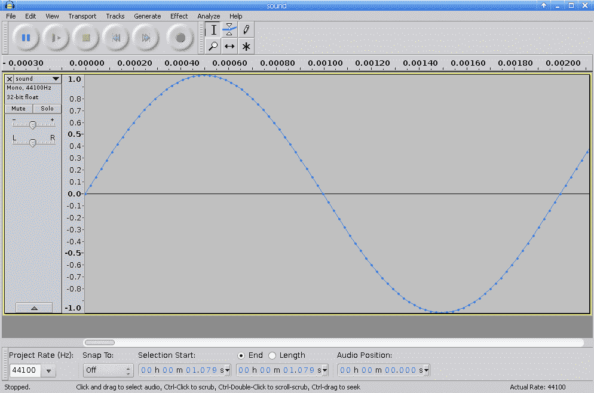
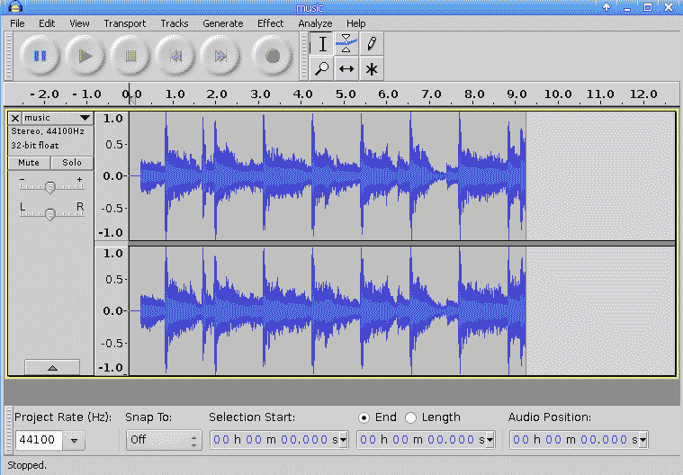
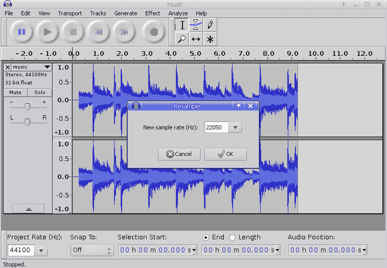
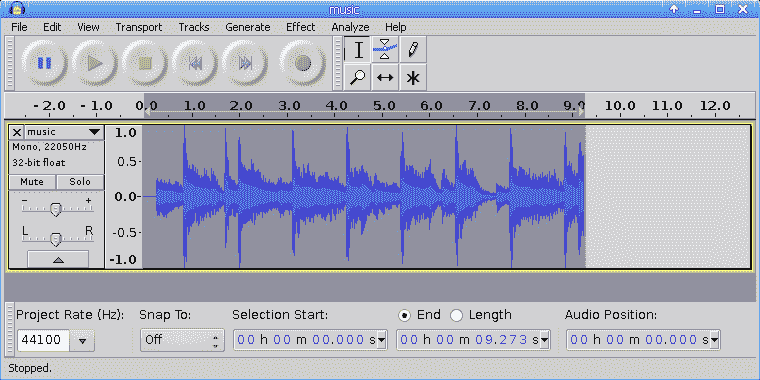

# 第三章：创建声音和音乐

本章将介绍使用 Adafruit Circuit Playground Express 上的硬件制作声音和播放音乐的方法。本章首先介绍了让板子以特定频率发出蜂鸣声的基础知识，然后将进一步介绍更高级的主题，如使用 WAV 文件格式和板载扬声器播放音乐文件。本章的技术可以直接用于您可能制作的各种 MicroPython 项目中。本章中产生音频输出的选项范围从产生简单的蜂鸣声到在嵌入式项目中播放歌曲。

在本章中，我们将介绍以下教程：

+   发出蜂鸣声

+   控制音调、频率和持续时间

+   播放音符

+   播放旋律

+   发出警报

+   播放 WAV 文件

+   将 MP3 文件转换为 WAV 文件

+   开始和停止音调

# Adafruit Circuit Playground Express 布局

以下照片显示了板子上内置扬声器的位置。本章涵盖的所有蜂鸣声和声音都将使用此扬声器进行播放：



由 adafruit.com 提供

# 发出蜂鸣声

在本教程中，我们将学习如何使扬声器以特定的声音频率发出蜂鸣声，并持续一定的时间。音频输出是引起某人注意的好方法；您可以在到处都能找到它，从响铃电话到门铃。本教程将为您提供向嵌入式项目添加蜂鸣声所需的技能。

# 准备就绪

您需要访问 Circuit Playground Express 上的 REPL 来运行本教程中提供的代码。

# 如何做...

让我们执行以下步骤：

1.  在 REPL 中运行以下代码行。您应该听到以 900 赫兹的频率播放 0.2 秒的蜂鸣声：

```py
>>> from adafruit_circuitplayground.express import cpx
>>> cpx.play_tone(900, 0.2)
```

1.  执行以下代码，以便以较低频率的蜂鸣声播放更长时间：

```py
>>> cpx.play_tone(500, 0.4)
```

# 工作原理...

代码的第一行导入了 Circuit Playground Express 库。`cpx`对象公开了一个名为`play_tone`的方法。此方法接受两个参数：频率和持续时间。这些参数指定声音的频率（以赫兹为单位）以及声音将在多长时间内播放（以秒为单位）。

持续时间可以以浮点数给出。这意味着诸如`0.2`之类的值将对应于 200 毫秒。此方法调用是一个阻塞调用。因此，调用该方法将开始播放音频，并且在指定的时间到达之前不会返回任何内容。

# 还有更多...

本章介绍的技术是从板子上的扬声器生成蜂鸣声的一种非常直接的方法。但是，在幕后，发生了很多事情。当您指定声音的频率和持续时间时，它将以编程方式构建声波，然后将音频数据输入扬声器以播放声音。音频数据是通过在 Python 代码中构建正弦波来创建的。

构建此音频数据的代码是 Circuit Playground Express 库的一部分，该库已在本教程中导入。您可以下载代码并阅读以了解如何完成此操作。这是了解声波的数学和如何通过软件创建它们的绝佳方式。以下屏幕截图显示了计算机生成的以 500 赫兹播放的音调的外观：



您可以清楚地从前面的屏幕截图中看到，这看起来就像正弦波形。当我们放大以查看单个声音周期时，我们拍摄了该屏幕截图。由于声音以 500 赫兹播放，我们期望一个周期为 1/500 秒长。在这里，我们可以看到第一个波结束的地方——确切地说是在 0.002 秒处。

# 另请参阅

您可以使用以下参考资料了解更多信息：

+   有关`play_tone`方法的文档可以在[`circuitpython.readthedocs.io/projects/circuitplayground/en/latest/api.html#adafruit_circuitplayground.express.Express.play_tone`](https://circuitpython.readthedocs.io/projects/circuitplayground/en/latest/api.html#adafruit_circuitplayground.express.Express.play_tone)找到。

+   有关人类可以听到的音频频谱的更多细节可以在[`www.teachmeaudio.com/mixing/techniques/audio-spectrum/`](https://www.teachmeaudio.com/mixing/techniques/audio-spectrum/)找到。

# 控制音调、频率和持续时间

在这个示例中，我们将学习如何以不同的频率和持续时间播放音调。通过重复播放不同频率的音调，每次持续时间都不同，我们可以学会如何超越单个蜂鸣声。这些步骤最终将使我们能够演奏旋律或不同音调，可以发出与警报相同的声音。

# 准备工作

您需要访问 Circuit Playground Express 上的 REPL 才能运行本示例中提供的代码。

# 如何做...

让我们执行以下步骤：

1.  在 REPL 中运行以下代码行。您应该听到五个单独的音调，每个音调都会播放 0.2 秒。声音将从较低的音调开始，逐渐变得更高。每次播放音调时，音调的频率将被打印到 REPL 中的输出中：

```py
>>> from adafruit_circuitplayground.express import cpx >>> for i in range(500, 1000, 100): ... print(i) ... cpx.play_tone(i, 0.2)
...     
...     
... 
500
600
700
800
900
>>> 
```

1.  使用以下代码播放三种不同的音调。音调将提高音高，并且播放时间也会增加：

```py
>>> from adafruit_circuitplayground.express import cpx
>>> for i in range(200, 500, 100):
...     print(i)
...     cpx.play_tone(i, i/1000)
...     
...     
... 
200
300
400
>>> 
```

# 工作原理…

在第一段代码中，`for`循环将迭代频率值，从 500 开始，每次增加 100，直到结束于 900。这个范围和这些步骤对人耳来说是很容易听到的。在每次迭代中，将打印要播放的频率，然后使用`play_tone`方法播放。每次迭代中只有声音的频率会改变；它们都会播放 200 毫秒。

在第二段代码中，`for`循环将迭代一个较低的音调，并且音调较少。对于每次迭代，音调的频率和持续时间都会增加。频率将是`i`变量的确切值，而持续时间将是以毫秒为单位的`i`的值。由于`play_tone`方法期望的值是以秒为单位的，所以我们必须将其除以 1,000。

# 还有更多...

本章介绍的两个`for`循环变化了在短暂的时间内播放音调的方式。在这两个示例中，音调在一秒钟内播放，但它们有三个或更多不同的音调。

这是一个很好的起点，可以尝试不同变化的循环。因为每个循环只需要一秒钟，所以你可以快速进行实验，立即听到结果。尝试通过改变音调或音调变化的速度来进行实验。

在两个循环中，音调随着每次迭代而增加。尝试并实验一个音调，使其随着每次迭代而降低。

# 另请参阅

您可以使用以下参考资料了解更多信息：

+   有关 Python range 函数的文档可以在[`docs.python.org/3/library/functions.html#func-range`](https://docs.python.org/3/library/functions.html#func-range)找到。

+   有关音调和频率的解释可以在[`www.le.ac.uk/se/centres/sci/selfstudy/snd5.htm`](https://www.le.ac.uk/se/centres/sci/selfstudy/snd5.htm)找到。

# 演奏一个音符

在这个示例中，我们将学习如何定义一些全局常量，每个常量代表一个特定的音符。然后，我们可以通过引用它们的常量来演奏这些不同的音符。音符是旋律的基本组成部分。这将是演奏旋律的第一步。一旦我们学会了如何演奏一个音符，我们就可以在以后的示例中将多个音符组合在一起演奏旋律。

# 准备工作

您需要访问 Circuit Playground Express 上的 REPL 来运行本食谱中提供的代码。

# 如何做...

让我们执行以下步骤：

1.  在 REPL 中运行以下代码行：

```py
>>> from adafruit_circuitplayground.express import cpx
>>> E5 = 659
>>> C5 = 523
>>> G5 = 784
>>> cpx.play_tone(E5, 0.15)
```

您应该听到音箱播放`E5`音符，持续 0.15 秒。

1.  使用以下代码播放`C5`和`G5`音符，持续 0.15 秒：

```py
cpx.play_tone(C5, 0.15)
cpx.play_tone(G5, 0.15)
```

# 它是如何工作的...

本食谱的第一行代码导入了 Circuit Playground Express 库。然后，定义了三个全局常量，并以它们关联的音符命名。本食谱使用**科学音高记谱法**（**SPN**）。这种记谱法通过将音符名称与指定音高的数字相结合来工作。在 E5 的情况下，音符将是 E，音高将是 5。在这里，每个音符都映射到特定的声音频率。

在第一段代码块中，通过在调用`play_tone`方法时引用`E5`全局常量来简单地播放`E5`音符。将持续时间设置为`0.15`允许每个音符播放 150 毫秒，这样可以为音乐创造一个舒适的节奏。减少或增加此值可以增加或减少音乐音调的播放速度。第二段代码以相同的速度播放其余两个音符。

本章中使用的频率遵循标准钢琴键频率。这相当于标准音乐音高和 12 平均律。

# 还有更多...

在本食谱中，我们使用了三个音符来演示定义音符然后播放每个音符的过程。当然，还可以定义许多其他音符。

一个很好的学习练习是找到其他流行音符的频率，并经历定义它们并播放它们的过程。尽管三个音符似乎太少，但足以演奏出一个可识别的旋律。在下一个食谱中，我们将看到这三个音符如何组合在一起演奏一首流行的旋律。

# 另请参阅

您可以使用以下参考资料了解更多信息：

+   八度记谱法的解释可以在[`www.flutopedia.com/octave_notation.html`](http://www.flutopedia.com/octave_notation.html)找到。

+   可以在[`mdoege.github.io/PySynth/`](https://mdoege.github.io/PySynth/)找到基于 Python 的软件合成器。

# 演奏旋律

在本食谱中，我们将学习如何通过播放一系列音符来演奏旋律。单独的音符本身相当无聊。真正的乐趣开始于您可以组合一系列音符并正确计时以演奏旋律。

通过遵循标准的音乐记谱法，将能够以一种 Circuit Playground Express 能够播放的方式在 Python 中指定流行的旋律。

# 准备工作

您需要访问 Circuit Playground Express 上的 REPL 来运行本食谱中提供的代码。

# 如何做...

让我们执行以下步骤：

1.  在 REPL 中运行以下代码行。您应该听到音箱播放`E5`音符，持续 0.15 秒：

```py
>>> import time
>>> from adafruit_circuitplayground.express import cpx
>>> 
>>> E5 = 659
>>> C5 = 523
>>> G5 = 784
>>> 
>>> def play_note(note, duration=0.15):
...     if note == 0:
...         time.sleep(duration)
...     else:
...         cpx.play_tone(note, duration)
... 
>>> play_note(E5)
```

1.  使用以下代码行以两倍速播放相同的音符，然后以一半的速度播放：

```py
>>> play_note(E5, 0.15 / 2)
>>> play_note(E5, 0.15 * 2)
```

1.  使用以下代码行播放空白，并使扬声器保持安静，持续时间与正常速度播放一个音符的时间相同：

```py
>>> play_note(0)
```

1.  使用以下代码行播放*超级马里奥兄弟*主题曲的开头部分：

```py
>>> MELODY = (E5, E5, 0, E5, 0, C5, E5, 0, G5)
>>> for note in MELODY:
...     play_note(note)
... 
>>> 
```

1.  接下来的代码将结合本食谱中显示的所有代码，以制作一个完整的程序。将其添加到`main.py`文件中，它将在重新加载代码时播放*超级马里奥兄弟*主题曲的开头部分：

```py
import time
from adafruit_circuitplayground.express import cpx

E5 = 659
C5 = 523
G5 = 784

MELODY = (E5, E5, 0, E5, 0, C5, E5, 0, G5)

def play_note(note, duration=0.15):
    if note == 0:
        time.sleep(duration)
    else:
        cpx.play_tone(note, duration)

for note in MELODY:
    play_note(note)
```

# 它是如何工作的...

初始的代码行导入必要的库并设置程序中其余代码所需的常量。`MELODY`常量包含构成歌曲的音符序列。在某些音符之间有静音暂停；这些暂停只需指定值为`0`，表示此时不应播放任何音符。`play_note`函数期望给出要播放的音符的频率，以及可选的音符播放时间。如果给出频率`0`，它将调用 sleep 函数保持静音；否则，它将播放音符作为音调。

最后，程序末尾的`for`循环简单地循环遍历旋律中定义的每个音符，并通过调用`play_note`函数来播放它。通过这种方式，您可以定义许多不同的旋律和歌曲，并根据用户与设备的交互方式播放不同的歌曲。

# 有更多...

这个配方是以通用方式编写的：您采用一首流行的旋律，提供音符序列和每个音符的相关频率，然后将旋律添加到您的项目中。这个配方中的旋律让每个音符以相同的持续时间播放。

然而，有许多旋律可能混合四分音符和八分音符。这些旋律将需要为每个音符定义不同的持续时间。可以扩展该配方，以便我们可以跟踪要播放的每个音符以及每个音符需要播放的持续时间。

# 另请参阅

您可以使用以下参考资料了解更多信息：

+   可以在[`www.princetronics.com/supermariothemesong/`](https://www.princetronics.com/supermariothemesong/)找到在 Arduino 设备上播放*超级马里奥兄弟*主题曲的示例。

+   有关 Circuit Playground 声音和音乐的讨论可在[`learn.adafruit.com/circuit-playground-music`](https://learn.adafruit.com/circuit-playground-music)找到。

+   在[`learn.adafruit.com/circuit-playground-hot-potato/caternuson-playing-a-melody`](https://learn.adafruit.com/circuit-playground-hot-potato/caternuson-playing-a-melody)找到 Circuit Playground 上演奏旋律的示例。

# 发出警报

在这个配方中，我们将学习如何播放低音和高音频率的声音，以创建警报声音。警报声音对于提醒人们引起他们的注意非常有用。这个配方演示了创建警报声音的一种非常简单但有效的方法，然后可以根据项目的需要进行调整。

# 准备工作

您需要访问 Circuit Playground Express 上的 REPL 来运行本配方中提供的代码。

# 如何做到...

让我们为这个配方执行以下步骤：

1.  在 REPL 中运行以下代码行。您应该听到高音的蜂鸣声持续 0.5 秒：

```py
>>> from adafruit_circuitplayground.express import cpx
>>> 
>>> BEEP_HIGH = 960
>>> BEEP_LOW = 800
>>> 
>>> cpx.play_tone(BEEP_HIGH, 0.5)
```

1.  使用以下代码播放低音的蜂鸣声 0.5 秒：

```py
>>> cpx.play_tone(BEEP_LOW, 0.5)
```

1.  使用以下代码播放警报器，通过三个周期从高音到低音，总共播放三秒：

```py
>>> for i in range(3):
...     cpx.play_tone(BEEP_HIGH, 0.5)
...     cpx.play_tone(BEEP_LOW, 0.5)
... 
>>> 
```

1.  接下来的代码将结合本配方中显示的所有代码，以制作一个完整的程序。将其添加到`main.py`文件中，每次重新加载代码时都会播放三秒的警报声音：

```py
from adafruit_circuitplayground.express import cpx

BEEP_HIGH = 960
BEEP_LOW = 800

for i in range(3):
    cpx.play_tone(BEEP_HIGH, 0.5)
    cpx.play_tone(BEEP_LOW, 0.5)
```

# 它是如何工作的...

初始的代码行导入必要的库并设置程序中其余代码所需的常量。然后，脚本循环三次，每次迭代都会播放一秒钟的声音。

在每次迭代中，将播放高音持续半秒，然后低音持续半秒。通过这种方式，创建了一个警报声音效果，类似于警报声音。

# 有更多...

此代码可以放入一个接收参数计数的函数中，该参数指定警报响响多少次或多少秒。然后，对于项目中的任何代码，您都可以调用该函数，使您的板播放 10 秒或 30 秒的警报。您还可以将此教程与书中的其他教程结合起来，使板上的像素以与警报相同的方式闪烁为红色。

# 另请参阅

您可以使用以下参考资料了解更多信息：

+   调用`play_tone`方法时更改频率的示例可以在[`learn.adafruit.com/circuitpython-made-easy-on-circuit-playground-express/play-tone`](https://learn.adafruit.com/circuitpython-made-easy-on-circuit-playground-express/play-tone)中找到。

+   可以在[`www.instructables.com/id/How-to-Make-a-Siren-Using-Arduino/`](https://www.instructables.com/id/How-to-Make-a-Siren-Using-Arduino/)找到制作警报声音的微控制器项目。

# 播放 WAV 文件

在本教程中，我们将学习如何使用扬声器播放您选择的 WAV 文件。Circuit Playground Express 上有大量存储空间，可以存储短音频片段，并可以在特定时间播放。

音调、蜂鸣、警报和旋律都很棒；但是，一旦您可以播放 WAV 文件，那么您就可以播放任何类型的声音。

# 准备工作

您需要访问 Circuit Playground Express 上的 REPL 来运行本教程中提供的代码。

# 操作步骤...

让我们执行以下步骤：

1.  将`hello.wav`文件复制到与`main.py`文件相同的文件夹中的设备上。然后，在 REPL 中运行以下代码行：

```py
>>> from adafruit_circuitplayground.express import cpx
>>> cpx.play_file('hello.wav')
```

1.  您应该听到板子播放音频文件时说“**你好**”。

# 工作原理...

代码的第一行导入了 Circuit Playground Express 库。`cpx`对象公开了一个名为`play_file`的属性方法。该方法接受一个参数，即`.wav`文件名，该文件将在板上的扬声器上播放。

音频文件应该是 WAV 文件格式；它应该具有 22,050 kHz 的采样率，16 位格式，并且具有单声道音频。此方法将打开音频文件并在扬声器上开始播放。它还将不断轮询音频设备，直到播放完成，并在音频播放完成后返回。

# 还有更多...

由于板上的硬件限制，您将无法播放诸如 MP3 这样的压缩音乐格式。文件需要以特定的未压缩文件格式，直接输入到板上的播放硬件中。

这样做的一个后果是，未压缩的声音流会更大，因此只能存储短音频片段在设备上。这仍然为播放声音效果或其他短音频片段提供了许多可能性。

# 另请参阅

您可以使用以下参考资料了解更多信息：

+   可以在[`circuitpython.readthedocs.io/projects/circuitplayground/en/latest/api.html#adafruit_circuitplayground.express.Express.play_file`](https://circuitpython.readthedocs.io/projects/circuitplayground/en/latest/api.html#adafruit_circuitplayground.express.Express.play_file)找到`play_file`方法的文档。

+   调用`play_file`方法的示例可以在[`learn.adafruit.com/circuitpython-made-easy-on-circuit-playground-express/play-file`](https://learn.adafruit.com/circuitpython-made-easy-on-circuit-playground-express/play-file)中找到。

# 将 MP3 文件转换为 WAV 文件

在本教程中，我们将学习如何将 MP3 文件转换为 WAV 文件，然后可以在 Circuit Playground Express 上播放。MP3 文件是最流行的声音文件格式之一。当您有一个要包含在嵌入式项目中的音频剪辑，但需要将其转换为正确的格式以便正确播放时，本教程非常有用。

# 准备工作

您需要下载并安装开源音频编辑软件 Audacity。它适用于 Windows、macOS 和 Linux。

Audacity 可以从官方网站[`www.audacityteam.org/`](https://www.audacityteam.org/)下载。

# 如何做...

让我们执行以下步骤：

1.  启动 Audacity 软件，然后选择文件|打开。然后，选择 MP3 文件并单击打开。

1.  应用程序中应该显示音频文件的详细信息，如下面的屏幕截图所示：



1.  选择轨道|重新采样，然后应该出现以下对话框：



1.  将新的采样率设置为`22050`，然后单击确定。

1.  现在，选择轨道|立体声轨道转换为单声道。屏幕上应该只有一个单声道，而不是可见的立体声音频流：



音频数据现在已准备好导出为 WAV 格式。

1.  接下来，选择文件|导出音频。

1.  将文件格式下拉菜单设置为 WAV（Microsoft）签名 16 位 PCM 的值。

1.  单击保存按钮。

1.  现在，您可以将 WAV 文件复制到板上并在设备上播放它。

# 它是如何工作的...

Circuit Playground Express 板期望音频文件以 WAV 文件格式存在，并且采样率为 22,050 kHz，采用 16 位格式，并且具有音频数据的单声道。Audacity 是一款多功能音频编辑器，可以打开任意数量的音频格式，并执行必要的更改以将音频数据转换为正确的格式。

在这个教程中采取的步骤重新采样音频数据并将音频通道转换为单声道。完成后，音频数据可以导出到正确的 WAV 格式。重要的是要注意，WAV 文件不像其他音频格式那样被压缩，因此它们将占用更多的空间。这与该设备上的存储限制相结合，意味着只能使用短音频剪辑，以便它们可以适应该设备。

# 还有更多...

这个教程侧重于 MP3 文件格式作为输入格式。但是，Audacity 支持广泛的输入格式，因此您不仅限于该输入格式进行转换。当您想要从更大的音频流中准备一个短音频剪辑时，Audacity 还具有广泛的编辑功能，这将非常有用。

一个很好的例子是，当您有一首可能长达五分钟的歌曲，但您只想要一个短短的五秒钟的片段加载到您的板上。然后，您可以使用 Audacity 的编辑和转换功能来实现最终结果。

# 另请参阅

您可以使用以下参考资料了解更多信息：

+   有关 WAV PCM 音频文件格式的更多详细信息，请访问[`soundfile.sapp.org/doc/WaveFormat/`](http://soundfile.sapp.org/doc/WaveFormat/)。

+   有关在微控制器音频项目中使用 Audacity 的指南，请访问[`learn.adafruit.com/microcontroller-compatible-audio-file-conversion`](https://learn.adafruit.com/microcontroller-compatible-audio-file-conversion)。

# 开始和停止音调

在这个教程中，我们将学习如何使用`start_tone`和`stop_tone`调用在后台播放音调，并在播放声音时控制板上的其他组件。本教程中使用的技术基本上允许您在播放声音时做更多事情。

实施此项目的一个示例是当您想要播放警报声并同时闪烁灯光时。

# 准备工作

您将需要访问 Circuit Playground Express 上的 REPL，以运行本教程中提供的代码。

# 如何做...

让我们执行以下步骤：

1.  在 REPL 中运行以下代码行。您应该听到一个高音的尖叫声，持续 0.5 秒：

```py
>>> from adafruit_circuitplayground.express import cpx
>>> import time
>>> 
>>> BEEP_HIGH = 960
>>> BEEP_LOW = 800
>>> 
>>> cpx.pixels.brightness = 0.10
>>> cpx.start_tone(BEEP_HIGH)
>>> time.sleep(0.5)
>>> cpx.stop_tone()
```

1.  使用以下代码在后台播放蜂鸣声，同时以 0.1 秒的间隔将 10 个像素变红。然后在动画结束时蜂鸣声将停止：

```py
>>> cpx.start_tone(BEEP_HIGH)
>>> for i in range(10):
...     cpx.pixels[i] = 0xFF0000
...     time.sleep(0.1)
... 
>>> cpx.stop_tone()
>>> 
```

1.  使用以下代码块执行类似的操作，但音调较低。在这里，像素动画将逐个关闭每个像素，最终在动画结束时结束音调：

```py
>>> cpx.start_tone(BEEP_LOW)
>>> for i in range(10):
...     cpx.pixels[i] = 0x000000
...     time.sleep(0.1)
... 
>>> cpx.stop_tone()
>>> 
```

1.  接下来的代码将所有在本示例中显示的代码组合在一起，以制作一个完整的程序。将其添加到`main.py`文件中，它将播放警报声并以警报声开启和关闭像素动画。

```py
from adafruit_circuitplayground.express import cpx
import time

BEEP_HIGH = 960
BEEP_LOW = 800

cpx.pixels.brightness = 0.10

cpx.start_tone(BEEP_HIGH)
for i in range(10):
    cpx.pixels[i] = 0xFF0000
    time.sleep(0.1)
cpx.stop_tone()

cpx.start_tone(BEEP_LOW)
for i in range(10):
    cpx.pixels[i] = 0x000000
    time.sleep(0.1)
cpx.stop_tone()
```

# 工作原理...

初始代码行导入必要的库并设置程序中其余代码所需的常量。像素的亮度也设置为更舒适的水平。然后脚本开始在后台播放高音调的蜂鸣声。在循环遍历 10 个像素并在每个循环之间以 0.1 秒的延迟将每个像素变红。

动画完成后，音调播放停止并播放较低的音调。像素再次被循环遍历；然而，这一次，它们逐个关闭。最后，一旦循环结束，音调播放停止。

# 还有更多...

尽管使用`start_tone`和`stop_tone`需要比简单调用`play_tone`更多的代码行，但它们允许您做一些仅使用`play_tone`是不可能做到的事情。例如，您可以使用脚本在音频在后台播放时执行其他任务。

在这个示例中，灯光和声音输出一起改变。但是，您可以使用相同的技术来播放音调，直到有人按下某个按钮。或者，您可以根据按下不同的按钮来改变正在播放的音调。

# 另请参阅

您可以使用以下参考资料了解更多信息：

+   有关`start_tone`方法的文档可在[`circuitpython.readthedocs.io/projects/circuitplayground/en/latest/api.html#adafruit_circuitplayground.express.Express.start_tone`](https://circuitpython.readthedocs.io/projects/circuitplayground/en/latest/api.html#adafruit_circuitplayground.express.Express.start_tone)找到。

+   有关`stop_tone`方法的文档可在[`circuitpython.readthedocs.io/projects/circuitplayground/en/latest/api.html#adafruit_circuitplayground.express.Express.stop_tone`](https://circuitpython.readthedocs.io/projects/circuitplayground/en/latest/api.html#adafruit_circuitplayground.express.Express.stop_tone)找到。
