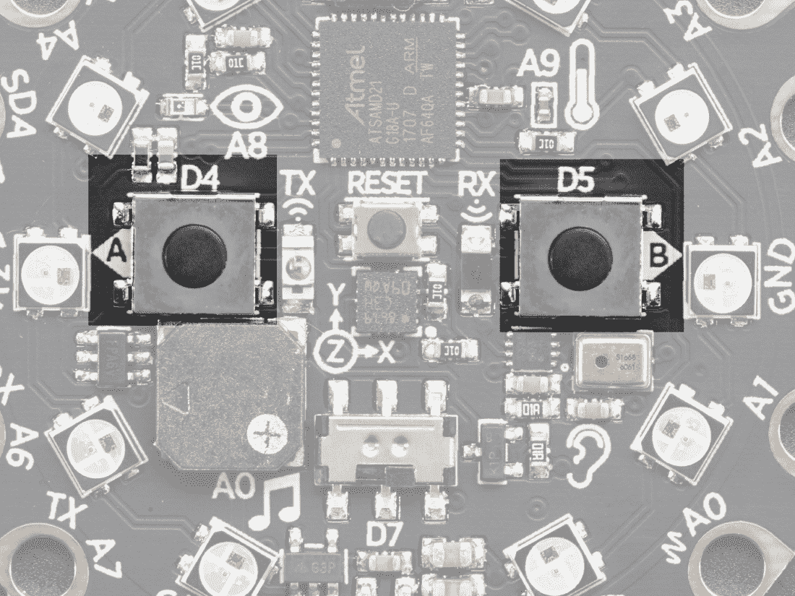
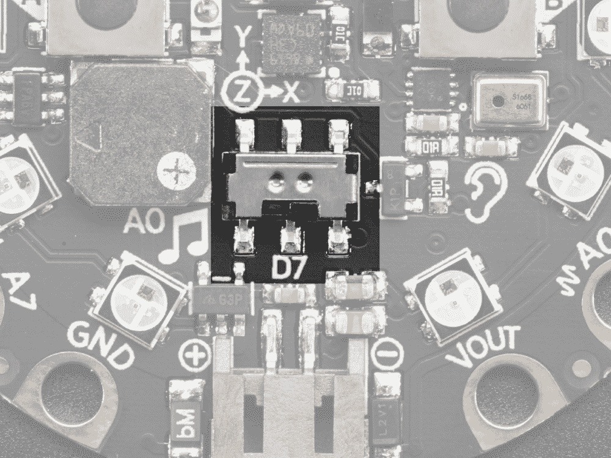
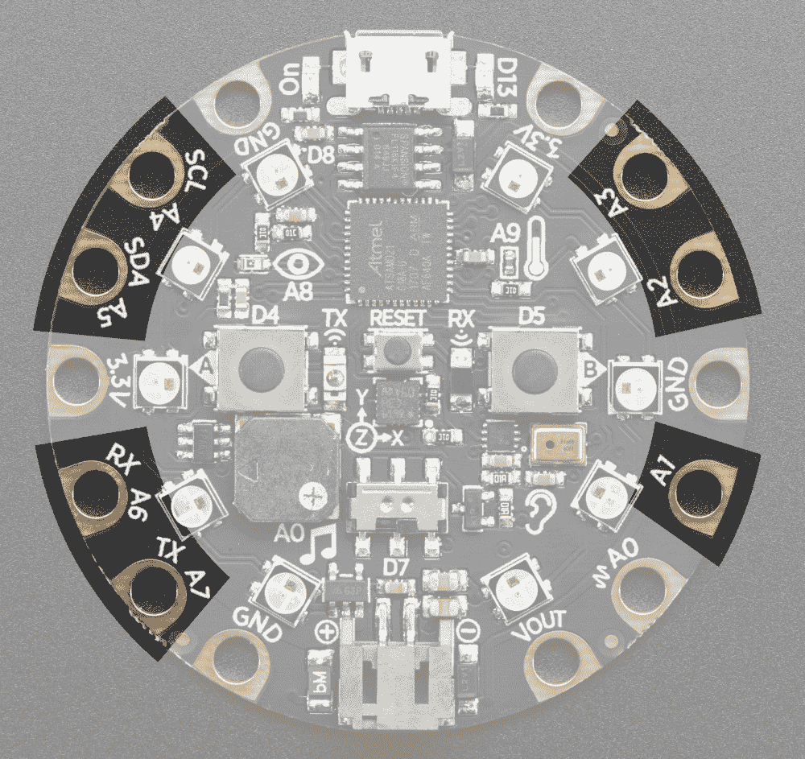

# 第四章：与按钮交互

本章将介绍与 Adafruit Circuit Playground Express 配备的按钮和触摸板进行交互的方法。您将学习如何检测按钮是否被按下，并且还将探索更高级的主题，例如微调电容触摸板的灵敏度。

在本章中，我们将介绍以下配方：

+   检测按下按钮

+   使用按下按钮控制 LED

+   读取滑动开关

+   在按钮状态更改时调用函数

+   使用按下按钮移动活动 LED

+   按下按钮时播放蜂鸣声

+   检测触摸板上的触摸

+   监视触摸板的原始测量值

+   调整触摸阈值

# Adafruit Circuit Playground Express 布局

以下照片显示了标有 A 和 B 的两个按下按钮的位置：



由 adafruit.com 提供

以下照片显示了设备上滑动开关的位置：



由 adafruit.com 提供

以下照片显示了板上七个电容触摸板的位置：



由 adafruit.com 提供

每个触摸板都包含可以导电的不同材料。鳄鱼夹可以用来连接这些材料到触摸板。此外，金属、水和水果都可以导电，足以用作连接器连接到触摸板。

现在，让我们看看如何检测按钮的按下。

# 检测按下按钮

在本配方中，我们将学习如何创建一个程序，当按下按钮时将打印一条消息。按下按钮是在设备上创建用户交互的好方法。该板配有两个按下按钮 A 和 B，因此您可以通过读取和响应按下按钮事件来创建各种不同的用户交互。

# 准备工作

您需要访问 Circuit Playground Express 上的 REPL 才能运行本配方中提供的代码。

# 如何做...

让我们执行以下步骤：

1.  首先，在 REPL 中运行以下代码行。这里`cpx.button_a`的值是`False`，因为按钮没有被按下：

```py
>>> from adafruit_circuitplayground.express import cpx
>>> cpx.button_a
False
```

1.  在运行以下代码块时，保持按下按钮 A。这将把值更改为`True`：

```py
>>> cpx.button_a
True
```

1.  然后，将以下代码添加到`main.py`文件中，这将在执行时重复打印按下按钮 A 的状态：

```py
from adafruit_circuitplayground.express import cpx
import time

while True:
    print(cpx.button_a)
    time.sleep(0.05)
```

# 它是如何工作的...

第一行代码导入了 Circuit Playground Express 库。`cpx`对象公开了一个名为`button_a`的属性。当按钮被按下时，此属性将返回`True`，当按钮未被按下时，它将返回`False`。

脚本循环运行，每个循环之间延迟 50 毫秒。按钮按下的状态不断打印。运行此程序时，按住并释放按钮，以查看打印输出的变化。

请注意，还有另一个名为`button_b`的属性，它具有相同的功能，但用于按下按钮 B。

# 还有更多...

在 Python 中与按下按钮交互的界面非常简单。基本上，它转换为一个布尔值，您可以在脚本执行期间的任何时间检查以检查按钮的当前状态。

在简单的情况下，反复检查按钮状态的轮询模型效果很好。然而，当您想要对每次按下按钮执行单个操作时，而不是持续按下按钮时，它会出现问题。这类似于您期望在桌面上与键盘交互的方式。在这种情况下，您期望一个物理按键按下将转换为一次应用的动作。另一方面，长时间按下的物理按键通常会产生重复的按键动作。

在大多数操作系统上，在释放按键之前会应用大约 500 毫秒的延迟，这被视为**重复按键操作**。当您尝试实现与按键自然和直观交互的代码时，牢记这些细节是很重要的。

# 另请参阅

您可以在这里找到更多信息：

+   有关`button_a`属性的更多文档可以在[`circuitpython.readthedocs.io/projects/circuitplayground/en/latest/api.html#adafruit_circuitplayground.express.Express.button_a`](https://circuitpython.readthedocs.io/projects/circuitplayground/en/latest/api.html#adafruit_circuitplayground.express.Express.button_a)找到。

+   可以在[`learn.adafruit.com/circuitpython-made-easy-on-circuit-playground-express/buttons`](https://learn.adafruit.com/circuitpython-made-easy-on-circuit-playground-express/buttons)找到与按键交互的示例。

# 使用按钮控制 LED

在这个示例中，我们将学习如何使用两个独立的按钮控制两个单独的 NeoPixels。这是一种有趣而简单的方式，可以使您的设备具有交互性。在这里，您将在按下每个按钮时立即从板上获得反馈，因为像素会做出响应而亮起。

# 准备工作

您需要访问 Circuit Playground Express 上的 REPL 才能运行本示例中提供的代码。

# 如何做...

让我们执行以下步骤：

1.  首先，在 REPL 中运行以下代码行：

```py
>>> from adafruit_circuitplayground.express import cpx
>>> 
>>> BLACK = 0x000000
>>> GREEN = 0x00FF00
>>> 
>>> cpx.pixels.brightness = 0.10
```

1.  在运行以下代码块时，保持按下按钮 A。您应该会看到紧挨着按钮的像素 2 变成绿色：

```py
>>> cpx.pixels[2] = GREEN if cpx.button_a else BLACK
```

1.  释放按钮 A 并运行以下代码块；现在应该看到像素 2 关闭：

```py
>>> cpx.pixels[2] = GREEN if cpx.button_a else BLACK
```

1.  将以下代码添加到`main.py`文件中，它将根据按下按钮 A 或按钮 B 来打开像素 2 和像素 7：

```py
from adafruit_circuitplayground.express import cpx

BLACK = 0x000000
GREEN = 0x00FF00

cpx.pixels.brightness = 0.10
while True:
    cpx.pixels[2] = GREEN if cpx.button_a else BLACK
    cpx.pixels[7] = GREEN if cpx.button_b else BLACK
```

# 工作原理...

代码的第一行导入了 Circuit Playground Express 库。定义了绿色和黑色的常量，并将像素亮度设置为舒适的水平。

然后，启动一个无限循环，每次迭代执行两行代码。如果按下按钮 A，则第一行将把像素 2 的颜色设置为绿色，否则将关闭像素。第二行将把像素 7 的颜色设置为绿色，如果按下按钮 B，则将关闭像素。

# 还有更多...

与本章第一个示例相比，在每次循环之间没有调用`sleep`函数来引起延迟。在这个特定的示例中，之所以不需要在轮询按钮状态之间设置延迟，是有原因的。如果其中一个按钮被按住，那么其中一个灯将打开并保持打开，而不会出现问题。

在第一个示例中，当按下按钮时将会出现大量的打印语句。仔细观察每种情况，以决定是否需要在每次轮询之间设置延迟。

# 另请参阅

您可以在这里找到更多信息：

+   有关条件表达式的更多文档可以在[`docs.python.org/3/reference/expressions.html#conditional-expressions`](https://docs.python.org/3/reference/expressions.html#conditional-expressions)找到。

+   有关按钮如何工作的更多详细信息，请访问[`sciencing.com/push-switches-work-electrical-circuit-5030234.html`](https://sciencing.com/push-switches-work-electrical-circuit-5030234.html)。

# 读取滑动开关

在这个示例中，我们将学习如何创建一个程序，该程序将重复打印滑动开关是打开还是关闭。滑动开关有其自身的优势，这个示例将演示如何将其纳入您的项目中。

# 准备工作

您需要访问 Circuit Playground Express 上的 REPL 才能运行本示例中提供的代码。

# 如何做...

让我们执行以下步骤：

1.  确保将滑动开关翻转到左侧。在 REPL 中运行以下代码行：

```py
>>> from adafruit_circuitplayground.express import cpx
>>> cpx.switch
True
```

1.  将滑动开关翻转到右侧。运行以下代码块：

```py
>>> cpx.switch
False
```

1.  将以下代码添加到`main.py`文件中，它将在执行时重复打印滑动开关的状态。将滑动开关向左和向右转动，观察输出的变化：

```py
from adafruit_circuitplayground.express import cpx
import time

while True:
    print(cpx.switch)
    time.sleep(0.05)
```

# 工作原理...

第一行代码导入了 Circuit Playground Express 库。`cpx`对象公开了一个名为`switch`的属性。当开关处于左侧位置时，此属性将返回`True`，当开关处于右侧位置时，将返回`False`。

该脚本将无限循环，每个循环之间有 50 毫秒的延迟。滑动开关的状态将不断打印。

# 还有更多...

按下按钮非常适合重复应用动作，或者当您希望注册单次按钮按下时。然而，滑动开关更适合当您希望人们能够在两种操作模式之间进行选择时。

例如，您可能有一个项目，其中有两种动画模式可以使用滑动开关进行选择。您可以使用滑动开关来启用或禁用项目中的警报声音。根据用户的操作，滑动开关或按钮可能更合适。

Circuit Playground Express 的好处在于两种选项都可用，因此您可以选择最适合您的选项。

# 另请参阅

您可以在这里找到更多信息：

+   有关开关属性的更多文档可以在[`circuitpython.readthedocs.io/projects/circuitplayground/en/latest/api.html#adafruit_circuitplayground.express.Express.switch`](https://circuitpython.readthedocs.io/projects/circuitplayground/en/latest/api.html#adafruit_circuitplayground.express.Express.switch)找到。

+   可以在[`learn.sparkfun.com/tutorials/switch-basics/all`](https://learn.sparkfun.com/tutorials/switch-basics/all)找到关于常见类型开关工作原理的解释。

# 在按钮状态改变时调用函数

在本文中，我们将学习如何在按钮状态发生变化时调用函数。通常要求仅在按钮状态发生变化时执行操作，而不是在按钮被按下时执行操作。本文演示了一种您可以在项目中实现此要求的技术。

# 准备工作

您需要访问 Circuit Playground Express 上的 REPL 来运行本文中提供的代码。

# 如何做...

让我们执行以下步骤：

1.  首先，在 REPL 中运行以下代码行：

```py
>>> from adafruit_circuitplayground.express import cpx
>>> def button_change(pressed):
...     print('pressed:', pressed)
... 
```

1.  这将定义`button_change`函数，每次按钮状态发生变化时都会调用该函数。运行以下代码，然后重复按下和释放按钮 A：

```py
>>> last = cpx.button_a
>>> while True:
...     if cpx.button_a != last:
...         button_change(cpx.button_a)
...         last = cpx.button_a
... 
pressed: True
pressed: False
pressed: True
pressed: False
pressed: True
pressed: False
```

1.  接下来的代码将结合本文中展示的所有代码，制作一个完整的程序。将其添加到`main.py`文件中；每次按下或释放按钮 A 时，它都会打印一条消息：

```py
from adafruit_circuitplayground.express import cpx

def button_change(pressed):
    print('pressed:', pressed)

last = cpx.button_a
while True:
    if cpx.button_a != last:
        button_change(cpx.button_a)
        last = cpx.button_a
```

# 工作原理...

定义了`button_change`函数，每次按钮状态改变时都会调用该函数。

`last`全局变量将用于跟踪按钮的上一个状态。然后，启动一个无限循环，它将检查按钮的当前状态是否与其上一个状态不同。如果检测到变化，它将调用`button_change`函数。

最后，每当按钮状态发生变化时，最新的按钮状态都将保存在`last`变量中。该脚本实际上实现了一个事件循环，用于检测按钮按下事件，并在检测到这些事件时调用`button_change`事件处理程序来处理这些事件。

# 还有更多...

偶尔，您可能希望将按钮按下注册为单个事件，而不管用户按下按钮的时间长短。这个方法通过跟踪按钮的先前状态并仅在按钮按下的结果时调用事件处理程序来实现这一目标。

尽管您需要跟踪按钮的最后状态这一额外步骤，但这种方法的好处在于您不必在轮询按键的延迟时间或重复键盘延迟的时间上纠缠。这个方法只是解决如何响应物理按钮交互的另一种可行方法。

# 另请参阅

您可以在这里找到更多信息：

+   可以在[`docs.python.org/3/library/cmd.html`](https://docs.python.org/3/library/cmd.html)找到事件循环和事件处理程序的很好的示例。

+   可以在[`learn.adafruit.com/sensor-plotting-with-mu-and-circuitpython/buttons-and-switch`](https://learn.adafruit.com/sensor-plotting-with-mu-and-circuitpython/buttons-and-switch)找到响应按钮按下的示例。

# 使用按钮移动活动 LED

在这个方法中，我们将学习如何根据按下左侧或右侧按钮来顺时针或逆时针移动活动的 NeoPixel。这个方法超越了以前方法中显示的更简单的按钮和 LED 交互。这是一个更复杂的方法，它将产生按钮按下正在使光在面板上以圆周运动的印象。

# 准备工作

您需要访问 Circuit Playground Express 上的 REPL 才能运行本方法中提供的代码。

# 如何做...

让我们执行以下步骤：

1.  在 REPL 中运行以下代码行：

```py
>>> from adafruit_circuitplayground.express import cpx
>>> import time
>>> 
>>> BLACK = 0x000000
>>> BLUE = 0x0000FF
>>> 
>>> cpx.pixels.brightness = 0.10
>>> i = 0
>>> direction = 1
>>> 
>>> 
```

1.  运行以下代码并按下按钮以查看其对像素的影响：

```py
>>> while True:
...     if cpx.button_a:
...         direction = 1
...     if cpx.button_b:
...         direction = -1
...     i += direction
...     i = i % 10
...     cpx.pixels.fill(BLACK)
...     cpx.pixels[i] = BLUE
...     time.sleep(0.05)
... 
```

1.  接下来的代码将结合本方法中显示的所有代码，以制作一个完整的程序。将此代码块添加到`main.py`文件中，它将在按下按钮 A 和按钮 B 时将点亮的像素的方向从顺时针改为逆时针：

```py
from adafruit_circuitplayground.express import cpx
import time

BLACK = 0x000000
BLUE = 0x0000FF

cpx.pixels.brightness = 0.10
i = 0
direction = 1
while True:
    if cpx.button_a:
        direction = 1
    if cpx.button_b:
        direction = -1
    i += direction
    i = i % 10
    cpx.pixels.fill(BLACK)
    cpx.pixels[i] = BLUE
    time.sleep(0.05)
```

# 它是如何工作的...

代码的第一行导入了 Circuit Playground Express 库和`time`库。然后设置了颜色常量和亮度级别。`i`变量将跟踪当前点亮的像素。`direction`变量将具有值`1`或`-1`，并将控制像素是顺时针移动还是逆时针移动。

在无限循环中，如果按下按钮 A 或按下按钮 B，则会更改方向。方向应用于位置，并应用模 10 运算，以便位置值在 0 和 10 之间旋转。

在每次迭代中，所有像素都会关闭，然后打开所选像素。通过调用使面板在每次循环迭代之间休眠 50 毫秒来控制灯光动画的速度。

# 还有更多...

这个方法结合了许多不同的技术，以产生最终的结果。它使用了一个动画效果，让看着面板的人认为光在面板上以圆圈的方式移动。

已实施动画效果以支持方向运动，使其看起来就像光在顺时针或逆时针方向移动。然后，按键与此动画结合在一起，以改变动画的方向。

您可以采用这个基本方法并将其适应不同的场景。例如，您可以用声音效果替换灯光秀，声音效果可以从安静到响亮，或者从响亮到安静，具体取决于按下哪个按钮。此外，您可以使用两个按键来增加或减少亮度级别。有两个按键可以打开许多选项，以便根据按下的按钮来增加或减少特定值。

# 另请参阅

您可以在这里找到更多信息：

+   可以在[`learn.adafruit.com/circuit-playground-simple-simon`](https://learn.adafruit.com/circuit-playground-simple-simon)找到使用按钮和像素的 Circuit Playground 项目的详细信息。

+   有关取模运算符的文档可以在[`docs.python.org/3.3/reference/expressions.html#binary-arithmetic-operations`](https://docs.python.org/3.3/reference/expressions.html#binary-arithmetic-operations)找到。

# 在按钮按下时播放蜂鸣声

在本教程中，我们将学习在按下按钮时播放蜂鸣声。之前的教程允许我们使用按钮与灯进行交互。本教程将向您展示如何在项目中引入按钮和声音交互。

# 准备工作

您需要访问 Circuit Playground Express 上的 REPL，以运行本教程中提供的代码。

# 如何做...

让我们执行以下步骤：

1.  在按住按钮 A 的同时在 REPL 中运行以下代码行：

```py
>>> from adafruit_circuitplayground.express import cpx
>>> if cpx.button_a:
...     cpx.play_tone(500, 0.2)
...     
...     
... 
>>>
```

1.  扬声器应该发出低音蜂鸣声。在按住按钮 B 的同时运行以下代码，您应该听到高音蜂鸣声：

```py
>>> if cpx.button_b:
...     cpx.play_tone(900, 0.2)
...     
...     
... 
>>> 
```

1.  接下来的代码将结合本教程中显示的所有代码，并向其中添加一个`while`循环，以使其成为一个完整的程序。将此添加到`main.py`文件中，当执行时，每次按下按钮 A 或按钮 B 时，它将产生高音或低音蜂鸣声：

```py
from adafruit_circuitplayground.express import cpx

while True:
    if cpx.button_a:
        cpx.play_tone(500, 0.2)
    if cpx.button_b:
        cpx.play_tone(900, 0.2)
```

# 它是如何工作的...

第一行代码导入了 Circuit Playground Express 库。然后进入一个无限循环，每次循环迭代都会检查按钮 A 或按钮 B 是否被按下，并在每种情况下播放不同音调的蜂鸣声，持续时间为 0.2 秒。

# 还有更多...

这个简单的教程演示了如何通过播放不同的音调使板对不同的按钮按下做出反应。另一种使脚本行为的方法是根据按下的按钮不同播放不同的音频`.wav`文件。滑动开关也可以并入到教程中，以设置两种不同的模式；一种模式可以播放低音调的音符，另一种可以播放高音调的音符。

# 另请参阅

您可以在这里找到更多信息：

+   有关 CircuitPython 如何读取按钮输入的示例可以在[`learn.adafruit.com/circuitpython-essentials/circuitpython-digital-in-out`](https://learn.adafruit.com/circuitpython-essentials/circuitpython-digital-in-out)找到。

+   可以在[`learn.adafruit.com/dear-diary-alarm`](https://learn.adafruit.com/dear-diary-alarm)找到对输入做出反应以播放不同音调的 Circuit Playground 项目的示例。

# 在触摸板上检测触摸

在本教程中，我们将学习如何检测触摸板何时被触摸，并在每次发生此事件时打印一条消息。Circuit Playground Express 配备了许多可以连接到各种对象的触摸板连接器。

基本上，任何可以导电的东西都可以用作与设备交互的方式。您可以使用导线、导电线、水果、水或铜箔与设备交互。

# 准备工作

您需要访问 Circuit Playground Express 上的 REPL，以运行本教程中提供的代码。

# 如何做...

让我们执行以下步骤：

1.  在 REPL 中运行以下代码行。`cpx.touch_A1`的值为`False`，因为未触摸触摸板 A1：

```py
>>> from adafruit_circuitplayground.express import cpx
>>> cpx.touch_A1
False
```

1.  在运行以下代码块时，保持手指触摸触摸板 A1：

```py
>>> cpx.touch_A1
True
```

1.  以下代码应添加到`main.py`文件中。每次按下触摸板 A1 时，这将打印一条消息：

```py
from adafruit_circuitplayground.express import cpx
import time

while True:
    if cpx.touch_A1:
        print('detected touch')
    time.sleep(0.05)
```

# 它是如何工作的...

前几行代码导入了 Circuit Playground Express 库和`time`库。然后脚本进入一个无限循环，在每次循环迭代中检查触摸板 A1 的状态。如果检测到触摸事件，则会打印一条消息。

# 还有更多...

本教程演示了与触摸板交互的简单方法。但是，当涉及到电容触摸传感器时，细节至关重要。取决于您连接到触摸板的材料的导电性，您可能会发现自己处于两个极端之一；也就是说，传感器可能根本不会检测到某些触摸事件，或者如果有很多环境噪音被错误地检测为多次触摸事件。

这些设备并不像机械按钮那样简单。然而，它们将让您创建可以使用香蕉和橙子与嵌入式设备进行交互的项目（因为它们具有电导性）。

# 另请参阅

您可以在这里找到更多信息：

+   有关`touch_A1`属性的更多文档可以在[`circuitpython.readthedocs.io/projects/circuitplayground/en/latest/api.html#adafruit_circuitplayground.express.Express.touch_A1`](https://circuitpython.readthedocs.io/projects/circuitplayground/en/latest/api.html#adafruit_circuitplayground.express.Express.touch_A1)找到。

+   可以在[`learn.adafruit.com/adafruit-circuit-playground-express/adafruit2-circuitpython-cap-touch`](https://learn.adafruit.com/adafruit-circuit-playground-express/adafruit2-circuitpython-cap-touch)找到与电容触摸传感器交互的示例。

# 监控触摸板的原始测量值

在这个教程中，我们将学习如何监控触摸板的原始测量值，这是验证触摸阈值应该如何调整的非常有用的方法。能够直接读取来自触摸传感器的原始传感器值非常重要。

当您想要正确设置触摸阈值或想要找出为什么触摸板的响应方式与您的预期不符时，这种详细级别是必要的。

# 准备工作

您需要访问 Circuit Playground Express 上的 REPL 才能运行本教程中提供的代码。

# 如何操作...

让我们执行以下步骤：

1.  在 REPL 中运行以下代码行。输出显示了从原始触摸测量中获取的值以及在创建对象时自动设置的初始阈值值：

```py
>>> import time
>>> import touchio
>>> import board
>>> a1 = touchio.TouchIn(board.A1)
>>> a1.raw_value
1933
>>> a1.threshold
2050
>>> 
```

1.  在运行下一段代码时，保持手指触摸触摸板 A1：

```py
>>> a1.raw_value
4065
```

1.  在运行下一段代码时，从触摸板 A1 上松开手指：

```py
>>> a1.raw_value
1839
```

1.  以下代码应添加到`main.py`文件中，然后运行。在执行此代码时，它将不断打印原始触摸测量值和当前阈值，并确定当前读数是否被视为触摸事件。此脚本可用于获取实时传感器读数：

```py
import time
import touchio
import board

a1 = touchio.TouchIn(board.A1)
while True:
    touch = a1.raw_value > a1.threshold
    print('raw:', a1.raw_value, 'threshold:', a1.threshold, 'touch:', touch)
    time.sleep(0.5)
```

# 工作原理...

前几行代码导入了与触摸板交互所需的不同低级库。创建了一个`TouchIn`对象并连接到 A1 接口。然后，运行一个无限循环，不断打印与传感器相关的多个值。它打印当前原始触摸测量值的阈值以及当前测量是否应被注册为触摸事件。

最后一个值只是`True`，但如果原始值超过阈值，那么它就是`False`。当`TouchIn`对象首次实例化时，阈值是通过取初始原始值并将其加 100 来设置的。

# 还有更多...

此脚本非常有用，可以验证从触摸传感器读取的实际值，并决定触摸阈值应设置多低或多高。这也是将不同材料连接到您的板上并查看它们在导电和检测触摸事件方面表现如何的好方法。如果没有这些原始值，您只能猜测实际发生了什么。

本章中其他地方使用的高级属性实际上在底层使用了许多在本配方中介绍的库。查看这些高级代码的源代码很有帮助，因为其中的大部分是用 Python 实现的。此外，它可以让您了解代码实际上是如何与硬件交互的。

# 另请参阅

您可以在这里找到更多信息：

+   有关`touchio`模块的更多文档可以在[`circuitpython.readthedocs.io/en/3.x/shared-bindings/touchio/__init__.html`](https://circuitpython.readthedocs.io/en/3.x/shared-bindings/touchio/__init__.html)找到。

+   有关`board`模块的更多文档可以在[`circuitpython.readthedocs.io/en/3.x/shared-bindings/board/__init__.html`](https://circuitpython.readthedocs.io/en/3.x/shared-bindings/board/__init__.html)找到。

+   有关 Circuit Playground 上电容触摸传感器的功能的讨论可以在[`learn.adafruit.com/circuit-playground-fruit-drums/hello-capacitive-touch`](https://learn.adafruit.com/circuit-playground-fruit-drums/hello-capacitive-touch)找到。

+   有关电容触摸传感器工作原理的解释可以在[`scienceline.org/2012/01/okay-but-how-do-touch-screens-actually-work/`](https://scienceline.org/2012/01/okay-but-how-do-touch-screens-actually-work/)找到。

# 调整触摸阈值

在本配方中，我们将学习如何通过更改阈值来调整触摸板的灵敏度。这用于决定信号是否将被视为触摸事件。这是一个重要的设置，需要进行微调并设置为正确的值。如果不这样做，那么您的触摸项目将无法正确运行。

# 准备工作

您需要访问 Circuit Playground Express 上的 REPL 才能运行本配方中提供的代码。

# 如何做...

让我们执行以下步骤：

1.  在 REPL 中运行以下代码行。此时，触摸阈值将增加`200`：

```py
>>> from adafruit_circuitplayground.express import cpx
>>> import time
>>> 
>>> cpx.adjust_touch_threshold(200)
```

1.  在运行下一块代码时，保持手指触摸触摸板 A1：

```py
>>> cpx.touch_A1
True
```

1.  应将以下代码添加到`main.py`文件并运行。该脚本将通过`200`增加触摸阈值，并在传感器检测到触摸事件时打印消息：

```py
from adafruit_circuitplayground.express import cpx
import time

cpx.adjust_touch_threshold(200)
while True:
    if cpx.touch_A1:
        print('detected touch')
    time.sleep(0.5)
```

# 工作原理...

第一行代码导入了 Circuit Playground Express 库。`cpx`对象公开了一个名为`adjust_touch_threshold`的方法。可以使用此方法来更改触摸板上的配置阈值。调用时，所有触摸板的阈值都将增加指定的量。

增加阈值会使触摸板变得不那么敏感，而减小此值将使传感器更敏感。如果阈值设置得太低，则许多传感器读数将被错误地检测为触摸事件。另一方面，如果阈值太高，则无法检测到真正的触摸事件。在每次循环迭代之间应用 500 毫秒的休眠函数，以便在每次迭代期间不会检测到大量的触摸事件。

# 还有更多...

通过实验来决定阈值的最佳值是最好的方法。在开始调整阈值之前，将所有实际导电材料连接到触摸板。然后，在本章中的*监视触摸板原始测量*配方中，获取传感器读数的实时视图。

您还可以重复触摸所讨论的材料，以查看触摸和释放时读数的变化。根据这些读数，您可以设置可靠读取触摸事件的理想阈值。每次更改材料时重启脚本很重要，因为每次首次运行代码时都会发生初始阈值自动配置。

# 另请参阅

您可以在这里找到更多信息：

+   有关`adjust_touch_threshold`方法的进一步文档可以在[`circuitpython.readthedocs.io/projects/circuitplayground/en/latest/api.html#adafruit_circuitplayground.express.Express.adjust_touch_threshold`](https://circuitpython.readthedocs.io/projects/circuitplayground/en/latest/api.html#adafruit_circuitplayground.express.Express.adjust_touch_threshold)找到。

+   调用`adjust_touch_threshold`方法的示例可以在[`learn.adafruit.com/make-it-sense/circuitpython-6`](https://learn.adafruit.com/make-it-sense/circuitpython-6)找到。
