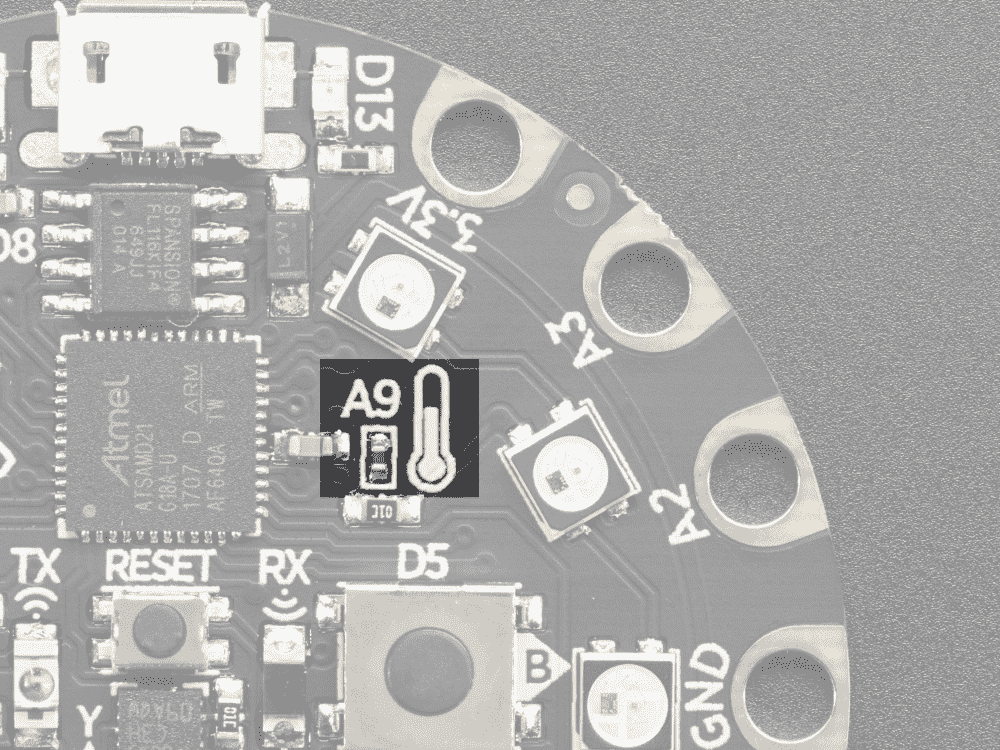
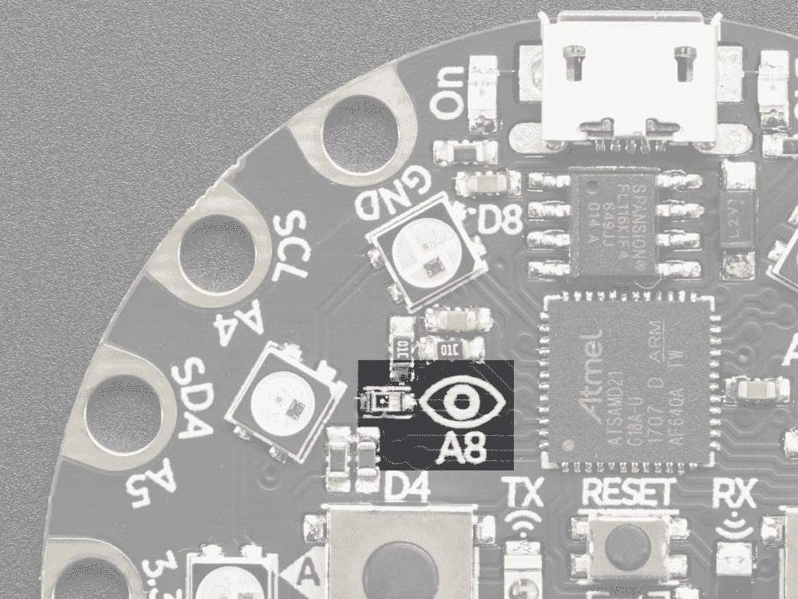
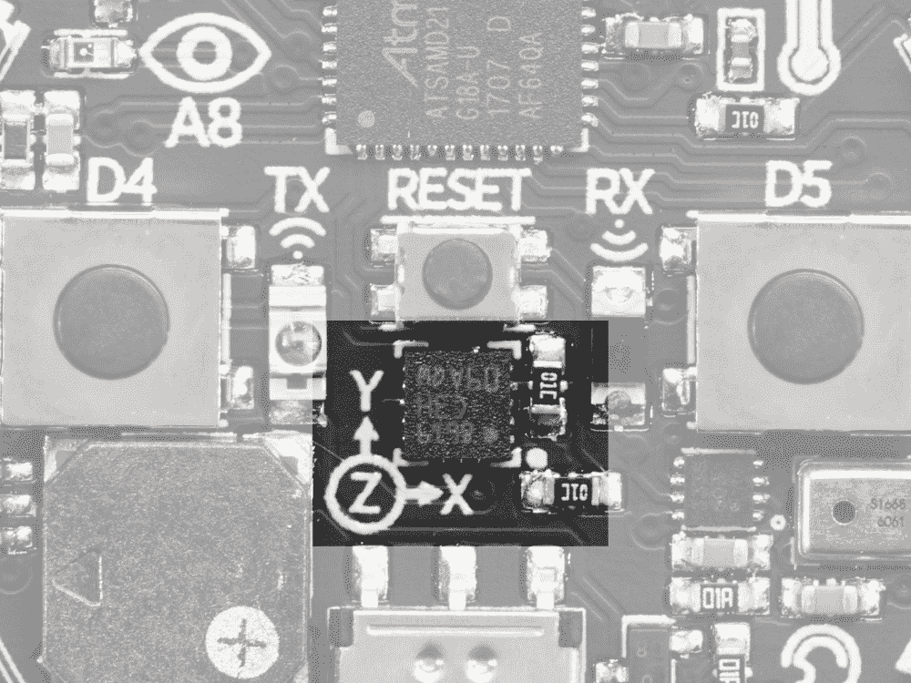
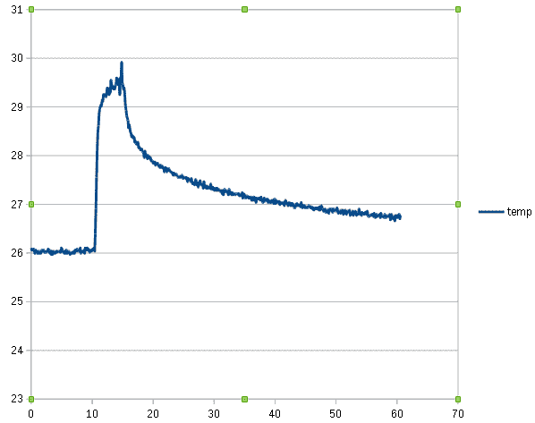

# 第五章：读取传感器数据

本章将介绍您可以使用的方法，从 Adafruit Circuit Playground Express 上的多个传感器读取传感器数据。我们将涵盖温度和光传感器，以及运动传感器，您还将学习如何使板对传感器事件做出反应，例如板被摇动或光照水平发生变化。访问这些丰富的传感器数据可以使各种各样的项目成为可能。例如，您可以制作一个项目，如果检测到的温度超过了某个水平，就会发出警报声。通过学习如何读取和处理这些传感器数据，您可以使各种嵌入式项目成为现实。

在本章中，我们将涵盖以下主题：

+   Circuit Playground Express 传感器

+   读取温度读数

+   从光传感器中读取亮度级别

+   创建光度计

+   从运动传感器读取数据

+   检测单击或双击

+   检测摇晃

+   摇晃时发出哔哔声

# Circuit Playground Express 传感器

本章将使用三种不同的硬件传感器来从环境中获取传感器读数。以下照片是一个热敏电阻的照片，显示了温度传感器的位置：



由 adafruit.com 提供

以下照片显示了设备上可用的光传感器：



由 adafruit.com 提供

以下照片显示了加速度计，它可以用于检测运动，以及在板上敲击和双击：



由 adafruit.com 提供

现在让我们来检查我们的第一个教程。

# 读取温度读数

在本教程中，我们将学习如何创建一个循环，重复地从温度传感器中读取当前温度并将其打印出来。这将让我们对传感器进行实验，并查看它对温度变化的反应。本教程中的方法可以在您需要将温度读数纳入项目中时使用。

# 准备工作

你需要访问 Circuit Playground Express 上的 REPL 来运行本教程中提供的代码。

# 如何做...

按照以下步骤学习如何读取温度读数：

1.  在 REPL 中运行以下代码。输出显示室温约为 25°C：

```py
>>> from adafruit_circuitplayground.express import cpx
>>> import time
>>> cpx.temperature
25.7499
```

1.  现在，通过按压温度传感器来增加温度传感器读数，使用您的体温，同时在进行下一次读数时：

```py
>>> cpx.temperature
30.031
```

1.  温度应该已经升高了几度。如果运行以下代码，应返回一个浮点数：

```py
>>> start = time.monotonic()
>>> start
27.409
```

1.  在执行以下代码行之前等待几秒钟。它将计算自您将值分配给 start 变量以来的秒数：

```py
>>> time.monotonic() - start
11.37
```

1.  如果运行以下代码，应该会显示所有本地变量及其值的列表作为字典：

```py
>>> locals()
{'time': <module 'time'>, 'start': 60.659, '__name__': '__main__'}
>>> 
```

1.  以下代码应放入`main.py`文件中，当执行时，将重复打印当前经过的时间和当前温度读数：

```py
from adafruit_circuitplayground.express import cpx
import time

start = time.monotonic()
while True:
    elapsed = time.monotonic() - start
    temp = cpx.temperature
    print('{elapsed:.2f}\t{temp}'.format(**locals()))
    time.sleep(0.1)
```

# 它是如何工作的...

代码的前几行导入了 Circuit Playground Express 库和`time`模块。`cpx`对象公开了一个名为`temperature`的属性-每当访问该值时，该属性将以浮点数的形式返回热敏电阻的当前温度读数。

这个值是以摄氏温度标度表示的。记录开始时间，以便为每个温度读数计算经过的时间。然后脚本进入一个无限循环，计算经过的时间并获取每个循环迭代的温度读数。

经过的时间和温度以制表符分隔打印。在开始下一个循环迭代之前，会应用 0.1 秒的延迟。

# 还有更多...

该设备上的温度传感器是**负温度系数**（NTC）热敏电阻。该元件是一个随温度变化而改变电阻的电阻器。通过测量其电阻，我们可以得到温度读数。在 NTC 热敏电阻的情况下，电阻会随着温度的升高而减小。

在这个示例中，时间和温度数据以制表符分隔的格式输出。这种格式使得将数据移入其他应用程序进行分析变得很容易。以下图表是使用从本示例的主脚本输出的数据生成的：



脚本运行了 60 秒后，从 REPL 中获取输出，并将其复制粘贴到我们的电子表格程序 LibreOffice Calc 中。制表符默认将时间和温度数据分隔到各自的列中。然后，使用这个数据表，生成了*x*-*y*散点图。

像这样绘制传感器数据，可以很容易地可视化温度读数随时间的变化。在这个特定的数据集中（在脚本执行开始时），温度传感器读取环境室温约为 26°C。在脚本执行约 10 秒后，传感器被触摸加热到接近 30°C。

在前面的图表中可以看到温度的急剧上升，发生在 10 秒的标记处。放开传感器后，它开始缓慢冷却，直到在 40 秒的时间内冷却到 27°C 以下。

# 另请参阅

以下是关于本示例的一些参考资料：

+   温度属性的文档可以在[`circuitpython.readthedocs.io/projects/circuitplayground/en/latest/api.html#adafruit_circuitplayground.express.Express.temperature`](https://circuitpython.readthedocs.io/projects/circuitplayground/en/latest/api.html#adafruit_circuitplayground.express.Express.temperature)找到。

+   CircuitPython `time`模块的文档可以在[`circuitpython.readthedocs.io/en/3.x/shared-bindings/time/__init__.html`](https://circuitpython.readthedocs.io/en/3.x/shared-bindings/time/__init__.html)找到。

+   内置`locals`函数的文档可以在[`docs.python.org/3/library/functions.html#locals`](https://docs.python.org/3/library/functions.html#locals)找到。

+   关于热敏电阻工作原理的详细信息可以在[`www.omega.com/prodinfo/thermistor.html`](https://www.omega.com/prodinfo/thermistor.html)找到。

+   LibreOffice Calc 应用程序的项目页面和应用程序下载可以在[`www.libreoffice.org/`](https://www.libreoffice.org/)找到。

# 从光传感器读取亮度级别

在这个示例中，我们将学习如何创建一个循环，以重复从光传感器读取当前的光亮度。从传感器获取实时读数可以是一种有趣的方式，可以用不同的光源来测试传感器的灵敏度。

最终，本示例中的技术可以帮助您构建与环境交互的项目，取决于光的存在或缺失。

# 准备工作

您需要访问 Circuit Playground Express 上的 REPL 来运行本示例中提供的代码。

# 操作步骤...

按照以下步骤学习如何从光传感器读取亮度级别：

1.  在 REPL 中执行以下代码块：

```py
>>> from adafruit_circuitplayground.express import cpx
>>> cpx.light
5
```

1.  输出的数字是房间的光照水平。在正常光照条件下，这个数字应该很低。

1.  现在，在运行以下代码块时，用手电筒照射光传感器：

```py
>>> cpx.light
308
```

1.  您应该看到值飙升到一个更高的值。以下代码应该放入`main.py`文件中，并且在执行时，将重复打印从光传感器读取的当前光照水平：

```py
from adafruit_circuitplayground.express import cpx
import time

while True:
    print(cpx.light)
    time.sleep(0.1)
```

# 工作原理...

首先的代码行导入了 Circuit Playground Express 库和`time`模块。`cpx`对象公开了一个名为`light`的属性。这个属性将返回来自光传感器的当前光亮度读数。这个值使用勒克斯单位表示，这是一个用于测量照度的单位。

在这个脚本中，运行一个无限循环，打印当前的光亮度，然后在下一次迭代开始之前休眠 0.1 秒。

# 还有更多...

一个方便的方法来尝试光传感器是使用大多数智能手机上的手电筒。这个手电筒足够明亮，可以在 Circuit Playground Express 上创建光读数的显著差异。在运行本教程中的主要脚本时，观察当您将手电筒靠近或远离传感器时数值的变化。

该设备上的光传感器是光电晶体。这种设备是一种晶体管，当暴露在不同的光亮度下时，会导致电流流向其电路的差异。这些电气变化可以被读取，然后计算光亮度。

# 另请参阅

以下是关于这个教程的一些参考资料：

+   有关`light`属性的文档可以在[`circuitpython.readthedocs.io/projects/circuitplayground/en/latest/api.html#adafruit_circuitplayground.express.Express.light`](https://circuitpython.readthedocs.io/projects/circuitplayground/en/latest/api.html#adafruit_circuitplayground.express.Express.light)找到。

+   有关光电晶体工作原理的更多细节可以在[`www.elprocus.com/phototransistor-basics-circuit-diagram-advantages-applications/`](https://www.elprocus.com/phototransistor-basics-circuit-diagram-advantages-applications/)找到。

# 创建一个光度计

在这个教程中，我们将使用 10 个 NeoPixels 创建一个环，显示当前的光亮度。当光亮度增加和减少时，环会变得越来越小和越来越大。这个教程将向您展示一种可以使您的项目与光互动的方法。它还将展示将像素环转换为 10 级刻度的通用技术，您可以在各种项目中使用。

# 准备工作

您将需要访问 Circuit Playground Express 上的 REPL 来运行本教程中提供的代码。

# 如何做...

按照以下步骤学习如何创建光度计：

1.  使用 REPL 来运行以下代码行：

```py
>>> from adafruit_circuitplayground.express import cpx
>>> import time
>>> 
>>> BLACK = 0x000000
>>> BLUE = 0x0000FF
>>> MAX_LUX = 330
>>> cpx.pixels.brightness = 0.10
>>> 
>>> def gauge(level):
...     cpx.pixels[0:level] = [BLUE] * level
...     
...     
... 
>>> gauge(2)
```

1.  此时，您应该看到前两个像素变成蓝色。运行以下代码行，看到前五个像素变成蓝色：

```py
>>> gauge(5)
```

1.  以下代码应该放入`main.py`文件中，当执行时，它将创建一个光度计，随着光线变亮和变暗，它会变得越来越大和越来越小。

```py
from adafruit_circuitplayground.express import cpx
import time

BLACK = 0x000000
BLUE = 0x0000FF
MAX_LUX = 330
cpx.pixels.brightness = 0.10

def gauge(level):
    cpx.pixels[0:level] = [BLUE] * level

last = 0
while True:
    level = int((cpx.light / MAX_LUX) * 10)
    if level != last:
        cpx.pixels.fill(BLACK)
        gauge(level)
        last = level
    time.sleep(0.05)
```

# 它是如何工作的...

首先的代码行导入了 Circuit Playground Express 库和`time`模块。为蓝色和黑色定义了颜色代码。然后将亮度设置为舒适的水平。然后定义了`gauge`函数。这个函数接收一个整数参数，其值应在 0 到 10 之间。这个值将用于确定在像素环中有多少像素会变成蓝色。这个函数创建了一个类似于经典刻度表的可视显示，根据数值的级别显示一个较小或较大的环。

然后，初始化了`last`变量。这个变量用于跟踪刻度级别自上次循环以来是否发生了变化。这个额外的步骤是为了防止像素因不必要地在每个循环中关闭和打开而闪烁。刻度级别是通过获取当前光亮度并将其除以其最大可能值来计算的，这在这块板上恰好是 330。

然后将该值乘以 10，这是仪表中的级数。如果仪表级别发生了变化，所有像素将被关闭，然后显示正确的仪表级别。在每次无限循环的迭代过程中执行此过程，每个循环之间延迟 50 毫秒，以在与光传感器交互时产生响应的感觉。

# 还有更多...

在这个教程中，显示仪表的功能被故意保留在自己的函数中，以鼓励可重用性。它可以在其他项目中使用，或者保留在自己的模块中，可以在需要使用板上的像素显示信息作为仪表时导入并使用。

此教程的另一个方面是为了解决当您不必要地重复打开和关闭像素时出现的光闪烁问题而必须进行的额外工作。当您一次改变许多像素的状态时，如果您的实现不小心，可能会出现闪烁问题。这在功能上并不是一个主要问题；更多的是在人们使用光度计时创造更愉悦的视觉体验。

# 另请参阅

以下是有关此教程的一些参考资料：

+   可以在[`learn.adafruit.com/adafruit-circuit-playground-express/playground-sound-meter`](https://learn.adafruit.com/adafruit-circuit-playground-express/playground-sound-meter)找到使用 Circuit Playground Express 像素创建声音计的项目。

+   有关光度计及其用途的更多详细信息，请访问[`shuttermuse.com/glossary/light-meter/`](https://shuttermuse.com/glossary/light-meter/)。

# 从运动传感器读取数据

在这个教程中，我们将创建一个循环，不断从加速度计中读取数据，并打印*x*、*y*和*z*轴的数据。打印输出将帮助我们实验传感器对摇动板或以不同方向倾斜的反应。一旦您了解了传感器的工作原理，就可以开始将其纳入项目中，使板对倾斜或加速做出反应。

# 准备工作

您需要访问 Circuit Playground Express 上的 REPL 来运行此教程中提供的代码。

# 如何做...

按照以下步骤学习如何从运动传感器中读取数据：

1.  在将板放在水平表面并使按钮朝上的情况下，在 REPL 中运行以下代码行：

```py
>>> from adafruit_circuitplayground.express import cpx
>>> cpx.acceleration.z
9.46126
```

1.  在将板放置并使按钮朝下的情况下运行以下代码块：

```py
>>> cpx.acceleration.z
-9.30804
```

1.  以下代码应放入`main.py`文件中，并在执行时将不断打印加速度计的当前*x*、*y*和*z*轴数据：

```py
from adafruit_circuitplayground.express import cpx
import time

while True:
    x, y, z = cpx.acceleration
    print('x: {x:.2f} y: {y:.2f} z: {z:.2f}'.format(**locals()))
    time.sleep(0.1)
```

# 工作原理...

第一行代码导入了 Circuit Playground Express 库和`time`模块。启动了一个无限循环，每次循环都会从加速度计中获取读数。读数被解压缩为*x*、*y*和*z*变量。然后，在脚本进入休眠 0.1 秒之前，打印出每个轴的值，并开始下一次迭代。

# 还有更多...

在运行此脚本时，尝试以不同方向倾斜板。该传感器非常敏感，可以为您提供与板倾斜相关的相当准确的读数。除了检测板的方向外，它还可以用于检测三个轴上的加速度。在运行脚本的同时，还可以以不同方向摇动板，您应该看到与加速度相关的读数上升。根据您摇动板的方向，不同的轴应该相应地做出反应。

# 另请参阅

以下是有关此教程的一些参考资料：

+   有关`acceleration`属性的文档，请访问[`circuitpython.readthedocs.io/projects/circuitplayground/en/latest/api.html#adafruit_circuitplayground.express.Express.acceleration`](https://circuitpython.readthedocs.io/projects/circuitplayground/en/latest/api.html#adafruit_circuitplayground.express.Express.acceleration)。

+   有关 Circuit Playground Express 附带的加速度计的更多详细信息，请访问[`learn.adafruit.com/circuit-playground-lesson-number-0/accelerometer`](https://learn.adafruit.com/circuit-playground-lesson-number-0/accelerometer)。

# 检测单次或双次轻敲

在本教程中，我们将学习如何配置板以检测单次或双次轻敲。将使用来自加速度计的传感器数据来检测这些轻敲事件。本教程向您展示如何创建可以对人们敲击板做出反应的应用程序。

# 准备工作

您将需要访问 Circuit Playground Express 上的 REPL，以运行本教程中提供的代码。

# 如何做…

按照以下步骤学习如何检测单次或双次轻敲：

1.  在 REPL 中执行以下代码块：

```py
>>> from adafruit_circuitplayground.express import cpx
>>> cpx.detect_taps = 1
>>> cpx.tapped
False
```

1.  轻敲板一次，然后运行以下代码块。您应该会得到第一个值为`True`，表示检测到了轻敲，然后在下一次检查时得到一个`False`值，这表示自上次检查以来没有检测到新的轻敲：

```py
>>> cpx.tapped
True
>>> cpx.tapped
False
```

1.  以下代码应放入`main.py`文件中，当执行时，将不断打印自上次检查以来是否检测到了轻敲：

```py
from adafruit_circuitplayground.express import cpx
import time

cpx.detect_taps = 1
while True:
    print('tap detected:', cpx.tapped)
    time.sleep(0.1)
```

# 工作原理…

首先导入 Circuit Playground Express 库和`time`模块。将敲击检测算法配置为通过将`detect_taps`设置为`1`来检测单次轻敲。

开始一个无限循环，每次循环将检索`tapped`属性的值。此属性仅在自上次检查以来加速度计检测到单次轻敲时才返回`True`。然后调用`sleep`函数，使其在开始下一次迭代之前延迟 0.1 秒。

# 还有…

通过将`detect_taps`设置为`2`来修改脚本。再次运行它，尝试在板上执行一些单次轻敲。它不应该注册任何内容。

现在尝试执行一些双次轻敲。您应该会看到它们被检测到。尝试改变您用于轻敲板的力量的大小，看看在检测到轻敲之前需要什么级别的力量。

# 另请参阅

以下是有关本教程的一些参考资料：

+   有关`detect_taps`属性的文档，请访问[`circuitpython.readthedocs.io/projects/circuitplayground/en/latest/api.html#adafruit_circuitplayground.express.Express.detect_taps`](https://circuitpython.readthedocs.io/projects/circuitplayground/en/latest/api.html#adafruit_circuitplayground.express.Express.detect_taps)。

+   有关`tapped`属性的文档，请访问[`circuitpython.readthedocs.io/projects/circuitplayground/en/latest/api.html#adafruit_circuitplayground.express.Express.tapped`](https://circuitpython.readthedocs.io/projects/circuitplayground/en/latest/api.html#adafruit_circuitplayground.express.Express.tapped)。

+   有关板的轻敲检测功能的更多详细信息，请访问[`learn.adafruit.com/circuitpython-made-easy-on-circuit-playground-express/tap`](https://learn.adafruit.com/circuitpython-made-easy-on-circuit-playground-express/tap)。

# 检测摇晃

在本教程中，我们将学习如何轮询`shake`方法并在板被摇晃时打印它。创建可以响应设备被摇晃的项目可能非常有趣。还可以配置板，以便您可以指定在注册为摇晃之前需要轻或重摇晃。这可以开辟新的创造性方式，使人们与您的设备互动。

# 准备工作

您将需要访问 Circuit Playground Express 上的 REPL，以运行本教程中提供的代码。

# 如何做…

按照以下步骤学习如何检测摇晃：

1.  使用 REPL 运行以下代码行：

```py
>>> from adafruit_circuitplayground.express import cpx
>>> cpx.shake(20)
False
```

1.  在运行以下代码块时，反复摇晃板子：

```py
>>> cpx.shake(20)
True
```

1.  以下代码应放入`main.py`文件中，执行时，将不断打印板子当前是否在摇晃：

```py
from adafruit_circuitplayground.express import cpx
import time

while True:
    print('shake detected:', cpx.shake())
    time.sleep(0.1)
```

# 工作原理...

首先导入 Circuit Playground Express 库和`time`模块。启动一个无限循环，每次循环都会打印`shake`方法的结果。该方法将根据板子当前是否在摇晃而返回`True`或`False`。然后调用`sleep`函数，使下一次迭代之前延迟 0.1 秒。

# 还有更多...

修改脚本，并将`shake`函数的值作为第一个参数设置为`20`。现在，运行脚本并尝试摇晃它。您会发现需要更少的力量才能使板子注册摇晃事件。第一个参数`shake_threshold`的默认值为`30`，数值越低，板子对检测摇晃的敏感度就越高。不要将值设置为`10`或更低，否则它会变得过于敏感，并不断地认为它已经检测到了摇晃。

# 另请参阅

有关此方案的参考资料，请参阅：

+   有关`shake`方法的文档可以在[`circuitpython.readthedocs.io/projects/circuitplayground/en/latest/api.html#adafruit_circuitplayground.express.Express.shake`](https://circuitpython.readthedocs.io/projects/circuitplayground/en/latest/api.html#adafruit_circuitplayground.express.Express.shake)找到。

+   有关使用`shake`方法的示例，请参阅[`learn.adafruit.com/circuitpython-made-easy-on-circuit-playground-express/shake`](https://learn.adafruit.com/circuitpython-made-easy-on-circuit-playground-express/shake)。

# 摇晃时发出哔哔声

在这个方案中，我们将学习如何使板子在每次摇晃时发出哔哔声。这是一种有趣的方式，让板子对运动做出响应。相同的方法也可以用来使像素对摇晃做出响应，而不仅仅是发出哔哔声。

# 准备工作

您需要访问 Circuit Playground Express 上的 REPL，以运行本方案中提供的代码。

# 如何做...

按照以下步骤学习如何使板子在每次摇晃时发出哔哔声：

1.  在 REPL 中运行以下代码行；您应该听到一声哔哔声：

```py
>>> from adafruit_circuitplayground.express import cpx
>>> cpx.play_tone(900, 0.2)
```

1.  以下代码应放入`main.py`文件中，执行时，每次摇晃板子都会发出哔哔声：

```py
from adafruit_circuitplayground.express import cpx
import time

while True:
    if cpx.shake(20):
        cpx.play_tone(900, 0.2)
    time.sleep(0.1)
```

# 工作原理...

首先导入 Circuit Playground Express 库和`time`模块。启动一个无限循环，检查板子当前是否在摇晃。如果检测到摇晃事件，则会播放一个持续 0.2 秒的短暂哔哔声。之后，检查板子是否休眠 0.1 秒，然后再次开始该过程。

# 还有更多...

您可以将滑动开关纳入此方案中，以便人们可以根据滑动开关的位置选择高或低的摇晃阈值。这样，滑动开关可以用来使检测摇晃变得容易或困难。您可以创建一个游戏，其中每次摇晃都会增加一个计数器并播放一声哔哔声。

当计数器达到 10 时，您可以播放一段胜利的旋律。然后，谁先达到 10 次摇晃就赢了。使用摇晃而不是按按钮来与设备交互，可以是一种有趣的方式来改变人们与您的项目互动的方式。

# 另请参阅

有关此方案的参考资料，请参阅：

+   有关加速计工作原理的指南可以在[`www.dimensionengineering.com/info/accelerometers`](https://www.dimensionengineering.com/info/accelerometers)找到。

+   有关用于与板载加速计交互的 Python 库的文档可以在[`circuitpython.readthedocs.io/projects/lis3dh/en/latest/api.html`](https://circuitpython.readthedocs.io/projects/lis3dh/en/latest/api.html)找到。
