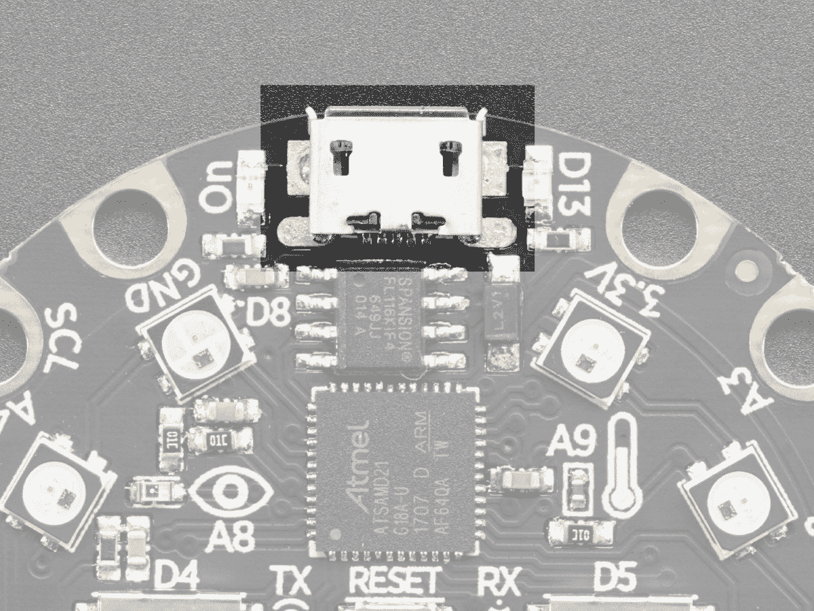
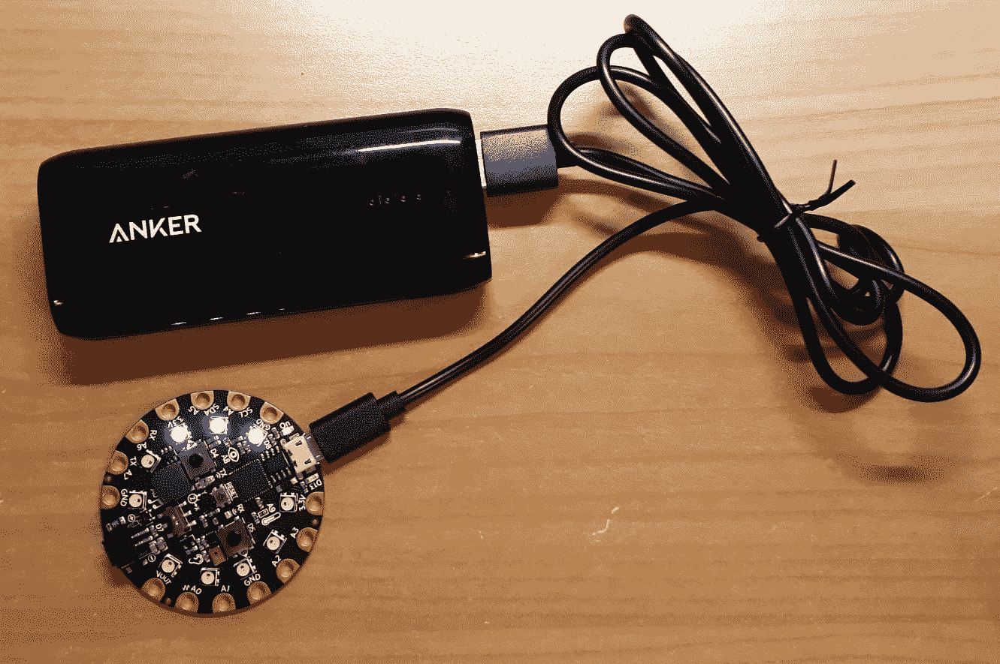
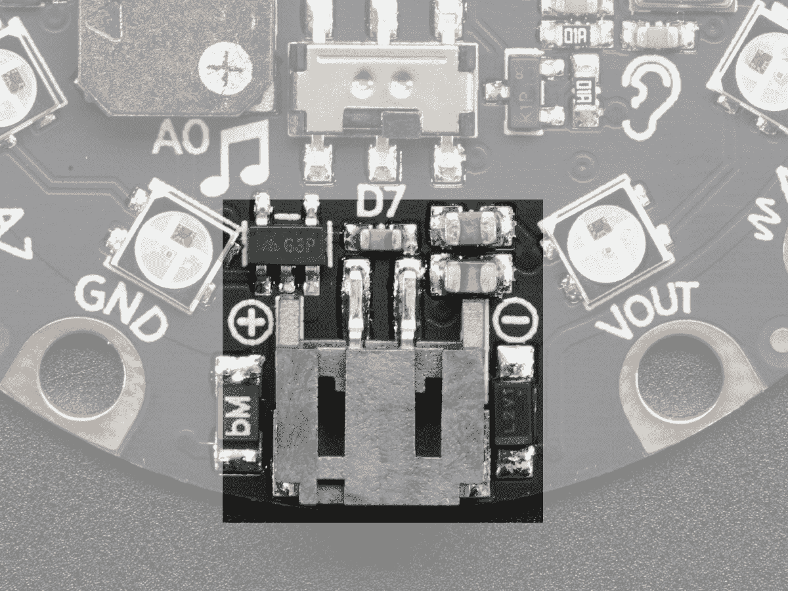
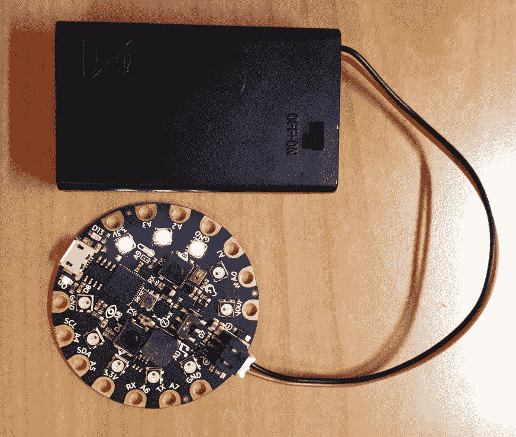
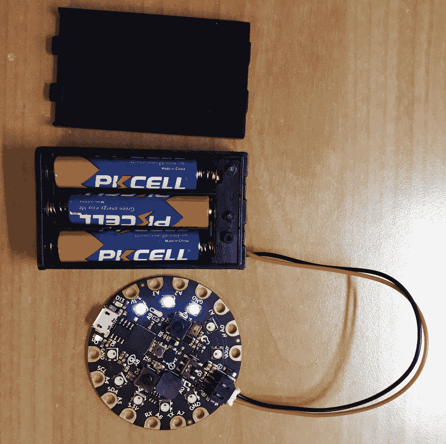
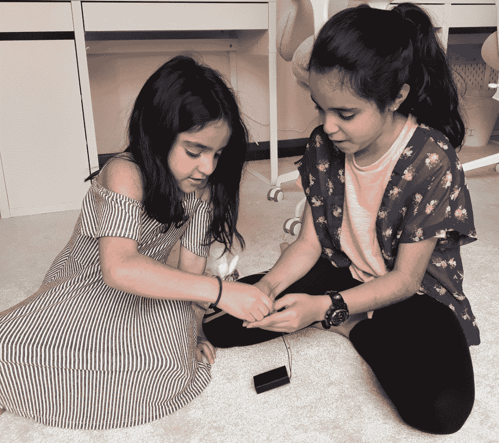

# 第六章：按钮砸游戏

在本章中，我们将创建一个名为按钮砸的双人游戏，您可以直接在 Circuit Playground Express 上玩，无需计算机。每个玩家必须尽快按下他们的按钮。每次按下按钮都会将该玩家的分数增加一分。通过 NeoPixels 可以直观地显示玩家当前的分数。首先达到 20 分的玩家将赢得游戏。

为了创建这个游戏，我们将通过 NeoPixels 结合按钮输入和灯光输出，并通过内置扬声器进行音频输出。本章包含许多配方，每个配方展示游戏的不同部分，我们将所有这些部分组合在最后一个配方中，以制作完整的游戏。

在本章中，我们将涵盖以下主题：

+   创建一个类来检测按钮状态变化

+   创建自己的 Python 模块

+   将按钮交互添加到事件循环中

+   创建一个生成器来获取像素颜色

+   使用 ScoreBoard 类显示分数

+   使用 ScoreBoard 类检测获胜者

+   将 ScoreBoard 类添加到事件循环中

# 技术要求

本章的代码文件可以在 GitHub 存储库的`Chapter06`文件夹中找到，网址为[`github.com/PacktPublishing/MicroPython-Cookbook`](https://github.com/PacktPublishing/MicroPython-Cookbook)。

本章的许多配方需要将三个音频文件传输到 Circuit Playground Express 板上。这些文件分别为`start.wav`、`win1.wav`和`win2.wav`。它们都可以从 GitHub 存储库的`Chapter06`文件夹中下载。它们应该保存在与您的`main.py`文件的顶级文件夹中。

本章中的许多配方都使用了 Circuit Playground Express 库，通常会在脚本的第一行导入，代码的下一行是：

```py
from adafruit_circuitplayground.express import cpx
```

这个库将帮助我们与板子上的按钮、像素和扬声器进行交互。

# Circuit Playground Express 电源

本章将介绍的游戏可以直接在 Circuit Playground Express 上运行，无需连接计算机。这是一个很好的机会，介绍您在这种类型的板子上使项目便携的选项。该板可以从多种不同的便携式电源接收电源。

我们将探讨解决便携式电源问题的两种不同方法。每种方法都使用板子上的不同连接器。我们将首先看一下 Micro B USB 连接器，它出现在以下图片中：



由 adafruit.com 提供

这个连接器可以用来将板子连接到计算机进行供电，并将您的代码和音频文件传输到板子上。一种方法是通过 USB 将便携式移动电源连接到板子上。以下照片显示了板子由其中一个移动电源供电：



这种方法的好处在于，这些移动电源有各种不同的尺寸和容量，因此您有很多选择，可以选择最符合您需求的移动电源。它们是可充电的，可重复使用，并且可以很容易地在大多数电子零售商处购买。

我们将看一下的第二个连接器是 JST 电池输入，它出现在下一张照片中：



由 adafruit.com 提供

有许多便携式电池源可以连接到这个连接器。许多这些电池座价格相当便宜，它们通常支持流行的电池尺寸，如 AAA 电池。由于板子没有内置电池充电功能，您可以安全地使用常规电池或可充电电池。以下照片显示了一个带有开关的电池座：



下一张照片显示了同一个支架，盖子打开，以便查看它使用的三节 AAA 电池：



在上一张照片中显示的电池盒可以在[`www.adafruit.com/product/727`](https://www.adafruit.com/product/727)购买到约 2 美元。

# 创建一个检测按钮状态变化的类

在本教程中，您将学习如何定义一个类，当实例化时，可以跟踪板上特定按钮的按钮按下事件。我们将在本章的后续教程中使用这个类，以便创建对象，用于跟踪按钮 A 和按钮 B 的按下事件。

您将学习如何将常见的代码块放入函数和类中，这将提高项目中的代码重用。它还可以帮助大型项目，以便将大量逻辑分解为更小、独立的函数和类的独立块。这个按钮事件类的实现将故意保持通用，以便它可以轻松地在不同的项目中重用。

# 准备工作

您将需要访问 Circuit Playground Express 上的 REPL，以运行本教程中将呈现的代码。

# 如何做...

让我们来看看本教程中需要的步骤：

1.  在 REPL 中运行以下代码行：

```py
>>> from adafruit_circuitplayground.express import cpx
>>> class ButtonEvent:
...     def __init__(self, name):
...         self.name = name
...         self.last = False
...         
...         
... 
>>> button = ButtonEvent('button_a')
```

1.  在这个阶段，我们已经定义了我们的类并给它一个构造函数。运行下一个代码块来创建这个类的第一个实例，并检查它的`name`属性：

```py
>>> button = ButtonEvent('button_a')
>>> button
<ButtonEvent object at 20003410>
>>> button.name
'button_a'
```

1.  以下代码块将访问`cpx`库中的属性，指示推按钮是否被按下：

```py
>>> pressed = getattr(cpx, button.name)
>>> pressed
False
```

1.  在按住按钮 A 的情况下运行以下代码块。它应该显示推按钮的状态为`pressed`：

```py
>>> pressed = getattr(cpx, button.name)
>>> pressed
True
```

1.  以下代码应该放入`main.py`文件中，当执行时，每当按下按钮 A 时，它将重复打印一条消息：

```py
from adafruit_circuitplayground.express import cpx

class ButtonEvent:
    def __init__(self, name):
        self.name = name
        self.last = False

    def is_pressed(self):
        pressed = getattr(cpx, self.name)
        changed = (pressed != self.last)
        self.last = pressed
        return (pressed and changed)

button = ButtonEvent('button_a')
while True:
    if button.is_pressed():
        print('button A pressed')
```

至此，编码部分就完成了；现在，让我们看看它是如何工作的。

# 工作原理...

`ButtonEvent`类被定义为帮助我们跟踪按钮 A 或按钮 B 的按下事件。当你实例化这个类时，它期望一个参数，指定我们要跟踪的按钮的名称。名称保存在实例的一个属性`name`中，然后最后一个变量被初始化为值`False`。每次我们检查新事件时，这个变量将跟踪按钮状态的上次已知值。

每次我们想要检查是否自上次检查以来发生了新的按钮按下事件时，都会调用`is_pressed`方法。它首先检索物理推按钮的当前状态，以找出它是否被按下。我们将检查该值与其上次已知值，以计算是否发生了变化；我们将这个结果保存在一个名为`changed`的变量中。然后我们保存当前值以供将来参考。该方法将在按钮状态发生变化且当前被按下时返回`True`值。

在类定义之后，我们创建了一个该类的实例，用于跟踪按钮 A 的按下事件。然后，启动一个无限循环，不断检查新的按钮按下事件，并在每次检测到其中一个时打印一条消息。

# 还有更多...

在本教程中，我们只使用了一次该类，以跟踪单个按钮的按下事件；但是因为我们没有在类定义中硬编码任何特定的按钮值，所以我们可以重用这段代码来跟踪许多不同的按钮。我们同样可以轻松地监视按钮 A 和按钮 B 的按下事件。许多 MicroPython 板可以连接许多额外的推按钮。在这些情况下，制作一个通用的观察按钮的类是非常有用的。

还涉及一些逻辑来跟踪先前的按钮状态，以便我们可以检测我们感兴趣的内容，即新的按钮按下事件。通过将所有这些代码放入一个包含的类中，我们可以使我们的代码更易读和更易管理。

# 另请参阅

以下是一些参考资料：

+   有关在 Python 中创建类的文档可以在[`docs.python.org/3/tutorial/classes.html`](https://docs.python.org/3/tutorial/classes.html)找到。

+   有关内置`getattr`函数的文档可以在[`docs.python.org/3/library/functions.html#getattr`](https://docs.python.org/3/library/functions.html#getattr)找到。

# 创建您自己的 Python 模块

在这个示例中，您将学习如何将您创建的代码放入自己的 Python 模块中。我们将从前面的示例中获取代码，该示例帮助我们跟踪按钮按下事件，并将其放入自己的专用模块中。

然后，我们将把这个新创建的模块导入到我们的主 Python 脚本中，并使用它的类定义来跟踪按钮按下事件。当您开始在大型项目上工作并希望将代码拆分为不同的模块时，这可能是一个非常有用的方法。当您发现一个有用的模块并希望将其纳入自己的项目时，这也可能会有所帮助。

# 准备工作

您需要访问 Circuit Playground Express 上的 REPL 才能运行本示例中提供的代码。

# 如何做...

让我们来看看这个食谱所需的步骤：

1.  以下代码应该放入一个名为`button.py`的新文件中；这将成为我们以后可以导入的 Python 模块：

```py
from adafruit_circuitplayground.express import cpx

class ButtonEvent:
    def __init__(self, name):
        self.name = name
        self.last = False

    def is_pressed(self):
        pressed = getattr(cpx, self.name)
        changed = (pressed != self.last)
        self.last = pressed
        return (pressed and changed)
```

1.  在 REPL 中运行以下代码行：

```py
>>> from button import ButtonEvent
>>> ButtonEvent
<class 'ButtonEvent'>
>>> 
```

1.  在这个阶段，我们已经能够从我们的新 Python 模块中导入一个类。下一行代码将创建一个新对象，我们可以用它来检测新的按钮按下事件：

```py
>>> button = ButtonEvent('button_a')
>>> button.is_pressed()
False
```

1.  在按住按钮 A 时运行以下代码块，它应该会检测到按钮按下事件：

```py
>>> button = ButtonEvent('button_a')
>>> button.is_pressed()
```

1.  以下代码应该放入`main.py`文件中，当执行时，每当按下按钮 A 时，它将重复打印一条消息：

```py
from button import ButtonEvent

button = ButtonEvent('button_a')
while True:
    if button.is_pressed():
        print('button A pressed')
```

# 它是如何工作的...

在我们之前的示例中，我们习惯于使用`main.py`文件。创建一个新的 Python 模块就像创建一个新文件并将我们的代码放入其中一样简单。我们已经将`ButtonEvent`类放入了自己的 Python 模块中，名为`button`。

现在，我们可以导入这个类并使用该类创建对象。代码的其余部分创建了一个对象来监视按钮按下事件，并在检测到事件时打印一条消息。

# 还有更多...

当您创建自己的自定义 Python 模块时，重要的是要注意您给模块的名称。任何 Python 模块的相同命名限制也适用于您的 MicroPython 代码。例如，您不能创建一个模块其中包含空格字符。您还应该确保不要将模块命名为现有的 MicroPython 或 CircuitPython 模块的相同名称。因此，您不应该将您的模块命名为`board`或`math`，因为这些名称已经被使用。

防止这种情况发生的最简单方法是在创建新模块之前进入 REPL，并尝试按该名称导入一个模块。如果出现`ImportError`，那么您就知道该名称尚未被使用。

# 另请参阅

以下是一些参考资料：

+   有关创建 Python 模块的文档可以在[`docs.python.org/3/tutorial/modules.html`](https://docs.python.org/3/tutorial/modules.html)找到。

+   关于使用 Python 模块的好处的讨论可以在[`realpython.com/python-modules-packages/`](https://realpython.com/python-modules-packages/)找到。

# 将按钮交互添加到事件循环

在这个食谱中，我们将开始构建我们的主事件循环。每个玩家将被分配一个单独的按键，在游戏中按下。玩家 1 将被分配按键 A，玩家 2 将被分配按键 B。事件循环将不断检查这些按钮，寻找新的按钮按下事件。当检测到新的按键按下事件时，它将打印一条消息。

这将在本章的下一个食谱中进一步扩展，以添加 Button Bash 游戏的其余功能。事件循环可以在许多类型的软件应用程序中找到。探索它们的使用可以帮助您在必须制作自己的事件循环时，或者在必须与内置事件循环交互时。

# 准备工作

您需要访问 Circuit Playground Express 上的 REPL 来运行本食谱中提供的代码。

# 如何做到...

让我们来看看这个食谱所需的步骤：

1.  在 REPL 中执行下一个代码块：

```py
>>> from button import ButtonEvent
>>> 
>>> buttons = {}
>>> buttons[1] = ButtonEvent('button_a')
>>> buttons[2] = ButtonEvent('button_b')
>>> buttons[1].is_pressed()
False
```

1.  在这个阶段，我们已经创建了两个对象来监视两个按键。在运行下一个代码块时，按住按键 A：

```py
>>> buttons[1].is_pressed()
True
```

1.  以下代码应放入`main.py`文件中，当执行时，每当按下按键 A 或按键 B 时，它将重复打印一条消息：

```py
from button import ButtonEvent

def main():
    buttons = {1: ButtonEvent('button_a'), 2: ButtonEvent('button_b')}
    while True:
        for player, button in buttons.items():
            if button.is_pressed():
                print('button pressed for player', player)

main()
```

# 它是如何工作的...

首先，从`button`模块导入`ButtonEvent`类。定义了一个名为`main`的函数，其中包含了我们主要事件循环的代码。代码的最后一行调用`main`函数来启动主事件循环的执行。主事件循环首先定义了一个字典，用于跟踪每个玩家的按钮。它定义了一个映射，玩家 1 将被分配按键 A，玩家 2 将被分配按键 B。

启动了一个无限循环，它将循环遍历每个`ButtonEvent`对象，并检查是否发生了按钮按下事件。如果检测到按钮按下事件，它将打印哪个玩家按下了按钮。

# 还有更多...

随着您的代码变得越来越大，将主要代码块放入自己的函数中，并调用它来启动执行是一个好主意。随着程序规模的增大，这将使跟踪变量变得更容易，因为它们都将在这个主函数的范围内，而不是驻留在全局命名空间中。这有助于减少一些可能出现在共享同一个大型全局命名空间的大块代码中的丑陋 bug。

本食谱中另一个要注意的事情是使用字典来维护玩家和他们的按钮的关联。字典数据结构是这种需求的一个非常自然的选择。如果我们使用的硬件有更多的按键，我们可以只需向我们的数据结构中为每个玩家添加一个项目。充分利用数据结构是一个很好的主意；它使调试和软件设计变得更加容易。

# 另请参阅

以下是一些参考资料：

+   可以在[`docs.python.org/3/library/tkinter.html#a-simple-hello-world-program`](https://docs.python.org/3/library/tkinter.html#a-simple-hello-world-program)找到使用事件循环响应按钮按下事件的`tkinter`库的文档。

+   关于`tkinter`的主事件循环的讨论可以在[`gordonlesti.com/use-tkinter-without-mainloop/`](https://gordonlesti.com/use-tkinter-without-mainloop/)找到。

# 创建一个生成器来获取像素颜色

在这个食谱中，我们将准备用于控制游戏中像素的代码。棋盘上有 10 个像素，所以每个玩家将获得 5 个像素，以表示他们目前获得了多少分。现在，每当玩家按下按钮时，他们都会获得一个点，游戏需要得分 20 分才能赢。因此，我们必须呈现 0 到 20 的分数，但只有 5 个像素。

我们将通过让每个像素的得分由四种颜色表示来实现这一点。因此，对于前四个点，第一个像素将经历黄色、深橙色、红色和品红色。然后，当你达到得分 5 时，第二个像素将点亮黄色并经历相同的循环。

将使用生成器获取与每个玩家每个得分相关的颜色和像素位置的列表。玩家 1 将使用按钮 A，并将拥有紧挨着该按钮的五个像素。这些是像素 0 到 4。玩家 2 将使用按钮 B，并将拥有紧挨着该按钮的五个像素。这些是像素 5 到 9。

两组像素将从 USB 连接器附近开始点亮，并向终点线赛跑，终点线将是 JST 电池输入。这使得玩家 1 的序列为 0 到 4，玩家 2 的序列为 9 到 5。这个示例将涵盖生成器的一个有趣用例，它在一些项目中可能会派上用场，当你需要基于一些复杂的逻辑生成一系列值时。

# 准备工作

您需要访问 Circuit Playground Express 上的 REPL 来运行本示例中提供的代码。

# 操作步骤

让我们来看看这个示例所需的步骤：

1.  使用 REPL 运行以下代码行：

```py
>>> from adafruit_circuitplayground.express import cpx
>>> BLACK = 0x000000
>>> SEQUENCE = [
...     0xFFFF00,   # Yellow
...     0xFF8C00,   # DarkOrange
...     0xFF0000,   # Red
...     0xFF00FF,   # Magenta
...     ]
>>> cpx.pixels.brightness = 0.02
>>> cpx.pixels[0] = SEQUENCE[0]
```

1.  在这个阶段，第一个像素应该点亮黄色。在下一段代码中，我们将定义生成器并调用它来为玩家 1 和玩家 2 生成位置和颜色的列表。列表中有 21 个项目。第一个项目代表得分 0，这是一个特殊情况，如果没有人得分，我们希望所有像素都关闭。剩下的 20 个项目代表得分 1 到 20：

```py
>>> PLAYER_PIXELS1 = [0, 1, 2, 3, 4]
>>> PLAYER_PIXELS2 = [9, 8, 7, 6, 5]
>>> 
>>> def generate_colors(positions):
...     yield 0, BLACK
...     for i in positions:
...         for color in SEQUENCE:
...             yield i, color
...             
...             
... 
>>> COLORS = dict()
>>> COLORS[1] = list(generate_colors(PLAYER_PIXELS1))
>>> COLORS[2] = list(generate_colors(PLAYER_PIXELS2))
>>> 
>>> COLORS[1]
[(0, 0), (0, 16776960), (0, 16747520), (0, 16711680), (0, 16711935), (1, 16776960), (1, 16747520), (1, 16711680), (1, 16711935), (2, 16776960), (2, 16747520), (2, 16711680), (2, 16711935), (3, 16776960), (3, 16747520), (3, 16711680), (3, 16711935), (4, 16776960), (4, 16747520), (4, 16711680), (4, 16711935)]
>>> len(COLORS[1])
21
```

1.  以下代码应放入`colors.py`文件中，然后可以在下一个示例中导入，以便访问游戏的颜色数据：

```py
BLACK = 0x000000
SEQUENCE = [
    0xFFFF00,   # Yellow
    0xFF8C00,   # DarkOrange
    0xFF0000,   # Red
    0xFF00FF,   # Magenta
]
PLAYER_PIXELS1 = [0, 1, 2, 3, 4]
PLAYER_PIXELS2 = [9, 8, 7, 6, 5]

def generate_colors(positions):
    yield 0, BLACK
    for i in positions:
        for color in SEQUENCE:
            yield i, color

COLORS = dict()
COLORS[1] = list(generate_colors(PLAYER_PIXELS1))
COLORS[2] = list(generate_colors(PLAYER_PIXELS2))
```

# 工作原理

首先，`SEQUENCE`列表表示将显示在每个像素上以表示玩家得分的四种颜色。然后定义了每个玩家将点亮的五个像素的位置和顺序。然后定义了`generate_colors`生成器。调用时，它将生成一系列元组，每个元组包含特定得分表示的位置和颜色。这将被转换为每个玩家的列表。

通过这种方式，我们可以立即查找任何得分的相关颜色和像素位置。每个玩家和每个得分的这些颜色和位置值存储在一个名为`COLORS`的字典中，可以用来通过玩家、数字和得分查找这些值。

# 还有更多...

Python 的**迭代器**是该语言的一个非常强大的特性。生成器是迭代器的一种类型，它让你以简洁的方式实现一些强大的解决方案。它们在这个示例中被用作一种辅助方式，用于构建一个具有特殊第一情况和两个嵌套级别的值的列表。

通过将所有这些逻辑放入一个生成器中，我们可以将其包含在一个地方，然后将其用作构建更复杂结构的构建块。在这个示例中，单个生成器被用来构建玩家 1 和玩家 2 的颜色查找数据。

# 另请参阅

以下是一些参考资料：

+   迭代器的文档可以在[`docs.python.org/3/tutorial/classes.html#iterators`](https://docs.python.org/3/tutorial/classes.html#iterators)找到。

+   生成器的文档可以在[`docs.python.org/3/tutorial/classes.html#generators`](https://docs.python.org/3/tutorial/classes.html#generators)找到。

# 使用 ScoreBoard 类显示得分

在这个示例中，我们将准备用于跟踪每个玩家得分并在像素上显示他们当前得分的代码。我们将创建一个名为`ScoreBoard`的新类，并将其放入一个名为`score`的新模块中。

这个配方将向您展示一种在基于 MicroPython 的游戏中实现记分牌功能的方法。这个配方将从开始游戏的初始逻辑开始，跟踪得分，然后在像素上显示得分。在接下来的配方中，我们将添加更多功能来处理得分的增加和检测玩家中的一个何时赢得比赛。

# 准备工作

您将需要访问 Circuit Playground Express 上的 REPL 来运行本配方中提供的代码。

# 如何做...

让我们来看看这个配方所需的步骤：

1.  在 REPL 中运行以下代码行：

```py
>>> from adafruit_circuitplayground.express import cpx
>>> from colors import COLORS
>>> 
>>> class ScoreBoard:
...     def __init__(self):
...         self.score = {1: 0, 2: 0}
...         cpx.pixels.brightness = 0.02
...         cpx.play_file('start.wav')
...         
...         
... 
>>> board = ScoreBoard()
>>> board.score[1]
0
```

1.  运行前面的代码后，您应该听到板子播放游戏启动音频，它说`1 2 3 Go!`。然后，您应该看到玩家 1 的当前得分为`0`。

1.  以下代码应该放入`score.py`文件中，然后我们可以在其他地方导入并使用它：

```py
from adafruit_circuitplayground.express import cpx
from colors import COLORS

class ScoreBoard:
    def __init__(self):
        self.score = {1: 0, 2: 0}
        cpx.pixels.brightness = 0.02
        cpx.play_file('start.wav')

    def show(self, player):
        score = self.score[player]
        pos, color = COLORS[player][score]
        cpx.pixels[pos] = color
```

1.  以下代码将从`score`模块导入`ScoreBoard`类，将第一个玩家的得分设置为`3`，然后在像素上显示这个得分。第一个像素应该变成红色：

```py
>>> from score import ScoreBoard
>>> 
>>> board = ScoreBoard()
>>> board.score[1] = 3
>>> board.show(1)
```

# 它是如何工作的...

`ScoreBoard`类在`score`模块中定义。当类首次实例化时，它准备好开始比赛。它将玩家 1 和 2 的分数初始化为 0。然后，它设置像素的亮度并播放音频剪辑，向玩家宣布比赛的开始。

`show`方法期望一个参数，这个参数将是要显示得分的玩家的编号。然后，它获取玩家得分的值，并将其与玩家编号一起使用，查找必须设置的像素的颜色和位置。然后，将该像素的颜色设置为正确的颜色。

# 还有更多...

我们已经开始构建逻辑，向玩家展示当前的记分牌。在竞争激烈的游戏中，重要的是要制作一个有趣和响应灵敏的记分牌，以保持两名玩家参与并努力互相击败。

更新记分牌的代码必须以执行良好的方式实现。如果对记分牌的每次更新都是一个迟钝的过程，玩家会感觉到并对不响应的应用感到沮丧。获取像素的颜色和位置的所有代码都以高效的方式实现，以确保其性能。

# 另请参阅

以下是一些参考资料：

+   可以在[`tinkercademy.com/tutorials/flappy-bird/`](https://tinkercademy.com/tutorials/flappy-bird/)找到一个 MicroPython 项目的示例，显示玩家在游戏中的得分。

+   可以在[`learn.adafruit.com/neopixel-coat-buttons`](https://learn.adafruit.com/neopixel-coat-buttons)找到一个使用电池操作的 MicroPython 项目的示例，用于控制 NeoPixels。

# 使用`ScoreBoard`类检测获胜者。

在这个配方中，我们将扩展`ScoreBoard`类，以便能够更新玩家得分并检测玩家何时赢得比赛。一旦玩家中的一个赢得了比赛，板子将通过播放带有宣布的音频剪辑来宣布哪个玩家赢得了比赛。

这个配方是完成`ScoreBoard`类中逻辑的最后一部分。一旦完成，我们就可以将其合并到主事件循环中，并在下一个配方中完成游戏。

# 准备工作

您将需要访问 Circuit Playground Express 上的 REPL 来运行本配方中提供的代码。

# 如何做...

让我们来看看这个配方所需的步骤：

1.  以下代码应该放入`score.py`文件中，然后我们可以在其他地方导入并使用它：

```py
from adafruit_circuitplayground.express import cpx
from colors import COLORS

class ScoreBoard:
    def __init__(self):
        self.score = {1: 0, 2: 0}
        cpx.pixels.brightness = 0.02
        cpx.play_file('start.wav')

    def scored(self, player):
        self.score[player] += 1
        self.show(player)
        if self.score[player] == 20:
            cpx.play_file('win%s.wav' % player)

    def show(self, player):
        score = self.score[player]
        pos, color = COLORS[player][score]
        cpx.pixels[pos] = color
```

1.  以下代码将从`score`模块导入`ScoreBoard`类，并打印出玩家的当前得分：

```py
>>> from score import ScoreBoard
>>> board = ScoreBoard()
>>> board.score
{2: 0, 1: 0}
```

1.  下一段代码将增加玩家 1 的得分，导致第一个像素点变成黄色，并打印出当前得分。得分应该显示玩家 1 得到 1 分：

```py
>>> board.scored(1)
>>> board.score
{2: 0, 1: 1}
```

# 它是如何工作的...

`ScoreBoard`类添加了一个额外的方法，当其中一个玩家得分时，它将在`score`数据结构中递增。`scored`方法接收一个参数，即玩家编号，并增加该玩家的得分。

然后它会更新像素以显示玩家的最新得分，然后检查玩家的得分是否已经达到 20 分。如果玩家已经达到 20 分，棋盘将播放一条宣布哪个玩家赢得了比赛的公告。

# 还有更多...

声音和光是与玩家在视频游戏中进行互动的好方法。在这个课程中，声音被有效地用来宣布游戏的开始和结束。在游戏过程中，光被用来激励每个玩家更快地按下按钮，以便他们能够第一个到达终点线。尽管在这个课程中发生了很多事情，但每种方法只有三到四行代码，这使得更容易看到每个部分所涉及的内容。这是将代码分解成较小块的一种方法，通过将不同的部分放入不同的方法中。

# 另请参阅

以下是一些参考资料：

+   可以在[`learn.adafruit.com/circuit-playground-express-ir-zombie-game/`](https://learn.adafruit.com/circuit-playground-express-ir-zombie-game/)找到使用 Circuit Playground Express 的多人游戏。

+   可以在[`learn.adafruit.com/circuit-playground-treasure-hunt/`](https://learn.adafruit.com/circuit-playground-treasure-hunt/)找到使用 CircuitPython 实现的游戏。

# 将 ScoreBoard 类添加到事件循环

本章的最后一个食谱将在本章中将所有先前的食谱结合起来，以创建最终的 Button Bash 游戏。我们将通过添加在上一个食谱中实现的`ScoreBoard`类来升级事件循环。这是谜题的最后一块。

最终结果是一个只有六行代码的主循环。我们能够通过将本章中创建的三个 Python 模块中的大部分游戏逻辑保留下来来实现这一结果。当您发现代码基础变得过大且集中在一个文件或一个函数中时，您可以在自己的项目中使用类似的方法。

# 准备工作

您将需要访问 Circuit Playground Express 上的 REPL 来运行本食谱中提供的代码。

# 如何做...

让我们来看看这个食谱所需的步骤：

1.  以下代码应该放入`main.py`文件中，然后您就可以开始玩 Button Bash 游戏了：

```py
from button import ButtonEvent
from score import ScoreBoard

def main():
    buttons = {1: ButtonEvent('button_a'), 2: ButtonEvent('button_b')}
    board = ScoreBoard()
    while True:
        for player, button in buttons.items():
            if button.is_pressed():
                board.scored(player)

main()
```

1.  如果您拥有本章开头提到的便携式电源供应之一，那么您可以将棋盘从计算机上断开，并连接该电源供应。

1.  现在您可以随身携带游戏，并在每个玩家之间进行回合。要开始下一场比赛，请按下棋盘中央的复位按钮，以开始新的一轮。

# 工作原理...

我们首先导入`ButtonEvent`和`ScoreBoard`对象；它们是我们需要实现事件循环的两个主要对象。在创建了我们的按钮字典之后，我们实例化了一个名为`board`的新`ScoreBoard`对象。

这将宣布游戏已经开始，然后我们将进入一个无限循环，该循环将不断检查按钮按下事件。一旦检测到这些事件中的一个，它将调用棋盘对象上的`scored`方法来增加特定玩家的分数。如果任何玩家已经达到最终得分，那么他们将被宣布为赢家。

# 还有更多...

现在我们已经有了游戏的基本版本，有许多方法可以改变它并增强它。我们可以创建两种可以通过滑动开关选择的游戏模式。可以有简单和困难模式，其中一个需要得分 10 分，另一个需要得分 20 分。当棋盘启动时，它会检查开关以加载颜色和最终得分的正确参数。

您可以制作一个三局两胜的模式，两名玩家必须反复进行三轮比赛，最终获得两局胜利的人获胜。要看游戏的实际操作，请查看下一张照片，看看两名玩家在 Button Bash 上激烈对抗。



# 参见

以下是一些参考资料：

+   一个使用 NeoPixels 的电池供电便携式 CircuitPython 项目可以在[`learn.adafruit.com/ufo-circuit-playground-express`](https://learn.adafruit.com/ufo-circuit-playground-express)找到。

+   一个使用 NeoPixels 的篮球篮游戏可以在[`learn.adafruit.com/neopixel-mini-basketball-hoop`](https://learn.adafruit.com/neopixel-mini-basketball-hoop)找到。
