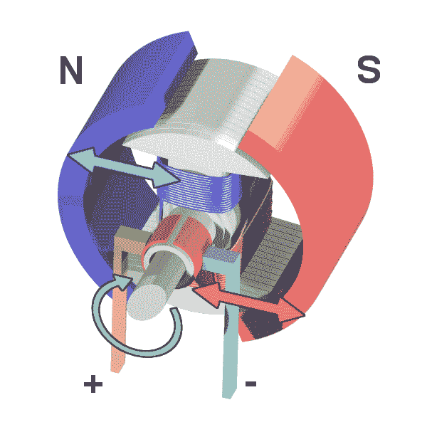
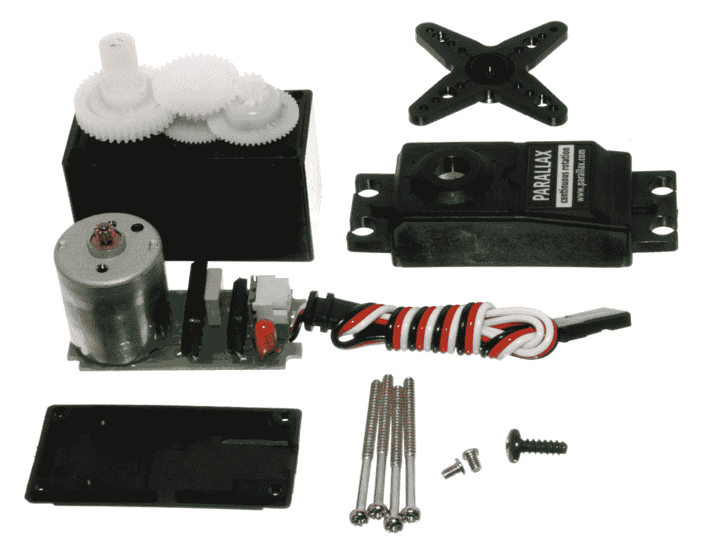
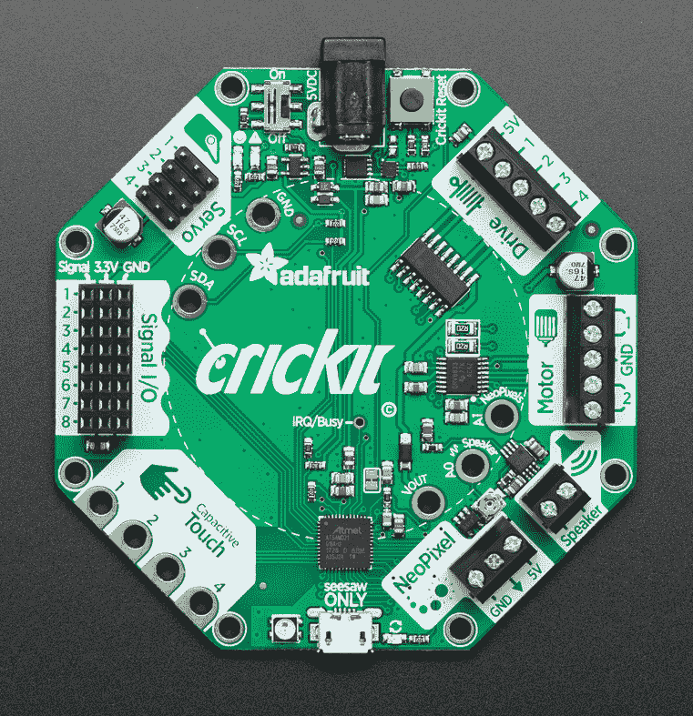
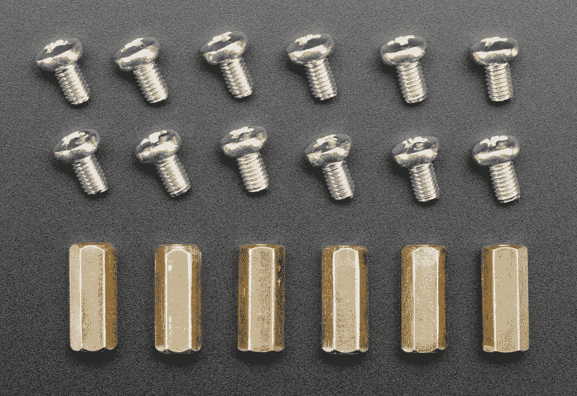
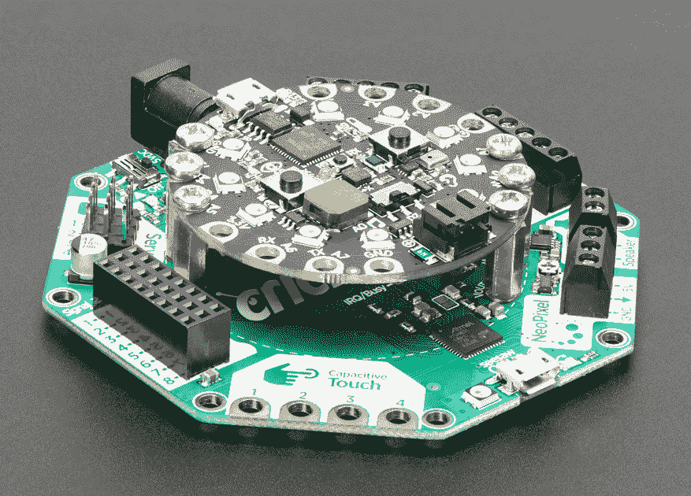
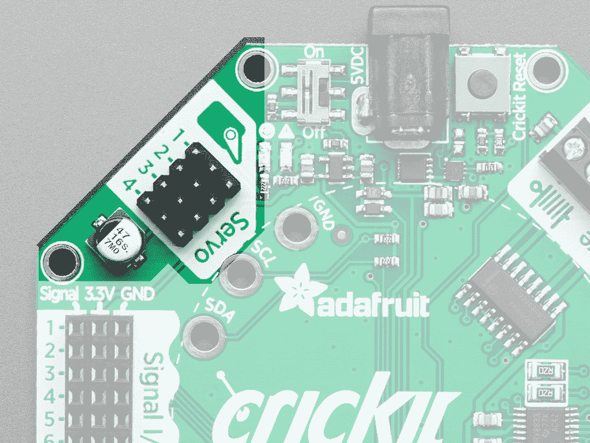
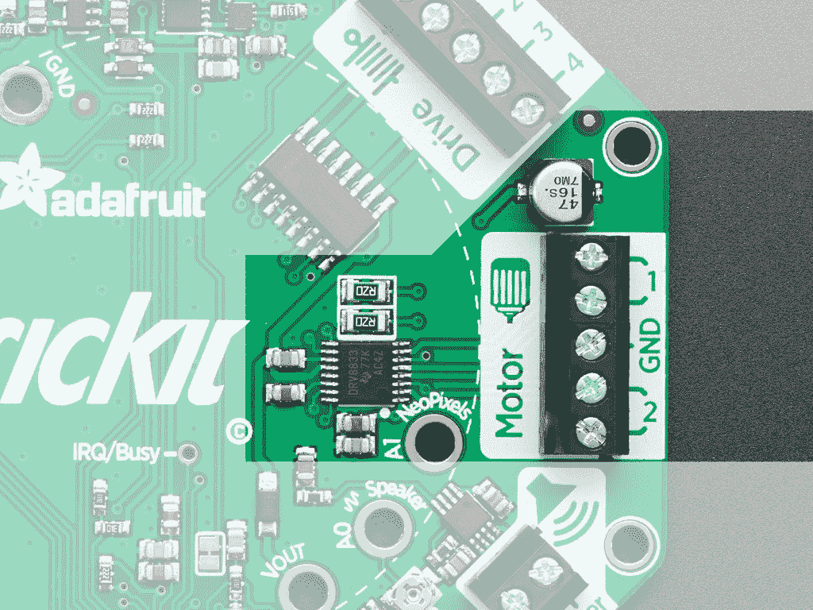
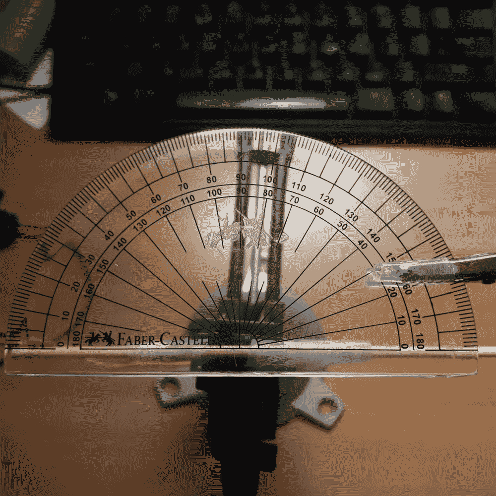
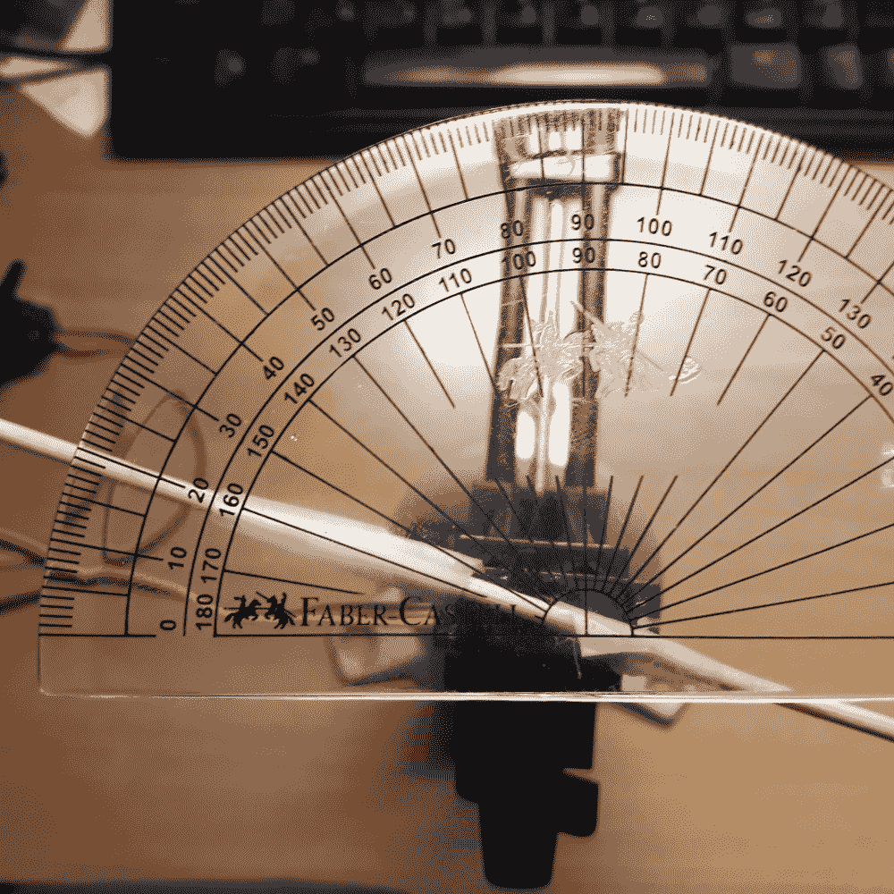

# 第八章：让我们动起来

在本章中，您将学习如何控制电机和舵机。使用直流电机将有助于需要控制车辆车轮的项目。舵机可以帮助您的项目控制机器人手臂的移动。这两种设备都将为我们提供创建机械运动的方式。根据您在项目中尝试创建的运动，您可能希望选择其中一种。它们各自的功能以及它们最适合的地方将在接下来的章节中介绍。

通过本章结束时，您将能够利用所学知识创建各种有趣的项目。这将为您能够构建的项目类型开辟全新的可能性。

在本章中，我们将涵盖以下主题：

+   调整舵机到正确的脉冲宽度

+   设置舵机的作用范围

+   设置舵机的角度

+   扫描舵机

+   使用按钮控制舵机

+   控制多个舵机

+   打开直流电机

+   设置直流电机的速度和方向

+   使用按钮控制直流电机

# 技术要求

本章的代码文件可以在 GitHub 存储库的`Chapter08`文件夹中找到[`github.com/PacktPublishing/MicroPython-Cookbook`](https://github.com/PacktPublishing/MicroPython-Cookbook)。

本章中的许多配方将使用 Circuit Playground Express 库，该库通常会在脚本的前几行导入，使用以下代码行：

```py
from adafruit_circuitplayground.express import cpx
```

这个库将帮助我们与板上的按钮和开关进行交互。还有另一个库将在本章的许多配方中导入，使用以下语句：

```py
from adafruit_crickit import crickit
```

这个库将帮助我们与 CRICKIT 板进行交互，以便我们可以控制舵机和直流电机。

本章中涉及舵机的配方期望两个舵机连接到舵机端口 1 和舵机端口 2。连接舵机电缆时，请确保黄色电线朝向板外。

本章中涉及直流电机的配方期望电机连接的驱动器 1 上连接电机。两根电线可以连接到两个连接器中的任何一个方向。无论如何连接电线，旋转方向都会翻转，取决于电线连接的方式。

# 直流电机

直流电机将直流电转换为旋转运动。通常是通过驱动运动的电磁体来实现的，因为它们的磁场发生变化。以下插图显示了这种类型电机的内部结构：



来源：https://commons.wikimedia.org/wiki/File:Ejs_Open_Source_Direct_Current_Electrical_Motor_Model_Java_Applet_(_DC_Motor_)_80_degree_split_ring.gif

直流电机在需要高速旋转运动的应用中表现出色。它们适用于操作遥控汽车上的风扇或车轮。

# 舵机

舵机比直流电机更复杂，更适合需要对连接到舵机的物体的确切位置进行更多控制的情况。舵机通常包含直流电机、齿轮、控制电路和传感器，用于检测舵机的确切位置。所有这些组件汇集在一起，形成一个设备，让您对舵机指向的确切角度有更精确的控制。

以下图像显示了一个拆卸的舵机，您可以看到其中的直流电机、齿轮和电路：



来源：https://commons.wikimedia.org/wiki/File:Exploded_Servo.jpg

舵机在需要对某个部件的角度进行精确控制的应用中表现出色；例如，需要控制机器人手臂的角度或船舶舵的角度。

# Adafruit CRICKIT

Adafruit CRICKIT 是一个可以让您从各种硬件控制许多不同类型的电机的板。不同的 CRICKIT 型号支持树莓派和 FeatherWing 系列产品。 

在本章中，我们将使用 CRICKIT 来控制 Circuit Playground Express。以下图片显示了在连接 Circuit Playground Express 之前 CRICKIT 的样子：



由 adafruit.com 提供

要将这两个设备连接在一起，您将需要 6 个六角黄铜支架，每个支架都将用 12 颗螺丝螺入两个设备。以下图片显示了这些支架和螺丝的样子：



由 adafruit.com 提供

连接这些螺丝和支架后，您的两个板应该看起来像下图所示：



由 adafruit.com 提供

最多可以连接四个独立的舵机到板上。支持微型、迷你和标准舵机。舵机的三针连接器应连接到一个可用的舵机插槽，如下图所示：



由 adafruit.com 提供

最多可以连接两个直流电机到板上。每个电机将连接到两个引脚。每个电机连接的引脚对在下图中显示：



由 adafruit.com 提供

连接两个设备后，您可以为每个设备供电，并使用 USB 电缆将 Circuit Playground Express 连接到计算机，方式与本书前几章相同。连接后，您需要使用支持 CRICKIT 硬件的固件刷新固件。

本章使用的 UF2 文件的版本是支持 CRICKIT 的 CircuitPython 3.1.2 版本，名为`adafruit-circuitpython-circuitplayground_express_crickit-3.1.2.uf2`。

有关如何使用此固件刷新板的详细信息，请参阅第一章，*使用 MicroPython 入门*中有关如何刷新微控制器固件的说明。

# 购买地址

本章使用了许多组件，所有这些组件都可以从 Adafruit 在线零售商处购买。

Adafruit CRICKIT for Circuit Playground Express 可以直接从 Adafruit 购买（[`www.adafruit.com/product/3093`](https://www.adafruit.com/product/3093)）。也可以从其他在线零售商购买，如 Pimoroni。

Circuit Playground Bolt-On Kit 可以直接从 Adafruit 购买（[`www.adafruit.com/product/3816`](https://www.adafruit.com/product/3816)）。该套件包括连接两个板所需的六个六角支架和 12 颗螺丝。本章使用的舵机可以直接从 Adafruit 购买（[`www.adafruit.com/product/169`](https://www.adafruit.com/product/169)）。

本章使用的直流电机可以直接从 Adafruit 购买（[`www.adafruit.com/product/3777`](https://www.adafruit.com/product/3777)）。Adafruit 还出售许多可选的轮子附件，但在本章的示例中并不需要。

CRICKIT 可以通过一个三节 AA 电池盒供电，可以直接从 Adafruit 购买（[`www.adafruit.com/product/3842`](https://www.adafruit.com/product/3842)）。与其他电源相比，这种电源的好处在于便携和低成本。

# 调整舵机到正确的脉冲宽度

舵机可以通过发送不同的电脉冲来旋转其臂到特定角度。臂移动到的角度将由电脉冲的宽度控制。在设置这些角度之前，每个舵机必须首先配置正确的最小和最大宽度设置。

本示例将向您展示如何做到这一点。每当您想在项目中使用舵机时，都需要进行此配置。

# 准备工作

您将需要访问 Circuit Playground Express 上的 REPL 来运行本示例中提供的代码。

# 如何做...

让我们重温一下本示例所需的步骤：

1.  在 REPL 中运行以下代码行：

```py
>>> from adafruit_circuitplayground.express import cpx
>>> from adafruit_crickit import crickit
>>> 
>>> MIN_PULSE=750 
>>> MAX_PULSE=2250
```

1.  在这个阶段，我们已经导入了必要的库，并定义了我们想要为这组特定舵机设置的最小和最大脉冲宽度值。以下代码块将使用这些设置配置连接到第一个端口的舵机：

```py
>>> crickit.servo_1.set_pulse_width_range(MIN_PULSE, MAX_PULSE)
```

1.  运行下一块代码将舵机移动到最低角度：

```py
>>> crickit.servo_1.angle = 0
```

1.  以下代码块将将臂移动到中间位置，即最低和最高值之间：

```py
>>> crickit.servo_1.angle = 90
```

1.  在运行下一块代码时，按住手指在触摸板 A1 上：

```py
>>> event.process()
A1 True
```

1.  以下代码应放入`main.py`文件中，当执行时，它将把舵机 1 移动到最低角度 3 秒，然后将其移动到中间范围角度 60 秒：

```py
import time
from adafruit_circuitplayground.express import cpx
from adafruit_crickit import crickit

MIN_PULSE = 750
MAX_PULSE = 2250

crickit.servo_1.set_pulse_width_range(MIN_PULSE, MAX_PULSE)
crickit.servo_1.angle = 0
time.sleep(3)
crickit.servo_1.angle = 90
time.sleep(60)
```

# 工作原理...

`crickit`对象将是我们与连接到电路板的所有舵机和直流电机进行交互的方式。每个舵机连接都有编号，因此您可以通过这个单一对象的属性来控制多个舵机。在将最小和最大脉冲宽度的值保存为常量后，我们通过调用`set_pulse_width_range`将这些设置应用于第一个舵机电机。

然后我们设置第一个舵机的角度属性的值，这将使舵机移动到角度 0。我们通过调用`sleep`方法暂停 3 秒，然后使用相同的角度属性将角度更改为 90。

# 还有更多...

来自不同制造商的舵机电机将期望不同的最小和最大脉冲宽度设置。您通常可以通过查看产品的数据表来找到特定舵机的正确设置。本示例中使用的设置特定于本章开头描述的舵机型号。如果您决定使用不同的舵机组，可以根据需要更改这些设置。用于控制舵机的 Python 库还允许您为每个舵机配置这些设置。这样，您可以通过分别配置每个舵机，同时连接具有不同设置的不同舵机。

脉冲宽度有时以毫秒提供，有时以微秒提供。只需将它们转换为微秒，因为这是这个 Python 模块所期望的单位。本示例中使用的舵机被描述为使用 0.75 毫秒到 2.25 毫秒的脉冲宽度，转换为微秒后变为 750 到 2,250。

# 另请参阅

以下是一些参考资料：

+   有关舵机中发现的组件的概述可在[`developer.wildernesslabs.co/Hardware/Reference/Peripherals/Servos/`](http://developer.wildernesslabs.co/Hardware/Reference/Peripherals/Servos/)找到。

+   有关舵机内部工作原理的解释可在[`www.pc-control.co.uk/servo_control.htm`](https://www.pc-control.co.uk/servo_control.htm)找到。

# 设置舵机的作用范围

舵机的臂在其运动范围上有所不同。对于角度，您在软件中发出请求以正确映射到舵机实际移动的角度；您需要使用其作用范围配置舵机。一旦配置完成，您将能够准确地将连接到舵机的臂移动到其正确位置。这是配置您计划在其中使用舵机的任何项目中的重要步骤。如果不这样做，您将面临一些奇怪的惊喜，其中舵机臂会不断移动到错误的位置。

# 准备工作

您将需要访问 Circuit Playground Express 上的 REPL 来运行本示例中提供的代码。

# 如何做...

让我们重温一下本示例所需的步骤：

1.  在 REPL 中执行下一块代码：

```py
>>> from adafruit_circuitplayground.express import cpx
>>> from adafruit_crickit import crickit
>>> 
>>> MIN_PULSE = 750
>>> MAX_PULSE = 2250
>>> 
>>> crickit.servo_1.set_pulse_width_range(MIN_PULSE, MAX_PULSE)
```

1.  现在已配置了伺服的脉冲宽度。执行以下代码块将伺服移动到最低位置：

```py
>>> crickit.servo_1.angle = 0
```

1.  在运行下一个代码块之前，请记下臂的当前位置。运行下一个代码块将伺服移动到最高角度：

```py
>>> crickit.servo_1.angle = 180
```

1.  测量这两个位置之间的角度。您应该发现角度为 160 度。运行下一个代码块将伺服返回到 0 度角并配置执行范围：

```py
>>> crickit.servo_1.angle = 0
>>> crickit.servo_1.actuation_range = 160
```

1.  运行下一个代码块，软件角度和实际角度应该都是 160 度：

```py
>>> crickit.servo_1.angle = 160
```

1.  以下代码应插入到`main.py`文件中：

```py
import time
from adafruit_circuitplayground.express import cpx
from adafruit_crickit import crickit

MIN_PULSE = 750
MAX_PULSE = 2250

crickit.servo_1.set_pulse_width_range(MIN_PULSE, MAX_PULSE)
crickit.servo_1.angle = 0
time.sleep(3)
crickit.servo_1.actuation_range = 160
crickit.servo_1.angle = 160
time.sleep(60)
```

执行此脚本时，将伺服 1 移动到最低角度 3 秒，然后将其移动到 160 度角度 60 秒。

# 工作原理...

前几行代码将配置伺服的脉冲宽度设置。在将执行范围配置为特定伺服的正确值（160 度）之前，角度将设置为 0，持续 3 秒。配置完成后，当软件中的角度设置为 160 度时，实际运动也应为 160 度。

# 还有更多...

就像脉冲宽度在伺服之间变化一样，运动范围也是如此。大多数伺服不会提供完整的 180 度运动。发现这些设置的一种方法是不配置执行范围，然后在软件中将伺服移动到 0 度和 180 度。

然后，您可以使用量角器来物理测量伺服移动的角度。测量了这个值后，您可以将这个角度作为执行范围的值。以下图片显示了使用量角器测量本章中伺服的最低角度：



放置量角器后，将伺服移动到最高角度。以下图片显示量角器测量角度为 160 度：



当您想在现实世界中进行准确的角度测量时，量角器是最佳选择。

# 另请参阅

以下是一些参考资料：

+   有关设置执行范围的一些详细信息，请参阅[`learn.adafruit.com/using-servos-with-circuitpython/circuitpython`](https://learn.adafruit.com/using-servos-with-circuitpython/circuitpython)。

+   有关伺服运动范围的讨论，请参阅[`learn.sparkfun.com/tutorials/hobby-servo-tutorial`](https://learn.sparkfun.com/tutorials/hobby-servo-tutorial)。

# 设置伺服的角度

一旦您正确配置了伺服，您将能够将伺服臂移动到精确的角度位置。本教程将移动伺服到多个角度，并展示当您尝试将伺服移动到超出其允许运动范围的角度时会发生什么。

一旦我们有能力将伺服移动到特定角度，我们就可以开始将它们纳入我们的项目中，以控制机械臂或将其他伺服附件移动到特定位置。

# 准备工作

您需要访问 Circuit Playground Express 上的 REPL 才能运行本教程中提供的代码。

# 如何操作...

让我们来看看这个教程所需的步骤：

1.  使用 REPL 运行以下代码行：

```py
>>> from adafruit_circuitplayground.express import cpx
>>> from adafruit_crickit import crickit
>>> 
>>> MIN_PULSE = 750
>>> MAX_PULSE = 2250
>>> 
>>> crickit.servo_1.set_pulse_width_range(MIN_PULSE, MAX_PULSE)
>>> crickit.servo_1.angle = 0
```

1.  现在伺服应该处于最低角度。执行以下代码块将伺服移动到最高位置：

```py
>>> crickit.servo_1.angle = 180
```

1.  运行以下代码以查看当您超出最大角度范围时会发生什么：

```py
>>> crickit.servo_1.angle = 190
Traceback (most recent call last):
  File "<stdin>", line 1, in <module>
  File "adafruit_motor/servo.py", line 111, in angle
ValueError: Angle out of range
```

1.  运行以下代码块将伺服返回到 0 度角并将执行范围配置为 160 度：

```py
>>> crickit.servo_1.angle = 0
>>> crickit.servo_1.actuation_range = 160
```

1.  运行以下代码块，查看 180 度现在被认为是伺服的范围之外的角度：

```py
>>> crickit.servo_1.angle = 180
Traceback (most recent call last):
  File "<stdin>", line 1, in <module>
  File "adafruit_motor/servo.py", line 111, in angle
ValueError: Angle out of range
```

1.  运行以下代码块，伺服应该移动到最高角度：

```py
>>> crickit.servo_1.angle = 160
```

1.  以下代码应放入`main.py`文件中，执行时将伺服移动到 0、45、90 和 160 度的角度，每次移动之间有 3 秒的延迟：

```py
import time
from adafruit_circuitplayground.express import cpx
from adafruit_crickit import crickit

MIN_PULSE = 750
MAX_PULSE = 2250

crickit.servo_1.set_pulse_width_range(MIN_PULSE, MAX_PULSE)
crickit.servo_1.angle = 0
crickit.servo_1.actuation_range = 160

crickit.servo_1.angle = 0
time.sleep(3)

crickit.servo_1.angle = 45
time.sleep(3)

crickit.servo_1.angle = 90
time.sleep(3)

crickit.servo_1.angle = 160
time.sleep(3)
```

# 工作原理...

代码的前几行将配置舵机的脉冲宽度设置和作用范围。然后，将在舵机上设置 4 个不同的角度。这些角度分别是 0、45、90 和 160 度。在设置每个角度之后，通过调用时间模块上的`sleep`函数应用 3 秒的延迟。

# 还有更多...

在这个示例中，我们试验了在配置作用范围之前和之后尝试设置舵机角度时会发生什么。作用范围的默认设置是 180 度。这就是为什么在所有情况下，190 度的值都会被拒绝。一旦我们将作用范围配置为 160，诸如 180 的值当然会被拒绝，因为它们超出了这个范围。

舵机库具有这些检查非常有帮助，因为如果不执行这些检查，设置舵机角度超出正确范围的软件应用程序中的错误可能会损坏您的舵机。此外，通过使用清晰的异常消息抛出`ValueError`异常，使得更容易调试这些错误的应用程序。

# 另请参阅

以下是一些参考资料：

+   可以在[`learn.adafruit.com/crickit-powered-owl-robot`](https://learn.adafruit.com/crickit-powered-owl-robot)找到使用 CRICKIT 控制舵机角度的项目。

+   有关使用舵机和 CircuitPython 创建运动的示例，请访问[`learn.adafruit.com/hello-world-of-robotics-with-crickit`](https://learn.adafruit.com/hello-world-of-robotics-with-crickit)。

# 扫描舵机

在这个示例中，您将学习如何创建一个脚本，不断地将舵机从最低角度移动到最高角度，然后再次返回，以扫描运动。在某些方面，这段代码类似于我们在前几章中看到的灯光动画，因为我们将改变板的输出，并在每次改变之间设置时间延迟，以创建动画视觉效果。

然而，在舵机的情况下，动画效果将出现在连接的臂上，呈扫描运动。本示例中使用的方法可以适应任何想要一些舵机附件不断从一个位置扫到另一个位置的项目。

# 准备工作

您将需要访问 Circuit Playground Express 上的 REPL 来运行本示例中提供的代码。

# 如何操作...

让我们来看看这个示例所需的步骤：

1.  在 REPL 中运行以下代码：

```py
>>> import time
>>> from adafruit_circuitplayground.express import cpx
>>> from adafruit_crickit import crickit
>>> 
>>> MIN_PULSE = 750
>>> MAX_PULSE = 2250
>>> MAX_ANGLE = 160
>>> STEP = 10
>>> DELAY = 0.1
```

1.  在这个阶段，应该导入所需的 Python 库，并将不同的设置定义为我们脚本的常量。执行以下代码块来初始化舵机并将其移动到最低位置：

```py
>>> def init(servo):
...     servo.set_pulse_width_range(MIN_PULSE, MAX_PULSE)
...     servo.angle = 0
...     servo.actuation_range = MAX_ANGLE
...     
...     
... 
>>> init(crickit.servo_1)
```

1.  运行以下代码，将舵机从角度`0`扫到`160`：

```py
>>> def sweep(servo, direction):
...     angle = int(servo.angle)
...     while 0 <= angle <= MAX_ANGLE:
...         print(angle)
...         servo.angle = angle
...         time.sleep(DELAY)
...         angle += STEP * direction
...         
... 
>>> sweep(crickit.servo_1, 1)
0
10
20
30
40
50
60
70
80
90
100
110
120
130
140
150
160
```

1.  运行以下代码，将舵机从角度`160`扫到`0`：

```py
>>> sweep(crickit.servo_1, -1)
160
150
140
130
120
110
100
90
80
70
60
50
40
30
20
10
0
```

1.  以下代码应该插入到`main.py`文件中，当执行时，它将不断地将电机从角度`0`扫到`160`，然后返回到`0`：

```py
import time
from adafruit_circuitplayground.express import cpx
from adafruit_crickit import crickit

MIN_PULSE = 750
MAX_PULSE = 2250
MAX_ANGLE = 160
STEP = 10
DELAY = 0.1

def init(servo):
    servo.set_pulse_width_range(MIN_PULSE, MAX_PULSE)
    servo.angle = 0
    servo.actuation_range = MAX_ANGLE

def sweep(servo, direction):
    angle = int(servo.angle)
    while 0 <= angle <= MAX_ANGLE:
        print(angle)
        servo.angle = angle
        time.sleep(DELAY)
        angle += STEP * direction

def main():
    init(crickit.servo_1)
    while True:
        sweep(crickit.servo_1, 1)
        sweep(crickit.servo_1, -1)

main()
```

# 工作原理...

首先，定义了一个名为`init`的函数，它期望将要初始化的舵机的名称作为其第一个参数。当调用此函数时，它将设置最小和最大脉冲宽度，将角度设置为 0，并设置作用范围。接下来，定义了一个名为`sweep`的函数。这个函数期望第一个参数是要控制的舵机，第二个参数是一个带有值`1`或`-1`的整数，表示扫描的方向。

值为`1`将使角度增加，而值为`-1`将使角度减少。sweep 函数的第一部分将检索舵机角度的当前值并将其强制转换为整数并存储在名为`angle`的变量中。然后启动一个循环，直到角度的值超出了 0 到 160 的允许范围。在循环的每次迭代中，都会打印当前角度，然后将角度应用于舵机，然后应用延迟；然后，角度将按照定义的步长值进行更改。

然后定义了`main`函数，当调用时，将初始化舵机并将其移动到角度 0。然后，启动一个无限循环，在每次循环迭代期间执行两个操作。首先调用`sweep`函数来增加角度从 0 到 160。然后再次调用`sweep`函数，但这次是将角度从 160 减少到 0。

# 还有更多...

在`init`和`sweep`函数中尽可能不要硬编码任何值。大多数值都作为可配置的常量设置在脚本顶部，或者作为函数调用时接收的参数。这将使得调整脚本以适应其他设置的舵机变得更加容易。您还可以通过增加和降低这些常量中的值来轻松改变每次`sweep`迭代中角度变化的量以及完成扫描的速度。

该程序还被分成了 3 个不同的函数，以提高可读性并鼓励将不同的代码块重用到其他项目中。Python 编程语言的一个有趣且相对独特的特性是能够链式比较操作，这在 MicroPython 和 CircuitPython 版本中得到了充分支持。这个特性在`sweep`函数中用于检查角度是否在 0 到 160 之间。

在其他语言中，您通常需要使用`and`运算符结合两个比较运算符来表达这一点。然而，在 Python 中，您可以简单地链式比较运算符以更简洁和可读的方式实现相同的结果。

# 另请参阅

以下是一些参考资料：

+   描述如何链式比较的文档可以在[`docs.python.org/3/reference/expressions.html#comparisons`](https://docs.python.org/3/reference/expressions.html#comparisons)找到。

+   CRICKIT 库的文档可以在[`circuitpython.readthedocs.io/projects/crickit/en/latest/`](https://circuitpython.readthedocs.io/projects/crickit/en/latest/)找到。

# 使用按钮控制舵机

在这个食谱中，您将学习如何使用 Circuit Playground Express 上的两个按钮来控制舵机的角度。本食谱中的脚本将在按下按钮 A 时增加舵机角度，并在按下按钮 B 时减少角度。每当您想要创建一个项目，让人们可以直接使用不同的输入控件（如按钮）来控制舵机时，这些类型的脚本都非常有用。

# 准备工作

您需要访问 Circuit Playground Express 上的 REPL 来运行本食谱中提供的代码。

# 操作步骤...

让我们来看看这个食谱所需的步骤：

1.  在 REPL 中执行以下代码块：

```py
>>> import time
>>> from adafruit_circuitplayground.express import cpx
>>> from adafruit_crickit import crickit
>>> 
>>> MIN_PULSE = 750
>>> MAX_PULSE = 2250
>>> MAX_ANGLE = 160
>>> STEP = 10
>>> DELAY = 0.1
```

1.  初始导入已完成，我们准备定义我们的函数。以下代码块将定义并调用一个初始化舵机的函数：

```py
>>> def init(servo):
...     servo.set_pulse_width_range(MIN_PULSE, MAX_PULSE)
...     servo.angle = 0
...     servo.actuation_range = MAX_ANGLE
...     
...     
... 
>>> init(crickit.servo_1)
```

1.  运行以下代码将舵机移动 10 度并检查角度的值：

```py
>>> def move(servo, angle, direction):
...     new = angle + STEP * direction
...     if 0 <= new <= MAX_ANGLE:
...         angle = new
...         print(angle)
...         servo.angle = angle
...     return angle
...     
... 
>>> angle = 0
>>> angle = move(crickit.servo_1, angle, 1)
10
>>> angle
10
```

1.  运行以下代码再次移动舵机，增加 10 度：

```py
>>> angle = move(crickit.servo_1, angle, 1)
20
```

1.  运行以下代码将减少舵机的角度 10 度：

```py
>>> angle = move(crickit.servo_1, angle, -1)
10
```

1.  以下代码应插入到`main.py`文件中：

```py
import time
from adafruit_circuitplayground.express import cpx
from adafruit_crickit import crickit

MIN_PULSE = 750
MAX_PULSE = 2250
MAX_ANGLE = 160
STEP = 10
DELAY = 0.1

def init(servo):
    servo.set_pulse_width_range(MIN_PULSE, MAX_PULSE)
    servo.angle = 0
    servo.actuation_range = MAX_ANGLE

def move(servo, angle, direction):
    new = angle + STEP * direction
    if 0 <= new <= MAX_ANGLE:
        angle = new
        print(angle)
        servo.angle = angle
    return angle

def main():
    init(crickit.servo_1)
    angle = 0
    while True:
        if cpx.button_a:
            angle = move(crickit.servo_1, angle, 1)
        if cpx.button_b:
            angle = move(crickit.servo_1, angle, -1)
        time.sleep(DELAY)

main()
```

一旦执行，该脚本将在按下按钮 A 和 B 时每次将舵机移动到较低或较高的角度。

# 工作原理...

在定义全局常量和舵机初始化函数之后，我们继续定义另外两个函数。`move`函数接受舵机、当前角度和移动方向作为其三个参数。然后根据当前角度步进量和移动方向计算预期的新角度。如果这个新角度在可接受的角度范围内，则打印其值并应用于`servo`和`angle`变量。最后，返回`angle`变量的值。

在脚本底部定义并调用的`main`函数实现了主事件循环。在初始化`servo`变量并将`angle`变量设置为`0`之后，开始了一个无限循环。在循环的每次迭代中，如果按下按钮 A，则将调用`move`函数来增加舵机角度。然后，检查按钮 B，如果按下，则调用`move`函数来减小舵机角度。最后，在此循环的每次迭代结束时应用`sleep`函数。

# 还有更多...

这个基本的事件循环允许我们通过将舵机移动到不同的方向来对用户输入做出反应。我们可以在许多方向上扩展此脚本的逻辑。例如，我们可以将步进角从 10 减少到 1，以便非常精细地控制舵机，并每次改变一个度的角度。我们还可以减少延迟以加快对每次按钮按下的反应运动。我们可以拿基本脚本并添加控制像素的代码，除了舵机角度，当您按下每个按钮时。

# 另请参阅

以下是一些参考资料：

+   可以在[`learn.adafruit.com/universal-marionette-with-crickit`](https://learn.adafruit.com/universal-marionette-with-crickit)找到使用按钮控制舵机的项目。

+   `servo`对象的源代码可以在[`github.com/adafruit/Adafruit_Circuitpython_Motor`](https://github.com/adafruit/Adafruit_Circuitpython_Motor)找到。

# 控制多个舵机

在这个食谱中，您将学习如何结合使用按钮和滑动开关来控制多个舵机。基本上，我们将使用按钮来控制特定舵机的角度。然后，我们将使用滑动开关来选择我们想要控制的两个连接舵机中的哪一个。

这个食谱建立在一些过去的食谱基础上，增加了额外的数据结构和控制，以管理控制多个舵机所需的额外逻辑。每当您需要找到控制多个舵机的方法时，这个食谱将非常有用。

# 准备工作

您需要访问 Circuit Playground Express 上的 REPL 来运行此食谱中呈现的代码。

# 如何做...

让我们来看看这个食谱所需的步骤：

1.  使用 REPL 运行以下代码行：

```py
>>> import time
>>> from adafruit_circuitplayground.express import cpx
>>> from adafruit_crickit import crickit
>>> 
>>> MIN_PULSE = 750
>>> MAX_PULSE = 2250
>>> MAX_ANGLE = 160
>>> STEP = 10
>>> DELAY = 0.1
>>> 
>>> def init(servo):
...     servo.set_pulse_width_range(MIN_PULSE, MAX_PULSE)
...     servo.angle = 0
...     servo.actuation_range = MAX_ANGLE
...     
...     
... 
>>> 
```

1.  初始导入已完成，并且我们已经定义了`init`函数来帮助初始化舵机。以下代码块将设置一些数据结构，用于跟踪我们的角度和舵机：

```py
>>> servos = [crickit.servo_1, crickit.servo_4]
>>> angles = [0, 0]
```

1.  以下代码块将初始化我们舵机列表中的所有舵机：

```py
>>> init(servos[0])
>>> init(servos[1])
```

1.  运行以下代码以根据滑动开关位置设置开关变量：

```py
>>> switch = int(cpx.switch)
>>> switch
0
```

1.  运行以下代码以将所选舵机移动 10 度：

```py
>>> def move(servo, angle, direction):
...     new = angle + STEP * direction
...     if 0 <= new <= MAX_ANGLE:
...         angle = new
...         print(angle)
...         servo.angle = angle
...     return angle
...     
...     
... 
>>> angles[switch] = move(servos[switch], angles[switch], 1)
10
```

1.  运行以下代码以检查调用`move`函数之前和之后的角度数据结构：

```py
>>> angle = move(crickit.servo_1, angle, 1)
>>> angles
[10, 0]
>>> angles[switch] = move(servos[switch], angles[switch], 1)
20
>>> angles
[20, 0]
```

1.  更改滑动开关位置并运行以下代码块以更新所选舵机：

```py
>>> switch = int(cpx.switch)
>>> switch
1
```

1.  运行以下代码块以查看调用`move`函数如何移动另一个舵机：

```py
>>> angles[switch] = move(servos[switch], angles[switch], 1)
10
>>> angles
[20, 10]
```

1.  以下代码应插入到`main.py`文件中：

```py
import time
from adafruit_circuitplayground.express import cpx
from adafruit_crickit import crickit

MIN_PULSE = 750
MAX_PULSE = 2250
MAX_ANGLE = 160
STEP = 10
DELAY = 0.1

def init(servo):
    servo.set_pulse_width_range(MIN_PULSE, MAX_PULSE)
    servo.angle = 0
    servo.actuation_range = MAX_ANGLE

def move(servo, angle, direction):
    new = angle + STEP * direction
    if 0 <= new <= MAX_ANGLE:
        angle = new
        print(angle)
        servo.angle = angle
    return angle

def main():
    servos = [crickit.servo_1, crickit.servo_4]
    angles = [0, 0]
    init(servos[0])
    init(servos[1])
    while True:
        switch = int(cpx.switch)
        if cpx.button_a:
            angles[switch] = move(servos[switch], angles[switch], 1)
        if cpx.button_b:
            angles[switch] = move(servos[switch], angles[switch], -1)
        time.sleep(DELAY)

main()
```

执行此脚本将移动不同的舵机，具体取决于滑动开关的位置和按钮的按压。

# 它是如何工作的...

在定义全局常量和舵机初始化函数之后，我们将继续定义另外两个函数。`move`函数遵循了您在上一个示例中看到的相同结构。但是，`main`函数已扩展为具有处理多个舵机和滑动开关的附加数据结构和逻辑。

在`main`函数中，创建了一个名为`servos`的列表，指向要控制的两个舵机。一个名为`angles`的列表将跟踪每个舵机的角度。然后初始化每个舵机，然后进入无限循环。

在每次循环迭代期间，开关的值将从布尔值转换为整数值 0 或 1。这将允许我们在两个舵机之间切换控制。然后，根据按下按钮 A 还是 B，将调用`move`函数，并提供正确的`servo`对象和角度。最后，在每个循环结束时应用`sleep`。

# 还有更多...

在这个示例中，我们已经以一种使与板交互成为自然过程的方式将三个输入控件和两个输出舵机组合在一起。部分原因是不同的物理输入控件适合映射到不同的逻辑控件。

滑动开关非常适合在两个选项之间切换，因此在选择两个舵机时使用滑动开关是合理的。当您希望通过重复按按钮来重复增加或减少值时，按钮可以很好地工作。

# 另请参阅

以下是一些参考资料：

+   可以在[`learn.adafruit.com/circuitpython-made-easy-on-circuit-playground-express/slide-switch`](https://learn.adafruit.com/circuitpython-made-easy-on-circuit-playground-express/slide-switch)找到与滑动开关交互的示例。

+   可以在[`www.adafruit.com/category/972`](https://www.adafruit.com/category/972)找到一些与 Adafruit CRICKIT 相关的组件。

# 打开直流电机

在这个示例中，您将学习如何使用 Circuit Playground Express 和 CRICKIT 板控制直流电机。与舵机相比，直流电机更容易交互，因为它们不需要任何初始配置。这个示例将为您提供打开和关闭直流电机所需的基本技能。

# 准备工作

您需要访问 Circuit Playground Express 上的 REPL 来运行本示例中提供的代码。

# 如何做...

让我们来看看完成此示例所需的步骤：

1.  在 REPL 中运行以下代码行：

```py
>>> from adafruit_crickit import crickit
>>> import time
>>> 
>>> crickit.dc_motor_1.throttle = 1
```

1.  连接到板上的直流电机现在应该以全速旋转。运行以下代码块以停止直流电机的旋转：

```py
>>> crickit.dc_motor_1.throttle = 0
```

1.  以下代码块将停止并启动电机，并延迟一秒：

```py
>>> while True:
...     crickit.dc_motor_1.throttle = 1
...     time.sleep(1)
...     crickit.dc_motor_1.throttle = 0
...     time.sleep(1)
...     
...     
... 
```

1.  以下代码应插入到`main.py`文件中：

```py
from adafruit_crickit import crickit
import time

while True:
    crickit.dc_motor_1.throttle = 1
    time.sleep(1)
    crickit.dc_motor_1.throttle = 0
    time.sleep(1)
```

当执行此脚本时，将启动一个无限循环，不断启动和停止电机。

# 它是如何工作的...

直流电机与舵机不同，因此，它们需要更少的代码和交互来使它们运动。在库导入之后，将启动一个无限循环。

在循环的第一行，访问了`crickit`对象上的`dc_motor_1`属性。这个对象将让我们与连接到板上第一个电机连接的任何直流电机进行交互。`dc_motor_1`公开了一个名为`throttle`的属性，我们可以用它来打开和关闭电机。如果我们将值设置为`1`，电机就会启动，值为`0`则关闭电机。

因此，首先将油门设置为`1`以打开电机；然后应用`1`秒的延迟，然后关闭电机，并再次应用`1`秒的延迟。然后循环重新开始，重复这个过程。

# 还有更多...

直流电机在许多方面与舵机不同，正如本教程所示。它们确实比舵机更容易入门，因为它们不需要任何初始配置。然而，相反，它们不提供对您想要将电机放置在的确切位置的精确控制。

当然，直流电机能够做到舵机无法做到的事情，比如完全 360 度的旋转运动。

# 另请参阅

以下是一些参考资料：

+   可以在[`learn.adafruit.com/adafruit-crickit-creative-robotic-interactive-construction-kit/circuitpython-dc-motors`](https://learn.adafruit.com/adafruit-crickit-creative-robotic-interactive-construction-kit/circuitpython-dc-motors)找到使用 CRICKIT 板与直流电机的文档。

+   可以在[`learn.adafruit.com/adafruit-crickit-creative-robotic-interactive-construction-kit/recommended-chassis`](https://learn.adafruit.com/adafruit-crickit-creative-robotic-interactive-construction-kit/recommended-chassis)找到可用于安装直流电机的底盘。

# 设置直流电机的速度和方向

在本教程中，您将学习如何控制特定直流电机的速度和旋转方向。您将看到，向油门提供正值或负值将让我们控制电机是顺时针还是逆时针旋转。我们还可以向油门提供小数值，以控制电机的运行功率。

当您使用直流电机控制 MicroPython 驱动的计算机控制车辆上的车轮时，本教程中的技术将非常有用。它们将让您加速或减速汽车。您还可以使用它们使汽车倒车或完全停止。

# 准备工作

您需要访问 Circuit Playground Express 上的 REPL，以运行本教程中提供的代码。

# 如何做....

让我们来看看这个教程所需的步骤：

1.  在 REPL 中执行以下代码块：

```py
>>> from adafruit_crickit import crickit
>>> import time
>>> DELAY = 0.1
>>> 
>>> crickit.dc_motor_1.throttle = 0.5
```

1.  直流电机现在将以其全速的 50%运行。以下代码将以其全速的四分之一运行电机：

```py
>>> crickit.dc_motor_1.throttle = 0.25
```

1.  以下代码块将以全速将电机移动到相反的方向：

```py
>>> crickit.dc_motor_1.throttle = -1
```

1.  运行以下代码块以停止电机：

```py
>>> crickit.dc_motor_1.throttle = 0
```

1.  执行以下代码块时，将定义并调用一个函数，该函数将改变电机的速度和方向，从一个方向到相反的方向：

```py
>>> from adafruit_crickit import crickit
>>> def change_throttle(motor, start, increment):
...     throttle = start
...     for i in range(21):
...         print(throttle)
...         motor.throttle = throttle
...         throttle += increment
...         throttle = round(throttle, 1)
...         time.sleep(DELAY)
...         
... 
>>> change_throttle(crickit.dc_motor_1, -1.0, 0.1)
-1.0
-0.9
-0.8
-0.7
-0.6
-0.5
-0.4
-0.3
-0.2
-0.1
0.0
0.1
0.2
0.3
0.4
0.5
0.6
0.7
0.8
0.9
1.0
>>> 
```

1.  以下代码应插入到`main.py`文件中：

```py
from adafruit_crickit import crickit
import time

DELAY = 0.1

def change_throttle(motor, start, increment):
    throttle = start
    for i in range(21):
        print(throttle)
        motor.throttle = throttle
        throttle += increment
        throttle = round(throttle, 1)
        time.sleep(DELAY)

def main():
    while True:
        change_throttle(crickit.dc_motor_1, -1.0, 0.1)
        change_throttle(crickit.dc_motor_1, 1.0, -0.1)

main()
```

执行此脚本将使电机一次又一次地从一个方向移动到另一个方向。

# 工作原理...

定义了`change_throttle`函数，它将在本教程中执行大部分工作。它期望接收要控制的电机、油门的起始值，最后是每次迭代期间油门应该改变的量。该函数将初始化`throttle`变量为指定的起始值。

然后，将启动一个`for`循环，该循环将从油门的最低值到最高值。它首先打印当前油门，然后将`throttle`变量的值应用于电机。然后将油门增加并四舍五入到小数点后一位。然后应用延迟，然后进行下一次迭代。

`main`函数将进入一个无限循环，每次迭代调用`change_throttle`函数两次。第一次调用将油门值从`-1.0`移动到`1.0`，以`0.1`的增量。第二次调用将油门值从`1.0`移动到`-1.0`，以`-0.1`的增量。

# 还有更多...

此教程可用于演示以不同速度和不同方向运行电机。它创建了一个几乎可视化的动画，您可以看到电机减速和加速。您可以看到它们以一个方向以最大速度运行，然后减速以在另一个方向以最大速度运行。

有各种各样的创意实验可以扩展这个功能。例如，你可以将两个车轮连接到直流电机上，使其像遥控汽车一样移动。你可以配置光传感器以对手电筒做出反应。

或者，你可以将其他东西连接到直流电机上，根据一定的时间表转动。你可以控制电机启动的时间，使用这个配方中使用的时间模块。

# 另请参阅

以下是一些参考资料：

+   可以在[`learn.adafruit.com/adafruit-crickit-creative-robotic-interactive-construction-kit/bubble-bot`](https://learn.adafruit.com/adafruit-crickit-creative-robotic-interactive-construction-kit/bubble-bot)找到一个使用 CRICKIT 板和舵机和直流电机的项目。

+   有关如何使用 CRICKIT 板连接和控制直流电机的详细信息，请访问[`learn.adafruit.com/make-it-move-with-crickit/use-a-continuous-dc-motor-now`](https://learn.adafruit.com/make-it-move-with-crickit/use-a-continuous-dc-motor-now)。

# 使用按钮控制直流电机

在这个配方中，我们将使用按钮来增加和减少直流电机的速度。我们可以使用相同的脚本来使用按钮改变旋转方向。基本上，一个按钮会使电机在一个方向上增加速度，另一个按钮会使电机在另一个方向上移动更多。这样，我们可以使用一对按钮来设置任一方向的一系列速度，并将电机完全停止。

当脚本运行时，当前速度和方向将打印到屏幕上。这个配方可以在任何需要将用户输入转换为运动的项目中有用。例如，你可以创建一个项目，将滑轮连接到直流电机上，并使用按钮来提升和降低滑轮。

# 准备工作

你需要访问 Circuit Playground Express 上的 REPL 来运行本配方中提供的代码。

# 如何操作...

让我们来看看这个配方所需的步骤：

1.  使用 REPL 运行以下代码行：

```py
>>> from adafruit_crickit import crickit
>>> from adafruit_circuitplayground.express import cpx
>>> import time
>>> 
>>> STEP = 0.1
>>> DELAY = 0.1
>>> MIN_THROTTLE = -1
>>> MAX_THROTTLE = 1
>>> 
>>> throttle = 0
>>> crickit.dc_motor_1.throttle = throttle
```

1.  直流电机速度设置为`0`油门。以下代码块将定义一个`move`函数，并调用它三次，参数是将速度增加到 30%强度：

```py
>>> def move(motor, throttle, direction):
...     new = throttle + STEP * direction
...     if MIN_THROTTLE <= new <= MAX_THROTTLE:
...         throttle = round(new, 1)
...         print(throttle)
...         motor.throttle = throttle
...     return throttle
...     
...     
... 
>>> throttle = move(crickit.dc_motor_1, throttle, 1)
0.1
>>> throttle = move(crickit.dc_motor_1, throttle, 1)
0.2
>>> throttle = move(crickit.dc_motor_1, throttle, 1)
0.3
```

1.  以下代码块将调用`move`函数三次，以减速直到电机完全停止：

```py
>>> throttle = move(crickit.dc_motor_1, throttle, -1)
0.2
>>> throttle = move(crickit.dc_motor_1, throttle, -1)
0.1
>>> throttle = move(crickit.dc_motor_1, throttle, -1)
0.0
```

1.  以下代码块将调用`move`函数三次，以负方向移动，将电机设置为 30%的强度，朝相反方向：

```py
>>> throttle = move(crickit.dc_motor_1, throttle, -1)
-0.1
>>> throttle = move(crickit.dc_motor_1, throttle, -1)
-0.2
>>> throttle = move(crickit.dc_motor_1, throttle, -1)
-0.3
```

1.  以下代码块将调用`move`函数三次，以一个方向将电机从相反方向减速到完全停止：

```py
>>> throttle = move(crickit.dc_motor_1, throttle, 1)
-0.2
>>> throttle = move(crickit.dc_motor_1, throttle, 1)
-0.1
>>> throttle = move(crickit.dc_motor_1, throttle, 1)
0.0
```

1.  以下代码应该插入到`main.py`文件中，当执行时，它将根据按下按钮的次数将电机从一个方向移动到另一个方向：

```py
from adafruit_crickit import crickit
from adafruit_circuitplayground.express import cpx
import time

STEP = 0.1
DELAY = 0.1
MIN_THROTTLE = -1
MAX_THROTTLE = 1

def move(motor, throttle, direction):
    new = throttle + STEP * direction
    if MIN_THROTTLE <= new <= MAX_THROTTLE:
        throttle = round(new, 1)
        print(throttle)
        motor.throttle = throttle
    return throttle

def main():
    throttle = 0
    while True:
        if cpx.button_a:
            throttle = move(crickit.dc_motor_1, throttle, 1)
        if cpx.button_b:
            throttle = move(crickit.dc_motor_1, throttle, -1)
        time.sleep(DELAY)

main()
```

# 工作原理...

`move`函数被定义为控制电机运动方向的变化。它可以被调用来增加或减少特定旋转方向上的运动。该函数接受电机对象、当前油门和期望的运动方向。新的油门值被计算出来，如果发现在电机的可接受范围内，该值将被打印并应用于电机。

然后返回油门的最新值，以便主事件循环可以跟踪它。`main`函数包含一个无限循环，充当主事件循环。在这个循环中，按下按钮 A 会增加电机在一个方向上的速度，按下按钮 B 会增加电机在另一个方向上的速度。

# 还有更多...

这个教程提供了使用直流电机接收用户输入并生成输出的基本构建模块。您可以以类似的方式扩展此教程，以便滑动开关可以让您使用相同的脚本控制多个直流电机。

您可以在脚本中更改步进值，以使电机更快地改变速度和方向。或者，也许您想减少步进值，以便更精细地控制速度，但需要额外的按钮按下成本。

# 另请参阅

以下是一些参考资料：

+   与本章中使用的直流电机兼容的电机滑轮可在[`www.adafruit.com/product/3789`](https://www.adafruit.com/product/3789)找到。

+   使用 CRICKIT 板和直流电机控制滑轮的项目可在[`learn.adafruit.com/adafruit-crickit-creative-robotic-interactive-construction-kit/marble-madness`](https://learn.adafruit.com/adafruit-crickit-creative-robotic-interactive-construction-kit/marble-madness)找到。
