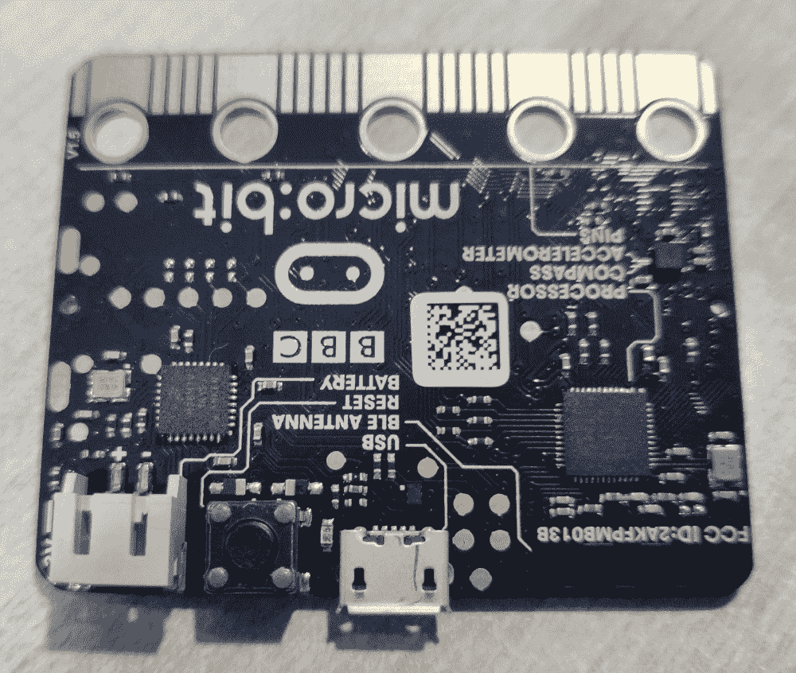
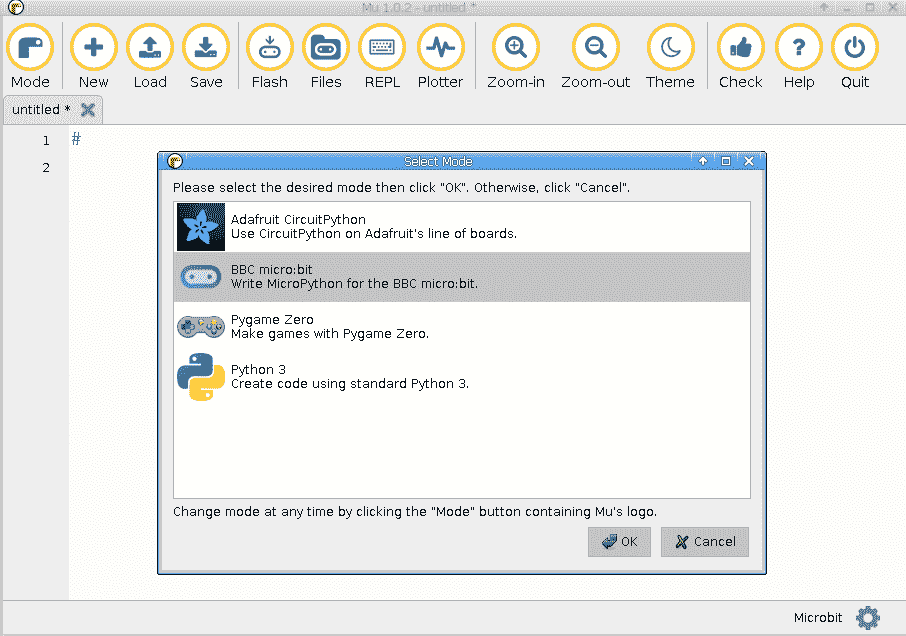
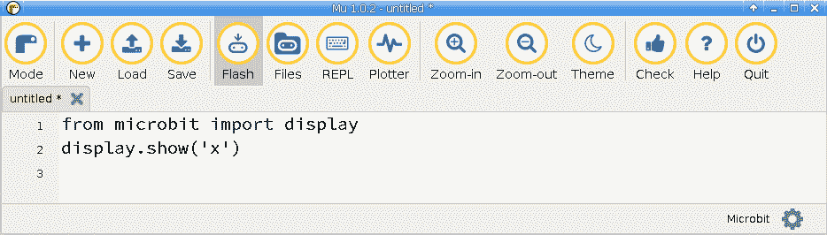
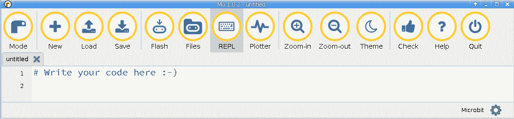
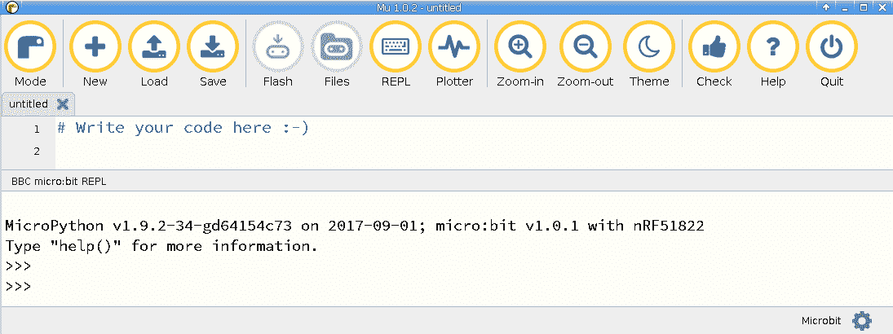

# 第九章：在 micro:bit 上编码

在本章中，我们将介绍 micro:bit 微控制器。我们将探索其特点及与其他微控制器相比的优势。到本章结束时，您将学会如何在这个微控制器上加载您的代码，控制其 LED 网格显示，并与板上的按钮进行交互。本章以一个不错的项目结束，让您可以使用这个硬件创建一个倒计时器。每个 MicroPython 板都有其自身的优势，了解目前市面上的产品是很有好处的，这样您就可以为您的项目选择合适的硬件。

在本章中，我们将涵盖以下主题：

+   使用 Mu 将代码闪存到 micro:bit

+   使用 Mu 在 micro:bit 上获取 REPL

+   在 LED 显示屏上显示单个字符

+   显示内置图像

+   显示滚动文本

+   显示已按下的按钮

+   创建倒计时器

# 技术要求

本章的代码文件可以在本书的 GitHub 存储库的`Chapter09`文件夹中找到，网址为[`github.com/PacktPublishing/MicroPython-Cookbook`](https://github.com/PacktPublishing/MicroPython-Cookbook)。

您将需要 BBC micro:bit 板和 Mu 文本编辑器来完成本章的示例。

# micro:bit

Micro Bit 是由**英国广播公司**（**BBC**）创建的一块可以用于英国教育目的的板子。它大约是信用卡的一半大小，并且内置了许多输入和输出传感器，考虑到其大小，这令人惊讶。它既有加速度计又有磁力计。它有两个按钮和一个复位按钮。有一个 5 x 5 的 LED 阵列，可以作为基本显示来显示不同的符号和字符。以下照片展示了这块板子的样子：



该板支持使用外部电池盒和 AAA 电池进行便携式电源供应。使用 USB 连接将板子连接到计算机，以便传输脚本并运行 REPL。

# 使用 Mu 将代码闪存到 micro:bit

本示例将向您展示如何将 Python 脚本闪存到 micro:bit。Mu 文本编辑器内置支持将代码闪存到这种类型的板子，本示例将带您完成这个过程。一旦我们理解了这一点，就可以用它来开发并加载我们需要的脚本到 micro:bit 板上。这是您想要创建项目并尝试 micro:bit 时的必要第一步。

# 准备工作

您需要安装 Mu 文本编辑器才能完成此操作。请按照第一章中关于安装 Mu 文本编辑器的说明进行操作，*使用 MicroPython 入门*。

# 操作步骤...

按照以下步骤学习如何使用 Mu 将代码闪存到 micro:bit：

1.  使用 USB 电缆将 micro:bit 连接到计算机。

1.  启动 Mu 文本编辑器应用程序。

1.  单击应用程序最左侧的 Mode 按钮，以打开以下对话框：



1.  选择 BBC micro:bit 选项，然后按 OK。

1.  将以下代码块放入主文本编辑器窗口：

```py
from microbit import display
display.show('x')
```

1.  按工具栏上的闪存按钮，将代码闪存到板子上。以下屏幕截图中已突出显示了闪存按钮以供参考：



1.  如果您查看板子上的 LED 网格，现在应该显示`x`字符。

# 工作原理...

与 Circuit Playground Express 相比，micro:bit 采用了不同的加载代码到板上的方法。该板需要您使用特定的软件来理解如何将您的 Python 脚本闪存到这些类型的板上。Mu 文本编辑器完全支持这个 MicroPython 板。最初的步骤是需要配置 Mu，以便它预期与连接的 micro:bit 板进行交互。创建的脚本是一个简单的脚本，它从 micro:bit Python 库中导入显示对象，并使用它在 LED 显示器上显示`x`字符。

# 还有更多...

在将代码闪存到 micro:bit 上时，最简单的程序是 Mu 文本编辑器。还有其他选项可用，比如一个名为 uFlash 的命令行程序。使用命令行方法的价值在于它可以让您灵活地使用您选择的文本编辑器，以便在准备使用 uFlash 实用程序时编辑代码并将其闪存。

# 参见

以下是有关此配方的一些参考资料：

+   有关 uFlash 命令的文档可以在[`uflash.readthedocs.io/en/latest/`](https://uflash.readthedocs.io/en/latest/)找到。

+   有关在将代码闪存到板上时使用的 HEX 文件格式的详细信息可以在[`tech.microbit.org/software/hex-format/`](https://tech.microbit.org/software/hex-format/)找到。

# 使用 Mu 在 micro:bit 上获取 REPL

此配方将建立在我们在上一个配方中介绍的方法之上。就像加载脚本到板上一样重要，当调试脚本时，REPL 也是必不可少的。REPL 将为您提供一个更丰富的界面，当您尝试使用板或尝试弄清楚代码有什么问题时。在 REPL 中，您可以获取回溯信息并查看打印语句的输出。

# 准备工作

您需要安装和配置 Mu 文本编辑器，并将您的 micro:bit 板连接到计算机上。

# 如何操作...

按照以下步骤学习如何使用 mu 在 micro:bit 上获取 REPL：

1.  启动 Mu 文本编辑器应用程序。

1.  单击工具栏中突出显示的 REPL 按钮，如下截图所示：



1.  REPL 界面现在应该出现在屏幕的下半部分，如下截图所示：



1.  在 REPL 中运行以下代码行：

```py
>>> 1+1
2
```

1.  运行以下代码块：

```py
>>> import microbit
>>> microbit
<module 'microbit'>
```

`microbit`库现在已被导入。

# 工作原理...

Mu 文本编辑器为许多板提供了内置的 REPL 支持，包括 micro:bit。当您单击 REPL 按钮时，编辑器会尝试打开与板的串行连接。如果成功，它将在板上启动一个 REPL 会话。

在 REPL 中打印出的初始文本显示了板上正在使用的 MicroPython 解释器的版本。此时，您在 REPL 提示符中键入的任何命令都将通过串行连接发送到板上进行评估。然后，它们的输出将返回到计算机上显示在 REPL 屏幕上。

# 还有更多...

MicroPython REPL 带有许多有用的函数，帮助您探索板上可用的不同 Python 模块和对象。您可以在不同的模块和对象上调用`help`函数以获取有关它们的详细信息。当您探索特定对象并想要了解该对象上可用的属性和方法时，您可以使用`dir`函数在 REPL 会话中列出它们。

# 参见

以下是有关此配方的一些参考资料：

+   `help`函数的文档可以在[`docs.python.org/3/library/functions.html#help`](https://docs.python.org/3/library/functions.html#help)找到。

+   `dir`函数的文档可以在[`docs.python.org/3/library/functions.html#dir`](https://docs.python.org/3/library/functions.html#dir)找到。

# 在 LED 显示器上显示单个字符

这个食谱将向您展示如何使用板上的 5 x 5 LED 阵列来显示字符和数字。显示对象有一个`show`方法，可以将字符和数字映射到需要显示在 LED 上的位图图像。这些 LED 是该板上的主要输出形式之一，因此这个食谱将为您提供一个有价值的交互手段，以与您放在板上的脚本进行交互。

# 准备就绪

您需要安装和配置 Mu 文本编辑器，以及将您的 Micro Bit 板连接到计算机。

# 如何操作...

按照以下步骤学习如何在 LED 显示器上显示单个字符：

1.  在 REPL 中运行以下代码行：

```py
>>> from microbit import display
>>> display.show('a')
```

1.  显示现在应该显示字母`a`。运行以下代码块以显示数字`1`：

```py
>>> display.show('1')
```

1.  运行以下代码块后，将显示数字`2`：

```py
>>> display.show(2)
```

1.  运行以下代码块以关闭显示：

```py
>>> display.clear()
```

1.  以下代码应放入主文本编辑器窗口并刷新到板上：

```py
from microbit import display
import time

for i in range(3):
    display.show(i)
    time.sleep(1)
```

执行后，此代码将显示数字 0、1 和 2，每次更改之间间隔 1 秒。

# 它是如何工作的...

micro:bit Python 库中的显示对象具有一个`show`方法，可以用来在显示器上显示数字和字符。最初的两个示例调用了带有字符串数据类型的参数的方法。 

当显示数字`2`时，该值被给定为整数。当`show`接收其输入时，它可以接受字符串或整数。在食谱中首先导入必要的库，然后启动一个`for`循环，循环三次。在每次循环中，它显示从`0`开始的当前迭代次数，然后在再次循环之前休眠一秒。

# 还有更多...

处理 5 x 5 LED 网格的有限显示分辨率可能具有挑战性。幸运的是，micro:bit 附带的 Python 模块已经完成了在显示器上以可读方式显示所有字母和字符的工作。在这个食谱中，我们已经看到了如何提供字符串和整数作为数据来显示。在下一个食谱中，我们将看到相同的方法也可以接收其他对象，比如图像对象。

# 另请参阅

关于这个食谱的一些参考资料：

+   `show`方法的文档可以在[`microbit-micropython.readthedocs.io/en/latest/display.html#microbit.display.show`](https://microbit-micropython.readthedocs.io/en/latest/display.html#microbit.display.show)找到。

+   `clear`方法的文档可以在[`microbit-micropython.readthedocs.io/en/latest/display.html#microbit.display.clear`](https://microbit-micropython.readthedocs.io/en/latest/display.html#microbit.display.clear)找到。

# 显示内置图像

这个食谱将向您展示如何使用 5 x 5 LED 阵列来显示 micro:bit 库中提供的内置图像之一。有许多可用的图像，从面部表情到动物符号不等。它们非常像表情符号。

在这个食谱中，我们将看到如何在显示器上显示心形和笑脸图标。在 micro:bit 上创建项目时，显示超出文本和数字的符号可能是有用的，就像在这个食谱中所示的那样。如果您在 micro:bit 上制作了游戏，您可能希望在玩家输赢游戏时显示快乐或悲伤的表情。

# 准备就绪

您需要安装和配置 Mu 文本编辑器，以及将您的 micro:bit 板连接到计算机。

# 如何操作...

按照以下步骤学习如何显示内置图像：

1.  在 REPL 中执行以下代码块：

```py
>>> from microbit import display, Image
>>> import time
>>> 
>>> display.show(Image.HAPPY)
```

1.  显示应该显示一个笑脸。运行以下代码块以显示一个心形图标：

```py
>>> display.show(Image.HEART)
```

1.  以下代码块将显示一个指向 1 点钟的时钟表盘：

```py
>>> display.show(Image.CLOCK1)
```

1.  运行以下代码块以显示一个时钟表盘动画，将时钟表盘从 1 点钟移动到 12 点钟：

```py
>>> CLOCK = [getattr(Image, 'CLOCK%s' % i) for i in range(1, 13)]
>>> for image in CLOCK:
...     display.show(image)
...     time.sleep(0.1)
...     
...     
... 
>>>
```

1.  以下代码应该放入主文本编辑器窗口并刷入到板上：

```py
from microbit import display, Image
import time

CLOCK = [getattr(Image, 'CLOCK%s' % i) for i in range(1, 13)]
while True:
    for image in CLOCK:
        display.show(image)
        time.sleep(0.1)
```

一旦执行，此代码将不断地将时钟表盘从 1 点钟移动到 12 点钟，每次更改之间的延迟为`0.1`秒。

# 它是如何工作的...

`Image`对象是`microbit` Python 库的一部分，其中包含一系列内置图像，可以通过引用其属性名称来访问。show 方法接受这些图像对象，并在调用它们后在网格上显示它们。在 REPL 中的初始示例中，通过引用这些图像的名称，显示了一个笑脸、心形和时钟表盘。

然后创建一个列表，指向正确顺序的 12 个时钟表盘图像中的每一个。然后可以使用此列表创建一个时钟表盘动画。首先，启动一个无限循环。在无限循环的每次迭代期间，将启动一个`for`循环，该循环将遍历 12 个时钟表盘图像中的每一个，显示它们，然后在开始下一次迭代之前暂停 0.1 秒。通过这种方式，创建了一个时钟表盘动画，时钟表盘在时钟的 12 个位置之间移动。

# 还有更多...

有许多符号和图像，不仅仅是这个配方中显示的。您可以在 REPL 中通过引用文档或使用内置的`dir`函数列出它们的名称来探索它们。

该库还支持一种机制，您可以使用它来定义自己的自定义图像，然后可以将其保存在代码中，并在项目中重复使用。在这个配方中，我们向您展示了创建图像动画的一种方法，但`display`对象的`show`方法中也内置了对动画的支持，也可以使用。

# 另请参阅

以下是有关此配方的一些参考资料：

+   有关创建自己的图像的文档，请访问[`microbit-micropython.readthedocs.io/en/latest/tutorials/images.html#diy-images`](https://microbit-micropython.readthedocs.io/en/latest/tutorials/images.html#diy-images)。

+   有关使用内置支持创建动画的文档，请访问[`microbit-micropython.readthedocs.io/en/latest/tutorials/images.html#animation`](https://microbit-micropython.readthedocs.io/en/latest/tutorials/images.html#animation)。

# 显示滚动文本

这个配方将向您展示一种技术，您可以使用滚动文本功能来向用户显示文本，该功能在`microbit`库中可用。LED 网格仅能一次显示一个字符。通过使用滚动功能，您可以将消息显示为一系列在显示器上滚动的字符。

通过这种方式，您可以创建项目，向用户显示简短的消息，即使在板上可用的物理显示有限。这个配方还将向您展示如何控制动画的速度，以及如何使文本在显示器上无限循环。

# 准备工作

您需要安装和配置 Mu 文本编辑器，以及将您的 micro:bit 板连接到计算机。

# 如何做...

按照以下步骤学习如何显示滚动文本：

1.  使用 REPL 运行以下代码行：

```py
>>> from microbit import display
>>> display.scroll('hello')
```

1.  显示应该显示文本`'hello'`在显示器上滚动。默认延迟为 150 毫秒。以下代码块将以正常速度的两倍滚动文本：

```py
>>> display.scroll('hello', delay=75)
```

1.  以下代码块将以默认速度的一半显示相同的文本：

```py
>>> display.scroll('hello', delay=300)
```

1.  运行以下代码块以显示无限循环中的文本：

```py
>>> display.scroll('hello', loop=True)
```

1.  通过按下*Ctrl* + *C*来终止无限循环。您应该会看到以下消息：

```py
Traceback (most recent call last):
  File "<stdin>", line 1, in <module>
KeyboardInterrupt: 
>>> 
```

1.  以下代码应放入主文本编辑器窗口并刷入板：

```py
from microbit import display

TEXT = [
    ('slow', 300),
    ('normal', 150),
    ('fast', 75),

]

for text, delay in TEXT:
    display.scroll(text, delay=delay)
```

一旦执行，此代码将以三种不同的速度（慢速、正常速度和快速）滚动文本。

# 工作原理...

`scroll` 方法是 `display` 对象的一部分，并提供了我们在显示器上滚动文本所需的所有功能。只需要一个参数，即要显示的文本。一旦调用此方法，它将启动动画，并显示所提供文本中的每个字符，并将字符滚动到屏幕上，直到整个文本都显示出来。

可提供可选的 `delay` 参数以控制滚动动画的显示速度。延迟的较低值将创建更快的动画，而较高的值将减慢动画速度。主脚本定义了一个包含三条消息的列表，每条消息都有不同的滚动延迟设置。然后执行一个 `for` 循环，循环遍历每个值，并调用 `scroll` 方法来显示指定的文本，并为每条消息应用自定义滚动 `delay`。

# 还有更多...

`scroll` 方法提供了其他选项，这些选项可能会派上用场。此方法具有在后台运行 `scroll` 动画的能力。当您希望让消息出现而程序执行其他操作时，这可能很有用。您应该注意使用此食谱中介绍的循环选项。基本上，以这种方式调用 `show` 方法将使调用永远不会返回，因为它将在 `show` 方法中启动一个无限循环。

# 另请参阅

以下是有关此食谱的一些参考资料：

+   可以在[`microbit-micropython.readthedocs.io/en/latest/tutorials/hello.html`](https://microbit-micropython.readthedocs.io/en/latest/tutorials/hello.html)找到一些调用 `scroll` 方法的简单示例。

+   有关 `scroll` 方法的文档可以在[`microbit-micropython.readthedocs.io/en/latest/display.html#microbit.display.scroll`](https://microbit-micropython.readthedocs.io/en/latest/display.html#microbit.display.scroll)找到。

# 显示哪个按钮被按下

此食谱将向您展示如何通过在按下按钮时在显示器上显示被按下的按钮来响应板上的两个按钮之一。这将是本章中的第一个食谱，我们将看到如何创建一个可以通过显示内置 LED 网格的视觉输出来响应用户输入的交互式项目。

在创建自己的项目时，拥有两个按钮可以打开许多可能性，可以创建响应这些输入的交互式应用程序和游戏。此食谱将为您提供基本构建模块，以便您可以开始构建这些类型的项目。

# 准备工作

您需要安装和配置 Mu 文本编辑器，以及将 micro:bit 板连接到计算机。

# 如何做到...

按照以下步骤学习如何显示哪个按钮已被按下：

1.  在 REPL 中运行以下代码行：

```py
>>> from microbit import display, button_a, button_b
>>> 
>>> button_a.is_pressed()
False
```

1.  由于按钮 A 没有被按下，返回的值应为 `False`。在执行以下代码块时按住按钮 A：

```py
>>> button_a.is_pressed()
True
```

1.  在执行以下代码块时按住按钮 B：

```py
>>> button_b.is_pressed()
True
```

1.  以下代码应放入主文本编辑器窗口并刷入板：

```py
from microbit import display, button_a, button_b

while True:
    if button_a.is_pressed():
        display.show('a')
    elif button_b.is_pressed():
        display.show('b')
    else:
        display.clear()
```

一旦执行，此代码将显示字符 `a` 或 `b`，如果按下按钮 A 或 B。

# 工作原理...

在初始导入之后，主脚本进入无限循环。在每次迭代期间，将轮询两个按钮，以查看它们当前是否被按下。如果按下按钮 A 或 B 中的任何一个，则屏幕上将显示按下按钮的字符。循环的最后一部分是检查是否两个按钮都没有被按下，然后清除屏幕的内容。

# 还有更多...

该示例显示了一个事件循环的基本结构，该循环不断循环并检查输入传感器上的事件，并根据发生的事件采取行动。您可以采用这个基本示例，并以许多方式进行扩展。例如，您可以创建一个脚本，帮助用户在菜单选项列表之间导航和选择。

按下按钮 A 可以显示下一个菜单项。按下按钮 B 后，然后可以选择该菜单项。程序的整体结构在事件循环和在每次循环迭代期间检查每个按钮的状态方面将保持不变。

# 另请参阅

以下是有关此示例的一些参考资料：

+   有关与按键交互的示例，请访问[`microbit-micropython.readthedocs.io/en/latest/tutorials/buttons.html`](https://microbit-micropython.readthedocs.io/en/latest/tutorials/buttons.html)。

+   可以在[`microbit-micropython.readthedocs.io/en/latest/button.html`](https://microbit-micropython.readthedocs.io/en/latest/button.html)找到有关`Button`类及其方法的文档。

# 创建一个倒计时器

该示例将向您展示如何使用 micro:bit 板创建一个倒计时器。每次有人按下按钮 A 时，倒计时器就会启动。它会显示倒计时完成前剩余多少秒。它将从数字 9 开始倒数，直到计时器完成，然后清除屏幕。在考虑创建需要将经过的时间纳入脚本的项目时，查阅此类示例可能会很有用。

# 准备就绪

您需要安装和配置 Mu 文本编辑器，以及将您的 micro:bit 板连接到计算机。

# 如何做...

按照以下步骤学习如何创建倒计时器：

1.  在 REPL 中执行以下代码块：

```py
>>> from microbit import display, button_a
>>> import time
>>> 
>>> NUMBERS = list(range(9, 0, -1))
```

1.  用于倒计时的数字列表将存储在`NUMBERS`变量中。以下代码块将显示它们的值：

```py
>>> NUMBERS
[9, 8, 7, 6, 5, 4, 3, 2, 1]
```

1.  以下代码块将定义并调用`countdown`函数。您应该看到显示屏显示从 9 到 1 的倒计时，每次更改之间有一秒的延迟：

```py
>>> def countdown():
...     for i in NUMBERS:
...         display.show(i)
...         time.sleep(1)
...     display.clear()
...     
...     
... 
>>> 
>>> countdown()
```

1.  以下代码应放入主文本编辑窗口并刷新到板上：

```py
from microbit import display, button_a
import time

NUMBERS = list(range(9, 0, -1))

def countdown():
    for i in NUMBERS:
        display.show(i)
        time.sleep(1)
    display.clear()

while True:
    if button_a.is_pressed():
        countdown()
```

执行后，每次按下按钮 A 时，此代码将显示一个 9 秒的倒计时。

# 它是如何工作的...

在初始导入之后，主脚本进入一个无限循环，不断检查按钮 A 上的按钮按下事件。如果检测到按下按钮 A，则将调用倒计时函数开始倒计时。`countdown`函数循环遍历从 9 到 1 的数字列表。

在每次循环中，它将显示数字并暂停 1 秒，然后继续到下一个迭代。完成所有九次迭代后，它将清除屏幕以标记计时器的结束。

# 还有更多...

可以扩展此示例，以便按下按钮 B 时启动不同的计时器。也许按钮 B 会启动一个从 1 到 9 的计时器。您还可以使按钮 A 启动秒表，按钮 B 可以停止秒表并显示经过的时间。

# 另请参阅

以下是有关此示例的一些参考资料：

+   可以在[`microbit-micropython.readthedocs.io/en/latest/microbit.html#microbit.running_time`](https://microbit-micropython.readthedocs.io/en/latest/microbit.html#microbit.running_time)找到有关`running_time`函数的文档。

+   可以在[`microbit-micropython.readthedocs.io/en/latest/utime.html`](https://microbit-micropython.readthedocs.io/en/latest/utime.html)找到有关`utime`模块的文档，该模块可用于 micro:bit。
