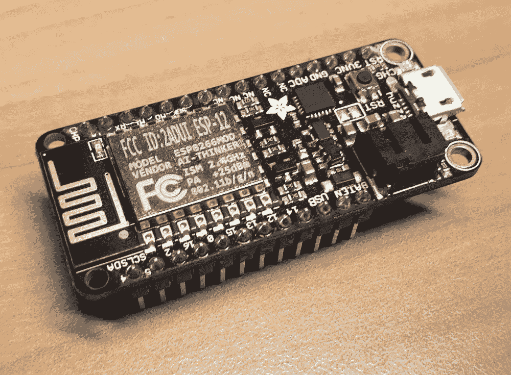
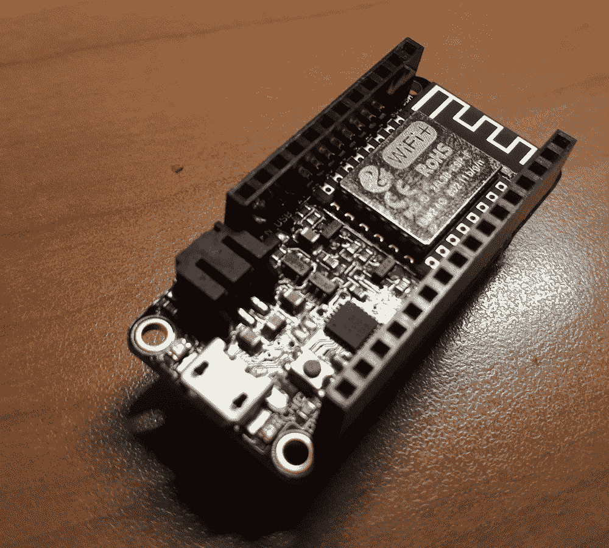
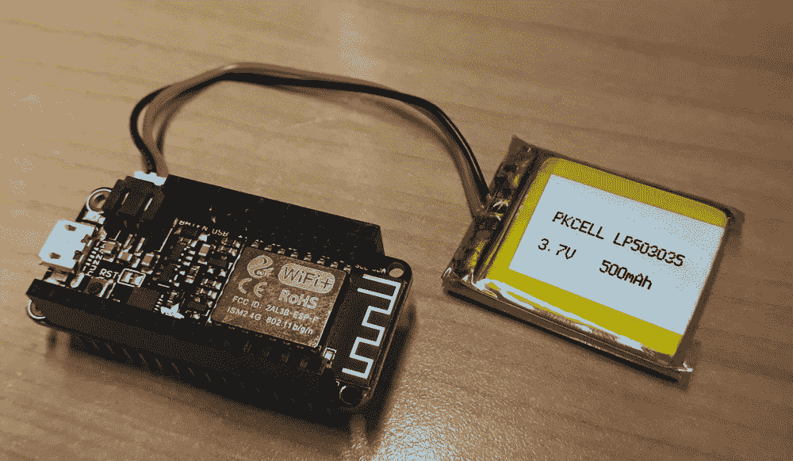
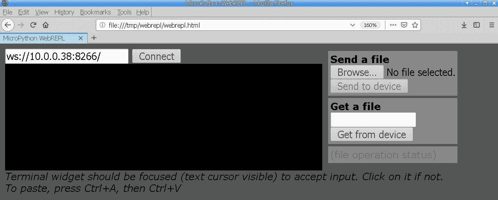
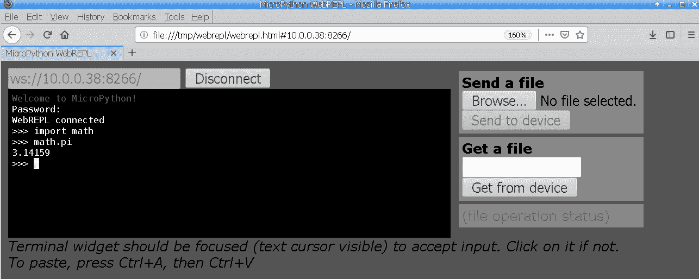
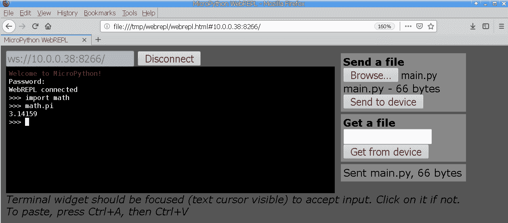

# 第十章：控制 ESP8266

在本章中，我们将介绍 Adafruit Feather HUZZAH ESP8266 微控制器。当您的嵌入式项目需要支持互联网连接时，ESP8266 是最受欢迎的 MicroPython 硬件选项之一。通过板上内置的 Wi-Fi 功能实现此连接。

本章将探讨获取板上 REPL 访问的两种主要方法：通过 USB 连接，以及通过 Wi-Fi 无线连接。我们还将介绍一些配方，涵盖与板上 Wi-Fi 功能的不同交互方面。

在本章结束时，您将学会所有必要的核心技能，以便可以高效地使用该板，并开始使用这种多功能且价格低廉的互联网连接硬件构建自己的嵌入式项目。

在本章中，我们将涵盖以下主题：

+   通过串行连接使用 REPL

+   扫描可用的 Wi-Fi 网络

+   配置 AP 模式的设置

+   连接到现有的 Wi-Fi 网络

+   通过 Wi-Fi 使用 WebREPL

+   使用 WebREPL CLI 传输文件

+   控制蓝色和红色 LED

# 技术要求

本章的代码文件可以在本书的 GitHub 存储库的`Chapter10`文件夹中找到，网址为[`github.com/PacktPublishing/MicroPython-Cookbook`](https://github.com/PacktPublishing/MicroPython-Cookbook)。

本章中的所有配方都使用了 CircuitPython 3.1.2。

# Adafruit Feather HUZZAH ESP8266

ESP8266 是由 Espressif Systems 制造的廉价微控制器。它可以运行 MicroPython，并支持完整的 TCP/IP 堆栈。其内置的 Wi-Fi 支持 802.11b/g/n。Adafruit Feather HUZZAH ESP8266 是一款开发板，具有用于电源和数据连接的 USB 支持。

该板上的处理器运行在 80 MHz，并配备了 4 MB 的闪存。该板配有九个 GPIO 引脚，可以连接到许多其他组件。该板有多个不同版本。以下照片显示了带有引脚选项的该板的外观：



该板还具有堆叠式引脚配置，可以在板的顶部插入其他组件，如 OLED 显示屏和按钮。这些升级可以直接插入，无需焊接或面包板。以下照片显示了具有堆叠式引脚的板的版本：



您还可以通过使用可充电锂聚合物电池为板载电源使您的项目具有便携性。这些电池可以使用其 JST 连接器连接到板上。以下照片显示了连接到锂聚合物电池的板：



该板具有内置的 LiPoly 充电器，可以使用指示灯显示充电状态。只要板连接了 USB 电缆，电池就可以充电。

# 您可以在哪里购买这些？

本章使用 Adafruit Feather HUZZAH ESP8266 微控制器。我们建议购买带有堆叠式引脚的版本。Adafruit 已组装的 Feather HUZZAH ESP8266 Wi-Fi 微控制器带有堆叠式引脚，可以直接从 Adafruit 购买([`www.adafruit.com/product/3213`](https://www.adafruit.com/product/3213))。

# 通过串行连接使用 REPL

本配方将向您展示如何通过 USB 串行连接获取对 ESP8266 的 REPL 访问。尽管该板的真正功能和激动点来自于无线连接，但我们需要做的第一件事是通过简单的 USB 连接与其连接。设置好此连接后，您可以继续本章中的其余配方，设置无线设置，以便可以拔掉板并完全无线地与其交互。

这个配方将帮助您通过建立与板的初始连接来开始自己的无线嵌入式项目，以建立无线连接。当您的配置板面临连接问题并且您想要访问它以调试可能遇到的任何 Wi-Fi 问题时，它也是一个有价值的工具。

# 准备工作

此配方可以使用 macOS 或 Linux 计算机，并且需要可用的 screen 命令。在 macOS 上，screen 应用程序是内置的，因此无需安装。在 Ubuntu Linux 上，可以使用 apt `install screen`命令安装 screen 命令。

# 如何做...

按照以下步骤学习如何通过串行连接使用 REPL：

1.  使用 USB 电缆将 ESP8266 连接到计算机。

1.  打开终端应用程序。

1.  在大多数 Linux 系统上，设备的名称应该是`/dev/ttyUSB0`。通过在终端中运行以下命令来确认该设备是否存在：

```py
$ ls /dev/ttyUSB0
/dev/ttyUSB0
```

1.  如果 ESP8266 被操作系统成功检测到，上述命令应该成功运行。

1.  运行以下命令以启动与板的 REPL 会话：

```py
$ sudo screen /dev/ttyUSB0 115200
```

1.  上面的命令将启动`screen`命令，并以每秒 115,200 比特的波特率连接到名为`/dev/ttyUSB0`的设备。如果连接成功建立，您应该在终端中看到以下消息：

```py
Adafruit CircuitPython 3.1.2 on 2019-01-07; ESP module with ESP8266
>>> 
>>> 
```

1.  在 REPL 中执行以下代码：

```py
>>> import math
>>> math.pow(8,2)
64.0
>>> 8**2
64
```

上面的代码块将导入`math`库并计算 8 的平方。

# 工作原理...

ESP8266 通过 USB 连接公开了一个串行设备。然后可以使用类似`screen`的终端仿真器与该串行设备进行交互。连接到 screen 后，您可以访问 REPL 并开始在板上执行 Python 代码。每当在 REPL 中执行 Python 代码时，命令都会被发送到板上执行，然后命令的结果通过串行连接传输回终端仿真器。

# 还有更多...

所有主要操作系统上都有许多优秀的免费终端仿真器。`picocom`和`minicom`是 Unix 系统上 screen 的流行替代品。在 Windows 上，可以使用终端仿真器 PuTTY，而 macOS 有一个名为 CoolTerm 的应用程序可以用于此目的。

# 另请参阅

以下是关于这个配方的一些参考资料：

+   连接到 Adafruit Feather HUZZAH ESP8266 的文档可以在[`learn.adafruit.com/adafruit-feather-huzzah-esp8266`](https://learn.adafruit.com/adafruit-feather-huzzah-esp8266)找到。

+   有关`picocom`命令的详细信息可以在[`github.com/npat-efault/picocom`](https://github.com/npat-efault/picocom)找到。

# 扫描可用的 Wi-Fi 网络

这个配方将向您展示如何使用 ESP8266 列出所有可用的 Wi-Fi 网络，并且可以连接到这些网络。我们将介绍 MicroPython 网络库，并探讨如何使用它的对象来初始化板载 Wi-Fi 硬件。

设置好这些组件后，我们可以使用它们来扫描无线网络并将扫描结果存储以供进一步检查。这个配方可以为您提供有用的技术，以便您可以测试板的 Wi-Fi 功能。通常，在以后连接到它们之前，列出无线网络是需要的第一步。

# 准备工作

您需要访问 ESP8266 上的 REPL 才能运行本配方中提供的代码。

# 如何做...

按照以下步骤学习如何扫描可用的 Wi-Fi 网络：

1.  在 REPL 中运行以下代码行：

```py
>>> import network
>>> station = network.WLAN(network.STA_IF)
```

1.  网络库现在已经被导入，并且已经创建了一个 WLAN 对象，它将提供一个`station`接口。以下代码块将激活`station`接口：

```py
>>> station.active(True)
```

1.  以下代码块将扫描所有可用的无线网络并将结果存储在`networks`变量中：

```py
>>> networks = station.scan()
scandone
```

1.  以下代码块将输出`networks`变量的内容，并显示找到了多少个网络：

```py
>>> networks
[(b'My WiFi', b'\x80*\xa8\x84\xa6\xfa', 1, -72, 3, 0), (b'Why Fi', b'\xc8Q\x95\x92\xaa\xd0', 1, -92, 4, 0), (b'Wi Oh Wi', b'd\xd1T\x9a\xb3\xcd', 1, -90, 3, 0)]
>>> len(networks)
3
```

1.  运行以下代码行：

```py
>>> names = [i[0] for i in networks]
>>> names
[b'My WiFi', b'Why Fi', b'Wi Oh Wi']
```

执行后，代码将提取无线网络的名称并将它们存储在一个名为`names`的变量中，然后进行检查。

# 工作原理...

MicroPython 提供了一个名为`network`的模块，可以用来与 ESP8266 上的 Wi-Fi 硬件进行交互。 WLAN 对象被实例化，并提供了`network.STA_IF`作为其第一个参数。这将返回一个作为`station`接口创建的对象。

当您想要将板子连接到现有的 Wi-Fi 网络时，需要`station`接口。在执行扫描之前，必须通过调用`active`方法并传入`True`值来激活该接口。然后，可以在该接口上调用`scan`方法，该方法将扫描可用的网络。此方法返回一个元组列表，我们将其存储在`networks`变量中。

然后，我们可以使用`len`函数计算网络的数量，并循环遍历这个元组列表，提取每个网络的名称。每个网络的名称，或**服务集标识符**（**SSID**），将存储在元组的第一个值中。我们使用列表推导式从`networks`变量中的每个项目中检索此值，然后将其保存在`names`变量中。

# 还有更多...

本教程创建了一个 WLAN 对象作为`station`接口。在后续的教程中，我们将学习如何创建另一种类型的 WLAN 对象，该对象可用于将设备配置为 AP。除了使用`scan`方法获取无线网络的名称之外，还可以检查有关每个网络的其他详细信息，例如它使用的信道和接受的认证模式。

`scan`方法将其结果作为一个简单的数据结构返回，您可以在程序的其余部分中存储和处理。这使得可以创建定期扫描可用网络并将结果保存到日志文件中的项目成为可能。

# 另请参阅

以下是关于本教程的一些参考资料：

+   `scan`方法的文档可以在[`docs.micropython.org/en/latest/library/network.html#network.AbstractNIC.scan`](https://docs.micropython.org/en/latest/library/network.html#network.AbstractNIC.scan)找到。

+   `active`方法的文档可以在[`docs.micropython.org/en/latest/library/network.html#network.AbstractNIC.active`](https://docs.micropython.org/en/latest/library/network.html#network.AbstractNIC.active)找到。

# 配置 AP 模式的设置

本教程将向您展示如何在 ESP8266 上配置**接入点**（**AP**）模式。配置完成后，板子将成为一个 Wi-Fi AP，您可以直接使用标准 Wi-Fi 连接将笔记本电脑和手机连接到板子。

Wi-Fi 是如此普遍，以至于这个功能成为一种非常强大的提供连接的方式。您可以使用本教程中展示的技术将 Wi-Fi AP 功能合并到自己的项目中。这样，即使没有其他接入点可用，您也可以在板子和手机或笔记本电脑之间建立无线连接。

# 准备工作

您需要访问 ESP8266 上的 REPL 来运行本教程中提供的代码。

# 操作步骤...

按照以下步骤学习如何配置 AP 模式的设置：

1.  在 REPL 中执行以下代码块：

```py
>>> import network
>>> ap = network.WLAN(network.AP_IF)
```

1.  `network`库现在已被导入，并且已经为 AP 模式创建了一个 WLAN 对象。以下代码块将配置并激活 AP：

```py
>>> ap.config(essid='PyWifi', password='12345678')
bcn 0
del if1
pm open,type:2 0
add if1
pm close 7
#7 ets_task(4020f4c0, 29, 3fff96f8, 10)
dhcp server start:(ip:192.168.4.1,mask:255.255.255.0,gw:192.168.4.1)
bcn 100
>>> ap.active(True)
```

1.  使用手机或笔记本电脑搜索并加入名为`PyWifi`的 AP。应该在 REPL 中看到以下输出：

```py
>>> add 1
aid 1
station: b0:35:9f:2c:69:aa join, AID = 1

>>> 
```

1.  将另一台设备连接到相同的 AP。您应该在 REPL 输出中看到已连接设备的详细信息，如下面的代码块所示：

```py
>>> add 2
aid 2
station: 34:2d:0d:8c:40:bb join, AID = 2

>>> 
```

1.  板子还将报告从 AP 断开连接的设备。从 AP 中断开一个连接的设备，应该在 REPL 中出现以下输出：

```py
>>> station: 34:2d:0d:8c:40:bb leave, AID = 2
rm 2

>>> 
```

1.  在 REPL 中运行以下代码：

```py
>>> ap.ifconfig()
('192.168.4.1', '255.255.255.0', '192.168.4.1', '8.8.8.8')
>>> 
```

上述代码将获取有关 AP 的 IP 地址和子网掩码的详细信息。

# 工作原理...

MicroPython 固件提供了使用 ESP8266 创建 Wi-Fi 接入点的功能。要使用此功能，我们必须首先创建一个 WLAN 对象，并将`network.AP_IF`值作为其第一个参数传递。这将返回一个可以用于启用 AP 模式的对象。然后调用`config`方法，传递所需的 Wi-Fi 网络名称和设备连接到 AP 时将使用的密码。

最后，通过调用`active`方法并传入`True`值来激活 AP。然后，板子就准备好接收连接了。当设备加入和离开网络时，这些细节将自动打印为 REPL 会话的输出。

# 还有更多...

正如我们在本教程中看到的，多个设备可以同时连接到板子上。您可以将此教程作为实验此功能的起点。例如，您可以将笔记本电脑和手机连接到 AP，并尝试 ping Wi-Fi 网络上的不同设备。您甚至可以从笔记本电脑 ping 您的手机或 ESP8266 板。

在后续章节中，我们将学习如何在板子上运行 Web 服务器，然后您将能够超越 ping 并通过 Wi-Fi 使用您的 Web 浏览器与板子进行交互。

# 另请参阅

以下是有关本教程的一些参考资料：

+   `config`方法的文档可以在[`docs.micropython.org/en/latest/library/network.html#network.AbstractNIC.config`](https://docs.micropython.org/en/latest/library/network.html#network.AbstractNIC.config)找到。

+   `ifconfig`方法的文档可以在[`docs.micropython.org/en/latest/library/network.html#network.AbstractNIC.ifconfig`](https://docs.micropython.org/en/latest/library/network.html#network.AbstractNIC.ifconfig)找到。

# 连接到现有的 Wi-Fi 网络

本教程将向您展示如何将 ESP8266 连接到现有的 Wi-Fi 网络。加入现有的 Wi-Fi 网络有许多好处。这样做可以使不同设备在您的网络上无线访问板子成为可能。它还通过 Wi-Fi 网络的互联网连接为板子提供了互联网连接。您可以使用本教程中展示的方法将自己的嵌入式项目连接到不同的网络，并帮助这些项目实现互联网连接。

# 准备工作

您需要访问 ESP8266 上的 REPL 来运行本教程中提供的代码。

# 如何操作...

按照以下步骤学习如何连接到现有的 Wi-Fi 网络：

1.  使用 REPL 运行以下代码行：

```py
>>> import network
>>> station = network.WLAN(network.STA_IF)
>>> station.active(True)
```

1.  WLAN 对象现已创建并激活。使用以下代码块验证要连接的 AP 是否出现在可用网络列表中：

```py
>>> networks = station.scan()
scandone
>>> names = [i[0] for i in networks]
>>> names
[b'MyAmazingWiFi', b'Why Fi', b'Wi Oh Wi']
```

1.  以下代码行将连接到 Wi-Fi AP：

```py
>>> station.connect('MyAmazingWiFi', 'MyAmazingPassword')
ap_loss
scandone
state: 5 -> 0 (0)
rm 0
reconnect
>>> scandone
state: 0 -> 2 (b0)
state: 2 -> 3 (0)
state: 3 -> 5 (10)
add 0
aid 1
cnt 

connected with MyAmazingWiFi, channel 6
dhcp client start...
ip:192.168.43.110,mask:255.255.255.0,gw:192.168.43.1

>>> 
```

1.  以下代码块将返回一个布尔值，指示我们当前是否已连接到 AP：

```py
>>> station.isconnected()
True
```

1.  以下代码行将获取有关我们当前网络连接的详细信息，包括板的 IP 地址、子网掩码、网关和 DNS 服务器：

```py
>>> station.ifconfig()
('192.168.43.110', '255.255.255.0', '192.168.43.1', '192.168.43.1')
>>> 
```

1.  运行以下代码块：

```py
>>> station.active(False)
state: 5 -> 0 (0)
rm 0
del if0
mode : softAP(86:f3:eb:b2:9b:aa)
>>> 
```

运行此代码后，板将断开与 AP 的连接。

# 工作原理...

MicroPython 固件具有连接到现有 Wi-Fi 接入点的能力，使用 ESP8266。为此，您必须创建一个 WLAN 对象，并将`network.STA_IF`值作为其第一个参数传递。在本教程中，将此对象保存到名为`station`的变量中。然后，通过调用`active`方法并传入`True`值来激活`station`对象。一旦激活，就可以调用`connect`方法并传入要连接的 AP 的名称及其关联密码。一旦调用`connect`方法，连接过程中将打印出大量信息。

我们随时可以通过在站点对象上调用`isconnected`方法来检查我们是否连接。如果我们连接，它将返回`True`值，否则返回`False`值。然后，我们可以通过调用`ifconfig`方法来检索有关我们的 IP 地址和 DNS 服务器的网络详细信息。最后，可以调用`active`方法，并使用`False`参数使板断开网络连接。

# 还有更多...

本教程中包含了关于 WLAN 对象的多种不同方法，可以调用和使用。它向您展示了如何列出网络、连接到网络、轮询连接状态、获取有关当前网络的网络信息以及如何断开网络连接。

使用这些方法，您可以创建一个定期扫描附近网络以寻找特定网络的程序。每当找到它时，您可以自动连接到它。您还可以编写一个不同的脚本，不断轮询网络连接状态并更新状态 LED，以指示 Wi-Fi 已连接，并在断开连接时关闭。

# 另请参阅

以下是有关本教程的一些参考资料：

+   有关`connect`方法的文档可以在[`docs.micropython.org/en/latest/library/network.html#network.AbstractNIC.connect`](https://docs.micropython.org/en/latest/library/network.html#network.AbstractNIC.connect)找到。

+   有关`isconnected`方法的文档可以在[`docs.micropython.org/en/latest/library/network.html#network.AbstractNIC.isconnected`](https://docs.micropython.org/en/latest/library/network.html#network.AbstractNIC.isconnected)找到。

# 通过 Wi-Fi 使用 WebREPL

本教程将向您展示如何在 ESP8266 板上使用 MicroPython 提供的 WebREPL 功能。 WebREPL 是可以在板上启动的服务，它允许您的网络上的计算机通过网络浏览器无线访问 REPL。我们已经在本章的*使用串行连接*教程中看到了如何使用串行连接访问 REPL。

本教程将为您提供通过 Wi-Fi 获取 REPL 所需的技能，从而即使在没有直接物理连接的情况下，也可以远程调试和执行板上的代码。

# 准备就绪

您需要访问 ESP8266 上的 REPL 才能运行本教程中提供的代码。在完成本教程之前，您应该按照前一个教程*连接到现有 Wi-Fi 网络*，因为您将使用该教程将板连接到您的网络并获取其 IP 地址。

# 操作步骤...

按照以下步骤学习如何通过 Wi-Fi 使用 WebREPL：

1.  在 REPL 中运行以下代码行：

```py
>>> import webrepl_setup
```

1.  WebREPL 配置向导现在将开始，询问您一系列问题，以便配置服务。回答以下问题，使用字母`E`启用启动时的服务：

```py
WebREPL daemon auto-start status: disabled

Would you like to (E)nable or (D)isable it running on boot?
(Empty line to quit)
> E
```

1.  接下来的一系列问题将要求您输入和确认 WebREPL 密码：

```py
To enable WebREPL, you must set password for it
New password (4-9 chars): secret123
Confirm password: secret123
```

1.  对于下一个问题，回答`y`（是），以便可以重新启动板并应用更改：

```py
Changes will be activated after reboot
Would you like to reboot now? (y/n) y
Rebooting. Please manually reset if it hangs.
state: 5 -> 0 (0)
rm 0
del if0
bcn 0
del if1
usl
load 0x40100000, len 31012, room 16 
tail 4
chksum 0x61
load 0x3ffe8000, len 1100, room 4 
tail 8
chksum 0x4e
load 0x3ffe8450, len 3264, room 0 
tail 0
chksum 0x0f
csum 0x0f
boot.py output:
WebREPL daemon started on ws://192.168.4.1:8266
WebREPL daemon started on ws://0.0.0.0:8266
Started webrepl in normal mode
```

1.  您可以从前面的输出中看到，一旦板子启动，它将显示 WebREPL 服务已启动以及可用于访问该服务的 URL。

1.  通过单击克隆或下载按钮从[`github.com/micropython/webrepl`](https://github.com/micropython/webrepl)下载 WebREPL 软件。

1.  将下载的`.zip`文件解压缩到计算机上的任何文件夹中。

1.  在任何现代的网络浏览器中打开`webrepl.html`文件。您应该在网络浏览器中看到以下界面：



1.  在连接按钮旁边的文本框中输入设备的 WebREPL 服务的 URL。在上一个屏幕截图中，板的 IP 地址是`10.0.0.38`，因此给出了 URL`ws://10.0.0.38:8266`。

1.  现在，单击“连接”按钮，并在提示时输入 WebREPL 密码。以下屏幕截图显示了一个 WebREPL 会话，其中导入了`math`模块并显示了 pi 的值：



1.  WebREPL 还具有上传文件到板上的功能。您可以使用此功能上传名为`main.py`的 Python 脚本到板上。

1.  单击“发送文件”下的“浏览...”按钮。

1.  选择您的`main.py`文件。

1.  单击“发送到设备”按钮。

1.  以下屏幕截图显示了上传文件到板上后出现的成功上传消息的示例：



屏幕上的消息确认了文件已发送，并报告了传输的字节数。

# 工作原理...

MicroPython 固件带有内置的 WebREPL 服务器。一旦导入`webrepl_setup`模块，它将启动一个交互式向导，让您启用该服务。设置其密码并配置它在每次启动板时运行。一旦此服务运行，它将公开一个 WebSocket 服务，可以接收来自在浏览器中运行的 WebREPL 客户端的连接。

WebREPL 客户端不需要任何特殊的安装——它只是一个 HTML 文件，可以在本地提取到您的计算机，然后在网络浏览器中打开。通过此客户端，您现在可以指定要连接的板的地址，并与板建立连接。一旦连接，您将在网络浏览器中拥有一个交互式 REPL 会话，以及将文件上传到板的能力。

# 还有更多...

这个配方专注于 WebREPL 客户端之一。在这个配方中显示的客户端旨在在您的网络浏览器中运行，并使通过 Wi-Fi 与板卡一起工作的过程变得简单。还有一个 WebREPL 客户端，可以使用**命令行界面**（**CLI**）而不是网络浏览器来运行。

与网络浏览器客户端不同，CLI 版本完全由 Python 编写。这为您提供了一个很好的机会来探索 WebREPL 通过 Web 套接字传输文件的内部。下一个配方将更深入地探讨 CLI 版本。

# 另请参阅

以下是有关此配方的一些参考资料：

+   有关访问 WebREPL 的文档可以在[`docs.micropython.org/en/latest/esp8266/tutorial/repl.html#webrepl-a-prompt-over-wifi`](https://docs.micropython.org/en/latest/esp8266/tutorial/repl.html#webrepl-a-prompt-over-wifi)找到。

+   有关连接到 WebREPL 的指南可以在[`learn.adafruit.com/micropython-basics-esp8266-webrepl/`](https://learn.adafruit.com/micropython-basics-esp8266-webrepl/)找到。

# 使用 WebREPL CLI 传输文件

这个配方将向您展示如何使用 WebREPL CLI 通过 Wi-Fi 从计算机传输文件到 ESP8266。这是一个非常强大的将文件传输到板上的方法。每次您对 Python 代码进行更改并希望尝试最新更改时，都必须将文件上传到板上。一遍又一遍地用您的网络浏览器做这件事可能会变得乏味。

使用 CLI 界面的美妙之处在于，大多数终端会记住它们最后执行的命令，因此您可以用两个简单的按键重新运行上一个命令：只需按下*上*箭头键和*Enter*键。这将使您的代码、上传和运行循环更快，更高效。

# 准备工作

您需要访问 ESP8266 上的 REPL 才能运行本配方中提供的代码。在尝试本配方之前，应该先遵循上一个配方*通过 Wi-Fi 使用 WebREPL*，以确保 WebREPL 正常工作。

# 操作方法...

按照以下步骤学习如何使用 WebREPL CLI 传输文件：

1.  通过单击“克隆或下载”按钮从[`github.com/micropython/webrepl`](https://github.com/micropython/webrepl)下载 WebREPL 软件。

1.  将下载的`.zip`文件解压缩到计算机上的任何文件夹中。

1.  提取的文件将包含一个名为`webrepl_cli.py`的脚本。

1.  打开终端并将工作目录更改为`webrepl_cli.py`脚本的位置。

1.  在终端中执行以下命令以查看命令的选项：

```py
$ python webrepl_cli.py --help
webrepl_cli.py - Perform remote file operations using MicroPython WebREPL protocol
Arguments:
  [-p password] <host>:<remote_file> <local_file> - Copy remote file to local file
  [-p password] <local_file> <host>:<remote_file> - Copy local file to remote file
Examples:
  webrepl_cli.py script.py 192.168.4.1:/another_name.py
  webrepl_cli.py script.py 192.168.4.1:/app/
  webrepl_cli.py -p password 192.168.4.1:/app/script.py .
```

1.  运行以下命令将`main.py`脚本上传到板子上。在提示时，您需要输入 WebREPL 密码：

```py
$ python webrepl_cli.py  main.py 10.0.0.38:/
Password: 
op:put, host:10.0.0.38, port:8266, passwd:secret123.
main.py -> /main.py
Remote WebREPL version: (3, 1, 2)
Sent 73 of 73 bytes
```

1.  以下命令与前一个命令非常相似：

```py
$ python webrepl_cli.py -p secret123 main.py 10.0.0.38:/
op:put, host:10.0.0.38, port:8266, passwd:secret123.
main.py -> /main.py
Remote WebREPL version: (3, 1, 2)
Sent 73 of 73 bytes
```

主要区别在于密码是作为命令行选项在命令行中提供的。

# 工作原理...

本教程从简单的命令行调用`webrepl_cli.py`脚本开始，以显示有关命令行选项的详细信息。至少验证 Python 是否成功执行脚本并生成您期望的输出是一个好主意。

下次调用该命令时，它将用于将`main.py`脚本上传到板子上。这绝对是上传脚本的一种可行方式。但是，它的主要缺点是每次上传脚本时都必须输入密码。这可以像前面的例子一样解决，其中密码是在命令行上提供的。通过最后一个例子，可以只需按下几个按键重复运行该命令。

# 还有更多...

当您反复上传脚本到板子上时，这个命令可以节省真正的时间。您还可以将其与其他命令行软件结合起来，以监视特定文件夹中的更改。例如，您可以通过结合这两个软件，使该命令在每次文件更改时自动上传任何更改到`main.py`。

请注意，正如该命令的文档中所述，文件传输仍处于 alpha 阶段，并且存在一些已知问题。如果发现脚本在上传几次后卡住，最有效的解决方法是进行硬复位。可以通过运行以下代码块来完成：

```py
import machine
machine.reset()
```

这也可以通过按下板子上的复位按钮来完成。

# 另请参阅

以下是有关此教程的一些参考资料：

+   有关执行硬复位的文档可以在[`docs.micropython.org/en/v1.8.6/wipy/wipy/tutorial/reset.html`](http://docs.micropython.org/en/v1.8.6/wipy/wipy/tutorial/reset.html)找到

+   有关使用`webrepl_cli.py`文件上传文件的文档可以在[`micropython-on-esp8266-workshop.readthedocs.io/en/latest/basics.html#uploading-files`](https://micropython-on-esp8266-workshop.readthedocs.io/en/latest/basics.html#uploading-files)找到。

# 控制蓝色和红色 LED

ESP8266 配备了两个 LED：一个是红色的，另一个是蓝色的。这两个 LED 都可以从加载到板子上的脚本中进行控制。本教程将向您展示如何控制每个 LED，并以一个闪烁红色和蓝色灯的动画结束。

在您自己的项目中，每当您想要向用户发出某种状态信号时，都可以使用本教程中显示的技术。当您正在扫描 Wi-Fi 网络时，您可能希望有一个闪烁的蓝灯，或者在板子失去网络连接时点亮红灯。

# 准备工作

您需要访问 ESP8266 上的 REPL 才能运行本教程中提供的代码。

# 如何做...

按照以下步骤学习如何控制蓝色和红色 LED：

1.  在 REPL 中执行以下代码块：

```py
>>> from machine import Pin
>>> red = Pin(0, Pin.OUT)
>>> red.value(0)
```

1.  红色 LED 现在应该已经打开。运行以下代码块以关闭红色 LED：

```py
>>> red.value(1)
```

1.  以下代码块将打开蓝色 LED：

```py
>>> blue = Pin(2, Pin.OUT)
>>> blue.value(0)
```

1.  以下代码将关闭蓝色 LED：

```py
>>> blue.value(1)
```

1.  运行以下代码块：

```py
>>> import time
>>> 
>>> while True:
...     blue.value(0)
...     red.value(1)
...     time.sleep(1)
...     blue.value(1)
...     red.value(0)
...     time.sleep(1)
...     
...     
... 
```

前面的代码将创建一个灯光动画，每次变化之间有一秒的延迟，可以在红色和蓝色灯之间切换。

# 工作原理...

首先，从 machine 模块中导入`Pin`对象。这个对象将让我们直接连接到 ESP8266 板上的**通用输入/输出**（**GPIO**）引脚。红色 LED 连接在引脚 0 上。分配给`red`变量的`Pin`对象连接到红色 LED。一旦创建了这个对象，将其值设置为`0`会打开灯，将其值设置为 1 会关闭灯。

`blue`变量被定义为连接到 GPIO 引脚 2 的`Pin`对象，它映射到蓝色 LED。它可以以相同的方式打开和关闭。这个教程的最后部分是一个无限循环，首先打开蓝色 LED 并关闭红色 LED。

在蓝色 LED 关闭并打开红色 LED 之前应用了 1 秒的休眠延迟。在循环再次从头开始执行相同的操作之前，再次应用 1 秒的休眠延迟。

# 还有更多...

这个教程向你展示了如何控制板载的两个 LED 灯。额外的 LED 灯可以连接到其他可用的 GPIO 引脚，并且可以以类似的方式进行控制。该板载有 9 个可用的 GPIO 引脚。除了简单的单色 LED 灯外，相同的 GPIO 引脚也可以用于连接 NeoPixels，它们提供了全彩色范围，因为它们结合了不同级别的红色、绿色和蓝色 LED 灯。

# 另请参阅

以下是关于这个教程的一些参考资料：

+   可以在[`docs.micropython.org/en/latest/esp8266/quickref.html#pins-and-gpio`](https://docs.micropython.org/en/latest/esp8266/quickref.html#pins-and-gpio)找到与引脚和 GPIO 交互的文档。

+   在[`docs.micropython.org/en/latest/esp8266/tutorial/pins.html`](https://docs.micropython.org/en/latest/esp8266/tutorial/pins.html)可以找到与 GPIO 引脚交互的教程。
