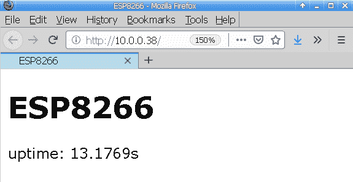
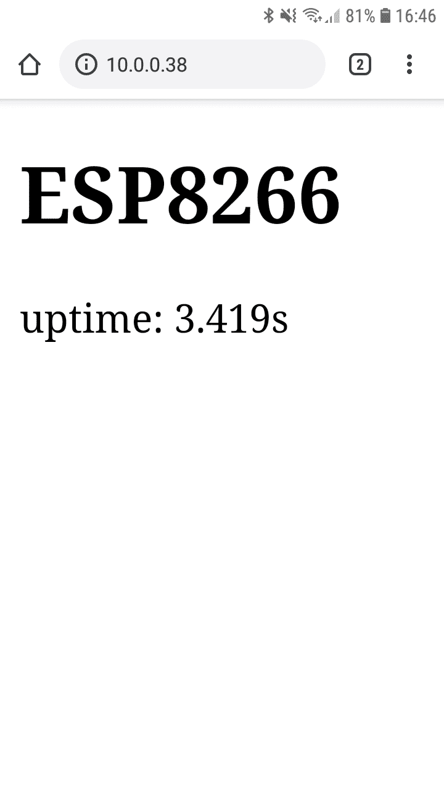

# 第十二章：网络

本章将介绍与执行网络操作相关的各种主题。将呈现一些简单的低级示例，例如使用低级套接字库执行 DNS 查找。还将呈现 HTTP 客户端和服务器实现。然后，我们将向您展示如何创建一个应用程序，该应用程序可以让您使用 Web 浏览器控制微控制器上的 LED 灯。

本章将帮助您创建一个需要从互联网获取信息的 MicroPython 项目。这可以帮助您在需要为人们提供一种使用其手机和计算机上的 Web 浏览器直接连接和与您的 MicroPython 板交互的方式时使用。

在本章中，我们将涵盖以下主题：

+   执行 DNS 查找

+   创建一个等待互联网连接的函数

+   使用原始套接字执行 HTTP 请求

+   使用 urequests 库执行 HTTP 请求

+   从 RESTful web 服务获取 JSON 数据

+   创建一个 HTTP 服务器

+   创建一个 web 处理程序模块

+   通过 web 服务器控制 LED 灯

+   开发一个 RESTful API 来控制 LED 灯

# 技术要求

本章的代码文件可以在本书的 GitHub 存储库的`Chapter12`文件夹中找到，网址为[`github.com/PacktPublishing/MicroPython-Cookbook`](https://github.com/PacktPublishing/MicroPython-Cookbook)。

本章使用 Adafruit Feather HUZZAH ESP8266。本章中的所有配方都使用了 CircuitPython 3.1.2。您应该应用我们在第十章中描述的*连接到现有 Wi-Fi 网络*配方中的配置，*控制 ESP8266*。此配方将使您能够运行本章中连接到互联网的所有配方，以及涉及您从计算机连接到您的板的配方。

# 执行 DNS 查找

本教程将向您展示如何编写可以在 MicroPython 上运行的代码，以执行 DNS 查找。每当我们的应用程序尝试连接到主机时，首先要做的一步是使用 DNS 协议查找主机名并获取主机的 IP 地址，以便您可以打开到该 IP 地址的连接。

本教程向您展示了如何执行 DNS 查找，然后将这些代码行打包到一个函数中，您可以在需要获取特定主机的 IP 地址时调用该函数。当您的设备或网络出现网络问题并且需要一些简单的测试来排除故障时，本教程可以在您的项目中发挥作用，或者当您想要跟踪主机名及其相关 IP 地址时。

# 准备就绪

您需要访问 ESP8266 上的 REPL，以运行本教程中提供的代码。

# 如何做...

按照以下步骤学习如何执行 DNS 查找：

1.  在 REPL 中运行以下代码行：

```py
>>> import socket
>>> 
>>> addr_info = socket.getaddrinfo('python.org', 80)
>>> addr_info
[(2, 1, 0, '', ('45.55.99.72', 80))]
```

1.  我们已经使用`getaddrinfo`函数对`python.org`执行了 DNS 查找，并获取了其 IP 地址。以下代码块将访问返回的数据结构中包含 IP 地址的指定字符串：

```py
>>> ip = addr_info[0][-1][0]
>>> ip
'45.55.99.72'
```

1.  现在我们可以将这段代码封装在一个函数中，以返回给定主机名的 IP 地址：

```py
>>> def get_ip(host, port=80):
...     addr_info = socket.getaddrinfo(host, port)
...     return addr_info[0][-1][0]
...     
...     
... 
>>> 
```

1.  我们将使用不同主机名调用此函数，以验证其是否正常工作：

```py
>>> get_ip('python.org')
'45.55.99.72'
>>> get_ip('micropython.org')
'176.58.119.26'
>>> get_ip('pypi.org')
'151.101.0.223'
```

1.  以下代码应放入`main.py`文件中：

```py
import socket
import time

BOOTUP_WIFI_DELAY = 5

def get_ip(host, port=80):
    addr_info = socket.getaddrinfo(host, port)
    return addr_info[0][-1][0]

def main():
    print('applying wifi delay...')
    time.sleep(BOOTUP_WIFI_DELAY)
    print('performing DNS lookup...')
    hosts = ['python.org', 'micropython.org', 'pypi.org']
```

```py
    for host in hosts:
        print(host, get_ip(host))

main()
```

执行此脚本时，它将对三个主机名执行 DNS 查找，并打印出每次查找的结果。

# 工作原理...

定义的`get_ip`函数将接收主机名作为第一个参数，并在每次函数调用结束时执行主机名的 DNS 查找，然后返回 IP 地址。还有一个可选参数，用于指定连接到主机时要使用的 TCP 端口。TCP 端口的默认值设置为端口`80`。这是 HTTP 协议的端口号。这意味着此函数将适用于托管 web 服务器的主机。

`main`函数在启动时睡眠五秒，以便让板子在启动时建立到 Wi-Fi 网络的连接，然后执行 DNS 查找。然后，`main`函数循环遍历三个主机名，并对每个主机名执行 DNS 查找，通过`for`循环打印出每个条目的主机名和返回的 IP 地址。

# 还有更多...

这个脚本完成了它的任务，但还有改进的空间。大多数 Wi-Fi 网络上的五秒延迟已经足够了。然而，有些网络可能需要更长的时间，所以这个值应该增加。但是，如果我们把这个值设置得很高，而网络连接很快，那么我们就会不必要地等待太久。在下一个教程中，我们将介绍一种等待互联网连接的方法，以更有效的方式解决这两个限制。每当你在代码中使用硬编码的睡眠数值时，你应该深入挖掘并寻找更好的解决方案。

# 另请参阅

以下是关于本教程的一些参考资料：

+   关于`getaddrinfo`函数的文档可以在[`docs.python.org/3/library/socket.html#socket.getaddrinfo`](https://docs.python.org/3/library/socket.html#socket.getaddrinfo)找到。

+   在 MicroPython 上使用`getaddrinfo`的示例可以在[`docs.micropython.org/en/latest/esp8266/tutorial/network_tcp.html#star-wars-asciimation`](https://docs.micropython.org/en/latest/esp8266/tutorial/network_tcp.html#star-wars-asciimation)找到。

# 创建一个等待互联网连接的函数

本教程将向您展示如何编写一个函数，在启动时轮询您的 Wi-Fi 连接状态。我们将把这个函数命名为`wait_for_networking`。一旦它检测到连接已成功建立，并且通过 DHCP 分配了 IP 地址，`wait_for_networking`函数将返回。

每当你有一个需要互联网连接的项目时，你都会在启动时面临这个问题。如果你的脚本立即启动，在网络连接建立之前连接到互联网，它将引发异常并无法继续执行。使用本教程中的方法将允许你在网络连接正确建立后开始程序的其余执行。

# 准备工作

您需要在 ESP8266 上访问 REPL 来运行本教程中提供的代码。

# 如何做...

按照以下步骤学习如何创建一个等待互联网连接的函数：

1.  在 REPL 中执行以下代码块：

```py
>>> import network
>>> import time
>>> 
>>> station = network.WLAN(network.STA_IF)
>>> station.isconnected()
False
```

1.  当代码运行得足够早时，它将返回一个`False`值。再次调用`isconnected`，但在稍后的阶段，将得到以下输出：

```py
>>> station.isconnected()
True
```

1.  下面的代码块可以用来在网络连接后检索分配的 IP 地址：

```py
>>> ip = station.ifconfig()[0]
>>> ip
'10.0.0.38'
```

1.  以下函数将所有这些代码整合到一个函数中，该函数将等待直到建立网络连接并为设备分配 IP 地址。然后返回 IP 地址：

```py
>>> def wait_for_networking():
...     station = network.WLAN(network.STA_IF)
...     while not station.isconnected():
...         print('waiting for network...')
...         time.sleep(1)
...     ip = station.ifconfig()[0]
...     print('address on network:', ip)
...     return ip
...     
...     
... 
>>> 
>>> ip = wait_for_networking()
address on network: 10.0.0.38
>>> ip
'10.0.0.38'
>>> 
```

1.  以下代码应该放入`netcheck.py`文件中：

```py
import network
import time

def wait_for_networking():
    station = network.WLAN(network.STA_IF)
    while not station.isconnected():
        print('waiting for network...')
        time.sleep(1)
    ip = station.ifconfig()[0]
```

```py
    print('address on network:', ip)
    return ip
```

1.  以下代码块应该放入`main.py`文件中：

```py
from netcheck import wait_for_networking

def main():
    ip = wait_for_networking()
    print('main started')
    print('device ip:', ip)

main()
```

当执行这个脚本时，它将等待网络连接建立，然后打印出分配给设备的 IP 地址。

# 它是如何工作的...

在本教程中，我们创建了一个名为`netcheck`的 Python 模块。该模块中的`wait_for_networking`函数将创建一个名为`station`的 WLAN 对象。`station`对象将用于以 1 秒的间隔轮询网络，直到建立网络连接。然后，它将使用`ifconfig`方法从`station`对象中获取分配的 IP。然后将这个 IP 地址返回给调用函数。本教程中的主要脚本只是从`netcheck`模块中导入`wait_for_networking`函数，并在执行开始时调用它，然后打印出返回的 IP 地址。

# 还有更多...

许多网络连接的项目应该在网络连接后才启动其主要代码块。当你在典型的计算机上运行 Python 时，操作系统会在为你启动其他服务之前确保所有网络连接正常。在 MicroPython 的情况下，没有操作系统，它只是在裸机上运行你的脚本。你必须考虑这些因素，以便你的代码能够正确运行。

# 另请参阅

以下是关于这个教程的一些参考资料：

+   关于**动态主机配置协议**（**DHCP**）的文档可以在[`tools.ietf.org/html/rfc2131`](https://tools.ietf.org/html/rfc2131)找到。

+   关于 Linux 上的`systemd`如何处理检测网络连接的文档可以在[`www.freedesktop.org/wiki/Software/systemd/NetworkTarget/`](https://www.freedesktop.org/wiki/Software/systemd/NetworkTarget/)找到。

# 使用原始套接字执行 HTTP 请求

这个教程将使用 MicroPython 和 Python 都带有的`socket`库来执行 HTTP 请求。我们将创建一个接收 URL 作为输入并在执行 HTTP 请求后返回所请求的 Web 服务器的响应的函数。我们还将创建一个函数，它可以解析 URL 并返回 URL 的主机名和路径组件。这些部分将需要执行 HTTP 请求。

有一整类 MicroPython 项目希望连接到互联网上的 Web 服务器并获取不同的结果。你将看到一种使用`socket`库来实现这一点的方法，它可以直接访问 TCP 套接字，从中读取和写入数据字节。

# 准备工作

你需要访问 ESP8266 上的 REPL 来运行本教程中提供的代码。

# 如何做...

按照以下步骤学习如何使用原始套接字执行 HTTP 请求：

1.  使用 REPL 运行以下代码行：

```py
>>> import socket
>>> import time
>>> 
>>> def parse_url(url):
...     return url.replace('http://', '').split('/', 1)
...     
...     
... 
>>> 
```

1.  我们已经成功创建了`parse_url`函数，它接受一个 URL 并返回`host`和`path`组件：

```py
>>> url = 'http://micropython.org/ks/test.html'
>>> host, path = parse_url(url)
>>> host
'micropython.org'
>>> path
'ks/test.html'
>>> 
```

1.  然后使用示例 URL 调用`parse_url`以演示其功能。在下面的代码块中，我们定义并调用一个函数来查找特定主机名的 IP 地址：

```py
>>> HTTP_PORT = 80
>>> def get_ip(host, port=HTTP_PORT):
...     addr_info = socket.getaddrinfo(host, port)
...     return addr_info[0][-1][0]
...     
...     
... 
>>> ip = get_ip(host)
>>> ip
'176.58.119.26'
>>> 
```

1.  现在我们可以定义`fetch`函数，它接收 URL 作为输入，并从 Web 服务器检索其内容：

```py
>>> HTTP_REQUEST = 'GET /{path} HTTP/1.0\r\nHost: {host}\r\n\r\n'
>>> BUFFER_SIZE = 1024
>>> 
>>> def fetch(url):
...     host, path = parse_url(url)
...     ip = get_ip(host)
...     sock = socket.socket()
...     sock.connect((ip, 80))
...     request = HTTP_REQUEST.format(host=host, path=path)
...     sock.send(bytes(request, 'utf8'))
...     response = b''
...     while True:
...         chunk = sock.recv(BUFFER_SIZE)
...         if not chunk:
...             break
...         response += chunk
...     sock.close()
...     body = response.split(b'\r\n\r\n', 1)[1]
...     return str(body, 'utf8')
...     
...     
... 
>>> 
```

1.  现在我们可以调用这个函数并检查它返回的结果：

```py
>>> html = fetch('http://micropython.org/ks/test.html')
>>> html
'<!DOCTYPE html>\n<html lang="en">\n    <head>\n        <title>Test</title>\n    </head>\n    <body>\n        <h1>Test</h1>\n        It\'s working if you can read this!\n    </body>\n</html>\n'
>>> print(html)
<!DOCTYPE html>
<html lang="en">
    <head>
        <title>Test</title>
    </head>
    <body>
        <h1>Test</h1>
        It's working if you can read this!
    </body>
</html>

>>> 
```

1.  以下代码应该放入`main.py`文件中：

```py
from netcheck import wait_for_networking
import socket

HTTP_REQUEST = 'GET /{path} HTTP/1.0\r\nHost: {host}\r\n\r\n'
HTTP_PORT = 80
BUFFER_SIZE = 1024

def parse_url(url):
    return url.replace('http://', '').split('/', 1)

def get_ip(host, port=HTTP_PORT):
    addr_info = socket.getaddrinfo(host, port)
    return addr_info[0][-1][0]

def fetch(url):
    host, path = parse_url(url)
    ip = get_ip(host)
    sock = socket.socket()
    sock.connect((ip, 80))
    request = HTTP_REQUEST.format(host=host, path=path)
    sock.send(bytes(request, 'utf8'))
    response = b''
    while True:
        chunk = sock.recv(BUFFER_SIZE)
        if not chunk:
            break
        response += chunk
    sock.close()
    body = response.split(b'\r\n\r\n', 1)[1]
    return str(body, 'utf8')

def main():
    wait_for_networking()
    html = fetch('http://micropython.org/ks/test.html')
    print(html)

main()
```

当这个脚本被执行时，它将获取特定 URL 的内容并输出返回的结果。

# 它是如何工作的...

`parse_url`函数将返回我们感兴趣的 URL 的两个主要部分。这是通过删除 URL 的初始部分并使用`/`字符进行单个字符串分割来完成的。一旦执行了这些操作，我们将得到 URL 的主机名和路径部分，然后我们可以返回它。`fetch`函数首先调用`parse_url`和`get_ip`来获取给定 URL 的主机名、路径和 IP 地址信息。一旦完成，就会创建一个到 Web 服务器的套接字连接。

通过填写名为`HTTP_REQUEST`的模板来创建 HTTP 请求。然后将此请求通过网络传输到 Web 服务器。结果将不断被读取为一系列块，直到达到响应的末尾。这些数据块被连接在一起成为一个名为 response 的变量。

响应中包含了 HTTP 头和响应体。我们只对响应体感兴趣，所以我们使用`split`方法来提取它。一旦提取出来，它就会从`bytes`对象转换为字符串并返回。`main`函数在调用时将等待网络连接，然后调用`fetch`函数获取 URL 的 HTML 内容。然后将此内容打印出来。

# 还有更多...

这个示例中有很多内容。在某种程度上，这是一个学习 TCP 套接字、HTTP、HTML 和 URL 的好方法，因为所有的低级细节都暴露给了你。MicroPython 没有提供与 Python 标准库一起提供的高级 HTTP 请求库。

因此，当您想要从头开始编写代码从 Web 服务器获取内容时，您必须以与本示例中介绍的相同方式使用`socket`库。在下一个示例中，我们将看到有一个 Python 模块可以与 MicroPython 一起工作，我们可以将其添加到我们的项目中，以使执行这些 HTTP 请求变得更简单。

# 另请参阅

以下是关于这个示例的一些参考资料：

+   有关 MicroPython 套接字对象上`send`方法的文档可以在[`docs.micropython.org/en/latest/library/usocket.html#usocket.socket.send`](https://docs.micropython.org/en/latest/library/usocket.html#usocket.socket.send)找到。

+   有关 MicroPython 套接字对象上`recv`方法的文档可以在[`docs.micropython.org/en/latest/library/usocket.html#usocket.socket.recv`](https://docs.micropython.org/en/latest/library/usocket.html#usocket.socket.recv)找到。

# 使用`urequests`库执行 HTTP 请求

这个示例将使用`urequests`库，这个库是专门为与 MicroPython 一起使用而编写的。它提供了一种方便的方式来连接到 Web 服务器并执行 HTTP 请求。这个库提供了一个对象，您可以使用它来执行所有的 HTTP 交互。请求完成后，您可以访问这个对象的不同属性，以获取有关完成请求的各种信息。

这个示例将探讨如何使用这个库以及可能想要在其对象上访问的不同属性。当您开始创建需要进行 HTTP 请求的 MicroPython 项目时，这个库将处理许多低级细节，使得您的代码更简单、更易读，并让您专注于手头的任务，而不是被低级 TCP 套接字细节所困扰。

# 准备工作

您需要访问 ESP8266 上的 REPL 来运行本示例中提供的代码。

# 如何做...

按照以下步骤学习如何使用`urequests`执行 HTTP 请求：

1.  从[`github.com/micropython/micropython-lib/blob/master/urequests/urequests.py`](https://github.com/micropython/micropython-lib/blob/master/urequests/urequests.py)下载`urequests.py`。

1.  将这个 Python 模块保存在您的开发板的顶层目录中。

1.  在 REPL 中运行以下代码行：

```py
>>> import urequests
>>> 
>>> url = 'http://micropython.org/ks/test.html'
>>> req = urequests.get(url)
```

1.  我们现在有一个完成的 HTTP 请求，并且其结果存储在`req`变量中。以下代码块将输出我们从 Web 服务器收到的 HTML 响应：

```py
>>> req.text
'<!DOCTYPE html>\n<html lang="en">\n    <head>\n        <title>Test</title>\n    </head>\n    <body>\n        <h1>Test</h1>\n        It\'s working if you can read this!\n    </body>\n</html>\n'
>>> print(req.text)
<!DOCTYPE html>
<html lang="en">
    <head>
        <title>Test</title>
    </head>
    <body>
        <h1>Test</h1>
        It's working if you can read this!
    </body>
</html>

>>> 
```

1.  我们还可以以二进制形式访问原始内容，如下面的代码块所示：

```py
>>> req.content
b'<!DOCTYPE html>\n<html lang="en">\n    <head>\n        <title>Test</title>\n    </head>\n    <body>\n        <h1>Test</h1>\n        It\'s working if you can read this!\n    </body>\n</html>\n'
>>> 
```

1.  `status_code`属性为我们提供了响应的 HTTP 状态代码：

```py
>>> req.status_code
200
```

1.  以下代码块将尝试访问一个不存在的页面：

```py
>>> url = 'http://micropython.org/no_such_page_exists'
>>> req = urequests.get(url)
```

1.  我们现在可以检查状态代码和解释文本的值：

```py
>>> req.status_code
404
>>> req.reason
b'Not Found'
>>> 
```

1.  以下代码应该放入`main.py`文件中：

```py
from netcheck import wait_for_networking
import urequests

def main():
    wait_for_networking()
    url = 'http://micropython.org/ks/test.html'
    html = urequests.get(url).text
    print(html)

main()
```

当执行此脚本时，它将使用`urequests`库来获取特定 URL 的内容，并输出页面的 HTML 内容。

# 工作原理...

`urequests`库提供了一个名为`get`的函数，让您可以在 Web 服务器上执行 HTTP `GET`请求。一旦调用了这个函数，它将返回一个对象，该对象具有许多有用的属性，您可以访问这些属性来检索此请求的结果。

您可以通过访问`content`属性获取原始响应作为字节对象，或者通过访问`text`属性获取值作为字符串。最后，您可以使用`status_code`和`reason`属性来检查请求是否成功或失败，以及失败的原因是什么。然后将此代码封装并放入`main`函数中。当调用主函数时，它将连接到 Web 服务器并输出返回的 HTML 文档的内容。

# 还有更多...

本教程展示了一种在 MicroPython 中进行 HTTP 请求的良好方式，而无需深入细节。这是一个很好的例子，说明了一个设计良好的库如何使您的代码更易读和可维护。

该库提供了许多 HTTP 方法，除了基本的 HTTP `GET`请求。`HEAD`、`POST`、`PUT`、`PATCH`和`DELETE`方法也都可用。它们都可以使用与请求方法匹配的函数名称进行访问。在与需要正确指定 HTTP 方法才能正常工作的网络服务进行交互时，这可能非常有用。如果您每次使用`urequests`库进行 HTTP 调用时都收到警告消息，您可以尝试使用`fix_urequests_warnings.py`文件来解决此问题。您可以在本书的 GitHub 存储库的`Chapter12`文件夹中找到此脚本。

# 另请参阅

以下是关于本教程的一些参考资料：

+   可以在[`developer.mozilla.org/en-US/docs/Web/HTTP/Status`](https://developer.mozilla.org/en-US/docs/Web/HTTP/Status)找到有关 HTTP 响应状态代码列表的文档。

+   流行的 requests 库是`urequests`设计基础，可以在[`docs.python-requests.org/en/master/`](http://docs.python-requests.org/en/master/)找到。

# 从 RESTful 网络服务获取 JSON 数据

本教程将向您展示一个示例，以连接到互联网上的服务器，以便使用其 RESTful 网络服务。网络服务将以 JSON 格式提供数据，然后对其进行解析，以便我们可以访问返回数据集的不同部分。

我们将使用一个提供**国际空间站**（**ISS**）当前位置的网络服务。由于 ISS 以每小时 28,000 公里的惊人速度移动，我们可以观察到它的位置（以经度和纬度表示）随着我们反复调用这个网络服务而发生变化。每当您想要创建一个连接到基于互联网的网络服务丰富世界的 MicroPython 项目时，您可以使用本教程中介绍的技术作为构建这些连接的起点。

# 准备工作

您将需要访问 ESP8266 上的 REPL 来运行本教程中提供的代码。

# 如何做...

按照以下步骤学习如何从 RESTful 网络服务获取 JSON 数据：

1.  在 REPL 中执行以下代码块：

```py
>>> import urequests
>>> import time
>>> 
>>> ISS_API_URL = 'http://api.open-notify.org/iss-now.json'
>>> req = urequests.get(ISS_API_URL)
```

1.  我们已成功连接到网络服务并检索到了空间站的位置。以下代码块将检查返回给我们的数据：

```py
>>> req.text
'{"timestamp": 1555012195, "iss_position": {"latitude": "-33.1779", "longitude": "45.0667"}, "message": "success"}'
>>> 
```

1.  数据以 JSON 格式提供。我们可以使用以下代码块来解析文本数据并生成一组嵌套字典：

```py
>>> data = req.json()
>>> data
{'message': 'success', 'iss_position': {'longitude': '45.0667', 'latitude': '-33.1779'}, 'timestamp': 1555012195}
```

1.  以下代码块显示了我们如何从返回的数据结构中访问纬度和经度数据：

```py
>>> data['iss_position']['latitude']
'-33.1779'
>>> data['iss_position']['longitude']
'45.0667'
```

1.  现在，我们将创建并调用`track_space_station`函数，该函数将在`10`秒的时间内每秒跟踪空间站的位置：

```py
>>> req.status_code
>>> def track_space_station():
...     for i in range(10):
...         data = urequests.get(ISS_API_URL).json()
...         position = data['iss_position']
...         print(i, 'lat: {latitude} long: {longitude}'.format(**position))
...         time.sleep(1)
...         
...         
... 
>>> track_space_station()
0 lat: -38.5192 long: 52.4146
1 lat: -38.5783 long: 52.5069
2 lat: -38.6570 long: 52.6302
3 lat: -38.7355 long: 52.7538
4 lat: -38.7943 long: 52.8467
5 lat: -38.8726 long: 52.9708
6 lat: -38.9507 long: 53.0952
7 lat: -39.0092 long: 53.1887
8 lat: -39.0871 long: 53.3136
9 lat: -39.1454 long: 53.4075
>>> 
```

1.  以下代码应放入`main.py`文件中：

```py
from netcheck import wait_for_networking
import urequests
import time

ISS_API_URL = 'http://api.open-notify.org/iss-now.json'

def track_space_station():
    for i in range(10):
        data = urequests.get(ISS_API_URL).json()
        position = data['iss_position']
        print(i, 'lat: {latitude} long: {longitude}'.format(**position))
        time.sleep(1)

def main():
    wait_for_networking()
    track_space_station()

main()
```

当执行此脚本时，它将跟踪 ISS 的位置，并在固定时间内每秒显示纬度和经度的变化。

# 工作原理...

我们定义了一个名为`ISS_API_URL`的常量，其中包含我们可以使用的 URL，以检索 ISS 当前位置的信息。当我们通过执行 HTTP `GET`请求调用此 API 时，服务器会以 JSON 格式返回其输出。然后，我们可以使用返回的请求对象上的`json`方法将此响应解析为 Python 数据结构。我们可以访问`iss_position`键以及该字典中的纬度和经度信息。`track_space_station`函数的其余部分只是循环执行`10`次迭代，每次循环之间间隔 1 秒，然后调用 API 并打印其解析的结果。

# 还有更多...

这个示例是 Web 服务世界丰富多彩的一个很好的例子。您可以将这些微型低功耗微控制器连接到各种丰富的信息源。JSON 是这些 Web 服务最流行的序列化格式，因此具有内置支持解析此格式的 MicroPython 功能非常强大。

MicroPython 还完全支持创建 JSON 输出，以便您可以从 MicroPython 项目向 Web 服务提交数据。您可以将一些传感器连接到您的开发板，并使用 Web 服务将传感器数据以 JSON 格式持续上传到远程服务器。

# 另请参阅

以下是关于此主题的一些参考资料：

+   ISS 当前位置 API 的文档可以在[`open-notify.org/Open-Notify-API/ISS-Location-Now/`](http://open-notify.org/Open-Notify-API/ISS-Location-Now/)找到。

+   JSON 格式的文档可以在[`www.json.org/`](https://www.json.org/)找到。

# 创建 HTTP 服务器

这个示例将向您展示如何在 ESP8266 上使用 MicroPython 创建一个可以提供动态内容的 Web 页面的 Web 服务器。每当浏览器访问 Web 服务器时，它将显示开发板的当前正常运行时间（以秒为单位）。

我们将确保生成的网页在计算机网络浏览器和手机浏览器上都能很好地显示。它可以成为您创建的项目的强大工具，因为您可以使用网络浏览器从任何手机或计算机与它们进行交互。

这个示例向您展示了如何创建这样的项目，您可以将任何实时传感器数据或信息直接提交到人们的浏览器，无论他们是从手机还是台式电脑连接的。

# 准备工作

您需要访问 ESP8266 上的 REPL 来运行本示例中提供的代码。

# 如何做...

按照以下步骤学习如何创建 HTTP 服务器：

1.  使用 REPL 运行以下代码行：

```py
>>> from netcheck import wait_for_networking
>>> import socket
>>> import time
>>> 
>>> HTTP_PORT = 80
>>> TCP_BACKLOG = 0
```

1.  在这个阶段，我们已经导入了所有必要的 Python 模块并定义了常量。以下代码块将定义一个 HTML 模板，我们将使用它来生成页面，然后将其提交给连接的浏览器：

```py
>>> TEMPLATE = """\
... <!DOCTYPE HTML>
... <html lang="en">
... <head>
...     <title>ESP8266</title>
...     <meta charset="UTF-8">
...     <link rel="icon" href="data:,">
...     <meta name="viewport" content="width=device-width">
... </head>
... <body>
...     <h1>ESP8266</h1>
...     uptime: {uptime}s
...     </body>
...     </html>
... """
>>> 
```

1.  以下函数被定义并调用，并将绑定并监听默认的 HTTP 端口：

```py
>>> def socket_listen():
...     sock = socket.socket()
...     sock.bind(('0.0.0.0', HTTP_PORT))
...     sock.listen(TCP_BACKLOG)
...     return sock
...     
...     
... 
>>> ip = wait_for_networking()
address on network: 10.0.0.38
>>> sock = socket_listen()
```

1.  以下代码块定义并调用了`serve_requests`函数，该函数将负责为 Web 服务器发出的任何请求提供服务。调用该函数，然后浏览器分别访问了 Web 服务器三次。每次提供服务时，其详细信息都会被打印出来：

```py
>>> def serve_requests(sock, ip):
...     print('webserver started on http://%s/' % ip)
...     start = time.monotonic()
...     while True:
...         conn, address = sock.accept()
...         print('request:', address)
...         request = conn.makefile('rwb')
...         while True:
...             line = request.readline()
...             if not line or line == b'\r\n':
...                 break
...         uptime = time.monotonic() - start
...         html = TEMPLATE.format(uptime=uptime)
...         conn.send(html)
...         conn.close()
...         
...         
... 
>>> 
>>> serve_requests(sock, ip)
webserver started on http://10.0.0.38/
request: ('10.0.0.151', 47290)
request: ('10.0.0.151', 47292)
request: ('10.0.0.151', 47294)
```

1.  以下代码应放入`main.py`文件中：

```py
from netcheck import wait_for_networking
import socket
import time

HTTP_PORT = 80
TCP_BACKLOG = 0
TEMPLATE = """\
<!DOCTYPE HTML>
<html lang="en">
<head>
    <title>ESP8266</title>
    <meta charset="UTF-8">
    <link rel="icon" href="data:,">
    <meta name="viewport" content="width=device-width">
</head>
<body>
    <h1>ESP8266</h1>
    uptime: {uptime}s
</body>
</html>
"""

def socket_listen():
    sock = socket.socket()
    sock.bind(('0.0.0.0', HTTP_PORT))
    sock.listen(TCP_BACKLOG)
    return sock

def serve_requests(sock, ip):
    print('webserver started on http://%s/' % ip)
    start = time.monotonic()
    while True:
        conn, address = sock.accept()
        print('request:', address)
        request = conn.makefile('rwb')
        while True:
            line = request.readline()
            if not line or line == b'\r\n':
                break
        uptime = time.monotonic() - start
        html = TEMPLATE.format(uptime=uptime)
        conn.send(html)
        conn.close()

def main():
    ip = wait_for_networking()
    sock = socket_listen()
    serve_requests(sock, ip)

main()
```

当执行此脚本时，每次开发板启动时都会启动一个 Web 服务器，每次被浏览器访问时都会显示服务器的正常运行时间。

# 工作原理...

在脚本中定义的第一件事是 HTML 模板。此模板将生成有效的 HTML5 网页，可以在移动设备和台式电脑上正确显示。

`icon`链接标签存在是为了防止 Web 浏览器不必要地请求`favicon.ico`文件。调用`socket_listen`函数来绑定并监听默认的 HTTP 端口。然后调用`serve_requests`函数，将无休止地处理所有传入的 HTTP 请求。Web 服务器的启动时间记录在一个名为`start`的变量中。我们将使用这个变量来计算每个请求的服务器正常运行时间。

我们调用`accept`方法，它将阻塞代码，直到有新的请求到达 web 服务器。一旦我们收到这个新请求，我们通过反复调用`readline`方法来消耗所有的 HTTP 请求头，直到检测到请求头的结束。现在我们可以生成我们的 HTML 响应，并使用`send`方法将其发送给 HTTP 客户端。传输响应后，我们关闭与客户端的连接。

# 还有更多...

您可以采用这个方法，并以多种方式进行扩展。您可以从连接到板子的不同传感器和按钮中读取数据，并将这些数据发送回浏览器。您还可以轻松地更改和添加模板的内容。

目前，它只有 HTML 内容，但没有什么可以阻止您向响应中添加 CSS、JavaScript 和图像内容。该板子配备了 4MB 的闪存，因此板子上有足够的空间来添加所有这些内容。以下截图显示了在桌面浏览器上显示的从此方法生成的页面：



以下截图是从安卓智能手机的浏览器中获取的：



在这个方法中设计 HTML 的方式是为了使一个代码库可以为两类设备提供服务。

# 另请参阅

以下是有关此方法的一些参考资料：

+   有关`bind`方法的文档可以在[`docs.micropython.org/en/latest/library/usocket.html#usocket.socket.bind`](https://docs.micropython.org/en/latest/library/usocket.html#usocket.socket.bind)找到。

+   有关`listen`方法的文档可以在[`docs.micropython.org/en/latest/library/usocket.html#usocket.socket.listen`](https://docs.micropython.org/en/latest/library/usocket.html#usocket.socket.listen)找到。

# 创建 Web 处理程序模块

这个方法将向您展示如何将处理套接字、解析 HTTP 请求头和生成 HTML 所涉及的大量代码和逻辑捆绑到一个单独的 Python 模块中。一旦我们将它放入一个模块中，我们就可以导入这个模块，并将我们的 Web 处理程序传递给它，它将为我们完成所有繁重的工作。

当您创建在微控制器上创建基于 Web 的应用程序的项目时，您会发现这个方法非常有用，而且您希望快速提高生产力，而不会陷入套接字和解析 HTTP 头的所有低级细节中。

# 准备工作

您需要访问 ESP8266 上的 REPL 才能运行此处提供的代码。

# 如何做...

按照以下步骤学习如何创建 Web 处理程序模块：

1.  在 REPL 中运行以下代码行：

```py
>>> from netcheck import wait_for_networking
>>> import socket
>>> 
>>> HTTP_PORT = 80
>>> TCP_BACKLOG = 0
>>> BASE_TEMPLATE = """\
... <!DOCTYPE HTML>
... <html lang="en">
... <head>
...     <title>MicroPython</title>
...     <meta charset="UTF-8">
...     <link rel="icon" href="data:,">
...     <meta name="viewport" content="width=device-width">
... </head>
... <body>
... %s
... </body>
... </html>
... """
>>> 
```

1.  我们创建了一个名为`BASE_TEMPLATE`的变量，它将充当通用模板。现在，我们可以用任何我们想要的内容填充它的`body`标签。以下代码块定义了`socket_listen`，它为服务器进行了初始套接字配置：

```py
>>> def socket_listen():
...     sock = socket.socket()
...     sock.bind(('0.0.0.0', HTTP_PORT))
...     sock.listen(TCP_BACKLOG)
...     return sock
...     
...     
... 
```

1.  以下代码块具有一个接收 web 处理程序作为参数的函数。当调用时，它将处理传入的请求，以便可以收集它们的请求头，然后解析 HTTP 方法和请求的路径。然后将此信息传递给处理程序，处理程序将返回要发送给 HTTP 客户端的 HTML 内容：

```py
>>> def serve_requests(sock, ip, handler):
...     print('webserver started on http://%s/' % ip)
...     while True:
...         conn, address = sock.accept()
...         stream = conn.makefile('rwb')
...         request = b''
...         while True:
...             line = stream.readline()
...             request += line
...             if not line or line == b'\r\n':
...                 break
...         request = str(request, 'utf8')
...         method, path, _ = request.split(' ', 2)
...         client_ip = address[0]
...         print('request:', client_ip, method, path)
...         html = handler(request, method, path)
...         conn.send(html)
...         conn.close()
...         
...         
... 
>>> 
```

1.  `run_server`函数在以下代码块中定义。它提供了一个处理程序，并将创建套接字并调用`serve_requests`来开始处理所有传入的请求：

```py
>>> def run_server(handler):
...     ip = wait_for_networking()
...     sock = socket_listen()
...     serve_requests(sock, ip, handler)
...     
...     
... 
>>> 
```

1.  以下代码块显示了一个示例处理程序，该处理程序创建一个 Web 应用程序，每次有人访问时都会生成随机数：

```py
>>> import random
>>> 
>>> def handler(request, method, path):
...     body = 'random: %s' % random.random()
...     return BASE_TEMPLATE % body
...     
...     
... 
>>> run_server(handler)
address on network: 10.0.0.38
webserver started on http://10.0.0.38/
request: 10.0.0.151 GET /hotneumm
request: 10.0.0.151 GET /
request: 10.0.0.151 GET /
request: 10.0.0.151 GET /
```

1.  以下代码应放入`web.py`文件中：

```py
from netcheck import wait_for_networking
import socket

HTTP_PORT = 80
TCP_BACKLOG = 0
BASE_TEMPLATE = """\
<!DOCTYPE HTML>
<html lang="en">
<head>
    <title>MicroPython</title>
    <meta charset="UTF-8">
    <link rel="icon" href="data:,">
    <meta name="viewport" content="width=device-width">
</head>
<body>
%s
</body>
</html>
"""
def socket_listen():
    sock = socket.socket()
    sock.bind(('0.0.0.0', HTTP_PORT))
    sock.listen(TCP_BACKLOG)
    return sock

def serve_requests(sock, ip, handler):
    print('webserver started on http://%s/' % ip)
    while True:
        conn, address = sock.accept()
        stream = conn.makefile('rwb')
        request = b''
        while True:
            line = stream.readline()
            request += line
            if not line or line == b'\r\n':
                break
        request = str(request, 'utf8')
        method, path, _ = request.split(' ', 2)
        client_ip = address[0]
        print('request:', client_ip, method, path)
        html = handler(request, method, path)
        conn.send(html)
        conn.close()

def run_server(handler):
    ip = wait_for_networking()
    sock = socket_listen()
    serve_requests(sock, ip, handler)
```

1.  然后，将以下代码放入`main.py`文件中：

```py
from web import BASE_TEMPLATE, run_server
import random

def handler(request, method, path):
    body = 'random: %s' % random.random()
    return BASE_TEMPLATE % body

def main():
    run_server(handler)

main()
```

执行此脚本时，它将在启动时启动一个 Web 服务器，每当有人访问时都会生成随机数。

# 工作原理

此示例的主要部分是`web`Python 模块中的代码。此代码提供了`BASE_TEMPLATE`变量，可以在其`body`标记中填充任何内容。然后，在模块中定义了三个函数。

`socket_listen`函数具有我们熟悉的逻辑；即设置套接字、绑定套接字并使其监听端口`80`。`serve_requests`函数现在接收处理程序，并将 HTTP 请求标头收集到名为`request`的变量中。然后解析此`request`以提取正在使用的 HTTP 方法和请求的路径。然后将这三个变量传递给提供的处理程序，该处理程序返回要传输到 HTTP 客户端的 HTML 响应。`run_server`函数是此模块的主要入口点。您可以调用它并向其提供处理程序，它将设置服务器并开始处理请求。

`main.py`文件中的代码导入了`web`模块，并传递了它定义的处理程序。它的处理程序简单地为每个 HTTP 请求生成一个随机数，并将此数字发送回 Web 浏览器。

# 还有更多...

此示例适合扩展。与套接字处理和处理字节转换相关的大部分代码都由`web`模块完成。您可以导入此模块并在相对较短的时间内在 MicroPython 板上开始创建 Web 应用程序。

您还可以扩展`web`模块以添加更多功能。您可以创建更多内置模板或进一步解析 HTTP 标头，以自动获取更多请求信息。

# 另请参阅

以下是有关此示例的一些参考资料：

+   有关`accept`方法的文档可以在[`docs.micropython.org/en/latest/library/usocket.html#usocket.socket.accept`](https://docs.micropython.org/en/latest/library/usocket.html#usocket.socket.accept)找到。

+   有关`close`方法的文档可以在[`docs.micropython.org/en/latest/library/usocket.html#usocket.socket.close`](https://docs.micropython.org/en/latest/library/usocket.html#usocket.socket.close)找到。

# 通过 Web 服务器控制 LED

此示例将向您展示如何创建一个基于 Web 的应用程序，让人们看到红色和蓝色 LED 灯的状态，并打开和关闭它们。每当您想要创建控制不同硬件组件输出的项目时，例如通过可以从计算机和手机访问的基于 Web 的应用程序控制 LED、屏幕或扬声器时，此示例都会帮助您。

# 准备工作

您需要访问 ESP8266 上的 REPL 才能运行此示例中提供的代码。

# 操作步骤

按照以下步骤学习如何通过 Web 服务器控制 LED：

1.  在 REPL 中执行以下代码块：

```py
>>> from web import BASE_TEMPLATE, run_server
>>> from machine import Pin
>>> 
>>> pins = dict(red=Pin(0, Pin.OUT), blue=Pin(2, Pin.OUT))
>>> state = dict(red=True, blue=True)
>>> 
>>> 
```

1.  已创建`pins`和`state`变量，以便我们可以跟踪红色和蓝色 LED 的状态，并访问它们的`Pin`对象。以下代码块将定义 HTML `BODY`模板，并显示 LED 的当前状态，并提供按钮以切换它们的开和关：

```py
>>> BODY = """
... Red: {red}<br/>
... Blue: {blue}<br/><br/>
... Toggle Colors:<br/><br/>
... <form action="/red" method=post><input type=submit value=Red></form><br/>
... <form action="/blue" method=post><input type=submit value=Blue></form><br/>
... """
>>> 
```

1.  以下代码块中有一个函数，它将布尔值格式化为 HTML 内容中的`On`和`Off`标签：

```py
>>> def format(value):
...     return 'On' if value else 'Off'
...     
...     
... 
>>> 
>>> format(True)
'On'
>>> format(False)
'Off'
>>> 
```

1.  `gen_body`函数生成 HTML 内容的主体部分：

```py
>>> def gen_body():
...     data = {k: format(v) for k, v in state.items()}
...     return BODY.format(**data)
...     
...     
... 
>>> gen_body()
'\nRed: On<br/>\nBlue: On<br/><br/>\nToggle Colors:<br/><br/>\n<form action="/red" method=post><input type=submit value=Red></form><br/>\n<form action="/blue" method=post><input type=submit value=Blue></form><br/>\n'
>>> 
```

1.  `toggle_color`函数将切换 LED 的开和关。第一次调用将关闭红色 LED，而第二次调用将重新打开它：

```py
>>> def toggle_color(color):
...     state[color] = not state[color]
...     pin_value = 0 if state[color] else 1
...     pins[color].value(pin_value)
...     
...     
... 
>>> toggle_color('red')
>>> toggle_color('red')
```

1.  `handler`函数将为`POST`请求切换颜色，并且对于所有请求，它将返回生成的 HTML 主体，其中显示 LED 的状态并提供切换按钮：

```py
>>> def handler(request, method, path):
...     if method == 'POST':
...         color = path.replace('/', '')
...         toggle_color(color)
...     return BASE_TEMPLATE % gen_body()
...     
...     
... 
>>> 
```

1.  以下代码应该放入`main.py`文件中：

```py
from web import BASE_TEMPLATE, run_server
from machine import Pin

pins = dict(red=Pin(0, Pin.OUT), blue=Pin(2, Pin.OUT))
state = dict(red=True, blue=True)

BODY = """
Red: {red}<br/>
Blue: {blue}<br/><br/>
Toggle Colors:<br/><br/>
<form action="/red" method=post><input type=submit value=Red></form><br/>
<form action="/blue" method=post><input type=submit value=Blue></form><br/>
"""

def format(value):
    return 'On' if value else 'Off'

def gen_body():
    data = {k: format(v) for k, v in state.items()}
    return BODY.format(**data)

def toggle_color(color):
    state[color] = not state[color]
    pin_value = 0 if state[color] else 1
    pins[color].value(pin_value)

def handler(request, method, path):
    if method == 'POST':
        color = path.replace('/', '')
        toggle_color(color)
    return BASE_TEMPLATE % gen_body()

def main():
    pins['red'].value(0)
    pins['blue'].value(0)
    run_server(handler)

main()
```

当执行此脚本时，它将启动一个 Web 应用程序，显示 LED 的当前状态，并提供按钮，可用于切换 LED 的开关。

# 它是如何工作的...

`format`函数接受布尔值并返回值以指示`On`或`Off`的灯状态。然后，`gen_body`函数将循环遍历所有 LED 状态值并格式化它们，以便它们可以填充 HTML 模板。然后填充并返回此模板。`toggle_color`函数接收要切换的 LED 的名称，然后在访问`Pin`对象之前更新状态数据结构，以便将更改应用于 LED。`handler`函数将接收传入的请求并在请求为`POST`请求时切换 LED。然后，它将始终返回生成的主体，以显示 LED 的最新值并提供按钮以打开或关闭它们。`main`函数初始化 LED `Pin`对象，然后调用具有定义的处理程序的`run_server`函数，以便它可以开始处理传入的请求。

# 还有更多...

这个教程提供了我们需要检查 LED 的当前设置并打开或关闭它们的所有控件。但是，我们可以以许多方式扩展和改进它。我们可以添加一些 CSS 来改善应用程序的外观和感觉。我们还可以使用一些丰富的 JavaScript 控件，可以在某人与 UI 控件交互时创建动画，以便它们更像切换按钮。

# 另请参阅

以下是关于此教程的一些参考资料：

+   关于 Web 浏览器切换控件的文档可以在[`www.bootstraptoggle.com/`](http://www.bootstraptoggle.com/)找到。

+   有关 HTTP `POST`方法的文档可以在[`developer.mozilla.org/en-US/docs/Web/HTTP/Methods/POST`](https://developer.mozilla.org/en-US/docs/Web/HTTP/Methods/POST)找到。

# 开发 RESTful API 来控制 LED

这个教程将向您展示如何在 ESP8266 上创建一个 RESTful API，该 API 将允许 API 客户端查询 LED 的状态，并切换它们的开关。在之前的教程中，我们已经看到您可以使用 MicroPython 作为客户端来访问 RESTful web 服务。

现在，我们将扭转这一点，并提供 RESTful web 服务，以便网络上的其他设备和计算机可以连接到板并控制其硬件。每当您需要让网络上的其他计算机和设备远程连接到您的项目并控制其上的组件时，您会发现这个教程非常有用。

# 准备工作

您将需要访问 ESP8266 上的 REPL 来运行本教程中提供的代码。您还需要`curl`命令行工具，可以从[`curl.haxx.se/download.html`](https://curl.haxx.se/download.html)下载。

# 如何做...

按照以下步骤学习如何开发 RESTful API 来控制 LED：

1.  使用 REPL 运行以下代码行：

```py
>>> from web import BASE_TEMPLATE, run_server
>>> from machine import Pin
>>> import json
>>> 
>>> pins = dict(red=Pin(0, Pin.OUT), blue=Pin(2, Pin.OUT))
>>> state = dict(red=True, blue=True)
```

1.  我们已经导入了`json`库并设置了`pins`和`state`变量。以下代码块将定义`JSON_HEADERS`模板，我们将使用它为我们的 JSON 响应提供 HTTP 响应头：

```py
>>> JSON_HEADERS = '''\
... HTTP/1.1 200 OK
... Content-Type: application/json
... 
... '''
>>> 
```

1.  以下代码块将执行 RESTful API 调用的 LED 切换：

```py
>>> def toggle_color(color):
...     state[color] = not state[color]
...     pin_value = 0 if state[color] else 1
...     pins[color].value(pin_value)
...     
...     
... 
>>> 
```

1.  以下代码中的`handler`函数将在请求使用`POST`方法时切换 LED。在所有情况下，它将以 JSON 序列化形式返回状态变量的值：

```py
>>> def handler(request, method, path):
...     if method == 'POST':
...         color = path.replace('/', '')
...         toggle_color(color)
...     return JSON_HEADERS + json.dumps(state) + '\n'
...     
...     
... 
>>> 
```

1.  以下代码应该放入`main.py`文件中：

```py
from web import BASE_TEMPLATE, run_server
from machine import Pin
import json

pins = dict(red=Pin(0, Pin.OUT), blue=Pin(2, Pin.OUT))
state = dict(red=True, blue=True)
JSON_HEADERS = '''\
HTTP/1.1 200 OK
Content-Type: application/json

'''

def toggle_color(color):
    state[color] = not state[color]
    pin_value = 0 if state[color] else 1
    pins[color].value(pin_value)

def handler(request, method, path):
    if method == 'POST':
        color = path.replace('/', '')
        toggle_color(color)
    return JSON_HEADERS + json.dumps(state) + '\n'

def main():
    pins['red'].value(0)
    pins['blue'].value(0)
    run_server(handler)

main()
```

1.  执行`main.py`脚本，以便我们可以开始访问 RESTful API。

1.  在您的计算机上下载并安装`curl`命令行（[`curl.haxx.se/download.html`](https://curl.haxx.se/download.html)）。

1.  在终端中运行以下命令：

```py
$ curl http://10.0.0.38/
{"red": true, "blue": true}
```

1.  这将检索 LED 的状态。执行以下命令关闭红色 LED：

```py
$ curl -X POST http://10.0.0.38/red
{"red": false, "blue": true}
```

1.  当我们运行以下命令时，红色 LED 将被重新打开：

```py
$ curl -X POST http://10.0.0.38/red
{"red": true, "blue": true}
```

`curl`命令行是测试和与大多数 RESTful API 交互的绝佳方式。

# 它是如何工作的...

代码的结构与上一个配方非常相似。一些主要的区别是`JSON_HEADERS`模板提供了必要的 HTTP 响应头，指示响应的内容类型将是 JSON。`json`模块中的`dumps`函数也用于从状态数据结构生成 JSON 数据。在通过`curl`测试和与 API 交互之前，服务器需要启动。第一个`curl`命令只是执行一个`GET`请求，返回 LED 的状态。然后我们在`curl`中使用`-X`选项指定我们要使用 POST 方法，这样我们就可以切换 LED 的开关。

# 还有更多...

这个配方提供了一组基本的 API，这样我们就可以控制板上的灯。我们可以扩展它来响应关于服务器运行时间或磁盘使用情况的请求。您可以创建一个 API，让您远程列出和删除文件。RESTful API 是非常强大的工具，您可以使用它来在网络上连接许多不同的脚本和计算机。我们在这个配方中使用的方法可以轻松扩展以提供更多的服务和功能。

# 另请参阅

以下是关于这个配方的一些参考资料：

+   有关使用`curl`命令进行 HTTP `POST`请求的文档可以在[`ec.haxx.se/http-post.html`](https://ec.haxx.se/http-post.html)找到。

+   RESTful API 的教程可以在[`www.restapitutorial.com/`](https://www.restapitutorial.com/)找到。
