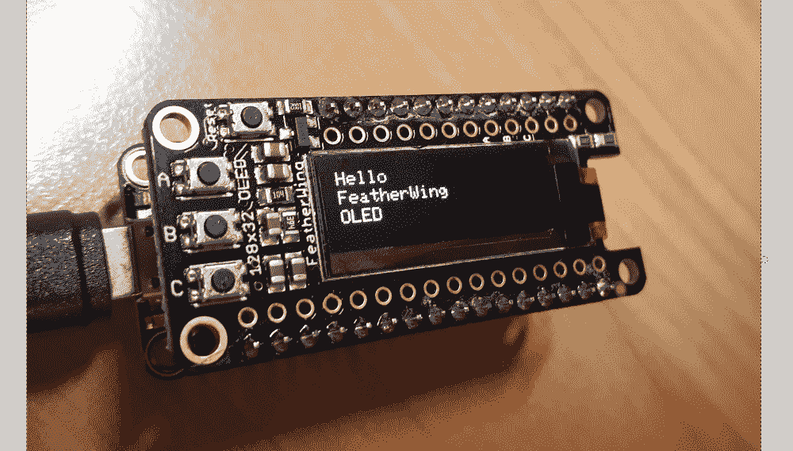
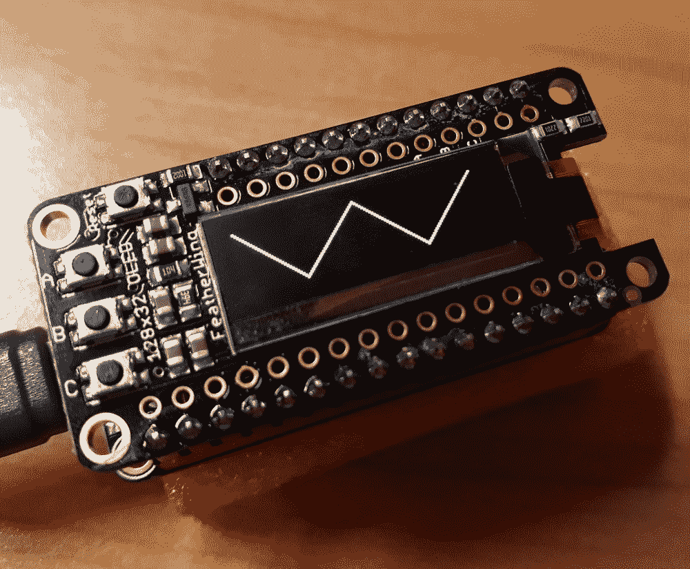
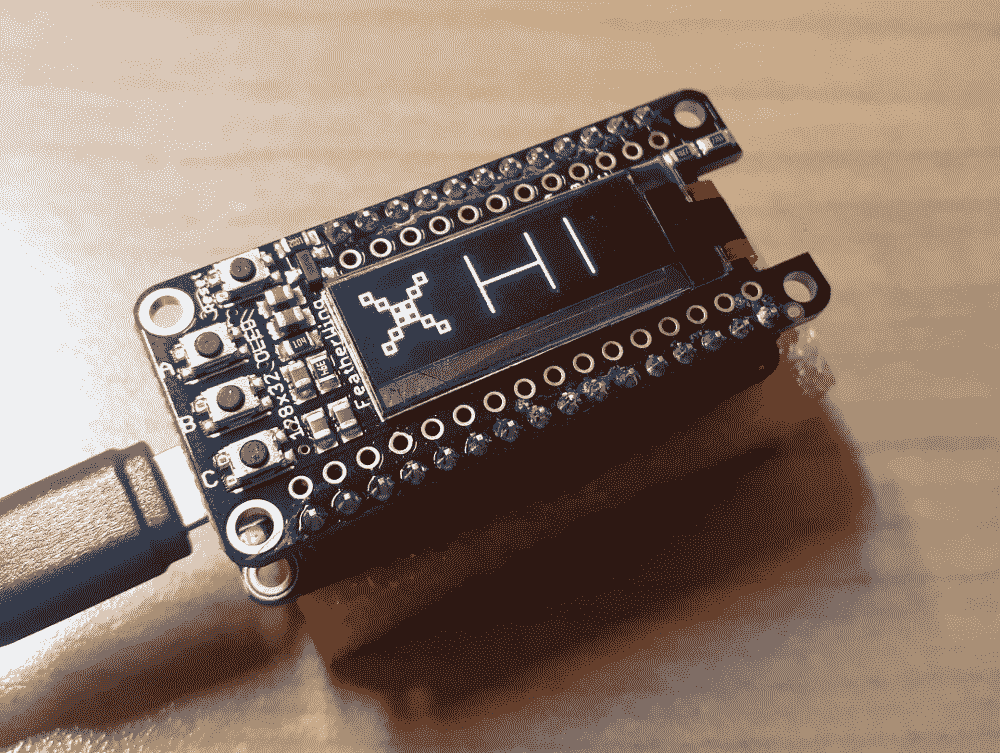
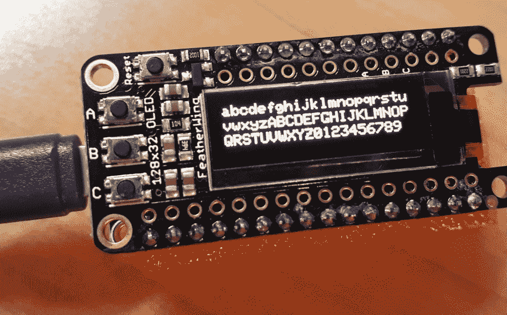

# 第十三章：与 Adafruit FeatherWing OLED 交互

本章将向您介绍 Adafruit FeatherWing 有机发光二极管（OLED）显示器。Adafruit Feather 是一个标准的板安排，允许将这些板升级插入到彼此之间。它们可以堆叠在一起或作为独立板运行。FeatherWings 是可以插入这些 Feather 板的附件。

在本章中，我们将把 Adafruit FeatherWing OLED 显示器插入 Adafruit Feather HUZZAH ESP8266 MicroPython 板中。这将创建一个功能强大的组合，即具有显示器的微控制器和互联网连接功能，可以输出文本图形，并使用显示器上的三个硬件按钮与用户交互。

本章的配方将帮助您构建一系列项目。您可以制作小型 MicroPython 板，显示一个菜单，您可以通过导航，选择的每个操作都可以将传感器数据发布到网络上的其他服务器或互联网上。您还可以使用它按命令从服务器获取数据并在屏幕上显示。本章将重点介绍显示器的所有主要功能，如显示文本、线条和矩形图形，以及与显示器配备的内置按钮进行交互。

本章将涵盖以下内容：

+   使用 GPIO 引脚检测按钮按下

+   连接到 SSD1306 显示器

+   填充和清除显示器

+   在显示器上设置像素

+   在显示器上绘制线条和矩形

+   在显示器上写文本

+   在显示器上反转颜色

# Adafruit FeatherWing OLED

FeatherWing OLED 显示器使用了一种 OLED，与其他显示技术相比有许多优点。例如，它的功耗比其他显示技术低得多。这使得它非常适用于嵌入式项目，其中需要尽可能降低功耗要求。

OLED 还具有比其他显示技术更高的对比度，使得显示的文本和图形更清晰。屏幕配备了三个用户按钮，并且在引脚和屏幕分辨率方面有许多不同的选项。以下照片显示了其中一个显示器连接到 Adafruit Feather HUZZAH ESP8266 板上：



该板有一个配置，带有需要焊接的松散引脚，另一个版本带有组装好的引脚，无需焊接。在上一张照片中显示的板使用了组装好的引脚，可以直接插入 ESP8266 主板，无需焊接。

# 购买地址

本章使用了组装好的 Adafruit FeatherWing OLED - 128 x 32 OLED 附加板。这个 FeatherWing 可以直接从 Adafruit 购买([`www.adafruit.com/product/3045`](https://www.adafruit.com/product/3045))。

# 技术要求

本章的代码文件可以在以下 GitHub 存储库的`Chapter13`文件夹中找到：[`github.com/PacktPublishing/MicroPython-Cookbook`](https://github.com/PacktPublishing/MicroPython-Cookbook)。

本章使用了 Adafruit Feather HUZZAH ESP8266 板和组装好的 Adafruit FeatherWing OLED - 128 x 32 OLED 附加板。本章中的所有配方都使用了 CircuitPython 3.1.2。

本章需要 CircuitPython 库中的一些特定模块，它们将在每个配方的开头提到。有关下载和提取这些库的详细信息，您可以参考《使用 MicroPython 入门》中的*更新 CircuitPython 库*配方。本章中的所有配方都使用了 20190212 版本的 CircuitPython 库。

# 使用 GPIO 引脚检测按钮按下

这个食谱将演示如何检查 Adafruit FeatherWing OLED 附带的三个推按钮的状态。我们将轮询这三个按钮，并不断打印它们的状态，以便我们可以检测按钮被按下和释放的时刻。

这些推按钮中的每一个都连接到不同的 GPIO 引脚，因此我们将使用一个字典将按钮名称映射到它们关联的 GPIO 引脚。板上的物理按钮标有*A*、*B*和*C*。我们将使用相同的命名将按钮事件映射到脚本中的打印语句。

这个食谱很有用，因为它将使您的项目能够根据按下的按钮采取不同的操作。因为这个板上有三个按钮，所以您可以根据自己的应用设计有很多选择。例如，您可以将两个按钮作为上下菜单选项，而第三个按钮可以允许用户选择菜单选项。或者，您可以有一个按钮增加一个设置值，另一个按钮减少一个设置值。

# 准备工作

您需要访问 ESP8266 上的 REPL 来运行本食谱中提供的代码。

# 如何操作...

让我们执行以下步骤：

1.  在 REPL 中运行以下代码行：

```py
>>> from machine import Pin
>>> import time
>>> 
>>> PINS = dict(a=0, b=16, c=2)
```

1.  我们现在已经导入了必要的 Python 库，并设置了一个`PINS`字典，它将按钮名称映射到它们关联的 GPIO 引脚，如下所示：

```py
>>> def get_buttons():
...     return dict(
...         a=Pin(PINS['a'], Pin.IN, Pin.PULL_UP),
...         b=Pin(PINS['b']),
...         c=Pin(PINS['c'], Pin.IN, Pin.PULL_UP),
...     )
...     
...     
... 
>>> buttons = get_buttons()
```

1.  `get_buttons`函数将返回一个将每个按钮映射到其关联的`Pin`对象的字典。在这个板上，按钮 A 和 C 需要配置`PULL_UP`，而按钮 B 不需要。运行以下代码块，它将返回一个值`1`，表示按钮 A 没有被按下：

```py
>>> buttons['a'].value()
1
```

1.  在运行下一段代码块时按住按钮 A，`Pin`值将显示按钮正在被按下：

```py
>>> buttons['a'].value()
0
```

1.  下一段代码创建了`names`列表，其中包含按钮名称的排序列表。我们定义了一个名为`get_status`的函数，它将返回三个按钮的状态：

```py
>>> names = sorted(PINS.keys())
>>> 
>>> def get_status(names, buttons):
...     items = [format(i, buttons) for i in names]
...     return ' '.join(items)
...     
...     
... 
>>> 
```

1.  运行时，以下代码块调用`get_status`函数并返回推按钮的当前状态：

```py
>>> get_status(names, buttons)
'a: False b: False c: False'
```

1.  在运行下一段代码块时按住按钮 B，推按钮 B 的状态将显示为正在被按下：

```py
>>> get_status(names, buttons)
'a: False b: True c: False'
```

1.  以下代码应添加到`main.py`文件中：

```py
from machine import Pin
import time

PINS = dict(a=0, b=16, c=2)

def format(name, buttons):
    pressed = not buttons[name].value()
    return '{name}: {pressed}'.format(name=name, pressed=pressed)

def get_status(names, buttons):
    items = [format(i, buttons) for i in names]
    return ' '.join(items)

def get_buttons():
    return dict(
        a=Pin(PINS['a'], Pin.IN, Pin.PULL_UP),
        b=Pin(PINS['b']),
        c=Pin(PINS['c'], Pin.IN, Pin.PULL_UP),
    )

def main():
    names = sorted(PINS.keys())
    buttons = get_buttons()
    while True:
        status = get_status(names, buttons)
        print(status)
        time.sleep(0.1)

main()
```

当执行这个脚本时，它将不断打印出每个按钮的状态，每个循环之间延迟`0.1`秒。

# 工作原理...

这个食谱定义了一个名为`PINS`的数据结构，它将三个按钮分别映射到 ESP8266 上的正确 GPIO 引脚。`get_buttons`函数为这些按钮中的每一个创建了带有正确`PULL_UP`设置的`Pin`对象。`get_buttons`函数在`main`函数中被调用，并且返回的字典被保存在`buttons`变量中。

`names`变量只是按钮名称的排序列表。它被创建以确保状态更新总是按字母顺序呈现。`get_status`函数循环遍历每个按钮，并调用`format`函数生成状态行，每次检查状态时都会打印出来。主循环进入无限循环，在每次迭代中打印按钮状态，然后暂停`0.1`秒，然后继续下一个循环。

# 还有更多...

当使用 GPIO 引脚与推按钮交互时，它们需要被正确配置。需要使用正确的引脚，并且需要正确应用`PULL_UP`设置到每个引脚配置中。这些设置通常可以在板的文档中找到。

在这块板上，按钮 B 不需要设置`PULL_UP`的原因是按钮和硬件电平已经包含了 100k 的上拉值，因此解决了 ESP8266 在引脚 16 上没有内部上拉的问题。然而，其他两个按钮需要设置`PULL_UP`。

# 另请参阅

更多信息，请参考以下文档：

+   关于 FeatherWing OLED 引脚分配的更多文档可以在[`learn.adafruit.com/adafruit-oled-featherwing/pinouts`](https://learn.adafruit.com/adafruit-oled-featherwing/pinouts)找到。

+   关于`machine`模块中的`Pin`对象的更多文档可以在[`docs.micropython.org/en/latest/library/machine.Pin.html#machine.Pin`](https://docs.micropython.org/en/latest/library/machine.Pin.html#machine.Pin)找到。

# 连接到 SSD1306 显示器

本教程将向你展示如何使用`adafruit_ssd1306`库连接到 FeatherWing OLED 显示器。本教程将向你展示如何初始化连接到的**I2C**总线。然后，我们可以创建一个通过 I2C 总线连接到显示器的`SSD1306_I2C`对象。

这个教程将在很多方面帮助你；有一整套组件可以使用 I2C 连接，所以这个教程将让你接触到这项技术，以便在你自己的项目中需要使用它时，你会对它很熟悉。

你将了解如何使用可以与 MicroPython 一起工作的显示库，然后可以将其包含在任何你想要添加显示器的项目中。

# 准备工作

你需要访问 ESP8266 上的 REPL 来运行本教程中提供的代码。本教程使用的 CircuitPython 库版本是 20190212。

# 如何操作...

让我们执行以下步骤：

1.  下载 CircuitPython 库包。你需要`.mpy`和`.py`版本的库包。

1.  将这两个`.zip`文件解压到你的计算机上。

1.  在 ESP8266 上安装所有库包中的所有库是不必要的。

1.  连接到显示器需要三个特定的库。

1.  `adafruit_bus_device`和`adafruit_framebuf`库应该在 ESP8266 上安装它们的`.mpy`文件。这些库的文件应该被传输到 ESP8266 并放入`.lib`文件夹中。

1.  在 REPL 中执行以下代码以验证这两个库是否正确安装在板上：

```py
>>> import adafruit_bus_device
>>> import adafruit_framebuf
```

1.  `adafruit_ssd1306`库应该在库中有`adafruit_ssd1306.py`文件的`.py`版本。

1.  该库将尝试使用内置的`framebuf` MicroPython 库而不是`adafruit_framebuf`。如果使用`framebuf`库进行帧缓冲区操作，该库将无法连接到显示。为了解决这个问题，在与`adafruit_ssd1306.py`相同的目录中下载并运行`fix_framebuf_import.py`文件。你可以在书的 GitHub 存储库的`Chapter13`文件夹中找到这个脚本。

1.  将修复后的`adafruit_ssd1306.py`文件上传到板的根目录。

1.  运行以下代码块以验证`adafruit_ssd1306`库是否正确安装在板上：

```py
>>> import adafruit_ssd1306
>>> 
```

1.  在这个阶段，所有额外的库都已经成功安装和导入。运行以下代码块以导入初始化 I2C 总线所需的库：

```py
>>> import board
>>> import busio
```

1.  运行以下代码块以初始化 I2C 总线：

```py
>>> i2c = busio.I2C(board.SCL, board.SDA)
>>> 
```

1.  运行以下代码以创建一个`SSD1306_I2C`显示对象：

```py
>>> buttons['a'].value()
>>> oled = adafruit_ssd1306.SSD1306_I2C(128, 32, i2c)
>>>
```

1.  将以下代码添加到`main.py`文件中：

```py
import adafruit_ssd1306
import board
import busio

def main():
    print('initialize I2C bus')
    i2c = busio.I2C(board.SCL, board.SDA)
    print('create SSD1306_I2C object')
    oled = adafruit_ssd1306.SSD1306_I2C(128, 32, i2c)
    print('ALL DONE')

main()
```

当执行这个脚本时，它将初始化 I2C 总线并创建一个`SSD1306_I2C`对象。

# 工作原理...

与 FeatherWing OLED 交互所需的库不是 CircuitPython 固件的一部分，因此在使用之前需要进一步安装。需要安装三个库，它们分别是`adafruit_ssd1306`、`adafruit_bus_device`和`adafruit_framebuf`。

`adafruit_ssd1306`库是我们将要交互的主要库，它依赖于我们已安装的其他库才能正常工作。安装这些库后，我们可以开始导入它们并使用它们的代码连接到显示器。第一步是初始化 I2C 总线。通过创建一个 I2C 对象并将其引用传递给 SCL 和 SDA 引脚来完成此操作。然后将对象保存在`i2c`变量中。通过传递值`128`和`32`来创建一个`SSD1306_I2C`对象，这些值是指显示分辨率，因为我们使用的是 128 x 32 OLED。传递的另一个参数是`i2c`对象。

# 还有更多...

I2C 是一种非常流行的协议，适用于各种设备。 I2C 相对简单，易于连接和使用，这是它被广泛用于许多微控制器的原因之一。它只需要两根线连接，并且可以使用许多微控制器板上的通用 I/O 引脚。

单个连接可以控制多个设备，这增加了其灵活性。但是，与其他协议相比，这种协议的速度较慢是其缺点之一。这意味着我们可以用它来控制小型单色显示器，但是如果我们想要控制分辨率更高、颜色更多的显示器，那么它的速度就不够快了。

# 另请参阅

有关更多信息，您可以参考以下内容：

+   有关 I2C 协议的更多详细信息，请访问[`i2c.info/`](https://i2c.info/)。

+   有关安装 CircuitPython SSD1306 库的更多文档，请访问[`learn.adafruit.com/adafruit-oled-featherwing/circuitpython-and-python-setup`](https://learn.adafruit.com/adafruit-oled-featherwing/circuitpython-and-python-setup)。

# 填充和清除显示

本教程将向您展示如何使用`adafruit_ssd1306`库连接到 FeatherWing OLED 显示器。它将演示如何初始化连接到 OLED 显示器的 I2C 总线。然后，我们可以创建一个使用 I2C 总线连接到显示器的`SSD1306_I2C`对象。本教程将以多种方式帮助您。

有一整套组件可以使用 I2C 连接；本教程将使您了解这项技术，以便在自己的项目中需要使用它时熟悉它。本教程还将帮助您进行使用可以与 MicroPython 一起工作的显示库的第一步，然后可以将其包含在您可能想要添加显示器的任何项目中。

# 准备工作

您需要访问 ESP8266 上的 REPL 来运行本教程中提供的代码。

# 如何操作...

让我们执行以下步骤：

1.  使用 REPL 运行以下代码行：

```py
>>> import adafruit_ssd1306
>>> import board
>>> import busio
```

1.  所需的库现在都已导入。运行下一个代码块以创建`i2c`对象和名为`oled`的`SSD1306_I2C`对象：

```py
>>> i2c = busio.I2C(board.SCL, board.SDA)
>>> oled = adafruit_ssd1306.SSD1306_I2C(128, 32, i2c)
```

1.  使用以下代码块，将屏幕上的所有像素设置为白色，并通过调用`show`方法应用更改：

```py
>>> oled.fill(1)
>>> oled.show()
```

1.  现在，我们将使用以下代码块关闭屏幕上的所有像素：

```py
>>> oled.fill(0)
>>> oled.show()
```

1.  以下代码块将循环 10 次，并重复打开和关闭屏幕上的所有像素，创建闪烁屏幕的效果：

```py
>>> for i in range(10):
...     oled.fill(1)
...     oled.show()
...     oled.fill(0)
...     oled.show()
...     
...     
... 
>>>
```

1.  将以下代码添加到`main.py`文件中：

```py
import adafruit_ssd1306
import board
import busio

def main():
    i2c = busio.I2C(board.SCL, board.SDA)
    oled = adafruit_ssd1306.SSD1306_I2C(128, 32, i2c)
    for i in range(10):
        oled.fill(1)
        oled.show()
        oled.fill(0)
        oled.show()

main()
```

当执行此脚本时，屏幕将闪烁黑白 10 次。

# 它是如何工作的...

`main`函数首先设置了`i2c`对象，并将`SSD1306_I2C`对象保存为名为`oled`的变量。`oled`对象有两种方法，我们将在本教程中使用。`fill`方法接收一个参数，并将显示器上的所有像素填充为白色或黑色。如果提供`1`，则像素将变为白色，否则将变为黑色（或关闭）。

在每次更改后必须调用`show`方法，以使更改在显示器上生效。开始一个`for`循环，循环 10 次，在每次迭代期间将显示器变为全白，然后变为全黑。

# 还有更多...

`fill`和`show`方法是与显示器交互时的绝佳起点，因为它们相对容易使用。尽管它们看起来很简单，但它们在许多操作中都是必需的。

在后续的示例中，我们将探讨如何绘制线条、矩形和文本。在所有这些情况下，我们需要调用`show`来将更改呈现到屏幕上。我们还经常调用`fill`来清除屏幕上的内容，然后再在显示器上写入或绘制新内容。

# 另请参阅

有关更多信息，您可以参考以下内容：

+   可以在[`circuitpython.readthedocs.io/projects/ssd1306/en/latest/examples.html`](https://circuitpython.readthedocs.io/projects/ssd1306/en/latest/examples.html)找到使用`fill`和`show`的示例。

+   有关`SSD1306_I2C`对象的更多文档可以在[`circuitpython.readthedocs.io/projects/ssd1306/en/latest/api.html`](https://circuitpython.readthedocs.io/projects/ssd1306/en/latest/api.html)找到。

# 在显示器上设置像素

本示例将演示如何在屏幕上打开和关闭单个像素。该示例首先通过设置具有特定*x*和*y*坐标的像素来指示打开或关闭。然后，我们将创建一个简单的动画，重复在特定方向上绘制像素，从而创建一个不断增长长度的线条。我们将把这个简单的线条动画放入自己的函数中，以便我们可以多次调用它并创建一种锯齿线条动画。

当您开始控制显示器并希望控制单个像素时，您会发现这个示例非常有用。控制单个像素的操作成为生成更复杂图形的基本组件。

# 准备工作

您需要在 ESP8266 上访问 REPL 才能运行本示例中提供的代码。

# 操作步骤...

让我们执行以下步骤：

1.  在 REPL 中运行以下代码行：

```py
>>> import adafruit_ssd1306
>>> import board
>>> import busio
>>> 
>>> BLACK = 0
>>> WHITE = 1
>>> 
>>> i2c = busio.I2C(board.SCL, board.SDA)
>>> oled = adafruit_ssd1306.SSD1306_I2C(128, 32, i2c)
```

1.  定义`BLACK`和`WHITE`常量，它们代表两种可能的像素颜色值。然后设置`i2c`和`oled`对象。以下代码块将清除屏幕上的内容：

```py
>>> oled.fill(BLACK)
>>> oled.show()
```

1.  以下代码块将为白色绘制像素(*x*, *y*)，即位置(`0`, `0`)：

```py
>>> oled.pixel(0, 0, WHITE)
>>> oled.show()
```

1.  以下代码块将关闭位置(`0`, `0`)处的像素，将其颜色设置为黑色：

```py
>>> oled.pixel(0, 0, BLACK)
>>> oled.show()
```

1.  以下代码将把位置(`10`, `30`)处的像素颜色设置为白色：

```py
>>> oled.pixel(10, 30, WHITE)
>>> oled.show()
```

1.  以下代码块将清除屏幕，然后循环 10 次，逐个设置对角线上的像素，形成一个看起来像是不断增长的线条的动画：

```py
>>> oled.fill(BLACK)
>>> oled.show()
>>> 
>>> for i in range(10):
...     oled.pixel(i, i, WHITE)
...     oled.show()
...     
...     
... 
>>> 
```

1.  使用以下代码块，定义一个函数，该函数将从起始位置(`x`, `y`)开始执行线条动画，然后在*x*和*y*方向上移动一定的`count`次数：

```py
>>> def animate_pixel(oled, x, y, step_x, step_y, count):
...     for i in range(count):
...         x += step_x
...         y += step_y
...         oled.pixel(x, y, WHITE)
...         oled.show()
...         
...         
... 
>>> 
```

1.  以下代码块将清除屏幕并调用`animate_pixel`从位置(`0`, `0`)到(`30`, `30`)绘制由 30 个像素组成的线条：

```py
>>> oled.fill(BLACK)
>>> oled.show()
>>> animate_pixel(oled, x=0, y=0, step_x=1, step_y=1, count=30)
```

1.  然后，以下代码块将绘制从位置(`30`, `30`)到(`60`, `0`)的线条。该线条将在上一个动画完成的位置继续进行，但在不同的方向上移动：

```py
>>> animate_pixel(oled, x=30, y=30, step_x=1, step_y=-1, count=30)
```

1.  现在定义一个名为`zig_zag`的函数，它将绘制四个线条动画。每个动画将从上一个动画完成的位置继续进行，如下所示：

```py
>>> def zig_zag(oled):
...     animate_pixel(oled, x=0, y=0, step_x=1, step_y=1, count=30)
...     animate_pixel(oled, x=30, y=30, step_x=1, step_y=-1, 
...     count=30)
...     animate_pixel(oled, x=60, y=0, step_x=1, step_y=1, count=30)
...     animate_pixel(oled, x=90, y=30, step_x=1, step_y=-1, 
...     count=30)
...     
...     
... 
>>> 
```

1.  运行以下代码块以清除显示并运行`zig_zag`线条动画：

```py
>>> oled.fill(BLACK)
>>> oled.show()
>>> zig_zag(oled)
```

1.  将以下代码添加到`main.py`文件中：

```py
import adafruit_ssd1306
import board
import busio

BLACK = 0
WHITE = 1

def animate_pixel(oled, x, y, step_x, step_y, count):
    for i in range(count):
        x += step_x
        y += step_y
        oled.pixel(x, y, WHITE)
        oled.show()

def zig_zag(oled):
    animate_pixel(oled, x=0, y=0, step_x=1, step_y=1, count=30)
    animate_pixel(oled, x=30, y=30, step_x=1, step_y=-1, count=30)
    animate_pixel(oled, x=60, y=0, step_x=1, step_y=1, count=30)
    animate_pixel(oled, x=90, y=30, step_x=1, step_y=-1, count=30)

def main():
    i2c = busio.I2C(board.SCL, board.SDA)
    oled = adafruit_ssd1306.SSD1306_I2C(128, 32, i2c)
    zig_zag(oled)

main()
```

当执行此脚本时，它将以锯齿状模式绘制四个线条动画。

# 工作原理...

在`main`函数设置了`oled`对象之后，它调用`zig_zag`函数。`zig_zag`函数对`animate_pixel`函数进行了四次调用。每次调用都将线条移动到不同的对角方向。

每个新的线条动画都从上一个动画结束的地方开始，因此看起来像是从开始到结束的一个长动画。`animate_pixel`函数接受起始的*x*和*y*位置，并循环执行由`count`变量指定的次数。

在每次循环迭代中，*x*和*y*的值会根据指定的*x*和*y*步长值进行更改。一旦计算出新值，就会在该位置绘制一个像素，并调用`show`方法立即显示它。

# 还有更多...

这个教程从一些简单的设置像素开关和显示器上的不同位置的示例开始。然后，它扩展到进行简单的动画和更复杂的之字形动画。下面的照片展示了动画在显示器上完成后的样子：



使用 MicroPython 附带的`math`模块可以创建许多不同类型的形状和动画。`sine`和`cosine`函数可用于绘制波形动画。我们还可以使用这些三角函数来绘制圆和椭圆。

# 另请参阅

有关更多信息，您可以参考以下内容：

+   有关在 FeatherWing OLED 上绘制像素的更多文档可以在[`learn.adafruit.com/adafruit-oled-featherwing/circuitpython-and-python-usage`](https://learn.adafruit.com/adafruit-oled-featherwing/circuitpython-and-python-usage)找到。

+   有关`math`模块中`sin`函数的更多文档可以在[`docs.micropython.org/en/latest/library/math.html#math.sin`](https://docs.micropython.org/en/latest/library/math.html#math.sin)找到。

# 在显示器上绘制线条和矩形

这个教程将演示如何使用`SSD1306_I2C`对象附带的方法，这将让我们绘制水平线、垂直线、正方形和矩形。现在我们可以超越设置单个像素，并探索使用`adafruit_ssd1306`显示库中的方法绘制更广泛范围的形状。

当您想要在显示器上绘制一些不同的形状时，您会发现这个教程很有用；例如，在显示器上构建一个简单的用户界面。显示器上有足够的分辨率来绘制代表用户界面不同部分的多个框和边框。

# 准备工作

您需要访问 ESP8266 上的 REPL 来运行本教程中提供的代码。

# 如何操作...

让我们执行以下步骤：

1.  在 REPL 中执行以下代码块：

```py
>>> import adafruit_ssd1306
>>> import board
>>> import busio
>>> 
>>> BLACK = 0
>>> WHITE = 1
>>> 
>>> i2c = busio.I2C(board.SCL, board.SDA)
>>> oled = adafruit_ssd1306.SSD1306_I2C(128, 32, i2c)
>>> oled.fill(BLACK)
>>> oled.show()
```

1.  导入必要的模块，创建`oled`，然后清除显示器。使用下面的代码块，绘制一条从坐标（`0`，`0`）开始，高度为 20 像素的垂直线：

```py
>>> oled.vline(x=0, y=0, height=20, color=WHITE)
>>> oled.show()
```

1.  类似地，使用 80 像素宽度从坐标（`0`，`0`）开始绘制一条水平线：

```py
>>> oled.hline(x=0, y=0, width=80, color=WHITE)
>>> oled.show()
```

1.  可以使用下一个代码块绘制一个位于（`0`，`0`）位置，宽度为 10 像素，高度为 20 像素的矩形：

```py
>>> oled.rect(x=0, y=0, width=10, height=20, color=WHITE)
>>> oled.show()
```

1.  以下函数将绘制`HI`文本。`H`字符将使用垂直线和一条水平线绘制。然后使用单个垂直线绘制`I`字符：

```py
>>> def draw_hi(oled):
...     print('drawing H')
...     oled.vline(x=50, y=0, height=30, color=WHITE)
...     oled.hline(x=50, y=15, width=30, color=WHITE)
...     oled.vline(x=80, y=0, height=30, color=WHITE)
...     oled.show()
...     print('drawing I')
...     oled.vline(x=100, y=0, height=30, color=WHITE)
...     oled.show()
...     
...     
... 
>>> 
```

1.  下面的代码块将清除屏幕并调用`draw_hi`函数在显示器上呈现消息`HI`：

```py
>>> oled.fill(BLACK)
>>> oled.show()
>>> draw_hi(oled)
drawing H
drawing I
>>> 
```

1.  使用下面的代码块，定义一个函数，该函数将执行涉及具有特定大小并且在每次迭代中通过步长*x*和*y*移动位置的方框动画：

```py
>>> def animate_boxes(oled, x, y, step_x, step_y, size, count):
...     for i in range(count):
...         oled.rect(x, y, width=size, height=size, color=WHITE)
...         oled.show()
...         x += step_x
...         y += step_y
...         
...         
... 
>>> 
```

1.  接下来，使用下面的代码块调用`animate_boxes`并绘制六个方框以对角线形式：

```py
>>> animate_boxes(oled, x=0, y=0, step_x=5, step_y=5, size=5, count=6)
```

1.  定义并调用`draw_x_boxes`函数，该函数在两条对角线上绘制一组方框，以创建由小方框组成的大字母`X`：

```py
>>> def draw_x_boxes(oled):
...     animate_boxes(oled, x=0, y=0, step_x=5, step_y=5, size=5, count=6)
...     animate_boxes(oled, x=0, y=25, step_x=5, step_y=-5, size=5, count=6)
...     
...     
... 
>>> 
>>> draw_x_boxes(oled)
```

1.  将以下代码添加到`main.py`文件中：

```py
import adafruit_ssd1306
import board
import busio

BLACK = 0
WHITE = 1

def draw_hi(oled):
    print('drawing H')
    oled.vline(x=50, y=0, height=30, color=WHITE)
    oled.hline(x=50, y=15, width=30, color=WHITE)
    oled.vline(x=80, y=0, height=30, color=WHITE)
    oled.show()
    print('drawing I')
    oled.vline(x=100, y=0, height=30, color=WHITE)
    oled.show()

def animate_boxes(oled, x, y, step_x, step_y, size, count):
    for i in range(count):
        oled.rect(x, y, width=size, height=size, color=WHITE)
        oled.show()
        x += step_x
        y += step_y

def draw_x_boxes(oled):
    animate_boxes(oled, x=0, y=0, step_x=5, step_y=5, size=5, count=6)
    animate_boxes(oled, x=0, y=25, step_x=5, step_y=-5, size=5, count=6)

def main():
    i2c = busio.I2C(board.SCL, board.SDA)
    oled = adafruit_ssd1306.SSD1306_I2C(128, 32, i2c)
    draw_x_boxes(oled)
    draw_hi(oled)

main()
```

当执行此脚本时，它将绘制一个由小方块组成的字母`X`，并绘制由垂直和水平线组成的`HI`文本。

# 它是如何工作的...

`draw_hi`函数使用`oled`对象上的`vline`和`hline`方法来绘制构成`H`的三条线。在绘制字母`H`之后，使用`vline`绘制垂直线来表示字母`I`。

调用`draw_x_boxes`函数将依次调用`animate_boxes`函数。对`animate_boxes`函数的第一次调用会沿对角线绘制六个方框，以形成`X`字符的第一部分。对`animate_boxes`的第二次调用也会绘制六个方框，但起始位置不同，并且方向也不同。第二次调用将穿过第一行以形成`X`字符。

# 还有更多...

线条绘制和矩形绘制方法可以以许多不同的方式组合，以创建各种形状和图纸。下面的照片显示了一旦在这个示例中运行`main.py`脚本，显示将会是什么样子：



在下一个示例中，我们将学习如何在显示屏上绘制文本。将盒子和线条绘制结合起来，然后在显示屏的不同部分呈现文本非常有用。

# 另请参阅

有关更多信息，您可以参考以下内容：

+   有关 FeatherWing OLED 的主要功能的更多文档可以在[`learn.adafruit.com/adafruit-oled-featherwing/overview`](https://learn.adafruit.com/adafruit-oled-featherwing/overview)找到。

+   有关`busio`模块的更多文档可以在[`circuitpython.readthedocs.io/en/3.x/shared-bindings/busio/__init__.html`](https://circuitpython.readthedocs.io/en/3.x/shared-bindings/busio/__init__.html)找到。

# 在显示屏上写字

这个示例将演示如何将文本输出到 FeatherWing OLED。该示例将向您展示如何控制要显示的文本的位置和内容。将创建一个文本动画来执行显示倒计时，然后创建一个函数来同时显示所有小写字母、大写字母和数字字符。

这个示例将在您希望使用您的设备与人们交流一些信息时帮助您。因为显示可以显示三行文本，所以它为呈现各种信息提供了很大的空间。

# 准备工作

您需要访问 ESP8266 上的 REPL 来运行本示例中提供的代码。

# 如何做...

让我们执行以下步骤：

1.  下载 CircuitPython 库包。

1.  将`.zip`文件包解压到您的计算机上。

1.  复制位于 ESP8266 根文件夹包中的`font5x8.bin`字体文件。

1.  使用 REPL 运行以下代码行：

```py
>>> import adafruit_ssd1306
>>> import board
>>> import busio
>>> 
>>> BLACK = 0
>>> WHITE = 1
>>> 
>>> i2c = busio.I2C(board.SCL, board.SDA)
>>> oled = adafruit_ssd1306.SSD1306_I2C(128, 32, i2c)
>>> oled.fill(BLACK)
>>> oled.show()
```

1.  现在我们已经清除了显示屏，并准备在屏幕上显示一些文本。使用以下代码块，在颜色为白色的位置（`0`，`0`）上显示`'hello'`文本：

```py
>>> oled.text('hello', 0, 0, WHITE)
>>> oled.show()
```

1.  使用以下代码块清除屏幕并显示三行文本：

```py
>>> oled.fill(BLACK)
>>> oled.show()
>>> 
>>> oled.text('line 1', 0, 0, WHITE)
>>> oled.text('line 2', 0, 10, WHITE)
>>> oled.text('line 3', 0, 20, WHITE)
>>> oled.show()
```

1.  定义一个函数，然后调用它；这将在显示屏上从数字 10 倒数到 0：

```py
>>> def countdown(oled, start):
...     for i in range(start, -1, -1):
...         oled.fill(BLACK)
...         oled.text(str(i), 0, 0, WHITE)
...         oled.show()
...         
...         
... 
>>> 
>>> countdown(oled, 10)
```

1.  使用以下代码块，定义一个名为`ALPHA_NUMERIC`的常量。它包含所有小写字母、大写字母和数字字符，这些字符以适合显示的结构组织在一起：

```py
>>> ALPHA_NUMERIC = [
...     'abcdefghijklmnopqrstu',
...     'vwxyzABCDEFGHIJKLMNOP',
...     'QRSTUVWXYZ0123456789',
... ]
```

1.  使用以下代码块，定义并调用`show_alpha_numeric`函数，该函数循环遍历`ALPHA_NUMERIC`列表，并在单独的行上显示每个字符串：

```py
>>> def show_alpha_numeric(oled):
...     for i, text in enumerate(ALPHA_NUMERIC):
...         oled.text(text, 0, 10 * i, WHITE)
...         oled.show()
...         
...         
... 
>>> oled.fill(BLACK)
>>> show_alpha_numeric(oled)
```

1.  将以下代码添加到`main.py`文件中：

```py
import adafruit_ssd1306
import board
import busio

BLACK = 0
WHITE = 1
ALPHA_NUMERIC = [
    'abcdefghijklmnopqrstu',
    'vwxyzABCDEFGHIJKLMNOP',
    'QRSTUVWXYZ0123456789',
]

def countdown(oled, start):
    for i in range(start, -1, -1):
        oled.fill(BLACK)
        oled.text(str(i), 0, 0, WHITE)
        oled.show()

def show_alpha_numeric(oled):
    for i, text in enumerate(ALPHA_NUMERIC):
        oled.text(text, 0, 10 * i, WHITE)
        oled.show()

def main():
    i2c = busio.I2C(board.SCL, board.SDA)
    oled = adafruit_ssd1306.SSD1306_I2C(128, 32, i2c)
    oled.fill(BLACK)
    countdown(oled, 10)
    oled.fill(BLACK)
    show_alpha_numeric(oled)

main()
```

当执行此脚本时，它将执行一个倒计时动画，然后显示一些字母数字文本。

# 它是如何工作的...

`countdown`函数启动一个`for`循环，将从 10 倒数到 0。在每次迭代期间，屏幕被清除，然后当前数字被显示在屏幕上。`ALPHA_NUMERIC`变量以一种结构化的格式结合了小写字母、大写字母和数字字符，分布在三行上。显示器可以显示 3 行 21 列的文本。这些数据符合这些限制，以便所有字符都可以清晰地显示，而不会裁剪文本。`countdown`函数循环遍历每行文本，并在正确的位置显示它，以便屏幕上的 3 行文本被正确填充。

# 还有更多...

在使用文本输出时，您可以代表各种内容，无限可能。您显示的输出可以是从传感器读数到实时从互联网获取的最新新闻标题。下面的照片显示了在调用`show_alpha_numeric`函数后显示的屏幕：



尽管屏幕在物理上相当小，但它具有良好的分辨率，并且 CircuitPython 库包中提供的字体已经很好地利用了有限的屏幕空间。这使得在非常小的显示器上显示三行文本成为可能。

# 另请参阅

有关更多信息，请参考以下内容：

+   可以在[`learn.adafruit.com/micropython-oled-watch`](https://learn.adafruit.com/micropython-oled-watch)找到有关创建 OLED 手表的 MicroPython 项目的更多文档。

+   可以在[`learn.sparkfun.com/tutorials/i2c/all`](https://learn.sparkfun.com/tutorials/i2c/all)找到有关 I2C 通信协议的更多文档。

# 在显示器上反转颜色

本教程将演示如何使用`invert`功能来翻转所有像素的颜色。当您在黑色背景上显示白色文本，然后希望颜色翻转，使屏幕显示白色背景上的黑色文本时，可以使用此功能。与清除屏幕等一些关键操作相比，`invert`等功能可能会慢得多。我们可以利用这些性能差异，当我们希望快速地向使用屏幕的人显示视觉反馈时使用`invert`。

本教程将帮助您在使用缓慢的微控制器创建项目并需要找到创造性方法使设备更具响应性以改善其可用性时使用。

# 准备工作

您需要访问 ESP8266 上的 REPL 来运行本教程中提供的代码。

# 如何操作...

让我们执行以下步骤：

1.  在 REPL 中运行以下代码行：

```py
>>> import adafruit_ssd1306
>>> import board
>>> import busio
>>> 
>>> BLACK = 0
>>> WHITE = 1
>>> 
>>> i2c = busio.I2C(board.SCL, board.SDA)
>>> oled = adafruit_ssd1306.SSD1306_I2C(128, 32, i2c)
>>> oled.fill(BLACK)
>>> oled.show()
```

1.  完成初始设置后，`oled`对象可用于开始反转屏幕。使用以下代码块在黑色背景上显示一些白色文本：

```py
>>> oled.invert(True)
```

1.  屏幕现在将显示白色背景上的黑色文本。要将颜色翻转回来，请运行以下代码：

```py
>>> oled.invert(False)
```

1.  `invert`功能比用于更新屏幕的其他一些方法快得多。使用以下函数来计算这种速度差异：

```py
>>> def measure_time(label, func, args=(), count=3):
...     for i in range(count):
...         start = time.monotonic()
...         func(*args)
...         total = (time.monotonic() - start) * 1000
...         print(label + ':', '%s ms' % total)
...         
...         
... 
>>> 
```

1.  使用以下代码块调用`measure_time`函数，并计算`fill`操作花费的时间（以毫秒为单位）：

```py
>>> measure_time('fill', oled.fill, [BLACK])
fill: 1047.85 ms
fill: 1049.07 ms
fill: 1046.14 ms
>>> 
```

1.  现在计时`show`方法，你会发现它比`fill`更快：

```py
>>> measure_time('show', oled.show, [])
show: 62.0117 ms
show: 62.0117 ms
show: 61.0352 ms
>>>
```

1.  使用以下代码检查`text`方法的速度：

```py
>>> measure_time('text', oled.text, ['hello', 0, 0, WHITE])
text: 74.9512 ms
text: 75.1953 ms
text: 80.0781 ms
>>> 
```

1.  最后，检查`invert`方法的速度如下：

```py
>>> measure_time('invert', oled.invert, [True])
invert: 0.976563 ms
invert: 1.95313 ms
invert: 0.976563 ms
>>> 
```

1.  将以下代码添加到`main.py`文件中：

```py
import adafruit_ssd1306
import board
import busio
import time

BLACK = 0
WHITE = 1

def measure_time(label, func, args=(), count=3):
    for i in range(count):
        start = time.monotonic()
        func(*args)
        total = (time.monotonic() - start) * 1000
        print(label + ':', '%s ms' % total)

def main():
    i2c = busio.I2C(board.SCL, board.SDA)
    oled = adafruit_ssd1306.SSD1306_I2C(128, 32, i2c)
    oled.fill(BLACK)
    oled.show()

    measure_time('fill', oled.fill, [BLACK])
    measure_time('show', oled.show, [])
    measure_time('text', oled.text, ['hello', 0, 0, WHITE])
    measure_time('invert', oled.invert, [True])

main()
```

当执行此脚本时，它会打印出与屏幕相关操作的性能结果。

# 工作原理

`measure_time`函数默认循环三轮。它将当前时间保存在`start`变量中，调用被测试的函数，然后计算函数调用的总执行时间。该值转换为毫秒，然后打印出结果。`main`函数调用`measure_time`四次。它调用它来测量`fill`，`show`，`text`和`invert`方法的执行时间。

# 还有更多...

从性能结果来看，有一些事情是非常明显的。好消息是结果非常一致。在这个示例中，我们对每个测量都进行了三次读数。在测量执行速度时，最好取多个样本。从样本中看，调用`fill`大约比调用`invert`慢 500 倍。为了使应用程序感觉灵敏，操作不应该超过 100 毫秒，否则它会显得迟钝或无响应。像`invert`，`text`和`show`这样的操作速度很快。但由于`fill`时间太长，我们可能希望在执行`fill`之前调用`invert`，以便用户得到我们的应用程序正在响应他们输入的迹象。

# 另请参阅

欲了解更多信息，请参阅以下内容：

+   有关使用 OLED 显示屏和 ESP8266 的 CircuitPython 项目的更多文档，请访问[`learn.adafruit.com/circuitpython-totp-otp-2fa-authy-authenticator-friend`](https://learn.adafruit.com/circuitpython-totp-otp-2fa-authy-authenticator-friend)。

+   有关 OLED 的更多详细信息，请访问[`www.oled-info.com/oled-introduction`](https://www.oled-info.com/oled-introduction)。
