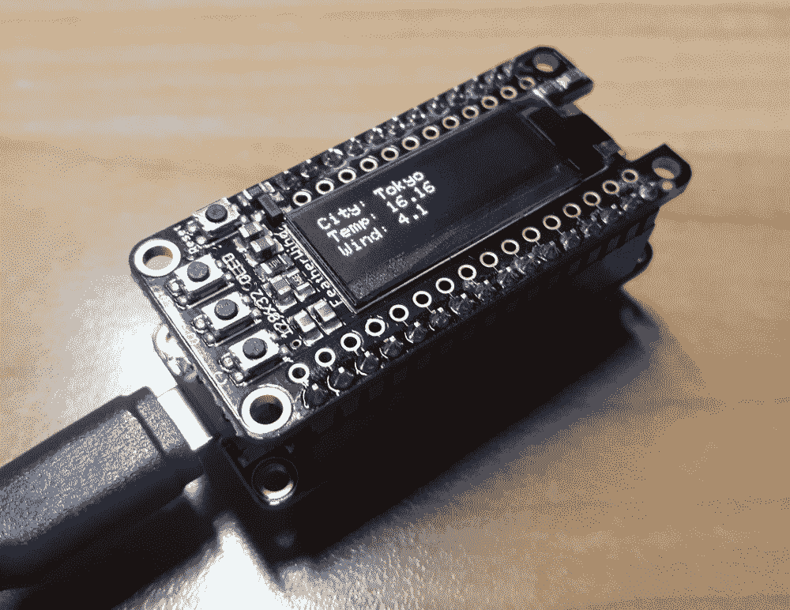

# 第十四章：构建物联网（IoT）天气机

在本章中，我们将创建一个连接到互联网的天气机，它将在按下按钮时告诉我们随机城市的天气。为了制作这个工作设备，我们将结合本书中涵盖的一些概念和技术。

我们将使用第十二章中展示的一些网络技术，以及第十三章中展示的显示逻辑，介绍如何与 FeatherWing OLED 交互。这些不同的技术将结合起来创建一个设备，通过触摸按钮事件获取实时天气数据，并在**有机发光二极管**（OLED）显示器上呈现。

本章可以成为一个有用的信息来源，帮助您使用 MicroPython 创建易于交互并提供丰富的视觉输出的物联网连接设备。

在本章中，我们将涵盖以下主题：

+   从互联网检索天气数据

+   创建一个获取城市天气的函数

+   随机选择城市

+   创建一个用于文本处理的屏幕对象

+   创建一个函数来显示城市的天气

+   在获取天气数据时提供视觉反馈

+   创建一个显示随机城市天气的函数

+   创建一个物联网按钮来显示全球各地的天气

# 技术要求

本章的代码文件可以在以下 GitHub 存储库的`Chapter14`文件夹中找到：[`github.com/PacktPublishing/MicroPython-Cookbook`](https://github.com/PacktPublishing/MicroPython-Cookbook)。

本章使用 Adafruit Feather HUZZAH ESP8266 和已组装的 Adafruit FeatherWing OLED 128x32 OLED 附加件。本章的所有教程都使用了 CircuitPython 3.1.2。您需要应用第十章中描述的*连接到现有 Wi-Fi 网络*教程中的配置，*控制 ESP8266*。本章还将使用第十二章中描述的*创建等待互联网连接的函数*教程中的`wait_for_networking`函数，*网络*。您还需要执行第十三章中描述的步骤，*与 Adafruit FeatherWing OLED 交互*。

本章的教程使用 Openweather 提供的天气 API 服务。该服务是免费使用的，但您必须注册并获取一个 API 密钥（APPID）才能使用该服务。API 密钥将需要在本章中运行代码。您可以访问[`openweathermap.org/appid`](https://openweathermap.org/appid)获取 API 密钥。

# 从互联网检索天气数据

本教程将向您展示如何使用 ESP8266 连接到互联网，并使用 RESTful Web 服务获取实时天气数据。我们将使用的服务为全球 10 万多个城市提供最新的天气信息。每个位置提供了大量的天气信息，因此本教程将展示如何筛选出对我们最感兴趣的项目。

本教程在您的项目中可能很有用，每当您需要向 RESTful 调用传递不同的参数，或者返回的结果非常庞大，您需要找到浏览这些大型数据集的方法。

# 准备工作

您需要访问 ESP8266 上的 REPL 来运行本教程中提供的代码。

# 如何做...

让我们按照本教程中所需的步骤进行操作：

1.  在 REPL 中运行以下代码行：

```py
>>> import urequests >>> >>> API_URL = 'http://api.openweathermap.org/data/2.5/weather' >>> 
```

1.  `API_URL`变量现在已经定义，我们将使用它来访问天气 API。在下一个代码块中，我们定义`APPID`和`city`以获取天气数据。确保用你实际的`APPID`值替换`APPID`值。现在我们将通过组合这些变量来构建 URL，然后我们可以访问：

```py
>>> APPID = 'put-your-API-key(APPID)-here'
>>> city = 'Berlin'
>>> url = API_URL + '?units=metric&APPID=' + APPID + '&q=' + city
```

1.  以下代码块将连接到天气 API 并检索天气数据：

```py
>>> response = urequests.get(url)
>>> response
<Response object at 3fff1b00>
```

1.  我们知道响应使用 JSON 格式，所以我们可以解析它并检查数据中有多少个顶级键：

```py
>>> data = response.json()
>>> len(data)
13
```

1.  下一个代码块检查了解析后的天气数据。由于有很多嵌套的数据，所以以当前形式很难理解：

```py
>>> data
{'cod': 200, 'rain': {'1h': 0.34}, 'dt': 1555227314, 'base': 'stations', 'weather': [{'id': 500, 'icon': '10d', 'main': 'Rain', 'description': 'light rain'}, {'id': 310, 'icon': '09d', 'main': 'Drizzle', 'description': 'light intensity drizzle rain'}], 'sys': {'message': 0.0052, 'country': 'DE', 'sunrise': 1555215098, 'sunset': 1555264894, 'id': 1275, 'type': 1}, 'name': 'Berlin', 'clouds': {'all': 75}, 'coord': {'lon': 13.39, 'lat': 52.52}, 'visibility': 7000, 'wind': {'speed': 3.6, 'deg': 40}, 'id': 2950159, 'main': {'pressure': 1025, 'humidity': 93, 'temp_min': 2.22, 'temp_max': 3.89, 'temp': 3.05}}
```

1.  MicroPython 没有`pprint`模块。我们将复制并粘贴数据的输出，并在计算机上的 Python REPL 上运行以下操作：

```py
>>> data = {'cod': 200, 'rain': {'1h': 0.34}, 'dt': 1555227314, 'base': 'stations', 'weather': [{'id': 500, 'icon': '10d', 'main': 'Rain', 'description': 'light rain'}, {'id': 310, 'icon': '09d', 'main': 'Drizzle', 'description': 'light intensity drizzle rain'}], 'sys': {'message': 0.0052, 'country': 'DE', 'sunrise': 1555215098, 'sunset': 1555264894, 'id': 1275, 'type': 1}, 'name': 'Berlin', 'clouds': {'all': 75}, 'coord': {'lon': 13.39, 'lat': 52.52}, 'visibility': 7000, 'wind': {'speed': 3.6, 'deg': 40}, 'id': 2950159, 'main': {'pressure': 1025, 'humidity': 93, 'temp_min': 2.22, 'temp_max': 3.89, 'temp': 3.05}}
```

1.  在计算机的 REPL 上运行下一个代码块，我们将得到数据的更结构化表示：

```py
>>> import pprint
>>> pprint.pprint(data)
{'base': 'stations',
 'clouds': {'all': 75},
 'cod': 200,
 'coord': {'lat': 52.52, 'lon': 13.39},
 'dt': 1555227314,
 'id': 2950159,
 'main': {'humidity': 93,
          'pressure': 1025,
          'temp': 3.05,
          'temp_max': 3.89,
          'temp_min': 2.22},
 'name': 'Berlin',
 'rain': {'1h': 0.34},
 'sys': {'country': 'DE',
         'id': 1275,
         'message': 0.0052,
         'sunrise': 1555215098,
         'sunset': 1555264894,
         'type': 1},
 'visibility': 7000,
 'weather': [{'description': 'light rain',
              'icon': '10d',
              'id': 500,
              'main': 'Rain'},
             {'description': 'light intensity drizzle rain',
              'icon': '09d',
              'id': 310,
              'main': 'Drizzle'}],
 'wind': {'deg': 40, 'speed': 3.6}}
>>> 
```

1.  现在我们可以返回到 MicroPython REPL 并运行以下代码来检查`main`键：

```py
>>> data['main']
{'pressure': 1025, 'humidity': 93, 'temp_min': 2.22, 'temp_max': 3.89, 'temp': 3.05}
```

1.  接下来的代码将让我们访问柏林的温度和湿度数值：

```py
>>> data['main']['temp']
3.05
>>> data['main']['humidity']
93
>>> 
```

1.  您可以使用以下代码访问数据的风部分：

```py
>>> data['wind']
{'speed': 3.6, 'deg': 40}
>>> data['wind']['speed']
3.6
```

通过这种方式，我们可以进一步深入，并获取所请求城市的风速值。

# 它是如何工作的...

导入`urequests`库后，我们定义了一些变量，以便我们可以继续准备 URL 来执行 API 调用。`API_URL`是一个固定的常量，在对网络服务进行调用时不会改变。然后，我们定义一个变量来存储 API 密钥和城市值。这些值被组合在一起，以制作最终的 URL，然后我们使用`urequests`库的`get`函数进行调用。

`return`响应被解析并显示输出。由于数据结构非常庞大，我们使用了一个技巧，将这些数据移动到计算机上的 REPL，这样我们就可以使用`pprint`函数，并获得返回数据的更清晰的输出格式。这样可以更容易地识别数据结构的不同部分，并开始访问嵌套数据结构中的不同数据元素。然后我们使用字典中的键来访问柏林市的湿度、温度和风速。

# 还有更多...

在网络服务的世界中，API 密钥的使用非常普遍。这个示例是一个很好的例子，说明了我们如何将这些密钥包含在我们的 API 调用中，以便它们可以成功处理。我们还展示了一个技巧，即将数据结构从 MicroPython REPL 复制到计算机上的 Python REPL。这样我们可以在这两个世界之间跳转，并访问一些在计算机上可用但在 MicroPython 上不可用的模块，比如`pprint`。

# 另请参阅

以下是一些进一步信息的参考资料：

+   `pprint`模块的文档可以在[`docs.python.org/3/library/pprint.html`](https://docs.python.org/3/library/pprint.html)找到。

+   有关通过城市名称访问天气数据的文档可以在[`openweathermap.org/current#name`](https://openweathermap.org/current#name)找到。

# 创建一个获取城市天气的函数

在这个示例中，我们将创建一个连接到天气 API 并获取特定城市天气数据的函数。我们不希望直接在源代码中硬编码诸如 API 密钥之类的值。因此，这个示例还将向您展示如何创建一个 JSON 格式的配置文件，可以存储不同的设置，比如 API 密钥。应用程序将在启动时从这个配置文件中读取值，并在调用天气网络服务时使用它们。

每当您想要将配置值与代码库分开保留时，无论是出于安全原因还是为了更轻松地调整这些设置而不更改应用程序的源代码，这个示例都会对您非常有用。这也可以帮助您在自己的项目中将 API 调用组织成可重用的函数。

# 准备工作

在 ESP8266 上运行此处方中提供的代码，您将需要访问 REPL。

# 如何做...

让我们按照这个食谱所需的步骤进行操作：

1.  在 REPL 中执行下一块代码：

```py
>>> from netcheck import wait_for_networking
>>> import urequests
>>> import json
>>> 
>>> CONF_PATH = 'conf.json'
>>> API_URL = 'http://api.openweathermap.org/data/2.5/weather'
```

1.  `CONF_PATH`变量定义了我们的 JSON 配置文件的位置。

1.  以下内容应放入板的根文件夹中的`conf.json`文件中。将`APPID`的值替换为您的实际`APPID`值：

```py
{"APPID": "put-your-API-key(APPID)-here"}
```

1.  下一块代码定义了一个函数，该函数将读取和解析配置文件中提供的设置。然后将这些设置的值返回给调用函数：

```py
>>> def get_conf():
...     content = open(CONF_PATH).read()
...     return json.loads(content)
...     
...     
... 
>>> 
```

1.  现在我们将调用`get_conf`函数并将其结果存储在名为`conf`的变量中。然后检索并保存`APPID`的值以供将来使用：

```py
>>> conf = get_conf()
>>> APPID = conf['APPID']
```

1.  下一块代码定义了一个函数，该函数接收一个城市名称并执行该城市的天气 API 调用，并返回解析后的天气数据：

```py
>>> def get_weather(APPID, city):
...     url = API_URL + '?units=metric&APPID=' + APPID + '&q=' 
...     + city
...     return urequests.get(url).json()
...     
...     
... 
>>> 
```

1.  下一块代码调用`get_weather`函数获取伦敦市的天气，并将结果存储在名为`data`的变量中。然后访问并打印出多个不同的数据字段：

```py
>>> data = get_weather(APPID, 'London')
>>> 
>>> print('temp:', data['main']['temp'])
temp: 7.87
>>> print('wind:', data['wind']['speed'])
wind: 3.1
>>> print('name:', data['name'])
name: London
>>> print('country:', data['sys']['country'])
country: GB
>>> 
```

1.  下一块代码应该放入`main.py`文件中。

```py
from netcheck import wait_for_networking
import urequests
import json

CONF_PATH = 'conf.json'
API_URL = 'http://api.openweathermap.org/data/2.5/weather'

def get_conf():
    content = open(CONF_PATH).read()
    return json.loads(content)

def get_weather(APPID, city):
    url = API_URL + '?units=metric&APPID=' + APPID + '&q=' + city
    return urequests.get(url).json()

def main():
    wait_for_networking()
    conf = get_conf()
    APPID = conf['APPID']
    data = get_weather(APPID, 'London')
    print('temp:', data['main']['temp'])
    print('wind:', data['wind']['speed'])
    print('name:', data['name'])
    print('country:', data['sys']['country'])

main()
```

当执行此脚本时，它将连接到天气 API 并打印出伦敦市检索到的多个数据元素。

# 它是如何工作的...

主脚本首先调用`wait_for_networking`来确保网络正常运行，然后调用`get_conf`来检索应用程序的配置数据，后者解析存储在配置文件中的 JSON 数据。

然后从配置设置中访问`APPID`的值。然后使用`get_weather`函数进行 API 调用。此函数接收`APPID`值和要获取信息的城市名称。有了这两个值，它就可以准备 URL 并进行 API 调用。

然后对结果进行解析并返回到`main`函数。然后访问数据结构以从返回的 API 调用中获取多个值，并打印出它们的相关标签。

# 还有更多...

这个食谱展示了一种通用的技术，用于将诸如 API 密钥之类的值存储在源代码之外。JSON 是一种有用的文件格式，特别适用于存储配置值，特别是在使用 MicroPython 时，因为它内置支持解析此文件格式。一些应用程序还使用流行的`.ini`文件格式进行配置文件，该文件格式在 Python 标准库中得到支持。这个 Python 模块不作为 MicroPython 的主要库的一部分提供，因此最好在您可以的时候避免在 MicroPython 项目中使用它。

# 另请参阅

以下是一些进一步信息的参考：

+   有关`json`模块的文档可以在[`docs.python.org/3/library/json.html`](https://docs.python.org/3/library/json.html)找到。

+   有关用于解析 INI 文件的`configparser`模块的文档可以在[`docs.python.org/3/library/configparser.html`](https://docs.python.org/3/library/configparser.html)找到。

# 随机选择城市

在这个食谱中，我们将使用`random`模块从固定的城市列表中随机选择城市。我们首先创建一个名为`CITIES`的全局变量来存储这些值。然后我们可以使用`random`模块中的特定函数，用于从值列表中选择随机项。

然后，该食谱将循环 10 次，从城市列表中进行随机选择，并输出所选城市的详细信息。每当您需要从固定值列表中随机选择某个选项的项目时，这个食谱将特别有用。例如，您可以创建一个骰子投掷 MicroPython 项目，每次投掷都应该从值 1 到 6 中选择一个值。

# 准备工作

在 ESP8266 上运行此处方中提供的代码，您将需要访问 REPL。

# 如何做...

让我们按照这个食谱所需的步骤进行操作：

1.  使用 REPL 来运行以下代码行：

```py
>>> import random
>>> 
>>> CITIES = ['Berlin', 'London', 'Paris', 'Tokyo', 'Rome', 'Oslo', 'Bangkok']
```

1.  我们现在已经定义了一个城市列表，我们可以从中随机选择。下一段代码展示了从`random` Python 模块中获取随机数据的最简单方法之一：

```py
>>> random.random()
0.0235046
>>> random.random()
0.830886
>>> random.random()
0.0738319
```

1.  对于我们的目的，我们可以使用`choice`函数，因为它会从列表中随机选择一个项目。以下代码块使用这种方法随机选择三个城市：

```py
>>> random.choice(CITIES)
'Rome'
>>> random.choice(CITIES)
'Berlin'
>>> 
>>> random.choice(CITIES)
'Oslo'
```

1.  以下代码块将循环 10 次，并在每次迭代中打印出一个随机选择的城市：

```py
>>> for i in range(10):
...     city = random.choice(CITIES)
...     print('random selection', i, city)
...     
...     
... 
random selection 0 London
random selection 1 Tokyo
random selection 2 Oslo
random selection 3 Berlin
random selection 4 Bangkok
random selection 5 Tokyo
random selection 6 London
random selection 7 Oslo
random selection 8 Oslo
random selection 9 London
>>> 
```

1.  下一段代码应该放入`main.py`文件中：

```py
import random

CITIES = ['Berlin', 'London', 'Paris', 'Tokyo', 'Rome', 'Oslo', 'Bangkok']

def main():
    for i in range(10):
        city = random.choice(CITIES)
        print('random selection', i, city)

main()
```

当执行此脚本时，它将打印出 10 个随机选择的城市。

# 工作原理...

我们首先导入将用于执行城市的随机选择的`random`模块。重复调用`random`函数以验证我们可以从模块中获取随机数。我们创建了一个名为`CITIES`的变量，这是我们想要从中进行随机选择的城市列表。然后使用`random`模块中的`choice`函数从这个列表中选择一个随机选择。`main`函数通过调用`choice`函数 10 次并打印出每次调用的结果来演示了这种逻辑。

# 还有更多...

本章只需要选择随机数来创建天气机器运行的不可预测性水平。因此，我们不需要担心生成的随机数的质量。然而，如果我们需要随机数用于某些加密操作的目的，那么我们需要更加小心地生成这些数字。我们还需要详细了解随机数生成器如何通过调用`seed`函数进行初始化。

# 另请参阅

以下是一些进一步信息的参考资料：

+   有关`choice`函数的文档可以在[`docs.python.org/3/library/random.html#random.choice`](https://docs.python.org/3/library/random.html#random.choice)找到。

+   有关`seed`函数的文档可以在[`docs.python.org/3/library/random.html#random.seed`](https://docs.python.org/3/library/random.html#random.seed)找到。

# 为文本处理创建一个 Screen 对象

在这个示例中，我们将创建一个`Screen`对象，它将更容易地将多行输出写入到 FeatherWing OLED 显示器中。我们正在构建的天气机器将希望利用 OLED 显示器的多行输出功能。

为了方便输出，这个示例将创建一个对象，接收多行文本，并将文本正确地定位在其关联的*x*和*y*坐标上。您会发现这个示例对于任何需要频繁向显示器写入文本内容并希望自动处理多行输出的项目非常有用。

# 准备就绪

您需要访问 ESP8266 上的 REPL 来运行本示例中提供的代码。

# 如何操作...

让我们按照这个示例中所需的步骤进行操作：

1.  在 REPL 中运行以下代码行：

```py
>>> import adafruit_ssd1306
>>> import board
>>> import busio
>>> 
>>> BLACK = 0
>>> WHITE = 1
>>> 
>>> MESSAGE = """\
... top line %s
... middle line
... last line
... """
>>> 
```

1.  我们已经导入了必要的模块，并创建了一个名为`MESSAGE`的变量，我们将用它来生成多行输出消息。下一段代码将创建`Screen`对象的基本结构，其中包含一个接收`oled`显示对象的构造函数：

```py
>>> class Screen:
...     def __init__(self, oled):
...         self.oled = oled
...         self.oled.fill(BLACK)
...         self.oled.show()
...         
...         
... 
>>> 
```

1.  在以下代码行中，我们创建一个与显示器交互的对象和`Screen`类的一个实例：

```py
>>> i2c = busio.I2C(board.SCL, board.SDA)
>>> oled = adafruit_ssd1306.SSD1306_I2C(128, 32, i2c)
>>> screen = Screen(oled)
```

1.  我们现在将在`Screen`对象中添加一个方法，负责将多行文本写入显示器：

```py
>>> class Screen:
...     def __init__(self, oled):
...         self.oled = oled
...         self.oled.fill(BLACK)
...         self.oled.show()
...         
...     def write(self, text):
...         self.oled.fill(BLACK)
...         lines = text.strip().split('\n')
...         for row, line in enumerate(lines):
...             self.oled.text(line, 0, 10 * row, WHITE)
...         self.oled.show()
...         
...         
... 
>>> 
```

1.  我们现在创建一个`Screen`对象并调用它的`write`方法。您应该会在显示器上看到`'hello'`文本出现：

```py
>>> screen = Screen(oled)
>>> screen.write('hello')
```

1.  下一段代码将在显示器上打印一个占据三行的多行消息：

```py
>>> screen.write('multi \n line \n output')
>>> 
```

1.  运行以下代码在显示器上显示 10 条不同的多行消息：

```py
>>> for i in range(10):
...     print(i)
...     screen.write(MESSAGE % i)
...     
...     
... 
0
1
2
3
4
5
6
7
8
9
>>> 
```

1.  以下代码应该放入`screen.py`文件中：

```py
import adafruit_ssd1306
import board
import busio

BLACK = 0
WHITE = 1

class Screen:
    def __init__(self, oled):
        self.oled = oled
        self.oled.fill(BLACK)
        self.oled.show()

    def write(self, text):
        self.oled.fill(BLACK)
        lines = text.strip().split('\n')
        for row, line in enumerate(lines):
            self.oled.text(line, 0, 10 * row, WHITE)
        self.oled.show()

def get_oled():
    i2c = busio.I2C(board.SCL, board.SDA)
    return adafruit_ssd1306.SSD1306_I2C(128, 32, i2c)
```

1.  下一段代码应该放入`main.py`文件中：

```py
from screen import Screen, get_oled

MESSAGE = """\
top line %s
middle line
last line
"""

def main():
    oled = get_oled()
    screen = Screen(oled)
    screen.write('hello')

    for i in range(10):
        print(i)
        screen.write(MESSAGE % i)

main()
```

当执行此脚本时，它将在 OLED 显示器上打印出 10 个多行文本块。

# 它是如何工作的...

`screen`对象将其构造函数的单个参数。这个参数是`oled`变量，它将让我们与显示器交互。保存了对这个对象的引用，然后清除了显示器上的所有像素。它还定义了一个名为`write`的方法。这个方法接收一个字符串，可以是单行或多行文本。

然后清除显示器，将文本分解为字符串列表，每个字符串代表一个输出行。这些行被循环处理，并分别写入其正确的行。一旦所有行都被处理，就会在显示器上调用`show`方法来呈现内容。这个配方中的`main`函数设置了`screen`对象，然后向显示器发送了一个简单的`hello`消息。然后循环 10 次并生成一组多行消息，这些消息将依次显示在屏幕上。

# 还有更多...

`Screen`对象的设计类似于 Python 中其他文件（如对象）的设计。例如，Python 模块`sys`有一个`stdout`对象，它有一个`write`方法，可以让您将文本输出到屏幕上。将复杂的交互（如文本放置的*x*，*y*位置）打包到一个单独的对象中，通常会使其余的代码更简单和更易读。

# 另请参阅

以下是一些进一步信息的参考：

+   有关`stdout`对象的文档可以在[`docs.python.org/3/library/sys.html#sys.stdout`](https://docs.python.org/3/library/sys.html#sys.stdout)找到。

+   可以在[`docs.python.org/3/glossary.html#term-file-object`](https://docs.python.org/3/glossary.html#term-file-object)找到公开`write`方法的文件对象的文档。

# 创建一个显示城市天气的函数

在本配方中，我们将创建一个函数，该函数接受城市的名称，查找其天气信息，然后在 OLED 显示器上显示部分信息。为了实现这一点，本配方中的函数将结合本章中涵盖的不同部分。

除了输出到 OLED，它还会将相同的信息打印到标准输出，以便进行调试。当您想要查看像天气机这样的项目如何被分解为结构化设计中互相调用的单独部分时，这个配方对您可能有用。

# 准备工作

您需要访问 ESP8266 上的 REPL 来运行本配方中提供的代码。

# 如何做...

让我们按照本配方中所需的步骤进行操作：

1.  在 REPL 中执行下一段代码：

```py
>>> from screen import Screen, get_oled
>>> from netcheck import wait_for_networking
>>> import urequests
>>> import json
>>> 
>>> CONF_PATH = 'conf.json'
>>> API_URL = 'http://api.openweathermap.org/data/2.5/weather'
>>> CITIES = ['Berlin', 'London', 'Paris', 'Tokyo', 'Rome', 'Oslo', 'Bangkok']
>>> WEATHER = """\
... City: {city}
... Temp: {temp}
... Wind: {wind}
... """
>>> 
```

1.  在导入所需的模块之后，我们创建了一个名为`WEATHER`的新变量，它存储了模板，我们将使用它来将天气信息输出到显示器上。运行下一段代码来设置屏幕对象并获取 API 调用的`APPID`值：

```py
>>> def get_conf():
...     content = open(CONF_PATH).read()
...     return json.loads(content)
...     
...     
... 
>>> def get_weather(APPID, city):
...     url = API_URL + '?units=metric&APPID=' + APPID + '&q=' + city
...     return urequests.get(url).json()
...     
...     
... 
>>> oled = get_oled()
>>> screen = Screen(oled)
>>> wait_for_networking()
address on network: 10.0.0.38
'10.0.0.38'
>>> conf = get_conf()
>>> APPID = conf['APPID']
>>> 
```

1.  在以下代码行中，我们定义了`show_weather`函数，该函数接受屏幕、`APPID`和城市名称，然后将获取并显示该城市的天气信息：

```py
>>> def show_weather(screen, APPID, city):
...     weather = get_weather(APPID, city)
...     data = {}
...     data['city'] = city
...     data['temp'] = weather['main']['temp']
...     data['wind'] = weather['wind']['speed']
...     text = WEATHER.format(**data)
...     print('-------- %s --------' % city)
...     print(text)
...     screen.write(text)
...     
...     
... 
>>> 
```

1.  运行下一段代码来调用`show_weather`函数以获取东京市的天气。您在标准输出上看到的文本也应该显示在 OLED 显示器上：

```py
>>> show_weather(screen, APPID, 'Tokyo')
-------- Tokyo --------
City: Tokyo
Temp: 13.67
Wind: 6.7

>>> 
```

1.  当我们执行以下代码块时，它将循环遍历所有城市，并在屏幕上显示它们的天气信息：

```py
>>> for city in CITIES:
...     show_weather(screen, APPID, city)
...     
...     
... 
-------- Berlin --------
City: Berlin
Temp: 10.03
Wind: 3.6

-------- London --------
City: London
Temp: 8.56
Wind: 8.7

-------- Paris --------
City: Paris
Temp: 9.11
Wind: 5.1

-------- Tokyo --------
City: Tokyo
Temp: 13.55
Wind: 6.7

-------- Rome --------
City: Rome
Temp: 11.69
Wind: 6.2

-------- Oslo --------
City: Oslo
Temp: 10.13
Wind: 2.1

-------- Bangkok --------
City: Bangkok
Temp: 30.66
Wind: 5.1

>>> 
```

1.  下一段代码应该放入`main.py`文件中：

```py
from screen import Screen, get_oled
from netcheck import wait_for_networking
import urequests
import json

CONF_PATH = 'conf.json'
API_URL = 'http://api.openweathermap.org/data/2.5/weather'
CITIES = ['Berlin', 'London', 'Paris', 'Tokyo', 'Rome', 'Oslo', 'Bangkok']
WEATHER = """\
City: {city}
Temp: {temp}
Wind: {wind}
"""

def get_conf():
    content = open(CONF_PATH).read()
    return json.loads(content)

def get_weather(APPID, city):
    url = API_URL + '?units=metric&APPID=' + APPID + '&q=' + city
    return urequests.get(url).json()

def show_weather(screen, APPID, city):
    weather = get_weather(APPID, city)
    data = {}
    data['city'] = city
    data['temp'] = weather['main']['temp']
    data['wind'] = weather['wind']['speed']
    text = WEATHER.format(**data)
    print('-------- %s --------' % city)
    print(text)
    screen.write(text)

def main():
    oled = get_oled()
    screen = Screen(oled)
    wait_for_networking()
    conf = get_conf()
    APPID = conf['APPID']
    for city in CITIES:
        show_weather(screen, APPID, city)

main()
```

当执行此脚本时，它将循环遍历所有城市名称，并在 OLED 显示器上显示它们的天气信息。

# 它是如何工作的...

`show_weather`函数在这个示例中承担了大部分的工作。当调用时，它首先通过调用`get_weather`函数收集天气数据。然后，它将这些信息填充到一个名为`data`的字典中，包括城市名称、温度和风速。

然后，这些值被填入`WEATHER`模板中，该模板用作控制如何在屏幕上呈现这些信息的模板。生成的文本既输出到标准输出显示器上，也显示在 OLED 显示器上。主函数将配置多个变量，以便可以进行 API 调用并更新屏幕。然后，它循环遍历城市列表，并为每个城市调用`show_weather`。

# 还有更多...

Python 在字符串模板方面提供了很多选项。在这个示例中使用的是内置于 Python 和 MicroPython 中的字符串格式化函数，这使它成为一个理想的选择。通常最好将模板保存在它们自己的变量中，就像在这个示例中所做的那样。这样可以更容易地更改标签并可视化预期结果的外观。

`show_weather`函数在标准输出和 OLED 显示器上输出相同的文本。处理文本输出的一个强大方面是可以在许多设备上复制相同的输出。您还可以进一步扩展这一点，并在文本日志文件中记录每次屏幕更新，以帮助调试。

# 另请参阅

以下是一些进一步信息的参考资料：

+   关于 Python 字符串格式化的文档可以在[`docs.python.org/3.4/library/string.html#string-formatting`](https://docs.python.org/3.4/library/string.html#string-formatting)找到。

+   关于`Template`对象的文档可以在[`docs.python.org/3.4/library/string.html#template-strings`](https://docs.python.org/3.4/library/string.html#template-strings)找到。

# 在获取数据时提供视觉反馈

在这个示例中，我们将增强上一个示例中的代码，以便在每次开始获取特定城市的天气数据时添加视觉反馈。这个示例的第一部分是进行一些测量，以找出`show_weather`函数有多慢。这将让我们了解函数是否足够慢，以至于用户可以看到。

然后，我们将使用显示器上的`invert`功能提供即时的视觉反馈，表明我们已经开始获取天气数据。这个示例将帮助您了解微控制器的硬件限制所面临的性能挑战，并且如何克服这些挑战，有时为应用程序的用户提供某种反馈。

# 准备工作

您将需要访问 ESP8266 上的 REPL 来运行本示例中呈现的代码。测量执行时间和反转颜色的方法是基于第十三章中*在显示器上反转颜色*一节中介绍的，*与 Adafruit FeatherWing* *OLED*交互。在继续本示例之前，最好先复习一下那个示例。

# 操作步骤

让我们按照这个示例中所需的步骤进行操作：

1.  使用 REPL 来运行以下代码行：

```py
>>> import time
>>> 
>>> def measure_time(label, func, args=(), count=3):
...     for i in range(count):
...         start = time.monotonic()
...         func(*args)
...         total = (time.monotonic() - start) * 1000
...         print(label + ':', '%s ms' % total)
...         
...         
... 
>>> 
```

1.  `measure_time`函数现在已经定义。在继续之前，请确保将上一个示例中`main.py`文件中的所有函数定义、模块导入和全局变量粘贴到 REPL 中。然后，运行以下代码块：

```py
>>> oled = get_oled()
>>> screen = Screen(oled)
>>> wait_for_networking()
address on network: 10.0.0.38
'10.0.0.38'
>>> conf = get_conf()
>>> APPID = conf['APPID']
>>> 
```

1.  我们现在已经有了测量`show_weather`函数执行时间所需的一切。运行下一个代码块来进行三次测量：

```py
>>> measure_time('show_weather', show_weather, [screen, APPID, 'Rome'])
-------- Rome --------
City: Rome
Temp: 9.34
Wind: 2.6

show_weather: 2047.0 ms
-------- Rome --------
City: Rome
Temp: 9.3
Wind: 2.6

show_weather: 1925.9 ms
-------- Rome --------
City: Rome
Temp: 9.36
Wind: 2.6

show_weather: 2019.04 ms
>>> 
```

1.  从这些测量中，我们可以看到每次调用大约需要 2 秒的执行时间。我们现在将在`show_weather`函数的开头和结尾添加对`invert`方法的调用，如下面的代码块所示：

```py
>>> def show_weather(screen, APPID, city):
...     screen.oled.invert(True)
...     weather = get_weather(APPID, city)
...     data = {}
...     data['city'] = city
...     data['temp'] = weather['main']['temp']
...     data['wind'] = weather['wind']['speed']
...     text = WEATHER.format(**data)
...     print('-------- %s --------' % city)
...     print(text)
...     screen.write(text)
...     screen.oled.invert(False)
...     
...     
... 
>>> 
```

1.  执行以下代码块时，将在`show_weather`函数执行的开始和结束提供视觉反馈：

```py
>>> show_weather(screen, APPID, 'Rome')
-------- Rome --------
City: Rome
Temp: 9.3
Wind: 2.6

>>> 
```

1.  下一段代码应该放在`main.py`文件中：

```py
from screen import Screen, get_oled
from netcheck import wait_for_networking
import urequests
import json
import time

CONF_PATH = 'conf.json'
API_URL = 'http://api.openweathermap.org/data/2.5/weather'
CITIES = ['Berlin', 'London', 'Paris', 'Tokyo', 'Rome', 'Oslo', 'Bangkok']
WEATHER = """\
City: {city}
Temp: {temp}
Wind: {wind}
"""

def get_conf():
    content = open(CONF_PATH).read()
    return json.loads(content)

def get_weather(APPID, city):
    url = API_URL + '?units=metric&APPID=' + APPID + '&q=' + city
    return urequests.get(url).json()

def show_weather(screen, APPID, city):
    screen.oled.invert(True)
    weather = get_weather(APPID, city)
    data = {}
    data['city'] = city
    data['temp'] = weather['main']['temp']
    data['wind'] = weather['wind']['speed']
    text = WEATHER.format(**data)
    print('-------- %s --------' % city)
    print(text)
    screen.write(text)
    screen.oled.invert(False)

def main():
    oled = get_oled()
    screen = Screen(oled)
    wait_for_networking()
    conf = get_conf()
    APPID = conf['APPID']
    for city in CITIES:
        show_weather(screen, APPID, city)
        time.sleep(1)

main()
```

当执行此脚本时，它将循环遍历每个城市，并使用新的反转颜色视觉反馈调用`show_weather`函数。

# 工作原理...

`measure_time`函数帮助我们测量了`show_weather`函数的执行时间。该函数正在从互联网获取数据，解析数据，然后执行一些屏幕操作来显示它。测得的执行时间大约为 2 秒。与台式电脑相比，微控制器的计算能力有限。在台式电脑上，类似这样的操作可能需要几百毫秒，但在微控制器上可能需要更长时间。由于这种明显的执行时间，我们通过在执行的开始处反转颜色来增强`show_weather`函数。这种颜色反转将在几毫秒内显示，并且会在任何其他处理之前显示。然后，在执行结束时，反转的颜色将恢复到正常状态，以指示函数已完成执行。

# 还有更多...

在以后的教程中，当我们将按钮连接到`show_weather`函数时，视觉反馈将变得非常重要。屏幕更新延迟 2 秒是非常明显的，用户需要某种视觉反馈来指示机器正在执行操作，而不是卡住了。本教程中展示的`invert`方法非常适合这个目的，并且不需要太多额外的代码来实现其结果。

# 另请参阅

以下是一些进一步信息的参考资料：

+   从可用性的角度来看，有关人类感知能力的详细信息可以在[`www.nngroup.com/articles/response-times-3-important-limits/`](https://www.nngroup.com/articles/response-times-3-important-limits/)找到。

+   有关软件可用性的文档可以在[`www.interaction-design.org/literature/topics/usability`](https://www.interaction-design.org/literature/topics/usability)找到。

# 创建一个函数来显示随机城市的天气

在这个教程中，我们将创建一个函数，每次调用时都会选择一个随机城市并在屏幕上显示其天气信息。该函数将使用`random`模块中的`choice`函数来选择一个随机城市，然后使用`show_weather`函数来显示该城市的天气信息。

在您想要向项目中添加一些随机性以使与该设备的交互更加不可预测的情况下，本教程可能对您有用。这可以在您的项目中创建一些意想不到的和令人惊讶的行为，使其更有趣。

# 准备工作

您需要访问 ESP8266 上的 REPL 来运行本教程中提供的代码。

# 如何操作...

让我们来看看这个教程需要哪些步骤：

1.  在 REPL 中运行以下代码行：

```py
>>> import random
>>> 
>>> def show_random_weather(screen, APPID):
...     city = random.choice(CITIES)
...     show_weather(screen, APPID, city)
...     
...     
... 
>>> 
```

1.  `show_random_weather`函数现在已经定义。在继续之前，请确保将上一个教程中的`main.py`文件中的所有函数定义，模块导入和全局变量粘贴到 REPL 中。然后，运行以下代码块：

```py
>>> oled = get_oled()
>>> screen = Screen(oled)
>>> wait_for_networking()
address on network: 10.0.0.38
'10.0.0.38'
>>> conf = get_conf()
>>> APPID = conf['APPID']
>>> 
```

1.  运行下一段代码，将显示随机城市的天气：

```py
>>> show_random_weather(screen, APPID)
-------- Bangkok --------
City: Bangkok
Temp: 30.01
Wind: 5.1

>>> 
```

1.  现在我们将循环三次并调用`show_random_weather`函数来测试其功能：

```py
>>> for i in range(3):
...     show_random_weather(screen, APPID)
...     
...     
... 
-------- Rome --------
City: Rome
Temp: 9.08
Wind: 2.6

-------- Berlin --------
City: Berlin
Temp: 8.1
Wind: 3.6

-------- London --------
City: London
Temp: 5.41
Wind: 6.2

>>> 
```

1.  下一段代码应该放在`main.py`文件中：

```py
from screen import Screen, get_oled
from netcheck import wait_for_networking
import urequests
import json
import time
import random

CONF_PATH = 'conf.json'
API_URL = 'http://api.openweathermap.org/data/2.5/weather'
CITIES = ['Berlin', 'London', 'Paris', 'Tokyo', 'Rome', 'Oslo', 'Bangkok']
WEATHER = """\
City: {city}
Temp: {temp}
Wind: {wind}
"""

def get_conf():
    content = open(CONF_PATH).read()
    return json.loads(content)

def get_weather(APPID, city):
    url = API_URL + '?units=metric&APPID=' + APPID + '&q=' + city
    return urequests.get(url).json()

def show_weather(screen, APPID, city):
    screen.oled.invert(True)
    weather = get_weather(APPID, city)
    data = {}
    data['city'] = city
    data['temp'] = weather['main']['temp']
    data['wind'] = weather['wind']['speed']
    text = WEATHER.format(**data)
    print('-------- %s --------' % city)
    print(text)
    screen.write(text)
    screen.oled.invert(False)

def show_random_weather(screen, APPID):
    city = random.choice(CITIES)
    show_weather(screen, APPID, city)

def main():
    oled = get_oled()
    screen = Screen(oled)
    wait_for_networking()
    conf = get_conf()
    APPID = conf['APPID']
    for i in range(3):
        show_random_weather(screen, APPID)

main()
```

当执行此脚本时，它将循环三次并在每次迭代中选择一个随机城市，然后显示其天气信息。

# 工作原理...

`show_random_weather`函数期望两个参数作为其输入。屏幕和`APPID`需要作为输入参数，以进行所需的 API 调用并更新屏幕内容。在`random`模块的`choice`函数上调用`CITIES`列表，以选择一个随机城市。一旦选择了这个城市，就可以使用`show_weather`函数获取并显示其天气。在这个示例中，`main`函数循环三次，并在每个`for`循环迭代中调用`show_random_weather`函数。

# 还有更多...

这个示例是互联网连接的天气机器的最后几个部分之一。我们已经构建和测试了应用程序的每个部分，以确认每个部分在构建上一层的附加逻辑之前都是正常的。这个示例的所有代码和逻辑都是自包含的，这提高了代码的可读性，也有助于故障排除。如果发生任何错误，通过确切地知道异常是在哪个函数中引发的，将更容易进行故障排除。

# 另请参阅

以下是一些进一步信息的参考资料：

+   与 MicroPython 交互显示的文档详细信息可以在[`learn.adafruit.com/micropython-displays-drawing-shapes`](https://learn.adafruit.com/micropython-displays-drawing-shapes)找到。

+   使用 Adafruit FeatherWing OLED 的微控制器项目的文档可以在[`learn.adafruit.com/digital-display-badge`](https://learn.adafruit.com/digital-display-badge)找到。

# 创建一个显示世界各地天气的物联网按钮

在这个示例中，我们将为我们的互联网连接的天气机器添加最后的修饰。我们将在本章中介绍的代码大部分，并在`main`函数中添加一个`事件`循环，以便我们可以通过显示世界各地随机城市的天气来响应按钮按下事件。这个示例将为您提供一个很好的例子，说明您如何向现有代码库添加`事件`循环，以创建用户交互性。

# 准备工作

您需要访问 ESP8266 上的 REPL 来运行本示例中提供的代码。

# 如何操作...

让我们按照这个示例中所需的步骤进行操作：

1.  在 REPL 中执行下一个代码块：

```py
>>> from machine import Pin
>>> 
>>> BUTTON_A_PIN = 0
>>> 
```

1.  现在导入`Pin`对象，以便我们可以与板载按钮进行交互。在继续之前，请确保将上一个示例中的`main.py`文件中的所有函数定义、模块导入和全局变量粘贴到 REPL 中。然后运行以下代码块：

```py
>>> button = Pin(BUTTON_A_PIN, Pin.IN, Pin.PULL_UP)
>>> 
```

1.  `button`变量现在可以读取按钮 A 的状态。运行下一个代码块来检测当前是否按下按钮 A：

```py
>>> not button.value()
False
>>> 
```

1.  在按下按钮 A 时，执行以下代码块：

```py
>>> not button.value()
True
>>> 
```

1.  运行下一个代码块来准备`screen`和`APPID`变量：

```py
>>> oled = get_oled()
>>> screen = Screen(oled)
>>> wait_for_networking()
address on network: 10.0.0.38
'10.0.0.38'
>>> conf = get_conf()
>>> APPID = conf['APPID']
>>> 
```

1.  以下代码块将启动一个`事件`循环。每次按下按钮 A 时，应显示一个随机城市的天气：

```py
>>> while True:
...     if not button.value():
...         show_random_weather(screen, APPID)
...         
...         
... 
-------- London --------
City: London
Temp: 6.62
Wind: 4.6

-------- Paris --------
City: Paris
Temp: 4.53
Wind: 2.6

-------- Rome --------
City: Rome
Temp: 10.39
Wind: 2.6
>>> 
```

1.  下一个代码块应放入`main.py`文件中：

```py
from screen import Screen, get_oled
from netcheck import wait_for_networking
from machine import Pin
import urequests
import json
import time
import random

BUTTON_A_PIN = 0
CONF_PATH = 'conf.json'
API_URL = 'http://api.openweathermap.org/data/2.5/weather'
CITIES = ['Berlin', 'London', 'Paris', 'Tokyo', 'Rome', 'Oslo', 'Bangkok']
WEATHER = """\
City: {city}
Temp: {temp}
Wind: {wind}
"""

def get_conf():
    content = open(CONF_PATH).read()
    return json.loads(content)

def get_weather(APPID, city):
    url = API_URL + '?units=metric&APPID=' + APPID + '&q=' + city
    return urequests.get(url).json()

def show_weather(screen, APPID, city):
    screen.oled.invert(True)
    weather = get_weather(APPID, city)
    data = {}
    data['city'] = city
    data['temp'] = weather['main']['temp']
    data['wind'] = weather['wind']['speed']
    text = WEATHER.format(**data)
    print('-------- %s --------' % city)
    print(text)
    screen.write(text)
    screen.oled.invert(False)

def show_random_weather(screen, APPID):
    city = random.choice(CITIES)
    show_weather(screen, APPID, city)

def main():
    oled = get_oled()
    screen = Screen(oled)
    wait_for_networking()
    conf = get_conf()
    APPID = conf['APPID']
    button = Pin(BUTTON_A_PIN, Pin.IN, Pin.PULL_UP)
    show_random_weather(screen, APPID)
    while True:
        if not button.value():
            show_random_weather(screen, APPID)

main()
```

当执行此脚本时，它将启动一个`事件`循环，每次按下按钮 A 时都会获取并显示一个随机城市的天气。

# 工作原理...

在这个示例中的`main`函数创建了一个名为`Button`的`Pin`对象，它将连接到按钮 A。我们可以使用这个`button`变量来轮询按钮的状态。然后，我们显示一个随机城市的天气，以便应用程序的起始状态是显示屏上显示的天气。然后，启动一个`无限`循环，这将是我们的`事件`循环，用于处理任何按钮事件。在每个循环中，我们检查按钮 A 是否被按下。如果是，则调用`show_random_weather`函数在屏幕上显示一个随机城市的天气。

# 还有更多...

此处的食谱对单个按钮的按下做出反应，显示随机天气。我们可以将按钮 B 和 C 连接到我们的主“事件”循环，并让它们产生其他功能。按下按钮 A 可能会更改城市，而 B 和 C 可以让您滚动并查看与当前选择的城市相关的更多天气信息。下一张照片显示了连接到互联网的天气机在显示东京市天气信息时的样子：



这个食谱也可以更改为从网络服务中获取和显示任何信息。您可以获取最新的新闻头条并显示它们，或者从 RESTful 笑话 API 中显示一个随机笑话。拥有多行文本显示和互联网连接，您可以做的事情是无限的。

# 另请参阅

以下是一些进一步信息的参考资料：

+   关于在 MicroPython 上使用`PULL_UP`设置与按钮的文档可以在[`learn.adafruit.com/micropython-hardware-digital-i-slash-o/digital-inputs`](https://learn.adafruit.com/micropython-hardware-digital-i-slash-o/digital-inputs)找到。

+   有关使用 RESTful 笑话 API 的文档可以在[`www.icndb.com/api/`](http://www.icndb.com/api/)找到。
