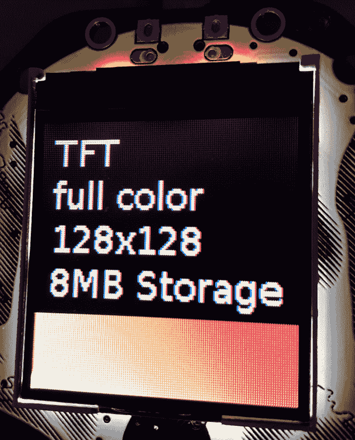
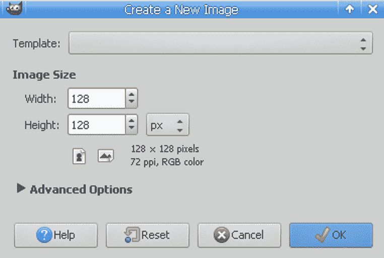
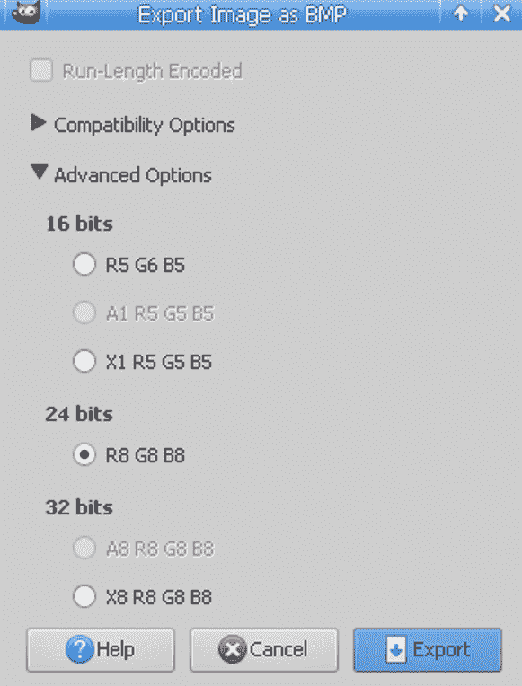
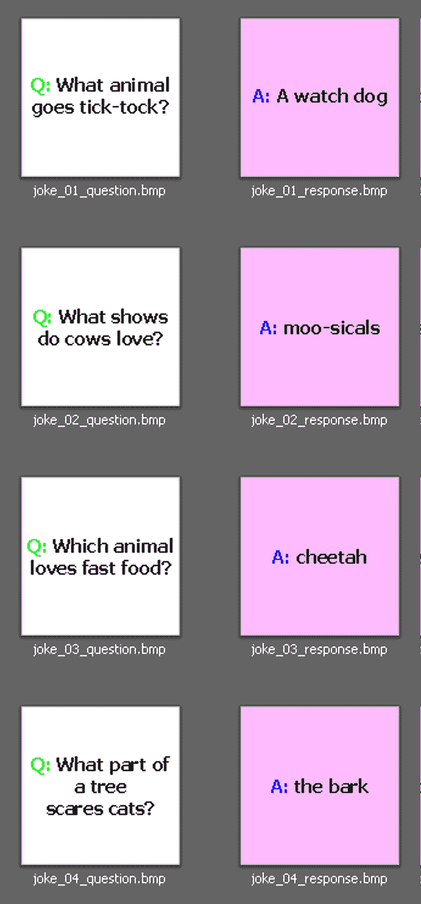

# 第十五章：在 Adafruit HalloWing 微控制器上编码

在本章中，我们将创建一个讲笑话的机器。我们将使用 Adafruit HalloWing M0 Express 板，该板配有全彩 TFT 显示屏和电容式触摸传感器。每次按下触摸按钮时，都会呈现一个新的笑话谜语。您可以尝试猜出谜底，当您准备好时，触摸按钮以显示谜底。再次按下触摸按钮会随机选择一个新的谜语并开始另一场游戏。

本章将是一个有用的信息来源，并帮助您构建项目，让您利用全彩屏幕的强大功能，具有足够的分辨率来呈现多行文本和全彩图像。

我们将在本章中介绍以下内容：

+   发现 I2C 设备

+   使用 I2C 从加速计读取数据

+   使用加速计检测翻转板

+   控制屏幕亮度

+   显示位图图像

+   列出所有图像文件

+   创建一个讲笑话的机器

# Adafruit HalloWing M0 Express

Adafruit HalloWing 是一款带有内置 1.44 英寸 128 x 128 全彩 TFT 显示屏的微控制器。用于显示图像的软件完全支持显示全彩位图图像文件。设备上有 8MB 的存储空间，这为您提供了足够的空间来存储和显示大量图像。该板还配备有 3 轴加速计、光传感器和 4 个电容式触摸板。以下屏幕截图显示了 TFT 屏幕显示位图图像：



该板可以由便携式电源供电。它支持可充电锂聚合物电池和 USB 便携式电源银行。

# 购买地点

Adafruit HalloWing M0 Express 板可以直接从 Adafruit([`www.adafruit.com/product/3900`](https://www.adafruit.com/product/3900))购买。

# 技术要求

本章的代码文件可以在本书的 GitHub 存储库的`Chapter15`文件夹中找到，网址为[`github.com/PacktPublishing/MicroPython-Cookbook`](https://github.com/PacktPublishing/MicroPython-Cookbook)。

本章使用加载了 CircuitPython 固件的 Adafruit HalloWing M0 Express 板。本章中的所有配方都使用了 CircuitPython 版本 4.0.0-rc.1。

您可以从[`circuitpython.org/board/hallowing_m0_express/`](https://circuitpython.org/board/hallowing_m0_express/)下载固件图像。

本章中的许多配方需要一组位图图像传输到 Adafruit HalloWing 设备。它们都可以从本书的 GitHub 存储库的`Chapter15`文件夹中下载。它们应该保存在顶层文件夹中，与您的`main.py`文件一起。

# 发现 I2C 设备

这个配方将向您展示如何使用`i2c`对象扫描连接到总线的 I2C 设备。I2C 协议支持多个设备连接到单个 I2C 连接。连接到设备的第一步之一是扫描和列出所有检测到的设备。这个配方将帮助您排除 I2C 设备，以确认它已连接并且可以在扫描中找到。它还可以帮助您构建可以自动扫描和检测多个设备的 Python 脚本。

# 准备工作

您需要访问 Adafruit HalloWing 板上的 REPL 来运行本配方中提供的代码。

# 如何操作...

按照以下步骤学习如何发现 I2C 设备：

1.  在 REPL 中运行以下代码行：

```py
>>> import board
>>> import busio
```

1.  所需的库已经被导入。运行以下代码行以创建将用于扫描的`i2c`对象：

```py
>>> i2c = busio.I2C(board.SCL, board.SDA)
```

1.  以下代码行将一直循环，直到在 I2C 总线上获得锁定：

```py
>>> while not i2c.try_lock():
...     print('getting lock...')
...     
...     
... 
>>> 
```

1.  以下代码块执行扫描并列出所有检测到的设备：

```py
>>> i2c.scan()
[24]
```

1.  我们可以再次执行扫描，并将返回的设备地址转换为十六进制格式：

```py
>>> [hex(x) for x in i2c.scan()]
['0x18']
```

1.  以下代码块应放入`main.py`文件中：

```py
import board
import busio

def main():
    i2c = busio.I2C(board.SCL, board.SDA)
    while not i2c.try_lock():
        print('getting lock...')
    devices = [hex(x) for x in i2c.scan()]
    print('devices found:', devices)

main()
```

当执行此脚本时，它将打印出所有发现设备的地址。

# 工作原理...

主要函数设置了`i2c`对象。然后重复调用`try_lock`方法，直到获得锁。这个锁是需要执行 I2C 总线扫描的。然后调用`scan`方法，它返回一个设备地址列表。然后将每个地址转换为十六进制表示法，并保存为字符串列表在设备的变量中。最后，输出这个变量的内容，并指示这是在总线上发现的设备列表。

# 还有更多...

一些 I2C 操作，比如扫描，需要一个锁。如果您尝试在没有先获取锁的情况下执行扫描，您将收到一个运行时错误，指示此函数需要一个锁。在下一个教程中，我们将看到还有其他不需要锁的操作。I2C 的地址经常使用十六进制表示法来引用，这就是为什么我们将值从整数转换为十六进制值的原因。

Adafruit HalloWing M0 Express 板配备了一个 I2C 设备——一个加速度计，其地址应为`0x18`。我们的扫描证实了这一点。如果您不确定您的设备的具体地址值，您可以使用扫描方法来检测这些值。

# 另请参阅

以下是关于这个教程的一些参考资料：

+   有关`scan`方法的文档可以在[`circuitpython.readthedocs.io/en/3.x/shared-bindings/busio/I2C.html#busio.I2C.scan`](https://circuitpython.readthedocs.io/en/3.x/shared-bindings/busio/I2C.html#busio.I2C.scan)找到。

+   可以在[`learn.adafruit.com/hallowing-magic-9-ball/`](https://learn.adafruit.com/hallowing-magic-9-ball/)找到一个使用 Adafruit HalloWing 板上加速度计的项目的文档。

# 使用 I2C 从加速度计读取数据

这个教程将向您展示如何使用 I2C 协议连接板载加速度计。一旦我们有了一个 I2C 对象，我们将使用 Python 的`adafruit_lis3dh`库创建一个`LIS3DH_I2C`对象。这个对象将让我们从加速度计中读取实时传感器数据。这个教程将帮助您在想要创建一个利用板的方向来创建交互体验的项目时。例如，您可以创建一个根据板被摇动而改变当前显示图像的项目。

# 准备工作

您需要访问 Adafruit HalloWing 设备上的 REPL 来运行本教程中提供的代码。

# 如何做...

按照以下步骤学习如何使用 I2C 从加速度计读取数据：

1.  在 REPL 中执行以下代码块：

```py
>>> from adafruit_lis3dh import LIS3DH_I2C
>>> import board
>>> import busio
>>> import time
>>> 
>>> ACCEL_ADDRESS = 0x18
```

1.  所需的库现在已经被导入，并且加速度计地址已经在`ACCEL_ADDRESS`常量中定义。运行以下代码块来创建一个`i2c`对象，并使用该对象来创建一个`LIS3DH_I2C`对象：

```py
>>> i2c = busio.I2C(board.SCL, board.SDA)
>>> accel = LIS3DH_I2C(i2c, address=ACCEL_ADDRESS)
```

1.  以下代码块将获取加速度计方向数据并显示其值：

```py
>>> accel.acceleration
acceleration(x=0.143678, y=-0.0287355, z=-9.48272)
```

1.  我们还可以使用以下代码块访问特定信息，比如*x*轴方向数据：

```py
>>> accel.acceleration.x
0.124521
```

1.  以下循环用于每 0.1 秒打印一次实时加速度计传感器数据：

```py
>>> while True:
...     print(accel.acceleration)
...     time.sleep(0.1)
...     
...     
... 
acceleration(x=0.162835, y=-0.00957851, z=-9.47314)
acceleration(x=0.162835, y=-0.0478925, z=-9.52104)
acceleration(x=0.0957851, y=-0.057471, z=-9.30073)
acceleration(x=0.172413, y=-0.00957851, z=-9.51146)
acceleration(x=0.153256, y=-0.0478925, z=-9.48272)
acceleration(x=0.153256, y=-0.057471, z=-9.53062)
acceleration(x=0.162835, y=-0.057471, z=-9.53062)
```

1.  以下代码应该放入`main.py`文件中：

```py
from adafruit_lis3dh import LIS3DH_I2C
import board
import busio
import time

ACCEL_ADDRESS = 0x18

def main():
    i2c = busio.I2C(board.SCL, board.SDA)
    accel = LIS3DH_I2C(i2c, address=ACCEL_ADDRESS)
    while True:
        print(accel.acceleration)
        time.sleep(0.1)

main()
```

当执行此脚本时，它将每 0.1 秒打印一次来自加速度计的传感器数据。

# 工作原理...

`ACCEL_ADDRESS`常量包含 Adafruit HalloWing M0 Express 板上加速度计的地址。一旦我们创建了一个`i2c`对象，我们将它和`ACCEL_ADDRESS`一起创建一个`LIS3DH_I2C`对象，我们将保存在一个名为`accel`的变量中。然后启动一个无限循环，每次迭代都从加速度计中读取传感器数据并将其打印出来。然后循环等待 0.1 秒延迟，然后开始下一次迭代。

# 还有更多...

Adafruit HalloWing 设备上使用的加速度计的名称为 LIS3DH，这就是为什么知道如何与该设备通信的 Python 库被称为`adafruit_lis3dh`。该传感器可用于检测板的方向和加速度。在下一个教程中，我们将使用这些方向数据来检测板何时被翻转。

# 参见

以下是关于这个教程的一些参考资料：

+   LIS3DH 加速度计的文档可以在[`www.st.com/en/mems-and-sensors/lis3dh.html`](https://www.st.com/en/mems-and-sensors/lis3dh.html)找到。

+   `LIS3DH_I2C`对象的文档可以在[`circuitpython.readthedocs.io/projects/lis3dh/en/latest/api.html#adafruit_lis3dh.LIS3DH_I2C`](https://circuitpython.readthedocs.io/projects/lis3dh/en/latest/api.html#adafruit_lis3dh.LIS3DH_I2C)找到。

# 使用加速度计检测板翻转

这个教程将向您展示如何创建一个函数，用于检测板何时被翻转。为了实现这一点，我们将使用从加速度计获取的方向数据。我们将专注于*z*轴数据，因为这将指示板是面朝上还是面朝下。本教程中提出的方法在您创建项目并希望以比只是按按钮更有创意的方式与项目进行交互时可能对您有用。当有人发现他们只需翻转您的板就可以与之交互时，这可以创造一种有趣的交互水平。

# 准备工作

您将需要在 Adafruit HalloWing 设备上访问 REPL 以运行本教程中提供的代码。 

# 如何做...

按照以下步骤学习如何使用加速度计检测板翻转：

1.  使用 REPL 运行以下代码行：

```py
>>> from adafruit_lis3dh import LIS3DH_I2C
>>> import board
>>> import busio
>>> import time
>>> 
>>> ACCEL_ADDRESS = 0x18
```

1.  所需的库已被导入并不断定义。运行以下代码块以创建`i2c`和`LIS3DH_I2C`对象：

```py
>>> i2c = busio.I2C(board.SCL, board.SDA)
>>> accel = LIS3DH_I2C(i2c, address=ACCEL_ADDRESS)
```

1.  现在我们可以检查*z*轴的方向数据：

```py
>>> accel.acceleration.z
-9.43483
```

1.  将板翻转，使其显示面朝下，然后运行以下代码块：

```py
>>> accel.acceleration.z
9.50188
```

1.  *z*轴的方向值将是一个正数或负数，具体取决于板是面朝上还是面朝下。执行以下代码块来计算这个值：

```py
>>> face = 'up' if accel.acceleration.z < 0 else 'down'
>>> face
'up'
```

1.  在将板翻转至面朝下和面朝上时运行以下代码块：

```py
>>> while True:
...     face = 'up' if accel.acceleration.z < 0 else 'down'
...     print('board is face', face)
...     time.sleep(0.1)
...     
...     
... 
board is face up
board is face up
board is face up
board is face down
board is face down
board is face up
board is face up
board is face up
```

1.  以下代码应放入`main.py`文件中：

```py
from adafruit_lis3dh import LIS3DH_I2C
import board
import busio
import time

ACCEL_ADDRESS = 0x18

def main():
    i2c = busio.I2C(board.SCL, board.SDA)
    accel = LIS3DH_I2C(i2c, address=ACCEL_ADDRESS)
    while True:
        face = 'up' if accel.acceleration.z < 0 else 'down'
        print('board is face', face)
        time.sleep(0.1)

main()
```

当执行此脚本时，它将每 0.1 秒打印板是面朝上还是面朝下。

# 工作原理...

一旦`i2c`和`accel`变量设置好，我们就可以开始从加速度计中访问方向数据。当板面朝上时，`z`值将是一个负数，当板面朝下时，`z`值将是一个正数。我们可以利用这部分信息来计算板是面朝上还是面朝下。开始一个无限循环，并将变量 face 保存为`up`或`down`值，取决于板的当前方向。然后在循环等待 0.1 秒延迟之前，打印这些信息，然后开始下一次迭代。

# 还有更多...

这个教程向您展示了如何使用加速度计的一部分信息来检测板的物理方向的变化。一旦我们检测到这种变化，我们可以使脚本改变其输出，例如，每当板的面值发生变化时。加速度计还足够精确，可以提供板相对于*z*轴的指向角度。我们可以利用这些信息来改变我们的应用程序的行为，取决于板向某个方向倾斜的程度。

# 参见

以下是关于这个教程的一些参考资料：

+   关于加速度计如何检测方向的文档可以在[`ieeexplore.ieee.org/document/1241424`](https://ieeexplore.ieee.org/document/1241424)找到。

+   有关`acceleration`属性的文档可以在[`circuitpython.readthedocs.io/projects/lis3dh/en/latest/api.html#adafruit_lis3dh.LIS3DH.acceleration`](https://circuitpython.readthedocs.io/projects/lis3dh/en/latest/api.html#adafruit_lis3dh.LIS3DH.acceleration)找到。

# 控制屏幕亮度

这个食谱将向您展示如何在 Adafruit HalloWing 设备附带的 TFT 显示屏上控制亮度级别。亮度可以通过提供 0 到 1 之间的分数值设置为最大级别或较低级别。亮度设置还可以用于通过将亮度级别设置为 0 来关闭显示器。在您不希望屏幕一直开启的项目中，这个食谱可能对您有用，并且希望打开和关闭屏幕。当您希望将背光的亮度级别调整到较低级别以减少功耗时，它也可能有所帮助。

# 准备工作

您需要访问 Adafruit HalloWing 设备上的 REPL 才能运行此食谱中提供的代码。

# 如何做...

按照以下步骤学习如何控制 Adafruit HalloWing 设备的屏幕亮度：

1.  在 REPL 中运行以下代码行：

```py
>>> import board
>>> import time
```

1.  已导入所需的库，您可以运行以下代码块将亮度级别设置为 50%：

```py
>>> board.DISPLAY.brightness = 0.5
```

1.  以下代码块将通过将亮度设置为 0%关闭显示器：

```py
>>> board.DISPLAY.brightness = 0
```

1.  现在我们可以用以下代码块将亮度设置为最大级别：

```py
>>> board.DISPLAY.brightness = 1.0
```

1.  以下函数将在 11 次迭代中将亮度从最低级别提升到最大级别：

```py
>>> def fade_in():
...     for i in range(0, 11):
...         brightness = i / 10
...         print('brightness:', brightness)
...         board.DISPLAY.brightness = brightness
...         time.sleep(0.1)
...         
...         
... 
>>> 
```

1.  运行以下代码块。您应该看到显示器逐渐变亮到最大亮度：

```py
>>> fade_in()
brightness: 0.0
brightness: 0.1
brightness: 0.2
brightness: 0.3
brightness: 0.4
brightness: 0.5
brightness: 0.6
brightness: 0.7
brightness: 0.8
brightness: 0.9
brightness: 1.0
>>> 
```

1.  以下代码应放入`main.py`文件中：

```py
import board
import time

def fade_in():
    for i in range(0, 11):
        brightness = i / 10
        print('brightness:', brightness)
        board.DISPLAY.brightness = brightness
        time.sleep(0.1)

def main():
    while True:
        fade_in()

main()
```

执行此脚本时，它将使屏幕从黑色渐变到完全亮度，每次渐变之间延迟 0.1 秒。

# 工作原理...

主函数启动一个无限循环，不断调用`fade_in`函数。每次调用`fade_in`函数都会启动一个`for`循环，循环遍历 11 个亮度值。这些值从显示关闭到将显示设置为最大亮度不等。每次迭代都会计算亮度级别并存储在亮度变量中。该值被打印，然后应用于`DISPLAY`对象上的亮度属性。然后应用 0.1 秒的延迟，然后应用淡入循环的下一次迭代。

# 还有更多...

这个食谱演示了设置显示屏亮度有多容易。它还向您展示了如何在 Python 中实现屏幕淡入淡出等屏幕效果。当您想要通过关闭显示器的背光来关闭显示器时，亮度属性可能特别有用。您可能会创建一个使用这种技术来优化电量消耗的电池操作设备。

# 另请参阅

这个食谱有一些参考资料：

+   控制屏幕亮度的示例可以在[`circuitpython.readthedocs.io/en/latest/shared-bindings/displayio/OnDiskBitmap.html`](https://circuitpython.readthedocs.io/en/latest/shared-bindings/displayio/OnDiskBitmap.html)找到。

+   有关 Adafruit HalloWing 设备上的 TFT 显示屏的详细信息，请访问[`learn.adafruit.com/adafruit-hallowing?view=all#tft-2-18`](https://learn.adafruit.com/adafruit-hallowing?view=all#tft-2-18)。

# 显示位图图像

该食谱将向您展示如何创建一个接收位图图像路径的函数，获取该图像，并在 HalloWing 屏幕上显示它。有许多不同的对象和选项可用于操作屏幕的内容。即使我们只想显示单个图像，我们也必须与许多不同的对象进行交互。该食谱让您了解在将图像呈现在板的屏幕上所涉及的内容。如果您正在使用 HalloWing 设备进行需要显示不同图像的项目，并且希望以简单的方式更改当前显示的图像，这个食谱可能会有所帮助。

# 准备工作

您将需要访问 Adafruit HalloWing 设备上的 REPL 来运行本食谱中提供的代码。

# 如何做...

按照以下步骤学习如何在 HalloWing 设备屏幕上显示位图图像：

1.  在 REPL 中执行以下代码块：

```py
>>> import board
>>> from displayio import OnDiskBitmap, ColorConverter, TileGrid, Group
```

1.  现在已经导入了`displayio`模块中的必要对象。运行以下代码块以将文件对象打开为二进制流：

```py
>>> path = 'joke_01_question.bmp'
>>> f = open(path, 'rb')
```

1.  我们将使用此文件对象来创建我们的位图对象，然后准备`pixel_shader`对象：

```py
>>> bitmap = OnDiskBitmap(f)
>>> pixel_shader = ColorConverter()
```

1.  然后，这两个对象被用作创建名为`sprite`的`TileGrid`对象的参数：

```py
sprite = TileGrid(bitmap, pixel_shader=pixel_shader)
```

1.  以下代码块创建了一个组对象，并将`sprite`附加到其中：

```py
>>> group = Group()
>>> group.append(sprite)
```

1.  我们可以使用以下代码块在显示器上显示此组，并调用`wait_for_frame`使代码块等待直到显示器完全更新。现在，我们将关闭文件对象，因为它不再需要：

```py
>>> board.DISPLAY.show(group)
>>> board.DISPLAY.wait_for_frame()
>>> f.close()
```

1.  运行以下代码块来定义`show_image`函数并调用它在显示屏上显示不同的图像：

```py
>>> def show_image(path):
...     with open(path, 'rb') as f:
...         bitmap = OnDiskBitmap(f)
...         pixel_shader = ColorConverter()
...         sprite = TileGrid(bitmap, pixel_shader=pixel_shader)
...         group = Group()
...         group.append(sprite)
...         board.DISPLAY.show(group)
...         board.DISPLAY.wait_for_frame()
...         
...         
... 
>>> show_image('joke_01_response.bmp')
>>> 
```

1.  以下代码应放入`main.py`文件中：

```py
import board
from displayio import OnDiskBitmap, ColorConverter, TileGrid, Group

IMAGES = ['joke_01_question.bmp', 'joke_01_response.bmp']

def show_image(path):
    with open(path, 'rb') as f:
        bitmap = OnDiskBitmap(f)
        pixel_shader = ColorConverter()
        sprite = TileGrid(bitmap, pixel_shader=pixel_shader)
        group = Group()
        group.append(sprite)
        board.DISPLAY.show(group)
        board.DISPLAY.wait_for_frame()

def main():
    while True:
        for image in IMAGES:
            show_image(image)

main()
```

当执行此脚本时，它将重复在显示屏上显示两个不同位图之间切换的图像。

# 工作原理...

该食谱中的`show_image`函数负责在屏幕上显示位图。它接收一个参数，即位图文件的路径。该文件被打开进行读取，然后用于创建一个名为位图的`OnDiskBitmap`对象。

`ColorConverter`对象用于创建`pixel_shader`变量。创建了一个`TileGrid`对象，并需要显示位图以及将要使用的像素着色器。这两个参数都已提供，并且新的`TileGrid`对象保存在`sprite`变量中。`sprite`变量不能直接提供给`DISPLAY`对象，因此我们必须创建一个`Group`对象并将`sprite`附加到其中。

现在我们可以在`DISPLAY`对象上调用`show`方法来显示`group`变量。调用`wait_for_frame`方法以确保图像在屏幕上完全显示后继续。主函数启动一个无限循环，不断调用`show_image`来连续更改当前显示的图像。

# 接下来...

在 HalloWing 设备上显示位图图像需要使用许多不同类型的对象。部分原因是每个对象在图像在屏幕上显示方面提供了广泛的灵活性。例如，您可以控制图像的*x*和*y*坐标，或者使用其他不来自文件的位图对象。

显示器可以显示分辨率高达 128 x 128 的图像，保存在 24 位像素 BMP 文件格式中。您可以使用开源的 GIMP 图像编辑器创建这些图像。

在 GIMP 应用程序中创建新图像时，应设置正确的分辨率，如下截图所示：



当您准备保存图像时，请使用文件菜单中的导出功能，并以 BMP 文件格式保存图像。在执行此操作时，请确保选择正确的每像素位数设置，如下截图所示：



重要的是要知道，您还可以使用较小分辨率的图像，并且这将自动检测并正确显示在屏幕上。较小的图像也往往会更快地显示在屏幕上。

# 另请参阅

以下是有关此配方的一些参考资料：

+   GIMP 图像编辑器的下载地址为[`www.gimp.org/`](https://www.gimp.org/)。

+   有关`OnDiskBitmap`对象的文档可在[`circuitpython.readthedocs.io/en/latest/shared-bindings/displayio/OnDiskBitmap.html`](https://circuitpython.readthedocs.io/en/latest/shared-bindings/displayio/OnDiskBitmap.html)找到。

# 列出所有图像文件

此配方将向您展示如何列出特定目录中的所有图像文件。在讲笑话的机器中，我们将每个笑话问题和响应创建为一对图像。此配方将允许您列出板上的所有位图图像。然后，我们将扩展此功能以进一步过滤列表，并拥有所有笑话问题的位图图像。此配方可在您创建的任何项目中使用，其中您希望检索要显示的图像列表或音频文件或在您的项目中播放。

# 准备工作

您需要访问 Adafruit HalloWing 设备上的 REPL 来运行此配方中提供的代码。

# 如何做...

按照以下步骤学习如何列出图像文件：

1.  使用 REPL 运行以下代码行：

```py
>>> import os
>>> paths = sorted(os.listdir())
>>> paths
['.Trashes', '.fseventsd', '.metadata_never_index', 'boot_out.txt', 'joke_01_question.bmp', 'joke_01_response.bmp', 'joke_02_question.bmp', 'joke_02_response.bmp', 'joke_03_question.bmp', 'joke_03_response.bmp', 'joke_04_question.bmp', 'joke_04_response.bmp', 'main.py']
```

1.  我们现在已经检索并输出了板上根目录中所有路径的排序列表。我们将使用以下代码块仅列出位图图像文件：

```py
>>> images = [i for i in paths if i.endswith('.bmp')]
>>> images
['joke_01_question.bmp', 'joke_01_response.bmp', 'joke_02_question.bmp', 'joke_02_response.bmp', 'joke_03_question.bmp', 'joke_03_response.bmp', 'joke_04_question.bmp', 'joke_04_response.bmp']
```

1.  我们可以进一步扩展这一点，只列出笑话问题图像文件，如下面的代码块所示：

```py
>>> questions = [i for i in paths if i.endswith('question.bmp')]
>>> questions
['joke_01_question.bmp', 'joke_02_question.bmp', 'joke_03_question.bmp', 'joke_04_question.bmp']
>>> 
```

1.  以下代码块将选择第一个问题图像并将其保存到一个变量中：

```py
>>> question = questions[0]
>>> question
'joke_01_question.bmp'
```

1.  以下代码块可用于根据问题图像计算笑话的响应图像的名称：

```py
>>> response = question.replace('question.bmp', 'response.bmp')
>>> response
'joke_01_response.bmp'
```

1.  我们将使用以下代码块来确认计算的响应图像是否存在为文件：

```py
>>> response in paths
True
```

1.  以下代码应放入`main.py`文件中：

```py
import os

def get_questions():
    paths = sorted(os.listdir())
    return [i for i in paths if i.endswith('question.bmp')]

def main():
    questions = get_questions()
    for question in questions:
        response = question.replace('question.bmp', 'response.bmp')
        print(question, response)

main()
```

执行此脚本时，将列出所有问题图像并计算其相关的响应图像。

# 它是如何工作的...

此配方中的`get_questions`函数将排序后的文件名列表保存在`paths`变量中。然后，它通过检查文件名中是否出现`question.bmp`字符串来过滤列表，仅包括问题图像。然后函数返回过滤后的列表。

主函数调用`get_questions`函数，并将其结果保存到`questions`变量中。每个问题都会循环遍历，并在我们将文件名中的`question.bmp`值替换为`response.bmp`时计算其响应图像。然后打印问题和响应文件名，然后开始下一次循环。

# 还有更多...

将使用多张图像来创建讲笑话的机器。我们本可以将所需图像的名称保存在脚本本身中，而不是直接在文件系统中列出它们。但是，此配方中采取的方法更好，因为它避免了我们直接在应用程序中硬编码图像列表。这意味着我们可以在不更改应用程序代码的情况下在板上拥有 5 个笑话甚至 50 个笑话。

每次启动讲笑话的机器时，它都会自动抓取最新的笑话图像列表。以下屏幕截图显示了下一个配方中将用于创建讲笑话的机器的笑话问题和响应：



您可以看到，文件名遵循简单的命名约定，使您在图像查看器中查看每个问题和响应时更容易。这种命名约定还使得计算特定问题图像的相关响应图像变得更加容易。

# 另请参阅

以下是有关此配方的一些参考资料：

+   有关 BMP 文件格式的文档可以在[`www.fileformat.info/format/bmp/egff.htm`](https://www.fileformat.info/format/bmp/egff.htm)找到。

+   有关在 HalloWing 设备上使用位图图像的详细信息可以在[`learn.adafruit.com/hallowing-badge/hallowing-badge-and-image-player`](https://learn.adafruit.com/hallowing-badge/hallowing-badge-and-image-player)找到。

# 创建一个讲笑话机

这个教程将向您展示如何列出特定目录中的所有图像文件。在我们创建的讲笑话机中，每个笑话问题和回答都将作为一对图像提供。这个教程将向我们展示如何列出板上所有的位图图像。

然后，我们将扩展此功能，以进一步过滤列表，以便我们手头有所有笑话问题的位图图像。如果您想创建一个项目，其中需要检索图像或音频文件的列表，以便在项目中显示或播放它们，那么这个教程将对您有所帮助。

# 准备工作

您需要访问 Adafruit HalloWing 设备上的 REPL，以运行本教程中提供的代码。

# 如何做...

按照以下步骤学习如何创建一个讲笑话机：

1.  在 REPL 中运行以下代码行：

```py
>>> from displayio import OnDiskBitmap, ColorConverter, TileGrid, Group
>>> import board
>>> import random
>>> import time
>>> import touchio
>>> import os
```

1.  我们现在已经导入了所有必要的模块。以下代码块将创建一个`TouchIn`对象：

```py
>>> touch = touchio.TouchIn(board.TOUCH1)
>>>
```

1.  在以下代码块中，我们将检查触摸板的状态：

```py
>>> touch.value
False
```

1.  在执行以下代码块时触摸板：

```py
>>> touch.value
True
```

1.  以下代码块将定义`wait_for_touch`函数，该函数将一直循环，直到检测到触摸事件为止：

```py
>>> def wait_for_touch(touch):
...     while not touch.value:
...         print('waiting...')
...         time.sleep(0.1)
...         
...         
... 
>>> 
```

1.  我们将使用以下代码块来调用`wait_for_touch`。执行此函数后，等待片刻，然后触摸板以确认函数在检测到触摸事件后是否从其`while`循环中返回：

```py
>>> wait_for_touch(touch)
waiting...
waiting...
waiting...
waiting...
>>> 
```

1.  以下代码块将保存`questions`变量中的问题图像列表：

```py
>>> def get_questions():
...     paths = sorted(os.listdir())
...     return [i for i in paths if i.endswith('question.bmp')]
...     
...     
... 
>>> 
>>> questions = get_questions()
>>> questions
['joke_01_question.bmp', 'joke_02_question.bmp', 'joke_03_question.bmp', 'joke_04_question.bmp']
```

1.  我们将使用以下代码块来随机选择问题列表中的问题：

```py
>>> question = random.choice(questions)
>>> question
'joke_04_question.bmp'
```

1.  以下代码应放入`main.py`文件中：

```py
from displayio import OnDiskBitmap, ColorConverter, TileGrid, Group
import board
import random
import time
import touchio
import os

def show_image(path):
    print('showing image', path)
    with open(path, 'rb') as f:
        bitmap = OnDiskBitmap(f)
        pixel_shader = ColorConverter()
        sprite = TileGrid(bitmap, pixel_shader=pixel_shader)
        group = Group()
        group.append(sprite)
        board.DISPLAY.show(group)
        board.DISPLAY.wait_for_frame()

def wait_for_touch(touch):
    while not touch.value:
        print('waiting...')
        time.sleep(0.1)

def get_questions():
    paths = sorted(os.listdir())
    return [i for i in paths if i.endswith('question.bmp')]

def main():
    touch = touchio.TouchIn(board.TOUCH1)
    questions = get_questions()
    while True:
        question = random.choice(questions)
        response = question.replace('question.bmp', 'response.bmp')
        show_image(question)
        wait_for_touch(touch)
        show_image(response)
        wait_for_touch(touch)

main()
```

执行此脚本时，它将启动讲笑话机，并在每次按触摸板时让您在显示器上看到笑话问题和回答。

# 工作原理...

`main`函数创建一个连接到板上第一个触摸板连接器的`TouchIn`对象。通过调用`get_questions()`函数检索问题图像列表，并将返回的列表保存在`questions`变量中。

然后启动一个无限事件循环，首先选择一个随机问题，并计算与该问题相关的响应图像。然后通过调用`show_image`函数在屏幕上显示问题图像。然后调用`wait_for_touch`函数，该函数循环检查触摸事件，每 100 毫秒检查一次。

一旦检测到触摸事件，函数将返回，然后调用`show_image`函数显示响应图像。然后再次调用`wait_for_touch`函数，以便用户在决定通过按触摸板加载另一个问题之前可以看到响应。一旦按下触摸板，当前循环迭代结束，进程将以新选择的随机问题重新开始。

# 还有更多...

讲笑话机是使用该板的输入和输出功能的一种有趣方式。它使用板的图形显示来显示不同的笑话问题和回答，以及电容触摸传感器作为输入，以使应用程序加载下一个问题或显示加载问题的答案。

这个基本教程可以以许多方式进行扩展。由于该板带有四个触摸板，您可以创建一个简单的菜单系统，让人们可以从不同类别的笑话中进行选择。您甚至可以通过拥有骰子六个面的图像，并在每次按触摸板时显示一个随机面，来创建一个数字骰子的项目。

# 另请参阅

以下是关于这个配方的一些参考资料：

+   `ColorConverter` 对象的文档可以在 [`circuitpython.readthedocs.io/en/latest/shared-bindings/displayio/ColorConverter.html`](https://circuitpython.readthedocs.io/en/latest/shared-bindings/displayio/ColorConverter.html) 找到。

+   `TileGrid` 对象的文档可以在 [`circuitpython.readthedocs.io/en/latest/shared-bindings/displayio/TileGrid.html`](https://circuitpython.readthedocs.io/en/latest/shared-bindings/displayio/TileGrid.html) 找到。
