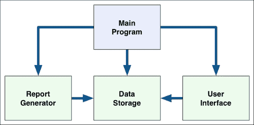
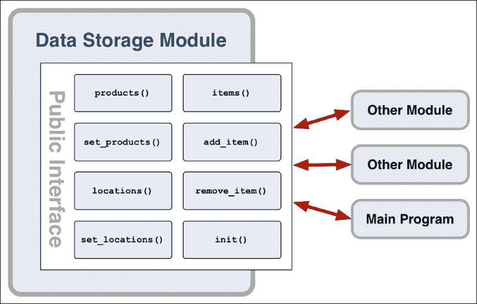

# 第二章：编写您的第一个模块化程序

在本章中，我们将使用模块化编程技术来实现一个非平凡的程序。在此过程中，我们将：

+   了解程序设计的“分而治之”方法

+   检查我们的程序需要执行的任务

+   查看我们的程序需要存储的信息

+   应用模块化技术，将我们的程序分解为各个部分

+   弄清楚每个部分如何可以作为单独的 Python 模块实现

+   查看各个模块如何协同工作以实现我们程序的功能

+   按照这个过程实现一个简单但完整的库存控制系统

+   了解模块化技术如何允许您向程序添加功能，同时最小化需要进行的更改

# 库存控制系统

假设您被要求编写一个程序，允许用户跟踪公司的库存，即公司可供销售的各种物品。对于每个库存物品，您被要求跟踪产品代码和物品当前的位置。新物品将在收到时添加，已售出的物品将在售出后移除。您的程序还需要生成两种类型的报告：列出公司当前库存的报告，包括每种物品在每个位置的数量，以及用于在物品售出后重新订购库存物品的报告。

查看这些要求，很明显我们需要存储三种不同类型的信息：

1.  公司出售的不同类型的产品清单。对于每种产品类型，我们需要知道产品代码（有时称为 SKU 编号）、描述以及公司应该在库存中拥有的该产品类型的所需数量。

1.  库存物品可以存放的位置清单。这些位置可能是单独的商店、仓库或储藏室。或者，位置可能标识商店内的特定货架或过道。对于每个位置，我们需要有位置代码和标识该位置的描述。

1.  最后，公司当前持有的库存物品清单。每个库存物品都有产品代码和位置代码；这些标识产品类型以及物品当前所在的位置。

运行程序时，最终用户应能执行以下操作：

+   向库存中添加新物品

+   从库存中移除物品

+   生成当前库存物品的报告

+   生成需要重新订购的库存物品的报告

+   退出程序

虽然这个程序并不太复杂，但这里有足够的功能可以从模块化设计中受益，同时保持我们的讨论相对简洁。既然我们已经看了我们的程序需要做什么以及我们需要存储的信息，让我们开始应用模块化编程技术来设计我们的系统。

# 设计库存控制系统

如果您退后一步，审查我们的库存控制程序的功能，您会发现这个程序需要支持三种基本类型的活动：

+   存储信息

+   与用户交互

+   生成报告

虽然这很笼统，但这种分解很有帮助，因为它提出了组织程序代码的可能方式。例如，负责存储信息的系统部分可以存储产品、位置和库存物品的列表，并在需要时提供这些信息。同样，负责与用户交互的系统部分可以提示用户选择要执行的操作，要求他们选择产品代码等。最后，负责生成报告的系统部分将能够生成所需类型的报告。

以这种方式思考系统，很明显，系统的这三个*部分*可以分别实现为单独的模块：

+   负责存储信息的系统部分可以称为**数据存储**模块

+   负责与用户交互的系统部分可以称为**用户界面**模块

+   负责生成报告的系统部分可以称为**报告生成器**模块

正如名称所示，每个模块都有特定的目的。除了这些专用模块，我们还需要系统的另一个部分：一个 Python 源文件，用户执行以启动和运行库存控制系统。因为这是用户实际运行的部分，我们将称其为**主程序**，通常存储在名为`main.py`的 Python 源文件中。

现在我们的系统有四个部分：三个模块加上一个主程序。每个部分都将有特定的工作要做，各个部分通常会相互交互以执行特定的功能。例如，报告生成器模块将需要从数据存储模块获取可用产品代码的列表。这些各种交互在下图中用箭头表示：



现在我们对程序的整体结构有了一个概念，让我们更仔细地看看这四个部分中的每一个是如何工作的。

## 数据存储模块

这个模块将负责存储我们程序的所有数据。我们已经知道我们需要存储三种类型的信息：**产品**列表，**位置**列表和**库存项目**列表。

为了使我们的程序尽可能简单，我们将就数据存储模块做出两个重要的设计决定：

+   产品和位置列表将被硬编码到我们的程序中

+   我们将在内存中保存库存项目列表，并在列表更改时将其保存到磁盘上

我们的库存控制系统的更复杂的实现会将这些信息存储在数据库中，并允许用户查看和编辑产品代码和位置列表。然而，在我们的情况下，我们更关心程序的整体结构，所以我们希望尽可能简单地实现。

虽然产品代码列表将被硬编码，但我们不一定希望将此列表构建到数据存储模块本身中。数据存储模块负责存储和检索信息，而不是定义产品代码列表的工作。因此，我们需要在数据存储模块中添加一个函数，用于设置产品代码列表。此函数将如下所示：

```py
def set_products(products):
    ...
```

我们已经决定，对于每种产品，我们希望存储**产品代码**，**描述**和用户希望保留的**物品数量**。为了支持这一点，我们将定义产品列表（作为我们`set_products()`函数中的`products`参数提供）为`(code, description, desired_number)`元组的列表。例如，我们的产品列表可能如下所示：

```py
[("CODE01", "Product 1", 10),
 ("CODE02", "Product 2", 200), ...
]
```

一旦产品列表被定义，我们可以提供一个函数根据需要返回此列表：

```py
def products():
    ...
```

这将简单地返回产品列表，允许您的代码根据需要使用此列表。例如，您可以使用以下 Python 代码扫描产品列表：

```py
for code,description,desired_number in products():
    ...
```

这两个函数允许我们定义（硬编码）产品列表，并在需要时检索此列表。现在让我们为位置列表定义相应的两个函数。

首先，我们需要一个函数来设置硬编码的位置列表：

```py
def set_locations(locations):
    ...
```

`locations`列表中的每个项目将是一个`(code, description)`元组，其中`code`是位置的代码，`description`是描述位置的字符串，以便用户知道它在哪里。

然后我们需要一个函数根据需要检索位置列表：

```py
def locations():
    ...
```

再次返回位置列表，允许我们根据需要处理这些位置。

现在我们需要决定数据存储模块将如何允许用户存储和检索库存项目列表。库存项目被定义为产品代码加上位置代码。换句话说，库存项目是特定类型的产品在特定位置。

为了检索库存项目列表，我们将使用以下函数：

```py
def items():
    ...
```

遵循我们为`products()`和`locations()`函数使用的设计，`items()`函数将返回一个库存项目列表，其中每个库存项目都是一个`(product_code, location_code)`元组。

与产品和位置列表不同，库存项目列表不会被硬编码：用户可以添加和删除库存项目。为了支持这一点，我们需要两个额外的函数：

```py
def add_item(product_code, location_code):
    ...

def remove_item(product_code, location_code):
    ...
```

我们需要设计数据存储模块的最后一个部分：因为我们将在内存中存储库存项目列表，并根据需要将它们保存到磁盘，所以当程序启动时，我们需要一种方式将库存项目从磁盘加载到内存中。为了支持这一点，我们将为我们的模块定义一个**初始化函数**：

```py
def init():
    ...
```

我们现在已经决定了数据存储模块的总共八个函数。这八个函数构成了我们模块的**公共接口**。换句话说，系统的其他部分将*只能*使用这八个函数与我们的模块进行交互：



注意我们在这里经历的过程：我们首先看了我们的模块需要做什么（在这种情况下，存储和检索信息），然后根据这些要求设计了模块的公共接口。对于前七个函数，我们使用业务需求来帮助我们设计接口，而对于最后一个函数`init()`，我们使用了我们对模块内部工作方式的知识来改变接口，以便模块能够完成其工作。这是一种常见的工作方式：业务需求和技术需求都将帮助塑造模块的接口以及它如何与系统的其他部分交互。

现在我们已经设计了我们的数据存储模块，让我们为系统中的其他模块重复这个过程。

## 用户界面模块

用户界面模块将负责与用户进行交互。这包括向用户询问信息，以及在屏幕上显示信息。为了保持简单，我们将为我们的库存控制系统使用一个简单的基于文本的界面，使用`print()`语句来显示信息，使用`input()`来要求用户输入内容。

我们的库存控制系统的更复杂的实现将使用带有窗口、菜单和对话框的图形用户界面。这样做会使库存控制系统变得更加复杂，远远超出了我们在这里尝试实现的范围。然而，由于系统的模块化设计，如果我们重新编写用户界面以使用菜单、窗口等，我们只需要更改这一个模块，而系统的其他部分将不受影响。

### 注意

这实际上是一个轻微的过度简化。用 GUI 替换基于文本的界面需要对系统进行许多更改，并且可能需要我们稍微更改模块的公共函数，就像我们不得不向数据存储模块添加`init()`函数以允许其内部工作方式一样。但是，由于我们正在设计系统的模块化方式，如果我们重写用户界面模块以使用 GUI，其他模块将不受影响。

让我们从用户与系统交互的角度来考虑库存控制系统需要执行的各种任务：

1.  用户需要能够选择要执行的操作。

1.  当用户想要添加新的库存项目时，我们需要提示用户输入新项目的详细信息。

1.  当用户想要移除库存项目时，我们需要提示用户输入要移除的库存项目的详细信息。

1.  当用户希望生成报告时，我们需要能够向用户显示报告的内容。

让我们逐个解决这些交互：

1.  要选择要执行的操作，我们将有一个`prompt_for_action()`函数，它返回一个标识用户希望执行的操作的字符串。让我们定义此函数可以返回的代码，以执行用户可以执行的各种操作：

| 操作 | 操作代码 |
| --- | --- |
| 添加库存项目 | `ADD` |
| 移除库存项目 | `REMOVE` |
| 生成当前库存项目的报告 | `INVENTORY_REPORT` |
| 生成需要重新订购的库存项目报告 | `REORDER_REPORT` |
| 退出程序 | `QUIT` |

1.  要添加库存项目，用户需要提示输入新项目的详细信息。因为库存项目被定义为给定位置的给定产品，实际上我们需要提示用户选择新项目的产品和位置。为了提示用户选择产品，我们将使用以下函数：

```py
def prompt_for_product():
    ...
```

用户将看到可用产品的列表，然后从列表中选择一个项目。如果他们取消，`prompt_for_product()`将返回`None`。否则，它将返回所选产品的产品代码。

同样，为了提示用户选择位置，我们将定义以下函数： 

```py
def prompt_for_location():
    ...
```

再次，这显示了可用位置的列表，用户可以从列表中选择一个位置。如果他们取消，我们返回`None`。否则，我们返回所选位置的位置代码。

使用这两个函数，我们可以要求用户标识新的库存项目，然后我们使用数据存储模块的`add_item()`函数将其添加到列表中。

1.  因为我们正在实现这个简单的基于文本的系统，删除库存项目的过程几乎与添加项目的过程相同：用户将被提示输入产品和位置，然后将删除该位置的库存项目。因此，我们不需要任何额外的函数来实现这个功能。

1.  要生成报告，我们将简单地调用报告生成器模块来完成工作，然后将生成的报告显示给用户。为了保持简单，我们的报告不会带任何参数，并且生成的报告将以纯文本格式显示。因此，我们唯一需要的用户界面函数是一个函数，用于显示报告的纯文本内容：

```py
def show_report(report):
    ...
```

`report`参数将简单地是一个包含生成报告的字符串的列表。`show_report()`函数需要做的就是逐个打印这些字符串，以向用户显示报告的内容。

这完成了我们对用户界面模块的设计。我们需要为此模块实现四个公共函数。

## 报告生成器模块

报告生成器模块负责生成报告。由于我们需要能够生成两种类型的报告，所以我们只需在报告生成器模块中有两个公共函数，每种报告一个：

```py
def generate_inventory_report():
    ...

def generate_reorder_report():
    ...
```

这些函数中的每一个都将生成给定类型的报告，将报告内容作为字符串列表返回。请注意，这些函数没有参数；因为我们尽可能保持简单，报告不会使用任何参数来控制它们的生成方式。

## 主程序

主程序不是一个模块。相反，它是一个标准的 Python 源文件，用户运行以启动系统。主程序将导入它需要的各种模块，并调用我们定义的函数来完成所有工作。在某种意义上，我们的主程序是将系统的所有其他部分粘合在一起的胶水。

在 Python 中，当一个源文件打算被运行（而不是被其他模块导入和使用，或者从 Python 命令行使用）时，通常使用以下结构的源文件：

```py
def main():
    ...

if __name__ == "__main__":
    main()
```

所有程序逻辑都写在`main()`函数内部，然后由文件中的最后两行调用。`if __name__ == "__main__"`行是 Python 的一个魔术，基本上意味着*如果正在运行这个程序*。换句话说，如果用户正在运行这个程序，调用`main()`函数来完成所有工作。

### 注意

我们可以将所有程序逻辑放在`if __name__ == "__main__"`语句下面，但将程序逻辑放在一个单独的函数中有一些优点。通过使用单独的函数，我们可以在想要退出时简单地从这个函数返回。这也使得错误处理更容易，代码组织得更好，因为我们的主程序代码与检查我们是否实际运行程序的代码是分开的。

我们将使用这个设计作为我们的主程序，将所有实际功能放在一个名为`main()`的函数中。

我们的`main()`函数将执行以下操作：

1.  调用需要初始化的各个模块的`init()`函数。

1.  提供产品和位置的硬连线列表。

1.  要求用户界面模块提示用户输入命令。

1.  响应用户输入的命令。

步骤 3 和 4 将无限重复，直到用户退出。

# 实施库存控制系统

现在我们对系统的整体结构有了一个很好的想法，我们的各种模块将是什么，它们将提供什么功能，是时候开始实施系统了。让我们从数据存储模块开始。

## 实施数据存储模块

在一个方便的地方创建一个目录，可以在其中存储库存控制系统的源代码。您可能想将此目录命名为`inventoryControl`或类似的名称。

在这个目录中，我们将放置各种模块和文件。首先创建一个名为`datastorage.py`的新的空 Python 源文件。这个 Python 源文件将保存我们的数据存储模块。

### 注意

在为我们的模块选择名称时，我们遵循 Python 使用所有小写字母的惯例。起初你可能会觉得有点笨拙，但很快就会变得容易阅读。有关这些命名约定的更多信息，请参阅[`www.python.org/dev/peps/pep-0008/#package-and-module-names`](https://www.python.org/dev/peps/pep-0008/#package-and-module-names)。

我们已经知道我们将需要八个不同的函数来构成这个模块的公共接口，所以继续添加以下 Python 代码到这个模块中：

```py
def init():
    pass

def items():
    pass

def products():
    pass

def locations():
    pass

def add_item(product_code, location_code):
    pass

def remove_item(product_code, location_code):
    pass

def set_products(products):
    pass

def set_locations(locations):
    pass
```

`pass`语句允许我们将函数留空-这些只是我们将要编写的代码的占位符。

现在让我们实现`init()`函数。这在系统运行时初始化数据存储模块。因为我们将库存物品列表保存在内存中，并在更改时将其保存到磁盘上，我们的`init()`函数将需要从磁盘上的文件中加载库存物品到内存中，以便在需要时可用。为此，我们将定义一个名为`_load_items()`的私有函数，并从我们的`init()`函数中调用它。

### 提示

请记住，前导下划线表示某些内容是私有的。这意味着`_load_items()`函数不会成为我们模块的公共接口的一部分。

将`init()`函数的定义更改为以下内容：

```py
def init():
    _load_items()
```

`_load_items()`函数将从磁盘上的文件加载库存物品列表到一个名为`_items`的私有全局变量中。让我们继续实现这个函数，通过将以下内容添加到模块的末尾：

```py
def _load_items():
    global _items
    if os.path.exists("items.json"):
        f = open("items.json", "r")
        _items = json.loads(f.read())
        f.close()
    else:
        _items = []
```

请注意，我们将库存物品列表存储在名为`items.json`的文件中，并且我们正在使用`json`模块将`_items`列表从文本文件转换为 Python 列表。

### 提示

JSON 是保存和加载 Python 数据结构的绝佳方式，生成的文本文件易于阅读。由于`json`模块内置在 Python 标准库中，我们不妨利用它。

因为我们现在正在使用 Python 标准库中的一些模块，您需要将以下`import`语句添加到模块的顶部：

```py
import json
import os.path
```

趁热打铁，让我们编写一个函数将库存物品列表保存到磁盘上。将以下内容添加到模块的末尾：

```py
def _save_items():
    global _items
    f = open("items.json", "w")
    f.write(json.dumps(_items))
    f.close()
```

由于我们已将库存物品列表加载到名为`_items`的私有全局变量中，我们现在可以实现`items()`函数以使这些数据可用。编辑`items()`函数的定义，使其看起来像下面这样：

```py
def items():
    global _items
    return _items
```

现在让我们实现`add_item()`和`remove_item()`函数，让系统的其余部分操作我们的库存物品列表。编辑这些函数，使其看起来像下面这样：

```py
def add_item(product_code, location_code):
    global _items
    _items.append((product_code, location_code))
    _save_items()

def remove_item(product_code, location_code):
    global _items
    for i in range(len(_items)):
        prod_code,loc_code = _items[i]
        if prod_code == product_code and loc_code == location_code:
            del _items[i]
            _save_items()
            return True
    return False
```

请注意，`remove_item()`函数如果成功移除该物品则返回`True`，否则返回`False`；这告诉系统的其余部分尝试移除库存物品是否成功。

我们现在已经实现了`datastorage`模块中与库存物品相关的所有函数。接下来，我们将实现与产品相关的函数。

由于我们知道我们将硬编码产品列表，`set_products()`函数将是微不足道的：

```py
def set_products(products):
    global _products
    _products = products
```

我们只需将产品列表存储在名为`_products`的私有全局变量中。然后，我们可以通过`products()`函数使这个列表可用：

```py
def products():
    global _products
    return _products
```

同样，我们现在可以实现`set_locations()`函数来设置硬编码的位置列表：

```py
def set_locations(locations):
    global _locations
    _locations = locations
```

最后，我们可以实现`locations()`函数以使这些信息可用：

```py
def locations():
    global _locations
    return _locations
```

这完成了我们对`datastorage`模块的实现。

## 实现用户界面模块

如前所述，用户界面模块将尽可能保持简单，使用`print()`和`input()`语句与用户交互。在这个系统的更全面的实现中，我们将使用图形用户界面（GUI）来显示并询问用户信息，但我们希望尽可能保持我们的代码简单。

有了这个想法，让我们继续实现我们的用户界面模块函数中的第一个。创建一个名为`userinterface.py`的新 Python 源文件来保存我们的用户界面模块，并将以下内容添加到此文件中：

```py
def prompt_for_action():
    while True:
        print()
        print("What would you like to do?")
        print()
        print("  A = add an item to the inventory.")
        print("  R = remove an item from the inventory.")
        print("  C = generate a report of the current inventory levels.")
        print("  O = generate a report of the inventory items to re-order.")
        print("  Q = quit.")
        print()
        action = input("> ").strip().upper()
        if   action == "A": return "ADD"
        elif action == "R": return "REMOVE"
        elif action == "C": return "INVENTORY_REPORT"
        elif action == "O": return "REORDER_REPORT"
        elif action == "Q": return "QUIT"
        else:
            print("Unknown action!")
```

正如您所看到的，我们提示用户输入与每个操作对应的字母，显示可用操作列表，并返回一个标识用户选择的操作的字符串。这不是实现用户界面的好方法，但它有效。

我们接下来要实现的函数是`prompt_for_product()`，它要求用户从可用产品代码列表中选择一个产品。为此，我们将不得不要求数据存储模块提供产品列表。将以下代码添加到你的`userinterface.py`模块的末尾：

```py
def prompt_for_product():
    while True:
        print()
        print("Select a product:")
        print()
        n = 1
        for code,description,desired_number in datastorage.products():
            print("  {}. {} - {}".format(n, code, description))
            n = n + 1

        s = input("> ").strip()
        if s == "": return None

        try:
            n = int(s)
        except ValueError:
            n = -1

        if n < 1 or n > len(datastorage.products()):
            print("Invalid option: {}".format(s))
            continue

        product_code = datastorage.products()[n-1][0]
        return product_code
```

在这个函数中，我们显示产品列表，并在每个产品旁边显示一个数字。然后用户输入所需产品的数字，我们将产品代码返回给调用者。如果用户没有输入任何内容，我们返回`None`——这样用户可以在不想继续的情况下按下*Enter*键而不输入任何内容。

趁热打铁，让我们实现一个相应的函数，要求用户确定一个位置：

```py
def prompt_for_location():
    while True:
        print()
        print("Select a location:")
        print()
        n = 1
        for code,description in datastorage.locations():
            print("  {}. {} - {}".format(n, code, description))
            n = n + 1

        s = input("> ").strip()
        if s == "": return None

        try:
            n = int(s)
        except ValueError:
            n = -1

        if n < 1 or n > len(datastorage.locations()):
            print("Invalid option: {}".format(s))
            continue

        location_code = datastorage.locations()[n-1][0]
        return location_code
```

再次，这个函数显示每个位置旁边的数字，并要求用户输入所需位置的数字。然后我们返回所选位置的位置代码，如果用户取消，则返回`None`。

由于这两个函数使用了数据存储模块，我们需要在我们的模块顶部添加以下`import`语句：

```py
import datastorage
```

我们只需要实现一个函数：`show_report()`函数。让我们现在这样做：

```py
def show_report(report):
    print()
    for line in report:
        print(line)
    print()
```

由于我们使用文本界面来实现这个功能，这个函数几乎是荒谬地简单。不过它确实有一个重要的目的：通过将显示报告的过程作为一个单独的函数来实现，我们可以重新实现这个函数，以更有用的方式显示报告（例如，在 GUI 中的窗口中显示），而不会影响系统的其余部分。

## 实现报告生成器模块

报告生成器模块将有两个公共函数，一个用于生成每种类型的报告。话不多说，让我们实现这个模块，我们将把它存储在一个名为`reportgenerator.py`的 Python 源文件中。创建这个文件，并输入以下内容：

```py
import datastorage

def generate_inventory_report():
    product_names = {}
    for product_code,name,desired_number in datastorage.products():
        product_names[product_code] = name

    location_names = {}
    for location_code,name in datastorage.locations():
        location_names[location_code] = name

    grouped_items = {}
    for product_code,location_code in datastorage.items():
        if product_code not in grouped_items:
            grouped_items[product_code] = {}

        if location_code not in grouped_items[product_code]:
            grouped_items[product_code][location_code] = 1
        else:
            grouped_items[product_code][location_code] += 1

    report = []
    report.append("INVENTORY REPORT")
    report.append("")

    for product_code in sorted(grouped_items.keys()):
        product_name = product_names[product_code]
        report.append("Inventory for product: {} - {}"
                      .format(product_code, product_name))
        report.append("")

        for location_code in sorted(grouped_items[product_code].keys()):
            location_name = location_names[location_code]
            num_items = grouped_items[product_code][location_code]
            report.append("  {} at {} - {}"
                          .format(num_items,
                                  location_code,
                                  location_name))
        report.append("")

    return report

def generate_reorder_report():
    product_names   = {}
    desired_numbers = {}

    for product_code,name,desired_number in datastorage.products():
        product_names[product_code] = name
        desired_numbers[product_code] = desired_number

    num_in_inventory = {}
    for product_code,location_code in datastorage.items():
        if product_code in num_in_inventory:
            num_in_inventory[product_code] += 1
        else:
            num_in_inventory[product_code] = 1

    report = []
    report.append("RE-ORDER REPORT")
    report.append("")

    for product_code in sorted(product_names.keys()):
        desired_number = desired_numbers[product_code]
        current_number = num_in_inventory.get(product_code, 0)
        if current_number < desired_number:
            product_name = product_names[product_code]
            num_to_reorder = desired_number - current_number
            report.append("  Re-order {} of {} - {}"
                          .format(num_to_reorder,
                                  product_code,
                                  product_name))
    report.append("")

    return report
```

不要太担心这些函数的细节。正如你所看到的，我们从数据存储模块获取库存项目列表、产品列表和位置列表，并根据这些列表的内容生成一个简单的基于文本的报告。

## 实现主程序

我们需要实现的系统的最后一部分是我们的主程序。创建另一个名为`main.py`的 Python 源文件，并将以下内容输入到这个文件中：

```py
import datastorage
import userinterface
import reportgenerator

def main():
    pass

if __name__ == "__main__":
    main()
```

这只是我们主程序的总体模板：我们导入我们创建的各种模块，定义一个`main()`函数，所有的工作都将在这里完成，并在程序运行时调用它。现在我们需要编写我们的`main()`函数。

我们的第一个任务是初始化其他模块并定义产品和位置的硬编码列表。让我们现在这样做，通过重写我们的`main()`函数，使其看起来像下面这样：

```py
def main():
    datastorage.init()

    datastorage.set_products([
        ("SKU123", "4 mm flat-head wood screw",        50),
        ("SKU145", "6 mm flat-head wood screw",        50),
        ("SKU167", "4 mm countersunk head wood screw", 10),
        ("SKU169", "6 mm countersunk head wood screw", 10),
        ("SKU172", "4 mm metal self-tapping screw",    20),
        ("SKU185", "8 mm metal self-tapping screw",    20),
    ])

    datastorage.set_locations([
        ("S1A1", "Shelf 1, Aisle 1"),
        ("S2A1", "Shelf 2, Aisle 1"),
        ("S3A1", "Shelf 3, Aisle 1"),
        ("S1A2", "Shelf 1, Aisle 2"),
        ("S2A2", "Shelf 2, Aisle 2"),
        ("S3A2", "Shelf 3, Aisle 2"),
        ("BIN1", "Storage Bin 1"),
        ("BIN2", "Storage Bin 2"),
    ])
```

接下来，我们需要询问用户他们希望执行的操作，然后做出适当的响应。我们将从询问用户操作开始，使用`while`语句，以便可以重复执行这个操作：

```py
    while True:
        action = userinterface.prompt_for_action()
```

接下来，我们需要响应用户选择的操作。显然，我们需要针对每种可能的操作进行这样的操作。让我们从“退出”操作开始：

`break`语句将退出`while True`语句，这样就会离开`main()`函数并关闭程序。

接下来，我们要实现“添加”操作：

```py
        if action == "QUIT":
            break
        elif action == "ADD":
            product = userinterface.prompt_for_product()
            if product != None:
                location = userinterface.prompt_for_location()
                if location != None:
                    datastorage.add_item(product, location)
```

请注意，我们调用用户界面函数提示用户输入产品，然后输入位置代码，只有在函数没有返回`None`的情况下才继续。这意味着我们只有在用户没有取消的情况下才提示位置或添加项目。

现在我们可以实现“删除”操作的等效函数了：

```py
        elif action == "REMOVE":
            product = userinterface.prompt_for_product()
            if product != None:
                location = userinterface.prompt_for_location()
                if location != None:
                    if not datastorage.remove_item(product,
                                                   location):
                        pass # What to do?
```

这几乎与添加项目的逻辑完全相同，只有一个例外：`datastorage.remove_item()`函数可能会失败（返回`False`），如果该产品和位置代码没有库存项目。正如`pass`语句旁边的注释所建议的那样，当这种情况发生时，我们将不得不做一些事情。

我们现在已经达到了模块化编程过程中非常常见的一个点：我们设计了所有我们认为需要的功能，但后来发现漏掉了一些东西。当用户尝试移除一个不存在的库存项目时，我们希望显示一个错误消息，以便用户知道出了什么问题。因为所有用户交互都发生在`userinterface.py`模块中，我们希望将这个功能添加到该模块中。

现在让我们这样做。回到编辑`userinterface.py`模块，并在末尾添加以下函数：

```py
def show_error(err_msg):
    print()
    print(err_msg)
    print()
```

再次强调，这是一个令人尴尬的简单函数，但它让我们可以将所有用户交互保持在`userinterface`模块中（并且允许以后重写我们的程序以使用 GUI）。现在让我们用适当的错误处理代码替换`main.py`程序中的`pass`语句：

```py
                    ...
                    if not datastorage.remove_item(product,
                                                   location):
 **userinterface.show_error(
 **"There is no product with " +
 **"that code at that location!")

```

不得不回去更改模块的功能是非常常见的。幸运的是，模块化编程使这个过程更加自包含，因此在这样做时，您不太可能出现副作用和其他错误。

现在用户可以添加和移除库存项目，我们只需要实现另外两个操作：`INVENTORY_REPORT`操作和`REORDER_REPORT`操作。对于这两个操作，我们只需要调用适当的报告生成器函数来生成报告，然后调用用户界面模块的`show_report()`函数来显示结果。现在让我们通过将以下代码添加到我们的`main()`函数的末尾来实现这一点：

```py
        elif action == "INVENTORY_REPORT":
            report = reportgenerator.generate_inventory_report()
            userinterface.show_report(report)
        elif action == "REORDER_REPORT":
            report = reportgenerator.generate_reorder_report()
            userinterface.show_report(report)
```

这完成了我们`main()`函数的实现，实际上也完成了我们整个库存控制系统的实现。继续运行它。尝试输入一些库存项目，移除一两个库存项目，并生成两种类型的报告。如果您按照本书中提供的代码输入或下载了本章的示例代码，程序应该可以正常工作，为您提供一个简单但完整的库存控制系统，更重要的是，向您展示如何使用模块化编程技术实现程序。

# 总结

在本章中，我们设计并实现了一个非平凡的程序来跟踪公司的库存。使用分而治之的方法，我们将程序分成单独的模块，然后查看每个模块需要提供的功能。这使我们更详细地设计了每个模块内的函数，并且我们随后能够一步一步地实现整个系统。我们发现一些功能被忽视了，需要在设计完成后添加，并且看到模块化编程如何使这些类型的更改不太可能破坏您的系统。最后，我们快速测试了库存控制系统，确保它可以正常工作。

在下一章中，我们将更多地了解 Python 中模块和包的工作原理。
