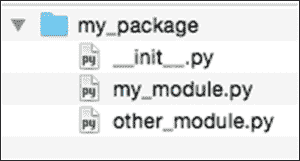
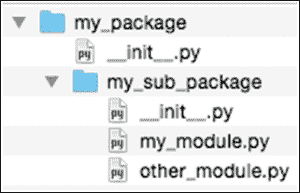
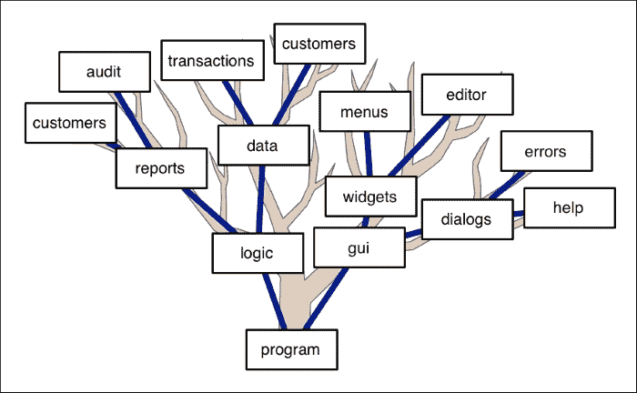
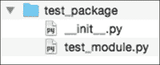
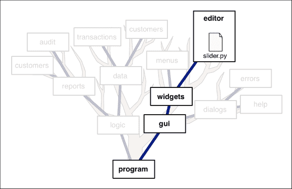
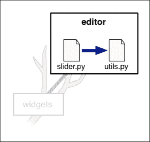
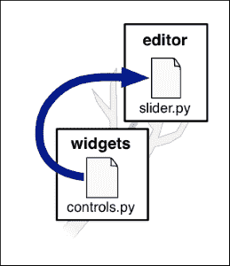
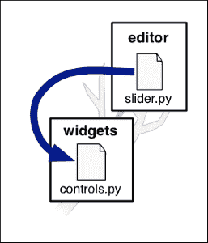
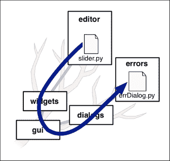

# 第三章：使用模块和包

要能够在 Python 程序中使用模块和包，您需要了解它们的工作原理。在本章中，我们将研究模块和包在 Python 中是如何定义和使用的。特别是，我们将：

+   回顾 Python 模块和包的定义

+   查看如何在其他包中创建包

+   发现模块和包如何初始化

+   了解更多关于导入过程

+   探索相对导入的概念

+   学习如何控制导入的内容

+   了解如何处理循环依赖

+   查看模块如何可以直接从命令行运行，以及为什么这很有用

# 模块和包

到目前为止，您应该已经相当熟悉如何将您的 Python 代码组织成模块，然后在其他模块和程序中导入和使用这些模块。然而，这只是一个小小的尝试。在深入了解它们如何工作之前，让我们简要回顾一下 Python 模块和包是什么。

正如我们所看到的，**模块**只是一个 Python 源文件。您可以使用`import`语句导入模块：

```py
import my_module
```

完成此操作后，您可以通过在项目名称前面添加模块名称来引用模块中的任何函数、类、变量和其他定义，例如：

```py
my_module.do_something()
print(my_module.variable)
```

在第一章中，*介绍模块化编程*，我们了解到 Python 的**包**是一个包含名为`__init__.py`的特殊文件的目录。这被称为**包初始化文件**，并将目录标识为 Python 包。该包通常还包含一个或多个 Python 模块，例如：



要导入此包中的模块，您需要在模块名称的开头添加包名称。例如：

```py
import my_package.my_module
my_package.my_module.do_something()
```

您还可以使用`import`语句的另一种版本来使您的代码更易于阅读：

```py
from my_package import my_module
my_module.do_something()
```

### 注意

我们将在本章后面的*如何导入任何内容*部分中查看您可以使用`import`语句的各种方式。

# 包含包的包

就像您可以在目录中有子目录一样，您也可以在其他包中有包。例如，想象一下，我们的`my_package`目录包含另一个名为`my_sub_package`的目录，它本身有一个`__init__.py`文件：



正如您所期望的那样，您可以通过在包含它的包的名称前面添加来导入子包中的模块：

```py
from my_package.my_sub_package import my_module
my_module.do_something()
```

您可以无限嵌套包，但实际上，如果包含太多级别的包中包，它会变得有些难以管理。更有趣的是，各种包和子包形成了一个**树状结构**，这使您可以组织甚至最复杂的程序。例如，一个复杂的商业系统可能会被安排成这样：



正如您所看到的，这被称为树状结构，因为包中的包看起来像树的扩展分支。这样的树状结构使您可以将程序的逻辑相关部分组合在一起，同时确保在需要时可以找到所有内容。例如，使用前面插图描述的结构，您将使用`program.logic.data.customers`包访问客户数据，并且程序中的各种菜单将由`program.gui.widgets.menus`包定义。

显然，这是一个极端的例子。大多数程序——甚至非常复杂的程序——都不会这么复杂。但是您可以看到 Python 包如何使您能够保持程序的良好组织，无论它变得多么庞大和复杂。

# 初始化模块

当一个模块被导入时，该模块中的任何顶层代码都会被执行。这会使你在模块中定义的各种函数、变量和类对调用者可用。为了看看这是如何工作的，创建一个名为`test_module.py`的新 Python 源文件，并输入以下代码到这个模块中：

```py
def foo():
    print("in foo")

def bar():
    print("in bar")

my_var = 0

print("importing test module")
```

现在，打开一个终端窗口，`cd`到存储`test_module.py`文件的目录，并输入`python`启动 Python 解释器。然后尝试输入以下内容：

```py
% import test_module
```

当你这样做时，Python 解释器会打印以下消息：

```py
importing test module
```

这是因为模块中的所有顶层 Python 语句——包括`def`语句和我们的`print`语句——在模块被导入时都会被执行。然后你可以通过在名称前加上`my_module`来调用`foo`和`bar`函数，并访问`my_var`全局变量：

```py
% my_module.foo()
in foo
% my_module.bar()
in bar
% print(my_module.my_var)
0
% my_module.my_var = 1
% print(my_module.my_var)
1
```

因为模块被导入时会执行所有顶层的 Python 语句，所以你可以通过直接在模块中包含初始化语句来初始化一个模块，就像我们测试模块中设置`my_var`为零的语句一样。这意味着当模块被导入时，模块将自动初始化。

### 注意

请注意，一个模块只会被导入一次。如果两个模块导入了同一个模块，第二个`import`语句将简单地返回对已经导入的模块的引用，因此你不会导入（和初始化）两次相同的模块。

## 初始化函数

这种隐式初始化是有效的，但不一定是一个好的实践。Python 语言设计者提倡的指导方针之一是*显式优于隐式*。换句话说，让一个模块自动初始化并不总是一个好的编码实践，因为从代码中并不总是清楚哪些内容被初始化了，哪些没有。

为了避免这种混乱，并且为了遵循 Python 的指导方针，明确地初始化你的模块通常是一个好主意。按照惯例，这是通过定义一个名为`init()`的顶层函数来完成模块的所有初始化。例如，在我们的`test_module`中，我们可以用以下代码替换`my_var = 0`语句：

```py
def init():
    global my_var
    my_var = 0
```

这会显得有点啰嗦，但它使初始化变得明确。当然，你还必须记得在使用模块之前调用`test_module.init()`，通常是在主程序中调用。

显式模块初始化的主要优势之一是你可以控制各个模块初始化的顺序。例如，如果模块 A 的初始化包括调用模块 B 中的函数，并且这个函数需要模块 B 已经被初始化，如果两个模块的导入顺序错误，程序将崩溃。当模块导入其他模块时，情况会变得特别困难，因为模块导入的顺序可能会非常令人困惑。为了避免这种情况，最好使用显式模块初始化，并让你的主程序在调用`A.init()`之前调用`B.init()`。这是一个很好的例子，说明为什么通常最好为你的模块使用显式初始化函数。

# 初始化一个包

要初始化一个包，你需要将 Python 代码放在包的`__init__.py`文件中。这段代码将在包被导入时执行。例如，假设你有一个名为`test_package`的包，其中包含一个`__init__.py`文件和一个名为`test_module.py`的模块：



你可以在`__init__.py`文件中放置任何你喜欢的代码，当包（或包内的模块）第一次被导入时，该代码将被执行。

你可能想知道为什么要这样做。初始化一个模块是有道理的，因为一个模块包含了可能需要在使用之前初始化的各种函数（例如，通过将全局变量设置为初始值）。但为什么要初始化一个包，而不仅仅是包内的一个模块？

答案在于当你导入一个包时发生了什么。当你这样做时，你在包的`__init__.py`文件中定义的任何东西都可以在包级别使用。例如，想象一下，你的`__init__.py`文件包含了以下 Python 代码：

```py
def say_hello():
    print("hello")
```

然后你可以通过以下方式从主程序中访问这个函数：

```py
import my_package
my_package.say_hello()
```

你不需要在包内的模块中定义`say_hello()`函数，它就可以很容易地被访问。

作为一个一般原则，向`__init__.py`文件添加代码并不是一个好主意。它可以工作，但是查看包源代码的人会期望包的代码被定义在模块内，而不是在包初始化文件中。另外，整个包只有一个`__init__.py`文件，这使得在包内组织代码变得更加困难。

更好的使用包初始化文件的方法是在包内的模块中编写代码，然后使用`__init__.py`文件导入这些代码，以便在包级别使用。例如，你可以在`test_module`模块中实现`say_hello()`函数，然后在包的`__init__.py`文件中包含以下内容：

```py
from test_package.test_module import say_hello
```

使用你的包的程序仍然可以以完全相同的方式调用`say_hello()`函数。唯一的区别是，这个函数现在作为`test_module`模块的一部分实现，而不是被整个包的`__init__.py`文件包含在一起。

这是一个非常有用的技术，特别是当你的包变得更加复杂，你有很多函数、类和其他定义想要提供。通过向包初始化文件添加`import`语句，你可以在任何模块中编写包的部分，然后选择哪些函数、类等在包级别可用。

使用`__init__.py`文件的一个好处是，各种`import`语句告诉包的用户他们应该使用哪些函数和类；如果你没有在包初始化文件中包含一个模块或函数，那么它可能被排除是有原因的。

在包初始化文件中使用`import`语句还告诉包的用户复杂包的各个部分的位置——`__init__.py`文件充当了包源代码的一种索引。

总之，虽然你可以在包的`__init__.py`文件中包含任何你喜欢的 Python 代码，但最好限制自己只使用`import`语句，并将真正的包代码放在其他地方。

# 如何导入任何东西

到目前为止，我们已经使用了`import`语句的两种不同版本：

+   导入一个模块，然后使用模块名来访问在该模块中定义的东西。例如：

```py
import math
print(math.pi)
```

+   从模块中导入某些东西，然后直接使用那个东西。例如：

```py
from math import pi
print(pi)
```

然而，`import`语句非常强大，我们可以用它做各种有趣的事情。在本节中，我们将看看你可以使用`import`语句以及它们的内容将模块和包导入到你的程序中的不同方式。

## 导入语句实际上是做什么？

每当你创建一个全局变量或函数时，Python 解释器都会将该变量或函数的名称添加到所谓的**全局命名空间**中。全局命名空间包含了你在全局级别定义的所有名称。要查看这是如何工作的，输入以下命令到 Python 解释器中：

```py
>>> print(globals())

```

`globals()`内置函数返回一个带有全局命名空间当前内容的字典：

```py
{'__package__': None, '__doc__': None, '__name__': '__main__', '__builtins__': <module 'builtins' (built-in)>, '__loader__': <class '_frozen_importlib.BuiltinImporter'>}

```

### 提示

不要担心各种奇怪命名的全局变量，例如`__package__`；这些是 Python 解释器内部使用的。

现在，让我们定义一个新的顶级函数：

```py
>>> def test():
...     print("Hello")
...
>>>

```

如果我们现在打印全局名称的字典，我们的`test()`函数将被包括在内：

```py
>>> print(globals())
{...'test': <function test at 0x1028225f0>...}

```

### 注意

`globals()`字典中还有其他几个条目，但从现在开始，我们只会显示我们感兴趣的项目，以便这些示例不会太令人困惑。

如您所见，名称`test`已添加到我们的全局命名空间中。

### 提示

再次，不要担心与`test`名称关联的值；这是 Python 存储您定义的函数的内部方式。

当某物在全局命名空间中时，您可以通过程序中的任何位置的名称访问它：

```py
>>> test()
Hello

```

### 注意

请注意，还有第二个命名空间，称为**局部命名空间**，其中保存了当前函数中定义的变量和其他内容。虽然局部命名空间在变量范围方面很重要，但我们将忽略它，因为它通常不涉及导入模块。

现在，当您使用`import`语句时，您正在向全局命名空间添加条目：

```py
>>> import string
>>> print(globals())
{...'string': <module 'string' from '/Library/Frameworks/Python.framework/Versions/3.3/lib/python3.3/string.py'>...}

```

正如您所看到的，您导入的模块已添加到全局命名空间中，允许您通过名称访问该模块，例如像这样：

```py
>>> print(string.capwords("this is a test"))
This Is A Test

```

同样，如果您使用`import`语句的`from...import`版本，您导入的项目将直接添加到全局命名空间中：

```py
>>> from string import capwords
>>> print(globals())
{...'capwords': <function capwords at 0x1020fb7a0>...}

```

现在您知道`import`语句的作用：它将您要导入的内容添加到全局命名空间，以便您可以访问它。

## 使用导入语句

既然我们已经看到了`import`语句的作用，让我们来看看 Python 提供的`import`语句的不同版本。

我们已经看到了`import`语句的两种最常见形式：

+   `import <something>`

+   `from <somewhere> import <something>`

使用第一种形式时，您不限于一次导入一个模块。如果愿意，您可以一次导入多个模块，就像这样：

```py
import string, math, datetime, random
```

同样，您可以一次从模块或包中导入多个项目：

```py
from math import pi, radians, sin
```

如果要导入的项目比一行所能容纳的要多，您可以使用行继续字符（`\`）将导入扩展到多行，或者用括号括起要导入的项目列表。例如：

```py
from math import pi, degrees, radians, sin, cos, \
                 tan, hypot, asin, acos, atan, atan2

from math import (pi, degrees, radians, sin, cos, 
                  tan, hypot, asin, acos, atan, atan2)
```

当您导入某物时，您还可以更改所导入项目的名称：

```py
import math as math_ops
```

在这种情况下，您正在将`math`模块导入为名称`math_ops`。`math`模块将使用名称`math_ops`添加到全局命名空间中，您可以使用`math_ops`名称访问`math`模块的内容：

```py
print(math_ops.pi)
```

有两个原因可能要使用`import...as`语句来更改导入时的名称：

1.  为了使长名称或难以处理的名称更容易输入。

1.  为了避免命名冲突。例如，如果您使用了两个都定义了名为`utils`的模块的包，您可能希望使用`import...as`语句，以便名称不同。例如：

```py
from package1 import utils as utils1
from package2 import utils as utils2
```

### 注意

请注意，您可能应该谨慎使用`import...as`语句。每次更改某物的名称时，您（以及任何阅读您代码的人）都必须记住`X`是`Y`的另一个名称，这增加了复杂性，并意味着您在编写程序时需要记住更多的事情。`import...as`语句当然有合法的用途，但不要过度使用它。

当然，您可以将`from...import`语句与`import...as`结合使用：

```py
from reports import customers as customer_report
from database import customers as customer_data
```

最后，您可以使用**通配符导入**一次性从模块或包中导入所有内容：

```py
from math import *
```

这将所有在`math`模块中定义的项目添加到当前全局命名空间。如果您从包中导入，则将导入包的`__init__.py`文件中定义的所有项目。

默认情况下，模块（或包）中以下划线字符开头的所有内容都将被通配符导入。这确保了私有变量和函数不会被导入。然而，如果你愿意，你可以通过使用`__all__`变量来改变通配符导入中包含的内容；这将在本章后面的*控制导入内容*部分中讨论。

## 相对导入

到目前为止，每当我们导入东西时，我们都使用了要从中导入的模块或包的完整名称。对于简单的导入，比如`from math import pi`，这是足够的。然而，有时这种类型的导入可能会相当繁琐。

例如，考虑我们在本章前面的*包内包*部分中看到的复杂包树。假设我们想要从`program.gui.widgets.editor`包内导入名为`slider.py`的模块：



你可以使用以下 Python 语句导入这个模块：

```py
from program.gui.widgets.editor import slider
```

`import`语句中的`program.gui.widgets.editor`部分标识了`slider`模块所在的包。

虽然这样可以工作，但它可能会相当笨拙，特别是如果你需要导入许多模块，或者如果包的某个部分需要从同一个包内导入多个其他模块。

为了处理这种情况，Python 支持**相对导入**的概念。使用相对导入，你可以确定相对于包树中当前模块位置的位置导入你想要的内容。例如，假设`slider`模块想要从`program.gui.widgets.editor`包内导入另一个模块：



为此，你用`.`字符替换包名：

```py
from . import slider
```

`.`字符是*当前包*的简写。

类似地，假设你有一个在`program.gui.widgets`包内的模块想要从`editor`子包内导入`slider`模块：



在这种情况下，你的`import`语句将如下所示：

```py
from .editor import slider
```

`.`字符仍然指的是当前位置，`editor`是相对于当前位置的包的名称。换句话说，你告诉 Python 在当前位置查找名为`editor`的包，然后导入该包内的名为`slider`的模块。

让我们考虑相反的情况。假设`slider`模块想要从`widgets`目录中导入一个模块：



在这种情况下，你可以使用两个`.`字符来表示*向上移动一个级别*：

```py
from .. import controls
```

正如你所想象的那样，你可以使用三个`.`字符来表示*向上移动两个级别*，依此类推。你也可以结合这些技术以任何你喜欢的方式在包层次结构中移动。例如，假设`slider`模块想要从`gui.dialogs.errors`包内导入名为`errDialog`的模块：



使用相对导入，`slider`模块可以以以下方式导入`errDialog`模块：

```py
from ...dialogs.errors import errDialog
```

如你所见，你可以使用这些技术来选择树状包结构中任何位置的模块或包。

使用相对导入有两个主要原因：

1.  它们是使你的`import`语句更短、更易读的好方法。在`slider`模块中，你不必再输入`from` `program.gui.widgets.editor import utils`，而是可以简单地输入`from . import utils`。

1.  当你为他人编写一个包时，你可以让包内的不同模块相互引用，而不必担心用户安装包的位置。例如，我可能会拿到你写的一个包并将其放入另一个包中；使用相对导入，你的包将继续工作，而无需更改所有`import`语句以反映新的包结构。

就像任何东西一样，相对导入可能会被滥用。因为`import`语句的含义取决于当前模块的位置，相对导入往往违反了“显式优于隐式”的原则。如果你尝试从命令行运行一个模块，也会遇到麻烦，这在本章后面的“从命令行运行模块”部分有描述。因此，除非有充分的理由，你应该谨慎使用相对导入，并坚持在`import`语句中完整列出整个包层次结构。

# 控制导入的内容

当你导入一个模块或包，或者使用通配符导入，比如`from my_module import *`，Python 解释器会将给定模块或包的内容加载到你的全局命名空间中。如果你从一个模块导入，所有顶层函数、常量、类和其他定义都会被导入。当从一个包导入时，包的`__init__.py`文件中定义的所有顶层函数、常量等都会被导入。

默认情况下，这些导入会从给定的模块或包中加载*所有*内容。唯一的例外是通配符导入会自动跳过任何以下划线开头的函数、常量、类或其他定义——这会导致通配符导入排除私有定义。

虽然这种默认行为通常运行良好，但有时你可能希望更多地控制导入的内容。为此，你可以使用一个名为`__all__`的特殊变量。

为了看看`__all__`变量是如何工作的，让我们看一下以下模块：

```py
A = 1
B = 2
C = 3
__all__ = ["A", "B"]
```

如果你导入这个模块，只有`A`和`B`会被导入。虽然模块定义了变量`C`，但这个定义会被跳过，因为它没有包含在`__all__`列表中。

在一个包内，`__all__`变量的行为方式相同，但有一个重要的区别：你还可以包括你希望在导入包时包含的模块和子包的名称。例如，一个包的`__init__.py`文件可能只包含以下内容：

```py
__all__ = ["module_1", "module_2", "sub_package"]
```

在这种情况下，`__all__`变量控制要包含的模块和包；当你导入这个包时，这两个模块和子包将被自动导入。

### 注意

注意，前面的`__init.py__`文件等同于以下内容：

```py
import module1
import module2
import sub_package
```

`__init__.py`文件的两个版本都会导致包中包含这两个模块和子包。

虽然你不一定需要使用它，`__all__`变量可以完全控制你的导入。`__all__`变量也可以是向模块和包的用户指示他们应该使用你代码的哪些部分的有用方式：如果某些东西没有包含在`__all__`列表中，那么它就不打算被外部代码使用。

# 循环依赖

在使用模块时，你可能会遇到的一个令人讨厌的问题是所谓的循环依赖。要理解这些是什么，考虑以下两个模块：

```py
# module_1.py

from module_2 import calc_markup

def calc_total(items):
    total = 0
    for item in items:
        total = total + item['price']
    total = total + calc_markup(total)
    return total

# module_2.py

from module_1 import calc_total

def calc_markup(total):
    return total * 0.1

def make_sale(items):
    total_price = calc_total(items)
    ...
```

虽然这是一个假设的例子，你可以看到`module_1`从`module_2`导入了一些东西，而`module_2`又从`module_1`导入了一些东西。如果你尝试运行包含这两个模块的程序，当导入`module_1`时，你会看到以下错误：

```py
ImportError: cannot import name calc_total

```

如果你尝试导入`module_2`，你会得到类似的错误。以这种方式组织代码，你就陷入了困境：你无法导入任何一个模块，因为它们都相互依赖。

为了解决这个问题，你需要重新构建你的模块，使它们不再相互依赖。在这个例子中，你可以创建一个名为`module_3`的第三个模块，并将`calc_markup()`函数移动到该模块中。这将使`module_1`依赖于`module_3`，而不是`module_2`，从而打破了循环依赖。

### 提示

还有其他一些技巧可以避免循环依赖错误，例如将`import`语句放在一个函数内部。然而，一般来说，循环依赖意味着你的代码设计有问题，你应该重构你的代码以完全消除循环依赖。

# 从命令行运行模块

在第二章*编写你的第一个模块化程序*中，我们看到你系统的主程序通常被命名为`main.py`，并且通常具有以下结构：

```py
def main():
    ...

if __name__ == "__main__":
    main()
```

当用户运行你的程序时，Python 解释器会将`__name__`全局变量设置为值`"__main__"`。这会在程序运行时调用你的`main()`函数。

`main.py`程序并没有什么特别之处；它只是另一个 Python 源文件。你可以利用这一点，使你的 Python 模块能够从命令行运行。

例如，考虑以下模块，我们将其称为`double.py`：

```py
def double(n):
    return n * 2

if __name__ == "__main__":
    print("double(3) =", double(3))
```

这个模块定义了一些功能，比如一个名为`double()`的函数，然后使用`if __name__ == "__main__"`的技巧来演示和测试模块在从命令行运行时的功能。让我们尝试运行这个模块，看看它是如何工作的：

```py
% python double.py** 
double(3) = 6

```

可运行模块的另一个常见用途是允许最终用户直接从命令行访问模块的功能。要了解这是如何工作的，创建一个名为`funkycase.py`的新模块，并输入以下内容到这个文件中：

```py
def funky_case(s):
    letters = []
    capitalize = False
    for letter in s:
        if capitalize:
            letters.append(letter.upper())
        else:
            letters.append(letter.lower())
        capitalize = not capitalize
    return "".join(letters)
```

`funky_case()` 函数接受一个字符串，并将每第二个字母大写。如果你愿意，你可以导入这个模块，然后在你的程序中访问这个函数：

```py
from funkycase import funky_case
s = funky_case("Test String")
```

虽然这很有用，但我们也希望让用户直接运行`funkycase.py`模块作为一个独立的程序，直接将提供的字符串转换为 funky-case 并打印出来给用户看。为了做到这一点，我们可以使用`if __name__ == "__main__"`的技巧以及`sys.argv`来提取用户提供的字符串。然后我们可以调用`funky_case()`函数来将这个字符串转换为 funky-case 并打印出来。为此，将以下代码添加到你的`funkycase.py`模块的末尾：

```py
if __name__ == "__main__":
    if len(sys.argv) != 2:
        print("You must supply exactly one string!")
    else:
        s = sys.argv[1]
        print(funky_case(s))
```

另外，将以下内容添加到你的模块顶部：

```py
import sys
```

现在你可以直接运行这个模块，就像它是一个独立的程序一样：

```py
% python funkycase.py "The quick brown fox"
tHe qUiCk bRoWn fOx

```

通过这种方式，`funkycase.py` 充当了一种*变色龙模块*。对于其他的 Python 源文件，它看起来就像是可以导入和使用的另一个模块，而对于最终用户来说，它看起来像是一个可以从命令行运行的独立程序。

### 提示

请注意，如果你想让一个模块能够从命令行运行，你不仅仅可以使用`sys.argv`来接受和处理用户提供的参数。Python 标准库中的优秀`argparse`模块允许你编写接受用户各种输入和选项的 Python 程序（和模块）。如果你以前没有使用过这个模块，一定要试试。

当你创建一个可以从命令行运行的模块时，有一个需要注意的问题：如果你的模块使用相对导入，当你直接使用 Python 解释器运行时，你的导入将会失败，并出现*尝试相对导入非包*的错误。这个错误是因为当模块从命令行运行时，它会忘记它在包层次结构中的位置。只要你的模块不使用任何命令行参数，你可以通过使用 Python 的`-m`命令行选项来解决这个问题，就像这样：

```py
python -m my_module.py

```

然而，如果您的模块确实接受命令行参数，那么您将需要替换相对导入，以避免出现这个问题。虽然有解决方法，但它们很笨拙，不建议一般使用。

# 总结

在本章中，我们深入了解了 Python 模块和包的工作原理。我们看到模块只是使用`import`语句导入的 Python 源文件，而包是由名为`__init__.py`的包初始化文件标识的 Python 源文件目录。我们了解到包可以定义在其他包内，形成嵌套包的树状结构。我们看了模块和包如何初始化，以及`import`语句如何以各种方式导入模块和包及其内容到您的程序中。

然后，我们看到了相对导入如何用于相对于包层次结构中的当前位置导入模块，以及`__all__`变量如何用于控制导入的内容。

然后，我们了解了循环依赖以及如何避免它们，最后学习了变色龙模块，它可以作为可导入的模块，也可以作为可以从命令行运行的独立程序。

在下一章中，我们将应用所学知识来设计和实现一个更复杂的程序，我们将看到对这些技术的深入理解将使我们能够构建一个健壮的系统，并能够根据不断变化的需求进行更新。
