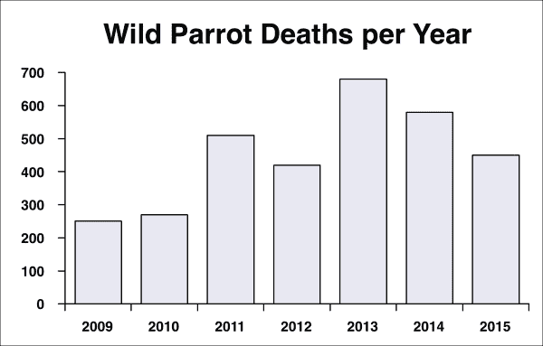
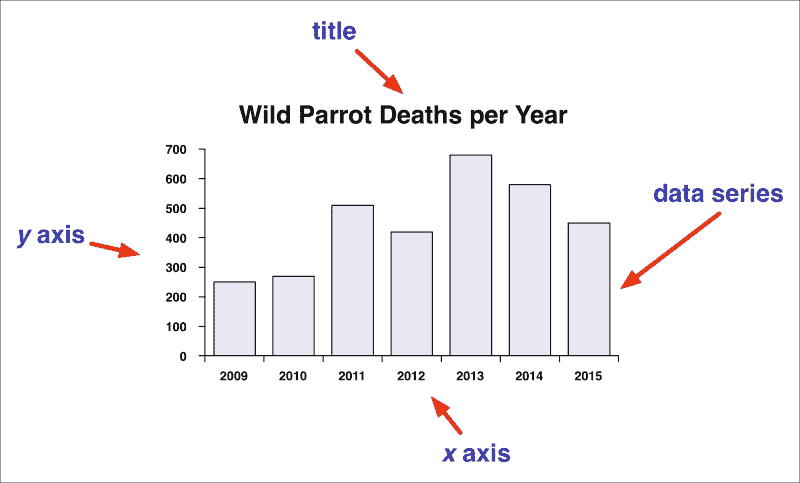
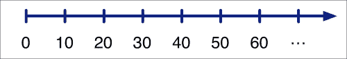
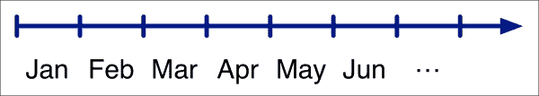
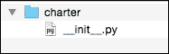
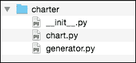
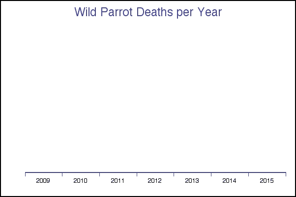
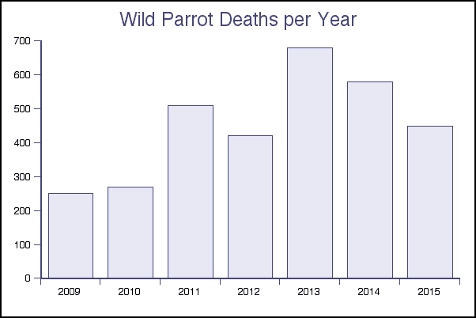
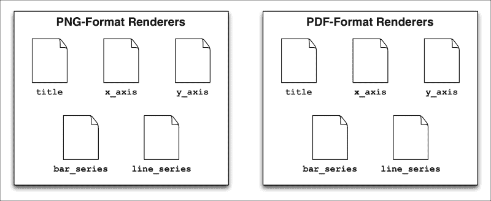
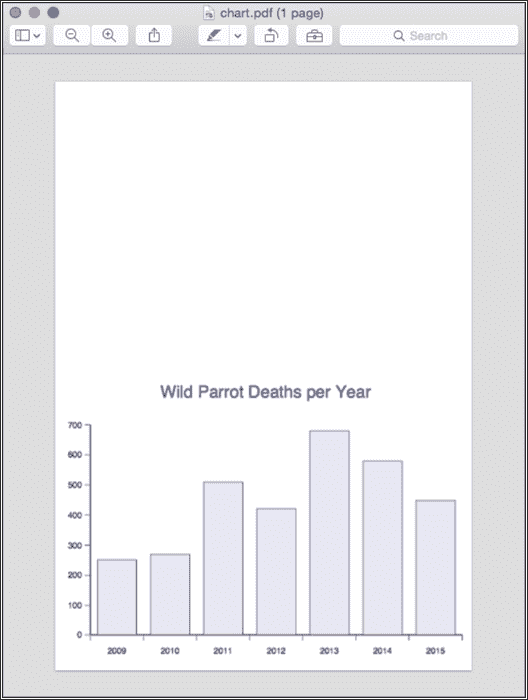

# 第四章：使用模块进行现实世界编程

在本章中，我们将使用模块化编程技术来实现一个有用的现实世界系统。特别是，我们将：

+   设计和实现一个用于生成图表的 Python 包

+   看看不断变化的需求如何成为成功系统的崩溃

+   发现模块化编程技术如何帮助您以最佳方式处理不断变化的需求

+   了解不断变化的需求可能是好事，因为它们给您重新思考程序的机会，从而产生更健壮和设计良好的代码

让我们首先看一下我们将要实现的 Python 图表生成包，我们将其称为**Charter**。

# 介绍 Charter

Charter 将是一个用于生成图表的 Python 库。开发人员将能够使用 Charter 将原始数字转换为漂亮的折线图和条形图，然后将其保存为图像文件。以下是 Charter 库将能够生成的图表类型的示例：



Charter 库将支持折线图和条形图。虽然我们将通过仅支持两种类型的图表来保持 Charter 相对简单，但该包将被设计为您可以轻松添加更多的图表类型和其他图表选项。

# 设计 Charter

当您查看前一节中显示的图表时，您可以识别出所有类型的图表中使用的一些标准元素。这些元素包括标题、*x*轴和*y*轴，以及一个或多个数据系列：



要使用 Charter 包，程序员将创建一个新图表并设置标题、*x*轴和*y*轴，以及要显示的数据系列。然后程序员将要求 Charter 生成图表，并将结果保存为磁盘上的图像文件。通过以这种方式组合和配置各种元素，程序员可以创建任何他们希望生成的图表。

### 注

更复杂的图表库将允许添加其他元素，例如右侧的*y*轴、轴标签、图例和多个重叠的数据系列。但是，对于 Charter，我们希望保持代码简单，因此我们将忽略这些更复杂的元素。

让我们更仔细地看看程序员如何与 Charter 库进行交互，然后开始思考如何实现它。

我们希望程序员能够通过导入`charter`包并调用各种函数来与 Charter 进行交互。例如：

```py
import charter
chart = charter.new_chart()
```

要为图表设置标题，程序员将调用`set_title()`函数：

```py
charter.set_title(chart, "Wild Parrot Deaths per Year")
```

### 提示

请注意，我们的 Charter 库不使用面向对象的编程技术。使用面向对象的技术，图表标题将使用类似`chart.set_title("每年野生鹦鹉死亡数量")`的语句进行设置。但是，面向对象的技术超出了本书的范围，因此我们将为 Charter 库使用更简单的过程式编程风格。

要为图表设置*x*和*y*轴，程序员必须提供足够的信息，以便 Charter 可以生成图表并显示这些轴。为了了解这可能是如何工作的，让我们想一想轴是什么样子。

对于某些图表，轴可能代表一系列数值：



在这种情况下，通过计算数据点沿轴的位置来显示数据点。例如，具有*x = 35*的数据点将显示在该轴上**30**和**40**点之间的中间位置。

我们将把这种类型的轴称为**连续轴**。请注意，对于这种类型的轴，标签位于刻度线下方。将其与以下轴进行比较，该轴被分成多个离散的“桶”：



在这种情况下，每个数据点对应一个单独的桶，标签将出现在刻度标记之间的空间中。这种类型的轴将被称为**离散轴**。

注意，对于连续轴，标签显示在刻度标记上，而对于离散轴，标签显示在刻度标记之间。此外，离散轴的值可以是任何值（在本例中是月份名称），而连续轴的值必须是数字。

对于 Charter 库，我们将使 *x* 轴成为离散轴，而 *y* 轴将是连续的。理论上，你可以为 *x* 和 *y* 轴使用任何类型的轴，但我们保持这样做是为了使库更容易实现。

知道这一点，我们现在可以看一下在创建图表时如何定义各种轴。

为了定义 x 轴，程序员将调用 `set_x_axis()` 函数，并提供用于离散轴中每个桶的标签列表：

```py
charter.set_x_axis(chart,
                   ["2009", "2010", "2011", "2012", "2013",
                    "2014", "2015"])
```

列表中的每个条目对应轴中的一个桶。

对于 *y* 轴，我们需要定义将显示的值的范围以及这些值将如何标记。为此，我们需要向 `set_y_axis()` 函数提供最小值、最大值和标签值：

```py
charter.set_y_axis(chart, minimum=0, maximum=700,
                   labels=[0, 100, 200, 300, 400, 500, 600, 700])
```

### 注意

为了保持简单，我们将假设 *y* 轴使用线性刻度。我们可能会支持其他类型的刻度，例如实现对数轴，但我们将忽略这一点，因为这会使 Charter 库变得更加复杂。

现在我们知道了轴将如何定义，我们可以看一下数据系列将如何指定。首先，我们需要程序员告诉 Charter 要显示什么类型的数据系列：

```py
charter.set_series_type(chart, "bar")
```

正如前面提到的，我们将支持线图和条形图。

然后程序员需要指定数据系列的内容。由于我们的 *x* 轴是离散的，而 *y* 轴是连续的，我们可以将数据系列定义为一个 *y* 轴值的列表，每个离散的 *x* 轴值对应一个 *y* 轴值：

```py
charter.set_series(chart, [250, 270, 510, 420, 680, 580, 450])
```

这完成了图表的定义。一旦定义好了，程序员就可以要求 Charter 库生成图表：

```py
charter.generate_chart(chart, "chart.png")
```

将所有这些放在一起，这是一个完整的程序，可以生成本章开头显示的条形图：

```py
import charter
chart = charter.new_chart()
charter.set_title(chart, "Wild Parrot Deaths per Year")
charter.set_x_axis(chart,
                   ["2009", "2010", "2011", "2012", "2013",
                    "2014", "2015"])
charter.set_y_axis(chart, minimum=0, maximum=700,
                   labels=[0, 100, 200, 300, 400, 500, 600, 700])
charter.set_series(chart, [250, 270, 510, 420, 680, 580, 450])
charter.set_series_type(chart, "bar")
charter.generate_chart(chart, "chart.png")
```

因为 Charter 是一个供程序员使用的库，这段代码为 Charter 库的 API 提供了一个相当完整的规范。从这个示例程序中很清楚地可以看出应该发生什么。现在让我们看看如何实现这一点。

# 实施图表

我们知道 Charter 库的公共接口将由许多在包级别访问的函数组成，例如 `charter.new_chart()`。然而，使用上一章介绍的技术，我们知道我们不必在包初始化文件中定义库的 API，以使这些函数在包级别可用。相反，我们可以在其他地方定义这些函数，并将它们导入到 `__init__.py` 文件中，以便其他人可以使用它们。

让我们从创建一个目录开始，用来保存我们的 `charter` 包。创建一个名为 `charter` 的新目录，在其中创建一个空的包初始化文件 `__init__.py`。这为我们提供了编写库的基本框架：



根据我们的设计，我们知道生成图表的过程将涉及以下三个步骤：

1.  通过调用 `new_chart()` 函数创建一个新的图表。

1.  通过调用各种 `set_XXX()` 函数来定义图表的内容和外观。

1.  通过调用 `generate_chart()` 函数生成图表并将其保存为图像文件。

为了保持我们的代码组织良好，我们将分开生成图表的过程和创建和定义图表的过程。为此，我们将有一个名为`chart`的模块，负责图表的创建和定义，以及一个名为`generator`的单独模块，负责图表的生成。

继续创建这两个新的空模块，将它们放在`charter`包中：



现在我们已经为我们的包建立了一个整体结构，让我们为我们知道我们将不得不实现的各种函数创建一些占位符。编辑`chart.py`模块，并在该文件中输入以下内容：

```py
def new_chart():
    pass

def set_title(chart, title):
    pass

def set_x_axis(chart, x_axis):
    pass

def set_y_axis(chart, minimum, maximum, labels):
    pass

def set_series_type(chart, series_type):
    pass

def set_series(chart, series):
    pass
```

同样，编辑`generator.py`模块，并在其中输入以下内容：

```py
def generate_chart(chart, filename):
    pass
```

这些是我们知道我们需要为 Charter 库实现的所有函数。但是，它们还没有放在正确的位置上——我们希望用户能够调用`charter.new_chart()`，而不是`charter.chart.new_chart()`。为了解决这个问题，编辑`__init__.py`文件，并在该文件中输入以下内容：

```py
from .chart     import *
from .generator import *
```

正如你所看到的，我们正在使用相对导入将所有这些模块中的函数加载到主`charter`包的命名空间中。

我们的 Charter 库开始成形了！现在让我们依次处理这两个模块。

## 实现 chart.py 模块

由于我们在 Charter 库的实现中避免使用面向对象的编程技术，我们不能使用对象来存储有关图表的信息。相反，`new_chart()`函数将返回一个图表值，各种`set_XXX()`函数将获取该图表并向其添加信息。

存储图表信息的最简单方法是使用 Python 字典。这使得我们的`new_chart()`函数的实现非常简单；编辑`chart.py`模块，并用以下内容替换`new_chart()`的占位符：

```py
def new_chart():
    return {}
```

一旦我们有一个将保存图表数据的字典，就很容易将我们想要的各种值存储到这个字典中。例如，编辑`set_title()`函数的定义，使其如下所示：

```py
def set_title(chart, title):
    chart['title'] = title
```

以类似的方式，我们可以实现`set_XXX()`函数的其余部分：

```py
def set_x_axis(chart, x_axis):
    chart['x_axis'] = x_axis

def set_y_axis(chart, minimum, maximum, labels):
    chart['y_min']    = minimum
    chart['y_max']    = maximum
    chart['y_labels'] = labels

def set_series_type(chart, series_type):
    chart['series_type'] = series_type

def set_series(chart, series):
    chart['series'] = series
```

这完成了我们的`chart.py`模块的实现。

## 实现 generator.py 模块

不幸的是，实现`generate_chart()`函数将更加困难，这就是为什么我们将这个函数移到了一个单独的模块中。生成图表的过程将涉及以下步骤：

1.  创建一个空图像来保存生成的图表。

1.  绘制图表的标题。

1.  绘制*x*轴。

1.  绘制*y*轴。

1.  绘制数据系列。

1.  将生成的图像文件保存到磁盘上。

因为生成图表的过程需要我们使用图像，所以我们需要找到一个允许我们生成图像文件的库。现在让我们来获取一个。

### Pillow 库

**Python Imaging Library**（**PIL**）是一个古老的用于生成图像的库。不幸的是，PIL 不再得到积极的开发。然而，有一个名为**Pillow**的更新版本的 PIL，它继续得到支持，并允许我们创建和保存图像文件。

Pillow 库的主要网站可以在[`python-pillow.org/`](http://python-pillow.org/)找到，文档可以在[`pillow.readthedocs.org/`](http://pillow.readthedocs.org/)找到。

让我们继续安装 Pillow。最简单的方法是使用`pip install pillow`，尽管安装指南([`pillow.readthedocs.org/en/3.0.x/installation.html`](http://pillow.readthedocs.org/en/3.0.x/installation.html))为您提供了各种选项，如果这种方法对您不起作用。

通过查看 Pillow 文档，我们发现可以使用以下代码创建一个空图像：

```py
from PIL import Image
image = Image.new("RGB", (CHART_WIDTH, CHART_HEIGHT), "#7f00ff")
```

这将创建一个新的 RGB（红色，绿色，蓝色）图像，宽度和高度由给定的颜色填充。

### 注意

`#7f00ff`是紫色的十六进制颜色代码。每对十六进制数字代表一个颜色值：`7f`代表红色，`00`代表绿色，`ff`代表蓝色。

为了绘制这个图像，我们将使用`ImageDraw`模块。例如：

```py
from PIL import ImageDraw
drawer = ImageDraw.Draw(image)
drawer.line(50, 50, 150, 200, fill="#ff8010", width=2)
```

图表绘制完成后，我们可以以以下方式将图像保存到磁盘上：

```py
image.save("image.png", format="png")
```

这个对 Pillow 库的简要介绍告诉我们如何实现我们之前描述的图表生成过程的第 1 步和第 6 步。它还告诉我们，对于第 2 到第 5 步，我们将使用`ImageDraw`模块来绘制各种图表元素。

### 渲染器

当我们绘制图表时，我们希望能够选择要绘制的元素。例如，我们可能根据用户想要显示的数据系列的类型在`"bar"`和`"line"`元素之间进行选择。一个非常简单的方法是将我们的绘图代码结构化如下：

```py
if chart['series_type'] == "bar":
    ...draw the data series using bars
elif chart['series_type'] == "line":
    ...draw the data series using lines
```

然而，这并不是很灵活，如果绘图逻辑变得复杂，或者我们向库中添加更多的图表选项，代码将很快变得难以阅读。为了使 Charter 库更加模块化，并支持今后的增强，我们将使用渲染器模块来实际进行绘制。

在计算机图形学中，**渲染器**是程序的一部分，用于绘制某些东西。其思想是你可以选择适当的渲染器，并要求它绘制你想要的元素，而不必担心该元素将如何被绘制的细节。

使用渲染器模块，我们的绘图逻辑看起来会像下面这样：

```py
from renderers import bar_series, line_series

if chart['series_type'] == "bar":
    bar_series.draw(chart, drawer)
elif chart['series_type'] == "line":
    line_series.draw(chart, drawer)
```

这意味着我们可以将每个元素的实际绘制细节留给渲染器模块本身，而不是在我们的`generate_chart()`函数中充斥着大量详细的绘制代码。

为了跟踪我们的渲染器模块，我们将创建一个名为`renderers`的子包，并将所有渲染器模块放在这个子包中。让我们现在创建这个子包。

在主`charter`目录中创建一个名为`renderers`的新目录，并在其中创建一个名为`__init__.py`的新文件，作为包初始化文件。这个文件可以为空，因为我们不需要做任何特殊的初始化来初始化这个子包。

我们将需要五个不同的渲染器模块来完成 Charter 库的工作：

+   `title.py`

+   `x_axis.py`

+   `y_axis.py`

+   `bar_series.py`

+   `line_series.py`

继续在`charter.renderers`目录中创建这五个文件，并在每个文件中输入以下占位文本：

```py
def draw(chart, drawer):
    pass
```

这给了我们渲染器模块的整体结构。现在让我们使用这些渲染器来实现我们的`generate_chart()`函数。

编辑`generate.py`模块，并用以下内容替换`generate_chart()`函数的占位符定义：

```py
def generate_chart(chart, filename):
    image  = Image.new("RGB", (CHART_WIDTH, CHART_HEIGHT),
                       "#ffffff")
    drawer = ImageDraw.Draw(image)

    title.draw(chart, drawer)
    x_axis.draw(chart, drawer)
    y_axis.draw(chart, drawer)
    if chart['series_type'] == "bar":
        bar_series.draw(chart, drawer)
    elif chart['series_type'] == "line":
        line_series.draw(chart, drawer)

    image.save(filename, format="png")
```

正如你所看到的，我们创建了一个`Image`对象来保存我们生成的图表，使用十六进制颜色代码`#ffffff`将其初始化为白色。然后我们使用`ImageDraw`模块来定义一个`drawer`对象来绘制图表，并调用各种渲染器模块来完成所有工作。最后，我们调用`image.save()`将图像文件保存到磁盘上。

为了使这个函数工作，我们需要在我们的`generator.py`模块的顶部添加一些`import`语句：

```py
from PIL import Image, ImageDraw
from .renderers import (title, x_axis, y_axis,
                        bar_series, line_series)
```

还有一件事我们还没有处理：当我们创建图像时，我们使用了两个常量，告诉 Pillow 要创建的图像的尺寸：

```py
    image = Image.new("RGB", (**CHART_WIDTH, CHART_HEIGHT**),
                       "#ffffff")
```

我们需要在某个地方定义这两个常量。

事实证明，我们需要定义更多的常量并在整个 Charter 库中使用它们。为此，我们将创建一个特殊的模块来保存我们的各种常量。

在顶层`charter`目录中创建一个名为`constants.py`的新文件。在这个模块中，添加以下值：

```py
CHART_WIDTH  = 600
CHART_HEIGHT = 400
```

然后，在你的`generator.py`模块中添加以下`import`语句：

```py
from .constants import *
```

### 测试代码

虽然我们还没有实现任何渲染器，但我们已经有足够的代码来开始测试。为此，创建一个名为`test_charter.py`的空文件，并将其放在包含`charter`包的目录中。然后，在此文件中输入以下内容：

```py
import charter
chart = charter.new_chart()
charter.set_title(chart, "Wild Parrot Deaths per Year")
charter.set_x_axis(chart,
                   ["2009", "2010", "2011", "2012", "2013",
                    "2014", "2015"])
charter.set_y_axis(chart, minimum=0, maximum=700,
                   labels=[0, 100, 200, 300, 400, 500, 600, 700])
charter.set_series(chart, [250, 270, 510, 420, 680, 580, 450])
charter.set_series_type(chart, "bar")
charter.generate_chart(chart, "chart.png")
```

这只是我们之前看到的示例代码的副本。这个脚本将允许您测试 Charter 库；打开一个终端或命令行窗口，`cd`到包含`test_charter.py`文件的目录，并输入以下内容：

```py
python test_charter.py

```

一切顺利的话，程序应该在没有任何错误的情况下完成。然后，您可以查看`chart.png`文件，这应该是一个填充有白色背景的空图像文件。

### 渲染标题

接下来，我们需要实现各种渲染器模块，从图表的标题开始。编辑`renderers/title.py`文件，并用以下内容替换`draw()`函数的占位符定义：

```py
def draw(chart, drawer):
    font = ImageFont.truetype("Helvetica", 24)
    text_width,text_height = font.getsize(chart['title'])

    left = CHART_WIDTH/2 - text_width/2
    top  = TITLE_HEIGHT/2 - text_height/2

    drawer.text((left, top), chart['title'], "#4040a0", font)
```

这个渲染器首先获取一个用于绘制标题的字体。然后计算标题文本的大小（以像素为单位）和用于标签的位置，以便它在图表上居中显示。请注意，我们使用一个名为`TITLE_HEIGHT`的常量来指定用于图表标题的空间量。

该函数的最后一行使用指定的位置和字体将标题绘制到图表上。字符串`#4040a0`是用于文本的十六进制颜色代码，这是一种深蓝色。

由于这个模块使用`ImageFont`模块加载字体，以及我们的`constants.py`模块中的一些常量，我们需要在我们的模块顶部添加以下`import`语句：

```py
from PIL import ImageFont
from ..constants import *
```

请注意，我们使用`..`从父包中导入`constants`模块。

最后，我们需要将`TITLE_HEIGHT`常量添加到我们的`constants.py`模块中：

```py
TITLE_HEIGHT = 50
```

如果现在运行您的`test_charter.py`脚本，您应该会看到生成的图像中出现图表的标题：


### 渲染 x 轴

如果您记得，* x *轴是一个离散轴，标签显示在每个刻度之间。为了绘制这个，我们将不得不计算轴上每个“桶”的宽度，然后绘制表示轴和刻度线的线，以及绘制每个“桶”的标签。

首先，编辑`renderers/x_axis.py`文件，并用以下内容替换您的占位符`draw()`函数：

```py
def draw(chart, drawer):
    font = ImageFont.truetype("Helvetica", 12)
    label_height = font.getsize("Test")[1]

    avail_width = CHART_WIDTH - Y_AXIS_WIDTH - MARGIN
    bucket_width = avail_width / len(chart['x_axis'])

    axis_top = CHART_HEIGHT - X_AXIS_HEIGHT
    drawer.line([(Y_AXIS_WIDTH, axis_top),
                 (CHART_WIDTH - MARGIN, axis_top)],
                "#4040a0", 2) # Draw main axis line.

    left = Y_AXIS_WIDTH
    for bucket_num in range(len(chart['x_axis'])):
        drawer.line([(left, axis_top),
                     (left, axis_top + TICKMARK_HEIGHT)],
                    "#4040a0", 1) # Draw tickmark.

        label_width = font.getsize(chart['x_axis'][bucket_num])[0]
        label_left = max(left,
                         left + bucket_width/2 - label_width/2)
        label_top  = axis_top + TICKMARK_HEIGHT + 4

        drawer.text((label_left, label_top),
                    chart['x_axis'][bucket_num], "#000000", font)

        left = left + bucket_width

    drawer.line([(left, axis_top),
                 (left, axis_top + TICKMARK_HEIGHT)],
                "#4040a0", 1) # Draw final tickmark.
```

您还需要在模块顶部添加以下`import`语句：

```py
from PIL import ImageFont
from ..constants import *
```

最后，您应该将以下定义添加到您的`constants.py`模块中：

```py
X_AXIS_HEIGHT   = 50
Y_AXIS_WIDTH    = 50
MARGIN          = 20
TICKMARK_HEIGHT = 8
```

这些定义了图表中固定元素的大小。

如果现在运行您的`test_charter.py`脚本，您应该会看到* x *轴显示在图表底部：



### 剩下的渲染器

正如您所看到的，生成的图像开始看起来更像图表了。由于这个包的目的是展示如何构建代码结构，而不是这些模块是如何实现的细节，让我们跳过并添加剩下的渲染器而不再讨论。

首先，编辑您的`renderers/y_axis.py`文件，使其如下所示：

```py
from PIL import ImageFont

from ..constants import *

def draw(chart, drawer):
    font = ImageFont.truetype("Helvetica", 12)
    label_height = font.getsize("Test")[1]

    axis_top    = TITLE_HEIGHT
    axis_bottom = CHART_HEIGHT - X_AXIS_HEIGHT
    axis_height = axis_bottom - axis_top

    drawer.line([(Y_AXIS_WIDTH, axis_top),
                 (Y_AXIS_WIDTH, axis_bottom)],
                "#4040a0", 2) # Draw main axis line.

    for y_value in chart['y_labels']:
        y = ((y_value - chart['y_min']) /
             (chart['y_max']-chart['y_min']))

        y_pos = axis_top + (axis_height - int(y * axis_height))

        drawer.line([(Y_AXIS_WIDTH - TICKMARK_HEIGHT, y_pos),
                     (Y_AXIS_WIDTH, y_pos)],
                    "#4040a0", 1) # Draw tickmark.

        label_width,label_height = font.getsize(str(y_value))
        label_left = Y_AXIS_WIDTH-TICKMARK_HEIGHT-label_width-4
        label_top = y_pos - label_height / 2

        drawer.text((label_left, label_top), str(y_value),
                    "#000000", font)
```

接下来，编辑`renderers/bar_series.py`，使其如下所示：

```py
from PIL import ImageFont
from ..constants import *

def draw(chart, drawer):
    avail_width  = CHART_WIDTH - Y_AXIS_WIDTH - MARGIN
    bucket_width = avail_width / len(chart['x_axis'])

    max_top      = TITLE_HEIGHT
    bottom       = CHART_HEIGHT - X_AXIS_HEIGHT
    avail_height = bottom - max_top

    left = Y_AXIS_WIDTH
    for y_value in chart['series']:

        bar_left = left + MARGIN / 2
        bar_right = left + bucket_width - MARGIN / 2

        y = ((y_value - chart['y_min']) /
             (chart['y_max'] - chart['y_min']))

        bar_top = max_top + (avail_height - int(y * avail_height))

        drawer.rectangle([(bar_left, bar_top),
                          (bar_right + 1,
                           bottom)],
                         fill="#e8e8f4", outline="#4040a0")

        left = left + bucket_width
```

最后，编辑`renderers.line_series.py`，使其如下所示：

```py
from PIL import ImageFont
from ..constants import *

def draw(chart, drawer):
    avail_width  = CHART_WIDTH - Y_AXIS_WIDTH - MARGIN
    bucket_width = avail_width / len(chart['x_axis'])

    max_top      = TITLE_HEIGHT
    bottom       = CHART_HEIGHT - X_AXIS_HEIGHT
    avail_height = bottom - max_top

    left   = Y_AXIS_WIDTH
    prev_y = None
    for y_value in chart['series']:
        y = ((y_value - chart['y_min']) /
             (chart['y_max'] - chart['y_min']))

        cur_y = max_top + (avail_height - int(y * avail_height))

        if prev_y != None:
            drawer.line([(left - bucket_width / 2, prev_y),
                         (left + bucket_width / 2), cur_y],
                        fill="#4040a0", width=1)
        prev_y = cur_y
        left = left + bucket_width
```

这完成了我们对 Charter 库的实现。

### 测试 Charter

如果运行`test_charter.py`脚本，您应该会看到一个完整的条形图：



显然，我们可以在 Charter 库中做更多的事情，但即使在当前状态下，它也运行良好。如果您愿意，您可以使用它为各种数据生成线条和条形图。对于我们的目的，我们可以声明 Charter 库已经完成，并开始将其作为我们生产系统的一部分使用。

# 变化的需求中的一块砂糖

当然，没有什么是真正完成的。假设你写了图书馆并且已经忙着扩展它好几个月，添加了更多的数据系列类型和大量的选项。该库正在公司的几个重大项目中使用，输出效果很棒，每个人似乎都对此很满意——直到有一天你的老板走进来说：“太模糊了。你能把模糊去掉吗？”

你问他是什么意思，他说他一直在一台高分辨率激光打印机上打印图表。结果对他来说还不够好，不能用在公司的报告中。他拿出一份打印件指着标题。仔细看，你明白了他的意思：


果然，文本是像素化的，即使线条在高分辨率打印时看起来也有点锯齿状。你尝试增加生成图表的大小，但仍然不够好——当你尝试将大小增加到公司高分辨率激光打印机的每英寸 1200 点时，你的程序崩溃了。

“但这个程序从来没有为此设计过，”你抱怨道。“我们编写它是为了在屏幕上显示图表。”

“我不在乎，”你的老板说。“我希望你生成矢量格式的输出。那样打印效果很好，一点都不模糊。”

### 注意

以防你以前没有遇到过，存储图像数据有两种根本不同的方式：位图图像，由像素组成；矢量图像，其中保存了单独的绘图指令（例如，“写一些文字”，“画一条线”，“填充一个矩形”等），然后每次显示图像时都会遵循这些指令。位图图像会出现像素化或“模糊”，而矢量图像即使放大或以高分辨率打印时看起来也很棒。

你进行了快速的谷歌搜索，并确认 Pillow 库无法保存矢量格式的图像；它只能处理位图数据。你的老板并不同情，“只需使其以矢量格式工作，同时保存为 PDF 和 PNG，以满足那些已经在使用它的人。”

心情沉重，你想知道自己怎么可能满足这些新的要求。整个 Charter 库都是从头开始构建的，用于生成位图 PNG 图像。难道你不得不从头开始重写整个东西吗？

# 重新设计图书馆

由于图书馆现在需要将图表保存为矢量格式的 PDF 文件，我们需要找到一个替代 Python Imaging Library 的支持写入 PDF 文件的库。其中一个明显的选择是**ReportLab**。

ReportLab 是一个商业 PDF 生成器，也以开源许可发布。你可以在[`www.reportlab.com/opensource/`](http://www.reportlab.com/opensource/)找到有关 ReportLab 工具包的更多信息。安装 ReportLab 的最简单方法是使用`pip install reportlab`。如果这对你不起作用，请查看[`bitbucket.org/rptlab/reportlab`](https://bitbucket.org/rptlab/reportlab)上的安装说明以获取更多详细信息。ReportLab 工具包的文档可以在[`www.reportlab.com/docs/reportlab-userguide.pdf`](http://www.reportlab.com/docs/reportlab-userguide.pdf)找到。

在许多方面，ReportLab 的工作方式与 Python Imaging Library 相同：你初始化一个文档（在 ReportLab 中称为**画布**），调用各种方法将元素绘制到画布上，然后使用`save()`方法将 PDF 文件保存到磁盘上。

然而，还有一个额外的步骤：因为 PDF 文件格式支持多页，你需要在保存文档之前调用`showPage()`函数来呈现当前页面。虽然我们不需要 Charter 库的多个页面，但我们可以通过在绘制每个页面后调用`showPage()`，然后在完成时调用`save()`来创建多页 PDF 文档并将文件保存到磁盘。

现在我们有了一个工具，可以生成 PDF 文件，让我们看看如何重新构建 Charter 包，以支持 PNG 或 PDF 文件格式的渲染。

`generate_chart()` 函数似乎是用户应该能够选择输出格式的逻辑点。实际上，我们可以根据文件名自动检测格式——如果 `filename` 参数以 `.pdf` 结尾，那么我们应该生成 PDF 格式的图表，而如果 `filename` 以 `.png` 结尾，那么我们应该生成 PNG 格式的文件。

更一般地说，我们的渲染器存在一个问题：它们都设计为与 Python Imaging Library 一起工作，并使用 `ImageDraw` 模块将每个图表绘制为位图图像。

由于这个原因，以及每个渲染器模块内部的代码复杂性，将这些渲染器保持不变，并编写使用 ReportLab 生成 PDF 格式图表元素的新渲染器是有意义的。为此，我们需要对我们的渲染代码进行**重构**。

在我们着手进行更改之前，让我们考虑一下我们想要实现什么。我们将需要每个渲染器的两个单独版本——一个用于生成 PNG 格式的元素，另一个用于生成相同的元素的 PDF 格式：



由于所有这些模块都做同样的事情——在图表上绘制一个元素，因此最好有一个单独的函数，调用适当的渲染器模块的 `draw()` 函数以在所需的输出格式中绘制给定的图表元素。这样，我们的其余代码只需要调用一个函数，而不是根据所需的元素和格式选择十个不同的 `draw()` 函数。

为此，我们将在 `renderers` 包内添加一个名为 `renderer.py` 的新模块，并将调用各个渲染器的工作留给该模块。这将极大简化我们的设计。

最后，我们的 `generate_chart()` 函数将需要创建一个 ReportLab 画布以生成 PDF 格式的图表，然后在图表生成后保存这个画布，就像它现在为位图图像所做的那样。

这意味着，虽然我们需要做一些工作来实现我们的渲染器模块的新版本，创建一个新的 `renderer.py` 模块并更新 `generate_chart()` 函数，但系统的其余部分将保持完全相同。我们不需要从头开始重写一切，而我们的其余模块——特别是现有的渲染器——根本不需要改变。哇！

# 重构代码

我们将通过将现有的 PNG 渲染器移动到名为 `renderers.png` 的新子包中来开始我们的重构。在 `renderers` 目录中创建一个名为 `png` 的新目录，并将 `title.py`、`x_axis.py`、`y_axis.py`、`bar_series.py` 和 `line_series.py` 模块移动到该目录中。然后，在 `png` 目录内创建一个空的包初始化文件 `__init__.py`，以便 Python 可以识别它为一个包。

我们将不得不对现有的 PNG 渲染器进行一个小改动：因为每个渲染器模块使用相对导入导入 `constants.py` 模块，我们需要更新这些模块，以便它们仍然可以从新位置找到 `constants` 模块。为此，依次编辑每个 PNG 渲染器模块，并找到以下类似的行：

```py
from ..constants import *
```

在这些行的末尾添加一个额外的 `.`，使它们看起来像这样：

```py
from ...constants import *
```

我们的下一个任务是创建一个包来容纳我们的 PDF 格式渲染器。在 `renderers` 目录中创建一个名为 `pdf` 的子目录，并在该目录中创建一个空的包初始化文件，使其成为 Python 包。

接下来，我们要实现前面提到的`renderer.py`模块，以便我们的`generate_chart()`函数可以专注于绘制图表元素，而不必担心每个元素定义在哪个模块中。在`renderers`目录中创建一个名为`renderer.py`的新文件，并将以下代码添加到该文件中：

```py
from .png import title       as title_png
from .png import x_axis      as x_axis_png
from .png import y_axis      as y_axis_png
from .png import bar_series  as bar_series_png
from .png import line_series as line_series_png

renderers = {
    'png' : {
        'title'       : title_png,
        'x_axis'      : x_axis_png,
        'y_axis'      : y_axis_png,
        'bar_series'  : bar_series_png,
        'line_series' : line_series_png
    },
}

def draw(format, element, chart, output):
    renderers[format][element].draw(chart, output)
```

这个模块正在做一些棘手的事情，这可能是你以前没有遇到过的：在使用`import...as`导入每个 PNG 格式的渲染器模块之后，我们将导入的模块视为 Python 变量，将每个模块的引用存储在`renderers`字典中。然后，我们的`draw()`函数使用`renderers[format][element]`从该字典中选择适当的模块，并调用该模块内部的`draw()`函数来进行实际绘制。

这个 Python 技巧为我们节省了大量的编码工作——如果没有它，我们将不得不编写一整套基于所需元素和格式调用适当模块的`if...then`语句。以这种方式使用字典可以节省我们大量的输入，并使代码更容易阅读和调试。

### 注意

我们也可以使用 Python 标准库的`importlib`模块按名称加载渲染器模块。这将使我们的`renderer`模块更短，但会使代码更难理解。使用`import...as`和字典来选择所需的模块是复杂性和可理解性之间的良好折衷。

接下来，我们需要更新我们的`generate_report()`函数。如前一节所讨论的，我们希望根据正在生成的文件的文件扩展名选择输出格式。我们还需要更新此函数以使用我们的新`renderer.draw()`函数，而不是直接导入和调用渲染器模块。

编辑`generator.py`模块，并用以下代码替换该模块的内容：

```py
from PIL import Image, ImageDraw
from reportlab.pdfgen.canvas import Canvas

from .constants import *
from .renderers import renderer

def generate_chart(chart, filename):

    # Select the output format.

    if filename.lower().endswith(".pdf"):
        format = "pdf"
    elif filename.lower().endswith(".png"):
        format = "png"
    else:
        print("Unsupported file format: " + filename)
        return

    # Prepare the output file based on the file format.

    if format == "pdf":
        output = Canvas(filename)
    elif format == "png":
        image  = Image.new("RGB", (CHART_WIDTH, CHART_HEIGHT),
                           "#ffffff")
        output = ImageDraw.Draw(image)

    # Draw the various chart elements.

    renderer.draw(format, "title",  chart, output)
    renderer.draw(format, "x_axis", chart, output)
    renderer.draw(format, "y_axis", chart, output)
    if chart['series_type'] == "bar":
        renderer.draw(format, "bar_series", chart, output)
    elif chart['series_type'] == "line":
        renderer.draw(format, "line_series", chart, output)

    # Finally, save the output to disk.

    if format == "pdf":
        output.showPage()
        output.save()
    elif format == "png":
        image.save(filename, format="png")
```

这个模块中有很多代码，但注释应该有助于解释发生了什么。正如你所看到的，我们使用提供的文件名将`format`变量设置为`"pdf"`或`"png"`。然后，我们准备`output`变量来保存生成的图像或 PDF 文件。接下来，我们依次调用`renderer.draw()`来绘制每个图表元素，传入`format`和`output`变量，以便渲染器可以完成其工作。最后，我们将输出保存到磁盘，以便将图表保存到适当的 PDF 或 PNG 格式文件中。

有了这些更改，您应该能够使用更新后的 Charter 包来生成 PNG 格式文件。PDF 文件还不能工作，因为我们还没有编写 PDF 渲染器，但 PNG 格式输出应该可以工作。继续运行`test_charter.py`脚本进行测试，以确保您没有输入任何拼写错误。

现在我们已经完成了重构现有代码，让我们添加 PDF 渲染器。

## 实现 PDF 渲染器模块

我们将逐个处理各种渲染器模块。首先，在`pdf`目录中创建`titles.py`模块，并将以下代码输入到该文件中：

```py
from ...constants import *

def draw(chart, canvas):
    text_width  = canvas.stringWidth(chart['title'],
                                     "Helvetica", 24)
    text_height = 24 * 1.2

    left   = CHART_WIDTH/2 - text_width/2
    bottom = CHART_HEIGHT - TITLE_HEIGHT/2 + text_height/2

    canvas.setFont("Helvetica", 24)
    canvas.setFillColorRGB(0.25, 0.25, 0.625)
    canvas.drawString(left, bottom, chart['title'])
```

在某些方面，这段代码与该渲染器的 PNG 版本非常相似：我们计算文本的宽度和高度，并使用这些来计算标题应该绘制的图表位置。然后，我们使用 24 点的 Helvetica 字体以深蓝色绘制标题。

然而，也有一些重要的区别：

+   我们计算文本的宽度和高度的方式不同。对于宽度，我们调用画布的`stringWidth()`函数，而对于高度，我们将文本的字体大小乘以 1.2。默认情况下，ReportLab 在文本行之间留下字体大小的 20%的间隙，因此将字体大小乘以 1.2 是计算文本行高的准确方式。

+   用于计算页面上元素位置的单位不同。ReportLab 使用 **点** 而不是像素来测量所有位置和大小。一个点大约是一英寸的 1/72。幸运的是，一个点与典型计算机屏幕上的像素大小相当接近；这使我们可以忽略不同的测量系统，使得 PDF 输出看起来仍然很好。

+   PDF 文件使用与 PNG 文件不同的坐标系统。在 PNG 格式文件中，图像的顶部 *y* 值为零，而对于 PDF 文件，*y=0* 在图像底部。这意味着我们在页面上的所有位置都必须相对于页面底部计算，而不是像 PNG 渲染器中所做的那样相对于图像顶部计算。

+   颜色是使用 RGB 颜色值指定的，其中颜色的每个分量都表示为介于零和一之间的数字。例如，颜色值 `(0.25,0.25,0.625)` 相当于十六进制颜色代码 `#4040a0`。

话不多说，让我们实现剩下的 PDF 渲染模块。`x_axis.py` 模块应该如下所示：

```py
def draw(chart, canvas):
    label_height = 12 * 1.2

    avail_width  = CHART_WIDTH - Y_AXIS_WIDTH - MARGIN
    bucket_width = avail_width / len(chart['x_axis'])

    axis_top = X_AXIS_HEIGHT
    canvas.setStrokeColorRGB(0.25, 0.25, 0.625)
    canvas.setLineWidth(2)
    canvas.line(Y_AXIS_WIDTH, axis_top,
                CHART_WIDTH - MARGIN, axis_top)

    left = Y_AXIS_WIDTH
    for bucket_num in range(len(chart['x_axis'])):
        canvas.setLineWidth(1)
        canvas.line(left, axis_top,
                    left, axis_top - TICKMARK_HEIGHT)

        label_width  = canvas.stringWidth(
                               chart['x_axis'][bucket_num],
                               "Helvetica", 12)
        label_left   = max(left,
                           left + bucket_width/2 - label_width/2)
        label_bottom = axis_top - TICKMARK_HEIGHT-4-label_height

        canvas.setFont("Helvetica", 12)
        canvas.setFillColorRGB(0.0, 0.0, 0.0)
        canvas.drawString(label_left, label_bottom,
                          chart['x_axis'][bucket_num])

        left = left + bucket_width

    canvas.setStrokeColorRGB(0.25, 0.25, 0.625)
    canvas.setLineWidth(1)
    canvas.line(left, axis_top, left, axis_top - TICKMARK_HEIGHT)
```

同样，`y_axis.py` 模块应该实现如下：

```py
from ...constants import *

def draw(chart, canvas):
    label_height = 12 * 1.2

    axis_top    = CHART_HEIGHT - TITLE_HEIGHT
    axis_bottom = X_AXIS_HEIGHT
    axis_height = axis_top - axis_bottom

    canvas.setStrokeColorRGB(0.25, 0.25, 0.625)
    canvas.setLineWidth(2)
    canvas.line(Y_AXIS_WIDTH, axis_top, Y_AXIS_WIDTH, axis_bottom)

    for y_value in chart['y_labels']:
        y = ((y_value - chart['y_min']) /
             (chart['y_max'] - chart['y_min']))

        y_pos = axis_bottom + int(y * axis_height)

        canvas.setLineWidth(1)
        canvas.line(Y_AXIS_WIDTH - TICKMARK_HEIGHT, y_pos,
                    Y_AXIS_WIDTH, y_pos)

        label_width = canvas.stringWidth(str(y_value),
                                         "Helvetica", 12)
        label_left  = Y_AXIS_WIDTH - TICKMARK_HEIGHT-label_width-4
        label_bottom = y_pos - label_height/4

        canvas.setFont("Helvetica", 12)
        canvas.setFillColorRGB(0.0, 0.0, 0.0)
        canvas.drawString(label_left, label_bottom, str(y_value))
```

对于 `bar_series.py` 模块，输入以下内容：

```py
from ...constants import *

def draw(chart, canvas):
    avail_width  = CHART_WIDTH - Y_AXIS_WIDTH - MARGIN
    bucket_width = avail_width / len(chart['x_axis'])

    bottom       = X_AXIS_HEIGHT
    max_top      = CHART_HEIGHT - TITLE_HEIGHT
    avail_height = max_top - bottom

    left = Y_AXIS_WIDTH
    for y_value in chart['series']:
        bar_left  = left + MARGIN / 2
        bar_width = bucket_width - MARGIN

        y = ((y_value - chart['y_min']) /
             (chart['y_max'] - chart['y_min']))

        bar_height = int(y * avail_height)

        canvas.setStrokeColorRGB(0.25, 0.25, 0.625)
        canvas.setFillColorRGB(0.906, 0.906, 0.953)
        canvas.rect(bar_left, bottom, bar_width, bar_height,
                    stroke=True, fill=True)

        left = left + bucket_width
```

最后，`line_series.py` 模块应该如下所示：

```py
from ...constants import *

def draw(chart, canvas):
    avail_width  = CHART_WIDTH - Y_AXIS_WIDTH - MARGIN
    bucket_width = avail_width / len(chart['x_axis'])

    bottom       = X_AXIS_HEIGHT
    max_top      = CHART_HEIGHT - TITLE_HEIGHT
    avail_height = max_top - bottom

    left   = Y_AXIS_WIDTH
    prev_y = None
    for y_value in chart['series']:
        y = ((y_value - chart['y_min']) /
             (chart['y_max'] - chart['y_min']))

        cur_y = bottom + int(y * avail_height)

        if prev_y != None:
            canvas.setStrokeColorRGB(0.25, 0.25, 0.625)
            canvas.setLineWidth(1)
            canvas.line(left - bucket_width / 2, prev_y,
                        left + bucket_width / 2, cur_y)

        prev_y = cur_y
        left = left + bucket_width
```

正如你所看到的，这些模块看起来与它们的 PNG 版本非常相似。只要我们考虑到这两个库工作方式的差异，我们可以用 ReportLab 做任何 Python Imaging Library 能做的事情。

这使我们只需要做一个更改，就能完成对 Charter 库的新实现：我们需要更新 `renderer.py` 模块，以使这些新的 PDF 渲染模块可用。为此，将以下 `import` 语句添加到这个模块的顶部：

```py
from .pdf import title       as title_pdf
from .pdf import x_axis      as x_axis_pdf
from .pdf import y_axis      as y_axis_pdf
from .pdf import bar_series  as bar_series_pdf
from .pdf import line_series as line_series_pdf
```

然后，在这个模块的部分中，我们定义了 `renderers` 字典，通过向你的代码添加以下突出显示的行，为字典创建一个新的 `pdf` 条目：

```py
renderers = {
    ...
    **'pdf' : {
 **'title'       : title_pdf,
 **'x_axis'      : x_axis_pdf,
 **'y_axis'      : y_axis_pdf,
 **'bar_series'  : bar_series_pdf,
 **'line_series' : line_series_pdf
 **}
}
```

完成这些工作后，你已经完成了重构和重新实现 Charter 模块。假设你没有犯任何错误，你的库现在应该能够生成 PNG 和 PDF 格式的图表。

## 测试代码

为了确保你的程序正常工作，编辑你的 `test_charter.py` 程序，并将输出文件的名称从 `chart.png` 更改为 `chart.pdf`。然后运行这个程序，你应该会得到一个包含你的图表高质量版本的 PDF 文件：



### 注意

注意图表出现在页面底部，而不是顶部。这是因为 PDF 文件将 `y=0` 位置放在页面底部。你可以通过计算页面的高度（以点为单位）并添加适当的偏移量，轻松地将图表移动到页面顶部。如果你愿意，可以实现这一点，但现在我们的任务已经完成。

如果你放大，你会发现图表的文本看起来仍然很好：


这是因为我们现在生成的是矢量格式的 PDF 文件，而不是位图图像。这个文件可以在高质量激光打印机上打印，而不会出现像素化。更好的是，你库的现有用户仍然可以要求 PNG 版本的图表，他们不会注意到任何变化。

恭喜你——你做到了！

# 所得到的教训

虽然 Charter 库只是 Python 模块化编程的一个例子，你并没有一个坚持要求你生成 PDF 格式图表的老板，但这些例子被选中是因为问题一点也不简单，你需要做出的改变也非常具有挑战性。回顾我们所取得的成就，你可能会注意到几件事情：

+   面对需求的重大变化，我们的第一反应通常是消极的：“哦，不！我怎么可能做到？”，“这永远不会起作用”，等等。

+   与其着手开始修改代码，通常更好的做法是退后一步，思考现有代码库的结构以及为满足新需求可能需要做出的改变。

+   当新需求涉及到以前未使用过的库或工具时，值得花一些时间研究可能的选项，并可能编写一个简单的示例程序来检查库是否能够满足您的要求，然后再开始更新您的代码。

+   通过谨慎使用模块和包，对现有代码所需的更改可以保持在最低限度。在 Charter 中，我们可以利用所有现有的渲染器模块，只需对源代码进行轻微更改。我们只需要重写一个函数（`generate_chart()`函数），并添加一个新的`renderer`模块来简化对渲染器的访问，然后编写每个渲染器的新 PDF 版本。通过这种方式，模块化编程技术的使用有助于将更改隔离到程序的受影响部分。

+   通常情况下，最终的系统比我们开始时的系统更好。与其将我们的程序变成意大利面代码，支持 PDF 生成的需求导致了一个更模块化、更有结构的库。特别是，`renderer`模块处理了以各种格式渲染各种图表元素的复杂性，使得系统的其余部分只需调用`renderer.draw()`来完成工作，而无需直接导入和使用大量模块。由于这种改变，我们可以很容易地添加更多的图表元素或更多的输出格式，而对我们的代码进行最小的进一步更改。

总体教训很明显：与其抵制对需求的变化，不如接受它们。最终的结果是一个更好的系统——更健壮，更可扩展，通常也更有组织。当然，前提是你要做对。

# 总结

在这一章中，我们使用模块化编程技术来实现一个名为 Charter 的虚构图表生成包。我们看到图表由标准元素组成，以及如何将这种组织转化为程序代码。成功创建了一个能够将图表渲染为位图图像的工作图表生成库后，我们看到了需求上的根本变化起初似乎是一个问题，但实际上是重构和改进代码的机会。

通过这个虚构的例子，我们重构了 Charter 库以处理 PDF 格式的图表。在这样做的过程中，我们了解到使用模块化技术来应对需求的重大变化可以帮助隔离需要进行的更改，并且重构我们的代码通常会导致一个比起始状态更有组织、更可扩展和更健壮的系统。

在下一章中，我们将学习如何使用标准的模块化编程“模式”来处理各种编程挑战。
