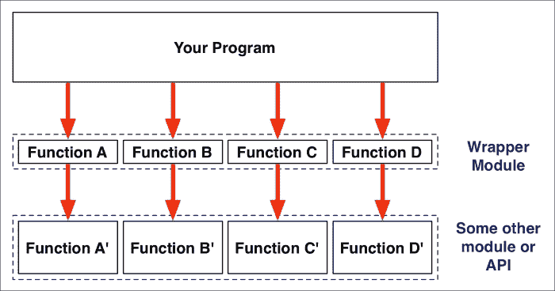
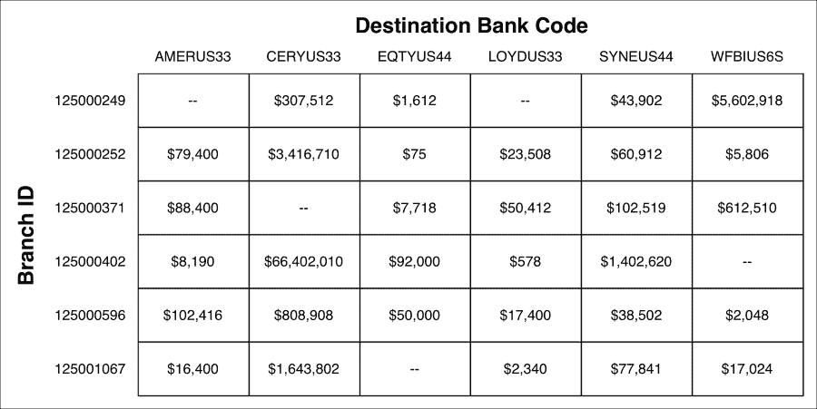
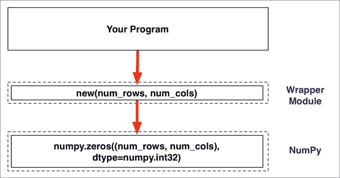
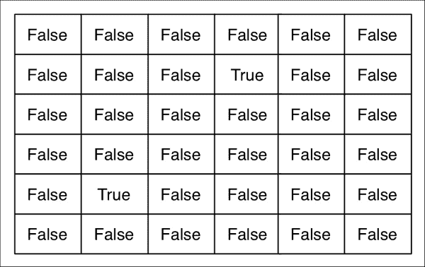

# 第五章：使用模块模式

在前几章中，我们详细讨论了 Python 模块和包的工作原理，并学习了如何在程序中使用它们。在使用模块化编程技术时，你会发现模块和包的使用方式往往遵循标准模式。在本章中，我们将研究使用模块和包处理各种编程挑战的一些常见模式。特别是，我们将：

+   了解分而治之技术如何帮助你解决编程问题

+   看看抽象原则如何帮助你将要做的事情与如何做它分开

+   了解封装如何允许你隐藏信息表示的细节

+   看到包装器是调用其他模块以简化或改变模块使用方式的模块

+   学习如何创建可扩展的模块

让我们从分而治之的原则开始。

# 分而治之

分而治之是将问题分解为较小部分的过程。你可能不知道如何解决一个特定的问题，但通过将其分解为较小的部分，然后依次解决每个部分，然后解决原始问题。

当然，这是一个非常普遍的技术，并不仅适用于模块和包的使用。然而，模块化编程有助于你通过分而治之的过程：当你分解问题时，你会发现你需要程序的一部分来执行特定的任务或一系列任务，而 Python 模块（和包）是组织这些任务的完美方式。

在本书中，我们已经做过几次这样的事情。例如，当面临创建图表生成库的挑战时，我们使用了分而治之的技术，提出了可以绘制单个图表元素的**渲染器**的概念。然后我们意识到我们需要几个不同的渲染器，这完美地转化为包含每个渲染器单独模块的`renderers`包。 

分而治之的方法不仅建议了代码的可能模块化结构，也可以反过来使用。当你考虑程序的设计时，你可能会想到一个与你要解决的问题相关的模块或包的概念。你甚至可能会规划出每个模块和包提供的各个函数。尽管你还不知道如何解决整个问题，但这种模块化设计有助于澄清你对问题的思考，从而使使用分而治之的方法更容易解决问题的其余部分。换句话说，模块和包帮助你在分而治之的过程中澄清你的思路。

# 抽象

抽象是另一个非常普遍的编程模式，适用于不仅仅是模块化编程。抽象本质上是隐藏复杂性的过程：将你想要做的事情与如何做它分开。

抽象对所有的计算机编程都是绝对基础的。例如，想象一下，你必须编写一个计算两个平均数然后找出两者之间差异的程序。这个程序的简单实现可能看起来像下面这样：

```py
values_1 = [...]
values_2 = [...]

total_1 = 0
for value in values_1:
    total = total + value
average_1 = total / len(values_1)

total_2 = 0
for value in values_2:
    total = total + value
average_2 = total / len(values_2)

difference = abs(total_1 - total-2)
print(difference)
```

正如你所看到的，计算列表平均数的代码重复了两次。这是低效的，所以你通常会写一个函数来避免重复。可以通过以下方式实现：

```py
values_1 = [...]
values_2 = [...]

def average(values):
    total = 0
    for value in values:
        total = total + value
    return = total / len(values)

average_1 = average(values_1)
average_2 = average(values_2)
difference = abs(total_1 - total-2)
print(difference)
```

当然，每次编程时你都在做这种事情，但实际上这是一个非常重要的过程。当你创建这样一个函数时，函数内部处理*如何*做某事，而调用该函数的代码只知道*要*做什么，以及函数会去做。换句话说，函数*隐藏了*任务执行的复杂性，使得程序的其他部分只需在需要执行该任务时调用该函数。

这种过程称为**抽象**。使用这种模式，你可以*抽象出*某事物的具体细节，这样你的程序的其他部分就不需要担心这些细节。

抽象不仅适用于编写函数。隐藏复杂性的一般原则也适用于函数组，而模块是将函数组合在一起的完美方式。例如，你的程序可能需要使用颜色，因此你编写了一个名为`colors`的模块，其中包含各种函数，允许你创建和使用颜色值。`colors`模块中的各种函数了解颜色值及如何使用它们，因此你的程序的其他部分不需要担心这些。使用这个模块，你可以做各种有趣的事情。例如：

```py
purple = colors.new_color(1.0, 0.0, 1.0)
yellow = colors.new_color(1.0, 1.0, 0.0)
dark_purple = colors.darken(purple, 0.3)
color_range = colors.blend(yellow, dark_purple, num_steps=20)
dimmed_yellow = colors.desaturate(yellow, 0.8)
```

在这个模块之外，你的代码可以专注于它想要做的事情，而不需要知道这些各种任务是如何执行的。通过这样做，你正在使用抽象模式将这些颜色计算的复杂性隐藏起来，使其不影响程序的其他部分。

抽象是设计和编写模块和包的基本技术。例如，我们在上一章中使用的 Pillow 库提供了各种模块，允许你加载、操作、创建和保存图像。我们可以使用这个库而不需要知道这些各种操作是如何执行的。例如，我们可以调用`drawer.line((x1, y1), (x2, y2), color, width)`而不必担心设置图像中的单个像素的细节。

应用抽象模式的一个伟大之处在于，当你开始实现代码时，通常并不知道某事物的复杂程度。例如，想象一下，你正在为酒店酒吧编写一个销售点系统。系统的一部分需要计算顾客点酒时应收取的价格。我们可以使用各种公式来计算这个价格，根据数量、使用的酒类等。但其中一个具有挑战性的特点是需要支持*欢乐时光*，即在此期间饮料将以折扣价提供。

起初，你被告知欢乐时光是每天晚上五点到六点之间。因此，使用良好的模块化技术，你在代码中添加了以下函数：

```py
def is_happy_hour():
    if datetime.datetime.now().hour == 17: # 5pm.
        return True
    else:
        return False
```

然后你可以使用这个函数来分离计算欢乐时光的方法和欢乐时光期间发生的事情。例如：

```py
if is_happy_hour():
    price = price * 0.5
```

到目前为止，这还相当简单，你可能会想要完全绕过创建`is_happy_hour()`函数。然而，当你发现欢乐时光不适用于星期日时，这个函数很快就变得更加复杂。因此，你必须修改`is_happy_hour()`函数以支持这一点：

```py
def is_happy_hour():
    if datetime.date.today().weekday() == 6: # Sunday.
        return False
    elif datetime.datetime.now().hour == 17: # 5pm.
        return True
    else:
        return False
```

但是你随后发现，欢乐时光不适用于圣诞节或耶稣受难日。虽然圣诞节很容易计算，但计算复活节在某一年的日期所使用的逻辑要复杂得多。如果你感兴趣，本章的示例代码包括`is_happy_hour()`函数的实现，其中包括对圣诞节和耶稣受难日的支持。不用说，这个实现相当复杂。

请注意，随着我们的`is_happy_hour()`函数的不断发展，它变得越来越复杂 - 起初我们以为它会很简单，但是添加的要求使它变得更加复杂。幸运的是，因为我们已经将计算快乐时光的细节从需要知道当前是否是快乐时光的代码中抽象出来，只需要更新一个函数来支持这种增加的复杂性。

# 封装

封装是另一种经常适用于模块和包的编程模式。使用封装，你有一个*东西* - 例如，颜色、客户或货币 - 你需要存储关于它的数据，但是你将这些数据的表示隐藏起来，不让系统的其他部分知道。而不是直接提供这个东西，你提供设置、检索和操作这个东西数据的函数。

为了看到这是如何工作的，让我们回顾一下我们在上一章中编写的一个模块。我们的`chart.py`模块允许用户定义一个图表并设置有关它的各种信息。这是我们为这个模块编写的代码的一个副本：

```py
def new_chart():
    return {}

def set_title(chart, title):
    chart['title'] = title

def set_x_axis(chart, x_axis):
    chart['x_axis'] = x_axis

def set_y_axis(chart, minimum, maximum, labels):
    chart['y_min']    = minimum
    chart['y_max']    = maximum
    chart['y_labels'] = labels

def set_series_type(chart, series_type):
    chart['series_type'] = series_type

def set_series(chart, series):
    chart['series'] = series
```

正如你所看到的，`new_chart()`函数创建了一个新的“图表”，而不清楚地告诉系统如何存储有关图表的信息 - 我们在这里使用了一个字典，但我们也可以使用一个对象、一个 base64 编码的字符串，或者其他任何东西。系统的其他部分并不关心，因为它只是调用`chart.py`模块中的各种函数来设置图表的各个值。

不幸的是，这并不是封装的一个完美的例子。我们的各种`set_XXX()`函数充当**设置器** - 它们让我们设置图表的各种值 - 但我们只是假设我们的图表生成函数可以直接从图表的字典中访问有关图表的信息。如果这将是封装的一个纯粹的例子，我们还将编写相应的**获取器**函数，例如：

```py
def get_title(chart):
    return chart['title']

def get_x_axis(chart):
    return chart['x_axis']

def get_y_axis(chart):
    return (chart['y_min'], chart['y_max'], chart['y_labels'])

def get_series_type(chart):
    return chart['series_type']

def get_series(chart):
    return chart['series']
```

通过将这些获取器函数添加到我们的模块中，我们现在有了一个完全封装的模块，可以存储和检索关于图表的信息。`charter`包的其他部分想要使用图表时，将调用获取器函数来检索该图表的数据，而不是直接访问它。

### 提示

在模块中编写设置器和获取器函数的这些示例有点牵强；封装通常是使用面向对象编程技术来完成的。然而，正如你所看到的，当编写只使用模块化编程技术的代码时，完全可以使用封装。

也许你会想知道为什么有人会想要使用封装。为什么不直接写`charts.get_title(chart)`，而不是简单地写`chart['title']`？第二个版本更短。它还避免了调用函数，因此速度会更快。为什么要使用封装呢？

在程序中使用封装有两个原因。首先，通过使用获取器和设置器函数，你隐藏了信息存储的细节。这使你能够更改内部表示而不影响程序的任何其他部分 - 并且在编写程序时你几乎可以肯定的一件事是，你将不断添加更多的信息和功能。这意味着你的数据的内部表示*将*发生变化。通过将存储的内容与存储方式分离，你的系统变得更加健壮，你可以进行更改而无需重写大量代码。这是一个良好模块化设计的标志。

使用封装的第二个主要原因是允许您的代码在用户设置特定值时执行某些操作。例如，如果用户更改订单的数量，您可以立即重新计算该订单的总价格。设置器经常做的另一件事是将更新后的值保存到磁盘或数据库中。您还可以在设置器中添加错误检查和其他逻辑，以便捕获可能很难跟踪的错误。

让我们详细看一下使用封装模式的 Python 模块。例如，假设我们正在编写一个用于存储食谱的程序。用户可以创建一个喜爱食谱的数据库，并在需要时显示这些食谱。

让我们创建一个 Python 模块来封装食谱的概念。在这个例子中，我们将食谱存储在内存中，以保持简单。对于每个食谱，我们将存储食谱的名称、食谱产生的份数、配料列表以及制作食谱时用户需要遵循的指令列表。

创建一个名为`recipes.py`的新 Python 源文件，并输入以下内容到此文件中：

```py
def new():
    return {'name'         : None,
            'num_servings' : 1,
            'instructions' : [],
            'ingredients'  : []}

def set_name(recipe, name):
    recipe['name'] = name

def get_name(recipe):
    return recipe['name']

def set_num_servings(recipe, num_servings):
    recipe['num_servings'] = num_servings

def get_num_servings(recipe):
    return recipe['num_servings']

def set_ingredients(recipe, ingredients):
    recipe['ingredients'] = ingredients

def get_ingredients(recipe):
    return recipe['ingredients']

def set_instructions(recipe, instructions):
    recipe['instructions'] = instructions

def get_instructions(recipe):
    return recipe['instructions']

def add_instruction(recipe, instruction):
    recipe['instructions'].append(instruction)

def add_ingredient(recipe, ingredient, amount, units):
    recipe['ingredients'].append({'ingredient' : ingredient,
                                  'amount'     : amount,
                                  'units'      : units})
```

正如您所见，我们再次使用 Python 字典来存储我们的信息。我们可以使用 Python 类或 Python 标准库中的`namedtuple`。或者，我们可以将信息存储在数据库中。但是，在这个例子中，我们希望尽可能简化我们的代码，字典是最简单的解决方案。

创建新食谱后，用户可以调用各种设置器和获取器函数来存储和检索有关食谱的信息。我们还有一些有用的函数，让我们一次添加一条指令和配料，这对我们正在编写的程序更方便。

请注意，当向食谱添加配料时，调用者需要提供三条信息：配料的名称、所需数量以及衡量此数量的单位。例如：

```py
recipes.add_ingredient(recipe, "Milk", 1, "cup")
```

到目前为止，我们已经封装了食谱的概念，允许我们存储所需的信息，并在需要时检索它。由于我们的模块遵循了封装原则，我们可以更改存储食谱的方式，向我们的模块添加更多信息和新行为，而不会影响程序的其余部分。

让我们再添加一个有用的函数到我们的食谱中：

```py
def to_string(recipe, num_servings):
    multiplier = num_servings / recipe['num_servings']
    s = []
    s.append("Recipe for {}, {} servings:".format(recipe['name'],
                                                  num_servings))
    s.append("")
    s.append("Ingredients:")
    s.append("")
    for ingredient in recipe['ingredients']:
        s.append("    {} - {} {}".format(
                     ingredient['ingredient'],
                     ingredient['amount'] * multiplier,
                     ingredient['units']))
    s.append("")
    s.append("Instructions:")
    s.append("")
    for i,instruction in enumerate(recipe['instructions']):
        s.append("{}. {}".format(i+1, instruction))

    return s
```

该函数返回一个字符串列表，可以打印出来以总结食谱。注意`num_servings`参数：这允许我们为不同的份数定制食谱。例如，如果用户创建了一个三份食谱并希望将其加倍，可以使用`to_string()`函数，并将`num_servings`值设为`6`，正确的数量将包含在返回的字符串列表中。

让我们看看这个模块是如何工作的。打开终端或命令行窗口，使用`cd`命令转到创建`recipes.py`文件的目录，并输入`python`启动 Python 解释器。然后，尝试输入以下内容以创建披萨面团的食谱：

```py
import recipes
recipe = recipes.new("Pizza Dough", num_servings=1)
recipes.add_ingredient(recipe, "Greek Yogurt", 1, "cup")
recipes.add_ingredient(recipe, "Self-Raising Flour", 1.5, "cups")
recipes.add_instruction(recipe, "Combine yogurt and 2/3 of the flour in a bowl and mix with a beater until combined")
recipes.add_instruction(recipe, "Slowly add additional flour until it forms a stiff dough")
recipes.add_instruction(recipe, "Turn out onto a floured surface and knead until dough is tacky")
recipes.add_instruction(recipe, "Roll out into a circle of the desired thickness and place on a greased and lined baking tray")

```

到目前为止一切顺利。现在让我们使用`to_string()`函数打印出食谱的详细信息，并将其加倍到两份：

```py
for s in recipes.to_string(recipe, num_servings=2):
 **print s

```

一切顺利的话，食谱应该已经打印出来了：

```py
Recipe for Pizza Dough, 2 servings:

Ingredients:

 **Greek Yogurt - 2 cup
 **Self-rising Flour - 3.0 cups

Instructions:

1\. Combine yogurt and 2/3 of the flour in a bowl and mix with a beater until combined
2\. Slowly add additional flour until it forms a stiff dough
3\. Turn out onto a floured surface and knead until dough is tacky
4\. Roll out into a circle of the desired thickness and place on a greased and lined baking tray

```

正如您所见，有一些次要的格式问题。例如，所需的希腊酸奶数量列为`2 cup`而不是`2 cups`。如果您愿意，您可以很容易地解决这个问题，但要注意的重要事情是`recipes.py`模块已经封装了食谱的概念，允许您（和您编写的其他程序）处理食谱而不必担心细节。

作为练习，你可以尝试修复`to_string()`函数中数量的显示。你也可以尝试编写一个新的函数，从食谱列表中创建一个购物清单，在两个或更多食谱使用相同的食材时自动合并数量。如果你完成了这些练习，你很快就会注意到实现可能会变得非常复杂，但通过将细节封装在一个模块中，你可以隐藏这些细节，使其对程序的其余部分不可见。

# 包装器

包装器本质上是一组调用其他函数来完成工作的函数：



包装器用于简化接口，使混乱或设计不良的 API 更易于使用，将数据格式转换为更方便的形式，并实现跨语言兼容性。包装器有时也用于向现有 API 添加测试和错误检查代码。

让我们看一个包装器模块的真实应用。想象一下，你在一家大型银行工作，并被要求编写一个程序来分析资金转账，以帮助识别可能的欺诈行为。你的程序实时接收有关每笔银行间资金转账的信息。对于每笔转账，你会得到：

+   转账金额

+   转账发生的分支的 ID

+   资金被发送到的银行的识别码

你的任务是分析随时间变化的转账，以识别异常的活动模式。为此，你需要计算过去八天的每个分支和目标银行的所有转账总值。然后，你可以将当天的总额与前七天的平均值进行比较，并标记任何日总额超过平均值 50%以上的情况。

你可以从决定如何表示一天的总转账开始。因为你需要跟踪每个分支和目标银行的转账总额，所以将这些总额存储在一个二维数组中是有意义的：



在 Python 中，这种二维数组的类型被表示为一个列表的列表：

```py
totals = [[0, 307512, 1612, 0, 43902, 5602918],
          [79400, 3416710, 75, 23508, 60912, 5806],
          ...
         ]
```

然后你可以保留一个单独的分支 ID 列表，每行一个，另一个列表保存每列的目标银行代码：

```py
branch_ids = [125000249, 125000252, 125000371, ...]
bank_codes = ["AMERUS33", "CERYUS33", "EQTYUS44", ...]
```

使用这些列表，你可以通过处理特定日期发生的转账来计算给定日期的总额：

```py
totals = []
for branch in branch_ids:
    branch_totals = []
    for bank in bank_codes:
        branch_totals.append(0)
    totals.append(branch_totals)

for transfer in transfers_for_day:
    branch_index = branch_ids.index(transfer['branch'])
    bank_index   = bank_codes.index(transfer['dest_bank'])
    totals[branch_index][bank_index] += transfer['amount']
```

到目前为止一切顺利。一旦你得到了每天的总额，你可以计算平均值，并将其与当天的总额进行比较，以识别高于平均值 150%的条目。

假设你已经编写了这个程序并设法让它工作。但当你开始使用它时，你立即发现了一个问题：你的银行有超过 5000 个分支，而你的银行可以向全球超过 15000 家银行转账，这总共需要为 7500 万种组合保留总额，因此，你的程序计算总额的时间太长了。

为了使你的程序更快，你需要找到一种更好的处理大量数字数组的方法。幸运的是，有一个专门设计来做这件事的库：**NumPy**。

NumPy 是一个出色的数组处理库。你可以创建巨大的数组，并使用一个函数调用对数组执行复杂的操作。不幸的是，NumPy 也是一个密集和晦涩的库。它是为数学深度理解的人设计和编写的。虽然有许多教程可用，你通常可以弄清楚如何使用它，但使用 NumPy 的代码通常很难理解。例如，要计算多个矩阵的平均值将涉及以下操作：

```py
daily_totals = []
for totals in totals_to_average:
    daily_totals.append(totals)
average = numpy.mean(numpy.array(daily_totals), axis=0)
```

弄清楚最后一行的作用需要查阅 NumPy 文档。由于使用 NumPy 的代码的复杂性，这是一个使用**包装模块**的完美例子：包装模块可以为 NumPy 提供一个更易于使用的接口，这样你的代码就可以使用它，而不会被复杂和令人困惑的函数调用所淹没。

为了通过这个例子，我们将从安装 NumPy 库开始。NumPy ([`www.numpy.org`](http://www.numpy.org)) 可以在 Mac OS X、Windows 和 Linux 机器上运行。你安装它取决于你使用的操作系统：

+   对于 Mac OS X，你可以从[`www.kyngchaos.com/software/python`](http://www.kyngchaos.com/software/python)下载安装程序。

+   对于 MS Windows，你可以从[`www.lfd.uci.edu/~gohlke/pythonlibs/#numpy`](http://www.lfd.uci.edu/~gohlke/pythonlibs/#numpy)下载 NumPy 的 Python“wheel”文件。选择与你的操作系统和所需的 Python 版本匹配的 NumPy 的预构建版本。要使用 wheel 文件，使用`pip install`命令，例如，`pip install numpy-1.10.4+mkl-cp34-none-win32.whl`。

### 注意

有关安装 Python wheel 的更多信息，请参阅[`pip.pypa.io/en/latest/user_guide/#installing-from-wheels`](https://pip.pypa.io/en/latest/user_guide/#installing-from-wheels)。

+   如果你的计算机运行 Linux，你可以使用你的 Linux 软件包管理器来安装 NumPy。或者，你可以下载并构建 NumPy 的源代码形式。

为了确保 NumPy 正常工作，启动你的 Python 解释器并输入以下内容：

```py
import numpy
a = numpy.array([[1, 2], [3, 4]])
print(a)
```

一切顺利的话，你应该看到一个 2 x 2 的矩阵显示出来：

```py
[[1 2]
 **[3 4]]

```

现在我们已经安装了 NumPy，让我们开始编写我们的包装模块。创建一个新的 Python 源文件，命名为`numpy_wrapper.py`，并输入以下内容到这个文件中：

```py
import numpy

```

就这些了；我们将根据需要向这个包装模块添加函数。

接下来，创建另一个 Python 源文件，命名为`detect_unusual_transfers.py`，并输入以下内容到这个文件中：

```py
import random
import numpy_wrapper as npw

BANK_CODES = ["AMERUS33", "CERYUS33", "EQTYUS44",
              "LOYDUS33", "SYNEUS44", "WFBIUS6S"]

BRANCH_IDS = ["125000249", "125000252", "125000371",
              "125000402", "125000596", "125001067"]
```

正如你所看到的，我们正在为我们的例子硬编码银行和分行代码；在一个真实的程序中，这些值将从某个地方加载，比如文件或数据库。由于我们没有可用的数据，我们将使用`random`模块来创建一些。我们还将更改`numpy_wrapper`模块的名称，以便更容易从我们的代码中访问。

现在让我们使用`random`模块创建一些要处理的资金转账数据：

```py
days = [1, 2, 3, 4, 5, 6, 7, 8]
transfers = []

for i in range(10000):
    day       = random.choice(days)
    bank_code = random.choice(BANK_CODES)
    branch_id = random.choice(BRANCH_IDS)
    amount    = random.randint(1000, 1000000)

    transfers.append((day, bank_code, branch_id, amount))
```

在这里，我们随机选择一天、一个银行代码、一个分行 ID 和一个金额，将这些值存储在`transfers`列表中。

我们的下一个任务是将这些信息整理成一系列数组。这样可以让我们计算每天的转账总额，按分行 ID 和目标银行分组。为此，我们将为每一天创建一个 NumPy 数组，其中每个数组中的行代表分行，列代表目标银行。然后我们将逐个处理转账列表中的转账。以下插图总结了我们如何依次处理每笔转账：


首先，我们选择发生转账的那一天的数组，然后根据目标银行和分行 ID 选择适当的行和列。最后，我们将转账金额添加到当天数组中的那个项目中。

现在让我们实现这个逻辑。我们的第一个任务是创建一系列 NumPy 数组，每天一个。在这里，我们立即遇到了一个障碍：NumPy 有许多不同的选项用于创建数组；在这种情况下，我们想要创建一个保存整数值并且其内容初始化为零的数组。如果我们直接使用 NumPy，我们的代码将如下所示：

```py
array = numpy.zeros((num_rows, num_cols), dtype=numpy.int32)
```

这并不是很容易理解，所以我们将这个逻辑移到我们的 NumPy 包装模块中。编辑`numpy_wrapper.py`文件，并在这个模块的末尾添加以下内容：

```py
def new(num_rows, num_cols):
    return numpy.zeros((num_rows, num_cols), dtype=numpy.int32)
```

现在，我们可以通过调用我们的包装函数（`npw.new()`）来创建一个新的数组，而不必担心 NumPy 的工作细节。我们已经简化了 NumPy 的特定方面的接口：



现在让我们使用我们的包装函数来创建我们需要的八个数组，每天一个。在`detect_unusual_transfers.py`文件的末尾添加以下内容：

```py
transfers_by_day = {}
for day in days:
    transfers_by_day[day] = npw.new(num_rows=len(BANK_CODES),
                                    num_cols=len(BRANCH_IDS))
```

现在我们有了 NumPy 数组，我们可以像使用嵌套的 Python 列表一样使用它们。例如：

```py
array[row][col] = array[row][col] + amount
```

我们只需要选择适当的数组，并计算要使用的行和列号。以下是必要的代码，你应该将其添加到你的`detect_unusual_transfers.py`脚本的末尾：

```py
for day,bank_code,branch_id,amount in transfers:
    array = transfers_by_day[day]
    row = BRANCH_IDS.index(branch_id)
    col = BANK_CODES.index(bank_code)
    array[row][col] = array[row][col] + amount
```

现在我们已经将转账整理成了八个 NumPy 数组，我们希望使用所有这些数据来检测任何不寻常的活动。对于每个分行 ID 和目标银行代码的组合，我们需要做以下工作：

1.  计算前七天活动的平均值。

1.  将计算出的平均值乘以 1.5。

1.  如果第八天的活动大于平均值乘以 1.5，那么我们认为这种活动是不寻常的。

当然，我们需要对我们的数组中的每一行和每一列都这样做，这将非常慢；这就是为什么我们使用 NumPy 的原因。因此，我们需要计算多个数字数组的平均值，然后将平均值数组乘以 1.5，最后，将乘以后的数组与第八天的数据数组进行比较。幸运的是，这些都是 NumPy 可以为我们做的事情。

我们将首先收集我们需要平均的七个数组，以及第八天的数组。为此，将以下内容添加到你的程序的末尾：

```py
latest_day = max(days)

transfers_to_average = []
for day in days:
    if day != latest_day:
        transfers_to_average.append(transfers_by_day[day])

current = transfers_by_day[latest_day]
```

要计算一组数组的平均值，NumPy 要求我们使用以下函数调用：

```py
average = numpy.mean(numpy.array(arrays_to_average), axis=0)
```

由于这很令人困惑，我们将把这个函数移到我们的包装器中。在`numpy_wrapper.py`模块的末尾添加以下代码：

```py
def average(arrays_to_average):
    return numpy.mean(numpy.array(arrays_to_average), axis=0)
```

这让我们可以使用一个调用我们的包装函数来计算七天活动的平均值。为此，将以下内容添加到你的`detect_unusual_transfers.py`脚本的末尾：

```py
average = npw.average(transfers_to_average)
```

正如你所看到的，使用包装器使我们的代码更容易理解。

我们的下一个任务是将计算出的平均值数组乘以 1.5，并将结果与当天的总数进行比较。幸运的是，NumPy 使这变得很容易：

```py
unusual_transfers = current > average * 1.5
```

因为这段代码如此清晰，所以为它创建一个包装器函数没有任何优势。结果数组`unusual_transfers`的大小与我们的`current`和`average`数组相同，数组中的每个条目都是`True`或`False`：



我们几乎完成了；我们的最后任务是识别数组中值为`True`的条目，并告诉用户有不寻常的活动。虽然我们可以扫描每一行和每一列来找到`True`条目，但使用 NumPy 会快得多。以下的 NumPy 代码将给我们一个包含数组中`True`条目的行和列号的列表：

```py
indices = numpy.transpose(array.nonzero())
```

不过，这段代码很难理解，所以它是另一个包装器函数的完美候选者。回到你的`numpy_wrapper.py`模块，并在文件末尾添加以下内容：

```py
def get_indices(array):
    return numpy.transpose(array.nonzero())
```

这个函数返回一个列表（实际上是一个数组），其中包含数组中所有`True`条目的`(行，列)`值。回到我们的`detect_unusual_activity.py`文件，我们可以使用这个函数快速识别不寻常的活动：

```py
    for row,col in npw.get_indices(unusual_transfers):
        branch_id   = BRANCH_IDS[row]
        bank_code   = BANK_CODES[col]
        average_amt = int(average[row][col])
        current_amt = current[row][col]

        print("Branch {} transferred ${:,d}".format(branch_id,
                                                    current_amt) +
              " to bank {}, average = ${:,d}".format(bank_code,
                                                     average_amt))
```

正如你所看到的，我们使用`BRANCH_IDS`和`BANK_CODES`列表来将行和列号转换回相关的分行 ID 和银行代码。我们还检索了可疑活动的平均值和当前金额。最后，我们打印出这些信息，警告用户有不寻常的活动。

如果你运行你的程序，你应该会看到类似这样的输出：

```py
Branch 125000371 transferred $24,729,847 to bank WFBIUS6S, average = $14,954,617
Branch 125000402 transferred $26,818,710 to bank CERYUS33, average = $16,338,043
Branch 125001067 transferred $27,081,511 to bank EQTYUS44, average = $17,763,644

```

因为我们在金融数据中使用随机数，所以输出也将是随机的。尝试运行程序几次；如果没有生成可疑的随机值，则可能根本没有输出。

当然，我们并不真正关心检测可疑的金融活动——这个例子只是一个借口，用来处理 NumPy。更有趣的是我们创建的包装模块，它隐藏了 NumPy 接口的复杂性，使得我们程序的其余部分可以集中精力完成工作。

如果我们继续开发我们的异常活动检测器，毫无疑问，我们会在`numpy_wrapper.py`模块中添加更多功能，因为我们发现了更多想要封装的 NumPy 函数。

这只是包装模块的一个例子。正如我们之前提到的，简化复杂和混乱的 API 只是包装模块的一个用途；它们还可以用于将数据从一种格式转换为另一种格式，向现有 API 添加测试和错误检查代码，并调用用其他语言编写的函数。

请注意，根据定义，包装器始终是*薄*的——虽然包装器中可能有代码（例如，将参数从对象转换为字典），但包装器函数最终总是调用另一个函数来执行实际工作。

# 可扩展模块

大多数情况下，模块提供的功能是预先知道的。模块的源代码实现了一组明确定义的行为，这就是模块的全部功能。然而，在某些情况下，您可能需要一个模块，在编写时模块的行为并不完全定义。系统的其他部分可以以各种方式*扩展*模块的行为。设计为可扩展的模块称为**可扩展模块**。

Python 的一个伟大之处在于它是一种*动态*语言。您不需要在运行之前定义和编译所有代码。这使得使用 Python 创建可扩展模块变得很容易。

在本节中，我们将看一下模块可以被扩展的三种不同方式：通过使用**动态导入**，编写**插件**，以及使用**钩子**。

## 动态导入

在上一章中，我们创建了一个名为`renderers.py`的模块，它选择了一个适当的渲染器模块，以使用给定的输出格式绘制图表元素。以下是该模块源代码的摘录：

```py
from .png import title  as title_png
from .png import x_axis as x_axis_png

from .pdf import title  as title_pdf
from .pdf import x_axis as x_axis_pdf

renderers = {
    'png' : {
        'title'  : title_png,
        'x_axis' : x_axis_png,
    },
    'pdf' : {
        'title'  : title_pdf,
        'x_axis' : x_axis_pdf,
    }
}

def draw(format, element, chart, output):
    renderers[format][element].draw(chart, output)
```

这个模块很有趣，因为它以有限的方式实现了可扩展性的概念。请注意，`renderer.draw()`函数调用另一个模块内的`draw()`函数来执行实际工作；使用哪个模块取决于所需的图表格式和要绘制的元素。

这个模块并不真正可扩展，因为可能的模块列表是由模块顶部的`import`语句确定的。然而，可以通过使用`importlib`将其转换为完全可扩展的模块。这是 Python 标准库中的一个模块，它使开发人员可以访问用于导入模块的内部机制；使用`importlib`，您可以动态导入模块。

要理解这是如何工作的，让我们看一个例子。创建一个新的目录来保存您的源代码，在这个目录中，创建一个名为`module_a.py`的新模块。将以下代码输入到这个模块中：

```py
def say_hello():
    print("Hello from module_a")
```

现在，创建一个名为`module_b.py`的此模块的副本，并编辑`say_hello()`函数以打印*Hello from module_b*。然后，重复这个过程来创建`module_c.py`。

我们现在有三个模块，它们都实现了一个名为`say_hello()`的函数。现在，在同一个目录中创建另一个 Python 源文件，并将其命名为`load_module.py`。然后，输入以下内容到这个文件中：

```py
import importlib

module_name = input("Load module: ")
if module_name != "":
    module = importlib.import_module(module_name)
    module.say_hello()
```

该程序提示用户使用`input()`语句输入一个字符串。然后，我们调用`importlib.import_module()`来导入具有该名称的模块，并调用该模块的`say_hello()`函数。

尝试运行这个程序，当提示时，输入`module_a`。你应该会看到以下消息显示：

```py
Hello from module_a

```

尝试用其他模块重复这个过程。如果输入一个不存在的模块名称，你会得到一个`ImportError`。

当然，`importlib`并不仅限于导入与当前模块相同目录中的模块；如果需要，你可以包括包名。例如：

```py
module = importlib.import_module("package.sub_package.module")

```

使用`importlib`，你可以动态地导入一个模块——在编写程序时不需要知道模块的名称。我们可以使用这个来重写上一章的`renderer.py`模块，使其完全可扩展：

```py
from importlib import import_module

def draw(format, element, chart, output):
    renderer = import_module("{}.{}.{}".format(__package__,
                                               format,
                                               element))
    renderer.draw(chart, output)
```

### 注意

注意到了特殊的`__package__`变量的使用。它保存了包含当前模块的包的名称；使用这个变量允许我们相对于`renderer.py`模块所属的包导入模块。

动态导入的好处是，在创建程序时不需要知道所有模块的名称。使用`renderer.py`的例子，你可以通过创建新的渲染器模块来添加新的图表格式或元素，系统将在请求时导入它们，而无需对`renderer.py`模块进行任何更改。

## 插件

插件是用户（或其他开发人员）编写并“插入”到你的程序中的模块。插件在许多大型系统中很受欢迎，如 WordPress、JQuery、Google Chrome 和 Adobe Photoshop。插件用于扩展现有程序的功能。

在 Python 中，使用我们在上一节讨论过的动态导入机制很容易实现插件。唯一的区别是，不是导入已经是程序源代码一部分的模块，而是设置一个单独的目录，用户可以将他们想要添加到程序中的插件放在其中。这可以简单地创建一个`plugins`目录在程序的顶层，或者你可以将插件存储在程序源代码之外的目录中，并修改`sys.path`以便 Python 解释器可以在该目录中找到模块。无论哪种方式，你的程序都将使用`importlib.import_module()`来加载所需的插件，然后像访问任何其他 Python 模块中的函数和其他定义一样访问插件中的函数和其他定义。

本章提供的示例代码包括一个简单的插件加载器，展示了这种机制的工作方式。

## 钩子

**钩子**是允许外部代码在程序的特定点被调用的一种方式。钩子通常是一个函数——你的程序会检查是否定义了一个钩子函数，如果是，就会在适当的时候调用这个函数。

让我们看一个具体的例子。假设你有一个程序，其中包括记录用户登录和退出的功能。你的程序的一部分可能包括以下模块，我们将其称为`login_module.py`：

```py
cur_user = None

def login(username, password):
    if is_password_correct(username, password):
        cur_user = username
        return True
    else:
        return False

def logout():
    cur_user = None
```

现在，想象一下，你想要添加一个钩子，每当用户登录时都会被调用。将这个功能添加到你的程序中将涉及对这个模块的以下更改：

```py
cur_user = None
login_hook = None

def set_login_hook(hook):
 **login_hook = hook

def login(username, password):
    if is_password_correct(username, password):
        cur_user = username
 **if login_hook != None:
 **login_hook(username)
        return True
    else:
        return False

def logout():
    cur_user = None
```

有了这段代码，系统的其他部分可以通过设置自己的登录钩子函数来连接到你的登录过程，这样每当用户登录时就会执行一些操作。例如：

```py
def my_login_hook(username):
    if user_has_messages(username):
        show_messages(username)

login_module.set_login_hook(my_login_hook)
```

通过实现这个登录钩子，你扩展了登录过程的行为，而不需要修改登录模块本身。

钩子有一些需要注意的事项：

+   根据你为其实现钩子的行为，钩子函数返回的值可能会被用来改变你的代码的行为。例如，如果登录钩子返回`False`，用户可能会被阻止登录。这并不适用于每个钩子，但这是一个让钩子函数对程序中发生的事情有更多控制的非常有用的方式。

+   在这个例子中，我们只允许为每个 hook 定义一个 hook 函数。另一种实现方式是拥有一个注册的 hook 函数列表，并让您的程序根据需要添加或删除 hook 函数。这样，您可以有几个 hook 函数，每当发生某些事情时依次调用它们。

Hooks 是向您的模块添加特定可扩展性点的绝佳方式。它们易于实现和使用，与动态导入和插件不同，它们不要求您将代码放入单独的模块中。这意味着 hooks 是以非常精细的方式扩展您的模块的理想方式。

# 总结

在本章中，我们看到模块和包的使用方式往往遵循标准模式。我们研究了分而治之的模式，这是将问题分解为较小部分的过程，并看到这种技术如何帮助构建程序结构并澄清您对要解决的问题的思考。

接下来，我们看了抽象模式，这是通过将您想要做的事情与如何做它分开来隐藏复杂性的过程。然后我们研究了封装的概念，即存储有关某些事物的数据，但隐藏该数据的表示方式的细节，使用 getter 和 setter 函数来访问该数据。

然后我们转向包装器的概念，并看到包装器如何用于简化复杂或令人困惑的 API 的接口，转换数据格式，实现跨语言兼容性，并向现有 API 添加测试和错误检查代码。

最后，我们了解了可扩展模块，并看到我们可以使用动态模块导入、插件和 hooks 的技术来创建一个模块，它可以做的不仅仅是您设计它要做的事情。我们看到 Python 的动态特性使其非常适合创建可扩展模块，其中您的模块的行为在编写时并不完全定义。

在下一章中，我们将学习如何设计和实现可以在其他程序中共享和重用的模块。
