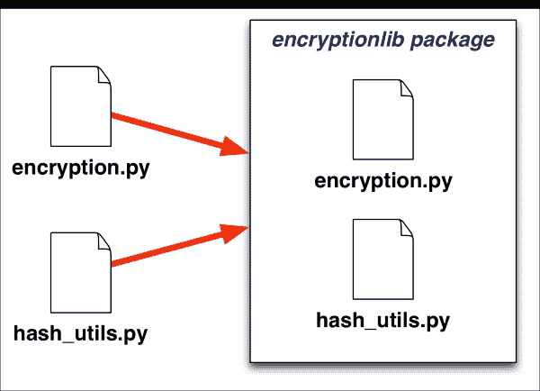
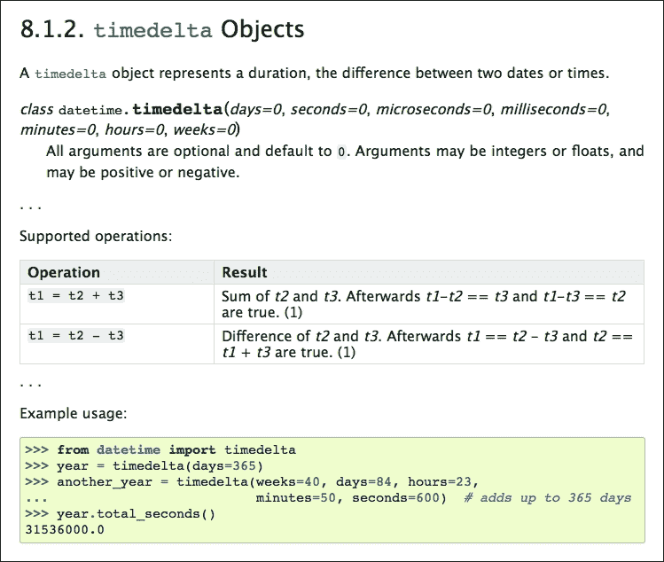

# 第六章：创建可重用模块

模块化编程不仅是一种为自己编写程序的好技术，也是一种为其他程序员编写的程序的绝佳方式。在本章中，我们将看看如何设计和实现可以在其他程序中共享和重用的模块和包。特别是，我们将：

+   看看模块和包如何被用作分享您编写的代码的一种方式

+   看看为重用编写模块与为作为一个程序的一部分使用编写模块有何不同

+   发现什么使一个模块适合重用

+   看一下成功可重用模块的例子

+   设计一个可重用的包

+   实现一个可重用的包

让我们首先看一下如何使用模块和包与其他人分享您的代码。

# 使用模块和包来分享你的代码

无论您编写的 Python 源代码是什么，您创建的代码都会执行某种任务。也许您的代码分析一些数据，将一些信息存储到文件中，或者提示用户从列表中选择一个项目。您的代码是什么并不重要——最终，您的代码会*做某事*。

通常，这是非常具体的。例如，您可能有一个计算复利、生成维恩图或向用户显示警告消息的函数。一旦您编写了这段代码，您就可以在自己的程序中随时使用它。这就是前一章中描述的简单抽象模式：您将*想要做什么*与*如何做*分开。

一旦您编写了函数，您就可以在需要执行该任务时调用它。例如，您可以在需要向用户显示警告时调用您的`display_warning()`函数，而不必担心警告是如何显示的细节。

然而，这个假设的`display_warning()`函数不仅在您当前编写的程序中有用。其他程序可能也想执行相同的任务——无论是您将来编写的程序还是其他人可能编写的程序。与其每次重新发明轮子，通常更有意义的是*重用*您的代码。

要重用您的代码，您必须分享它。有时，您可能会与自己分享代码，以便在不同的程序中使用它。在其他时候，您可能会与其他开发人员分享代码，以便他们在自己的程序中使用它。

当然，您不仅仅出于慈善目的与他人分享代码。在一个较大的组织中，您经常需要分享代码以提高同事的生产力。即使您是独自工作，通过使用其他人分享的代码，您也会受益，并且通过分享自己的代码，其他人可以帮助找到错误并解决您自己无法解决的问题。

无论您是与自己（在其他项目中）分享代码还是与他人（在您的组织或更广泛的开发社区中）分享代码，基本过程是相同的。有三种主要方式可以分享您的代码：

1.  您可以创建一个代码片段，然后将其复制并粘贴到新程序中。代码片段可以存储在一个名为“代码片段管理器”的应用程序中，也可以存储在一个文本文件夹中，甚至可以作为博客的一部分发布。

1.  您可以将要分享的代码放入一个模块或包中，然后将此模块或包导入新程序。该模块或包可以被物理复制到新程序的源代码中，可以放置在您的 Python 安装的`site-packages`目录中，或者您可以修改`sys.path`以包括可以找到模块或包的目录。

1.  或者，您可以将您的代码转换为一个独立的程序，然后使用`os.system()`从其他代码中调用这个程序。

虽然所有这些选项都可以工作，但并非所有选项都是理想的。让我们更仔细地看看每一个：

+   代码片段非常适合形成函数的代码的一部分。然而，它们非常糟糕，无法跟踪代码的最终位置。因为你已经将代码复制并粘贴到新程序的中间，所以很容易修改它，因为没有简单的方法可以区分粘贴的代码和你编写的程序的其余部分。此外，如果原始代码片段需要修改，例如修复错误，你将不得不找到在程序中使用代码片段的位置并更新以匹配。所有这些都相当混乱且容易出错。

+   导入模块或包的技术具有与较大代码块很好地配合的优势。你要分享的代码可以包括多个函数，甚至可以使用 Python 包将其拆分成多个源文件。由于源代码存储在单独的文件中，你也不太可能意外修改导入的模块。

如果你已经将源模块或包复制到新程序中，那么如果原始模块发生更改，你将需要手动更新它。这并不理想，但由于你替换了整个文件，这并不太困难。另一方面，如果你的新程序使用存储在其他位置的模块，那么就没有需要更新的内容——对原始模块所做的任何更改将立即应用于使用该模块的任何程序。

+   最后，将代码组织成独立的程序意味着你的新程序必须执行它。可以通过以下方式完成：

```py
status = os.system("python other_program.py <params>")
if status != 0:
    print("The other_program failed!")
```

正如你所看到的，可以运行另一个 Python 程序，等待其完成，然后检查返回的状态码，以确保程序成功运行。如果需要，还可以向运行的程序传递参数。但是，你可以传递给程序和接收的信息非常有限。例如，如果你有一个解析 XML 文件并将该文件的摘要保存到磁盘上的不同文件的程序，这种方法将起作用，但你不能直接传递 Python 数据结构给另一个程序进行处理，也不能再次接收 Python 数据结构。

### 注意

实际上，*可以*在运行的程序之间传输 Python 数据结构，但涉及的过程非常复杂，不值得考虑。

正如你所看到的，代码片段、模块/包导入和独立程序形成一种连续体：代码片段非常小且细粒度，模块和包导入支持更大的代码块，同时仍然易于使用和更新，独立程序很大，但在与其交互的方式上受到限制。

在这三种方法中，使用模块和包导入来共享代码似乎是最合适的：它们可以用于大量代码，易于使用和交互，并且在必要时非常容易更新。这使得模块和包成为共享 Python 源代码的理想机制——无论是与自己共享，用于将来的项目，还是与其他人共享。

# 什么使模块可重用？

为了使模块或包可重用，它必须满足以下要求：

+   它必须作为一个独立的单元运行

+   如果你的包意图作为另一个系统的源代码的一部分被包含，你必须使用相对导入来加载包内的其他模块。

+   任何外部依赖关系都必须明确说明

如果一个模块或包不满足这三个要求，要在其他程序中重用它将非常困难，甚至不可能。现在让我们依次更详细地看看这些要求。

## 作为独立单元运行

想象一下，你决定分享一个名为`encryption`的模块，它使用公钥/私钥对执行文本加密。然后，另一个程序员将此模块复制到他们的程序中。然而，当他们尝试使用它时，他们的程序崩溃，并显示以下错误消息：

```py
ImportError: No module named 'hash_utils'

```

`encryption`模块可能已经被共享，但它依赖于原始程序中的另一个模块(`hash_utils.py`)，而这个模块没有被共享，因此`encryption`模块本身是无用的。

解决这个问题的方法是将你想要共享的模块与它可能依赖的任何其他模块结合起来，将这些模块放在一个包中。然后共享这个包，而不是单独的模块。以下插图展示了如何做到这一点：



在这个例子中，我们创建了一个名为`encryptionlib`的新包，并将`encryption.py`和`hash_utils.py`文件移动到了这个包中。当然，这需要你重构程序的其余部分，以适应这些模块的新位置，但这样做可以让你在其他程序中重用你的加密逻辑。

### 注意

虽然以这种方式重构你的程序可能有点麻烦，但结果几乎总是对原始程序的改进。将依赖模块放在一个包中有助于改善代码的整体组织。

## 使用相对导入

继续上一节的例子，想象一下你想要将你的新的`encryptionlib`包作为另一个程序的一部分，但不想将其作为单独的包公开。在这种情况下，你可以简单地将整个`encryptionlib`目录包含在你的新系统源代码中。然而，如果你的模块不使用相对导入，就会遇到问题。例如，如果你的`encryption`模块依赖于`hash_utils`模块，那么`encryption`模块将包含一个引用`hash_utils`模块的`import`语句。然而，如果`encryption`模块以以下任何一种方式导入`hash_utils`，则生成的包将无法重用：

```py
import hash_utils
from my_program.lib import hash_utils
from hash_utils import *
```

所有这些导入语句都会失败，因为它们假设`hash_utils.py`文件在程序源代码中的特定固定位置。对于依赖模块在程序源代码中位置的任何假设都会限制包的可重用性，因为你不能将包移动到不同的位置并期望它能够工作。考虑到新项目的要求，你经常需要将包和模块存储在与它们最初开发的位置不同的地方。例如，也许`encryptionlib`包需要安装在`thirdparty`包中，与所有其他重用的库一起。使用绝对导入，你的包将失败，因为其中的模块位置已经改变。

### 注意

如果你发布你的包然后将其安装到 Python 的`site-packages`目录中，这个规则就不适用了。然而，有许多情况下你不想将可重用的包安装到`site-packages`目录中，因此你需要小心相对导入。

为了解决这个问题，请确保包内的任何`import`语句引用同一包内的其他模块时始终使用相对导入。例如：

```py
from . import hash_utils
```

这将使你的包能够在 Python 源树的任何位置运行。

## 注意外部依赖

想象一下，我们的新的`encryptionlib`包利用了我们在上一章中遇到的`NumPy`库。也许`hash_utils`导入了一些来自 NumPy 的函数，并使用它们来快速计算数字列表的二进制哈希。即使 NumPy 作为原始程序的一部分安装了，你也不能假设新程序也是如此：如果你将`encryptionlib`包安装到一个新程序中并运行它，最终会出现以下错误：

```py
ImportError: No module named 'numpy'

```

为了防止发生这种情况，重要的是任何想要重用您的模块的人都知道对第三方模块的依赖，并且清楚地知道为了使您的模块或软件包正常运行需要安装什么。包含这些信息的理想位置是您共享的模块或软件包的`README`文件或其他文档。

### 注意

如果您使用诸如 setuptools 或 pip 之类的自动部署系统，这些工具有其自己的方式来识别您的软件包的要求。然而，将要求列在文档中仍然是一个好主意，这样您的用户在安装软件包之前就会意识到这些要求。

# 什么是一个好的可重用模块？

在前一节中，我们看了可重用模块的*最低*要求。现在让我们来看看可重用性的*理想*要求。一个完美的可重用模块会是什么样子？

优秀的可重用模块与糟糕的模块有三个区别：

+   它试图解决一个一般性问题（或一系列问题），而不仅仅是执行一个特定的任务

+   它遵循标准约定，使得在其他地方使用模块更容易

+   该模块有清晰的文档，以便其他人可以轻松理解和使用它

让我们更仔细地看看这些要点。

## 解决一个一般性问题

通常在编程时，您会发现自己需要执行特定的任务，因此编写一个函数来执行此任务。例如，考虑以下情况：

+   您需要将英寸转换为厘米，因此编写一个`inch_to_cm()`函数来执行此任务。

+   您需要从文本文件中读取地名列表，该文件使用垂直条字符（`|`）作为字段之间的分隔符：

```py
FEATURE_ID|FEATURE_NAME|FEATURE_CLASS|...
1397658|Ester|Populated Place|...
1397926|Afognak|Populated Place|...
```

为此，您创建一个`load_placenames()`函数，从该文件中读取数据。

+   您需要向用户显示客户数量：

```py
1 customer
8 customers
```

消息使用`customer`还是`customers`取决于提供的数量。为了处理这个问题，您创建一个`pluralize_customers()`函数，根据提供的数量返回相应的复数形式的消息。

在所有这些例子中，您都在解决一个具体的问题。很多时候，这样的函数最终会成为一个模块的一部分，您可能希望重用或与他人分享。然而，这三个函数`inch_to_cm()`、`load_placenames()`和`pluralize_customers()`都非常特定于您尝试解决的问题，因此对新程序的适用性有限。这三个函数都迫切需要更加通用化：

+   不要编写`inch_to_cm()`函数，而是编写一个将*任何*英制距离转换为公制的函数，然后创建另一个函数来执行相反的操作。

+   不要编写一个仅加载地名的函数，而是实现一个`load_delimited_text()`函数，该函数适用于任何类型的分隔文本文件，并且不假定特定的列名或分隔符是垂直条字符。

+   不要仅仅将客户名称变为复数形式，而是编写一个更通用的`pluralize()`函数，该函数将为程序中可能需要的所有名称变为复数形式。由于英语的种种变化，您不能仅仅假定所有名称都可以通过在末尾添加*s*来变为复数形式；您需要一个包含人/人们、轴/轴等的例外词典，以便该函数可以处理各种类型的名称。为了使这个函数更加有用，您可以选择接受名称的复数形式，如果它不知道您要变为复数的单位类型的话：

```py
def pluralize(n, singular_name, plural_name=None):
```

尽管这只是三个具体的例子，但您可以看到，通过将您共享的代码泛化，可以使其适用于更广泛的任务。通常，泛化函数所需的工作量很少，但结果将受到使用您创建的代码的人们的极大赞赏。

## 遵循标准约定

虽然你可以按照自己的喜好编写代码，但如果你想与他人分享你的代码，遵循标准的编码约定是有意义的。这样可以使其他人在不必记住你的库特定风格的情况下更容易使用你的代码。

举个实际的例子，考虑以下代码片段：

```py
shapefile = ogr.Open("...")
layer = shapefile.GetLayer(0)
for i in range(layer.GetFeatureCount()):
  feature = layer.GetFeature(i)
  shape = shapely.loads(feature.GetGeometryRef().ExportToWkt())
  if shape.contains(target_zone):
    ...
```

这段代码利用了两个库：Shapely 库，用于执行计算几何，以及 OGR 库，用于读写地理空间数据。Shapely 库遵循使用小写字母命名函数和方法的标准 Python 约定：

```py
shapely.loads(...)
shape.contains(...)
```

虽然这些库的细节相当复杂，但这些函数和方法的命名易于记忆和使用。然而，与之相比，OGR 库将每个函数和方法的第一个字母大写：

```py
ogr.Open(...)
layer.GetFeatureCount()
```

使用这两个库时，你必须不断地记住 OGR 将每个函数和方法的第一个字母大写，而 Shapely 则不会。这使得使用 OGR 比必要更加麻烦，并导致生成的代码中出现相当多的错误，需要进行修复。

如果 OGR 库简单地遵循了与 Shapely 相同的命名约定，所有这些问题都可以避免。

幸运的是，对于 Python 来说，有一份名为**Python 风格指南**（[`www.python.org/dev/peps/pep-0008/`](https://www.python.org/dev/peps/pep-0008/)）的文件，提供了一套清晰的建议，用于格式化和设计你的代码。函数和方法名称使用小写字母的惯例来自于这份指南，大多数 Python 代码也遵循这个指南。从如何命名变量到何时在括号周围放置空格，这份文件中都有描述。

虽然编码约定是个人偏好的问题，你当然不必盲目遵循 Python 风格指南中的指示，但这样做（至少在影响你的代码用户方面）将使其他人更容易使用你的可重用模块和包——就像 OGR 库的例子一样，你不希望用户在想要导入和使用你的代码时不断记住一个不寻常的命名风格。

## 清晰的文档

即使你编写了完美的模块，解决了一系列通用问题，并忠实地遵循了 Python 风格指南，如果没有人知道如何使用它，你的模块也是无用的。不幸的是，作为程序员，我们经常对我们的代码太过了解：我们很清楚我们的代码是如何工作的，所以我们陷入了假设其他人也应该很清楚的陷阱。此外，程序员通常*讨厌*编写文档——我们更愿意编写一千行精心编写的 Python 代码，而不是写一段描述它如何工作的话。因此，我们共享的代码的文档通常是勉强写的，甚至根本不写。

问题是，高质量的可重用模块或包将*始终*包括文档。这份文档将解释模块的功能和工作原理，并包括示例，以便读者可以立即看到如何在他们自己的程序中使用这个模块或包。

对于一个出色文档化的 Python 模块或包的例子，我们无需去看**Python 标准库**（[`docs.python.org/3/library/`](https://docs.python.org/3/library/)）之外的地方。每个模块都有清晰的文档，包括详细的信息和示例，以帮助程序员进行指导。例如，以下是`datetime.timedelta`类的文档的简化版本：



每个模块、类、函数和方法都有清晰的文档，包括示例和详细的注释，以帮助这个模块的用户。

作为可重用模块的开发人员，您不必达到这些高度。Python 标准库是一个庞大的协作努力，没有一个人编写了所有这些文档。但这是您应该追求的文档类型的一个很好的例子：包含大量示例的全面文档。

虽然您可以在文字处理器中创建文档，或者使用类似 Sphinx 系统的复杂文档生成系统来构建 Python 文档，但有两种非常简单的方法可以在最少的麻烦下编写文档：创建 README 文件或使用文档字符串。

`README`文件只是一个文本文件，它与组成您的模块或包的各种源文件一起包含在内。它通常被命名为`README.txt`，它只是一个普通的文本文件。您可以使用用于编辑 Python 源代码的相同编辑器创建此文件。

README 文件可以是尽可能广泛或最小化的。通常有助于包括有关如何安装和使用模块的信息，任何许可问题，一些使用示例以及如果您的模块或包包含来自他人的代码，则包括致谢。

文档字符串是附加到模块或函数的 Python 字符串。这专门用于文档目的，有一个非常特殊的 Python 语法用于创建文档字符串：

```py
""" my_module.py

    This is the documentation for the my_module module.
"""
def my_function():
    """ This is the documentation for the my_function() function.

        As you can see, the documentation can span more than
        one line.
    """
    ...
```

在 Python 中，您可以使用三个引号字符标记跨越 Python 源文件的多行的字符串。这些三引号字符串可以用于各种地方，包括文档字符串。如果一个模块以三引号字符串开头，那么这个字符串将用作整个模块的文档。同样，如果任何函数以三引号字符串开头，那么这个字符串将用作该函数的文档。

### 注意

同样适用于 Python 中的其他定义，例如类、方法等。

文档字符串通常用于描述模块或函数的功能，所需的参数以及返回的信息。还应包括模块或函数的任何值得注意的方面，例如意外的副作用、使用示例等。

文档字符串（和 README 文件）不必非常广泛。您不希望花费数小时来撰写关于模块中只有三个人可能会使用的某个晦涩函数的文档。但是写得很好的文档字符串和 README 文件是出色且易于使用的模块或包的标志。

撰写文档是一种技能；像所有技能一样，通过实践可以变得更好。要创建可以共享的高质量模块和包，您应该养成创建文档字符串和 README 文件的习惯，以及遵循编码约定并尽可能地泛化您的代码，正如我们在本章的前几节中所描述的那样。如果您的目标是从一开始就产生高质量的可重用代码，您会发现这并不难。

# 可重用模块的示例

您不必走得很远才能找到可重用模块的示例；**Python 包索引**（[`pypi.python.org/pypi`](https://pypi.python.org/pypi)）提供了一个庞大的共享模块和包的存储库。您可以按名称或关键字搜索包，也可以按主题、许可证、预期受众、开发状态等浏览存储库。

Python 包索引非常庞大，但也非常有用：所有最成功的包和模块都包含在其中。让我们更仔细地看一些更受欢迎的可重用包。

## requests

`requests`库（[`docs.python-requests.org/en/master/`](http://docs.python-requests.org/en/master/)）是一个 Python 包，它可以轻松地向远程服务器发送 HTTP 请求并处理响应。虽然 Python 标准库中包含的`urllib2`包允许您发出 HTTP 请求，但往往难以使用并以意想不到的方式失败。`requests`包更容易使用和更可靠；因此，它变得非常受欢迎。

以下示例代码显示了`requests`库如何允许您发送复杂的 HTTP 请求并轻松处理响应：

```py
import requests

response = requests.post("http://server.com/api/login",
                         {'username' : username,
                          'password' : password})
if response.status_code == 200: # OK
    user = response.json()
    if user['logged_in']:
        ...
```

`requests`库会自动对要发送到服务器的参数进行编码，优雅地处理超时，并轻松检索 JSON 格式的响应。

`requests`库非常容易安装（在大多数情况下，您可以简单地使用 pip install requests）。它有很好的文档，包括用户指南、社区指南和详细的 API 文档，并且完全符合 Python 样式指南。它还提供了一套非常通用的功能，通过 HTTP 协议处理与外部网站和系统的各种通信。有了这些优点，难怪`requests`是整个 Python 包索引中第三受欢迎的包。

## python-dateutil

`dateutil`包（[`github.com/dateutil/dateutil`](https://github.com/dateutil/dateutil)）扩展了 Python 标准库中包含的`datetime`包，添加了对重复日期、时区、复杂相对日期等的支持。

以下示例代码计算复活节星期五的日期，比我们在上一章中用于*快乐时光*计算的形式要简单得多：

```py
from dateutil.easter import easter
easter_friday = easter(today.year) - datetime.timedelta(days=2)
```

`dateutil`提供了大量示例的优秀文档，使用`pip install python-dateutil`很容易安装，遵循 Python 样式指南，对解决各种与日期和时间相关的挑战非常有用。它是 Python 包索引中另一个成功和受欢迎的包的例子。

## lxml

`lxml`工具包（[`lxml.de`](http://lxml.de)）是一个非常成功的 Python 包的例子，它作为两个现有的 C 库的包装器。正如其写得很好的网站所说，`lxml`简化了读取和写入 XML 和 HTML 格式文档的过程。它是在 Python 标准库中现有库（`ElementTree`）的基础上建模的，但速度更快，功能更多，并且不会以意想不到的方式崩溃。

以下示例代码显示了如何使用`lxml`快速生成 XML 格式数据：

```py
from lxml import etree

movies = etree.Element("movie")
movie = etree.SubElement(movies, "movie")
movie.text = "The Wizard of Oz"
movie.set("year", "1939")

movie = etree.SubElement(movies, "movie")
movie.text = "Mary Poppins"
movie.set("year", "1964")

movie = etree.SubElement(movies, "movie")
movie.text = "Chinatown"
movie.set("year", "1974")

print(etree.tostring(movies, pretty_print=True))
```

这将打印出一个包含三部经典电影信息的 XML 格式文档：

```py
<movie>
 **<movie year="1939">The Wizard of Oz</movie>
 **<movie year="1964">Mary Poppins</movie>
 **<movie year="1974">Chinatown</movie>
</movie>

```

当然，`lxml`可以做的远不止这个简单的示例所展示的。它可以用于解析文档以及以编程方式生成庞大而复杂的 XML 文件。

`lxml`网站包括优秀的文档，包括教程、如何安装包以及完整的 API 参考。对于它解决的特定任务，`lxml`非常吸引人且易于使用。难怪这是 Python 包索引中非常受欢迎的包。

# 设计可重用的包

现在让我们将学到的知识应用到一个有用的 Python 包的设计和实现中。在上一章中，我们讨论了使用 Python 模块封装食谱的概念。每个食谱的一部分是成分的概念，它有三个部分：

+   成分的名称

+   成分所需的数量

+   成分的计量单位

如果我们想要处理成分，我们需要能够正确处理单位。例如，将 1.5 千克加上 750 克不仅仅是加上数字 1.5 和 750——您必须知道如何将这些值从一个单位转换为另一个单位。

在食谱的情况下，有一些相当不寻常的转换需要我们支持。例如，你知道三茶匙的糖等于一汤匙的糖吗？为了处理这些类型的转换，让我们编写一个单位转换库。

我们的单位转换器将需要了解烹饪中使用的所有标准单位。这些包括杯、汤匙、茶匙、克、盎司、磅等。我们的单位转换器将需要一种表示数量的方式，比如 1.5 千克，并且能够将数量从一种单位转换为另一种单位。

除了表示和转换数量，我们希望我们的图书馆能够显示数量，自动使用适当的单位名称的单数或复数形式，例如，**6 杯**，**1 加仑**，**150 克**等。

由于我们正在显示数量，如果我们的图书馆能够解析数量，将会很有帮助。这样，用户就可以输入像`3 汤匙`这样的值，我们的图书馆就会知道用户输入了三汤匙的数量。

我们越想这个图书馆，它似乎越像一个有用的工具。我们是在考虑我们的处理食谱程序时想到的这个，但似乎这可能是一个理想的可重用模块或包的候选者。

根据我们之前看过的指南，让我们考虑如何尽可能地概括我们的图书馆，使其在其他程序和其他程序员中更有用。

与其只考虑在食谱中可能找到的各种数量，不如改变我们的图书馆的范围，以处理*任何*类型的数量。它可以处理重量、长度、面积、体积，甚至可能处理时间、力量、速度等单位。

这样想，我们的图书馆不仅仅是一个单位转换器，而是一个处理**数量**的图书馆。数量是一个数字及其相关的单位，例如，150 毫米，1.5 盎司，或 5 英亩。我们将称之为 Quantities 的图书馆将是一个用于解析、显示和创建数量的工具，以及将数量从一种单位转换为另一种单位。正如你所看到的，我们对图书馆的最初概念现在只是图书馆将能够做的事情之一。

现在让我们更详细地设计我们的 Quantities 图书馆。我们希望我们的图书馆的用户能够很容易地创建一个新的数量。例如：

```py
q = quantities.new(5, "kilograms")
```

我们还希望能够将字符串解析为数量值，就像这样：

```py
q = quantities.parse("3 tbsp")
```

然后我们希望能够以以下方式显示数量：

```py
print(q)
```

我们还希望能够知道一个数量代表的是什么类型的值，例如：

```py
>>> print(quantities.kind(q))
weight

```

这将让我们知道一个数量代表重量、长度或距离等。

我们还可以获取数量的值和单位：

```py
>>> print(quantities.value(q))
3
>>> print(quantities.units(q))
tablespoon

```

我们还需要能够将一个数量转换为不同的单位。例如：

```py
>>> q = quantities.new(2.5, "cups")
>>> print(quantities.convert(q, "liter"))
0.59147059125 liters

```

最后，我们希望能够获得我们的图书馆支持的所有单位种类的列表以及每种单位的个体单位：

```py
>>> for kind in quantities.supported_kinds():
>>>     for unit in quantities.supported_units(kind):
>>>         print(kind, unit)
weight gram
weight kilogram
weight ounce
weight pound
length millimeter
...

```

我们的 Quantities 图书馆还需要支持一个最终功能：*本地化*单位和数量的能力。不幸的是，某些数量的转换值会根据你是在美国还是其他地方而有所不同。例如，在美国，一茶匙的体积约为 4.93 立方厘米，而在世界其他地方，一茶匙被认为有 5 立方厘米的体积。还有命名约定要处理：在美国，米制系统的基本长度单位被称为*米*，而在世界其他地方，同样的单位被拼写为*metre*。我们的单位将不得不处理不同的转换值和不同的命名约定。

为了做到这一点，我们需要支持**区域设置**的概念。当我们的图书馆被初始化时，调用者将指定我们的模块应该在哪个区域下运行：

```py
quantities.init("international")
```

这将影响库使用的转换值和拼写：

鉴于我们 Quantities 库的复杂性，试图把所有这些内容都挤入一个单独的模块是没有意义的。相反，我们将把我们的库分成三个单独的模块：一个`units`模块，定义我们支持的所有不同类型的单位，一个`interface`模块，实现我们包的各种公共函数，以及一个`quantity`模块，封装了数量作为值及其相关单位的概念。

这三个模块将合并为一个名为`quantities`的单个 Python 包。

### 注意

请注意，我们在设计时故意使用术语*库*来指代系统；这确保我们没有通过将其视为单个模块或包来预先设计。现在才清楚我们将要编写一个 Python 包。通常，你认为是模块的东西最终会变成一个包。偶尔也会发生相反的情况。对此要保持灵活。

现在我们对 Quantities 库有了一个很好的设计，知道它将做什么，以及我们想要如何构建它，让我们开始写一些代码。

# 实现可重用的包

### 提示

本节包含大量源代码。请记住，你不必手动输入所有内容；本章的示例代码中提供了`quantities`包的完整副本，可以下载。

首先创建一个名为`quantities`的目录来保存我们的新包。在这个目录中，创建一个名为`quantity.py`的新文件。这个模块将保存我们对数量的实现，即值和其相关单位。

虽然你不需要理解面向对象的编程技术来阅读本书，但这是我们需要使用面向对象编程的地方。这是因为我们希望用户能够直接打印一个数量，而在 Python 中唯一的方法就是使用对象。不过别担心，这段代码非常简单，我们会一步一步来。

在`quantity.py`模块中，输入以下 Python 代码：

```py
class Quantity(object):
    def __init__(self, value, units):
        self.value = value
        self.units = units
```

我们在这里做的是定义一个称为`Quantity`的新对象类型。第二行看起来非常像一个函数定义，只是我们正在定义一种特殊类型的函数，称为**方法**，并给它一个特殊的名称`__init__`。当创建新对象时，这个方法用于初始化新对象。`self`参数指的是正在创建的对象；正如你所看到的，我们的`__init__`函数接受两个额外的参数，命名为`value`和`units`，并将这两个值存储到`self.value`和`self.units`中。

有了我们定义的新`Quantity`对象，我们可以创建新对象并检索它们的值。例如：

```py
q = Quantity(1, "inch")
print(q.value, q.units)
```

第一行使用`Quantity`类创建一个新对象，为`value`参数传递`1`，为`units`参数传递`"inch"`。然后`__init__`方法将这些存储在对象的`value`和`units`属性中。正如你在第二行看到的，当我们需要时很容易检索这些属性。

我们几乎完成了`quantity.py`模块的实现。只剩最后一件事要做：为了能够打印`Quantity`值，我们需要向我们的`Quantity`类添加另一个方法；这个方法将被称为`__str__`，并且在我们需要打印数量时将被使用。为此，请在`quantity.py`模块的末尾添加以下 Python 代码：

```py
    def __str__(self):
        return "{} {}".format(self.value, self.units)
```

确保`def`语句的缩进与之前的`def __init__()`语句相同，这样它就是我们正在创建的类的一部分。这将允许我们做一些如下的事情：

```py
>>> q = Quantity(1, "inch")
>>> print(q)
1 inch

```

Python 的`print()`函数调用特别命名的`__str__`方法来获取要显示的数量的文本。我们的`__str__`方法返回值和单位，用一个空格分隔，这样可以得到一个格式良好的数量摘要。

这完成了我们的`quantity.py`模块。正如您所看到的，使用对象并不像看起来那么困难。

我们的下一个任务是收集关于我们的包将支持的各种单位的存储信息。因为这里有很多信息，我们将把它放入一个单独的模块中，我们将称之为`units.py`。

在您的`quantities`包中创建`units.py`模块，并首先输入以下内容到这个文件中：

```py
UNITS = {}
```

`UNITS`字典将把单位类型映射到该类型定义的单位列表。例如，所有长度单位将放入`UNITS['length']`列表中。

对于每个单位，我们将以字典的形式存储关于该单位的信息，具有以下条目：

| 字典条目 | 描述 |
| --- | --- |
| `name` | 此单位的名称，例如，`inch`。 |
| `abbreviation` | 此单位的官方缩写，例如，`in`。 |
| `plural` | 此单位的复数名称。当有多个此单位时使用的名称，例如，`inches`。 |
| `num_units` | 在这些单位和同类型的其他单位之间进行转换所需的单位数量。例如，如果`centimeter`单位的`num_units`值为`1`，那么`inch`单位的`num_units`值将为`2.54`，因为 1 英寸等于 2.54 厘米。 |

正如我们在前一节中讨论的，我们需要能够本地化我们的各种单位和数量。为此，所有这些字典条目都可以有单个值或将每个语言环境映射到一个值的字典。例如，`liter`单位可以使用以下 Python 字典来定义：

```py
{'name' : {'us'            : "liter",
           'international' : "litre"},
 'plural' : {'us'            : "liters",
             'international' : "litres"},
 'abbreviation' : "l",
 'num_units' : 1000}
```

这允许我们在不同的语言环境中拥有不同的`liter`拼写。其他单位可能会有不同数量的单位或不同的缩写，这取决于所选择的语言环境。

现在我们知道了如何存储各种单位定义，让我们实现`units.py`模块的下一部分。为了避免重复输入大量单位字典，我们将创建一些辅助函数。在您的模块末尾添加以下内容：

```py
def by_locale(value_for_us, value_for_international):
    return {"us"            : value_for_us,
            "international" : value_for_international}
```

此函数将返回一个将`us`和`international`语言环境映射到给定值的字典，使得创建一个特定语言环境的字典条目更容易。

接下来，在您的模块中添加以下函数：

```py
def unit(*args):
    if len(args) == 3:
        abbreviation = args[0]
        name         = args[1]

        if isinstance(name, dict):
            plural = {}
            for key,value in name.items():
                plural[key] = value + "s"
        else:
            plural = name + "s"

        num_units = args[2]
    elif len(args) == 4:
        abbreviation = args[0]
        name         = args[1]
        plural       = args[2]
        num_units    = args[3]
    else:
        raise RuntimeError("Bad arguments to unit(): {}".format(args))

    return {'abbreviation' : abbreviation,
            'name'         : name,
            'plural'       : plural,
            'num_units'    : num_units}
```

这个看起来复杂的函数为单个单位创建了字典条目。它使用特殊的`*args`参数形式来接受可变数量的参数；调用者可以提供缩写、名称和单位数量，或者提供缩写、名称、复数名称和单位数量。如果没有提供复数名称，它将通过在单位的单数名称末尾添加`s`来自动计算。

请注意，这里的逻辑允许名称可能是一个区域特定名称的字典；如果名称是本地化的，那么复数名称也将根据区域逐个地计算。

最后，我们定义一个简单的辅助函数，使一次性定义一个单位列表变得更容易：

```py
def units(kind, *units_to_add):
    if kind not in UNITS:
        UNITS[kind] = []

    for unit in units_to_add:
        UNITS[kind].append(unit)
```

有了所有这些辅助函数，我们很容易将各种单位添加到`UNITS`字典中。在您的模块末尾添加以下代码；这定义了我们的包将支持的各种基于重量的单位：

```py
units("weight",
      unit("g",  "gram",     1),
      unit("kg", "kilogram", 1000))
      unit("oz", "ounce",    28.349523125),
      unit("lb", "pound",    453.59237))
```

接下来，添加一些基于长度的单位：

```py
units("length",
      unit("cm", by_locale("centimeter", "centimetre"), 1),
      unit("m",  by_locale("meter",      "metre",       100),
      unit("in", "inch", "inches", 2.54)
      unit("ft", "foot", "feet", 30.48))
```

正如您所看到的，我们使用`by_locale()`函数基于用户当前的语言环境创建了单位名称和复数名称的不同版本。我们还为`inch`和`foot`单位提供了复数名称，因为这些名称不能通过在名称的单数版本后添加`s`来计算。

现在让我们添加一些基于面积的单位：

```py
units("area",
      unit("sq m", by_locale("square meter", "square metre"), 1),
      unit("ha",   "hectare", 10000),
      unit("a",    "acre",    4046.8564224))
```

最后，我们将定义一些基于体积的单位：

```py
units("volume",
      unit("l",  by_locale("liter", "litre"), 1000),
      unit("ml", by_locale("milliliter", "millilitre"), 1),
      unit("c",  "cup", localize(236.5882365, 250)))
```

对于`"cup"`单位，我们本地化的是单位的数量，而不是名称。这是因为在美国，一杯被认为是`236.588`毫升，而在世界其他地方，一杯被测量为 250 毫升。

### 注意

为了保持代码清单的合理大小，这些单位列表已经被缩写。本章示例代码中包含的`quantities`包版本具有更全面的单位列表。

这完成了我们的单位定义。为了使我们的代码能够使用这些各种单位，我们将在`units.py`模块的末尾添加两个额外的函数。首先是一个函数，用于选择单位字典中值的适当本地化版本：

```py
def localize(value, locale):
    if isinstance(value, dict):
        return value.get(locale)
    else:
        return value
```

如您所见，我们检查`value`是否为字典；如果是，则返回提供的`locale`的字典中的条目。否则，直接返回`value`。每当我们需要从单位的字典中检索名称、复数名称、缩写或值时，我们将使用此函数。

我们接下来需要的第二个函数是一个函数，用于搜索存储在`UNITS`全局变量中的各种单位。我们希望能够根据其单数或复数名称或缩写找到单位，允许拼写特定于当前区域。为此，在`units.py`模块的末尾添加以下代码：

```py
def find_unit(s, locale):
    s = s.lower()
    for kind in UNITS.keys():
        for unit in UNITS[kind]:
            if (s == localize(unit['abbreviation'],
                              locale).lower() or
                s == localize(unit['name'],
                              locale).lower() or
                s == localize(unit['plural'],
                              locale).lower()):
                # Success!
                return (kind, unit)

    return (None, None) # Not found.
```

请注意，我们在检查之前使用`s.lower()`将字符串转换为小写。这确保我们可以找到`inch`单位，例如，即使用户将其拼写为`Inch`或`INCH`。完成后，我们的`find_units()`函数将返回找到的单位的种类和单位字典，或者（`None，None`）如果找不到单位。

这完成了`units.py`模块。现在让我们创建`interface.py`模块，它将保存我们`quantities`包的公共接口。

### 提示

我们可以直接将所有这些代码放入包初始化文件`__init__.py`中，但这可能会有点令人困惑，因为许多程序员不希望在`__init__.py`文件中找到代码。相反，我们将在`interface.py`模块中定义所有公共函数，并将该模块的内容导入`__init__.py`中。

创建`interface.py`模块，将其放置到`units.py`和`quantities.py`旁边的`quantities`包目录中。然后，在该模块的顶部添加以下`import`语句：

```py
from .units import UNITS, localize, find_unit
from .quantity import Quantity
```

如您所见，我们使用相对导入语句从`units.py`模块加载`UNITS`全局变量以及`localize()`和`find_unit()`函数。然后，我们使用另一个相对导入来加载我们在`quantity.py`模块中定义的`Quantity`类。这使得这些重要的函数、类和变量可供我们的代码使用。

现在我们需要实现本章前面识别出的各种函数。我们将从`init()`开始，该函数初始化整个`quantities`包。将以下内容添加到您的`interface.py`模块的末尾：

```py
def init(locale):
    global _locale
    _locale = locale
```

调用者将提供区域的名称（应为包含`us`或`international`的字符串，因为这是我们支持的两个区域），我们将其存储到名为`_locale`的私有全局变量中。

我们要实现的下一个函数是`new()`。这允许用户通过提供值和所需单位的名称来定义新的数量。我们将使用`find_unit()`函数来确保单位存在，然后创建并返回一个新的带有提供的值和单位的`Quantity`对象：

```py
def new(value, units):
    global _locale
    kind,unit = find_unit(units, _locale)
    if kind == None:
        raise ValueError("Unknown unit: {}".format(units))

    return Quantity(value, localize(unit['name'], _locale))
```

因为单位的名称可能会根据区域而变化，我们使用`_locale`私有全局变量来帮助找到具有提供的名称、复数名称或缩写的单位。找到单位后，我们使用该单位的官方名称创建一个新的`Quantity`对象，然后将其返回给调用者。

除了通过提供值和单位来创建一个新的数量之外，我们还需要实现一个`parse()`函数，将一个字符串转换为`Quantity`对象。现在让我们来做这个：

```py
def parse(s):
    global _locale

    sValue,sUnits = s.split(" ", maxsplit=1)
    value = float(sValue)

    kind,unit = find_unit(sUnits, _locale)
    if kind == None:
        raise ValueError("Unknown unit: {}".format(sUnits))

    return Quantity(value, localize(unit['name'], _locale))
```

我们在第一个空格处拆分字符串，将第一部分转换为浮点数，并搜索一个名称或缩写等于字符串第二部分的单位。

接下来，我们需要编写一些函数来返回有关数量的信息。让我们通过在您的`interface.py`模块的末尾添加以下代码来实现这些函数：

```py
def kind(q):
    global _locale
    kind,unit = find_unit(q.units, _locale)
    return kind

def value(q):
    return q.value

def units(q):
    return q.units
```

这些函数允许我们的包的用户识别与给定数量相关的单位种类（例如长度、重量或体积），并检索数量的值和单位。

### 注意

请注意，用户也可以通过直接访问`Quantity`对象内的属性来检索这两个值，例如`print(q.value)`。我们无法阻止用户这样做，但是因为我们没有将其实现为面向对象的包，所以我们不想鼓励这样做。

我们已经快完成了。我们的下一个函数将把一个单位转换为另一个单位，如果转换不可能则返回`ValueError`。以下是执行此操作所需的代码：

```py
def convert(q, units):
    global _locale

    src_kind,src_units = find_unit(q.units, _locale)
    dst_kind,dst_units = find_unit(units, _locale)

    if src_kind == None:
        raise ValueError("Unknown units: {}".format(q.units))
    if dst_kind == None:
        raise ValueError("Unknown units: {}".format(units))

    if src_kind != dst_kind:
        raise ValueError(
                "It's impossible to convert {} into {}!".format(
                      localize(src_units['plural'], _locale),
                      localize(dst_units['plural'], _locale)))

    num_units = (q.value * src_units['num_units'] /
                 dst_units['num_units'])
    return Quantity(num_units, localize(dst_units['name'],
                                        _locale))
```

我们需要实现的最后两个函数返回我们支持的不同单位种类的列表和给定种类的各个单位的列表。以下是我们`interface.py`模块的最后两个函数：

```py
def supported_kinds():
    return list(UNITS.keys())

def supported_units(kind):
    global _locale

    units = []
    for unit in UNITS.get(kind, []):
        units.append(localize(unit['name'], _locale))
    return units
```

现在我们已经完成了`interface.py`模块的实现，只剩下最后一件事要做：为我们的`quantities`包创建包初始化文件`__init__.py`，并将以下内容输入到此文件中：

```py
from .interface import *
```

这使得我们在`interface.py`模块中定义的所有函数都可以供我们包的用户使用。

# 测试我们可重用的包

现在我们已经编写了代码（或者下载了代码），让我们来看看这个包是如何工作的。在终端窗口中，将当前目录设置为包含您的`quantities`包目录的文件夹，并键入`python`以启动 Python 解释器。然后，输入以下内容：

```py
>>> import quantities

```

如果您在输入源代码时没有犯任何错误，解释器应该会在没有任何错误的情况下返回。如果您有任何拼写错误，您需要在继续之前先修复它们。

接下来，我们必须通过提供我们想要使用的区域设置来初始化我们的`quantities`包：

```py
>>> quantities.init("international")

```

如果你在美国，可以随意将值`international`替换为`us`，这样你就可以获得本地化的拼写和单位。

让我们创建一个简单的数量，然后要求 Python 解释器显示它：

```py
>>> q = quantities.new(24, "km")
>>>> print(q)
24 kilometre

```

正如你所看到的，国际拼写单词`kilometer`会自动使用。

让我们尝试将这个单位转换成英寸：

```py
>>> print(quantities.convert(q, "inch"))
944881.8897637795 inch

```

还有其他函数我们还没有测试，但我们已经可以看到我们的`quantities`包解决了一个非常普遍的问题，符合 Python 风格指南，并且易于使用。它还不是一个完全理想的可重用模块，但已经很接近了。以下是我们可以做的一些事情来改进它：

+   重新构建我们的包以更符合面向对象的方式。例如，用户可以简单地说`q.convert("inch")`，而不是调用`quantities.convert(q, "inch")`。

+   改进`__str__()`函数的实现，以便在值大于 1 时将单位名称显示为复数。此外，更改代码以避免浮点舍入问题，这可能会在打印出某些数量值时产生奇怪的结果。

+   添加函数（或方法）来添加、减去、乘以和除以数量。

+   为我们的包源代码添加文档字符串，然后使用诸如**Sphinx**（[`www.sphinx-doc.org`](http://www.sphinx-doc.org)）之类的工具将文档字符串转换为我们包的 API 文档。

+   将`quantities`包的源代码上传到**GitHub**（[`github.com`](https://github.com)）以便更容易获取。

+   创建一个网站（可能是作为 GitHub 存储库中的简单 README 文件），以便人们可以了解更多关于这个包的信息。

+   将包提交到 PyPI，以便人们可以找到它。

如果你愿意，可以随意扩展`quantities`包并提交它；这只是本书的一个例子，但它确实有潜力成为一个通用（和流行的）可重用的 Python 包。

# 摘要

在本章中，我们讨论了可重用模块或包的概念。我们看到可重用的包和模块如何用于与其他人共享代码。我们了解到，可重用的模块或包需要作为一个独立的单元进行操作，最好使用相对导入，并应注意它可能具有的任何外部依赖关系。理想情况下，可重用的包或模块还将解决一个通用问题而不是特定问题，遵循标准的 Python 编码约定，并具有良好的文档。然后，我们看了一些好的可重用模块的例子，然后编写了我们自己的模块。

在下一章中，我们将看一些更高级的内容，涉及在 Python 中使用模块和包的工作。
