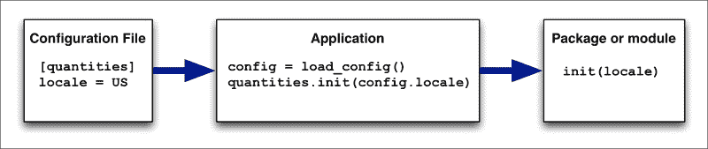

# 第七章：高级模块技术

在本章中，我们将研究一些更高级的模块和包的工作技术。特别是，我们将：

+   检查`import`语句可以使用的更不寻常的方式，包括可选导入、本地导入，以及通过更改`sys.path`来调整导入工作方式的方法

+   简要检查与导入模块和包相关的一些“陷阱”

+   看看如何使用 Python 交互解释器来帮助更快地开发你的模块和包

+   学习如何在模块或包内使用全局变量

+   看看如何配置一个包

+   了解如何将数据文件包含为 Python 包的一部分。

# 可选导入

尝试打开 Python 交互解释器并输入以下命令：

```py
import nonexistent_module

```

解释器将返回以下错误消息：

```py
ImportError: No module named 'nonexistent_module'

```

这对你来说不应该是个惊喜；如果在`import`语句中打错字，甚至可能在你自己的程序中看到这个错误。

这个错误的有趣之处在于它不仅适用于你打错字的情况。你也可以用它来测试这台计算机上是否有某个模块或包，例如：

```py
try:
    import numpy
    has_numpy = True
except ImportError:
    has_numpy = False
```

然后可以使用这个来让你的程序利用模块（如果存在），或者如果模块或包不可用，则执行其他操作，就像这样：

```py
if has_numpy:
    array = numpy.zeros((num_rows, num_cols), dtype=numpy.int32)
else:
    array = []
    for row in num_rows:
        array.append([])
```

在这个例子中，我们检查`numpy`库是否已安装，如果是，则使用`numpy.zeros()`创建一个二维数组。否则，我们使用一个列表的列表。这样，你的程序可以利用 NumPy 库的速度（如果已安装），同时如果这个库不可用，仍然可以工作（尽管速度较慢）。

### 注意

请注意，这个例子只是虚构的；你可能无法直接使用一个列表的列表而不是 NumPy 数组，并且在不做任何更改的情况下使你的程序的其余部分工作。但是，如果模块存在，则执行一项操作，如果不存在，则执行另一项操作的概念是相同的。

像这样使用可选导入是一个很好的方法，让你的模块或包利用其他库，同时如果它们没有安装也可以工作。当然，你应该在包的文档中始终提到这些可选导入，这样你的用户就会知道如果这些可选模块或包被安装会发生什么。

# 本地导入

在第三章中，*使用模块和包*，我们介绍了**全局命名空间**的概念，并展示了`import`语句如何将导入的模块或包的名称添加到全局命名空间。这个描述实际上是一个轻微的过度简化。事实上，`import`语句将导入的模块或包添加到*当前*命名空间，这可能是全局命名空间，也可能不是。

在 Python 中，有两个命名空间：全局命名空间和本地命名空间。全局命名空间是存储源文件中所有顶层定义的地方。例如，考虑以下 Python 模块：

```py
import random
import string

def set_length(length):
    global _length
    _length = length

def make_name():
    global _length

    letters = []
    for i in range(length):
        letters.append(random.choice(string.letters))
    return "".join(letters)
```

当你导入这个 Python 模块时，你将向全局命名空间添加四个条目：`random`、`string`、`set_length`和`make_name`。

### 注意

Python 解释器还会自动向全局命名空间添加几个其他条目。我们现在先忽略这些。

如果你然后调用`set_length()`函数，这个函数顶部的`global`语句将向模块的全局命名空间添加另一个条目，名为`_length`。`make_name()`函数也包括一个`global`语句，允许它在生成随机名称时引用全局`_length`值。

到目前为止一切都很好。可能不那么明显的是，在每个函数内部，还有一个称为**本地命名空间**的第二个命名空间，其中包含所有不是全局的变量和其他定义。在`make_name()`函数中，`letters`列表以及`for`语句使用的变量`i`都是*本地*变量——它们只存在于本地命名空间中，当函数退出时它们的值就会丢失。

本地命名空间不仅用于本地变量：你也可以用它来进行本地导入。例如，考虑以下函数：

```py
def delete_backups(dir):
    import os
    import os.path
    for filename in os.listdir(dir):
        if filename.endswith(".bak"):
            remove(os.path.join(dir, filename))
```

注意`os`和`os.path`模块是在函数内部导入的，而不是在模块或其他源文件的顶部。因为这些模块是在函数内部导入的，所以`os`和`os.path`名称被添加到本地命名空间而不是全局命名空间。

在大多数情况下，你应该避免使用本地导入：将所有的`import`语句放在源文件的顶部（使所有的导入语句都是全局的）可以更容易地一眼看出你的源文件依赖于哪些模块。然而，有两种情况下本地导入可能会有用：

1.  如果你要导入的模块或包特别大或初始化速度慢，使用本地导入而不是全局导入将使你的模块更快地导入。导入模块时的延迟只会在调用函数时显示出来。如果函数只在某些情况下被调用，这将特别有用。

1.  本地导入是避免循环依赖的好方法。如果模块 A 依赖于模块 B，模块 B 又依赖于模块 A，那么如果两组导入都是全局的，你的程序将崩溃。然而，将一组导入更改为本地导入将打破相互依赖，因为导入直到调用函数时才会发生。

作为一般规则，你应该坚持使用全局导入，尽管在特殊情况下，本地导入也可以非常有用。

# 使用 sys.path 调整导入

当你使用`import`命令时，Python 解释器必须搜索你想要导入的模块或包。它通过查找**模块搜索路径**来实现，这是一个包含各种目录的列表，模块或包可以在其中找到。模块搜索路径存储在`sys.path`中，Python 解释器将依次检查此列表中的目录，直到找到所需的模块或包。

当 Python 解释器启动时，它会使用以下目录初始化模块搜索路径：

+   包含当前执行脚本的目录，或者如果你在终端窗口中运行 Python 交互解释器，则为当前目录

+   `PYTHONPATH`环境变量中列出的任何目录

+   解释器的`site-packages`目录中的内容，包括`site-packages`目录中路径配置文件引用的任何模块

### 注意

`site-packages`目录用于保存各种第三方模块和包。例如，如果你使用 Python 包管理器`pip`来安装 Python 模块或包，那么该模块或包通常会放在`site-packages`目录中。

+   包含组成 Python 标准库的各种模块和包的多个目录

这些目录在`sys.path`中出现的顺序很重要，因为一旦找到所需名称的模块或包，搜索就会停止。

如果你愿意，你可以打印出你的模块搜索路径的内容，尽管列表可能会很长，而且很难理解，因为通常有许多包含 Python 标准库各个部分的目录，以及任何你可能安装的第三方包使用的其他目录：

```py
>>> import sys
>>> print(sys.path)
['', '/usr/local/lib/python3.3/site-packages', '/Library/Frameworks/SQLite3.framework/Versions/B/Python/3.3', '/Library/Python/3.3/site-packages/numpy-override', '/Library/Python/3.3/site-packages/pip-1.5.6-py3.3.egg', '/usr/local/lib/python3.3.zip', '/usr/local/lib/python3.3', '/usr/local/lib/python3.3/plat-darwin', '/usr/local/lib/python3.3/lib-dynload', '/Library/Frameworks/Python.framework/Versions/3.3/lib/python3.3', '/Library/Frameworks/Python.framework/Versions/3.3/lib/python3.3/plat-darwin']

```

重要的是要记住，这个列表是按顺序搜索的，直到找到匹配项为止。一旦找到具有所需名称的模块或包，搜索就会停止。

现在，`sys.path`不仅仅是一个只读列表。如果您更改此列表，例如通过添加新目录，您将更改 Python 解释器搜索模块的位置。

### 注意

实际上，有一些模块是内置到 Python 解释器中的；这些模块总是直接导入，忽略模块搜索路径。要查看已内置到您的 Python 解释器中的模块，可以执行以下命令：

```py
import sys
print(sys.builtin_module_names)
```

如果尝试导入这些模块之一，无论您对模块搜索路径做了什么，始终会使用内置版本。

虽然您可以对`sys.path`进行任何更改，例如删除或重新排列此列表的内容，但最常见的用法是向列表添加条目。例如，您可能希望将您创建的各种模块和包存储在一个特殊的目录中，然后可以从任何需要它的 Python 程序中访问。例如，假设您在`/usr/local/shared-python-libs`目录中有一个包含您编写的几个模块和包的目录，您希望在多个不同的 Python 程序中使用。在该目录中，假设您有一个名为`utils.py`的模块和一个名为`approxnums`的包，您希望在程序中使用。虽然简单的`import utils`会导致`ImportError`，但您可以通过以下方式使`shared-python-libs`目录的内容可用于程序：

```py
import sys
sys.path.append("/usr/local/shared-python-libs")
import utils, approxnums
```

### 提示

您可能想知道为什么不能只将共享模块和包存储在`site-packages`目录中。这有两个原因：首先，因为`site-packages`目录通常受保护，只有管理员才能写入，这使得在该目录中创建和修改文件变得困难。第二个原因是，您可能希望将自己的共享模块与您安装的其他第三方模块分开。

在前面的例子中，我们通过将我们的`shared-python-libs`目录附加到此列表的末尾来修改了`sys.path`。虽然这样做有效，但要记住，模块搜索路径是按顺序搜索的。如果在模块搜索路径上的任何目录中有任何其他模块命名为`utils.py`，那么该模块将被导入，而不是您的`shared-python-libs`目录中的模块。因此，与其附加，您通常会以以下方式修改`sys.path`：

```py
sys.path.insert(1, "/usr/local/shared-python-libs")
```

请注意，我们使用的是`insert(1, ...)`而不是`insert(0, ...)`。这会将新目录添加为`sys.path`中的*第二*个条目。由于模块搜索路径中的第一个条目通常是包含当前执行脚本的目录，将新目录添加为第二个条目意味着程序的目录将首先被搜索。这有助于避免混淆的错误，其中您在程序目录中定义了一个模块，却发现导入了一个同名的不同模块。因此，当向`sys.path`添加目录时，使用`insert(1, ...)`是一个良好的做法。

请注意，与任何其他技术一样，修改`sys.path`可能会被滥用。如果您的可重用模块或包修改了`sys.path`，您的代码用户可能会因为您更改了模块搜索路径而困惑，从而出现微妙的错误。一般规则是，您应该只在主程序中而不是在可重用模块中更改模块搜索路径，并始终清楚地记录您所做的工作，以免出现意外。

# 导入陷阱

虽然模块和包非常有用，但在使用模块和包时可能会遇到一些微妙的问题，这些问题可能需要很长时间才能解决。在本节中，我们将讨论一些您在使用模块和包时可能遇到的更常见的问题。

## 使用现有名称作为您的模块或包

假设您正在编写一个使用 Python 标准库的程序。例如，您可能会使用`random`模块来执行以下操作：

```py
import random
print(random.choice(["yes", "no"]))
```

您的程序一直正常工作，直到您决定主脚本中有太多数学函数，因此对其进行重构，将这些函数移动到一个单独的模块中。您决定将此模块命名为`math.py`，并将其存储在主程序的目录中。一旦这样做，之前的代码将会崩溃，并显示以下错误：

```py
Traceback (most recent call last):
 **File "main.py", line 5, in <module>
 **import random
 **File "/Library/Frameworks/Python.framework/Versions/3.3/lib/python3.3/random.py", line 41, in <module>
 **from math import log as _log, exp as _exp, pi as _pi, e as _e, ceil as _ceil
ImportError: cannot import name log

```

这到底是怎么回事？原本正常运行的代码现在崩溃了，尽管您没有对其进行更改。更糟糕的是，回溯显示它在程序导入 Python 标准库的模块时崩溃！

要理解这里发生了什么，您需要记住，默认情况下，模块搜索路径包括当前程序目录作为第一个条目——在指向 Python 标准库各个部分的其他条目之前。通过在程序中创建一个名为`math.py`的新模块，您已经使得 Python 解释器无法从 Python 标准库加载`math.py`模块。这不仅适用于您编写的代码，还适用于模块搜索路径上的*任何*模块或包，它们可能尝试从 Python 标准库加载此模块。在这个例子中，失败的是`random`模块，但它可能是任何依赖于`math`库的模块。

这被称为**名称屏蔽**，是一个特别阴险的问题。为了避免这种情况，您在选择程序中顶层模块和包的名称时，应该始终小心，以确保它们不会屏蔽 Python 标准库中的模块，无论您是否使用该模块。

避免名称屏蔽的一种简单方法是利用包来组织您在程序中编写的模块和包。例如，您可以创建一个名为`lib`的顶层包，并在`lib`包内创建各种模块和包。由于 Python 标准库中没有名为`lib`的模块或包，因此无论您为`lib`包内的模块和包选择什么名称，都不会有屏蔽标准库模块的风险。

## 将 Python 脚本命名为模块或包

名称屏蔽的一个更微妙的例子可能发生在您有一个 Python 脚本，其名称与 Python 标准库中的一个模块相同。例如，假设您想弄清楚`re`模块（[`docs.python.org/3.3/library/re.html`](https://docs.python.org/3.3/library/re.html)）的工作原理。如果您之前没有使用过正则表达式，这个模块可能会有点令人困惑，因此您可能决定编写一个简单的测试脚本来了解它的工作原理。这个测试脚本可能包括以下代码：

```py
import re

pattern = input("Regular Expression: ")
s = input("String: ")

results = re.search(pattern, s)

print(results.group(), results.span())
```

这个程序可能会帮助您弄清楚`re`模块的作用，但如果您将此脚本保存为`re.py`，当运行程序时会出现一个神秘的错误：

```py
$ python re.py
Regular Expression: [0-9]+
String: test123abc
Traceback (most recent call last):
...
File "./re.py", line 9, in <module>
 **results = re.search(pattern, s)
AttributeError: 'module' object has no attribute 'search'

```

你能猜到这里发生了什么吗？答案再次在于模块搜索路径。您的脚本名称`re.py`屏蔽了 Python 标准库中的`re`模块，因此当您的程序尝试导入`re`模块时，实际上加载的是脚本本身。您在这里看到`AttributeError`，是因为脚本成功地将自身作为模块加载，但该模块并没有您期望的`search()`函数。

### 注意

让脚本导入自身作为模块也可能导致意外问题；我们马上就会看到这一点。

这个问题的解决方法很简单：永远不要使用 Python 标准库模块的名称作为脚本的名称。而是将你的测试脚本命名为类似`re_test.py`的东西。

## 将包目录添加到 sys.path

一个常见的陷阱是将包目录添加到`sys.path`。让我们看看当你这样做时会发生什么。

创建一个目录来保存一个测试程序，并在这个主目录中创建一个名为`package`的子目录。然后，在`package`目录中创建一个空的包初始化（`__init__.py`）文件。同时，在同一个目录中创建一个名为`module.py`的模块。然后，将以下内容添加到`module.py`文件中：

```py
print("### Initializing module.py ###")
```

当导入模块时，这会打印出一条消息。接下来，在你的最顶层目录中创建一个名为`good_imports.py`的 Python 源文件，并输入以下 Python 代码到这个文件中：

```py
print("Calling import package.module...")
import package.module
print("Calling import package.module as module...")
import package.module as module
print("Calling from package import module...")
from package import module
```

保存这个文件后，打开一个终端或命令行窗口，并使用`cd`命令将当前目录设置为你最外层的目录（包含你的`good_imports.py`脚本的目录），然后输入`python good_imports.py`来运行这个程序。你应该会看到以下输出：

```py
$ python good_imports.py
Calling import package.module...
### Initializing module.py ###
Calling import package.module as module...
Calling from package import module...

```

正如你所看到的，第一个`import`语句加载了模块，导致打印出`### Initializing module.py ###`的消息。对于后续的`import`语句，不会发生初始化——相反，已经导入的模块副本会被使用。这是我们想要的行为，因为它确保我们只有一个模块的副本。这对于那些在全局变量中保存信息的模块非常重要，因为拥有不同副本的模块，其全局变量中的值不同，可能会导致各种奇怪和令人困惑的行为。

不幸的是，如果我们将一个包或包的子目录添加到`sys.path`中，我们可能会得到这样的结果。要看到这个问题的实际情况，创建一个名为`bad_imports.py`的新顶级脚本，并输入以下内容到这个文件中：

```py
import os.path
import sys

cur_dir = os.path.abspath(os.path.dirname(__file__))
package_dir = os.path.join(cur_dir, "package")

sys.path.insert(1, package_dir)

print("Calling import package.module as module...")
import package.module as module
print("Calling import module...")
import module
```

这个程序将`package_dir`设置为`package`目录的完整目录路径，然后将这个目录添加到`sys.path`中。然后，它进行了两个单独的`import`语句，一个是从名为`package`的包中导入`module`，另一个是直接导入`module`。这两个`import`语句都可以工作，因为模块可以以这两种方式访问。然而，结果并不是你可能期望的：

```py
$ python bad_imports.py
Calling import package.module as module...
### Initializing module.py ###
Calling import module...
### Initializing module.py ###

```

正如你所看到的，模块被导入了*两次*，一次是作为`package.module`，另一次是作为`module`。你最终会得到两个独立的模块副本，它们都被初始化，并作为两个不同的模块出现在 Python 系统中。

拥有两个模块副本可能会导致各种微妙的错误和问题。这就是为什么你永远不应该直接将 Python 包或 Python 包的子目录添加到`sys.path`中。

### 提示

当然，将包含包的目录添加到`sys.path`是可以的；只是不要添加包目录本身。

## 执行和导入相同的模块

另一个更微妙的双重导入问题的例子是，如果您执行一个 Python 源文件，然后导入同一个文件，就好像它是一个模块一样。要了解这是如何工作的，请创建一个目录来保存一个新的示例程序，并在该目录中创建一个名为`test.py`的新的 Python 源文件。然后，输入以下内容到这个文件中：

```py
import helpers

def do_something(n):
    return n * 2

if __name__ == "__main__":
    helpers.run_test()
```

当这个文件作为脚本运行时，它调用`helpers.run_test()`函数来开始运行一个测试。这个文件还定义了一个函数`do_something()`，执行一些有用的功能。现在，在同一个目录中创建第二个名为`helpers.py`的 Python 源文件，并输入以下内容到这个文件中：

```py
import test

def run_test():
    print(test.do_something(10))
```

正如你所看到的，`helpers.py`模块正在将`test.py`作为模块导入，然后调用`do_something()`函数作为运行测试的一部分。换句话说，即使`test.py`作为脚本执行，它也会作为模块被导入（间接地）作为该脚本的执行的一部分。

让我们看看当你运行这个程序时会发生什么：

```py
$ python test.py
20

```

到目前为止一切顺利。程序正在运行，尽管模块导入复杂，但似乎工作正常。但让我们更仔细地看一下；在你的`test.py`脚本顶部添加以下语句：

```py
print("Initializing test.py")
```

就像我们之前的例子一样，我们使用`print()`语句来显示模块何时被加载。这给了模块初始化的机会，我们期望只看到初始化发生一次，因为内存中应该只有每个模块的一个副本。

然而，在这种情况下，情况并非如此。尝试再次运行程序：

```py
$ python test.py
Initializing test.py
Initializing test.py
20

```

正如你所看到的，模块被初始化了*两次*——一次是当它作为脚本运行时，另一次是当`helpers.py`导入该模块时。

为了避免这个问题，请确保你编写的任何脚本只用作脚本。将任何其他代码（例如我们之前示例中的`do_something()`函数）从你的脚本中移除，这样你就永远不需要导入它们。

### 提示

请注意，这并不意味着你不能有变色龙模块，既可以作为模块又可以作为脚本，正如第三章中所描述的那样，*使用模块和包*。只是要小心，你执行的脚本只使用模块本身定义的函数。如果你开始从同一个包中导入其他模块，你可能应该将所有功能移动到一个不同的模块中，然后将其导入到你的脚本中，而不是让它们都在同一个文件中。

# 使用 Python 交互解释器的模块和包

除了从 Python 脚本中调用模块和包，直接从 Python 交互解释器中调用它们通常也很有用。这是使用 Python 编程的**快速应用开发**（**RAD**）技术的一个很好的方法：你对 Python 模块或包进行某种更改，然后立即通过从 Python 交互解释器调用该模块或包来看到你的更改的结果。

然而，还有一些限制和问题需要注意。让我们更仔细地看看你如何使用交互解释器来加快模块和包的开发；我们也会看到不同的方法可能更适合你。

首先创建一个名为`stringutils.py`的新 Python 模块，并将以下代码输入到这个文件中：

```py
import re

def extract_numbers(s):
    pattern = r'[+-]?\d+(?:\.\d+)?'
    numbers = []
    for match in re.finditer(pattern, s):
        number = s[match.start:match.end+1]
        numbers.append(number)
    return numbers
```

这个模块代表我们第一次尝试编写一个从字符串中提取所有数字的函数。请注意，它还没有工作——如果你尝试使用它，`extract_numbers()`函数将崩溃。它也不是特别高效（一个更简单的方法是使用`re.findall()`函数）。但我们故意使用这段代码来展示你如何将快速应用开发技术应用到你的 Python 模块中，所以请耐心等待。

这个函数使用`re`（正则表达式）模块来找到与给定表达式模式匹配的字符串部分。复杂的`pattern`字符串用于匹配数字，包括可选的`+`或`-`在前面，任意数量的数字，以及可选的小数部分在末尾。

使用`re.finditer()`函数，我们找到与我们的正则表达式模式匹配的字符串部分。然后提取字符串的每个匹配部分，并将结果附加到`numbers`列表中，然后将其返回给调用者。

这就是我们的函数应该做的事情。让我们来测试一下。

打开一个终端或命令行窗口，并使用`cd`命令切换到包含`stringutils.py`模块的目录。然后，输入`python`启动 Python 交互解释器。当 Python 命令提示符出现时，尝试输入以下内容：

```py
>>> import stringutils
>>> print(stringutils.extract_numbers("Tes1t 123.543 -10.6 5"))
Traceback (most recent call last):
 **File "<stdin>", line 1, in <module>
 **File "./stringutils.py", line 7, in extract_numbers
 **number = s[match.start:match.end+1]
TypeError: unsupported operand type(s) for +: 'builtin_function_or_method' and 'int'

```

正如你所看到的，我们的模块还没有工作——我们在其中有一个 bug。更仔细地看，我们可以看到问题在我们的`stringutils.py`模块的第 7 行：

```py
        number = s[match.start:match.end+1]
```

错误消息表明您正在尝试将内置函数（在本例中为`match.end`）添加到一个数字（`1`），这当然是行不通的。`match.start`和`match.end`值应该是字符串的开始和结束的索引，但是快速查看`re`模块的文档显示`match.start`和`match.end`是函数，而不是简单的数字，因此我们需要调用这些函数来获取我们想要的值。这样做很容易；只需编辑您的文件的第 7 行，使其看起来像下面这样：

```py
        number = s[match.start():match.end()+1]
```

现在我们已经更改了我们的模块，让我们看看会发生什么。我们将从重新执行`print()`语句开始，看看是否有效：

```py
>>> print(stringutils.extract_numbers("Tes1t 123.543 -10.6 5"))

```

### 提示

您知道您可以按键盘上的上箭头和下箭头键来浏览您之前在 Python 交互解释器中键入的命令历史记录吗？这样可以避免您不得不重新键入命令；只需使用箭头键选择您想要的命令，然后按*Return*执行它。

您将立即看到与之前看到的相同的错误消息-没有任何变化。这是因为您将模块导入 Python 解释器；一旦导入了模块或包，它就会保存在内存中，磁盘上的源文件将被忽略。

为了使您的更改生效，您需要**重新加载**模块。要做到这一点，请在 Python 解释器中键入以下内容：

```py
import importlib
importlib.reload(stringutils)

```

### 提示

如果您使用的是 Python 2.x，则无法使用`importlib`模块。相反，只需键入`reload(stringutils)`。如果您使用的是 Python 3.3 版本，则使用`imp`而不是`importlib`。

现在尝试重新执行`print()`语句：

```py
>>> stringutils.extract_numbers("Hell1o 123.543 -10.6 5 there")
['1o', '123.543 ', '-10.6 ', '5 ']

```

这好多了-我们的程序现在可以正常运行了。然而，我们还需要解决一个问题：当我们提取组成数字的字符时，我们提取了一个多余的字符，所以数字`1`被返回为`1o`等等。要解决这个问题，请从源文件的第 7 行中删除`+1`：

```py
        number = s[match.start():match.end()]
```

然后，再次重新加载模块并重新执行您的`print()`语句。您应该会看到以下内容：

```py
['1', '123.543', '-10.6', '5']

```

完美！如果您愿意，您可以使用`float()`函数将这些字符串转换为浮点数，但对于我们的目的，这个模块现在已经完成了。

让我们退一步，回顾一下我们所做的事情。我们有一个有错误的模块，并使用 Python 交互解释器来帮助识别和修复这些问题。我们反复测试我们的程序，注意到一个错误，并修复它，使用 RAD 方法快速找到和纠正我们模块中的错误。

在开发模块和包时，通常有助于在交互解释器中进行测试，以便在进行过程中找到并解决问题。您只需记住，每次对 Python 源文件进行更改时，您都需要调用`importlib.reload()`来重新加载受影响的模块或包。

以这种方式使用 Python 交互解释器也意味着您可以使用完整的 Python 系统进行测试。例如，您可以使用 Python 标准库中的`pprint`模块来漂亮地打印复杂的字典或列表，以便您可以轻松地查看一个函数返回的信息。

然而，在`importlib.reload()`过程中存在一些限制：

+   想象一下，您有两个模块 A 和 B。模块 A 使用`from B import...`语句从模块 B 加载功能。如果您更改了模块 B，那么模块 A 将不会使用更改后的功能，除非您也重新加载该模块。

+   如果您的模块在初始化时崩溃，它可能会处于奇怪的状态。例如，想象一下，您的模块包括以下顶层代码，它应该初始化一个客户列表：

```py
customers = []
customers.append("Mike Wallis")
cusotmers.append("John Smith")
```

这个模块将被导入，但由于变量名拼写错误，它将在初始化期间引发异常。如果发生这种情况，您首先需要在 Python 交互解释器中使用`import`命令使模块可用，然后使用`imp.reload()`来加载更新后的源代码。

+   因为您必须手动输入命令或从 Python 命令历史记录中选择命令，所以反复运行相同的代码可能会变得乏味，特别是如果您的测试涉及多个步骤。在使用交互式解释器时，很容易错过某个步骤。

因此，最好使用交互式解释器来修复特定问题或帮助您快速开发特定的小代码片段。当测试变得复杂或者需要与多个模块一起工作时，自定义编写的脚本效果更好。

# 处理全局变量

我们已经看到如何使用全局变量在模块内的不同函数之间共享信息。我们已经看到如何在模块内将全局变量定义为顶级变量，导致它们在导入模块时首次初始化，并且我们还看到如何在函数内使用`global`语句允许该函数访问和更改全局变量的值。

在本节中，我们将进一步学习如何在*模块之间*共享全局变量。在创建包时，通常需要定义可以被该包内任何模块访问或更改的变量。有时，还需要将变量提供给包外的 Python 代码。让我们看看如何实现这一点。

创建一个名为`globtest`的新目录，并在此目录中创建一个空的包初始化文件，使其成为 Python 包。然后，在此目录中创建一个名为`globals.py`的文件，并输入以下内容到此文件中：

```py
language = None
currency = None
```

在这个模块中，我们已经定义了两个全局变量，我们希望在我们的包中使用，并为每个变量设置了默认值`None`。现在让我们在另一个模块中使用这些全局变量。

在`globtest`目录中创建另一个名为`test.py`的文件，并输入以下内容到此文件中：

```py
from . import globals

def test():
    globals.language = "EN"
    globals.currency = "USD"
    print(globals.language, globals.currency)
```

要测试您的程序，请打开终端或命令行窗口，使用`cd`命令移动到包含您的`globtest`包的目录，并输入`python`启动 Python 交互解释器。然后，尝试输入以下内容：

```py
>>>** **from globtest import test
>>> test.test()
EN USD

```

如您所见，我们已成功设置了存储在我们的`globals`模块中的`language`和`currency`全局变量的值，然后再次检索这些值以打印它们。因为我们将这些全局变量存储在一个单独的模块中，所以您可以在当前包内的任何地方或者甚至在导入您的包的其他代码中检索或更改这些全局变量。使用单独的模块来保存包的全局变量是管理包内全局变量的一种绝佳方式。

然而，需要注意一点：要使全局变量在模块之间共享，必须导入包含该全局变量的*模块*，而不是变量本身。例如，以下内容不起作用：

```py
from .test import language
```

这个声明的作用是将`language`变量的副本导入到当前模块的全局命名空间中，而不是原始全局命名空间。这意味着全局变量不会与其他模块共享。要使变量在模块之间共享，需要导入`globals`模块，而不是其中的变量。

# 包配置

随着您开发更复杂的模块和包，通常会发现您的代码在使用之前需要以某种方式*配置*。例如，想象一下，您正在编写一个使用数据库的包。为了做到这一点，您的包需要知道要使用的数据库引擎，数据库的名称，以及用于访问该数据库的用户名和密码。

你可以将这些信息硬编码到程序的源代码中，但这样做是一个非常糟糕的主意，有两个原因：

+   不同的计算机和不同的操作系统将使用不同的数据库设置。由于用于访问数据库的信息会因计算机而异，任何想要使用你的包的人都必须直接编辑源代码以输入正确的数据库详细信息，然后才能运行包。

+   用于访问数据库的用户名和密码是非常敏感的信息。如果你与其他人分享你的包，甚至只是将你的包源代码存储在 GitHub 等公共仓库上，那么其他人就可以发现你的数据库访问凭据。这是一个巨大的安全风险。

这些数据库访问凭据是*包配置*的一个例子——在你的包运行之前需要的信息，但你不希望将其构建到包的源代码中。

如果你正在构建一个应用程序而不是一个独立的模块或包，那么你的配置任务就简单得多了。Python 标准库中有一些模块可以帮助配置，例如`configparser`、`shlex`和`json`。使用这些模块，你可以将配置设置存储在磁盘上的文件中，用户可以编辑。当你的程序启动时，你将这些设置加载到内存中，并根据需要访问它们。因为配置设置是存储在应用程序外部的，用户不需要编辑你的源代码来配置程序，如果你的源代码被发布或共享，你也不会暴露敏感信息。

然而，当编写模块和包时，基于文件的配置方法就不那么方便了。没有明显的地方来存储包的配置文件，要求配置文件位于特定位置会使你的模块或包更难以作为不同程序的一部分进行重用。

相反，模块或包的配置通常是通过向模块或包的初始化函数提供参数来完成的。我们在上一章中看到了一个例子，在那里`quantities`包在初始化时需要你提供一个`locale`值：

```py
quantities.init("us")
```

这将配置的工作交给了周围的应用程序；应用程序可以利用配置文件或任何其他喜欢的配置方案，并且是应用程序在包初始化时提供包的配置设置：



这对包开发者来说更加方便，因为包所需要做的就是记住它所得到的设置。

虽然`quantities`包只使用了一个配置设置（区域的名称），但是包通常会使用许多设置。为包提供配置设置的一个非常方便的方式是使用 Python 字典。例如：

```py
mypackage.init({'log_errors'  : True,
                'db_password' : "test123",
                ...})
```

使用字典这种方式可以很容易地支持包的配置设置的*默认值*。以下 Python 代码片段展示了一个包的`init()`函数如何接受配置设置，提供默认值，并将设置存储在全局变量中，以便在需要时可以访问：

```py
def init(settings):
    global config

    config = {}
    config['log_errors']  = settings.get("log_errors",  False)
    config['db_password'] = settings.get("db_password", "")
    ...
```

使用`dict.get()`这种方式，如果已经提供了设置，你就可以检索到该设置，同时提供一个默认值以供在未指定设置时使用。这是处理 Python 模块或包中配置的理想方式，使得模块或包的用户可以根据需要配置它，同时仍然将配置设置的存储方式和位置的细节留给应用程序。

# 包数据

软件包可能包含的不仅仅是 Python 源文件。有时，您可能还需要包含其他类型的文件。例如，一个软件包可能包括一个或多个图像文件，一个包含美国所有邮政编码列表的大型文本文件，或者您可能需要的任何其他类型的数据。如果您可以将某些东西存储在文件中，那么您可以将此文件包含为 Python 软件包的一部分。

通常，您会将软件包数据放在软件包目录中的一个单独的子目录中。要访问这些文件，您的软件包需要知道在哪里找到这个子目录。虽然您可以将该目录的位置硬编码到您的软件包中，但如果您的软件包要被重用或移动，这种方法将行不通。这也是不必要的，因为您可以使用以下代码轻松找到模块所在的目录：

```py
cur_dir = os.path.abspath(os.path.dirname(__file__))
```

这将为您提供包含当前模块的完整路径。使用`os.path.join()`函数，然后可以访问包含数据文件的子目录，并以通常的方式打开它们：

```py
phone_numbers = []
cur_dir = os.path.abspath(os.path.dirname(__file__))
file = open(os.path.join(cur_dir, "data", "phone_numbers.txt"))
for line in file:
    phone_numbers.append(line.strip())
file.close()
```

将数据文件包含在软件包中的好处是，数据文件实际上是软件包源代码的一部分。当您分享软件包或将其上传到 GitHub 等源代码存储库时，数据文件将自动包含在软件包的其余部分中。这使得更容易跟踪软件包使用的数据文件。

# 总结

在本章中，我们看了一些与在 Python 中使用模块和软件包相关的更高级方面。我们看到`try..except`语句如何用于实现可选导入，以及如何将`import`语句放在函数内，以便在执行该函数时仅导入模块。然后我们了解了模块搜索路径以及如何修改`sys.path`以改变 Python 解释器查找模块和软件包的方式。

然后，我们看了一些与使用模块和软件包相关的陷阱。我们了解了名称屏蔽，其中您定义了与 Python 标准库中的模块或软件包相同名称的模块或软件包，这可能导致意外的失败。我们看了一下，给 Python 脚本与标准库模块相同的名称也可能导致名称屏蔽问题，以及如何将软件包目录或子目录添加到`sys.path`可能导致模块被加载两次，从而导致该模块中的全局变量出现微妙的问题。我们看到执行一个模块然后导入它也会导致该模块被加载两次，这可能再次导致问题。

接下来，我们将看看如何使用 Python 交互式解释器作为一种快速应用程序开发（RAD）工具，快速查找和修复模块和软件包中的问题，以及`importlib.reload()`命令允许您在更改底层源代码后重新加载模块

我们通过学习如何定义在整个软件包中使用的全局变量，如何处理软件包配置以及如何在软件包中存储和访问数据文件来完成了对高级模块技术的调查。

在下一章中，我们将看一些您可以测试、部署和分享 Python 模块和软件包的方式。
