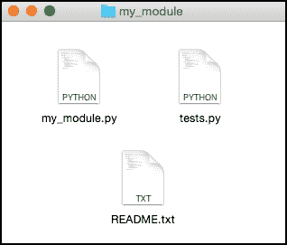
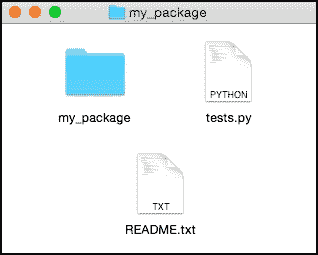
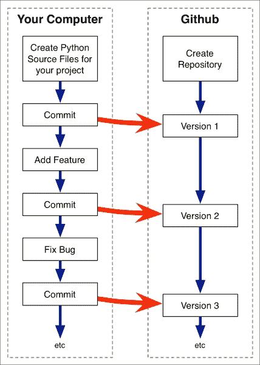
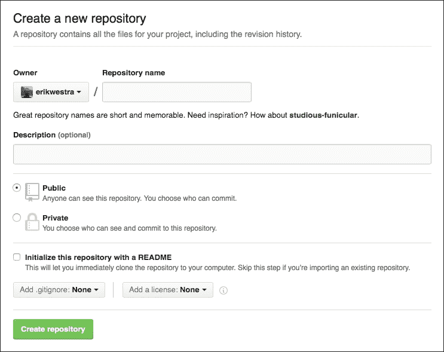
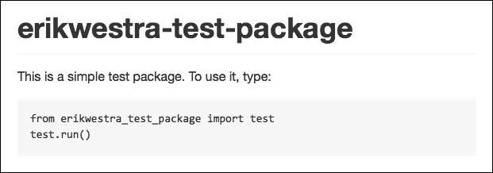
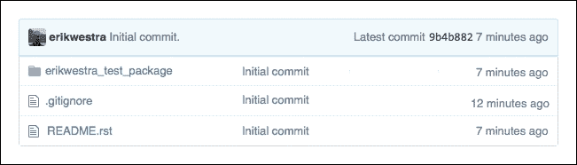
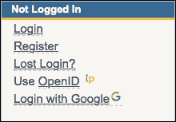
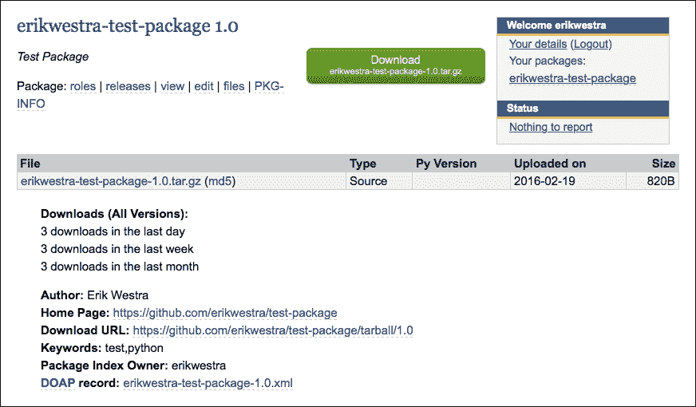

# 第八章：测试和部署模块

在本章中，我们将进一步探讨共享模块的概念。在您共享模块或包之前，您需要对其进行测试，以确保其正常工作。您还需要准备您的代码并了解如何部署它。为了学习这些内容，我们将涵盖以下主题：

+   了解单元测试如何用于确保您的模块或包正常工作

+   了解如何准备模块或包以供发布

+   了解 GitHub 如何用于与他人共享您的代码

+   审查提交代码到 Python 包索引所涉及的步骤

+   了解如何使用 pip 安装和使用其他人编写的包

# 测试模块和包

测试是编程的正常部分：您测试代码以验证其是否正常工作并识别任何错误或其他问题，然后您可以修复。然后，您继续测试，直到您满意您的代码正常工作为止。

然而，程序员经常只进行**临时测试**：他们启动 Python 交互解释器，导入他们的模块或包，并进行各种调用以查看发生了什么。在上一章中，我们使用`importlib.reload()`函数进行了一种临时测试形式，以支持您的代码的 RAD 开发。

临时测试很有用，但并不是唯一的测试形式。如果您与他人共享您的模块和包，您将希望您的代码没有错误，并临时测试无法保证这一点。一个更好和更系统的方法是为您的模块或包创建一系列**单元测试**。单元测试是 Python 代码片段，用于测试代码的各个方面。由于测试是由 Python 程序完成的，因此您可以在需要测试代码时运行程序，并确保每次运行测试时都会测试所有内容。单元测试是确保在进行更改时错误不会进入您的代码的绝佳方法，并且您可以在需要共享代码时运行它们，以确保其正常工作。

### 注意

单元测试并不是您可以进行的唯一一种程序化测试。**集成测试**结合各种模块和系统，以确保它们正确地一起工作，**GUI 测试**用于确保程序的用户界面正常工作。然而，单元测试对于测试模块和包是最有用的，这也是我们将在本章中重点关注的测试类型。

以下是一个非常简单的单元测试示例：

```py
import math
assert math.floor(2.6197) == 2
```

`assert`语句检查其后的表达式。如果此表达式不计算为`True`，则会引发`AssertionError`。这使您可以轻松检查给定函数是否返回您期望的结果；在此示例中，我们正在检查`math.floor()`函数是否正确返回小于或等于给定浮点数的最大整数。

因为模块或包最终只是一组 Python 函数（或方法，它们只是分组到类中的函数），因此很可能编写一系列调用您的函数并检查返回值是否符合预期的`assert`语句。

当然，这是一个简化：通常调用一个函数的结果会影响另一个函数的输出，并且您的函数有时可以执行诸如与远程 API 通信或将数据存储到磁盘文件中等相当复杂的操作。然而，在许多情况下，您仍然可以使用一系列`assert`语句来验证您的模块和包是否按您的预期工作。

## 使用 unittest 标准库模块进行测试

虽然您可以将您的`assert`语句放入 Python 脚本中并运行它们，但更好的方法是使用 Python 标准库中的`unittest`模块。该模块允许您将单元测试分组为**测试用例**，在运行测试之前和之后运行额外的代码，并访问各种不同类型的`assert`语句，以使您的测试更加容易。

让我们看看如何使用`unittest`模块为我们在第六章中实现的`quantities`包实施一系列单元测试。将此包的副本放入一个方便的目录中，并在同一目录中创建一个名为`test_quantities.py`的新的 Python 源文件。然后，将以下代码添加到此文件中：

```py
import unittest
import quantities

class TestQuantities(unittest.TestCase):
    def setUp(self):
        quantities.init("us")

    def test_new(self):
        q = quantities.new(12, "km")
        self.assertEqual(quantities.value(q), 12)
        self.assertEqual(quantities.units(q), "kilometer")

    def test_convert(self):
        q1 = quantities.new(12, "km")
        q2 = quantities.convert(q1, "m")
        self.assertEqual(quantities.value(q2), 12000)
        self.assertEqual(quantities.units(q2), "meter")

if __name__ == "__main__":
    unittest.main()
```

### 提示

请记住，您不需要手动输入此程序。所有这些源文件，包括`quantities`包的完整副本，都作为本章的示例代码的一部分可供下载。

让我们更仔细地看看这段代码做了什么。首先，`TestQuantities`类用于保存多个相关的单元测试。通常，您会为需要执行的每个主要单元测试组定义一个单独的`unittest.TestCase`子类。在我们的`TestQuantities`类中，我们定义了一个`setUp()`方法，其中包含需要在运行测试之前执行的代码。如果需要，我们还可以定义一个`tearDown()`方法，在测试完成后执行。

然后，我们定义了两个单元测试，我们称之为`test_new()`和`test_convert()`。它们分别测试`quantities.new()`和`quantities.convert()`函数。您通常会为需要测试的每个功能单独创建一个单元测试。您可以随意命名您的单元测试，只要方法名以`test`开头即可。

在我们的`test_new()`单元测试中，我们创建一个新的数量，然后调用`self.assertEqual()`方法来确保已创建预期的数量。正如您所见，我们不仅仅局限于使用内置的`assert`语句；您可以调用几十种不同的`assertXXX()`方法来以各种方式测试您的代码。如果断言失败，所有这些方法都会引发`AssertionError`。

我们测试脚本的最后部分在脚本执行时调用`unittest.main()`。这个函数会查找您定义的任何`unittest.TestCase`子类，并依次运行每个测试用例。对于每个测试用例，如果存在，将调用`setUp()`方法，然后调用您定义的各种`testXXX()`方法，最后，如果存在，将调用`teardown()`方法。

让我们尝试运行我们的单元测试。打开一个终端或命令行窗口，使用`cd`命令将当前目录设置为包含您的`test_quantities.py`脚本的目录，并尝试输入以下内容：

```py
python test_quantities.py

```

一切顺利的话，您应该会看到以下输出：

```py
..
---------------------------------------------------------------
Ran 2 tests in 0.000s

OK

```

默认情况下，`unittest`模块不会显示有关已运行的测试的详细信息，除了它已经无问题地运行了您的单元测试。如果您需要更多细节，您可以增加测试的**详细程度**，例如通过在测试脚本中的`unittest.main()`语句中添加参数：

```py
    unittest.main(verbosity=2)
```

或者，您可以使用`-v`命令行选项来实现相同的结果：

```py
python test_quantities.py -v

```

## 设计您的单元测试

单元测试的目的是检查您的代码是否正常工作。一个很好的经验法则是为包中的每个公共可访问模块单独编写一个测试用例，并为该模块提供的每个功能单独编写一个单元测试。单元测试代码应该至少测试功能的通常操作，以确保其正常工作。如果需要，您还可以选择在单元测试中编写额外的测试代码，甚至额外的单元测试，以检查代码中特定的**边缘情况**。

举个具体的例子，在我们在前一节中编写的`test_convert()`方法中，您可能希望添加代码来检查如果用户尝试将距离转换为重量，则是否会引发适当的异常。例如：

```py
q = quantities.new(12, "km")
with self.assertRaises(ValueError):
    quantities.convert(q, "kg")
```

问题是：您应该为多少边缘情况进行测试？有数百种不同的方式可以使用您的模块不正确。您应该为这些每一种编写单元测试吗？

一般来说，不值得尝试测试每种可能的边缘情况。当然，您可能希望测试一些主要可能性，只是为了确保您的模块能够处理最明显的错误，但除此之外，编写额外的测试可能不值得努力。

## 代码覆盖

**覆盖率**是您的单元测试测试了您的代码多少的度量。要理解这是如何工作的，请考虑以下 Python 函数：

```py
[1] def calc_score(x, y):
[2]     if x == 1:
[3]         score = y * 10
[4]     elif x == 2:
[5]         score = 25 + y
[6]     else:
[7]         score = y
[8]
[9]     return score
```

### 注意

我们已经在每一行的开头添加了行号，以帮助我们计算代码覆盖率。

现在，假设我们为我们的`calc_score()`函数创建以下单元测试代码：

```py
assert calc_score(1, 5) == 50
assert calc_score(2, 10) == 35
```

我们的单元测试覆盖了`calc_score()`函数的多少？我们的第一个`assert`语句调用`calc_score()`，`x`为`1`，`y`为`5`。如果您按照行号，您会发现使用这组参数调用此函数将导致执行第 1、2、3 和 9 行。类似地，第二个`assert`语句调用`calc_score()`，`x`为`2`，`y`为`10`，导致执行第 1、4、5 和 9 行。

总的来说，这两个 assert 语句导致执行第 1、2、3、4、5 和 9 行。忽略空行，我们的测试没有包括第 6 和第 7 行。因此，我们的单元测试覆盖了函数中的八行中的六行，给我们一个代码覆盖率值为 6/8 = 75%。

### 注意

我们在这里看的是**语句覆盖率**。还有其他更复杂的衡量代码覆盖率的方法，我们在这里不会深入讨论。

显然，您不会手动计算代码覆盖率。有一些出色的工具可以计算 Python 测试代码的代码覆盖率。例如，看看`coverage`包（[`pypi.python.org/pypi/coverage`](https://pypi.python.org/pypi/coverage)）。

代码覆盖的基本概念是，您希望您的测试覆盖*所有*您的代码。无论您是否使用诸如`coverage`之类的工具来衡量代码覆盖率，编写单元测试以尽可能包含接近 100%的代码是一个好主意。

## 测试驱动开发

当我们考虑测试 Python 代码的想法时，值得提到**测试驱动开发**的概念。使用测试驱动开发，您首先选择您希望您的模块或包执行的操作，然后编写单元测试以确保模块或包按照您的期望工作—*在您编写它之前*。这样，单元测试充当了模块或包的一种规范；它们告诉您您的代码应该做什么，然后您的任务是编写代码以使其通过所有测试。

测试驱动开发可以是实现模块和包的有用方式。当然，您是否使用它取决于您，但是如果您有纪律写单元测试，测试驱动开发可以是确保您正确实现了代码的一个很好的方式，并且您的模块在代码增长和变化的过程中继续按照您的期望工作。

## Mocking

如果您的模块或包调用外部 API 或执行其他复杂、昂贵或耗时的操作，您可能希望在 Python 标准库中调查`unittest.mock`包。**Mocking**是用程序中的虚拟函数替换某些功能的过程，该虚拟函数立即返回适合测试的数据。

模拟是一个复杂的过程，要做对可能需要一些时间，但如果您想要对本来会太慢、每次运行都会花费金钱或依赖外部系统运行的代码运行单元测试，这种技术绝对是值得的。

## 为您的模块和包编写单元测试

现在我们已经介绍了单元测试的概念，看了一下`unittest`标准库模块的工作原理，并研究了编写单元测试的一些更复杂但重要的方面，现在让我们看看单元测试如何可以用来辅助开发和测试您的模块和包。

首先，您应该至少为您的模块或包定义的主要函数编写单元测试。从测试最重要的函数开始，并为更明显的错误条件添加测试，以确保错误被正确处理。您可以随时为代码中更隐晦的部分添加额外的测试。

如果您为单个模块编写单元测试，您应该将测试代码放在一个单独的 Python 脚本中，例如命名为`tests.py`，并将其放在与您的模块相同的目录中。下面的图片展示了在编写单个模块时组织代码的好方法：



如果您在同一个目录中有多个模块，您可以将所有模块的单元测试合并到`tests.py`脚本中，或者将其重命名为类似`test_my_module.py`的名称，以明确测试的是哪个模块。

对于一个包，确保将`tests.py`脚本放在包所在的目录中，而不是包内部：



如果您将`test.py`脚本放在包目录中，当您的单元测试尝试导入包时，您可能会遇到问题。

您的`tests.py`脚本应该为包中每个公开可访问的模块定义一个`unittest.TestCase`对象，并且这些对象中的每一个都应该有一个`testXXX()`方法，用于定义模块中的每个函数或主要功能。

这样做可以通过执行以下命令简单地测试您的模块或包：

```py
python test.py

```

每当您想要检查您的模块是否工作时，特别是在上传或与其他人分享您的模块或包之前，您应该运行单元测试。

# 准备模块或包以供发布

在第六章*创建可重用模块*中，我们看了一些使模块或包适合重用的东西：

+   它必须作为一个独立的单元运行

+   一个包应该理想地使用相对导入

+   您的模块或包中的任何外部依赖关系必须清楚地注明

我们还确定了三个有助于创建优秀可重用模块或包的东西：

+   它应该解决一个普遍的问题

+   您的代码应该遵循标准的编码约定

+   您的模块或包应该有清晰的文档

准备您的模块或包以供发布的第一步是确保您至少遵循了这些准则中的前三条，最好是所有六条。

第二步是确保您至少编写了一些单元测试，并且您的模块或包通过了所有这些测试。最后，您需要决定*如何*发布您的代码。

如果你想与朋友或同事分享你的代码，或者写一篇博客文章并附上你的代码链接，那么最简单的方法就是将其上传到 GitHub 等源代码仓库中。我们将在下一节中看看如何做到这一点。除非你将其设为私有，否则任何拥有正确链接的人都可以访问你的代码。人们可以在线查看你的源代码（包括文档），下载你的模块或包用于他们自己的程序，并且“fork”你的代码，创建他们自己的私人副本，然后进行修改。

如果你想与更广泛的受众分享你的代码，最好的方法是将其提交到**Python Package Index**（**PyPI**）。这意味着其他人可以通过在 PyPI 索引中搜索来找到你的模块或包，并且任何人都可以使用**pip**，Python 包管理器来安装它。本章的后续部分将描述如何将你的模块或包提交到 PyPI，以及如何使用 pip 来下载和使用模块和包。

# 将你的工作上传到 GitHub。

GitHub（[`github.com/`](https://github.com/)）是一个流行的基于 Web 的存储和管理源代码的系统。虽然有几种替代方案，但 GitHub 在编写和分享开源 Python 代码的人中特别受欢迎，这也是我们在本书中将使用的源代码管理系统。

在深入讨论 GitHub 的具体内容之前，让我们先看看源代码管理系统是如何工作的，以及为什么你可能想要使用它。

想象一下，你正在编写一个复杂的模块，并在文本编辑器中打开了你的模块进行一些更改。在进行这些更改的过程中，你不小心选择了 100 行代码，然后按下了*删除*键。在意识到自己做了什么之前，你保存并关闭了文件。太迟了：那 100 行文本已经消失了。

当然，你可能（并且希望）有一个备份系统，定期备份你的源文件。但如果你在过去几分钟内对一些丢失的代码进行了更改，那么你很可能已经丢失了这些更改。

现在考虑这样一种情况：你与同事分享了一个模块或包，他们决定做一些更改。也许有一个需要修复的错误，或者他们想要添加一个新功能。他们改变了你的代码，并在附有说明的情况下将其发送回给你。不幸的是，除非你比较原始版本和修改后的源文件中的每一行，否则你无法确定你的同事对你的文件做了什么。

源代码管理系统解决了这些问题。你不仅仅是在硬盘上的一个目录中拥有你的模块或包的副本，而是在像 GitHub 这样的源代码管理系统中创建一个**仓库**，并将你的源代码**提交**到这个仓库中。然后，当你对文件进行更改，修复错误和添加功能时，你将每个更改都提交回仓库。源代码仓库跟踪了你所做的每一次更改，允许你准确地查看随时间发生的变化，并在必要时撤消先前所做的更改。

你不仅仅局限于让一个人来工作在一个模块或包上。人们可以**fork**你的源代码仓库，创建他们自己的私人副本，然后使用这个私人副本来修复错误和添加新功能。一旦他们这样做了，他们可以向你发送一个**pull request**，其中包括他们所做的更改。然后你可以决定是否将这些更改合并到你的项目中。

不要太担心这些细节，源代码管理是一个复杂的话题，使用 GitHub 等工具可以执行许多复杂的技巧来管理源代码。要记住的重要事情是，创建一个存储库来保存模块或软件包的源代码的主要副本，将代码提交到这个存储库中，然后每次修复错误或添加新功能时都要继续提交。以下插图总结了这个过程：



源代码管理系统的诀窍是定期提交 - 每次添加新功能或修复错误时，您都应立即提交更改。这样，存储库中一个版本和下一个版本之间的差异只是添加了一个功能或修复了一个问题的代码。如果在提交之前对源代码进行了多次更改，存储库将变得不那么有用。

既然我们已经了解了源代码管理系统的工作原理，让我们实施一个真实的示例，看看如何使用 GitHub 来管理您的源代码。首先，转到 GitHub 的主要网站（[`github.com/`](https://github.com/)）。如果您没有 GitHub 帐户，您需要注册，选择一个唯一的用户名，并提供联系电子邮件地址和密码。如果您以前使用过 GitHub，可以使用已设置的用户名和密码登录。

请注意，注册和使用 GitHub 是免费的；唯一的限制是您创建的每个存储库都将是公开的，因此任何希望的人都可以查看您的源代码。如果您想要，您可以设置私有存储库，但这些会产生月费。但是，由于我们使用 GitHub 与他人分享我们的代码，拥有私有存储库是没有意义的。只有在您想要与一组特定的人分享代码并阻止其他人访问时，才需要私有（付费）存储库。如果您处于必须这样做的位置，支付私有存储库是您最不用担心的事情。

登录 GitHub 后，您的下一个任务是安装**Git**的命令行工具。Git 是 GitHub 使用的基础源代码管理工具包；您将使用`git`命令从命令行处理您的 GitHub 存储库。

要安装所需的软件，请转到[`git-scm.com/downloads`](https://git-scm.com/downloads)并下载适用于您特定操作系统的安装程序。下载完成后，运行安装程序，并按照安装`git`命令行工具的说明进行操作。完成后，打开终端或命令行窗口，尝试输入以下命令：

```py
git --version

```

一切顺利的话，您应该看到已安装的`git`命令行工具的版本号。

完成这些先决条件后，让我们使用 GitHub 创建一个示例存储库。返回[`github.com/`](https://github.com/)网页，点击绿色高亮显示的**+新存储库**按钮。您将被要求输入要创建的存储库的详细信息：



要设置存储库，请输入`test-package`作为存储库的名称，并从**添加.gitignore**下拉菜单中选择**Python**。`.gitignore`文件用于从存储库中排除某些文件；为 Python 使用`.gitignore`文件意味着 Python 创建的临时文件不会包含在存储库中。

最后，点击**创建存储库**按钮创建新存储库。

### 提示

确保不要选择**使用 README 初始化此存储库**选项。您不希望在此阶段创建一个 README 文件；很快就会清楚原因。

现在 GitHub 上已经创建了存储库，我们的下一个任务是**克隆**该存储库的副本到您计算机的硬盘上。为此，创建一个名为`test-package`的新目录来保存存储库的本地副本，打开终端或命令行窗口，并使用`cd`命令移动到您的新`test-package`目录。然后，输入以下命令：

```py
git clone https://<username>@github.com/<username>/test-package.git .

```

确保您在上述命令中替换`<username>`的两个实例为您的 GitHub 用户名。您将被提示输入 GitHub 密码以进行身份验证，并且存储库的副本将保存到您的新目录中。

因为存储库目前是空的，您在目录中看不到任何内容。但是，有一些隐藏文件`git`用来跟踪您对存储库的本地副本。要查看这些隐藏文件，您可以从终端窗口使用`ls`命令：

```py
$ ls -al
drwxr-xr-x@  7 erik  staff   238 19 Feb 21:28 .
drwxr-xr-x@  7 erik  staff   238 19 Feb 14:35 ..
drwxr-xr-x@ 14 erik  staff   476 19 Feb 21:28 .git
-rw-r--r--@  1 erik  staff   844 19 Feb 15:09 .gitignore

```

`.git`目录包含有关您的新 GitHub 存储库的信息，而`.gitignore`文件包含您要求 GitHub 为您设置的忽略 Python 临时文件的指令。

现在我们有了一个（最初为空的）存储库，让我们在其中创建一些文件。我们需要做的第一件事是为我们的包选择一个唯一的名称。因为我们的包将被提交到 Python 包索引，所以名称必须是真正唯一的。为了实现这一点，我们将使用您的 GitHub 用户名作为我们包名称的基础，就像这样：

```py
<username>-test-package
```

例如，由于我的 GitHub 用户名是"erikwestra"，我将为这个包使用`erikwestra-test-package`。确保您根据您的 GitHub 用户名选择一个名称，以确保包名称是真正唯一的。

现在我们有了一个包的名称，让我们创建一个描述这个包的 README 文件。在您的`test-package`目录中创建一个名为`README.rst`的新文本文件，并将以下内容放入此文件中：

```py
<username>-test-package
-----------------------

This is a simple test package. To use it, type::

    from <username>_test_package import test
    test.run()
```

确保您用您的 GitHub 用户名替换每个`<username>`的出现。这个文本文件是以**reStructuredText 格式**。reStructuredText 是 PyPI 用来显示格式化文本的格式语言。

### 注意

虽然 GitHub 可以支持 reStructuredText，但默认情况下它使用一种名为**Markdown**的不同文本格式。Markdown 和 reStructuredText 是两种竞争格式，不幸的是，PyPI 需要 reStructuredText，而 GitHub 默认使用 Markdown。这就是为什么我们告诉 GitHub 在设置存储库时不要创建 README 文件的原因；如果我们这样做了，它将以错误的格式存在。

当用户在 GitHub 上查看您的存储库时，他们将看到此文件的内容按照 reStructuredText 规则整齐地格式化：



如果您想了解更多关于 reStructuredText 的信息，您可以在[`docutils.sourceforge.net/rst.html`](http://docutils.sourceforge.net/rst.html)上阅读所有相关内容。

现在我们已经为我们的包设置了 README 文件，让我们创建包本身。在`test-package`内创建另一个名为`<username>_test_package`的目录，将空的包初始化文件（`__init__.py`）放入此目录。然后，在`<username>_test_package`目录内创建另一个名为`test.py`的文件，并将以下内容放入此文件：

```py
import string
import random

def random_name():
    chars = []
    for i in range(random.randrange(3, 10)):
        chars.append(random.choice(string.ascii_letters))
    return "".join(chars)

def run():
    for i in range(10):
        print(random_name())
```

这只是一个例子，当然。调用`test.run()`函数将导致显示十个随机名称。更有趣的是，我们现在已经为我们的测试包定义了初始内容。但是，我们所做的只是在我们的本地计算机上创建了一些文件；这并不会影响 GitHub，如果您在 GitHub 中重新加载存储库页面，您的新文件将不会显示出来。

要使我们的更改生效，我们需要**提交**更改到存储库。我们将首先查看我们的本地副本与存储库中的副本有何不同。为此，请返回到您的终端窗口，`cd`进入`test-package`目录，并键入以下命令：

```py
git status

```

您应该看到以下输出：

```py
# On branch master
# Untracked files:
#   (use "git add <file>..." to include in what will be committed)
#
#  README.rst
#  <username>_test_package/
nothing added to commit but untracked files present (use "git add" to track)

```

描述可能有点令人困惑，但并不太复杂。基本上，GitHub 告诉您有一个新文件`README.rst`和一个新目录，名为`<username>_test_package`，它不知道（或者在 GitHub 的说法中是“未跟踪”）。让我们将这些新条目添加到我们的存储库中：

```py
git add README.rst
git add <username>_test_package

```

确保您将`<username>`替换为您的 GitHub 用户名。如果您现在键入`git status`，您将看到我们创建的文件已添加到存储库的本地副本中：

```py
# On branch master
# Changes to be committed:
#   (use "git reset HEAD <file>..." to unstage)
#
#  new file:   README.rst
#  new file:   <username>_test_package/__init__.py
#  new file:   <username>_test_package/test.py

```

每当您向项目添加新目录或文件时，您需要使用`git add`命令将其添加到存储库中。随时可以通过键入`git status`命令并查找“未跟踪”文件来查看是否漏掉了任何文件。

现在我们已经包含了我们的新文件，让我们将更改提交到存储库。键入以下命令：

```py
git commit -a -m 'Initial commit.'

```

这将向您的存储库的本地副本提交一个新更改。`-a`选项告诉 GitHub 自动包括任何更改的文件，`-m`选项允许您输入一个简短的消息，描述您所做的更改。在这种情况下，我们的提交消息设置为值"`Initial commit.`"。

现在我们已经提交了更改，我们需要从本地计算机上传到 GitHub 存储库。为此，请键入以下命令：

```py
git push

```

您将被提示输入您的 GitHub 密码以进行身份验证，并且您提交的更改将存储到 GitHub 上的存储库中。

### 注意

GitHub 将`commit`命令与`push`命令分开，因为您可能需要在更改程序时进行多次提交，而不一定在线上。例如，如果您在长途飞行中，可以在本地工作，每次更改时进行提交，然后在降落并再次拥有互联网访问时一次性推送所有更改。

现在您的更改已推送到服务器，您可以在 GitHub 上重新加载页面，您新创建的软件包将出现在存储库中：



您还将看到您的`README.rst`文件的内容显示在文件列表下面，描述了您的新软件包及其使用方法。

每当您对软件包进行更改时，请确保按照以下步骤保存更改到存储库中：

1.  使用`git status`命令查看发生了什么变化。如果您添加了需要包含在存储库中的任何文件，请使用`git add`将它们添加进去。

1.  使用`git commit -a -m '<commit message>'`命令将更改提交到您的 GitHub 存储库的本地副本。确保输入适当的提交消息来描述您所做的更改。

1.  当您准备好这样做时，请使用`git push`命令将提交的更改发送到 GitHub。

当然，使用 GitHub 还有很多内容，还有许多命令和选项，一旦您开始使用，您无疑会想要探索，但这已经足够让您开始了。

一旦您为您的 Python 模块或软件包设置了 GitHub 存储库，就可以轻松地与其他人共享您的代码。您只需要分享您的 GitHub 存储库的链接，其他人就可以下载他们想要的文件。

为了使这个过程更加简单，并使您的软件包可以被更广泛的用户搜索到，您应该考虑将您的软件包提交到 Python 软件包索引。接下来我们将看看涉及到这样做的步骤。

# 提交到 Python 软件包索引

要将您的 Python 软件包提交到 Python 软件包索引，您首先必须在[`pypi.python.org/pypi`](https://pypi.python.org/pypi)免费注册一个帐户。单击页面右上角框中的**注册**链接：



您需要选择一个用户名和密码，并提供一个电子邮件地址。记住您输入的用户名和密码，因为您很快就会需要它。当您提交表单时，您将收到一封包含链接的电子邮件，您需要点击该链接以完成注册。

在将项目提交到 PyPI 之前，您需要添加两个文件，一个是`setup.py`脚本，用于打包和上传您的软件包，另一个是`LICENSE.txt`文件，用于描述您的软件包可以使用的许可证。现在让我们添加这两个文件。

在您的`test-package`目录中创建一个名为`setup.py`的文件，并输入以下内容：

```py
from distutils.core import setup

setup(name="<username>-test-package",
      packages=["<username>_test_package"],
      version="1.0",
      description="Test Package",
      author="<your name>",
      author_email="<your email address>",
      url="https://github.com/<username>/test-package",
      download_url="https://github.com/<username>/test-package/tarball/1.0",
      keywords=["test", "python"],
      classifiers=[])
```

确保将每个`<username>`替换为您的 GitHub 用户名，并将`<your name>`和`<your email address>`替换为相关值。因为这只是一个测试，我们为此软件包使用名称`<username>-test-package`；对于真实项目，我们将为我们的软件包使用一个更有意义（但仍然是唯一的）名称。

### 注意

请注意，此版本的`setup.py`脚本使用了**Distutils**软件包。Distutils 是 Python 标准库的一部分，是创建和分发代码的简单方法。还有一个名为**Setuptools**的替代库，许多人更喜欢它，因为它是一个功能更多、更现代的库，并且通常被视为 Distutils 的继任者。但是，Setuptools 目前不是 Python 标准库的一部分。由于它更容易使用并且具有我们需要的所有功能，我们在这里使用 Distutils 来尽可能简化这个过程。如果您熟悉使用它，请随时使用 Setuptools 而不是 Distutils，因为对于我们在这里所做的事情，两者是相同的。

最后，我们需要创建一个名为`LICENSE.txt`的新文本文件。该文件将保存您发布软件包的软件许可证。包含许可证非常重要，以便人们准确知道他们可以和不能做什么，您不能提交一个没有提供许可证的软件包。

虽然您可以在`LICENSE.txt`文件中放入任何您喜欢的内容，但通常应使用现有的软件许可证之一。例如，您可能想使用[`opensource.org/licenses/MIT`](https://opensource.org/licenses/MIT)提供的 MIT 许可证——该许可证使您的代码可供他人任何目的使用，同时确保您不会对其使用中可能出现的任何问题负责。

有了这两个文件，您最终可以将您的新软件包提交到 Python 软件包索引。要做到这一点，请在您的终端或命令行窗口中键入以下命令：

```py
python setup.py register

```

此命令将尝试使用 Python 软件包索引注册您的新软件包。您将被要求输入您的 PyPI 用户名和密码，并有机会存储这些信息，以便您不必每次都重新输入。一旦软件包成功注册，您可以通过输入以下命令上传软件包内容：

```py
python setup.py sdist upload

```

在将您的软件包上传到 PyPI 之前，您会看到一些警告，您可以安全地忽略这些警告。然后，您可以转到 PyPI 网站，您将看到您的新软件包已列出：



如你所见，**Home Page**链接指向你在 GitHub 上的项目页面，并且有一个直接下载链接，用于你的包的 1.0 版本。然而，不幸的是，这个下载链接还不起作用，因为你还没有告诉 GitHub 你的包的 1.0 版本是什么样子。为了做到这一点，你必须在 GitHub 中创建一个与你的系统版本 1.0 相对应的**标签**；GitHub 将会创建一个与该标签匹配的可下载版本的你的包。

在创建 1.0 版本之前，你应该提交你对仓库所做的更改。这本来就是一个好习惯，所以让我们看看如何做：首先输入`git status`，查看已添加或更改的文件，然后使用`git add`逐个添加每个未跟踪的文件。完成后，输入`git commit -a -m 'Preparing for PyPI submission'`将你的更改提交到仓库。最后，输入`git push`将你提交的更改发送到 GitHub。

完成所有这些后，你可以通过输入以下命令创建与你的包的 1.0 版本相对应的标签：

```py
git tag 1.0 -m 'Version 1.0 of the <username>_test_package.'

```

确保你用你的 GitHub 用户名替换`<username>`，以便包名正确。最后，使用以下`git push`命令的变体将新创建的标签复制到 GitHub 服务器：

```py
git push --tags

```

再次，你将被要求输入你的 GitHub 密码。当这个命令完成时，你将在`https://github.com/<username>/test-package/tarball/1.0`上找到你的包的 1.0 版本可供下载，其中`<username>`是你的 GitHub 用户名。如果你现在去 PyPI 寻找你的测试包，你将能够点击**Download URL**链接下载你的 1.0 包的副本。

如果你的新包出现在 Python 包索引中，并且你可以通过**Download**链接成功下载你的包的 1.0 版本，那么你应该得到表扬。恭喜！这是一个复杂的过程，但它将为你的可重用模块和包提供尽可能多的受众。

# 使用 pip 下载和安装模块和包

在本书的第四章和第五章中，我们使用了**pip**，Python 包管理器，来安装我们想要使用的各种库。正如我们在第七章中所学到的，pip 通常会将一个包安装到 Python 的`site-packages`目录中。由于这个目录在模块搜索路径中列出，你新安装的模块或包就可以被导入和在你的代码中使用。

现在让我们使用 pip 来安装我们在上一节中创建的测试包。由于我们知道我们的包已经被命名为`<username>_test_package`，其中`<username>`是你的 GitHub 用户名，你可以通过在终端或命令行窗口中输入以下命令，直接将这个包安装到你的`site-packages`目录中：

```py
pip install <username>_test_package

```

确保你用你的 GitHub 用户名替换`<username>`。请注意，如果你没有权限写入 Python 安装的`site-packages`目录，你可能需要在这个命令的开头添加`sudo`：

```py
sudo pip install <username>_test_package

```

如果你这样做，你将被提示在运行`pip`命令之前输入你的管理员密码。

一切顺利的话，你应该看到各种命令被运行，因为你新创建的包被下载和安装。假设这成功了，你可以开始你的 Python 解释器，并访问你的新包，就像它是 Python 标准库的一部分一样。例如：

```py
>>> from <username>_test_package import test
>>> test.run()
IFIbH
AAchwnW
qVtRUuSyb
UPF
zXkY
TMJEAZm
wRJCqgomV
oMzmv
LaDeVg
RDfMqScM

```

当然，不仅你可以做到这一点。其他 Python 开发人员也可以以完全相同的方式访问你的新包。这使得开发人员非常容易地下载和使用你的包。

除了一些例外情况，您可以使用 pip 从 Python 软件包索引安装任何软件包。默认情况下，pip 将安装软件包的最新可用版本；要指定特定版本，您可以在安装软件包时提供版本号，就像这样：

```py
pip install <username>_test_package == 1.0

```

这将安装您的测试软件包的 1.0 版本。如果您已经安装了一个软件包，并且有一个更新的版本可用，您可以使用`--upgrade`命令行选项将软件包升级到更新的版本：

```py
pip install --upgrade <username>_test_package

```

您还可以使用`list`命令获取已安装的软件包列表：

```py
pip list

```

还有一个 pip 的功能需要注意。您可以创建一个**要求文件**，列出您想要的所有软件包，并一次性安装它们。典型的要求文件看起来可能是这样的：

```py
Django==1.8.2
Pillow==3.0.0
reportlab==3.2.0
```

要求文件列出了您想要安装的各种软件包及其关联的版本号。

按照惯例，要求文件的名称为`requirements.txt`，并放置在项目的顶层目录中。要求文件非常有用，因为它们使得通过一个命令轻松地重新创建 Python 开发环境成为可能，包括程序所依赖的所有软件包。这是通过以下方式完成的：

```py
pip install -r requirements.txt

```

由于要求文件存储在程序源代码旁边，通常会在源代码存储库中包含`requirements.txt`文件。这意味着您可以克隆存储库到新计算机，并且只需一个命令，重新安装程序所依赖的所有模块和包。

虽然您可以手动创建一个要求文件，但通常会使用 pip 为您创建此文件。安装所需的模块和软件包后，您可以使用以下命令创建`requirements.txt`文件：

```py
pip freeze > requirements.txt

```

这个命令的好处是，您可以在任何时候重新运行它，以满足您的要求变化。如果您发现您的程序需要使用一个新的模块或软件包，您可以使用`pip install`来安装新的模块或软件包，然后立即调用`pip freeze`来创建一个包含新依赖项的更新要求文件。

在安装和使用模块和软件包时，还有一件事需要注意：有时，您需要安装*不同*版本的模块或软件包。例如，也许您想运行一个需要 Django 软件包 1.6 版本的特定程序，但您只安装了 1.4 版本。如果您更新 Django 到 1.6 版本，可能会破坏依赖于它的其他程序。

为了避免这种情况，您可能会发现在您的计算机上设置一个**虚拟环境**非常有用。虚拟环境就像一个单独的 Python 安装，拥有自己安装的模块和软件包。您可以为每个项目创建一个单独的虚拟环境，这样每个项目都可以有自己的依赖关系，而不会干扰您可能在计算机上安装的其他项目的要求。

当您想要使用特定的虚拟环境时，您必须**激活**它。然后，您可以使用`pip install`将各种软件包安装到该环境中，并使用您安装的软件包运行程序。当您想要完成对该环境的工作时，您可以**停用**它。这样，您可以根据需要在不同项目上工作时在虚拟环境之间切换。

虚拟环境是处理不同且可能不兼容的软件包要求的项目的非常强大的工具。您可以在[`docs.python-guide.org/en/latest/dev/virtualenvs/`](http://docs.python-guide.org/en/latest/dev/virtualenvs/)找到有关虚拟环境的更多信息。

# 总结

在本章中，我们了解了各种测试 Python 模块和包的方法。我们了解了单元测试以及 Python 标准库中的`unittest`包如何更容易地编写和使用你开发的模块和包的单元测试。我们看到单元测试如何使用`assert`语句（或者如果你使用`unittest.TestCase`类，则使用各种`assertXXX()`方法）来在特定条件未满足时引发`AssertionError`。通过编写各种单元测试，你可以确保你的模块和包按照你的期望工作。

我们接着看了准备模块或包进行发布的过程，并了解了 GitHub 如何提供一个优秀的存储库来存储和管理你的模块和包的源代码。

在创建了我们自己的测试包之后，我们通过了将该包提交到 Python Package Index 的过程。最后，我们学会了如何使用 pip，Python 包管理器，将一个包从 PyPI 安装到系统的`site-packages`目录中，然后看了一下使用要求文件或虚拟环境来帮助管理程序依赖的方法。

在本书的最后一章中，我们将看到模块化编程如何更普遍地作为良好编程技术的基础。
