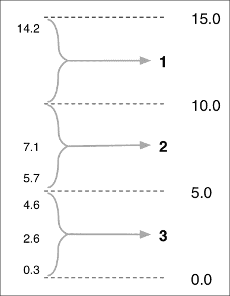

# 第九章：模块化编程作为良好编程技术的基础

在本书中，我们已经走了很长的路。从学习 Python 中模块和包的工作原理，以及如何使用它们更好地组织代码，我们发现了许多常见的实践，用于应用模块化模式来解决各种编程问题。我们已经看到模块化编程如何允许我们以最佳方式处理现实世界系统中的变化需求，并学会了使模块或包成为在新项目中重复使用的合适候选者的条件。我们已经看到了许多 Python 中处理模块和包的更高级技术，以及避免在这一过程中可能遇到的陷阱的方法。

最后，我们看了测试代码的方法，如何使用源代码管理系统来跟踪您对代码的更改，以及如何将您的模块或包提交到 Python 包索引（PyPI），以便其他人可以找到并使用它。

利用我们迄今为止学到的知识，您将能够熟练应用模块化技术到您的 Python 编程工作中，创建健壮且编写良好的代码，可以在各种程序中重复使用。您还可以与其他人分享您的代码，无论是在您的组织内部还是更广泛的 Python 开发者社区内。

在本章中，我们将使用一个实际的例子来展示模块和包远不止于组织代码：它们有助于更有效地处理编程的*过程*。我们将看到模块对于任何大型系统的设计和开发是至关重要的，并演示使用模块化技术创建健壮、有用和编写良好的模块是成为一名优秀程序员的重要组成部分。

# 编程的过程

作为程序员，我们往往过于关注程序的技术细节。也就是说，我们关注*产品*而不是编程的*过程*。解决特定编程问题的困难是如此之大，以至于我们忘记了问题本身会随着时间的推移而发生变化。无论我们多么努力避免，变化都是不可避免的：市场的变化、需求的变化和技术的变化。作为程序员，我们需要能够有效地应对这种变化，就像我们需要能够实施、测试和调试我们的代码一样。

回到第四章*用于真实世界编程的模块*，我们看了一个面临变化需求挑战的示例程序。我们看到模块化设计如何使我们能够在程序的范围远远超出最初设想的情况下最小化需要重写的代码量。

现在我们已经更多地了解了模块化编程和相关技术，可以帮助使其更加有效，让我们再次通过这个练习。这一次，我们将选择一个简单的包，用于计算某个事件或对象的发生次数。例如，想象一下，您需要记录在农场散步时看到每种动物的数量。当您看到每种动物时，通过将其传递给计数器来记录其存在，最后，计数器将告诉您每种动物您看到了多少只。例如：

```py
>>> counter.reset()
>>> counter.add("sheep")
>>> counter.add("cow")
>>> counter.add("sheep")
>>> counter.add("rabbit")
>>> counter.add("cow")
>>> print(counter.totals())
[("cow", 2), ("rabbit", 1), ("sheep", 2)]

```

这是一个简单的包，但它为我们提供了一个很好的目标，可以应用我们在前几章学到的一些更有用的技术。特别是，我们将利用**文档字符串**来记录我们包中每个函数的功能，并编写一系列**单元测试**来确保我们的包按照我们的预期工作。

让我们开始创建一个目录来保存我们的新项目，我们将其称为 Counter。在方便的地方创建一个名为`counter`的目录，然后在该目录中添加一个名为`README.rst`的新文件。由于我们希望最终将这个包上传到 Python 包索引，我们将使用 reStructuredText 格式来编写我们的 README 文件。在该文件中输入以下内容：

```py
About the ``counter`` package
-----------------------------

``counter`` is a package designed to make it easy to keep track of the number of times some event or object occurs.  Using this package, you **reset** the counter, **add** the various values to the counter, and then retrieve the calculated **totals** to see how often each value occurred.
```

让我们更仔细地看看这个包可能如何使用。假设您想要统计在给定时间范围内观察到的每种颜色的汽车数量。您将首先进行以下调用：

```py
    counter.reset()
```

然后当您识别到特定颜色的汽车时，您将进行以下调用：

```py
    counter.add(color)
```

最后，一旦时间结束，您将以以下方式获取各种颜色及其出现次数：

```py
    for color,num_occurrences in counter.totals():
        print(color, num_occurrences)
```

然后计数器可以被重置以开始计算另一组值。

现在让我们实现这个包。在我们的`counter`目录中，创建另一个名为`counter`的目录来保存我们包的源代码，并在这个最里层的`counter`目录中创建一个包初始化文件(`__init__.py`)。我们将按照之前使用的模式，在一个名为`interface.py`的模块中定义我们包的公共函数，然后将其导入`__init__.py`文件中，以便在包级别提供各种函数。为此，编辑`__init__.py`文件，并在该文件中输入以下内容：

```py
from .interface import *
```

我们的下一个任务是实现`interface`模块。在`counter`包目录中创建`interface.py`文件，并在该文件中输入以下内容：

```py
def reset():
    pass

def add(value):
    pass

def totals():
    pass
```

这些只是我们`counter`包的公共函数的占位符；我们将逐一实现这些函数，从`reset()`函数开始。

遵循使用文档字符串记录每个函数的推荐做法，让我们从描述这个函数做什么开始。编辑现有的`reset()`函数定义，使其看起来像以下内容：

```py
def reset():
    """ Reset our counter.

        This should be called before we start counting.
    """
    pass
```

请记住，文档字符串是一个三引号字符串（跨越多行的字符串），它“附加”到一个函数上。文档字符串通常以对函数做什么的一行描述开始。如果需要更多信息，这将后跟一个空行，然后是一行或多行更详细描述函数的信息。正如您所看到的，我们的文档字符串包括一行描述和一行额外提供有关函数的更多信息。

现在我们需要实现这个函数。由于我们的计数器包需要跟踪每个唯一值出现的次数，将这些信息存储在一个将唯一值映射到出现次数的字典中是有意义的。我们可以将这个字典存储为一个私有全局变量，由我们的`reset()`函数初始化。知道了这一点，我们可以继续实现我们`reset()`函数的其余部分：

```py
def reset():
    """ Reset our counter.

        This should be called before we start counting.
    """
    global _counts
    _counts = {} # Maps value to number of occurrences.
```

有了私有的`_counts`全局变量定义，我们现在可以实现`add()`函数。这个函数记录给定值的出现次数，并将结果存储到`_counts`字典中。用以下代码替换`add()`函数的占位实现：

```py
def add(value):
    """ Add the given value to our counter.
    """
    global _counts

    try:
        _counts[value] += 1
    except KeyError:
        _counts[value] = 1
```

这里不应该有任何意外。我们的最终函数`totals()`返回了添加到`_counts`字典中的值，以及每个值出现的次数。以下是必要的代码，应该替换您现有的`totals()`函数的占位符：

```py
def totals():
    """ Return the number of times each value has occurred.

        We return a list of (value, num_occurrences) tuples, one
        for each unique value included in the count.
    """
    global _counts

    results = []
    for value in sorted(_counts.keys()):
        results.append((value, _counts[value]))
    return results
```

这完成了我们对`counter`包的第一个实现。我们将尝试使用我们在上一章学到的临时测试技术来测试它：打开一个终端或命令行窗口，使用`cd`命令将当前目录设置为最外层的`counter`目录。然后，输入`python`启动 Python 交互解释器，并尝试输入以下命令：

```py
import counter
counter.reset()
counter.add(1)
counter.add(2)
counter.add(1)
print(counter.totals())

```

一切顺利的话，您应该会看到以下输出：

```py
[(1, 2), (2, 1)]

```

这告诉您值`1`出现了两次，值`2`出现了一次——这正是您对`add()`函数的调用所表明的。

现在我们的软件包似乎正在工作，让我们创建一些单元测试，以便更系统地测试我们的软件包。在最外层的`counter`目录中创建一个名为`tests.py`的新文件，并将以下代码输入到这个文件中：

```py
import unittest
import counter

class CounterTestCase(unittest.TestCase):
    """ Unit tests for the ``counter`` package.
    """
    def test_counter_totals(self):
        counter.reset()
        counter.add(1)
        counter.add(2)
        counter.add(3)
        counter.add(1)
        self.assertEqual(counter.totals(),
                         [(1, 2), (2, 1), (3, 1)])

    def test_counter_reset(self):
        counter.reset()
        counter.add(1)
        counter.reset()
        counter.add(2)
        self.assertEqual(counter.totals(), [(2, 1)])

if __name__ == "__main__":
    unittest.main()
```

如您所见，我们编写了两个单元测试：一个用于检查我们添加的值是否反映在计数器的总数中，另一个用于确保`reset()`函数正确地重置计数器，丢弃了在调用`reset()`之前添加的任何值。

要运行这些测试，退出 Python 交互解释器，按下*Control* + *D*，然后在命令行中输入以下内容：

```py
python tests.py

```

一切顺利的话，您应该会看到以下输出，表明您的两个单元测试都没有出现错误：

```py
..
---------------------------------------------------------------------
Ran 2 tests in 0.000s

OK

```

## 不可避免的变化

在这个阶段，我们现在有一个完全正常工作的`counter`软件包，具有良好的文档和单元测试。然而，想象一下，您的软件包的要求现在发生了变化，对您的设计造成了重大问题：现在不再是简单地计算唯一值的数量，而是需要支持*值的范围*。例如，您的软件包的用户可能会定义从 0 到 5、5 到 10 和 10 到 15 的值范围；每个范围内的值都被分组在一起进行计数。以下插图显示了如何实现这一点：



为了使您的软件包支持范围，您需要更改接口以接受可选的范围值列表。例如，要计算 0 到 5、5 到 10 和 10 到 15 之间的值，可以使用以下参数调用`reset()`函数：

```py
counter.reset([0, 5, 10, 15])
```

如果没有参数传递给`counter.reset()`，那么整个软件包应该继续像现在一样工作，记录唯一值而不是范围。

让我们实现这个新功能。首先，编辑`reset()`函数，使其看起来像下面这样：

```py
def reset(ranges=None):
    """ Reset our counter.

        If 'ranges' is supplied, the given list of values will be
        used as the start and end of each range of values.  In
        this case, the totals will be calculated based on a range
        of values rather than individual values.

        This should be called before we start counting.
    """
    global _ranges
    global _counts

    _ranges = ranges
    _counts = {} # If _ranges is None, maps value to number of
                 # occurrences.  Otherwise, maps (min_value,
                 # max_value) to number of occurrences.
```

这里唯一的区别，除了更改文档，就是我们现在接受一个可选的`ranges`参数，并将其存储到私有的`_ranges`全局变量中。

现在让我们更新`add()`函数以支持范围。更改您的源代码，使得这个函数看起来像下面这样：

```py
def add(value):
    """ Add the given value to our counter.
    """
    global _ranges
    global _counts

    if _ranges == None:
        key = value
    else:
        for i in range(len(_ranges)-1):
            if value >= _ranges[i] and value < _ranges[i+1]:
                key = (_ranges[i], _ranges[i+1])
                break

    try:
        _counts[key] += 1
    except KeyError:
        _counts[key] = 1
```

这个函数的接口没有变化；唯一的区别在于，在幕后，我们现在检查我们是否正在计算值范围的总数，如果是的话，我们将键设置为标识范围的`(min_value, max_value)`元组。这段代码有点混乱，但它可以很好地隐藏这个函数的使用代码中的复杂性。

我们需要更新的最后一个函数是`totals()`函数。如果我们使用范围，这个函数的行为将会改变。编辑接口模块的副本，使`totals()`函数看起来像下面这样：

```py
def totals():
    """ Return the number of times each value has occurred.

        If we are currently counting ranges of values, we return a
        list of  (min_value, max_value, num_occurrences) tuples,
        one for each range.  Otherwise, we return a list of
        (value, num_occurrences) tuples, one for each unique value
        included in the count.
    """
    global _ranges
    global _counts

    if _ranges != None:
        results = []
        for i in range(len(_ranges)-1):
            min_value = _ranges[i]
            max_value = _ranges[i+1]
            num_occurrences = _counts.get((min_value, max_value),
                                          0)
            results.append((min_value, max_value,
                            num_occurrences))
        return results
    else:
        results = []
        for value in sorted(_counts.keys()):
            results.append((value, _counts[value]))
        return results
```

这段代码有点复杂，但我们已经更新了函数的文档字符串，以描述新的行为。现在让我们测试我们的代码；启动 Python 解释器，尝试输入以下指令：

```py
import counter
counter.reset([0, 5, 10, 15])
counter.add(5.7)
counter.add(4.6)
counter.add(14.2)
counter.add(0.3)
counter.add(7.1)
counter.add(2.6)
print(counter.totals())
```

一切顺利的话，您应该会看到以下输出：

```py
[(0, 5, 3), (5, 10, 2), (10, 15, 1)]
```

这对应于您定义的三个范围，并显示有三个值落入第一个范围，两个值落入第二个范围，只有一个值落入第三个范围。

## 变更管理

在这个阶段，似乎您更新后的软件包是成功的。就像我们在第六章中看到的例子一样，*创建可重用模块*，我们能够使用模块化编程技术来限制需要支持软件包中一个重大新功能所需的更改数量。我们进行了一些测试，更新后的软件包似乎正在正常工作。

然而，我们不会止步于此。由于我们向我们的包添加了一个重要的新功能，我们应该添加一些单元测试来确保这个功能的正常工作。编辑您的`tests.py`脚本，并将以下新的测试用例添加到此模块：

```py
class RangeCounterTestCase(unittest.TestCase):
    """ Unit tests for the range-based features of the
        ``counter`` package.
    """
    def test_range_totals(self):
        counter.reset([0, 5, 10, 15])
        counter.add(3)
        counter.add(9)
        counter.add(4.5)
        counter.add(12)
        counter.add(19.1)
        counter.add(14.2)
        counter.add(8)
        self.assertEqual(counter.totals(),
                         [(0, 5, 2), (5, 10, 2), (10, 15, 2)])
```

这与我们用于临时测试的代码非常相似。保存更新后的`tests.py`脚本后，运行它。这应该会显示出一些非常有趣的东西：您的新包突然崩溃了：

```py
ERROR: test_range_totals (__main__.RangeCounterTestCase)
-----------------------------------------------------------------
Traceback (most recent call last):
  File "tests.py", line 35, in test_range_totals
    counter.add(19.1)
  File "/Users/erik/Project Support/Work/Packt/PythonModularProg/First Draft/Chapter 9/code/counter-ranges/counter/interface.py", line 36, in add
    _counts[key] += 1
UnboundLocalError: local variable 'key' referenced before assignment
```

我们的`test_range_totals()`单元测试失败，因为我们的包在尝试将值`19.1`添加到我们的范围计数器时会出现`UnboundLocalError`。稍加思考就会发现问题所在：我们定义了三个范围，`0-5`，`5-10`和`10-15`，但现在我们试图将值`19.1`添加到我们的计数器中。由于`19.1`超出了我们设置的范围，我们的包无法为这个值分配一个范围，因此我们的`add()`函数崩溃了。

很容易解决这个问题；将以下突出显示的行添加到您的`add()`函数中：

```py
def add(value):
    """ Add the given value to our counter.
    """
    global _ranges
    global _counts

    if _ranges == None:
        key = value
    else:
 **key = None
        for i in range(len(_ranges)-1):
            if value >= _ranges[i] and value < _ranges[i+1]:
                key = (_ranges[i], _ranges[i+1])
                break
 **if key == None:
 **raise RuntimeError("Value out of range: {}".format(value))

    try:
        _counts[key] += 1
    except KeyError:
        _counts[key] = 1
```

这会导致我们的包在用户尝试添加超出我们设置的范围的值时返回`RuntimeError`。

不幸的是，我们的单元测试仍然崩溃，只是现在以`RuntimeError`的形式失败。为了解决这个问题，从`test_range_totals()`单元测试中删除`counter.add(19.1)`行。我们仍然希望测试这种错误情况，但我们将在单独的单元测试中进行。在您的`RangeCounterTestCase`类的末尾添加以下内容：

```py
    def test_out_of_range(self):
        counter.reset([0, 5, 10, 15])
        with self.assertRaises(RuntimeError):
            counter.add(19.1)
```

这个单元测试专门检查我们之前发现的错误情况，并确保包在提供的值超出请求的范围时正确返回`RuntimeError`。

注意，我们现在为我们的包定义了四个单独的单元测试。我们仍在测试包，以确保它在没有范围的情况下运行，以及测试我们所有基于范围的代码。因为我们已经实施（并开始充实）了一系列针对我们的包的单元测试，我们可以确信，为了支持范围所做的任何更改都不会破坏不使用新基于范围的功能的任何现有代码。

正如您所看到的，我们使用的模块化编程技术帮助我们最大限度地减少了对代码所需的更改，并且我们编写的单元测试有助于确保更新后的代码继续按我们期望的方式工作。通过这种方式，模块化编程技术的使用使我们能够以最有效的方式处理不断变化的需求和编程的持续过程。

# 处理复杂性

无法逃避计算机程序是复杂的这一事实。事实上，随着对包的要求发生变化，这种复杂性似乎只会随着时间的推移而增加——程序很少在进行过程中变得更简单。模块化编程技术是处理这种复杂性的一种极好方式。通过应用模块化技术和技术，您可以：

+   使用模块和包来保持您的代码组织良好，无论它变得多么复杂

+   使用模块化设计的标准模式，包括分而治之技术、抽象和封装，将这种复杂性降至最低

+   将单元测试技术应用于确保在更改和扩展模块或包的范围时，您的代码仍然按预期工作。

+   编写模块和函数级别的文档字符串，清楚地描述代码的每个部分所做的工作，以便在程序增长和更改时能够跟踪一切。

要了解这些模块化技术和技术有多么重要，只需想一想，如果在开发一个大型、复杂和不断变化的系统时不使用它们，你将会陷入多么混乱的境地。没有模块化设计技术和标准模式的应用，比如分而治之、抽象和封装，你会发现自己编写了结构混乱的意大利面代码，带来许多意想不到的副作用，并且新功能和变化散布在你的源代码中。没有单元测试，你将无法确保你的代码在进行更改时仍然能够正常工作。最后，缺乏嵌入式文档将使跟踪系统的各个部分变得非常困难，导致错误和没有经过深思熟虑的更改，因为你继续开发和扩展你的代码。

出于这些原因，很明显模块化编程技术对于任何大型系统的设计和开发至关重要，因为它们帮助你以最佳方式处理复杂性。

# 成为一名有效的程序员

既然你已经看到模块化编程技术有多么有用，你可能会想知道为什么会有人不想使用它们。除了缺乏理解之外，为什么程序员会避开模块化原则和技术呢？

Python 语言从头开始就被设计为支持良好的模块化编程技术，并且通过优秀的工具（如 Python 标准库、单元测试和文档字符串）的添加，它鼓励你将这些技术应用到你的日常编程实践中。同样，使用缩进来定义代码的结构自动鼓励你编写格式良好的源代码，其中代码的缩进反映了程序的逻辑组织。这些都不是随意的选择：Python 在每一步都鼓励良好的编程实践。

当然，就像你可以使用 Python 编写结构混乱和难以理解的意大利面代码一样，你也可以在开发程序时避免使用模块化技术和实践。但你为什么要这样呢？

程序员有时在编写他们认为是“一次性”的代码时会采取捷径。例如，也许你正在编写一个小程序，你只打算使用一次，然后再也不需要使用了。为什么要花额外的时间将推荐的模块化编程实践应用到这个一次性的程序上呢？

问题是，一次性代码有一个有趣的习惯，就是变成永久的，并发展成为一个更大的复杂系统。经常情况下，最初的一次性代码成为一个大型和复杂系统的基础。你六个月前写的代码可能会在新程序中被找到和重用。最终，你永远不知道什么是一次性代码，什么不是。

基于这些原因，无论代码有多大或多小，始终应该应用模块化编程实践。虽然你可能不想花很多时间为一个简单的一次性脚本编写大量的文档字符串和单元测试，但你仍然可以应用基本的模块化技术来帮助保持代码的组织。不要只把模块化编程技术留给你的“大”项目。

幸运的是，Python 实现的模块化编程方式非常容易使用，过一段时间后，你开始在编写一行代码之前就以模块化的方式思考。我认为这是一件好事，因为模块化编程技术是成为一名优秀程序员的重要组成部分，你应该在编程时练习这些技术。

# 总结

在本章，甚至整本书中，我们已经看到模块化编程技术的应用如何帮助你以最有效的方式处理编程的*过程*。你不是在回避变化，而是能够管理它，使得你的代码能够持续工作，并且通过新的需求不断改进。

我们已经看到了另一个需要根据不断扩大的需求进行更改的程序的例子，并且已经看到了模块化技术的应用，包括使用文档字符串和单元测试，有助于编写健壮且易于理解的代码，随着不断的开发和更改而不断改进。

我们已经看到了模块化技术的应用是处理程序复杂性的重要部分，而这种复杂性随着时间的推移只会增加。我们已经了解到，正因为如此，使用模块化编程技术是成为优秀程序员的重要组成部分。最后，我们已经看到，模块化技术是每次你坐下来编程时都可以使用的东西，即使是简单的一次性脚本，而不是要为你的“大”项目保留的东西。

希望你觉得这个关于模块化编程世界的介绍有用，并且现在开始将模块化技术和模式应用到你自己的编程中。我鼓励你继续尽可能多地了解围绕良好的模块化编程实践的各种工具，比如使用文档字符串和 Sphinx 库来为你的包自动生成文档，以及使用`virtualenv`来设置和使用虚拟环境来管理你程序的包依赖关系。你继续使用模块化实践和技术，它将变得更容易，你作为程序员也将变得更有效率。愉快的编程！
