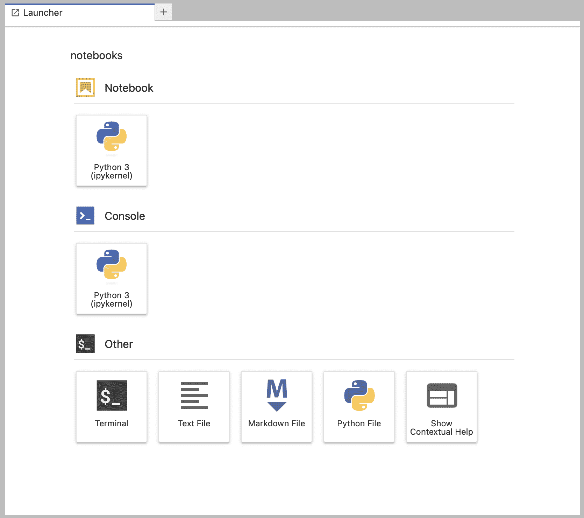
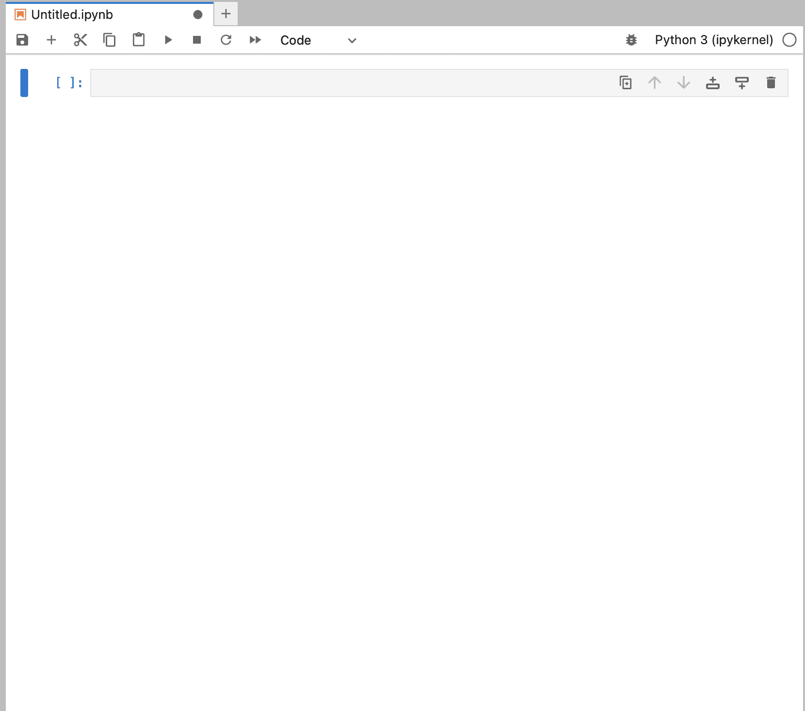
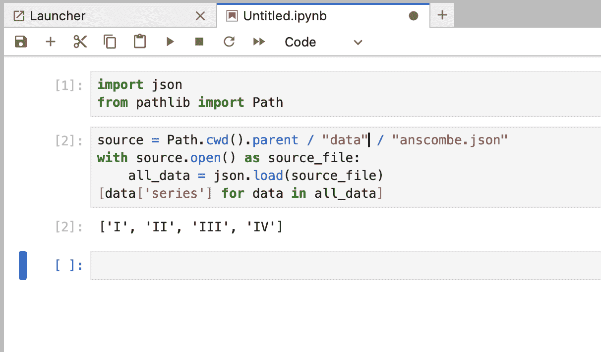
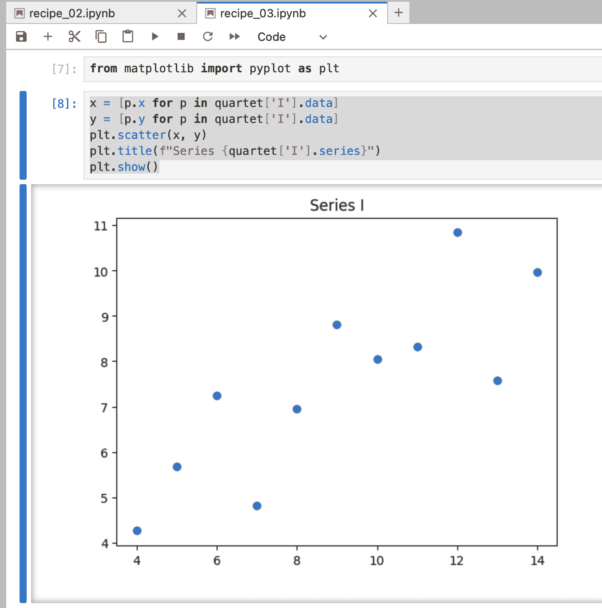

## 第十二章：12

使用 Jupyter Lab 进行图形和可视化

通过数据可视化，许多问题都得到了简化。人眼特别适合识别关系和趋势。给定一个潜在关系（或趋势）的显示，转向更正式的统计方法来量化关系是有意义的。

Python 提供了许多图形工具。对于数据分析目的，最受欢迎的是 matplotlib。这个包提供了许多图形功能。它与 Jupyter Lab 集成良好，为我们提供了一个交互式环境来可视化和分析数据。

在 Jupyter Lab 中可以进行大量的 Python 开发。虽然很棒，但这并不是一个完美的集成开发环境（IDE）。一个小的缺点是交互式笔记本依赖于全局变量，这对于编写模块或应用程序来说并不理想。当将笔记本转换为可重用的模块时，使用全局变量可能会导致混淆。

除了运行 Python 代码和显示图形外，Jupyter Lab 笔记本还可以渲染 Markdown 语法中的单元格。这使得我们能够围绕数据的图形分析编写非常漂亮的文档。这包括正确渲染数学公式的功能。它允许我们在相关代码附近包含类似 e^(πi) + 1 = 0 的数学。

我们将使用的两个包不是 Python 标准发行版的一部分。我们需要安装它们。在某些情况下，使用 Conda 等工具可以帮助安装这些大型且复杂的包。然而，在许多情况下，如果我们的计算机是广泛支持的类型之一，那么 PIP 安装将有效。

```py
python -m pip install matplotlib jupyterlab
```

使用 python -m pip 命令可以确保我们将使用与当前活动虚拟环境兼容的 pip 命令。

这将以类似以下的一行结束：

```py
Installing collected packages: pyparsing, pillow, numpy, kiwisolver, fonttools, cycler, contourpy, matplotlib
```

这一行后面将跟一个列表，列出添加到当前虚拟环境中的新包。

注意，Jupyter Lab 将会使用 IPython 的 Python 实现。这个实现包括一些非常有用的附加功能，这些功能对于管理浏览器和 Jupyter Lab 服务器之间的复杂客户端-服务器连接非常有帮助。

与标准的 Python 实现相比，最明显的区别是一个独特的提示符。IPython 使用 In [n]: 作为提示符。数字 n 在会话期间会增加。可以使用提示符的编号来回忆特定的先前命令和输出。

在本章中，我们将探讨以下食谱：

+   启动笔记本并使用 Python 代码创建单元格

+   将数据导入笔记本

+   使用 pyplot 创建散点图

+   直接使用坐标轴创建散点图

+   向 markdown 单元格添加细节

+   在笔记本中包含单元测试用例

# 12.1 使用 Python 代码启动笔记本并创建单元格

我们将使用终端窗口输入一个命令来启动实验室服务器。jupyter lab 命令将做两件事：

+   它将启动 Jupyter Lab 的后端，数值计算服务器组件。

+   它还将尝试启动一个连接到该服务器组件的浏览器窗口。

我们与实验室中各种笔记本的其余交互将通过浏览器进行。

在极少数浏览器未启动的情况下，日志将提供可以在您选择的浏览器中使用的链接。IPython 运行时会使用各种已安装的包。

对于这个第一个菜谱，我们将关注启动和停止 Jupyter Lab 服务器以及创建笔记本的管理方面。

## 12.1.1 准备工作

我们将启动一个 Jupyter Lab 会话并创建一个笔记本，以确保环境正常工作并且所有必需的组件都已安装。

使用终端窗口启动 Jupyter Lab 有时可能会令人困惑。许多程序员习惯于在集成开发环境（IDE）中创建和测试代码。启动 Jupyter Lab 通常是在终端窗口中完成的，而不是在 Python 编辑器或交互式 Python REPL 会话中。

## 12.1.2 如何操作...

1.  打开一个终端窗口。切换到一个可以访问数据和笔记本文件夹的工作目录。确保正确的虚拟环境已激活。Jupyter Lab 服务器限制在启动它的目录中工作。输入以下命令以启动 Jupyter Lab：

    ```py
    (coobook3) % python -m jupyter lab
    ```

    这将输出服务器执行的操作日志。在行块中将有连接到服务器的安全 URL。通常，也会打开一个浏览器窗口。

1.  在浏览器窗口中，Jupyter Lab 窗口将显示启动器选项卡。它看起来像图 12.1 中显示的页面。

    

    图 12.1：Jupyter Lab 启动器

1.  在启动器中的笔记本部分单击 Python 3 (ipykernel) 图标。这将打开一个名为 Untitled.ipynb 的 Jupyter Notebook。

    

    图 12.2：准备工作的 Jupyter 笔记本

    此选项卡顶部有一个笔记本级别的菜单栏，其中包含一系列图标，用于保存笔记本、添加单元格、剪切单元格、复制单元格和粘贴单元格等。

    笔记本菜单栏上的 ▸ 图标将执行单元格的 Python 代码或格式化单元格的 Markup 内容。这也可以经常通过 Shift+Enter 键盘组合来完成。

    剩余的图标将停止运行的内核并重新启动它。▸▸ 图标将重新启动笔记本，运行所有单元格。下拉菜单允许您在代码、markdown 和原始单元格之间进行选择。我们将大部分时间用于创建代码和 markdown 单元格。

    初始内容有一个标签 [ ]，以及一个文本框，我们可以在此输入代码。随着我们添加更多命令，这个区域将被代码单元格及其输出填充。

1.  为了确保我们拥有所有必需的包，请将以下代码输入到第一个单元格中：

    ```py
    from matplotlib import pyplot as plt 

    from pydantic import BaseModel
    ```

    使用 Shift+Enter 键盘组合或点击笔记本菜单栏上的▸图标来执行此单元格中的代码。如果它工作正常，这确认了当前虚拟环境中已安装我们所需的一切。

## 12.1.3 它是如何工作的...

Jupyter Lab 的许多功能之一是创建和编辑笔记本。我们可以直接输入代码并执行代码，将结果保存供他人审阅。这允许在获取、分析和共享数据的方式上具有很大的灵活性。

由于我们还可以打开 Python 控制台并编辑 Python 模块，我们可以使用 Jupyter Lab 作为 IDE 进行大量的开发工作。可以将笔记本导出为脚本文件。这允许将一系列代表许多好想法的单元格转换为模块或应用程序。

面对新的问题或新的数据时，通常鼓励使用笔记本作为记录实验的方式。显示失败的单元格反映了学到的经验教训，值得保留。当然，显示成功的单元格有助于引导同事通过学习过程。

Jupyter Lab 环境设计为可以在各种容器配置中使用。两种常见的容器架构是：

+   一个大型分析主机，与分析师的笔记本电脑分开。

+   一台笔记本电脑既作为 Jupyter Lab 服务器进程的主机，也作为浏览器会话的主机。这是为这个配方创建的环境。

目的是能够扩展并处理一个非常大的数据集，在一个非常昂贵、非常大的主机上。这个数值计算主机运行 Jupyter Lab 和笔记本的内核。我们的笔记本电脑只运行浏览器和终端窗口。

## 12.1.4 更多内容...

工作笔记本需要保存，否则当前状态将丢失。尽早保存并经常保存，以确保不会丢失任何宝贵的结果。有两种方法可以在使用完毕后停止 Jupyter Lab 服务器。

+   从 Jupyter Lab 浏览器窗口。

+   从终端窗口。

要从浏览器窗口停止处理，使用文件菜单。在菜单底部是关闭菜单项。这将停止服务器并断开浏览器会话。

要从终端窗口停止处理，使用 Control+C (Ĉ) 两次来停止处理。输入 Ĉ 一次将得到提示“关闭此 Jupyter 服务器 (y/[n])？”。需要第二次 Ĉ（或选择 y）来停止进程。

## 12.1.5 相关内容

+   在 将数据导入笔记本 部分中，我们将超越基础知识，并加载包含数据的笔记本。

+   参考关于 Jupyter Lab 的深入书籍 [Learning Jupyter](https://www.packtpub.com/product/learning-jupyter/9781785884870)。

# 12.2 将数据导入笔记本

作为样本数据分析问题，我们将查看包含四个紧密相关的样本系列的数据集合。文件名为 anscombe.json。每个数据系列是一个(x,y)数据对的序列和系列名称，表示为 Python 字典。系列键是系列的名称。数据键是数据对的列表。这四个系列有时被称为安斯康姆四重奏。

我们将创建一个笔记本来摄取数据。为了开始工作，这个初始配方将专注于普通的 Python 表达式，以确认数据已正确加载。在后面的配方中，我们将使用可视化和统计方法来查看两个变量之间是否存在相关性。

## 12.2.1 准备工作

有几个初步步骤：

1.  确保 Jupyter Lab 服务器正在运行。如果它没有运行，请参阅使用 Python 代码启动笔记本并创建单元格配方以启动服务器并打开笔记本。

1.  定位此服务器的浏览器窗口。在启动服务器时，通常会显示一个连接到服务器的浏览器窗口。

1.  为这个配方启动一个新的笔记本。

如果我们关闭浏览器应用程序，或者如果 Python 无法启动我们首选的浏览器，那么 Jupyter Lab 服务器将运行，但没有任何明显的浏览器窗口可以连接到服务器。我们可以通过使用以下 jupyter 命令进行查询来定位服务器：

```py
(cookbook3) % python -m jupyter server list
```

这将识别所有正在运行的服务器。它将提供一个连接到服务器的 URL。输出可能看起来像以下这样：

```py
(cookbook3) % jupyter server list 

Currently running servers: 

http://localhost:8888/?token=85e8ad8455cd154bd3253ba0339c783ea60c56f836f7b81c :: /Users/slott/Documents/Writing/Python/Python Cookbook 3e
```

在您计算机上的输出中显示的实际 URL 可以用来连接到服务器。

## 12.2.2 如何操作...

1.  由于我们将以 JSON 格式读取文件，第一个单元格可以是一个包含所需导入语句的代码单元格。

    ```py
    import json 

    from pathlib import Path
    ```

    在单元格中使用 Enter（或 Return）键可以添加代码行。

    使用 Shift+Enter（或 Shift+Return）将执行单元格的代码并打开一个新的单元格以输入更多代码。点击菜单栏上的▸图标执行代码，然后点击菜单栏上的+图标添加一个新的空单元格也会发生这种情况。

    执行一个单元格后，单元格标签的数字将被填写；第一个单元格显示[1]，表示单元格已被执行。

1.  将整个“读取和提取数据”过程放入一个单元格中是有意义的：

    ```py
    source_path = Path.cwd().parent.parent / "data" / "anscombe.json" 

    with source_path.open() as source_file: 

        all_data = json.load(source_file) 

    [data[’series’] for data in all_data]
    ```

    从当前工作目录到数据的路径假设笔记本位于 src/ch12 文件夹中，src 文件夹是 data 文件夹的同级文件夹。如果您的项目结构不是这样，那么 source_path 的计算需要更改。

    当我们执行这个单元格时，我们将看到这个集合中四个数据系列的名称。它们看起来像这样：

    

    图 12.3：包含两个代码单元格的 Jupyter 笔记本

1.  我们可以查看这个源中的(x,y)对。一个包含表达式的单元格足以显示表达式的值：

    ```py
    all_data[0][’data’]
    ```

1.  我们可以定义一个类来保存这些数据对。由于数据是 JSON 格式，并且 pydantic 包提供了非常好的 JSON 解析功能，我们可以考虑扩展 BaseModel 类。

    这需要重写单元格 1，以扩展导入序列以包括：

    ```py
    import json 

    from pathlib import Path 

    from pydantic import BaseModel
    ```

    我们可以点击▸▸图标来重启笔记本，运行所有单元格。当我们回到顶部并做出更改时，这是必不可少的。

    在页面顶部，笔记本启动标签上方，有一个更高层次的菜单栏，包括文件、编辑、查看、运行、内核、标签页、设置和帮助等选项。内核菜单中的“重启内核”和“运行所有单元格...”项与笔记本菜单栏中的▸▸图标具有相同的功能。

1.  定义一个用于 X-Y 对的类。然后，定义一个用于单个对序列的类：

    ```py
    class Pair(BaseModel): 

        x: float 

        y: float 

    class Series(BaseModel): 

        series: str 

        data: list[Pair]
    ```

1.  然后，我们可以从 all_data 对象中填充类实例：

    ```py
    clean_data = [Series.model_validate(d) for d in all_data]
    ```

1.  使用 clean_data[0] 这样的表达式来查看特定的序列。

1.  我们有一个尴尬的问题，即每个序列在 clean_data 序列中都有一个位置和一个名称。使用映射比使用序列更好：

    ```py
    quartet = {s.series: s for s in clean_data}
    ```

1.  使用 quartet[’I’] 这样的表达式来查看特定的序列。

## 12.2.3 它是如何工作的...

每个单元格中的 Python 代码与第十一章中 Reading JSON and YAML documents 菜单中使用的代码没有显著差异。我们使用了 Jupyter Lab 来启动一个 IPython 内核，以评估每个单元格中的代码。

当单元格的代码以表达式结束，Jupyter Notebook 将显示任何非 None 输出。这类似于命令行 REPL。在单元格中显示最终表达式的结果不需要 print() 函数。

Jupyter 笔记本界面是一种独特的访问 Python 的方式，提供了一个丰富的交互式环境。在巧妙的编辑和显示功能之下，语言和库仍然是 Python。

## 12.2.4 更多...

在审查笔记本后，很明显我们可以优化一些处理过程。创建 all_data 和 clean_data 对象并没有真正的益处。真正的目标是与 quartet 对象一起工作。

我们可以使用以下单元格来解析和加载序列：

```py
source_path = Path.cwd().parent.parent / "data" / "anscombe.json" 

with source_path.open() as source_file: 

    json_document = json.load(source_file) 

    source_data = (Series.model_validate(s) for s in json_document) 

    quartet = {s.series: s for s in source_data}
```

在 Pydantic 类定义之后插入一个新单元格并使用此代码很有帮助。然后我们可以执行代码。可以使用 quartet[’IV’] 这样的表达式来确认数据已被加载。

一个更完整的检查将是以下单元格：

```py
for name in quartet: 

    print(f"{name:3s} {len(quartet[name].data):d}")
```

这显示了每个序列名称和数据序列中的点数。

一旦这个工作正常，我们可以删除之前的单元格，添加 Markdown，并重新运行笔记本以确保它正常且整洁地显示要分析的数据。

## 12.2.5 参见

+   参见第十一章的 Reading JSON and YAML documents 菜单，了解更多关于 JSON 格式文件的信息。

+   第十章的使用 Pydantic 实现更严格的类型检查配方涵盖了 Pydantic 包的一些功能。

# 12.3 使用 `pyplot` 创建散点图

matplotlib 项目可以产生各种图表和绘图类型，它极其复杂，这使得它在某些类型的分析中难以使用。

在一个名为 `pyplot` 的子包中收集了特别有用的功能集。这个功能组反映了在 Jupyter Lab 中工作时的一些常见假设和优化，这些假设和优化工作得非常好。在其他上下文中，这些假设通常是限制性的。

为了使事情更简单，`pyplot` 包将自动管理创建的图形。它将跟踪填充图片的任何子图。它将跟踪构成这些子图的各个轴和艺术家。

更多信息，请参阅 matplotlib 教程中的[图形的各个部分](https://matplotlib.org/stable/users/explain/quick_start.html#parts-of-a-figure)。此图确定了图形的各个元素以及用于创建或控制这些元素的 matplotlib 的各个部分。

在将数据导入笔记本配方中，我们查看了一个包含四个数据序列的数据集。包含此数据部分的文件名为 `anscombe.json`。每个数据序列是一系列 (x,y) 数据对，每个序列都有一个名称。

通用方法将是定义一些有用的类，这些类提供了对序列及其内部样本的有用定义。有了这些定义，我们可以读取 `anscombe.json` 文件以获取数据。一旦加载，我们就可以创建一个显示数据对的图形。

## 12.3.1 准备工作

有几个初步步骤：

1.  启动 Jupyter Lab 服务器并定位其浏览器窗口。如果它没有运行，请参阅使用 Python 代码启动笔记本并创建单元格配方以启动服务器。有关定位在后台运行的服务器的建议，请参阅将数据导入笔记本。

1.  为此配方创建一个新的笔记本。

## 12.3.2 如何操作...

1.  使用描述笔记本将包含内容的单元格开始笔记本。这应该是一个 Markdown 单元格，用于记录一些笔记：

    ```py
    # Anscombe’s Quartet 

    The raw data has four series. The correlation coefficients are high. 

    Visualization shows that a simple linear regression model is misleading. 

    ## Raw Data for the Series
    ```

1.  创建所需的导入，以便使用 Pydantic 加载 JSON 格式的数据。这将是一个代码单元格：

    ```py
    import json 

    from pathlib import Path 

    from pydantic import BaseModel
    ```

1.  定义两个类，分别定义数据序列。一个类包含单个 (x,y) 对。另一个是包含这些对及其序列名称的序列：

    ```py
    class Pair(BaseModel): 

        x: float 

        y: float 

    class Series(BaseModel): 

        series: str 

        data: list[Pair]
    ```

1.  编写一个包含读取数据所需代码的单元格，并创建一个包含清洗后数据的全局变量：

    ```py
    source = Path.cwd().parent.parent / "data" / "anscombe.json" 

    with source.open() as source_file: 

        json_document = json.load(source_file) 

        source_data = (Series.model_validate(s) for s in json_document) 

        quartet = {s.series: s for s in source_data}
    ```

    `clean_data` 的值包含四个单独的 Series 对象列表。像 `quartet['I']` 这样的表达式将揭示其中一个序列。

1.  添加一个 Markdown 单元格，显示本笔记本下一部分将包含的内容：

    ```py
    ## Visualization of each series
    ```

1.  编写对 pyplot 包所需的导入。这通常被重命名为 plt 以简化 Jupyter 笔记本单元格中编写的代码：

    ```py
    from matplotlib import pyplot as plt
    ```

1.  对于单个系列，我们需要提取两个平行的数字序列。我们将使用 list comprehensions 在 clean_data[0].data 上提取一个序列的 x 值和第二个平行序列的 y 值：

    ```py
    x = [p.x for p in quartet[’I’].data] 

    y = [p.y for p in quartet[’I’].data] 
    ```

1.  scatter()函数创建基本的散点图。我们提供两个平行序列：一个包含 x 值，另一个包含 y 值。title()函数将在图形上方放置一个标签。我们从一个系列名称构造了一个字符串。虽然不总是必要的，但有时需要 plt.show()来显示生成的图形：

    ```py
    plt.scatter(x, y) 

    plt.title(f"Series {quartet[’I’].series}") 

    plt.show()
    ```

生成的笔记本将包括如下单元格：



图 12.4：包含 Series I 图形的 Jupyter 笔记本

## 12.3.3 它是如何工作的...

基于 matplotlib 的底层包有一系列组件来支持图形和数据可视化。一个基础是后端组件的概念，以集成 Python 使用的广泛上下文、框架和平台。这还包括像 Jupyter Lab 这样的交互式环境。它还包括可以生成各种图像文件格式的静态、非交互式后端。

matplotlib 的另一个基础元素是 API，它允许我们创建一个包含 Artist 对象的 Figure 对象。Artist 对象的集合将绘制我们希望在图形中看到的标题、坐标轴、数据点和线条。Artist 对象可以是交互式的，允许它们在数据变化或显示形状变化时刷新图形。

在这种分析笔记本中，我们通常对一次性绘制的静态图形更感兴趣。我们的目标是保存笔记本供其他人查看和理解数据。最终目标是传达数据中的关系或趋势。

pyplot 包包含对 matplotlib 整体 API 的简化。这些简化使我们免于跟踪用于创建图形显示在图形中的各种坐标轴实例的繁琐细节。

## 12.3.4 更多内容...

我们经常希望将几个紧密相关的图形作为单个图形的一部分来查看。在这种情况下，如果我们有一个文件中的四个数据系列，将所有四个图形放在一起似乎特别有帮助。

这是通过 plt.figure()创建一个整体图形来完成的。在这个图形内部，每个 plt.subplot()函数可以创建一个独立的子图。图形的布局作为每个子图请求的一部分提供，作为三个数字：图形内垂直排列的图形数量、图形内水平排列的图形数量以及此特定图形在布局中的位置。

我们可以使用 2, 2, n 来表示图形具有 2 × 2 的排列，并且这个特定的子图位置为 n。位置是从图形的左上角到右下角进行计算的。位置也可以跨越图形的多个部分，这样我们就可以有一个大图和多个小图。

为了更容易提取每个图表的 x 和 y 属性，我们将修改 Series 类的定义。我们将添加两个属性，x 和 y，它们将提取所有序列值。这样重新定义 Series 类如下：

```py
class Series(BaseModel): 

    series: str 

    data: list[Pair] 

    @property 

    def x(self) -> list[float]: 

        return [p.x for p in self.data] 

    @property 

    def y(self) -> list[float]: 

        return [p.y for p in self.data]
```

添加这些属性允许在 plt.scatter()函数中做一些轻微的简化。整个图形可以通过以下代码的单元创建：

```py
plt.figure(layout=’tight’) 

for n, series in enumerate(quartet.values(), start=1): 

    title = f"Series {series.series}" 

    plt.subplot(2, 2, n) 

    plt.scatter(series.x, series.y) 

    plt.title(title)
```

在更改新的 Series 类定义后，笔记本的单元必须从头开始重新运行。在运行菜单中，重启内核并运行所有单元的项将包含修订后的类并重新加载数据。

对于图形的整体定义、散点图以及散点图的坐标轴，有许多选项和参数。此外，还有许多其他类型的图表可供选择。[Matplotlib Examples Gallery](https://matplotlib.org/stable/gallery/index.html)展示了多种图表的示例。例如，在有一个 Counter 对象的情况下，我们可以使用 x 值的序列和高度值的序列，通过使用 bar()函数而不是 scatter()函数来创建条形图。查看第五章中的 Creating dictionaries – inserting and updating 配方，了解创建 Counter 对象以总结源数据频率的示例。

## 12.3.5 参考信息

+   查看第十一章中的 Reading JSON and YAML documents 配方，了解更多关于 JSON 格式文件的信息。

+   第十章中的 Implementing more strict type checks with Pydantic 配方涵盖了使用 Pydantic 包的一些功能。

+   本章前面的 Ingesting data into a notebook 配方深入探讨了 JSON 的加载。

+   查看第[Matplotlib Examples Gallery](https://matplotlib.org/stable/gallery/index.html)以了解多种图表的示例。

# 12.4 直接使用坐标轴创建散点图

许多常规的图形可视化可以使用 pyplot 模块中直接可用的函数来完成。在先前的配方中，我们使用了 scatter()函数来绘制显示两个变量之间关系的散点图。其他如 bar()、pie()和 hist()等函数将根据我们的原始数据创建其他类型的图表。然而，有时 pyplot 模块上现成的函数并不完全适用，我们希望在图像中做更多的事情。

在这个配方中，我们将为每个子图添加一个图例框，以显示适合散点图数据的线性回归参数。

在 将数据导入笔记本 菜单中，我们查看了一个包含四个数据序列的数据集。包含这些数据的文件被命名为 anscombe.json。每个数据序列是一个包含一系列 (x,y) 数据对的字典，以及序列的名称。

通用方法将是定义一些类，这些类提供了对序列及其内部样本的有用定义。有了这些定义，我们可以读取 anscombe.json 文件以获取数据。一旦加载，我们就可以创建一个显示数据对的图表。

Python 的统计模块提供了两个方便的函数，correlation() 和 regression()，帮助我们用一些参数注释每个图表。

## 12.4.1 准备工作

有几个初步步骤：

1.  确保 Jupyter Lab 服务器正在运行，并找到其浏览器窗口。使用 Python 代码启动笔记本和创建单元格 菜单展示了如何启动服务器。将数据导入笔记本 提供了一些关于定位后台运行的服务器的额外建议。

1.  为此菜谱启动一个新的笔记本。

## 12.4.2 如何操作...

1.  使用一个描述笔记本内容的单元格来启动笔记本。这应该是一个包含 Markdown 内容而不是代码内容的单元格：

    ```py
    # Anscombe’s Quartet 

    Visualization with correlation coefficients and linear regression model. 

    ## Raw Data for the Series
    ```

1.  创建所需的导入，以便使用 Pydantic 加载 JSON 格式的数据。这将是一个代码单元格：

    ```py
    import json 

    from pathlib import Path 

    import statistics 

    from pydantic import BaseModel
    ```

1.  定义两个类，分别定义每个数据序列。一个类包含单个 (x,y) 对：

    ```py
    class Pair(BaseModel): 

        x: float 

        y: float
    ```

    第二个类是包含序列名称的成对数据，这包括两个方法来计算有用的统计摘要，如相关性和回归：

    ```py
     return [p.y for p in self.data] 

        @property 

        def correlation(self) -> float: 

            return statistics.correlation(self.x, self.y) 
    ```

1.  创建一个单元格来导入数据，创建一个将序列名称映射到相关 Series 实例的字典：

    ```py
    source = Path.cwd().parent.parent / "data" / "anscombe.json" 

    with source.open() as source_file: 

        json_document = json.load(source_file) 

        source_data = (Series.model_validate(s) for s in json_document) 

        quartet = {s.series: s for s in source_data}
    ```

1.  确认之前的单元格都正常工作。创建一个单元格来评估一个表达式，例如 quartet[‘I’].correlation。四舍五入后，结果将是 0.816。有趣的是，所有四个序列的结果几乎相同。

1.  使用 figure() 函数创建一个图表的单元格，提供一个值为 ‘tight’ 的布局值可以产生一个看起来很好的图表。将这个值赋给一个变量是必要的，这样对象就可以在 plt.show() 函数显示之前保持存在：

    ```py
    fig = plt.figure(layout=’tight’)
    ```

    在单元格中添加一行来创建一个用于显示整体图表中四个子图的轴集合。subplot_mosaic() 函数提供了大量的复杂布局功能。列表的列表结构将创建一个正方形网格。轴将被分配到具有四个不同键的字典 ax_dict 中。我们选择了与序列名称匹配的键，并使用列表的列表将它们定位在结果图表的行和列中：

    ```py
    ax_dict = fig.subplot_mosaic( 

        [ 

            ["I", "II"], 

            ["III", "IV"], 

        ], 

    )
    ```

1.  添加散点图和文字说明。我们还可以构建一个包含相关系数 r 的字符串。这个字符串可以放置在图表的右下角，使用相对位置（.95,.05）指定；这将通过 ax.transAxes 转换器转换为基于坐标轴大小的坐标。

    ```py
    for name, ax in ax_dict.items(): 

        series = quartet[name] 

        ax.scatter(series.x, series.y) 

        ax.set_title(f"Series {name}") 

        eq1 = rf"$r = {series.correlation:.3f}$" 

        ax.text(.95, .05, f"{eq1}", 

                fontfamily=’sans-serif’, 

                horizontalalignment=’right’, verticalalignment=’bottom’, transform=ax.transAxes) 

    plt.show()
    ```

    在字符串周围使用$，rf"$r = {...}$"，迫使 matplotlib 将 TeX 格式化规则应用于文本，创建一个正确格式化的数学方程。

1.  在创建显式图表时，需要调用 show()函数的最终调用来显示图像：

    ```py
    plt.show()
    ```

## 12.4.3 它是如何工作的...

Matplotlib 中的图形技术堆栈包括大量的 Artist 子类。每个子类都将创建最终图像的一部分。在这种情况下，我们使用了 subplot_mosaic()函数来创建四个子图对象，每个对象都有一组坐标轴。

我们使用了坐标轴对象来显示数据，指定使用散点图组织。图表的标题和包含相关系数的文字块也在图表中绘制了细节。

在某个时刻，显示可能会因为细节而变得杂乱。一个好的数据展示需要有一个信息点。关于如何向观众展示数据（好的和不好的方式）有许多有趣的书籍和文章。可以考虑 Packt Publishing 出版的《Python 开发者 Matplotlib 指南》作为学习更多关于数据可视化的途径。

## 12.4.4 更多...

相关系数表明，在序列中的 x 和 y 变量之间存在关系。我们可以使用线性回归来计算线性模型的参数，该模型在给定 x 值时预测 y 值。

linear_regression()函数是标准库中的统计模块的一部分。该函数的结果是一个包含斜率和截距值的元组，这些值描述了一个线性关系，y = mx + b，其中 m 是斜率，b 是截距。

我们可以更新这个笔记本的单元格来添加线性回归计算。这里有几个变化：

1.  将 Series 类更改为添加执行线性回归计算的其他属性：

    ```py
     @property 

        def regression(self) -> tuple[float, float]: 

            return statistics.linear_regression(self.x, self.y)
    ```

1.  添加一个单元格来确认回归是否有效。该单元格可以显示表达式 quartet['I'].regression。结果将具有几乎为 0.5 的斜率和几乎为 3.0 的截距。有趣的是，这几乎适用于所有四个序列。

1.  将子图标签更改为包括回归参数：

    ```py
     lr = series.regression 

        eq1 = rf"$r = {series.correlation:.3f}$" 

        eq2 = rf"$Y = {lr.slope:.1f} \times X + {lr.intercept:.2f}$" 

        ax.text(.95, .05, f"{eq1}\n{eq2}", 

                fontfamily=’sans-serif’, 

                horizontalalignment=’right’, verticalalignment=’bottom’, transform=ax.transAxes) 

        ax.axline((0, lr.intercept), slope=lr.slope)
    ```

在这些更改之后，重新启动内核并运行所有单元格将显示每个子图都显示了相关系数和从给定的 x 值预测 y 值的线的方程。

axline()函数可以用来向每个子图添加回归线。我们提供了一个已知点，即(0,b)截距和斜率 m。该线自动约束在轴的范围之内。这可能会稍微增加视觉杂乱，或者可能有助于理解变量之间的关系：

```py
    ax.axline((0, lr.intercept), slope=lr.slope)
```

## 12.4.5 参考内容

+   本章前面的将数据导入笔记本配方中提供了有关导入数据的更多详细信息。

+   matplotlib 的示例页面包括数十个适合统计分析的图表。请参阅[`matplotlib.org/stable/gallery/statistics/index.html`](https://matplotlib.org/stable/gallery/statistics/index.html) 统计画廊网页，以获取大量数据可视化的示例。

+   请参阅 matplotlib [`matplotlib.org/stable/users/resources/index.html#books-chapters-and-articles`](https://matplotlib.org/stable/users/resources/index.html#books-chapters-and-articles) 书籍、章节和文章网页，了解有关数据可视化的书籍。

# 12.5 向 Markdown 单元格添加细节

数据分析的目的在于提供对数值指标的深入洞察，以展示趋势和关系。一般来说，目标是帮助某人做出基于事实的决定。这个决定可能很简单，比如根据预期的行驶距离和充电时间来决定在旅行前给车辆充电。或者，它可能非常深刻，比如对医疗诊断做出有效的治疗方案。

可视化是向观众展示数据以帮助他们理解的一个方面。与可视化相邻的是将展示的材料组织成一个连贯的故事。此外，我们还需要提供超出图表和图像的补充细节。请参阅 Packt 出版社的[《经理的演示指南》](https://www.packtpub.com/product/the-managers-guide-to-presentations/9781783000142)，了解更多关于这个主题的信息。

## 12.5.1 准备工作

我们将更新一个包含 Markdown 格式的单元格的笔记本。我们可以从本章前面的配方中创建的一个笔记本开始。另一种选择是创建一个新的、空的笔记本，其中包含格式化文本。

笔记本可以直接从 Jupyter Lab 导出为 PDF 文件。这是最快、最简单的发布途径。我们可能希望隐藏一些代码单元格，以避免这类出版物。

为了获得更精致的结果，使用单独的格式化工具很有帮助。笔记本可以导出为 Markdown 文件（或重构文本或 LaTeX）。然后，像 Pandoc、Docutils 或 TeX 工具集这样的适当程序可以从导出的笔记本中创建文档。

Quarto 和 Jupyter {Book}等工具也可以用来创建精致的结果。

然而，基本要素是合理的组织、清晰的写作和笔记本单元格中的 Markdown 格式化。使用 Markdown 的一个有趣之处在于，单元格的内容基本上是静态的。笔记本的语法不会将计算值注入 Markdown 单元格。

创建动态内容有两种方式：

+   安装[Python Markdown](https://github.com/ipython-contrib/jupyter_contrib_nbextensions/tree/master/src/jupyter_contrib_nbextensions/nbextensions/python-markdown)扩展。请参阅 Jupyter Lab 文档中的[扩展](https://jupyterlab.readthedocs.io/en/stable/user/extensions.html)。安装此扩展后，可以通过在周围添加{{和}}来在 Markdown 单元格中包含代码。

+   在代码单元格中构建 Markdown 内容，然后将结果渲染为 Markdown。我们将在下一部分更深入地探讨这一点。

## 12.5.2 如何实现...

1.  从 IPython.display 模块导入所需的函数和类：

    ```py
    from IPython.display import display, Markdown
    ```

1.  创建一个用于渲染的 Markdown 对象：

    ```py
    m = Markdown(rf""" 

    We can see that $r = {quartet[’I’].correlation:.2f}$; this is a strong correlation. 

    This leads to a linear regression result with $y = {r.slope:.1f} \times x + {r.intercept:.1f}$ as the best fit 

    for this collection of samples. 

    Interestingly, this is true for all four series in spite of the dramatically distinct scatter plots. 

    """)
    ```

    三引号字符串有两个前缀字符，r 和 f。这是一个“原始”格式化字符串。格式化字符串对于将 Python 对象注入文本至关重要。请参阅第一章中的使用 f-strings 构建复杂的字符串。

    由于 LaTeX 数学格式化需要广泛使用\字符，因此需要一个原始字符串。在这种情况下，我们明确不希望 Python 将\视为转义字符；我们需要确保这些字符保持原样，不受影响，并且以不变的方式提供给 Markdown 引擎。

    使用原始字符串意味着很难包含换行符。因此，最好使用可以跨越多行的三引号字符串。

1.  使用 display()函数将单元格结果渲染为 Markdown 而不是未格式化的文本：

    ```py
    display(m)
    ```

    这将在 Markdown 中创建包含计算结果的输出。

## 12.5.3 工作原理...

给定一个计算结果值的代码单元格，笔记本使用对象的 __repl__()方法来显示对象。对象可以定义额外的由 IPython 用于以不同方式格式化对象的函数。在这种情况下，使用 Markdown 类创建的对象被渲染为格式良好的文本。

IPython.display 包包含许多有用的函数。display()函数允许 Python 代码单元格与基于浏览器的笔记本渲染进行交互。

文本块和 Markdown 对象的创建是笔记本代码运行的后端计算核心的一部分。从这里，渲染的文本被发送到浏览器。这些文本也可以发送到其他外部工具，用于发布笔记本，从而为我们提供格式良好的单元格，这些单元格的内容是由笔记本计算得出的。

## 12.5.4 更多...

当我们转向共享笔记本时，我们通常有两个不同的场所：

+   演示文稿，其中笔记本包含支持演讲者向利益相关者陈述的要点。

+   发布，其中笔记本或从笔记本生成的文档被分发给利益相关者。

在某些情况下，我们需要创建一个幻灯片和一份报告。这要求我们注意确保所有笔记本变体中的计算结果一致。一种方法是有两个最终报告笔记本，围绕导入具有数据获取和计算功能的核心笔记本构建。

`%run 魔法命令可以被放入一个单元格中，以运行一个笔记本并收集结果变量。这也会显示来自 print() 的输出以及创建的任何图表。因为输出是单独显示的，所以核心笔记本应该专注于获取和计算结果，而不需要任何显示功能。

对于演示文稿，使用 Jupyter Lab 页面右侧的属性检查器。这让我们可以为演示设置单元格的幻灯片类型。

我们可以使用要点、可视化以及所有必要的支持信息创建 Markdown 内容。一旦我们有了内容，我们可以使用属性检查器标记单元格。最后，我们需要将笔记本保存为演示文稿。在文件菜单中，"保存并另存为笔记本..." 菜单项会显示一系列选项。Reveal.js Slides 将创建一个带有幻灯片演示的 HTML 文件。

导出的 HTML 文档可以在浏览器中打开，以提供演示的支持视觉元素。它可以被发送给只想获取演示材料的人。

要创建一个最终的文档（通常是 PDF 格式），我们有多种选择：

+   导出为 AsciiDoc、Markdown 或 Restructured Text 格式。从这些格式中，可以使用 Pandoc、Docutils 或 Sphinx 等工具创建最终的输出文件。

+   导出为 LaTeX。从这种格式，需要使用 TeXtools 来创建最终的 PDF。这些工具可能相当复杂，难以安装和维护，但结果非常出色。

+   导出为 PDF。可能有 webpdf 选项，它使用 Playwright 和 Chromium 库来渲染 PDF。也可能有 Qtpdf 选项，它使用 Qt 库创建 PDF。

Quarto 和 Jupyter {Book} 等工具也可以用来创建精美的输出。它们包括自己的发布工具，可以从笔记本中的 Markdown 创建最终的、出色的 PDF 文档。

关于这个发布流程的一个重要注意事项是这条强制性指令：不要从笔记本中复制和粘贴。

将结果从笔记本复制到文字处理文档中是一种引入错误和遗漏的方式。

直接从笔记本发布可以消除由于存在两个（可能冲突的）计算结果副本而可能产生的错误。

## 12.5.5 参见

+   有关使用 ReStructured Text 记录代码的更多信息，请参阅第三章的 编写清晰的文档字符串。

+   有关 Python 模块的文档，请参阅第二章的包含描述和文档。

+   在本章中，有关需要发布的数据分析示例，请参阅使用 pyplot 创建散点图。

# 12.6 在笔记本中包含单元测试用例

没有测试套件，很难确定任何软件是可信的。在 Jupyter Notebook 中对代码进行单元测试可能会很尴尬。测试之所以困难，一个主要原因是笔记本通常用于处理大量数据。这意味着单个单元格中的计算可能需要非常长的时间才能完成。对于复杂的机器学习模型，这种耗时的处理是典型的。

创建测试用例的一种方法是为单元测试创建一个“模板”笔记本。该模板可以被克隆，并将源路径值更改为读取真正感兴趣的大量数据。

由于笔记本 .ipynb 文件是 JSON 格式，因此编写一个程序来确认用于生成预期结果的笔记本单元格与用于测试的模板笔记本（几乎）相同相对容易。预期特定文件名的单元格会发生变化；其余的预期保持完整。

良好的笔记本设计将多语句单元格转换为函数（和类）定义。这意味着重要的结果是由具有测试用例的函数计算得出的。这些测试用例可以包含在函数的文档字符串中。我们将在第十五章中深入探讨 doctest。

除了函数和类的 doctest 示例之外，我们还可以在单元格中使用 assert 语句来确认笔记本的单元格按预期工作。这个语句是 if-raise 语句对的简写。如果 assert 语句中的表达式不为真，则会引发 AssertException。这将停止笔记本，揭示问题。

## 12.6.1 准备工作

我们将从直接使用坐标轴创建散点图的笔记本开始，因为它有一个复杂的数据摄入单元格，可以将其转换为函数，以及一些可以补充 doctest 示例的类定义。

## 12.6.2 如何做...

1.  将数据摄入单元格重构为具有类似 ingest() 的名称的函数。参数应该是路径，返回值应该是包含四个 Anscombe 系列的字典。该单元格的原始副作用将在下面的单元格中创建。以下是函数定义：

    ```py
    def ingest(source: Path) -> dict[str, Series]: 

        """ 

        >>> doctest example 

        """ 

        with source.open() as source_file: 

            json_document = json.load(source_file) 

            source_data = (Series.model_validate(s) for s in json_document) 

            quartet = {s.series: s for s in source_data} 

        return quartet
    ```

    我们还没有填写 doctest 示例；我们只留下了提醒文本。这些类型的示例是第十五章中食谱的主题。

1.  添加一个单元格来摄入测试数据：

    ```py
    source = Path.cwd().parent.parent / "data" / "anscombe.json" 

    quartet = ingest(source)
    ```

1.  添加一些 assert 语句来显示四元对象预期的属性。这些语句将表达式和预期输出组合成单个语句：

    ```py
     assert len(quartet) == 4, f"read {len(quartet)} series" 

    assert list(quartet.keys()) == ["I", "II", "III", "IV"], f"keys were {list(quartet.keys())}"
    ```

    通常，我们会用一个更正式的断言替换一个非正式的测试单元格。有一个包含类似 quartet.keys() 的表达式的单元格是很常见的。在开发笔记本时，我们会查看这个表达式的结果以确认数据导入是否成功。这个手动测试案例可以通过断言语句形式的自动化测试来升级。

1.  请确保保存笔记本。我们假设它叫做 recipe_06.ipynb。

1.  打开一个新的终端窗口并输入以下命令：

    ```py
    (cookbook3) % jupyter execute src/ch12/recipe_06.ipynb
    ```

    笔记本应该完美执行。输出中有两条重要的信息：

    ```py
    [NbClientApp] Executing src/ch12/recipe_06.ipynb 

    [NbClientApp] Executing notebook with kernel: python3
    ```

    这些行确认了正在使用的文件和内核。没有其他输出表明没有抛出异常。

## 12.6.3 它是如何工作的...

Jupyter 执行命令将启动内核并运行笔记本的单元格直到完成。这对于确认其工作情况非常有用。

我们必须确保拒绝测试程序未能发现问题的假阴性。为了确保测试方法合理，我们可以在笔记本中注入一个失败的断言并观察预期的错误。

添加一个如下所示的单元格：

```py
value = 355/113 

assert value == 3.14, f"invald {value}"
```

这将计算一个值，然后对该值做出一个明显错误的断言。当我们使用 jupyter 执行命令时，这将导致一个非常明显的失败。输出将如下所示：

```py
--------------------------------------------------------------------------- 

AssertionError                            Traceback (most recent call last) 

Cell In[4], line 2 

      1 value = 355/113 

----> 2 assert value == 3.14, f"invald {value}" 

AssertionError: invald 3.1415929203539825
```

操作系统状态码也将是非零的，表示未能正确执行。这提供了足够的证据，表明错误将产生嘈杂的、明确的失败。一旦我们确认这可以正常工作，我们就可以从笔记本中移除它，有信心其他测试真的会发现问题。

## 12.6.4 更多...

对于比较浮点值的特殊情况，我们不应该使用简单的 == 比较。如 Choosing between float, decimal, and fraction 中所述，浮点值是近似值，操作顺序的微小变化可能会影响最右边的数字。

对于浮点值，math.isclose() 函数是必不可少的。回顾笔记本中的 Using axes directly to create a scatter plot。Series 类定义计算了相关性和线性回归值。我们可能创建一个如下所示的单元格来测试这一点：

```py
from math import isclose 

test = Series( 

    series="test", 

    data=[Pair(x=2, y=4), Pair(x=3, y=6), Pair(x=5, y=10)] 

) 

assert isclose(test.correlation, 1.0) 

assert isclose(test.regression.slope, 2.0) 

assert isclose(test.regression.intercept, 0.0)
```

这个测试案例创建了一个样本 Series 对象。然后确认结果非常接近目标值。默认设置具有 10^(-9) 的相对容差值，这将包括九位数字。

## 12.6.5 参考信息

+   第十五章深入探讨了测试和单元测试。

+   在第二章 Writing better docstrings with RST markup 中，也提到了 doctest 示例的想法。

+   查看 Ingesting data into a notebook 以获取我们想要添加断言的种子笔记本。

# 加入我们的 Discord 社区空间

加入我们的 Python Discord 工作空间，讨论并了解更多关于这本书的信息：[`packt.link/dHrHU`](https://packt.link/dHrHU)


