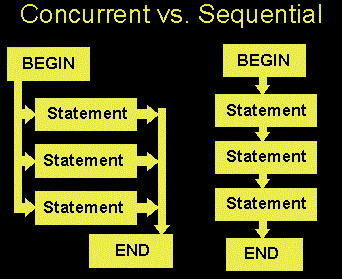
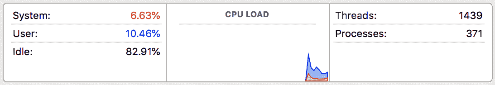
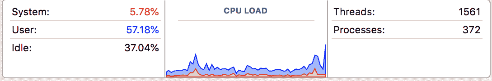
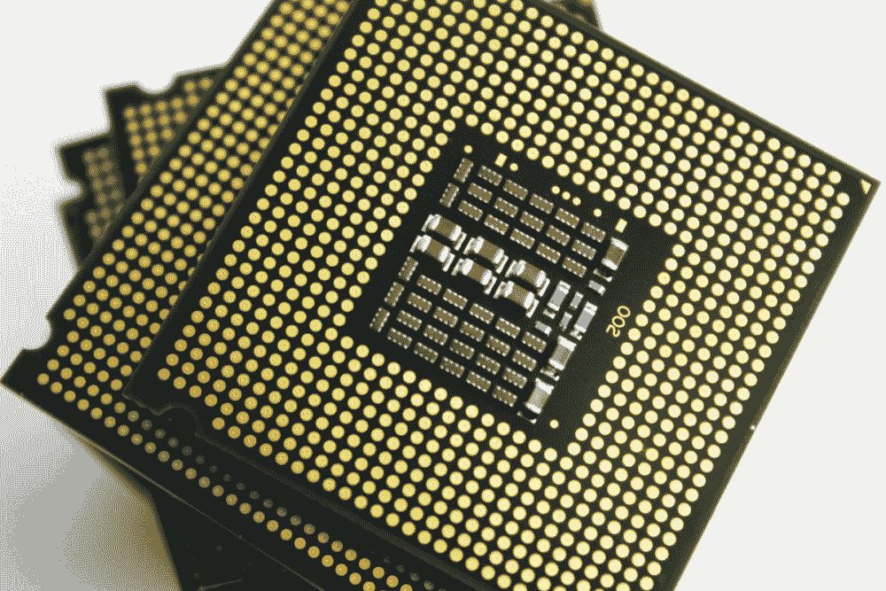

# 第一章：并发和并行编程的高级介绍

*Python 并发编程大师*的第一章将概述并发编程是什么（与顺序编程相对）。我们将简要讨论可以并发进行的程序与不能并发进行的程序之间的区别。我们将回顾并发工程和编程的历史，并提供许多并发编程在当今如何使用的例子。最后，我们将简要介绍本书的方法，包括章节结构的概述和如何下载代码并创建工作的 Python 环境的详细说明。

本章将涵盖以下主题：

+   并发的概念

+   为什么有些程序不能并发进行，以及如何区分它们与可以并发进行的程序

+   计算机科学中的并发历史：它如何在当今的工业中使用，以及未来可以期待什么

+   书中每个部分/章节将涵盖的具体主题

+   如何设置 Python 环境，以及如何从 GitHub 检出/下载代码

# 技术要求

查看以下视频以查看代码的实际操作：[`bit.ly/2TAMAeR`](http://bit.ly/2TAMAeR)

# 什么是并发？

据估计，计算机程序需要处理的数据量每两年翻一番。例如，**国际数据公司**（**IDC**）估计，到 2020 年，地球上每个人将有 5200GB 的数据。随着这一庞大的数据量，对计算能力的需求是无止境的，虽然每天都在开发和利用大量的计算技术，但并发编程仍然是处理数据的一种最显著的有效和准确的方式之一。

当一些人看到并发这个词时可能会感到害怕，但它背后的概念是非常直观的，甚至在非编程的情境中也是非常常见的。然而，这并不是说并发程序像顺序程序一样简单；它们确实更难编写和理解。然而，一旦实现了正确和有效的并发结构，执行时间将显著改善，这一点稍后你会看到。

# 并发与顺序

也许理解并发编程最明显的方法是将其与顺序编程进行比较。在顺序程序中，一次只能在一个地方，而在并发程序中，不同的组件处于独立或半独立的状态。这意味着处于不同状态的组件可以独立执行，因此可以同时执行（因为一个组件的执行不依赖于另一个的结果）。以下图表说明了这两种类型之间的基本区别：



并发和顺序程序之间的区别

并发的一个直接优势是执行时间的改善。同样，由于一些任务是独立的，因此可以同时完成，计算机执行整个程序所需的时间更少。

# 示例 1 - 检查非负数是否为质数

让我们考虑一个快速的例子。假设我们有一个简单的函数，检查非负数是否为质数，如下所示：

```py
# Chapter01/example1.py

from math import sqrt

def is_prime(x):
    if x < 2:
    return False

if x == 2:
    return True

if x % 2 == 0:
    return False

limit = int(sqrt(x)) + 1
    for i in range(3, limit, 2):
        if x % i == 0:
            return False

return True
```

另外，假设我们有一个显著大的整数列表（*10¹³*到*10¹³+500*），我们想要使用前面的函数检查它们是否是质数：

```py
input = [i for i in range(10 ** 13, 10 ** 13 + 500)]
```

一个顺序的方法是简单地将一个接一个的数字传递给`is_prime()`函数，如下所示：

```py
# Chapter01/example1.py

from timeit import default_timer as timer

# sequential
start = timer()
result = []
for i in input:
    if is_prime(i):
        result.append(i)
print('Result 1:', result)
print('Took: %.2f seconds.' % (timer() - start))
```

复制代码或从 GitHub 存储库下载并运行它（使用`python example1.py`命令）。你的输出的第一部分将类似于以下内容：

```py
> python example1.py
Result 1: [10000000000037, 10000000000051, 10000000000099, 10000000000129, 10000000000183, 10000000000259, 10000000000267, 10000000000273, 10000000000279, 10000000000283, 10000000000313, 10000000000343, 10000000000391, 10000000000411, 10000000000433, 10000000000453]
Took: 3.41 seconds.
```

您可以看到程序处理所有数字大约需要`3.41`秒；我们很快会回到这个数字。现在，对于我们来说，检查计算机在运行程序时的工作情况也是有益的。在操作系统中打开一个 Activity Monitor 应用程序，然后再次运行 Python 脚本；以下截图显示了我的结果：



Activity Monitor 显示计算机性能

显然，计算机并没有工作太辛苦，因为它几乎闲置了 83%。

现在，让我们看看并发是否真的可以帮助我们改进程序。`is_prime()`函数包含大量的重型计算，因此它是并发编程的一个很好的候选对象。由于将一个数字传递给`is_prime()`函数的过程与传递另一个数字是独立的，我们可以潜在地将并发应用到我们的程序中，如下所示：

```py
# Chapter01/example1.py

# concurrent
start = timer()
result = []
with concurrent.futures.ProcessPoolExecutor(max_workers=20) as executor:
    futures = [executor.submit(is_prime, i) for i in input]

    for i, future in enumerate(concurrent.futures.as_completed(futures)):
        if future.result():
            result.append(input[i])

print('Result 2:', result)
print('Took: %.2f seconds.' % (timer() - start))
```

粗略地说，我们将任务分割成不同的、更小的块，并同时运行它们。现在不要担心代码的具体细节，因为我们稍后将更详细地讨论使用进程池的情况。

当我执行该函数时，执行时间明显更好，计算机也更多地利用了它的资源，只有 37%的空闲时间：

```py
> python example1.py
Result 2: [10000000000183, 10000000000037, 10000000000129, 10000000000273, 10000000000259, 10000000000343, 10000000000051, 10000000000267, 10000000000279, 10000000000099, 10000000000283, 10000000000313, 10000000000391, 10000000000433, 10000000000411, 10000000000453]
Took: 2.33 seconds
```

Activity Monitor 应用程序的输出将类似于以下内容：

Activity Monitor 显示计算机性能

# 并发与并行

此时，如果您有一些并行编程的经验，您可能会想知道并发是否与并行有所不同。并发和并行编程之间的关键区别在于，虽然在并行程序中有许多处理流（主要是 CPU 和核心）可以独立工作，但在并发程序中，可能有不同的处理流（主要是线程）同时访问和使用**共享资源**。

由于这个共享资源可以被不同的处理流程读取和覆盖，有时需要一定形式的协调，当需要执行的任务并不完全独立时。换句话说，有些任务重要的是在其他任务之后执行，以确保程序会产生正确的结果。


并发与并行的区别

上图说明了并发和并行的区别：在上部分，不相互交互的并行活动（在本例中是汽车）可以同时运行，而在下部分，一些任务必须等待其他任务完成后才能执行。

我们稍后将看更多这些区别的例子。

# 一个快速的比喻

并发是一个很难立即完全理解的概念，所以让我们考虑一个快速的比喻，以便更容易理解并发及其与并行的区别。

尽管一些神经科学家可能会有不同看法，让我们简要假设人脑的不同部分负责执行独立的身体部位动作和活动。例如，大脑的左半球控制身体的右侧，因此控制右手（反之亦然）；或者，大脑的一部分可能负责写作，而另一部分则专门处理说话。

现在，让我们具体考虑第一个例子。如果您想移动您的左手，大脑的右侧（只有右侧）必须处理移动的命令，这意味着左侧的大脑是*空闲*的，可以处理其他信息。因此，可以同时移动和使用左手和右手，以执行不同的事情。同样，可以同时写作*和*说话。

这就是并行性：不同的进程不相互交互，彼此独立。请记住，并发并不完全像并行。尽管有一些情况下进程是一起执行的，但并发也涉及共享相同的资源。如果并行类似于同时使用左手和右手进行独立任务，那么并发可以与杂耍相关联，两只手同时执行不同的任务，但它们也与同一个对象（在这种情况下是杂耍球）进行交互，并且因此需要两只手之间的某种协调。

# 不是所有的事情都应该并发进行

并非所有的程序都是平等的：有些可以相对容易地并行或并发执行，而其他一些则是固有的顺序，因此不能并发执行或并行执行。前者的一个极端例子是令人尴尬的并行程序，可以将其分成不同的并行任务，这些任务之间几乎没有依赖性或需要通信。

# 令人尴尬的并行

一个常见的令人尴尬的并行程序的例子是由图形处理单元处理的 3D 视频渲染，其中每个帧或像素都可以在没有相互依赖的情况下进行处理。密码破解是另一个可以轻松分布在 CPU 核心上的令人尴尬的并行任务。在后面的章节中，我们将解决许多类似的问题，包括图像处理和网络抓取，这些问题可以直观地进行并发/并行处理，从而显著提高执行时间。

# 固有的顺序

与令人尴尬的并行任务相反，一些任务的执行严重依赖于其他任务的结果。换句话说，这些任务不是独立的，因此不能并行或并发执行。此外，如果我们试图将并发性引入这些程序，可能会花费更多的执行时间来产生相同的结果。让我们回到之前的素数检查示例；以下是我们看到的输出：

```py
> python example1.py
Result 1: [10000000000037, 10000000000051, 10000000000099, 10000000000129, 10000000000183, 10000000000259, 10000000000267, 10000000000273, 10000000000279, 10000000000283, 10000000000313, 10000000000343, 10000000000391, 10000000000411, 10000000000433, 10000000000453]
Took: 3.41 seconds.
Result 2: [10000000000183, 10000000000037, 10000000000129, 10000000000273, 10000000000259, 10000000000343, 10000000000051, 10000000000267, 10000000000279, 10000000000099, 10000000000283, 10000000000313, 10000000000391, 10000000000433, 10000000000411, 10000000000453]
Took: 2.33 seconds.
```

仔细观察，你会发现两种方法得到的结果并不相同；第二个结果列表中的素数是无序的。（回想一下，在第二种方法中，为了应用并发，我们指定将任务分成不同的组同时执行，我们获得的结果的顺序是每个任务完成执行的顺序。）这是我们第二种方法中使用并发的直接结果：我们将要执行的任务分成不同的组，并且我们的程序同时处理了这些组中的任务。

由于不同组的任务同时执行，存在一些任务在输入列表中落后于其他任务，但在输出列表中却先于其他任务执行。例如，数字 10000000000183 在我们的输入列表中落后于数字 10000000000129，但在输出列表中却在数字 10000000000129 之前被处理。实际上，如果你一遍又一遍地执行程序，第二个结果几乎每次都会有所不同。

显然，如果我们希望获得的结果需要按照我们最初的输入顺序，那么这种情况是不可取的。当然，在这个例子中，我们可以通过使用某种形式的排序来简单修改结果，但最终会花费我们额外的执行时间，这可能使其比原始的顺序方法更昂贵。

用来说明某些任务的固有顺序性的常用概念是怀孕：女性的数量永远不会减少怀孕的时间。与并行或并发任务相反，在固有顺序任务中增加处理实体的数量不会改善执行时间。固有顺序性的著名例子包括迭代算法：牛顿法、三体问题的迭代解、或迭代数值逼近方法。

# 例 2 - 固有顺序任务

让我们考虑一个快速的例子：

计算*f¹⁰⁰⁰(3)*，其中*f(x) = x² - x + 1*，*f^(n + 1)(x) = f(f^n(x))*。

对于像*f*这样复杂的函数（其中找到*f^n(x)*的一般形式相对困难），计算*f¹⁰⁰⁰**(3)*或类似值的唯一合理的方法是迭代计算*f²(3) = f( f(3))*, *f³(3) = f( f²(3))*, *...* ,*f⁹⁹⁹(3) = f( f⁹⁹⁸(3))*, 最后，*f¹⁰⁰⁰**(3) = f( f⁹⁹⁹(3)**)*。

即使使用计算机，实际计算*f¹⁰⁰⁰**(3)*也需要很长时间，因此我们的代码中只考虑*f²⁰(3)*（我的笔记本电脑在计算*f²⁵(3)*后实际上开始发热）：

```py
# Chapter01/example2.py

def f(x):
    return x * x - x + 1

# sequential
def f(x):
    return x * x - x + 1

start = timer()
result = 3
for i in range(20):
    result = f(result)

print('Result is very large. Only printing the last 5 digits:', result % 100000)
print('Sequential took: %.2f seconds.' % (timer() - start))
```

运行它（或使用`python example2.py`）；以下代码显示了我收到的输出：

```py
> python example2.py
Result is very large. Only printing the last 5 digits: 35443
Sequential took: 0.10 seconds.
```

现在，如果我们尝试将并发应用于此脚本，唯一可能的方法是通过`for`循环。一个解决方案可能如下：

```py
# Chapter01/example2.py

# concurrent
def concurrent_f(x):
    global result
    result = f(result)

result = 3

with concurrent.futures.ThreadPoolExecutor(max_workers=20) as exector:
    futures = [exector.submit(concurrent_f, i) for i in range(20)]

    _ = concurrent.futures.as_completed(futures)

print('Result is very large. Only printing the last 5 digits:', result % 100000)
print('Concurrent took: %.2f seconds.' % (timer() - start))
```

我收到的输出如下所示：

```py
> python example2.py
Result is very large. Only printing the last 5 digits: 35443
Concurrent took: 0.19 seconds.
```

尽管两种方法都产生了相同的结果，但并发方法所花费的时间几乎是顺序方法的两倍。这是因为每次生成新线程（来自`ThreadPoolExecutor`）时，该线程内的函数`conconcurrent_f()`都需要等待变量`result`被前一个线程完全处理，因此整个程序仍然以顺序方式执行。

因此，虽然第二种方法中实际上没有涉及并发，但生成新线程的开销导致了明显更差的执行时间。这是固有的顺序任务的一个例子，其中不应该尝试应用并发或并行来改善执行时间。

# I/O 绑定

另一种思考顺序性的方式是计算机科学中称为 I/O 绑定的条件：计算完成所花费的时间主要由等待输入/输出（I/O）操作完成的时间决定。当请求数据的速率慢于消耗数据的速率时，或者简而言之，花费在请求数据上的时间比处理数据的时间更多时，就会出现这种情况。

在 I/O 绑定状态下，CPU 必须暂停其操作，等待数据被处理。这意味着，即使 CPU 在处理数据方面变得更快，由于它们更多地受到 I/O 绑定的影响，进程的速度不会与 CPU 速度的增加成比例地提高。随着更快的计算速度成为新计算机和处理器设计的主要目标，I/O 绑定状态变得不受欢迎，但在程序中变得越来越常见。

正如您所见，有许多情况下，并发编程的应用会导致处理速度下降，因此应该避免。因此，对我们来说，重要的是不将并发视为可以产生无条件更好执行时间的黄金票据，并理解受益于并发和不受益于并发的程序结构之间的差异。

# 并发的历史、现在和未来

在接下来的子主题中，我们将讨论并发的过去、现在和未来。

自计算机科学的早期以来，并发编程领域就一直备受关注。在本节中，我们将讨论并发编程的起源和发展历程，以及它在工业中的当前使用情况，以及一些关于并发性将来如何使用的预测。

# 并发性的历史

并发性的概念已经存在了相当长的时间。这个想法起源于 19 世纪和 20 世纪初对铁路和电报的早期工作，并且一些术语甚至一直延续至今（比如**信号量**，它表示并发程序中控制对共享资源访问的变量）。并发性首先被应用于解决如何处理同一铁路系统上的多列火车，以避免碰撞并最大化效率，以及如何处理早期电报中给定一组电线上的多次传输。

并发编程的理论基础在 20 世纪 60 年代实际上已经奠定了。早期的算法语言 ALGOL 68 于 1959 年首次开发，包括支持并发编程的特性。并发性的学术研究正式始于 1965 年的一篇开创性论文，作者是计算机科学先驱 Edsger Dijkstra，他以其命名的路径查找算法而闻名。

那篇开创性的论文被认为是并发编程领域的第一篇论文，Dijkstra 在其中确定并解决了互斥问题。互斥是并发控制的一个属性，它可以防止竞争条件（我们稍后会讨论），后来成为并发中最受讨论的话题之一。

然而，在那之后并没有太多的兴趣。从 1970 年左右到 2000 年初，处理器据说每 18 个月执行速度翻倍。在这段时间内，程序员不需要关注并发编程，因为他们只需要等待程序运行得更快。然而，在 2000 年初，处理器业务发生了一场范式转变；制造商开始专注于更小、更慢的处理器，这些处理器被组合在一起。这是计算机开始拥有多核处理器的时候。

如今，一台普通的计算机拥有多个核心。因此，如果程序员以任何方式编写所有的程序都不是并发的话，他们会发现他们的程序只利用一个核心或一个线程来处理数据，而 CPU 的其余部分则闲置不做任何事情。这也是最近推动并发编程的一个原因。

并发性日益增长的另一个原因是图形、多媒体和基于网络的应用程序开发领域的不断扩大，其中并发性的应用被广泛用于解决复杂和有意义的问题。例如，并发性在 Web 开发中扮演着重要角色：用户发出的每个新请求通常都作为自己的进程（这称为多进程；参见第六章，*在 Python 中处理进程*）或与其他请求异步协调（这称为异步编程；参见第九章，*异步编程简介*）；如果其中任何请求需要访问共享资源（例如数据库），并发性应该被考虑进去。

# 现在

考虑到现在，互联网和数据共享的爆炸性增长每秒都在发生，因此并发性比以往任何时候都更加重要。当前并发编程的使用强调正确性、性能和稳健性。

一些并发系统，如操作系统或数据库管理系统，通常被设计为无限运行，包括从故障中自动恢复，并且不会意外终止。如前所述，并发系统使用共享资源，因此它们在实现中需要某种形式的**信号量**来控制和协调对这些资源的访问。

并发编程在软件开发领域非常普遍。以下是一些并发存在的示例：

+   并发在大多数常见的编程语言中都扮演着重要角色：C++、C#、Erlang、Go、Java、Julia、JavaScript、Perl、Python、Ruby、Scala 等等。

+   再次，由于几乎每台计算机今天都在其 CPU 中有多个核心，桌面应用程序需要能够利用这种计算能力，以提供真正设计良好的软件。



MacBook Pro 电脑使用的多核处理器

+   2011 年发布的 iPhone 4S 具有双核 CPU，因此移动开发也必须与并发应用程序保持连接。

+   至于视频游戏，目前市场上最大的两个参与者是多 CPU 系统的 Xbox 360 和本质上是多核系统的索尼 PS3。

+   即使是当前的 35 美元的树莓派也是基于四核系统构建的。

+   据估计，谷歌平均每秒处理超过 40,000 个搜索查询，相当于每天超过 35 亿次搜索，全球每年处理 1.2 万亿次搜索。除了拥有处理能力惊人的大型机器外，并发性是处理如此大量数据请求的最佳方式。

如今，大部分数据和应用程序存储在云中。由于云上的计算实例相对较小，几乎每个网络应用都被迫采用并发处理，同时处理不同的小任务。随着获得更多客户并需要处理更多请求，设计良好的网络应用可以简单地利用更多服务器，同时保持相同的逻辑；这对应了我们之前提到的鲁棒性属性。

即使在人工智能和数据科学这些日益流行的领域，也取得了重大进展，部分原因是高端图形卡（GPU）的可用性，它们被用作并行计算引擎。在最大的数据科学网站（[`www.kaggle.com/`](https://www.kaggle.com/)）的每一次显著竞赛中，几乎所有获奖解决方案在训练过程中都使用了某种形式的 GPU。由于大数据模型需要处理大量数据，因此并发提供了一种有效的解决方案。一些人工智能算法甚至被设计成将输入数据分解成较小的部分并独立处理，这是应用并发以实现更好的模型训练时间的绝佳机会。

# 未来

在当今这个时代，无论用户使用什么应用程序，计算机/互联网用户都期望即时输出，开发人员经常发现自己在努力解决为其应用程序提供更快速度的问题。在使用方面，并发性将继续成为编程领域的主要参与者之一，为这些问题提供独特和创新的解决方案。如前所述，无论是视频游戏设计、移动应用、桌面软件还是 Web 开发，未来并发性都将无处不在。

鉴于应用程序对并发支持的需求，有人可能会认为并发编程在学术界也将变得更加标准。尽管计算机科学课程中涵盖了并发和并行主题，但深入的、复杂的并发编程课题（理论和应用课题）将被纳入本科和研究生课程中，以更好地为学生们未来在行业中的工作做准备，因为并发在日常中被广泛使用。计算机科学课程将涉及构建并发系统、研究数据流以及分析并发和并行结构，这只是一个开始。

其他人可能对并发编程的未来持更为怀疑的观点。有人说，并发实际上是关于依赖分析的：这是编译器理论的一个子领域，分析语句/指令之间的执行顺序约束，并确定程序是否安全地重新排序或并行化其语句。此外，由于真正理解并发及其复杂性的程序员数量很少，将会有一种推动力，即编译器以及操作系统的支持，来承担实际将并发实现到它们自己编译的程序中的责任。

具体来说，未来程序员将不必关心并发编程的概念和问题，也不应该。在编译器级别实现的算法应该查看正在编译的程序，分析语句和指令，生成依赖图以确定这些语句和指令的最佳执行顺序，并在适当和有效的地方应用并发/并行。简而言之，程序员对并发系统的理解和有效工作的数量较少，以及自动化设计并发的可能性，将导致对并发编程的兴趣减少。

最终，只有时间才能告诉我们并发编程的未来会是什么样子。我们程序员只能看看并发目前在现实世界中是如何被使用的，并确定是否值得学习：正如我们在这个案例中所看到的那样。此外，尽管设计并发程序与依赖分析之间存在着紧密的联系，但我个人认为并发编程是一个更为复杂和深入的过程，可能很难通过自动化实现。

并发编程确实非常复杂，很难做到完美，但这也意味着通过这个过程获得的知识将对任何程序员都是有益的，我认为这已经足够好的理由来学习并发。分析程序加速的问题、将程序重构为不同的独立任务，并协调这些任务使用相同的资源，是程序员在处理并发时所建立的主要技能，对这些主题的了解也将帮助他们解决其他编程问题。

# Python 并发编程的简要概述

Python 是最受欢迎的编程语言之一，而且理由充分。该语言配备了许多库和框架，可以促进高性能计算，无论是软件开发、网站开发、数据分析还是机器学习。然而，开发人员之间一直在讨论 Python 的问题，其中经常涉及全局解释器锁（GIL）以及实现并发和并行程序所带来的困难。

尽管在 Python 中，并发和并行的行为与其他常见的编程语言有所不同，但程序员仍然可以实现并发或并行运行的 Python 程序，并为其程序实现显著的加速。

《Python 并发编程大师》将作为 Python 中并发工程和编程中各种高级概念的全面介绍。本书还将详细介绍并发和并行在现实应用中的使用情况。它是理论分析和实际示例的完美结合，将使您充分了解 Python 中并发编程的理论和技术。

本书将分为六个主要部分。它将从并发和并发编程背后的理念开始——历史，它如何在当今的工业中使用，最后，对并发可能提供的加速的数学分析。此外，本章的最后一节（也是我们的下一节）将介绍如何按照本书中的编码示例，包括在自己的计算机上设置 Python 环境，从 GitHub 下载/克隆本书中包含的代码，并在计算机上运行每个示例的说明。

接下来的三节将分别涵盖并发编程中的三种主要实现方法：线程、进程和异步 I/O。这些部分将包括每种方法的理论概念和原则，Python 语言提供的语法和各种功能来支持它们，以及它们高级用法的最佳实践讨论，并且直接应用这些概念来解决现实问题的实践项目。

第五节将向读者介绍工程师和程序员在并发编程中面临的一些常见问题：死锁、饥饿和竞争条件。读者将了解每个问题的理论基础和原因，在 Python 中分析和复制每个问题，并最终实现潜在的解决方案。本节的最后一章将讨论前面提到的 GIL，这是 Python 语言特有的。它将涵盖 GIL 在 Python 生态系统中的重要作用，GIL 对并发编程提出的一些挑战，以及如何实现有效的解决方法。

在书的最后一节中，我们将致力于并发 Python 编程的各种高级应用。这些应用将包括无锁和有锁并发数据结构的设计，内存模型和原子类型的操作，以及如何从头开始构建支持并发请求处理的服务器。本节还将涵盖在测试、调试和调度并发 Python 应用程序时的最佳实践。

在整本书中，您将通过讨论、示例代码和实践项目来建立处理并发程序的基本技能。您将了解并发编程中最重要的概念的基础知识，如何在 Python 程序中实现它们，以及如何将这些知识应用于高级应用。通过《Python 并发编程大师》，您将具备关于并发的广泛理论知识和在 Python 语言中并发应用的实际知识的独特组合。

# 为什么选择 Python？

正如之前提到的，开发者在使用 Python 编程语言（特别是 CPython——用 C 编写的 Python 的参考实现）进行并发编程时面临的困难之一是其 GIL。GIL 是一个互斥锁，用于保护对 Python 对象的访问，防止多个线程同时执行 Python 字节码。这个锁主要是因为 CPython 的内存管理不是线程安全的。CPython 使用引用计数来实现其内存管理。这导致多个线程可以同时访问和执行 Python 代码；这种情况是不希望发生的，因为它可能导致数据处理不正确，我们称这种内存管理方式不是线程安全的。为了解决这个问题，GIL 是一个锁，如其名，只允许一个线程访问 Python 代码和对象。然而，这也意味着，要在 CPython 中实现多线程程序，开发者需要意识到 GIL 并绕过它。这就是为什么许多人在 Python 中实现并发系统时会遇到问题。

那么，为什么要在 Python 中使用并发？尽管 GIL 在某些情况下阻止多线程的 CPython 程序充分利用多处理器系统，但大多数阻塞或长时间运行的操作，如 I/O、图像处理和 NumPy 数值计算，都发生在 GIL 之外。因此，GIL 只对在 GIL 内花费大量时间的多线程程序造成潜在瓶颈。正如您将在未来的章节中看到的，多线程只是一种并发编程形式，而且，虽然 GIL 对允许多个线程访问共享资源的多线程 CPython 程序提出了一些挑战，但其他形式的并发编程并没有这个问题。例如，不共享任何公共资源的多进程应用程序，如 I/O、图像处理或 NumPy 数值计算，可以与 GIL 无缝配合。我们将在第十五章中更深入地讨论 GIL 及其在 Python 生态系统中的位置，*全局解释锁*。

除此之外，Python 在编程社区中的受欢迎程度不断增加。由于其用户友好的语法和整体可读性，越来越多的人发现在开发中使用 Python 相对来说相对简单，无论是初学者学习新的编程语言，中级用户寻找 Python 的高级功能，还是经验丰富的程序员使用 Python 解决复杂问题。据估计，Python 代码的开发速度可能比 C/C++代码快 10 倍。

使用 Python 的开发者数量的增加导致了一个强大且不断增长的支持社区。Python 中的库和包每天都在不同的问题和技术上进行开发和发布。目前，Python 语言支持非常广泛的编程范围，包括软件开发、桌面 GUI、视频游戏设计、Web 和互联网开发，以及科学和数值计算。近年来，Python 还作为数据科学、大数据和机器学习领域的顶尖工具之一不断增长，与该领域的长期参与者 R 竞争。

Python 开发工具的数量之多鼓励了更多的开发者开始使用 Python 进行编程，使 Python 变得更加流行和易于使用；我称之为*Python 的恶性循环*。DataCamp 的首席数据科学家大卫·罗宾逊在博客中写道（[`stackoverflow.blog/2017/09/06/incredible-growth-python/`](https://stackoverflow.blog/2017/09/06/incredible-growth-python/)），Python 的增长令人难以置信，并称其为最受欢迎的编程语言。

然而，Python 很慢，或者至少比其他流行的编程语言慢。这是因为 Python 是一种动态类型的解释语言，其中值不是存储在密集的缓冲区中，而是存储在分散的对象中。这直接是 Python 易读性和用户友好性的结果。幸运的是，有各种选项可以让您的 Python 程序运行得更快，而并发是其中最复杂的之一；这就是我们将在本书中掌握的内容。

# 设置您的 Python 环境

在我们进一步进行之前，让我们了解一些关于如何设置本书中将要使用的必要工具的规范。特别是，我们将讨论如何为您的系统获取 Python 发行版以及适当的开发环境的过程，以及如何下载本书各章中包含的示例中使用的代码。

# 一般设置

让我们看看如何为您的系统获取 Python 发行版以及适当的开发环境的过程：

+   任何开发人员都可以从[`www.python.org/downloads/`](https://www.python.org/downloads/)获取他们自己的 Python 发行版。

+   尽管 Python 2 和 Python 3 都得到支持和维护，但在本书中，我们将使用 Python 3。

+   对于本书来说，选择一个**集成开发环境**（**IDE**）是灵活的。虽然从技术上讲，可以使用最小的文本编辑器（如记事本或 TextEdit）开发 Python 应用程序，但使用专门为 Python 设计的 IDE 通常更容易阅读和编写代码。这些包括 IDLE（[`docs.python.org/3/library/idle.html`](https://docs.python.org/3/library/idle.html)）、PyCharm（[`www.jetbrains.com/pycharm/`](https://www.jetbrains.com/pycharm/)）、Sublime Text（[`www.sublimetext.com/`](https://www.sublimetext.com/)）和 Atom（[`atom.io/`](https://atom.io/)）。

# 下载示例代码

要获取本书中使用的代码，您可以从 GitHub 下载存储库，其中包括本书中涵盖的所有示例和项目代码：

+   首先，访问[`github.com/PacktPublishing/Mastering-Concurrency-in-Python`](https://github.com/PacktPublishing/Mastering-Concurrency-in-Python)。

+   要下载存储库，只需单击窗口右上角的“克隆或下载”按钮。选择“下载 ZIP”以将压缩的存储库下载到您的计算机：

！[](assets/32dd5eb5-da0f-42df-83fa-0505eaeb467f.png)

单击“下载 ZIP”以下载存储库

+   解压下载的文件以创建我们正在寻找的文件夹。文件夹的名称应为`Mastering-Concurrency-in-Python`。

文件夹内有各自命名为`ChapterXX`的文件夹，表示该文件夹中代码所涵盖的章节。例如，`Chapter03`文件夹包含了第三章中涵盖的示例和项目代码，*在 Python 中使用线程*。在每个子文件夹中，有各种 Python 脚本；当您在本书中阅读每个代码示例时，您将知道在每个章节的特定时点运行哪个脚本。

# 总结

您现在已经了解了并发和并行编程的概念。它涉及设计和构造编程命令和指令，以便程序的不同部分可以以有效的顺序执行，同时共享相同的资源。由于当一些命令和指令同时执行时可以节省时间，因此与传统的顺序编程相比，并发编程在程序执行时间上提供了显着的改进。

然而，在设计并发程序时需要考虑各种因素。虽然有些特定任务可以很容易地分解成可以并行执行的独立部分（尴尬并行任务），但其他任务需要不同形式的协调，以便正确高效地使用共享资源。还有固有的顺序任务，无法应用并发和并行来实现程序加速。您应该了解这些任务之间的基本区别，以便适当地设计并发程序。

最近，出现了一种范式转变，促进了并发在编程世界的大多数方面的实现。现在，几乎可以在任何地方找到并发：桌面和移动应用程序，视频游戏，Web 和互联网开发，人工智能等等。并发仍在增长，并且预计将来会继续增长。因此，任何有经验的程序员都必须了解并发及其相关概念，并知道如何将这些概念集成到他们的应用程序中，这是至关重要的。

另一方面，Python 是最受欢迎的编程语言之一（如果不是最受欢迎的）。它在大多数编程子领域提供了强大的选项。因此，并发和 Python 的结合是编程中最值得学习和掌握的主题之一。

在下一章中，我们将讨论 Amdahl 定律，以了解并发为我们的程序提供的加速改进有多重要。我们将分析 Amdahl 定律的公式，讨论其含义，并考虑 Python 示例。

# 问题

+   并发的概念是什么，为什么它有用？

+   并发编程和顺序编程之间有什么区别？

+   并发编程和并行编程之间有什么区别？

+   每个程序都可以做成并发或并行吗？

+   什么是尴尬并行任务？

+   什么是固有的顺序任务？

+   I/O 绑定是什么意思？

+   当前在现实世界中如何使用并发处理？

# 进一步阅读

更多信息请参考以下链接：

+   *Python 并行编程食谱*，作者：Giancarlo Zaccone，Packt Publishing Ltd，2015

+   *学习 Python 并发：构建高效、健壮和并发的应用*（2017），作者：Forbes, Elliot

+   《并发工程基础的历史根源》*IEEE 工程管理交易* 44.1（1997）：67-78，作者：Robert P. Smith

+   *编程语言实用性*，Morgan Kaufmann，2000，作者：Michael Lee Scott
