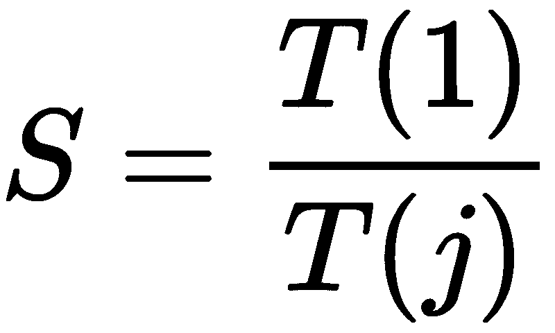
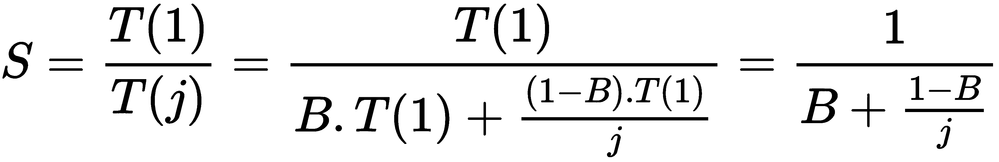
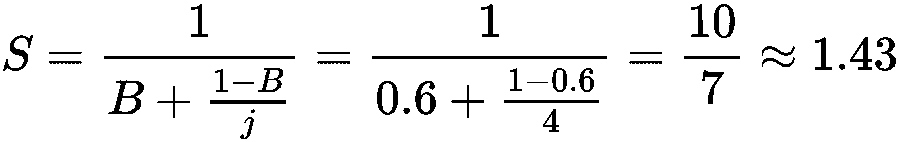
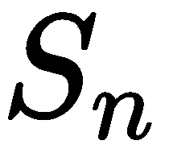
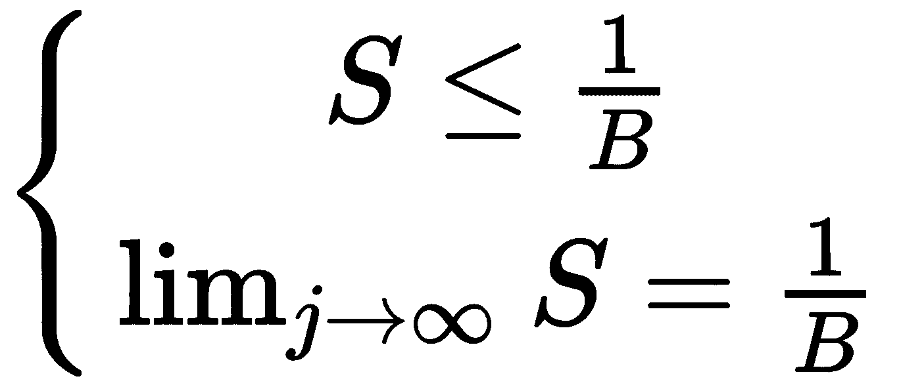
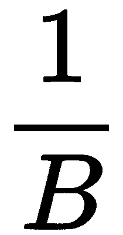

# 第二章：阿姆达尔定律

阿姆达尔定律经常用于围绕并发程序的讨论，它解释了在使用并发时可以预期的程序执行的理论加速。在本章中，我们将讨论阿姆达尔定律的概念，并分析其估计程序潜在加速的公式，并在 Python 代码中复制它。本章还将简要介绍阿姆达尔定律与边际收益递减定律之间的关系。

本章将涵盖以下主题：

+   阿姆达尔定律

+   阿姆达尔定律：其公式和解释

+   阿姆达尔定律与边际收益递减定律之间的关系

+   Python 中的模拟和阿姆达尔定律的实际应用

# 技术要求

以下是本章的先决条件列表：

+   确保您的计算机上安装了 Python 3

+   在[`github.com/PacktPublishing/Mastering-Concurrency-in-Python`](https://github.com/PacktPublishing/Mastering-Concurrency-in-Python)下载 GitHub 存储库。

+   在本章中，我们将使用名为`Chapter02`的子文件夹

+   查看以下视频以查看代码实际运行情况：[`bit.ly/2DWaOeQ`](http://bit.ly/2DWaOeQ)

# 阿姆达尔定律

如何在并行化顺序程序（通过增加处理器数量）和优化顺序程序本身的执行速度之间找到平衡？例如，哪个选项更好：有四个处理器运行给定程序的 40%的执行时间，还是只使用两个处理器执行相同的程序，但时间加倍？这种权衡在并发编程中经常出现，可以通过应用阿姆达尔定律进行战略分析和回答。

此外，虽然并发和并行可以是提供程序执行时间显著改进的强大工具，但它们并不是可以无限制地加速任何非顺序架构的银弹。因此，开发人员和程序员了解并理解并发和并行提供给他们的程序速度改进的限制是非常重要的，而阿姆达尔定律正是解决了这些问题。

# 术语

阿姆达尔定律提供了一个数学公式，计算通过增加资源（特别是可用处理器的数量）来提高并发程序速度的潜在改进。在我们深入阿姆达尔定律的理论之前，首先我们必须澄清一些术语，如下所示：

+   阿姆达尔定律仅讨论由并行执行任务产生的潜在延迟加速。虽然这里并没有直接讨论并发性，但阿姆达尔定律关于并行性的结果将为我们提供有关并发程序的估计。

+   程序的**速度**表示程序执行所需的时间。这可以用任何时间单位来衡量。

+   **加速**是衡量并行执行计算的好处的时间。它定义为程序在串行执行（使用一个处理器）所需的时间除以并行执行（使用多个处理器）所需的时间。加速的公式如下：



在上述公式中，*T(j)*是使用*j*个处理器执行程序所需的时间。

# 公式和解释

在我们深入探讨阿姆达尔定律及其含义的公式之前，让我们通过一些简要分析来探讨加速的概念。假设有*N*个工人在完成一个完全可并行化的工作，也就是说，这项工作可以完全分成*N*个相等的部分。这意味着*N*个工人一起完成工作所需的时间只有一个工人完成相同工作所需时间的*1/N*。

然而，大多数计算机程序并非 100%可并行化：程序的某些部分可能是固有的顺序，而其他部分则被分解为并行任务。

# 阿姆达尔定律的公式

现在，让 *B* 表示严格串行的程序部分的分数，并考虑以下内容：

+   *B * T(1)* 是执行程序中固有顺序部分所需的时间。

+   *T(1) - B * T(1) = (1 - B) * T(1)* 是使用一个处理器执行程序的可并行化部分所需的时间：

+   然后，*(1 - B) * T(1) / N* 是使用 *N* 个处理器执行这些部分所需的时间

+   因此，*B * T(1) + (1 - B) * T(1) / N* 是使用 *N* 个处理器执行整个程序所需的总时间。

回到加速度数量的公式，我们有以下内容：



这个公式实际上是阿姆达尔定律的一种形式，用于估计并行程序的加速。

# 一个快速的例子

假设我们有一个计算机程序，并且以下内容适用于它：

+   其中 40%可以并行处理，所以 *B = 1 - 40% = 0.6*

+   它的可并行化部分将由四个处理器处理，所以 *j = 4*

阿姆达尔定律规定应用改进的整体加速度将如下所示：



# 影响

以下是 1967 年 Gene Amdahl 的一句引用：

“十多年来，预言家们一直声称单台计算机的组织已经达到了极限，真正显著的进步只能通过多台计算机的互连来实现，以便允许合作解决方案... 这种开销（在并行性中）似乎是顺序的，因此不太可能适用于并行处理技术。即使在一个单独的处理器中进行了管理，开销本身也会将吞吐量的上限放置在顺序处理速率的五到七倍，即使在任何时间点上，也很难预见如何有效地克服顺序计算机中的以前瓶颈。”

通过这句引用，阿姆达尔指出，无论在程序中实现了什么并发和并行技术，程序中所需的顺序性开销总是设定了程序将获得多少加速度的上限。这是阿姆达尔定律进一步暗示的其中一个影响。考虑以下例子：


 表示从 *n* 个处理器中获得的加速。

这表明，随着资源数量（特别是可用处理器的数量）的增加，整个任务执行的加速度也会增加。然而，这并不意味着我们应该总是使用尽可能多的系统处理器来实现并发和并行，以实现最高的性能。实际上，从公式中，我们还可以得出增加处理器数量所实现的加速度会减少。换句话说，随着我们为并发程序添加更多处理器，我们将获得越来越少的执行时间改进。

此外，正如之前提到的，阿姆达尔定律暗示的另一个影响涉及执行时间改进的上限：



 是并发和并行可以为您的程序提供的改进的上限。这就是说，无论您的系统有多少可用资源，通过并发都不可能获得大于  的加速度，这个上限由程序的顺序开销部分所决定（*B* 是严格串行的程序部分的分数）。

# 阿姆达尔定律与边际收益递减定律的关系

阿姆达尔定律经常与边际收益递减定律混淆，后者是经济学中一个相当流行的概念。然而，边际收益递减定律只是应用阿姆达尔定律的特例，取决于改进的顺序。如果选择以**最佳**方式改进程序中的单独任务顺序，将观察到执行时间的单调递减改进，表明边际收益递减。最佳方法指的是首先应用那些将导致最大加速的改进，然后将那些产生较小加速的改进留到后面。

现在，如果我们选择资源的顺序进行反转，即在改进更不理想的程序组件之前改进更理想的组件，通过改进获得的加速将在整个过程中增加。此外，实际上，对我们来说更有利的是按照这种**反向最佳**顺序实施系统改进，因为更理想的组件通常更复杂，需要更多时间来改进。

阿姆达尔定律和边际收益递减定律之间的另一个相似之处涉及通过向系统添加更多处理器获得的加速改进。具体来说，当向系统添加新处理器以处理固定大小的任务时，它提供的可用计算能力将少于上一个处理器。正如我们在上一节中讨论的，这种情况下的改进严格减少，随着处理器数量的增加，总吞吐量接近*1/B*的上限。

重要的是要注意，此分析未考虑其他潜在的瓶颈，如内存带宽和 I/O 带宽。实际上，如果这些资源不随处理器数量增加而增加，那么简单地添加处理器将导致更低的回报。

# 如何在 Python 中模拟

在本节中，我们将通过一个 Python 程序来查看阿姆达尔定律的结果。仍然考虑到确定整数是否为素数的任务，如第一章中所讨论的，*并发和并行编程的高级介绍*，我们将看到通过并发实际实现了什么样的加速。如果您已经从 GitHub 页面下载了书籍的代码，我们将查看`Chapter02/example1.py`文件。

作为复习，检查素数的函数如下：

```py
# Chapter02/example1.py

from math import sqrt

def is_prime(x):
    if x < 2:
        return False

    if x == 2:
        return x

    if x % 2 == 0:
        return False

    limit = int(sqrt(x)) + 1
    for i in range(3, limit, 2):
        if x % i == 0:
            return False

    return x
```

代码的下一部分是一个函数，它接受一个整数，表示我们将利用多少个处理器（工作者）并发解决问题（在本例中，用于确定列表中的哪些数字是素数）：

```py
# Chapter02/example1.py

import concurrent.futures

from timeit import default_timer as timer

def concurrent_solve(n_workers):
    print('Number of workers: %i.' % n_workers)

    start = timer()
    result = []

    with concurrent.futures.ProcessPoolExecutor(
      max_workers=n_workers) as executor:

        futures = [executor.submit(is_prime, i) for i in input]
        completed_futures = concurrent.futures.as_completed(futures)

        sub_start = timer()

        for i, future in enumerate(completed_futures):
            if future.result():
                result.append(future.result())

        sub_duration = timer() - sub_start

    duration = timer() - start
    print('Sub took: %.4f seconds.' % sub_duration)
    print('Took: %.4f seconds.' % duration)
```

请注意，变量`sub_start`和`sub_duration`测量正在同时解决的任务部分，在我们之前的分析中，它表示为*1 - B*。至于输入，我们将查看介于*10¹³*和*10¹³ + 1000*之间的数字：

```py
input = [i for i in range(10 ** 13, 10 ** 13 + 1000)]
```

最后，我们将循环从 1 到系统中可用的最大处理器数量，并将该数字传递给前面的`concurrent_solve()`函数。作为一个快速提示，要从计算机中获取可用处理器的数量，请调用`multiprocessing.cpu_count()`，如下所示：

```py
for n_workers in range(1, multiprocessing.cpu_count() + 1):
    concurrent_solve(n_workers)
    print('_' * 20)
```

您可以通过输入命令`python example1.py`来运行整个程序。由于我的笔记本电脑有四个核心，运行程序后的输出如下：

```py
Number of workers: 1.
Sub took: 7.5721 seconds.
Took: 7.6659 seconds.
____________________
Number of workers: 2.
Sub took: 4.0410 seconds.
Took: 4.1153 seconds.
____________________
Number of workers: 3.
Sub took: 3.8949 seconds.
Took: 4.0063 seconds.
____________________
Number of workers: 4.
Sub took: 3.9285 seconds.
Took: 4.0545 seconds.
____________________
```

以下是需要注意的几点：

+   首先，在每次迭代中，任务的子部分几乎和整个程序一样长。换句话说，在每次迭代期间，并发计算形成了程序的大部分。这是可以理解的，因为除了素数检查之外，程序中几乎没有其他繁重的计算。

+   其次，更有趣的是，我们可以看到，尽管在从`1`到`2`个处理器增加数量后获得了显著的改进（从`7.6659 秒`到`4.1153 秒`），但在第三次迭代期间几乎没有实现加速。第四次迭代期间花费的时间比第三次还要长，但这很可能是开销处理。这与我们早期讨论有关，即在考虑处理器数量时，阿姆达尔定律和收益递减法则之间的相似性是一致的。

+   我们还可以参考加速曲线来可视化这一现象。加速曲线只是一个图表，其中*x*轴显示处理器数量，*y*轴显示实现的加速度。在一个完美的场景中，其中*S = j*（即，实现的加速度等于使用的处理器数量），加速曲线将是一条直线，45 度线。阿姆达尔定律表明，任何程序产生的加速曲线将保持在该线下，并且随着效率的降低而开始变平。在前面的程序中，这是在从两个处理器到三个处理器的过渡期间：

！[](assets/7f945408-80b5-46f9-b34d-1c600d093e8f.png)

不同并行部分的加速曲线

# 阿姆达尔定律的实际应用

正如我们所讨论的，通过分析给定程序或系统的顺序和可并行部分，我们可以使用阿姆达尔定律来确定或至少估计并行计算带来的潜在速度改进的上限。在获得这一估计后，我们可以做出明智的决定，判断提高执行时间是否值得增加处理能力。

从我们的例子中，我们可以看到，当你有一个既顺序执行又并行执行指令的并发程序时，阿姆达尔定律是适用的。通过使用阿姆达尔定律进行分析，我们可以确定每次增加可用核心来执行程序时的加速度，以及这种增加对帮助程序实现并行化的最佳加速度有多接近。

现在，让我们回到本章开头提出的初始问题：增加处理器数量与增加并行性能的时间之间的权衡。假设你负责开发一个并发程序，目前有 40％的指令可以并行执行。这意味着多个处理器可以同时运行 40％的程序执行。现在，你的任务是通过实施以下两种选择之一来提高该程序的速度：

+   实施四个处理器来执行程序指令

+   实施两个处理器，另外增加程序的可并行部分到 80％

我们如何分析比较这两种选择，以确定哪一种对我们的程序来说会产生最佳速度？幸运的是，阿姆达尔定律可以在这个过程中帮助我们：

+   对于第一种选择，可以获得的加速比如下：

！[](assets/425163cc-efba-48da-8111-4987fcf0b20f.png)

+   对于第二种选择，速度提升如下：

！[](assets/ca967f21-ffa6-4f82-b6b4-a88bfb25fd4f.png)

正如你所看到的，第二个选择（比第一个选择的处理器少）实际上是加速我们特定程序的更好选择。这是阿姆达尔定律的另一个例子，说明有时简单地增加可用处理器的数量实际上是不可取的，从而改善程序的速度。类似的权衡，可能具有不同的规格，也可以通过这种方式进行分析。

最后需要注意的是，尽管阿姆达尔定律以一种明确的方式提供了潜在加速的估计，但定律本身做出了许多潜在的假设，并没有考虑一些可能重要的因素，比如并行性的开销或内存速度。因此，阿姆达尔定律的公式简化了在实践中可能常见的各种考虑因素。

那么，并发程序的程序员应该如何思考和使用阿姆达尔定律？我们应该记住，阿姆达尔定律的结果只是提供给我们一个关于在哪里以及以多大程度上，我们可以通过增加可用处理器的数量来进一步优化并发系统的想法。最终，只有实际的测量才能准确回答我们关于我们的并发程序在实践中能够实现多少加速的问题。话虽如此，阿姆达尔定律仍然可以帮助我们有效地确定使用并发和并行性来改进计算速度的良好理论策略。

# 摘要

阿姆达尔定律为我们提供了一种估计任务执行时间潜在加速的方法，当系统资源得到改善时，我们可以期待系统的速度提升。它说明，随着系统资源的改善，执行时间也会相应提高。然而，增加资源时的差异加速严格减少，吞吐量加速受程序的顺序开销限制。

您还看到，在特定情况下（即，只增加处理器数量时），阿姆达尔定律类似于边际收益递减定律。具体来说，随着处理器数量的增加，通过改进获得的效率减少，速度提升曲线变得平缓。

最后，本章表明通过并发和并行性的改进并不总是可取的，需要详细的规格说明才能实现有效和高效的并发程序。

有了对并发可以帮助我们加速程序的了解，我们现在将开始讨论 Python 提供的实现并发的具体工具。具体来说，我们将在下一章中考虑并发编程的主要参与者之一，即线程，以及它们在 Python 编程中的应用。

# 问题

+   阿姆达尔定律是什么？阿姆达尔定律试图解决什么问题？

+   解释阿姆达尔定律的公式及其组成部分。

+   根据阿姆达尔定律，随着系统资源的改善，速度提升会无限增加吗？

+   阿姆达尔定律与边际收益递减定律之间的关系是什么？

# 进一步阅读

欲了解更多信息，请参考以下链接：

+   《阿姆达尔定律》（[`home.wlu.edu/~whaleyt/classes/parallel/topics/amdahl.html`](https://home.wlu.edu/~whaleyt/classes/parallel/topics/amdahl.html)），作者：Aaron Michalove

+   《阿姆达尔定律的用途和滥用》，《计算机科学学院杂志》17.2（2001）：288-293，作者：S. Krishnaprasad

+   《学习 Python 并发：构建高效、健壮和并发的应用》（2017），作者：Elliot Forbes
